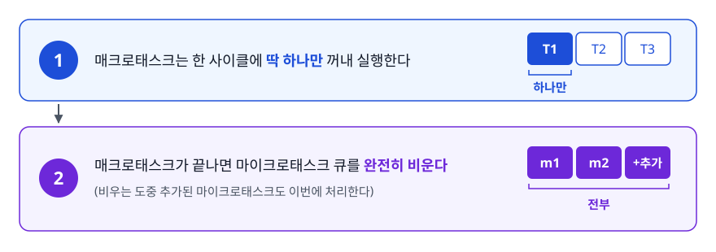
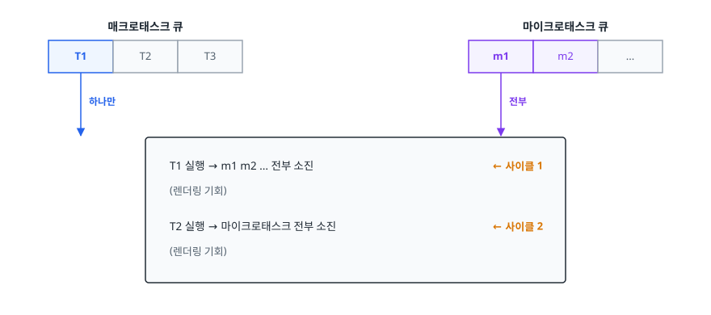
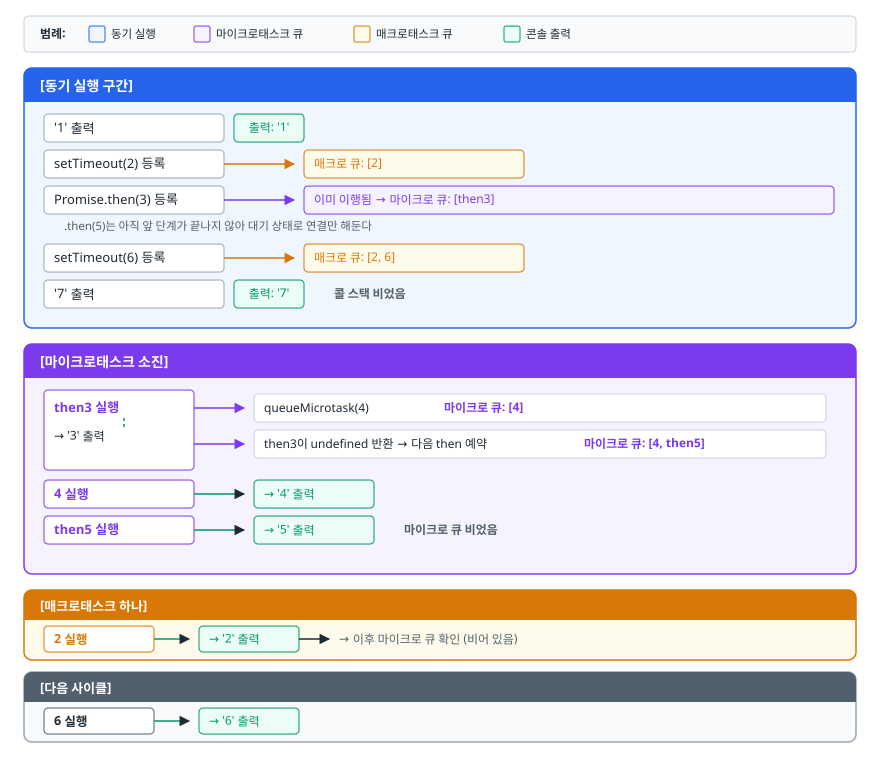
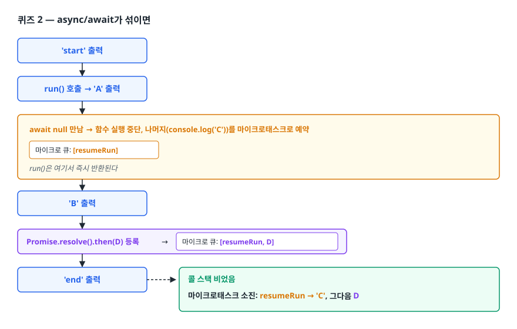
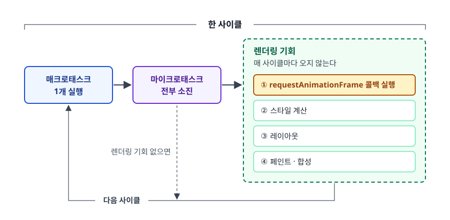
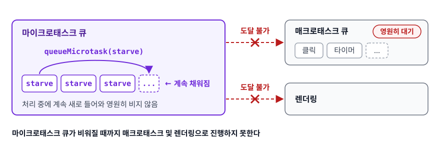

# 마이크로태스크와 매크로태스크 (Microtask & Macrotask)

> 큐가 왜 하나가 아니라 둘인가. 이 문서를 읽으면 임의의 비동기 코드 조각을 보고 출력 순서를 손으로 추적할 수 있고, "Promise가 setTimeout보다 먼저"라는 암기를 원리로 대체할 수 있습니다.

## 학습 목표

- [ ] 마이크로태스크 큐가 별도로 존재하는 이유를 설명할 수 있다
- [ ] 주요 비동기 API를 마이크로/매크로로 정확히 분류할 수 있다
- [ ] 중첩된 Promise와 타이머가 섞인 코드의 출력 순서를 단계별로 추적할 수 있다
- [ ] `requestAnimationFrame`이 태스크 큐와 어떻게 다른지 말할 수 있다
- [ ] 마이크로태스크 기아 상황을 알아보고 피할 수 있다

## 선행 지식

- [04-event-loop.md](./04-event-loop.md) - 콜 스택과 이벤트 루프의 기본 순환

---

## 1. 왜 큐가 두 개인가

Promise를 언어에 도입할 때 설계자들은 `.then()` 콜백을 언제 실행할지 정해야 했습니다. 후보는 둘이었습니다.

**후보 A — 즉시 동기 실행**

```js
// 만약 then이 즉시 실행된다면?
const p = Promise.resolve(1);
p.then((v) => console.log('then', v));
console.log('after');
// 'then 1' → 'after' 가 되어버린다
```

이러면 Promise가 이미 이행된 상태냐 아니냐에 따라 코드 실행 순서가 달라집니다. 같은 함수가 캐시 히트일 때는 동기, 미스일 때는 비동기로 동작하면 호출하는 쪽에서 순서를 예측할 수 없습니다. **비동기 API는 언제나 비동기여야 한다**는 원칙에 어긋납니다.

**후보 B — 기존 태스크 큐(setTimeout과 같은 줄)에 넣기**

```js
// 만약 then이 태스크 큐로 간다면?
element.textContent = '로딩 중';
fetchData().then(() => { element.textContent = '완료'; });
```

이러면 `.then` 콜백이 실행되기 전에 타이머 콜백이나 렌더링이 끼어들 수 있습니다. Promise 체인이 세 단계면 최악의 경우 세 프레임에 걸쳐 처리되고, 그 사이 중간 상태가 화면에 노출됩니다. 또 이미 큐에 쌓여 있던 다른 태스크 뒤로 밀리므로 응답이 느려집니다.

그래서 제3의 답이 나왔습니다. **"현재 태스크가 끝난 직후, 다음 태스크가 시작되기 전, 렌더링보다도 먼저"** 처리되는 별도의 줄. 그것이 **마이크로태스크 큐**입니다.

> **비유**: 매크로태스크는 접수 순서대로 부르는 병원 대기표, 마이크로태스크는 진료를 마친 환자에게 "나가기 전에 처방전 받고 가세요"라고 붙이는 후속 절차입니다. 다음 환자를 부르기 전에 이 절차는 반드시 끝납니다.
>
> **비유의 한계**: 실제 병원에서는 후속 절차가 무한히 늘어나지 않지만, 마이크로태스크는 **처리 도중 새로 추가된 것까지 이번에 다 처리**합니다. 이 성질이 뒤에 나올 기아 문제를 만듭니다.

---

## 2. 규칙은 두 줄이 전부다

<!-- diagram:fe-microtask-macrotask-1 -->


<!-- 위 그림이 대체한 원본 ASCII.
     내용을 고칠 때는 그림도 함께 갱신할 것.
```
┌─────────────────────────────────────────────────────────────┐
│  1. 매크로태스크는 한 사이클에 딱 하나만 꺼내 실행한다        │
│  2. 매크로태스크가 끝나면 마이크로태스크 큐를 완전히 비운다   │
│     (비우는 도중 추가된 마이크로태스크도 이번에 처리한다)     │
└─────────────────────────────────────────────────────────────┘
```
-->

그림으로 보면 이렇습니다.

<!-- diagram:fe-microtask-macrotask-2 -->


<!-- 위 그림이 대체한 원본 ASCII.
     내용을 고칠 때는 그림도 함께 갱신할 것.
```
  매크로태스크 큐        마이크로태스크 큐
  ┌───┬───┬───┐         ┌───┬───┬───┐
  │ T1│ T2│ T3│         │m1 │m2 │...│
  └─┬─┴───┴───┘         └─┬─┴───┴───┘
    │ 하나만                │ 전부
    ▼                      ▼
 ┌──────────────────────────────────────┐
 │  T1 실행 → m1 m2 ... 전부 소진        │  ← 사이클 1
 │  (렌더링 기회)                        │
 │  T2 실행 → 마이크로태스크 전부 소진   │  ← 사이클 2
 │  (렌더링 기회)                        │
 └──────────────────────────────────────┘
```
-->

"마이크로태스크가 우선순위가 높다"는 표현보다 **"마이크로태스크는 현재 태스크의 마무리 작업이다"** 라고 이해하는 편이 정확합니다. 별도 순번을 기다리는 게 아니라, 지금 하던 일에 딸린 뒷정리이기 때문에 먼저 끝나는 것입니다.

---

## 3. 무엇이 어느 큐로 가나

| API | 분류 | 비고 |
|-----|------|------|
| `setTimeout` / `setInterval` | 매크로태스크 | 지연은 최솟값 보장 |
| DOM 이벤트 콜백 (`click`, `input` 등) | 매크로태스크 | 사용자 입력 전용 큐를 두기도 한다 |
| 네트워크 응답 도착, I/O 완료 | 매크로태스크 | 이후 `.then`은 마이크로태스크 |
| `MessageChannel` / `postMessage` | 매크로태스크 | 클램핑 없는 타이머 대용으로 쓰이기도 한다 |
| `setImmediate` (Node) | 매크로태스크 | check 페이즈 |
| `Promise.then` / `.catch` / `.finally` | **마이크로태스크** | Promise가 settled된 뒤 예약 |
| `await` 이후의 코드 | **마이크로태스크** | 내부적으로 `then`과 같은 메커니즘 |
| `queueMicrotask(fn)` | **마이크로태스크** | 직접 마이크로태스크를 넣는 표준 API |
| `MutationObserver` 콜백 | **마이크로태스크** | DOM 변경을 모아 한 번에 알린다 |
| `process.nextTick` (Node) | **마이크로태스크보다 앞** | Node 전용 별도 큐, 우선순위 최상위 |
| `requestAnimationFrame` | **둘 다 아님** | 렌더링 단계에서 실행 (아래 5절) |

**표의 결론**: "Promise 계열은 마이크로, 타이머·이벤트·I/O는 매크로"가 기본 원칙이고, `rAF`와 `process.nextTick`만 별도 취급하면 됩니다.

---

## 4. 실행 순서 추적하기

### 퀴즈 1 — 마이크로태스크 도중 추가되는 마이크로태스크

```js
console.log('1');

setTimeout(() => console.log('2'), 0);

Promise.resolve()
  .then(() => {
    console.log('3');
    queueMicrotask(() => console.log('4'));
  })
  .then(() => console.log('5'));

setTimeout(() => console.log('6'), 0);

console.log('7');
```

한 줄씩 따라가 보자.

<!-- diagram:fe-microtask-macrotask-3 -->


<!-- 위 그림이 대체한 원본 ASCII.
     내용을 고칠 때는 그림도 함께 갱신할 것.
```
[동기 실행 구간]
  '1' 출력
  setTimeout(2) 등록      → 매크로 큐: [2]
  Promise.then(3) 등록    → 이미 이행됨 → 마이크로 큐: [then3]
    .then(5)는 아직 앞 단계가 끝나지 않아 대기 상태로 연결만 해둔다
  setTimeout(6) 등록      → 매크로 큐: [2, 6]
  '7' 출력
  콜 스택 비었음

[마이크로태스크 소진]
  then3 실행 → '3' 출력
             → queueMicrotask(4)  마이크로 큐: [4]
             → then3이 undefined 반환 → 다음 then 예약  마이크로 큐: [4, then5]
  4 실행     → '4' 출력
  then5 실행 → '5' 출력
  마이크로 큐 비었음

[매크로태스크 하나]
  2 실행 → '2' 출력   → 이후 마이크로 큐 확인(비어 있음)
[다음 사이클]
  6 실행 → '6' 출력
```
-->

**출력: 1 → 7 → 3 → 4 → 5 → 2 → 6**

여기서 배울 점은 `4`가 `5`보다 먼저 나온다는 것입니다. 마이크로태스크 처리 중에 추가된 `4`가 **다음 사이클로 밀리지 않고 이번 소진 과정에 합류**합니다. 반면 `2`와 `6`은 매크로태스크라 각각 다른 사이클에 실행됩니다.

### 퀴즈 2 — async/await가 섞이면

```js
async function run() {
  console.log('A');
  await null;          // await 뒤의 코드가 마이크로태스크로 예약된다
  console.log('C');
}

console.log('start');
run();
console.log('B');
Promise.resolve().then(() => console.log('D'));
console.log('end');
```

<!-- diagram:fe-microtask-macrotask-4 -->


<!-- 위 그림이 대체한 원본 ASCII.
     내용을 고칠 때는 그림도 함께 갱신할 것.
```
'start' 출력
run() 호출 → 'A' 출력
  await null 만남 → 함수 실행 중단, 나머지(console.log('C'))를 마이크로태스크로 예약
                    마이크로 큐: [resumeRun]
                    run()은 여기서 즉시 반환된다
'B' 출력
Promise.resolve().then(D) 등록 → 마이크로 큐: [resumeRun, D]
'end' 출력
콜 스택 비었음
마이크로태스크 소진: resumeRun → 'C', 그다음 D
```
-->

**출력: start → A → B → end → C → D**

핵심은 두 가지입니다.

1. **`await`를 만나기 전까지 async 함수는 동기적으로 실행됩니다.** 그래서 `'A'`가 `'B'`보다 먼저 나옵니다.
2. **`await` 뒤의 코드는 마이크로태스크 한 틱 뒤에 재개됩니다.** `await`가 스레드를 재우는 것이 아니라, 함수의 나머지를 콜백으로 등록하고 콜 스택을 비우는 것입니다.

(`await` 이후 재개까지 걸리는 마이크로태스크 틱 수는 과거 엔진에서 더 많았습니다. 현행 엔진은 네이티브 Promise에 대해 한 틱으로 최적화되어 있으므로 위 순서를 기준으로 삼으면 됩니다.)

---

## 5. 렌더링과 requestAnimationFrame

`requestAnimationFrame`을 "매크로태스크"라고 설명하는 자료가 많지만 정확하지 않습니다. rAF 콜백은 태스크 큐에서 꺼내지는 것이 아니라, **이벤트 루프의 렌더링 단계 안에서** 실행됩니다.

<!-- diagram:fe-microtask-macrotask-5 -->


<!-- 위 그림이 대체한 원본 ASCII.
     내용을 고칠 때는 그림도 함께 갱신할 것.
```
한 사이클
┌───────────────────────────────────────────────────────────┐
│ 매크로태스크 1개 실행                                      │
│         ↓                                                 │
│ 마이크로태스크 전부 소진                                   │
│         ↓                                                 │
│ ── 렌더링 기회 (매 사이클마다 오지 않는다) ──              │
│    ① requestAnimationFrame 콜백 실행                      │
│    ② 스타일 계산                                          │
│    ③ 레이아웃                                             │
│    ④ 페인트 · 합성                                        │
└───────────────────────────────────────────────────────────┘
```
-->

이 위치 때문에 rAF는 다음 성질을 가집니다.

- **화면 갱신 직전에 실행됩니다.** 여기서 DOM을 바꾸면 바로 다음 프레임에 반영되므로 중간 상태가 노출되지 않습니다.
- **화면 주사율에 맞춰 호출됩니다.** 60Hz면 초당 약 60회. `setInterval(fn, 16)`처럼 주사율과 어긋나 프레임이 밀리는 문제가 없습니다.
- **탭이 백그라운드면 호출되지 않습니다.** 보이지 않는 화면을 그리느라 배터리를 쓰지 않습니다. 애니메이션 루프에 `setInterval` 대신 rAF를 쓰는 것도 이 때문입니다.

```js
// 애니메이션은 rAF로
function animate(timestamp) {
  box.style.transform = `translateX(${(timestamp / 10) % 300}px)`;
  requestAnimationFrame(animate);
}
requestAnimationFrame(animate);
```

한편 **마이크로태스크로는 렌더링을 얻을 수 없습니다**. 마이크로태스크 큐를 비우는 동안에는 렌더링 단계로 넘어가지 않기 때문입니다.

```js
// 안티패턴 — 화면을 갱신하려고 Promise로 양보 시도
async function showProgress(items) {
  for (const item of items) {
    process(item);
    bar.style.width = `${percent(item)}%`;
    await Promise.resolve();     // 렌더링 기회가 생기지 않는다
  }
}
```

**왜 문제인가**: `await Promise.resolve()`는 마이크로태스크를 하나 만들 뿐입니다. 마이크로태스크 큐가 비워질 때까지 렌더링 단계로 못 넘어가므로, 진행률 바는 루프가 전부 끝난 뒤에 한 번만 그려집니다.

```js
// 개선 — 매크로태스크로 넘겨 사이클을 끊는다
const nextTask = () => new Promise((resolve) => setTimeout(resolve, 0));

async function showProgress(items) {
  for (const item of items) {
    process(item);
    bar.style.width = `${percent(item)}%`;
    await nextTask();            // 태스크를 끊어 렌더링 기회를 준다
  }
}
```

---

## 6. 마이크로태스크 기아

마이크로태스크 큐는 **완전히 빌 때까지** 처리됩니다. 처리 중에 계속 새 마이크로태스크를 넣으면 큐는 영원히 비지 않습니다.

```js
// 절대 실행하지 말 것 — 탭이 굳는다
function starve() {
  queueMicrotask(starve);
}
starve();
```

<!-- diagram:fe-microtask-macrotask-6 -->


<!-- 위 그림이 대체한 원본 ASCII.
     내용을 고칠 때는 그림도 함께 갱신할 것.
```
매크로태스크 큐   [클릭, 타이머, ...]   ← 영원히 대기
                        ✕ 도달 불가
마이크로태스크 큐 [starve, starve, starve, ...]  ← 계속 채워짐
렌더링                  ✕ 도달 불가
```
-->

무한 `setTimeout` 재귀는 이렇게까지 심각하지 않습니다. 매크로태스크는 한 사이클에 하나만 처리되므로 그 사이에 렌더링과 입력 처리가 끼어들 수 있습니다. CPU는 많이 쓰지만 탭이 완전히 얼지는 않습니다.

```js
// 이건 브라우저가 응답한다 (권장하진 않지만)
function loop() { setTimeout(loop, 0); }
loop();
```

실무에서 무한 재귀를 일부러 쓰는 일은 없지만, **재귀적으로 Promise를 체이닝하는 폴링 로직**에서 비슷한 상황이 만들어질 수 있습니다.

```js
// 안티패턴 — 조건이 영원히 거짓이면 마이크로태스크 루프가 된다
function waitUntil(isReady) {
  if (isReady()) return Promise.resolve();
  return Promise.resolve().then(() => waitUntil(isReady));
}
```

```js
// 개선 — 폴링 간격을 두고 매크로태스크로 양보한다
const sleep = (ms) => new Promise((r) => setTimeout(r, ms));

async function waitUntil(isReady, { timeoutMs = 5000, intervalMs = 50 } = {}) {
  const deadline = Date.now() + timeoutMs;
  while (!isReady()) {
    if (Date.now() > deadline) throw new Error('준비 대기 시간 초과');
    await sleep(intervalMs);
  }
}
```

폴링에는 **간격**과 **타임아웃**이 둘 다 있어야 한다는 점도 함께 기억하자.

---

## 7. 실무에서는

**MutationObserver**: DOM 변경 알림을 마이크로태스크로 전달합니다. 덕분에 한 태스크 안에서 노드를 100번 바꿔도 콜백은 변경 목록을 모아 한 번만 호출됩니다. "변경마다 즉시 알림"이었다면 성능이 무너졌을 것입니다. 마이크로태스크 큐가 "현재 태스크의 마무리 작업" 자리라는 성질을 정확히 활용한 사례입니다.

**상태 라이브러리의 배칭**: 여러 상태 변경을 모아 한 번만 다시 그리는 배칭은 대부분 마이크로태스크 시점에 처리를 예약하는 방식으로 구현됩니다. 같은 태스크 안의 변경들을 모두 모은 뒤 렌더링 전에 한 번에 반영할 수 있기 때문입니다.

**디버깅**: 순서가 헷갈릴 때는 코드를 눈으로 읽지 말고 `console.log`로 실제 순서를 찍어 확인하는 편이 빠릅니다. Chrome DevTools의 Performance 패널에서도 태스크 경계와 마이크로태스크 실행을 확인할 수 있습니다.

**타이머 클램핑 회피**: 4ms 최소 지연 없이 태스크를 끊고 싶을 때 `MessageChannel`을 쓰는 기법이 있습니다. 스케줄러 구현에서 볼 수 있는 패턴이지만, 애플리케이션 코드에서 직접 쓸 일은 드뭅니다.

---

## 8. 면접 포인트

> 면접에서 이 주제가 나오면 이렇게 답한다

**Q. 마이크로태스크와 매크로태스크의 차이는?**

A. 처리 시점과 처리량이 다릅니다. 이벤트 루프는 한 사이클에 매크로태스크를 하나만 실행하고, 그 직후 마이크로태스크 큐를 완전히 비웁니다. 비우는 도중 추가된 마이크로태스크도 같은 사이클에서 처리됩니다. Promise 반응과 `queueMicrotask`, `MutationObserver`가 마이크로태스크이고, 타이머·이벤트·I/O 콜백이 매크로태스크입니다.

- 꼬리 질문: "왜 Promise는 별도 큐를 쓰나요?" → 태스크 큐에 넣으면 타이머나 렌더링이 중간에 끼어들어 Promise 체인이 여러 프레임에 걸치고 중간 상태가 노출됩니다. 현재 태스크의 마무리 작업으로 처리하려는 설계입니다.

**Q. 다음 코드의 출력 순서는? (`setTimeout` 0, `Promise.then`, 동기 로그가 섞인 코드)**

A. 동기 코드가 전부 먼저 실행되고, 콜 스택이 빈 뒤 마이크로태스크 큐가 전부 처리되며, 마지막에 매크로태스크가 하나씩 처리됩니다. 따라서 동기 → Promise → setTimeout 순입니다. 체인이 여러 단계면 각 단계가 마이크로태스크 하나씩을 소비하지만, 모두 같은 소진 과정에서 처리되므로 여전히 타이머보다 먼저입니다.

- 꼬리 질문: "`.then` 안에서 `queueMicrotask`를 부르면 언제 실행되나요?" → 같은 소진 과정 안에서, 이미 큐에 있던 항목 뒤에 실행됩니다.

**Q. `requestAnimationFrame`은 어느 큐에 속하나요?**

A. 엄밀히는 어느 태스크 큐에도 속하지 않습니다. 마이크로태스크를 모두 비운 뒤 진행되는 렌더링 단계의 첫 순서로 실행됩니다. 그래서 화면 갱신 직전에 DOM을 수정할 수 있고, 주사율에 맞춰 호출되며, 백그라운드 탭에서는 호출되지 않습니다.

- 꼬리 질문: "애니메이션에 `setInterval` 대신 rAF를 쓰는 이유는?" → 주사율과 동기화되어 프레임 드롭과 티어링이 줄고, 보이지 않을 때 자동으로 멈춰 자원을 아낍니다.

**Q. 마이크로태스크 기아가 무엇인가요?**

A. 마이크로태스크 처리 중 계속 새 마이크로태스크를 추가하면 큐가 비지 않아 다음 매크로태스크와 렌더링 단계로 넘어가지 못하는 상황입니다. 페이지가 완전히 멈추며 입력도 받지 못합니다. 반복 작업 사이에 양보가 필요하다면 `setTimeout` 같은 매크로태스크로 사이클을 끊어야 합니다.

---

## 자주 하는 실수

| 실수 | 왜 틀렸나 | 올바른 이해 |
|------|----------|-----------|
| "마이크로태스크도 하나씩 처리된다" | 큐가 빌 때까지 전부 처리 | 처리 중 추가된 것도 같은 사이클에 처리 |
| "`requestAnimationFrame`은 매크로태스크" | 태스크 큐 소속이 아니다 | 렌더링 단계에서 실행된다 |
| "`await Promise.resolve()`로 렌더링을 양보할 수 있다" | 마이크로태스크는 렌더링 전에 다 처리 | 양보하려면 매크로태스크로 넘겨야 한다 |
| "`setTimeout(fn, 0)`이 `Promise.then`보다 빠를 수도 있다" | 규칙상 불가능 | 마이크로태스크가 항상 먼저 소진된다 |
| "Node의 `process.nextTick`은 마이크로태스크" | 별도 큐다 | Promise 마이크로태스크보다 먼저 처리된다 |
| "체인이 길면 중간에 타이머가 낀다" | 체인 전체가 한 소진 과정 | 모든 단계가 타이머보다 먼저 끝난다 |

---

## 한 줄 정리

이벤트 루프는 매크로태스크를 하나 실행할 때마다 마이크로태스크 큐를 완전히 비우고 그다음에야 렌더링 기회를 주므로, Promise 계열은 항상 타이머보다 먼저 실행되고 렌더링을 양보하려면 반드시 매크로태스크로 사이클을 끊어야 합니다.

---

## 연관 개념

- [04-event-loop.md](./04-event-loop.md) - 큐와 콜 스택, 이벤트 루프의 전체 구조
- [06-promise-async-await.md](./06-promise-async-await.md) - 마이크로태스크를 만들어내는 Promise의 동작
- [03-closure.md](./03-closure.md) - 나중에 실행되는 콜백이 어떤 값을 붙잡는지
- [qna-javascript.md](./qna-javascript.md) - 실행 순서 예측 문제 모음
- [../browser-fundamentals/qna-browser.md](../browser-fundamentals/qna-browser.md) - 렌더링 파이프라인 상세
