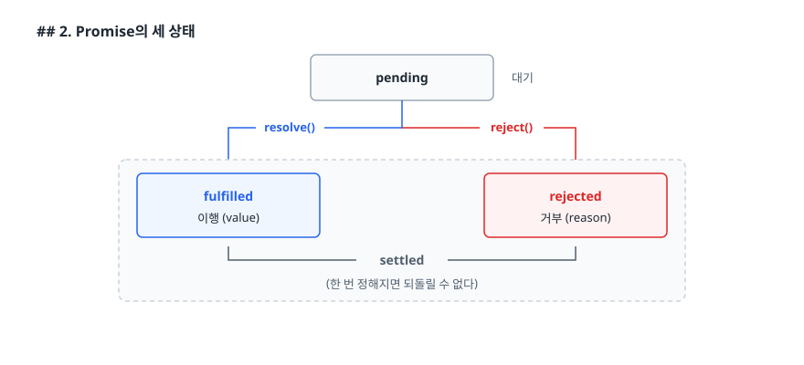
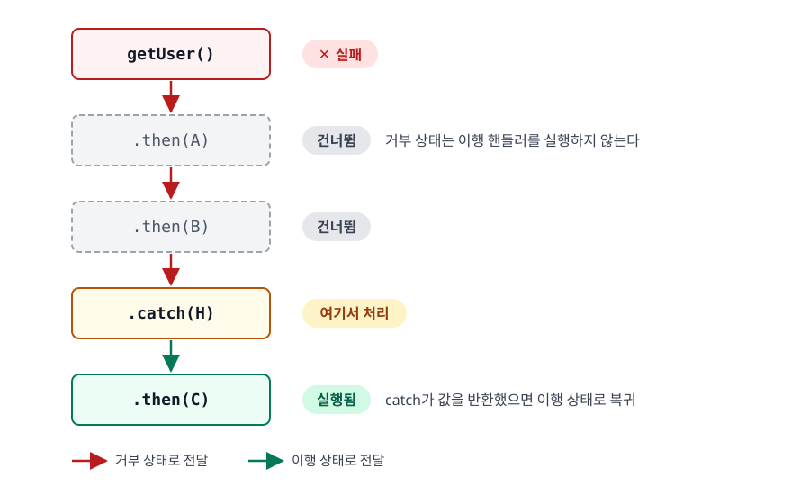
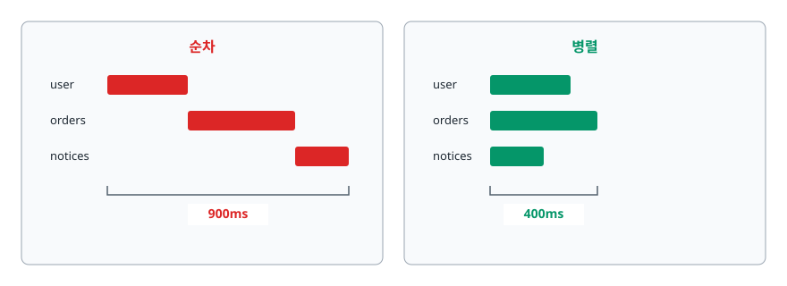

# Promise와 async/await

> 콜백으로 시작해 Promise를 거쳐 `async/await`에 도달한 비동기 코드의 진화. 이 문서를 읽으면 각 단계가 어떤 문제를 풀었는지 말할 수 있고, 병렬로 돌아야 할 요청을 순차로 만들어버리는 실수를 잡아낼 수 있습니다.

## 학습 목표

- [ ] 콜백의 한계 세 가지와 Promise가 그것을 어떻게 해결했는지 설명할 수 있다
- [ ] Promise의 세 상태와 체이닝, 에러 전파 규칙을 설명할 수 있다
- [ ] `all` / `allSettled` / `race` / `any`를 상황에 맞게 고를 수 있다
- [ ] `async/await`에서 에러를 놓치는 대표 패턴을 알아보고 고칠 수 있다
- [ ] 독립적인 비동기 작업을 병렬로 실행하도록 코드를 바꿀 수 있다

## 선행 지식

- [04-event-loop.md](./04-event-loop.md) - 비동기 콜백이 언제 실행되는지
- [05-microtask-macrotask.md](./05-microtask-macrotask.md) - `.then`이 마이크로태스크로 예약되는 이유

---

## 1. 왜 필요한가 — 콜백의 세 가지 한계

비동기 결과를 받는 가장 원시적인 방법은 콜백을 넘기는 것입니다.

```js
getUser(userId, (user) => {
  getPosts(user.id, (posts) => {
    getComments(posts[0].id, (comments) => {
      render(comments);
    });
  });
});
```

**한계 1 — 중첩이 깊어집니다.** 단계가 늘 때마다 들여쓰기가 한 칸씩 깊어집니다. 흔히 콜백 지옥이라 부르지만, 진짜 문제는 보기 흉한 게 아니라 **중간에 조건 분기나 반복을 넣기 어렵다**는 점입니다.

**한계 2 — 에러 처리가 흩어집니다.**

```js
try {
  getUser(userId, (user) => { throw new Error('실패'); }); // 바깥 try가 못 잡는다
} catch (e) { console.log('여기 안 옴'); }
```

콜백은 나중에 **다른 콜 스택에서** 실행되므로, 등록 시점의 `try/catch`와는 아무 관계가 없습니다. 그래서 콜백마다 `(err, data)` 형태로 에러를 직접 나르고 매번 `if (err)`를 반복해야 했습니다.

**한계 3 — 제어 흐름을 남에게 맡깁니다.** 콜백을 넘기는 순간 "언제, 몇 번 호출할지"는 넘겨받은 쪽이 정합니다. 라이브러리가 콜백을 두 번 호출하거나 아예 호출하지 않아도 막을 방법이 없습니다.

Promise는 이 셋을 한 번에 해결합니다. **결과를 담을 객체를 즉시 돌려주고, 그 객체를 받은 쪽이 후속 처리를 결정합니다.** 상태 전이는 단 한 번만 허용되므로 "두 번 호출" 문제도 구조적으로 막힙니다.

```js
getUser(userId)
  .then((user) => getPosts(user.id))
  .then((posts) => getComments(posts[0].id))
  .then(render)
  .catch(handleError);        // 어느 단계에서 실패하든 여기로
```

`async/await`는 여기서 한 걸음 더 나가, 이 체인을 **위에서 아래로 읽히는 코드**로 바꿉니다.

```js
async function show(userId) {
  try {
    const user = await getUser(userId);
    const posts = await getPosts(user.id);
    render(await getComments(posts[0].id));
  } catch (e) { handleError(e); }
}
```

> **비유**: Promise는 음식점의 진동벨입니다. 주문하면 음식 대신 벨을 받고(즉시 반환), 준비되면 벨이 울린다(상태 전이). 벨을 들고 있으면 자리로 돌아가 다른 일을 할 수 있습니다.
>
> **비유의 한계**: 진동벨은 받은 사람만 쓸 수 있지만, 하나의 Promise에는 `.then`을 여러 개 붙일 수 있고 이미 완료된 뒤에 붙여도 결과를 받습니다.

---

## 2. Promise의 세 상태

<!-- diagram:fe-promise-async-await-1 -->


<!-- 위 그림이 대체한 원본 ASCII.
     내용을 고칠 때는 그림도 함께 갱신할 것.
```
                  ┌──────────────┐
                  │   pending    │  대기
                  └──────┬───────┘
             resolve()   │   reject()
          ┌──────────────┴──────────────┐
          ▼                             ▼
  ┌──────────────┐              ┌──────────────┐
  │  fulfilled   │              │   rejected   │
  │  이행 (value)│              │  거부 (reason)│
  └──────────────┘              └──────────────┘
          └──────────── settled ────────────┘
              (한 번 정해지면 되돌릴 수 없다)
```
-->

핵심은 **비가역성**입니다. 한 번 `fulfilled`가 되면 다시 `pending`이나 `rejected`로 갈 수 없습니다. 이 성질 덕분에 "이미 끝난 Promise"에 나중에 `.then`을 붙여도 안전하게 결과를 받을 수 있고, 여러 곳에서 같은 Promise를 구독해도 값이 달라지지 않습니다.

```js
const p = new Promise((resolve, reject) => {
  resolve('첫 번째');
  resolve('두 번째');      // 무시된다
  reject(new Error('x'));  // 무시된다
});
p.then(console.log);       // '첫 번째'
```

---

## 3. 체이닝과 에러 전파

### then은 새 Promise를 반환한다

체이닝이 가능한 이유는 `.then()`이 **항상 새로운 Promise를 반환**하기 때문입니다. 콜백이 무엇을 반환하느냐에 따라 그 Promise의 결과가 정해집니다.

```js
Promise.resolve(1)
  .then((v) => v + 1)                       // 값 반환 → 그 값으로 이행
  .then((v) => Promise.resolve(v * 10))     // Promise 반환 → 그것이 풀릴 때까지 기다림
  .then((v) => { console.log(v); })         // 20
  .then((v) => { console.log(v); });         // undefined (앞 콜백이 아무것도 반환 안 함)
```

**반환문을 빼먹는 것이 체이닝의 가장 흔한 버그**입니다. `then` 안에서 비동기 작업을 시작해놓고 반환하지 않으면, 다음 `then`은 그 작업을 기다리지 않고 즉시 실행됩니다.

```js
getUser(id)
  .then((user) => { getPosts(user.id); })  // 안티패턴: 반환하지 않음
  .then(() => console.log('완료'));         // getPosts가 끝나기 전에 출력된다

getUser(id)
  .then((user) => getPosts(user.id))       // 개선: 반환하면 다음 then이 기다린다
  .then(() => console.log('완료'));
```

### 에러는 아래로 흐른다

<!-- diagram:fe-promise-async-await-2 -->


<!-- 위 그림이 대체한 원본 ASCII.
     내용을 고칠 때는 그림도 함께 갱신할 것.
```
 getUser() ──✕ 실패
     ▼
 .then(A)   ← 건너뜀 (거부 상태는 이행 핸들러를 실행하지 않는다)
     ▼
 .then(B)   ← 건너뜀
     ▼
 .catch(H)  ← 여기서 처리
     ▼
 .then(C)   ← 실행됨 (catch가 값을 반환했으면 이행 상태로 복귀)
```
-->

```js
Promise.reject(new Error('네트워크 오류'))
  .then(() => console.log('A'))        // 건너뜀
  .catch((e) => { console.log('처리:', e.message); return '복구값'; })
  .then((v) => console.log('이어서:', v)); // '이어서: 복구값'
```

`catch`가 값을 반환하면 체인은 **정상 흐름으로 복귀**합니다. 이걸 모르면 "에러를 잡았는데 왜 뒤 코드가 계속 실행되지"에서 막힙니다.

### then(성공, 실패) vs then(성공).catch(실패)

둘은 같지 않습니다.

```js
// 2인자 형태 — 성공 콜백이 던진 에러는 같은 then의 실패 콜백이 못 잡는다
p.then((v) => { throw new Error('가공 실패'); }, (e) => console.log('여기 안 옴'));

// catch 형태 — 앞 단계와 성공 콜백 양쪽의 에러를 모두 잡는다
p.then((v) => { throw new Error('가공 실패'); })
 .catch((e) => console.log('잡힘:', e.message));
```

**특별한 이유가 없으면 `.catch()`를 씁니다.** 2인자 형태는 "이전 단계의 실패와 이번 단계의 실패를 구분해서 처리하고 싶을 때"만 의미가 있습니다.

### finally

```js
setLoading(true);
fetchData().then(render).catch(showError).finally(() => setLoading(false));
```

`finally`의 콜백은 인자를 받지 않고, 값을 반환해도 체인의 값을 바꾸지 않습니다. 성공/실패와 무관하게 실행되면서 값을 그대로 통과시키므로 정리 작업에 적합합니다.

---

## 4. Promise 조합기 — 무엇을 언제 쓰나

| 메서드 | 이행 조건 | 거부 조건 | 언제 쓰나 |
|--------|----------|----------|----------|
| `Promise.all` | **전부** 이행 | **하나라도** 거부되면 즉시 | 전부 성공해야 화면을 그릴 수 있을 때 |
| `Promise.allSettled` | 항상 이행 | 없음 | 부분 실패를 허용하고 개별 결과를 보고할 때 |
| `Promise.race` | 가장 먼저 **settled** 된 것이 이행일 때 | 가장 먼저 settled 된 것이 거부일 때 | 타임아웃 경쟁, 가장 빠른 응답 채택 |
| `Promise.any` | 가장 먼저 **이행** | 전부 거부되면 `AggregateError` | 여러 미러 중 하나만 성공하면 되는 경우 |

**표의 결론**: "전부 필요하면 `all`, 실패해도 결과가 필요하면 `allSettled`, 하나면 충분하면 `any`, 시간 경쟁이면 `race`."

```js
// all — 대시보드에 셋 다 필요
const [user, orders, coupons] = await Promise.all([fetchUser(), fetchOrders(), fetchCoupons()]);

// allSettled — 위젯 하나가 실패해도 나머지는 보여준다
const results = await Promise.allSettled([fetchA(), fetchB(), fetchC()]);
results.forEach((r, i) =>
  r.status === 'fulfilled' ? render(i, r.value) : showPlaceholder(i, r.reason));

// race — 타임아웃 붙이기
const timeout = (ms) =>
  new Promise((_, reject) => setTimeout(() => reject(new Error('시간 초과')), ms));
const data = await Promise.race([fetchSlow(), timeout(3000)]);

// any — 여러 CDN 중 먼저 성공하는 것
const asset = await Promise.any([fetch(cdn1), fetch(cdn2), fetch(cdn3)]);
```

### all이 실패해도 나머지는 계속 돈다

자주 놓치는 지점입니다. `Promise.all`은 하나가 거부되는 즉시 거부되지만, **나머지 작업을 취소하지는 않습니다.** 이미 시작된 네트워크 요청은 그대로 진행되고 응답도 도착합니다.

```js
// 진짜로 중단하고 싶다면 AbortController를 함께 쓴다
const c = new AbortController();
const req = (url) => fetch(url, { signal: c.signal });
try {
  await Promise.all([req('/a'), req('/b')]);
} catch (e) {
  c.abort();   // 남은 요청을 실제로 중단
  throw e;
}
```

---

## 5. async/await 정확히 이해하기

`async` 함수에 대해 기억할 것은 두 가지입니다.

```js
async function f() { return 1; }
f() instanceof Promise;                   // true — 반환값은 항상 Promise로 감싸진다
async function g() { throw new Error('x'); }
g().catch((e) => console.log(e.message)); // 'x' — throw는 거부로 변환된다
```

그리고 `await`는 **스레드를 재우지 않습니다.** 해당 함수의 실행을 중단하고 나머지를 마이크로태스크로 예약한 뒤 콜 스택을 비웁니다. 그 사이 다른 코드가 실행됩니다.

### try/catch로 동기처럼

```js
async function load(id) {
  try {
    const res = await fetch(`/api/items/${id}`);
    if (!res.ok) throw new Error(`HTTP ${res.status}`);   // 이 줄이 없으면 놓친다
    return await res.json();
  } catch (e) {
    if (e.name === 'AbortError') return null;
    throw new Error(`아이템 로드 실패: ${e.message}`, { cause: e });
  } finally { setLoading(false); }
}
```

`fetch`는 **HTTP 에러 상태(404, 500)를 거부로 만들지 않습니다.** 네트워크 자체가 실패했을 때만 거부됩니다. 그래서 `res.ok` 검사를 직접 넣어야 하며, 이걸 빼먹은 코드는 500 응답 본문을 JSON으로 파싱하려다 엉뚱한 곳에서 터집니다.

### return await 대 return

```js
async function bad() {
  try { return riskyAsync(); }          // 거부가 catch를 건너뛰고 호출자에게 전달된다
  catch (e) { return '여기 안 옴'; }
}

async function good() {
  try { return await riskyAsync(); }    // 거부를 기다렸다가 catch로 넘어간다
  catch (e) { return '복구값'; }
}
```

`try`(그리고 `using` 같은 정리 구문) 안에서 Promise를 반환할 때 이 차이가 결정적입니다. `try` 밖에서는 두 형태의 동작이 사실상 같고, 오히려 `return await` 쪽이 스택 트레이스에 해당 함수 프레임을 남겨 디버깅에 유리합니다. 예전에는 `return await`를 불필요한 낭비로 봐서 ESLint `no-return-await` 규칙이 이를 금지했지만, 이 규칙은 현재 비권장으로 분류되어 있습니다.

---

## 6. 병렬로 돌아야 할 일을 순차로 만드는 실수

### 안티패턴 1 — 독립적인 요청을 하나씩 await

```js
// 안티패턴
async function loadDashboard() {
  const user = await fetchUser();       // 300ms
  const orders = await fetchOrders();   // 400ms  ← user를 쓰지 않는데 기다린다
  const notices = await fetchNotices();  // 200ms
  return { user, orders, notices };      // 총 900ms
}
```

**왜 문제인가**: `fetchOrders`는 `user`를 필요로 하지 않습니다. 그런데 `await` 때문에 첫 요청이 끝나기 전에는 시작조차 하지 않습니다. 서버는 놀고 있는데 시간만 흐릅니다.

```js
// 개선 — 총 400ms (가장 느린 것 기준)
async function loadDashboard() {
  const [user, orders, notices] = await Promise.all([
    fetchUser(), fetchOrders(), fetchNotices(),
  ]);
  return { user, orders, notices };
}
```

<!-- diagram:fe-promise-async-await-3 -->


<!-- 위 그림이 대체한 원본 ASCII.
     내용을 고칠 때는 그림도 함께 갱신할 것.
```
순차                                          병렬
user    ████████                              user    ████████
orders          ██████████                    orders  ██████████
notices                   ████                notices ████
        └──────── 900ms ────────┘             └─ 400ms ─┘
```
-->

**판단 기준**: 뒤 작업이 앞 작업의 결과를 인자로 쓰는가? 쓰지 않으면 병렬로 묶어야 합니다.

### 안티패턴 2 — forEach + async

```js
// 안티패턴
async function saveAll(items) {
  items.forEach(async (item) => { await save(item); });
  console.log('전부 저장됨');   // 실제로는 하나도 안 끝났을 수 있다
}
```

**왜 문제인가**: `forEach`는 콜백의 반환값을 무시합니다. `async` 콜백이 반환하는 Promise는 버려지므로 `forEach`는 즉시 끝나고, 저장이 끝나기 전에 다음 줄이 실행됩니다. 게다가 중간에 실패한 Promise는 아무도 잡지 않아 unhandled rejection이 됩니다.

```js
// 개선 1 — 전부 병렬로 기다린다
async function saveAll(items) {
  await Promise.all(items.map((item) => save(item)));
  console.log('전부 저장됨');
}

// 개선 2 — 순서가 중요하거나 서버 부하를 조절해야 하면 for...of
async function saveInOrder(items) {
  for (const item of items) await save(item);
  console.log('순서대로 저장됨');
}
```

`for...of` + `await`는 "느린 코드"가 아니라 **의도적으로 순차 실행이 필요할 때 쓰는 도구**입니다. 이전 결과에 의존하거나, 외부 API의 요청 제한을 지켜야 할 때가 그렇습니다.

### 안티패턴 3 — 수천 건을 한 번에 Promise.all

```js
// 안티패턴
await Promise.all(tenThousandIds.map((id) => fetchDetail(id)));
```

**왜 문제인가**: 만 건의 요청이 동시에 출발합니다. 브라우저 커넥션 한도에 걸려 대기열이 생기고, 서버는 요청 폭주로 429나 타임아웃을 반환합니다. 병렬화가 항상 선인 것은 아닙니다.

```js
// 개선 — 동시 실행 개수를 제한한다 (러너 limit개가 같은 목록을 나눠 소비)
async function mapWithLimit(items, limit, worker) {
  const results = new Array(items.length);
  let cursor = 0;
  async function runner() {
    while (cursor < items.length) {
      const i = cursor++;
      results[i] = await worker(items[i]);
    }
  }
  await Promise.all(Array.from({ length: limit }, runner));
  return results;
}

const details = await mapWithLimit(tenThousandIds, 5, fetchDetail);
```

### 안티패턴 4 — 이미 Promise인 것을 다시 감싸기

```js
// 안티패턴
function load() {
  return new Promise((resolve, reject) => {
    fetch('/api').then((res) => resolve(res)).catch((e) => reject(e));
  });
}

// 개선
function load() {
  return fetch('/api');
}
```

**왜 문제인가**: 아무것도 추가하지 않으면서 코드만 늘립니다. 더 나쁜 건 래퍼 안에서 던진 동기 에러나 누락된 `reject` 경로가 조용히 사라질 수 있다는 점입니다. `new Promise`는 **콜백 기반의 옛 API를 Promise로 감쌀 때만** 씁니다. `const delay = (ms) => new Promise((r) => setTimeout(r, ms));`가 정당한 사용 예입니다.

---

## 7. 실무에서는

**처리되지 않은 거부**: `.catch`가 붙지 않은 거부는 브라우저에서 `unhandledrejection` 이벤트로 보고되고 콘솔에 경고가 남습니다. Node.js는 15 버전부터 기본적으로 프로세스를 종료시킵니다. 서버 코드에서 에러를 흘리면 서비스 전체가 죽을 수 있으므로 진입점마다 에러 경계를 둡니다.

**요청 취소**: 사용자가 검색어를 빠르게 바꾸면 이전 요청의 응답이 나중에 도착해 화면을 덮어쓸 수 있습니다. `AbortController`로 이전 요청을 취소하고, `AbortError`는 정상 흐름으로 처리합니다.

**최상위 await**: ES Module에서는 함수 밖에서도 `await`를 쓸 수 있습니다. 다만 그 모듈을 import하는 쪽의 평가가 그만큼 지연되므로, 초기화 경로에서 남용하면 첫 화면이 늦어집니다. 에러를 다시 던질 때 `new Error(msg, { cause: 원본에러 })`로 원인을 붙여두면 로그에서 근본 원인을 추적하기 쉽습니다.

---

## 8. 면접 포인트

> 면접에서 이 주제가 나오면 이렇게 답한다

**Q. 콜백 대신 Promise를 쓰는 이유는?**

A. 첫째, 중첩 대신 체이닝으로 흐름이 평평해집니다. 둘째, 체인 어디서 실패하든 `.catch` 하나로 모을 수 있어 에러 처리가 일원화됩니다. 셋째, 상태 전이가 한 번뿐이라 콜백이 두 번 호출되거나 아예 호출되지 않는 문제를 구조적으로 막습니다.

- 꼬리 질문: "async/await가 Promise를 대체하나요?" → 아닙니다. `await`는 Promise를 소비하는 문법이고, 여러 작업을 조합할 때는 여전히 `Promise.all` 같은 조합기가 필요합니다.

**Q. `Promise.all`과 `Promise.allSettled`는 언제 각각 쓰나요?**

A. 모든 요청이 성공해야 의미가 있는 경우, 예를 들어 세 API의 데이터를 합쳐 한 화면을 그릴 때는 `all`을 씁니다. 하나라도 실패하면 즉시 거부되어 실패를 빠르게 알 수 있습니다. 반대로 위젯 여러 개를 각각 그리는 화면처럼 부분 실패를 허용해야 하면 `allSettled`로 각 결과의 성공 여부를 개별 처리합니다.

- 꼬리 질문: "`all`이 실패하면 나머지 요청은 취소되나요?" → 취소되지 않습니다. 이미 시작된 작업은 계속 진행되므로, 실제 중단이 필요하면 `AbortController` 같은 취소 수단을 따로 써야 합니다.

**Q. 다음 코드의 문제를 지적하고 고쳐보세요. (독립적인 세 요청을 각각 await)**

A. 세 요청이 서로의 결과를 사용하지 않는데도 `await` 때문에 순차 실행되어 응답 시간이 합산됩니다. `Promise.all`로 묶으면 동시에 시작되어 가장 오래 걸리는 요청 시간만 소요됩니다. 판단 기준은 "뒤 작업이 앞 작업의 결과를 인자로 쓰는가"이고, 쓰지 않으면 병렬로 묶어야 합니다.

- 꼬리 질문: "수천 개를 `Promise.all`로 묶으면요?" → 동시 요청 폭주로 커넥션 한도와 서버 제한에 걸립니다. 동시 실행 개수를 제한하는 워커 패턴을 써야 합니다.

**Q. `async` 함수에서 에러를 놓치는 대표적인 경우는?**

A. 세 가지가 흔합니다. `forEach`에 `async` 콜백을 넘겨 반환된 Promise가 버려지는 경우, `try` 블록 안에서 `await` 없이 Promise를 반환해 `catch`를 건너뛰는 경우, 그리고 `fetch`가 HTTP 에러 상태를 거부로 만들지 않는다는 걸 몰라 `res.ok` 검사를 빠뜨리는 경우입니다.

---

## 자주 하는 실수

| 실수 | 왜 틀렸나 | 올바른 이해 |
|------|----------|-----------|
| "`await`는 스레드를 멈춘다" | 스택을 비우고 다른 일이 진행된다 | 함수 실행만 중단하고 나머지를 마이크로태스크로 예약 |
| "`fetch`는 404면 catch로 간다" | 네트워크 실패만 거부 | `res.ok`를 직접 검사해야 한다 |
| "`forEach`에 async를 쓰면 순서대로 기다린다" | 반환 Promise가 버려진다 | `Promise.all(map)` 또는 `for...of` |
| "`Promise.all`이 실패하면 나머지가 취소된다" | 거부만 빠를 뿐 | 작업은 계속 진행, 취소하려면 `AbortController` |
| "`.then(성공, 실패)`는 `.catch`와 같다" | 같은 then의 성공 콜백 에러는 못 잡는다 | 대부분의 경우 `.catch`가 옳다 |
| "`catch` 뒤 체인은 끊긴다" | 값을 반환하면 이행 상태로 복귀 | 끊으려면 catch 안에서 다시 던져야 한다 |

---

## 한 줄 정리

Promise는 비가역적인 세 상태와 체이닝으로 콜백의 중첩·에러 분산·제어권 상실을 해결했고, `async/await`는 그 체인을 동기처럼 읽히게 만들었지만 `await`를 줄줄이 쓰면 독립 작업까지 순차 실행되므로 "결과를 쓰지 않는 작업은 `Promise.all`로 묶는다"는 기준을 항상 적용해야 합니다.

---

## 연관 개념

- [05-microtask-macrotask.md](./05-microtask-macrotask.md) - `.then` 콜백이 예약되는 마이크로태스크 큐
- [04-event-loop.md](./04-event-loop.md) - `await` 중 콜 스택이 비는 이유
- [qna-javascript.md](./qna-javascript.md) - Promise, async/await, 에러 처리 면접 질문 모음
- [../react-architecture/qna-react.md](../react-architecture/qna-react.md) - 컴포넌트에서 비동기 데이터를 다루는 패턴
- [../../05-api-design/qna-api-design.md](../../05-api-design/qna-api-design.md) - API 호출 실패와 상태 코드 처리
