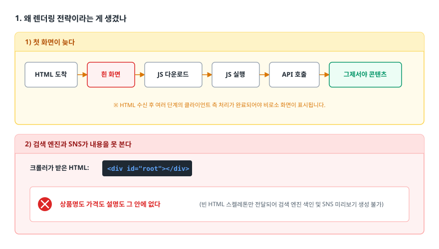
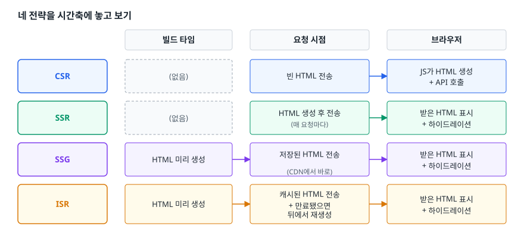
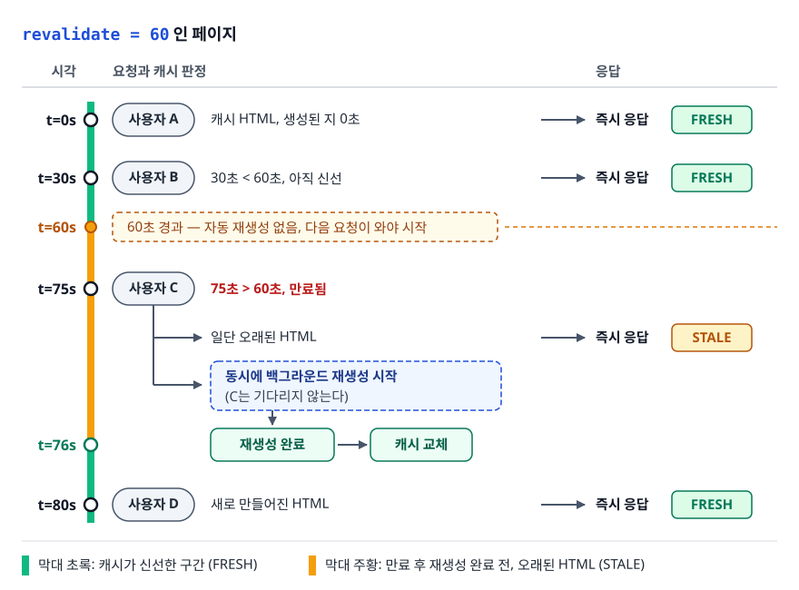
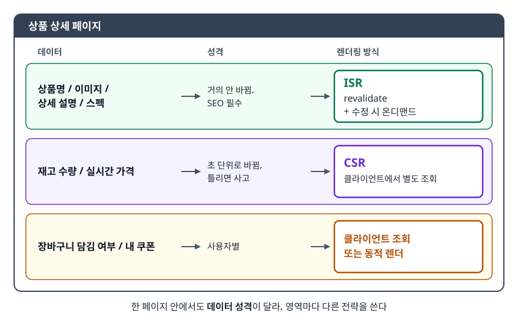

# 렌더링 전략 (CSR, SSR, SSG, ISR)

> HTML을 **누가, 언제** 만드느냐가 출발점입니다. 그 답에 따라 페이지의 속도·검색 노출·서버 비용이 어떻게 갈리는지 설명하고, 주어진 페이지에 맞는 전략을 근거와 함께 고르는 데까지 다룹니다.

## 학습 목표

- [ ] 네 전략의 차이를 "렌더링 시점"과 "HTML 생성 위치"로 구분해 설명할 수 있다
- [ ] TTFB / FCP / SEO / 서버 비용 네 축으로 전략을 비교할 수 있다
- [ ] ISR의 stale-while-revalidate 동작을 순서대로 설명할 수 있다
- [ ] 대시보드·블로그·커머스 상품 페이지에 각각 어떤 전략이 맞는지 이유와 함께 고를 수 있다
- [ ] Next.js App Router에서 각 전략을 코드로 설정할 수 있다

## 선행 지식

- 없음 — 이 문서부터 시작해도 됩니다. 다만 React 컴포넌트가 무엇인지는 안다고 가정합니다.

---

## 1. 왜 렌더링 전략이라는 게 생겼나

웹 초창기에는 선택지가 없었습니다. 브라우저가 URL을 요청하면 서버가 HTML을 만들어 보내고, 브라우저는 그걸 그리고 끝이었습니다. 링크를 누르면 페이지 전체가 하얗게 깜빡이며 다시 로드됐습니다.

이 깜빡임을 없애려고 나온 게 SPA(Single Page Application)입니다. 서버는 거의 빈 HTML 한 장만 주고, JavaScript가 브라우저 안에서 화면을 그립니다. 전환이 부드러워지고 서버는 데이터만 주면 되니 편했습니다. 대신 두 가지를 잃었습니다.

<!-- diagram:fe-csr-ssr-ssg-isr-1 -->


<!-- 위 그림이 대체한 원본 ASCII.
     내용을 고칠 때는 그림도 함께 갱신할 것.
```
1) 첫 화면이 늦다
   HTML 도착 → 흰 화면 → JS 다운로드 → JS 실행 → API 호출 → 그제서야 콘텐츠

2) 검색 엔진과 SNS가 내용을 못 본다
   크롤러가 받은 HTML: <div id="root"></div>
   상품명도 가격도 설명도 그 안에 없다
```
-->

그래서 "다시 서버에서 HTML을 만들자"는 흐름이 돌아왔습니다. 다만 옛날처럼 전부 서버에서 만드는 게 아니라, **페이지 성격에 따라 만드는 시점과 장소를 골라 쓰자**는 게 지금의 렌더링 전략입니다.

> **비유** — 음식점에 빗대면 CSR은 밀키트 배송(재료와 조리법만 보내고 손님이 집에서 조리), SSR은 주문받고 그 자리에서 조리, SSG는 아침에 미리 만들어 진열대에 올려둔 도시락, ISR은 그 도시락을 정해진 주기마다 새로 만들어 교체하는 것입니다.
>
> **비유의 한계** — 이 비유가 말해 주는 건 "누가 언제 조리하나"뿐입니다. 하지만 실제로는 조리된 음식(HTML)을 받은 뒤에도 브라우저에서 JavaScript를 다시 실행해 이벤트를 붙이는 하이드레이션이 남아 있습니다. → [02-hydration.md](./02-hydration.md)

---

## 2. 비교의 축이 되는 네 지표

전략을 고르려면 먼저 무엇을 재는지 알아야 합니다.

| 지표 | 정의 | 무엇에 민감한가 |
|------|------|----------------|
| **TTFB** (Time To First Byte) | 요청 후 응답의 첫 바이트가 도착하기까지의 시간 | 서버가 응답 전에 하는 일의 양 |
| **FCP** (First Contentful Paint) | 텍스트나 이미지가 화면에 처음 그려진 시점 | HTML에 실제 콘텐츠가 들어 있는지 |
| **SEO / 공유 미리보기** | 크롤러가 받은 HTML에 콘텐츠와 메타 태그가 있는지 | HTML 생성 위치 |
| **서버 비용** | 요청 한 건당 서버가 쓰는 CPU·메모리 시간 | 요청마다 렌더링하는지, 캐시를 재사용하는지 |

두 가지만 덧붙입니다. **LCP**(Largest Contentful Paint)는 가장 큰 콘텐츠 요소가 그려진 시점으로 Core Web Vitals에 포함되며, 체감에 더 가까워 실무 목표치로 자주 씁니다. **TTI**(Time To Interactive)는 "이제 클릭이 먹힌다"는 시점인데 측정이 불안정해 Lighthouse 10에서 성능 점수 산정 지표에서 빠졌습니다. 지금은 상호작용 응답성을 랩 환경에서는 TBT(Total Blocking Time)로, 실사용자 데이터로는 INP(Interaction to Next Paint)로 봅니다. 다만 "보이는 시점과 눌리는 시점"을 나눠 설명하기에는 TTI가 편해서 이 문서에서도 개념어로 씁니다.

핵심은 **TTFB와 FCP가 서로 당기는 관계**입니다. 서버에서 HTML을 완성해 보내면 FCP는 빨라지지만, 그만큼 첫 바이트가 늦어져 TTFB는 나빠집니다. 어느 쪽을 희생할지가 곧 전략 선택입니다.

---

## 3. 네 전략을 시간축에 놓고 보기

<!-- diagram:fe-csr-ssr-ssg-isr-2 -->


<!-- 위 그림이 대체한 원본 ASCII.
     내용을 고칠 때는 그림도 함께 갱신할 것.
```
                 빌드 타임          요청 시점              브라우저
                 ─────────          ─────────              ─────────
  CSR            (없음)             빈 HTML 전송      →    JS가 HTML 생성
                                                           + API 호출
  SSR            (없음)             HTML 생성 후 전송  →   받은 HTML 표시
                                    (매 요청마다)           + 하이드레이션
  SSG            HTML 미리 생성  →  저장된 HTML 전송   →   받은 HTML 표시
                                    (CDN에서 바로)          + 하이드레이션
  ISR            HTML 미리 생성  →  캐시된 HTML 전송   →   받은 HTML 표시
                                    + 만료됐으면             + 하이드레이션
                                      뒤에서 재생성
```
-->

이 그림 하나로 정리되는 사실이 있습니다. **CSR만 HTML을 브라우저에서 만들고 나머지 셋은 전부 서버에서 만듭니다.** SSR/SSG/ISR의 차이는 "언제 만드느냐"일 뿐입니다.

### 3.1 CSR (Client-Side Rendering)

서버는 껍데기 HTML과 JS 번들만 줍니다. 화면을 그리는 일은 전부 브라우저 몫입니다.

- **TTFB**: 매우 빠름. 정적 파일만 내려주면 되니 서버가 할 일이 거의 없습니다.
- **FCP**: 느림. JS 다운로드 → 실행 → API 응답까지 끝나야 콘텐츠가 보입니다.
- **SEO**: 불리. 구글 크롤러는 JS를 실행하긴 하지만 렌더링을 별도 큐에 넣어 나중에 처리하므로 색인이 늦거나 누락될 수 있습니다. 게다가 SNS 링크 미리보기 봇은 대부분 JS를 실행하지 않습니다. 즉 **CSR 페이지는 링크를 공유했을 때 미리보기가 비어 보입니다.**
- **서버 비용**: 가장 저렴. 렌더링 부담이 사용자 기기로 넘어갑니다.

### 3.2 SSR (Server-Side Rendering)

요청이 올 때마다 서버가 데이터를 조회하고 HTML을 완성해서 보냅니다.

- **TTFB**: 느림. DB 조회와 렌더링을 끝내야 첫 바이트가 나갑니다. (Streaming SSR로 상당 부분 완화할 수 있습니다. → [02-hydration.md](./02-hydration.md))
- **FCP**: 빠름. 도착한 HTML에 이미 콘텐츠가 들어 있습니다.
- **SEO**: 유리. 크롤러가 완성된 HTML을 그대로 봅니다.
- **서버 비용**: 높음. 요청 수에 비례해 렌더링 비용이 들고 CDN에 통째로 캐시하기 어렵습니다.

### 3.3 SSG (Static Site Generation)

빌드할 때 모든 페이지의 HTML을 미리 만들어 파일로 저장하고, 요청이 오면 그 파일을 그냥 줍니다.

- **TTFB / FCP**: 가장 빠름. CDN 엣지에 올려두면 사용자와 가까운 곳에서 즉시 응답합니다.
- **SEO**: 유리. **서버 비용**: 거의 0. 요청이 100만 건 와도 파일 서빙 비용만 듭니다.
- **한계**: 데이터가 빌드 시점에 고정됩니다. 가격이 바뀌면 다시 빌드해야 합니다. 그리고 페이지 수가 많으면 빌드 시간이 폭발합니다. 상품 10만 개를 전부 미리 만들면 배포 한 번에 수십 분이 걸립니다.

### 3.4 ISR (Incremental Static Regeneration)

SSG의 속도를 유지하면서 신선도 문제를 푸는 절충안입니다. 핵심은 **stale-while-revalidate**, 곧 오래된 값을 먼저 주고 뒤에서 새로 채우는 방식입니다.

<!-- diagram:fe-csr-ssr-ssg-isr-3 -->


<!-- 위 그림이 대체한 원본 ASCII.
     내용을 고칠 때는 그림도 함께 갱신할 것.
```
revalidate = 60 인 페이지

t=0s    사용자 A ─ 캐시 HTML, 생성된 지 0초        → 즉시 응답  [FRESH]
t=30s   사용자 B ─ 30초 < 60초, 아직 신선           → 즉시 응답  [FRESH]
t=75s   사용자 C ─ 75초 > 60초, 만료됨
                  ├─> 일단 오래된 HTML 즉시 응답    [STALE]
                  └─  동시에 백그라운드 재생성 시작
                      (C는 기다리지 않는다)
t=76s   재생성 완료 → 캐시 교체
t=80s   사용자 D ─ 새로 만들어진 HTML              → 즉시 응답  [FRESH]
```
-->

자주 오해하는 지점: **`revalidate: 60`은 "60초마다 자동으로 다시 만든다"는 뜻이 아닙니다.** 60초가 지난 뒤 **요청이 들어왔을 때** 비로소 재생성이 시작됩니다. 트래픽이 없으면 아무 일도 일어나지 않으므로, 방문자가 드문 페이지는 첫 방문자가 계속 stale 데이터를 보게 될 수 있습니다.

이 약점을 메우는 게 **온디맨드 재검증**입니다. "60초를 기다리자"가 아니라 "데이터가 바뀐 그 순간 캐시를 비우자"는 접근으로, 관리자가 글을 수정하면 그 시점에 `revalidatePath()` / `revalidateTag()`를 호출합니다.

---

## 4. 한눈에 비교

| 축 | CSR | SSR | SSG | ISR |
|----|-----|-----|-----|-----|
| 렌더링 시점 | 브라우저 런타임 | 요청 시 | 빌드 시 | 빌드 시 + 만료 후 요청 시 |
| HTML 생성 위치 | 클라이언트 | 서버 | 빌드 서버 | 빌드 서버 + 런타임 서버 |
| TTFB | 매우 빠름 | 느림 | 매우 빠름 | 매우 빠름 |
| FCP | 느림 | 빠름 | 매우 빠름 | 매우 빠름 |
| SEO / 공유 미리보기 | 불리 | 유리 | 유리 | 유리 |
| CDN 캐싱 | 번들만 | 어려움 | 완전 가능 | 가능 |
| 서버 비용 | 최소 | 높음 (요청 비례) | 거의 0 | 낮음 |
| 데이터 신선도 | 실시간 | 실시간 | 빌드 시점 고정 | 최대 revalidate 만큼 지연 |
| 사용자별 개인화 | 가능 | 가능 | 불가 | 불가 |

**한 줄 결론** — 개인화가 필요하면 SSR 또는 CSR, 아니면 정적화(SSG/ISR)를 먼저 검토하고, 데이터가 바뀌는 페이지면 ISR을 씁니다.

---

## 5. 구체적인 페이지 세 개로 골라보기

**관리자 대시보드 → CSR.** 로그인해야 볼 수 있으니 검색 엔진이 볼 이유가 없어 SEO 요구가 0입니다. 사용자마다 데이터가 달라 캐싱할 것도 없습니다. 필터·정렬·기간 변경이 잦아 페이지 전환보다 클라이언트 상태 조작이 자연스럽고, 첫 화면이 1초 늦는 것보다 조작할 때마다 서버 왕복이 생기는 게 더 거슬립니다. 즉 SSR로 얻을 게 없고 서버 비용만 듭니다.

**기술 블로그 글 → SSG.** 글은 배포 이후 거의 바뀌지 않고, 검색 유입이 트래픽의 대부분이라 SEO가 핵심이며, 페이지 수가 수백 개면 빌드 시간도 문제없습니다. 빌드 때 만들어 CDN에 올려두면 서버 비용은 사실상 0입니다. 여기서 SSR을 쓰면 바뀌지도 않을 내용을 요청마다 다시 만드는 낭비입니다.

**커머스 상품 상세 → ISR + 부분 CSR.** 가장 현실적인 답입니다. 한 페이지 안에서도 **데이터 성격이 달라** 통째로 한 전략을 고를 수 없습니다.

<!-- diagram:fe-csr-ssr-ssg-isr-4 -->


<!-- 위 그림이 대체한 원본 ASCII.
     내용을 고칠 때는 그림도 함께 갱신할 것.
```
┌─────────────────────────────────────────────────────┐
│  상품 상세 페이지                                     │
│  ┌────────────────────────────────────────────┐     │
│  │ 상품명 / 이미지 / 상세 설명 / 스펙           │     │
│  │  → 거의 안 바뀜, SEO 필수                    │     │
│  │  → ISR (revalidate + 수정 시 온디맨드)       │     │
│  ├────────────────────────────────────────────┤     │
│  │ 재고 수량 / 실시간 가격                      │     │
│  │  → 초 단위로 바뀜, 틀리면 사고               │     │
│  │  → 클라이언트에서 별도 조회 (CSR)            │     │
│  ├────────────────────────────────────────────┤     │
│  │ 장바구니 담김 여부 / 내 쿠폰                 │     │
│  │  → 사용자별 → 클라이언트 조회 또는 동적 렌더 │     │
│  └────────────────────────────────────────────┘     │
└─────────────────────────────────────────────────────┘
```
-->

껍데기와 SEO에 필요한 정보는 정적으로 만들어 CDN에서 빠르게 주고, 신선도가 중요한 조각만 클라이언트에서 따로 가져옵니다. "재고까지 정적으로 만들면 품절 상품을 팔게 된다"는 게 이 분리의 이유입니다.

---

## 6. Next.js App Router에서의 설정

> **버전 주의** — Next.js 15에서 `params`·`searchParams`·`cookies()`·`headers()`가 **비동기(Promise)** 로 바뀌었습니다. 14 이하에서는 `await` 없이 바로 접근합니다. `fetch`의 기본 캐시 동작도 13/14와 15가 다릅니다. 버전을 먼저 확인하고 쓰세요.

App Router에서는 "이 페이지는 SSR입니다"라고 선언하지 않습니다. **Next.js가 코드를 보고 정적/동적을 자동으로 판단합니다.** 판정의 축은 요청에 의존하는 API를 쓰느냐입니다. `cookies()`, `headers()`, `searchParams` 접근처럼 요청이 있어야만 값이 정해지는 것을 쓰면 동적, 아니면 정적입니다. (캐시하지 않는 데이터 조회가 라우트를 동적으로 만드는지는 버전에 따라 다르게 다뤄져 왔으니, 판정 결과는 `next build` 출력으로 확인하는 게 확실합니다.)

```tsx
// SSG — 기본값.  app/blog/[slug]/page.tsx
export async function generateStaticParams() {
  const posts = await getAllPosts();
  return posts.map((post) => ({ slug: post.slug }));   // 빌드 시 만들 경로 목록
}

export default async function BlogPost({ params }: { params: Promise<{ slug: string }> }) {
  const { slug } = await params;
  const post = await getPost(slug);
  return <article><h1>{post.title}</h1><div>{post.body}</div></article>;
}
```

```tsx
// ISR — revalidate 추가.  app/products/[id]/page.tsx
export const revalidate = 60;   // 이 라우트의 재검증 주기(초)

export default async function ProductPage({ params }: { params: Promise<{ id: string }> }) {
  const { id } = await params;
  return <ProductDetail product={await getProduct(id)} />;
}
```

호출 단위로 주기를 다르게 주고 싶으면 `fetch` 옵션으로도 지정할 수 있습니다.

```ts
await fetch(`${API}/products/${id}`, { next: { revalidate: 60, tags: [`product:${id}`] } });
```

```tsx
// SSR — 동적 API를 쓰면 자동 전환.  app/mypage/page.tsx
import { cookies } from 'next/headers';

export default async function MyPage() {
  const cookieStore = await cookies();               // Next.js 15: await 필요
  const token = cookieStore.get('session')?.value;
  return <Profile user={await getMe(token)} />;      // 요청마다 달라짐 → 동적 렌더
}
```

`cookies()`를 호출한 순간 이 라우트는 정적으로 만들 수 없다는 게 확정됩니다. `export const dynamic = 'force-dynamic';`으로 강제할 수도 있습니다. 자동 판단으로 충분한 경우가 대부분입니다.

```tsx
// CSR — 클라이언트 컴포넌트에서 조회
'use client';
import { useEffect, useState } from 'react';

export function StockBadge({ productId }: { productId: string }) {
  const [stock, setStock] = useState<number | null>(null);
  useEffect(() => {
    fetch(`/api/stock/${productId}`).then((r) => r.json()).then((d) => setStock(d.count));
  }, [productId]);
  if (stock === null) return <span>재고 확인 중</span>;
  return <span>{stock > 0 ? `재고 ${stock}개` : '품절'}</span>;
}
```

이 컴포넌트를 위의 ISR 페이지 안에 넣으면 5절의 혼합 구성이 완성됩니다.

---

## 7. 안티패턴

### 안티패턴 1 — 상품 상세를 통째로 CSR로

```tsx
'use client';
import { use, useEffect, useState } from 'react';

export default function ProductPage({ params }: { params: Promise<{ id: string }> }) {
  const { id } = use(params);                    // Next.js 15: 클라이언트에서는 use()로 푼다
  const [product, setProduct] = useState(null);
  useEffect(() => { fetch(`/api/products/${id}`).then(r => r.json()).then(setProduct); }, [id]);
  if (!product) return <Spinner />;
  return <h1>{product.name}</h1>;
}
```

**왜 문제인가** — 크롤러와 메신저 미리보기 봇이 받는 HTML에 상품명이 없습니다. 검색 유입이 안 되고, 링크를 공유하면 제목·이미지가 비어 보입니다. 커머스에서 이건 매출에 직접 꽂히는 손해입니다. JS 로드 후에야 API를 호출하니 LCP도 나쁩니다.

**개선** — 서버에서 렌더하고 메타데이터도 서버에서 만듭니다.

```tsx
// 'use client' 없음
export const revalidate = 300;

export async function generateMetadata({ params }: { params: Promise<{ id: string }> }) {
  const product = await getProduct((await params).id);
  return {
    title: product.name,
    description: product.summary,
    openGraph: { title: product.name, images: [product.imageUrl] },
  };
}

export default async function ProductPage({ params }: { params: Promise<{ id: string }> }) {
  const { id } = await params;
  const product = await getProduct(id);
  return <><h1>{product.name}</h1><StockBadge productId={id} /></>;  // 실시간 값만 클라이언트
}
```

### 안티패턴 2 — 문제가 생기면 일단 `force-dynamic`

```tsx
export const dynamic = 'force-dynamic';   // 캐시 때문에 헷갈려서 그냥 껐다
```

**왜 문제인가** — 캐시 버그를 만나면 가장 손쉬운 처방이라 습관적으로 붙게 됩니다. 하지만 이건 정적 최적화와 CDN 캐싱을 통째로 포기하는 선언입니다. 이런 파일이 하나씩 늘면 어느 순간 전체 서비스가 SSR이 되어 서버 비용과 TTFB가 같이 오릅니다. 원인을 안 고치고 증상만 덮는 것이라 되돌리기도 어렵습니다.

**개선** — 진짜 동적인 조각만 분리합니다. 요청마다 달라지는 부분을 Suspense로 감싸면 그 조각이 나머지를 붙잡지 않고, 껍데기와 fallback이 먼저 스트리밍됩니다.

```tsx
import { Suspense } from 'react';

export default function ProductPage() {
  return (
    <>
      <ProductDetail />                       {/* 요청과 무관한 부분 */}
      <Suspense fallback={<CartSkeleton />}>
        <MyCartStatus />                      {/* 이 안에서만 cookies() 사용 */}
      </Suspense>
    </>
  );
}
```

한 가지 짚고 갈 게 있습니다. Suspense로 감쌌다고 이 라우트가 정적이 되는 건 아닙니다. **동적 API를 트리 어디에서든 쓰면 라우트 전체가 동적 렌더 대상이 됩니다.** 달라지는 건 "느린 조각이 나머지를 막지 않는다"는 점이지 캐싱 여부가 아닙니다. 라우트를 정적으로 유지하고 싶다면 그 조각을 클라이언트 컴포넌트로 빼서 로드 이후에 따로 가져오는 쪽이 확실합니다. 정적 껍데기와 동적 구멍을 한 라우트에 공존시키는 Partial Prerendering이 이 문제를 정면으로 다루지만, 아직 실험적 기능이라 프로덕션 도입은 버전 상태를 확인하고 판단해야 합니다.

### 안티패턴 3 — 전 상품을 `generateStaticParams`로 미리 생성

```tsx
export async function generateStaticParams() {
  const products = await getAllProducts();   // 12만 건
  return products.map((p) => ({ id: p.id }));
}
```

**왜 문제인가** — 배포 한 번에 12만 페이지를 렌더링합니다. 빌드가 수십 분 걸려 오타 하나 고치는 핫픽스도 같은 시간을 기다려야 하고, 그중 대부분은 조회수가 0에 가깝습니다.

**개선** — 잘 팔리는 것만 미리 만들고 나머지는 첫 요청 때 만들어 캐시합니다. App Router는 `dynamicParams`가 기본 `true`라 목록에 없는 경로도 요청 시 생성 후 캐시됩니다.

```tsx
export const revalidate = 3600;
export async function generateStaticParams() {
  const top = await getTopProducts(1000);    // 상위 1000개만
  return top.map((p) => ({ id: p.id }));
}
```

### 안티패턴 4 — 서버에서 순차 `await`

```tsx
const user = await getUser();        // 300ms
const posts = await getPosts();      // 300ms  ← user를 안 쓰는데도 기다린다
const banners = await getBanners();  // 200ms
```

**왜 문제인가** — 서로 의존하지 않는 세 요청이 줄을 서서 800ms를 씁니다. 이 시간이 그대로 TTFB에 얹힙니다. SSR에서 TTFB가 느린 원인은 대개 렌더링 자체가 아니라 이런 요청 폭포(waterfall)입니다.

**개선**

```tsx
const [user, posts, banners] = await Promise.all([getUser(), getPosts(), getBanners()]);
```

---

## 8. 실무에서는

- **Next.js**는 라우트 단위로 정적/동적을 자동 판정하고, `next build` 출력에 각 라우트가 미리 생성됐는지 요청 시 렌더되는지를 표시합니다. 배포 전에 이 출력을 확인하는 게 "의도치 않게 전부 동적이 됐는지" 잡는 가장 빠른 방법입니다.
- **온디맨드 재검증**은 CMS와 붙일 때 사실상 표준입니다. 에디터가 글을 발행하면 CMS가 웹훅을 쏘고, 그 핸들러에서 `revalidateTag('posts')`로 관련 캐시만 정확히 비웁니다.

```ts
// app/api/revalidate/route.ts
import { revalidateTag } from 'next/cache';
import { NextResponse } from 'next/server';

export async function POST(request: Request) {
  const secret = new URL(request.url).searchParams.get('secret');
  if (secret !== process.env.REVALIDATE_SECRET) {
    return NextResponse.json({ ok: false }, { status: 401 });
  }
  revalidateTag((await request.json()).tag);
  return NextResponse.json({ ok: true });
}
```

- **stale-while-revalidate는 프론트만의 개념이 아닙니다.** HTTP 캐시 헤더에도 같은 이름의 지시자가 있고(`Cache-Control: max-age=60, stale-while-revalidate=300`), Redis 캐시 갱신 패턴도 같은 발상입니다. 면접에서 이 연결을 짚으면 "프레임워크 기능"이 아니라 "캐싱 전략"으로 이해하고 있다는 신호가 됩니다.
- 실제 서비스는 한 전략으로 통일되지 않습니다. 랜딩·상세는 ISR, 검색 결과는 SSR, 마이페이지는 CSR 식으로 라우트마다 다르게 갑니다. **"우리 서비스는 SSR입니다" 같은 문장은 대개 설계가 없다는 뜻입니다.**

---

## 9. 면접 포인트

> 면접에서 이 주제가 나오면 이렇게 답한다

**Q. CSR, SSR, SSG, ISR의 차이를 설명해주세요.**

A. 네 전략은 HTML을 **언제, 어디서** 만드느냐로 갈립니다. CSR은 브라우저 런타임에 클라이언트가 만들고, SSR은 요청마다 서버가 만들고, SSG는 빌드 시점에 미리 만들어 두고, ISR은 SSG로 만든 것을 일정 주기 이후 요청이 왔을 때 백그라운드에서 다시 만듭니다. 트레이드오프는 TTFB·FCP·SEO·서버 비용으로 정리되는데, CSR은 TTFB가 빠르고 서버가 싼 대신 FCP와 SEO가 나쁩니다. SSR은 반대입니다. SSG는 네 축에서 다 좋지만 데이터가 빌드 시점에 고정되고, ISR이 그 신선도 문제를 시간 지연을 감수하며 푸는 절충안입니다.

- 꼬리 질문: "SSG가 다 좋은데 왜 다들 안 쓰나요?" → 개인화가 불가능하고 페이지 수가 많으면 빌드 시간이 감당이 안 된다는 두 제약을 든 뒤, 그래서 ISR과 부분 CSR로 나눠 쓴다고 잇습니다.

**Q. ISR은 어떻게 동작하나요?**

A. stale-while-revalidate 전략입니다. `revalidate`로 지정한 시간이 지난 뒤 요청이 들어오면 사용자에게는 일단 캐시된 오래된 HTML을 즉시 응답하고, 동시에 백그라운드에서 새 HTML을 생성합니다. 생성이 끝나면 캐시가 교체돼 다음 요청부터 새 HTML이 나갑니다. 그래서 그 요청을 한 사용자는 기다리지 않지만 한 번은 낡은 데이터를 봅니다. 중요한 건 **타이머로 자동 재생성되는 게 아니라 요청이 트리거**입니다. 그래서 트래픽이 없는 페이지는 계속 stale로 남을 수 있습니다.

- 꼬리 질문: "그 지연이 허용 안 되면?" → 시간 기반 대신 온디맨드 재검증(`revalidateTag`/`revalidatePath`)을 씁니다. 데이터가 바뀌는 쪽(CMS 웹훅, 관리자 저장 API)에서 캐시를 정확히 무효화하므로 지연이 사실상 없습니다.

**Q. 커머스 상품 상세 페이지는 어떤 전략으로 만들겠습니까?**

A. 한 전략으로 통일하지 않고 쪼갭니다. 상품명·이미지·설명처럼 잘 안 바뀌면서 SEO에 필요한 부분은 ISR로 정적 생성해 CDN에서 내보내고, 관리자가 상품을 수정하면 온디맨드 재검증으로 즉시 갱신합니다. 반면 재고와 실시간 가격은 초 단위로 바뀌고 틀리면 품절 상품을 판매하는 사고가 되므로 클라이언트에서 별도 조회합니다. 로그인 사용자별 정보도 같은 이유로 정적 캐시에 섞지 않습니다.

- 꼬리 질문: "왜 그냥 SSR로 안 하나요?" → 상품 페이지는 트래픽이 몰려 요청마다 렌더링하면 서버 비용과 TTFB가 같이 오릅니다. 대부분 동일한 HTML을 반복 생성하는 낭비이기도 합니다. 정적화 가능한 부분을 최대한 CDN으로 밀어내는 게 비용·속도 양쪽에서 유리합니다.

**Q. SSR을 썼는데 TTFB가 느립니다. 어디부터 보겠습니까?**

A. 렌더링보다 데이터 조회를 먼저 봅니다. 서로 의존하지 않는 요청이 순차 `await`로 줄서 있으면 그 합이 그대로 TTFB가 되므로 `Promise.all`로 병렬화합니다. 그다음 페이지 전체가 데이터를 기다릴 필요가 있는지 봅니다. 느린 영역만 Suspense로 감싸면 나머지를 먼저 스트리밍해 첫 바이트를 앞당길 수 있습니다. 마지막으로 그 데이터가 정말 요청마다 달라야 하는지, 캐시하거나 ISR로 돌릴 수 있는지 검토합니다.

---

## 자주 하는 실수

| 실수 | 왜 틀렸나 | 올바른 이해 |
|------|----------|-----------|
| "SSR은 항상 CSR보다 빠르다" | SSR이 빠른 건 FCP다. TTFB는 오히려 느리다 | 지표를 나눠서 말해야 한다 |
| "`revalidate: 60`이면 60초마다 자동 재생성된다" | 요청이 없으면 아무 일도 안 일어난다 | 만료 후 **첫 요청**이 재생성을 트리거한다 |
| "ISR은 재검증 시간이 지나면 새 데이터를 본다" | 그 요청은 stale을 받는다 | 새 데이터는 재생성이 끝난 **다음** 요청부터 |
| "구글이 JS를 실행하니 CSR도 SEO 괜찮다" | 렌더링이 큐에 밀려 지연·누락될 수 있고 SNS 미리보기 봇은 JS를 안 돌린다 | SEO·공유가 중요하면 서버에서 HTML과 메타 태그를 만든다 |
| "App Router에서 SSR을 쓰려면 별도 설정이 필요하다" | 동적 API를 쓰면 자동 전환된다 | 정적이 기본이고 `cookies()`·`headers()` 등이 동적 렌더를 유발한다 |
| "페이지 하나에 전략 하나를 골라야 한다" | 데이터마다 신선도 요구가 다르다 | 정적 껍데기 + 동적 조각 혼합이 실무 기본형 |

---

## 한 줄 정리

렌더링 전략 선택은 "HTML을 언제 어디서 만들 것인가"를 고르는 일이고, 그 답은 페이지가 아니라 **그 페이지에 담긴 각 데이터의 신선도 요구와 SEO 필요성**이 정합니다.

---

## 연관 개념

- [02-hydration.md](./02-hydration.md) - 서버가 만든 HTML이 브라우저에서 동작하게 되는 과정과 그 비용
- [03-server-components.md](./03-server-components.md) - App Router가 정적/동적을 판정하는 기반인 RSC와 캐싱 계층
- [qna-nextjs.md](./qna-nextjs.md) - 이 주제의 면접 질문과 답변 모음
- [../react-architecture/qna-react.md](../react-architecture/qna-react.md) - React 렌더링과 상태 관리 면접 질문
- [../browser-fundamentals/qna-browser.md](../browser-fundamentals/qna-browser.md) - 브라우저 렌더링 과정과 성능 지표 면접 질문
