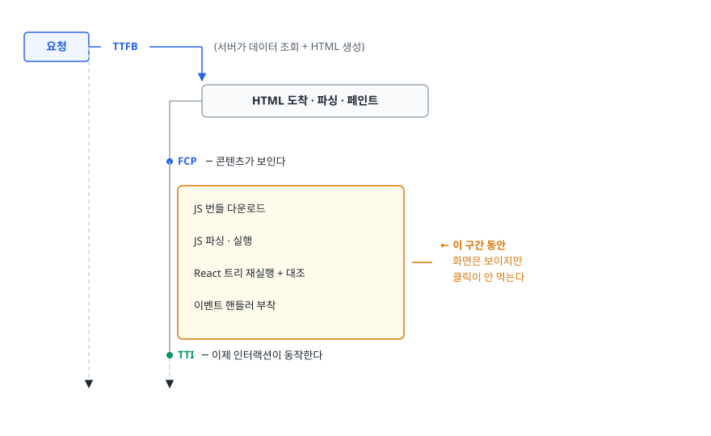
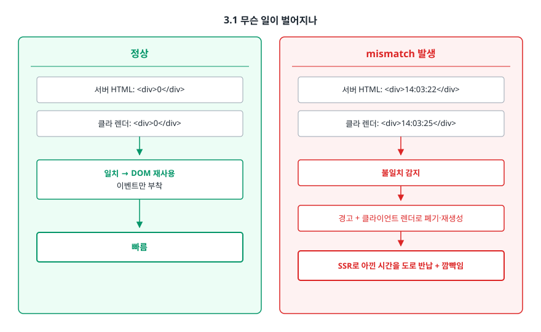
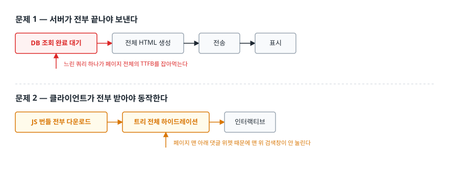
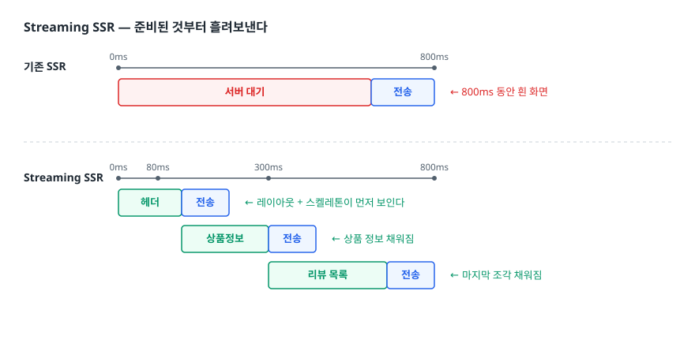

# 하이드레이션 (Hydration)

> 서버가 만든 HTML이 왜 그 자체로는 "죽은 화면"인지, React가 그것을 살려내는 과정에서 무엇이 어긋나 mismatch가 나는지, 그리고 그 비용을 줄이는 방법을 설명할 수 있게 된다.

## 학습 목표

- [ ] 하이드레이션이 왜 필요한지 "이벤트 핸들러는 HTML로 보낼 수 없다"는 관점에서 설명할 수 있다
- [ ] FCP와 TTI 사이에 생기는 "보이지만 안 눌리는 구간"을 설명할 수 있다
- [ ] Hydration Mismatch의 원인을 유형별로 구분하고 각각의 해결 코드를 쓸 수 있다
- [ ] `suppressHydrationWarning`을 써도 되는 경우와 안 되는 경우를 구분할 수 있다
- [ ] Streaming SSR과 선택적 하이드레이션이 무엇을 개선하는지 설명할 수 있다

## 선행 지식

- [01-csr-ssr-ssg-isr.md](./01-csr-ssr-ssg-isr.md) - SSR이 무엇인지 알아야 이 문서가 풀린다

---

## 1. 왜 하이드레이션이 필요한가

SSR의 결과물은 HTML 문자열이다. 서버가 이 컴포넌트를 렌더링한다고 하자.

```tsx
<button onClick={() => setCount(count + 1)}>좋아요 {count}</button>
```

서버가 만들어 보낼 수 있는 건 여기까지다.

```html
<button>좋아요 0</button>
```

`onClick`에 붙어 있던 함수는 어디로 갔을까. **함수는 HTML로 표현할 방법이 없어서 버려졌다.** 클로저가 참조하던 `count`, `setCount`도 마찬가지다. HTML은 구조와 텍스트만 담는 포맷이지 실행 가능한 상태를 담는 포맷이 아니다.

그래서 브라우저에 도착한 이 버튼은 **눌러도 아무 일도 일어나지 않는 그림**이다. 화면은 완성돼 있는데 동작만 없다. 이 그림에 JavaScript로 이벤트 핸들러와 상태를 다시 연결해 살아 있는 UI로 만드는 과정이 하이드레이션(hydration, 수분 공급)이다. 건조식품에 물을 부어 되살린다는 이름 그대로다.

> **비유** — 조립까지 끝나 매장에 진열된 가전제품 같은 것이다. 겉모습은 완제품이고 문도 열리지만 전원이 안 들어와 있어 버튼을 눌러도 반응이 없다. 콘센트를 꽂는 순간부터 진짜 제품이 된다.
>
> **비유의 한계** — 하이드레이션은 "스위치 하나 켜기"처럼 즉시 끝나지 않는다. React는 컴포넌트 트리 전체를 브라우저에서 **한 번 더 실행해서** 그 결과가 서버가 보낸 DOM과 같은지 대조하며 이벤트를 붙인다. 즉 렌더링을 두 번 하는 셈이라 트리가 클수록 CPU를 오래 먹는다. 이 "두 번 실행"이 뒤에 나올 mismatch와 성능 문제의 원인이다.

---

## 2. 동작 원리

### 2.1 CSR과 하이드레이션의 차이

React가 DOM을 만드는 진입점이 두 가지라는 데서 출발하면 명확해진다.

| | CSR | 하이드레이션 |
|---|---|---|
| 진입점 | `createRoot(el).render(<App />)` | `hydrateRoot(el, <App />)` |
| 시작 시점의 `el` | 비어 있음 | 서버가 만든 DOM이 이미 들어 있음 |
| React가 하는 일 | DOM 노드를 새로 만들어 삽입 | 기존 DOM 노드를 **재사용**하고 이벤트만 부착 |
| 전제 | 없음 | 내가 렌더한 결과 == 이미 있는 DOM |

핵심은 마지막 줄이다. 하이드레이션은 **"내가 지금 렌더링한 결과와 화면에 이미 있는 DOM이 같을 것"이라는 가정** 위에서 동작한다. 같다고 믿으니까 DOM을 새로 만들지 않고 재사용해서 빠른 것이다. 이 가정이 깨지면 전제부터 무너진다.

### 2.2 시간축으로 보기

<!-- diagram:fe-hydration-1 -->


<!-- 위 그림이 대체한 원본 ASCII.
     내용을 고칠 때는 그림도 함께 갱신할 것.
```
  요청 ─┐
        ├── TTFB ──────────┐  (서버가 데이터 조회 + HTML 생성)
        │                  ▼
        │            HTML 도착 · 파싱 · 페인트
        │                  ├── FCP ─ 콘텐츠가 보인다
        │                  │   ┌──────────────────────────┐
        │                  │   │ JS 번들 다운로드          │
        │                  │   │ JS 파싱 · 실행            │  ← 이 구간 동안
        │                  │   │ React 트리 재실행 + 대조  │     화면은 보이지만
        │                  │   │ 이벤트 핸들러 부착        │     클릭이 안 먹는다
        │                  │   └──────────────────────────┘
        │                  ├── TTI ─ 이제 인터랙션이 동작한다
        ▼                  ▼
```
-->

FCP와 TTI 사이의 간격이 SSR의 그늘이다. 사용자 입장에서는 페이지가 다 뜬 것처럼 보여서 버튼을 누르는데 반응이 없다. 그래서 두세 번 누르고, 하이드레이션이 끝나는 순간 눌린 게 한꺼번에 처리되는 일도 있다.

여기서 나오는 결론 하나 — **SSR을 붙였다고 JS 번들 최적화를 안 해도 되는 게 아니다.** 오히려 FCP가 빨라진 만큼 "보이는데 안 눌리는" 구간이 사용자 눈에 더 잘 띈다.

---

## 3. Hydration Mismatch

### 3.1 무슨 일이 벌어지나

서버가 만든 HTML과 클라이언트의 첫 렌더 결과가 다르면 2.1의 전제가 깨진다. React 18부터는 어긋난 부분만 살짝 기워 붙이는 게 아니라, **가장 가까운 Suspense 경계(없으면 루트)까지 서버 HTML을 버리고 그 범위를 클라이언트에서 다시 렌더링한다.** 개발 모드에서는 어떤 노드에서 무엇이 달랐는지 콘솔 경고로 알려주지만, 프로덕션에서는 경고 없이 이 복구만 조용히 일어난다. 그래서 "로컬에서는 경고가 뜨는데 배포본은 멀쩡해 보인다"는 건 문제가 없다는 뜻이 아니다.

<!-- diagram:fe-hydration-2 -->


<!-- 위 그림이 대체한 원본 ASCII.
     내용을 고칠 때는 그림도 함께 갱신할 것.
```
정상                                mismatch 발생
──────────────────────────          ──────────────────────────
서버 HTML: <div>0</div>             서버 HTML: <div>14:03:22</div>
클라 렌더: <div>0</div>             클라 렌더: <div>14:03:25</div>
       ↓                                   ↓
  일치 → DOM 재사용                    불일치 감지
  이벤트만 부착                              ↓
       ↓                          경고 + 클라이언트 렌더로 폐기·재생성
     빠름                                    ↓
                                  SSR로 아낀 시간을 도로 반납 + 깜빡임
```
-->

즉 mismatch는 단순한 콘솔 경고가 아니라 **SSR을 도입한 이유 자체를 무효화하는 성능 문제**이자, 사용자가 보는 값이 뒤늦게 바뀌는 UX 문제다.

### 3.2 원인 유형과 해결

원인은 하나로 요약된다. **서버에서 실행할 때와 브라우저에서 실행할 때 결과가 달라지는 코드.** 다만 그 "달라지는 이유"가 몇 갈래라 해결책도 다르다.

#### 유형 A — 시간

```tsx
// 안티패턴
function PostMeta({ createdAt }: { createdAt: string }) {
  return <span>{formatRelative(createdAt, new Date())}</span>;  // "3분 전"
}
```

**왜 문제인가** — 서버가 렌더한 시각과 브라우저가 하이드레이션하는 시각 사이에는 네트워크 왕복만큼의 간격이 있다. 초 단위를 표시하면 거의 항상 어긋난다. 더 고약한 건 **타임존**이다. 서버는 보통 UTC로 도는데 브라우저는 사용자 로컬 타임존이라 `toLocaleString()` 결과가 통째로 다르다.

**개선 1 — 첫 렌더는 양쪽이 확실히 같은 값으로 맞추고, 상대 시간은 마운트 이후에 채운다.**

```tsx
'use client';
import { useEffect, useState } from 'react';

function PostMeta({ createdAt }: { createdAt: string }) {
  const [label, setLabel] = useState(() => formatAbsoluteUTC(createdAt));  // 서버와 동일
  useEffect(() => {
    setLabel(formatRelative(createdAt, new Date()));   // 마운트 후 상대 시간으로 교체
  }, [createdAt]);
  return <time dateTime={createdAt}>{label}</time>;
}
```

**개선 2 — 애초에 환경에 의존하지 않게 만든다.** 타임존을 고정하면 양쪽이 같은 결과를 낸다.

```tsx
const fmt = new Intl.DateTimeFormat('ko-KR', {
  timeZone: 'Asia/Seoul',        // 서버·클라이언트 모두 이 기준으로 계산
  dateStyle: 'medium',
  timeStyle: 'short',
});
```

#### 유형 B — 랜덤 값

```tsx
// 안티패턴
const id = `field-${Math.random()}`;   // 서버/클라 각각 다른 값
return <><label htmlFor={id}>{label}</label><input id={id} /></>;
```

**왜 문제인가** — `Math.random()`은 정의상 매 호출마다 다르다. 서버에서 한 번, 브라우저에서 한 번 실행되니 `id`가 같을 수 없다.

**개선** — React가 서버·클라이언트에서 동일하게 생성해 주는 `useId`를 쓴다. 이게 정확히 이 문제를 풀려고 만들어진 훅이다.

```tsx
'use client';
import { useId } from 'react';

function Field({ label }: { label: string }) {
  const id = useId();                    // 양쪽에서 같은 값
  return <><label htmlFor={id}>{label}</label><input id={id} /></>;
}
```

#### 유형 C — 브라우저 전용 API (`window`, `localStorage`)

```tsx
// 안티패턴
'use client';
const theme = typeof window !== 'undefined' ? localStorage.getItem('theme') ?? 'light' : 'light';
```

**왜 문제인가** — `typeof window` 분기는 크래시는 막지만 mismatch는 못 막는다. 서버는 `'light'`로 렌더하고 브라우저는 `localStorage`에 `'dark'`가 있으면 `'dark'`로 렌더한다. 결과가 다르니 그대로 mismatch다. "서버 에러는 사라졌는데 하이드레이션 경고가 뜬다"는 상황이 대개 이 코드다.

**개선 1 — 두 단계 렌더. 마운트 전에는 서버와 같은 값을 낸다.**

```tsx
'use client';
import { useEffect, useState } from 'react';

export function ThemeToggle() {
  const [theme, setTheme] = useState<'light' | 'dark'>('light');   // 서버와 동일
  useEffect(() => {
    setTheme((localStorage.getItem('theme') as 'light' | 'dark') ?? 'light');
  }, []);
  return <button onClick={() => setTheme(theme === 'dark' ? 'light' : 'dark')}>{theme}</button>;
}
```

**개선 2 — 외부 저장소를 읽는 값이라면 `useSyncExternalStore`가 더 정확하다.** 서버 스냅샷을 따로 넘길 수 있어 "서버에서는 이 값 / 클라이언트에서는 저 값"이 구조적으로 분리된다.

```tsx
'use client';
import { useSyncExternalStore } from 'react';

function subscribe(onChange: () => void) {
  window.addEventListener('storage', onChange);
  return () => window.removeEventListener('storage', onChange);
}

export function useStoredTheme() {
  return useSyncExternalStore(
    subscribe,
    () => localStorage.getItem('theme') ?? 'light',   // 클라이언트 스냅샷
    () => 'light',                                    // 서버 스냅샷 (첫 렌더 일치용)
  );
}
```

두 방법 모두 첫 프레임은 `'light'`로 그려지므로 다크 모드 사용자에게 흰 화면이 잠깐 번쩍인다. 그래서 실무에서는 테마 값을 **하이드레이션 전에** 적용하는 인라인 스크립트를 `<head>`에 하나 두는 방식을 같이 쓴다. React 트리 밖에서 DOM 속성만 건드리므로 mismatch를 만들지 않는다.

```tsx
<script dangerouslySetInnerHTML={{ __html:
  `try{if(localStorage.getItem('theme')==='dark')
     document.documentElement.classList.add('dark');}catch(e){}` }} />
```

#### 유형 D — 유효하지 않은 HTML 중첩 (놓치기 쉬움)

```tsx
<p><div>본문</div></p>   // 안티패턴
```

**왜 문제인가** — 이건 React가 아니라 브라우저의 문제다. HTML 명세상 `<p>` 안에 `<div>`가 올 수 없어서 파서가 이걸 만나면 **태그를 자동으로 재배치**한다. 그 결과 실제 DOM은 `<p></p><div>본문</div><p></p>` 비슷한 모양이 된다. 서버가 보낸 **문자열**과 브라우저에 만들어진 **DOM**이 달라지므로 React가 대조에 실패한다. 코드에 랜덤도 시간도 없는데 mismatch가 뜨는 대표적 사례다. 같은 이유로 `<table>` 바로 아래 `<div>`를 넣거나 `<a>` 안에 `<a>`를 중첩해도 터진다.

**개선** — 유효한 태그로 바꾼다. 그냥 이게 전부다.

#### 유형 E — 브라우저 확장 프로그램

번역기, 다크 모드 확장, 비밀번호 관리자 같은 것들이 하이드레이션 전에 DOM에 속성을 추가하거나 텍스트를 바꿔치기한다. 우리 코드 잘못이 아니고 고칠 수도 없다. 이 경우에 한해 `suppressHydrationWarning`을 쓰는 게 정당하다.

```tsx
<body suppressHydrationWarning>{children}</body>
```

### 3.3 `suppressHydrationWarning`은 언제 정당한가

이 속성은 **해당 엘리먼트 한 단계의 불일치 경고만 끈다.** 자식 트리 전체를 덮어주지 않고, 불일치를 해결해 주지도 않는다. 그냥 "알고 있으니 조용히 하라"는 표시다.

| 상황 | 써도 되나 |
|------|----------|
| 브라우저 확장이 `<body>`에 속성을 붙임 | 정당 — 우리가 통제할 수 없다 |
| 의도적으로 서버/클라 값이 다른 텍스트 한 조각 | 조건부 허용 — 값이 어긋나 보여도 괜찮다면 |
| 컴포넌트에서 경고가 나서 일단 붙임 | **안 됨** — 원인이 남아 클라이언트 재렌더 비용도 그대로다 |
| 트리 상단에 붙여 하위 경고를 한꺼번에 없애려 함 | **안 됨** — 한 단계만 적용되므로 애초에 동작하지 않는다 |

경고가 성가시다는 이유로 붙이면 진짜 mismatch가 생겼을 때 알아챌 방법이 사라진다.

---

## 4. 비용, 그리고 줄이는 방법

전통적인 SSR + 하이드레이션은 두 지점에서 "전부(all-or-nothing)"를 요구한다.

<!-- diagram:fe-hydration-3 -->


<!-- 위 그림이 대체한 원본 ASCII.
     내용을 고칠 때는 그림도 함께 갱신할 것.
```
문제 1 — 서버가 전부 끝나야 보낸다
  [DB 조회 완료 대기] → [전체 HTML 생성] → [전송] → [표시]
        ↑ 느린 쿼리 하나가 페이지 전체의 TTFB를 잡아먹는다

문제 2 — 클라이언트가 전부 받아야 동작한다
  [JS 번들 전부 다운로드] → [트리 전체 하이드레이션] → [인터랙티브]
        ↑ 페이지 맨 아래 댓글 위젯 때문에 맨 위 검색창이 안 눌린다
```
-->

두 문제를 각각 푸는 게 Streaming SSR과 선택적 하이드레이션이고, 둘 다 **Suspense 경계**라는 같은 도구를 쓴다.

### 4.1 Streaming SSR — 준비된 것부터 흘려보낸다

HTML을 한 덩어리로 완성해 보내는 대신 청크 단위로 나눠 준비되는 대로 전송한다.

<!-- diagram:fe-hydration-4 -->


<!-- 위 그림이 대체한 원본 ASCII.
     내용을 고칠 때는 그림도 함께 갱신할 것.
```
기존 SSR
  0ms ─────────────────────────── 800ms
  [           서버 대기          ][전송]   ← 800ms 동안 흰 화면

Streaming SSR
  0ms ──── 80ms ──── 300ms ──── 800ms
  [헤더  ][전송]                          ← 레이아웃 + 스켈레톤이 먼저 보인다
           [상품정보][전송]                ← 상품 정보 채워짐
                     [리뷰 목록][전송]     ← 마지막 조각 채워짐
```
-->

```tsx
import { Suspense } from 'react';

export default function ProductPage() {
  return (
    <div>
      <Header />                                   {/* 즉시 전송 */}
      <Suspense fallback={<DetailSkeleton />}>
        <ProductDetail />                          {/* 준비되면 전송 */}
      </Suspense>
      <Suspense fallback={<ReviewSkeleton />}>
        <Reviews />                                {/* 제일 느려도 다른 걸 막지 않음 */}
      </Suspense>
    </div>
  );
}
```

Next.js App Router에서는 라우트 폴더에 `loading.tsx`를 두면 그 라우트를 감싸는 Suspense 경계가 자동으로 생긴다. 페이지 단위 스트리밍은 이 파일 하나로 끝난다.

**주의할 점** — 스트리밍은 응답 본문을 이미 흘려보내기 시작한 상태이므로 그 이후에는 HTTP 상태 코드나 헤더를 바꿀 수 없다. 첫 청크가 나간 뒤 에러가 나도 404나 500으로 응답을 바꿀 수 없고 스트림 중간에 에러 UI를 끼워 넣는 방식이 된다. 리다이렉트나 상태 코드 판단은 스트리밍이 시작되기 전에 끝나야 한다.

### 4.2 선택적 하이드레이션 — 순서를 바꾼다

React 18부터 하이드레이션이 Suspense 경계 단위로 쪼개진다. 여기서 두 가지가 가능해진다.

1. **독립 하이드레이션** — 경계별로 준비되는 대로 처리한다. 리뷰 목록 HTML이 아직 안 왔어도 헤더는 먼저 인터랙티브해진다.
2. **우선순위 재조정** — 하이드레이션 중에 사용자가 아직 안 끝난 영역을 클릭하면, React가 그 이벤트를 기록해 두고 **해당 영역의 하이드레이션을 앞으로 당긴 뒤 이벤트를 재생(replay)** 한다. 사용자가 관심 있는 곳부터 살아난다.

용어가 비슷해 헷갈리는데 이렇게 나눠 두면 된다.

| 용어 | 무엇을 바꾸나 |
|------|--------------|
| Streaming SSR | 서버가 **HTML을 보내는 단위**를 통짜에서 청크로 |
| 점진적 하이드레이션 (Progressive) | 클라이언트가 **하이드레이션하는 단위**를 통짜에서 조각으로 |
| 선택적 하이드레이션 (Selective) | 그 조각들의 **처리 순서**를 사용자 상호작용 기준으로 |

### 4.3 근본 대책 — 하이드레이션할 것 자체를 줄인다

앞의 셋은 "언제, 어떤 순서로 할까"를 다룬다. 가장 확실한 건 **애초에 대상을 줄이는 것**이다. 정적인 마크업만 있는 컴포넌트는 JS가 필요 없는데도 전통적 SSR에서는 전부 번들에 실려 하이드레이션된다. 이 낭비를 구조적으로 없애는 게 React Server Components다. 서버 컴포넌트는 클라이언트 번들에 아예 포함되지 않으므로 하이드레이션 대상이 아니다. → [03-server-components.md](./03-server-components.md)

---

## 5. 실무에서는

- **`loading.tsx` 하나 추가하기**가 가장 저렴한 개선이다. 라우트에 느린 데이터 조회가 하나라도 있으면 여기서부터 시작한다.
- **`next/dynamic`의 `ssr: false`** 는 서버 렌더링 자체를 건너뛰어 mismatch를 원천 차단하는 탈출구다. `window`에 강하게 의존하는 서드파티 컴포넌트(차트 라이브러리 등)에 쓴다. 다만 그 부분은 SSR의 이점을 포기하는 것이고, App Router에서는 서버 컴포넌트에서 이 옵션을 쓸 수 없다(Next.js 15는 에러로 막는다). 클라이언트 컴포넌트 안에서 호출해야 한다.
- **mismatch 디버깅은 프로덕션 빌드에서 하지 않는다.** 개발 모드의 에러 메시지가 어떤 노드에서 무엇이 달랐는지 훨씬 자세히 알려준다. 재현이 안 되면 시크릿 창(확장 프로그램 없이)에서 먼저 확인해 유형 E인지 걸러내는 게 순서다.
- **광고·A/B 테스트 스크립트**가 하이드레이션 전에 DOM을 조작하면 유형 E와 같은 증상이 난다. A/B 분기를 클라이언트에서 하면 서버 HTML과 어긋나므로 서버에서 결정해 내려보내는 편이 안전하다.

---

## 6. 면접 포인트

> 면접에서 이 주제가 나오면 이렇게 답한다

**Q. 하이드레이션이 무엇이고 왜 필요한가요?**

A. 서버가 만든 HTML에는 마크업과 텍스트만 담기고 이벤트 핸들러나 상태 같은 실행 가능한 것은 담기지 않습니다. 그래서 브라우저에 도착한 화면은 보이기만 하고 동작하지 않습니다. 하이드레이션은 브라우저에서 React 컴포넌트 트리를 한 번 더 실행해 그 결과를 이미 있는 DOM과 대조하면서, DOM을 재사용하고 이벤트 핸들러와 상태를 연결하는 과정입니다. 이 과정이 끝나야 페이지가 인터랙티브해지므로 SSR을 써도 FCP와 TTI 사이에 "보이지만 눌리지 않는" 구간이 생깁니다.

- 꼬리 질문: "그럼 SSR을 쓰면 항상 빠른가요?" → FCP는 빨라지지만 TTFB는 느려지고, TTI는 JS 번들 크기에 좌우되므로 SSR만으로 개선되지 않는다. 번들 축소와 스트리밍이 함께 가야 한다.

**Q. Hydration Mismatch는 왜 발생하고 어떻게 해결하나요?**

A. 하이드레이션은 "클라이언트 첫 렌더 결과가 서버 HTML과 같다"는 전제로 DOM을 재사용합니다. 그 전제가 깨지면 mismatch입니다. 원인은 환경에 따라 결과가 달라지는 코드로, 현재 시각, `Math.random()`, `localStorage`나 `window` 접근이 대표적입니다. 해결 원칙은 **첫 렌더 결과를 양쪽에서 동일하게 맞추고 환경 의존적인 값은 마운트 이후에 반영**하는 것입니다. 랜덤 id는 `useId`, 외부 저장소 값은 `useSyncExternalStore`의 서버 스냅샷을 쓰면 더 깔끔합니다. 덜 알려진 원인으로는 `<p>` 안에 `<div>` 같은 유효하지 않은 HTML 중첩이 있는데, 브라우저 파서가 태그를 재배치해 DOM이 서버 문자열과 달라지는 경우입니다.

- 꼬리 질문: "mismatch가 나면 어떤 손해가 있나요?" → 경고만 뜨는 게 아니라 가장 가까운 Suspense 경계까지 서버 HTML을 버리고 클라이언트에서 다시 렌더링한다. SSR로 아낀 시간을 반납하는 셈이고 화면 값이 뒤늦게 바뀌어 깜빡임도 생긴다. 게다가 경고는 개발 모드에서만 보이므로 프로덕션에서는 비용만 조용히 발생한다.
- 꼬리 질문: "`suppressHydrationWarning`으로 해결하면 안 되나요?" → 경고만 끄고 재렌더 비용은 그대로다. 게다가 한 단계에만 적용된다. 브라우저 확장처럼 통제할 수 없는 원인에만 쓴다.

**Q. Streaming SSR은 기존 SSR과 무엇이 다른가요?**

A. 기존 SSR은 서버가 모든 데이터 조회와 HTML 생성을 끝내야 응답을 보내기 시작합니다. 느린 쿼리 하나가 페이지 전체의 TTFB를 결정하는 구조입니다. Streaming SSR은 HTML을 청크 단위로 나눠 준비된 부분부터 흘려보냅니다. 그 경계를 `Suspense`로 표시하고, 준비 안 된 부분은 fallback을 먼저 보낸 뒤 데이터가 오면 해당 조각을 이어서 스트리밍합니다. Next.js App Router에서는 `loading.tsx`가 자동으로 이 경계를 만들어 줍니다. 여기에 React 18의 선택적 하이드레이션이 붙으면 조각들이 도착 순서대로 독립적으로 하이드레이션되고, 사용자가 클릭한 영역은 우선순위가 올라갑니다.

- 꼬리 질문: "스트리밍에서 주의할 점은?" → 첫 청크가 나간 뒤에는 HTTP 상태 코드와 헤더를 바꿀 수 없다. 리다이렉트나 404 판단은 스트리밍 시작 전에 끝나야 한다.
- 꼬리 질문: "백엔드에 비슷한 개념이 있나요?" → HTTP chunked transfer로 응답을 흘려보내는 것이라 서버 사이드 스트리밍 응답이나 SSE와 같은 발상이다.

**Q. TTI를 개선하려면 무엇을 하시겠습니까?**

A. TTI는 하이드레이션이 끝나는 시점이므로 실행할 JS의 양을 줄이는 게 가장 직접적입니다. 먼저 번들을 분석해 클라이언트에 갈 필요 없는 코드를 걷어냅니다. 상호작용이 없는 영역까지 클라이언트 컴포넌트로 만들어져 있다면 서버 컴포넌트로 되돌려 번들에서 제외합니다. 그다음 Suspense 경계를 나눠 스트리밍과 선택적 하이드레이션이 동작하게 해서, 전체가 끝나기를 기다리지 않고 상단부터 인터랙티브해지게 만듭니다. 무거운 서드파티 위젯은 뷰포트에 들어올 때 지연 로드합니다.

---

## 자주 하는 실수

| 실수 | 왜 틀렸나 | 올바른 이해 |
|------|----------|-----------|
| "하이드레이션은 이벤트만 붙이는 가벼운 작업" | React가 트리를 한 번 더 실행해 DOM과 대조한다 | 렌더링을 두 번 하는 셈이라 트리가 크면 CPU 비용이 크다 |
| "`typeof window` 체크로 mismatch를 막았다" | 크래시만 막았고 서버/클라 결과는 여전히 다르다 | 첫 렌더는 같은 값으로 맞추고 차이는 마운트 이후에 반영 |
| "mismatch는 콘솔 경고일 뿐" | 가장 가까운 Suspense 경계까지 서버 HTML을 버리고 다시 그린다 | SSR의 이점을 잃는 성능 문제이자 깜빡임을 만드는 UX 문제 |
| "`suppressHydrationWarning`을 상위에 걸면 하위 경고가 사라진다" | 한 단계에만 적용된다 | 하위 트리는 덮이지 않는다. 원인을 고치는 게 정답 |
| "mismatch 원인은 항상 시간·랜덤·window" | 유효하지 않은 HTML 중첩과 브라우저 확장도 흔하다 | 환경 의존 값이 없는데 경고가 나면 마크업 유효성과 확장을 의심 |
| "Streaming SSR을 쓰면 TTI도 자동으로 좋아진다" | 스트리밍은 HTML 전송 단위를 바꾼 것 | TTI는 실행할 JS 양에 좌우된다. 번들 축소가 같이 가야 한다 |

---

## 한 줄 정리

하이드레이션은 서버가 보낸 죽은 HTML을 브라우저에서 트리를 한 번 더 실행해 되살리는 과정이고, 그 전제인 "서버 결과 == 클라이언트 첫 렌더 결과"를 지키는 것과 살릴 양 자체를 줄이는 것이 성능의 핵심이다.

---

## 연관 개념

- [01-csr-ssr-ssg-isr.md](./01-csr-ssr-ssg-isr.md) - 하이드레이션이 필요해지는 SSR/SSG의 전제
- [03-server-components.md](./03-server-components.md) - 하이드레이션 대상 자체를 줄이는 RSC
- [qna-nextjs.md](./qna-nextjs.md) - 이 주제의 면접 질문과 답변 모음
- [../react-architecture/qna-react.md](../react-architecture/qna-react.md) - Suspense와 동시성 렌더링 관련 면접 질문
- [../browser-fundamentals/qna-browser.md](../browser-fundamentals/qna-browser.md) - HTML 파싱과 렌더링 파이프라인
