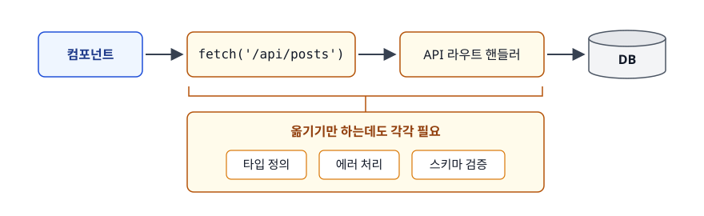
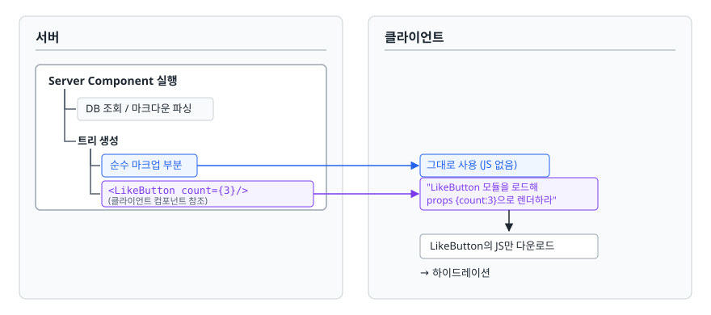
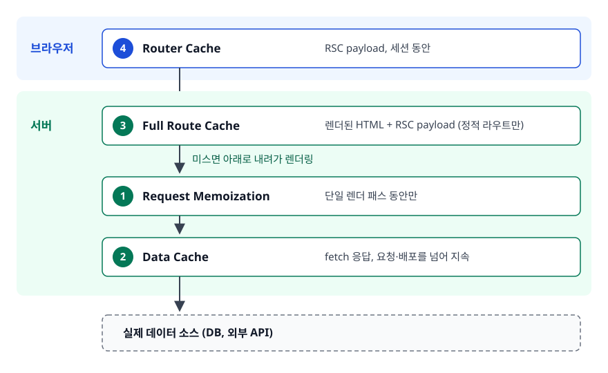

# React Server Components (RSC)

> "왜 글자만 보여주는 컴포넌트의 코드까지 브라우저가 다운로드해야 하는가"라는 질문에서 이야기를 시작합니다. 이 문서를 읽고 나면 서버 전용 컴포넌트가 무엇을 바꾸는지, `'use client'` 경계를 어떻게 설계하는지 설명할 수 있게 됩니다.

## 학습 목표

- [ ] RSC가 푸는 두 문제(번들 크기, 데이터 접근 계층)를 설명할 수 있다
- [ ] RSC와 SSR의 차이를 "JS가 클라이언트로 가느냐"로 구분할 수 있다
- [ ] `'use client'`가 모듈 경계를 만든다는 의미를 이해하고 경계를 아래쪽으로 설계할 수 있다
- [ ] 서버에서 클라이언트로 넘길 수 있는 값과 없는 값을 구분할 수 있다
- [ ] App Router와 Pages Router의 데이터 페칭·레이아웃 차이를 설명할 수 있다
- [ ] Next.js 캐싱 계층 네 개와 무효화 방법을 설명할 수 있다

## 선행 지식

- [01-csr-ssr-ssg-isr.md](./01-csr-ssr-ssg-isr.md) - SSR/SSG가 무엇인지
- [02-hydration.md](./02-hydration.md) - 하이드레이션 비용을 알아야 RSC의 동기가 이해됩니다

---

## 1. 왜 필요한가

### 문제 1 — 안 쓰는 코드를 왜 받아야 하나

마크다운 문서를 렌더링하는 페이지를 보겠습니다.

```tsx
import { marked } from 'marked';          // 마크다운 파서
import { format } from 'date-fns';        // 날짜 포맷

function Article({ raw, createdAt }) {
  return (
    <article>
      <time>{format(createdAt, 'yyyy-MM-dd')}</time>
      <div dangerouslySetInnerHTML={{ __html: marked(raw) }} />
    </article>
  );
}
```

이 컴포넌트에는 클릭도 상태도 이벤트도 없습니다. 결과물은 그냥 HTML 덩어리입니다. 그런데 전통적인 SSR에서는 두 라이브러리가 **전부 클라이언트 번들에 포함됩니다.** 서버에서 이미 HTML을 다 만들었어도, 브라우저가 하이드레이션을 하려면 같은 컴포넌트를 한 번 더 실행해야 하고, 그러려면 이 코드가 필요하기 때문입니다.

결국 사용자는 **한 번 실행된 결과를 받고, 똑같은 결과를 다시 만들기 위한 코드를 또 받습니다.**

### 문제 2 — 데이터를 가져오려고 만드는 계층

CSR 시대에는 브라우저가 DB에 직접 접근할 수 없으니 반드시 사이에 API가 있어야 했습니다.

<!-- diagram:fe-server-components-4 -->


<!-- 위 그림이 대체한 원본 ASCII.
     내용을 고칠 때는 그림도 함께 갱신할 것.
```
컴포넌트 → fetch('/api/posts') → API 라우트 핸들러 → DB
           └─ 옮기기만 하는데도 타입 정의·에러 처리·스키마 검증이 각각 필요
```
-->
게다가 컴포넌트가 렌더된 다음에야 데이터를 요청하므로, 중첩된 컴포넌트가 각자 데이터를 가져오면 요청 폭포(waterfall)가 생깁니다. 부모가 로딩을 끝내야 자식이 요청을 시작하는 구조입니다.

### RSC의 답

**컴포넌트를 서버에서만 실행하고 그 코드는 클라이언트로 보내지 않습니다.** 이 한 문장이 두 문제를 동시에 풉니다. 코드가 안 가니 번들이 줄고, 서버에서 실행되니 DB에 직접 접근할 수 있습니다.

> **비유**: 이사 견적을 낼 때 업체가 직원을 우리 집에 보내는 대신, 사무실에서 계산을 끝내고 완성된 견적서만 보내는 것과 같습니다. 계산에 쓴 요금표와 계산기는 우리 집에 올 필요가 없습니다.
>
> **비유의 한계**: 견적서는 그 자체로 끝난 결과물입니다. RSC의 결과물은 그렇지 않습니다. 서버 컴포넌트가 보내는 것은 "여기에 이 클라이언트 컴포넌트를 이런 props로 놓아라"라는 지시가 섞인 트리 구조입니다. 클라이언트는 그걸 받아 자기 몫의 컴포넌트를 실행하니, 서버와 클라이언트가 하나의 트리를 나눠 그리는 셈입니다.

---

## 2. RSC는 무엇을 보내나

서버 컴포넌트의 렌더 결과는 HTML이 아니라 **RSC Payload**라 부르는 직렬화된 트리입니다.

<!-- diagram:fe-server-components-1 -->


<!-- 위 그림이 대체한 원본 ASCII.
     내용을 고칠 때는 그림도 함께 갱신할 것.
```
서버                                       클라이언트
─────────────────────────                  ────────────────────────
Server Component 실행
  ├─ DB 조회 / 마크다운 파싱
  └─ 트리 생성
       ├─ 순수 마크업 부분     ──────────>  그대로 사용 (JS 없음)
       └─ <LikeButton count={3}/> ──────>  "LikeButton 모듈을 로드해
          (클라이언트 컴포넌트 참조)          props {count:3}으로 렌더하라"
                                                    ▼
                                           LikeButton의 JS만 다운로드
                                           → 하이드레이션
```
-->

첫 요청에서는 이 payload와 함께 SSR로 만든 HTML도 같이 내려갑니다. 그래서 첫 화면은 여전히 빠르고 SEO도 됩니다. 이후 라우트 이동에서는 HTML 없이 payload만 받아 기존 트리에 병합합니다. 브라우저가 문서를 다시 로드하는 게 아니라 React가 바뀐 부분만 갈아 끼우는 것이라, 이동 전후로 유지되는 공통 레이아웃의 클라이언트 상태(열려 있는 사이드바, 재생 중인 플레이어 등)는 그대로 살아남습니다. 반대로 교체되는 페이지 구간의 상태는 남지 않습니다.

### RSC와 SSR은 다른 층위다 — 가장 많이 헷갈리는 지점

| | SSR | RSC |
|---|---|---|
| 무엇인가 | 컴포넌트를 서버에서 **한 번 미리 렌더**하는 기법 | 컴포넌트가 **서버에서만 존재**하는 종류 |
| 클라이언트 JS 번들 | **포함된다** (하이드레이션에 필요) | **포함되지 않는다** |
| 하이드레이션 | 필요 | 대상 아님 |
| 상태·이벤트 | 가능 | 불가능 |

**한 줄 결론** — SSR은 "언제 렌더하나", RSC는 "어디에서만 존재하나"를 정합니다. 둘은 배타적이지 않습니다. App Router는 서버 컴포넌트를 SSR로 HTML화해 첫 응답에 함께 보내므로, "RSC가 SSR을 대체한다"는 말은 틀렸습니다.

---

## 3. Server Component와 Client Component

### 3.1 무엇이 되고 무엇이 안 되나

| 구분 | Server Component | Client Component |
|------|------------------|------------------|
| 실행 위치 | 서버만 | 브라우저 (+ 서버에서 SSR 프리렌더) |
| JS 번들 포함 | 안 됨 | 됨 |
| `useState`, `useReducer`, `useEffect` | 불가 | 가능 |
| `onClick` 등 이벤트 핸들러 | 불가 | 가능 |
| `async` 컴포넌트 | 가능 | 불가 |
| DB·파일시스템 직접 접근 | 가능 | 불가 |
| 비공개 환경 변수 | 접근 가능 | `NEXT_PUBLIC_` 접두사가 붙은 것만 |
| `window`, `localStorage` | 불가 | 가능 |

**그래서 언제 뭘 쓰나** — 데이터 조회와 정적 마크업은 Server Component, 상태·이벤트·브라우저 API가 필요한 지점만 Client Component. 판단 기준은 "사용자 입력에 반응해야 하는가" 하나면 충분합니다.

### 3.2 `'use client'`는 컴포넌트 표시가 아니라 **모듈 경계**다

RSC에서 가장 자주 틀리는 부분입니다. `'use client'`는 파일 맨 위에 쓰는 지시어이고, **그 파일부터 시작해 import로 이어지는 모든 모듈이 클라이언트 번들에 들어갑니다.**

<!-- diagram:fe-server-components-2 -->


<!-- 위 그림이 대체한 원본 ASCII.
     내용을 고칠 때는 그림도 함께 갱신할 것.
```
경계를 위에 두면                  경계를 아래에 두면
──────────────────────           ──────────────────────
 ['use client'] Layout            Layout      (서버)
        │                            │
     Sidebar                      Sidebar     (서버)
        │                            │
     PostList                     PostList    (서버)
        │                            │
     LikeButton              ['use client'] LikeButton  ← 이것만 번들에
  → 전부 번들에 포함
```
-->

**규칙**: `'use client'`는 트리의 가능한 한 **말단(leaf)** 에 둡니다. 상호작용이 필요한 버튼 하나 때문에 페이지 전체를 클라이언트로 만들지 않습니다.

### 3.3 Client Component 안에 Server Component를 넣는 법

"클라이언트 컴포넌트 안에는 서버 컴포넌트를 못 넣는다"고 알려져 있는데, 정확히는 **import는 안 되지만 props로 받는 것은 됩니다.**

```tsx
// 안티패턴 — 클라이언트 컴포넌트가 서버 컴포넌트를 import
'use client';
import { PostBody } from './PostBody';   // 서버 컴포넌트였지만 여기서
                                          // import되는 순간 클라이언트가 된다
export function Collapsible() {
  const [open, setOpen] = useState(false);
  return <div><button onClick={() => setOpen(!open)}>토글</button>{open && <PostBody />}</div>;
}
```

**왜 문제인가** — `PostBody`가 마크다운 파서를 쓰고 있었다면 그 라이브러리까지 통째로 클라이언트 번들에 끌려 들어갑니다. 서버 컴포넌트로 만든 이유가 사라집니다.

**개선 — `children` 슬롯으로 받습니다.**

```tsx
// Collapsible.tsx  (클라이언트) — 이제 PostBody를 모른다
'use client';
import { useState, type ReactNode } from 'react';

export function Collapsible({ children }: { children: ReactNode }) {
  const [open, setOpen] = useState(false);
  return <div><button onClick={() => setOpen(!open)}>토글</button>{open && children}</div>;
}

// app/posts/[id]/page.tsx  (서버)
export default async function PostPage({ params }: { params: Promise<{ id: string }> }) {
  const post = await getPost((await params).id);
  return (
    <Collapsible>
      <PostBody raw={post.raw} />     {/* 서버에서 렌더된 결과가 슬롯에 들어간다 */}
    </Collapsible>
  );
}
```

`PostBody`는 서버에서 렌더되고 `Collapsible`은 그 **결과**를 `children`으로 받아 위치만 잡아 줍니다. 마크다운 파서는 클라이언트로 가지 않습니다. 이 패턴은 컨텍스트 프로바이더에도 그대로 쓰입니다. 프로바이더 자체는 클라이언트여야 하지만 그 안의 트리는 서버로 남길 수 있습니다.

---

## 4. 직렬화 제약

서버에서 클라이언트 컴포넌트로 넘기는 props는 네트워크를 건너가므로 **직렬화 가능해야 합니다.**

| 넘길 수 있는 것 | 넘길 수 없는 것 |
|----------------|----------------|
| 문자열, 숫자, boolean, `null`, `undefined`, BigInt | 일반 함수, 화살표 함수 |
| 배열, 일반 객체(plain object) | 클래스 인스턴스 (일반 객체가 아니라 에러) |
| `Date`, `Map`, `Set` | `Symbol` (전역 심볼 레지스트리 등록분 제외) |
| `Promise` | DOM 노드, 이벤트 객체 |
| React 엘리먼트 (`children` 포함) | 클로저로 상태를 캡처한 값 |
| Server Function (`'use server'`) | |

<strong>흔한 오해 — "JSON으로 직렬화 가능한 것만 된다"</strong>는 틀렸습니다. RSC는 `JSON.stringify`보다 넓은 포맷을 씁니다. `Date`를 넘기면 클라이언트에서도 `Date` 객체로 받고, `Map`과 `Set`도 그대로 살아 있으며, `Promise`를 넘겨 클라이언트에서 읽는 것도 됩니다. "JSON만 된다"고 외우면 `Date`를 굳이 문자열로 바꿔 넘기는 불필요한 코드를 쓰게 됩니다.

### 안티패턴 — 함수를 props로 넘기기

```tsx
// app/page.tsx  (서버 컴포넌트 안)
<ItemList items={items} onSelect={(id) => console.log(id)} />   // 직렬화 불가 → 에러
```

**왜 문제인가** — 함수는 코드와 클로저 환경을 함께 가지는데, 그 환경은 서버 메모리에만 있습니다. 네트워크로 보낼 방법이 없습니다. 서버 컴포넌트를 처음 쓸 때 가장 먼저 부딪히는 벽입니다.

**개선 1 — 클라이언트 로직이라면 클라이언트 쪽에 정의합니다.**

```tsx
'use client';
export function ItemList({ items }: { items: Item[] }) {
  const handleSelect = (id: string) => console.log(id);   // 클라이언트에 정의
  return items.map((i) => <button key={i.id} onClick={() => handleSelect(i.id)}>{i.name}</button>);
}
```

**개선 2 — 서버에서 실행돼야 하는 일이라면 Server Function으로 만듭니다.**

```tsx
// app/actions.ts
'use server';
import { revalidatePath } from 'next/cache';

export async function deleteItem(id: string) {
  await db.item.delete({ where: { id } });
  revalidatePath('/items');
}

// app/page.tsx  (서버) — import 후 그대로 내려주면 된다
import { deleteItem } from './actions';
<ItemList items={items} onDelete={deleteItem} />            // 이건 넘어간다
```

`'use server'`가 붙은 함수는 실제 코드가 넘어가는 게 아니라 **참조(엔드포인트 주소)** 가 넘어갑니다. 클라이언트가 그걸 호출하면 네트워크 요청이 나가고 함수 본문은 서버에서 실행됩니다.

### `'use server'`는 Server Component 선언이 아니다

이름 때문에 `'use client'`의 반대라고 생각하기 쉽지만 아닙니다. `'use client'`는 **모듈 경계** 선언이라서 그 파일부터 클라이언트 번들에 포함됩니다. `'use server'`는 **함수 선언**이라서, 그 함수가 서버에서 실행되면서 클라이언트에서 호출 가능해집니다(Server Function / Server Action). 하나는 번들 경계를 긋고, 다른 하나는 호출 규약을 만듭니다.

App Router에서 **서버 컴포넌트는 기본값이라 아무 지시어도 필요 없습니다.** 서버 컴포넌트 파일 위에 `'use server'`를 붙이면 그 파일의 export를 전부 Server Function으로 취급하려 해서 오히려 에러가 납니다.

---

## 5. 더 흔한 안티패턴 둘

### 안티패턴 — 데이터를 통째로 클라이언트에 넘기기

```tsx
const users = await db.user.findMany();   // email, passwordHash, phone 전부 포함
return <UserTable users={users} />;
```

**왜 문제인가** — 두 가지입니다. 첫째, props는 RSC payload에 실려 브라우저로 전송되므로 **`passwordHash`가 페이지 소스에 그대로 남습니다.** 화면에 안 그린다고 안 가는 게 아닙니다. 둘째, 필요 없는 필드까지 실려 payload가 커집니다.

**개선 — 서버에서 필요한 필드만 뽑아 넘깁니다.**

```tsx
const users = await db.user.findMany({ select: { id: true, name: true, createdAt: true } });
return <UserTable users={users} />;
```

### 안티패턴 — 서버 전용 모듈이 클라이언트로 새는 것을 방치

`lib/db.ts`가 커넥션 문자열을 들고 있는데 어쩌다 클라이언트 컴포넌트에서 import되면 그 값이 번들에 들어갈 수 있습니다. 사람이 주의하는 것으로는 막을 수 없습니다.

**개선 — `server-only` 패키지를 import해 두면 클라이언트 번들에 포함되는 순간 빌드가 실패합니다.** 런타임 사고를 빌드 타임 에러로 앞당기는 장치입니다.

```ts
// lib/db.ts
import 'server-only';
export const db = createClient({ url: process.env.DATABASE_URL! });
```

---

## 6. App Router와 Pages Router

| 구분 | Pages Router | App Router |
|------|--------------|------------|
| 디렉터리 | `pages/` | `app/` |
| 기본 컴포넌트 | 클라이언트 컴포넌트 | **서버 컴포넌트** |
| 데이터 페칭 | `getServerSideProps` / `getStaticProps` | 컴포넌트를 `async`로 만들고 직접 `await` |
| 페칭 위치 | **페이지 최상단에서만** | 트리 어느 깊이에서든 |
| 레이아웃 | `_app.js` / `_document.js` (전역) | `layout.tsx` (**중첩 가능**) |
| 로딩 UI / 에러 UI | 직접 상태 관리 / `_error.js` (전역) | `loading.tsx` / `error.tsx` (구간별) |

가장 큰 실질적 차이는 **데이터를 가져올 수 있는 위치**입니다.

```tsx
// Pages Router — 페이지 최상단에서만 가능
export async function getServerSideProps() {
  const [user, posts, comments] = await Promise.all([getUser(), getPosts(), getComments()]);
  return { props: { user, posts, comments } };   // 깊은 곳에서 쓸 데이터까지 여기서 받아
}                                                // props로 계속 내려야 한다 (prop drilling)
// App Router — 필요한 컴포넌트가 직접 가져온다
async function CommentList({ postId }: { postId: string }) {
  const comments = await getComments(postId);   // 트리 어디서든 가능
  return <ul>{comments.map((c) => <li key={c.id}>{c.body}</li>)}</ul>;
}
```

"같은 데이터를 여러 컴포넌트가 각자 가져오면 중복 요청 아닌가?" — 이 걱정을 없애 주는 게 다음 절의 Request Memoization입니다.

중첩 레이아웃도 실무 차이가 큽니다. `app/dashboard/layout.tsx`를 두면 대시보드 하위 라우트를 오갈 때 사이드바가 다시 렌더되지 않고 그대로 유지됩니다. Pages Router에서는 직접 구현해야 했습니다.

---

## 7. Next.js 캐싱 계층

> **버전 주의** — 캐싱 기본값은 메이저 버전 사이에 바뀌었습니다. Next.js 13/14에서는 `fetch`가 기본적으로 캐시됐지만 **15부터는 캐시하지 않는 것이 기본**이며, 캐시하려면 `cache: 'force-cache'`나 `next: { revalidate }`를 명시해야 합니다. 클라이언트 Router Cache의 기본 보존 시간도 버전에 따라 다릅니다. 계층의 **구조는 그대로**이니 구조를 이해하고 기본값은 쓰는 버전 문서를 확인하는 게 맞습니다.

<!-- diagram:fe-server-components-3 -->


<!-- 위 그림이 대체한 원본 ASCII.
     내용을 고칠 때는 그림도 함께 갱신할 것.
```
  브라우저
    ┌─────────────────────────────┐
    │  4) Router Cache            │  RSC payload, 세션 동안
    └──────────────┬──────────────┘
  서버             ▼
    ┌─────────────────────────────┐
    │  3) Full Route Cache        │  렌더된 HTML + RSC payload (정적 라우트만)
    ├─────────────────────────────┤  미스면 아래로 내려가 렌더링
    │  1) Request Memoization     │  단일 렌더 패스 동안만
    ├─────────────────────────────┤
    │  2) Data Cache              │  fetch 응답, 요청·배포를 넘어 지속
    └──────────────┬──────────────┘
                   ▼  실제 데이터 소스 (DB, 외부 API)
```
-->

| 계층 | 캐시 대상 | 위치 | 지속 | 무엇을 해결하나 |
|------|----------|------|------|----------------|
| Request Memoization | 동일 렌더 내 같은 `fetch` | 서버 | 렌더 한 번 동안 | 여러 컴포넌트가 같은 데이터를 요청해도 실제 호출은 한 번 |
| Data Cache | `fetch` 응답 | 서버 | 재검증 전까지 지속 | 외부 API 호출 비용·지연 |
| Full Route Cache | 렌더 결과(HTML/payload) | 서버 | 재검증 전까지 지속 | 렌더링 자체를 건너뛰기 (SSG/ISR의 실체) |
| Router Cache | RSC payload | 클라이언트 | 세션 동안 | 라우트 전환·뒤로가기 체감 속도 |

**한 줄 결론** — 서버 쪽 세 개는 "서버가 일을 덜 하게", 클라이언트 쪽 하나는 "전환이 즉각적으로 느껴지게" 하는 장치입니다. 이 중 6절의 걱정을 해소하는 건 Request Memoization입니다.

```tsx
export async function getUser(id: string) {
  return (await fetch(`${API}/users/${id}`)).json();   // React가 확장한 fetch
}

// 한 페이지 안에서 세 컴포넌트가 각자 호출한다
async function Header({ id })  { const u = await getUser(id); /* ... */ }
async function Sidebar({ id }) { const u = await getUser(id); /* ... */ }
async function Profile({ id }) { const u = await getUser(id); /* ... */ }
```

세 번 호출했지만 **실제 네트워크 요청은 한 번**입니다. 같은 URL과 옵션이면 첫 호출 결과를 나머지가 공유합니다. 그래서 prop drilling 없이 각 컴포넌트가 필요한 데이터를 직접 가져오는 설계가 성립합니다.

다만 이 중복 제거는 `fetch`에 걸린 것입니다. ORM 쿼리나 파일 읽기처럼 `fetch`를 거치지 않는 조회는 세 번 호출하면 세 번 실행되므로, 같은 효과를 원하면 React의 `cache()`로 감쌉니다.

```ts
import { cache } from 'react';
// 같은 렌더 안에서 id가 같으면 실제 쿼리는 한 번만
export const getUserFromDb = cache((id: string) => db.user.findUnique({ where: { id } }));
```

### 캐시 제어와 무효화

호출 단위는 `fetch` 옵션으로, 라우트 단위는 `page.tsx` / `layout.tsx` 상단의 export로 제어합니다.

```ts
fetch(url, { cache: 'no-store' });                    // 캐시하지 않음
fetch(url, { cache: 'force-cache' });                 // 캐시함
fetch(url, { next: { revalidate: 60 } });             // 60초 후 재검증
fetch(url, { next: { tags: ['posts', 'post:12'] } }); // 태그 부여

export const revalidate = 60;               // 이 라우트의 재검증 주기
export const dynamic = 'force-dynamic';     // 항상 동적 렌더 ('force-static'은 반대)
```

온디맨드 무효화는 Server Function이나 Route Handler 안에서 호출합니다. 아래는 별도 파일입니다.

```ts
// app/actions.ts
'use server';
import { revalidateTag, revalidatePath } from 'next/cache';

export async function publishPost(data: FormData) {
  const post = await db.post.create({ data: parse(data) });
  revalidateTag('posts', 'max');             // 태그 기반: 관련 캐시만 정밀 무효화 (Next.js 16부터 두 번째 인자 필요, 즉시 반영은 updateTag)
  revalidatePath(`/posts/${post.id}`);       // 경로 기반: 특정 라우트 무효화
}
```

**시간 기반과 태그 기반의 선택 기준** — 갱신 시점을 우리가 알 수 없으면(외부 API 데이터 등) 시간 기반, 우리가 데이터를 바꾸는 주체라면(관리자 저장, CMS 발행) 태그 기반이 정확하고 낭비가 없습니다. 실무에서는 안전망으로 넉넉한 `revalidate`를 걸어 두고 실제 갱신은 태그로 처리하는 조합을 자주 씁니다.

---

## 8. 실무에서는

- **마이그레이션은 라우트 단위로 합니다.** App Router와 Pages Router는 한 프로젝트에 공존할 수 있어서, 트래픽이 적은 라우트부터 옮기며 검증하는 방식이 일반적입니다.
- **경계 설계의 실전 규칙**: 페이지와 레이아웃은 서버 컴포넌트로 두고 데이터 조회를 맡깁니다. 버튼·폼·모달·캐러셀처럼 상태를 가진 것만 별도 파일로 빼서 `'use client'`를 붙입니다. 상태 관리 라이브러리의 프로바이더는 클라이언트일 수밖에 없지만, `children`으로 서버 트리를 감싸면 하위는 서버로 유지됩니다. `'use client'` 하나를 잘못된 위치에 붙이면 수십 개 모듈이 딸려 들어가는데 코드만 봐서는 안 보이므로, 번들 분석 도구로 주기적으로 확인하는 습관이 필요합니다.
- **RSC에서 DB에 직접 접근할 수 있다는 게 곧 그렇게 하라는 뜻은 아닙니다.** 컴포넌트가 ORM 쿼리에 직접 결합되면 인가 검사와 트랜잭션 경계가 화면 코드에 흩어지고 재사용도 어려워집니다. 데이터 접근은 서비스 계층 함수로 감싸고 컴포넌트는 그것만 호출하는 편이 낫습니다. Spring에서 컨트롤러가 Repository를 직접 호출하지 않고 Service를 두는 것과 같은 이유입니다.

---

## 9. 면접 포인트

> 면접에서 이 주제가 나오면 이렇게 답한다

**Q. React Server Components가 무엇이고 SSR과 어떻게 다른가요?**

A. RSC는 서버에서만 실행되고 그 코드가 클라이언트 번들에 포함되지 않는 컴포넌트입니다. 서버가 보내는 것은 HTML이 아니라 직렬화된 컴포넌트 트리(RSC payload)이고, 그 안에 클라이언트 컴포넌트는 "이 모듈을 이 props로 렌더하라"는 참조로 들어갑니다. SSR과는 층위가 다릅니다. SSR은 컴포넌트를 서버에서 미리 렌더링하는 기법이지만 하이드레이션을 해야 하므로 그 컴포넌트의 JS가 클라이언트로 갑니다. RSC는 컴포넌트 자체가 서버 전용이라 JS가 아예 가지 않고 하이드레이션 대상도 아닙니다. 둘은 배타적이지 않고, App Router는 서버 컴포넌트를 SSR로 HTML화해 첫 응답에 함께 보냅니다.

- 꼬리 질문: "RSC의 장점은?" → 무거운 라이브러리를 서버에만 두어 번들이 줄고, 컴포넌트에서 백엔드 리소스에 직접 접근할 수 있어 데이터 전용 API 계층이 줄고, `'use client'` 경계에서 코드 분할이 자동으로 일어납니다.

**Q. `'use client'` 경계는 어떻게 설계하나요?**

A. `'use client'`는 컴포넌트 하나를 표시하는 게 아니라 **모듈 경계**를 만듭니다. 그 파일에서 import로 이어지는 모든 모듈이 클라이언트 번들에 포함되므로, 트리 상단에 붙이면 그 아래가 전부 클라이언트가 됩니다. 그래서 원칙은 서버 컴포넌트를 기본으로 두고 상태나 이벤트가 실제로 필요한 말단만 클라이언트로 분리하는 것입니다. 데이터는 서버 컴포넌트에서 가져와 props로 내려주고, 클라이언트 컴포넌트 안에 서버 컴포넌트를 넣어야 하면 import 대신 `children` 슬롯으로 받습니다.

- 꼬리 질문: "클라이언트 컴포넌트 안에서 서버 컴포넌트를 import하면 어떻게 되나요?" → 그 서버 컴포넌트가 클라이언트 컴포넌트로 바뀌어 딸린 라이브러리까지 번들에 들어갑니다. `children`으로 넘기면 서버에서 렌더된 결과만 자리에 들어가므로 서버로 유지됩니다.

**Q. 서버 컴포넌트에서 클라이언트 컴포넌트로 넘길 수 있는 값에 제약이 있나요?**

A. props가 네트워크를 건너가므로 직렬화 가능해야 합니다. 원시값, 배열, 일반 객체, `Date`, `Map`, `Set`, `Promise`, React 엘리먼트는 넘어가고 일반 함수와 클래스 인스턴스는 안 됩니다. 함수는 코드와 클로저 환경을 같이 가지는데 그 환경이 서버 메모리에만 있기 때문입니다. 서버에서 실행돼야 하는 동작을 넘겨야 한다면 `'use server'`를 붙인 Server Function으로 만들면 되는데, 이 경우 함수 본문이 아니라 참조가 넘어가고 클라이언트가 호출하면 네트워크 요청으로 서버에서 실행됩니다.

- 꼬리 질문: "JSON 직렬화 가능한 값만 되나요?" → 아닙니다. RSC 포맷은 `JSON.stringify`보다 넓어 `Date`, `Map`, `Set`, `Promise`도 그대로 전달됩니다. 다만 props는 payload에 실려 브라우저로 가므로, 화면에 그리지 않는 필드라도 민감 정보는 서버에서 걸러야 합니다.

**Q. Next.js App Router의 캐싱을 설명해 보세요.**

A. 네 계층입니다. Request Memoization은 한 번의 렌더 안에서 같은 `fetch`를 여러 컴포넌트가 호출해도 실제 요청은 한 번만 나가게 하는 중복 제거이고, 덕분에 컴포넌트마다 필요한 데이터를 직접 가져오는 설계가 가능합니다. Data Cache는 `fetch` 응답을 서버에 지속 저장해 요청과 배포를 넘어 재사용합니다. Full Route Cache는 렌더 결과 자체를 저장해 렌더링을 통째로 건너뛰는 것으로, SSG와 ISR의 실체입니다. Router Cache는 클라이언트가 방문한 라우트의 payload를 들고 있어 전환과 뒤로가기를 빠르게 합니다. 무효화는 시간 기반 `revalidate`와 태그·경로 기반 `revalidateTag` / `revalidatePath`를 조합합니다.

- 꼬리 질문: "시간 기반과 태그 기반을 어떻게 나눠 쓰나요?" → 갱신 시점을 우리가 모르면 시간 기반, 우리가 데이터를 바꾸는 주체면 태그 기반. 태그 쪽이 정확하고 불필요한 재생성이 없습니다.
- 꼬리 질문: "버전 차이가 있나요?" → 구조는 같지만 기본값이 달라졌습니다. Next.js 13/14는 `fetch`가 기본 캐시였고 15부터는 캐시하지 않는 것이 기본입니다.

---

## 자주 하는 실수

| 실수 | 왜 틀렸나 | 올바른 이해 |
|------|----------|-----------|
| "RSC는 SSR의 상위 호환이다" | 층위가 다른 개념이다 | SSR은 렌더 시점, RSC는 실행 위치. App Router는 둘을 같이 쓴다 |
| "`'use server'`가 서버 컴포넌트 선언이다" | 그건 Server Function 선언이다 | App Router는 서버 컴포넌트가 기본값이라 지시어가 필요 없다 |
| "`'use client'`는 그 컴포넌트 하나만 클라이언트로 만든다" | 모듈 경계라 import 체인 전체가 딸려온다 | 경계는 트리 말단에 둔다 |
| "클라이언트 컴포넌트 안에는 서버 컴포넌트를 절대 못 넣는다" | import가 안 되는 것이지 배치가 안 되는 게 아니다 | `children`이나 props 슬롯으로 전달하면 서버로 유지된다 |
| "props는 JSON 직렬화 가능한 것만 된다" | RSC 포맷은 그보다 넓다 | `Date`, `Map`, `Set`, `Promise`도 전달된다 |
| "화면에 안 그리는 필드는 브라우저에 안 간다" | props는 payload에 실려 전송된다 | 서버에서 필요한 필드만 골라 넘긴다 |
| "여러 컴포넌트에서 같은 데이터를 가져오면 중복 요청" | Request Memoization이 제거한다 | 같은 렌더 안에서 동일 `fetch`는 한 번만 실행된다 |

---

## 한 줄 정리

RSC는 "이 컴포넌트의 코드가 브라우저에 있을 이유가 있는가"를 되묻는 기술입니다. 답이 아니오인 부분은 서버에 남겨 번들과 데이터 계층을 동시에 줄입니다. 설계의 전부는 `'use client'` 경계를 얼마나 아래에 두느냐에 달려 있습니다.

---

## 연관 개념

- [01-csr-ssr-ssg-isr.md](./01-csr-ssr-ssg-isr.md) - Full Route Cache가 곧 SSG/ISR의 실체
- [02-hydration.md](./02-hydration.md) - RSC가 줄이려는 하이드레이션 비용
- [qna-nextjs.md](./qna-nextjs.md) - 이 주제의 면접 질문과 답변 모음
- [../react-architecture/qna-react.md](../react-architecture/qna-react.md) - 컴포넌트 설계와 상태 관리 면접 질문
- [../build-tools/qna-build-tools.md](../build-tools/qna-build-tools.md) - 번들 크기와 코드 스플리팅 면접 질문
