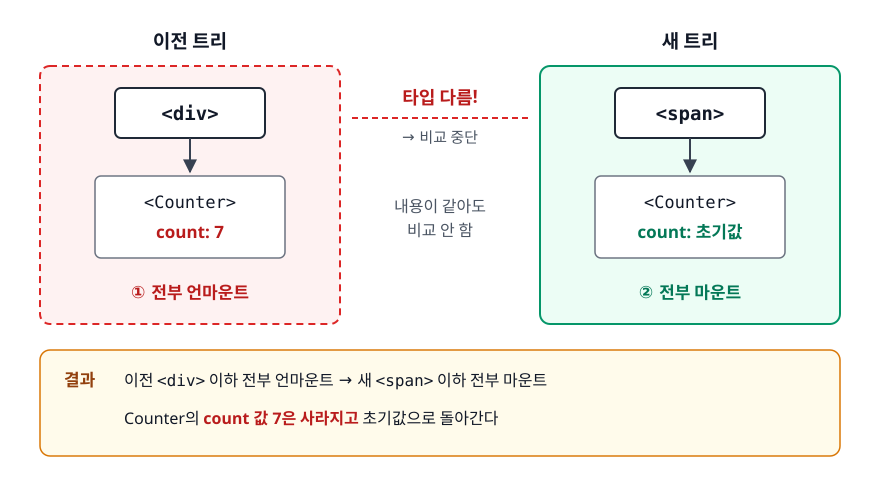
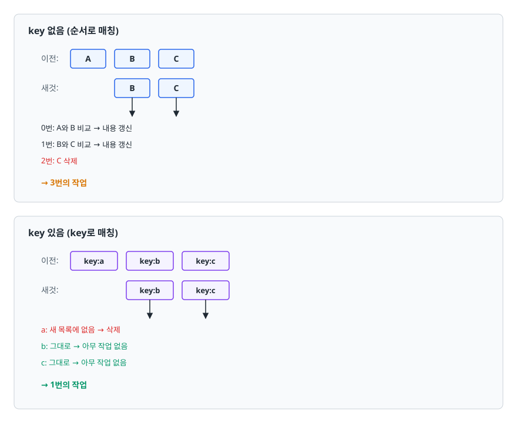
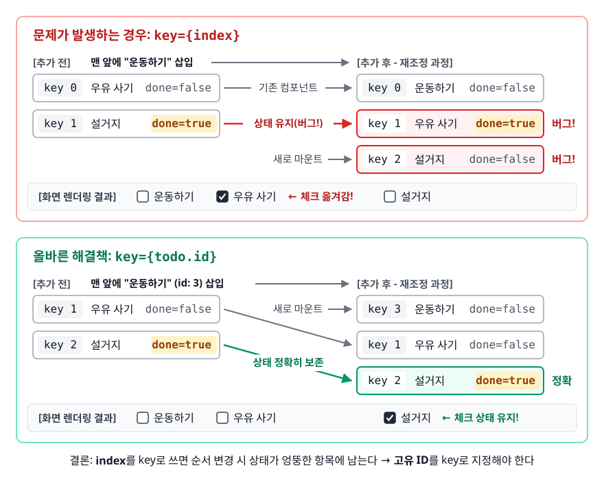
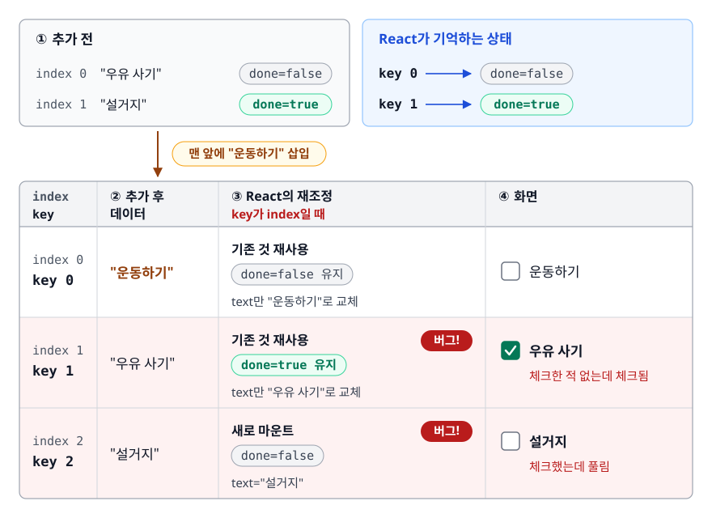
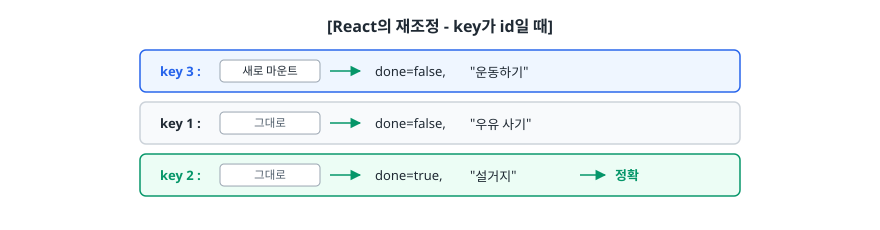

# 재조정 (Reconciliation)

> React는 두 Virtual DOM 트리를 비교해 최소한의 변경만 찾아낸다고 믿기 쉽습니다. 실제로는 두 가지 규칙으로 "무엇이 바뀌었는지"를 판단하고, 그 규칙을 어기면 버그가 납니다. 이 문서는 그 규칙과 부작용을 가려냅니다.

## 학습 목표

- [ ] 트리 비교가 왜 원래 비현실적인 문제이고 React가 어떤 가정으로 이를 우회했는지 설명할 수 있다
- [ ] "타입이 다르면 통째로 교체" 규칙이 만드는 상태 손실 버그를 예측할 수 있다
- [ ] `key`에 배열 인덱스를 쓰면 안 되는 이유를 구체적 시나리오로 설명할 수 있다
- [ ] 리렌더링이 발생하는 조건과, 리렌더링이 곧 DOM 변경은 아니라는 점을 구분할 수 있다

## 선행 지식

- [01-virtual-dom.md](./01-virtual-dom.md) - 비교 대상인 트리가 무엇인지 먼저 알아야 합니다

---

## 1. 왜 필요한가

### 트리 비교는 원래 비싼 문제다

이전 트리와 새 트리가 있을 때, "최소 몇 번의 삽입·삭제·이동으로 이전 트리를 새 트리로 바꿀 수 있는가"를 정확히 푸는 것은 트리 편집 거리(tree edit distance) 문제입니다. 노드가 n개일 때 알려진 최적 알고리즘의 복잡도는 O(n³) 수준입니다.

노드가 1,000개인 평범한 화면이면 10억 번의 연산입니다. 클릭 한 번에 이걸 하고 있을 수는 없습니다.

### React의 선택: 정확함을 버리고 실용성을 취한다

React는 **최소 변경을 보장하지 않습니다.** 대신 "UI에서는 대개 이렇더라"는 두 가지 경험적 가정(휴리스틱)을 세웁니다. 그 가정 아래에서 O(n)으로 비교를 끝냅니다.

```
정확한 최소 변경 계산  →  O(n³)  →  현실적으로 불가능
휴리스틱 기반 근사 계산 →  O(n)   →  대부분의 UI에서 충분히 좋음
```

이 트레이드오프가 이 문서의 출발점입니다. **React가 가끔 "멍청하게" 동작하는 것처럼 보이는 순간들은 대부분 이 가정이 깨졌기 때문**입니다. 아래 두 규칙과 그 부작용이 본론입니다.

---

## 2. 휴리스틱 1 — 타입이 다르면 통째로 교체한다

### 규칙

같은 위치의 노드를 비교할 때, **타입(`type`)이 다르면 비교를 중단하고 이전 서브트리 전체를 파괴한 뒤 새로 만듭니다.**

<!-- diagram:fe-reconciliation-1 -->


<!-- 위 그림이 대체한 원본 ASCII.
     내용을 고칠 때는 그림도 함께 갱신할 것.
```
이전 트리                     새 트리
┌──────────┐                ┌──────────┐
│  <div>   │                │  <span>  │   ← 타입 다름!
└────┬─────┘                └────┬─────┘
     │                           │
┌────▼──────┐               ┌────▼──────┐
│ <Counter> │               │ <Counter> │  ← 내용이 같아도 비교 안 함
│ count: 7  │               │           │
└───────────┘               └───────────┘

결과: 이전 <div> 이하 전부 언마운트 → 새 <span> 이하 전부 마운트
      Counter의 count 값 7은 사라지고 초기값으로 돌아간다
```
-->

"내용이 같은데 왜 재사용하지 않냐"고 물을 수 있습니다. 재사용 가능성을 확인하려면 서브트리 전체를 다시 뒤져야 합니다. 그게 바로 O(n³)로 가는 길입니다. React는 "타입이 바뀌었다면 개발자가 완전히 다른 걸 그리려는 것"이라고 가정하고 확인을 포기합니다.

### 위치가 같고 타입이 같으면 상태가 유지된다

뒤집어 말하면, **트리에서 같은 자리에 같은 타입의 컴포넌트가 있으면 React는 그것을 "같은 컴포넌트"로 보고 상태를 유지합니다.** JSX에서 서로 다른 분기에 적혀 있든, props가 전부 바뀌었든 상관없습니다.

```jsx
function App() {
  const [isFancy, setIsFancy] = useState(false);

  // isFancy가 바뀌어도 <Counter>는 같은 자리, 같은 타입
  // → count 상태가 그대로 유지된다
  return (
    <div>
      {isFancy
        ? <Counter theme="fancy" />
        : <Counter theme="plain" />}
      <button onClick={() => setIsFancy(v => !v)}>테마 전환</button>
    </div>
  );
}
```

### 안티패턴 — 컴포넌트 안에서 컴포넌트를 정의한다

이 규칙을 가장 흔하게 위반하는 코드입니다.

```jsx
// 안티패턴
function Parent() {
  const [count, setCount] = useState(0);

  // 렌더링될 때마다 "새로운 함수"가 만들어진다
  function Child() {
    const [text, setText] = useState('');
    return <input value={text} onChange={e => setText(e.target.value)} />;
  }

  return (
    <div>
      <button onClick={() => setCount(c => c + 1)}>{count}</button>
      <Child />
    </div>
  );
}
```

**왜 문제인가**: Virtual DOM 노드의 `type`은 컴포넌트 함수 그 자체입니다. `Parent`가 렌더링될 때마다 `Child`는 새로 만들어진 함수이므로, 이전 렌더의 `Child`와 참조가 다릅니다. React 입장에서는 타입이 바뀐 것이니 휴리스틱 1이 발동해 **매 렌더마다 `<input>`을 파괴하고 새로 만듭니다.** 사용자는 버튼을 누를 때마다 입력하던 글자와 포커스를 잃습니다.

```jsx
// 개선: 컴포넌트는 모듈 최상위에 선언한다
function Child() {
  const [text, setText] = useState('');
  return <input value={text} onChange={e => setText(e.target.value)} />;
}

function Parent() {
  const [count, setCount] = useState(0);
  return (
    <div>
      <button onClick={() => setCount(c => c + 1)}>{count}</button>
      <Child />
    </div>
  );
}
```

이제 `Child`는 모듈 로드 시 한 번만 만들어지고 참조가 고정되므로, `Parent`가 몇 번 렌더링되든 `<input>`은 재사용됩니다.

---

## 3. 휴리스틱 2 — key로 형제를 식별한다

### 규칙

같은 부모 아래의 자식 목록을 비교할 때, React는 기본적으로 **순서**(인덱스)로 짝을 맞춥니다. `key`가 있으면 순서 대신 **key 값**으로 짝을 맞춥니다.

<!-- diagram:fe-reconciliation-2 -->


<!-- 위 그림이 대체한 원본 ASCII.
     내용을 고칠 때는 그림도 함께 갱신할 것.
```
key 없음 (순서로 매칭)
  이전: [ A ] [ B ] [ C ]
  새것: [ B ] [ C ]
         │     │
         ▼     ▼
  0번: A와 B 비교 → 내용 갱신
  1번: B와 C 비교 → 내용 갱신
  2번: C 삭제
  → 3번의 작업

key 있음 (key로 매칭)
  이전: [key:a] [key:b] [key:c]
  새것:         [key:b] [key:c]
                  │       │
                  ▼       ▼
  a: 새 목록에 없음 → 삭제
  b: 그대로 → 아무 작업 없음
  c: 그대로 → 아무 작업 없음
  → 1번의 작업
```
-->

`key`는 "이 자리에 있는 것"이 아니라 "이것이 무엇인지"를 알려 주는 신원 증명서입니다. **React가 key를 보는 범위는 같은 부모 아래의 형제들 사이뿐**이며 전역에서 유일할 필요는 없습니다.

### 안티패턴 — 배열 인덱스를 key로 쓴다

```jsx
// 안티패턴
{todos.map((todo, index) => (
  <TodoItem key={index} todo={todo} />
))}
```

**왜 문제인가**: 인덱스는 "몇 번째 자리인가"이지 "무엇인가"가 아닙니다. key로 인덱스를 주는 것은 key를 안 준 것과 사실상 결과가 같습니다. 목록의 순서가 바뀌거나 중간에 삽입·삭제가 일어나면 같은 인덱스가 다른 데이터를 가리키게 되고 React는 **엉뚱한 컴포넌트를 재사용합니다.**

### 실제 버그 시나리오

<!-- diagram:fe-reconciliation -->


체크박스가 달린 할 일 목록에서 **맨 앞에 새 항목을 추가**하는 상황입니다.

```jsx
function TodoList() {
  const [todos, setTodos] = useState([
    { id: 1, text: '우유 사기' },
    { id: 2, text: '설거지' },
  ]);

  const addFront = () => {
    setTodos(prev => [{ id: 3, text: '운동하기' }, ...prev]);
  };

  return (
    <>
      <button onClick={addFront}>맨 앞에 추가</button>
      {todos.map((todo, index) => (
        // 문제의 지점
        <TodoItem key={index} text={todo.text} />
      ))}
    </>
  );
}

function TodoItem({ text }) {
  // 이 done 상태는 React가 관리한다 (DOM이 아니라)
  const [done, setDone] = useState(false);
  return (
    <label>
      <input type="checkbox" checked={done} onChange={() => setDone(d => !d)} />
      {text}
    </label>
  );
}
```

사용자가 "설거지"에 체크한 뒤 "맨 앞에 추가" 버튼을 누릅니다.

<!-- diagram:fe-reconciliation-3 -->


<!-- 위 그림이 대체한 원본 ASCII.
     내용을 고칠 때는 그림도 함께 갱신할 것.
```
[추가 전]                              React가 기억하는 상태
  index 0: "우유 사기"   done=false      key 0 → done=false
  index 1: "설거지"      done=true       key 1 → done=true

        ↓ 맨 앞에 "운동하기" 삽입

[추가 후 - 데이터]
  index 0: "운동하기"
  index 1: "우유 사기"
  index 2: "설거지"

[React의 재조정 - key가 index일 때]
  key 0 : 기존 것 재사용 → done=false 유지, text만 "운동하기"로 교체
  key 1 : 기존 것 재사용 → done=true  유지, text만 "우유 사기"로 교체  ← 버그!
  key 2 : 새로 마운트   → done=false, text="설거지"                    ← 버그!

[화면]
  [ ] 운동하기
  [v] 우유 사기     ← 체크한 적 없는데 체크됨
  [ ] 설거지        ← 체크했는데 풀림
```
-->

**체크 표시가 다른 항목으로 옮겨 갔습니다.** 데이터(`todos`)는 완벽히 정확한데 화면만 틀렸습니다. 이런 버그는 콘솔에 에러도 안 나고 데이터를 아무리 들여다봐도 원인이 안 보입니다.

```jsx
// 개선: 데이터 고유의 안정적인 ID를 key로 쓴다
{todos.map(todo => (
  <TodoItem key={todo.id} text={todo.text} />
))}
```

<!-- diagram:fe-reconciliation-4 -->


<!-- 위 그림이 대체한 원본 ASCII.
     내용을 고칠 때는 그림도 함께 갱신할 것.
```
[React의 재조정 - key가 id일 때]
  key 3 : 새로 마운트 → done=false, "운동하기"
  key 1 : 그대로      → done=false, "우유 사기"
  key 2 : 그대로      → done=true,  "설거지"      ← 정확
```
-->

### 인덱스 key가 허용되는 조건

세 가지를 **모두** 만족할 때만 안전합니다.

1. 목록이 절대 재정렬되지 않습니다 (정렬·필터 기능이 없습니다)
2. 항목이 중간에 삽입·삭제되지 않습니다 (끝에만 덧붙이는 경우는 인덱스가 밀리지 않아 상대적으로 안전합니다)
3. 각 항목이 자체 상태나 비제어 입력(`<input>`의 값, 포커스 등)을 갖지 않습니다

정적인 안내 문구 목록 정도가 여기 해당합니다. 조건을 매번 따지느니 그냥 안정적인 ID를 쓰는 게 낫습니다.

### 안티패턴 — 렌더링 중 key를 생성한다

```jsx
// 안티패턴
{items.map(item => <Item key={Math.random()} data={item} />)}
{items.map(item => <Item key={crypto.randomUUID()} data={item} />)}
```

**왜 문제인가**: 렌더링할 때마다 key가 전부 새 값이 됩니다. React는 모든 항목이 사라지고 전혀 다른 항목이 새로 생겼다고 판단해 **매 렌더마다 전체 목록을 언마운트하고 재마운트합니다.** 상태가 전부 초기화되고, 애니메이션이 끊기고, 성능도 최악이 됩니다. ID가 없다면 데이터를 만들 때(서버에서 받을 때, 배열에 추가할 때) 한 번 부여해서 고정시켜야 합니다.

### key의 반대 활용 — 일부러 상태를 초기화하기

key는 재사용시키는 도구인 동시에 재사용을 끊는 도구입니다. 다른 사용자를 선택했을 때 폼 내용을 초기화하고 싶다면, effect로 상태를 리셋하는 대신 key를 바꾸면 됩니다.

```jsx
// 안티패턴: props가 바뀔 때 effect로 state를 초기화
function ProfileForm({ userId }) {
  const [draft, setDraft] = useState('');
  useEffect(() => { setDraft(''); }, [userId]);  // 렌더 → effect → 재렌더
  // ...
}

// 개선: key를 바꿔 컴포넌트 자체를 새로 마운트
function Page({ userId }) {
  return <ProfileForm key={userId} userId={userId} />;
}

function ProfileForm({ userId }) {
  const [draft, setDraft] = useState('');  // 마운트 시 자동으로 초기값
  // ...
}
```

`userId`가 바뀌면 key가 바뀌고, React는 이전 `ProfileForm`을 버리고 새로 마운트합니다. 초기화 코드를 직접 쓸 필요가 없고, 초기화 대상을 빠뜨릴 위험도 없습니다.

---

## 4. 리렌더링은 언제 일어나는가

재조정은 리렌더링이 일어난 뒤 시작됩니다. 그렇다면 리렌더링 자체는 무엇이 유발할까요?

| 원인 | 조건 | 비고 |
|------|------|------|
| 자신의 state 변경 | `Object.is`로 비교해 이전 값과 다를 때 | 같은 값을 set하면 대개 건너뛰지만 판단을 위해 한 번 더 렌더링될 수는 있다 |
| 부모의 리렌더링 | 조건 없음 (props가 안 바뀌어도) | 가장 흔한 원인 |
| 구독 중인 Context 값 변경 | Provider의 `value`가 바뀔 때 | `useContext`를 쓴 모든 컴포넌트 |
| 외부 스토어 변경 | `useSyncExternalStore` 등으로 구독한 값이 바뀔 때 | Redux, Zustand 등이 사용 |

**결론**: "props가 안 바뀌면 자식은 안 그려진다"는 흔한 오해입니다. 기본 동작은 정반대입니다. 막고 싶다면 `React.memo`로 감싸거나 컴포넌트 구조를 바꿔야 합니다.

### 불변성이 필요한 이유가 여기 있다

state 비교는 `Object.is` 기반의 얕은 비교입니다. 객체 내부를 뒤져 보지 않습니다.

```jsx
// 안티패턴: 원본을 직접 변경
const handleAdd = () => {
  items.push(newItem);   // 배열 내용은 바뀌었지만
  setItems(items);       // 참조는 그대로 → Object.is가 같다고 판단 → 렌더 안 함
};

// 개선: 새 참조를 만든다
const handleAdd = () => {
  setItems(prev => [...prev, newItem]);
};
```

### 리렌더링 ≠ DOM 업데이트

리렌더링이 일어나도 재조정 결과 차이가 없으면 실제 DOM은 건드리지 않습니다. 그래서 **리렌더링 횟수 자체가 목표 지표가 되어서는 안 됩니다.** 최적화의 대상은 "느린 렌더", 즉 렌더 함수 안에서 무거운 계산을 하거나 노드 수가 수천 개인 경우입니다. 무엇이 느린지는 React DevTools Profiler로 먼저 확인합니다.

---

## 5. 실무에서는

- 목록 데이터에 ID가 없을 때는 **서버 응답을 받는 지점이나 상태에 넣는 지점에서** ID를 부여합니다. 렌더링 함수 안에서 만들면 매번 달라집니다.
- 정렬·필터 기능이 있는 테이블은 인덱스 key 버그가 가장 잘 드러나는 곳입니다. 정렬 버튼을 누른 뒤 행의 체크박스나 펼침 상태가 엉뚱하게 따라다닌다면 거의 항상 key 문제입니다.
- `key` 경고(`Each child in a list should have a unique "key" prop`)를 인덱스로 막는 것은 경고만 끄고 버그는 남겨 두는 조치입니다. 경고를 없애는 게 아니라 신원을 부여하는 게 목적입니다.
- 조건부 렌더링에서 두 분기가 같은 컴포넌트를 쓰는데 상태가 유지되기를 원치 않는다면, 분기마다 다른 `key`를 주면 됩니다.

---

## 6. 면접 포인트

> 면접에서 이 주제가 나오면 이렇게 답한다

**Q. React의 재조정 알고리즘을 설명해 주세요.**

A. 이전 Virtual DOM 트리와 새 트리를 비교해 실제 DOM에 적용할 변경 목록을 만드는 과정입니다. 일반적인 트리 비교는 O(n³)이라 실용적이지 않아서 React는 두 가지 휴리스틱으로 O(n)에 가깝게 만들었습니다. 첫째, 같은 위치의 엘리먼트 타입이 다르면 서브트리를 통째로 교체합니다. 둘째, 형제 노드는 `key`로 신원을 판단해 순서가 바뀌어도 재사용합니다. 최소 변경을 보장하지는 않지만 대부분의 UI 패턴에서 충분히 좋은 결과를 냅니다.

- 꼬리 질문: "휴리스틱이 틀리는 경우도 있나요?" → 있습니다. `<div>`를 `<span>`으로 바꾸는 것처럼 자식이 그대로인데 래퍼 타입만 바뀌면 자식 전체가 재생성됩니다. 이론적 최소 변경은 아니지만 그 경우를 잡아내는 비용이 이득보다 크다고 판단한 설계입니다.

**Q. key에 배열 인덱스를 쓰면 왜 안 되나요?**

A. 인덱스는 "무엇인가"가 아니라 "몇 번째 자리인가"라서, 목록이 재정렬되거나 중간에 삽입·삭제되면 같은 인덱스가 다른 데이터를 가리킵니다. React는 인덱스가 같으면 같은 항목이라고 보고 컴포넌트를 재사용하므로, 컴포넌트 내부 state나 입력값이 엉뚱한 항목에 붙습니다. 예를 들어 체크박스 목록의 맨 앞에 항목을 추가하면 체크 표시가 한 칸씩 밀립니다.

- 꼬리 질문: "그럼 인덱스를 써도 되는 경우는?" → 목록이 재정렬·삽입·삭제되지 않고, 각 항목이 자체 상태나 비제어 입력을 갖지 않을 때입니다. 세 조건을 다 만족하는 정적 목록에 한합니다.
- 꼬리 질문: "`Math.random()`을 key로 쓰면?" → 더 나쁩니다. 매 렌더마다 전부 새 항목으로 인식해 전체를 재마운트합니다.

**Q. 부모가 리렌더링되면 자식도 항상 리렌더링되나요?**

A. props가 바뀌지 않아도 기본적으로 함께 리렌더링됩니다. 다만 리렌더링은 컴포넌트 함수를 다시 실행해 새 Virtual DOM을 만드는 것이지 DOM을 다시 만드는 게 아니라서 대부분은 문제가 되지 않습니다. 실제로 느릴 때만 `React.memo`를 적용하거나, 자주 바뀌는 state를 별도의 작은 컴포넌트로 내려 영향 범위를 줄이는 방식으로 대응합니다.

- 꼬리 질문: "`React.memo`를 붙였는데도 리렌더링되는 이유는?" → props로 객체·배열·함수 리터럴을 넘기면 매 렌더마다 참조가 달라져 얕은 비교가 실패합니다. `useMemo`/`useCallback`으로 참조를 고정해야 합니다.

---

## 자주 하는 실수

| 실수 | 왜 틀렸나 | 올바른 이해 |
|------|----------|-----------|
| key를 전역 유일 ID로 만들려 애쓴다 | key는 같은 부모의 형제들 사이에서만 비교된다 | 형제 사이에서만 유일하면 충분하다 |
| key 경고를 인덱스로 막는다 | 경고만 사라지고 재사용 오류는 그대로다 | 데이터에 안정적인 ID를 부여한다 |
| key를 props처럼 컴포넌트 안에서 읽으려 한다 | `key`는 React가 소비하고 props로 전달되지 않는다 | 필요하면 `id` 등 별도 prop으로 함께 넘긴다 |
| 컴포넌트를 다른 컴포넌트 함수 안에 정의한다 | 매 렌더마다 타입이 달라져 서브트리가 재마운트된다 | 컴포넌트는 모듈 최상위에 선언한다 |
| 리렌더링 횟수를 0으로 만드는 게 목표라고 생각한다 | 리렌더링은 대부분 저렴하고 DOM 변경과 다르다 | 프로파일러로 실제 느린 지점만 최적화한다 |

---

## 한 줄 정리

재조정은 "**타입이 다르면 통째로 버리고, 형제는 key로 신원을 확인한다**"는 두 가정으로 트리 비교를 O(n)까지 낮춘 알고리즘입니다. 이 가정을 깨는 코드(인덱스 key, 렌더 중 컴포넌트 정의)가 곧 버그가 됩니다.

---

## 연관 개념

- [01-virtual-dom.md](./01-virtual-dom.md) - 비교 대상이 되는 트리의 정체
- [03-fiber-architecture.md](./03-fiber-architecture.md) - 이 비교 작업을 쪼개서 중단 가능하게 만든 구조
- [04-hooks-internals.md](./04-hooks-internals.md) - 재사용될 때 상태가 어디에 붙어 있는지
- [05-useEffect-vs-useLayoutEffect.md](./05-useEffect-vs-useLayoutEffect.md) - 재조정 결과가 커밋된 뒤 실행되는 것들
- [qna-react.md](./qna-react.md) - React 면접 질문 모음
- [리플로우와 리페인트](../browser-fundamentals/04-reflow-repaint.md) - DOM 변경이 유발하는 브라우저 쪽 비용
