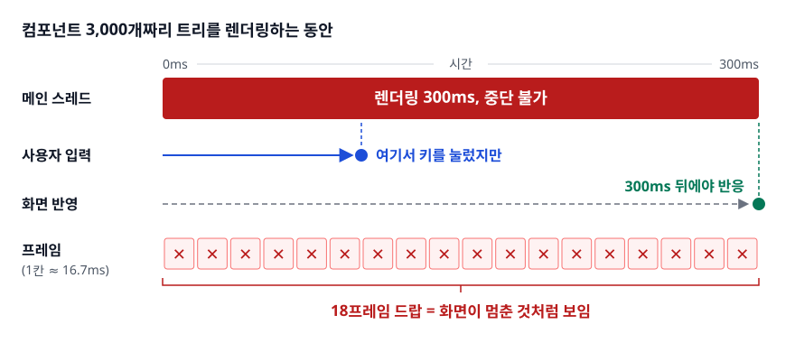
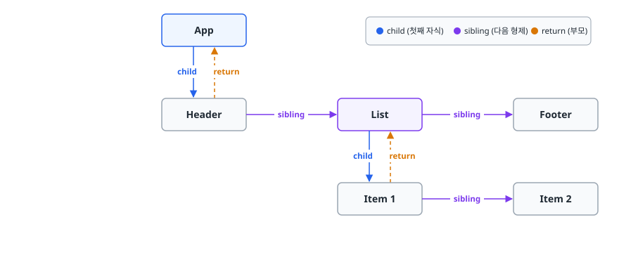
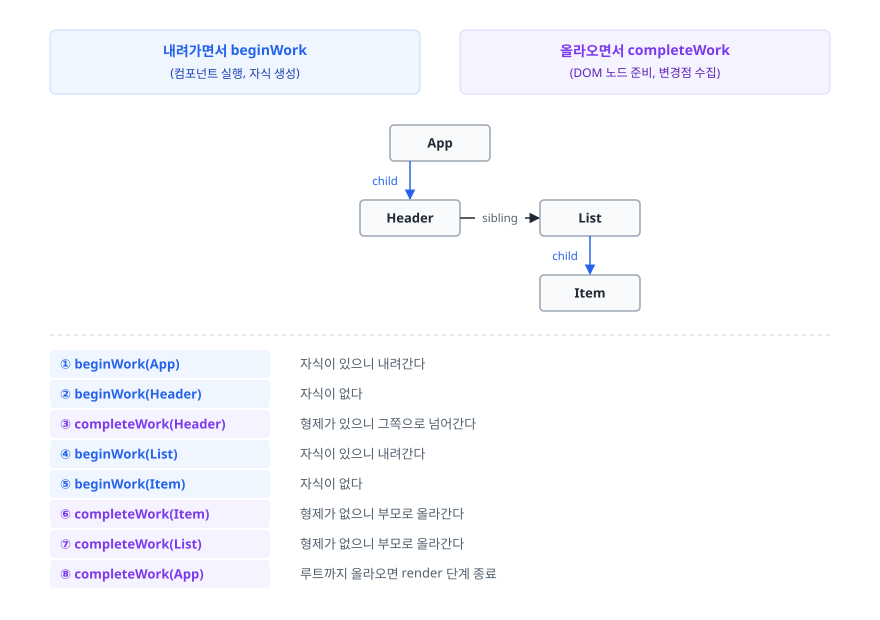
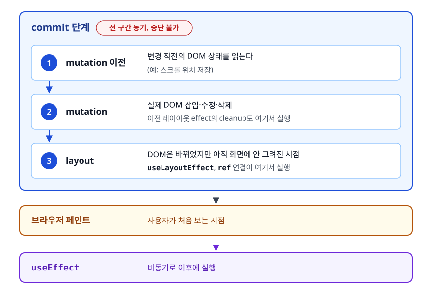
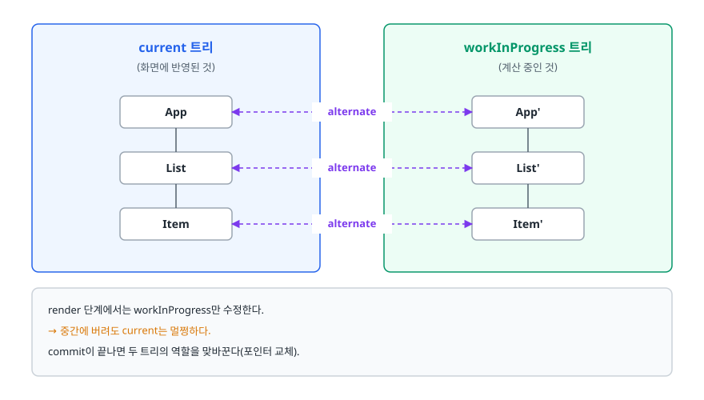

# Fiber 아키텍처 (Fiber Architecture)

> React가 렌더링 작업을 왜 잘게 쪼갰는지, 그 결과로 무엇이 가능해졌고 무엇은 여전히 불가능한지 설명할 수 있게 됩니다.

## 학습 목표

- [ ] 기존 Stack Reconciler가 왜 중단될 수 없었는지 자료구조 관점에서 설명할 수 있다
- [ ] Fiber 노드가 "작업 단위"라는 말의 의미를 설명할 수 있다
- [ ] render 단계와 commit 단계를 나눈 이유와, 각 단계의 제약을 말할 수 있다
- [ ] `useTransition`, `useDeferredValue`, `Suspense`가 왜 Fiber 위에서만 가능한지 연결할 수 있다

## 선행 지식

- [02-reconciliation.md](./02-reconciliation.md) - Fiber는 이 재조정 작업을 수행하는 엔진이다
- JavaScript가 단일 스레드이며 이벤트 루프로 동작한다는 것

---

## 1. 왜 필요한가

### 브라우저는 한 명의 일꾼으로 두 가지 일을 한다

브라우저의 메인 스레드는 JavaScript 실행과 화면 그리기를 **번갈아** 처리합니다. 동시에 하는 게 아닙니다. 60fps로 부드럽게 보이려면 프레임 하나당 약 16.7ms 안에 "JS 실행 + 스타일 계산 + 레이아웃 + 페인트"를 모두 끝내야 합니다.

JavaScript가 이 예산을 다 써 버리면 그 프레임은 그려지지 않습니다. 사용자에게는 화면이 멈추고, 클릭이 씹히고, 입력한 글자가 뒤늦게 나타나는 것으로 보입니다.

### Stack Reconciler는 왜 멈출 수 없었나

React 15까지의 재조정 엔진은 트리를 **재귀 함수**로 순회했습니다.

```js
// 개념적으로 이런 형태였다
function reconcile(element) {
  updateNode(element);
  for (const child of element.children) {
    reconcile(child);   // 재귀
  }
}
```

재귀는 호출 스택(call stack)에 진행 상황을 쌓습니다. 이 스택은 **JS 엔진이 관리하는 영역이라 개발자가 손댈 수 없습니다.** 중간에 "여기까지만 하고 나중에 여기서부터 이어서 하자"고 저장할 방법이 없습니다. 함수를 빠져나오면 스택은 사라집니다.

그래서 한 번 시작한 렌더링은 끝까지 가야 했습니다.

<!-- diagram:fe-fiber-architecture-1 -->


<!-- 위 그림이 대체한 원본 ASCII.
     내용을 고칠 때는 그림도 함께 갱신할 것.
```
컴포넌트 3,000개짜리 트리를 렌더링하는 동안

메인 스레드: ████████████████████████████████████  (300ms, 중단 불가)
                        │
사용자 입력  ───────────►│ (여기서 키를 눌렀지만)
                        │
화면 반영    ────────────────────────────────────► (300ms 뒤에야 반응)

프레임:      ✕ ✕ ✕ ✕ ✕ ✕ ✕ ✕ ✕ ✕ ✕ ✕ ✕ ✕ ✕ ✕ ✕ ✕
             (18프레임 드랍 = 화면이 멈춘 것처럼 보임)
```
-->

특히 나쁜 조합은 **입력창 + 무거운 목록**입니다. 글자를 하나 칠 때마다 수천 개 항목을 다시 그리느라, 타이핑이 뚝뚝 끊깁니다. 문제는 "목록 갱신이 느리다"가 아니라 "목록 갱신 때문에 **글자 입력이라는 훨씬 급한 일**이 밀린다"는 것입니다.

### 해결 방향: 작업을 쪼개고 스택을 직접 관리한다

React 16에서 도입된 Fiber는 재귀를 버리고, **진행 상황을 자체 자료구조에 저장하는 반복문**으로 순회 방식을 바꿨습니다. 스택을 JS 엔진이 아니라 React가 직접 들고 있으면, 언제든 멈추고 나중에 이어서 할 수 있습니다.

---

## 2. Fiber 노드 — 작업 단위이자 진행 상황 기록

### 정의

Fiber는 **컴포넌트 하나에 대응하는 작업 단위(unit of work)를 표현한 객체**입니다. React 엘리먼트가 "무엇을 그릴지"를 담는다면, Fiber는 "그것을 그리기 위해 무슨 일이 남았는지"까지 담습니다.

```js
// Fiber 노드 (개념적으로 단순화한 형태)
{
  type: 'div',            // 컴포넌트 타입 (문자열 또는 함수)
  key: null,

  stateNode: domNode,     // 대응하는 실제 DOM 노드 또는 인스턴스

  // 트리 구조를 만드는 포인터
  return: parentFiber,    // 부모 (작업이 끝나면 "돌아갈" 곳)
  child: firstChildFiber, // 첫째 자식
  sibling: nextFiber,     // 다음 형제

  // 작업에 필요한 데이터
  pendingProps: {},       // 이번에 처리할 새 props
  memoizedProps: {},      // 지난번에 처리한 props
  memoizedState: {},      // 훅 연결 리스트의 시작점

  alternate: otherFiber,  // 짝이 되는 이전/다음 버전 fiber
  flags: Placement,       // 커밋 때 무엇을 할지 표시하는 비트 플래그
                          // (삽입/수정/삭제 등을 비트 연산으로 합쳐 둔다)
}
```

주목할 것은 **자식이 배열이 아니라 `child` 하나 + `sibling` 체인**이라는 점입니다. 배열 인덱스로 자식을 순회하면 "몇 번째까지 했는지"를 별도로 기억해야 하지만, 링크드 리스트 형태면 **현재 fiber 포인터 하나만 들고 있으면 그 자체가 진행 상황**이 됩니다.

<!-- diagram:fe-fiber-architecture-2 -->


<!-- 위 그림이 대체한 원본 ASCII.
     내용을 고칠 때는 그림도 함께 갱신할 것.
```
        ┌──────────┐
        │   App    │
        └────┬─────┘
   child │   ▲ return
        ▼   │
     ┌──────────┐  sibling  ┌──────────┐  sibling  ┌──────────┐
     │  Header  │ ────────► │   List   │ ────────► │  Footer  │
     └──────────┘           └────┬─────┘           └──────────┘
                       child │   ▲ return
                            ▼   │
                        ┌──────────┐  sibling  ┌──────────┐
                        │  Item 1  │ ────────► │  Item 2  │
                        └──────────┘           └──────────┘
```
-->

이 구조 덕분에 재귀 없이 반복문으로 트리 전체를 순회할 수 있고, 어느 지점에서든 멈춰서 그 포인터만 저장해 두면 나중에 정확히 이어서 할 수 있습니다.

### 비유: 재귀는 두루마리, Fiber는 인덱스 카드

Stack Reconciler는 두루마리에 이어서 쓰는 방식이었습니다. 중간에 멈추면 어디까지 썼는지 표시할 방법이 마땅치 않습니다. Fiber는 작업을 카드 한 장씩으로 나누고 "다음 카드"를 가리키는 화살표를 붙여 둔 것입니다. 하던 카드에 클립을 꽂아 두고 자리를 떠도 됩니다.

**비유의 한계**: 카드는 물리적으로 한 장씩 처리되지만, React는 시간 예산이 남아 있는 동안 여러 카드를 연속으로 처리하고 예산이 떨어질 때만 양보합니다. 매번 멈추는 게 아닙니다.

---

## 3. 작업 루프 (Work Loop)

React는 이런 형태의 반복문으로 트리를 처리합니다.

```js
// 개념적 구조
function workLoop() {
  while (workInProgress !== null && !shouldYield()) {
    workInProgress = performUnitOfWork(workInProgress);
  }
  // shouldYield()가 true면 여기서 빠져나와 브라우저에 제어권을 넘긴다
  // workInProgress 포인터는 그대로 남아 있으므로 다음에 이어서 실행
}
```

`shouldYield()`는 "이번 시간 조각을 다 썼는가, 더 급한 일이 대기 중인가"를 확인합니다. 답이 참이면 루프를 빠져나오고 브라우저가 페인트나 이벤트 처리를 할 수 있게 비켜 줍니다.

각 fiber에서 수행되는 작업은 두 종류입니다.

<!-- diagram:fe-fiber-architecture-3 -->


<!-- 위 그림이 대체한 원본 ASCII.
     내용을 고칠 때는 그림도 함께 갱신할 것.
```
        내려가면서 beginWork          올라오면서 completeWork
        (컴포넌트 실행, 자식 생성)      (DOM 노드 준비, 변경점 수집)

                    ┌──────┐
                    │ App  │
                    └──┬───┘
               child   │
                    ┌──▼─────┐  sibling  ┌──────┐
                    │ Header │ ────────► │ List │
                    └────────┘           └──┬───┘
                                    child   │
                                         ┌──▼───┐
                                         │ Item │
                                         └──────┘

  ① beginWork(App)        자식이 있으니 내려간다
  ② beginWork(Header)     자식이 없다
  ③ completeWork(Header)  형제가 있으니 그쪽으로 넘어간다
  ④ beginWork(List)       자식이 있으니 내려간다
  ⑤ beginWork(Item)       자식이 없다
  ⑥ completeWork(Item)    형제가 없으니 부모로 올라간다
  ⑦ completeWork(List)    형제가 없으니 부모로 올라간다
  ⑧ completeWork(App)     루트까지 올라오면 render 단계 종료
```
-->

`beginWork`에서 컴포넌트 함수를 호출하고 이전 fiber와 비교해 자식 fiber를 만듭니다. 더 내려갈 자식이 없으면 `completeWork`로 올라오면서 DOM 노드를 준비하고 변경 사항을 기록합니다. 이 왕복이 트리 전체에 대해 끝나면 render 단계가 완료됩니다.

---

## 4. render 단계와 commit 단계

### 왜 나누는가

작업을 중단 가능하게 만들려면, **중단해도 안전한 구간**과 **절대 중단하면 안 되는 구간**을 분리해야 합니다.

계산하다 만 상태로 멈추는 건 괜찮습니다. 아무도 못 봅니다. 하지만 실제 DOM을 절반만 바꾸다 멈추면 사용자에게 **깨진 화면**이 보입니다. 헤더는 새 데이터인데 본문은 옛 데이터인 상태 같은 것입니다. 그래서 React는 "모든 계산을 끝낸 뒤, 그 결과를 한 번에 적용"하는 2단계 구조를 택했습니다.

| 구분 | render 단계 | commit 단계 |
|------|------------|------------|
| 하는 일 | 컴포넌트 실행, 재조정, 변경 목록 작성 | 실제 DOM 조작, ref 연결, effect 실행 |
| 중단 | 가능 (동시성 업데이트일 때) | 불가능 (항상 동기) |
| 폐기 | 가능 (더 급한 업데이트가 오면 버리고 다시) | 불가능 |
| 부수효과 | 있으면 안 됨 (여러 번 실행될 수 있으므로) | 여기서 일어남 |
| 사용자 눈에 보임 | 안 보임 | 보임 |

**결론**: 컴포넌트 함수 본문(= render 단계)에 부수효과를 쓰면 안 되는 이유가 바로 이것입니다. 그 코드는 중단·폐기·재실행될 수 있습니다.

### 안티패턴 — render 단계에서 부수효과를 일으킨다

```jsx
// 안티패턴
let renderCount = 0;

function Analytics({ userId }) {
  renderCount += 1;                       // 외부 변수 변경
  logToServer('view', userId);            // 네트워크 요청
  document.title = `사용자 ${userId}`;    // DOM 직접 조작
  return <div>...</div>;
}
```

**왜 문제인가**: render 단계는 순수해야 합니다. 동시성 렌더링에서 이 함수는 중단되었다가 다시 처음부터 실행될 수 있고, 그 결과가 버려질 수도 있습니다. 그러면 화면에 보이지도 않은 렌더에 대해 서버 로그가 남고, 카운터가 두 배로 오르고, 타이틀이 엉뚱한 값으로 바뀝니다. 개발 모드의 `StrictMode`가 컴포넌트를 두 번 호출하는 이유도 이런 코드를 조기에 드러내기 위해서입니다.

```jsx
// 개선: 부수효과는 commit 이후 실행되는 effect로 격리
function Analytics({ userId }) {
  useEffect(() => {
    logToServer('view', userId);
    document.title = `사용자 ${userId}`;
  }, [userId]);

  return <div>...</div>;
}
```

### 커밋은 다시 세 조각으로 나뉜다

<!-- diagram:fe-fiber-architecture-4 -->


<!-- 위 그림이 대체한 원본 ASCII.
     내용을 고칠 때는 그림도 함께 갱신할 것.
```
commit 단계 (전 구간 동기, 중단 불가)
  │
  ├─ mutation 이전 : 변경 직전의 DOM 상태를 읽는다
  │                  (예: 스크롤 위치 저장)
  │
  ├─ mutation      : 실제 DOM 삽입·수정·삭제
  │                  이전 레이아웃 effect의 cleanup도 여기서 실행
  │
  └─ layout        : DOM은 바뀌었지만 아직 화면에 안 그려진 시점
                     useLayoutEffect, ref 연결이 여기서 실행
  │
  ▼
브라우저 페인트 (사용자가 처음 보는 시점)
  │
  ▼
useEffect (비동기로 이후에 실행)
```
-->

`useLayoutEffect`가 "페인트 전에 동기로 실행된다"는 말은 layout 하위 단계에 속한다는 뜻입니다. 자세한 활용은 [05-useEffect-vs-useLayoutEffect.md](./05-useEffect-vs-useLayoutEffect.md)에서 다룹니다.

### 더블 버퍼링

React는 fiber 트리를 두 벌 유지합니다.

<!-- diagram:fe-fiber-architecture-5 -->


<!-- 위 그림이 대체한 원본 ASCII.
     내용을 고칠 때는 그림도 함께 갱신할 것.
```
   current 트리                 workInProgress 트리
   (화면에 반영된 것)            (계산 중인 것)

     App ◄──── alternate ────► App'
      │                          │
    List ◄──── alternate ────► List'
      │                          │
    Item ◄──── alternate ────► Item'

  render 단계에서는 workInProgress만 수정한다.
  → 중간에 버려도 current는 멀쩡하다.
  commit이 끝나면 두 트리의 역할을 맞바꾼다(포인터 교체).
```
-->

각 fiber의 `alternate` 필드가 짝을 가리킵니다. 게임 그래픽의 더블 버퍼링과 같은 발상입니다. 그리는 중인 화면을 보여 주지 않고, 다 그린 뒤 통째로 교체합니다.

---

## 5. 우선순위와 동시성 기능

### 모든 업데이트가 중단 가능한 것은 아니다

흔한 오해 하나를 먼저 정리하자. **Fiber를 쓴다고 모든 렌더링이 잘게 쪼개지는 게 아닙니다.** 클릭, 입력 같은 사용자 조작에서 발생한 업데이트는 즉각 반응해야 하므로 동기적으로 끝까지 렌더링됩니다. 중단·재개는 "급하지 않다"고 표시된 업데이트에만 적용됩니다.

그 표시를 개발자가 하는 API가 `startTransition`과 `useDeferredValue`입니다. (동시성 기능은 React 18에서 `createRoot`로 마운트한 앱에서 동작합니다.)

### useTransition — "이 업데이트는 급하지 않다"

```jsx
import { useState, useTransition } from 'react';

function SearchPage({ allItems }) {
  const [query, setQuery] = useState('');
  const [results, setResults] = useState(allItems);
  const [isPending, startTransition] = useTransition();

  function handleChange(e) {
    const value = e.target.value;

    // 급한 업데이트: 입력창의 글자는 즉시 반영되어야 한다
    setQuery(value);

    // 급하지 않은 업데이트: 목록 갱신은 밀려도 된다
    startTransition(() => {
      setResults(allItems.filter(item => item.name.includes(value)));
    });
  }

  return (
    <>
      <input value={query} onChange={handleChange} />
      <div style={{ opacity: isPending ? 0.6 : 1 }}>
        <ItemList items={results} />
      </div>
    </>
  );
}
```

사용자가 빠르게 타이핑하면, 목록 렌더링이 진행되던 중에 새 키 입력이 들어옵니다. React는 진행 중이던 목록 렌더링을 **중단하고 버린 뒤**, 급한 입력 업데이트를 먼저 처리하고, 그다음 최신 값으로 목록 렌더링을 다시 시작합니다. 그래서 입력이 끊기지 않습니다.

`isPending`은 "뒤에서 아직 작업 중"임을 알려 주므로 흐릿하게 표시하는 등의 피드백에 씁니다.

### useDeferredValue — 값 자체를 늦춘다

`startTransition`으로 감쌀 setter에 접근할 수 없을 때(예: props로 값이 내려올 때) 씁니다.

```jsx
function SearchResults({ query }) {
  const deferredQuery = useDeferredValue(query);

  // query가 바뀌면 화면은 즉시 갱신되지만,
  // deferredQuery는 한 박자 늦게 따라온다.
  // 이 무거운 목록은 늦은 값 기준으로 렌더링된다.
  const results = useMemo(
    () => search(deferredQuery),
    [deferredQuery]
  );

  return <List items={results} isStale={query !== deferredQuery} />;
}
```

### 디바운스와 무엇이 다른가

| 구분 | 디바운스/스로틀 | 동시성 기능 |
|------|---------------|------------|
| 방식 | 일정 시간 기다렸다가 시작 | 즉시 시작하되 급한 일이 오면 양보 |
| 기기 성능 반영 | 못 함 (시간이 고정) | 함 (빠른 기기는 즉시 끝남) |
| 렌더링 자체의 블로킹 | 못 막음 (일단 시작하면 끝까지) | 막음 (중단 가능) |
| 언제 | 네트워크 요청 횟수 줄이기 | 무거운 렌더링으로 인한 입력 지연 해소 |

**결론**: API 호출 횟수를 줄이는 게 목적이면 디바운스, 이미 가진 데이터를 렌더링하는 게 느려서 입력이 밀리는 거면 동시성 기능입니다. 둘은 대체재가 아니라 서로 다른 문제를 풉니다.

### Suspense도 같은 기반 위에 있다

`Suspense`는 "자식이 아직 준비되지 않았으면 fallback을 보여 준다"는 선언적 로딩 처리입니다.

```jsx
const Chart = lazy(() => import('./Chart'));

<Suspense fallback={<Skeleton />}>
  <Chart />
</Suspense>
```

준비되지 않은 컴포넌트를 만났을 때 **렌더 작업을 중단하고 트리의 다른 부분으로 넘어갔다가 나중에 재개**할 수 있어야 이 동작이 성립합니다. 그래서 Suspense는 Fiber 구조 위에서만 가능합니다. 또한 `startTransition` 안에서 발생한 업데이트가 무언가를 기다리게 되면, React는 fallback으로 화면을 비우는 대신 이전 화면을 유지합니다. 이미 보고 있던 콘텐츠가 로딩 스켈레톤으로 되돌아가는 퇴행을 막기 위해서입니다.

---

## 6. 오해 정정

**"Fiber는 멀티스레딩이다"** — 아닙니다. JavaScript는 여전히 단일 스레드이고, React가 워커를 쓰는 것도 아닙니다. Fiber가 하는 일은 **자발적으로 실행권을 놓아 주는 협력적 스케줄링**입니다. 긴 작업을 짧은 조각으로 나눠 사이사이에 브라우저가 일할 틈을 주는 것뿐입니다.

**"Fiber를 쓰면 렌더링이 빨라진다"** — 아닙니다. 총 작업량은 같고, 스케줄링 관리 비용이 붙어 오히려 조금 늘어납니다. 좋아지는 것은 **응답성**입니다. 전체 소요 시간은 비슷하거나 약간 길어도, 그 사이에 사용자 입력이 처리되므로 체감이 완전히 달라집니다.

**"내 앱은 자동으로 동시성 렌더링을 한다"** — 아닙니다. 아무 표시도 하지 않은 업데이트는 여전히 동기적으로 처리됩니다. `startTransition`이나 `useDeferredValue`로 명시적으로 낮은 우선순위를 지정해야 중단 가능한 렌더링이 됩니다.

---

## 7. 실무에서는

- 입력창과 무거운 목록이 한 화면에 있고 타이핑이 끊긴다면, 먼저 React DevTools Profiler로 어떤 컴포넌트가 얼마나 걸리는지 측정합니다. 그다음 목록 갱신을 `startTransition`으로 감싸는 것이 표준 처방입니다.
- 그래도 느리다면 우선순위 문제가 아니라 **작업량 자체**가 문제입니다. 목록 가상화로 렌더링할 노드 수를 줄이거나, 필터링 로직을 개선해야 합니다. Fiber는 일을 없애 주지 않습니다.
- `React.StrictMode`는 개발 모드에서 컴포넌트를 두 번 호출합니다. 이는 render 단계가 순수하지 않은 코드를 미리 찾아내기 위한 장치이고, 프로덕션 빌드에서는 일어나지 않습니다. "두 번 실행돼서 이상하다"고 StrictMode를 끄는 것은 경고등을 떼는 것과 같습니다.
- Fiber 내부 구현(`flags`, `lanes` 등)은 공개 API가 아니라 버전에 따라 바뀝니다. 면접에서도 내부 필드명을 외우는 것보다 **"왜 이런 구조가 필요했는가"**를 설명하는 쪽이 훨씬 좋은 평가를 받습니다.

---

## 8. 면접 포인트

> 면접에서 이 주제가 나오면 이렇게 답한다

**Q. React Fiber가 무엇이고 어떤 문제를 해결했나요?**

A. React 16에서 도입된 재조정 엔진입니다. 이전 Stack Reconciler는 트리를 재귀로 순회해서 진행 상황이 JS 호출 스택에 쌓였고, 그 스택은 개발자가 저장하거나 복원할 수 없어 렌더링을 중단할 수 없었습니다. 그래서 큰 업데이트가 메인 스레드를 오래 점유하면 입력이 밀리고 프레임이 드랍됐습니다. Fiber는 컴포넌트마다 작업 단위 객체를 만들고 부모·자식·형제를 포인터로 연결해, 재귀 대신 반복문으로 순회하면서 언제든 멈추고 이어서 할 수 있게 만들었습니다.

- 꼬리 질문: "그럼 렌더링이 빨라진 건가요?" → 총 작업량은 오히려 조금 늘어납니다. 개선된 것은 속도가 아니라 응답성입니다. 렌더링 중간에 브라우저가 입력을 처리할 틈이 생깁니다.

**Q. render 단계와 commit 단계를 나눈 이유는 무엇인가요?**

A. 중단해도 안전한 구간과 그렇지 않은 구간을 분리하기 위해서입니다. render 단계는 계산만 하므로 중단하거나 결과를 버려도 사용자에게 보이지 않습니다. 반면 실제 DOM을 바꾸는 도중에 멈추면 화면이 절반만 갱신된 상태로 보이므로, commit 단계는 항상 동기적으로 끝까지 수행합니다. render 단계가 여러 번 실행되거나 폐기될 수 있기 때문에, 컴포넌트 함수 본문에 부수효과를 두면 안 된다는 규칙도 여기서 나옵니다.

- 꼬리 질문: "`useLayoutEffect`는 어느 단계인가요?" → commit 단계의 마지막 하위 단계입니다. DOM은 이미 바뀌었지만 브라우저가 아직 페인트하지 않은 시점에 동기로 실행되므로, DOM을 측정해 보정해도 깜빡임이 보이지 않습니다.

**Q. `useTransition`은 디바운스와 무엇이 다른가요?**

A. 디바운스는 일정 시간을 기다렸다가 작업을 시작하는 방식이라, 일단 시작하면 그 렌더링은 끝까지 메인 스레드를 점유합니다. 대기 시간이 고정값이라 기기 성능도 반영하지 못합니다. `useTransition`은 작업을 즉시 시작하되 더 급한 업데이트가 들어오면 진행 중인 렌더링을 버리고 양보합니다. 빠른 기기에서는 지연 없이 끝나고 느린 기기에서만 자연스럽게 밀립니다. 네트워크 요청 횟수를 줄이는 게 목적이면 디바운스가 맞고, 렌더링 자체가 무거워 입력이 밀리는 상황이면 `useTransition`이 맞습니다.

- 꼬리 질문: "Fiber가 멀티스레드인가요?" → 아닙니다. JavaScript는 여전히 단일 스레드이고, Fiber는 긴 작업을 조각내어 자발적으로 제어권을 양보하는 협력적 스케줄링입니다.

---

## 자주 하는 실수

| 실수 | 왜 틀렸나 | 올바른 이해 |
|------|----------|-----------|
| "Fiber = 병렬 처리" | JS는 단일 스레드이고 워커를 쓰지 않는다 | 시간 분할 + 자발적 양보(협력적 스케줄링) |
| "Fiber 도입으로 렌더링이 빨라졌다" | 총 작업량은 줄지 않는다 | 응답성이 좋아진 것이며 총 시간은 비슷하거나 늘 수 있다 |
| "React 18을 쓰면 모든 렌더가 중단 가능하다" | 표시하지 않은 업데이트는 여전히 동기다 | `startTransition`/`useDeferredValue`로 명시해야 한다 |
| "commit 단계도 쪼개면 되지 않나" | 화면이 부분만 갱신된 상태가 사용자에게 보인다 | 일관성을 위해 commit은 반드시 통째로 동기 실행 |
| "StrictMode의 이중 호출은 버그다" | 순수하지 않은 render를 드러내는 개발용 장치다 | 프로덕션에서는 일어나지 않으며 끄면 안 된다 |

---

## 한 줄 정리

Fiber는 **재귀 호출 스택에 갇혀 있던 렌더링 진행 상황을 React가 직접 관리하는 링크드 리스트 구조로 옮겨, 중단·재개·폐기와 우선순위 부여를 가능하게 만든 재조정 엔진**입니다.

---

## 연관 개념

- [02-reconciliation.md](./02-reconciliation.md) - Fiber가 수행하는 비교 알고리즘 자체
- [04-hooks-internals.md](./04-hooks-internals.md) - 훅 데이터가 fiber의 어디에 저장되는지
- [05-useEffect-vs-useLayoutEffect.md](./05-useEffect-vs-useLayoutEffect.md) - commit 단계의 하위 단계별 실행 시점
- [qna-react.md](./qna-react.md) - React 면접 질문 모음
- [이벤트 루프](../javascript-deep-dive/04-event-loop.md) - 단일 스레드에서 작업이 처리되는 순서
- [Critical Rendering Path](../browser-fundamentals/02-critical-rendering-path.md) - 프레임 하나가 그려지기까지의 파이프라인
