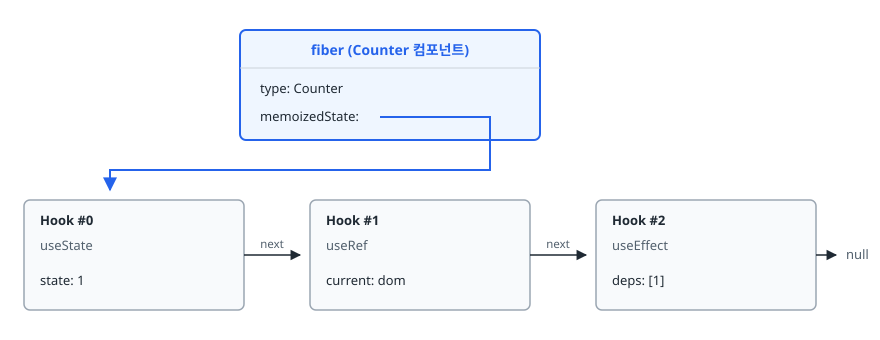
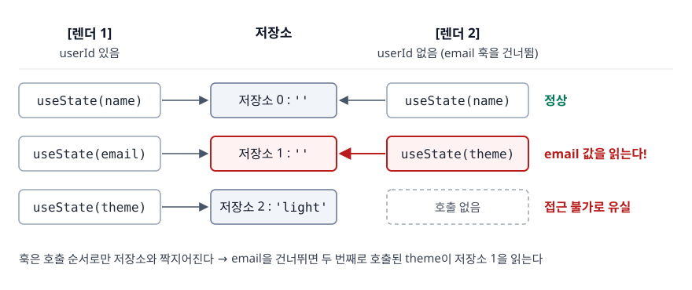
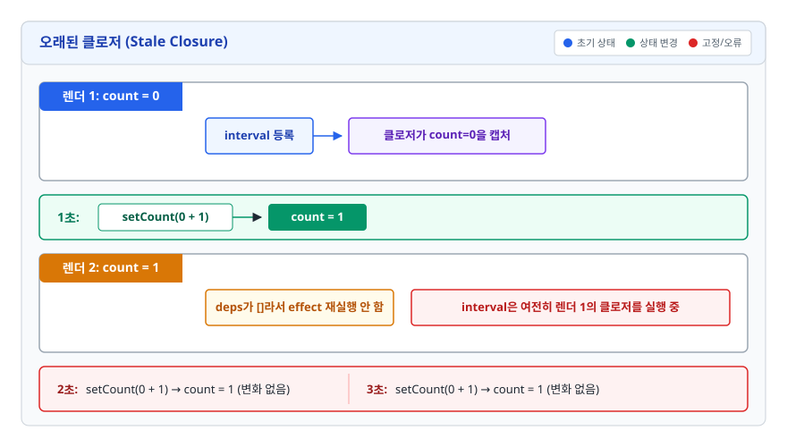
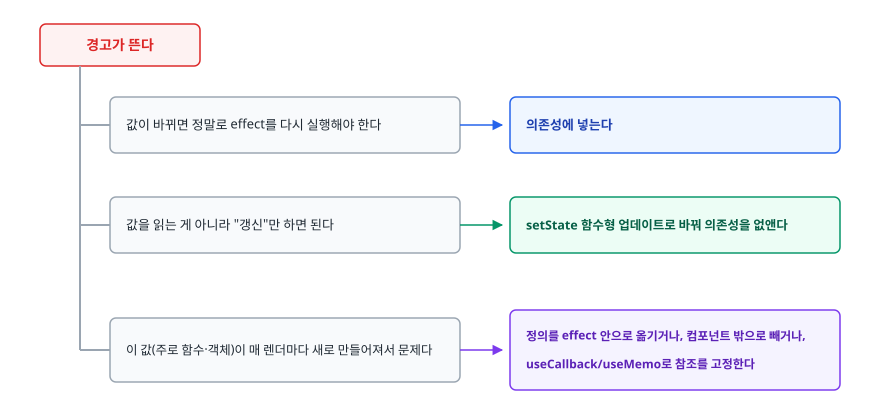

# Hooks 내부 동작 (Hooks Internals)

> 훅 규칙은 구현 방식에서 나옵니다. 매번 처음부터 다시 실행되는 함수 컴포넌트가 어떻게 상태를 기억하는지, 그래서 왜 "훅은 최상위에서만 호출"이라는 규칙이 생겼는지를 설명합니다.

## 학습 목표

- [ ] 훅 데이터가 어디에 어떤 자료구조로 저장되는지 설명할 수 있다
- [ ] 훅 호출 순서 규칙이 왜 필수인지, 어기면 어떤 일이 벌어지는지 재현할 수 있다
- [ ] `useMemo`/`useCallback`이 실제로 도움이 되는 경우와 무의미한 경우를 구분할 수 있다
- [ ] 의존성 배열에서 생기는 오래된 클로저(stale closure) 문제를 진단하고 고칠 수 있다
- [ ] 커스텀 훅이 공유하는 것이 로직이지 상태가 아니라는 것을 설명할 수 있다

## 선행 지식

- [03-fiber-architecture.md](./03-fiber-architecture.md) - 훅 데이터가 저장되는 곳이 fiber입니다
- JavaScript 클로저 개념

---

## 1. 왜 필요한가

### 클래스 컴포넌트에서 로직을 재사용하기 어려웠다

"창 크기를 구독해서 상태로 유지한다"는 로직을 여러 컴포넌트에서 쓰고 싶다고 해 보겠습니다. 클래스 컴포넌트에서는 이 로직이 **세 개의 생명주기 메서드에 흩어집니다.**

```jsx
class Dashboard extends React.Component {
  componentDidMount() {
    window.addEventListener('resize', this.handleResize);            // 구독 로직 A
    fetchData(this.props.id).then(d => this.setState({ data: d }));  // 데이터 로직 B
  }
  componentDidUpdate(prevProps) {
    if (prevProps.id !== this.props.id) {
      fetchData(this.props.id).then(d => this.setState({ data: d }));  // 로직 B
    }
  }
  componentWillUnmount() {
    window.removeEventListener('resize', this.handleResize);  // 로직 A
  }
}
```

**관련 있는 코드(A끼리, B끼리)는 떨어져 있고 관련 없는 코드(A와 B)는 같은 메서드에 섞여 있습니다.** 이 상태에서 A만 빼내어 다른 컴포넌트와 공유하려면 고차 컴포넌트(HOC)나 render props를 써야 했습니다. 그 결과 컴포넌트 트리가 `<withRouter><withTheme><withWindowSize><connect>` 식으로 래퍼에 겹겹이 둘러싸이는 문제가 생겼습니다. 훅은 이 문제를 **상태 로직을 컴포넌트 계층 구조와 분리해서 함수로 뽑아낼 수 있게** 만들어 해결했습니다.

```jsx
function Dashboard({ id }) {
  const width = useWindowSize();   // 로직 A, 한 줄
  const data = useFetch(id);       // 로직 B, 한 줄
  // ...
}
```

### 그런데 함수 컴포넌트는 매번 처음부터 실행된다

```jsx
function Counter() {
  const [count, setCount] = useState(0);
  return <button onClick={() => setCount(count + 1)}>{count}</button>;
}
```

버튼을 누르면 `Counter` 함수가 **처음부터 다시 호출됩니다.** `useState(0)`도 다시 실행됩니다. 그런데 화면에는 0이 아니라 1이 표시됩니다. 함수 안의 지역 변수는 호출이 끝나면 사라지는데, 값은 어디에 남아 있을까요?

---

## 2. 훅은 fiber에 붙은 링크드 리스트에 저장된다

각 컴포넌트 인스턴스에는 fiber 노드가 하나씩 대응합니다. 함수 컴포넌트의 fiber는 `memoizedState` 필드에 **훅 객체들의 연결 리스트 첫 번째 노드**를 들고 있습니다.

<!-- diagram:fe-hooks-internals-1 -->


<!-- 위 그림이 대체한 원본 ASCII.
     내용을 고칠 때는 그림도 함께 갱신할 것.
```
       fiber (Counter 컴포넌트)
       ┌──────────────────────────┐
       │ type: Counter            │
       │ memoizedState: ──────────┼──┐
       └──────────────────────────┘  │
                                     ▼
   ┌──────────────┐  next  ┌──────────────┐  next  ┌──────────────┐
   │ Hook #0      │ ─────► │ Hook #1      │ ─────► │ Hook #2      │ ─► null
   │ useState     │        │ useRef       │        │ useEffect    │
   │ state: 1     │        │ current: dom │        │ deps: [1]    │
   └──────────────┘        └──────────────┘        └──────────────┘
```
-->

**훅은 이름으로 식별되지 않습니다.** `useState('count')` 같은 이름표는 없습니다. React가 아는 것은 오직 **몇 번째로 호출됐는가**뿐입니다.

렌더링이 시작되면 React는 이 리스트의 커서를 맨 앞으로 돌려놓습니다. 컴포넌트 함수가 실행되면서 훅을 호출할 때마다 커서가 한 칸씩 전진하며 해당 위치의 훅 객체를 읽습니다.

### 배열과 커서로 만들어 보는 미니 구현

```js
let hooks = [];      // 훅 저장소 (실제로는 fiber마다 하나씩)
let cursor = 0;      // 현재 몇 번째 훅인가

function useState(initialValue) {
  const i = cursor++;             // 이번 훅의 자리를 확정하고 커서 전진
  if (!(i in hooks)) {            // 값이 undefined인 상태와 구분해야 한다
    hooks[i] = initialValue;      // 첫 렌더링일 때만 초기값 사용
  }
  const setState = (next) => {
    hooks[i] = typeof next === 'function' ? next(hooks[i]) : next;
    render();
  };
  return [hooks[i], setState];
}

function render() {
  cursor = 0;                     // 렌더링 시작 시 커서 초기화
  Component();
}
```

`initialValue`가 첫 렌더링에서만 쓰인다는 점이 드러납니다. `useState(0)`을 매번 호출해도 두 번째부터는 저장된 값을 그대로 돌려줍니다.

### 비유: 이름표 없는 옷장

훅 저장소는 **번호만 붙어 있고 이름표는 없는 사물함**입니다. React는 "당신이 오늘 세 번째로 연 사물함"이라는 것만 기억합니다. 어제도 오늘도 같은 순서로 열면 문제가 없습니다. 하지만 오늘 두 번째 사물함을 건너뛰면 그 뒤로 전부 한 칸씩 밀립니다.

**비유의 한계**: 실제 구현은 배열이 아니라 링크드 리스트입니다. 저장소는 컴포넌트 인스턴스마다 따로 있어서, 같은 컴포넌트를 두 번 그려도 서로 다릅니다.

---

## 3. 그래서 훅 호출 순서 규칙이 필요하다

규칙은 두 줄입니다. 훅은 컴포넌트(또는 커스텀 훅) 함수의 **최상위에서만** 호출하고, 조건문·반복문·중첩 함수·`return` 이후에서는 호출하지 않습니다.

### 규칙을 어기면 벌어지는 일

```jsx
// 안티패턴
function Profile({ userId }) {
  const [name, setName] = useState('');

  if (userId) {
    const [email, setEmail] = useState('');   // 조건부 훅 호출
  }

  const [theme, setTheme] = useState('light');
  // ...
}
```

**왜 문제인가**: 훅은 순서로만 식별되므로, 조건이 바뀌면 저장소의 짝이 어긋납니다.

<!-- diagram:fe-hooks-internals-2 -->


<!-- 위 그림이 대체한 원본 ASCII.
     내용을 고칠 때는 그림도 함께 갱신할 것.
```
[렌더 1] userId 있음                [렌더 2] userId 없음 (email 훅을 건너뜀)
  useState(name)  → 저장소 0 : ''     useState(name)  → 저장소 0 : ''      정상
  useState(email) → 저장소 1 : ''     useState(theme) → 저장소 1 : ''      email 값을 읽는다!
  useState(theme) → 저장소 2 : 'light'                  저장소 2 : 'light' 접근 불가로 유실
```
-->

`theme` 상태에 엉뚱하게 email 값이 들어갑니다. `useEffect`가 섞이면 더 나빠집니다. 의존성 배열이 들어 있는 자리를 `useState`가 상태로 해석하는 뒤엉킴이 생기기 때문입니다.

위 그림의 짝 어긋남은 컴포넌트 함수가 실행되는 동안 실제로 일어납니다. 함수가 끝난 뒤에야 React가 훅 개수 차이를 알아채고 `Rendered fewer hooks than expected` 같은 에러를 던집니다. 이 검사는 개발 모드 전용이 아니라 프로덕션에서도 동작합니다. 다만 **훅을 하나 건너뛴 대신 다른 훅이 하나 더 호출되어 개수가 우연히 같아지는 경우**는 개수 검사에 걸리지 않고 값만 조용히 뒤엉킵니다. 결국 규칙 자체를 지키는 것 말고는 안전장치가 없습니다.

```jsx
// 개선 1: 훅은 조건 없이 항상 호출하고, 값 쪽에서 분기한다
function Profile({ userId }) {
  const [name, setName] = useState('');
  const [email, setEmail] = useState('');
  const [theme, setTheme] = useState('light');
  const showEmail = Boolean(userId);
  // ...
}

// 개선 2: 조건 자체를 컴포넌트 경계로 올린다
function Profile({ userId }) {
  return userId ? <MemberProfile userId={userId} /> : <GuestProfile />;
}
```

이른 `return`도 같은 문제를 만듭니다. `if (!data) return null;`을 훅보다 위에 두면 그 아래 훅들이 호출되지 않아 개수가 달라집니다. **조기 반환은 훅을 모두 호출한 뒤에 배치합니다.**

---

## 4. 주요 훅의 동작과 판단 기준

### useState — 상태를 큐에 쌓았다가 처리한다

`setState`는 값을 즉시 바꾸지 않습니다. 업데이트를 큐에 넣고 리렌더링을 예약합니다. 그래서 같은 핸들러 안에서 현재 값을 읽으면 여전히 이번 렌더링의 값입니다.

```jsx
// 안티패턴: count가 0이면 둘 다 "1로 바꿔라"를 예약한다 → 결과 1
setCount(count + 1);
setCount(count + 1);

// 개선: 큐에 함수를 넣으면 직전 결과 위에 순서대로 적용된다 → 결과 2
setCount(c => c + 1);
setCount(c => c + 1);
```

**직전 상태를 기반으로 계산하는 업데이트는 항상 함수형으로 쓰는 것이 안전합니다.**

초기값 계산이 비싸다면 값 대신 함수를 넘깁니다.

```jsx
const [items, setItems] = useState(parseHugeJson(raw));        // 안티패턴: 매 렌더 실행
const [items, setItems] = useState(() => parseHugeJson(raw));  // 개선: 첫 렌더에만 실행
```

`Object.is`로 비교해서 같은 값을 설정하면 React는 리렌더링을 건너뜁니다. 다만 그 판단을 위해 해당 컴포넌트를 한 번 더 렌더링할 수는 있으므로, "같은 값이면 절대 렌더 함수가 실행되지 않는다"고 단정하면 안 됩니다.

### useRef — 리렌더링을 유발하지 않는 상자

`useRef`가 반환하는 객체는 렌더링 사이에 동일한 참조로 유지됩니다. `.current`를 바꿔도 렌더링은 일어나지 않습니다.

| 구분 | useState | useRef |
|------|----------|--------|
| 값 변경 시 리렌더링 | 발생 | 발생하지 않음 |
| 렌더링 간 값 유지 | 유지 | 유지 |
| 값 변경 방식 | setter 호출 (비동기 반영) | `.current` 직접 대입 (즉시) |
| 언제 쓰나 | 화면에 보여야 하는 값 | 화면과 무관하게 보관만 하는 값 |

**결론**: "이 값이 바뀌면 화면이 달라져야 하는가"로 판단합니다. 그렇다면 state, 아니라면 ref입니다. 타이머 ID, DOM 노드, 이전 렌더의 값, 최신 콜백 보관 같은 용도가 ref에 해당합니다.

다만 **렌더링 중에 `ref.current`를 읽거나 쓰면 안 됩니다.** render 단계는 순수해야 하는데, ref 변경은 부수효과이며 값을 읽어도 언제 갱신됐는지 보장되지 않습니다. ref 접근은 이벤트 핸들러나 effect 안에서 합니다.

### useMemo / useCallback — 언제 실제로 도움이 되나

두 훅은 사실상 같은 것입니다.

```js
useCallback(fn, deps)  ===  useMemo(() => fn, deps)
```

`useMemo`는 계산 **결과 값**을, `useCallback`은 **함수 그 자체**를 의존성이 그대로면 재사용합니다. 실제로 도움이 되는 경우는 세 가지뿐입니다.

1. **`React.memo`로 감싼 자식에게 객체·배열·함수를 props로 넘길 때** — 참조가 매번 바뀌면 얕은 비교가 실패해서 `React.memo`가 무력화됩니다
2. **`useEffect` 등의 의존성 배열에 들어가는 값일 때** — 참조가 매번 바뀌면 effect가 매 렌더마다 재실행됩니다
3. **정말로 계산이 비쌀 때** — 수천 건 정렬·필터링, 무거운 파싱 등

```jsx
const ExpensiveList = React.memo(function ExpensiveList({ items, onSelect }) { /* ... */ });

function Page({ rawItems, query }) {
  // 비싼 계산 + memo 자식의 props → 둘 다 해당
  const items = useMemo(
    () => rawItems.filter(i => i.name.includes(query)).sort(byName),
    [rawItems, query]
  );
  const onSelect = useCallback((id) => console.log(id), []);

  return <ExpensiveList items={items} onSelect={onSelect} />;
}
```

### 안티패턴 — 습관적으로 전부 감싼다

```jsx
// 안티패턴
function UserCard({ user }) {
  const fullName = useMemo(() => `${user.first} ${user.last}`, [user]);
  const onClick = useCallback(() => alert(user.id), [user.id]);
  return <div onClick={onClick}>{fullName}</div>;   // memo 자식이 없다
}

// 개선
function UserCard({ user }) {
  const fullName = `${user.first} ${user.last}`;
  return <div onClick={() => alert(user.id)}>{fullName}</div>;
}
```

**왜 문제인가**: 문자열 연결은 메모이제이션 관리 비용보다 쌉니다. `onClick`이 붙는 대상은 `React.memo` 컴포넌트가 아니라 DOM 엘리먼트라서, 참조를 안정화해도 이득이 전혀 없습니다. 결국 **훅 저장소만 늘고 의존성 배열이라는 유지보수 부담만 생깁니다.**

### 안티패턴 — 의존성이 매 렌더마다 바뀐다

```jsx
// 안티패턴: options 참조가 매번 달라 캐시가 절대 적중하지 않는다
function Chart({ data }) {
  const options = { color: 'red', width: 300 };
  const points = useMemo(() => compute(data, options), [data, options]);
}

// 개선: 렌더링과 무관한 값은 컴포넌트 밖으로 뺀다
const OPTIONS = { color: 'red', width: 300 };
function Chart({ data }) {
  const points = useMemo(() => compute(data, OPTIONS), [data]);
}
```

메모이제이션은 **성능 최적화이지 동작 보장이 아닙니다.** 캐시가 유지되지 않아도 코드가 올바르게 동작해야 합니다. `useMemo` 안에서 상태를 바꾸거나 구독을 등록하는 식으로 "한 번만 실행됨"에 기대면 안 됩니다.

---

## 5. 의존성 배열의 함정

### 오래된 클로저 (Stale Closure)

가장 자주 만나는 버그입니다.

```jsx
// 안티패턴
function Timer() {
  const [count, setCount] = useState(0);

  useEffect(() => {
    const id = setInterval(() => {
      setCount(count + 1);   // 이 count는 첫 렌더의 count = 0에 고정
    }, 1000);
    return () => clearInterval(id);
  }, []);   // 빈 배열 → 이 함수는 최초 한 번만 만들어진다

  return <h1>{count}</h1>;
}
```

**왜 문제인가**: effect 콜백은 첫 렌더링 시점의 스코프를 클로저로 붙잡습니다. 그 안의 `count`는 영원히 0입니다. 그래서 매초 `setCount(0 + 1)`이 실행되고 화면은 0에서 1로 올라간 뒤 멈춥니다.

<!-- diagram:fe-hooks-internals-3 -->


<!-- 위 그림이 대체한 원본 ASCII.
     내용을 고칠 때는 그림도 함께 갱신할 것.
```
렌더 1: count = 0  → interval 등록, 클로저가 count=0을 캡처
  1초: setCount(0 + 1) → count = 1
렌더 2: count = 1  → deps가 []라서 effect 재실행 안 함
                     interval은 여전히 렌더 1의 클로저를 실행 중
  2초: setCount(0 + 1) → count = 1 (변화 없음)
  3초: setCount(0 + 1) → count = 1 (변화 없음)
```
-->

```jsx
// 개선: 함수형 업데이트로 클로저 의존 자체를 없앤다
useEffect(() => {
  const id = setInterval(() => {
    setCount(c => c + 1);   // 외부 count를 읽지 않으므로 낡을 것이 없다
  }, 1000);
  return () => clearInterval(id);
}, []);
```

`count`를 의존성에 넣어도 동작은 합니다. 다만 그러면 매초 interval을 해제하고 다시 등록하게 됩니다. 판단 기준은 이렇습니다. 값을 **읽어야** 하면 의존성에 넣고, **갱신만** 하면 되면 함수형 업데이트로 없앱니다.

### 의존성 배열에 거짓말하지 않는다

`react-hooks/exhaustive-deps` 린트 경고를 주석으로 끄는 것은 대부분 문제를 미루는 행위입니다. 경고가 뜬다면 보통 셋 중 하나가 답입니다.

<!-- diagram:fe-hooks-internals-4 -->


<!-- 위 그림이 대체한 원본 ASCII.
     내용을 고칠 때는 그림도 함께 갱신할 것.
```
경고가 뜬다
  ├─ 값이 바뀌면 정말로 effect를 다시 실행해야 한다
  │    → 의존성에 넣는다
  ├─ 값을 읽는 게 아니라 "갱신"만 하면 된다
  │    → setState 함수형 업데이트로 바꿔 의존성을 없앤다
  └─ 이 값(주로 함수·객체)이 매 렌더마다 새로 만들어져서 문제다
       → 정의를 effect 안으로 옮기거나, 컴포넌트 밖으로 빼거나,
         useCallback/useMemo로 참조를 고정한다
```
-->

### 의존성 비교는 얕은 비교다

```jsx
const filter = { status: 'active' };                   // 매 렌더 새 객체
useEffect(() => fetchItems(filter), [filter]);         // 안티패턴: 매 렌더 재실행

useEffect(() => fetchItems({ status }), [status]);     // 개선: 원시 값으로 분해
```

의존성은 `Object.is`로 하나씩 비교됩니다. 객체·배열·함수 리터럴을 그대로 넣으면 내용이 같아도 참조가 달라 매번 "바뀌었다"고 판정됩니다. effect 안에서 상태를 갱신하고 있었다면 무한 루프로 이어집니다.

---

## 6. 커스텀 훅 — 로직을 공유하지 상태를 공유하지 않는다

`use`로 시작하는 함수 안에서 다른 훅을 호출하면 커스텀 훅입니다. 특별한 문법이 아니라 그냥 함수입니다. 훅 규칙이 그대로 적용됩니다.

```jsx
function useDebouncedValue(value, delay) {
  const [debounced, setDebounced] = useState(value);

  useEffect(() => {
    const id = setTimeout(() => setDebounced(value), delay);
    return () => clearTimeout(id);   // 값이 또 바뀌면 이전 타이머 취소
  }, [value, delay]);

  return debounced;
}

// 사용하는 쪽은 한 줄이 된다
const debouncedQuery = useDebouncedValue(query, 300);
```

### 가장 흔한 오해

**두 컴포넌트가 같은 커스텀 훅을 써도 상태는 공유되지 않습니다.** `A`와 `B`가 모두 `useCounter()`를 호출하면 각자의 fiber에 별개의 저장소가 생깁니다.

훅 데이터는 fiber에 저장되고 fiber는 컴포넌트 인스턴스마다 하나씩입니다. 커스텀 훅은 **호출한 쪽의 저장소를 쓰는 코드 조각**일 뿐입니다. 상태를 진짜로 공유하려면 상태를 공통 부모로 올리거나(lifting state up), Context나 외부 스토어를 써야 합니다.

같은 이유로 커스텀 훅 안에서 훅을 조건부로 호출해도 안 됩니다. 호출한 컴포넌트의 훅 순서가 어긋나기 때문입니다.

---

## 7. 실무에서는

- `eslint-plugin-react-hooks`의 두 규칙(`rules-of-hooks`, `exhaustive-deps`)은 켜 두는 것이 사실상 표준입니다. 순서 위반은 `rules-of-hooks`가 대부분 잡아 줍니다.
- React DevTools의 Components 탭에서 컴포넌트를 선택하면 hooks가 순서대로 나열됩니다. `useState` 값이 예상과 다르게 표시되면 훅 순서나 stale closure를 의심할 지점입니다.
- 메모이제이션은 Profiler로 병목을 확인한 뒤에 적용합니다. React 팀도 수동 메모이제이션의 부담을 줄이려고 컴파일러가 이를 대신하는 방향을 추진하고 있습니다. 이는 곧 **손으로 감싸는 코드가 많다는 것 자체가 문제로 인식되고 있다**는 뜻입니다.
- 반복되는 상태 로직(폼 입력, 모달 열림, 목록 페이징, 미디어 쿼리 구독 등)은 커스텀 훅으로 뽑는 것이 팀 단위에서 가장 체감이 큰 정리 작업입니다.

---

## 8. 면접 포인트

> 면접에서 이 주제가 나오면 이렇게 답한다

**Q. 훅을 조건문 안에서 호출하면 왜 안 되나요?**

A. React는 훅을 이름이 아니라 **호출 순서**로 식별하기 때문입니다. 컴포넌트의 fiber에 훅 객체들이 연결 리스트로 매달려 있고, 렌더링마다 커서를 앞에서부터 한 칸씩 옮기며 짝을 맞춥니다. 조건에 따라 훅을 건너뛰면 그 뒤 훅들이 한 칸씩 밀려서 엉뚱한 저장소를 읽습니다. 예를 들어 `useState`가 이전 훅의 값을 읽거나, `useEffect`의 의존성 배열을 상태로 해석하는 상황이 생깁니다.

- 꼬리 질문: "그럼 조건부 로직은 어떻게 처리하나요?" → 훅은 항상 호출하고 값 쪽에서 분기하거나, 조건 자체를 컴포넌트 경계로 올려 두 개의 컴포넌트로 나눕니다.

**Q. `useMemo`와 `useCallback`은 언제 쓰나요?**

A. `useMemo`는 계산 결과 값을, `useCallback`은 함수 참조를 의존성이 같으면 재사용합니다. 실제로 필요한 상황은 세 가지입니다. `React.memo` 자식에게 객체나 함수를 props로 넘길 때, `useEffect` 의존성 배열에 들어가는 값일 때, 정렬이나 대량 필터링처럼 계산이 실제로 비쌀 때입니다. 이 중 어디에도 해당하지 않으면 메모이제이션 관리 비용과 의존성 유지보수 부담만 남습니다.

- 꼬리 질문: "`useCallback`을 썼는데도 자식이 리렌더링되면?" → 자식이 `React.memo`로 감싸여 있지 않으면 부모가 렌더링될 때 무조건 함께 렌더링됩니다. 또 다른 props로 객체 리터럴을 넘기고 있다면 얕은 비교가 거기서 실패합니다.

**Q. 커스텀 훅을 여러 컴포넌트에서 쓰면 상태가 공유되나요?**

A. 공유되지 않습니다. 훅 데이터는 각 컴포넌트 인스턴스의 fiber에 저장되므로, 같은 커스텀 훅을 쓰는 두 컴포넌트는 완전히 독립된 상태를 갖습니다. 커스텀 훅이 공유하는 것은 상태가 아니라 상태를 다루는 **로직**입니다. 상태 자체를 공유하려면 상태를 공통 부모로 올리거나 Context 또는 외부 스토어를 써야 합니다.

- 꼬리 질문: "`useEffect` 의존성 배열을 빈 배열로 뒀는데 값이 안 바뀝니다." → 오래된 클로저 문제입니다. 첫 렌더의 스코프를 캡처해서 그 시점의 값이 고정됩니다. 직전 상태 기준으로 갱신만 하면 되는 경우에는 `setState(prev => ...)` 형태로 바꿔 의존성을 없앱니다. 정말 최신 값이 필요하면 의존성에 넣어 effect를 다시 실행시켜야 합니다.

---

## 자주 하는 실수

| 실수 | 왜 틀렸나 | 올바른 이해 |
|------|----------|-----------|
| `useState(계산())`로 초기값을 준다 | 매 렌더마다 계산이 실행된다 (결과는 버려짐) | `useState(() => 계산())`로 지연 초기화 |
| `setCount(count + 1)`을 연달아 호출한다 | 둘 다 같은 렌더의 `count`를 읽어 한 번만 오른다 | `setCount(c => c + 1)` 함수형 업데이트 |
| 렌더 함수 본문에서 `ref.current`를 읽고 쓴다 | render 단계는 순수해야 하고 갱신 시점이 보장되지 않는다 | 이벤트 핸들러나 effect 안에서 접근한다 |
| 모든 함수를 `useCallback`으로 감싼다 | 자식이 `React.memo`가 아니면 이득이 전혀 없다 | 실제 병목을 측정한 뒤 필요한 곳에만 적용 |
| `exhaustive-deps` 경고를 주석으로 끈다 | 오래된 값을 참조하는 버그가 잠복한다 | 함수형 업데이트, 정의 위치 이동, 참조 고정 중 하나로 해결 |
| 커스텀 훅으로 전역 상태를 만들려 한다 | 훅 데이터는 컴포넌트 인스턴스마다 독립이다 | Context나 외부 스토어를 쓴다 |

---

## 한 줄 정리

훅은 **fiber에 매달린 순서 기반 연결 리스트에 저장되기 때문에**, 매번 같은 순서로 호출해야 하며, 이 제약이 훅 규칙과 의존성 배열의 모든 함정의 뿌리입니다.

---

## 연관 개념

- [03-fiber-architecture.md](./03-fiber-architecture.md) - 훅이 저장되는 fiber 노드의 구조
- [05-useEffect-vs-useLayoutEffect.md](./05-useEffect-vs-useLayoutEffect.md) - effect의 실행 시점과 cleanup
- [02-reconciliation.md](./02-reconciliation.md) - 컴포넌트가 재사용될 때와 재마운트될 때의 차이
- [qna-react.md](./qna-react.md) - React 면접 질문 모음
- [클로저](../javascript-deep-dive/03-closure.md) - 오래된 클로저 문제의 뿌리가 되는 개념
