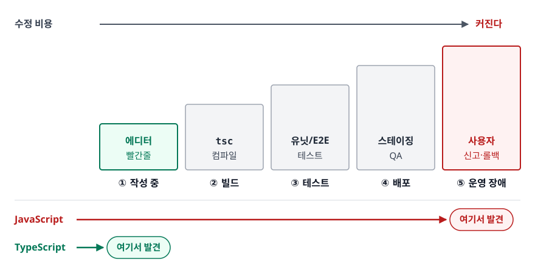
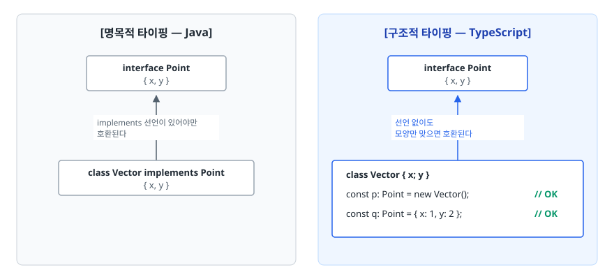

# 왜 타입인가 — TypeScript 타입 시스템의 출발점 (Why TypeScript Types)

> 타입을 적는 수고를 내주면, 런타임까지 살아남던 오류를 편집기 안에서 잡습니다. TypeScript가 "이름"이 아니라 "모양"으로 타입을 판단하는 이유와 `type`과 `interface` 중 무엇을 언제 쓰는지를 이 문서에서 설명합니다.

## 학습 목표

- [ ] 정적 타입이 버그 발견 시점을 어떻게 앞당기는지 구체적인 예로 설명할 수 있다
- [ ] 구조적 타이핑과 명목적 타이핑의 차이를 코드로 보여줄 수 있다
- [ ] 리터럴 타입과 타입 넓히기(widening)가 왜 생기는지 안다
- [ ] `type`과 `interface`의 실제 차이를 알고 상황에 맞게 고를 수 있다
- [ ] `any` / `unknown` / `never`가 타입 계층에서 각각 어디에 있는지 설명할 수 있다
- [ ] 타입을 명시해야 할 곳과 추론에 맡길 곳을 구분할 수 있다

## 선행 지식

- JavaScript 문법(변수, 함수, 객체 리터럴)을 읽을 수 있으면 충분합니다
- [../javascript-deep-dive/01-execution-context.md](../javascript-deep-dive/01-execution-context.md) — JS가 값을 어떻게 다루는지 감이 있으면 이해가 빠릅니다

---

## 1. 왜 필요한가

### 오류는 언제 발견되는가

JavaScript로 쓴 흔한 코드입니다.

```js
function getDisplayName(user) {
  return user.profile.nickName.trim();
}
```

이 함수에는 세 가지 폭탄이 들어 있습니다. `user`가 없을 수도, `profile`이 `null`일 수도, 서버 필드 이름이 사실 `nickname`(소문자 n)일 수도 있습니다. 그런데 JavaScript는 **이 함수가 실제로 호출되기 전까지 아무 말도 하지 않습니다.** 조건이 맞아떨어져야 실행되는 경로라면 QA도 통과하고 배포까지 갑니다.

버그를 발견하는 시점이 뒤로 갈수록 고치는 비용은 계단식으로 뜁니다.

<!-- diagram:fe-why-typescript-types-1 -->


<!-- 위 그림이 대체한 원본 ASCII.
     내용을 고칠 때는 그림도 함께 갱신할 것.
```
   작성 중        빌드         테스트        배포        운영 장애
     │            │             │            │             │
     ▼            ▼             ▼            ▼             ▼
 ┌────────┐  ┌────────┐   ┌────────┐   ┌────────┐   ┌──────────┐
 │ 에디터 │  │ tsc    │   │ 유닛/E2E│   │ 스테이징│   │ 사용자   │
 │ 빨간줄 │  │ 컴파일 │   │  테스트 │   │  QA    │   │ 신고·롤백│
 └────────┘  └────────┘   └────────┘   └────────┘   └──────────┘
  수정 비용 ────────────────────────────────────────────▶ 커진다

 JavaScript ─────────────────────────────────────────────▶ 여기서 발견
 TypeScript ─▶ 여기서 발견
```
-->

오른쪽으로 갈수록 재현·원인 추적·배포 절차가 통째로 다시 필요해집니다. 에디터에서 고치는 일은 커서를 옮기고 글자를 지우는 것으로 끝납니다.

TypeScript가 파는 것은 "타입"이라는 문법이 아니라 **이 화살표를 왼쪽 끝으로 옮기는 것**입니다. `user.profile.nickName`의 오타는 타입만 있으면 글자를 다 치기도 전에 잡힙니다.

### 타입은 두 번째 문서다

타입이 주는 두 번째 가치는 사람에게 있습니다. 아래 두 시그니처를 비교해봅니다.

```ts
// 이 함수, 뭘 넣어야 하고 뭐가 나오나?
function search(q, opts) { /* ... */ }

// 주석 한 줄 없이도 계약이 드러난다
function search(
  q: string,
  opts: { page?: number; sortBy?: "date" | "score" }
): Promise<SearchResult[]> { /* ... */ }
```

두 번째 버전은 `sortBy`에 `"name"`을 넣는 실수를 컴파일러가 막아 줍니다. 주석은 코드와 어긋나도 아무도 모릅니다. 반면 타입은 어긋나는 순간 빌드가 깨집니다. 주석과 결정적으로 다른 점은 타입이 **검증되는 문서**라는 데 있습니다.

### 반대로, TypeScript가 해주지 않는 것

여기서 초심자가 가장 많이 오해하는 지점을 먼저 못 박고 가겠습니다. **TypeScript의 타입은 컴파일이 끝나면 사라집니다(type erasure).** 빌드 결과물은 타입 표기가 전부 지워진 순수 JavaScript입니다.

```ts
// 작성한 코드
function greet(name: string): string {
  return `Hello, ${name}`;
}

// 컴파일 결과 (타입이 통째로 증발)
function greet(name) {
  return `Hello, ${name}`;
}
```

그래서 서버가 `name` 자리에 숫자를 보내면 런타임에서는 아무도 막지 않습니다. **외부에서 들어오는 값(API 응답, `localStorage`, URL 쿼리, 사용자 입력)은 타입 선언만으로 안전해지지 않습니다.** 경계에서는 실제 값을 검사하는 별도의 런타임 검증이 필요합니다. 이 문제는 [03-type-guards-narrowing.md](./03-type-guards-narrowing.md)에서 본격적으로 다룹니다.

---

## 2. 구조적 타이핑 — 이름이 아니라 모양으로 판단한다

### 정의

TypeScript는 **구조적 타이핑(structural typing)**을 씁니다. 두 타입이 호환되는지를 **이름이 같은지가 아니라 구조(속성 구성)가 맞는지**로 판단합니다. "오리처럼 걷고 오리처럼 운다면 그것은 오리다"라는 덕 타이핑(duck typing)과 발상이 같아서 종종 같은 말처럼 쓰입니다. 엄밀히는 다릅니다.

덕 타이핑은 런타임에 속성 유무를 보고, 구조적 타이핑은 컴파일 타임에 타입 구조를 비교합니다. 반대편에 있는 것이 Java, C#이 쓰는 **명목적 타이핑(nominal typing)**입니다. 구조가 똑같아도 `implements`로 선언하지 않았으면 남남입니다.

<!-- diagram:fe-why-typescript-types-2 -->


<!-- 위 그림이 대체한 원본 ASCII.
     내용을 고칠 때는 그림도 함께 갱신할 것.
```
[명목적 타이핑 — Java]              [구조적 타이핑 — TypeScript]

  interface Point                     interface Point
   { x, y }                            { x, y }
      ▲                                    ▲
      │ implements 선언이 있어야만          │ 선언 없이도
      │ 호환된다                            │ 모양만 맞으면 호환된다
      │                                    │
  class Vector implements Point       class Vector { x; y }
   { x, y }                           const p: Point = new Vector();  // OK
                                      const q: Point = { x: 1, y: 2 }; // OK
```
-->

### 코드로 보기

```ts
interface Point {
  x: number;
  y: number;
}

class Vector {
  constructor(public x: number, public y: number) {}
}

// Vector는 Point를 implements 하지 않았는데도 통과한다
const p: Point = new Vector(1, 2);

// 객체 리터럴도 마찬가지
const q: Point = { x: 3, y: 4 };

// 속성이 더 많은 것도 통과한다 (변수를 거치면)
const point3d = { x: 1, y: 2, z: 3 };
const r: Point = point3d;   // OK — Point가 요구하는 x, y를 다 갖췄다
```

왜 이렇게 설계했을까. TypeScript는 **이미 존재하는 방대한 JavaScript 코드 위에 타입을 얹는 언어**입니다. JavaScript는 객체 리터럴을 자유롭게 만들어 던지는 문화이고, 그런 코드에 "이 리터럴은 어느 인터페이스를 구현했다고 선언하시오"를 요구하면 아무도 쓰지 않았을 것입니다. 구조적 타이핑은 **기존 JS 코드에 타입을 점진적으로 입히기 위한 필연적 선택**이었습니다.

### 비유: 콘센트 규격

명목적 타이핑은 "이 제품은 우리 브랜드 정품 인증 스티커가 붙어 있는가"를 따지고, 구조적 타이핑은 "220V 2핀에 꽂히는가"만 봅니다. 규격만 맞으면 어느 회사 제품이든 꽂힙니다.

> **비유의 한계**: 콘센트는 물리적 형태가 완전히 일치해야 꽂힙니다. 하지만 TypeScript는 **필요한 것보다 더 많이 가진 값**도 받아 줍니다. 위 예시의 `point3d`처럼 `z`가 더 있어도 `Point` 자리에 들어갑니다. 이걸 부분 타입 관계(subtyping)라고 합니다.

### 흔한 오해 — "그럼 오타도 안 잡히나?"

방금 `point3d`가 통과한 걸 보고 걱정될 수 있습니다. 하지만 이런 코드는 잡힙니다.

```ts
interface RequestOptions {
  url: string;
  timeout?: number;
}

// 오류: Object literal may only specify known properties,
//       and 'timeoout' does not exist in type 'RequestOptions'.
const opts: RequestOptions = { url: "/api", timeoout: 3000 };
```

**객체 리터럴을 타입이 정해진 자리에 직접 대입할 때만** TypeScript는 추가로 **초과 속성 검사(excess property check)**를 돌립니다. 오타 난 선택적 속성을 잡기 위한 특수 규칙입니다. 리터럴이 아니라 변수를 거치면(`const raw = {...}; const opts: RequestOptions = raw;`) 이 검사는 작동하지 않습니다. 그래서 이 검사는 규칙이 아니라 **휴리스틱**으로 기억해 두어야 합니다.

### 구조가 같은데 구분하고 싶을 때 — 브랜딩

구조적 타이핑의 대가는 이런 상황입니다.

```ts
type UserId = string;
type OrderId = string;

function cancelOrder(id: OrderId) { /* ... */ }

const userId: UserId = "u_123";
cancelOrder(userId);   // 통과한다. 둘 다 결국 string이니까
```

`type`은 별칭일 뿐 새 타입을 만들지 않습니다. 이걸 막으려면 **브랜디드 타입(branded type)**으로 실재하지 않는 표식을 붙여 구조를 다르게 만듭니다.

```ts
type UserId = string & { readonly __brand: "UserId" };
type OrderId = string & { readonly __brand: "OrderId" };

declare function cancelOrder(id: OrderId): void;

// 경계에서만 단언으로 만들어내고, 이후로는 컴파일러가 지켜준다
function toOrderId(raw: string): OrderId {
  return raw as OrderId;
}

declare const userId: UserId;
cancelOrder(userId);              // 오류: '__brand' 속성의 타입이 다르다
cancelOrder(toOrderId("o_99"));   // OK
```

`__brand` 속성은 런타임에 실제로 존재하지 않습니다. 오직 컴파일러를 속이지 못하게 하려고 존재하는 표식입니다. 금액, 좌표계, 각종 ID처럼 **같은 원시 타입이지만 절대 섞이면 안 되는 값**에 씁니다.

---

## 3. 기본 타입과 리터럴 타입

### 원시 타입은 소문자로

```ts
let count: number = 0;
let title: string = "제목";
let done: boolean = false;
let nothing: null = null;
let notYet: undefined = undefined;

let ids: number[] = [1, 2, 3];
let pair: [string, number] = ["age", 30];   // 튜플: 길이와 순서가 고정
```

`String`, `Number`처럼 대문자로 쓰는 것은 래퍼 객체 타입이라 거의 쓸 일이 없습니다. 소문자를 씁니다.

### 리터럴 타입 — 값 하나가 곧 타입

TypeScript에서는 **특정 값 하나만 허용하는 타입**을 만들 수 있습니다.

```ts
let direction: "left" = "left";
direction = "right";   // 오류: '"right"'는 '"left"'에 할당할 수 없다
```

혼자서는 쓸모없어 보이지만, 유니온과 합쳐지는 순간 강력해집니다.

```ts
type ButtonSize = "sm" | "md" | "lg";
type HttpStatus = 200 | 400 | 404 | 500;

function Button(props: { size: ButtonSize }) { /* ... */ }

Button({ size: "md" });   // OK
Button({ size: "medium" });  // 오류 + 에디터가 "sm" | "md" | "lg" 를 자동완성해준다
```

문자열 상수를 `enum` 없이 표현하는 가장 흔한 방식이고, 뒤에서 볼 **판별 유니온**의 재료이기도 합니다.

### 타입 넓히기(widening)와 `as const`

리터럴 타입에서 초심자가 반드시 한 번은 걸리는 지점입니다.

```ts
const a = "hello";   // 타입: "hello"  (재할당 불가라 값이 고정)
let   b = "hello";   // 타입: string   (나중에 바뀔 수 있으니 넓혀버린다)

const config = { mode: "dark" };
// config.mode 의 타입은 "dark"가 아니라 string
// 객체 속성은 나중에 바뀔 수 있으므로 넓혀진다
```

그래서 이런 코드가 깨집니다.

```ts
type Theme = { mode: "dark" | "light" };

const config = { mode: "dark" };
const theme: Theme = config;
// 오류: string은 '"dark" | "light"'에 할당할 수 없다
```

**왜 문제인가**: `config.mode`가 `string`으로 넓혀졌기 때문에, 컴파일러 입장에서는 "이 객체의 mode에 나중에 `"purple"`이 들어갈 수도 있다"가 됩니다.

```ts
// 개선 1 — 대입 지점에서 타입을 명시해 넓히기를 막는다
const config: Theme = { mode: "dark" };

// 개선 2 — as const 로 전체를 읽기 전용 리터럴로 고정한다
const config = { mode: "dark" } as const;
// 타입: { readonly mode: "dark" }
const theme: Theme = config;   // OK
```

`as const`는 배열에도 유용합니다. `["a", "b"]`는 기본적으로 `string[]`이지만 `as const`를 붙이면 `readonly ["a", "b"]` 튜플이 됩니다. 상수 목록에서 타입을 뽑아내는 관용구가 여기서 나옵니다.

```ts
const SIZES = ["sm", "md", "lg"] as const;
type Size = (typeof SIZES)[number];   // "sm" | "md" | "lg"
```

값 하나만 관리하면 타입이 따라옵니다. 상수 배열과 타입이 어긋날 일이 없어집니다.

---

## 4. `type` vs `interface`

### 무엇이 실제로 다른가

| 기준 | `interface` | `type` | 그래서 언제 |
|------|-------------|--------|-------------|
| 객체 구조 정의 | 가능 | 가능 | 둘 다 됨 — 여기서 갈리지 않는다 |
| 유니온 / 튜플 / 원시 별칭 | 불가 | 가능 | `"a" \| "b"`, `[string, number]`가 필요하면 `type` |
| 확장 문법 | `extends` | `&` (intersection) | 취향 차이지만 충돌 시 동작이 다르다(아래) |
| 같은 이름 재선언 | 병합됨(선언 병합) | 중복 오류 | 남이 확장할 여지를 주려면 `interface` |
| 매핑된 타입 / 조건부 타입 | 불가 | 가능 | 타입을 계산해서 만들려면 `type` |
| 에러 메시지 | 이름이 그대로 보임 | 종종 전개되어 길어짐 | 큰 객체 타입은 `interface`가 읽기 편할 때가 있다 |

> 표 요약: **표현력은 `type`이 넓고, 확장 개방성은 `interface`가 낫습니다.** 실무 기준선은 "객체 모양과 클래스 계약은 `interface`, 그 외 모든 타입 계산은 `type`" 정도면 충분하고, 팀 컨벤션이 이미 있다면 그걸 따르는 것이 더 중요합니다.

### 선언 병합 — `interface`만의 능력

같은 이름의 `interface`를 여러 번 선언하면 TypeScript는 오류를 내지 않고 **하나로 합칩니다.**

```ts
interface Config { apiUrl: string; }
interface Config { timeout: number; }

// 결과: { apiUrl: string; timeout: number; }
const c: Config = { apiUrl: "/api", timeout: 3000 };
```

한 파일 안에서 실수로 두 번 선언한 경우라면 오류를 놓치는 셈이라 반갑지 않습니다. 하지만 이 기능이 결정적인 순간이 있습니다. **내가 고칠 수 없는 남의 타입을 확장할 때**입니다.

```ts
// 브라우저의 전역 Window에 우리 앱 전용 속성을 얹는다
export {};   // 이 파일을 모듈로 만든다 (declare global의 전제 조건)

declare global {
  interface Window {
    __APP_VERSION__: string;
  }
}

window.__APP_VERSION__ = "1.4.0";   // 이제 타입 오류가 나지 않는다
```

`type Window = ...`로는 이게 불가능합니다. 라이브러리 타입 확장, 테스트 러너의 `expect` 확장 등이 전부 이 메커니즘 위에 있습니다. **공개 라이브러리의 공개 타입을 `interface`로 내보내라**는 권고가 여기서 나옵니다.

### `extends`와 `&`의 충돌 처리 차이

같은 속성 이름이 서로 다른 타입으로 겹칠 때 동작이 다릅니다. 이건 실제 버그로 이어질 수 있어 알아둘 값어치가 있습니다.

```ts
interface Base { id: number; }

interface Bad extends Base {
  id: string;   // 오류: Interface 'Bad' incorrectly extends interface 'Base'
}
```

```ts
type BadType = { id: number } & { id: string };

declare const x: BadType;
x.id;   // 오류 없이 통과. 타입은 never — number이면서 string인 값은 없으므로
```

`extends`는 **선언 시점에 소리를 지르고**, `&`는 **조용히 `never`를 만들어 나중에 이해할 수 없는 오류로 되돌아옵니다.** 확장 관계가 명확한 상속 구조라면 `extends` 쪽이 실수를 더 일찍 잡습니다.

---

## 5. `any`, `unknown`, `never`의 자리

세 타입은 셋 다 "특별한 타입"이라 뭉뚱그려 외우기 쉬운데, 타입 계층에 그려보면 역할이 또렷해집니다.

<!-- diagram:fe-why-typescript-types-3 -->


<!-- 위 그림이 대체한 원본 ASCII.
     내용을 고칠 때는 그림도 함께 갱신할 것.
```
        ┌─────────────────────────┐
        │        unknown          │  ← 최상위(top). 모든 값을 받는다
        └───────────┬─────────────┘     쓰려면 반드시 좁혀야 한다
                    │
     ┌──────┬───────┼───────┬──────┐
   string  number  boolean object  ...
     └──────┴───────┼───────┴──────┘
                    │
        ┌───────────┴─────────────┐
        │         never           │  ← 최하위(bottom). 어떤 값도 없다
        └─────────────────────────┘     어디에나 할당 가능

        ┌─────────────────────────┐
        │          any            │  ← 계층 바깥. never만 빼면 위아래 모두와
        └─────────────────────────┘     자유롭게 오간다 = 타입 검사를 끄는 스위치
```
-->

### `any` — 검사기를 끄는 스위치

`any`는 "아무 타입"이 아니라 **"이 값은 검사하지 마라"**는 지시입니다. 그래서 위험은 그 값 하나에 머물지 않습니다.

```ts
// 안티패턴
const data: any = JSON.parse(raw);
const price = data.product.price;       // price도 any
const total = price.toFixed(2) * 1.1;   // 컴파일 통과. 런타임에 폭발
renderCart(total);                      // total도 any → 함수 내부까지 검사 구멍이 번진다
```

**왜 문제인가**: `any`에서 파생된 값은 전부 `any`가 됩니다. 한 줄의 `any`가 호출 그래프를 타고 흘러 들어가 검사되지 않는 영역을 넓힙니다. "타입 오류가 나서 일단 `any` 박았다"가 가장 위험한 이유입니다.

```ts
// 개선 — 모르는 값은 unknown으로 받고 경계에서 검증한다
const data: unknown = JSON.parse(raw);

function isProduct(v: unknown): v is { price: number } {
  return typeof v === "object" && v !== null
    && "price" in v && typeof (v as { price: unknown }).price === "number";
}

if (isProduct(data)) {
  const total = data.price * 1.1;   // 여기서부터는 number로 보장된다
}
```

### `unknown` — 안전한 `any`

`unknown`은 **어떤 값이든 담을 수 있지만, 좁히기 전에는 아무것도 할 수 없습니다.**

```ts
let v: unknown = "hello";
v.toUpperCase();          // 오류: 'v'는 'unknown' 타입입니다
v.length;                 // 오류
if (typeof v === "string") {
  v.toUpperCase();        // OK — 검사했으니 string으로 좁혀졌다
}
```

`JSON.parse`, `catch`로 잡은 예외, 서드파티 응답처럼 **내가 통제할 수 없는 값**의 기본 타입은 `unknown`이어야 합니다. `any` 대신 `unknown`을 쓰면 "검증하지 않고 쓰는 코드"가 전부 컴파일 오류로 드러납니다.

### `never` — 존재할 수 없는 값

`never`는 값이 하나도 없는 타입입니다. 실무에서 만나는 얼굴은 세 가지입니다.

```ts
// 1. 정상 반환이 절대 없는 함수
function fail(message: string): never {
  throw new Error(message);
}

// 2. 좁히기를 다 하고 남은 것이 없을 때
function f(x: string | number) {
  if (typeof x === "string") { /* string */ }
  else if (typeof x === "number") { /* number */ }
  else { x; }   // 여기서 x는 never
}

// 3. 완전성 검사 — 가장 실용적인 용도
type Shape =
  | { kind: "circle"; r: number }
  | { kind: "square"; side: number };

function area(s: Shape): number {
  switch (s.kind) {
    case "circle": return Math.PI * s.r ** 2;
    case "square": return s.side ** 2;
    default: {
      const _exhaustive: never = s;   // Shape에 케이스가 추가되면 여기서 컴파일 오류
      return _exhaustive;
    }
  }
}
```

3번이 핵심입니다. 나중에 `{ kind: "triangle" }`을 `Shape`에 추가하는 순간, `s`가 더 이상 `never`가 아니게 되어 **이 `switch`가 컴파일 오류로 손을 듭니다.** 처리를 빠뜨린 곳을 컴파일러가 찾아주는 것입니다. 자세한 활용은 [03-type-guards-narrowing.md](./03-type-guards-narrowing.md)에서 이어집니다.

---

## 6. 추론과 명시의 균형

타입을 많이 쓸수록 좋은 것이 아닙니다. TypeScript의 추론은 강력하고, 불필요한 명시는 오히려 코드를 상하게 합니다.

### 추론에 맡길 곳

```ts
// 안티패턴 — 컴파일러가 이미 아는 것을 반복해서 적는다
const count: number = 0;
const names: string[] = ["a", "b"];
const doubled: number[] = names.map((n: string): number => n.length * 2);
```

**왜 문제인가**: 정보가 늘지 않는데 코드만 길어집니다. 더 나쁜 건 유지보수입니다. 나중에 `names`를 `number[]`로 바꾸면 콜백의 `(n: string)`이 오류를 내면서, 진짜 원인과 상관없는 지점에서 고쳐야 할 곳이 늘어납니다.

```ts
// 개선 — 문맥에서 추론되는 것은 비워둔다
const count = 0;
const names = ["a", "b"];
const doubled = names.map((n) => n.length * 2);   // n은 string으로 문맥 추론된다
```

콜백 매개변수에 타입을 적을 필요가 거의 없는 이유가 **문맥적 타이핑(contextual typing)**입니다. `map`의 시그니처가 이미 `n`이 무엇인지 알고 있습니다.

### 명시해야 할 곳

| 위치 | 명시하는 이유 |
|------|--------------|
| 문맥이 없는 함수 선언의 **매개변수** | 추론할 근거가 없습니다. `noImplicitAny`가 켜져 있으면 강제된다(문맥 추론이 되는 콜백 매개변수는 예외) |
| 모듈 밖으로 나가는 함수의 **반환 타입** | 구현이 실수로 바뀌어도 정의 지점에서 즉시 잡힙니다. 안 적으면 오류가 호출부까지 밀린다 |
| 빈 배열, 빈 객체 초기값 | `const items = []`는 요소 타입의 근거가 없습니다. 이후 `push`를 보고 타입을 넓혀가는 동작이 있지만 흐름이 복잡해지면 `any[]`로 남습니다. `const items: Todo[] = []`로 못 박는다 |
| 리터럴을 좁게 유지해야 할 때 | 3절에서 본 `as const` / 대입 지점 타입 명시 |
| 공개 API, 라이브러리 경계 | 타입이 곧 계약이므로 추론에 맡기면 의도치 않게 바뀐다 |

### `satisfies` — 검사는 받되 추론은 잃지 않기

TypeScript 4.9에서 들어온 연산자입니다. "타입 명시"와 "리터럴 추론 유지" 사이의 오랜 딜레마를 풉니다.

```ts
type Route = { path: string; auth: boolean };

// 방식 A — 타입 명시: 검사는 되지만 키 정보를 잃는다
const routesA: Record<string, Route> = {
  home:  { path: "/", auth: false },
  admin: { path: "/admin", auth: true },
};
routesA.hoem.path;   // 오류가 안 난다. Record<string, _>이라 아무 키나 허용

// 방식 B — satisfies: 검사도 받고 실제 키도 유지된다
const routesB = {
  home:  { path: "/", auth: false },
  admin: { path: "/admin", auth: true },
} satisfies Record<string, Route>;

routesB.hoem;        // 오류: 'hoem' 속성이 없습니다
routesB.home.auth;   // boolean으로 정확히 추론
```

`satisfies`는 "이 값이 저 타입에 맞는지 검사만 해라, 대신 값의 타입은 원래 추론된 것을 유지해라"는 뜻입니다. 설정 객체, 라우트 테이블, 아이콘 맵처럼 **키 목록 자체가 정보인 상수**에 잘 맞습니다.

---

## 7. 실무에서는

- **점진적 도입이 가능합니다.** `tsconfig.json`의 `allowJs`를 켜면 `.js`와 `.ts`를 한 프로젝트에 섞어둘 수 있습니다. 기존 JS 프로젝트는 보통 파일 확장자를 하나씩 바꿔가며 옮깁니다.
- **처음부터 `strict: true`로 시작해야 합니다.** 신규 프로젝트에서 `strict`를 끄고 시작하면 나중에 켜는 순간 오류가 수천 개 뜹니다. 반대로 기존 프로젝트를 옮기는 중이라면 옵션을 하나씩 켜는 편이 현실적입니다(자세한 옵션 구성은 [03-type-guards-narrowing.md](./03-type-guards-narrowing.md) 참고).
- **타입 검사와 트랜스파일은 분리되는 추세입니다.** esbuild, SWC 같은 도구는 속도를 위해 타입 검사를 하지 않고 타입 표기만 지웁니다. 그래서 빌드가 성공해도 타입 오류가 남아 있을 수 있고, CI에 `tsc --noEmit`을 별도 단계로 두는 구성이 표준처럼 쓰입니다.
- **`enum` 대신 유니온 + `as const`를 쓰는 팀이 많습니다.** 일반 `enum`은 타입 소거 원칙의 예외라 컴파일 후에도 런타임 객체를 남깁니다. `const enum`은 값을 호출부에 인라인해 이 문제를 피하지만, 파일 하나만 보고 변환하는 도구를 전제하는 `isolatedModules`에서는 사용이 제한됩니다. 번들에 코드가 남는 점과 이런 제약 때문에 문자열 리터럴 유니온이 선호됩니다.
- **DefinitelyTyped(`@types/*`)를 기억해두어야 합니다.** 타입 선언이 내장되지 않은 라이브러리는 `npm i -D @types/라이브러리명`으로 커뮤니티 타입을 받아 씁니다.

---

## 8. 면접 포인트

> 면접에서 이 주제가 나오면 이렇게 답한다

**Q. TypeScript를 왜 쓰나요? 단점은요?**
A. 핵심은 오류 발견 시점을 런타임에서 컴파일 타임으로 당기는 것입니다. 오타나 `null` 접근처럼 특정 실행 경로에서만 드러나는 버그를 편집기 단계에서 잡을 수 있고, 타입이 검증되는 문서 역할을 해서 자동완성과 안전한 리팩터링이 따라옵니다. 단점은 빌드 단계와 설정 복잡도가 늘고 타입 작성 비용이 든다는 것인데, 코드베이스와 협업 인원이 커질수록 유지보수 이득이 그 비용을 넘어섭니다.
- 꼬리 질문: "그럼 TypeScript를 쓰면 런타임 오류가 없어지나요?" → 아닙니다. 타입은 컴파일 후 지워지므로 API 응답 같은 외부 입력은 여전히 런타임 검증이 필요하다고 답합니다.

**Q. 구조적 타이핑이 무엇이고, 명목적 타이핑과 어떻게 다른가요?**
A. TypeScript는 타입 이름이 아니라 구조가 호환되는지로 할당 가능 여부를 판단합니다. Java처럼 `implements`를 선언하지 않아도 필요한 속성만 갖추면 그 타입 자리에 들어갈 수 있습니다. 기존 JavaScript 코드에 타입을 점진적으로 얹기 위한 설계 선택입니다. 단점은 구조가 같은 서로 다른 개념, 예를 들어 `UserId`와 `OrderId`를 컴파일러가 구분하지 못한다는 것이고, 그럴 때는 브랜디드 타입으로 구조 자체를 다르게 만듭니다.
- 꼬리 질문: "그러면 객체 리터럴의 오타도 못 잡나요?" → 리터럴을 타입이 정해진 자리에 직접 대입할 때는 초과 속성 검사가 추가로 돌아 잡힙니다. 다만 변수를 한 번 거치면 그 검사는 작동하지 않습니다.

**Q. `type`과 `interface`, 무엇을 언제 쓰나요?**
A. 객체 모양을 정의하는 용도로는 거의 같습니다. 실질적인 차이는 두 가지입니다. `interface`는 같은 이름으로 다시 선언하면 병합되어서, 내가 고칠 수 없는 남의 타입, 예를 들어 전역 `Window`를 확장할 수 있습니다. `type`은 유니온, 튜플, 조건부·매핑된 타입처럼 타입을 계산해서 만드는 표현이 가능합니다. 그래서 공개 API의 객체 계약은 `interface`, 그 외 타입 조합은 `type`을 쓰는 기준을 씁니다.
- 꼬리 질문: "`extends`와 `&`는 결과가 같나요?" → 속성이 충돌할 때 다릅니다. `extends`는 선언 시점에 오류를 내고, `&`는 조용히 `never`를 만들어 나중에 이상한 오류로 되돌아옵니다.

**Q. `any`와 `unknown`의 차이는요?**
A. 둘 다 어떤 값이든 받지만, `any`는 타입 검사를 끄는 스위치라 그 값에서 파생된 모든 값까지 검사 대상에서 빠집니다. `unknown`은 값을 받아두되 좁히기 전에는 어떤 연산도 허용하지 않아서, 검증하지 않고 쓰는 코드가 전부 컴파일 오류로 드러납니다. 그래서 `JSON.parse` 결과나 API 응답처럼 신뢰할 수 없는 값의 기본형은 `unknown`이어야 합니다.
- 꼬리 질문: "`never`는 어디에 쓰나요?" → 값이 존재할 수 없는 타입이라, 유니온의 모든 케이스를 처리했는지 컴파일러에게 확인시키는 완전성 검사에 쓴다고 답합니다.

---

## 자주 하는 실수

| 실수 | 왜 틀렸나 | 올바른 이해 |
|------|----------|-----------|
| "TypeScript를 쓰면 런타임 타입 오류가 사라진다" | 타입은 컴파일 후 지워집니다. 서버가 이상한 값을 보내면 그대로 통과한다 | 타입은 개발 시점 보증입니다. 외부 입력은 경계에서 런타임 검증을 따로 한다 |
| "`any`는 그 변수 하나만 위험하다" | `any`에서 파생된 값이 전부 `any`가 되어 검사 구멍이 번진다 | 모르는 값은 `unknown`으로 받고 좁혀서 쓴다 |
| "타입은 최대한 다 명시하는 게 좋다" | 추론 가능한 곳까지 적으면 코드만 길어지고, 원본이 바뀔 때 수정 지점이 늘어난다 | 매개변수·공개 반환 타입·빈 초기값은 명시, 나머지는 추론에 맡긴다 |
| "`type` 별칭을 만들면 새로운 타입이 생긴다" | 별칭일 뿐이라 `type UserId = string`은 `string`과 완전히 같다 | 구분이 필요하면 브랜디드 타입으로 구조를 다르게 만든다 |
| "`interface`는 `extends`, `type`은 `&`라는 것 말고는 똑같다" | 선언 병합 가능 여부, 충돌 시 동작, 표현 가능한 타입 범위가 다르다 | 병합이 필요하면 `interface`, 타입 계산이 필요하면 `type` |
| "`const obj = { mode: 'dark' }`면 `mode`는 `'dark'` 타입이다" | 객체 속성은 재할당 가능하므로 `string`으로 넓혀진다 | `as const`를 붙이거나 대입 지점에 타입을 명시한다 |

---

## 한 줄 정리

TypeScript의 타입은 런타임 오류를 편집기 안으로 당겨오는 개발 시점 계약이며, 이름이 아니라 구조로 판단하고 컴파일 후에는 사라지므로 — **경계에서의 런타임 검증과 짝을 이룰 때만 진짜 안전해집니다.**

---

## 연관 개념

- [02-generics-utility-types.md](./02-generics-utility-types.md) - 타입을 값처럼 다뤄 재사용 가능한 타입을 만드는 방법
- [03-type-guards-narrowing.md](./03-type-guards-narrowing.md) - 넓은 타입을 실제 값 검사로 좁혀 안전하게 쓰는 방법
- [qna-typescript.md](./qna-typescript.md) - 이 주제 면접 질문(Q1, Q2, Q6)
- [../javascript-deep-dive/01-execution-context.md](../javascript-deep-dive/01-execution-context.md) - 타입이 지워진 뒤 실제로 실행되는 JavaScript의 동작
- [../javascript-deep-dive/qna-javascript.md](../javascript-deep-dive/qna-javascript.md) - JavaScript의 동적 타이핑과 형 변환 관련 질문
