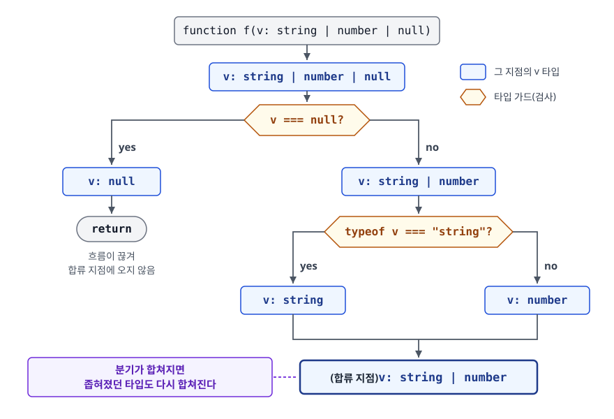
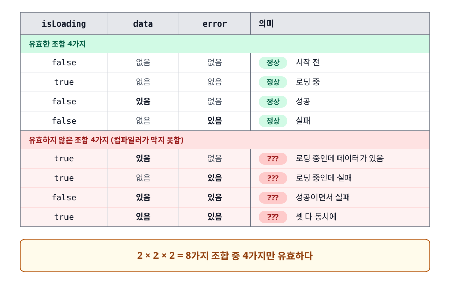
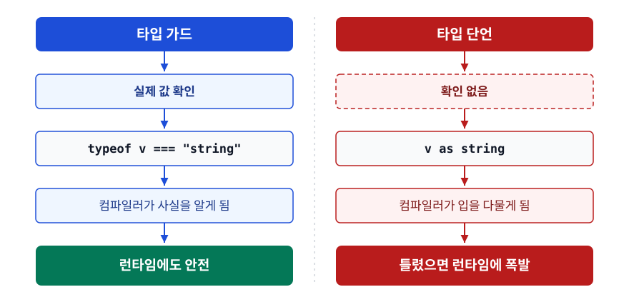

# 타입 가드와 좁히기 (Type Guards & Narrowing)

> 문법 목록을 외우는 문서가 아닙니다. 유니온 타입이 왜 그대로는 쓸모가 없는지, 판별 유니온이 왜 실무에서 가장 자주 쓰이는 무기인지, `as`가 왜 "해결"이 아니라 "회피"인지를 가려냅니다.

## 학습 목표

- [ ] 좁히기(narrowing)가 없으면 유니온 타입을 왜 쓸 수 없는지 설명할 수 있다
- [ ] `typeof` / `instanceof` / `in` / 진릿값 검사의 적용 범위와 함정을 안다
- [ ] 판별 유니온으로 "불가능한 상태를 표현 불가능하게" 만들 수 있다
- [ ] 사용자 정의 타입 가드(`is`)와 단언 함수(`asserts`)를 작성할 수 있다
- [ ] 좁히기가 풀리는 상황을 알아보고 우회할 수 있다
- [ ] `as`의 위험을 설명하고 대안을 제시할 수 있다
- [ ] `strict`가 켜는 옵션들이 각각 무엇을 막는지 안다

## 선행 지식

- [01-why-typescript-types.md](./01-why-typescript-types.md) - 유니온, 리터럴 타입, `unknown`/`never`
- [02-generics-utility-types.md](./02-generics-utility-types.md) - 필수는 아니지만 `NonNullable`이 나옵니다

---

## 1. 왜 필요한가

### 유니온 타입은 "교집합"만 허용한다

값이 두 타입 중 하나일 수 있다고 선언하는 순간, TypeScript는 **양쪽 모두에 있는 것만** 쓰게 해줍니다.

```ts
function format(value: string | number) {
  return value.toFixed(2);
  // 오류: 'toFixed' 속성이 'string | number' 형식에 없습니다.
  //      'string' 형식에 'toFixed' 속성이 없습니다.
}
```

당연한 얘기입니다. 지금 이 순간 `value`가 문자열일 수도 있으니, `toFixed`를 부르게 놔두면 런타임에 터집니다. 컴파일러는 **가능한 모든 경우에 안전한 연산만** 허용합니다.

그래서 유니온 타입은 선언만으로는 반쪽짜리입니다. **"지금 이 값은 실제로 무엇인가"를 런타임에 확인해서 컴파일러에게 알려주는 절차**가 반드시 붙어야 쓸 수 있습니다. 그 절차가 좁히기(narrowing)이고, 좁히기를 유발하는 검사가 타입 가드(type guard)입니다.

```ts
function format(value: string | number) {
  if (typeof value === "number") {
    return value.toFixed(2);      // 여기서 value는 number
  }
  return value.trim();            // 여기서 value는 string
}
```

### `null` 처리도 결국 같은 문제다

`strictNullChecks`가 켜져 있으면 `null`과 `undefined`가 다른 타입에 자동으로 섞이지 않습니다. 그 결과 우리가 매일 만나는 코드가 전부 유니온 좁히기 문제로 바뀝니다.

```ts
function greet(name: string | null) {
  // return `Hello, ${name.toUpperCase()}`;  // 오류: 'name'이(가) 'null'일 수 있습니다
  if (name === null) return "Hello, guest";
  return `Hello, ${name.toUpperCase()}`;     // 좁혔으므로 통과
}
```

JavaScript 프로젝트를 TypeScript로 옮길 때 가장 먼저 쏟아지는 오류도 정교한 타입 불일치가 아니라 대체로 이런 `null` 누락입니다. 좁히기는 문법 하나가 아니라 TypeScript를 쓰는 방식 그 자체입니다.

### 비유: 신분증 확인

유니온 타입은 "이 사람은 직원이거나 방문객이다"라는 명찰입니다. 명찰만 보고는 서버실 문을 열어줄 수 없습니다. 신분증을 확인해서 직원임을 밝힌 뒤에야 그 권한을 줍니다. 확인이 끝난 구역 안에서만 "이 사람은 직원"이라는 사실이 유효합니다.

> **비유의 한계**: 사람은 확인을 마친 뒤에도 계속 그 사람입니다. TypeScript의 좁히기는 다릅니다. **코드 블록을 벗어나거나 값이 재할당되면 즉시 무효**가 됩니다. 확인 결과가 붙는 대상은 사람이 아니라 "코드의 특정 지점"입니다.

---

## 2. 제어 흐름 분석 — 컴파일러가 코드를 따라 걷는다

TypeScript는 코드의 분기를 따라가면서 **각 지점마다 변수의 타입을 다시 계산합니다.** 이걸 제어 흐름 분석(control flow analysis)이라고 합니다.

<!-- diagram:fe-type-guards-narrowing-1 -->


<!-- 위 그림이 대체한 원본 ASCII.
     내용을 고칠 때는 그림도 함께 갱신할 것.
```
function f(v: string | number | null)

               v: string | number | null
                          │
              ┌───────────┴───────────┐
        v === null?                   │
         yes │                        │ no
             ▼                        ▼
        v: null              v: string | number
             │                        │
          return         ┌────────────┴────────────┐
                   typeof v === "string"?          │
                     yes │                         │ no
                         ▼                         ▼
                   v: string                  v: number
                         │                         │
                         └───────────┬─────────────┘
                                     ▼
                          (합류 지점) v: string | number
```
-->

핵심은 마지막 줄입니다. **분기가 합쳐지면 좁혀졌던 타입도 다시 합쳐집니다.** 좁히기는 특정 블록 안에서만 유효한 지역적 사실입니다.

이 분석 덕분에 `else` 없이도 좁혀집니다.

```ts
function g(v: string | null) {
  if (v === null) return "";   // 여기서 흐름이 끊겼으므로
  return v.trim();             // 아래로 내려온 흐름에서 v는 string
}
```

이 때문에 `return`, `throw`, `continue`로 흐름을 일찍 끊는 **얼리 리턴(early return)** 패턴이 TypeScript에서 특히 잘 맞습니다. 중첩된 `if`를 만들지 않으면서 타입도 자연스럽게 좁혀집니다.

---

## 3. 내장 타입 가드

### `typeof` — 원시 타입 판별

```ts
function describe(v: string | number | boolean | undefined) {
  if (typeof v === "string") return v.length;
  if (typeof v === "number") return v.toFixed(1);
  if (typeof v === "boolean") return v ? "yes" : "no";
  return "none";   // undefined
}
```

`typeof`가 반환할 수 있는 문자열은 `"string" | "number" | "bigint" | "boolean" | "symbol" | "undefined" | "object" | "function"`이고, TypeScript는 이 값들만 비교 대상으로 허용합니다. `typeof v === "strnig"` 같은 오타는 컴파일러가 잡습니다.

**함정 하나**: JavaScript에서 `typeof null`은 `"object"`입니다. 언어 초창기부터 있던 버그인데 호환성 때문에 고치지 못했습니다.

```ts
function handle(v: object | null) {
  if (typeof v === "object") {
    v.toString();          // 안티패턴 — 오류: 'v'이(가) 'null'일 수 있습니다
  }
  if (v !== null && typeof v === "object") {
    v.toString();          // 개선 — null을 먼저 배제해야 좁히기가 끝난다
  }
}
```

**왜 문제인가**: `typeof null === "object"`이므로 첫 번째 분기에는 `null`이 그대로 들어옵니다. TypeScript는 이 사실을 알기 때문에 좁히기를 완료해주지 않습니다.

### `instanceof` — 클래스 인스턴스 판별

```ts
function report(e: Error | string) {
  if (e instanceof Error) {
    console.error(e.stack);   // Error
  } else {
    console.error(e);         // string
  }
}
```

프로토타입 체인을 보는 검사라 **클래스나 생성자 함수로 만들어진 값**에만 쓸 수 있습니다. 인터페이스는 컴파일 후 사라지는 타입일 뿐 값이 아닙니다. 그래서 `x instanceof MyInterface`는 `'MyInterface' only refers to a type, but is being used as a value here.` 오류가 납니다. 배열은 `Array.isArray`를 씁니다(표준 라이브러리에 `arg is any[]` 타입 가드로 선언되어 있어 좁히기가 작동합니다).

### `in` — 속성 존재 판별

```ts
interface Cat { meow(): void }
interface Dog { bark(): void }

function speak(pet: Cat | Dog) {
  if ("meow" in pet) pet.meow();
  else pet.bark();
}
```

클래스가 아닌 순수 객체 타입에 쓸 수 있어 유용하지만, **선택적 속성이 섞이면 무너집니다.**

```ts
interface Basic { id: string; premium?: boolean }
interface Pro { id: string; premium: boolean; seats: number }

function f(p: Basic | Pro) {
  if ("premium" in p) {
    p.seats;   // 오류 — Basic도 premium을 가질 수 있어서 좁혀지지 않는다
  }
}
```

`in`은 "이 속성이 있을 수 있는 타입"을 전부 남깁니다. 선택적 속성으로 구분하려는 설계 자체가 위태롭다는 신호이고, 다음 절의 판별 유니온으로 가야 합니다.

### 진릿값과 동등 비교

`if (value)`는 가장 짧은 좁히기지만, 여기 자주 나오는 버그가 있습니다. `undefined`뿐 아니라 **빈 문자열 `""`, 숫자 `0`, `NaN`도 함께 걸러냅니다.**

```ts
// 안티패턴 — 수량 0이 "값 없음"으로 취급된다
function render(count?: number | null) {
  if (count) return `${count}개`;
  return "정보 없음";        // count === 0 일 때도 여기로 온다
}
```

```ts
// 개선 — 무엇을 배제하려는지 정확히 쓴다
function render(count?: number | null) {
  if (count == null) return "정보 없음";
  return `${count}개`;       // count는 number, 0도 살아남는다
}
```

`== null` 비교는 `null`과 `undefined`를 한 번에 배제하는 관용구로 TypeScript도 이를 이해합니다. 나머지 값은 그대로 통과시키므로 `0`이나 `""`을 살려야 할 때 안전합니다.

---

## 4. 판별 유니온 — 가장 실전적인 무기

### 문제: 불린 플래그로 상태를 표현하면

데이터를 불러오는 화면의 상태를 표현한다고 해 보겠습니다. 처음 떠오르는 방식은 이렇습니다.

```ts
// 안티패턴
interface State {
  isLoading: boolean;
  data?: User;
  error?: Error;
}
```

**왜 문제인가**: 이 타입은 **존재할 수 없는 상태를 표현할 수 있습니다.**

<!-- diagram:fe-type-guards-narrowing-2 -->


<!-- 위 그림이 대체한 원본 ASCII.
     내용을 고칠 때는 그림도 함께 갱신할 것.
```
 isLoading   data     error    │ 의미
 ─────────────────────────────┼──────────────────────────
   false     없음     없음     │ 시작 전          (정상)
   true      없음     없음     │ 로딩 중          (정상)
   false     있음     없음     │ 성공             (정상)
   false     없음     있음     │ 실패             (정상)
 ─────────────────────────────┼──────────────────────────
   true      있음     없음     │ ???  로딩 중인데 데이터가 있음
   true      없음     있음     │ ???  로딩 중인데 실패
   false     있음     있음     │ ???  성공이면서 실패
   true      있음     있음     │ ???  셋 다 동시에
 ─────────────────────────────┴──────────────────────────
    2 × 2 × 2 = 8가지 조합 중 4가지만 유효하다
```
-->

유효하지 않은 4가지 조합을 컴파일러가 막아주지 못하므로, 방어 코드가 컴포넌트 곳곳에 흩어집니다. 게다가 `data`가 `User | undefined`라 성공 분기에서도 매번 `data?.name`을 써야 합니다.

### 해결: 리터럴 태그를 공유하는 유니온

```ts
// 개선
type State =
  | { status: "idle" }
  | { status: "loading" }
  | { status: "success"; data: User }
  | { status: "error"; error: Error };
```

각 멤버가 `status`라는 **같은 이름의 속성을, 서로 다른 리터럴 타입으로** 가집니다. 이 속성을 판별자(discriminant)라고 부르고, 이런 유니온을 **판별 유니온**(discriminated union)이라 합니다. TypeScript는 판별자를 검사하는 것만으로 나머지 속성까지 통째로 좁혀줍니다.

```ts
function render(state: State): string {
  switch (state.status) {
    case "idle":    return "시작 전";
    case "loading": return "불러오는 중...";
    case "success": return state.data.name;      // data가 확정적으로 존재한다
    case "error":   return state.error.message;  // error가 확정적으로 존재한다
  }
}
```

`state.data?.name`이 아니라 `state.data.name`입니다. **성공 분기 안에서는 `data`가 반드시 있다는 것이 타입으로 보장**되기 때문입니다. 방어 코드가 사라지고, 동시에 "로딩 중인데 에러도 있는" 상태는 애초에 만들 수 없습니다. 불린 플래그가 8가지 조합 중 4가지를 낭비했다면, 판별 유니온은 **표현 가능한 네 가지 상태가 전부 유효**합니다.

### `never`로 완전성 보장하기

판별 유니온의 진짜 배당금은 **나중에 상태를 추가할 때** 나옵니다.

```ts
function render(state: State): string {
  switch (state.status) {
    case "idle":    return "시작 전";
    case "loading": return "불러오는 중...";
    case "success": return state.data.name;
    case "error":   return state.error.message;
    default: {
      const _exhaustive: never = state;
      throw new Error(`처리되지 않은 상태: ${JSON.stringify(_exhaustive)}`);
    }
  }
}
```

`State`에 `{ status: "cancelled" }`를 추가하는 순간, `default` 블록의 `state`는 더 이상 `never`가 아니게 되어 **이 줄이 컴파일 오류를 냅니다.** 상태를 추가한 사람이 처리를 빠뜨린 모든 `switch`를 컴파일러가 찾아줍니다. 상태 머신, 액션 리듀서, 이벤트 핸들러처럼 케이스가 늘어나는 코드에서 이 안전장치가 결정적입니다.

판별자로는 **리터럴 타입**을 써야 한다는 점이 중요합니다. `status: string`이면 좁혀지지 않습니다. 그래서 판별 유니온은 [01-why-typescript-types.md](./01-why-typescript-types.md)에서 본 리터럴 타입 위에 세워진 구조물입니다.

---

## 5. 사용자 정의 타입 가드와 단언 함수

### 문제: 일반 함수는 좁혀주지 않는다

검사 로직을 함수로 빼면 좁히기가 사라집니다.

```ts
function isValidUser(v: unknown): boolean {
  return typeof v === "object" && v !== null
    && typeof (v as Record<string, unknown>).id === "string";
}

function handle(v: unknown) {
  if (isValidUser(v)) {
    v.id;   // 오류: 'v'은(는) 'unknown' 형식입니다
  }
}
```

컴파일러 입장에서는 `isValidUser`가 `true`를 반환했다는 사실과 `v`의 타입 사이에 아무 연결 고리가 없습니다. **"이 함수가 true면 인자는 이 타입이다"를 명시적으로 알려주는 문법**이 타입 서술어(type predicate)입니다.

```ts
function isValidUser(v: unknown): v is { id: string } {
  return typeof v === "object" && v !== null
    && typeof (v as Record<string, unknown>).id === "string";
}

function handle(v: unknown) {
  if (isValidUser(v)) {
    v.id;   // OK — { id: string }으로 좁혀졌다
  }
}
```

반환 타입 자리에 `boolean` 대신 `매개변수명 is 타입`을 씁니다. 실제로는 여전히 불리언을 반환하지만, 컴파일러는 이 신호를 받아 호출부에서 좁히기를 수행합니다.

배열 필터링에서 특히 유용합니다.

```ts
const raw: (User | null)[] = [user1, null, user2];

function isNotNull<T>(v: T | null): v is T {
  return v !== null;
}
const users = raw.filter(isNotNull);   // User[]
```

### `is` 가드의 위험 — 컴파일러는 검증하지 않는다

```ts
// 안티패턴 — 구현이 서술어와 어긋난다
function isUser(v: unknown): v is User {
  return typeof v === "object";   // null도, 배열도, {}도 전부 통과
}
```

**왜 문제인가**: TypeScript는 함수 본문이 서술어를 실제로 보장하는지 **검사하지 않습니다.** `v is User`라고 선언한 순간 그 말을 그대로 믿습니다. 잘못 구현한 타입 가드는 `as`와 똑같이 위험하고, 오히려 안전해 보이는 껍데기를 쓰고 있어서 더 나쁩니다.

```ts
// 개선 — 서술어가 주장하는 것을 전부 실제로 검사한다
function isUser(v: unknown): v is User {
  return (
    typeof v === "object" &&
    v !== null &&
    typeof (v as Record<string, unknown>).id === "number" &&
    typeof (v as Record<string, unknown>).name === "string"
  );
}
```

필드가 많아지면 이 코드는 금방 감당하기 어려워집니다. 그래서 실무에서는 스키마 검증 라이브러리에 맡깁니다(7절 참고).

### 단언 함수 — 좁히거나, 던지거나

TypeScript 3.7부터 `asserts` 문법이 생겼습니다. 조건을 만족하지 않으면 예외를 던지고, 통과하면 **그 지점 이후 전체**에서 타입이 좁혀집니다.

```ts
function assertIsString(v: unknown): asserts v is string {
  if (typeof v !== "string") {
    throw new TypeError(`string이 아님: ${typeof v}`);
  }
}

function process(v: unknown) {
  assertIsString(v);
  v.toUpperCase();   // 이 아래로 쭉 string
}
```

`if` 블록으로 감싸지 않아도 되므로 들여쓰기가 줄어듭니다. `null` 배제용으로 `function assertDefined<T>(v: T): asserts v is NonNullable<T>`를 하나 만들어두면 프로젝트 전반에서 쓰입니다.

한 가지 제약이 있습니다. **단언 함수는 호출 대상이 명시적 타입 표기를 가진 이름이어야 합니다.** 화살표 함수를 `const`에 담으면 `Assertions require every name in the call target to be declared with an explicit type annotation.` 오류가 나므로, 변수 쪽에 타입을 직접 적거나 위 예시처럼 `function` 선언문을 쓰는 편이 편합니다.

---

## 6. 좁히기가 풀리는 상황

좁힌 줄 알았는데 오류가 나는 순간들이 있습니다. 원리는 하나입니다. **컴파일러가 "그 사이에 값이 바뀌지 않았다"고 확신할 수 없으면 좁히기를 유지하지 않습니다.**

### 콜백 안에서 (`let`)

```ts
// 안티패턴
let value: string | number = getValue();

if (typeof value === "string") {
  setTimeout(() => {
    value.toUpperCase();
    // 오류: 'toUpperCase' 속성이 'string | number' 형식에 없습니다
  }, 100);
}
```

**왜 문제인가**: `value`는 `let`이라 언제든 재할당될 수 있습니다. 콜백은 **나중에** 실행되므로 그 시점의 값이 여전히 문자열이라는 보장이 없습니다. 컴파일러의 판단이 옳습니다. 다만 TypeScript 5.4부터는 모듈이나 함수 안의 `let` 변수라면 콜백을 만든 지점 뒤로 대입이 없을 때 좁히기를 유지하므로, 이 오류는 그 뒤 어딘가에서 `value`를 다시 대입하는 코드(또는 5.3 이하)에서 납니다.

```ts
// 개선 1 — 좁혀진 값을 const 지역 변수에 옮겨 담는다
let value: string | number = getValue();

if (typeof value === "string") {
  const s = value;                       // s는 string으로 고정
  setTimeout(() => s.toUpperCase(), 100);
}
```

```ts
// 개선 2 — 애초에 const로 선언한다. const면 콜백 안에서도 좁히기가 유지된다
const value: string | number = getValue();

if (typeof value === "string") {
  setTimeout(() => value.toUpperCase(), 100);
}
```

**가능하면 `const`를 쓰라**는 일반적인 조언이 TypeScript에서는 타입 안전성 문제로도 이어집니다. 재할당도 마찬가지입니다. 좁힌 뒤에 `value = getValue()`로 다시 값을 넣으면 좁히기는 그 지점에서 초기화됩니다.

반대로 조건 결과를 변수에 담아두고 나중에 쓰는 패턴은 TypeScript 4.4부터 동작합니다.

```ts
const value: string | number = getValue();

const isString = typeof value === "string";
if (isString) {
  value.toUpperCase();   // OK (4.4+)
}
```

여기에도 조건이 붙습니다. **조건을 담은 변수와 검사 대상 변수가 둘 다 `const`**(또는 `readonly` 속성, 재할당되지 않는 매개변수, 5.4부터는 재할당되지 않는 `let`)여야 합니다. 조건 변수가 `let`이거나 검사 대상이 재할당되면 컴파일러는 검사 시점과 사용 시점 사이에 값이 바뀌지 않았다고 확신할 수 없어 좁히기를 포기합니다.

### 그래서 규칙은

| 상황 | 좁히기 유지 | 대응 |
|------|------------|------|
| 같은 블록 안, 재할당 없음 | 유지 | 그대로 쓴다 |
| `const` 변수를 콜백에서 참조 | 유지 | 그대로 쓴다 |
| `let` 변수를 콜백에서 참조 | 풀림(5.4+는 콜백 생성 뒤 재할당이 없으면 유지) | `const` 지역 변수에 담는다 |
| 좁힌 뒤 재할당 | 풀림 | 새 변수를 만든다 |
| 조건을 `const`에 담아 재사용 | 유지(4.4+) | 그대로 쓴다 |
| 조건을 `let`에 담아 재사용 | 풀림 | `const`로 바꾼다 |

> 표 요약: **`const`와 얼리 리턴을 기본값으로 삼으면 좁히기가 풀리는 상황의 대부분을 애초에 만나지 않습니다.**

---

## 7. `as`는 왜 마지막 수단인가

### 단언은 검사가 아니라 선언이다

```ts
const value: unknown = fetchSomething();

(value as string).toUpperCase();   // 컴파일 통과. 실제로 숫자면 런타임 에러
```

`as`는 컴파일러에게 "**내가 책임질 테니 검사하지 마라**"라고 말하는 문법입니다. 코드를 한 줄도 생성하지 않고, 런타임에 아무 일도 하지 않습니다.

<!-- diagram:fe-type-guards-narrowing-3 -->


<!-- 위 그림이 대체한 원본 ASCII.
     내용을 고칠 때는 그림도 함께 갱신할 것.
```
[타입 가드]                        [타입 단언]

  실제 값 확인                       확인 없음
      │                                │
      ▼                                ▼
 typeof v === "string"             v as string
      │                                │
      ▼                                ▼
  컴파일러가 사실을 알게 됨       컴파일러가 입을 다물게 됨
      │                                │
      ▼                                ▼
  런타임에도 안전                 틀렸으면 런타임에 폭발
```
-->

### 특히 위험한 두 가지 형태

```ts
const s = 42 as unknown as string;             // 1. 이중 단언
s.toUpperCase();                               //    컴파일 통과, 런타임 TypeError

const el = document.getElementById("root")!;   // 2. non-null 단언
el.append(child);                              //    id가 없으면 런타임 TypeError
```

`as unknown as T`는 TypeScript가 직접 단언을 거부한 경우를 억지로 우회하는 문법입니다. **컴파일러가 "이건 말이 안 된다"고 말한 것을 무시하는 것**이라 거의 항상 설계 문제의 징후입니다.

### 대안

```ts
// 대안 1 — 타입 가드로 실제 검사
if (typeof value === "string") value.toUpperCase();

// 대안 2 — non-null 단언 대신 명시적 처리
const el = document.getElementById("root");
if (!el) throw new Error("#root 엘리먼트를 찾을 수 없습니다");
el.append(child);   // el은 HTMLElement. 게다가 실패 시 원인이 메시지에 남는다
```

세 번째 대안은 zod 같은 스키마 검증 라이브러리입니다. 스키마 하나로 런타임 검증과 정적 타입을 동시에 얻으므로 둘이 어긋날 수 없습니다.

### `as`가 정당한 경우

전부 금지는 아닙니다. **컴파일러가 알 수 없지만 내가 확실히 아는 정보**가 있을 때는 씁니다.

```ts
// DOM API가 반환 타입을 좁게 알 수 없는 경우
const input = document.querySelector(".search") as HTMLInputElement;

// 테스트에서 부분 객체를 만들 때
const mockUser = { id: 1 } as User;
```

기준은 이렇습니다. **`as`를 쓴 줄 옆에 "왜 안전한가"를 한 줄로 적을 수 있으면 써도 됩니다.** 적을 수 없으면 그것은 타입 오류를 이해하지 못한 채 덮은 것입니다.

---

## 8. `strict` 옵션이 켜는 것들

`tsconfig.json`의 `"strict": true`는 단일 옵션이 아니라 여러 검사를 한 번에 켜는 스위치입니다. 각각이 무엇을 막는지 알아야 왜 그 오류가 나는지 이해됩니다.

| 옵션 | 무엇을 막나 | 없으면 벌어지는 일 |
|------|------------|-------------------|
| `strictNullChecks` | `null`/`undefined`가 다른 타입에 섞이는 것 | 모든 값이 암묵적으로 `null`일 수 있어 `Cannot read properties of null`이 그대로 통과 |
| `noImplicitAny` | 타입을 추론할 수 없는 자리가 조용히 `any`가 되는 것 | 타입 표기를 빼먹은 매개변수가 검사 구멍이 된다 |
| `strictFunctionTypes` | 함수 타입 매개변수의 느슨한 호환 | 더 좁은 타입만 받는 콜백을 넓은 타입 자리에 넣어도 통과 |
| `strictPropertyInitialization` | 클래스 필드가 초기화되지 않은 채 남는 것 | 생성자에서 대입을 빠뜨린 필드가 `undefined`인 채로 쓰인다 |
| `strictBindCallApply` | `bind`/`call`/`apply` 인자 검사 누락 | 인자 개수와 타입이 틀려도 통과 |
| `noImplicitThis` | `this`가 암묵적 `any`가 되는 것 | 콜백 안의 `this`에 아무 속성이나 접근 가능 |
| `useUnknownInCatchVariables` | `catch (e)`가 `any`인 것 | `e.message`를 검증 없이 호출 — 던져진 것이 문자열이면 `undefined`가 나온다 |
| `alwaysStrict` | 출력 JS에 `"use strict"` 누락 | 느슨한 모드의 암묵적 전역 변수 등이 살아난다 |

> 표 요약: 실무 영향이 압도적으로 큰 것은 **`strictNullChecks`와 `noImplicitAny`** 둘입니다. 레거시 프로젝트를 옮기는 중이라면 이 둘을 먼저 켜고 나머지를 순차적으로 붙이면 됩니다.

`strict`에 묶인 옵션 목록은 버전에 따라 늘어납니다. 위 여덟 개가 오래 유지된 구성이고, TypeScript 5.6에서 `strictBuiltinIteratorReturn`이 추가됐습니다. TypeScript 6.0부터는 `strict`의 기본값이 `true`로 바뀌었고, `alwaysStrict: false`는 6.0에서 사용 중단(deprecated)된 뒤 7.0부터 아예 설정할 수 없어 모든 코드가 엄격 모드로 취급됩니다. 정확한 목록이 필요하면 쓰고 있는 버전의 컴파일러 옵션 문서를 확인하는 편이 안전합니다.

`useUnknownInCatchVariables` 덕분에 예외 처리 코드가 이렇게 바뀝니다.

```ts
try {
  await save();
} catch (e) {
  // e는 unknown — JavaScript는 무엇이든 throw할 수 있으므로 이게 정확하다
  if (e instanceof Error) {
    logger.error(e.message);
  } else {
    logger.error(String(e));
  }
}
```

### `strict`에 포함되지 않는, 그러나 유용한 옵션

`noUncheckedIndexedAccess`는 `arr[0]`의 타입을 `T`가 아니라 `T | undefined`로 만듭니다. `const first = arr[0]; first.name;`이 오류가 되면서 "빈 배열이면?"이라는 질문을 강제로 마주하게 하는 강력한 옵션입니다. 다만 켜는 순간 기존 코드에서 오류가 크게 늘어납니다. 그 밖에 `exactOptionalPropertyTypes`("속성 없음"과 "속성이 `undefined`"를 구분), `noImplicitReturns`(일부 경로에서만 반환하는 함수 금지), `noImplicitOverride`(재정의 시 `override` 키워드 강제)도 별도 옵션입니다.

---

## 9. 실무에서는

- **API 경계에는 스키마 검증기를 둡니다.** 손으로 쓴 `is` 가드는 필드가 늘어나면 유지가 안 되고, 무엇보다 서술어와 구현이 어긋나도 컴파일러가 잡지 않습니다. zod, valibot 같은 라이브러리는 스키마 하나로 런타임 검증과 정적 타입을 동시에 만들어내므로 이 둘이 어긋날 수 없습니다.
- **비동기 상태와 액션 타입은 판별 유니온으로 모델링합니다.** TanStack Query가 `status`와 `data`/`error`를 판별 유니온으로 노출하는 것, Redux 계열이 `type` 필드를 판별자로 삼아 리듀서 `switch`에서 `payload` 타입을 좁히는 것이 같은 패턴입니다. 여기에 `never` 완전성 검사를 붙여 처리를 빠뜨린 케이스를 잡습니다.
- **`!`(non-null 단언) 사용을 린트 규칙으로 막는 팀이 많습니다.** ESLint의 `@typescript-eslint/no-non-null-assertion`이 그것입니다. 대신 실패 시 원인을 알려주는 명시적 예외를 던지도록 합니다.
- **`strict`는 신규 프로젝트라면 무조건 처음부터 켭니다.** 나중에 켜면 오류가 수천 개 뜨고, 그 압박 때문에 결국 `any`로 덮게 됩니다.

---

## 10. 면접 포인트

> 면접에서 이 주제가 나오면 이렇게 답한다

**Q. 타입 가드가 무엇이고 왜 필요한가요?**

A. 유니온 타입은 모든 멤버에 공통으로 존재하는 연산만 허용하기 때문에, 선언만으로는 실질적으로 쓸 수 없습니다. 타입 가드는 런타임 값을 확인해서 컴파일러가 그 블록 안에서 타입을 더 구체적으로 좁히도록 만드는 검사입니다. `typeof`, `instanceof`, `in`, 진릿값 검사 같은 내장 방식과, 반환 타입을 `value is T`로 선언하는 사용자 정의 타입 가드가 있습니다.
- 꼬리 질문: "`typeof`로 `null`을 걸러낼 수 있나요?" → 없습니다. `typeof null`이 `"object"`라서 `v !== null`을 따로 검사해야 한다고 답합니다.

**Q. 판별 유니온이 무엇이고 왜 좋은가요?**

A. 여러 객체 타입이 같은 이름의 속성을 서로 다른 리터럴 타입으로 갖게 해서, 그 속성 하나만 검사하면 나머지 속성까지 통째로 좁혀지도록 만든 유니온입니다. 가장 큰 가치는 **불가능한 상태를 표현할 수 없게 만드는 것**입니다. `isLoading`, `data`, `error` 같은 불린 플래그 조합은 "로딩 중인데 성공이면서 실패" 같은 무의미한 상태를 타입 수준에서 허용하지만, 판별 유니온은 유효한 상태만 존재하게 합니다. 여기에 `never`를 이용한 완전성 검사를 붙이면 상태를 추가했을 때 처리를 빠뜨린 곳을 컴파일러가 전부 찾아줍니다.
- 꼬리 질문: "판별자로 `string` 타입을 쓰면 되나요?" → 안 됩니다. 리터럴 타입이어야 컴파일러가 각 멤버를 구별할 수 있습니다.

**Q. 타입 단언(`as`)과 타입 가드의 차이는요?**

A. 타입 가드는 런타임 값을 실제로 확인한 결과로 좁히는 것이고, 타입 단언은 확인 없이 컴파일러에게 "믿어라"라고 선언하는 것입니다. `as`는 코드를 한 줄도 생성하지 않아서 단언이 틀리면 컴파일은 통과하고 런타임에 터집니다. 그래서 외부 입력처럼 신뢰할 수 없는 값에는 절대 쓰면 안 되고, 컴파일러가 알 수 없지만 내가 확실히 아는 좁은 상황에만 씁니다. `as unknown as T` 형태의 이중 단언은 컴파일러가 이미 말이 안 된다고 판단한 것을 우회하는 것이라 거의 항상 설계 문제 신호입니다.
- 꼬리 질문: "사용자 정의 타입 가드는 안전한가요?" → `is` 서술어와 함수 본문이 일치하는지 컴파일러가 검증하지 않으므로, 잘못 구현하면 `as`와 똑같이 위험합니다. 그래서 실무에서는 스키마 검증기에 맡깁니다.

**Q. `strict` 옵션은 무엇을 켜나요?**

A. `strictNullChecks`, `noImplicitAny`, `strictFunctionTypes`, `strictPropertyInitialization`, `strictBindCallApply`, `noImplicitThis`, `useUnknownInCatchVariables`, `alwaysStrict`를 한 번에 켭니다(버전에 따라 항목이 더해지는데, 5.6에서 `strictBuiltinIteratorReturn`이 들어왔습니다). 실무 영향이 가장 큰 것은 `strictNullChecks`로, 이게 꺼져 있으면 모든 타입에 `null`이 암묵적으로 섞여서 TypeScript를 쓰는 의미가 절반 이상 사라집니다. 신규 프로젝트는 처음부터 켜고, 마이그레이션 중이라면 `noImplicitAny`와 `strictNullChecks`부터 순서대로 켭니다.
- 꼬리 질문: "`strict`에 포함되지 않는 유용한 옵션이 있나요?" → `noUncheckedIndexedAccess`가 대표적입니다. 배열 인덱스 접근 결과에 `undefined`를 붙여줘서 범위 초과 접근을 잡습니다.

---

## 자주 하는 실수

| 실수 | 왜 틀렸나 | 올바른 이해 |
|------|----------|-----------|
| "`typeof v === 'object'`면 객체다" | `typeof null`도 `"object"`다 | `v !== null && typeof v === "object"`로 검사한다 |
| "`if (value)`로 `undefined`만 걸러진다" | `""`, `0`, `NaN`, `false`도 함께 걸러진다 | 무엇을 배제할지 명확히 — `value !== undefined` 또는 `value == null` |
| "검사 로직을 함수로 빼도 좁혀진다" | 반환 타입이 `boolean`이면 호출부와 연결되지 않는다 | 반환 타입을 `v is T`로 선언해야 좁히기가 전달된다 |
| "`is` 가드를 쓰면 안전하다" | 서술어와 본문이 일치하는지 컴파일러는 검사하지 않는다 | 잘못 구현한 가드는 `as`와 같습니다. 서술어가 주장하는 것을 전부 실제로 확인해야 합니다 |
| "`as`로 고치면 타입 오류가 해결된다" | 오류를 없앤 게 아니라 검사를 끈 것이다 | 오류는 대개 진짜 문제를 가리킵니다. 왜 안전한지 설명할 수 없으면 쓰지 않습니다 |
| "한 번 좁히면 계속 유지된다" | 재할당이나 `let` 변수의 콜백 참조에서 풀린다 | 좁히기는 지점에 붙는 사실입니다. `const`와 얼리 리턴을 기본으로 삼습니다 |
| "`in`으로 두 인터페이스를 구분할 수 있다" | 선택적 속성이 섞이면 좁혀지지 않는다 | 구분이 목적이라면 리터럴 판별자를 두는 판별 유니온으로 설계한다 |

---

## 한 줄 정리

유니온 타입은 좁히기와 짝을 이룰 때만 쓸모가 있고, 그 좁히기를 가장 안정적으로 얻는 방법은 리터럴 판별자를 둔 판별 유니온입니다. `as`는 좁히기가 아니라 **좁히기를 포기하고 책임을 개발자가 떠안는 선언**입니다.

---

## 연관 개념

- [01-why-typescript-types.md](./01-why-typescript-types.md) - 좁히기의 재료인 유니온·리터럴 타입과 `unknown`/`never`
- [02-generics-utility-types.md](./02-generics-utility-types.md) - 타입 가드에서 쓰는 `NonNullable`, `Extract`가 어떻게 만들어지는지
- [qna-typescript.md](./qna-typescript.md) - 이 주제 면접 질문(Q5, Q6)
- [../javascript-deep-dive/06-promise-async-await.md](../javascript-deep-dive/06-promise-async-await.md) - 비동기 코드의 `catch` 블록에서 `unknown`을 다루는 맥락
- [../react-architecture/qna-react.md](../react-architecture/qna-react.md) - `action.type`으로 분기하는 Redux 리듀서 등 React 상태 관리 면접 질문
