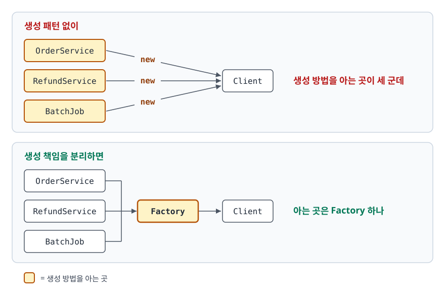
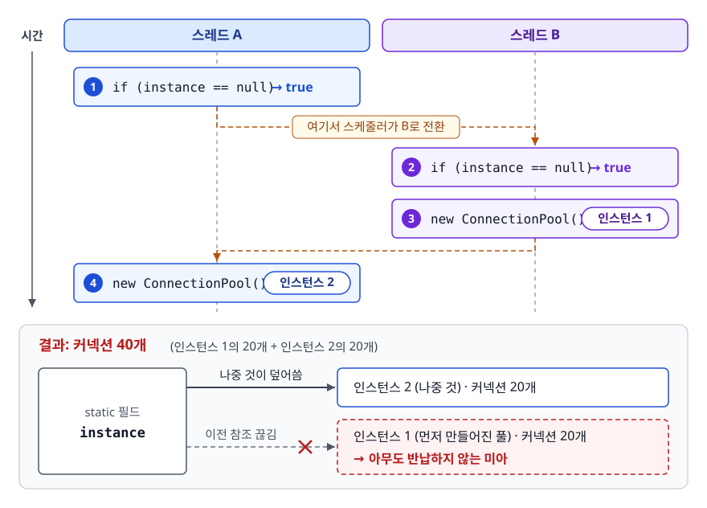
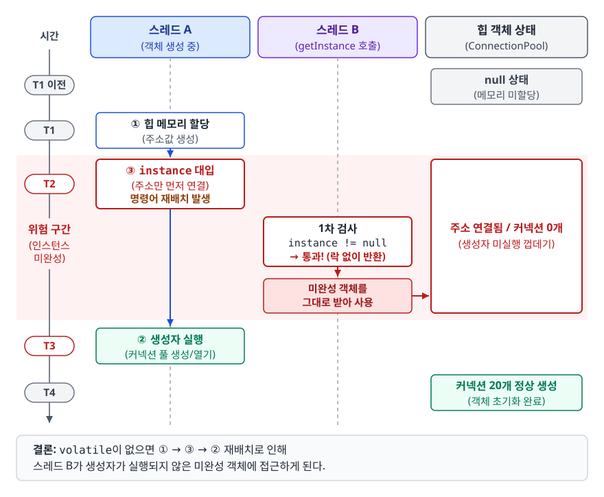
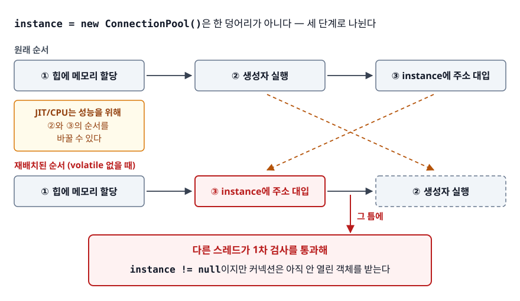
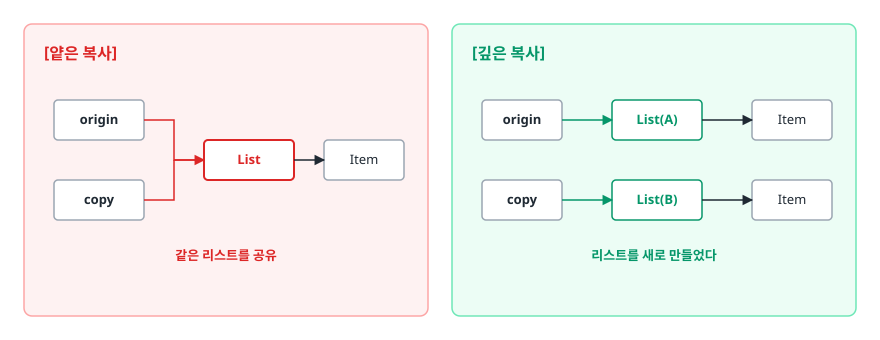

# 생성 패턴 (Creational Patterns)

> `new` 한 줄이 어떤 결합을 만드는지, 그리고 Singleton·Factory·Builder·Prototype이 그 결합의 어느 부분을 각각 끊어내는지 설명할 수 있게 된다.

## 학습 목표

- [ ] 객체를 직접 `new` 할 때 생기는 문제를 세 갈래로 나눠 지적할 수 있다
- [ ] 싱글톤을 스레드 안전하게 만드는 세 가지 방법을 코드로 쓰고 비교할 수 있다
- [ ] `volatile`이 double-checked locking에서 정확히 무엇을 막는지 설명할 수 있다
- [ ] Factory Method와 Abstract Factory를 "무엇이 교체되는가" 기준으로 구분할 수 있다
- [ ] 점층적 생성자와 자바빈즈 패턴이 각각 무엇을 포기하는지, 빌더가 그것을 어떻게 되찾는지 말할 수 있다

## 선행 지식

- [객체지향과 SOLID](../02-backend-engineering/java-fundamentals/01-oop-solid.md) - 인터페이스, 다형성, OCP
- 그 외에는 없음 — 자바 생성자 문법만 알면 읽을 수 있다

---

## 1. 왜 필요한가

주문 서비스에서 결제를 부르는 평범한 코드다.

```java
public class OrderService {
    public void order(int amount) {
        KakaoPayClient client = new KakaoPayClient("live-key-xxxx", 3000);
        client.pay(amount);
    }
}
```

한 줄뿐이지만 세 가지를 동시에 떠안고 있다. **무엇을 만들지**(결제사가 카카오로 고정), **어떻게 만들지**(API 키와 타임아웃을 주문 로직이 안다), **몇 개 만들지**(호출할 때마다 새 인스턴스). 그리고 이 지식은 한 곳에 머물지 않는다.

<!-- diagram:dp-creational-patterns-1 -->


<!-- 위 그림이 대체한 원본 ASCII.
     내용을 고칠 때는 그림도 함께 갱신할 것.
```
[생성 패턴 없이]                      [생성 책임을 분리하면]

 OrderService ──new──> Client         OrderService ──┐
 RefundService ─new──> Client         RefundService ─┼──> Factory ──> Client
 BatchJob ─────new──> Client          BatchJob ──────┘

 생성 방법을 아는 곳이 세 군데         아는 곳은 Factory 하나
```
-->

생성 패턴은 위 세 결정 중 무엇을 떼어내느냐로 갈린다.

| 패턴 | 떼어내는 결정 | 한 문장 |
|------|--------------|---------|
| Singleton | 몇 개 만들지 | 인스턴스를 하나로 묶고 접근점을 준다 |
| Factory Method | 무엇을 만들지 | 어떤 구현체를 만들지를 서브클래스가 정한다 |
| Abstract Factory | 무엇을 만들지 (세트로) | 서로 어울리는 객체들을 한 팩토리가 함께 만든다 |
| Builder | 어떻게 만들지 | 파라미터가 많은 생성 과정을 단계로 쪼갠다 |
| Prototype | 어떻게 만들지 | 처음부터 만들지 않고 기존 객체를 복제한다 |

> 표 요약: 만드는 비용이 문제면 Prototype, 절차가 복잡하면 Builder, 대상이 바뀌면 Factory, 개수가 문제면 Singleton이다.

---

## 2. 싱글톤 (Singleton)

### 없으면 어떻게 되나

생성자에서 DB 커넥션 20개를 미리 여는 커넥션 풀이 있다고 하자. 클래스마다 `new ConnectionPool()`을 하면 애플리케이션이 뜨는 순간 DB의 `max_connections`가 고갈된다. "이 클래스는 프로세스 안에 하나만 존재해야 한다"를 강제하고 싶어지는 지점이다.

### 가장 단순한 구현이 깨지는 지점

```java
public static ConnectionPool getInstance() {
    if (instance == null) {                   // 검사
        instance = new ConnectionPool();      // 생성
    }
    return instance;
}
```

검사와 생성 사이에 다른 스레드가 끼어들 수 있다.

<!-- diagram:dp-creational-patterns-2 -->


<!-- 위 그림이 대체한 원본 ASCII.
     내용을 고칠 때는 그림도 함께 갱신할 것.
```
시간 ──────────────────────────────────────────────>

스레드 A:  if (instance == null) → true
                                     ↓ (여기서 스케줄러가 B로 전환)
스레드 B:                          if (instance == null) → true
                                     new ConnectionPool()  ← 인스턴스 1
스레드 A:                                        new ConnectionPool()  ← 인스턴스 2

결과: 커넥션 40개. 게다가 나중 것이 static 필드를 덮어써서
      먼저 만들어진 풀의 커넥션 20개는 아무도 반납하지 않는 미아가 된다
```
-->

검사-후-행동(check-then-act)이 원자적이지 않아 생기는 경쟁 상태(race condition)다.

### 구현 1. Double-Checked Locking

<!-- diagram:dp-dcl-reordering -->


`getInstance()` 전체에 `synchronized`를 걸면 안전하지만 인스턴스가 만들어진 뒤에도 모든 호출이 락을 기다린다. 락을 꼭 필요할 때만 걸자는 것이 DCL이다.

```java
public class ConnectionPool {
    private static volatile ConnectionPool instance;   // volatile 필수
    private ConnectionPool() { }

    public static ConnectionPool getInstance() {
        if (instance == null) {                        // 1차 검사: 락 없이
            synchronized (ConnectionPool.class) {
                if (instance == null) {                // 2차 검사: 락 안에서
                    instance = new ConnectionPool();
                }
            }
        }
        return instance;
    }
}
```

`volatile`이 빠지면 왜 깨지는가. `instance = new ConnectionPool()`은 한 덩어리가 아니다.

<!-- diagram:dp-creational-patterns-3 -->


<!-- 위 그림이 대체한 원본 ASCII.
     내용을 고칠 때는 그림도 함께 갱신할 것.
```
① 힙에 메모리 할당  ② 생성자 실행  ③ instance에 주소 대입

JIT/CPU는 성능을 위해 ②와 ③의 순서를 바꿀 수 있다.
  ① → ③ → ②  가 되면, 그 틈에 다른 스레드가 1차 검사를 통과해
  instance != null 이지만 커넥션은 아직 안 열린 객체를 받는다.
```
-->

`volatile`은 한 스레드가 쓴 값을 다른 스레드가 반드시 최신으로 보게 하는 **가시성(visibility)** 과 위와 같은 **명령어 재배치 방지**를 함께 보장한다. Java 5에서 메모리 모델(JSR-133)이 정비되면서 `volatile`을 붙인 DCL이 비로소 안전해졌다.

### 구현 2. LazyHolder

```java
public class ConnectionPool {
    private ConnectionPool() { }

    private static class Holder {
        private static final ConnectionPool INSTANCE = new ConnectionPool();
    }

    public static ConnectionPool getInstance() {
        return Holder.INSTANCE;
    }
}
```

동기화 코드가 한 글자도 없는데 안전하다. **JVM의 클래스 초기화 규칙을 빌려 쓰기 때문**이다. 중첩 클래스 `Holder`는 `ConnectionPool`이 초기화될 때 같이 초기화되지 않고 `Holder.INSTANCE`를 실제로 읽는 순간 초기화된다(지연 초기화). 그리고 클래스 초기화는 명세상 **한 번만, 한 스레드만** 수행하며 나머지는 대기하도록 보장된다(스레드 안전).

### 구현 3. enum

```java
public enum ConnectionPool {
    INSTANCE;
    private final List<Connection> pool = new ArrayList<>();
    public Connection borrow() { /* ... */ }
}

ConnectionPool.INSTANCE.borrow();   // 사용
```

LazyHolder도 충분히 안전한데 왜 enum이 권장될까. **LazyHolder에는 없는 두 개의 구멍을 언어가 대신 막아주기** 때문이다.

**구멍 1. 역직렬화.** 일반 클래스 싱글톤이 `Serializable`이면, 역직렬화는 생성자를 거치지 않고 새 인스턴스를 만든다. 막으려면 `readResolve()`를 직접 정의해 원본을 돌려줘야 한다. enum은 이름만 직렬화하고 복원 시 기존 상수를 찾아 돌려주도록 JVM이 처리한다.

**구멍 2. 리플렉션.** `getDeclaredConstructor()`로 꺼낸 `private` 생성자에 `setAccessible(true)`를 걸면 일반 클래스 싱글톤은 그대로 뚫려 두 번째 인스턴스가 만들어진다. enum 생성자는 리플렉션으로 호출하면 `IllegalArgumentException`이 나므로 언어 차원에서 우회가 불가능하다.

| 기준 | DCL + volatile | LazyHolder | enum |
|------|---------------|-----------|------|
| 코드 길이 | 길다 | 짧다 | 가장 짧다 |
| 지연 초기화 | 된다 | 된다 | 된다 (enum 타입 최초 접근 시) |
| 역직렬화 방어 | `readResolve` 직접 구현 | `readResolve` 직접 구현 | 언어가 보장 |
| 리플렉션 방어 | 방어 코드 필요 | 방어 코드 필요 | 언어가 보장 |
| 클래스 상속 | 가능 | 가능 | 불가능 (인터페이스 구현은 가능) |
| 런타임 값을 받아 생성 | 가능 | 어렵다 | 불가능 (호출자가 값을 넘길 수 없다) |

> 결론: 새로 짠다면 **enum이 기본값**, 상속이 필요하거나 생성 시점에 외부 값을 넘겨야 하면 LazyHolder. DCL은 `volatile`을 설명하는 교육용 예시로는 유효하지만 새 코드에서 고를 이유가 없다.

### 싱글톤은 안티패턴인가

싱글톤은 GoF 패턴 중 유일하게 "쓰지 말라"는 주장이 따라다닌다. 문제는 인스턴스가 하나라는 사실이 아니라 **전역 접근점**이다.

```java
// 안티패턴 - 전역 접근점을 코드 안에서 직접 부른다
public class OrderService {
    public void order(Long userId) {
        Config config = Config.getInstance();      // 숨은 의존성
        if (config.isDiscountEnabled()) { /* ... */ }
    }
}
```

**왜 문제인가**: 생성자만 봐서는 `Config`에 의존한다는 사실을 알 수 없어 의존성이 숨는다. 전역 인스턴스가 상태를 들고 있으면 테스트 A가 바꾼 설정이 테스트 B에 남아 실행 순서에 따라 결과가 달라진다. 무엇보다 가짜 `Config`로 바꿔 끼울 자리가 없다.

```java
// 개선 - 인스턴스는 하나로 유지하되, 받아서 쓴다
public class OrderService {
    private final Config config;
    public OrderService(Config config) { this.config = config; }   // 의존성이 보인다
}
```

인스턴스가 하나여야 한다는 요구는 그대로다. 달라진 것은 **하나임을 누가 보장하느냐**다. 클래스 자신이 아니라 조립하는 쪽(DI 컨테이너)이 보장한다.

그래서 Spring의 싱글톤 빈은 GoF 싱글톤과 이름만 같다. `static` 필드로 구현한 GoF 싱글톤은 클래스를 로드한 클래스로더마다 하나씩 생기지만, Spring 빈의 유일성 범위는 **컨테이너 단위**다. 컨테이너가 둘이면 같은 클래스의 빈도 둘이고, `private` 생성자로 강제하는 것이 아니라 컨테이너의 관리 정책일 뿐이다. 무엇보다 사용하는 쪽은 주입만 받으므로 자기가 쓰는 것이 싱글톤인지 몰라도 되고, 테스트에서는 가짜 빈으로 교체된다.

---

## 3. 팩토리 (Factory Method / Abstract Factory)

### 없으면 어떻게 되나

```java
// 안티패턴 - 생성 분기가 사용하는 쪽에 박혀 있다
public void send(String type, String message) {
    if (type.equals("email"))     new EmailSender(smtpHost, smtpPort).send(message);
    else if (type.equals("sms"))  new SmsSender(apiKey).send(message);
    else if (type.equals("push")) new PushSender(fcmKey, retryCount).send(message);
}
```

**왜 문제인가**: 알림 수단이 하나 늘 때마다 이 클래스를 수정하므로 OCP(개방-폐쇄 원칙)를 어긴다. 더 나쁜 것은 SMTP 호스트, FCM 키 같은 **생성에만 필요한 지식이 발송 로직 안에 섞여 있다**는 점이다.

### Factory Method — 무엇을 만들지를 서브클래스가 정한다

```java
public abstract class Notifier {
    public final void notifyUser(String userId, String message) {   // 흐름은 고정
        MessageSender sender = createSender();                  // Factory Method
        sender.send(userId, message);
        log(userId, message);
    }
    protected abstract MessageSender createSender();            // 무엇을 만들지만 위임
}

public class EmailNotifier extends Notifier {
    @Override
    protected MessageSender createSender() {
        return new EmailSender(smtpHost, smtpPort);   // 생성 지식은 여기에만
    }
}
```

새 알림 수단은 상속 클래스 하나 추가로 끝나고 기존 코드는 열지 않는다. 실무에서 가장 익숙한 예는 JDBC의 `conn.createStatement()`다. 호출 코드는 언제나 같지만 `conn`이 MySQL 드라이버가 준 것이냐 H2가 준 것이냐에 따라 반환되는 `Statement` 구현체가 달라진다.

### Abstract Factory — 어울리는 것들을 세트로 만든다

문제가 "객체 하나"가 아니라 "함께 쓰여야 하는 객체 여러 개"일 때가 있다. `new WindowsButton()` 옆에 `new MacCheckbox()`를 놓아도 컴파일은 통과한다. 화면만 이상해진다.

```java
public interface UiFactory {
    Button createButton();
    Checkbox createCheckbox();
}

public class WindowsUiFactory implements UiFactory {
    public Button createButton()     { return new WindowsButton(); }
    public Checkbox createCheckbox() { return new WindowsCheckbox(); }
}

// 사용하는 쪽은 팩토리 하나만 고르면 세트가 보장된다
public void render(UiFactory factory) {
    factory.createButton().draw();
    factory.createCheckbox().draw();   // 다른 OS 것이 섞일 수 없다
}
```

| 기준 | Factory Method | Abstract Factory |
|------|---------------|------------------|
| 만드는 대상 | 객체 하나 | 서로 어울리는 객체 묶음 |
| 추상화 단위 | 메서드 하나 | 팩토리 클래스 전체 |
| 확장 방법 | 서브클래스 추가 | 팩토리 구현체 추가 |
| 핵심 가치 | 생성 지식의 캡슐화 | 위 + 세트의 일관성 보장 |
| 실무 예 | `Connection.createStatement()` | OS별 위젯을 통째로 만드는 GUI 툴킷 |

> 판단 기준은 하나다. **"어긋난 조합이 생기면 곤란한가?"** 곤란하면 Abstract Factory, 아니면 Factory Method로 충분하다.

---

## 4. 빌더 (Builder)

### 문제 1. 점층적 생성자 (telescoping constructor)

```java
Pizza pizza = new Pizza("L", true, false, true);
```

**왜 문제인가**: `true, false, true`가 각각 무엇인지 호출부만 보고는 알 수 없다. 더 위험한 것은 뒤쪽 `boolean` 세 개를 어떤 순서로 섞어 넘겨도 **타입이 같으니 컴파일이 통과한다**는 점이다. 치즈 추가와 도우 변경을 맞바꿔 넘긴 실수는 런타임에야 드러난다.

### 문제 2. 자바빈즈 패턴 (setter)

```java
Pizza pizza = new Pizza();
pizza.setSize("L");
pizza.setCheese(true);
```

**왜 문제인가**: 읽기는 좋아졌지만 두 가지를 잃었다. setter가 열려 있으니 필드를 `final`로 둘 수 없어 **불변성**이 깨지고, 첫 줄과 마지막 줄 사이에 객체가 **미완성 상태로 존재한다**. 값을 빠뜨려도 아무 경고가 없다가 한참 뒤에 터진다.

빌더는 값을 쌓는 일을 별도 객체에 맡기고, 대상 객체는 `build()` 한 번에 완성된 상태로 태어나게 해서 가독성과 안전성을 함께 얻는다.

### 빌더

```java
public class Pizza {
    private final String size;
    private final boolean cheese;

    private Pizza(Builder builder) {
        this.size = builder.size;
        this.cheese = builder.cheese;
    }

    public static Builder builder(String size) {   // 필수값은 진입점에서 받는다
        return new Builder(size);
    }

    public static class Builder {
        private final String size;
        private boolean cheese;

        private Builder(String size) { this.size = size; }
        public Builder cheese(boolean v) { this.cheese = v; return this; }

        public Pizza build() {
            if (!List.of("S", "M", "L").contains(size)) {
                throw new IllegalArgumentException("size는 S/M/L만 가능: " + size);
            }
            return new Pizza(this);      // 검증을 통과한 값으로만 생성
        }
    }
}

Pizza pizza = Pizza.builder("L").cheese(true).build();
```

`build()` 안에 **여러 필드를 함께 봐야 하는 검증**을 넣을 수 있다는 점이 중요하다. setter 방식에서는 어느 setter에 검증을 넣어도 다른 필드가 아직 안 들어와 있을 수 있어 이런 검증이 불가능하다.

**비유**: 서브웨이에서 샌드위치를 시키는 과정과 같다. 재료를 고르는 동안 샌드위치는 아직 완성되지 않았고 마지막에 포장되어 나온다. 중간에 손님이 받아 가는 일은 없다.
> **비유의 한계**: 빌더는 `build()`를 여러 번 불러 같은 설정으로 객체를 여러 개 찍어낼 수 있다. 샌드위치는 한 번 나오면 끝이다.

### Lombok `@Builder`는 생성자 위에

```java
// 안티패턴 - 엔티티 클래스 위에 붙인다
@Entity
@Builder
public class User {
    @Id @GeneratedValue private Long id;
    private String name;
}

User user = User.builder().id(999L).build();   // id를 외부에서 넣을 수 있다
```

**왜 문제인가**: 클래스에 붙인 `@Builder`는 모든 필드를 빌더로 노출한다. DB가 채워야 할 `id`를 애플리케이션이 임의로 지정할 수 있고, 필수값을 빠뜨려도 경고가 없다.

**개선**: `@Builder`를 클래스가 아니라 **생성자 위에** 붙인다. 그러면 그 생성자의 파라미터만 빌더 메서드가 되므로 `id`는 아예 노출되지 않고, 생성자 본문에 필수값 검증을 넣을 자리도 생긴다.

---

## 5. 프로토타입 (Prototype)

생성 비용이 크거나 런타임에 설정된 객체를 그대로 찍어내야 할 때 쓴다. 핵심은 **복제 책임을 객체 자신에게 주는 것**이다.

```java
public interface Shape {
    Shape copy();
}

public class Circle implements Shape {
    private final int x, y;

    public Circle(int x, int y) { this.x = x; this.y = y; }
    private Circle(Circle other) { this(other.x, other.y); }   // 복사 생성자

    @Override
    public Shape copy() { return new Circle(this); }
}

for (Shape s : selectedShapes) canvas.add(s.copy());   // 구체 타입을 몰라도 된다
```

복제에서 사고가 나는 지점은 거의 항상 얕은 복사(shallow copy)다.

```java
private Order(Order other) { this.items = other.items; }   // 참조만 복사했다

Order copy = origin.copy();
copy.getItems().add(new Item("추가상품"));
origin.getItems().size();          // 원본에도 추가돼 있다
```

<!-- diagram:dp-creational-patterns-4 -->


<!-- 위 그림이 대체한 원본 ASCII.
     내용을 고칠 때는 그림도 함께 갱신할 것.
```
[얕은 복사]                       [깊은 복사]

 origin ──┐                        origin ──> List(A) ──> Item
          ├──> List ──> Item
 copy ────┘                        copy ────> List(B) ──> Item
   같은 리스트를 공유                 리스트를 새로 만들었다
```
-->

개선의 기준은 "그 필드를 나중에 바꿀 수 있는가"다. 주문 번호 같은 `String` 필드는 불변이라 참조만 복사해도 안전하지만, 리스트는 `new ArrayList<>(other.items)`로 새로 만들어야 한다. `items` 안의 `Item`까지 바꿀 수 있다면 `Item`도 복제해야 한다. 그래서 실무에서는 **복제 대상을 가능한 한 불변으로 설계하는 것**이 가장 안전한 답이 된다. 자바의 `Cloneable`/`clone()`은 이 패턴의 언어 지원처럼 보이지만 `Cloneable`에는 `clone()`이 없고 생성자를 거치지 않아 `final` 필드를 다루기 까다롭다. 새로 짠다면 위처럼 복사 생성자나 정적 복사 팩토리를 쓴다.

---

## 6. 실무에서는

- **Spring을 쓰면 싱글톤을 직접 구현할 일이 거의 없다.** `@Component`를 붙이면 컨테이너가 하나만 만들어 관리한다. `getInstance()`를 새로 짜고 있다면 그 클래스가 왜 빈이 아닌지부터 확인하는 편이 좋다.
- **Factory는 `Map` 주입으로 대체되는 경우가 많다.** 같은 인터페이스 빈이 여러 개면 Spring이 `Map<String, T>`에 빈 이름을 키로 넣어 주입해준다. `if-else` 팩토리가 `map.get(type)` 한 줄이 된다. ([행위 패턴](./03-behavioral-patterns.md)의 전략 패턴에서 자세히 다룬다)
- **Builder는 Lombok으로 쓰되 생성자 위에 붙인다.** 엔티티는 특히 그렇다. 모든 필드가 외부에서 들어오는 것이 자연스러운 DTO라면 클래스 레벨도 무방하다.
- **Prototype이라는 이름은 잘 안 쓰이지만 개념은 흔하다.** 설정이 끝난 객체를 원본으로 두고 요청마다 복제해 쓰는 코드가 그렇다. 이름 때문에 헷갈리기 쉬운데 Spring의 `@Scope("prototype")`은 이 패턴과 관계가 없다. 복제하는 것이 아니라 요청할 때마다 새로 생성해 돌려주는 빈 스코프일 뿐이다.

---

## 7. 면접 포인트

> 면접에서 이 주제가 나오면 이렇게 답한다

**Q. 싱글톤을 스레드 안전하게 구현하는 방법을 설명해주세요.**
A. 세 가지가 있습니다. Double-checked locking은 `volatile` 필드와 이중 null 검사로 락 비용을 줄이는 방식이고, LazyHolder는 중첩 클래스의 초기화를 JVM이 한 번만 보장한다는 성질을 이용해 동기화 코드 없이 안전성과 지연 초기화를 함께 얻습니다. enum 방식은 여기에 더해 역직렬화와 리플렉션으로 인스턴스가 하나 더 생기는 것까지 언어가 막아줍니다. 새로 짠다면 enum, 상속이 필요하면 LazyHolder를 씁니다.
- 꼬리 질문: "DCL에서 `volatile`을 빼면 어떻게 되나요?" → 객체 생성은 할당·초기화·참조 대입 세 단계인데 재배치로 순서가 바뀔 수 있어, 1차 검사를 통과한 다른 스레드가 초기화 전 객체를 받을 수 있다고 답한다.

**Q. 싱글톤 패턴의 단점은 무엇인가요?**
A. 인스턴스가 하나라는 사실보다 **전역 접근점**이 문제입니다. `getInstance()`를 코드 안에서 직접 부르면 그 의존성이 생성자에 드러나지 않아 숨은 결합이 되고, 전역 상태가 테스트 간에 공유되어 실행 순서에 따라 결과가 달라집니다. 그래서 요즘은 인스턴스를 하나로 유지하되 DI 컨테이너가 주입해주는 방식을 씁니다.
- 꼬리 질문: "Spring 빈도 싱글톤인데 왜 괜찮나요?" → 유일성의 범위가 컨테이너 단위이고, 사용하는 쪽은 주입만 받으므로 테스트에서 가짜 객체로 교체할 수 있기 때문이라고 답한다.

**Q. Factory Method와 Abstract Factory의 차이는?**
A. Factory Method는 객체 하나의 생성 결정을 서브클래스에 위임하는 것이고, Abstract Factory는 서로 어울려야 하는 객체 묶음을 한 팩토리가 함께 만들게 하는 것입니다. 핵심 차이는 **일관성 보장**입니다. Windows 버튼 옆에 Mac 체크박스가 붙는 조합을 애초에 만들 수 없게 하는 것이 Abstract Factory의 가치입니다. 실무에서는 `Connection.createStatement()`가 전자, OS마다 버튼과 체크박스 세트를 통째로 바꿔 끼우는 GUI 툴킷이 후자입니다.
- 꼬리 질문: "그럼 `if-else`로 객체를 골라 반환하는 정적 메서드도 팩토리 패턴인가요?" → 그것은 정적 팩토리 메서드라는 별개의 관용구이고, GoF Factory Method는 서브클래스가 생성 대상을 결정하는 구조를 말한다고 구분해 답한다.

**Q. 빌더 패턴은 언제 쓰나요?**
A. 생성자 파라미터가 많고 상당수가 선택적일 때 씁니다. 점층적 생성자는 인자 순서를 실수해도 타입이 같으면 컴파일이 통과하고, setter 방식은 객체가 미완성 상태로 노출되며 `final`을 쓸 수 없습니다. 빌더는 값을 이름으로 지정해 가독성을 얻으면서 `build()` 시점에 여러 필드를 함께 검증하고 불변 객체를 만들 수 있습니다.
- 꼬리 질문: "Lombok `@Builder` 주의사항은?" → 클래스에 붙이면 `id`처럼 외부에서 넣으면 안 되는 필드까지 노출되고 검증을 넣을 자리가 없으므로, 생성자 위에 붙여 노출 범위를 좁힌다고 답한다.

---

## 자주 하는 실수

| 실수 | 왜 틀렸나 | 올바른 이해 |
|------|----------|-----------|
| "`getInstance()`에 `synchronized`만 붙이면 최선이다" | 인스턴스가 만들어진 뒤에도 모든 호출이 락을 기다린다 | 읽기가 압도적으로 많으므로 LazyHolder나 enum처럼 락 자체가 없는 방식을 쓴다 |
| "enum 싱글톤은 지연 초기화가 안 된다" | enum 상수는 그 enum 타입에 처음 접근할 때 클래스 초기화와 함께 만들어진다 | 사실상 지연 초기화된다. 다만 홀더 방식처럼 "클래스 로드"와 "인스턴스 생성" 시점을 따로 떼어 미룰 수는 없다 |
| "싱글톤이면 무조건 스레드 안전하다" | 인스턴스가 하나라는 것과 그 안의 상태가 안전하다는 것은 다른 얘기다 | 오히려 모든 스레드가 같은 필드를 공유하므로 가변 상태를 두면 더 위험하다 |
| "빌더를 쓰면 불변 객체가 된다" | 빌더는 생성 방법일 뿐이다. 대상 클래스에 setter가 열려 있으면 그대로 가변이다 | 필드를 `final`로 두고 생성자를 `private`으로 막아야 불변이 된다 |
| "복제는 `clone()`이 정석이다" | `Cloneable`은 메서드가 없는 표식 인터페이스이고 기본 동작이 얕은 복사다 | 복사 생성자나 정적 복사 팩토리를 쓰고, 가변 필드는 새로 만든다 |

---

## 한 줄 정리

생성 패턴은 "몇 개를 만들지(Singleton), 무엇을 만들지(Factory), 어떻게 만들지(Builder·Prototype)"를 객체를 쓰는 코드에서 떼어내 한곳에 모으는 기법이며, 목적은 언제나 사용하는 쪽이 구체 클래스를 몰라도 되게 하는 것이다.

---

## 연관 개념

- [02-structural-patterns.md](./02-structural-patterns.md) - 만들어진 객체들을 어떻게 조합해 구조를 짜는가
- [03-behavioral-patterns.md](./03-behavioral-patterns.md) - 팩토리로 뽑은 구현체를 런타임에 갈아 끼우는 전략 패턴
- [04-architecture-patterns.md](./04-architecture-patterns.md) - 패턴을 애플리케이션 전체 구조로 확장한 형태
- [qna-design-patterns.md](./qna-design-patterns.md) - 싱글톤·팩토리·빌더 면접 질문(Q1, Q2, Q7)
- [../02-backend-engineering/spring-framework/01-ioc-di.md](../02-backend-engineering/spring-framework/01-ioc-di.md) - 컨테이너가 싱글톤과 팩토리를 대신 해주는 방식
- [../02-backend-engineering/java-fundamentals/02-memory-model.md](../02-backend-engineering/java-fundamentals/02-memory-model.md) - `volatile`과 명령어 재배치의 배경
