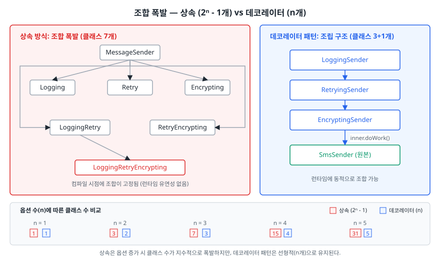
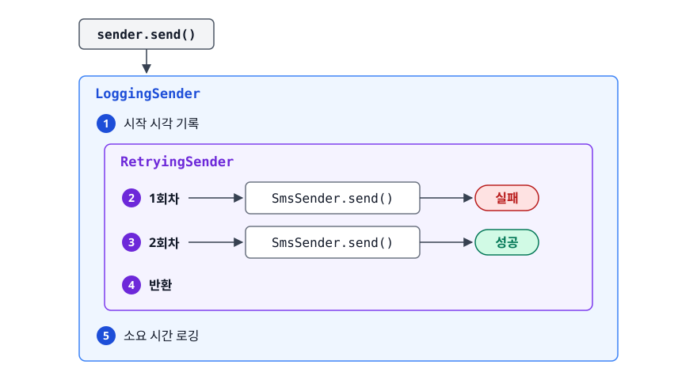
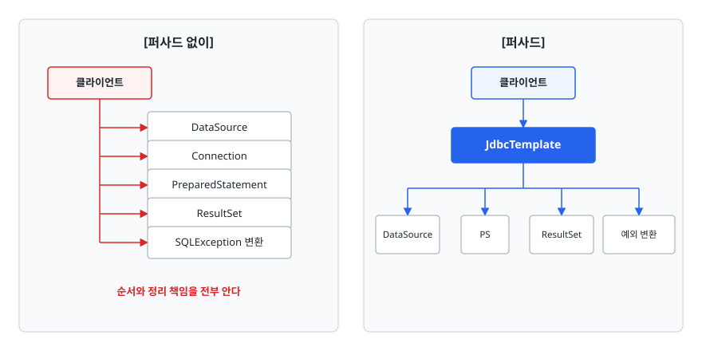
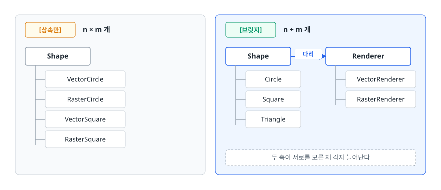
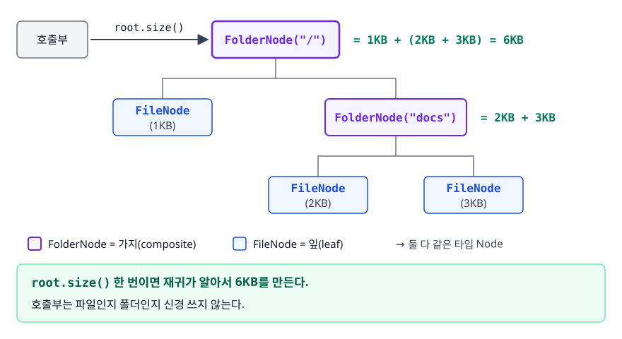

# 구조 패턴 (Structural Patterns)

> 상속만으로 구조를 짜면 왜 클래스가 폭발하는지, 그리고 Adapter·Decorator·Facade·Proxy·Bridge·Composite가 "감싼다"는 같은 수법으로 서로 다른 문제를 어떻게 푸는지 설명할 수 있게 됩니다.

## 학습 목표

- [ ] 조합 폭발이 왜 생기는지 수식으로 설명할 수 있다
- [ ] 데코레이터가 무한히 중첩 가능한 이유를 한 문장으로 말할 수 있다
- [ ] 데코레이터와 프록시가 구조가 같은데도 다른 패턴인 이유를 설명할 수 있다
- [ ] `java.io`의 한 줄에서 어댑터와 데코레이터를 골라낼 수 있다
- [ ] 브릿지와 전략 패턴의 차이를 의도 관점에서 구분할 수 있다

## 선행 지식

- [생성 패턴](./01-creational-patterns.md) - 객체를 만드는 책임을 분리하는 이야기
- [객체지향과 SOLID](../02-backend-engineering/java-fundamentals/01-oop-solid.md) - 상속과 합성, 인터페이스

---

## 1. 왜 필요한가

<!-- diagram:dp-structural-patterns -->


알림 발송기에 로깅, 재시도, 암호화를 선택적으로 붙이고 싶다고 하자. 상속만 쓰면 이렇게 됩니다.

```
                   MessageSender
                         │
   ┌──────────┬──────────┼──────────────┬───────────────┐
 Logging    Retry    Encrypting   LoggingRetry   RetryEncrypting
                                        │
                            LoggingRetryEncrypting ...
```

옵션이 3개면 조합은 2³ = 8가지, 곧 클래스 7개가 필요하다(원본 제외). 옵션이 하나 더 늘면 15개입니다. **옵션 n개에 클래스 2ⁿ-1개**, 이것이 조합 폭발입니다. 더 근본적인 문제는 조합이 컴파일 시점에 고정된다는 것입니다. "이 사용자에게만 암호화를 켜자" 같은 런타임 결정을 표현할 방법이 없습니다.

구조 패턴 여섯 개는 놀랍게도 거의 같은 코드 모양을 갖습니다. **대상과 같은 인터페이스를 구현하면서 내부에 대상을 필드로 들고 있는 것**입니다.

```java
class Wrapper implements Target {   // 같은 인터페이스를 구현하고
    private final Target inner;     // 대상을 안에 들고 있다
    public void doWork() { inner.doWork(); }   // 앞뒤로 무언가를 하고 대상에게 넘긴다
}
```

코드가 같은데 왜 이름이 여섯 개일까. **의도가 다르기 때문입니다.** 구조 패턴은 "코드 모양"이 아니라 "무엇을 해결하려는가"로 정리해야 합니다.

| 패턴 | 해결하려는 문제 | 감싸는 목적 |
|------|----------------|------------|
| Adapter | 인터페이스가 서로 안 맞는다 | 모양을 변환하려고 |
| Decorator | 기능 조합이 폭발한다 | 기능을 얹으려고 |
| Facade | 서브시스템이 너무 복잡하다 | 여러 개를 하나로 묶으려고 |
| Proxy | 대상에 바로 접근시키면 곤란하다 | 접근을 통제하려고 |
| Bridge | 두 축이 각각 늘어난다 | 축을 분리해두려고 |
| Composite | 개별과 묶음을 다르게 다뤄야 한다 | 트리를 하나처럼 다루려고 |

> 표 요약: 앞의 네 개는 "감싸는 이유"의 차이고, Bridge는 감싸는 게 아니라 **처음부터 두 계층으로 설계**하는 것, Composite는 감싼 것이 **여러 개**라는 점이 다릅니다.

---

## 2. 어댑터 (Adapter)

### 없으면 어떻게 되나

카카오페이로 짠 결제 코드가 서비스 100군데에서 호출되고 있습니다. 여기에 토스페이를 추가해야 합니다.

```java
public interface PaymentGateway {          // 100군데가 이미 쓰는 인터페이스
    PayResult pay(long orderId, int amount);
}
public class TossPayApi {                  // 새 SDK는 모양이 다르다
    public TossResponse requestPayment(String orderNo, int amount, String currency) { /* ... */ }
}
```

메서드 이름도, 파라미터도, 반환 타입도 다릅니다. 호출부마다 변환 코드를 넣으면 **같은 변환이 100군데로 복제되고**, SDK가 업그레이드될 때 그중 하나만 빠뜨려도 그 경로에서만 결제가 깨집니다.

### 어댑터

변환 책임을 클래스 하나로 몰아넣습니다.

```java
public class TossPaymentAdapter implements PaymentGateway {   // 기존 인터페이스를 구현
    private final TossPayApi tossApi;                          // 새 SDK를 안에 들고 있다
    public TossPaymentAdapter(TossPayApi tossApi) { this.tossApi = tossApi; }

    @Override
    public PayResult pay(long orderId, int amount) {
        TossResponse res = tossApi.requestPayment(String.valueOf(orderId), amount, "KRW");
        return new PayResult(res.isSuccess(), res.getTransactionId());   // 응답도 변환
    }
}

// 바뀌는 코드는 조립 지점 한 줄뿐
PaymentGateway gateway = new TossPaymentAdapter(new TossPayApi());
```

호출부 100군데는 한 글자도 바뀌지 않습니다. 자기가 부르는 것이 토스인지도 모릅니다.

**비유**: 해외여행용 전원 어댑터입니다. 노트북 플러그(기존 코드)도 유럽 콘센트(새 SDK)도 바꾸지 않고 가운데에 변환기를 끼웁니다.
> **비유의 한계**: 전원 어댑터는 전압만 바꾸지만 소프트웨어 어댑터는 파라미터 조합·예외 타입·단위까지 바꿔야 할 때가 많습니다. 변환 로직이 두꺼워지면 어댑터가 아니라 별도 계층으로 승격시켜야 한다는 신호입니다.

실무 사례로는 배열을 `List`로 쓰게 해주는 `Arrays.asList()`, 바이트 스트림을 문자 스트림으로 바꾸는 `InputStreamReader`, 시그니처가 제각각인 핸들러들을 `DispatcherServlet`이 한 방식으로 부르게 해주는 Spring MVC의 `HandlerAdapter`가 있습니다.

---

## 3. 데코레이터 (Decorator)

### 감싸기로 조합한다

```java
public interface MessageSender {
    void send(String to, String body);
}

public class SmsSender implements MessageSender {          // 원본
    public void send(String to, String body) { /* 실제 발송 */ }
}

public abstract class SenderDecorator implements MessageSender {
    protected final MessageSender delegate;
    protected SenderDecorator(MessageSender delegate) { this.delegate = delegate; }
}

public class LoggingSender extends SenderDecorator {
    public LoggingSender(MessageSender delegate) { super(delegate); }

    @Override
    public void send(String to, String body) {
        long start = System.currentTimeMillis();
        delegate.send(to, body);
        log.info("발송 완료 to={} {}ms", to, System.currentTimeMillis() - start);
    }
}

public class RetryingSender extends SenderDecorator {
    private final int maxAttempts;
    public RetryingSender(MessageSender d, int maxAttempts) { super(d); this.maxAttempts = maxAttempts; }

    @Override
    public void send(String to, String body) {
        for (int i = 1; i <= maxAttempts; i++) {
            try { delegate.send(to, body); return; }
            catch (SendFailedException e) { if (i == maxAttempts) throw e; }
        }
    }
}
```

조합은 런타임에 결정됩니다.

```java
MessageSender sender = new LoggingSender(new RetryingSender(new SmsSender(), 3));
sender.send("010-0000-0000", "인증번호는 123456입니다");
```

<!-- diagram:dp-structural-patterns-1 -->


<!-- 위 그림이 대체한 원본 ASCII.
     내용을 고칠 때는 그림도 함께 갱신할 것.
```
sender.send()
  │
  ├─ LoggingSender      시작 시각 기록
  │     │
  │     ├─ RetryingSender  1회차 → SmsSender.send()  ─── 실패
  │     ├─ RetryingSender  2회차 → SmsSender.send()  ─── 성공
  │     │
  │     └─ 반환
  │
  └─ LoggingSender      소요 시간 로깅
```
-->

**무한히 쌓을 수 있는 이유는 한 줄로 설명됩니다.** `LoggingSender`도 `MessageSender`이기 때문에 그것을 또 다른 데코레이터의 생성자에 넣을 수 있습니다. 감싼 결과가 감쌀 수 있는 대상과 같은 타입입니다.

| 기준 | 상속으로 조합 | 데코레이터 |
|------|-------------|-----------|
| 조합 결정 시점 | 컴파일 시점 | 런타임 |
| 옵션 3개일 때 클래스 수 | 최대 7개 | 3개 |
| 옵션 추가 비용 | 기존 조합 전부와의 새 조합 | 클래스 1개 |
| 순서 변경 | 새 클래스를 또 만들어야 한다 | 감싸는 순서만 바꾸면 된다 |

> 결론: 기능이 **서로 독립적이고 조합이 자유로워야 하면** 데코레이터, 조합이 두세 가지로 고정이면 상속으로도 충분합니다.

### `java.io`가 교과서인 이유

```java
BufferedReader reader = new BufferedReader(
        new InputStreamReader(new FileInputStream("data.txt"), StandardCharsets.UTF_8));
```

이 한 줄 안에 구조 패턴이 두 개 들어 있습니다.

<!-- diagram:dp-structural-patterns-2 -->


<!-- 위 그림이 대체한 원본 ASCII.
     내용을 고칠 때는 그림도 함께 갱신할 것.
```
FileInputStream      원본. byte를 읽는다
      ↓
InputStreamReader    어댑터. InputStream을 받아 Reader를 구현한다 → 인터페이스가 바뀐다
      ↓
BufferedReader       데코레이터. Reader를 받아 Reader를 구현한다 → 인터페이스는 그대로,
                     버퍼링과 readLine() 기능만 얹는다
```
-->

**인터페이스가 바뀌면 어댑터, 그대로면 데코레이터.** 이 기준 하나로 둘을 구분할 수 있습니다.

---

## 4. 퍼사드 (Facade)

### 없으면 어떻게 되나

순수 JDBC로 조회 한 번을 하려면 커넥션 획득, `PreparedStatement` 생성, 파라미터 바인딩, `ResultSet` 순회, `SQLException` 변환, 그리고 `finally`에서 셋을 역순으로 `close()` 하는 15줄이 필요합니다.

**왜 문제인가**: 진짜 하고 싶은 일은 SQL 한 줄과 결과 매핑뿐인데 그 주위를 자원 관리 코드가 둘러쌉니다. 이 15줄이 조회 메서드마다 복제되고, `close()` 하나를 빠뜨리면 커넥션 누수가 됩니다.

### 퍼사드

`JdbcTemplate`은 그 절차 전체를 감춘 퍼사드입니다.

```java
public List<User> findActiveUsers() {
    return jdbcTemplate.query(
            "SELECT id, name FROM users WHERE active = ?",
            (rs, rowNum) -> new User(rs.getLong("id"), rs.getString("name")),
            true);
}
```

<!-- diagram:dp-structural-patterns-3 -->


<!-- 위 그림이 대체한 원본 ASCII.
     내용을 고칠 때는 그림도 함께 갱신할 것.
```
       [퍼사드 없이]                        [퍼사드]

  클라이언트                              클라이언트
   ├──> DataSource                          │
   ├──> Connection                          ▼
   ├──> PreparedStatement           ┌────────────────┐
   ├──> ResultSet                   │  JdbcTemplate  │
   └──> SQLException 변환            └───────┬────────┘
                                     ┌───────┼────────┬──────────┐
   순서와 정리 책임을 전부 안다        ▼       ▼        ▼          ▼
                                DataSource  PS    ResultSet  예외 변환
```
-->

퍼사드는 **서브시스템을 숨기지 폐쇄하지는 않습니다.** `JdbcTemplate`으로 안 되는 작업은 여전히 `Connection`을 직접 꺼내 쓸 수 있습니다. 퍼사드가 서브시스템을 막아버리면 그건 퍼사드가 아니라 감옥입니다.

| 기준 | 퍼사드 | 어댑터 |
|------|--------|--------|
| 목적 | 복잡도를 줄인다 | 인터페이스를 맞춘다 |
| 감싸는 대상 | 여러 클래스로 이루어진 서브시스템 | 보통 객체 하나 |
| 인터페이스 출처 | 내가 편하려고 **새로 만든다** | 클라이언트가 **이미 쓰고 있는** 것을 따른다 |
| 없앨 수 있나 | 없어도 직접 쓰면 된다 | 없으면 아예 호출이 안 된다 |

> 판단 기준: **"이 인터페이스는 원래 있던 것인가, 내가 새로 만든 것인가?"** 원래 있던 것에 맞추면 어댑터, 새로 만들었으면 퍼사드입니다.

---

## 5. 프록시 (Proxy)

프록시는 대상과 같은 인터페이스를 구현해 **대상 앞에 서서 접근을 통제합니다.** 통제하는 이유에 따라 이름이 나뉩니다.

**가상 프록시(Virtual Proxy)** 는 무거운 객체의 생성을 실제로 필요한 순간까지 미룹니다. JPA의 지연 로딩이 이 구조입니다. `order.getMember()`는 프록시를 돌려주고, `member.getName()`을 부르는 순간 SELECT가 나갑니다. [N+1 문제](../02-backend-engineering/database/03-n-plus-one-problem.md)가 생기는 지점도 여기입니다.

**보호 프록시(Protection Proxy)** 는 호출 전에 권한을 검사합니다.

```java
public class SecuredDocumentService implements DocumentService {
    private final DocumentService delegate;
    private final CurrentUser currentUser;

    @Override
    public Document read(Long id) {
        if (!currentUser.hasRole("READER")) throw new AccessDeniedException("권한 없음");
        return delegate.read(id);       // 검사를 통과해야 대상에 닿는다
    }
}
```

**원격 프록시(Remote Proxy)** 는 네트워크를 감춥니다. 호출하는 쪽은 로컬 메서드를 부르는 것처럼 보이지만 실제로는 요청을 직렬화해 원격으로 보냅니다. gRPC 스텁이나 Spring Cloud OpenFeign의 인터페이스 기반 클라이언트가 그렇습니다.

### Spring AOP와의 연결

`@Transactional`이 붙은 서비스를 주입받으면 컨테이너가 준 것은 원본이 아니라 프록시입니다.

```
호출부 ──> [프록시] ──> 트랜잭션 시작 ──> [실제 서비스.메서드()] ──> 커밋/롤백
             ↑ 컨테이너가 만들어 대신 주입한 객체
```

이 구조에서 **같은 클래스 안의 메서드를 `this`로 부르면 프록시를 거치지 않아 트랜잭션이 걸리지 않습니다.** 프록시 패턴의 성질에서 곧바로 따라 나오는 결론이고 실무에서 가장 자주 밟는 지뢰입니다. 자세한 내용은 [AOP와 프록시](../02-backend-engineering/spring-framework/02-aop-proxy.md)에서 다룹니다.

### 데코레이터와 프록시의 차이

코드 모양이 사실상 같아 가장 헷갈리는 한 쌍입니다. 구분 기준은 **누가 조립하는가**와 **무엇을 위해 감싸는가**입니다.

| 기준 | 데코레이터 | 프록시 |
|------|-----------|--------|
| 의도 | 기능을 **추가**한다 | 접근을 **통제**한다 |
| 대상 생성 | 클라이언트가 만들어 넣어준다 | 프록시가 직접 만들거나 찾아온다 |
| 중첩 | 여러 겹으로 쌓는 것이 전제 | 보통 한 겹 |
| 클라이언트 인지 | 무엇을 감쌌는지 알고 조립한다 | 프록시인 줄 모른다 |
| 예 | `BufferedReader` | JPA 지연 로딩, `@Transactional` 프록시 |

```java
// 데코레이터 - 클라이언트가 조립 순서를 직접 결정한다
MessageSender s = new LoggingSender(new RetryingSender(new SmsSender(), 3));

// 프록시 - 클라이언트는 조립에 관여하지 않는다
@Autowired OrderService orderService;   // 프록시가 주입되지만 코드상 차이가 없다
```

> 한 줄 기준: **"감쌀 대상을 내가 골라 넣었으면 데코레이터, 나도 모르게 감싸져 있으면 프록시."**

---

## 6. 브릿지 (Bridge)

도형과 렌더링 방식을 상속으로만 표현하면 `VectorCircle`, `RasterCircle`, `VectorSquare`... 도형 n종 × 렌더러 m종 = n×m개의 클래스가 필요합니다. 브릿지는 두 축을 나누고 합성으로 잇습니다.

```java
public interface Renderer {                       // 구현 축
    void drawCircle(int x, int y, int r);
}

public abstract class Shape {                     // 추상화 축
    protected final Renderer renderer;            // 이 참조가 '다리'
    protected Shape(Renderer renderer) { this.renderer = renderer; }
    public abstract void draw();
}

public class Circle extends Shape {
    private final int x, y, r;
    public Circle(Renderer rd, int x, int y, int r) { super(rd); this.x = x; this.y = y; this.r = r; }

    @Override
    public void draw() { renderer.drawCircle(x, y, r); }
}
```

<!-- diagram:dp-structural-patterns-4 -->


<!-- 위 그림이 대체한 원본 ASCII.
     내용을 고칠 때는 그림도 함께 갱신할 것.
```
[상속만]  n × m 개              [브릿지]  n + m 개

  Shape                          Shape ─────다리─────> Renderer
   ├ VectorCircle                 ├ Circle              ├ VectorRenderer
   ├ RasterCircle                 ├ Square              └ RasterRenderer
   ├ VectorSquare                 └ Triangle
   └ RasterSquare                두 축이 서로를 모른 채 각자 늘어난다
```
-->

JDBC가 대표적입니다. `Connection`, `Statement`가 추상화 축이고 각 DB 벤더의 드라이버가 구현 축입니다. `application.yml`의 URL 한 줄만 바꿔도 쿼리 코드가 그대로인 이유가 이 분리에 있습니다.

전략 패턴과 코드가 거의 같습니다. 둘 다 인터페이스를 필드로 들고 위임합니다. 차이는 의도에 있습니다.

| 기준 | 브릿지 | 전략 |
|------|--------|------|
| 분류 | 구조 패턴 | 행위 패턴 |
| 분리하는 것 | 시스템의 두 **계층** | 하나의 **알고리즘** |
| 교체 빈도 | 조립 시점에 정하고 잘 안 바꾼다 | 요청마다 바뀔 수 있다 |
| 축의 성장 | 양쪽이 모두 자란다 | 전략 쪽만 늘어난다 |

> 판단 기준: **"양쪽이 다 늘어나느냐."** 한쪽만 늘어나면 전략, 양쪽이 각자 늘어나면 브릿지입니다.

한 가지 덧붙이면, SLF4J를 브릿지 사례로 드는 설명이 흔한데 논쟁의 여지가 있습니다. 구조는 닮았지만 SLF4J는 처음부터 두 축을 설계한 것이 아니라 **이미 따로 존재하던 로깅 라이브러리들을 나중에 하나의 인터페이스로 묶은 것**이라 의도상으로는 퍼사드에 가깝습니다. 면접에서 이 구분을 짚어주면 오히려 좋은 인상을 줍니다.

---

## 7. 컴포지트 (Composite)

파일과 폴더의 전체 크기를 구한다고 하자. 노드 타입마다 `instanceof`로 분기하면, 노드를 다루는 **모든 메서드에 같은 분기가 복제됩니다.** 종류가 하나 추가되면 그 전부를 찾아 고쳐야 합니다.

컴포지트는 잎과 가지를 같은 타입으로 봅니다.

```java
public interface Node {
    long size();
}

public class FileNode implements Node {          // 잎(leaf)
    private final long bytes;
    @Override public long size() { return bytes; }
}
public class FolderNode implements Node {        // 가지(composite)
    private final List<Node> children = new ArrayList<>();
    public void add(Node node) { children.add(node); }

    @Override
    public long size() { return children.stream().mapToLong(Node::size).sum(); }  // 위임
}
```

<!-- diagram:dp-structural-patterns-5 -->


<!-- 위 그림이 대체한 원본 ASCII.
     내용을 고칠 때는 그림도 함께 갱신할 것.
```
        FolderNode("/")
              │
     ┌────────┴────────┐
 FileNode         FolderNode("docs")
 (1KB)                  │
                ┌───────┴───────┐
            FileNode        FileNode
            (2KB)           (3KB)

root.size() 한 번이면 재귀가 알아서 6KB를 만든다.
호출부는 파일인지 폴더인지 신경 쓰지 않는다.
```
-->

핵심은 **`FolderNode`도 `Node`라서 자기 자신을 자식으로 가질 수 있다**는 점입니다. 이 재귀 구조 덕분에 깊이가 얼마든 코드는 그대로입니다. AWT/Swing의 `Component`와 그것을 담으면서 스스로도 `Component`인 `Container`, HTML DOM 트리, 조직도, 카테고리 트리가 모두 이 형태입니다.

---

## 8. 실무에서는

- **어댑터는 외부 연동 경계에 둡니다.** 결제, 알림, 지도 API처럼 벤더가 바뀔 수 있는 지점에 인터페이스를 두고 벤더별 어댑터를 붙이면 교체가 클래스 하나 추가로 끝납니다.
- **데코레이터는 Spring에서 AOP로 대체되는 경우가 많습니다.** 여러 클래스에 공통으로 얹는 부가 기능은 `@Around` 어드바이스나 `@Cacheable`을 씁니다. 다만 **특정 객체 하나만 감싸고 싶을 때**는 데코레이터가 더 명시적이고 안전합니다.
- **프록시는 대부분 프레임워크가 만들어줍니다.** 직접 구현할 일보다 "지금 내가 들고 있는 이 객체가 프록시인가"를 판단할 일이 훨씬 많습니다. 지연 로딩 예외, self-invocation이 모두 여기서 나옵니다.

---

## 9. 면접 포인트

> 면접에서 이 주제가 나오면 이렇게 답한다

**Q. 데코레이터와 프록시의 차이를 설명해주세요.**
A. 구조는 거의 같습니다. 둘 다 대상과 같은 인터페이스를 구현하고 대상을 필드로 들고 있죠. 차이는 의도입니다. 데코레이터는 **기능을 추가**하려고 감싸고 클라이언트가 무엇을 어떤 순서로 감쌀지 직접 조립합니다. 프록시는 **접근을 통제**하려고 감싸고 클라이언트는 자기가 프록시를 쓰는지도 모릅니다. `BufferedReader`가 전자, JPA 지연 로딩이나 `@Transactional` 프록시가 후자입니다.
- 꼬리 질문: "그럼 로깅을 붙이는 건 어느 쪽인가요?" → 클라이언트가 직접 감싸 조립하면 데코레이터, AOP로 컨테이너가 몰래 감싸면 프록시라고 답합니다. 같은 기능도 조립 주체에 따라 분류가 달라집니다.

**Q. 어댑터와 퍼사드는 어떻게 구분하나요?**
A. 인터페이스가 어디서 왔는지를 봅니다. 어댑터는 클라이언트가 **이미 쓰고 있는 인터페이스**에 맞추는 것이라 모양을 내가 정할 수 없고 목적은 호환성입니다. 퍼사드는 내가 편하려고 **새로 만든 인터페이스**이고 목적은 복잡도 감소입니다. 또 어댑터가 없으면 아예 호출이 안 되지만 퍼사드는 없어도 서브시스템을 직접 쓰면 됩니다.
- 꼬리 질문: "`InputStreamReader`는 어느 쪽인가요?" → `InputStream`을 받아 `Reader`가 되므로 인터페이스가 바뀝니다. 어댑터라고 답합니다.

**Q. 데코레이터가 상속보다 나은 점은?**
A. 조합이 런타임에 결정되고 클래스 수가 선형으로 유지된다는 점입니다. 상속으로 옵션 n개를 조합하면 최대 2ⁿ-1개의 클래스가 필요하지만 데코레이터는 n개면 됩니다. 순서를 바꾸고 싶을 때도 감싸는 순서만 바꾸면 되고요. 대신 객체가 여러 겹으로 쌓여 스택이 깊어지고, 특정 데코레이터만 골라 꺼내기 어렵다는 단점이 있습니다.
- 꼬리 질문: "실무 예를 들어주세요" → `new BufferedReader(new InputStreamReader(new FileInputStream(...)))`를 들고 각각이 어댑터인지 데코레이터인지 구분해 설명합니다.

**Q. 브릿지 패턴은 언제 쓰나요?**
A. 서로 독립적으로 자랄 두 축이 보이는데 그것을 상속으로 엮으면 n×m개의 클래스가 되기 때문에 미리 분리해두는 패턴입니다. 도형과 렌더러, JDBC의 `Connection`과 벤더 드라이버가 예입니다. 전략 패턴과 코드는 비슷하지만, 전략은 알고리즘 하나를 교체하는 것이고 브릿지는 계층 자체를 분리하는 구조 설계라는 점이 다릅니다.
- 꼬리 질문: "그럼 SLF4J는 브릿지인가요?" → 구조는 닮았지만 이미 존재하던 구현들을 나중에 통합한 것이라 의도로는 퍼사드에 가깝다고 답합니다.

---

## 자주 하는 실수

| 실수 | 왜 틀렸나 | 올바른 이해 |
|------|----------|-----------|
| "감싸면 다 데코레이터다" | 감싸는 코드 모양은 어댑터·프록시·데코레이터가 모두 같다 | 인터페이스가 바뀌면 어댑터, 기능이 늘면 데코레이터, 접근을 막으면 프록시 |
| "퍼사드는 서브시스템을 못 쓰게 막는다" | 퍼사드는 단순한 진입로일 뿐 차단막이 아니다 | 특수한 경우엔 서브시스템을 직접 써도 됩니다. 막으면 확장성이 죽는다 |
| "`@Transactional`이 있으면 항상 트랜잭션이 걸린다" | 프록시를 거치지 않는 `this.method()` 호출에는 부가 기능이 적용되지 않는다 | 프록시 패턴의 성질입니다. 자기 호출은 프록시를 우회한다 |
| "브릿지와 전략은 같은 패턴이다" | 코드는 비슷하지만 분류(구조 vs 행위)와 의도가 다르다 | 양쪽 축이 모두 자라면 브릿지, 알고리즘만 교체되면 전략 |
| "컴포지트는 트리 자료구조를 만드는 패턴이다" | 목적은 자료구조가 아니라 **잎과 가지를 같은 타입으로 다루는 것**이다 | 클라이언트가 `instanceof` 없이 재귀 구조를 다루게 하는 것이 핵심 |

---

## 한 줄 정리

구조 패턴은 "대상과 같은 인터페이스를 구현하고 대상을 안에 들고 있다"는 하나의 수법을 공유하지만, 인터페이스를 맞추려는지(Adapter) 기능을 얹으려는지(Decorator) 복잡도를 감추려는지(Facade) 접근을 막으려는지(Proxy)에 따라 이름과 설계 판단이 갈립니다.

---

## 연관 개념

- [01-creational-patterns.md](./01-creational-patterns.md) - 감쌀 객체들을 어떻게 만들 것인가
- [03-behavioral-patterns.md](./03-behavioral-patterns.md) - 브릿지와 헷갈리는 전략 패턴, 프록시 체인과 닮은 책임 연쇄
- [04-architecture-patterns.md](./04-architecture-patterns.md) - 어댑터를 아키텍처 규모로 확장한 헥사고날 구조
- [qna-design-patterns.md](./qna-design-patterns.md) - 데코레이터·퍼사드·브릿지 면접 질문(Q5, Q8, Q9)
- [../02-backend-engineering/spring-framework/02-aop-proxy.md](../02-backend-engineering/spring-framework/02-aop-proxy.md) - 프록시가 실제로 만들어지는 방식과 self-invocation
- [../02-backend-engineering/database/03-n-plus-one-problem.md](../02-backend-engineering/database/03-n-plus-one-problem.md) - 가상 프록시(지연 로딩)가 만드는 대표적 문제
