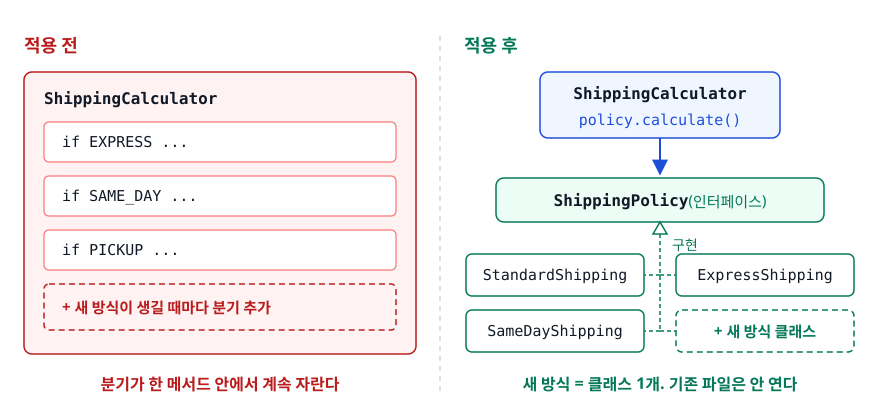
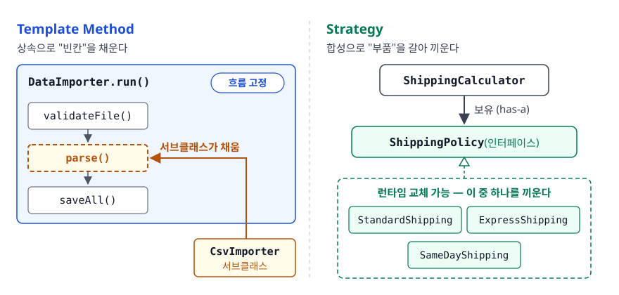
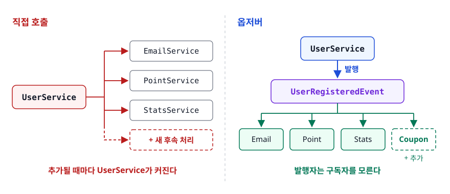
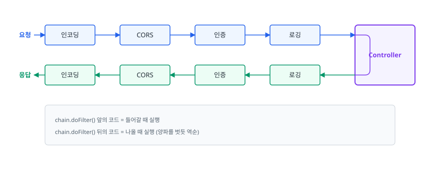

# 행위 패턴 (Behavioral Patterns)

> 기능이 하나 붙을 때마다 `if-else`가 늘고, 서비스들은 서로를 직접 부르며 얽혀 갑니다. 이 두 가지가 왜 문제인지, 그리고 Strategy·Template Method·Observer·Command·State·Chain of Responsibility·Iterator가 그 통신 구조를 어떻게 바꾸는지 설명합니다.

## 학습 목표

- [ ] `if-else` 분기를 전략 객체로 바꾸는 리팩터링을 단계별로 수행할 수 있다
- [ ] Template Method와 Strategy를 "무엇이 고정되고 무엇이 바뀌는가"로 구분할 수 있다
- [ ] 옵저버 패턴이 결합도를 낮추는 원리와 그 대가를 설명할 수 있다
- [ ] Strategy와 State가 코드는 같은데 다른 패턴인 이유를 말할 수 있다
- [ ] 서블릿 필터가 왜 책임 연쇄인지 코드로 짚을 수 있다

## 선행 지식

- [구조 패턴](./02-structural-patterns.md) - 합성으로 위임하는 기본 형태
- [객체지향과 SOLID](../02-backend-engineering/java-fundamentals/01-oop-solid.md) - 다형성과 OCP

---

## 1. 왜 필요한가

생성 패턴이 "누가 만드나", 구조 패턴이 "어떻게 조립하나"를 다뤘다면 행위 패턴은 "**객체들이 어떻게 일을 나누고 서로 부르나**"를 다룹니다. 실무에서 이 문제는 거의 항상 두 가지 냄새로 나타납니다.

```java
// 냄새 1. 조건 분기가 계속 자란다
if (type.equals("VIP")) { /* ... */ }
else if (type.equals("GOLD")) { /* ... */ }     // 등급이 늘 때마다 이 메서드를 연다

// 냄새 2. 서비스가 서비스를 직접 부른다
public void register(User user) {
    userRepository.save(user);
    emailService.sendWelcome(user);
    couponService.issueWelcomeCoupon(user);   // 기능이 늘 때마다 여기가 늘어난다
}
```

둘 다 증상은 같습니다. **새 요구사항이 기존 코드를 열게 만듭니다.** 첫 번째는 전략 패턴이, 두 번째는 옵저버 패턴이 푸는 문제입니다.

---

## 2. 전략 (Strategy)

### 0단계 — 분기가 자라는 코드

```java
public int calculate(String method, int weightGram, int distanceKm) {
    if (method.equals("STANDARD")) return 3000;
    if (method.equals("EXPRESS"))  return 3000 + distanceKm * 100;
    if (method.equals("SAME_DAY")) {
        if (distanceKm > 30) throw new IllegalArgumentException("당일배송 불가 지역");
        return 8000 + weightGram / 1000 * 500;
    }
    throw new IllegalArgumentException("알 수 없는 배송 방식: " + method);
}
```

**왜 문제인가**: 배송 방식이 하나 늘 때마다 이 메서드를 수정하므로 OCP를 어깁니다. 잘 돌던 로직이 있는 파일을 계속 열게 되니 회귀 위험도 쌓입니다. `SAME_DAY`만 검증하고 싶어도 `calculate()` 전체를 통과해야 하고, 당일배송의 거리 제한 같은 개별 규칙이 다른 방식들과 한 메서드에 뒤엉킵니다.

### 1단계 — 알고리즘을 인터페이스 뒤로 옮긴다

```java
public interface ShippingPolicy {
    int calculate(int weightGram, int distanceKm);
}

public class SameDayShipping implements ShippingPolicy {
    public int calculate(int weightGram, int distanceKm) {
        if (distanceKm > 30) throw new IllegalArgumentException("당일배송 불가 지역");
        return 8000 + weightGram / 1000 * 500;
    }
}
```

<!-- diagram:dp-behavioral-patterns-1 -->


<!-- 위 그림이 대체한 원본 ASCII.
     내용을 고칠 때는 그림도 함께 갱신할 것.
```
[적용 전]                        [적용 후]

 ShippingCalculator              ShippingCalculator
  └ if EXPRESS ...                 └ policy.calculate()
    if SAME_DAY ...                        ▼
    if PICKUP ...                  ShippingPolicy (인터페이스)
                                     ├ StandardShipping
  분기가 한 메서드 안에서              ├ ExpressShipping
  계속 자란다                         └ SameDayShipping
                                   새 방식 = 클래스 1개. 기존 파일은 안 연다
```
-->

### 2단계 — 그런데 "어떤 전략을 고르나"가 남는다

```java
// 안티패턴 - 전략을 만들었는데 선택 로직에 if-else가 그대로 남았다
ShippingPolicy policy;
if (method.equals("STANDARD")) policy = new StandardShipping();
else if (method.equals("EXPRESS")) policy = new ExpressShipping();
else throw new IllegalArgumentException();
return policy.calculate(w, d);
```

**왜 문제인가**: 분기가 계산 로직에서 생성 로직으로 자리만 옮겼습니다. 새 방식이 생기면 여전히 이 메서드를 엽니다.

Spring을 쓴다면 이 마지막 분기까지 없앨 수 있습니다. **같은 인터페이스를 구현한 빈이 여러 개면 컨테이너가 `Map<String, T>`에 빈 이름을 키로 넣어 주입해줍니다.**

```java
@Component("STANDARD")  public class StandardShipping implements ShippingPolicy { /* ... */ }
@Component("SAME_DAY")  public class SameDayShipping implements ShippingPolicy { /* ... */ }

@Service
public class ShippingCalculator {
    private final Map<String, ShippingPolicy> policies;

    // Spring이 { "STANDARD": 빈, "SAME_DAY": 빈, ... } 형태로 채워 넣어준다
    public ShippingCalculator(Map<String, ShippingPolicy> policies) { this.policies = policies; }

    public int calculate(String method, int weightGram, int distanceKm) {
        ShippingPolicy policy = policies.get(method);
        if (policy == null) throw new IllegalArgumentException("알 수 없는 방식: " + method);
        return policy.calculate(weightGram, distanceKm);
    }
}
```

이제 새 배송 방식은 **클래스 파일 하나를 추가하는 것으로 끝납니다.**

> **비유**: 내비게이션의 경로 옵션입니다. "최단 거리", "무료 도로", "고속도로 우선"은 계산 규칙이 다르지만 목적지를 넣고 경로를 받는 사용법은 똑같습니다.
>
> **비유의 한계**: 내비게이션에서는 사용자가 옵션을 고릅니다. 코드에서는 전략 선택 책임을 누구에게 줄지가 설계 결정입니다. 그 책임을 잘못 두면 위 안티패턴처럼 분기가 되살아납니다.

| 상황 | 판단 |
|------|------|
| 분기가 2~3개이고 늘어날 일이 없다 | `if-else`가 더 읽기 쉽습니다. 클래스만 늘어납니다 |
| 분기마다 로직이 한 줄이다 | `enum` 상수별 메서드로 충분하다 |
| 분기가 계속 늘고 각각이 복잡하다 | 전략 패턴 |

> 결론: 전략 패턴은 <strong>분기의 개수보다 "얼마나 자주 추가되는가"</strong>로 판단합니다. 늘지 않는 분기를 패턴으로 감싸면 파일만 흩어집니다.

---

## 3. 템플릿 메서드 (Template Method)

CSV와 엑셀을 읽어 DB에 적재하는 배치 두 개가 있다고 해 보겠습니다. 검증 → 파싱 → 저장 → 로깅 중 **파싱 한 줄만 다른데** 나머지가 통째로 복제됩니다. 로깅 형식을 바꾸면 두 클래스를 똑같이 고쳐야 합니다. 한 곳만 고치고 잊으면 두 배치의 동작이 조용히 달라집니다.

**변하지 않는 흐름을 상위 클래스가 `final` 메서드로 고정하고, 달라지는 단계만 추상 메서드로 남깁니다.**

```java
public abstract class DataImporter {

    public final void run(String path) {      // final: 흐름은 못 바꾼다
        long start = System.currentTimeMillis();
        validateFile(path);
        List<Row> rows = parse(path);         // 여기만 서브클래스가 채운다
        repository.saveAll(rows);
        afterImport(rows);                    // 훅(hook) — 필요한 쪽만 재정의
        log.info("{}ms", System.currentTimeMillis() - start);
    }

    protected abstract List<Row> parse(String path);   // 반드시 구현
    protected void afterImport(List<Row> rows) { }     // 기본은 아무것도 안 함
}

public class CsvImporter extends DataImporter {
    @Override protected List<Row> parse(String path) { /* CSV 파싱 */ }
}
```

`run()`을 `final`로 막는 것이 중요합니다. 서브클래스가 흐름 자체를 바꿔버리면 "공통 흐름을 보장한다"는 목적이 사라집니다. Spring의 `JdbcTemplate`, `RestTemplate`에 붙은 Template이 이 뜻입니다. 커넥션 획득 → 실행 → 예외 변환 → 자원 반납은 프레임워크가 쥐고, 개발자는 SQL과 결과 매핑만 채웁니다. 다만 이 클래스들은 빈칸을 상속으로 채우게 하지 않고 `RowMapper` 같은 콜백 객체로 받습니다. 흐름의 주인이 프레임워크라는 발상은 같지만 구현은 합성 쪽입니다.

<!-- diagram:dp-behavioral-patterns-2 -->


<!-- 위 그림이 대체한 원본 ASCII.
     내용을 고칠 때는 그림도 함께 갱신할 것.
```
[Template Method] 상속으로 "빈칸"을 채운다   [Strategy] 합성으로 "부품"을 갈아 끼운다

  DataImporter.run()  ← 흐름 고정            ShippingCalculator
    ├ validateFile()                                │ 보유
    ├ parse()  ← 서브클래스가 채움                    ▼
    └ saveAll()                              ShippingPolicy ← 런타임 교체 가능
```
-->

| 기준 | Template Method | Strategy |
|------|----------------|----------|
| 관계 | 상속 (is-a) | 합성 (has-a) |
| 결정 시점 | 컴파일 시점 | 런타임 |
| 재사용 단위 | 알고리즘의 **일부 단계** | 알고리즘 **전체** |
| 흐름의 주인 | 상위 클래스 | 사용하는 쪽 |
| 대가 | 상속 결합이 강하다 | 클래스와 조립 코드가 늘어난다 |

> 판단 기준: **흐름 전체가 같고 일부 단계만 다르면 Template Method, 흐름 자체가 통째로 다르면 Strategy.**

---

## 4. 옵저버 (Observer)

### 없으면 어떻게 되나

```java
// 안티패턴 - UserService가 후속 처리를 전부 알고 있다
public void register(User user) {
    userRepository.save(user);
    emailService.sendWelcome(user);
    pointService.giveSignupPoint(user);
    statsService.incrementUserCount();
}
```

**왜 문제인가**: 회원가입의 본질은 저장 한 줄인데 나머지가 그것을 가립니다. 후속 처리가 늘 때마다 이 클래스를 수정하므로 영원히 커집니다. `emailService`가 예외를 던지면 회원가입 전체가 실패하는데, 이메일이 안 나갔다고 가입을 취소하는 게 맞는지도 의심스럽습니다. 테스트하려면 안 쓰는 서비스 목(mock)까지 전부 준비해야 합니다.

<!-- diagram:dp-behavioral-patterns-3 -->


<!-- 위 그림이 대체한 원본 ASCII.
     내용을 고칠 때는 그림도 함께 갱신할 것.
```
[직접 호출]                        [옵저버]

 UserService                        UserService ──발행──> [ UserRegisteredEvent ]
   ├──> EmailService                                             │
   ├──> PointService                                  ┌─────┬────┼────┐
   └──> StatsService                                  ▼     ▼    ▼    ▼
                                                   Email Point Stats Coupon
 추가될 때마다 UserService가 커진다                   발행자는 구독자를 모른다
```
-->

```java
public record UserRegisteredEvent(Long userId, String email) { }

@Service
@RequiredArgsConstructor
public class UserService {
    private final UserRepository userRepository;
    private final ApplicationEventPublisher publisher;

    @Transactional
    public void register(User user) {
        userRepository.save(user);
        publisher.publishEvent(new UserRegisteredEvent(user.getId(), user.getEmail()));
        // 여기서 끝. 누가 처리하는지 모른다
    }
}

@Component
public class WelcomeEmailListener {
    @EventListener
    public void handle(UserRegisteredEvent e) { emailService.sendWelcome(e.email()); }
}
```

"가입 축하 쿠폰"이 추가돼도 `UserService`는 열지 않습니다. 리스너 클래스를 하나 만들면 됩니다.

> **비유**: 유튜브 구독입니다. 채널은 영상을 올릴 뿐 누가 보는지 신경 쓰지 않고 구독자는 각자 알아서 반응합니다.
>
> **비유의 한계**: 유튜브 알림은 늦게 봐도 됩니다. 하지만 기본 `@EventListener`는 **발행 스레드에서 동기적으로 즉시 실행됩니다.** 리스너가 느리면 회원가입 응답도 그만큼 늦어집니다. 이 오해가 실무 사고의 단골 원인입니다.

### 옵저버가 치르는 대가

**1. 기본은 동기입니다.** 비동기로 만들려면 리스너에 `@Async`를 붙이고 애플리케이션에 `@EnableAsync`를 켜야 합니다.

**2. 트랜잭션 타이밍.** 위 `register()`는 `@Transactional`이 붙어 있습니다. 이벤트 발행 뒤 커밋 전에 예외가 나면 DB는 롤백되지만 **이메일은 이미 나간 뒤입니다.**

```java
@TransactionalEventListener(phase = TransactionPhase.AFTER_COMMIT)
public void handle(UserRegisteredEvent event) {
    emailService.sendWelcome(event.email());   // 커밋이 확정된 뒤에만 실행
}
```

**3. 흐름 추적이 어렵습니다.** 발행자 코드만 봐서는 무슨 일이 일어나는지 알 수 없고, 이벤트 타입으로 검색해야 리스너를 찾습니다. 결합도를 낮춘 대가로 **가독성과 디버깅 난이도를 지불하는 것**이니 진짜 부수적인 후속 처리에만 쓰는 것이 좋습니다. 주문 생성에서 재고 차감처럼 실패하면 안 되는 로직은 직접 호출이 낫습니다.

직접 구현할 때는 구독 해제도 챙겨야 합니다. `unsubscribe()`를 부르지 않으면 리스너가 리스트에 남아 GC 대상이 되지 않으니 그대로 메모리 누수가 됩니다. 참고로 자바 표준의 `java.util.Observable`은 설계 결함 때문에 Java 9에서 폐기(deprecated)됐으므로 쓰지 않습니다.

---

## 5. 커맨드 (Command)

메서드 호출은 일회성 사건이라 저장하거나 전달하거나 되돌릴 수 없습니다. `editor.insertText("안녕")`을 부른 뒤 "방금 한 작업을 되돌려줘"를 표현할 방법이 없습니다. 커맨드는 **요청 자체를 객체로 만듭니다.**

```java
public interface Command { void execute(); void undo(); }

public class InsertTextCommand implements Command {
    private final Editor editor;
    private final String text;
    private final int position;

    @Override public void execute() { editor.insert(position, text); }
    @Override public void undo()    { editor.delete(position, position + text.length()); }
}

public class CommandInvoker {                 // 어떤 명령인지 모른 채 실행하고 기록한다
    private final Deque<Command> history = new ArrayDeque<>();
    public void run(Command command) { command.execute(); history.push(command); }
    public void undoLast() { if (!history.isEmpty()) history.pop().undo(); }
}
```

"무엇을 할지"가 객체가 되는 순간 **저장·전달·지연 실행·취소**가 전부 가능해집니다. 자바의 `Runnable`이 가장 널리 쓰이는 커맨드입니다. `ExecutorService.submit(runnable)`은 실행 요청을 객체로 받아 큐에 넣었다가 워커 스레드가 꺼내 실행하는 구조입니다.

---

## 6. 상태 (State)

```java
// 안티패턴 - 상태 분기가 메서드마다 반복된다
public void cancel() {
    if (status.equals("PAYMENT_WAITING")) status = "CANCELED";
    else if (status.equals("PAID")) { refund(); status = "CANCELED"; }
    else if (status.equals("SHIPPING")) throw new IllegalStateException("배송 중 취소 불가");
}
public void ship() {
    if (status.equals("PAID")) status = "SHIPPING";
    else throw new IllegalStateException();
}
```

**왜 문제인가**: 상태가 하나 추가되면 **모든 메서드의 분기를 찾아 고쳐야 합니다.** 하나라도 빠뜨리면 그 상태에서만 이상하게 동작합니다. 그리고 "PAID 다음에 올 수 있는 상태가 무엇인가"라는 전이 규칙이 코드 전체에 흩어져 한눈에 보이지 않습니다.

```java
public interface OrderState {
    OrderState cancel(Order order);
    OrderState ship(Order order);
}

public class PaidState implements OrderState {
    @Override
    public OrderState cancel(Order order) {
        order.refund();
        return new CanceledState();          // 다음 상태를 자기가 안다
    }
    @Override public OrderState ship(Order order) { return new ShippingState(); }
}

public class ShippingState implements OrderState {
    @Override
    public OrderState cancel(Order order) {
        throw new IllegalStateException("배송 중에는 취소할 수 없습니다");
    }
    @Override public OrderState ship(Order o) { throw new IllegalStateException("이미 배송 중"); }
}

public class Order {
    private OrderState state = new PaymentWaitingState();
    public void cancel() { this.state = state.cancel(this); }
    public void ship()   { this.state = state.ship(this); }
}
```

`Order`에서 분기가 사라졌고 "결제 완료 상태에서 무엇이 가능한가"가 `PaidState` 한 파일에 모였습니다.

Strategy와 코드 모양이 또 같습니다. 차이는 **누가 교체를 결정하는가**입니다.

| 기준 | Strategy | State |
|------|----------|-------|
| 교체 주체 | 외부가 정해서 넣어준다 | 상태 객체가 다음 상태를 반환한다 |
| 구현체끼리의 관계 | 서로 모른다 | 서로를 안다(전이 규칙) |
| 교체 시점 | 보통 조립 시점 | 실행 도중 계속 바뀐다 |
| 의도 | 같은 일을 다른 방법으로 | 상태에 따라 다른 일을 |

> 한 줄 기준: **"다음에 무엇이 올지 자기가 아느냐."** 안다면 State, 모른다면 Strategy입니다.

---

## 7. 책임 연쇄 (Chain of Responsibility)

요청 처리 앞에 인코딩·CORS·인증·레이트리밋·로깅 검사가 계속 붙으면, 서로 무관한 관심사가 한 메서드에 쌓입니다. 순서를 바꾸거나 특정 경로에서만 인증을 빼는 변경이 전부 그 메서드 수정으로 이어집니다.

책임 연쇄는 처리기를 줄로 세워 각자 자기 일만 하고 다음으로 넘기게 합니다. 서블릿 필터가 정확히 이 구조입니다.

```java
public class AuthenticationFilter implements Filter {
    @Override
    public void doFilter(ServletRequest req, ServletResponse res, FilterChain chain)
            throws IOException, ServletException {
        String token = ((HttpServletRequest) req).getHeader("Authorization");
        if (!tokenValidator.isValid(token)) {
            ((HttpServletResponse) res).setStatus(401);
            return;                 // 체인을 끊는다. 뒤쪽 필터와 컨트롤러는 실행되지 않는다
        }
        chain.doFilter(req, res);   // 다음으로 넘긴다
        // 여기부터는 응답이 돌아오는 길
    }
}
```

`chain.doFilter()`의 위치가 이 패턴의 전부입니다.

<!-- diagram:dp-behavioral-patterns-4 -->


<!-- 위 그림이 대체한 원본 ASCII.
     내용을 고칠 때는 그림도 함께 갱신할 것.
```
요청 ──> [인코딩] ──> [CORS] ──> [인증] ──> [로깅] ──> Controller
                                                          │
응답 <── [인코딩] <── [CORS] <── [인증] <── [로깅] <──────┘

  chain.doFilter() 앞의 코드 = 들어갈 때 실행
  chain.doFilter() 뒤의 코드 = 나올 때 실행 (양파를 벗듯 역순)
```
-->

필터는 서로를 모른 채 순서만 바꿔 재배치할 수 있고, 인증 필터가 체인을 끊으면 뒤쪽은 아예 실행되지 않습니다. Spring Security가 수십 개의 필터를 체인으로 조립해 동작하는 것도 이 패턴입니다. 프록시 체인과 헷갈리기 쉬운데, 프록시는 **한 대상의 접근을 통제**하는 것이고 책임 연쇄는 **여러 처리기 중 누가 처리할지를 순서대로 묻는 것**입니다.

---

## 8. 이터레이터 (Iterator)

컬렉션을 순회할 때 내부가 배열인지 연결 리스트인지 호출부가 알아야 한다면, 자료구조를 바꾸는 순간 순회 코드가 전부 깨집니다. 게다가 내부 리스트를 그대로 반환하면 외부에서 원소를 마음대로 바꿀 수 있습니다.

```java
public class Playlist implements Iterable<Song> {
    private final List<Song> songs = new ArrayList<>();   // 내부 구조는 감춘다
    @Override public Iterator<Song> iterator() { return songs.iterator(); }
}

for (Song song : playlist) play(song);      // 호출부는 내부 구조를 모른다
```

자바의 향상된 for문은 컴파일러가 `Iterator`를 꺼내 `hasNext()` / `next()`를 부르는 코드로 바꿔주는 문법 설탕입니다. 순회 중 컬렉션을 수정하면 `ConcurrentModificationException`이 나는 것도 이 구조 때문입니다. 이터레이터가 생성 시점의 변경 횟수(`modCount`)를 기억하고 있다가 어긋나면 즉시 실패(fail-fast)합니다. 다만 이 검사는 최선 노력이라 항상 터진다는 보장은 없습니다. `ArrayList`에서 끝에서 두 번째 원소를 지우면 `hasNext()`가 먼저 `false`가 되어 예외 없이 조용히 끝납니다. 순회 중 삭제가 필요하면 `iterator.remove()`나 `removeIf()`를 씁니다.

---

## 9. 실무에서는

- **전략 패턴은 Spring DI와 만나면 완성됩니다.** `Map<String, 전략>` 주입이 가장 자주 쓰이는 조합입니다. 다만 빈 이름을 문자열 키로 쓰므로 오타가 런타임 오류가 됩니다. `enum`을 키로 쓰는 `Map<PayType, PaymentPolicy>`를 직접 구성하면 컴파일 시점에 잡힙니다.
- **흐름을 프레임워크가 쥐는 구조는 이미 깔려 있는 경우가 많습니다.** `JdbcTemplate`이나 JUnit의 테스트 실행 생명주기(`@BeforeEach` → 테스트 → `@AfterEach`)가 그렇습니다. 직접 상속 구조를 만들기보다 함수형 인터페이스를 파라미터로 받는 편이 유연할 때가 많습니다.
- **이벤트는 남발하면 흐름을 잃습니다.** "이 API가 무엇을 하는가"를 코드로 추적할 수 없게 되는 순간이 임계점입니다. 실패해도 되는 부수 작업에만 쓰고 핵심 트랜잭션 로직은 직접 호출로 남깁니다. 상태 패턴도 마찬가지로 상태가 4개를 넘고 전이 규칙이 복잡할 때 가치가 생기며, 두세 개면 `enum`으로 충분합니다.

---

## 10. 면접 포인트

> 면접에서 이 주제가 나오면 이렇게 답한다

**Q. `if-else` 대신 전략 패턴을 쓰면 무엇이 좋아지나요?**

A. 새 분기가 기존 코드를 수정하지 않고 클래스 추가만으로 끝난다는 점, 즉 OCP를 지킬 수 있다는 점이 가장 큽니다. 각 알고리즘을 독립적으로 단위 테스트할 수 있고 런타임에 전략을 바꿀 수도 있습니다. 다만 클래스 수가 늘어나므로 분기가 두세 개이고 늘어날 일이 없다면 `if-else`가 더 읽기 좋습니다.
- 꼬리 질문: "전략을 고르는 `if-else`는 어떻게 없애나요?" → Spring에서 같은 인터페이스 빈들을 `Map<String, T>`로 주입받으면 빈 이름이 키가 되므로 `map.get(type)` 한 줄로 선택 분기까지 사라진다고 답합니다.

**Q. Template Method와 Strategy의 차이는?**

A. Template Method는 상속으로 알고리즘의 **일부 단계**를 채우게 하고 흐름은 상위 클래스가 `final`로 고정합니다. Strategy는 합성으로 알고리즘 **전체**를 갈아 끼웁니다. 결정 시점도 달라서 Template Method는 클래스가 정해지는 컴파일 시점에 고정되지만 Strategy는 런타임에 교체할 수 있습니다. `HttpServlet.service()`가 요청 방식을 보고 `doGet`/`doPost`를 부르는 구조가 전자, 결제 수단 선택이 후자입니다.
- 꼬리 질문: "요즘은 어느 쪽을 선호하나요?" → 상속 결합이 강한 Template Method보다 함수형 인터페이스를 파라미터로 받는 Strategy 형태를 선호하는 흐름이라고 답합니다.

**Q. Spring의 이벤트와 직접 메서드 호출의 차이는?**

A. 직접 호출은 호출하는 쪽이 호출당하는 쪽을 알아야 해서 강하게 결합되고, 후속 처리가 늘 때마다 원래 코드를 수정합니다. 이벤트는 발행자가 구독자를 모르므로 리스너 클래스를 추가하는 것만으로 기능이 붙습니다. 대신 코드만 봐서는 흐름을 추적하기 어려워지므로 실패해도 되는 부수 작업에 한정해 쓰는 게 좋습니다.
- 꼬리 질문: "`@EventListener`와 `@TransactionalEventListener`의 차이는?" → 전자는 발행 즉시 같은 스레드에서 실행되고 후자는 트랜잭션 커밋 이후에 실행됩니다. 롤백됐는데 이메일이 나가는 사고를 막으려면 후자를 쓴다고 답합니다.

**Q. Strategy와 State는 코드가 거의 같은데 왜 다른 패턴인가요?**

A. 교체를 누가 결정하느냐가 다릅니다. Strategy는 외부에서 어떤 알고리즘을 쓸지 정해서 넣어주고 전략들끼리는 서로를 모릅니다. State는 상태 객체가 스스로 다음 상태를 반환하기 때문에 상태들끼리 전이 규칙을 공유합니다. 그래서 State는 실행 도중에 계속 바뀌고 Strategy는 대개 한 번 정해지면 유지됩니다.
- 꼬리 질문: "주문 상태를 `enum`으로만 관리하면 안 되나요?" → 상태가 적으면 충분하지만 상태별 가능한 동작이 많아지면 메서드마다 같은 분기가 복제되므로 상태 객체로 분리한다고 답합니다.

---

## 자주 하는 실수

| 실수 | 왜 틀렸나 | 올바른 이해 |
|------|----------|-----------|
| "전략 패턴을 쓰면 `if-else`가 사라진다" | 알고리즘에서 사라질 뿐 "어떤 전략을 고를까"의 분기는 남는다 | 선택 분기는 팩토리나 `Map` 주입으로 옮겨야 진짜로 없어진다 |
| "`@EventListener`는 비동기다" | 기본은 발행 스레드에서 동기 실행된다 | 비동기로 만들려면 `@Async` + `@EnableAsync`가 필요하다 |
| "이벤트를 쓰면 무조건 결합도가 낮아져서 좋다" | 흐름 추적이 어려워지고 실패 처리와 순서 보장이 까다로워진다 | 실패해도 되는 부수 작업에만 쓰고 핵심 로직은 직접 호출한다 |
| "Template Method의 템플릿 메서드도 재정의할 수 있다" | 흐름을 재정의하면 패턴의 목적 자체가 무너진다 | 템플릿 메서드는 `final`로 막고 변하는 부분만 추상 메서드나 훅으로 연다 |
| "책임 연쇄는 모든 처리기를 반드시 거친다" | 처리기가 다음으로 넘기지 않으면 거기서 끝난다 | 인증 필터가 401을 반환하고 `chain.doFilter()`를 부르지 않으면 뒤쪽은 실행되지 않는다 |

---

## 한 줄 정리

행위 패턴이 고치는 냄새는 "새 요구사항이 기존 코드를 열게 만드는" 두 가지입니다. 자라는 조건 분기는 다형성(Strategy·State·Template Method)으로, 서로를 직접 부르는 객체들은 간접 통신(Observer·Command·Chain of Responsibility)으로 바꿉니다.

---

## 연관 개념

- [01-creational-patterns.md](./01-creational-patterns.md) - 전략 구현체를 만들어주는 팩토리
- [02-structural-patterns.md](./02-structural-patterns.md) - 전략과 헷갈리는 브릿지, 책임 연쇄와 닮은 프록시
- [04-architecture-patterns.md](./04-architecture-patterns.md) - 옵저버가 Model-View 갱신의 핵심 부품으로 쓰이는 MVC
- [qna-design-patterns.md](./qna-design-patterns.md) - 전략·옵저버 면접 질문(Q3, Q4)
- [../02-backend-engineering/spring-framework/03-spring-mvc-flow.md](../02-backend-engineering/spring-framework/03-spring-mvc-flow.md) - 필터와 인터셉터가 놓이는 실제 위치
- [../02-backend-engineering/spring-framework/06-transactional-pitfalls.md](../02-backend-engineering/spring-framework/06-transactional-pitfalls.md) - 이벤트와 트랜잭션 경계
