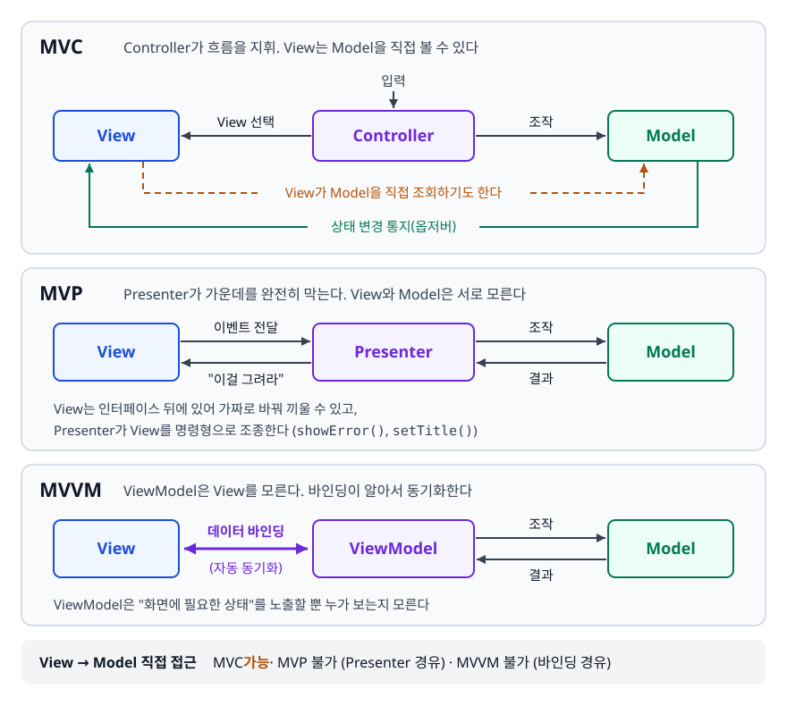
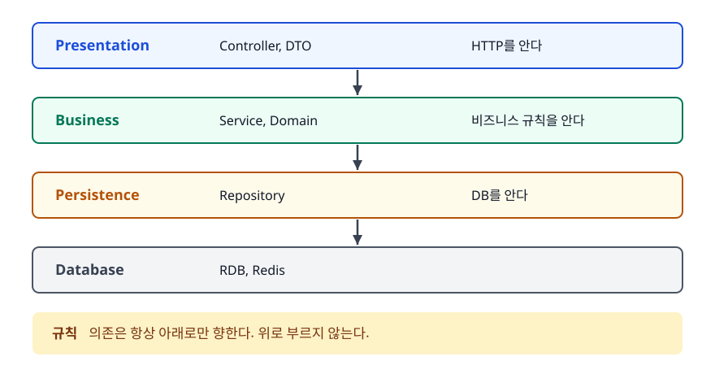
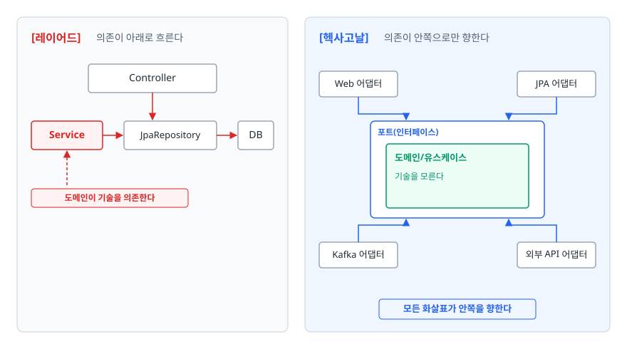

# 아키텍처 패턴 (Architecture Patterns)

> MVC는 무엇을 분리하려고 나왔을까요? MVP와 MVVM은 MVC의 어떤 불만에서 갈라졌고, 레이어드에서 헥사고날로 넘어갈 때 정확히 무엇이 뒤집히는지를 이 문서에서 차례로 다룹니다.

## 학습 목표

- [ ] MVC 이전 코드가 어떤 모습이었고 무엇이 문제였는지 말할 수 있다
- [ ] Model / View / Controller의 책임 경계를 코드로 그을 수 있다
- [ ] MVC·MVP·MVVM의 데이터 흐름 차이를 그림으로 그릴 수 있다
- [ ] 각 패턴이 어떤 플랫폼에서 왜 선택됐는지 설명할 수 있다
- [ ] 레이어드 아키텍처의 의존 방향과 그 한계를 지적할 수 있다
- [ ] 헥사고날/클린 아키텍처에서 무엇이 "역전"되는지 코드로 보일 수 있다

## 선행 지식

- [행위 패턴](./03-behavioral-patterns.md) - 옵저버가 MVC의 Model-View 갱신에 그대로 쓰이는 방식
- [IoC와 DI](../02-backend-engineering/spring-framework/01-ioc-di.md) - 의존성 역전을 실제로 구현하는 도구

---

## 1. 왜 필요한가

### 관심사가 섞인 코드

JSP 초창기(흔히 Model 1이라 부르는 방식)의 화면 하나는 이런 모습이었습니다.

```jsp
<%
    // 화면 파일 안에서 DB에 접속한다
    Connection conn = DriverManager.getConnection(url, user, pw);
    PreparedStatement ps = conn.prepareStatement(
            "SELECT o.name, o.price, u.grade FROM orders o JOIN users u ON u.id = o.user_id WHERE o.user_id = ?");
    ps.setLong(1, Long.parseLong(request.getParameter("userId")));
    ResultSet rs = ps.executeQuery();

    int total = 0;
    while (rs.next()) {
        int price = rs.getInt("price");
        if (rs.getString("grade").equals("VIP")) price = (int)(price * 0.9);  // 할인 규칙
        total += price;
%>
        <tr><td><%= rs.getString("name") %></td><td><%= price %></td></tr>
<%  } %>
<tr><td>합계</td><td><%= total %></td></tr>
```

**왜 문제인가**: VIP 할인 규칙이 이 화면 파일 안에만 있어서, 모바일 API에서도 필요하면 복사해야 합니다. 규칙이 바뀌면 두 곳이 어긋납니다. 할인 로직만 검증하고 싶어도 JSP를 렌더링하지 않고는 실행할 수 없습니다. 디자이너가 `<tr>` 하나를 옮기려다 SQL을 건드리기도 하고, DB 컬럼명이 바뀌면 화면 파일 수십 개를 뒤져야 합니다.

문제의 본질은 하나입니다. **바뀌는 이유가 서로 다른 코드가 한 파일에 있습니다.** 화면 디자인은 마케팅 때문에, 할인 규칙은 정책 때문에, SQL은 DB 스키마 때문에 바뀝니다. 이 셋을 갈라놓자는 것이 관심사 분리(Separation of Concerns)이고, 그 첫 번째 정형화가 MVC입니다.

---

## 2. MVC

### 등장 배경

MVC는 웹에서 나온 것이 아닙니다. 트리그베 린스카우그(Trygve Reenskaug)가 1970년대 말 제록스 PARC에서 Smalltalk 환경을 만들면서 "**사용자의 머릿속 모델과 화면에 보이는 것을 어떻게 연결할 것인가**"를 고민하다 정리한 구조입니다. 그래서 원래 MVC에서 View는 Model을 직접 구독하고, Model이 바뀌면 View가 스스로 갱신됐습니다. 옵저버 패턴이 MVC의 핵심 부품인 이유가 여기 있습니다.

### 세 요소의 책임

| 요소 | 책임 | 알아도 되는 것 | 몰라야 하는 것 |
|------|------|--------------|--------------|
| Model | 데이터와 비즈니스 규칙 | 자기 자신 | View, Controller, HTTP |
| View | 화면 표현 | Model의 데이터 | 비즈니스 규칙, DB |
| Controller | 입력을 받아 Model을 부르고 View를 고름 | Model과 View 양쪽 | 비즈니스 규칙의 내용 |

앞의 JSP를 이 기준으로 나누면 이렇게 됩니다.

```java
// Model — 비즈니스 규칙. 웹도 DB도 모른다
public class Order {
    private final String name;
    private final int price;
    private final Grade grade;

    public String getName() { return name; }
    public int getDiscountedPrice() { return grade == Grade.VIP ? (int) (price * 0.9) : price; }
}

// Controller — 입력을 받아 Model을 부르고 View에 넘긴다
@Controller
@RequiredArgsConstructor
public class OrderController {
    private final OrderService orderService;

    @GetMapping("/orders")
    public String list(@RequestParam Long userId, Model model) {
        model.addAttribute("orders", orderService.findByUser(userId));
        return "order/list";     // 어떤 View를 쓸지만 고른다
    }
}
```

```html
<!-- View — 받은 데이터를 그린다. 계산하지 않는다 -->
<tr th:each="order : ${orders}">
    <td th:text="${order.name}"></td>
    <td th:text="${order.discountedPrice}"></td>
</tr>
```

### 흔한 오해와 안티패턴

**"Model = Entity"가 아닙니다.** MVC의 Model은 데이터 구조가 아니라 **비즈니스 로직을 포함한 영역 전체**입니다. Entity, Service, Repository가 모두 Model 쪽에 속합니다.

가장 자주 보는 안티패턴은 컨트롤러가 비대해지는 것입니다.

```java
// 안티패턴 - 컨트롤러가 비즈니스 규칙을 들고 있다
@PostMapping("/orders")
public String create(@RequestParam Long userId, @RequestParam int amount) {
    User user = userRepository.findById(userId).orElseThrow();
    if (user.getPoint() < 1000 && amount > 100_000) return "error/limit";        // 정책
    int discounted = user.getGrade() == Grade.VIP ? (int) (amount * 0.9) : amount;  // 정책
    orderRepository.save(new Order(userId, discounted));
    return "redirect:/orders";
}
```

**왜 문제인가**: 이 정책은 배치 잡에서도, 모바일 API에서도 똑같이 필요합니다. 컨트롤러 안에 있으면 HTTP 요청 없이는 재사용도 테스트도 안 되고, 컨트롤러가 두꺼워지는 만큼 Model은 데이터만 담은 껍데기가 됩니다.

```java
// 개선 - 정책은 Model 쪽으로, 컨트롤러는 통역만
@PostMapping("/orders")
public String create(@RequestParam Long userId, @RequestParam int amount) {
    orderService.create(userId, amount);    // 정책은 여기 안에
    return "redirect:/orders";
}
```

> 컨트롤러의 일은 **HTTP를 애플리케이션 언어로 통역하고 그 반대로 되돌리는 것**뿐입니다. 컨트롤러에서 `if`가 비즈니스 조건을 검사하기 시작하면 경계를 넘은 것입니다.

---

## 3. MVC vs MVP vs MVVM

### 왜 갈라졌나

원래 MVC에서 View는 Model을 직접 참조합니다. 서버 렌더링 웹에서는 이게 큰 문제가 아니었습니다. 요청 하나가 끝나면 화면은 통째로 다시 그려지고, View는 잠깐 살았다 사라지기 때문입니다.

문제는 **데스크톱과 모바일처럼 화면이 오래 살아 있고 상태를 계속 들고 있는 환경**에서 터졌습니다. View가 Model을 직접 알면 화면 코드에 로직이 섞이고, 그 코드는 화면 프레임워크 없이는 테스트할 수 없습니다. MVP와 MVVM은 이 문제를 서로 다른 방식으로 풀었습니다.

### 데이터 흐름 비교

<!-- diagram:dp-architecture-patterns -->


```
[MVC]  Controller가 흐름을 지휘. View는 Model을 직접 볼 수 있다

  입력 ──> ┌──────────┐  조작   ┌─────────┐
           │Controller│───────>│  Model  │
           └────┬─────┘        └────┬────┘
     View 선택  │                   │ 상태 변경 통지(옵저버)
                ▼                   ▼
           ┌──────────────────────────────┐
           │            View              │ ← Model을 직접 조회하기도 한다
           └──────────────────────────────┘


[MVP]  Presenter가 가운데를 완전히 막는다. View와 Model은 서로 모른다

 ┌──────┐  이벤트 전달   ┌───────────┐   조작   ┌─────────┐
 │ View │─────────────>│ Presenter │────────>│  Model  │
 │      │<─────────────│           │<────────│         │
 └──────┘  "이걸 그려라" └───────────┘   결과   └─────────┘
   View는 인터페이스 뒤에 있어 가짜로 바꿔 끼울 수 있고,
   Presenter가 View를 명령형으로 조종한다 (showError(), setTitle())


[MVVM]  ViewModel은 View를 모른다. 바인딩이 알아서 동기화한다

 ┌──────┐   데이터 바인딩   ┌───────────┐   조작   ┌─────────┐
 │ View │<==============>│ ViewModel │────────>│  Model  │
 │      │                │           │<────────│         │
 └──────┘   (자동 동기화)   └───────────┘   결과   └─────────┘
   ViewModel은 "화면에 필요한 상태"를 노출할 뿐 누가 보는지 모른다
```

### 세 패턴의 차이

| 기준 | MVC | MVP | MVVM |
|------|-----|-----|------|
| 중재자 | Controller | Presenter | ViewModel |
| View → Model 접근 | 가능 | 불가 (Presenter 경유) | 불가 (바인딩 경유) |
| 중재자 → View 접근 | View 이름만 고름 | **인터페이스로 직접 조종** | **모른다** |
| View와 중재자 관계 | 1:N도 가능 | 대체로 1:1 | 1:N 가능 |
| 갱신 방식 | 요청마다 다시 그림 | 명령형 (`view.showError()`) | 선언형 (상태를 바꾸면 반영) |
| 중재자 단독 테스트 | 번거로움(요청·응답 컨텍스트가 필요) | 쉬움(가짜 View 주입) | 쉬움(상태만 검증) |
| 대표 환경 | Spring MVC, Rails | 초기 Android, WinForms | WPF, 현대 Android, Vue |

### 어떤 플랫폼이 왜 골랐나

**서버 렌더링 웹 → MVC.** 요청-응답이 짧게 끝나므로 View가 상태를 들고 있을 이유가 없습니다. Controller가 Model을 부르고 템플릿에 데이터를 넘겨 통째로 렌더링하면 그만입니다. 중재자를 더 두는 것은 비용만 늘립니다.

**초기 Android, WinForms → MVP.** 화면 컴포넌트(`Activity`, `Form`)가 프레임워크에 강하게 묶여 있어 단위 테스트가 사실상 불가능했습니다. 그래서 로직을 전부 Presenter로 빼고, View를 인터페이스로 추상화해 테스트에서는 가짜 View를 주입하는 전략이 필요했습니다.

```java
// MVP - View를 인터페이스로 두는 것이 핵심
public interface LoginView {
    void showError(String message);
    void navigateToMain();
}

public class LoginPresenter {
    private final LoginView view;
    private final AuthRepository repository;

    public void login(String id, String pw) {
        if (repository.authenticate(id, pw)) view.navigateToMain();
        else view.showError("아이디 또는 비밀번호가 올바르지 않습니다");
    }
}
// 테스트에서는 LoginView를 목으로 만들어 Presenter만 검증한다
```

다만 Presenter가 View의 모든 갱신을 일일이 명령해야 해서, 화면이 복잡해지면 Presenter가 거대해집니다. 이것이 MVP의 한계입니다.

**WPF, 현대 Android, Vue → MVVM.** 프레임워크가 데이터 바인딩을 제공하면 Presenter의 명령 코드가 통째로 사라집니다. ViewModel은 "화면에 필요한 상태"만 들고 있으면 되고, 그 상태가 바뀌면 프레임워크가 화면을 갱신합니다. MVVM은 2005년 마이크로소프트의 존 고스먼(John Gossman)이 WPF의 바인딩 엔진을 전제로 정리한 패턴입니다. Android는 Jetpack의 `ViewModel`과 관찰 가능한 상태가 들어오면서 이 구조로 옮겨갔습니다.

한 가지 짚어둘 점이 있습니다. **React는 MVVM으로 분류하지 않는 것이 일반적입니다.** 상태를 바꾸면 화면이 갱신된다는 점은 닮았지만, React의 데이터 흐름은 부모에서 자식으로 내려가는 단방향입니다. 화면에서 상태로 되돌아오는 경로는 명시적인 이벤트 핸들러입니다. MVVM의 특징인 양방향 바인딩이 없습니다. Vue의 `v-model`은 양방향 바인딩이라 MVVM 계보에 훨씬 가깝습니다.

---

## 4. 레이어드 아키텍처 (Layered Architecture)

MVC가 "화면과 로직"을 갈랐다면, 레이어드는 **서버 내부를 수평으로 다시 자릅니다.**

<!-- diagram:dp-architecture-patterns-1 -->


<!-- 위 그림이 대체한 원본 ASCII.
     내용을 고칠 때는 그림도 함께 갱신할 것.
```
┌─────────────────────────────────────┐
│ Presentation  Controller, DTO       │  HTTP를 안다
├─────────────────────────────────────┤
│ Business      Service, Domain       │  비즈니스 규칙을 안다
├─────────────────────────────────────┤
│ Persistence   Repository            │  DB를 안다
├─────────────────────────────────────┤
│ Database      RDB, Redis            │
└─────────────────────────────────────┘

규칙: 의존은 항상 아래로만 향한다. 위로 부르지 않는다.
```
-->

> **비유**: 식당의 홀·주방·창고입니다. 홀 직원은 주문을 받아 주방에 넘기고, 주방은 필요한 재료를 창고에서 꺼냅니다. 창고 담당이 손님에게 직접 말을 걸지는 않습니다.
>
> **비유의 한계**: 식당의 층은 물리적으로 나뉘어 있습니다. 코드의 계층은 규칙일 뿐입니다. Repository에서 Service를 부르는 코드를 컴파일러가 막아 주지 않으므로, 계층 위반은 사람이 리뷰로 잡아야 합니다.

### 계층을 어기는 대표적인 방식

```java
// 안티패턴 1 - 계층을 건너뛴다
@RestController
public class OrderController {
    private final OrderRepository orderRepository;   // Service를 건너뛰고 바로 DB

    @GetMapping("/orders/{id}")
    public Order get(@PathVariable Long id) {
        return orderRepository.findById(id).orElseThrow();   // 엔티티를 그대로 응답
    }
}
```

**왜 문제인가**: 조회가 단순하다는 이유로 계층을 건너뛰면, 나중에 권한 검사나 캐싱을 넣을 자리가 사라집니다. 엔티티를 그대로 응답하면 DB 컬럼 변경이 곧바로 API 스펙 변경이 되고, 지연 로딩 필드를 직렬화하다 예외가 나기도 합니다.

두 번째 위반은 반대 방향입니다. `OrderRepositoryImpl`이 상위 계층인 `NotificationService`를 주입받아 저장 직후 알림까지 보내는 코드가 그렇습니다. 의존 방향이 순환하는 순간 계층 구조의 의미가 사라집니다. 저장만 하고 싶은 배치에서도 알림이 나가고, 저장소를 단독으로 테스트할 수 없습니다.

### 레이어드의 진짜 한계

계층을 잘 지켜도 남는 문제가 있습니다. **비즈니스 계층이 영속성 계층을 향해 의존한다**는 사실 자체입니다.

```java
@Service
public class OrderService {
    private final OrderJpaRepository repository;   // JPA를 직접 의존한다
}
```

주문 정책이라는 가장 중요한 규칙이 "지금 우리가 JPA를 쓴다"는 기술 선택에 묶여 있습니다. 그 결과 정책 하나를 검증하려 해도 DB를 띄워야 하고, 테이블 구조에 맞춰 엔티티를 짜다 보니 로직은 Service로 몰립니다. 데이터만 든 엔티티와 비대한 서비스, 흔히 도메인 빈혈(anemic domain model)이라 부르는 상태입니다.

---

## 5. 헥사고날 / 클린 아키텍처

### 무엇을 뒤집는가

핵심 아이디어는 한 문장입니다. **"비즈니스 로직이 기술을 의존하지 말고, 기술이 비즈니스 로직을 의존하게 하라."**

방법은 [DI에서 본 것](../02-backend-engineering/spring-framework/01-ioc-di.md)과 같습니다. 필요한 인터페이스를 **쓰는 쪽이 정의**하고, 구현은 바깥에서 제공합니다.

```java
// 1. 도메인이 필요한 것을 자기 언어로 선언한다 (포트)
//    이 인터페이스는 도메인 패키지에 있다. JPA도 SQL도 모른다
public interface OrderRepository {
    Optional<Order> findById(OrderId id);
    void save(Order order);
}

// 2. 도메인 서비스는 포트만 안다
public class PlaceOrderUseCase {
    private final OrderRepository orderRepository;    // 인터페이스
    private final PaymentPort paymentPort;

    public OrderId place(CustomerId customerId, List<LineItem> items) {
        Order order = Order.create(customerId, items);   // 정책은 도메인 안에
        paymentPort.charge(order.totalAmount());
        orderRepository.save(order);
        return order.id();
    }
}

// 3. 기술 세부사항은 바깥에서 포트를 구현한다 (어댑터)
@Repository
public class JpaOrderRepository implements OrderRepository {
    private final OrderJpaEntityRepository jpa;

    @Override
    public void save(Order order) {
        jpa.save(OrderJpaEntity.from(order));    // 도메인 ↔ 테이블 매핑은 여기서
    }

    @Override
    public Optional<Order> findById(OrderId id) { /* 엔티티를 조회해 도메인으로 변환 */ }
}
```

의존 화살표가 어떻게 바뀌었는지가 전부입니다.

<!-- diagram:dp-architecture-patterns-2 -->


<!-- 위 그림이 대체한 원본 ASCII.
     내용을 고칠 때는 그림도 함께 갱신할 것.
```
[레이어드]  의존이 아래로 흐른다        [헥사고날]  의존이 안쪽으로만 향한다

 Controller                             Web 어댑터 ──┐        ┌── JPA 어댑터
     │                                               ▼        ▼
     ▼                                        ┌────────────────────┐
 Service ──> JpaRepository ──> DB             │ 포트(인터페이스)     │
     ↑                                        │ ┌────────────────┐ │
 도메인이 기술을 의존한다                        │ │ 도메인/유스케이스 │ │
                                              │ │ 기술을 모른다    │ │
                                              │ └────────────────┘ │
                                              └────────────────────┘
                                               ▲                ▲
                                    Kafka 어댑터┘                └외부 API 어댑터

                                    모든 화살표가 안쪽을 향한다
```
-->

### 클린 아키텍처와의 관계

로버트 마틴의 클린 아키텍처는 이 아이디어를 동심원으로 정리한 것입니다. 안쪽부터 엔티티(기업 전반의 규칙) → 유스케이스(애플리케이션 규칙) → 인터페이스 어댑터(컨트롤러, 프레젠터, 게이트웨이) → 프레임워크와 드라이버(웹, DB) 순이고, 규칙은 딱 하나입니다.

> **의존성 규칙: 소스 코드의 의존은 반드시 안쪽을 향해야 합니다.** 안쪽 원은 바깥 원의 이름을 알아서는 안 됩니다.

헥사고날(포트와 어댑터, 앨리스터 코오번, 2005)과 클린 아키텍처는 이름과 그림이 다를 뿐 같은 원칙을 말합니다. 헥사고날은 "안과 밖"의 경계를 강조하고, 클린 아키텍처는 안쪽을 다시 여러 겹으로 나눈 버전이라고 이해하면 됩니다.

### 얻는 것과 치르는 것

```java
// 얻는 것 - 도메인 테스트가 가벼워진다
@Test
void 재고가_부족하면_주문할_수_없다() {
    OrderRepository fakeRepo = new InMemoryOrderRepository();   // 스프링도 DB도 없다
    PaymentPort fakePayment = amount -> { };
    PlaceOrderUseCase useCase = new PlaceOrderUseCase(fakeRepo, fakePayment);

    assertThrows(OutOfStockException.class,
            () -> useCase.place(customerId, List.of(soldOutItem)));
}
```

대신 치르는 비용이 분명합니다.

- **파일이 늘어납니다.** 도메인 `Order`, JPA `OrderJpaEntity`, API 응답 `OrderResponse`가 따로 존재하고 그 사이의 변환 코드가 필요합니다.
- **JPA의 편의를 일부 포기합니다.** 도메인 객체를 영속성 엔티티와 분리하면 더티 체킹 같은 기능을 그대로 쓰기 어려워 매핑 코드를 직접 써야 합니다.
- **팀 전체가 규칙을 알아야 합니다.** 한 명이 도메인에서 JPA 어노테이션을 쓰기 시작하면 경계는 그날로 무너집니다.

---

## 6. 언제 이런 구조가 과할까

아키텍처 결정은 "좋은 것"이 아니라 "지금 우리에게 맞는 것"을 고르는 일입니다. 판단 기준을 정리하면 이렇습니다.

| 상황 | 권장 구조 | 이유 |
|------|----------|------|
| CRUD가 대부분, 규칙이라 할 게 거의 없다 | 레이어드 (Controller-Service-Repository) | 포트/어댑터를 넣어도 매핑 코드만 늘어난다 |
| 검증 로직만 몇 개 있는 사내 관리 도구 | 레이어드. 서비스도 생략 가능 | 계층 자체가 비용이다 |
| 도메인 규칙이 복잡하고 오래 유지된다 | 헥사고날/클린 | 규칙을 기술 변경에서 지켜낼 가치가 있다 |
| 외부 연동이 많고 자주 교체된다 | 헥사고날 | 어댑터 교체가 클래스 하나 추가로 끝난다 |
| 팀에 아키텍처 합의가 없다 | 레이어드부터 | 지켜지지 않는 경계는 없느니만 못하다 |

> 결론: **도메인 규칙의 복잡도가 기술 세부사항의 복잡도를 넘어설 때** 헥사고날의 가치가 생깁니다. 게시판 CRUD에 포트와 어댑터를 넣으면 파일 여섯 개로 나뉜 `save()` 하나가 남을 뿐입니다.

과한 구조의 신호는 대체로 이렇게 나타납니다. 유스케이스가 포트를 그대로 한 번 부르고 끝나는 **패스스루 계층**이 생기고, DTO 변환 코드가 비즈니스 코드보다 길어지고, 기능 하나를 추가할 때 손대는 파일이 다섯 개를 넘습니다. 이런 신호가 보이면 계층을 하나 걷어내는 것이 개선입니다.

---

## 7. 실무에서는

- **Spring MVC는 이름과 달리 Front Controller 패턴이 먼저입니다.** 모든 요청이 `DispatcherServlet` 하나로 들어와 핸들러를 찾아 분배합니다. 컨트롤러 각각이 독립적으로 요청을 받는 구조가 아닙니다. 자세한 흐름은 [Spring MVC 요청 처리 흐름](../02-backend-engineering/spring-framework/03-spring-mvc-flow.md)에서 다룹니다.
- **`@RestController`를 쓰면 View가 사라진 것처럼 보이지만 아닙니다.** JSON 직렬화 자체가 View의 역할을 대신하고, View 자리는 클라이언트 애플리케이션으로 옮겨간 것뿐입니다. 그래서 프론트엔드에도 별도의 아키텍처 패턴이 필요해진 것입니다.
- **모든 프로젝트를 한 아키텍처로 통일할 필요는 없습니다.** 결제나 정산처럼 규칙이 복잡한 모듈만 포트와 어댑터로 감싸고, 관리자 CRUD는 레이어드로 두는 혼합 구성이 현실적입니다.
- **경계를 지키는 가장 실용적인 도구는 패키지 구조와 테스트입니다.** 도메인 패키지가 `jakarta.persistence`나 `org.springframework`를 import 하면 실패하는 아키텍처 테스트를 CI에 걸어두면, 규칙이 문서가 아니라 빌드로 강제됩니다.

---

## 8. 면접 포인트

> 면접에서 이 주제가 나오면 이렇게 답한다

**Q. MVC 패턴을 왜 쓰나요?**

A. 바뀌는 이유가 다른 코드를 분리하기 위해서입니다. 화면은 디자인 때문에, 비즈니스 규칙은 정책 때문에, 데이터 접근은 스키마 때문에 각각 바뀝니다. 이 코드가 한 파일에 있으면 하나를 고칠 때 나머지가 깨질 위험이 생깁니다. 분리하면 같은 Model을 웹 화면과 JSON API가 함께 쓸 수 있고, 비즈니스 로직을 화면 없이 테스트할 수 있습니다.
- 꼬리 질문: "Model은 Entity를 말하는 건가요?" → 아닙니다. MVC의 Model은 데이터 구조가 아니라 비즈니스 로직을 포함한 영역 전체이고, Entity·Service·Repository가 모두 여기 속한다고 답합니다.

**Q. MVC, MVP, MVVM의 차이는 무엇인가요?**

A. 중재자가 View를 얼마나 아느냐가 다릅니다. MVC는 View가 Model을 직접 참조할 수 있고 Controller는 어떤 View를 쓸지만 고릅니다. MVP는 Presenter가 View 인터페이스를 들고 `showError()`처럼 명령형으로 화면을 조종해서 View와 Model이 완전히 분리됩니다. MVVM은 ViewModel이 화면에 필요한 상태만 노출하고 View를 아예 모르며, 동기화는 프레임워크의 데이터 바인딩이 담당합니다.
- 꼬리 질문: "왜 Android는 MVP에서 MVVM으로 옮겨갔나요?" → MVP는 Presenter가 화면 갱신을 일일이 명령해야 해서 화면이 복잡해질수록 비대해지는데, Jetpack에서 관찰 가능한 상태와 바인딩이 제공되면서 그 명령 코드를 걷어낼 수 있게 됐다고 답합니다.

**Q. 레이어드 아키텍처의 한계는 무엇인가요?**

A. 계층을 잘 지켜도 비즈니스 계층이 영속성 계층을 의존한다는 점이 남습니다. 가장 중요한 도메인 규칙이 JPA 같은 기술 선택에 묶여서, 정책 하나를 테스트하려 해도 DB가 필요하고 도메인 모델이 테이블 구조를 따라가게 됩니다. 헥사고날 아키텍처는 도메인이 필요한 인터페이스를 스스로 정의하고 기술이 그것을 구현하게 해서 의존 방향을 뒤집습니다.
- 꼬리 질문: "그럼 항상 헥사고날이 낫나요?" → 아닙니다. CRUD 위주 서비스에서는 변환 코드만 늘어납니다. 도메인 복잡도가 기술 복잡도를 넘어설 때 가치가 생긴다고 답합니다.

**Q. 클린 아키텍처의 의존성 규칙을 설명해주세요.**

A. 소스 코드의 의존은 반드시 안쪽을 향해야 하고, 안쪽 원은 바깥 원의 이름을 알아서는 안 된다는 규칙입니다. 엔티티와 유스케이스는 웹 프레임워크나 DB의 존재를 모르고, 컨트롤러는 안쪽 인터페이스를 호출하고 저장소 구현은 안쪽 인터페이스를 구현하는 형태가 됩니다. 실행 시점에는 유스케이스가 바깥의 저장소 구현을 호출하지만(안쪽→바깥쪽) **컴파일 의존 방향은 그 반대**(바깥쪽→안쪽)라는 점이 핵심입니다.
- 꼬리 질문: "그걸 어떻게 강제하나요?" → 패키지를 분리하고, 도메인 패키지가 프레임워크를 import 하면 실패하는 아키텍처 테스트를 CI에 두는 방법을 쓴다고 답합니다.

---

## 자주 하는 실수

| 실수 | 왜 틀렸나 | 올바른 이해 |
|------|----------|-----------|
| "MVC의 Model은 Entity다" | Model은 비즈니스 로직을 포함한 영역 전체다 | Entity, Service, Repository가 모두 Model 쪽이다 |
| "Controller는 요청을 받아 처리하는 곳이다" | 처리는 Model의 일입니다. Controller는 통역만 합니다 | Controller에서 비즈니스 조건을 검사하기 시작하면 경계를 넘은 것이다 |
| "MVVM은 MVC의 상위 호환이다" | 셋은 서로 다른 환경의 제약에서 나온 해법이다 | 서버 렌더링 웹에 MVVM을 얹으면 비용만 늘어난다 |
| "React는 MVVM이다" | React는 단방향 데이터 흐름이고 양방향 바인딩이 없다 | MVVM에서 영감을 받은 부분은 있지만 보통 별도로 분류합니다. Vue의 `v-model`이 MVVM에 더 가깝습니다 |
| "레이어드에서 조회가 단순하면 Service를 건너뛰어도 된다" | 권한 검사나 캐싱을 넣을 자리가 사라진다 | 얇더라도 계층은 유지합니다. 일관성이 예측 가능성을 만듭니다 |
| "헥사고날은 인터페이스를 많이 만드는 것이다" | 인터페이스 개수가 아니라 **누가 그것을 정의하느냐**가 핵심이다 | 쓰는 쪽(도메인)이 인터페이스를 정의해야 의존이 뒤집힙니다. 구현체 옆에 만든 인터페이스는 아무것도 뒤집지 않습니다 |
| "클린 아키텍처는 호출이 안쪽에서 시작된다" | 실행 시 호출은 바깥(웹 요청)에서 들어온다 | 뒤집히는 것은 실행 흐름이 아니라 **컴파일 의존 방향**이다 |

---

## 한 줄 정리

MVC는 바뀌는 이유가 다른 코드를 갈라놓은 첫 시도입니다. MVP와 MVVM은 화면이 오래 살아 있는 환경에서 View를 테스트 가능하게 만들려는 두 갈래 답입니다. 헥사고날과 클린 아키텍처는 그 분리를 애플리케이션 전체로 확장해 **도메인이 기술을 의존하지 않게 의존 방향을 뒤집는 것**입니다.

---

## 연관 개념

- [01-creational-patterns.md](./01-creational-patterns.md) - 어댑터 구현체를 조립해 주입하는 팩토리와 컨테이너
- [02-structural-patterns.md](./02-structural-patterns.md) - 헥사고날의 어댑터가 곧 어댑터 패턴이라는 점
- [03-behavioral-patterns.md](./03-behavioral-patterns.md) - MVC의 Model-View 갱신에 쓰이는 옵저버 패턴
- [qna-design-patterns.md](./qna-design-patterns.md) - MVC 면접 질문(Q6)
- [../02-backend-engineering/spring-framework/03-spring-mvc-flow.md](../02-backend-engineering/spring-framework/03-spring-mvc-flow.md) - DispatcherServlet이 요청을 분배하는 실제 경로
- [../02-backend-engineering/spring-framework/01-ioc-di.md](../02-backend-engineering/spring-framework/01-ioc-di.md) - 의존성 역전을 실제로 구현하는 도구
- [../02-backend-engineering/database/01-jpa-orm.md](../02-backend-engineering/database/01-jpa-orm.md) - 객체와 테이블의 패러다임 불일치와 엔티티 매핑
- [../03-frontend-engineering/frontend-architecture/qna-frontend-architecture.md](../03-frontend-engineering/frontend-architecture/qna-frontend-architecture.md) - 클라이언트 쪽 아키텍처 면접 질문
