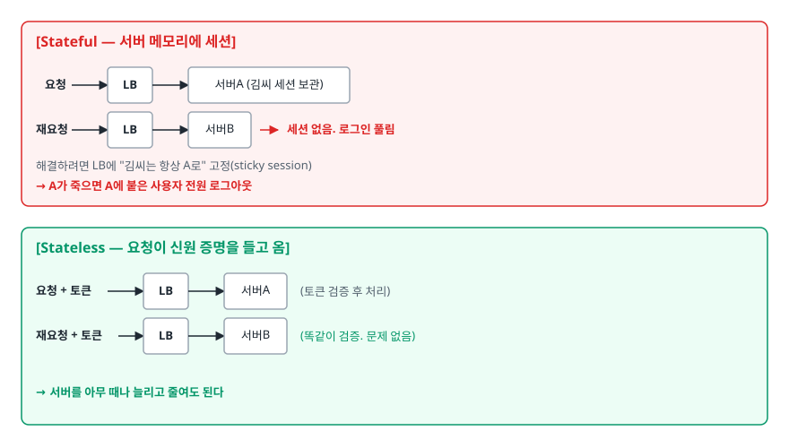
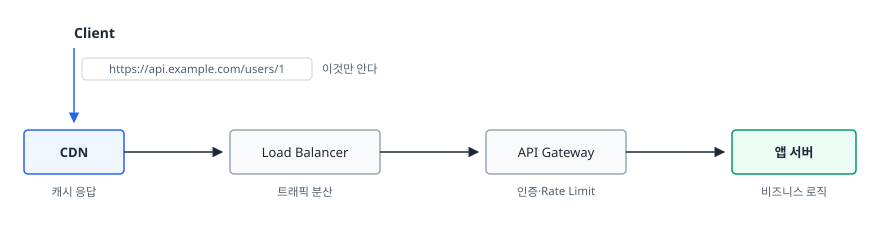
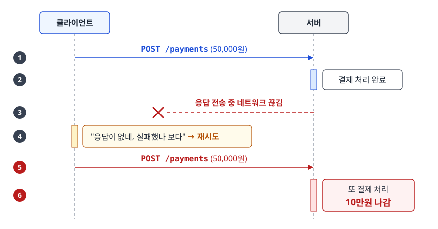
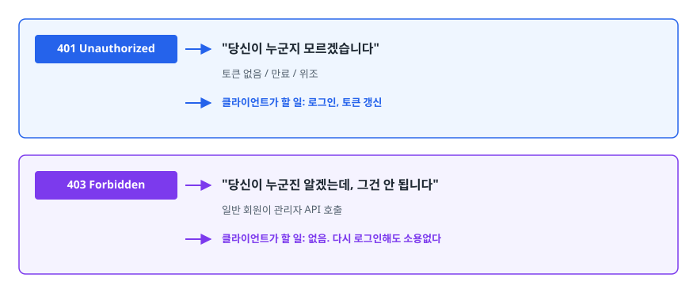
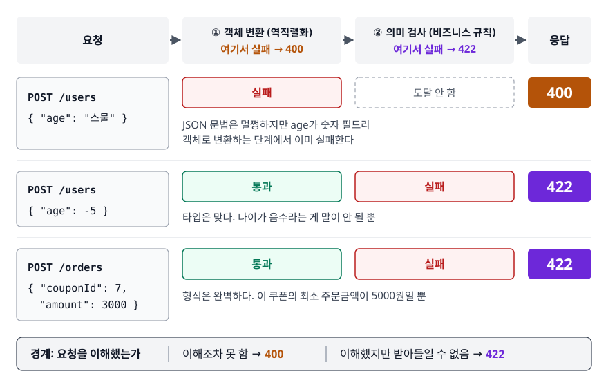
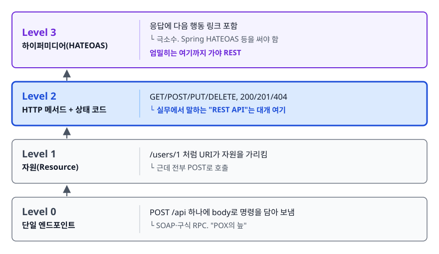

# REST API 설계 (RESTful API Design)

> 이 문서를 읽고 나면 "우리 API는 RESTful합니다"라는 말이 어디까지 참인지, 400과 422를 무엇으로 가르는지, URI에 동사를 쓰면 왜 안 되는지를 설명할 수 있게 됩니다.

## 학습 목표

- [ ] REST의 6가지 제약조건을 나열하고 각각이 어떤 문제를 푸는지 설명할 수 있다
- [ ] 나쁜 URI를 보고 무엇이 잘못됐는지 지적하고 고칠 수 있다
- [ ] 안전성(Safe)과 멱등성(Idempotent)의 차이를 구분하고 메서드별로 판정할 수 있다
- [ ] 400/401/403/404/409/422를 상황에 맞게 고를 수 있다
- [ ] HATEOAS가 왜 이론상 필수인데 실무에서는 거의 안 쓰이는지 설명할 수 있다

## 선행 지식

- HTTP 요청/응답의 기본 구조 (메서드, 헤더, 상태 코드)
- [HTTP와 HTTPS](../01-computer-science-fundamentals/network/02-http-https.md) - 캐시 헤더와 메서드 의미를 다룹니다

---

## 1. 왜 필요한가

### 규칙이 없으면 엔드포인트는 개발자 수만큼 늘어난다

REST 이전, 그리고 지금도 규칙이 없는 팀의 API는 이런 모습입니다.

```
GET  /getUserInfo?id=1
POST /user_update
GET  /deleteUserById/1
POST /api/v1/users/getList
GET  /searchUsersByNameAndAge?n=kim&a=20
```

전부 동작합니다. 문제는 **새 기능을 붙일 때마다 "이번엔 어떻게 이름 짓지?"를 매번 고민해야 한다**는 데 있습니다. 그 결과:

1. **예측 불가** — 클라이언트 개발자가 "게시글 삭제는 어떻게 부르죠?"를 매번 물어봐야 합니다. 문서를 안 보면 아무것도 못 합니다.
2. **중간 계층이 무력해진다** — `GET /deleteUserById/1`은 GET이라서 프록시나 브라우저가 마음대로 캐싱하거나 미리 요청(prefetch)해도 된다고 판단합니다. 그러다 데이터가 지워집니다.
3. **재시도 판단 불가** — 네트워크가 끊겼을 때 `POST /user_update`를 다시 보내도 되는지 요청 이름만 봐서는 알 수 없습니다.

### REST가 제안한 것

REST(REpresentational State Transfer)는 Roy Fielding이 2000년 박사 논문에서 정리한 **아키텍처 스타일**입니다. 프로토콜도 아니고 표준 스펙도 아닙니다. "웹이 이렇게 커질 수 있었던 이유가 뭘까"를 역으로 분석해 얻은 제약조건의 모음에 가깝습니다.

핵심 아이디어는 하나입니다. **이름은 자원(명사)으로 짓고, 행위는 이미 HTTP에 정의된 메서드로 표현하라.** 그러면 위 세 문제가 한 번에 풀립니다. `DELETE /users/1`은 이름을 몰라도 뜻이 통하고, 프록시가 GET만 캐싱하면 되고, DELETE는 여러 번 보내도 안전합니다.

> **비유**: 도서관의 청구기호. 책마다 담당 사서가 자기 마음대로 이름을 붙이면 아무도 책을 못 찾습니다. 청구기호 체계를 정해두면 처음 온 사람도 규칙만 알면 어느 책이든 찾아갑니다.
>
> **비유의 한계**: 청구기호는 위치를 알려 줍니다. 하지만 URI는 위치가 아니라 **식별자**입니다. `/users/1`이 어느 서버 어느 DB에 있는지는 클라이언트가 알 필요도 없고 알 수도 없습니다.

---

## 2. 6가지 제약조건과 실무 준수도

| 제약조건 | 무엇을 요구하나 | 안 지키면 | 실무 준수도 |
|---------|----------------|----------|-----------|
| Client-Server | UI 관심사와 데이터 관심사를 분리 | 서버가 화면 구조를 알게 되어 클라이언트 하나 늘 때마다 서버를 고침 | 거의 항상 지킴 |
| Stateless | 요청 하나에 처리에 필요한 정보가 전부 담겨야 함 | 특정 서버에만 세션이 있어 수평 확장이 막힘 | 대체로 지킴 (JWT/토큰) |
| Cacheable | 응답에 캐시 가능 여부를 명시 | 매 요청이 원 서버까지 옴 | 절반쯤 지킴 |
| Uniform Interface | 네 가지 세부 규칙: 자원 식별 / 표현을 통한 자원 조작 / 자기 서술적 메시지 / 하이퍼미디어로 상태 전이(HATEOAS) | 앞 절의 세 가지 문제 | 앞 세 개는 지키고 하이퍼미디어는 거의 안 지킴 |
| Layered System | 클라이언트는 중간 계층 존재를 몰라도 됨 | LB·CDN·게이트웨이를 끼울 때마다 클라이언트를 고침 | 거의 항상 지킴 |
| Code on Demand (선택) | 서버가 실행 코드를 내려줄 수 있음 | — (선택이라 안 지켜도 REST임) | API에서는 거의 안 씀 |

> 표 요약: 면접에서 "RESTful하게 설계했나요?"라는 질문은 사실상 **Uniform Interface(URI·메서드·상태 코드)와 Stateless를 얼마나 지켰나**를 묻는 것입니다. 나머지 넷은 개념만 알면 충분합니다.

### Stateless가 진짜로 사주는 것

<!-- diagram:api-rest-api-design-1 -->


<!-- 위 그림이 대체한 원본 ASCII (원본의 화살표 꼬리는 주석이 조기 종료되지 않도록 `--&gt;`로 표기).
     내용을 고칠 때는 그림도 함께 갱신할 것.
```
[Stateful — 서버 메모리에 세션]
   요청 --&gt; [LB] --&gt; 서버A (김씨 세션 보관)
   재요청 --&gt; [LB] --&gt; 서버B  ← 세션 없음. 로그인 풀림
   해결하려면 LB에 "김씨는 항상 A로" 고정(sticky session)
   → A가 죽으면 A에 붙은 사용자 전원 로그아웃

[Stateless — 요청이 신원 증명을 들고 옴]
   요청 + 토큰 --&gt; [LB] --&gt; 서버A  (토큰 검증 후 처리)
   재요청 + 토큰 --&gt; [LB] --&gt; 서버B  (똑같이 검증. 문제 없음)
   → 서버를 아무 때나 늘리고 줄여도 된다
```
-->

주의할 점은 <strong>"상태를 저장하지 마라"가 아니라 "세션 상태를 서버 메모리에 두지 마라"</strong>라는 데 있습니다. 사용자 데이터는 당연히 DB에 있습니다. Stateless가 금지하는 것은 *이 클라이언트가 지금 어느 단계까지 왔는지*를 서버가 기억하는 일입니다.

### Layered System — 클라이언트가 몰라도 되는 것들

<!-- diagram:api-rest-api-design-2 -->


<!-- 위 그림이 대체한 원본 ASCII.
     내용을 고칠 때는 그림도 함께 갱신할 것.
```
Client
  │  https://api.example.com/users/1  이것만 안다
  ▼
┌──────┐   ┌──────────────┐   ┌─────────────┐   ┌────────┐
│ CDN  │──>│ Load Balancer│──>│ API Gateway │──>│ 앱 서버 │
└──────┘   └──────────────┘   └─────────────┘   └────────┘
 캐시 응답    트래픽 분산        인증·Rate Limit     비즈니스 로직
```
-->

중간에 무엇이 몇 개 끼든 클라이언트 코드는 한 줄도 안 바뀝니다. 캐싱 계층을 새로 넣거나 게이트웨이에서 인증을 앞당겨 처리하는 일이 가능한 이유가 이 제약조건입니다.

---

## 3. 리소스 중심 URI 설계

### 규칙

1. **자원은 명사, 행위는 HTTP 메서드**
2. **컬렉션은 복수형** (`/users`, `/orders`)
3. **소속 관계는 경로 계층으로** (`/users/1/orders`)
4. **소문자 + 하이픈**. 언더스코어는 링크에 걸리는 밑줄과 겹쳐 잘 안 보입니다. 대문자를 피하는 이유는 URI 경로가 명세상(RFC 3986) 대소문자를 구분하는 자리인데도 서버·프레임워크에 따라 같은 것으로 취급하기도 한다는 데 있습니다. 어느 쪽으로 동작할지 예측이 안 됩니다
5. **확장자를 쓰지 않습니다.** 포맷은 `Accept` 헤더로 협상합니다
6. **필터·정렬·페이지네이션은 쿼리 파라미터로**

### 나쁜 예 → 좋은 예

| 나쁜 예 | 무엇이 문제인가 | 좋은 예 |
|--------|---------------|--------|
| `GET /getUsers` | 행위가 URI에 있습니다. GET이 이미 "조회"를 뜻하는데 중복 | `GET /users` |
| `POST /createUser` | 위와 동일. POST가 이미 생성을 뜻한다 | `POST /users` |
| `GET /user/delete/1` | GET으로 상태를 바꿉니다. 프록시·브라우저가 멋대로 호출할 수 있습니다 | `DELETE /users/1` |
| `GET /User/1` | 경로는 명세상 대소문자를 구분하므로 `/user/1`과 별개의 URI다. 서버가 같게 취급할지는 구현마다 다르다 | `GET /users/1` |
| `GET /users.json` | 확장자로 포맷을 고정. XML을 추가하면 URI가 하나 더 생긴다 | `GET /users` + `Accept: application/json` |
| `GET /users/1/orders/2/items/3/options` | 계층이 너무 깊습니다. 주문 항목 3의 옵션을 보려고 상위 경로를 전부 알아야 합니다 | `GET /order-items/3/options` |
| `GET /users?action=delete&id=1` | 쿼리 파라미터에 행위를 담았다 | `DELETE /users/1` |
| `GET /postList` | 복수형이 아니라 컬렉션임이 드러나지 않는다 | `GET /posts` |

> 표 요약: 잘못된 URI의 90%는 **동사가 URI에 들어간 경우**와 **메서드 의미를 무시한 경우** 둘 중 하나입니다. 이 둘만 걸러도 대부분 해결됩니다.

### 명사로 안 떨어지는 행위는 어떻게 하나

"비밀번호 재설정", "결제 취소", "장바구니 비우기"처럼 명사로 떨어지지 않는 행위가 있습니다. 접근은 두 가지입니다.

```
① 행위를 자원으로 승격한다 (권장)
   POST /password-reset-requests    비밀번호 재설정 "요청"이라는 자원을 생성
   POST /orders/1/cancellation      주문 1의 "취소"라는 자원을 생성

② 컨트롤러 자원으로 예외를 인정한다
   POST /orders/1/cancel
   POST /users/1/verify-email
```

②는 REST 원칙에서 벗어납니다. 그래도 마땅한 명사가 없는 행위에 억지로 이름을 지어내서, 팀원 누구도 뜻을 짐작하지 못하는 URI를 만드는 것보다는 낫습니다. **일관성 있게 소수의 예외만** 두는 것이 실무 타협점입니다.

---

## 4. HTTP 메서드: 안전성과 멱등성

두 성질을 헷갈리는 경우가 많은데 묻는 것이 다릅니다.

- **안전성(Safe)**: 이 요청이 서버의 상태를 바꾸는가? 안 바꾸면 Safe.
- **멱등성(Idempotent)**: 같은 요청을 여러 번 보냈을 때 **최종 상태**가 한 번 보낸 것과 같은가?

Safe한 메서드는 전부 멱등입니다. 상태를 안 바꾸니 당연합니다. 반대는 성립하지 않습니다.

| 메서드 | 용도 | 안전 | 멱등 | 요청 본문 | 캐시 가능 |
|--------|------|:----:|:----:|:--------:|:--------:|
| GET | 조회 | O | O | 없음 | O |
| HEAD | 헤더만 조회 | O | O | 없음 | O |
| POST | 생성 / 그 외 처리 | X | X | 있음 | 조건부(거의 안 함) |
| PUT | 전체 교체 | X | O | 있음 | X |
| PATCH | 부분 수정 | X | 보통 X | 있음 | X |
| DELETE | 삭제 | X | O | 보통 없음 | X |

> 표 요약: **멱등이면 네트워크 실패 시 그냥 재시도해도 됩니다.** POST와 PATCH만 재시도 전략을 따로 고민하면 된다는 뜻입니다. 그래서 이 표는 클라이언트 재시도 설계의 근거가 됩니다.

### DELETE가 멱등인 이유 — 응답 코드가 달라도 멱등이다

첫 `DELETE /users/1`은 204, 두 번째는 404가 나옵니다. "결과가 다른데 멱등인가?" 하는 의문이 여기서 생깁니다. 멱등성이 보장하는 것은 **응답이 같다**가 아니라 **서버의 상태가 같다**는 것입니다. 두 요청 모두 끝난 뒤 "1번 유저가 없다"는 상태는 동일하므로 멱등입니다.

### PATCH가 멱등이 아닌 이유

```json
// 멱등하지 않은 PATCH — 상대 변경
{ "op": "increment", "field": "viewCount", "value": 1 }
// 3번 보내면 조회수가 3 올라간다

// 멱등한 PATCH — 절대값 설정
{ "nickname": "kim" }
// 3번 보내도 닉네임은 "kim" 하나다
```

즉 PATCH의 멱등성은 **메서드가 아니라 본문 설계에 달려 있습니다**. 스펙이 "PATCH는 멱등이 아니다"라고 규정하는 이유는 멱등하지 않은 본문을 허용하기 때문이지, 멱등하게 쓸 수 없다는 뜻이 아닙니다.

### 안티패턴 — GET으로 상태를 바꾸기

```http
GET /articles/1/like     # 좋아요 누르기
```

**왜 문제인가**: GET은 안전하다는 계약을 깹니다. 그 계약을 믿는 주체가 한둘이 아닙니다. 브라우저는 링크를 미리 가져올(prefetch) 수 있고, CDN은 응답을 캐싱해 다음 사람에게 그대로 내줄 수 있고, 크롤러는 페이지의 모든 링크를 밟아봅니다. 사내 위키의 링크 미리보기 봇이 게시글 전체에 좋아요를 누르는 사고가 실제로 이 패턴에서 나옵니다.

```http
POST   /articles/1/likes    # 좋아요 생성
DELETE /articles/1/likes    # 좋아요 취소
```

좋아요를 "자원"으로 보고 생성/삭제로 표현하면 의미도 맞고 안전성 계약도 지켜집니다.

### POST 중복과 Idempotency-Key

POST가 멱등이 아니라는 사실이 실제 사고로 드러나는 대표 사례가 결제입니다.

<!-- diagram:api-rest-api-design-3 -->


<!-- 위 그림이 대체한 원본 ASCII.
     내용을 고칠 때는 그림도 함께 갱신할 것.
```
클라이언트 ──POST /payments (50,000원)──> 서버
                                            │
                                     결제 처리 완료
                                            │
              <──── 응답 전송 중 네트워크 끊김 ────

클라이언트: "응답이 없네, 실패했나 보다" → 재시도
클라이언트 ──POST /payments (50,000원)──> 서버
                                            │
                                     또 결제 처리  ← 10만원 나감
```
-->

해결책은 **요청마다 고유 키를 붙여 서버가 중복을 판별하게 하는 것**입니다.

```http
POST /payments
Idempotency-Key: 6f1c9d2e-8a44-4d1b-9c7a-2b0e5f3a1d88
Content-Type: application/json

{ "amount": 50000, "orderId": "ORD-1234" }
```

서버는 이 키를 저장소(주로 Redis)에 남깁니다. 같은 키가 다시 오면 **처리하지 않고 처음 저장해둔 응답을 그대로 돌려줍니다.** 클라이언트가 지켜야 할 핵심 규칙은 하나입니다. **재시도할 때 키를 새로 만들지 않습니다.** 새 UUID를 만들면 서버 입장에서는 완전히 다른 요청이라 그대로 두 번 결제됩니다.

Stripe, 토스페이먼츠 등 결제 API가 이 방식을 씁니다. HTTP 표준에 들어간 헤더는 아니고 업계 관례에 가깝지만, 이름은 대체로 `Idempotency-Key`로 통일되어 있습니다.

---

## 5. 상태 코드 고르기

| 코드 | 이름 | 언제 쓰나 |
|------|------|----------|
| 200 | OK | 조회·수정 성공. 응답 본문 있음 |
| 201 | Created | 자원 생성 성공. POST로 만들었으면 `Location` 헤더에 생성된 자원 URI를 담는다 |
| 202 | Accepted | 접수만 하고 처리는 비동기. 배치·메일 발송 등 |
| 204 | No Content | 성공했고 돌려줄 본문이 없음. DELETE 성공에 흔함 |
| 400 | Bad Request | 요청을 **해석할 수 없음**. JSON 문법 오류, 필드 타입 불일치로 역직렬화 실패 |
| 401 | Unauthorized | 누구인지 모름. 토큰 없음/만료/서명 불일치 |
| 403 | Forbidden | 누구인지는 알지만 권한이 없음 |
| 404 | Not Found | 자원이 없음 |
| 405 | Method Not Allowed | URI는 맞는데 그 메서드는 지원 안 함 |
| 409 | Conflict | 현재 상태와 충돌. 이메일 중복, 낙관적 락 충돌 |
| 422 | Unprocessable Content | 문법은 맞지만 **의미가 틀림**. 비즈니스 규칙 위반 |
| 429 | Too Many Requests | Rate Limit 초과 |
| 500 | Internal Server Error | 서버가 처리하다 예상 못 한 예외 |
| 503 | Service Unavailable | 점검·과부하 등 일시적 불가. `Retry-After` 동반 |

> 표 요약: 4xx는 "원인이 요청 쪽에 있다", 5xx는 "원인이 서버 쪽에 있다"로 갈립니다. 헷갈리면 **요청을 고쳐야만 통과하는가**를 따져보면 됩니다. 고쳐야 통과하면 4xx, 서버 사정만 풀리면 같은 요청이 그대로 통과하니 5xx입니다. 429는 예외입니다. 원인은 요청 쪽(너무 많이 보냄)이라 4xx인데도 시간이 지나면 그대로 통과하기 때문에, `Retry-After`로 언제 다시 오면 되는지를 함께 알려줍니다.

### 401 vs 403

<!-- diagram:api-rest-api-design-4 -->


<!-- 위 그림이 대체한 원본 ASCII.
     내용을 고칠 때는 그림도 함께 갱신할 것.
```
401 Unauthorized  → "당신이 누군지 모르겠습니다"
                     토큰 없음 / 만료 / 위조
                     → 클라이언트가 할 일: 로그인, 토큰 갱신

403 Forbidden     → "당신이 누군진 알겠는데, 그건 안 됩니다"
                     일반 회원이 관리자 API 호출
                     → 클라이언트가 할 일: 없음. 다시 로그인해도 소용없다
```
-->

이름이 반대로 붙어 있어서(401이 Unauthorized인데 실제로는 인증 문제) 계속 헷갈립니다. "**다시 로그인하면 해결되는가**"로 외우면 편합니다. 해결되면 401, 안 되면 403입니다.

보안 관점에서 403 대신 404를 내는 선택도 있습니다. 남의 비공개 게시글에 403을 주면 "그 ID의 글이 존재한다"는 정보가 새기 때문입니다. 존재 자체를 숨겨야 하는 자원이면 404가 낫습니다.

### 400 vs 422

<!-- diagram:api-rest-api-design-5 -->


<!-- 위 그림이 대체한 원본 ASCII.
     내용을 고칠 때는 그림도 함께 갱신할 것.
```
POST /users
{ "age": "스물" }        → 400. JSON 문법은 멀쩡하지만 age가 숫자 필드라
                              객체로 변환하는 단계에서 이미 실패한다

POST /users
{ "age": -5 }            → 422. 타입은 맞다. 나이가 음수라는 게 말이 안 될 뿐

POST /orders
{ "couponId": 7, "amount": 3000 }
                         → 422. 형식은 완벽하다. 이 쿠폰의 최소 주문금액이 5000원일 뿐
```
-->

경계는 "**요청을 이해했는가**"입니다. 이해조차 못 했으면 400, 이해는 했는데 받아들일 수 없으면 422입니다. 다만 422를 아예 안 쓰고 400으로 통일하는 팀도 많습니다. 어느 쪽이든 **팀 안에서 일관되면 됩니다**. 면접에서는 둘의 차이를 알고 있다는 것만 보이면 충분합니다.

### 안티패턴 — 200 OK 안에 에러 담기

```json
HTTP/1.1 200 OK
{ "success": false, "code": "USER_NOT_FOUND", "message": "사용자가 없습니다" }
```

**왜 문제인가**: HTTP 계층은 이 응답을 성공으로 봅니다. 그래서 (1) 모니터링 대시보드의 에러율이 0%로 나와 장애를 놓치고, (2) CDN이 에러 응답을 캐싱해 다른 사용자에게도 뿌리고, (3) 클라이언트의 HTTP 라이브러리가 자동으로 예외를 던져주지 못해 모든 호출부에서 `if (!res.success)`를 손으로 검사해야 합니다. 한 군데만 빼먹으면 에러 응답을 정상 데이터로 취급합니다.

```json
HTTP/1.1 404 Not Found
Content-Type: application/problem+json

{
  "type": "https://api.example.com/errors/user-not-found",
  "title": "User not found",
  "status": 404,
  "detail": "id=1인 사용자를 찾을 수 없습니다",
  "instance": "/users/1"
}
```

---

## 6. 에러 응답 포맷 통일

에러 포맷이 엔드포인트마다 다르면 클라이언트는 엔드포인트 수만큼 에러 처리 코드를 짜야 합니다. 그래서 **하나의 포맷을 정하고 전역 예외 핸들러에서만 만들도록** 강제하는 것이 정석입니다.

표준 포맷으로 `application/problem+json`(Problem Details for HTTP APIs, RFC 7807 → RFC 9457)이 있습니다. 필드는 `type`, `title`, `status`, `detail`, `instance` 다섯 개가 기본이고 확장 필드를 자유롭게 추가할 수 있습니다.

Spring에서는 전역 핸들러 하나로 모으면 됩니다.

```java
@RestControllerAdvice
public class GlobalExceptionHandler {

    // FieldDetail은 이 프로젝트가 정의한 응답용 DTO.
    // Spring의 org.springframework.validation.FieldError와 이름이 겹치지 않게 둔다.
    @ExceptionHandler(MethodArgumentNotValidException.class)
    public ResponseEntity<ErrorResponse> handleValidation(MethodArgumentNotValidException e) {
        List<FieldDetail> errors = e.getBindingResult().getFieldErrors().stream()
            .map(f -> new FieldDetail(f.getField(), f.getDefaultMessage()))
            .toList();
        return ResponseEntity.badRequest()
            .body(new ErrorResponse("VALIDATION_FAILED", "입력값이 올바르지 않습니다", errors));
    }

    @ExceptionHandler(BusinessException.class)
    public ResponseEntity<ErrorResponse> handleBusiness(BusinessException e) {
        return ResponseEntity.status(e.getStatus())
            .body(new ErrorResponse(e.getCode(), e.getMessage(), List.of()));
    }
}
```

에러 응답에는 담아야 할 것과 담으면 안 되는 것이 따로 있습니다.

- 담는 것: 기계가 분기할 수 있는 **에러 코드 문자열**, 사람이 읽을 메시지, 어느 필드가 틀렸는지, 추적용 요청 ID
- 담지 않는 것: 스택 트레이스, SQL 문, 내부 서버 호스트명, 예외 클래스 전체 경로 — 공격자에게 내부 구조를 알려 주는 정보입니다

에러 코드를 문자열로 두는 이유는 상태 코드만으로는 구분이 안 되기 때문입니다. 400 하나로 "필수값 누락"과 "쿠폰 만료"를 구분할 수 없으니, 클라이언트가 분기할 수 있는 코드를 별도로 줍니다.

---

## 7. HATEOAS와 리처드슨 성숙도 모델

Uniform Interface의 네 번째 세부 규칙이 **HATEOAS**(Hypermedia As The Engine Of Application State)입니다. 응답에 "여기서 다음에 할 수 있는 행동"의 링크를 함께 담으라는 뜻입니다.

```json
{
  "orderId": 1234,
  "status": "PENDING",
  "_links": {
    "self":   { "href": "/orders/1234" },
    "cancel": { "href": "/orders/1234/cancellation", "method": "POST" },
    "pay":    { "href": "/orders/1234/payments", "method": "POST" }
  }
}
```

링크를 담는 형식 자체는 REST가 정하지 않습니다. 위는 HAL(`_links`) 스타일을 흉내 낸 것이고, 실제로는 HAL·JSON:API·Siren 등 미디어 타입마다 표기가 다릅니다.

의도는 클라이언트가 URI를 하드코딩하지 않고 서버가 준 링크만 따라가게 만드는 것입니다. 그러면 서버가 URI를 바꿔도 클라이언트를 안 고쳐도 됩니다. 주문이 이미 배송 중이면 `cancel` 링크를 빼는 것만으로 "취소 불가"를 표현할 수도 있습니다.

이 개념까지 포함해 REST의 단계를 나눈 것이 리처드슨 성숙도 모델(Richardson Maturity Model)입니다.

<!-- diagram:api-rest-api-design-6 -->


<!-- 위 그림이 대체한 원본 ASCII.
     내용을 고칠 때는 그림도 함께 갱신할 것.
```
Level 3  하이퍼미디어(HATEOAS)      응답에 다음 행동 링크 포함
  ▲                                 └ 극소수. Spring HATEOAS 등을 써야 함
  │
Level 2  HTTP 메서드 + 상태 코드     GET/POST/PUT/DELETE, 200/201/404
  ▲                                 └ 실무에서 말하는 "REST API"는 대개 여기
  │
Level 1  자원(Resource)              /users/1 처럼 URI가 자원을 가리킴
  ▲                                 └ 근데 전부 POST로 호출
  │
Level 0  단일 엔드포인트             POST /api 하나에 body로 명령을 담아 보냄
                                    └ SOAP·구식 RPC. "POX의 늪"
```
-->

**Level 3까지 가는 프로젝트는 거의 없습니다.** 이유는 분명합니다. 링크를 따라가는 클라이언트를 만드는 비용이 URI를 하드코딩하는 비용보다 훨씬 크고, 응답 크기도 커지고, 결정적으로 클라이언트 팀이 어차피 API 문서를 보고 개발하기 때문입니다. Fielding 본인은 하이퍼미디어가 빠진 것을 REST라 부르면 안 된다는 입장을 여러 차례 밝혔지만, 업계 용어로서의 "REST API"는 사실상 Level 2를 가리킵니다.

면접에서 이 주제가 나오면 "**엄밀히는 Level 3까지 가야 REST지만, 실무에서 REST API라 부르는 것은 대부분 Level 2입니다**"라고 답하면 정확합니다.

---

## 8. 실무에서는

- **버전 관리는 대부분 URI 경로 방식**을 씁니다. `/v1/users` 형태입니다. REST 철학상으로는 미디어 타입 협상이 더 맞지만, 브라우저 주소창에 쳐볼 수 있다는 실용성이 이깁니다. 자세한 비교는 형제 문서에서 다룹니다.
- **컬렉션 응답은 배열이 아니라 객체로 감쌉니다.** `[{...}, {...}]`로 내리면 나중에 페이지네이션 메타를 넣을 자리가 없어 응답 구조를 통째로 바꿔야 합니다(하위 호환을 깨는 변경입니다). 처음부터 `{ "data": [...], "page": {...} }`로 시작합니다.
- **DELETE는 실제로는 소프트 삭제**인 경우가 많습니다. `deleted_at`을 채우고 목록 조회에서 제외하는 방식입니다. 이때도 API 계약은 `DELETE /users/1` → 204로 유지합니다. 내부 구현은 클라이언트가 알 바가 아닙니다.
- **PUT보다 PATCH를 훨씬 많이 씁니다.** PUT은 전체 교체라 클라이언트가 모든 필드를 다 보내야 하는데, 필드가 20개인 자원에서 닉네임 하나 바꾸려고 20개를 다 보내는 것은 비현실적입니다. 그 사이 다른 사람이 바꾼 값을 덮어쓰는 문제도 생깁니다.
- **동시 수정 충돌은 `ETag` + `If-Match`로 막습니다.** 조회 응답의 `ETag`를 수정 요청의 `If-Match`에 실어 보내면, 그 사이 값이 바뀌었을 때 서버가 412 Precondition Failed로 거절합니다. 낙관적 락을 HTTP 계층에서 하는 셈입니다.

---

## 9. 면접 포인트

> 면접에서 이 주제가 나오면 이렇게 답한다

**Q. RESTful API란 무엇인가요?**

A. Roy Fielding이 정의한 6가지 제약조건을 따르는 아키텍처 스타일입니다. 핵심은 Uniform Interface로, URI는 자원을 식별하고 행위는 HTTP 메서드로 표현하며 상태는 표현(representation)으로 주고받습니다. 여기에 Stateless를 지켜 서버가 세션 상태를 갖지 않게 하면 수평 확장이 자유로워집니다. 다만 엄밀히는 HATEOAS까지 만족해야 REST인데, 실무에서 REST API라 부르는 것은 리처드슨 성숙도 모델의 Level 2에 해당하는 경우가 대부분입니다.
- 꼬리 질문: "그럼 지금 만드신 API는 RESTful한가요?" → Level 2까지는 지켰고 HATEOAS는 비용 대비 효용이 낮아 적용하지 않았다고 근거를 대며 답합니다. 무조건 "네"보다 훨씬 좋은 답입니다.

**Q. 멱등성이 왜 중요한가요?**

A. 네트워크 타임아웃처럼 응답을 못 받았을 때 재시도해도 안전한지 판단하는 기준이기 때문입니다. GET, PUT, DELETE는 멱등이라 클라이언트나 게이트웨이가 자동 재시도를 걸어도 되지만, POST는 멱등이 아니라 중복 생성이 일어납니다. 그래서 결제처럼 중복이 치명적인 POST에는 Idempotency-Key 헤더로 고유 키를 붙이고, 서버가 Redis에 그 키를 저장해 같은 키가 오면 실제 처리 없이 저장된 응답을 반환하도록 만듭니다.
- 꼬리 질문: "DELETE는 두 번째에 404가 나는데 멱등인가요?" → 멱등성은 응답이 같다는 뜻이 아니라 최종 서버 상태가 같다는 뜻이므로 멱등이 맞다고 답합니다.

**Q. 401과 403의 차이는 무엇인가요?**

A. 401은 인증 실패로 "요청자가 누구인지 서버가 알 수 없는 상태"입니다. 토큰이 없거나 만료됐을 때가 여기 해당하고, 클라이언트는 재로그인이나 토큰 갱신으로 해결할 수 있습니다. 403은 인가 실패로, 신원은 확인됐지만 그 자원에 대한 권한이 없는 상태입니다. 다시 로그인해도 결과가 같습니다. 다만 존재 자체를 숨겨야 하는 자원이라면 403 대신 404를 내려 리소스 존재 여부가 노출되지 않게 하기도 합니다.
- 꼬리 질문: "만료된 토큰은 401인가요 403인가요?" → 갱신하면 통과하므로 401입니다.

**Q. 상태 코드를 200으로 고정하고 body에 에러를 담는 설계는 어떤가요?**

A. 권장하지 않습니다. HTTP 계층이 그 응답을 성공으로 인식하기 때문에 모니터링 에러율에 잡히지 않아 장애를 놓치고, 캐시 계층이 에러 응답을 저장해 다른 사용자에게 내줄 수 있으며, 클라이언트 HTTP 라이브러리의 예외 처리 흐름을 쓸 수 없어 모든 호출부에서 수동으로 성공 여부를 검사해야 합니다. 상태 코드는 HTTP 의미대로 쓰고, 세부 구분은 응답 본문의 에러 코드 문자열로 하는 것이 맞습니다.
- 꼬리 질문: "그럼 GraphQL은 왜 200으로 내리나요?" → GraphQL은 단일 엔드포인트에 부분 성공이 가능한 구조라 HTTP 상태 코드로 표현할 수 없기 때문이라고 답합니다.

---

## 자주 하는 실수

| 실수 | 왜 틀렸나 | 올바른 이해 |
|------|----------|-----------|
| "REST는 프로토콜이다" | REST는 HTTP 위에서 지키는 아키텍처 스타일이고, 스펙 문서도 표준 기구도 없다 | HTTP가 프로토콜, REST는 그것을 쓰는 방식에 대한 제약조건 모음 |
| "Stateless라서 서버에 아무 상태도 저장하면 안 된다" | 사용자 데이터는 당연히 저장한다 | 금지되는 것은 **세션 상태**(이 클라이언트가 지금 어느 단계인지)를 서버 메모리에 두는 것 |
| "PUT은 수정, POST는 생성" | PUT도 클라이언트가 URI를 아는 경우 생성에 쓸 수 있습니다. 차이는 생성/수정이 아니라 **멱등성과 전체 교체 여부** | PUT은 "이 URI를 이 표현으로 통째로 만들어라(있으면 교체)", POST는 "이 컬렉션에 알아서 처리해라" |
| "`Cache-Control: no-cache`는 캐시하지 말라는 뜻" | `no-cache`는 저장은 하되 쓰기 전에 서버에 유효성을 물어보라는 뜻 | 저장 자체를 막는 것은 `no-store` |
| "204를 쓰면 응답 본문에 메시지를 넣을 수 있다" | 204는 정의상 본문이 없습니다. 넣어도 클라이언트가 무시하거나 파싱 에러를 냅니다 | 본문을 줄 거면 200을 쓴다 |
| "모든 에러는 400" | 400은 요청을 파싱조차 못 한 경우다 | 파싱 실패는 400, 비즈니스 규칙 위반은 422(또는 팀 합의로 400), 상태 충돌은 409 |
| "URI에 동사만 안 쓰면 RESTful" | 그건 Level 1~2 수준이다 | Level 2(메서드+상태 코드)를 지키는 것이 실무 기준이고, HATEOAS는 별개의 층이다 |

---

## 한 줄 정리

REST는 "이름은 자원으로, 행위는 HTTP 메서드로, 결과는 상태 코드로"라는 합의로 클라이언트·프록시·캐시가 API 문서를 읽지 않고도 요청의 의미를 알 수 있게 만드는 설계 스타일입니다.

---

## 연관 개념

- [02-graphql-basics.md](./02-graphql-basics.md) - REST의 over/under-fetching을 다른 방식으로 푸는 대안
- [03-versioning-pagination.md](./03-versioning-pagination.md) - REST API를 만든 뒤 버전과 목록 조회를 어떻게 운영하는가
- [04-rate-limiting.md](./04-rate-limiting.md) - 429를 언제 어떻게 내려주는가
- [qna-api-design.md](./qna-api-design.md) - REST 원칙과 HTTP 메서드 면접 질문(Q1)
- [../01-computer-science-fundamentals/network/02-http-https.md](../01-computer-science-fundamentals/network/02-http-https.md) - HTTP 메시지 구조와 캐시 헤더의 동작
- [../02-backend-engineering/authentication/02-jwt-token.md](../02-backend-engineering/authentication/02-jwt-token.md) - Stateless 인증을 실제로 구현하는 방법
- [../02-backend-engineering/spring-framework/03-spring-mvc-flow.md](../02-backend-engineering/spring-framework/03-spring-mvc-flow.md) - 요청이 컨트롤러까지 도달하는 과정
