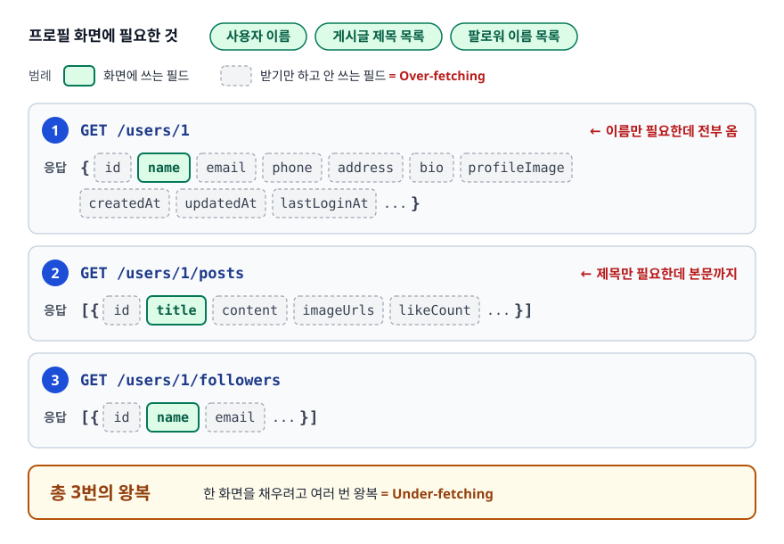
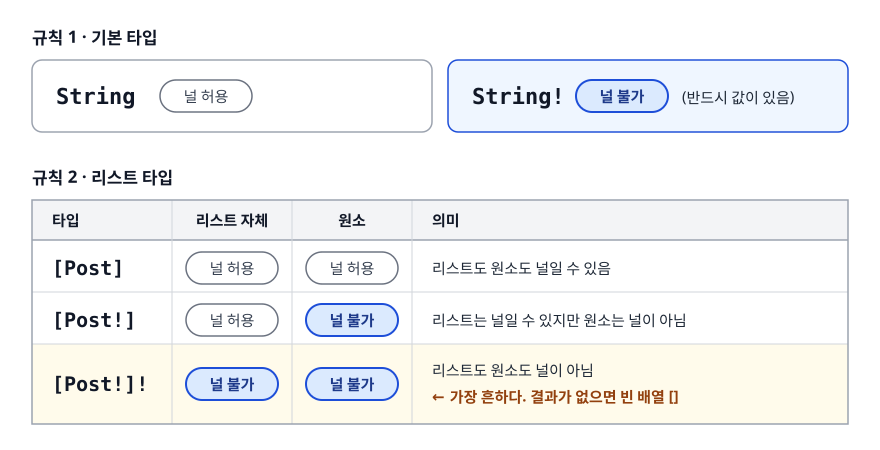
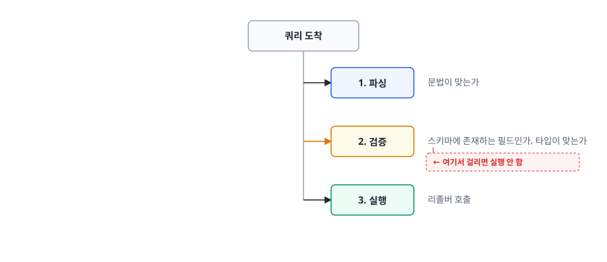
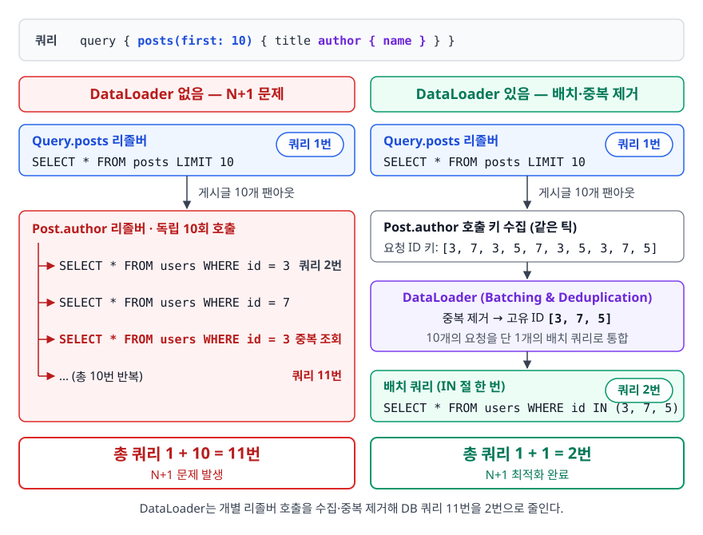
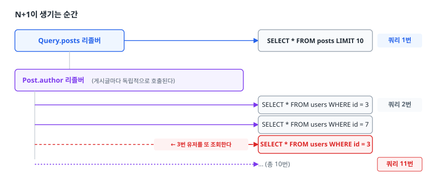
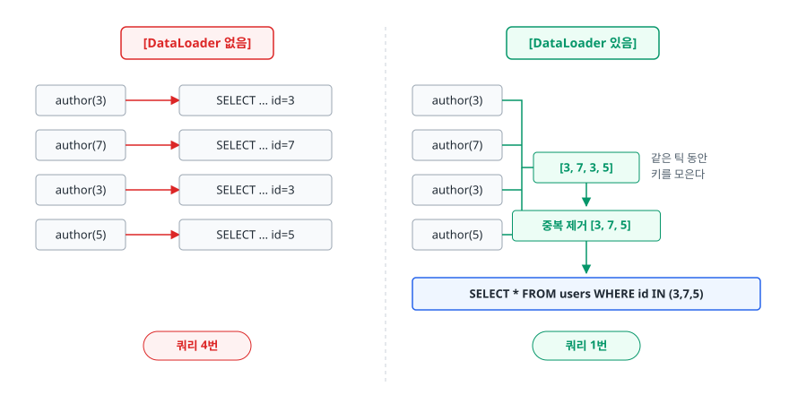

# GraphQL 기초 (GraphQL Basics)

> REST에서 화면 하나 그리는 데 요청을 세 번 해야 했던 문제가 왜 생기는지, GraphQL이 그것을 어떻게 없애는지, 그리고 그 대가로 무엇을 잃는지 설명할 수 있게 됩니다.

## 학습 목표

- [ ] Over-fetching과 Under-fetching을 구체적인 요청 예시로 설명할 수 있다
- [ ] 스키마(SDL)를 읽고 `!`, `[]`의 의미를 정확히 해석할 수 있다
- [ ] Query / Mutation / Subscription의 역할과 실행 방식 차이를 안다
- [ ] 리졸버가 왜 N+1을 만들고 DataLoader가 그것을 어떻게 없애는지 그림으로 설명할 수 있다
- [ ] REST와 GraphQL 중 무엇을 쓸지 근거를 대고 고를 수 있다

## 선행 지식

- [01-rest-api-design.md](./01-rest-api-design.md) — GraphQL은 REST의 한계에서 출발한 기술이라 REST를 먼저 알아야 한다
- HTTP 요청/응답, JSON

---

## 1. 왜 필요한가

### 화면 하나에 요청 세 번

인스타그램 프로필 화면을 만든다고 하자. 사용자 이름, 게시글 제목 목록, 팔로워 이름 목록이 필요합니다. REST로 짜면 이렇게 됩니다.

<!-- diagram:api-graphql-basics-1 -->


<!-- 위 그림이 대체한 원본 ASCII.
     내용을 고칠 때는 그림도 함께 갱신할 것.
```
GET /users/1
  → { id, name, email, phone, address, bio, profileImage,
      createdAt, updatedAt, lastLoginAt, ... }   ← 이름만 필요한데 전부 옴
GET /users/1/posts
  → [{ id, title, content, imageUrls, likeCount, ... }]  ← 제목만 필요한데 본문까지
GET /users/1/followers
  → [{ id, name, email, ... }]

총 3번의 왕복
```
-->

두 가지 문제가 동시에 보입니다.

**Over-fetching(과다 조회)** — 필요 없는 필드까지 받습니다. 서버 입장에서는 낭비된 직렬화 비용이고, 모바일 사용자 입장에서는 낭비된 데이터 요금입니다.

**Under-fetching(과소 조회)** — 한 화면을 채우려고 여러 번 왕복합니다. 왕복 한 번의 지연이 100ms라면 순차 호출 시 300ms가 그냥 사라집니다. 게다가 첫 응답을 받아야 다음 URI를 알 수 있는 경우(게시글 목록 → 각 게시글의 작성자)에는 병렬 처리도 불가능합니다.

### 그럼 전용 엔드포인트를 만들면 되지 않나

가장 흔한 REST식 해결책입니다.

```
GET /users/1/profile-screen    ← 이 화면에 필요한 것만 딱 조립해서 내려주는 API
```

동작합니다. 문제는 **화면 종류만큼 엔드포인트가 늘어난다**는 것입니다. iOS 프로필 화면, 안드로이드 프로필 화면, 웹 프로필 화면이 각각 다른 필드를 원하면 `?fields=name,posts.title` 같은 쿼리 파라미터를 직접 설계하기 시작하고, 그 파싱 규칙과 중첩 처리 규칙을 팀이 자체적으로 만들게 됩니다.

**GraphQL은 그 "필드 선택 규칙"을 타입 시스템까지 갖춰 표준화한 것**이라고 보면 이해가 빠릅니다. 페이스북이 2012년에 만들어 2015년에 공개했고, 만들어진 배경 자체가 모바일 앱의 데이터 왕복 최소화였습니다.

> 비유: 뷔페와 코스 요리. REST는 코스 요리입니다. 주방이 정해둔 구성이 그대로 나오므로 안 먹을 것도 접시에 담겨 옵니다. GraphQL은 뷔페입니다. 먹을 것만 접시에 담습니다.
> **비유의 한계**: 뷔페에서는 손님이 아무리 많이 담아도 주방 부담이 같지만, GraphQL은 깊이 중첩된 쿼리 하나가 DB를 수백 번 때릴 수 있습니다. 그래서 서버가 "한 접시에 담을 수 있는 양"을 따로 제한해야 합니다.

---

## 2. 스키마와 타입 시스템

GraphQL의 출발점은 URL이 아니라 **스키마**입니다. 서버가 제공할 수 있는 데이터의 모양을 SDL(Schema Definition Language)로 미리 선언합니다.

```graphql
type User {
  id: ID!
  name: String!
  email: String
  posts: [Post!]!
  followers: [User!]!
}

type Post {
  id: ID!
  title: String!
  content: String!
  author: User!
  createdAt: String!
}

type Query {
  user(id: ID!): User
  posts(first: Int = 10): [Post!]!
}
```

읽는 법이 처음엔 낯선데, 규칙은 두 개뿐입니다.

<!-- diagram:api-graphql-basics-2 -->


<!-- 위 그림이 대체한 원본 ASCII.
     내용을 고칠 때는 그림도 함께 갱신할 것.
```
String     널 허용            String!   널 불가 (반드시 값이 있음)

[Post]     리스트도 원소도 널일 수 있음
[Post!]    리스트는 널일 수 있지만 원소는 널이 아님
[Post!]!   리스트도 원소도 널이 아님 ← 가장 흔하다. 결과가 없으면 빈 배열 []
```
-->

기본 스칼라 타입은 `Int`, `Float`, `String`, `Boolean`, `ID` 다섯 개입니다. `ID`는 내부적으로 문자열로 직렬화되지만 "식별자로 쓰이며 사람이 읽을 목적이 아니다"라는 의도를 표현합니다.

### 스키마가 계약서 역할을 한다

REST에서는 응답 JSON의 모양이 코드에 흩어져 있고 문서는 따로 관리됩니다. 그래서 문서와 실제 응답이 어긋나는 일이 흔합니다. GraphQL은 **스키마가 곧 실행 대상이자 문서**입니다. 스키마에 없는 필드를 요청하면 서버가 실행 전에 거절합니다.

<!-- diagram:api-graphql-basics-3 -->


<!-- 위 그림이 대체한 원본 ASCII.
     내용을 고칠 때는 그림도 함께 갱신할 것.
```
쿼리 도착
   │
   ├─ 1. 파싱      문법이 맞는가
   ├─ 2. 검증      스키마에 존재하는 필드인가, 타입이 맞는가  ← 여기서 걸리면 실행 안 함
   └─ 3. 실행      리졸버 호출
```
-->

이 검증 단계 덕분에 클라이언트 도구가 **자동 완성과 타입 생성**을 해줄 수 있습니다. 서버 스키마에서 TypeScript 타입을 뽑아내는 코드 생성기가 널리 쓰이는 이유입니다.

---

## 3. Query / Mutation / Subscription

GraphQL의 진입점은 세 종류입니다.

| 종류 | 역할 | 실행 방식 | REST 대응 |
|------|------|----------|----------|
| Query | 조회 | 최상위 필드들이 **병렬** 실행 가능 | GET |
| Mutation | 생성·수정·삭제 | 최상위 필드들이 **순차** 실행 | POST/PUT/PATCH/DELETE |
| Subscription | 서버가 변화를 밀어줌 | 연결 유지, 이벤트마다 푸시 | WebSocket / SSE |

> 표 요약: 조회는 순서가 상관없으니 병렬로 돌리고, 변경은 순서가 결과를 바꾸니 순차로 돌립니다. **Mutation이 순차 실행이라는 점은 스펙에 명시된 보장**이라, 한 요청에 여러 변경을 순서대로 넣을 수 있습니다.

### Query

```graphql
query GetProfile {
  user(id: "1") {
    name
    posts {
      title
    }
    followers {
      name
    }
  }
}
```

응답은 쿼리와 **모양이 같습니다**. 요청한 필드만, 요청한 중첩 구조 그대로 옵니다.

```json
{
  "data": {
    "user": {
      "name": "김개발",
      "posts": [{ "title": "GraphQL 입문" }],
      "followers": [{ "name": "이코딩" }]
    }
  }
}
```

### Mutation

```graphql
mutation CreatePost($input: CreatePostInput!) {
  createPost(input: $input) {
    id
    title
  }
}
```

변수는 쿼리 문자열에 문자열 결합으로 끼워 넣지 않고 별도로 전달합니다.

```json
{
  "query": "mutation CreatePost($input: CreatePostInput!) { createPost(input: $input) { id title } }",
  "variables": { "input": { "title": "새 글", "content": "본문" } }
}
```

Mutation도 **결과로 무엇을 돌려받을지 클라이언트가 고릅니다.** 위에서는 `id`와 `title`만 받았습니다. 생성 직후 화면 갱신에 필요한 필드만 받을 수 있다는 뜻입니다.

### Subscription

```graphql
subscription OnCommentAdded($postId: ID!) {
  commentAdded(postId: $postId) {
    id
    text
    author { name }
  }
}
```

Query/Mutation과 달리 연결을 유지하고 이벤트가 생길 때마다 서버가 밀어줍니다. 전송 계층은 GraphQL 스펙이 정하지 않으며, 실무에서는 WebSocket 기반 프로토콜이나 SSE를 씁니다. 채팅, 알림, 실시간 대시보드가 주 용도입니다.

---

## 4. 리졸버와 N+1 문제

### 리졸버란

스키마는 "무엇을 줄 수 있는가"만 선언합니다. **실제로 값을 어디서 가져올지 정하는 함수가 리졸버(resolver)다.** 필드 하나에 리졸버 하나가 대응합니다.

```js
const resolvers = {
  Query: {
    user: (parent, args, context) => db.users.findById(args.id),
  },
  User: {
    // User 타입의 posts 필드를 채우는 리졸버.
    // parent는 바로 위 단계에서 만들어진 User 객체다.
    posts: (parent, args, context) => db.posts.findByUserId(parent.id),
  },
  Post: {
    author: (parent, args, context) => db.users.findById(parent.authorId),
  },
};
```

리졸버는 **위에서 아래로 트리처럼 호출됩니다.** 여기가 N+1의 발원지입니다.

### N+1이 생기는 순간

<!-- diagram:api-graphql-basics -->


```graphql
query {
  posts(first: 10) {       # ① posts 리졸버 1번 호출 → 게시글 10개
    title
    author { name }        # ② author 리졸버가 게시글마다 1번씩 = 10번 호출
  }
}
```

<!-- diagram:api-graphql-basics-4 -->


<!-- 위 그림이 대체한 원본 ASCII.
     내용을 고칠 때는 그림도 함께 갱신할 것.
```
Query.posts 리졸버
  └─> SELECT * FROM posts LIMIT 10                     쿼리 1번

Post.author 리졸버 (게시글마다 독립적으로 호출된다)
  ├─> SELECT * FROM users WHERE id = 3                 쿼리 2번
  ├─> SELECT * FROM users WHERE id = 7
  ├─> SELECT * FROM users WHERE id = 3   ← 3번 유저를 또 조회한다
  └─> ... (총 10번)                                    쿼리 11번
```
-->

REST에도 N+1은 있지만 성격이 다릅니다. REST에서는 개발자가 `/posts` 엔드포인트 코드를 짜면서 조인을 넣을지 말지 직접 결정합니다. GraphQL에서는 **클라이언트가 쿼리를 짜는 순간 어떤 리졸버가 몇 번 불릴지 결정되기 때문에**, 서버 개발자가 미리 최적화해 둘 지점을 특정하기 어렵습니다. 그래서 구조적으로 더 잘 터집니다.

### DataLoader — 모았다가 한 번에

해결책의 아이디어는 단순합니다. **개별 리졸버가 즉시 DB를 때리지 않고 같은 실행 사이클에서 들어온 요청을 모아 한 번에 조회합니다.**

<!-- diagram:api-graphql-basics-5 -->


<!-- 위 그림이 대체한 원본 ASCII.
     내용을 고칠 때는 그림도 함께 갱신할 것.
```
[DataLoader 없음]                    [DataLoader 있음]

author(3) ──> SELECT ... id=3        author(3) ──┐
author(7) ──> SELECT ... id=7        author(7) ──┤  같은 틱 동안
author(3) ──> SELECT ... id=3        author(3) ──┤  키를 모은다
author(5) ──> SELECT ... id=5        author(5) ──┘  [3, 7, 3, 5]
                                                       │
                                              중복 제거 [3, 7, 5]
                                                       │
                                                       ▼
        쿼리 4번                          SELECT * FROM users WHERE id IN (3,7,5)
                                                    쿼리 1번
```
-->

```js
const DataLoader = require('dataloader');

// 요청(request)마다 새로 만든다. 아래 "주의" 참고.
function createUserLoader(db) {
  return new DataLoader(async (ids) => {
    const users = await db.users.findByIds(ids);       // IN 절 한 번
    const byId = new Map(users.map((u) => [u.id, u]));
    // 규칙: 받은 키 배열과 같은 길이, 같은 순서로 돌려줘야 한다
    return ids.map((id) => byId.get(id) ?? null);
  });
}

const resolvers = {
  Post: {
    author: (parent, args, context) => context.userLoader.load(parent.authorId),
  },
};
```

**주의할 점 두 가지.**

1. **배치 함수는 키 배열과 같은 순서·같은 길이의 배열을 반환해야 합니다.** DB는 `IN (3,7,5)`의 결과를 어떤 순서로 줄지 보장하지 않고, 없는 id는 아예 빠져서 옵니다. 위처럼 Map으로 다시 정렬해주지 않으면 다른 사용자의 데이터가 엉뚱한 게시글에 붙습니다.
2. **DataLoader 인스턴스는 요청마다 새로 만듭니다.** DataLoader는 배치뿐 아니라 캐싱도 하는데, 이 캐시를 애플리케이션 전역으로 공유하면 A가 조회한 값을 B가 그대로 받아버립니다. 권한이 다른 사용자 사이에서는 그대로 정보 유출입니다.

자바 진영에서는 Spring for GraphQL의 `@BatchMapping`이 같은 일을 합니다. 메서드가 부모 객체 리스트를 통째로 받아 한 번에 조회하고 매핑을 돌려주는 방식입니다.

---

## 5. REST와의 비교

| 항목 | REST | GraphQL | 그래서 언제 무엇을 |
|------|------|---------|------------------|
| 엔드포인트 | 자원마다 여러 개 | `/graphql` 하나 | 클라이언트 종류가 많고 요구 필드가 제각각이면 GraphQL |
| 데이터 양 | 서버가 결정 | 클라이언트가 결정 | 모바일 대역폭이 중요하면 GraphQL |
| HTTP 캐싱 | URL 단위로 자연스럽게 됨 | 어렵다(대개 POST 단일 URL) | 공개 API·CDN 캐싱이 핵심이면 REST |
| 에러 표현 | HTTP 상태 코드 | 대개 200 + `errors` 배열 | 상태 코드 기반 모니터링을 쓰면 REST가 편하다 |
| 파일 업로드 | multipart로 자연스럽게 | 별도 비공식 스펙 또는 별도 REST 엔드포인트 필요 | 업로드가 많으면 REST 병행 |
| 버전 관리 | `/v1`, `/v2` | 스키마 진화 + `@deprecated` | 아래 7절 참고 |
| 러닝 커브 | 낮다 | 스키마·리졸버·DataLoader·복잡도 제한까지 익혀야 함 | 팀 역량과 일정이 빠듯하면 REST |
| N+1 | 서버 코드 안의 문제 | 클라이언트 쿼리 모양에 따라 발생 | GraphQL은 DataLoader가 사실상 필수 |
| 서버 부하 예측 | 엔드포인트별로 예측 가능 | 쿼리마다 다름 → 복잡도 제한 필요 | 트래픽 통제가 중요하면 REST |

> 표 요약: **GraphQL은 "클라이언트 편의를 서버 복잡도로 사 오는 거래"**다. 클라이언트가 여럿이고 요구가 자주 바뀌면 남는 장사고, 단순 CRUD 하나에 웹 클라이언트 하나면 손해입니다.

### 캐싱이 왜 어려운가

REST에서 `GET /users/1`은 URL 자체가 캐시 키입니다. CDN도 브라우저도 프록시도 별도 설정 없이 캐싱합니다. GraphQL은 대부분 `POST /graphql` 하나로 가고 본문이 매번 다르므로 **URL 기준 캐싱이 원천적으로 안 됩니다.**

우회 방법이 두 갈래입니다.

1. **클라이언트 측 정규화 캐시** — Apollo Client 같은 라이브러리가 응답을 `User:1`, `Post:5` 단위로 쪼개 저장합니다. 다른 쿼리가 같은 객체를 참조하면 재사용합니다. HTTP 캐시가 아니라 애플리케이션 캐시입니다.
2. **Persisted Query** — 쿼리 문자열을 미리 서버에 등록하고 클라이언트는 그 쿼리의 해시만 보냅니다. 본문이 짧아지므로 `GET /graphql?<해시>&variables=...`처럼 GET 요청으로 만들 수 있고, 그 순간 URL이 다시 캐시 키가 되어 CDN 캐싱이 가능해집니다. 해시를 어떤 파라미터 이름으로 싣는지는 스펙이 아니라 구현(Apollo 등)이 정합니다. 덤으로 등록되지 않은 임의의 쿼리를 서버가 아예 안 받게 되어 보안에도 도움이 됩니다.

### 에러가 200으로 오는 이유

```json
{
  "data": { "user": { "name": "김개발", "posts": null } },
  "errors": [
    {
      "message": "Failed to fetch posts",
      "path": ["user", "posts"],
      "extensions": { "code": "INTERNAL_ERROR" }
    }
  ]
}
```

GraphQL은 **부분 성공**이 가능합니다. 위 응답은 이름은 성공했고 게시글만 실패했습니다. 이걸 HTTP 상태 코드 하나로 표현할 방법이 없습니다. 200을 내리는 것은 "HTTP 계층에서는 요청을 정상 처리했고, 애플리케이션 결과는 본문을 봐라"는 뜻입니다.

REST 절에서 "200에 에러 담지 마라"고 했던 것과 모순처럼 보이지만 다릅니다. REST는 요청 하나가 자원 하나에 대응하므로 전부 성공 아니면 전부 실패인데, GraphQL은 한 요청에 여러 필드가 섞여 있어 이분법이 성립하지 않습니다.

---

## 6. 서버를 지키는 장치

REST에서는 엔드포인트가 곧 비용의 상한선입니다. GraphQL에서는 클라이언트가 쿼리를 짜므로 상한선이 없습니다.

```graphql
# 악의적이지 않아도 실수로 이렇게 짤 수 있다
query {
  user(id: "1") {
    followers {          # 100명
      followers {        # 100 x 100 = 10,000
        followers {      # 1,000,000
          followers { name }   # 100,000,000
        }
      }
    }
  }
}
```

그래서 서버에 다음 장치들을 겁니다.

- **깊이 제한(depth limit)** — 중첩을 N단계까지만 허용
- **복잡도 제한(complexity limit)** — 필드마다 비용 점수를 매기고 쿼리 총점이 한도를 넘으면 거절. 리스트 인자(`first: 100`)를 곱해 계산한다
- **타임아웃** — 실행 시간 상한
- **introspection 비활성화** — 운영 환경에서 스키마 전체를 긁어가지 못하게 합니다. 다만 프론트 개발 편의성과 상충하므로 팀에 따라 다르다
- **Persisted Query만 허용** — 미리 등록한 쿼리 외에는 아예 받지 않습니다. 가장 강력하다

---

## 7. 스키마 진화 — 버전 대신 폐기 예고

REST는 깨지는 변경이 생기면 `/v2`를 만듭니다. GraphQL은 엔드포인트가 하나라 그 방법을 쓸 수 없습니다. 대신 **필드 단위로 폐기를 예고**합니다.

```graphql
type User {
  id: ID!
  name: String!
  fullName: String! @deprecated(reason: "name을 사용하세요. 2026-12-31 제거 예정")
}
```

`@deprecated`가 붙은 필드는 여전히 동작하지만, 개발 도구와 introspection 결과에 경고로 표시됩니다. 클라이언트가 마이그레이션할 시간을 벌어주는 장치입니다.

여기서 GraphQL의 구조적 장점이 하나 나옵니다. **어떤 클라이언트가 어떤 필드를 실제로 쓰는지 서버가 압니다.** REST에서 `GET /users/1` 응답의 `fullName` 필드를 지워도 되는지 알려면 전체 클라이언트 코드를 뒤져야 하지만, GraphQL 서버는 요청받은 필드를 그대로 알고 있으므로 "지난 30일간 `fullName`을 요청한 클라이언트가 0건"을 통계로 확인하고 안전하게 지울 수 있습니다.

물론 다음은 여전히 깨는 변경입니다.

- 필드나 타입을 **제거**하는 것
- 조회 결과로 나가는 필드를 널 불가에서 널 허용으로 완화하는 것(`String!` → `String`). 널이 올 리 없다고 믿고 짠 클라이언트가 깨집니다. 반대 방향(`String` → `String!`)은 클라이언트가 이미 널을 처리하고 있으므로 안전하다
- **필수 인자를 추가**하는 것. 인자 쪽은 방향이 반대여서, 인자를 널 불가에서 널 허용으로 푸는 것이 안전한 변경이다
- enum에 값을 추가하는 것도 클라이언트가 모르는 값을 만나면 깨질 수 있다

---

## 8. 실무에서는

- **전면 교체보다 병행이 많습니다.** 외부 공개 API와 파일 업로드는 REST로 두고, 앱이 쓰는 조회 API만 GraphQL로 만드는 구성이 흔합니다.
- **BFF(Backend For Frontend) 계층으로 쓰는 경우**가 많습니다. 내부 마이크로서비스들은 REST/gRPC로 통신하고, 그것들을 모아 클라이언트에 내려주는 앞단만 GraphQL로 둡니다. GraphQL의 강점인 "여러 소스를 한 요청으로 합치기"가 그대로 살아납니다.
- **DataLoader 없이 GraphQL을 운영하면 거의 확실히 성능 문제가 납니다.** 도입 초기에 잘 돌던 API가 데이터가 쌓이면서 느려지는 전형적인 원인입니다.
- **GitHub API v4가 GraphQL, v3가 REST**로 둘 다 공개되어 있습니다. 실제 대규모 GraphQL 스키마가 어떻게 생겼는지 보고 싶으면 좋은 참고 자료입니다.

---

## 9. 면접 포인트

> 면접에서 이 주제가 나오면 이렇게 답한다

**Q. REST 대신 GraphQL을 쓰면 뭐가 좋아지나요?**
A. Over-fetching과 Under-fetching이 사라집니다. REST는 서버가 응답 필드를 고정하므로 클라이언트가 안 쓰는 필드까지 받고, 화면 하나를 채우려면 여러 엔드포인트를 왕복해야 합니다. GraphQL은 클라이언트가 필요한 필드를 쿼리로 명시해 한 번에 받습니다. 특히 iOS·안드로이드·웹이 같은 데이터를 서로 다른 조합으로 필요로 할 때, 화면별 전용 엔드포인트를 계속 만드는 대신 스키마 하나로 대응할 수 있는 게 큽니다.
- 꼬리 질문: "그럼 REST는 이제 안 쓰나요?" → HTTP 캐싱이 중요한 공개 API, 파일 업로드, 단순 CRUD는 여전히 REST가 낫다고 답합니다. 트레이드오프를 아는지 보는 질문입니다.

**Q. GraphQL의 N+1 문제는 무엇이고 어떻게 해결하나요?**
A. 리졸버가 필드 단위로 호출되기 때문에, 게시글 10개를 조회하면 작성자 리졸버가 10번 따로 호출되어 총 11번의 DB 쿼리가 나갑니다. 해결은 DataLoader입니다. 개별 리졸버가 즉시 조회하지 않고 같은 실행 사이클의 키를 모은 뒤 `IN` 절 한 번으로 배치 조회합니다. 주의할 점은 DataLoader 인스턴스를 요청마다 새로 만들어야 한다는 것인데, 전역으로 공유하면 내부 캐시 때문에 다른 사용자의 데이터가 노출될 수 있습니다.
- 꼬리 질문: "REST에는 N+1이 없나요?" → 있지만 서버 코드 안에서 발생 지점이 고정돼 있어 미리 조인이나 fetch join으로 잡을 수 있고, GraphQL은 쿼리 모양에 따라 달라져 구조적으로 더 취약하다고 답합니다.

**Q. GraphQL은 왜 에러도 HTTP 200으로 내려주나요?**
A. GraphQL은 부분 성공이 가능하기 때문입니다. 한 쿼리에서 사용자 이름은 성공하고 게시글 조회만 실패할 수 있는데, 이걸 상태 코드 하나로 표현할 수 없습니다. 그래서 HTTP 계층은 "요청 자체는 정상 처리됐다"는 의미로 200을 주고, 실패한 필드는 응답 본문의 `errors` 배열에 `path`와 함께 담습니다. 대신 모니터링을 상태 코드 기준으로 하던 조직은 `errors` 필드를 보는 별도 계측을 붙여야 합니다.
- 꼬리 질문: "그럼 인증 실패도 200인가요?" → 쿼리 실행 전에 걸리는 문제라 401로 내리는 구현이 많다고 답합니다. 스펙이 강제하지 않는 영역입니다.

**Q. GraphQL 서버는 어떻게 보호하나요?**
A. 클라이언트가 쿼리를 자유롭게 짜므로 비용 상한이 없다는 점이 위험합니다. 팔로워의 팔로워를 반복해 중첩하면 결과가 지수적으로 커집니다. 그래서 쿼리 깊이 제한과 복잡도 점수 제한을 걸고, 실행 타임아웃을 두고, 운영 환경에서는 introspection을 끄기도 합니다. 가장 강한 방법은 Persisted Query만 허용해 미리 등록된 쿼리 외에는 받지 않는 것이고, 이 경우 GET 요청이 가능해져 CDN 캐싱까지 덤으로 얻습니다.
- 꼬리 질문: "Rate Limiting은 어떻게 거나요?" → 요청 수가 아니라 쿼리 복잡도 점수를 예산처럼 차감하는 방식을 쓴다고 답합니다.

---

## 자주 하는 실수

| 실수 | 왜 틀렸나 | 올바른 이해 |
|------|----------|-----------|
| "GraphQL은 REST의 상위 호환이다" | 캐싱, 파일 업로드, 부하 예측에서는 REST가 낫다 | 클라이언트 편의를 서버 복잡도로 교환하는 선택지다 |
| "GraphQL을 쓰면 쿼리가 알아서 최적화된다" | 리졸버가 하는 일은 개발자가 짠 그대로다 | DataLoader 등으로 직접 배치하지 않으면 N+1이 그대로 난다 |
| "요청이 한 번이니 서버 부하도 준다" | 왕복 횟수는 줄지만 서버가 하는 일은 오히려 늘 수 있다 | 줄어드는 것은 네트워크 왕복이지 DB 부하가 아니다 |
| "GraphQL은 DB가 필요 없다 / DB를 대체한다" | GraphQL은 API 질의 언어이지 저장소가 아니다 | 리졸버 뒤에는 여전히 DB, 외부 API, 캐시가 있다 |
| "`[Post]`와 `[Post!]!`는 같다" | 널 허용 위치가 완전히 다르다 | `!`가 붙은 위치가 리스트인지 원소인지 구분해서 읽어야 한다 |
| "DataLoader를 싱글톤으로 두면 캐시 효율이 좋다" | 요청 간 캐시 공유는 권한이 다른 사용자에게 데이터를 노출한다 | 요청 스코프로 생성한다 |
| "스키마에 필드를 추가하면 기존 클라이언트가 깨진다" | 클라이언트는 자기가 요청한 필드만 받는다 | 필드 추가는 안전한 변경입니다. 제거와 널 허용 완화가 깨는 변경이다 |

---

## 한 줄 정리

GraphQL은 "무엇을 받을지"의 결정권을 서버에서 클라이언트로 옮겨 over/under-fetching을 없애는 대신, 캐싱·에러 표현·부하 통제라는 세 가지 숙제를 서버에 떠넘기는 기술입니다.

---

## 연관 개념

- [01-rest-api-design.md](./01-rest-api-design.md) - GraphQL이 해결하려는 문제의 출발점
- [03-versioning-pagination.md](./03-versioning-pagination.md) - 스키마 진화와 REST 버저닝의 비교, 커서 페이지네이션
- [04-rate-limiting.md](./04-rate-limiting.md) - 쿼리 복잡도 기반 제한의 기초가 되는 알고리즘들
- [qna-api-design.md](./qna-api-design.md) - REST vs GraphQL 면접 질문(Q2)
- [../02-backend-engineering/database/03-n-plus-one-problem.md](../02-backend-engineering/database/03-n-plus-one-problem.md) - ORM에서의 N+1과 fetch join 해결법
- [../09-system-design/caching/qna-caching.md](../09-system-design/caching/qna-caching.md) - 캐시 계층 설계 면접 질문
