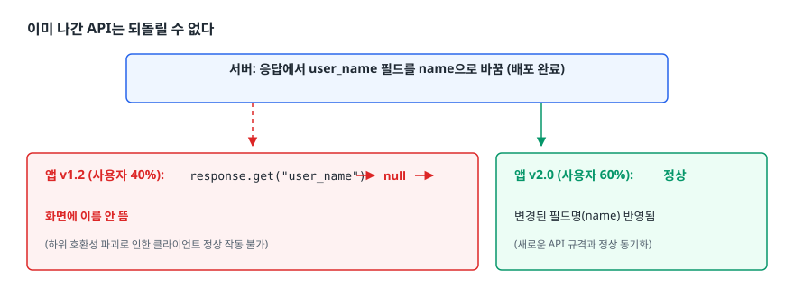
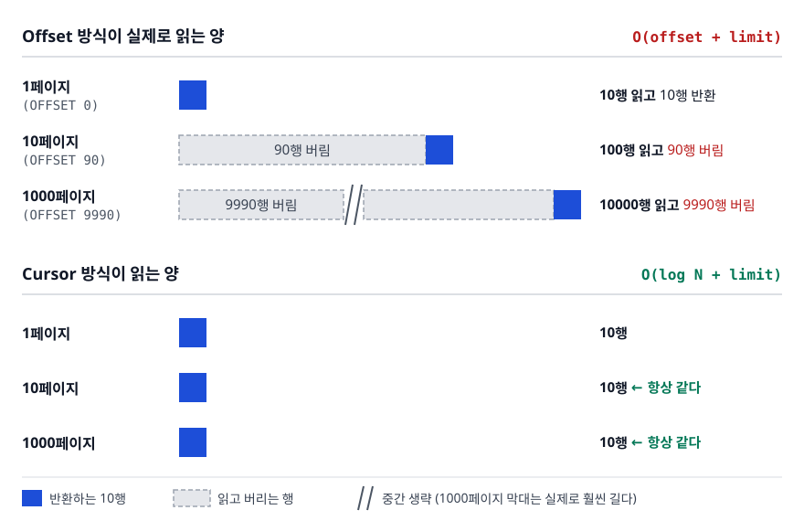
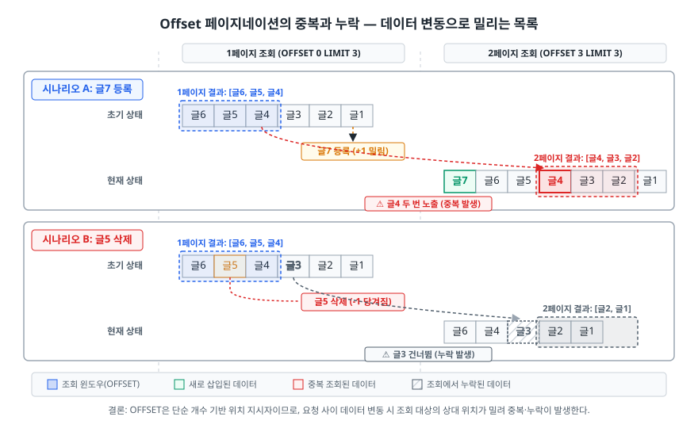
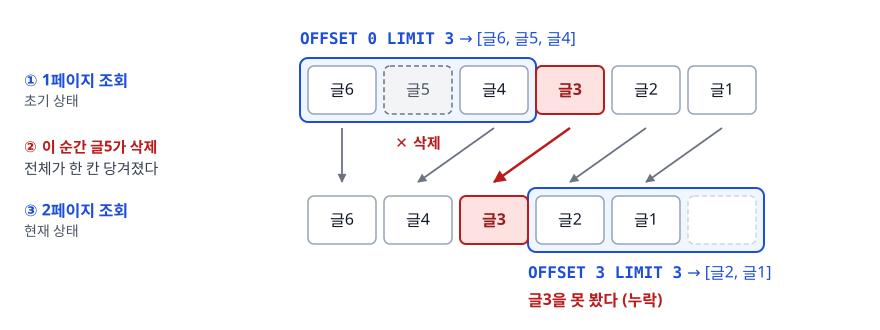
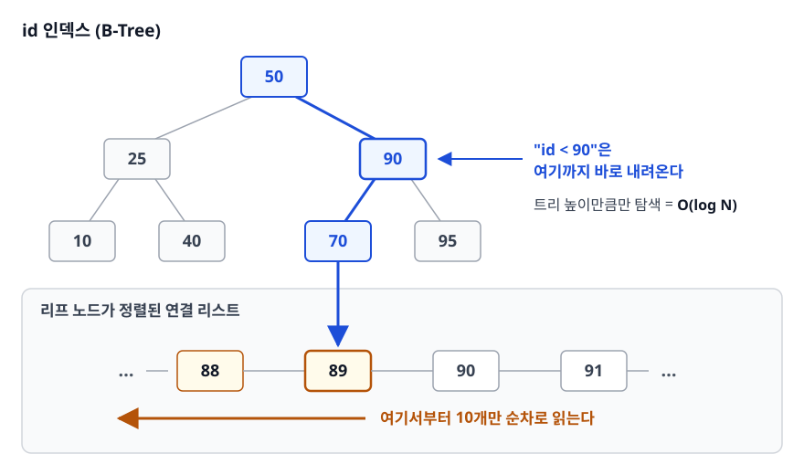
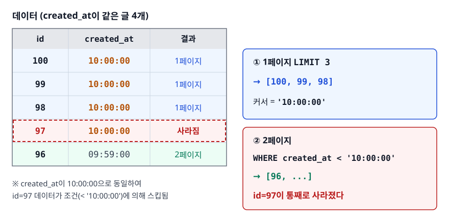

# API 버저닝과 페이지네이션 (API Versioning & Pagination)

> 이미 나간 API를 안 깨고 바꾸려면 어떻게 해야 할까요? 목록 조회가 뒤 페이지로 갈수록 느려지는 이유와 그 해법은 SQL 수준에서 짚습니다.

## 학습 목표

- [ ] 버저닝 4가지 방식의 장단점을 대고 하나를 근거 있게 고를 수 있다
- [ ] 어떤 변경이 하위 호환을 깨는지 판정할 수 있다
- [ ] Offset 페이지네이션이 왜 느려지고 왜 중복/누락이 나는지 설명할 수 있다
- [ ] Cursor 페이지네이션의 SQL을 직접 쓰고 필요한 인덱스를 말할 수 있다
- [ ] 정렬 키에 유일성이 필요한 이유를 반례로 설명할 수 있다

## 선행 지식

- [01-rest-api-design.md](./01-rest-api-design.md) - URI 설계와 상태 코드
- SQL의 `ORDER BY`, `LIMIT`, `OFFSET`
- [B-Tree 인덱스](../02-backend-engineering/database/05-indexing-btree.md) - 커서 방식의 성능 근거를 이해하려면 도움이 됩니다

---

## 1. 왜 필요한가

### 이미 나간 API는 되돌릴 수 없다

웹만 서비스한다면 API를 바꿔도 큰 문제가 없습니다. 서버와 프론트를 같이 배포하면 그만입니다. 문제는 **내가 배포 시점을 통제할 수 없는 클라이언트**가 생기는 순간입니다.

- 모바일 앱: 사용자가 업데이트를 안 하면 6개월 전 버전이 지금도 돌고 있습니다
- 외부 파트너: 내 사정으로 남의 코드를 고치게 만들 수 없습니다
- 사내 다른 팀: 배포 일정이 다릅니다

<!-- diagram:api-versioning-pagination-1 -->


<!-- 위 그림이 대체한 원본 ASCII.
     내용을 고칠 때는 그림도 함께 갱신할 것.
```
서버:  응답에서 user_name 필드를 name으로 바꿈 (배포 완료)
                    ▼
앱 v1.2 (사용자 40%): response.get("user_name") → null → 화면에 이름 안 뜸
앱 v2.0 (사용자 60%): 정상
```
-->

이 상황을 만들지 않으려면 두 가지 중 하나를 해야 합니다. **변경을 호환되게 설계하거나, 버전을 나눠 병행 운영하거나.**

### 목록은 한 번에 다 줄 수 없다

두 번째 주제인 페이지네이션의 이유는 더 단순합니다. 게시글이 100만 건인데 `GET /posts`가 전부 내려주면 서버 메모리도 네트워크도 클라이언트 렌더링도 전부 터집니다. 그래서 잘라서 줍니다. **"어디서부터 잘라줄지"를 어떻게 지정하느냐가 문제인데**, 여기서 방식이 갈립니다. 방식에 따라 성능과 정합성이 완전히 달라집니다.

> **비유**: 읽던 책을 덮으며 무엇을 적어두느냐의 차이입니다. Offset은 "83쪽"이라고 쪽 번호를 적는 것이고, 커서는 "'그날 밤 그는 떠났다'라는 문장까지 읽었다"라고 내용을 적는 것입니다. 앞쪽에 페이지가 끼워지거나 빠지면 쪽 번호는 엉뚱한 곳을 가리키지만, 문장은 여전히 정확히 그 지점을 가리킵니다.
>
> **비유의 한계**: 책에서는 그 문장을 다시 찾으려면 결국 처음부터 훑어야 합니다. DB는 다릅니다. 인덱스가 있어 그 지점으로 곧장 내려갑니다. 커서 방식이 느려지지 않는 이유가 이 차이에 있습니다.

---

## 2. 버저닝 4가지 방식

| 방식 | 예시 | 장점 | 단점 |
|------|------|------|------|
| URI 경로 | `GET /v1/users/1` | 눈에 바로 보임, 브라우저 주소창으로 테스트 가능, URL이 캐시 키라 캐싱이 자연스러움 | 같은 자원에 URI가 여러 개 생김(REST 철학상 어색), 라우팅 코드가 버전만큼 늘어남 |
| 커스텀 헤더 | `X-API-Version: 1` | URI가 깔끔, 자원 하나에 URI 하나 유지 | 브라우저에서 못 눌러봄, 로그·모니터링에서 버전이 안 보여 디버깅이 번거로움 |
| 쿼리 파라미터 | `GET /users/1?version=1` | 도입이 가장 쉬움, 기본값 지정 가능 | 버전 생략 시 동작이 모호, 캐시 키가 파라미터까지 포함해야 해서 설정 실수가 잦음 |
| 미디어 타입 | `Accept: application/vnd.example.v1+json` | HTTP 콘텐츠 협상 메커니즘을 그대로 활용. 이론적으로 가장 REST다움 | 학습 비용이 높고 클라이언트 구현이 번거로움, 실무 채택률이 낮음 |

> 표 요약: **실무의 기본값은 URI 경로 방식**입니다. 이론적 우아함보다 "장애 났을 때 로그만 보고 어느 버전인지 즉시 알 수 있는가"가 더 큰 가치를 갖기 때문입니다.

다만 대형 공개 API가 전부 경로 방식인 것은 아닙니다. Stripe는 계정마다 고정되는 날짜 기반 버전을 `Stripe-Version` 헤더로 덮어쓰게 하고, GitHub REST API도 URL에 버전을 두지 않고 `X-GitHub-Api-Version` 같은 헤더로 날짜 버전을 받습니다. 버전을 매우 자주 올리는 API일수록 URI에 버전을 박는 부담이 커져 헤더 쪽으로 기운다고 보면 대체로 맞습니다. **어느 방식이든 공통점은 "버전이 요청에 명시적으로 드러난다"는 것**입니다. 최악은 버전 표기가 아예 없어 서버가 조용히 동작을 바꾸는 경우입니다.

Spring에서는 컨트롤러를 분리하면 됩니다.

```java
@RestController
@RequestMapping("/v1/users")
public class UserControllerV1 {
    @GetMapping("/{id}")
    public UserV1Response get(@PathVariable Long id) { ... }
}

@RestController
@RequestMapping("/v2/users")
public class UserControllerV2 {
    @GetMapping("/{id}")
    public UserV2Response get(@PathVariable Long id) { ... }
}
```

여기서 중요한 원칙이 하나 있습니다. **버전은 컨트롤러와 응답 DTO에서만 갈라지고, 서비스·도메인 계층은 하나로 유지합니다.** 서비스까지 복제하면 버그 수정을 두 곳에 해야 하고, 한쪽만 고쳐서 v1과 v2의 동작이 미묘하게 달라지는 사고가 납니다.

### 버전은 몇 개까지 유지하나

동시에 유지하는 버전이 늘어날수록 테스트 조합과 유지보수 비용이 곱으로 늘어납니다. 그래서 실무에서는 **동시 유지 버전을 최대 2개로 제한하고, 새 버전을 내면 구 버전에 종료 일정을 붙이는** 방식을 씁니다.

```http
HTTP/1.1 200 OK
Sunset: Thu, 31 Dec 2026 23:59:59 GMT
Link: <https://api.example.com/v2/users>; rel="successor-version"
```

`Sunset` 헤더는 RFC 8594로 정의됐고 "이 응답을 주는 자원이 언제 사라지는지"를 HTTP 날짜로 알립니다. 함께 쓰이는 `Deprecation` 헤더도 별도로 규격화됐는데, **값 형식이 명세를 거치며 바뀌었으니**(초기 초안의 `true` 같은 표기와 이후 명세의 날짜 표기가 다릅니다) 도입할 때 최신 명세를 확인하는 편이 좋습니다. 어느 쪽이든 목적은 같습니다. 클라이언트 개발자가 로그나 모니터링에서 이 헤더를 보고 마이그레이션을 준비할 시간을 갖게 하는 것입니다.

헤더만 믿어서는 안 됩니다. 응답 헤더를 실제로 들여다보는 클라이언트 개발자는 많지 않습니다. 그래서 실무에서는 헤더와 별개로 문서 공지·이메일·대시보드 경고를 함께 돌립니다.

---

## 3. 깨는 변경과 안 깨는 변경

판정 기준은 하나입니다. **기존 클라이언트가 코드를 한 줄도 안 고치고 그대로 동작하는가.**

### 안 깨는 변경 (Non-breaking)

```json
// 이전
{ "id": 1, "name": "김개발" }

// 이후 — 필드 추가
{ "id": 1, "name": "김개발", "email": "kim@example.com" }
```

기존 클라이언트는 모르는 필드를 그냥 무시합니다. 그래서 **응답에 필드를 추가하는 것은 안전합니다.** 마찬가지로 새 엔드포인트 추가, 선택적 요청 파라미터 추가, 기존 자원에 새 메서드 추가도 안전합니다.

단서가 하나 있습니다. 클라이언트가 **엄격한 스키마 검증**(모르는 필드가 오면 예외를 던지는 설정)을 켜뒀다면 필드 추가도 깨집니다. Jackson의 `FAIL_ON_UNKNOWN_PROPERTIES`가 그 예입니다. 그래서 API를 제공하는 쪽은 문서에 "필드는 언제든 추가될 수 있으니 모르는 필드는 무시하라"고 명시해두는 것이 관례입니다.

### 깨는 변경 (Breaking)

```json
// ① 필드 이름 변경 / 삭제
{ "user_name": "김개발" }  →  { "name": "김개발" }
// 기존 코드: response.get("user_name")  →  null

// ② 타입 변경
{ "price": 5000 }  →  { "price": "5000" }
// 기존 코드: response.getInt("price")  →  파싱 예외

// ③ 응답 구조 변경
{ "user": { "name": "김개발" } }  →  { "users": [{ "name": "김개발" }] }
// 기존 코드: response.user.name  →  undefined

// ④ enum 값 변경
{ "status": "PENDING" }  →  { "status": "WAITING" }
// 기존 코드: switch(status) { case "PENDING": ... }  →  분기 실패
```

요청 쪽도 마찬가지입니다. **필수 파라미터 추가**는 기존 클라이언트가 그 값을 보내지 않으니 400을 받습니다. **검증 규칙을 강화**하는 것(길이 제한을 100자에서 50자로)도 깨는 변경입니다.

### 어떻게든 깨지 않고 바꾸는 기법

이름을 `user_name`에서 `name`으로 바꾸고 싶다면, 버전을 올리지 않고도 처리할 수 있습니다.

```
1단계  새 필드를 추가하고 둘 다 내려준다 (안 깨는 변경)
       { "user_name": "김개발", "name": "김개발" }

2단계  user_name에 Deprecation 표시 + 문서 공지 + Sunset 날짜 명시

3단계  모니터링으로 "user_name을 실제로 읽는 클라이언트"가 남았는지 확인
       (GraphQL과 달리 REST는 응답 필드 사용 여부를 서버가 알 수 없으므로
        보통 클라이언트 버전 분포로 추정한다)

4단계  Sunset 날짜 이후 제거
```

시간은 걸리지만 버전을 나누는 비용보다 훨씬 쌉니다. **가능하면 버전을 올리지 않는 것이 최선의 버전 전략**이라는 말이 여기서 나옵니다.

---

## 4. Offset 페이지네이션 — 단순하지만 두 가지 문제

```
GET /posts?page=2&size=10
```

```sql
SELECT * FROM posts
ORDER BY id DESC
LIMIT 10 OFFSET 10;
```

가장 흔하고 구현이 쉽습니다. 페이지 번호를 보여줄 수 있고 "5페이지로 바로 이동"이 가능합니다. 그런데 두 가지 문제가 있습니다.

### 문제 1 — 뒤로 갈수록 느려진다

`OFFSET 9990`은 DB가 9990개를 **건너뛰는** 것이 아니라 **읽고 버리는** 것입니다.

<!-- diagram:api-versioning-pagination-2 -->


<!-- 위 그림이 대체한 원본 ASCII.
     내용을 고칠 때는 그림도 함께 갱신할 것.
```
Offset 방식이 실제로 읽는 양

1페이지    (OFFSET 0)     [■■■■■■■■■■]                       10행 읽고 10행 반환
10페이지   (OFFSET 90)    [□□□□□□□□□ ... □□□■■■■■■■■■■]      100행 읽고 90행 버림
1000페이지 (OFFSET 9990)  [□□□□□□□ ... 9990행 버림 ... □□□■■■■■■■■■■]
                                                        10000행 읽고 9990행 버림

Cursor 방식이 읽는 양

1페이지    [■■■■■■■■■■]  10행
10페이지   [■■■■■■■■■■]  10행   ← 항상 같다
1000페이지 [■■■■■■■■■■]  10행   ← 항상 같다
```
-->

시간 복잡도로 쓰면 Offset은 O(offset + limit)이고 커서 방식은 O(log N + limit)입니다. 이것을 **deep pagination 문제**라고 부릅니다. 사용자가 1000페이지까지 갈 일이 있냐고 되물을 수 있는데, 검색 엔진 크롤러와 데이터를 긁어가는 스크립트는 실제로 그렇게 합니다. 관리자 페이지에서 "마지막 페이지" 버튼 하나가 DB를 멈추게 만드는 사고도 이 패턴입니다.

`COUNT(*)`도 문제입니다. 페이지 번호를 그리려면 전체 개수가 필요한데, 수백만 행 테이블의 `COUNT(*)`는 그 자체로 무겁습니다. 그래서 "총 1,234,567건" 대신 "다음 페이지 있음/없음"만 주거나, 개수를 캐싱하거나, 근사치를 쓰는 절충을 합니다.

### 문제 2 — 페이지를 넘기는 사이 데이터가 움직인다

<!-- diagram:api-versioning-pagination -->


<!-- 위 그림이 대체한 원본 ASCII.
     내용을 고칠 때는 그림도 함께 갱신할 것.
```
초기 상태 (최신순):  [글6, 글5, 글4, 글3, 글2, 글1]

내가 1페이지 조회:   OFFSET 0 LIMIT 3  →  [글6, 글5, 글4]

── 이 순간 누군가 글7을 등록 ──

현재 상태:          [글7, 글6, 글5, 글4, 글3, 글2, 글1]
                            ↑ 전체가 한 칸씩 밀렸다

내가 2페이지 조회:   OFFSET 3 LIMIT 3  →  [글4, 글3, 글2]
                                           ↑ 글4를 또 봤다 (중복)
```
-->

반대로 삭제되면 누락이 납니다.

<!-- diagram:api-versioning-pagination-3 -->


<!-- 위 그림이 대체한 원본 ASCII.
     내용을 고칠 때는 그림도 함께 갱신할 것.
```
초기 상태:          [글6, 글5, 글4, 글3, 글2, 글1]
1페이지:            [글6, 글5, 글4]

── 이 순간 글5가 삭제 ──

현재 상태:          [글6, 글4, 글3, 글2, 글1]
                            ↑ 전체가 한 칸 당겨졌다

2페이지:            OFFSET 3 LIMIT 3  →  [글2, 글1]
                                           글3을 못 봤다 (누락)
```
-->

OFFSET은 "앞에서 3개 버려"라는 **위치 기반** 지시라서, 그 위치가 가리키는 대상이 바뀐 것을 알 방법이 없습니다. 무한 스크롤에서 같은 게시글이 두 번 나오는 현상의 대부분이 이것입니다.

---

## 5. Cursor 페이지네이션 — 위치가 아니라 값을 기준으로

아이디어는 간단합니다. <strong>"몇 개 건너뛰어"가 아니라 "내가 마지막으로 본 게 이거였으니 그 다음부터 줘"</strong>라고 말합니다.

```
GET /posts?size=10
GET /posts?cursor=eyJpZCI6OTB9&size=10
```

```sql
-- 첫 페이지
SELECT id, title, created_at FROM posts
ORDER BY id DESC
LIMIT 10;

-- 다음 페이지 (마지막으로 본 id가 90)
SELECT id, title, created_at FROM posts
WHERE id < 90
ORDER BY id DESC
LIMIT 10;
```

### 왜 빠른가

<!-- diagram:api-versioning-pagination-4 -->


<!-- 위 그림이 대체한 원본 ASCII.
     내용을 고칠 때는 그림도 함께 갱신할 것.
```
id 인덱스 (B-Tree)

                  [50]
              ┌────┴────┐
           [25]        [90]        ← "id < 90"은 여기까지 바로 내려온다
          ┌─┴─┐       ┌─┴─┐          트리 높이만큼만 탐색 = O(log N)
        [10] [40]  [70] [95]
                     │
       ─── 리프 노드가 정렬된 연결 리스트 ───
       ... [88] [89] [90] [91] ...
                  ◄────  여기서부터 10개만 순차로 읽는다
```
-->

인덱스로 시작 위치를 한 번에 찾고, 거기서 필요한 만큼만 읽습니다. **버리는 행이 없습니다.** 데이터가 1억 건이어도 트리 높이는 몇 단계 늘지 않으므로 성능이 사실상 일정합니다.

### 왜 정합성이 지켜지는가

```
1페이지:  [글6, 글5, 글4]   →  cursor = 4 (마지막으로 본 값)

── 글7 등록되든 글5 삭제되든 상관없다 ──

2페이지:  WHERE id < 4  →  [글3, 글2, 글1]
```

기준이 "앞에서 3번째"가 아니라 "값이 4보다 작은 것"이므로, 앞쪽에서 무슨 일이 일어나도 영향을 받지 않습니다.

### 대가

- **임의 페이지 이동이 불가능합니다.** "7페이지로 가기"를 하려면 1~6페이지를 순서대로 거쳐야 커서를 알 수 있습니다. 그래서 페이지 번호 UI를 만들 수 없습니다.
- **전체 개수를 알기 어렵습니다.** 별도 `COUNT` 쿼리를 돌려야 합니다.
- **정렬 기준을 바꾸면 커서가 무의미해집니다.** 커서는 특정 정렬 순서 위의 위치이기 때문입니다.

| 기준 | Offset | Cursor |
|------|--------|--------|
| 동작 | 앞에서 N개 읽고 버림 | 값 조건으로 시작 위치를 시크 |
| 깊은 페이지 성능 | O(offset + limit), 선형 악화 | O(log N + limit), 일정 |
| 데이터 변경 시 | 중복·누락 발생 | 영향 없음 |
| 임의 페이지 이동 | 가능 | 불가능 (순차만) |
| 전체 개수 표시 | `COUNT(*)`로 가능(무겁다) | 사실상 포기하거나 별도 계산 |
| 구현 난이도 | 낮음 | 중간 |
| 어울리는 화면 | 관리자 목록, 페이지 번호 있는 게시판 | 무한 스크롤 피드, 알림, 채팅 |

> 표 요약: **페이지 번호를 화면에 보여줘야 하면 Offset, 아래로 계속 스크롤하는 화면이면 Cursor.** UI 요구사항이 사실상 방식을 결정합니다.

---

## 6. 정렬 키 선택 — 여기서 가장 많이 틀린다

커서 방식의 함정은 **정렬 키가 유일하지 않을 때** 나타납니다.

```sql
-- 위험한 커서: created_at만 사용
SELECT * FROM posts
WHERE created_at < '2026-07-26 10:00:00'
ORDER BY created_at DESC
LIMIT 3;
```

`created_at`이 같은 행이 여러 개면 어떻게 될까요?

<!-- diagram:api-versioning-pagination-5 -->


<!-- 위 그림이 대체한 원본 ASCII.
     내용을 고칠 때는 그림도 함께 갱신할 것.
```
데이터 (created_at이 같은 글 4개)

  id=100  created_at = 10:00:00
  id=99   created_at = 10:00:00
  id=98   created_at = 10:00:00
  id=97   created_at = 10:00:00
  id=96   created_at = 09:59:00

1페이지 LIMIT 3  →  [100, 99, 98]   커서 = '10:00:00'
2페이지 WHERE created_at < '10:00:00'
                 →  [96, ...]        ← id=97이 통째로 사라졌다
```
-->

`<` 조건이 같은 시각의 나머지 행까지 전부 잘라내기 때문입니다. `<=`로 바꾸면 이번엔 100, 99, 98이 다시 나옵니다. **어느 쪽이든 틀립니다.**

해결책은 **유일성이 보장되는 키를 마지막에 붙여 복합 커서를 만드는 것**입니다.

```sql
-- 안전한 커서: (created_at, id) 복합 조건
SELECT id, title, created_at FROM posts
WHERE (created_at, id) < ('2026-07-26 10:00:00', 98)
ORDER BY created_at DESC, id DESC
LIMIT 3;
```

`(a, b) < (x, y)` 형태는 **행 값 비교**(row value comparison)로, 값이 널이 아닌 한 `a < x OR (a = x AND b < y)`와 같은 뜻입니다. 표준 SQL 문법이고 PostgreSQL, MySQL, MariaDB에서 쓸 수 있습니다. 다만 **모든 DB가 부등호 행 값 비교를 지원하지는 않고**(SQL Server가 대표적입니다), 지원하더라도 **옵티마이저가 이것을 인덱스 범위 스캔으로 풀어주는지는 DB와 버전에 따라 다르므로** 도입 전에 실행 계획을 한 번 찍어보는 것이 안전합니다. 안 되면 `OR` 조건으로 직접 풀어 쓰면 되고, 결과는 같습니다. 그래도 이 문법을 쓰는 이유는 조건이 세 개 이상으로 늘어날 때 `OR`로 푼 식보다 훨씬 읽기 쉽기 때문입니다.

주의할 점이 하나 있습니다. 행 값 비교는 **모든 정렬 키의 방향이 같을 때만** 그대로 쓸 수 있습니다. `ORDER BY created_at DESC, id ASC`처럼 방향이 섞이면 `(created_at, id) < (...)`가 의도한 순서와 어긋나므로, 이때는 `OR` 조건으로 직접 풀어 써야 합니다.

인덱스는 정렬 순서와 같은 컬럼 순서로 만듭니다.

```sql
CREATE INDEX idx_posts_created_id ON posts (created_at, id);
```

`ORDER BY created_at DESC, id DESC`는 이 인덱스를 역방향으로 스캔하면 되므로, 오름차순 인덱스 하나로 양방향 모두 커버됩니다.

### 커서를 그대로 노출하지 않는 이유

```
cursor=eyJjcmVhdGVkQXQiOiIyMDI2LTA3LTI2VDEwOjAwOjAwIiwiaWQiOjk4fQ
       (Base64로 인코딩된 {"createdAt":"2026-07-26T10:00:00","id":98})
```

`cursor=98`처럼 날것으로 주면 두 가지 문제가 생깁니다. 클라이언트가 그 값을 "id"라고 해석해 임의로 조작하기 시작합니다. 나중에 정렬 기준을 `(created_at, id)`로 바꿀 때는 커서 포맷이 바뀌어 하위 호환이 깨집니다. Base64로 감싸두면 **불투명한 토큰**이 되어 클라이언트가 내부 구조에 의존하지 않게 됩니다.

**Base64는 암호화가 아닙니다.** 누구나 디코딩할 수 있으므로 커서에 민감한 정보를 넣으면 안 되고, 조작을 실제로 막아야 한다면 서명(HMAC)을 붙여야 합니다. Base64의 목적은 보안이 아니라 **의존을 끊는 것**입니다.

### 응답 형태

```json
{
  "data": [
    { "id": 98, "title": "커서 페이지네이션" }
  ],
  "page": {
    "nextCursor": "eyJjcmVhdGVkQXQiOiIyMDI2LTA3LTI2VDEwOjAwOjAwIiwiaWQiOjk4fQ",
    "hasNext": true
  }
}
```

`hasNext`를 정확히 계산하는 방법은 **`limit + 1`개를 조회하는 것**입니다. 11개를 요청해 11개가 오면 다음 페이지가 있는 것이고, 클라이언트에는 10개만 내려줍니다. 별도 `COUNT` 쿼리 없이 판정할 수 있습니다.

---

## 7. 실무에서는

- **커서 페이지네이션과 검색·필터는 잘 안 맞습니다.** 정렬 기준이 "관련도 점수"처럼 계산값이면 커서로 표현하기 어렵습니다. 이런 경우 검색 엔진(Elasticsearch 계열)이 제공하는 전용 페이징 기능을 쓰거나, 결과 개수를 상한선으로 잘라 Offset을 씁니다.
- **Offset을 쓰더라도 최대 페이지를 제한**하는 것이 실무 방어책입니다. `page > 1000`이면 400을 내려버리면 deep pagination으로 인한 장애를 막을 수 있습니다.
- **`size` 파라미터에 상한을 둡니다.** `?size=100000`을 그대로 처리하면 그 자체가 공격이 됩니다. 보통 100 정도로 자르고 기본값은 20 안팎으로 둡니다.
- **커서를 클라이언트가 오래 보관하는 경우**를 고려해야 합니다. 커서가 가리키던 행이 삭제돼도 `WHERE (created_at, id) < (...)` 조건은 여전히 유효하므로 대개 문제없이 동작합니다. 이것도 커서 방식의 장점 중 하나입니다.
- **버저닝은 처음부터 `/v1`을 붙여 시작합니다.** 나중에 붙이려면 기존 `/users`를 유지하면서 `/v2/users`를 만드는 어색한 구조가 되고, "버전 없는 것이 v1"이라는 암묵적 규칙을 문서로 설명해야 합니다.

---

## 8. 면접 포인트

> 면접에서 이 주제가 나오면 이렇게 답한다

**Q. API 버전 관리는 어떻게 하시겠습니까?**

A. 먼저 버전을 올리지 않는 방법을 찾습니다. 응답 필드 추가나 선택적 파라미터 추가는 하위 호환을 깨지 않으므로 버전 없이 처리합니다. 필드 이름을 바꿔야 한다면 새 필드를 함께 내려주면서 옛 필드에 Deprecation과 Sunset 헤더를 붙여 유예 기간을 둡니다. 그래도 깨야 한다면 URI 경로 방식으로 `/v2`를 만듭니다. 헤더나 미디어 타입 방식이 REST 철학에는 더 맞지만, 로그와 모니터링에서 버전이 바로 보이고 브라우저로 테스트할 수 있다는 실용성 때문에 실무에서는 경로 방식이 가장 흔합니다. 반대로 Stripe나 GitHub처럼 버전을 자주 올리는 공개 API는 날짜 기반 버전을 헤더로 받기도 합니다.
- 꼬리 질문: "v1과 v2 코드는 어떻게 관리하나요?" → 컨트롤러와 응답 DTO만 분리하고 서비스·도메인 계층은 하나로 유지한다고 답합니다. 서비스까지 복제하면 버그 수정이 두 곳으로 갈라집니다.

**Q. Offset 페이지네이션의 문제가 무엇인가요?**

A. 두 가지입니다. 성능 면에서 `OFFSET N`은 DB가 N개를 읽고 버리는 동작이라 뒤 페이지로 갈수록 선형으로 느려집니다. 이걸 deep pagination 문제라고 합니다. 정합성 면에서는 페이지를 넘기는 사이에 앞쪽 데이터가 추가되거나 삭제되면 전체가 밀리거나 당겨져서 같은 항목이 두 번 나오거나 아예 건너뛰어집니다. OFFSET은 위치 기반 지시라서 그 위치가 가리키는 대상이 바뀐 것을 알 수 없기 때문입니다.
- 꼬리 질문: "그럼 Offset은 쓰면 안 되나요?" → 페이지 번호 UI가 필요한 관리자 화면 등에서는 여전히 적합하며, 최대 페이지 제한을 걸어 방어한다고 답합니다.

**Q. Cursor 페이지네이션은 어떻게 구현하나요?**

A. 마지막으로 조회한 행의 정렬 키 값을 커서로 삼고, 다음 요청에서 `WHERE (created_at, id) < (커서값)` 조건으로 시작 위치를 잡습니다. 인덱스 시크 한 번으로 시작점을 찾으므로 데이터가 얼마든 성능이 일정합니다. 여기서 중요한 것은 정렬 키의 유일성인데, `created_at`만 쓰면 같은 시각의 행들이 통째로 잘리거나 중복됩니다. 그래서 PK를 마지막 정렬 키로 붙인 복합 커서를 쓰고, 인덱스도 `(created_at, id)` 순서로 만듭니다. 커서 자체는 Base64로 인코딩해 클라이언트가 내부 구조에 의존하지 못하게 합니다.
- 꼬리 질문: "다음 페이지가 있는지는 어떻게 아나요?" → `limit + 1`개를 조회해 초과분이 오면 다음 페이지가 있다고 판정하고, 응답에는 `limit`개만 내린다고 답합니다.

**Q. 어떤 API 변경이 하위 호환을 깨나요?**

A. 판정 기준은 "기존 클라이언트가 코드를 안 고치고 그대로 동작하는가"입니다. 응답 필드 추가, 새 엔드포인트 추가, 선택적 요청 파라미터 추가는 안전합니다. 반대로 필드 삭제나 이름 변경, 타입 변경, 응답 구조 변경, enum 값 변경, 필수 파라미터 추가, 검증 규칙 강화는 깨는 변경입니다. 주의할 점이 하나 있습니다. 필드 추가도 클라이언트가 모르는 필드에 예외를 던지도록 설정돼 있으면 깨집니다. 그래서 API 문서에 "모르는 필드는 무시하라"를 명시해두는 것이 관례입니다.
- 꼬리 질문: "필드를 꼭 지워야 하면요?" → 새 필드를 병행 제공 → Deprecation/Sunset 공지 → 유예 기간 후 제거의 3단계로 진행한다고 답합니다.

---

## 자주 하는 실수

| 실수 | 왜 틀렸나 | 올바른 이해 |
|------|----------|-----------|
| "OFFSET은 인덱스로 건너뛰니까 빠르다" | 일반적인 실행 계획에서 OFFSET은 앞의 행을 실제로 읽고 버린다 | 뒤 페이지일수록 읽고 버리는 양이 선형으로 늘어난다 |
| "커서는 항상 PK를 쓰면 된다" | 정렬 기준이 PK가 아니면(최신순, 인기순) PK만으로는 위치를 특정할 수 없다 | 커서는 **정렬 키 전체**의 값이어야 합니다. PK는 유일성 보장을 위해 마지막에 덧붙이는 것 |
| "`created_at`만으로 커서를 만들어도 된다" | 같은 시각 데이터가 통째로 누락되거나 중복된다 | `(created_at, id)` 복합 조건으로 유일성을 확보한다 |
| "커서를 Base64로 인코딩하면 안전하다" | Base64는 인코딩이지 암호화가 아니다 | 목적은 클라이언트가 내부 구조에 의존하지 않게 하는 것. 위변조 방지가 필요하면 서명을 붙인다 |
| "응답 필드를 추가하는 것도 버전을 올려야 한다" | 클라이언트는 모르는 필드를 무시한다 | 필드 추가는 대표적인 안전한 변경. 버전 남발이 오히려 유지보수 비용을 키운다 |
| "버전은 많이 유지할수록 친절하다" | 유지 버전 수만큼 테스트·배포·장애 대응 비용이 곱해진다 | 동시 유지는 2개까지, 종료 일정을 명시하는 것이 실무 기준 |
| "무한 스크롤인데 Offset을 써도 중복은 드물다" | 새 글이 자주 올라오는 피드에서는 매우 흔하게 발생한다 | 실시간성이 있는 목록이면 커서가 사실상 필수다 |

---

## 한 줄 정리

버저닝은 "버전을 올리지 않고 바꿀 방법부터 찾고, 정 안 되면 URI 경로로 나눠 종료 일정과 함께 운영하는 것"입니다. 페이지네이션은 "위치(OFFSET)가 아니라 값(커서)을 기준으로 자르면 성능과 정합성이 동시에 해결되지만 페이지 번호를 포기해야 하는 것"입니다.

---

## 연관 개념

- [01-rest-api-design.md](./01-rest-api-design.md) - URI 설계와 컬렉션 응답을 객체로 감싸야 하는 이유
- [02-graphql-basics.md](./02-graphql-basics.md) - 버전 대신 `@deprecated`로 스키마를 진화시키는 방식
- [04-rate-limiting.md](./04-rate-limiting.md) - 깊은 페이지 요청 같은 남용 트래픽을 앞단에서 막는 방법
- [qna-api-design.md](./qna-api-design.md) - 버전 관리와 페이지네이션 면접 질문(Q3, Q4)
- [../02-backend-engineering/database/05-indexing-btree.md](../02-backend-engineering/database/05-indexing-btree.md) - 인덱스 시크가 O(log N)인 이유와 복합 인덱스 컬럼 순서
- [../02-backend-engineering/database/04-transaction-isolation.md](../02-backend-engineering/database/04-transaction-isolation.md) - 조회 중 데이터가 변하는 현상을 격리 수준 관점에서 보기
