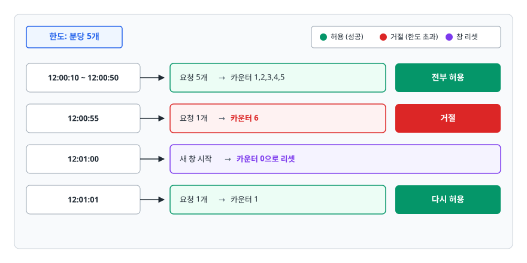
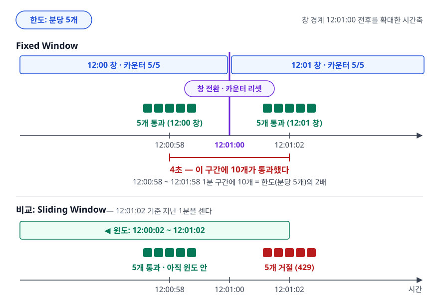
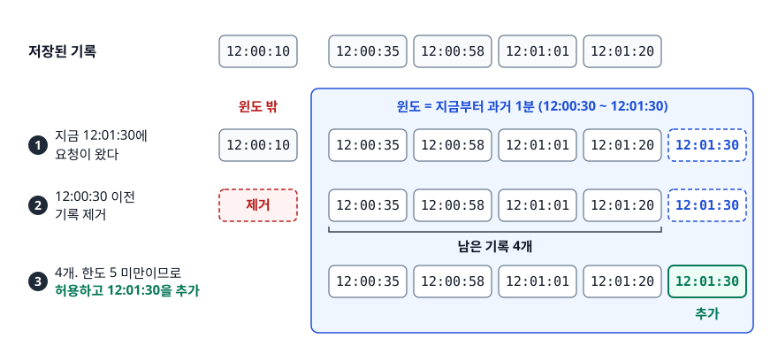
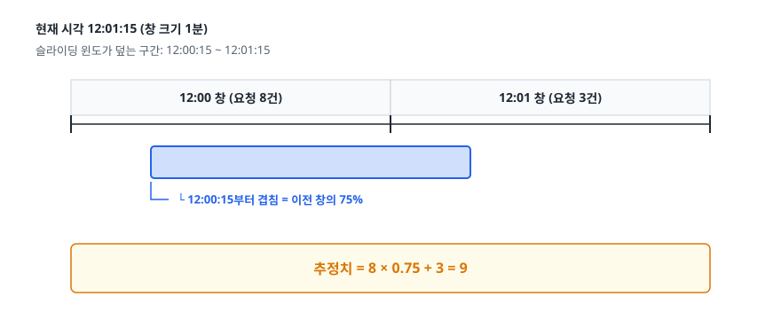
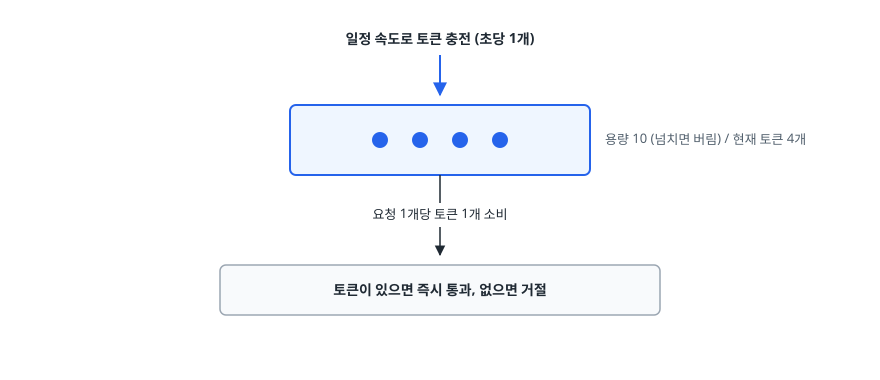
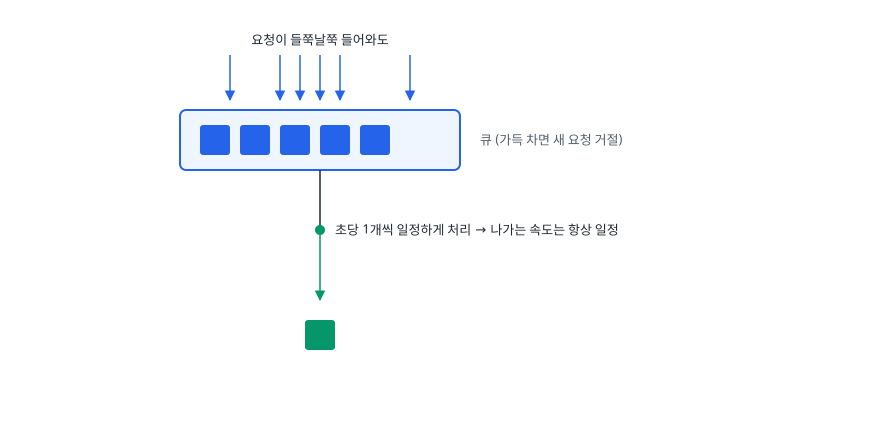
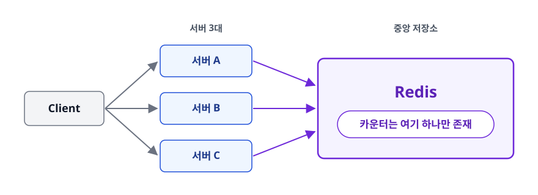
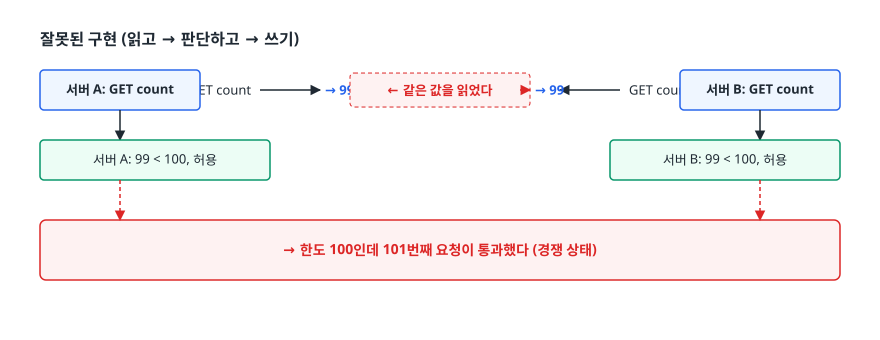

# Rate Limiting (요청 속도 제한)

> 한도는 방어용일 뿐이라는 오해가 흔합니다. 이 문서는 API에 한도를 거는 이유부터, 알고리즘 네 가지가 각각 무엇을 포기하고 무엇을 얻는지, 서버가 여러 대일 때 카운터를 어디에 둬야 하는지까지 가려냅니다.

## 학습 목표

- [ ] Rate Limiting이 필요한 이유를 남용·공정성·비용·보안 관점에서 각각 설명할 수 있다
- [ ] Fixed Window의 경계 버스트 문제를 시간축 그림으로 설명할 수 있다
- [ ] 네 가지 알고리즘을 정확도·메모리·버스트 허용 기준으로 비교하고 고를 수 있다
- [ ] 서버가 여러 대인 환경에서 왜 Redis가 필요한지, 왜 Lua 스크립트를 쓰는지 설명할 수 있다
- [ ] 429 응답에 무엇을 담아야 하고 클라이언트가 어떻게 재시도해야 하는지 안다

## 선행 지식

- [01-rest-api-design.md](./01-rest-api-design.md) - 상태 코드와 헤더 사용 기준
- Redis의 기본 자료구조(String, Hash, Sorted Set)를 알면 5절이 쉽습니다

---

## 1. 왜 필요한가

한도를 걸지 않으면 **가장 예의 없는 클라이언트 하나가 전체 서비스의 품질을 결정합니다.** 구체적으로 네 가지 문제가 생깁니다.

**① 남용과 장애 전파.** 크롤러 한 대가 초당 5000번 요청하면 DB 커넥션 풀이 고갈되고 정상 사용자의 요청까지 대기하다 타임아웃이 납니다. 악의가 없어도 결과는 같습니다. 클라이언트의 재시도 로직 버그 하나가 초당 수천 요청을 만드는 일은 드물지 않습니다.

**② 공정성.** 무료 사용자 한 명이 자원을 독점하면 유료 사용자가 느려집니다. 한도는 "누가 얼마만큼 쓸 수 있는가"를 정의하는 정책 수단이기도 합니다. API를 상품으로 파는 회사에서는 Rate Limit이 곧 요금제입니다.

**③ 비용.** 백엔드가 외부 유료 API(지도, 결제, LLM)를 대신 호출한다면 내 API의 호출 수가 그대로 청구서가 됩니다.

**④ 보안.** 로그인 API에 초당 500번 비밀번호를 시도하는 것이 브루트 포스 공격입니다. 인증 API의 Rate Limit은 성능 대책이 아니라 보안 대책입니다.

> **비유**: 놀이공원의 인기 놀이기구. 한 사람이 계속 다시 타게 두면 뒷줄이 안 줄어듭니다. 그래서 "1인당 하루 3회"를 겁니다.
>
> **비유의 한계**: 놀이공원은 줄을 세워 기다리게 합니다(Leaky Bucket에 가깝습니다). 하지만 API의 Rate Limit은 대개 기다리게 하지 않고 **바로 거절**합니다. 요청을 붙잡아 두는 것 자체가 서버 자원을 쓰는 일이기 때문입니다.

핵심 질문은 하나입니다. **"지난 얼마 동안 이 클라이언트가 몇 번 요청했는가"를 어떻게 세느냐.** 이 세는 방법이 곧 알고리즘입니다.

---

## 2. Fixed Window — 가장 단순하고 가장 많이 새는

시간을 고정된 창으로 자르고, 창마다 카운터를 하나 둡니다.

```
|── 12:00~12:01 ──|── 12:01~12:02 ──|── 12:02~12:03 ──|
     카운터=0          카운터=0          카운터=0
```

요청이 오면 현재 창의 카운터를 1 올리고, 한도를 넘으면 거절합니다. 창이 바뀌면 카운터를 0으로 리셋합니다.

<!-- diagram:api-rate-limiting-1 -->


<!-- 위 그림이 대체한 원본 ASCII.
     내용을 고칠 때는 그림도 함께 갱신할 것.
```
한도: 분당 5개

12:00:10 ~ 12:00:50  요청 5개 → 카운터 1,2,3,4,5   전부 허용
12:00:55             요청 1개 → 카운터 6           거절
12:01:00             새 창 시작 → 카운터 0으로 리셋
12:01:01             요청 1개 → 카운터 1           다시 허용
```
-->

메모리는 클라이언트당 정수 하나면 되고 구현도 몇 줄입니다. 문제는 하나뿐인데 그게 치명적입니다.

### 경계 버스트

<!-- diagram:api-fixed-window-burst -->


<!-- 위 그림이 대체한 원본 ASCII.
     내용을 고칠 때는 그림도 함께 갱신할 것.
```
한도: 분당 5개

시간축   12:00:58        12:01:00        12:01:02
          │                │                │
          ▼                ▼                ▼
        ■■■■■          [창 전환]          ■■■■■
        5개 통과       카운터 리셋        5개 통과
        (12:00 창)                       (12:01 창)

        └──────────── 4초 ────────────┘
              이 구간에 10개가 통과했다
```
-->

분당 5개 제한인데 4초 만에 10개가 지나갔습니다. 창 경계를 걸치는 구간을 노리면 **1분짜리 구간 안에서 한도의 최대 2배**를 쓸 수 있습니다. 일부러 노린 공격이 아니어도, 사용자들의 요청 시각이 특정 시점에 몰리는 서비스(정각 알림, 스케줄러)에서는 자연스럽게 벌어집니다.

---

## 3. Sliding Window — 창을 현재 시점 기준으로 움직인다

경계 문제의 원인은 창이 **고정**되어 있다는 것이었습니다. 창을 항상 "지금부터 과거 1분"으로 잡으면 문제가 사라집니다.

```
Fixed Window  |─── 12:00 ───|─── 12:01 ───|   창이 벽처럼 고정

Sliding Window   (창이 현재를 따라 계속 미끄러진다)
  12:01:00  |─── 12:00:00 ~ 12:01:00 ───|
  12:01:02       |─── 12:00:02 ~ 12:01:02 ───|
  12:01:30            |─── 12:00:30 ~ 12:01:30 ───|
```

### Sliding Window Log — 정확하지만 비싸다

모든 요청의 타임스탬프를 저장해두고, 요청이 올 때마다 윈도 밖의 기록을 지운 뒤 남은 개수를 셉니다.

<!-- diagram:api-rate-limiting-2 -->


<!-- 위 그림이 대체한 원본 ASCII.
     내용을 고칠 때는 그림도 함께 갱신할 것.
```
저장된 기록: [12:00:10, 12:00:35, 12:00:58, 12:01:01, 12:01:20]

지금 12:01:30에 요청이 왔다
  → 12:00:30 이전 기록 제거 → [12:00:35, 12:00:58, 12:01:01, 12:01:20]
  → 4개. 한도 5 미만이므로 허용하고 12:01:30을 추가
```
-->

경계 버스트가 원천적으로 없습니다. 앞 절의 공격 시나리오를 대입하면, 12:01:01 시점에 12:00:58에 넣은 5개가 아직 윈도 안에 살아 있으므로 그대로 거절됩니다. 대가는 메모리입니다. **요청 하나당 타임스탬프 하나를 저장**해야 하므로, 사용자 10만 명이 각각 최근 100건을 갖고 있으면 1000만 개의 항목이 됩니다. 한도가 큰 API에서는 쓰기 어렵습니다.

### Sliding Window Counter — 두 창을 가중평균으로 근사

메모리와 정확도를 절충한 방식입니다. 창마다 카운터만 두되(Fixed Window처럼), **이전 창의 카운터를 겹친 비율만큼 반영**합니다.

<!-- diagram:api-rate-limiting-3 -->


<!-- 위 그림이 대체한 원본 ASCII.
     내용을 고칠 때는 그림도 함께 갱신할 것.
```
현재 시각 12:01:15  (창 크기 1분)
슬라이딩 윈도가 덮는 구간: 12:00:15 ~ 12:01:15

  12:00 창 (요청 8건)          12:01 창 (요청 3건)
  |───────────────────|───────────────────|
              ▓▓▓▓▓▓▓▓▓▓▓▓▓▓▓▓▓▓▓
              └ 12:00:15부터 겹침 = 이전 창의 75%

  추정치 = 8 × 0.75 + 3 = 9
```
-->

계산식은 `추정 요청 수 = (이전 창 카운터 × 겹치는 비율) + 현재 창 카운터`입니다. 저장할 것은 창당 정수 두 개뿐이라 메모리는 Fixed Window 수준이고, 경계 버스트는 대부분 막힙니다. **정확한 값이 아니라 추정치**라서 실제 요청이 균등하게 분포하지 않으면 오차가 생기지만, 실무에서 이 오차는 대개 허용 범위입니다. Cloudflare 등이 이 방식을 쓴다고 공개한 바 있습니다.

---

## 4. Token Bucket과 Leaky Bucket

앞의 세 방식은 "센다"는 관점이었습니다. 이 둘은 "흘려보낸다"는 관점입니다.

### Token Bucket — 안 쓴 만큼 모아뒀다 쓴다

<!-- diagram:api-rate-limiting-4 -->


<!-- 위 그림이 대체한 원본 ASCII.
     내용을 고칠 때는 그림도 함께 갱신할 것.
```
   일정 속도로 토큰 충전 (초당 1개)
            │
            ▼
   ┌──────────────────┐
   │  ●  ●  ●  ●      │  용량 10 (넘치면 버림) / 현재 토큰 4개
   └─────────┬────────┘
             │ 요청 1개당 토큰 1개 소비
             ▼
   토큰이 있으면 즉시 통과, 없으면 거절
```
-->

초기 토큰이 10개면 요청 10개가 한꺼번에 와도 전부 즉시 통과하고 11번째부터 거절됩니다. 5초가 지나면 토큰이 5개 채워져 다시 5개를 처리할 수 있습니다.

핵심 성질은 **버스트를 의도적으로 허용한다**는 데 있습니다. 평소에 요청이 적으면 토큰이 쌓이고, 이벤트 시작처럼 순간 트래픽이 몰릴 때 쌓아둔 토큰으로 흡수합니다. 장기 평균 속도는 충전 속도로 제한하면서, 순간의 여유는 줍니다.

Fixed Window의 경계 버스트와는 성격이 완전히 다릅니다. 저쪽은 **의도치 않게 새는 구멍**이고, 이쪽은 **용량(capacity) 파라미터로 명시적으로 통제되는 버스트 한도**입니다. 버스트를 원하지 않으면 용량을 충전 속도와 같게 두면 됩니다.

### Leaky Bucket — 출력 속도를 일정하게

<!-- diagram:api-rate-limiting-5 -->


<!-- 위 그림이 대체한 원본 ASCII.
     내용을 고칠 때는 그림도 함께 갱신할 것.
```
   요청이 들쭉날쭉 들어와도
     ↓  ↓↓↓↓   ↓
   ┌─────────────┐
   │ ■ ■ ■ ■ ■   │  큐 (가득 차면 새 요청 거절)
   └──────┬──────┘
          ● 초당 1개씩 일정하게 처리 → 나가는 속도는 항상 일정
          ▼
```
-->

요청을 큐에 넣고 정해진 속도로 꺼내 처리합니다. 출력이 완전히 평탄해지는 대신 **대기 지연이 생깁니다.** 큐가 가득 차면 거절합니다. Token Bucket과의 차이는 한 줄입니다. Token Bucket은 토큰이 있으면 지금 당장 처리하고(버스트 O, 지연 X), Leaky Bucket은 큐에 넣고 순서대로 일정 속도로 처리합니다(버스트 X, 지연 O).

Leaky Bucket은 네트워크 장비의 트래픽 셰이핑처럼 **출력 속도 자체를 보장해야 하는 곳**에서 씁니다. 백엔드 API에서는 요청을 붙잡아 두는 것이 곧 스레드·커넥션 점유라서 부담이 크고, 그래서 Token Bucket을 훨씬 많이 씁니다.

### 비교

| 알고리즘 | 버스트 | 정확도 | 메모리 | 구현 난이도 | 어울리는 곳 |
|---------|--------|--------|--------|-----------|-----------|
| Fixed Window | 경계에서 최대 2배 (의도치 않음) | 낮음 | 매우 적음 | 쉬움 | 내부 API, 대략적 제한이면 충분한 곳 |
| Sliding Window Log | 없음 | 높음 | 많음 (요청 수 비례) | 중간 | 한도가 작고 정확성이 중요한 곳 (로그인 시도) |
| Sliding Window Counter | 거의 없음 | 중간(추정치) | 적음 | 중간 | 대규모 공개 API의 기본값 |
| Token Bucket | 용량만큼 의도적 허용 | 높음 | 적음 (버킷당 값 2개) | 중간 | 사용자 경험이 중요한 일반 API |
| Leaky Bucket | 없음 (평탄화) | 높음 | 중간 (큐) | 중간 | 다운스트림 처리 속도를 지켜야 할 때 |

> 표 요약: **잘 모르겠으면 Token Bucket이 기본값입니다.** 메모리가 적게 들고, 버스트 허용량을 파라미터 하나로 조절할 수 있으며, 대부분의 라이브러리와 API 게이트웨이가 이 방식을 기본 제공합니다. 로그인 시도처럼 "정확히 5회"가 의미 있는 곳만 Sliding Window Log로 따로 겁니다.

---

## 5. 분산 환경 — 카운터를 어디에 두는가

### 서버 로컬 카운터는 무너진다

```
한도: 분당 100회.  서버 3대에 로드밸런서로 분산

  서버 A: "이 사용자 90회 썼네, 아직 여유 있음"
  서버 B: "이 사용자 85회 썼네, 아직 여유 있음"
  서버 C: "이 사용자 95회 썼네, 아직 여유 있음"

  실제 총합 270회 — 한도의 2.7배가 통과했다
```

각 서버가 자기 메모리에 카운터를 들고 있으면 실효 한도가 **서버 대수만큼 곱해집니다.** 오토스케일링으로 서버가 늘어나면 한도가 저절로 느슨해지는 이상한 시스템이 됩니다.

<!-- diagram:api-rate-limiting-6 -->


<!-- 위 그림이 대체한 원본 ASCII.
     내용을 고칠 때는 그림도 함께 갱신할 것.
```
        ┌──> 서버 A ──┐
Client ─┼──> 서버 B ──┼──> ┌─────────┐
        └──> 서버 C ──┘    │  Redis  │  카운터는 여기 하나만 존재
                           └─────────┘
```
-->

그래서 카운터를 중앙 저장소에 둡니다. Redis가 사실상 표준인 이유는 인메모리라 빠르고, TTL이 내장돼 있어 만료 처리가 공짜이며, **단일 스레드 모델과 Lua 스크립트로 원자성을 보장**하기 때문입니다.

### 왜 Lua 스크립트인가

<!-- diagram:api-rate-limiting-7 -->


<!-- 위 그림이 대체한 원본 ASCII.
     내용을 고칠 때는 그림도 함께 갱신할 것.
```
잘못된 구현 (읽고 → 판단하고 → 쓰기)

  서버 A: GET count → 99      서버 B: GET count → 99   ← 같은 값을 읽었다
  서버 A: 99 < 100, 허용       서버 B: 99 < 100, 허용
  → 한도 100인데 101번째 요청이 통과했다 (경쟁 상태)
```
-->

읽기와 쓰기 사이에 다른 서버가 끼어들 수 있습니다. Redis의 Lua 스크립트는 **하나의 스크립트가 중간에 끊기지 않고 끝까지 실행**되므로 이 문제가 사라집니다.

### Fixed Window 구현

```lua
-- KEYS[1] = 카운터 키 (예: "rl:user:42:1690000020")
-- ARGV[1] = 창 크기(ms), ARGV[2] = 한도
local current = redis.call('INCR', KEYS[1])
if current == 1 then
  redis.call('PEXPIRE', KEYS[1], tonumber(ARGV[1]))
end
if current > tonumber(ARGV[2]) then
  return 0   -- 거절
end
return 1     -- 허용
```

`INCR`와 `PEXPIRE`를 **한 스크립트 안에 묶는 것**이 핵심입니다. 애플리케이션 코드로 두 명령을 나눠 보내면 그 사이에 프로세스가 죽었을 때 TTL 없는 키가 남습니다. 위처럼 키 이름에 창 번호를 넣는 구현이라면 다음 창은 새 키를 쓰므로 사용자가 영구 차단되지는 않지만, **만료되지 않는 키가 창이 바뀔 때마다 계속 쌓여 Redis 메모리를 갉아먹습니다.** 창 정보 없이 키 하나를 재사용하는 구현이라면 카운터가 리셋되지 않아 그 사용자는 정말로 영구 차단됩니다. 어느 쪽이든 Lua로 묶으면 생기지 않는 일입니다.

### Sliding Window Log 구현 (Sorted Set)

```lua
-- KEYS[1] = 키
-- ARGV[1] = 현재 시각(ms), ARGV[2] = 창 크기(ms)
-- ARGV[3] = 한도,          ARGV[4] = 이 요청의 고유 ID
local now    = tonumber(ARGV[1])
local window = tonumber(ARGV[2])
local limit  = tonumber(ARGV[3])

-- 1) 윈도를 벗어난 기록 제거
redis.call('ZREMRANGEBYSCORE', KEYS[1], 0, now - window)

-- 2) 남은 개수 확인
local count = redis.call('ZCARD', KEYS[1])
if count >= limit then
  return 0
end

-- 3) 이번 요청 기록
redis.call('ZADD', KEYS[1], now, ARGV[4])
redis.call('PEXPIRE', KEYS[1], window)
return 1
```

Sorted Set의 score를 타임스탬프로 쓰면 `ZREMRANGEBYSCORE`로 오래된 기록을 범위 삭제할 수 있습니다. 멤버 값에 **요청마다 다른 고유 ID**를 넣어야 한다는 점이 함정입니다. 타임스탬프를 멤버로 쓰면 같은 밀리초에 들어온 요청들이 하나로 합쳐져 카운트가 새어나갑니다.

### Token Bucket 구현

```lua
-- KEYS[1] = 버킷 키
-- ARGV[1] = 용량, ARGV[2] = 초당 충전 개수, ARGV[3] = 현재 시각(ms)
local capacity = tonumber(ARGV[1])
local rate     = tonumber(ARGV[2])
local now      = tonumber(ARGV[3])

local bucket = redis.call('HMGET', KEYS[1], 'tokens', 'ts')
local tokens = tonumber(bucket[1])
local last   = tonumber(bucket[2])

if tokens == nil then           -- 첫 요청이면 가득 찬 상태로 시작
  tokens = capacity
  last   = now
end

-- 마지막 갱신 이후 흐른 시간만큼 충전 (용량 초과분은 버린다)
local elapsed = math.max(0, now - last) / 1000
tokens = math.min(capacity, tokens + elapsed * rate)

local allowed = 0
if tokens >= 1 then
  tokens = tokens - 1
  allowed = 1
end

redis.call('HSET', KEYS[1], 'tokens', tokens, 'ts', now)
redis.call('PEXPIRE', KEYS[1], math.ceil(capacity / rate * 1000) + 1000)

return { allowed, math.floor(tokens) }   -- Lua 테이블을 반환하면 숫자는 정수로 잘리므로 직접 내림
```

여기서 눈여겨볼 점은 **토큰을 타이머로 채우지 않는다**는 데 있습니다. 사용자 수만큼 타이머를 돌리는 것은 불가능하므로, 요청이 올 때 "마지막 접근 이후 흐른 시간 × 충전 속도"를 계산해 그 자리에서 채웁니다(lazy refill). 그래서 저장할 값이 `tokens`와 `ts` 두 개뿐입니다.

현재 시각을 Redis의 `TIME`이 아니라 **애플리케이션에서 인자로 넘기는 것**도 의도적입니다. 예전 Redis는 스크립트 자체를 복제본에 그대로 흘려보냈기 때문에 스크립트 안에서 시간처럼 비결정적인 값을 읽으면 노드마다 결과가 갈릴 수 있었고, 그래서 시각을 밖에서 넘기는 관례가 굳었습니다. 지금은 명령의 결과를 복제하는 방식이 기본이라 `TIME`을 써도 되지만, 시각을 인자로 받으면 테스트에서 시간을 원하는 값으로 고정할 수 있다는 장점이 남습니다. 대신 애플리케이션 서버들의 시계가 어긋나면 그 오차가 그대로 한도 계산에 들어가므로 NTP 동기화는 전제 조건입니다.

### 무엇을 키로 삼을 것인가

| 키 | 적합한 곳 | 주의 |
|----|----------|------|
| 사용자 ID | 로그인이 필요한 API | 인증 전에는 못 쓴다 |
| API 키 | 파트너·B2B API | 키 유출 시 그 키만 막으면 된다 |
| IP 주소 | 로그인·회원가입 등 비인증 API | 회사·학교·통신사 NAT 뒤 사용자들이 한 IP를 공유해 애먼 사람이 막힌다 |
| IP + 엔드포인트 | 로그인 브루트 포스 방어 | 다른 API 사용에 영향을 주지 않는다 |

프록시나 로드밸런서 뒤에서 IP를 쓸 때 함정이 하나 있습니다. 애플리케이션이 보는 원격 주소는 로드밸런서의 IP이므로 `X-Forwarded-For` 헤더를 봐야 하는데, **이 헤더는 클라이언트가 마음대로 위조할 수 있습니다.** 신뢰할 수 있는 프록시가 붙인 값만 골라 쓰도록 설정하지 않으면, 공격자가 헤더를 매번 바꿔가며 제한을 무한히 우회합니다.

---

## 6. 429 응답과 헤더

한도를 넘으면 **429 Too Many Requests**를 내립니다.

```http
HTTP/1.1 429 Too Many Requests
Retry-After: 60
X-RateLimit-Limit: 100
X-RateLimit-Remaining: 0
X-RateLimit-Reset: 1690000080
Content-Type: application/json

{
  "code": "RATE_LIMIT_EXCEEDED",
  "message": "요청이 너무 많습니다. 60초 후 다시 시도해주세요."
}
```

- **`Retry-After`** — 표준 헤더로, 초 단위 정수 또는 HTTP 날짜를 넣습니다. 클라이언트에게 언제 다시 오라고 알려주는 유일한 표준 수단이므로 **429에는 거의 항상 붙입니다.**
- **`X-RateLimit-*`** — 한도, 남은 횟수, 리셋 시각을 알려주는 사실상의 업계 관례입니다. 표준 헤더는 아니라 서비스마다 이름이 조금씩 다르고, `X-` 접두사를 뺀 `RateLimit-*` 형태로 표준화하려는 IETF 작업도 진행 중입니다.
- 정상 응답(200)에도 `X-RateLimit-Remaining`을 함께 내려주는 것이 좋습니다. 그래야 클라이언트가 **한도에 닿기 전에** 속도를 늦출 수 있습니다. 429를 받고 나서야 알게 하는 것보다 훨씬 낫습니다.

**429와 503은 구분해서 씁니다.** 429는 "당신이 너무 많이 보냈습니다"(클라이언트 책임)이고, 503은 "우리가 지금 감당이 안 됩니다"(서버 책임)입니다. 둘 다 `Retry-After`를 붙이지만, 특정 클라이언트의 한도 초과면 429, 전체 시스템 과부하나 점검이면 503입니다.

---

## 7. 클라이언트는 어떻게 재시도해야 하나

### 안티패턴 — 고정 간격 즉시 재시도

```js
// 안티패턴
while (true) {
  const res = await fetch(url);
  if (res.status !== 429) return res;
  await sleep(1000);   // 1초 뒤 무조건 재시도
}
```

**왜 문제인가**: 두 가지가 겹칩니다. 첫째, 서버가 `Retry-After: 60`이라고 알려줬는데 무시하고 1초마다 두드리므로 서버 부하가 오히려 늘어납니다. 둘째, **동시에 429를 받은 클라이언트들이 전부 정확히 1초 뒤에 다시 옵니다.** 몰린 요청이 다시 몰려서 오는 이 현상을 thundering herd라고 하며, 장애가 회복되려는 순간 다시 무너뜨립니다.

### 개선 — 지수 백오프 + 지터

```js
// Retry-After 값은 "초 단위 정수"일 수도 "HTTP 날짜"일 수도 있다. 둘 다 ms로 환산한다.
function retryAfterMs(v) {
  if (!v) return null;
  const sec = Number(v);
  const at = Number.isFinite(sec) ? Date.now() + sec * 1000 : Date.parse(v);
  return Number.isNaN(at) ? null : Math.max(0, at - Date.now());
}

async function requestWithRetry(url, options = {}, maxRetries = 5) {
  for (let attempt = 0; ; attempt++) {
    const res = await fetch(url, options);

    // 재시도할 가치가 있는 응답인가
    const retryable = res.status === 429 || res.status >= 500;
    if (!retryable || attempt >= maxRetries) return res;

    // 서버가 알려준 시각을 우선하고, 없으면 지수 백오프(1s, 2s, 4s ... 상한 32s) + 풀 지터
    const backoff = Math.min(2 ** attempt * 1000, 32000);
    const waitMs = retryAfterMs(res.headers.get('Retry-After')) ?? Math.random() * backoff;
    await new Promise((r) => setTimeout(r, waitMs));
  }
}
```

세 가지가 핵심입니다.

1. **`Retry-After`를 존중합니다.** 서버가 아는 정보가 클라이언트의 추측보다 정확합니다.
2. **간격을 지수적으로 늘립니다.** 회복되지 않은 서버를 계속 때리지 않습니다.
3. **지터(무작위)를 섞습니다.** 이것이 없으면 백오프를 걸어도 모든 클라이언트가 같은 시각에 몰립니다. 대기 시간을 `0 ~ backoff` 사이 난수로 잡는 방식을 풀 지터(full jitter)라고 합니다.

그리고 **재시도 자체를 하면 안 되는 요청**이 있습니다. 멱등하지 않은 POST를 재시도하면 중복 생성이 일어납니다. 이 경우는 Idempotency-Key를 붙여 멱등하게 만든 뒤에 재시도해야 합니다.

---

## 8. 실무에서는

- **적용 위치는 앞단일수록 좋습니다.** API 게이트웨이나 리버스 프록시에서 막으면 애플리케이션 스레드를 쓰지 않습니다. Spring Cloud Gateway는 Redis 기반 Token Bucket 리미터를 기본 제공하고, Kong의 rate-limiting 플러그인도 저장소로 Redis를 고를 수 있습니다. 반면 **NGINX의 `limit_req`는 워커들이 공유하는 로컬 메모리 존을 쓰므로 인스턴스 단위로만 동작합니다.** NGINX를 여러 대 띄우면 앞서 본 "서버 대수만큼 한도가 곱해지는" 문제가 그대로 생기니, 전역 한도가 필요하면 별도 계층을 둬야 합니다. Java 애플리케이션 안에서 처리해야 한다면 Token Bucket을 구현한 Bucket4j가 대표적이고 Redis 백엔드를 지원합니다.
- **한도를 계층으로 나눕니다.** 전체 API에 느슨한 한도를 걸고, 로그인·비밀번호 재설정·결제 같은 민감한 엔드포인트에 훨씬 엄격한 한도를 따로 겁니다. 한도 하나로 전부 커버하려 하면 어느 쪽도 제대로 못 막습니다.
- **처음에는 차단하지 말고 관찰만 합니다.** 한도를 넘긴 요청을 로그로만 남기는 모드(shadow/dry-run)로 며칠 돌려보면 정상 사용자가 얼마나 걸리는지 알 수 있습니다. 감으로 정한 한도를 바로 켰다가 정상 트래픽을 막는 사고가 흔합니다.
- **Redis가 죽었을 때의 정책을 미리 정합니다.** 카운터를 못 읽으면 전부 막을 것인가(fail closed) 전부 통과시킬 것인가(fail open). 일반 API는 가용성을 위해 통과시키고, 로그인 API는 보안을 위해 막는 식으로 엔드포인트마다 다르게 정하는 것이 보통입니다.

---

## 9. 면접 포인트

> 면접에서 이 주제가 나오면 이렇게 답한다

**Q. Rate Limiting 알고리즘 중 무엇을 쓰시겠습니까?**

A. 일반적인 API에는 Token Bucket을 씁니다. 저장할 값이 토큰 수와 마지막 갱신 시각 두 개뿐이라 메모리가 적게 들고, 용량 파라미터로 버스트 허용량을 명시적으로 조절할 수 있어서 평소 조용하다가 순간 몰리는 트래픽을 사용자 경험을 해치지 않고 흡수할 수 있습니다. 반대로 로그인 시도 제한처럼 "정확히 5회"가 의미를 갖는 곳은 Sliding Window Log로 타임스탬프를 정확히 세는 편이 낫습니다. Fixed Window는 구현이 가장 쉽지만 창 경계에서 한도의 2배가 통과하는 문제가 있어 외부 공개 API에는 쓰기 어렵습니다.
- 꼬리 질문: "Sliding Window Counter는요?" → 두 창의 카운터를 겹친 비율로 가중평균해 추정하는 방식이며, Fixed Window 수준의 메모리로 경계 문제를 대부분 없애는 절충안이라고 답합니다.

**Q. 서버가 여러 대일 때 Rate Limiting은 어떻게 하나요?**

A. 각 서버가 로컬 메모리에 카운터를 두면 실효 한도가 서버 대수만큼 곱해집니다. 그래서 Redis 같은 중앙 저장소에 카운터를 두고 모든 서버가 같은 값을 보게 합니다. 이때 GET으로 읽고 판단한 뒤 SET 하는 식으로 구현하면 두 서버가 같은 값을 읽어 둘 다 통과시키는 경쟁 상태가 생기므로, Lua 스크립트로 읽기·판단·쓰기를 원자적으로 묶습니다. 카운터 키에는 TTL을 걸어야 합니다. INCR과 EXPIRE를 따로 보내면 그 사이에 장애가 났을 때 만료되지 않는 키가 계속 쌓이고, 키를 재사용하는 구현에서는 카운터가 리셋되지 않아 영구 차단까지 갈 수 있으니 이것도 Lua 안에서 함께 처리합니다.
- 꼬리 질문: "Redis가 죽으면요?" → fail open과 fail closed 중 엔드포인트 성격에 따라 정한다고 답합니다. 일반 조회는 통과, 로그인은 차단이 보통입니다.

**Q. 한도를 초과하면 어떤 응답을 주나요?**

A. 429 Too Many Requests를 주고 `Retry-After` 헤더에 다시 시도할 시각을 담습니다. 함께 `X-RateLimit-Limit`, `Remaining`, `Reset`으로 현재 한도 상태를 알려주는 것이 관례이고, 이 헤더들은 정상 응답에도 붙여주는 것이 좋습니다. 그래야 클라이언트가 한도에 닿기 전에 스스로 속도를 줄일 수 있습니다. 서버 과부하로 인한 일시적 거절은 429가 아니라 503으로 구분해서 내립니다.
- 꼬리 질문: "클라이언트는 어떻게 재시도해야 하나요?" → `Retry-After`를 우선 따르고, 없으면 지수 백오프에 지터를 섞어 재시도 시점을 분산시킨다고 답합니다.

**Q. IP 기준으로 제한할 때 주의할 점은?**

A. 두 가지입니다. 첫째, 회사나 학교, 통신사 NAT 뒤에 있는 사용자들이 하나의 공인 IP를 공유하므로 정상 사용자 다수가 한꺼번에 막힐 수 있습니다. 그래서 인증된 API는 사용자 ID를, 비인증 API만 IP를 쓰고 한도를 넉넉히 잡습니다. 둘째, 프록시나 로드밸런서 뒤에서는 `X-Forwarded-For` 헤더를 봐야 하는데 이 헤더는 클라이언트가 위조할 수 있습니다. 신뢰하는 프록시가 붙인 값만 사용하도록 설정하지 않으면 공격자가 헤더를 바꿔가며 제한을 무한히 우회합니다.
- 꼬리 질문: "그럼 로그인 API는 무엇을 키로 쓰나요?" → IP 단독보다 IP와 계정 식별자를 각각 별도 한도로 거는 조합이 낫다고 답합니다. 한 IP에서 여러 계정을 공격하는 경우와 여러 IP에서 한 계정을 공격하는 경우를 모두 막아야 하기 때문입니다.

---

## 자주 하는 실수

| 실수 | 왜 틀렸나 | 올바른 이해 |
|------|----------|-----------|
| "Fixed Window는 한도를 정확히 지킨다" | 창 경계를 걸친 구간에서는 한도의 최대 2배가 통과한다 | 창이 고정이라 리셋 직전·직후를 합치면 제한이 무너진다 |
| "Token Bucket도 결국 Fixed Window처럼 새는 것 아닌가" | 버스트 크기가 용량 파라미터로 명시적으로 통제된다 | 의도치 않게 새는 것과 의도적으로 허용하는 것은 다릅니다. 버스트가 싫으면 용량을 충전 속도와 같게 둡니다 |
| "Rate Limiting은 애플리케이션 코드에 넣으면 된다" | 그 시점에는 이미 요청을 받아 스레드를 쓰고 있다 | 게이트웨이·프록시 등 앞단에서 막아야 자원을 아낀다 |
| "INCR 하고 EXPIRE 걸면 된다" | 두 명령 사이에 장애가 나면 만료되지 않는 키가 남아 메모리를 잠식하고, 키를 재사용하는 구현이면 카운터가 리셋되지 않는다 | Lua 스크립트로 원자적으로 묶는다 |
| "429를 받으면 바로 다시 보내면 된다" | 서버 부하를 키우고, 모든 클라이언트가 같은 시각에 몰린다 | `Retry-After`를 따르고 지수 백오프 + 지터를 적용한다 |
| "Sliding Window Log가 제일 좋으니 항상 쓴다" | 요청 하나당 항목 하나를 저장하므로 한도가 큰 API에서는 메모리가 감당이 안 된다 | 한도가 작고 정확성이 중요한 엔드포인트에 국한해 쓴다 |
| "Rate Limit이 있으면 DDoS를 막을 수 있다" | 애플리케이션 계층에 도달한 시점에는 이미 네트워크 대역과 커넥션을 소모했다 | 대규모 DDoS는 CDN·L4 계층에서 막는 별개 문제입니다. Rate Limit은 남용과 브루트 포스 대응입니다 |

---

## 한 줄 정리

Rate Limiting은 "지난 얼마 동안 몇 번 왔는가"를 세는 방식(창을 고정할지 미끄러뜨릴지, 세지 말고 토큰을 흘려보낼지)의 선택이고, 서버가 여러 대인 순간 그 카운터는 반드시 Redis 같은 중앙 저장소에서 원자적으로 다뤄져야 합니다.

---

## 연관 개념

- [01-rest-api-design.md](./01-rest-api-design.md) - 429·503 등 상태 코드 선택 기준과 에러 응답 포맷
- [02-graphql-basics.md](./02-graphql-basics.md) - 요청 수가 아니라 쿼리 복잡도로 예산을 차감하는 변형
- [03-versioning-pagination.md](./03-versioning-pagination.md) - 깊은 페이지 요청처럼 비용이 큰 요청을 제한해야 하는 이유
- [qna-api-design.md](./qna-api-design.md) - Rate Limiting 면접 질문(Q5)
- [../09-system-design/caching/qna-caching.md](../09-system-design/caching/qna-caching.md) - Redis를 캐시·카운터 저장소로 쓸 때의 고려사항
- [../08-security/qna-security.md](../08-security/qna-security.md) - 브루트 포스 등 인증 공격 방어
