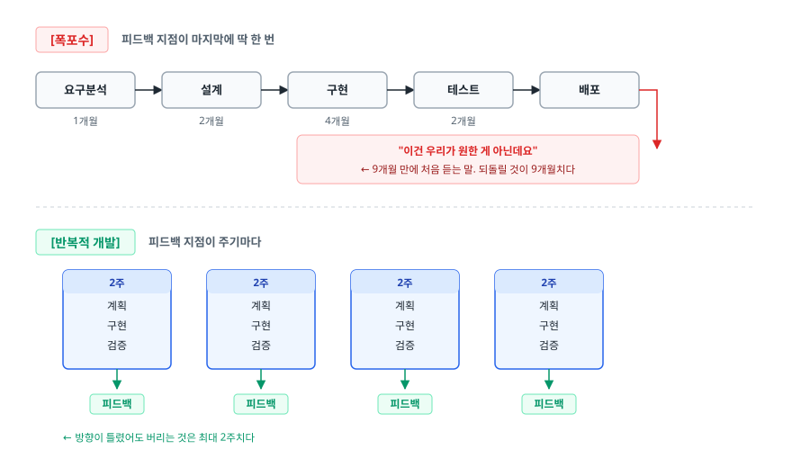
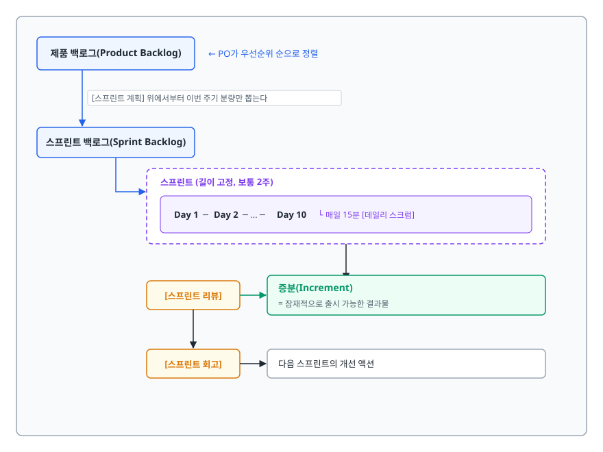
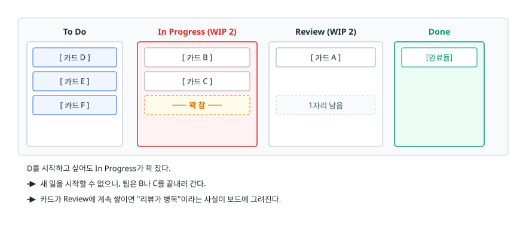
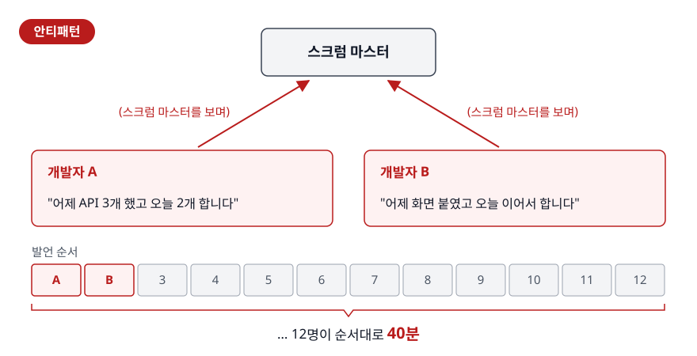
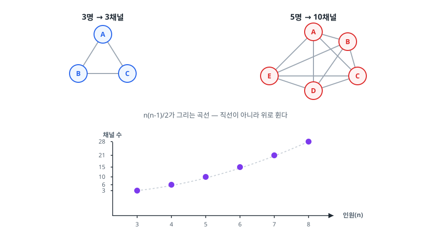

# 애자일 프로세스와 협업 (Agile Process & Collaboration)

> 일정이 밀린 프로젝트에 사람을 더 넣는 장면을 떠올려 봅니다. 그 처방이 왜 통하지 않는지, 폭포수가 어떤 가정 위에서 무너졌는지, 스크럼의 각 이벤트가 정확히 어떤 실패를 막으려고 존재하는지를 설명합니다.

## 학습 목표

- [ ] 폭포수 모델이 서 있는 전제와 그 전제가 깨지는 지점을 설명할 수 있다
- [ ] 애자일 선언 4가지 가치를 "왼쪽만 옳다"는 오해 없이 말할 수 있다
- [ ] 스크럼의 역할·이벤트·산출물이 각각 어떤 문제를 푸는지 짝지어 설명할 수 있다
- [ ] 우리 팀에 스크럼과 칸반 중 무엇이 맞는지 근거를 들어 고를 수 있다
- [ ] 스프린트가 실패하는 전형적인 패턴을 알아보고 대응할 수 있다
- [ ] 브룩스의 법칙을 커뮤니케이션 채널 수로 설명할 수 있다

## 선행 지식

- 없음 — 이 문서부터 시작해도 됩니다

---

## 1. 왜 필요한가 — 폭포수의 전제가 깨지는 지점

폭포수(Waterfall) 모델은 요구사항 분석 → 설계 → 구현 → 테스트 → 유지보수를 순서대로 진행합니다. 앞 단계가 끝나야 다음 단계로 넘어갑니다. 건물을 짓거나 다리를 놓을 때 쓰던 공학 절차를 소프트웨어에 그대로 가져왔습니다.

이 방식은 **하나의 전제** 위에 서 있습니다. **"프로젝트 시작 시점에 만들 것을 정확히 알 수 있다"**는 전제입니다. 다리를 놓을 때는 이 전제가 대체로 맞습니다. 길이와 하중은 착공 전에 확정되고, 공사 중에 "역시 다리 말고 터널로 할까요?"라는 말은 나오지 않습니다.

소프트웨어에서는 이 전제가 거의 항상 깨집니다. 고객은 동작하는 화면을 보기 전에는 자기가 뭘 원하는지 정확히 모르고, 시장은 개발 기간 동안 가만히 있어주지 않습니다. 그리고 전제가 깨진 순간 폭포수의 구조적 약점이 드러납니다.

<!-- diagram:se-agile-process-1 -->


<!-- 위 그림이 대체한 원본 ASCII.
     내용을 고칠 때는 그림도 함께 갱신할 것.
```
[폭포수]  피드백 지점이 마지막에 딱 한 번

  요구분석 ──> 설계 ──> 구현 ──> 테스트 ──> 배포
   1개월      2개월     4개월     2개월       │
                                              ↓
                        "이건 우리가 원한 게 아닌데요"
                        ← 9개월 만에 처음 듣는 말. 되돌릴 것이 9개월치다


[반복적 개발]  피드백 지점이 주기마다

  ┌─2주─┐  ┌─2주─┐  ┌─2주─┐  ┌─2주─┐
  │ 계획 │  │ 계획 │  │ 계획 │  │ 계획 │
  │ 구현 │  │ 구현 │  │ 구현 │  │ 구현 │
  │ 검증 │  │ 검증 │  │ 검증 │  │ 검증 │
  └──┬──┘  └──┬──┘  └──┬──┘  └──┬──┘
     ↓        ↓        ↓        ↓
   피드백   피드백   피드백   피드백
   ← 방향이 틀렸어도 버리는 것은 최대 2주치다
```
-->

"빨리 만든다"에 방점이 있는 게 아닙니다. **틀렸다는 사실을 언제 알게 되는가**를 봐야 합니다. 폭포수는 틀린 것을 가장 비싼 시점에 알려주고, 반복적 개발은 가장 싼 시점에 알려줍니다.

배리 봄(Barry Boehm)이 관찰한 결함 수정 비용 곡선도 같은 이야기를 합니다. 요구사항 단계에서 잡으면 문서 한 줄 고치면 되지만, 운영 중에 잡으면 코드·테스트·데이터·문서·이미 나간 릴리스까지 전부 손대야 합니다. 단계가 뒤로 갈수록 수정 비용은 자릿수 단위로 뜁니다.

> 오해 주의: 폭포수가 언제나 틀린 것은 아닙니다. 요구사항이 법·규격으로 확정되어 있고 중간 변경이 원천 금지된 영역 — 항공 제어, 의료기기 인증, 정부 조달 — 에서는 여전히 폭포수(또는 V-모델)가 정답입니다. 애자일이 이긴 것은 **요구사항이 흔들리는 도메인**에서입니다.

---

## 2. 애자일 선언의 4가지 가치

2001년 켄트 벡, 마틴 파울러 등 17명이 모여 발표한 애자일 선언문(Agile Manifesto)은 네 문장으로 되어 있습니다.

선언문은 "B보다 A를 더 중요하게 여긴다"는 `A over B` 형태입니다. 더 높은 가치를 두는 쪽이 **왼쪽**이라는 점을 기억해두면 인용할 때 헷갈리지 않습니다.

| 우리가 더 높은 가치를 두는 것 | 이것보다 | 이 문장이 겨냥한 실패 |
|---|---|---|
| 개인과 상호작용 | 프로세스와 도구 | 결재 라인 때문에 옆자리에 물어보면 5분인 걸 3일 걸리게 만드는 조직 |
| 작동하는 소프트웨어 | 포괄적인 문서 | 300쪽짜리 설계서는 나왔는데 실행되는 것이 없는 프로젝트 |
| 고객과의 협력 | 계약 협상 | "계약서에 없으니 못 해드립니다"로 서로를 방어하는 관계 |
| 변화에 대응하기 | 계획을 따르기 | 시장이 바뀐 걸 알면서도 6개월 전 계획대로 만드는 관성 |

오른쪽을 버리라는 말로 읽는 **오독**이 가장 흔합니다. 선언문은 표 바로 아래에 이 단서를 붙여두었습니다. "오른쪽에 있는 것들도 가치가 있지만, 우리는 왼쪽에 있는 것들에 더 높은 가치를 둔다."

문서를 쓰지 말라는 주문이 아닙니다. **문서를 쓰느라 동작하는 소프트웨어가 뒤로 밀리면 순서가 잘못됐습니다.** "애자일이니까 문서 안 씁니다", "애자일이니까 계획 없습니다"는 애자일이 아니라 그냥 무계획입니다.

### 내비게이션과 종이 지도 비유

폭포수는 출발 전에 전체 경로를 종이에 적어 오는 방식입니다. 길이 막히면 적어온 경로가 통째로 쓸모없어집니다. 애자일은 내비게이션입니다. 목적지는 그대로 두고, 몇 분마다 현재 위치를 다시 재서 다음 구간만 갱신합니다.

> **비유의 한계**: 내비게이션에서 목적지는 고정입니다. 애자일에서는 목적지 자체가 바뀌기도 합니다. "강남역 가려고 했는데 사실 우리에게 필요한 건 회의실이었다"를 발견하는 것까지가 애자일의 범위입니다. 스프린트 리뷰가 존재하는 이유가 바로 이것입니다.

---

## 3. 스크럼의 각 부품이 푸는 문제

스크럼(Scrum)은 애자일을 실천하는 가장 널리 쓰이는 프레임워크입니다. 구성 요소를 외우는 것보다 **각각이 어떤 실패를 막으려고 있는지** 아는 것이 중요합니다.

<!-- diagram:se-agile-process-2 -->


<!-- 위 그림이 대체한 원본 ASCII.
     내용을 고칠 때는 그림도 함께 갱신할 것.
```
┌───────────────────────────────────────────────────────────────┐
│  제품 백로그(Product Backlog)  ← PO가 우선순위 순으로 정렬     │
│      │                                                         │
│      │ [스프린트 계획] 위에서부터 이번 주기 분량만 뽑는다      │
│      ↓                                                         │
│  스프린트 백로그(Sprint Backlog)                               │
│      │                                                         │
│      │   ┌────────── 스프린트 (길이 고정, 보통 2주) ────────┐ │
│      └──>│  Day 1 ─ Day 2 ─ ... ─ Day 10                    │ │
│          │    └ 매일 15분 [데일리 스크럼]                    │ │
│          └───────────────────────┬──────────────────────────┘ │
│                                   ↓                            │
│           [스프린트 리뷰] ──> 증분(Increment)                  │
│                 │              = 잠재적으로 출시 가능한 결과물 │
│                 ↓                                              │
│           [스프린트 회고] ──> 다음 스프린트의 개선 액션         │
└───────────────────────────────────────────────────────────────┘
```
-->

### 세 가지 책임(역할)

| 역할 | 하는 일 | 이 역할이 없으면 |
|---|---|---|
| 제품 책임자(Product Owner) | 백로그 우선순위 결정, 무엇을 만들지에 대한 최종 책임 | 요청이 여러 사람에게서 동시에 들어와 개발팀이 우선순위를 스스로 추측하게 된다 |
| 스크럼 마스터(Scrum Master) | 프로세스 촉진, 장애물 제거, 외부 간섭 차단 | 회의가 늘어지고, 막힌 사람이 며칠씩 혼자 막혀 있는다 |
| 개발팀(Developers) | 어떻게 만들지 결정하고 실제로 만든다 | — (스크럼은 "무엇"과 "어떻게"의 결정권을 의도적으로 분리한다) |

용어 하나만 짚어둡니다. 2020년판 스크럼 가이드는 이 셋을 "역할(role)"이 아니라 **책임(accountability)** 이라고 부르고, "개발팀(Development Team)"이라는 하위 조직 대신 **개발자(Developers)** 라고 표현합니다. 스크럼 팀은 이 셋으로 이루어진 하나의 팀입니다. 팀 안에 또 다른 팀을 두지 않습니다. 면접에서는 "역할"이라는 말이 그대로 통용되지만, 최신 가이드 표현을 알고 있으면 감점될 일이 없습니다.

**PO가 "무엇을", 개발자가 "어떻게"를 결정한다**는 경계를 자주 놓칩니다. PO가 "이 기능을 Redis로 구현하세요"라고 말하는 순간 경계가 무너지고, 개발팀은 결정에 대한 책임 없이 실행만 하는 조직이 됩니다.

### 이벤트와 그것이 푸는 문제

| 이벤트 | 시점 | 푸는 문제 |
|---|---|---|
| 스프린트 계획 | 스프린트 시작일 | "이번에 뭘 하는지 사람마다 다르게 알고 있다" |
| 데일리 스크럼 | 매일, 15분 | "3일째 같은 곳에서 막혀 있는데 아무도 몰랐다" |
| 스프린트 리뷰 | 스프린트 종료일 | "다 만들고 보니 원하는 게 아니었다" |
| 스프린트 회고 | 리뷰 직후 | "매번 같은 문제로 매번 지연된다" |

스크럼 가이드가 세는 이벤트는 다섯 개입니다. 위 네 개에 더해 **스프린트 자체**가 나머지를 담는 그릇 역할의 이벤트로 들어갑니다. "스크럼 이벤트가 몇 개냐"는 질문이 나오면 이 점을 같이 말하면 됩니다. 반면 백로그 리파인먼트(정제)는 자주 언급되지만 정식 이벤트가 아닙니다. 스프린트 내내 이어지는 활동입니다.

리뷰와 회고를 헷갈리는 사람이 많은데, 대상이 다릅니다. **리뷰는 만든 제품을 봅니다(이해관계자 참석). 회고는 만든 방식을 봅니다(팀 내부).** 같은 자리에서 두 가지를 섞으면 둘 다 흐지부지됩니다.

### 세 가지 산출물

- **제품 백로그**: 만들어야 할 것 전체 목록. 완성된 명세라기보다 계속 다듬어지는 살아있는 목록입니다.
- **스프린트 백로그**: 이번 스프린트에 하기로 한 것. 스프린트 도중에는 팀 밖에서 건드리지 않습니다.
- **증분(Increment)**: 이번 스프린트 결과물. "완료의 정의(Definition of Done, DoD)"를 만족해야만 증분입니다.

**완료의 정의**가 스크럼에서 가장 과소평가되는 장치입니다. 팀이 코드 리뷰 통과, 테스트 작성, 스테이징 배포, 문서 갱신 같은 조건을 미리 합의해 적어둡니다. DoD가 없으면 "거의 다 됐어요"가 스프린트마다 이월되고, 어느 순간 절반쯤 완성된 기능이 열 개 쌓입니다.

---

## 4. 칸반과 스크럼 중 무엇을 고를 것인가

칸반(Kanban)은 도요타 생산 방식에서 온 흐름 관리 방법입니다. 스크럼과 달리 정해진 역할도, 시간 박스도 없습니다. 대신 두 가지에 집중합니다. **작업을 눈에 보이게 만들기**, 그리고 **동시 진행 작업 수(WIP, Work In Progress) 제한하기**.

<!-- diagram:se-agile-process-3 -->


<!-- 위 그림이 대체한 원본 ASCII.
     내용을 고칠 때는 그림도 함께 갱신할 것.
```
      To Do        In Progress (WIP 2)      Review (WIP 2)      Done
  ┌───────────┐   ┌──────────────────┐   ┌──────────────┐   ┌────────┐
  │ [ 카드 D ]│   │ [ 카드 B ]       │   │ [ 카드 A ]   │   │[완료들]│
  │ [ 카드 E ]│   │ [ 카드 C ]       │   │              │   │        │
  │ [ 카드 F ]│   │ ─── 꽉 참 ───    │   │  1자리 남음  │   │        │
  └───────────┘   └──────────────────┘   └──────────────┘   └────────┘

  D를 시작하고 싶어도 In Progress가 꽉 찼다.
  → 새 일을 시작할 수 없으니, 팀은 B나 C를 끝내러 간다.
  → 카드가 Review에 계속 쌓이면 "리뷰가 병목"이라는 사실이 보드에 그려진다.
```
-->

WIP 제한이 칸반을 지탱합니다. 이것이 없으면 보드는 그냥 예쁜 할 일 목록입니다. 사람은 막히면 새 일을 시작하려는 경향이 있고, 그렇게 시작된 일이 쌓이면 **아무것도 끝나지 않은 채 모든 것이 진행 중**인 상태가 됩니다. WIP 제한은 그 도피로를 물리적으로 막아 "끝내는 것"을 "시작하는 것"보다 우선하게 만듭니다.

| 기준 | 스크럼 | 칸반 | 그래서 언제 |
|---|---|---|---|
| 주기 | 고정 길이 스프린트 | 연속적, 주기 없음 | 예측 가능한 리듬이 필요하면 스크럼 |
| 작업 투입 | 스프린트 시작 시 확정 | 자리가 나면 언제든 | 긴급 건이 수시로 들어오면 칸반 |
| 역할 | PO / SM / 개발팀 | 규정 없음 | 역할 정립이 필요한 신규 팀은 스크럼 |
| 측정 지표 | 벨로시티, 번다운 차트 | 리드 타임, 사이클 타임, 처리량 | 납기 예측이 목적이면 리드 타임 쪽이 직접적 |
| 변경 대응 | 스프린트 중 범위 고정 | 즉시 반영 | 우선순위가 하루 단위로 뒤집히면 칸반 |
| 도입 난이도 | 높음(이벤트·역할 재편 필요) | 낮음(현재 프로세스 위에 얹는다) | 조직 개편이 어려우면 칸반부터 |

> 결론: **만들 것이 정해져 있고 리듬이 필요한 제품 개발 팀은 스크럼**, **들어오는 일을 예측할 수 없는 운영·인프라·고객지원 팀은 칸반**이 기본값입니다. 실무에서는 스크럼의 회고와 칸반의 WIP 제한만 떼어 쓰는 스크럼반(Scrumban) 조합도 흔합니다.

---

## 5. 스프린트가 실패하는 흔한 패턴

형식은 다 갖췄는데 효과가 없는 팀에는 공통 패턴이 있습니다.

### 패턴 1. 스프린트 중간에 일이 계속 추가된다

```
안티패턴:
  Day 3  "잠깐만, 이거 하나만 급하게 추가해주세요"
  Day 5  "영업에서 요청 들어왔는데 이번에 넣죠"
  Day 8  "대표님 요청이라 우선순위가 최상입니다"
  Day 10 계획한 것 중 절반만 완료. 회고에서 "다들 열심히 했는데 왜 안 됐지?"
```

**왜 문제인가**: 스프린트는 "2주 동안은 이것만 한다"는 경계 하나로 존재합니다. 경계가 매일 열리면 시간 박스는 이름만 남습니다. 더 나쁘게는 **측정이 불가능해집니다.** 계획 대비 실적이 매번 어긋나니 다음 스프린트 계획의 근거가 사라지고, 팀은 영원히 자기 속도를 모릅니다.

**개선**: 긴급 건은 세 갈래로 처리합니다. (1) 정말 지금 필요하면 같은 크기의 다른 작업을 스프린트에서 빼고 교체합니다(총량은 유지됩니다). (2) 다음 스프린트로 보냅니다. (3) 팀 용량의 10~20%를 애초에 비워두고(버퍼) 그 안에서 소화합니다. 어느 쪽이든 **"그냥 얹는다"만 아니면 됩니다.**

### 패턴 2. 데일리 스크럼이 상태 보고 회의가 된다

<!-- diagram:se-agile-process-4 -->


<!-- 위 그림이 대체한 원본 ASCII.
     내용을 고칠 때는 그림도 함께 갱신할 것.
```
안티패턴:
  개발자 A → (스크럼 마스터를 보며) "어제 API 3개 했고 오늘 2개 합니다"
  개발자 B → (스크럼 마스터를 보며) "어제 화면 붙였고 오늘 이어서 합니다"
  ... 12명이 순서대로 40분
```
-->

**왜 문제인가**: 데일리 스크럼은 **팀원끼리 오늘의 계획을 맞추는 자리**입니다. 관리자에게 보고하는 자리가 아닙니다. 시선이 스크럼 마스터를 향하는 순간 목적이 뒤집힙니다. 또 "어제 뭐 했고 오늘 뭐 한다"만 말하면 정작 중요한 신호인 막힌 지점이 드러나지 않습니다.

**개선**: 사람 대신 **보드의 카드를 기준으로** 진행합니다. "이 카드가 3일째 In Progress인데 무엇이 막고 있나?"를 묻는 방식입니다. 15분을 넘기는 논의는 그 자리에서 끝내지 않고 관련자만 남아 따로 진행합니다.

### 패턴 3. 회고에 액션이 없다

회고가 불만을 30분 말하고 "다음엔 잘해봅시다"로 끝난다면, 세 번쯤 반복되는 순간 팀은 참석 자체를 부담스러워합니다.

**개선**: 회고에서는 감정 공유로 그치지 말고 **다음 스프린트 백로그에 실제로 들어가는 항목 1~2개**를 산출물로 뽑습니다. "테스트를 더 잘 짜자"가 아니라 "결제 모듈에 통합 테스트 추가 — 담당 김OO — 이번 스프린트 내"처럼 담당자와 기한이 붙어야 합니다. 많이 뽑는 것보다 하나를 확실히 끝내는 편이 낫습니다.

### 패턴 4. 벨로시티를 성과 지표로 쓴다

**왜 문제인가**: 벨로시티(스프린트당 완료한 스토리 포인트)는 **다음 스프린트의 분량을 가늠하기 위한 예측 도구**입니다. 이것을 팀 평가에 쓰는 순간 포인트 인플레이션이 일어납니다. 같은 일에 3점 대신 8점을 매기면 숫자는 올라가고 실제 산출물은 그대로입니다. 팀 간 벨로시티 비교는 더 무의미합니다. 포인트는 팀마다 기준이 다른 **상대적 단위**이기 때문입니다.

---

## 6. 브룩스의 법칙 — 사람을 더 넣으면 왜 늦어지는가

> "지연되고 있는 소프트웨어 프로젝트에 인력을 추가하면 더 늦어진다." — 프레드 브룩스, 《맨먼스 미신》

직관에 반하는 말이라 근거를 정확히 알아둘 필요가 있습니다. 세 가지가 동시에 작동합니다.

**첫째, 커뮤니케이션 채널이 제곱으로 늘어납니다.** n명이 서로 소통해야 할 경로의 수는 `n(n-1)/2`입니다.

<!-- diagram:se-agile-process-5 -->


<!-- 위 그림이 대체한 원본 ASCII.
     내용을 고칠 때는 그림도 함께 갱신할 것.
```
  3명 → 3채널          5명 → 10채널

    A                    A───B
   / \                  /|\ /|\
  B───C                / | X | \
                      E──┼─┼─┼──C
                       \ | / \ |
                        \|/   \|
                         D─────┘

  n(n-1)/2가 그리는 곡선 — 직선이 아니라 위로 휜다

  채널 수
   28 │                ●
   21 │             ●
   15 │          ●
   10 │       ●
    6 │    ●
    3 │ ●
      └─────────────────── 인원(n)
        3  4  5  6  7  8
```
-->

인원이 2배가 되면 채널 수는 4배를 조금 넘습니다. 협업에 쓰는 시간이 그만큼 늘고, 실제 개발에 쓸 시간은 그만큼 줄어듭니다.

**둘째, 온보딩 비용은 기존 인력이 냅니다.** 새로 온 사람이 코드베이스와 도메인을 익히는 동안, 가르치는 쪽은 자기 작업을 멈춥니다. **투입 직후에는 팀 전체 생산성이 오히려 떨어집니다.**

**셋째, 모든 작업이 쪼개지지 않습니다.** 브룩스의 유명한 표현대로, 아홉 명의 여성이 모여도 아기를 한 달 만에 낳을 수는 없습니다. 순차 의존이 있는 작업은 인원을 늘려도 병렬화되지 않습니다.

**적용 범위를 정확히 알아야 합니다.** 브룩스의 법칙은 "**이미 늦은** 프로젝트에 급하게 사람을 넣을 때"의 이야기입니다. 프로젝트 초기에 인력을 확보하는 것, 명확히 분리된 모듈에 별도 팀을 붙이는 것은 해당하지 않습니다. 그래서 실무에서는 이렇게 대응합니다.

- 인력 투입은 **일정이 흔들리기 전에** 합니다
- 팀을 키우는 대신 **작은 팀 여러 개**로 나누고 팀 사이는 API 같은 고정된 인터페이스로만 소통하게 합니다(채널 수를 팀 내부로 가둡니다)
- 늦었다면 인력을 더 넣기보다 **범위를 줄이는 것**이 대개 유일하게 작동하는 수단입니다

---

## 7. 코드 리뷰 문화

코드 리뷰는 애자일 프로세스에서 품질을 지키는 마지막 협업 장치입니다. 버그를 잡는 것은 여러 목적 중 하나일 뿐이고, 실제로는 **지식이 한 사람에게 갇히는 것을 막는 장치**로서의 값이 더 큽니다. 특정 모듈을 아는 사람이 한 명뿐인 상태(버스 팩터 1)는 그 사람이 휴가만 가도 팀이 멈춥니다.

### PR 크기가 리뷰 품질을 결정한다

```
  PR 크기            리뷰어의 실제 행동
  ─────────────────────────────────────────────────────
  ~ 200줄            줄 단위로 읽는다. 설계 의견이 나온다
  400줄 근처         읽기는 하지만 놓치는 것이 생긴다
  1000줄 이상        "LGTM" 한 줄. 사실상 리뷰가 없었던 것
```

줄 수는 팀과 코드 성격에 따라 달라지므로 정확한 임계값이 있는 것은 아닙니다. 리뷰어의 집중력에 한계가 있어서 어느 지점을 넘으면 결함 발견율이 급격히 떨어지고 승인 도장만 남습니다. **큰 PR은 리뷰 시간을 늘리는 게 아니라 리뷰 자체를 없앱니다.** 기능을 쪼개 여러 PR로 나누고, 리팩토링과 기능 추가를 한 PR에 섞지 않는 것이 가장 효과가 큽니다.

### 리뷰 코멘트: 안티패턴과 개선

```diff
- 안티패턴 1: "왜 이렇게 짰어요?"
  → 사람을 겨냥한 질문으로 읽힌다. 방어적으로 대응하게 만든다.

+ 개선: "여기서 List 대신 Set을 쓰면 중복 검사 부분(L42)이 없어질 것 같은데,
+        순서가 필요한 이유가 있을까요?"
  → 대상은 코드, 근거는 구체적 줄 번호, 마지막은 열린 질문.


- 안티패턴 2: "변수명이 이상합니다" (전체 코멘트 12개 중 10개가 이런 것)
  → 취향 의견과 진짜 결함이 섞여 있어, 작성자가 무엇이 중요한지 알 수 없다.

+ 개선: 취향 의견에는 "nit:" 접두어를 붙인다.
+   "nit: userList보다 users가 관례에 가깝습니다 (반영 안 해도 됩니다)"
+   "이 쿼리는 트랜잭션 밖이라 N+1이 발생합니다" ← 접두어 없음 = 반드시 처리
  → 무엇이 머지 차단 사유인지 한눈에 구분된다.


- 안티패턴 3: 포매팅, 세미콜론, import 순서를 사람이 지적한다
  → 기계가 1초에 할 일에 사람의 리뷰 시간을 쓴다. 정작 로직은 못 본다.

+ 개선: 포매터·린터·테스트·정적 분석은 CI에서 강제한다.
+       사람은 "이 설계가 맞나", "이 예외 상황이 처리됐나"만 본다.
```

### 응답 속도가 처리량을 좌우한다

리뷰가 이틀 밀리면 작성자는 그동안 다른 작업을 시작하고, 리뷰 코멘트가 왔을 때는 이미 문맥이 날아가 있습니다. 결과적으로 수정에 드는 시간이 몇 배로 늘고, 그 사이 대상 브랜치는 계속 앞서가 충돌이 쌓입니다. **리뷰는 "언제 하는지"가 "얼마나 꼼꼼히 하는지"만큼 중요합니다.** 그래서 팀 규칙으로 "PR은 하루 안에 첫 응답"을 정해두는 곳이 많습니다.

---

## 8. 실무에서는

- **이슈 트래커와 보드**: Jira, GitHub Projects, Linear 같은 도구로 백로그와 보드를 관리합니다. 도구가 프로세스를 만들어주지는 않습니다. 보드에 카드가 있는데 아무도 안 보면 그냥 데이터베이스입니다.
- **CI가 스크럼의 DoD를 강제한다**: "테스트 통과, 린트 통과, 리뷰 1인 이상 승인"을 GitHub의 브랜치 보호 규칙으로 걸어두면 완료의 정의가 사람의 성실함 대신 파이프라인으로 지켜집니다. 파이프라인 구성은 [CI/CD 개념 문서](../10-cloud-engineering/devops-cicd/01-cicd-concepts.md)에서 다룹니다.
- **CODEOWNERS로 리뷰어를 자동 지정한다**: GitHub에서 경로별 담당자를 등록해두면 PR이 열릴 때 해당 리뷰어가 자동으로 요청됩니다. "누구한테 리뷰 요청하지?"에서 생기는 지연이 사라집니다.
- **원격 팀에서는 데일리가 비동기로 바뀐다**: 시차가 큰 팀은 15분 회의 대신 슬랙 스레드에 각자 남기는 방식을 씁니다. 이때도 목적은 같습니다. 막힌 사람을 빨리 찾아내는 것입니다.

---

## 9. 면접 포인트

> 면접에서 이 주제가 나오면 이렇게 답한다

**Q. 애자일과 폭포수의 차이를 설명해주세요.**
A. 피드백 지점의 개수가 가장 크게 다릅니다. 폭포수는 모든 단계를 순서대로 밟고 마지막에 한 번 검증하므로, 방향이 틀렸을 때 프로젝트 전체를 되돌려야 합니다. 애자일은 1~4주 주기마다 동작하는 결과물을 내고 검증하므로 되돌리는 범위가 한 주기로 제한됩니다. 다만 애자일이 항상 우월한 것은 아니고, 요구사항이 규격으로 확정되어 변경이 금지된 영역에서는 폭포수나 V-모델이 더 적합합니다.
- 꼬리 질문: "애자일이면 문서를 안 쓰나요?" → 선언문 자체가 "오른쪽(문서·계획·프로세스)에도 가치가 있다"고 단서를 달아두었습니다. 문서 때문에 동작하는 소프트웨어가 뒤로 밀리지 않게 하는 것이 요지라고 답합니다.

**Q. 스크럼의 회고와 리뷰는 어떻게 다른가요?**
A. 리뷰는 만든 제품을 이해관계자와 함께 확인하는 자리이고, 회고는 팀이 일하는 방식을 돌아보는 내부 자리입니다. 리뷰의 결과는 백로그 우선순위 조정으로, 회고의 결과는 다음 스프린트에 들어갈 개선 액션으로 이어집니다. 회고에서 담당자와 기한이 붙은 액션이 나오지 않으면 형식만 남은 회고입니다.
- 꼬리 질문: "회고에서 나온 개선 사항은 어디에 두나요?" → 다음 스프린트 백로그에 정식 항목으로 넣습니다. 별도 목록에 적어두면 우선순위 경쟁에서 밀려 실행되지 않습니다.

**Q. 스크럼과 칸반 중 무엇을 쓰시겠습니까?**
A. 일이 들어오는 방식으로 결정합니다. 제품 개발 팀은 만들 것이 백로그에 쌓여 있고 우선순위를 미리 정할 수 있으니 스크럼이 맞습니다. 운영 팀에서는 장애 대응이나 고객 요청처럼 예측 불가능한 일이 수시로 들어와 스프린트 범위 고정이 매번 깨지므로 칸반이 낫습니다. 칸반을 쓸 때는 WIP 제한을 반드시 걸어야 합니다. 그게 없으면 보드가 그냥 할 일 목록으로 전락하기 때문입니다.
- 꼬리 질문: "WIP 제한을 걸면 놀고 있는 사람이 생기지 않나요?" → 새 일을 시작하지 못하는 사람은 진행 중인 작업의 리뷰나 병목 해소로 이동합니다. 개인 가동률이 아니라 전체 처리량을 최적화하는 것이 목적이라고 답합니다.

**Q. 브룩스의 법칙을 설명해주세요.**
A. 이미 지연된 프로젝트에 인력을 추가하면 더 늦어진다는 경험칙입니다. 커뮤니케이션 채널이 n(n-1)/2로 늘어나고, 신규 인력의 온보딩 비용을 기존 인력이 부담하며, 순차 의존이 있는 작업은 애초에 병렬화되지 않기 때문입니다. 다만 초기 인력 확보나 독립된 모듈에 별도 팀을 붙이는 것은 여기 해당하지 않습니다. 이미 늦었다면 인력보다 범위 축소가 현실적인 수단입니다.
- 꼬리 질문: "그럼 팀을 어떻게 키우나요?" → 하나의 큰 팀 대신 작은 팀 여러 개로 나누고 팀 간에는 API 같은 고정 인터페이스로만 소통하게 해서, 채널 폭발을 팀 내부로 가둔다고 답합니다.

---

## 자주 하는 실수

| 실수 | 왜 틀렸나 | 올바른 이해 |
|---|---|---|
| "애자일 = 문서·계획 없음" | 선언문은 덜 강조한 쪽(문서·계약·계획)에도 가치가 있다고 단서를 달아두었다 | 우선순위 문제다. 계획은 하되 자주 갱신한다 |
| "스크럼 마스터는 팀 리더/관리자다" | 스크럼 마스터는 지시하는 자리가 아니라 장애물을 치우는 자리다 | 업무 지시는 PO(무엇)와 개발팀(어떻게)이 나눠 갖는다 |
| "데일리 스크럼은 진척 보고 시간" | 보고 대상이 생기면 팀원 간 조율이라는 목적이 사라진다 | 사람이 아니라 보드의 카드를 놓고 막힌 곳을 찾는 자리다 |
| "벨로시티가 높은 팀이 잘하는 팀" | 스토리 포인트는 팀마다 기준이 다른 상대 단위다. 평가에 쓰면 인플레이션이 일어난다 | 벨로시티는 다음 스프린트 분량 예측용 내부 지표다 |
| "칸반은 보드만 만들면 된다" | WIP 제한 없는 칸반 보드는 예쁜 할 일 목록일 뿐이다 | WIP 제한이 병목을 드러내고 처리량을 올리는 핵심 장치다 |
| "리뷰는 꼼꼼할수록 좋다" | PR이 크면 꼼꼼함과 무관하게 발견율이 떨어지고 LGTM만 남는다 | PR을 작게 쪼개는 것이 리뷰를 오래 하는 것보다 효과가 크다 |

---

## 한 줄 정리

애자일은 **틀렸다는 사실을 가장 싼 시점에 알아내려고 피드백 주기를 짧게 자르는 방법**입니다. "빨리 만드는 방법"이 아닙니다. 스크럼의 이벤트·칸반의 WIP 제한·코드 리뷰는 모두 그 짧은 주기가 실제로 작동하게 만드는 장치입니다.

---

## 연관 개념

- [02-testing-tdd.md](./02-testing-tdd.md) - 짧은 주기를 지탱하는 자동화된 회귀 안전망
- [03-clean-code-refactoring.md](./03-clean-code-refactoring.md) - 반복 개발에서 코드가 썩지 않게 유지하는 방법
- [04-architecture-monolith-msa.md](./04-architecture-monolith-msa.md) - 팀 구조와 아키텍처가 서로를 결정하는 이유(콘웨이의 법칙)
- [qna-software-engineering.md](./qna-software-engineering.md) - 애자일·코드 리뷰·브룩스의 법칙 면접 질문(Q1, Q5, Q7)
- [../10-cloud-engineering/devops-cicd/01-cicd-concepts.md](../10-cloud-engineering/devops-cicd/01-cicd-concepts.md) - 완료의 정의를 파이프라인으로 강제하기
- [../07-version-control/qna-version-control.md](../07-version-control/qna-version-control.md) - 브랜치 전략과 PR 워크플로
