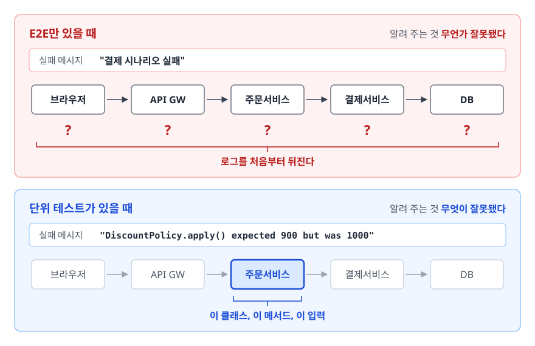
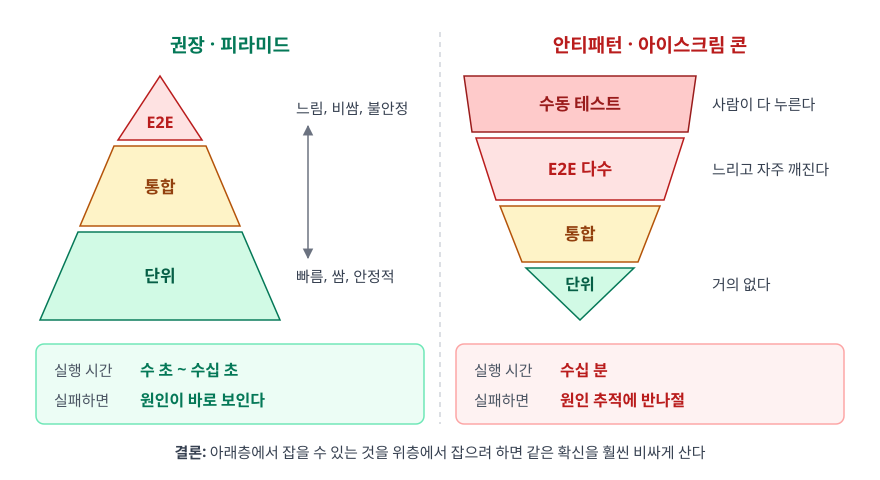
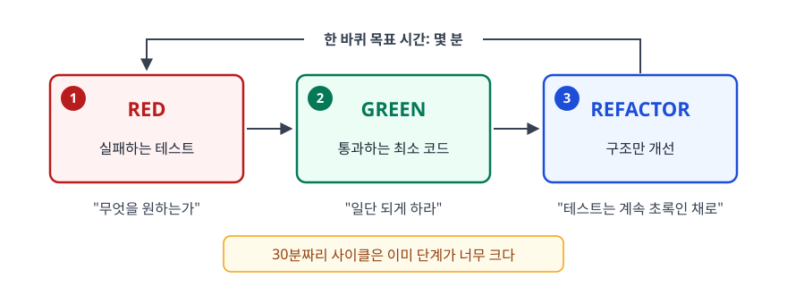

# 테스트와 TDD (Testing & Test-Driven Development)

> 손으로 눌러 보는 대신 테스트를 왜 코드로 짤까요? 피라미드의 각 층은 무엇을 사 주고, TDD 한 사이클은 실제로 어떻게 돌아가며, 커버리지 숫자는 왜 품질을 보장하지 못할까요? 이 문서에서 차례로 다룹니다.

## 학습 목표

- [ ] 테스트 코드가 사주는 세 가지(회귀 안전망·설계 피드백·문서)를 각각 설명할 수 있다
- [ ] 테스트 피라미드의 각 층이 어떤 버그를 잡는지, 단위·통합·E2E·인수 테스트의 경계가 어디인지 예시로 말할 수 있다
- [ ] Red-Green-Refactor 사이클을 실제 코드로 한 바퀴 돌릴 수 있다
- [ ] FIRST 원칙과 커버리지 지표의 한계를 반례로 설명하고, 테스트 더블 5종을 구분할 수 있다

## 선행 지식

- 함수/클래스 단위로 코드를 작성해 본 경험. 그 외에 필요한 것은 없습니다.

---

## 1. 왜 테스트를 코드로 짜는가

### 손으로 하는 검증은 규모를 못 따라간다

기능을 하나 만들고 브라우저에서 눌러보는 것도 테스트입니다. 다만 이 방식은 **누적되지 않습니다**. 기능이 50개인 서비스에서 코드를 한 줄 고쳤을 때, 나머지 49개가 여전히 멀쩡한지 확인하려면 매번 50개를 다 눌러봐야 합니다. 현실에서는 아무도 그러지 않습니다. "이 정도면 영향 없겠지"라고 넘기고, 그 판단이 틀린 날 장애가 납니다.

테스트 코드가 사주는 것은 크게 세 가지입니다.

**첫째, 회귀 안전망(regression safety net).** 한 번 작성한 검증이 이후 모든 커밋에서 자동으로 다시 돌아갑니다. 3년 전에 고친 버그가 되살아나면 그날 CI가 알려줍니다.

**둘째, 설계 피드백.** 가장 과소평가되는 항목입니다. 테스트를 짜기 어려운 코드에는 거의 항상 설계 문제가 있습니다. 준비 코드가 20줄 필요하다면 의존성이 너무 많다는 뜻이고, `static` 호출 때문에 대체가 안 된다면 결합이 너무 단단하다는 뜻입니다. **테스트는 내 코드의 첫 번째 사용자**이고, 첫 사용자가 불편해하면 다른 사용자도 불편합니다.

**셋째, 살아있는 문서.** 주석과 위키는 코드와 따로 놀다가 결국 거짓말이 되지만, 테스트는 틀리면 빨간불이 켜집니다. `할인_금액이_1000원_미만이면_적용되지_않는다`라는 테스트 이름은 명세 그 자체이고, 명세가 깨지면 즉시 드러납니다.

### 등반의 확보물에 빗대면

암벽을 오르며 일정 간격마다 확보물을 박아둡니다. 테스트가 그 확보물입니다. 없으면 미끄러지는 순간 바닥까지 떨어지고, 촘촘히 박아두면 마지막 지점까지만 떨어집니다. 테스트가 촘촘한 코드베이스에서는 회귀 버그를 만나도 직전 커밋까지만 되짚으면 되지만, 없으면 언제부터 깨져 있었는지 모르는 채로 전부를 뒤져야 합니다.

> **비유의 한계**: 확보물은 떨어진 사람을 실제로 붙잡아 줍니다. 테스트는 떨어졌다는 사실만 알려 줄 뿐 코드를 대신 고쳐 주지 않습니다. 또 확보물은 많을수록 안전하지만 테스트는 그렇지 않습니다 — 내부 구현에 매달린 테스트는 오히려 리팩토링을 막는 족쇄가 됩니다. 뒤에서 다룰 Mock 남용이 그 대표적인 경우입니다.

### 테스트가 있고 없고보다 어느 층에 있느냐가 실패 해상도와 디버깅 시간을 결정한다

<!-- diagram:se-testing-tdd-1 -->


<!-- 위 그림이 대체한 원본 ASCII.
     내용을 고칠 때는 그림도 함께 갱신할 것.
```
[E2E만 있을 때]  실패 메시지: "결제 시나리오 실패"

  브라우저 ─> API GW ─> 주문서비스 ─> 결제서비스 ─> DB
     ?          ?           ?             ?          ?      ← 로그를 처음부터 뒤진다

[단위 테스트가 있을 때]  "DiscountPolicy.apply() expected 900 but was 1000"

  브라우저 ─> API GW ─> 주문서비스 ─> 결제서비스 ─> DB
                            └ 이 클래스, 이 메서드, 이 입력
```
-->

E2E 테스트는 "무언가 잘못됐다"까지만 알려 주고, 단위 테스트는 "무엇이 잘못됐다"까지 짚어 줍니다. 이 차이가 피라미드를 권하는 실제 이유입니다.

---

## 2. 테스트 피라미드

<!-- diagram:se-testing-tdd -->


```
     [권장 - 피라미드]                [안티패턴 - 아이스크림 콘]

           /\                            ┌──────────────┐
          /E2\   느림, 비쌈, 불안정       │  수동 테스트  │ 사람이 다 누른다
         /────\                          └──────────────┘
        / 통합 \                         │   E2E 다수    │ 느리고 자주 깨진다
       /────────\                        └──────────────┘
      /   단위    \  빠름, 쌈, 안정적       │   통합    │
     /────────────\                        └──────────┘
                                             /단위\      거의 없다

  실행 시간: 수 초 ~ 수십 초           실행 시간: 수십 분
  실패하면: 원인이 바로 보인다         실패하면: 원인 추적에 반나절
```

| 층 | 검증 대상 | 속도 | 잡는 버그 | 못 잡는 버그 |
|---|---|---|---|---|
| 단위 | 함수/클래스 하나의 로직 | 밀리초 | 계산 오류, 경계 조건, 분기 누락 | 컴포넌트 간 연결이 잘못된 경우 |
| 통합 | 여러 컴포넌트의 협력, DB·외부 연동 | 초 | 쿼리 오류, 매핑 실수, 트랜잭션 경계, 설정 오류 | 사용자 관점의 흐름 단절 |
| E2E | 사용자 시나리오 전체 | 수 초~분 | 화면-API-DB를 잇는 실제 흐름의 단절 | (다 잡지만 원인을 못 알려준다) |

> 결론: 아래층은 "로직이 맞는가", 위층은 "연결이 맞는가"를 삽니다. 아래층에서 잡을 수 있는 것을 위층에서 잡으려 하면 같은 확신을 훨씬 비싸게 사는 셈입니다. 다만 층 비율에 정답 숫자는 없습니다. 로직이 얇고 연동이 많은 서비스(예: 조회 API 위주 백엔드)는 통합 테스트 비중이 자연스럽게 커집니다.

아이스크림 콘을 의도적으로 만드는 팀은 없습니다. 대개 이런 순서로 흘러갑니다. 초기에는 빨리 만드느라 테스트를 미룹니다 → 장애가 나서 "테스트를 넣자"가 됩니다 → 이미 만들어진 코드는 의존성이 얽혀 단위 테스트를 짜기 어렵습니다 → 그나마 붙일 수 있는 E2E부터 붙입니다 → E2E가 느리고 자주 깨져서 아무도 안 봅니다. 빠져나오려면 E2E를 지우기보다 새로 만드는 코드부터 단위 테스트가 가능한 형태로 설계하고, 기존 E2E는 핵심 시나리오만 남깁니다.

---

## 3. 테스트의 종류 정리

앞의 세 층은 **테스트 범위**에 따른 분류입니다. 여기에 누가 무엇을 확인하려는가에 따른 분류가 겹쳐서 용어가 헷갈립니다.

| 테스트 | 확인하려는 질문 | 주체 |
|---|---|---|
| 단위 테스트 | 이 함수가 명세대로 계산하는가 | 개발자 |
| 통합 테스트 | 이 모듈들이 서로 맞물려 도는가 | 개발자 |
| 시스템 테스트 | 완성된 시스템이 요구사항 전체를 만족하는가(기능·성능·보안 포함) | QA |
| 인수 테스트 | 이걸 받아도 되는가 — 고객의 업무 문제가 실제로 풀리는가 | 고객/기획 |
| E2E 테스트 | (범위 기준) 처음부터 끝까지 이어지는가 | 개발자/QA |

인수 테스트(Acceptance Test)는 다른 것들과 성격이 다릅니다. 기술적으로 맞는지보다 비즈니스적으로 맞는지를 묻습니다. 그래서 개발자가 아닌 사람도 읽을 수 있는 언어로 쓰는 관행이 있습니다.

```gherkin
Scenario: 3만원 이상 구매 시 무료배송
  Given 장바구니에 25,000원짜리 상품이 담겨 있고
  When 5,000원짜리 상품을 추가하면
  Then 배송비는 0원이 된다
```

이 형식(Gherkin)이 값을 하는 것은 도구 덕분이 아닙니다. 기획자와 개발자가 같은 문장을 보고 합의하게 만들기 때문입니다. "3만원 이상"이 3만원 포함인지 초과인지 같은 모호함이 이 단계에서 드러납니다.

---

## 4. TDD 한 바퀴 돌려보기

TDD(Test-Driven Development)는 테스트를 먼저 쓰는 방식입니다. 그 테스트를 통과시키는 코드는 나중에 씁니다. 사이클은 세 단계입니다.

<!-- diagram:se-testing-tdd-2 -->


<!-- 위 그림이 대체한 원본 ASCII.
     내용을 고칠 때는 그림도 함께 갱신할 것.
```
        ┌───────────────────────────────────────┐
        ↓                                       │
   ┌─────────┐      ┌─────────┐      ┌──────────┐
   │  RED    │ ───> │  GREEN  │ ───> │ REFACTOR │
   │ 실패하는 │      │ 통과하는 │      │  구조만   │
   │ 테스트   │      │ 최소 코드│      │  개선     │
   └─────────┘      └─────────┘      └──────────┘
    "무엇을            "일단           "테스트는 계속
     원하는가"          되게 하라"       초록인 채로"

   한 바퀴 목표 시간은 몇 분. 30분짜리 사이클은 이미 단계가 너무 크다.
```
-->

요구사항을 하나 잡고 실제로 돌려 보겠습니다. 결제 금액에 따라 포인트를 적립하는 규칙입니다.

### 사이클 1 — Red: 가장 단순한 예부터

```java
import org.junit.jupiter.api.Test;
import static org.junit.jupiter.api.Assertions.*;

class PointCalculatorTest {
    @Test
    void 일반회원은_결제금액의_1퍼센트를_적립한다() {
        PointCalculator calculator = new PointCalculator();

        int point = calculator.calculate(10_000, Grade.NORMAL);

        assertEquals(100, point);
    }
}
```

이 시점에 `PointCalculator`는 존재하지 않고, `Grade`도 `enum Grade { NORMAL, VIP }` 정도만 있으면 됩니다. **컴파일조차 안 되는 것이 정상**입니다. Red 단계는 실패를 보려고 밟는 것이 아닙니다. API를 사용하는 쪽 입장에서 먼저 설계해 보려고 밟습니다. 위 테스트를 쓰는 순간 이미 세 가지가 결정됐습니다. 메서드 이름은 `calculate`, 인자는 금액과 등급, 반환은 `int`. 구현부터 시작했다면 이 결정을 사용자 입장에서 검토할 기회가 없었습니다.

### 사이클 1 — Green: 통과하는 최소 코드

```java
public class PointCalculator {
    public int calculate(int amount, Grade grade) {
        return 100;   // 하드코딩. 지금은 이게 맞다
    }
}
```

어이없어 보이지만 이유가 있습니다. 이 순간 확인되는 것은 테스트 장치 자체가 제대로 동작한다는 사실입니다. 로직이 맞는지는 아직 아닙니다. 테스트가 실제로 실행되고 실패와 성공을 정확히 보고한다는 것을 확인한 뒤에 로직을 채웁니다. 켄트 벡은 이 기법을 "Fake It"이라고 불렀습니다.

### 사이클 2 — Red: 삼각측량

하드코딩을 깨는 두 번째 예를 추가합니다.

```java
    @Test
    void 금액이_달라지면_적립액도_달라진다() {
        PointCalculator calculator = new PointCalculator();

        assertEquals(100, calculator.calculate(10_000, Grade.NORMAL));
        assertEquals(250, calculator.calculate(25_000, Grade.NORMAL));  // 실패
    }
```

두 개의 예가 생기면 하드코딩으로는 둘 다 만족할 수 없습니다. 자연스럽게 일반화가 강제됩니다. 이것을 삼각측량(triangulation)이라고 합니다. 구현은 `return (int) (amount * 0.01);`이 됩니다.

### 사이클 3 — Red → Green: 등급별 적립률

```java
    @Test
    void VIP는_결제금액의_2퍼센트를_적립한다() {
        assertEquals(200, new PointCalculator().calculate(10_000, Grade.VIP));
    }
```

등급 분기가 생기므로 `double rate = (grade == Grade.VIP) ? 0.02 : 0.01;`로 넓힙니다.

### 사이클 4 — Red → Green: 예외 케이스

```java
    @Test
    void 결제금액이_음수면_예외를_던진다() {
        PointCalculator calculator = new PointCalculator();
        assertThrows(IllegalArgumentException.class,
                     () -> calculator.calculate(-1, Grade.NORMAL));
    }
```

```java
public class PointCalculator {
    public int calculate(int amount, Grade grade) {
        if (amount < 0) {
            throw new IllegalArgumentException("결제 금액은 음수일 수 없습니다: " + amount);
        }
        double rate = (grade == Grade.VIP) ? 0.02 : 0.01;
        return (int) (amount * rate);
    }
}
```

### Refactor: 테스트가 초록인 상태에서만

이제 등급이 늘어날 것을 대비해 적립률을 등급 자신이 알게 만듭니다.

```java
public enum Grade {
    NORMAL(0.01), VIP(0.02);
    private final double pointRate;
    Grade(double pointRate) { this.pointRate = pointRate; }
    public double pointRate() { return pointRate; }
}

public class PointCalculator {
    public int calculate(int amount, Grade grade) {
        if (amount < 0) {
            throw new IllegalArgumentException("결제 금액은 음수일 수 없습니다: " + amount);
        }
        return (int) (amount * grade.pointRate());
    }
}
```

> 예제는 사이클을 보이는 데 집중하느라 적립률을 `double`로 뒀습니다. 실제 금액 계산에서 `double`은 부동소수점 오차와 반올림 정책 때문에 피하는 것이 원칙이고, `BigDecimal`에 `RoundingMode`를 명시하거나 정수 연산으로 처리합니다.

**리팩토링 단계에서 테스트는 한 줄도 고치지 않았습니다.** 외부 동작이 그대로면 테스트도 그대로여야 합니다. 테스트를 고쳐야 리팩토링이 통과한다면 그건 리팩토링이 아니라 동작 변경입니다. 등급이 하나 늘어도 `PointCalculator`는 손대지 않습니다.

### TDD가 잘 안 맞는 곳

TDD는 만능이 아닙니다. 무엇을 만들지 모르는 탐색 단계에서는 기대 결과를 모르니 테스트를 먼저 쓸 수 없습니다. CRUD나 DTO 변환처럼 필드를 그대로 넘기기만 하는 코드에서도 사줄 확신이 별로 없습니다. 내부 호출 순서까지 검증하는 브리틀 테스트에 빠지기 쉬운 것도 함정입니다. 반대로 규칙이 명확하고 경계 조건이 많은 도메인 — 요금 계산, 할인 정책, 권한 판정, 알고리즘 — 에서는 효과가 가장 큽니다.

---

## 5. 좋은 테스트의 조건 — FIRST

| 원칙 | 의미 | 어기면 생기는 일 |
|---|---|---|
| **F**ast | 빠르다 | 느리면 아무도 안 돌린다. 안 돌리는 테스트는 없는 것과 같다 |
| **I**ndependent | 서로 독립적이다 | 순서를 바꾸면 깨지고, 하나가 실패하면 뒤가 줄줄이 실패한다 |
| **R**epeatable | 언제 어디서 돌려도 같은 결과 | "내 컴퓨터에선 되는데요"가 시작된다 |
| **S**elf-validating | 통과/실패를 스스로 판정한다 | 사람이 로그를 눈으로 읽어야 하면 자동화가 아니다 |
| **T**imely | 필요한 시점에(가급적 구현 직전) 쓴다 | 나중에 몰아 쓰면 이미 테스트 불가능한 구조가 되어 있다 |

### 안티패턴: 테스트가 서로에게 의존한다

```java
// 안티패턴 - 테스트 간에 상태를 공유한다
class OrderServiceTest {
    static Long createdOrderId;
    @Test void test1_주문을_생성한다() {
        createdOrderId = orderService.create(request);
        assertNotNull(createdOrderId);
    }

    @Test void test2_주문을_취소한다() {
        orderService.cancel(createdOrderId);   // test1이 먼저 돌아야만 통과
        assertEquals(CANCELED, orderService.find(createdOrderId).getStatus());
    }
}
```

**왜 문제인가**: JUnit 5는 메서드 실행 순서를 API로 보장하지 않습니다. 기본 순서는 결정적이긴 합니다. 다만 순서에 기대지 못하도록 의도적으로 예측하기 어렵게 정해 뒀고, 이름 접두어로 순서를 흉내 내는 것도 `@TestMethodOrder`를 명시하지 않으면 아무 효과가 없습니다. 병렬 실행을 켜면 그마저도 무너집니다. 여기에 `test2` 하나만 골라 돌릴 수도 없습니다. 이쪽이 더 큰 문제입니다. 실패 원인을 좁히려고 하나만 돌리는 것이 디버깅의 기본인데, 그 길이 막힙니다.

```java
// 개선 - 각 테스트가 필요한 상태를 스스로 만든다
    @Test void 주문을_취소한다() {
        Long orderId = orderService.create(request);   // 준비를 이 테스트 안에서
        orderService.cancel(orderId);
        assertEquals(CANCELED, orderService.find(orderId).getStatus());
    }
```

준비 코드가 중복되어 보입니다. 하지만 **테스트에서는 약간의 중복이 순서 의존보다 훨씬 쌉니다.** 반복이 심하면 `@BeforeEach`나 픽스처 생성 메서드로 뺍니다 — 공유 필드가 아니라 매번 새로 만드는 방식으로.

---

## 6. 커버리지 지표의 함정

테스트 커버리지는 테스트를 돌렸을 때 실행된 코드의 비율입니다. 유용한 지표이지만 재는 대상이 실행됐는가일 뿐이라는 점은 반드시 기억해야 합니다. 검증됐는가까지 재지는 않습니다.

```java
// 대상 코드 - 3만원 이상은 무료, 미만이면 회원 2천원 / 비회원 3천원
public int shippingFee(int orderAmount, boolean isMember) {
    if (orderAmount >= 30_000) {
        return 0;
    }
    return isMember ? 2_000 : 3_000;
}

// 안티패턴 1 - assertion이 없는 테스트
@Test
void 배송비를_계산한다() {
    shippingFee(50_000, true);   // 실행은 됐다. 커버리지 숫자는 올라간다
}                                // 결과가 0인지 9999인지 아무도 확인하지 않는다
```

**왜 문제인가**: 커버리지 도구는 이 줄이 실행됐다는 사실만 기록합니다. 반환값이 맞는지는 관심이 없습니다. 위 테스트는 `return 0;`을 `return 9_999;`로 바꿔도 그대로 통과합니다. 커버리지는 올라갔는데 잡히는 버그는 하나도 늘지 않은 상태입니다.

```java
// 안티패턴 2 - 한쪽 분기만 밟고 라인 수치에 만족한다
@Test void 배송비를_계산한다() {
    assertEquals(0, shippingFee(50_000, true));
}
// 실행된 줄:   if 조건 한 줄 + return 0;      → 세 줄 중 두 줄
// 안 밟은 분기: if의 false 쪽과 삼항 연산자 양쪽. 회원/비회원 요금은 아직 아무것도 검증되지 않았다

// 개선 - 분기를 전부 덮고, 경계값을 직접 찍는다
@Test void 삼만원이면_무료배송이다()         { assertEquals(0,     shippingFee(30_000, false)); }  // 경계값
@Test void 삼만원_미만_회원은_이천원이다()    { assertEquals(2_000, shippingFee(29_999, true));  }
@Test void 삼만원_미만_비회원은_삼천원이다()  { assertEquals(3_000, shippingFee(29_999, false)); }
```

도구마다 세는 단위가 조금씩 다르지만(JaCoCo는 삼항 연산자도 분기로 셉니다), 방향은 같습니다. 라인 수치는 후하게 나오고 분기 수치는 인색하게 나옵니다. 조건문이 많은 코드일수록 그 격차가 벌어집니다.

그래서 수치를 볼 때는 라인만 보지 말고 브랜치 커버리지를 함께 봅니다. 그리고 커버리지는 목표치가 아니라 하한선으로 씁니다. "80% 미만이면 빌드 실패"는 유효한 방어선이지만, "100% 달성"을 목표로 삼으면 getter와 DTO에 의미 없는 테스트를 붙이는 데 시간을 쓰게 됩니다. 대신 커버리지가 낮은 위치는 신호로 읽습니다. 핵심 결제 로직이 20%라면 그 숫자는 위험 경고입니다.

---

## 7. 테스트 더블 5종

테스트 대상을 격리하려면 진짜 협력 객체 대신 가짜를 끼워 넣어야 합니다. 이 가짜들을 통틀어 테스트 더블(Test Double)이라 하고, 제라드 메스자로스의 분류로 다섯 가지가 있습니다.

| 종류 | 하는 일 | 언제 쓰나 |
|---|---|---|
| **Dummy** | 아무 동작도 하지 않는다. 자리만 채운다 | 파라미터로 필요하지만 실제로 안 쓰이는 객체 |
| **Stub** | 미리 정해둔 값을 돌려준다 | 특정 상태를 만들어야 할 때("잔액이 0원이라면") |
| **Spy** | 호출 사실(인자·횟수)을 기록해두고 나중에 꺼내 볼 수 있게 한다 | 호출 자체를 확인해야 하는데 검증 시점을 테스트 쪽에 두고 싶을 때 |
| **Mock** | 기대한 호출이 일어났는지 검증까지 한다 | "메일이 정확히 1번 발송됐는가"처럼 상호작용 자체가 요구사항일 때 |
| **Fake** | 진짜처럼 동작하지만 단순한 구현 | 인메모리 저장소, H2 같은 경량 DB |

Stub과 Mock의 차이가 특히 자주 묻힙니다. Stub은 입력을 제공하고 Mock은 출력을 검증합니다. Stub 자체는 검증 대상이 아닙니다. 상황을 만들어주는 도구일 뿐입니다.

이 다섯 개는 개념 분류일 뿐 라이브러리의 이름과 항상 일치하지는 않습니다. Mockito의 `@Spy`는 실제 객체를 감싸 원래 동작을 그대로 두면서 호출만 기록하는 형태입니다. `@Mock`으로 만든 객체도 `when(...)`으로 값만 정해주면 실질은 Stub입니다. 면접에서는 라이브러리 이름을 대기보다 "이 가짜가 상황을 만드는 쪽인가, 검증 대상인가"로 답하는 편이 정확합니다.

```java
// Stub - "환율이 1300원인 상황"을 만들어주기만 한다. 그 자체는 검증 대상이 아니다
ExchangeRateClient rateClient = currency -> 1300;
PriceService service = new PriceService(rateClient);
assertEquals(13_000, service.toKrw(10));      // 검증 대상은 계산 결과

// Fake - 진짜 Repository처럼 동작하는 인메모리 구현
class FakeOrderRepository implements OrderRepository {
    private final Map<Long, Order> store = new HashMap<>();
    private long sequence = 0;

    @Override public Order save(Order order) {
        Order saved = order.withId(++sequence);
        store.put(saved.getId(), saved);
        return saved;
    }
    @Override public Optional<Order> findById(Long id) { return Optional.ofNullable(store.get(id)); }
}
```

### 안티패턴: Mock으로 내부 구현을 검증한다

```java
// 안티패턴 - 무엇을 호출했는지를 테스트한다
@Test void 주문을_생성한다() {
    orderService.create(request);

    verify(orderValidator).validate(request);       // 내부 호출을 하나하나 검증
    verify(orderRepository).save(any(Order.class));
    verify(orderMapper).toEntity(request);
}
```

**왜 문제인가**: 이 테스트는 주문이 제대로 만들어졌는지를 확인하지 않습니다. `orderMapper`를 없애고 로직을 인라인하는 순수한 리팩토링만 해도 테스트가 빨간불이 됩니다. **동작이 그대로인데 깨지는 테스트는 안전망이 아니라 족쇄입니다.** 이런 테스트가 쌓이면 팀이 리팩토링을 피하게 되고, 원래 테스트가 주려던 자신감이 사라집니다.

```java
// 개선 - 관찰 가능한 결과를 검증한다
@Test void 주문을_생성하면_저장되고_상태가_대기중이다() {
    Long orderId = orderService.create(request);

    Order saved = orderRepository.findById(orderId).orElseThrow();
    assertEquals(PENDING, saved.getStatus());
    assertEquals(request.getAmount(), saved.getAmount());
}
```

Mock의 `verify`는 상호작용 자체가 요구사항일 때만 씁니다. "결제 성공 시 알림이 정확히 한 번 발송된다" 같은 경우가 그렇습니다. 발송 여부는 반환값으로 관찰할 수 없으므로 호출 검증이 유일한 수단입니다.

---

## 8. 실무에서는

- **Java/Spring 스택**: 단위 테스트는 JUnit 5에 Mockito나 AssertJ를 얹고, 통합 테스트는 `@SpringBootTest`(전체 컨텍스트) 또는 `@DataJpaTest`(JPA 계층만) 같은 슬라이스 테스트를 씁니다. 슬라이스 테스트는 필요한 Bean만 띄우므로 훨씬 빠릅니다.
- **DB 통합 테스트**: 인메모리 DB(H2)는 빠르지만 운영 DB와 SQL 방언이 달라 테스트는 통과했는데 운영에서 깨지는 일이 생깁니다. Testcontainers로 실제 DB 이미지를 띄우면 이 간극이 사라집니다.
- **CI에서 단계 나누기**: 단위 테스트는 모든 푸시마다, 통합 테스트는 PR마다, E2E는 머지 후나 야간 배치로 나누는 구성이 흔합니다. 전부를 매 푸시마다 돌리면 피드백이 느려져 아무도 CI 결과를 기다리지 않게 됩니다. 커버리지는 JaCoCo(Java), Istanbul/c8(JS), coverage.py(Python)를 파이프라인에 붙여 브랜치 커버리지까지 리포트합니다.
- **깨진 테스트를 방치하지 않는다**: 가끔 실패하는(flaky) 테스트를 "원래 가끔 그래요"로 넘기기 시작하면 몇 달 뒤에는 빨간 CI가 기본값이 되어 진짜 실패도 묻힙니다. 고치거나 지우거나 둘 중 하나입니다.

---

## 9. 면접 포인트

> 면접에서 이 주제가 나오면 이렇게 답한다

**Q. 테스트 코드를 왜 작성하나요? 개발 속도가 느려지지 않나요?**
A. 세 가지를 삽니다. 회귀 안전망, 설계 피드백, 그리고 항상 최신인 문서입니다. 초기 작성 시간은 분명히 더 들지만, 기능이 쌓일수록 수동 회귀 검증 비용이 선형으로 늘기 때문에 어느 시점부터는 테스트가 있는 쪽이 빠릅니다. 특히 설계 피드백이 큰데, 테스트를 짜기 어렵다는 것은 대개 의존성이 과하거나 책임이 섞여 있다는 신호라 코드가 나빠지는 것을 조기에 막아줍니다.
- 꼬리 질문: "그럼 모든 코드에 테스트를 짜나요?" → 아닙니다. 핵심 비즈니스 로직, 버그가 났던 곳, 복잡한 분기에 우선 투자하고 단순 위임 코드나 getter는 제외한다고 답합니다.

**Q. 테스트 피라미드를 설명해주세요.**
A. 단위 테스트를 가장 많이, 통합을 중간, E2E를 가장 적게 두라는 원칙입니다. 근거는 비용과 실패 해상도입니다. 아래층일수록 빠르고 안정적이며, 실패했을 때 원인을 메서드 단위로 좁혀줍니다. E2E는 "무언가 잘못됐다"까지만 알려주므로 원인 추적 비용이 큽니다. 반대 모양인 아이스크림 콘은 CI가 느려지고 실패가 잦아 아무도 테스트를 안 보게 됩니다.
- 꼬리 질문: "그럼 E2E는 안 짜도 되나요?" → 아닙니다. 층별로 못 잡는 버그가 다릅니다. 단위 테스트가 다 통과해도 조립이 잘못돼 있을 수 있으므로, 핵심 매출 시나리오는 E2E로 반드시 덮는다고 답합니다.

**Q. TDD의 Red-Green-Refactor를 설명해주세요.**
A. 실패하는 테스트를 먼저 쓰고(Red), 통과하는 최소 코드를 쓰고(Green), 테스트가 초록인 상태에서 구조만 개선합니다(Refactor). Red 단계는 실패 확인보다 API를 사용자 입장에서 먼저 설계하려고 밟는 단계입니다. Refactor 단계에서는 테스트를 한 줄도 고치지 않아야 합니다. 테스트를 고쳐야 통과한다면 그건 리팩토링이 아니라 동작 변경입니다.
- 꼬리 질문: "Green 단계에서 하드코딩을 해도 되나요?" → 됩니다. 테스트 장치가 제대로 동작하는지 먼저 확인하는 단계이고, 두 번째 예를 추가해 삼각측량으로 일반화한다고 답합니다.

**Q. 커버리지 100%면 버그가 없다고 볼 수 있나요?**
A. 아닙니다. 커버리지는 코드가 "실행됐는가"만 측정하고 "검증됐는가"는 측정하지 않습니다. assertion 없이 함수를 호출만 해도 커버리지는 올라갑니다. 또 라인 커버리지가 높아도 조건문의 한쪽 분기만 탔을 수 있어서 브랜치 커버리지를 함께 봐야 합니다. 실무에서는 목표치로 삼지 않고 하한선으로 쓰며, 핵심 로직에서 수치가 낮게 나오면 위험 신호로 읽습니다.
- 꼬리 질문: "그럼 테스트 품질은 어떻게 측정하나요?" → 변이 테스트(mutation testing)처럼 코드를 일부러 바꿨을 때 테스트가 잡아내는지 보는 방법이 있고, 실무적으로는 "장애가 났을 때 그 케이스가 테스트로 추가되는가"를 본다고 답합니다.

---

## 자주 하는 실수

| 실수 | 왜 틀렸나 | 올바른 이해 |
|---|---|---|
| "커버리지가 높으면 좋은 테스트다" | 실행 여부만 측정한다. assertion이 없어도 올라간다 | 브랜치 커버리지를 보고 수치는 하한선으로만 쓴다 |
| "TDD는 테스트를 먼저 짜는 것이 전부다" | Refactor 단계를 빼면 그냥 테스트 선행 코딩이다 | 초록 상태에서 구조를 다듬는 세 번째 단계가 설계 개선을 만든다 |
| "Mock을 많이 쓸수록 좋은 단위 테스트다" | 내부 호출을 검증하면 리팩토링마다 깨진다 | 결과로 관찰 가능한 것은 결과로 검증하고 `verify`는 상호작용이 요구사항일 때만 |
| "테스트는 기능 다 만들고 나중에 붙인다" | 이미 테스트 불가능한 구조가 되어 있어 E2E밖에 못 붙인다 | Timely — 구현 직전이나 직후에 쓸 때 설계 피드백이 살아 있다 |
| "통합 테스트가 있으면 단위 테스트는 필요 없다" | 통합 테스트는 느리고 실패 원인을 좁혀주지 못한다 | 층마다 사는 것이 다르다. 로직 검증은 아래층이 압도적으로 싸다 |

---

## 한 줄 정리

테스트 코드는 버그를 잡는 도구이기 전에, 변경해도 괜찮다는 확신을 사는 도구입니다. 그 확신은 실행된 줄 수로 결정되지 않습니다. 의미 있는 검증이 어느 층에 놓였는지가 결정합니다.

---

## 연관 개념

- [01-agile-process.md](./01-agile-process.md) - 짧은 반복 주기가 자동화된 검증을 전제로 하는 이유
- [03-clean-code-refactoring.md](./03-clean-code-refactoring.md) - 리팩토링의 전제 조건으로서의 테스트
- [qna-software-engineering.md](./qna-software-engineering.md) - TDD·테스트 종류·커버리지 면접 질문(Q2, Q3, Q8, Q9, Q10)
- [../10-cloud-engineering/devops-cicd/01-cicd-concepts.md](../10-cloud-engineering/devops-cicd/01-cicd-concepts.md) - 테스트를 파이프라인 어디에 배치할 것인가
- [../02-backend-engineering/spring-framework/01-ioc-di.md](../02-backend-engineering/spring-framework/01-ioc-di.md) - 생성자 주입이 단위 테스트를 가능하게 만드는 이유
