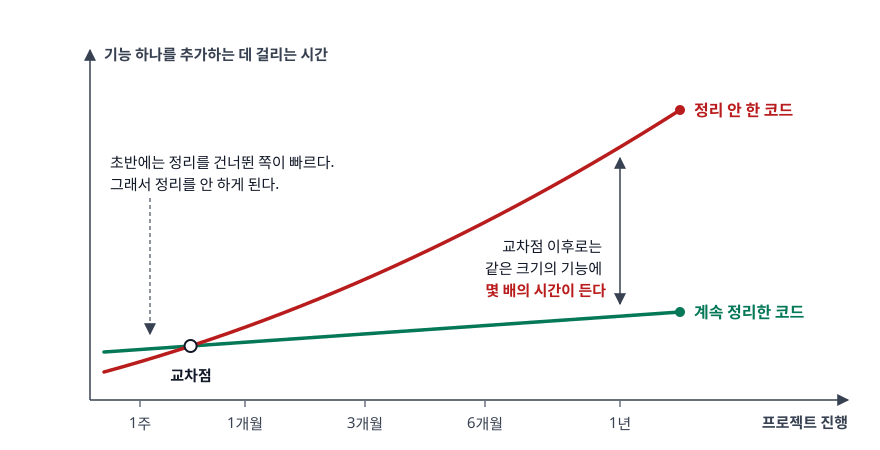
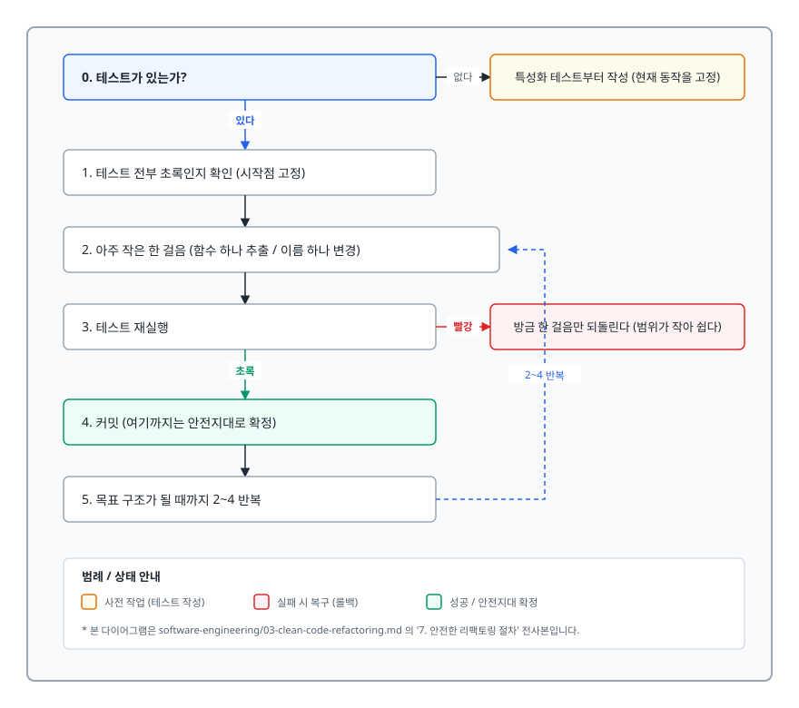
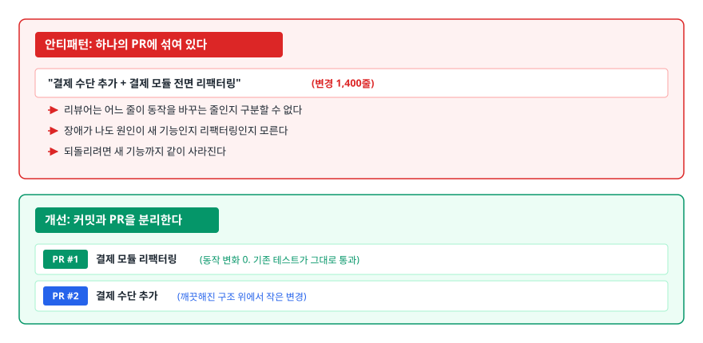

# 클린 코드와 리팩토링 (Clean Code & Refactoring)

> 나쁜 코드가 실제로 얼마를 청구하는지, 이름과 함수 크기가 왜 취향 문제가 아닌지, DRY를 과하게 밀어붙이면 무엇이 망가지는지, 그리고 리팩토링을 안전하게 하는 절차가 무엇인지 설명할 수 있게 됩니다.

## 학습 목표

- [ ] 나쁜 코드의 비용을 "변경 비용"이라는 말로 구체적으로 설명할 수 있다
- [ ] 좋은 이름과 나쁜 이름을 반례로 구분하고, 함수 크기·인자·주석의 원칙과 예외를 말할 수 있다
- [ ] KISS/YAGNI/DRY를 구분하고, DRY가 해로워지는 지점을 지적할 수 있다
- [ ] 코드 스멜을 보고 대응하는 리팩토링 기법을 고를 수 있다
- [ ] 리팩토링을 안전하게 진행하는 절차를 순서대로 설명할 수 있다

## 선행 지식

- [02-testing-tdd.md](./02-testing-tdd.md) - 리팩토링의 전제 조건이 테스트인 이유가 여기서 이어진다

---

## 1. 왜 필요한가 — 나쁜 코드는 이자를 붙여 청구한다

"동작하면 됐지"라는 말이 틀린 이유는 도덕이 아니라 산수에 있습니다. 소프트웨어는 한 번 만들고 끝나지 않고, **만든 시간보다 고치는 시간이 훨씬 길다.**

<!-- diagram:se-clean-code-refactoring-1 -->


<!-- 위 그림이 대체한 원본 ASCII.
     내용을 고칠 때는 그림도 함께 갱신할 것.
```
  기능 하나를 추가하는 데 걸리는 시간
   ↑
   │                                        ● 정리 안 한 코드
   │                                  ●
   │                            ●
   │                     ●
   │              ●                  ●  ●  ● 계속 정리한 코드
   │       ●          ●   ●   ●
   │  ●  ●   ●  ●
   └──────────────────────────────────────> 프로젝트 진행
      1주   1개월  3개월  6개월   1년

  초반에는 정리를 건너뛴 쪽이 빠르다. 그래서 정리를 안 하게 된다.
  교차점 이후로는 같은 크기의 기능에 몇 배의 시간이 든다.
```
-->

이 곡선이 만들어지는 메커니즘은 단순합니다. 코드를 고치려면 먼저 **읽어야** 합니다. 읽는 시간이 쓰는 시간보다 압도적으로 깁니다. 이름이 모호하고 함수가 300줄이면, 한 줄 고치기 위해 30분을 읽어야 합니다. 그리고 다 읽지 못한 채 고치면 예상 못 한 곳이 깨집니다. 깨진 것을 고치느라 또 읽습니다.

여기에 두 가지가 더 붙습니다.

**르블랑의 법칙(LeBlanc's Law)**: "나중은 결코 오지 않는다(Later equals never)." "일단 이렇게 두고 다음 스프린트에 정리하자"고 적어둔 TODO의 대부분은 정리되지 않습니다. 다음 스프린트에는 다음 스프린트의 마감이 있기 때문입니다.

**깨진 유리창 이론**: 지저분한 코드 옆에 새 코드를 쓸 때 사람은 그 수준에 맞춥니다. 이미 500줄인 함수에 20줄 더 붙이는 것에는 아무런 심리적 저항이 없습니다. 반대로 잘 정리된 파일에 지저분한 코드를 밀어 넣기는 어색합니다. **코드 품질은 개인의 의지가 아니라 주변 코드의 상태가 결정한다.**

### 비유: 기술 부채

이 상황을 워드 커닝햄은 기술 부채(technical debt)라고 불렀습니다. 급할 때 빌려 쓰고 나중에 갚는 것, 안 갚으면 이자가 붙는 것까지 대출과 닮았습니다.

> **비유의 한계**: 금융 부채는 원금과 이자율이 명시되지만, 기술 부채는 얼마를 빌렸는지도 이자가 얼마인지도 계약서에 안 적혀 있습니다. 그래서 "이 정도는 감당된다"는 판단이 늘 틀립니다. 또 의도적으로 빌린 부채(마감 때문에 알고서 미룬 것)와 그냥 못 만든 것은 완전히 다른데, 후자를 "기술 부채"라고 부르며 정당화하는 경우가 많습니다.

---

## 2. 이름 — 가장 자주 읽히는 문서

이름은 코드에서 가장 많이 읽히는 부분입니다. 그래서 이름을 잘 짓는 것은 스타일이 아니라 **문서 작성**입니다.

```java
// 안티패턴 1 - 의도를 감춘 이름
public List<int[]> getThem() {
    List<int[]> list1 = new ArrayList<>();
    for (int[] x : theList) {
        if (x[0] == 4) list1.add(x);
    }
    return list1;
}
```

**왜 문제인가**: 코드는 짧고 문법도 단순한데 아무것도 알 수 없습니다. `theList`는 무엇의 목록인지, `x[0]`은 무슨 값인지, `4`는 무슨 의미인지 전부 코드 밖의 지식입니다. 이 지식을 아는 사람이 팀을 떠나면 이 함수는 아무도 못 고칩니다.

```java
// 개선 - 이름만 바꿨는데 주석이 필요 없어졌다
public List<Cell> getFlaggedCells() {
    List<Cell> flaggedCells = new ArrayList<>();
    for (Cell cell : gameBoard) {
        if (cell.isFlagged()) flaggedCells.add(cell);
    }
    return flaggedCells;
}
```

이름 짓기에서 자주 어긋나는 지점을 정리하면 이렇습니다.

| 규칙 | 나쁜 예 | 좋은 예 | 이유 |
|---|---|---|---|
| 검색 가능한 이름 | `if (d > 7)` | `if (elapsedDays > MAX_RENTAL_DAYS)` | `7`은 전체 코드에서 수백 번 검색된다 |
| 타입을 이름에 넣지 않기 | `userList`, `nameString` | `users`, `name` | 타입이 바뀌면 이름이 거짓말이 된다 |
| 불용어 금지 | `UserData`, `UserInfo`, `UserManager` | `User`, `UserRegistry` | 셋의 차이를 아무도 설명할 수 없다 |
| 부정형 조건 피하기 | `if (!isNotValid(x))` | `if (isValid(x))` | 이중 부정은 읽을 때마다 머릿속에서 뒤집어야 한다 |
| 함수는 동사, 클래스는 명사 | `class Calculate` / `void order()` | `class Calculator` / `void placeOrder()` | 품사가 맞아야 호출부가 문장처럼 읽힌다 |

**한 가지 예외**를 알아두면 좋습니다. `i`, `j` 같은 짧은 이름이 항상 나쁜 것은 아닙니다. 스코프가 세 줄짜리 반복문이면 `i`가 오히려 명확합니다. **이름의 길이는 스코프의 길이에 비례해야 한다.** 전역 상수는 길고 구체적으로, 두 줄짜리 지역 변수는 짧게.

---

## 3. 함수 — 크기보다 중요한 것

"함수는 20줄 이하"처럼 줄 수를 규칙으로 만드는 경우가 많은데, 줄 수는 결과지 원인이 아닙니다. 진짜 기준은 두 가지입니다. **한 가지 일만 하는가**, 그리고 **함수 안의 문장들이 같은 추상화 수준에 있는가**.

```java
// 안티패턴 - 추상화 수준이 섞여 있다
public void processOrder(Order order) throws IOException, InterruptedException {
    // 수준 1: 정책 판단
    if (order.getItems().isEmpty()) {
        throw new IllegalArgumentException("빈 주문");
    }
    // 수준 3: SQL 문자열 조립 (갑자기 아주 낮은 수준)
    String sql = "INSERT INTO orders (user_id, amount) VALUES ("
               + order.getUserId() + ", " + order.getAmount() + ")";
    jdbcTemplate.execute(sql);   // 문자열 연결 방식은 SQL 인젝션에도 노출된다
    // 수준 2: 외부 연동
    HttpRequest request = HttpRequest.newBuilder()
            .uri(URI.create("https://api.example.com/pay"))
            .POST(HttpRequest.BodyPublishers.ofString(toJson(order)))
            .build();
    httpClient.send(request, HttpResponse.BodyHandlers.ofString());
    // 수준 1: 다시 정책
    order.markAsPaid();
}
```

**왜 문제인가**: 읽는 사람이 매 줄마다 사고의 고도를 바꿔야 한다(참고로 저 SQL 문자열 연결은 인젝션 취약점이기도 합니다. 실제로는 바인딩 파라미터를 쓴다). "주문 처리가 어떤 순서로 일어나는가"를 알고 싶은 사람도 SQL 문자열 조립을 읽어야 하고, 결제 API 스펙을 확인하러 온 사람도 정책 코드를 지나가야 합니다. HTTP 클라이언트의 검사 예외가 `throws IOException, InterruptedException`으로 시그니처까지 새어 나오는 것도 같은 증상이다 — 호출부는 주문 처리에 왜 통신 예외가 딸려오는지 알 수 없습니다. 게다가 변경 이유가 최소 세 가지(정책 변경, DB 스키마 변경, 결제사 변경)라서 이 함수는 끊임없이 수정됩니다.

```java
// 개선 - 각 줄이 같은 높이에서 읽힌다
public void processOrder(Order order) {
    validate(order);
    orderRepository.save(order);
    paymentClient.pay(order);
    order.markAsPaid();
}
```

`processOrder`만 읽으면 흐름 전체가 네 줄로 보이고, 세부가 궁금한 사람만 아래로 내려갑니다. 이것이 "함수는 한 가지 일만 한다"의 실질적인 의미입니다. 위 함수도 네 가지를 하는 것처럼 보이지만, **한 단계 아래의 일들을 순서대로 부르는 것**이므로 추상화 수준은 하나입니다.

### 인자와 플래그

인자는 적을수록 좋습니다. 0~2개가 편하고, 3개부터는 순서를 외워야 하며, 4개 이상이면 호출부에서 실수가 납니다.

```java
// 안티패턴 - 플래그 인자
public void sendEmail(User user, boolean isUrgent) {
    if (isUrgent) { /* 즉시 발송 */ } else { /* 큐에 넣기 */ }
}
sendEmail(user, true);   // 호출부만 봐서는 true가 무슨 뜻인지 모른다
```

**왜 문제인가**: `boolean` 인자는 함수가 사실 두 개의 함수라고 자백하는 신호입니다. 그리고 호출부에서 `true`, `false`는 아무 의미도 전달하지 못합니다.

```java
// 개선 - 함수를 둘로 나눈다
public void sendEmailImmediately(User user) { ... }
public void queueEmail(User user) { ... }
```

인자가 여럿인데 항상 함께 다닌다면(`startDate`, `endDate`가 늘 붙어다니는 식) 그건 **데이터 뭉치(Data Clumps)** 스멜입니다. `DateRange` 같은 객체로 묶으면 인자 수도 줄고 "시작일이 종료일보다 늦으면 안 된다" 같은 검증을 그 객체가 갖게 됩니다.

---

## 4. 주석 — 대부분은 실패의 흔적이다

주석이 나쁘다는 말이 아닙니다. **코드로 표현할 수 있는 것을 주석으로 대신하는 것**이 문제입니다. 주석은 컴파일되지 않으므로 검증받지 않고, 검증받지 않는 문장은 시간이 지나면 거짓말이 됩니다.

```java
// 안티패턴 1 - 코드를 그대로 번역한 주석
// 사용자 나이를 1 증가시킨다
user.setAge(user.getAge() + 1);

// 안티패턴 2 - 주석으로 함수를 나눈다
public void report() {
    // --- 데이터 조회 ---   ...15줄...
    // --- 집계 ---         ...20줄...
    // --- 출력 ---         ...10줄...
}

// 안티패턴 3 - 주석 처리된 코드
// int oldRate = calculateOldRate(amount);
// if (oldRate > 0) { ... }
```

**왜 문제인가**: 1번은 정보가 0인데 유지보수 대상만 하나 늘었습니다. 2번의 구획 주석은 "여기를 함수로 빼라"는 신호를 주석으로 덮은 것이다 — `fetchSales()`, `aggregate()`, `print()`로 추출하면 주석 없이 세 줄로 읽힙니다. 3번이 가장 나쁩니다. 지워도 되는지 아무도 모르니 영원히 남고, 읽는 사람마다 "이게 왜 있지?"에 시간을 씁니다. **버전 관리 시스템이 있으므로 지운 코드는 언제든 되찾을 수 있다.**

### 그래도 필요한 주석

- **왜(WHY)**: `// 결제사 API가 200ms 내에 응답하지 않으면 중복 결제가 발생하므로 타임아웃을 짧게 유지한다` — 코드만 봐서는 절대 알 수 없는 배경입니다.
- **경고**: `// 이 메서드는 스레드 안전하지 않다. 호출부에서 동기화할 것`
- **공개 API 문서**: 라이브러리로 배포되는 코드의 Javadoc처럼, 소스를 보지 않을 사용자를 위한 설명
- **법적/규정 근거**: `// 전자상거래법 제17조에 따라 7일 이내 청약철회 허용`

기준은 하나입니다. **"코드를 고쳐서 없앨 수 있는 주석인가?"** 없앨 수 있으면 코드를 고치고, 없앨 수 없으면 주석으로 남깁니다.

---

## 5. KISS, YAGNI, DRY — 그리고 DRY의 배신

| 원칙 | 뜻 | 겨냥하는 실수 |
|---|---|---|
| KISS (Keep It Simple, Stupid) | 가장 단순한 방법으로 | 영리한 한 줄짜리 코드, 불필요한 디자인 패턴 |
| YAGNI (You Aren't Gonna Need It) | 지금 필요 없으면 만들지 마라 | "나중에 DB를 바꿀 수도 있으니" 만든 추상화 계층 |
| DRY (Don't Repeat Yourself) | 지식을 한 곳에만 두라 | 같은 규칙이 세 파일에 흩어져 하나만 고쳐지는 상황 |

세 원칙은 종종 서로를 견제합니다. 중복을 없애려다(DRY) 복잡해지고(KISS 위반), 미래를 대비하려다(추상화) 쓰지도 않을 코드를 만든다(YAGNI 위반). 그래서 순서가 있다면 **KISS와 YAGNI가 먼저이고, DRY는 중복이 실제로 아플 때 적용한다.**

### DRY를 과하게 적용하면 생기는 일

DRY의 원문은 "코드를 반복하지 마라"가 아니라 **"모든 지식은 시스템 안에서 단 하나의, 모호하지 않고 권위 있는 표현을 가져야 한다"**(《실용주의 프로그래머》)입니다. 핵심은 코드 모양이 아니라 **지식**입니다. 모양이 같다고 지식까지 같은 것은 아닙니다.

```java
// 지금 이 순간 두 함수는 거의 같아 보인다
public String buildOrderEmail(User user, Order order) {
    return "안녕하세요 " + user.getName() + "님, 주문이 접수되었습니다.";
}
public String buildSignupEmail(User user) {
    return "안녕하세요 " + user.getName() + "님, 가입이 완료되었습니다.";
}

// 안티패턴 - "중복이니까" 합친다
public String buildEmail(User user, String type) {
    String body = type.equals("ORDER") ? "주문이 접수되었습니다." : "가입이 완료되었습니다.";
    return "안녕하세요 " + user.getName() + "님, " + body;
}
```

여기까지는 깔끔해 보입니다. 문제는 요구사항이 갈라지기 시작할 때입니다.

```java
// 6개월 뒤 주문 메일에만 상품명이, 3개월 뒤 가입 메일에만 쿠폰이,
// 다시 2개월 뒤 주문 메일에만 영문 지원이 필요해지면
public String buildEmail(User user, String type, Order order,
                         String couponCode, Locale locale) {
    if (type.equals("ORDER")) {
        if (locale == Locale.ENGLISH) { ... }
    } else if (type.equals("SIGNUP")) {
        if (couponCode != null) { ... }
    }
    // 아무도 이 함수를 건드리고 싶어하지 않는다
}
```

**왜 문제인가**: 합칠 당시 두 코드가 닮았던 것은 **우연**이었습니다. 주문 메일과 가입 메일은 **변경 이유가 다르다.** 변경 이유가 다른 것을 한 함수에 묶으면, 한쪽이 바뀔 때마다 다른 쪽을 건드리게 되고 결국 조건 분기가 무한히 자랍니다. 샌디 메츠의 표현대로 **"중복이 잘못된 추상화보다 훨씬 싸다."**

**개선**: 원래대로 둘로 되돌립니다. 정말 공통인 것 — 인사말 형식 — 만 뽑습니다.

```java
public String greeting(User user) {
    return "안녕하세요 " + user.getName() + "님, ";
}
public String buildOrderEmail(User user, Order order) {
    return greeting(user) + order.summary() + " 주문이 접수되었습니다.";
}
public String buildSignupEmail(User user) {
    return greeting(user) + "가입이 완료되었습니다.";
}
```

판단 기준을 하나만 기억하자. **"이 둘은 항상 같이 바뀌는가?"** 항상 같이 바뀌면 같은 지식이니 합칩니다. 따로 바뀔 수 있으면 우연히 닮은 것이니 그대로 둡니다. 판단이 애매하면 **중복을 남기고 세 번째 사례를 기다린다.** 세 번째가 왔을 때는 공통점이 무엇인지 확실히 보입니다.

---

## 6. 코드 스멜과 대응 기법

코드 스멜(Code Smell)은 "여기 문제가 있을 수 있다"는 신호입니다. 규칙 위반이 아니라 **조사해볼 지점**입니다.

| 스멜 | 증상 | 대응 리팩토링 |
|---|---|---|
| 긴 함수 | 스크롤해야 끝이 보인다 | 함수 추출(Extract Function) |
| 중복 코드 | 같은 지식이 여러 곳에 | 함수 추출 후 호출로 대체 |
| 큰 클래스 | 필드가 20개, 책임이 여러 개 | 클래스 추출(Extract Class) |
| 긴 매개변수 목록 | 인자 4개 이상 | 매개변수 객체 도입, 객체 통째로 넘기기 |
| 데이터 뭉치 | 같은 인자 3개가 늘 붙어 다닌다 | 매개변수 객체 도입 |
| 기본형 집착 | 이메일·금액을 `String`, `int`로 | 기본형을 객체로 바꾸기(값 객체) |
| 기능 편애 | 이 함수가 남의 클래스 필드만 만진다 | 함수 이동(Move Function) |
| 반복되는 switch | 타입별 분기가 여러 파일에 흩어져 있다 | 조건부 로직을 다형성으로 바꾸기 |
| 뒤엉킨 변경 | 한 클래스가 서로 다른 이유로 계속 바뀐다 | 클래스 추출 (단일 책임 회복) |
| 산탄총 수술 | 하나 바꾸려면 일곱 파일을 열어야 한다 | 함수/필드 이동으로 한 곳에 모으기 |
| 주석 과다 | 주석 없이는 못 읽는다 | 함수 추출 + 이름 바꾸기 |

> 표 사용법: **왼쪽 열의 증상이 보일 때 오른쪽 열부터 시도한다.** 다만 스멜이 곧 결함은 아닙니다. 하루에 한 번 도는 배치 스크립트의 100줄짜리 함수는, 읽는 사람도 고칠 일도 없다면 그냥 두는 것이 합리적일 수 있습니다. 리팩토링은 **자주 읽히고 자주 바뀌는 코드**에 먼저 투자합니다.

'뒤엉킨 변경'과 '산탄총 수술'은 정확히 반대 방향의 문제라 짝지어 기억하면 좋습니다. 전자는 **한 클래스가 너무 많은 이유로 바뀌는 것**(→ 쪼갠다), 후자는 **한 가지 변경이 너무 많은 클래스에 흩어진 것**(→ 모은다)입니다. 둘 다 단일 책임 원칙과 직결됩니다.

---

## 7. 안전한 리팩토링 절차

리팩토링(Refactoring)의 정의에는 조건이 붙어 있습니다. **"외부 동작을 바꾸지 않으면서 내부 구조를 개선하는 것."** 동작이 바뀌면 그건 리팩토링이 아니라 기능 변경입니다. 그리고 동작이 안 바뀌었다는 것을 **증명할 수단이 테스트입니다.

<!-- diagram:se-clean-code-refactoring-2 -->


<!-- 위 그림이 대체한 원본 ASCII.
     내용을 고칠 때는 그림도 함께 갱신할 것.
```
┌──────────────────────────────────────────────────────────┐
│  0. 테스트가 있는가?                                      │
│       없다 ──> 특성화 테스트부터 작성 (현재 동작을 고정)   │
│       있다 ──┐                                            │
│              ↓                                            │
│  1. 테스트 전부 초록인지 확인 (시작점 고정)                │
│              ↓                                            │
│  2. 아주 작은 한 걸음 (함수 하나 추출 / 이름 하나 변경)     │
│              ↓                                            │
│  3. 테스트 재실행                                         │
│      빨강 ──> 방금 한 걸음만 되돌린다 (범위가 작아 쉽다)   │
│      초록 ──┐                                             │
│              ↓                                            │
│  4. 커밋 (여기까지는 안전지대로 확정)                      │
│              ↓                                            │
│  5. 목표 구조가 될 때까지 2~4 반복                         │
└──────────────────────────────────────────────────────────┘
```
-->

여기서 사람들이 가장 많이 어기는 것이 **2번의 "작은"**입니다. 한 시간 동안 다섯 개 파일을 뜯어고친 뒤 테스트를 돌리면, 빨간불이 떴을 때 다섯 개 중 무엇이 원인인지 알 수 없습니다. 그때부터는 디버깅이 아니라 도박이 됩니다. **되돌리기가 30초 안에 가능한 크기**가 한 걸음의 기준입니다.

### 두 개의 모자를 동시에 쓰지 않는다

마틴 파울러의 비유로, 코드를 만질 때 쓸 수 있는 모자는 두 개입니다. **기능 추가 모자**와 **리팩토링 모자**. 규칙은 하나 — 동시에 쓰지 않습니다.

<!-- diagram:se-clean-code-refactoring-3 -->


<!-- 위 그림이 대체한 원본 ASCII.
     내용을 고칠 때는 그림도 함께 갱신할 것.
```
안티패턴: 하나의 PR에 섞여 있다
  "결제 수단 추가 + 결제 모듈 전면 리팩토링"  (변경 1,400줄)
  → 리뷰어는 어느 줄이 동작을 바꾸는 줄인지 구분할 수 없다
  → 장애가 나도 원인이 새 기능인지 리팩토링인지 모른다
  → 되돌리려면 새 기능까지 같이 사라진다

개선: 커밋과 PR을 분리한다
  PR #1  결제 모듈 리팩토링 (동작 변화 0. 기존 테스트가 그대로 통과)
  PR #2  결제 수단 추가 (깨끗해진 구조 위에서 작은 변경)
```
-->

### 레거시 코드에는 특성화 테스트부터

테스트가 없는 코드를 만나면 순서가 하나 늘어납니다. 마이클 페더스가 특성화 테스트(characterization test)라고 부른 것으로, **현재 동작이 옳은지 따지지 않고 지금 무엇을 하는지 그대로 고정**하는 테스트입니다.

```java
// 이 함수가 왜 이런 값을 내는지 아무도 모른다. 하지만 지금 이렇게 동작한다
@Test
void 현재_동작을_고정한다() {
    assertEquals(1250, legacyFeeCalculator.calculate(10_000, "A", true));
    assertEquals(0,    legacyFeeCalculator.calculate(0, "B", false));
    assertEquals(-1,   legacyFeeCalculator.calculate(-5, "A", true));  // 버그로 보이지만 일단 고정
}
```

`-1`이 버그처럼 보여도 지금은 고치지 않습니다. **먼저 안전망을 만들고, 구조를 정리하고, 그 다음에 동작을 고친다.** 셋을 동시에 하면 무엇 때문에 깨졌는지 영원히 모릅니다.

---

## 8. 순수 함수와 불변성이 유지보수에 주는 것

함수형 프로그래밍의 개념 중 유지보수에 직접 효과가 있는 두 가지가 순수 함수와 불변성입니다.

**순수 함수(pure function)**는 같은 입력에 항상 같은 출력을 내고, 바깥 세상을 건드리지 않는 함수입니다. 이 성질이 주는 실질적 이득은 **읽을 범위가 함수 안으로 한정된다**는 것입니다. 순수 함수를 이해하려고 다른 파일을 열 필요가 없습니다.

```java
// 안티패턴 - 인자를 몰래 바꾼다
public int applyDiscount(Cart cart) {
    cart.setTotal(cart.getTotal() - 1000);   // 호출부의 cart가 바뀐다
    return cart.getTotal();
}

Cart cart = loadCart();
int price = applyDiscount(cart);
sendReceipt(cart);      // 여기서 쓰는 cart는 이미 할인된 상태다. 의도한 건가?
```

**왜 문제인가**: 함수 이름은 "적용해서 결과를 알려준다"로 읽히는데 실제로는 인자를 변형합니다. 호출부에서는 이 사실이 전혀 보이지 않습니다. 이런 함수가 여러 개 겹치면 어느 시점에 어떤 값이 들어 있는지 추적하려고 호출 스택 전체를 따라가야 합니다.

```java
// 개선 - 입력을 건드리지 않고 새 값을 만든다
public Money applyDiscount(Money total) {
    return total.minus(Money.won(1000));
}
```

**불변 객체(immutable object)**는 생성 후 상태가 바뀌지 않는 객체입니다. **동시성 안전**(아무도 바꾸지 않으므로 락이 필요 없다), **방어적 복사 불필요**(남에게 넘겨도 몰래 바뀌지 않는다), **디버깅 범위 축소**가 따라옵니다. 마지막 것이 특히 큽니다. 값이 잘못됐다면 만들어진 지점 하나만 보면 되지만, 가변 객체는 "어디선가 바뀌었다"의 후보가 코드 전체입니다.

```java
// record는 Java 16에서 정식 도입됐다. 필드가 final인 불변 타입을 간결하게 만든다
public record Money(long amount) {
    public Money {                                   // 압축 생성자
        if (amount < 0) throw new IllegalArgumentException("음수 금액: " + amount);
    }
    public static Money won(long amount) { return new Money(amount); }
    public Money plus(Money other)  { return new Money(this.amount + other.amount); }
    public Money minus(Money other) { return new Money(this.amount - other.amount); }
}
```

값 객체로 감싸면 **기본형 집착 스멜도 같이 해결된다.** `long amount`가 `Money`가 되는 순간 음수 검증이 생성자 한 곳으로 모이고, `Money`와 `Quantity`처럼 단위가 다른 값을 실수로 더하는 코드가 컴파일 단계에서 막힙니다. 다만 위 정의만으로 원화와 달러가 구분되지는 않습니다. 통화까지 다뤄야 한다면 `record Money(long amount, Currency currency)`로 필드를 늘리고 `plus`에서 통화가 다르면 예외를 던지도록 해야 합니다.

> 주의: 모든 것을 불변으로 만들라는 뜻은 아닙니다. 대량 데이터를 반복 수정하는 경우 매번 새 객체를 만드는 비용이 문제가 될 수 있습니다. 기본값을 불변으로 두고, 성능 측정 결과 필요한 지점만 가변으로 여는 순서가 맞습니다.

---

## 9. 실무에서는

- **자동화 가능한 것은 리뷰가 아니라 도구로 막는다**: 포매터(Spotless, Prettier), 린터(Checkstyle, ESLint), 정적 분석(SonarQube)을 CI에 걸어두면 들여쓰기와 미사용 import를 놓고 사람이 논쟁할 일이 없어집니다. 사람의 리뷰는 이름과 구조에 씁니다. 구조를 바꿀 때는 IDE의 자동 리팩토링(Extract Method, Rename, Change Signature)을 쓴다 — 참조를 전부 찾아 함께 바꿔주므로, 문자열 안의 같은 단어까지 건드리는 find & replace보다 안전합니다.
- **보이스카웃 규칙**: "처음 왔을 때보다 깨끗하게 해두고 떠난다." 별도의 리팩토링 스프린트를 잡는 것보다, 기능 작업 중 지나가는 파일에서 이름 하나·함수 하나를 고치는 편이 실제로는 훨씬 많이 정리됩니다. 별도 스프린트는 우선순위 경쟁에서 늘 밀립니다.
- **큰 리팩토링은 나눠서 배포한다**: 브랜치를 몇 주씩 들고 있으면 그 사이 main이 앞서가 병합 지옥이 옵니다. 새 구조와 옛 구조를 잠시 공존시키고 호출부를 조금씩 옮긴 뒤 옛 구조를 지우는 방식이 안전합니다.

---

## 10. 면접 포인트

> 면접에서 이 주제가 나오면 이렇게 답한다

**Q. 클린 코드가 왜 중요한가요? 동작하면 되는 것 아닌가요?**
A. 코드는 쓰는 시간보다 읽는 시간이 훨씬 길기 때문입니다. 이름이 모호하고 함수가 크면 한 줄 고치기 위해 읽는 시간이 계속 늘어나고, 그 상태로 고치면 예상 못 한 곳이 깨집니다. 그래서 초반에는 정리를 건너뛴 쪽이 빠르지만 어느 시점부터 역전됩니다. 여기에 깨진 유리창 효과까지 붙어서, 지저분한 코드 옆에는 지저분한 코드가 계속 쌓입니다.
- 꼬리 질문: "그럼 마감이 급할 때도 항상 클린 코드를 지키나요?" → 의도적으로 부채를 지는 것은 선택지입니다. 다만 그 사실을 팀이 알게 남기고, 갚는 시점을 백로그 항목으로 만들어야 한다고 답합니다.

**Q. 리팩토링과 기능 개선은 어떻게 다른가요?**
A. 리팩토링은 외부 동작을 그대로 두고 내부 구조만 바꾸는 것입니다. 동작이 달라지면 그건 기능 변경이지 리팩토링이 아닙니다. 그래서 리팩토링에는 동작이 안 바뀌었음을 증명할 테스트가 반드시 필요하고, 커밋과 PR도 기능 변경과 분리합니다. 섞으면 장애가 났을 때 원인이 새 기능인지 구조 변경인지 구분할 수 없고, 되돌릴 때 기능까지 함께 사라집니다.
- 꼬리 질문: "테스트가 없는 레거시는 어떻게 리팩토링하나요?" → 현재 동작을 그대로 고정하는 특성화 테스트를 먼저 만듭니다. 버그처럼 보이는 동작도 일단 그대로 고정하고, 구조를 정리한 뒤에 별도로 고친다고 답합니다.

**Q. DRY 원칙을 항상 지켜야 하나요?**
A. 아닙니다. DRY의 대상은 코드 모양이 아니라 지식입니다. 두 코드가 지금 닮았다는 이유만으로 합치면, 요구사항이 갈라질 때 조건 분기가 무한히 자라는 함수가 됩니다. 판단 기준은 "이 둘이 항상 같이 바뀌는가"이고, 애매하면 중복을 남기고 세 번째 사례를 기다립니다. 잘못된 추상화를 되돌리는 비용이 중복을 감수하는 비용보다 훨씬 큽니다.
- 꼬리 질문: "그럼 중복을 언제 제거하나요?" → 같은 지식이 여러 곳에 있어서 한 곳만 고치면 버그가 나는 상황일 때. 즉 변경 이유가 같을 때라고 답합니다.

**Q. 좋은 함수의 기준은 무엇인가요?**
A. 줄 수보다 두 가지를 봅니다. 한 가지 일만 하는가, 그리고 함수 안의 문장들이 같은 추상화 수준에 있는가입니다. 정책 판단과 SQL 문자열 조립이 한 함수에 섞여 있으면 읽는 사람이 매 줄 사고의 고도를 바꿔야 하고, 변경 이유도 여러 개가 됩니다. 인자는 3개를 넘지 않게 하고, `boolean` 플래그 인자는 함수를 둘로 나누라는 신호로 읽습니다.
- 꼬리 질문: "함수를 너무 잘게 쪼개면 오히려 읽기 어렵지 않나요?" → 그렇습니다. 호출을 따라 파일을 여러 번 오가야 하면 손해입니다. 이름만 봐도 내용을 짐작할 수 있을 때만 쪼개는 것이 기준이라고 답합니다.

---

## 자주 하는 실수

| 실수 | 왜 틀렸나 | 올바른 이해 |
|---|---|---|
| "함수는 무조건 20줄 이하" | 줄 수는 결과지 기준이 아닙니다. 억지로 자르면 의미 없는 함수가 늘어난다 | 한 가지 일을 하는가, 추상화 수준이 하나인가로 판단한다 |
| "중복은 무조건 제거한다" | 우연히 닮은 코드를 합치면 조건 분기가 무한히 자란다 | 변경 이유가 같을 때만 합칩니다. 애매하면 세 번째를 기다린다 |
| "주석을 많이 달면 친절한 코드" | 검증받지 않는 문장은 시간이 지나면 거짓말이 된다 | 코드로 없앨 수 있는 주석은 코드를 고치고, WHY만 남긴다 |
| "리팩토링 = 코드를 예쁘게 다듬는 것" | 정의에 "외부 동작 불변"이 포함된다 | 동작이 바뀌면 리팩토링이 아닙니다. 테스트로 증명해야 한다 |
| "리팩토링은 시간을 따로 받아야 한다" | 별도 일정은 우선순위 경쟁에서 항상 밀린다 | 지나가는 파일을 조금씩 고치는 방식이 실제로 더 많이 정리된다 |
| "미래 확장을 위해 미리 추상화한다" | 예측한 확장의 대부분은 오지 않고, 오더라도 예상과 다른 모양으로 온다 | YAGNI. 두 번째 사례가 실제로 왔을 때 추상화한다 |

---

## 한 줄 정리

클린 코드는 취향이 아니라 **변경 비용을 낮추려는 경제적 선택**이고, 리팩토링은 그 비용을 낮추는 작업을 **동작이 안 바뀌었음을 테스트로 증명하면서 아주 작은 걸음으로** 수행하는 절차입니다.

---

## 연관 개념

- [02-testing-tdd.md](./02-testing-tdd.md) - 리팩토링을 가능하게 하는 안전망 만들기
- [04-architecture-monolith-msa.md](./04-architecture-monolith-msa.md) - 같은 원칙을 클래스가 아니라 서비스 단위로 적용할 때
- [01-agile-process.md](./01-agile-process.md) - 코드 리뷰에서 무엇을 지적하고 무엇을 자동화할 것인가
- [qna-software-engineering.md](./qna-software-engineering.md) - 클린 코드·KISS·함수형 면접 질문(Q6, Q11, Q12)
- [../02-backend-engineering/java-fundamentals/01-oop-solid.md](../02-backend-engineering/java-fundamentals/01-oop-solid.md) - 단일 책임 원칙과 코드 스멜의 관계
- [../04-design-patterns/qna-design-patterns.md](../04-design-patterns/qna-design-patterns.md) - 조건부 로직을 다형성으로 바꿀 때 쓰는 패턴들
