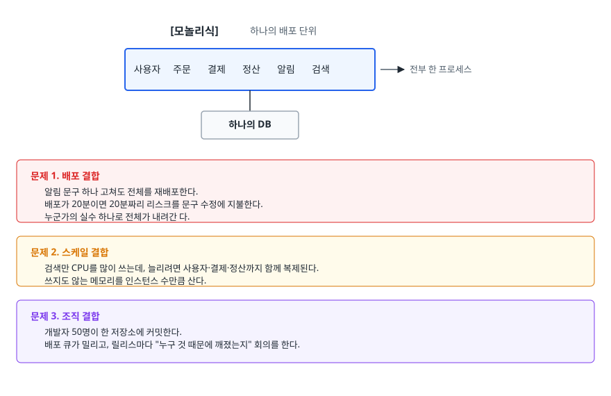
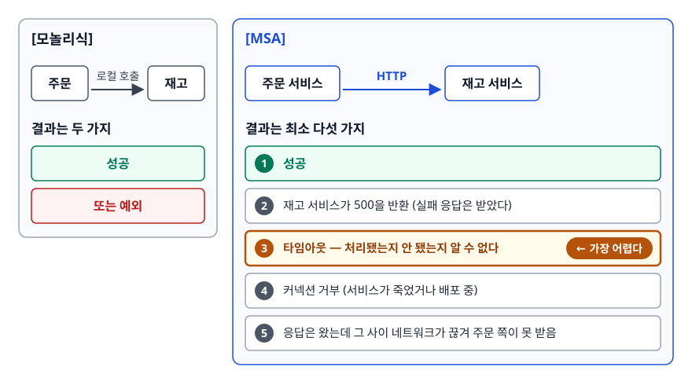
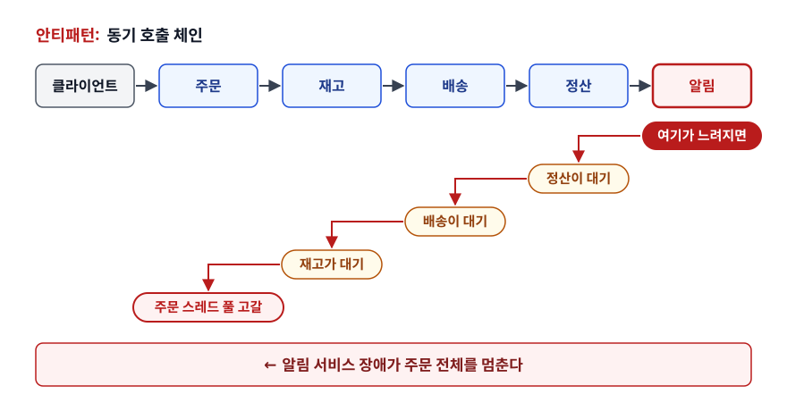
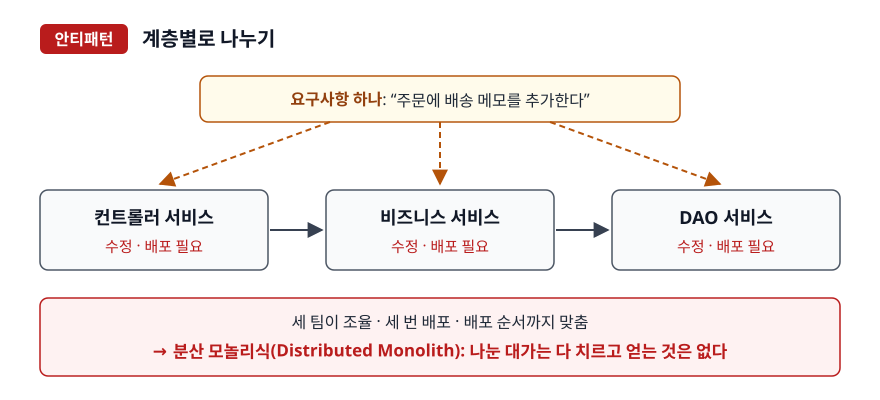
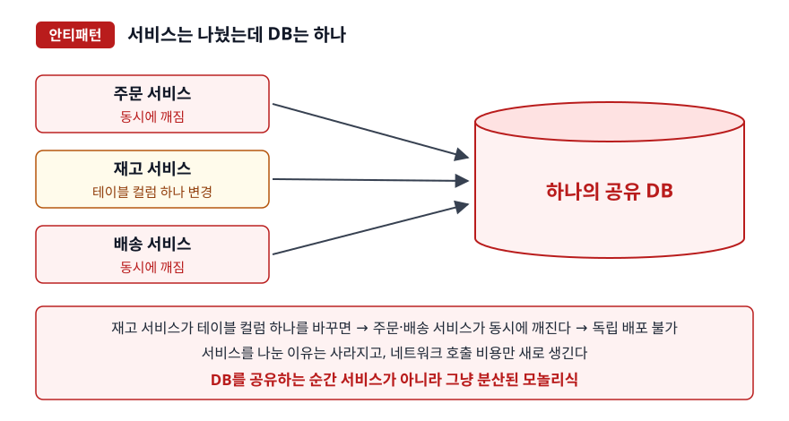
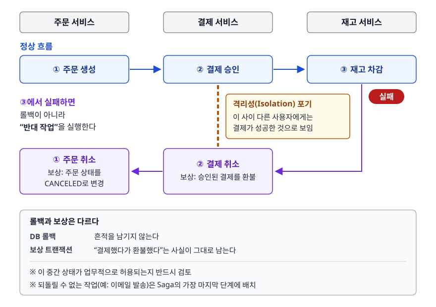
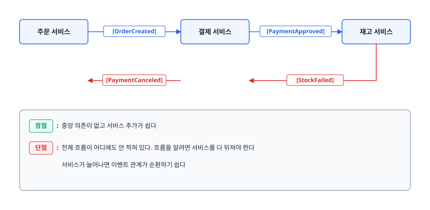
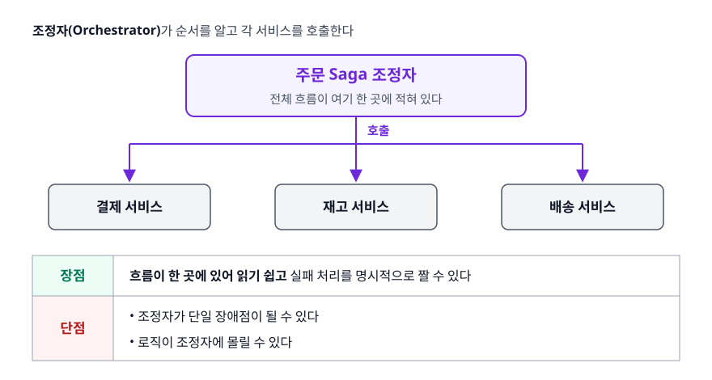
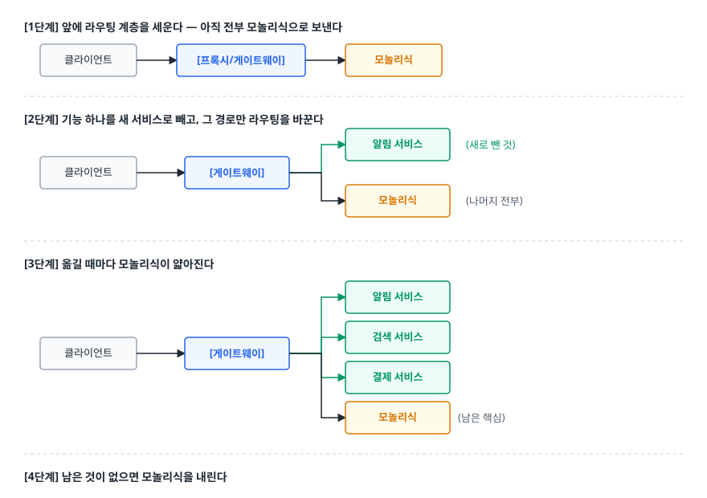

# 모놀리식과 마이크로서비스 (Monolith & Microservices)

> 모놀리식은 여러 가지를 공짜로 주고, MSA는 무언가를 사는 대신 그 값을 내놓게 합니다. 이 문서는 그 계산을 풉니다. 모놀리식이 왜 여전히 유효한 선택인지, 서비스 경계를 어떤 기준으로 긋는지, 옮겨가야 한다면 어떤 순서로 옮기는지도 함께 다룹니다.

## 학습 목표

- [ ] 모놀리식이 실제로 아파지는 지점 세 가지를 말할 수 있다
- [ ] MSA가 새로 만드는 문제(분산 트랜잭션·네트워크 실패·운영 복잡도)를 구체적으로 설명할 수 있다
- [ ] 서비스 경계를 도메인 기준으로 긋는 이유와, 기술 계층으로 나눌 때 생기는 일을 구분할 수 있다
- [ ] 동기 호출과 비동기 이벤트의 트레이드오프를 상황에 맞게 고를 수 있다
- [ ] Saga 패턴의 두 방식과 보상 트랜잭션의 한계를 설명할 수 있다
- [ ] 스트랭글러 피그 방식으로 전환 계획을 세울 수 있다

## 선행 지식

- HTTP API를 만들어본 경험, 데이터베이스 트랜잭션의 기본 개념
- [03-clean-code-refactoring.md](./03-clean-code-refactoring.md) - 여기서 다룬 결합도 이야기가 서비스 단위로 확장됩니다

---

## 1. 모놀리식은 실패가 아니라 기본값이다

MSA를 설명하는 글의 대부분이 모놀리식을 "낡은 것"으로 그리는데, 이건 사실과 다릅니다. **거의 모든 시스템은 모놀리식으로 시작해야 하고 상당수는 끝까지 모놀리식으로 남는 것이 옳습니다.**

모놀리식이 공짜로 주는 것부터 봅니다.

- **로컬 함수 호출**: 네트워크가 없습니다. 타임아웃도, 재시도도, 부분 실패도 없습니다. 호출은 성공하거나 예외를 던집니다.
- **하나의 트랜잭션**: 주문 저장과 재고 차감을 한 트랜잭션에 묶으면 DB가 원자성을 보장합니다. 실패하면 전부 롤백됩니다.
- **하나의 스택 트레이스**: 에러가 나면 원인부터 결과까지 한 화면에 나옵니다.
- **하나의 배포**: 파이프라인 하나, 모니터링 대상 하나, 롤백 명령 하나.
- **자유로운 조인**: 주문과 사용자를 한 쿼리로 조인합니다.

MSA로 가면 이 다섯 가지를 **전부 잃고** 각각을 직접 구현해야 합니다. 물어야 할 것은 "MSA가 좋은가"가 아니라 **"이 다섯 가지를 포기할 만큼 아픈 문제가 지금 있는가"입니다.**

### 모놀리식이 실제로 아파지는 지점

<!-- diagram:se-architecture-monolith-msa-1 -->


<!-- 위 그림이 대체한 원본 ASCII.
     내용을 고칠 때는 그림도 함께 갱신할 것.
```
[모놀리식]  하나의 배포 단위

  ┌──────────────────────────────────────┐
  │  사용자  주문  결제  정산  알림  검색 │  ← 전부 한 프로세스
  └──────────────────────────────────────┘
                    │
              ┌───────────┐
              │  하나의 DB │
              └───────────┘

  문제 1. 배포 결합
    알림 문구 하나 고쳐도 전체를 재배포한다.
    배포가 20분이면 20분짜리 리스크를 문구 수정에 지불한다.
    누군가의 실수 하나로 전체가 내려간다.

  문제 2. 스케일 결합
    검색만 CPU를 많이 쓰는데, 늘리려면 사용자·결제·정산까지 함께 복제된다.
    쓰지도 않는 메모리를 인스턴스 수만큼 산다.

  문제 3. 조직 결합
    개발자 50명이 한 저장소에 커밋한다.
    배포 큐가 밀리고, 릴리스마다 "누구 것 때문에 깨졌는지" 회의를 한다.
```
-->

세 문제 중 **실무에서 MSA 도입을 부르는 가장 흔한 이유는 세 번째**입니다. 팀이 커지면서 배포 조율 비용이 개발 비용을 넘어서는 순간이 옵니다. 반대로 말하면, **팀이 작은데 배포 조율 문제가 없다면 MSA가 사줄 것이 거의 없습니다.**

### 비유: 셰어하우스와 각자 원룸

모놀리식은 여럿이 한 집에 사는 것과 비슷합니다. 냉장고·세탁기·인터넷을 공유하니 싸고, 옆방에 할 말이 있으면 문만 열면 됩니다. 대신 한 명이 새벽에 청소기를 돌리면 전부 깹니다. MSA는 각자 원룸으로 흩어지는 쪽입니다. 서로 간섭은 사라지지만 냉장고를 인원수만큼 사야 하고, 얼굴 한 번 보려면 약속을 잡아야 합니다.

> **비유의 한계**: 원룸으로 흩어지는 데는 하루면 됩니다. 서비스 분리는 몇 달에서 몇 년이 걸리고, 잘못 나눴을 때 되돌리는 비용도 비교가 안 되게 큽니다. 더 중요한 차이는 따로 있습니다. 룸메이트끼리는 "말을 걸었는데 대답이 없는" 상태가 없습니다. 서비스 사이에는 네트워크가 있어서 이 상태가 상시로 존재하고, 3절에서 볼 문제 대부분이 여기서 나옵니다.

### 진흙 공과 모놀리식은 다르다

"모놀리식이라서 유지보수가 안 된다"는 말의 상당수는 사실 **진흙 공(Big Ball of Mud) 탓**입니다. 내부 경계가 없어서 아무 클래스나 아무 클래스를 부르는 상태 말입니다. 이건 모듈 설계에서 생긴 문제라서, 배포 단위를 서비스로 쪼갠다고 저절로 해결되지 않습니다. **경계 없는 모놀리식을 나누면 경계 없는 분산 시스템이 됩니다.**

그 중간 지점이 **모듈러 모놀리식**(Modular Monolith)입니다. 배포는 하나로 하되 내부를 도메인 모듈로 나누고, 모듈 간 호출을 명시적인 인터페이스로만 허용합니다. 모놀리식의 다섯 가지 이점을 유지하면서 경계를 얻는 방식입니다. **나중에 MSA로 갈 때 경계선이 이미 그어져 있다는 점이 가장 큰 값입니다.**

---

## 2. MSA가 사는 것과 내놓는 것

마이크로서비스 아키텍처(MSA, Microservices Architecture)는 애플리케이션을 **독립적으로 배포 가능한 작은 서비스들**로 나누는 방식입니다.

| 얻는 것 | 대가로 내놓는 것 |
|---|---|
| 서비스별 독립 배포 | 배포 파이프라인이 서비스 수만큼 늘어난다 |
| 필요한 서비스만 확장 | 인프라·오케스트레이션 운영 역량이 필요해진다 |
| 서비스별 기술 선택 자유 | 기술이 파편화되면 인력 이동과 공통 개선이 어려워진다 |
| 장애 격리 | 아무렇게나 나누면 오히려 장애가 전파된다 |
| 팀별 자율성 | 팀 간 API 계약 관리 비용이 생긴다 |
| — | **ACID 트랜잭션을 잃는다** |
| — | **조인을 잃는다** |
| — | **하나의 스택 트레이스를 잃는다** |

> 위 다섯 줄은 **조건이 맞을 때만** 얻어집니다. 아래 세 줄은 **무조건 지불합니다.** MSA 도입 결정은 이 비대칭을 이해하는 데서 시작합니다.

---

## 3. MSA가 새로 만드는 문제

### 네트워크는 신뢰할 수 없다

<!-- diagram:se-architecture-monolith-msa-2 -->


<!-- 위 그림이 대체한 원본 ASCII.
     내용을 고칠 때는 그림도 함께 갱신할 것.
```
[모놀리식]  주문 → 재고 (로컬 호출)

  결과는 두 가지: 성공, 또는 예외


[MSA]  주문 서비스 ──HTTP──> 재고 서비스

  결과는 최소 다섯 가지:
    1. 성공
    2. 재고 서비스가 500을 반환 (실패 응답은 받았다)
    3. 타임아웃 — 처리됐는지 안 됐는지 알 수 없다  ← 가장 어렵다
    4. 커넥션 거부 (서비스가 죽었거나 배포 중)
    5. 응답은 왔는데 그 사이 네트워크가 끊겨 주문 쪽이 못 받음
```
-->

3번이 분산 시스템에서 가장 풀기 어려운 난제입니다. **타임아웃은 "실패"가 아니라 "모름"입니다.** 재고가 이미 차감됐을 수도 있고 아닐 수도 있습니다. 재시도하면 이중 차감이 날 수 있고, 재시도하지 않으면 유실이 날 수 있습니다.

해결하려면 API마다 **멱등성**(idempotency)을 넣어야 합니다. 요청마다 고유 키를 붙여 서버가 중복을 걸러내고, 같은 요청을 여러 번 보내도 결과가 같게 만드는 설계입니다. 모놀리식에서는 존재하지 않던 작업입니다.

### 가용성은 곱해진다

동기 호출 체인은 가용성을 떨어뜨립니다. 각 서비스가 99.9% 가용하다고 할 때, 하나의 요청이 5개 서비스를 순차로 거치면 전체 가용성은 `0.999^5 ≈ 0.995`가 됩니다. 99.9%가 99.5%로 떨어집니다.

<!-- diagram:se-architecture-monolith-msa-3 -->


<!-- 위 그림이 대체한 원본 ASCII.
     내용을 고칠 때는 그림도 함께 갱신할 것.
```
  안티패턴: 동기 호출 체인

  클라이언트 ─> 주문 ─> 재고 ─> 배송 ─> 정산 ─> 알림
                                              (여기가 느려지면)
                                          ↖ 정산이 대기
                                     ↖ 배송이 대기
                                ↖ 재고가 대기
                           ↖ 주문 스레드 풀 고갈
     ← 알림 서비스 장애가 주문 전체를 멈춘다
```
-->

알림은 주문 성공 여부와 무관한 부가 기능인데도, 동기 체인에 들어 있다는 이유만으로 주문의 가용성을 결정합니다. 게다가 응답을 기다리는 스레드가 쌓이면서 상위 서비스의 스레드 풀이 고갈되고, 장애가 위로 전파됩니다.

즉시 응답이 필요 없는 것은 **비동기 이벤트로 뺍니다**(알림, 정산, 통계). 동기로 남겨야 하는 호출에는 **타임아웃과 서킷 브레이커**(Circuit Breaker)를 겁니다. 서킷 브레이커는 실패율이 임계치를 넘으면 회로를 열어 호출 자체를 즉시 실패시킵니다. 죽은 서비스를 계속 기다리며 스레드를 소모하는 상황을 막는 장치입니다.

### 데이터가 갈라진다

서비스마다 DB를 따로 갖는 것이 원칙입니다(Database per Service). 그러면 "지난달 가입한 사용자들의 주문 금액 합계"처럼 여러 도메인을 가로지르는 질의를 SQL 한 줄로 쓸 수 없습니다. 우회하는 방법은 세 가지뿐입니다.

1. **애플리케이션에서 조합**: 사용자 서비스에서 목록을 받고 주문 서비스에 다시 물어봅니다. 왕복이 늘고 N+1이 생기기 쉽습니다.
2. **데이터 복제**: 주문 서비스가 필요한 사용자 정보 일부를 이벤트로 받아 자기 DB에 들고 있습니다. 대신 최종 일관성을 감수합니다.
3. **별도의 조회 저장소**: 이벤트를 모아 분석용 저장소에 쌓습니다(CQRS 계열).

어느 쪽이든 "조인 한 줄"이 설계 결정이 됩니다.

### 관측성이 없으면 디버깅이 불가능하다

모놀리식에서는 스택 트레이스 하나면 되던 것이, MSA에서는 여러 서비스의 로그를 시간순으로 맞춰봐야 합니다. **분산 추적**(distributed tracing)을 깔지 않으면 원인 추적이 아예 막힙니다. 요청마다 고유 추적 ID를 발급해 모든 서비스 호출에 전파하고, 로그와 함께 수집해야 "이 요청이 어디서 3초를 썼는지"를 볼 수 있습니다. 로그 수집(ELK 계열), 메트릭(Prometheus), 추적(OpenTelemetry, Jaeger, Zipkin) 스택을 갖추는 것이 MSA 도입 비용의 큰 부분입니다.

---

## 4. 서비스 경계를 어디에 긋는가

### 잘못된 기준: 기술 계층

<!-- diagram:se-architecture-monolith-msa-4 -->


<!-- 위 그림이 대체한 원본 ASCII.
     내용을 고칠 때는 그림도 함께 갱신할 것.
```
안티패턴 - 계층별로 나누기

  ┌──────────────┐  ┌──────────────┐  ┌──────────────┐
  │ 컨트롤러 서비스│─>│ 비즈니스 서비스│─>│  DAO 서비스   │
  └──────────────┘  └──────────────┘  └──────────────┘
```
-->

"주문에 배송 메모를 추가한다"는 요구사항 하나에 세 서비스를 전부 고쳐야 합니다. 세 팀이 조율하고, 세 번 배포하고, 순서까지 맞춰야 합니다. 이것이 **분산 모놀리식**(Distributed Monolith)입니다. 나눈 대가는 다 치르는데 얻는 것은 하나도 없으니, 최악입니다.

### 올바른 기준: 도메인 경계

**함께 바뀌는 것을 함께 둡니다.** 도메인 주도 설계(DDD)의 바운디드 컨텍스트(Bounded Context)가 바로 이 경계를 찾는 도구입니다. 같은 단어가 다른 의미로 쓰이는 지점이 대개 경계입니다. 예를 들어 "상품"은 판매 컨텍스트에서는 가격과 할인의 대상이지만, 물류 컨텍스트에서는 부피와 무게를 가진 화물입니다. 두 컨텍스트가 필요한 속성이 다르므로 서비스도 갈라집니다.

경계 후보가 나왔을 때 던져볼 질문입니다.

1. **이 서비스만 따로 배포해도 의미가 있는가?** 항상 다른 서비스와 함께 배포해야 한다면 경계가 잘못됐습니다.
2. **이 서비스만의 데이터를 갖는가?** 다른 서비스와 같은 테이블을 봐야 한다면 아직 하나의 서비스입니다.
3. **한 팀이 온전히 소유할 수 있는가?** 소유자가 둘이면 결국 조율 비용이 그대로 남습니다.

### 콘웨이의 법칙

> "시스템을 설계하는 조직은 그 조직의 의사소통 구조를 그대로 닮은 설계를 내놓는다." — 멜빈 콘웨이

프론트엔드 팀, 백엔드 팀, DBA 팀으로 나뉜 조직은 자연스럽게 계층형 아키텍처를 만듭니다. 그러니 MSA를 하려면 **팀부터 도메인 단위로 재편해야 합니다. 아키텍처를 그리는 일은 그다음입니다.** 이것을 의도적으로 하는 것이 역(逆) 콘웨이 전략입니다. 조직을 그대로 두고 아키텍처만 바꾸려는 시도는 대부분 원래 구조로 돌아갑니다.

---

## 5. 서비스 간 통신

| 기준 | 동기 (REST, gRPC) | 비동기 (메시지/이벤트) |
|---|---|---|
| 응답 | 즉시 받는다 | 나중에 받거나 안 받는다 |
| 결합도 | 호출 대상을 알아야 한다 | 발행만 하고 누가 받는지 모른다 |
| 장애 전파 | 대상이 죽으면 나도 실패 | 브로커가 보관했다가 나중에 전달 |
| 일관성 | 즉시 확인 가능 | 최종 일관성(eventual consistency) |
| 디버깅 | 호출 스택을 따라가면 된다 | 흐름이 흩어져 추적이 어렵다 |
| 적합한 경우 | 결과가 있어야 다음을 진행 (재고 확인, 인증) | 결과를 기다릴 필요 없음 (알림, 정산, 통계, 검색 색인) |

> **"이 호출이 실패하면 사용자에게 지금 알려야 하는가?"** 그렇다면 동기, 아니라면 비동기입니다. 결제 승인은 동기, 결제 완료 알림은 비동기입니다.

### 안티패턴: 공유 데이터베이스

<!-- diagram:se-architecture-monolith-msa-5 -->


<!-- 위 그림이 대체한 원본 ASCII.
     내용을 고칠 때는 그림도 함께 갱신할 것.
```
안티패턴 - 서비스는 나눴는데 DB는 하나

  주문 서비스 ─┐
  재고 서비스 ─┼─> ┌────────────────┐
  배송 서비스 ─┘   │  하나의 공유 DB  │
                   └────────────────┘
```
-->

**왜 문제인가**: 재고 서비스가 테이블 컬럼 하나를 바꾸면 주문 서비스와 배송 서비스가 동시에 깨지니, 독립 배포가 불가능합니다. 서비스를 나눈 이유가 사라졌는데 네트워크 호출 비용만 새로 생긴 상태입니다. **DB를 공유하는 순간 그것은 서비스가 아니라 그냥 분산된 모놀리식입니다.**

**개선**: 각 서비스가 자기 데이터를 소유하고, 남의 데이터는 API나 이벤트로 받습니다. 마이그레이션 중이라면 최소한 **스키마(또는 테이블 소유권)를 분리**하고 다른 서비스는 직접 접근하지 않는 규칙부터 세웁니다.

---

## 6. Saga — 분산 환경의 트랜잭션

여러 서비스를 거치는 작업은 DB 트랜잭션으로 묶을 수 없습니다. Saga 패턴은 이것을 이렇게 풉니다. **각 서비스의 로컬 트랜잭션을 순서대로 실행하고, 중간에 실패하면 앞서 성공한 것들을 보상 트랜잭션(compensating transaction)으로 되돌립니다.**

<!-- diagram:se-saga-compensation -->


<!-- 위 그림이 대체한 원본 ASCII.
     내용을 고칠 때는 그림도 함께 갱신할 것.
```
  정상 흐름
    ① 주문 생성(주문 서비스)  →  ② 결제 승인(결제 서비스)  →  ③ 재고 차감(재고 서비스)

  ③에서 실패하면 — 롤백이 아니라 "반대 작업"을 실행한다
    ③ 재고 차감 실패
        ↓
    ② 결제 취소  (보상: 승인된 결제를 환불한다)
        ↓
    ① 주문 취소  (보상: 주문 상태를 CANCELED로 바꾼다)
```
-->

**롤백과 보상은 다릅니다.** DB 롤백은 흔적을 남기지 않습니다. 보상 트랜잭션은 "결제했다가 환불했다"는 사실이 그대로 남고, 그 사이의 짧은 시간 동안 다른 사용자에게는 결제가 성공한 것으로 보입니다. **Saga는 여기서 격리성(Isolation)을 포기합니다.** 이 중간 상태가 업무적으로 허용되는지 반드시 검토해야 합니다.

### 두 가지 구현 방식

**코레오그래피(Choreography)**: 중앙 조정자 없이 각 서비스가 이벤트를 발행하고 구독합니다.

<!-- diagram:se-architecture-monolith-msa-6 -->


<!-- 위 그림이 대체한 원본 ASCII.
     내용을 고칠 때는 그림도 함께 갱신할 것.
```
  주문 서비스 ──[OrderCreated]──> 결제 서비스 ──[PaymentApproved]──> 재고 서비스
                                                                        │
  주문 서비스 <──[PaymentCanceled]── 결제 서비스 <──[StockFailed]───────┘

  장점: 중앙 의존이 없고 서비스 추가가 쉽다
  단점: 전체 흐름이 어디에도 안 적혀 있다. 흐름을 알려면 서비스를 다 뒤져야 한다
        서비스가 늘어나면 이벤트 관계가 순환하기 쉽다
```
-->

**오케스트레이션(Orchestration)**: 조정자(Orchestrator)가 순서를 알고 각 서비스를 호출합니다.

<!-- diagram:se-architecture-monolith-msa-7 -->


<!-- 위 그림이 대체한 원본 ASCII.
     내용을 고칠 때는 그림도 함께 갱신할 것.
```
              ┌─────────────────────┐
              │  주문 Saga 조정자     │  ← 전체 흐름이 여기 한 곳에 적혀 있다
              └──┬───────┬───────┬──┘
                 │       │       │
              결제 서비스  재고   배송

  장점: 흐름이 한 곳에 있어 읽기 쉽고 실패 처리를 명시적으로 짤 수 있다
  단점: 조정자가 단일 장애점이 될 수 있고, 로직이 조정자에 몰릴 수 있다
```
-->

> **참여 서비스가 2~3개면 코레오그래피**, 단계가 많고 실패 분기가 복잡하면 **오케스트레이션**이 관리하기 쉽습니다. 단계가 다섯 개인 흐름을 코레오그래피로 만들면 반년 뒤에 아무도 전체 흐름을 설명하지 못합니다.

Saga 참여자는 **모든 요청이 멱등해야 하고**(재시도가 반복 실행되지 않도록), **보상 트랜잭션이 실제로 가능해야 합니다**. 이미 발송된 이메일은 되돌릴 수 없으므로, 되돌릴 수 없는 작업은 Saga의 가장 마지막 단계에 배치합니다.

---

## 7. 언제 모놀리식을 유지해야 하는가

다음 중 하나라도 해당하면 MSA는 이릅니다.

- **도메인 경계가 아직 불확실합니다.** 스타트업 초기에는 경계가 매달 바뀝니다. 잘못 그은 서비스 경계를 고치는 비용은 잘못 나눈 클래스를 고치는 비용의 수십 배입니다.
- **팀이 작습니다.** 배포 조율 비용이 낮으면 MSA가 사줄 것이 거의 없습니다. 경험적인 눈금 하나를 두자면, 서비스 수가 개발자 수에 근접하기 시작할 때부터 "아무도 전체를 모르는" 상태가 됩니다.
- **분산 시스템 운영 경험이 없습니다.** 서킷 브레이커, 분산 추적, 메시지 브로커 운영, 서비스별 배포 파이프라인을 감당할 사람이 없으면 장애 대응 시간이 오히려 늘어납니다.
- **성능 병목이 특정 기능에 몰려 있지 않습니다.** 전체가 고르게 느리다면 원인은 아키텍처보다 쿼리·인덱스·캐시 쪽일 가능성이 높습니다.

그리고 **분리하기 전에 모듈러 모놀리식을 먼저 시도할 가치가 큽니다.** 내부에 도메인 모듈 경계를 긋고 모듈 간 직접 참조를 금지하는 것만으로 세 가지 문제 중 조직 결합의 상당 부분이 완화됩니다. 경계가 실제로 안정적인지도 이 단계에서 검증됩니다.

---

## 8. 옮겨간다면 — 스트랭글러 피그

전면 재작성(빅뱅)은 실패율이 높습니다. 몇 개월 동안 기존 기능을 다시 만드는데, 그사이에도 기존 시스템은 계속 변하니 목표점이 도망갑니다. 대신 쓰는 것이 **스트랭글러 피그(Strangler Fig)** 패턴입니다. 이름은 나무를 감고 자라 결국 원래 나무를 대체하는 무화과나무에서 왔습니다. **기존 시스템을 살려둔 채 기능을 하나씩 새 시스템으로 옮기고 마지막에 껍데기를 걷어내는** 방식입니다.

<!-- diagram:se-architecture-monolith-msa-8 -->


<!-- 위 그림이 대체한 원본 ASCII.
     내용을 고칠 때는 그림도 함께 갱신할 것.
```
  [1단계] 앞에 라우팅 계층을 세운다 — 아직 전부 모놀리식으로 보낸다

    클라이언트 ──> [프록시/게이트웨이] ──> 모놀리식

  [2단계] 기능 하나를 새 서비스로 빼고, 그 경로만 라우팅을 바꾼다

                                    ┌──> 알림 서비스   (새로 뺀 것)
    클라이언트 ──> [게이트웨이] ─────┤
                                    └──> 모놀리식      (나머지 전부)

  [3단계] 옮길 때마다 모놀리식이 얇아진다

                                    ├──> 알림 서비스
                                    ├──> 검색 서비스
    클라이언트 ──> [게이트웨이] ─────┼──> 결제 서비스
                                    └──> 모놀리식 (남은 핵심)

  [4단계] 남은 것이 없으면 모놀리식을 내린다
```
-->

**옮기는 순서는 중요도 역순으로 잡습니다.**

- **의존성이 적고 경계가 명확한 것부터** 뺍니다. 알림, 검색, 이미지 처리 같은 것들이 대표적입니다.
- **읽기 전용이거나 최종 일관성이 허용되는 것**을 먼저 뺍니다. 분산 트랜잭션을 처음부터 만나지 않아도 됩니다.
- **핵심 트랜잭션(주문·결제)은 마지막에** 손댑니다. 팀이 분산 시스템 운영에 익숙해진 뒤에 하는 것이 안전합니다.

전환 중에는 항상 **되돌릴 수 있어야 합니다.** 게이트웨이에서 라우팅 비율을 조절해 일부 트래픽만 새 서비스로 보내고, 문제가 생기면 즉시 모놀리식으로 되돌리는 구성이 표준입니다.

---

## 9. 실무에서는

- **공개된 전환 사례는 대체로 같은 순서를 밟습니다**: 모놀리식으로 시작 → 트래픽과 조직이 커지며 도메인별 분리 → 게이트웨이·서비스 디스커버리·메시지 브로커 도입. MSA 사례로 자주 인용되는 아마존과 넷플릭스도 모놀리식에서 출발해 몇 년에 걸쳐 옮겨간 경우입니다. 처음부터 잘게 나눠 시작하는 방식(그린필드 MSA)은 아직 검증되지 않은 도메인 경계를 배포 경계로 굳혀버립니다. 그만큼 되돌리기가 어렵습니다.
- **구성 요소**: 진입점에 API 게이트웨이(인증·라우팅·레이트 리밋), 서비스 위치 관리에 서비스 디스커버리, 장애 격리에 서킷 브레이커(Resilience4j 등), 비동기 통신에 Kafka나 RabbitMQ를 둡니다. 실행 환경은 Kubernetes가 사실상 표준입니다.
- **서비스 수는 팀 수를 넘지 않게 시작합니다.** 한 팀이 여러 서비스를 소유하는 것은 괜찮지만, 소유자가 없는 서비스는 반드시 생깁니다. "누구 것인지 모르는 서비스"가 장애 대응을 가장 어렵게 만듭니다.
- **API 계약은 문서 대신 테스트로 고정합니다.** 소비자 주도 계약 테스트(consumer-driven contract test)를 쓰면 제공자 쪽 변경이 소비자를 깨뜨릴 때 배포 전에 잡힙니다. 문서로만 관리하면 반드시 어긋납니다.

---

## 10. 면접 포인트

> 면접에서 이 주제가 나오면 이렇게 답한다

**Q. 모놀리식과 MSA를 비교해주세요.**

A. 모놀리식은 배포 단위가 하나라서 로컬 호출, 하나의 ACID 트랜잭션, 하나의 스택 트레이스, 자유로운 조인을 공짜로 얻습니다. MSA는 서비스별 독립 배포와 선택적 확장, 장애 격리, 팀 자율성을 얻는 대신 그 네 가지를 전부 잃고 직접 구현해야 합니다. 그래서 저는 "MSA가 좋은가"보다 "이것들을 포기할 만큼 아픈 문제가 지금 있는가"를 봅니다. 실무에서 MSA를 부르는 가장 흔한 이유는 성능보다 배포 조율 비용, 곧 조직 문제입니다.
- 꼬리 질문: "그럼 언제 MSA로 가나요?" → 도메인 경계가 안정됐고, 팀이 커져 배포 큐가 밀리고, 분산 시스템 운영 역량이 있을 때. 그 전에는 모듈러 모놀리식을 먼저 시도한다고 답합니다.

**Q. MSA에서 트랜잭션은 어떻게 처리하나요?**

A. 서비스마다 DB가 다르므로 ACID 트랜잭션으로 묶을 수 없고, Saga 패턴으로 각 서비스의 로컬 트랜잭션을 순서대로 실행한 뒤 실패하면 보상 트랜잭션으로 되돌립니다. 보상은 롤백과 다릅니다. "결제했다가 환불했다"는 이력이 남고, 그 사이 짧은 시간 동안 다른 곳에서는 성공으로 보입니다. 격리성을 포기하는 셈이라, 그 중간 상태가 업무적으로 허용되는지 먼저 확인해야 합니다.
- 꼬리 질문: "코레오그래피와 오케스트레이션 중 어느 쪽을 쓰나요?" → 참여 서비스가 2~3개면 코레오그래피, 단계가 많고 실패 분기가 복잡하면 흐름이 한 곳에 적히는 오케스트레이션이 관리하기 쉽다고 답합니다.

**Q. 서비스 경계는 어떤 기준으로 나누나요?**

A. 도메인 기준입니다. 함께 바뀌는 것을 함께 두는 것이 원칙이고, DDD의 바운디드 컨텍스트가 그 경계를 찾는 도구입니다. 판단할 때는 세 가지를 봅니다. 따로 배포해도 의미가 있는가, 자기만의 데이터를 갖는가, 한 팀이 온전히 소유할 수 있는가. 반대로 컨트롤러·비즈니스·DAO처럼 기술 계층으로 나누면 요구사항 하나에 모든 서비스를 고쳐야 하는 분산 모놀리식이 됩니다.
- 꼬리 질문: "이미 잘못 나눴다면요?" → 서비스를 다시 합치는 것도 정상적인 선택지입니다. 경계가 확실해질 때까지 크게 유지하는 편이 안전하다고 답합니다.

**Q. 동기 호출과 비동기 이벤트는 어떻게 선택하나요?**

A. "이 호출이 실패하면 사용자에게 지금 알려야 하는가"로 나눕니다. 재고 확인이나 결제 승인처럼 결과가 있어야 다음을 진행할 수 있으면 동기, 알림이나 정산·통계처럼 나중에 되어도 되는 것은 비동기입니다. 동기 체인은 가용성이 곱해져서, 각 서비스가 99.9%여도 5개를 순차로 거치면 99.5%까지 떨어집니다. 스레드 풀 고갈로 장애가 위로 전파됩니다. 그래서 동기로 남기는 호출에는 타임아웃과 서킷 브레이커를 반드시 겁니다.
- 꼬리 질문: "비동기로 바꾸면 무엇이 어려워지나요?" → 최종 일관성을 감수해야 하고, 흐름이 흩어져 디버깅이 어려워집니다. 그래서 분산 추적이 필수가 된다고 답합니다.

---

## 자주 하는 실수

| 실수 | 왜 틀렸나 | 올바른 이해 |
|---|---|---|
| "MSA가 모놀리식보다 우월하다" | 모놀리식이 공짜로 주던 트랜잭션·조인·추적을 전부 잃는다 | 규모와 조직에 따른 트레이드오프다. 대부분은 모놀리식으로 시작해야 한다 |
| "서비스를 나누면 유지보수가 좋아진다" | 경계 없는 모놀리식을 나누면 경계 없는 분산 시스템이 된다 | 먼저 모듈 경계를 긋는다. 배포 단위 문제와 설계 문제는 다르다 |
| "서비스마다 DB를 나누는 건 선택 사항" | DB를 공유하면 독립 배포가 불가능해 나눈 이유가 사라진다 | 데이터 소유권 분리가 MSA의 전제 조건이다 |
| "Saga를 쓰면 분산 트랜잭션이 해결된다" | Saga는 격리성을 포기한다. 중간 상태가 외부에 보인다 | 그 중간 상태가 업무적으로 허용되는지 먼저 확인해야 한다 |
| "타임아웃이 났으니 실패한 것" | 타임아웃은 실패가 아니라 "모름"이다. 이미 처리됐을 수 있다 | 재시도를 안전하게 하려면 API에 멱등성을 설계해야 한다 |
| "서비스는 작을수록 좋다" | 지나치게 잘게 나누면 호출 왕복과 운영 대상만 폭증한다(나노서비스) | 한 팀이 소유할 수 있는 크기, 따로 배포할 이유가 있는 크기가 기준이다 |

---

## 한 줄 정리

MSA는 기술적 우월성이 아닙니다. **배포와 조직의 결합을 끊기 위해 트랜잭션·조인·추적 가능성을 대가로 지불하는 거래**입니다. 그 거래가 남는 장사가 되려면 도메인 경계가 안정되고, 분산 시스템을 운영할 역량이 먼저 갖춰져 있어야 합니다.

---

## 연관 개념

- [03-clean-code-refactoring.md](./03-clean-code-refactoring.md) - 결합도와 응집도를 클래스 단위에서 다루는 법
- [01-agile-process.md](./01-agile-process.md) - 팀 구조와 브룩스의 법칙
- [02-testing-tdd.md](./02-testing-tdd.md) - 서비스 간 연동을 검증하는 통합 테스트와 테스트 더블
- [qna-software-engineering.md](./qna-software-engineering.md) - MSA 면접 질문(Q13)
- [../02-backend-engineering/database/04-transaction-isolation.md](../02-backend-engineering/database/04-transaction-isolation.md) - Saga가 포기하는 격리성이 원래 무엇이었는지
- [../09-system-design/scalability/qna-scalability.md](../09-system-design/scalability/qna-scalability.md) - 확장성 관점의 아키텍처 선택
