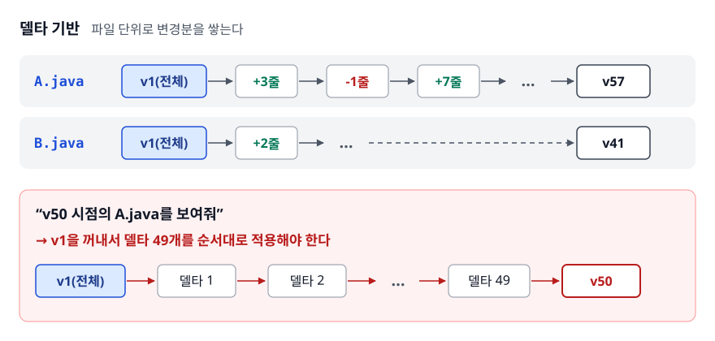
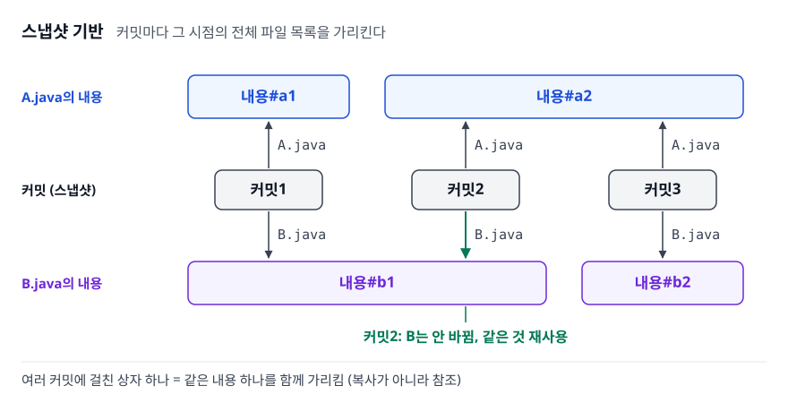
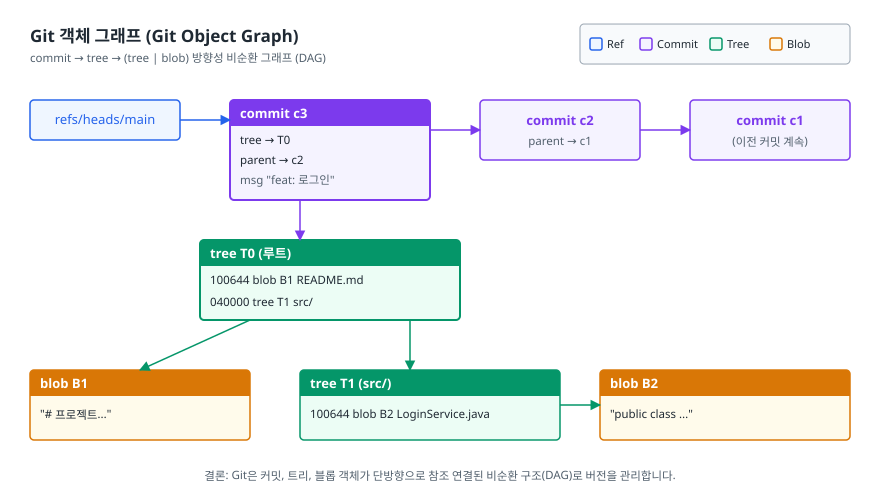
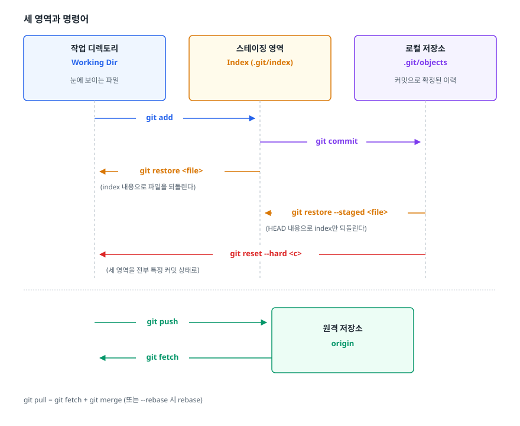
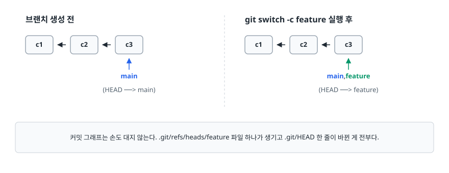

# Git 내부 구조 (Git Internals)

> `git commit`을 누르면 `.git` 안에는 어떤 파일이 생길까요? 그리고 브랜치를 만드는 일은 왜 1초도 안 걸릴까요? 이 문서가 두 질문의 답을 차례로 설명합니다.

## 학습 목표

- [ ] Git이 변경분(diff)이 아니라 스냅샷을 저장한다는 말의 의미를 정확히 설명할 수 있다
- [ ] blob / tree / commit / tag 네 객체가 서로를 어떻게 가리키는지 그릴 수 있다
- [ ] 해시가 왜 "이름"이 아니라 "주소"인지, 그래서 무결성이 어떻게 보장되는지 말할 수 있다
- [ ] 작업 디렉터리 / 스테이징 / 저장소 세 영역과 각 명령어가 무엇을 옮기는지 구분할 수 있다
- [ ] HEAD와 브랜치가 파일 한 줄짜리 포인터라는 사실로 브랜치 비용을 설명할 수 있다

## 선행 지식

- `git add` / `git commit` / `git push`를 한 번이라도 쳐 본 경험
- 그 외에는 없음 — 이 문서부터 시작해도 됩니다

---

## 1. 왜 필요한가

### 명령어를 외우는 방식의 한계

Git을 쓰다 보면 이런 순간이 옵니다.

- `git reset --hard`를 쳤는데 커밋이 사라졌습니다. 복구할 수 있나?
- 어제 실수로 커밋한 API 키를 다음 커밋에서 지웠습니다. 이제 안전한가?
- `git checkout` 했더니 "detached HEAD"라는 경고가 떴습니다. 무슨 뜻인가?

이 셋은 전부 명령어 사용법으로는 답이 안 나옵니다. **저장 구조를 알아야 풀리는 질문**입니다. Git은 서브커맨드가 백 개를 넘지만 그 아래 깔린 데이터 모델은 놀랄 만큼 단순합니다. 모델을 한 번 이해하면 명령어는 대부분 추론으로 풀립니다. 그래서 내부 구조부터 봅니다.

### 델타 방식과 그 비용

Git 이전의 버전 관리 도구(SVN, CVS, Perforce 등) 상당수는 **델타(delta) 기반**이었습니다. 파일별로 "최초 버전 + 이후 변경분 목록"을 저장합니다.

<!-- diagram:git-git-internals-1 -->


<!-- 위 그림이 대체한 원본 ASCII.
     내용을 고칠 때는 그림도 함께 갱신할 것.
```
[델타 기반]  파일 단위로 변경분을 쌓는다

  A.java  ─ v1(전체) ─ +3줄 ─ -1줄 ─ +7줄 ─ ... ─ v57
  B.java  ─ v1(전체) ─ +2줄 ─ ...              ─ v41

  "v50 시점의 A.java를 보여줘"
   → v1을 꺼내서 델타 49개를 순서대로 적용해야 한다
```
-->

이 구조는 저장 공간에는 유리하지만 대가가 있습니다. 오래된 버전을 복원하려면 델타를 줄줄이 재생해야 하고, 브랜치처럼 "다른 갈래"가 생기면 델타 체인이 갈라져서 어느 변경이 어디에 적용됐는지 추적하기가 어려워집니다. 도구마다 사정은 다르지만(SVN은 서버에서 브랜치를 만드는 것 자체는 값쌌습니다), 이 계열에서 공통으로 무거웠던 쪽은 **갈라진 것을 다시 합치는 일**이었습니다. 그래서 브랜치는 "꼭 필요할 때만 신중하게 파는 것"에 가까웠습니다.

### Git의 선택: 스냅샷

Git은 반대로 갔습니다. 커밋할 때마다 **그 시점의 프로젝트 전체 상태(스냅샷)를 통째로 기록**합니다. "3번째 줄이 바뀌었다"는 커밋 어디에도 적히지 않습니다. 대신 "이 시점의 파일 목록은 이것들이다"를 저장합니다.

<!-- diagram:git-git-internals-2 -->


<!-- 위 그림이 대체한 원본 ASCII.
     내용을 고칠 때는 그림도 함께 갱신할 것.
```
[스냅샷 기반]  커밋마다 그 시점의 전체 파일 목록을 가리킨다

  커밋1 ──> { A.java → 내용#a1,  B.java → 내용#b1 }
  커밋2 ──> { A.java → 내용#a2,  B.java → 내용#b1 }   ← B는 안 바뀜, 같은 것 재사용
  커밋3 ──> { A.java → 내용#a2,  B.java → 내용#b2 }
```
-->

"전체를 저장하면 용량이 터지지 않나?"가 당연한 의문인데, 실제로 그렇게 되지는 않습니다.

1. **바뀌지 않은 파일은 이전 것을 그대로 가리킵니다.** 위 그림에서 커밋2의 `B.java`는 커밋1의 내용을 재사용합니다. 복사가 일어난 게 아닙니다. 같은 내용을 참조할 뿐입니다.
2. **저장소가 커지면 팩파일(packfile)로 압축합니다.** 이 단계에서는 Git도 비슷한 객체끼리 델타 압축을 씁니다.

여기서 오해가 자주 생깁니다. **"Git은 델타를 전혀 안 쓴다"는 틀린 말입니다.** 정확히는 **논리적 모델은 스냅샷이고 물리적 저장 최적화 단계에서만 델타를 씁니다.** 팩파일에서 객체를 꺼낼 때 델타 체인을 되짚는 일은 Git이 알아서 합니다. 그 체인은 내용이 비슷한 객체끼리 묶은 것일 뿐, 버전 이력의 순서와는 무관합니다. 그래서 어떤 커밋의 어떤 파일이든 그 커밋 하나만 지정하면 바로 꺼낼 수 있고, 델타 기반 도구처럼 최초 버전부터 변경분을 순서대로 재생할 필요가 없습니다.

> **비유**: 델타 방식이 "어제 일기에 덧붙인 수정 메모"라면, Git은 "매일 방 전체를 사진으로 찍되 안 바뀐 가구는 어제 사진을 그대로 링크"하는 방식입니다.
>
> **비유의 한계**: 사진은 겉모습만 남습니다. Git 스냅샷은 파일 내용 전체를 담고 있어서, 그 자체로 복원할 수 있는 원본입니다. 또 Git은 "사진"을 시간순으로 늘어놓지 않고 부모를 가리키는 그래프로 연결합니다.

---

## 2. 콘텐츠 주소화 — 해시가 곧 주소다

Git의 저장소는 **키-값 데이터베이스**입니다. 값은 파일 내용이고, 키는 그 내용을 SHA-1로 해시한 40자리 16진수입니다. 이름이 아니라 내용이 주소를 결정하기 때문에 **콘텐츠 주소화 파일 시스템(Content-Addressable File System)** 이라고 부릅니다.

직접 확인해 볼 수 있습니다.

```bash
# 아무 내용이나 해시해서 객체로 저장한다 (-w = write)
$ echo 'test content' | git hash-object -w --stdin
d670460b4b4aece5915caf5c68d12f560a9fe3e4

# 저장된 위치: 앞 2자리가 디렉토리, 나머지 38자리가 파일명
$ find .git/objects -type f
.git/objects/d6/70460b4b4aece5915caf5c68d12f560a9fe3e4

# 다시 꺼내기
$ git cat-file -p d670460b
test content
```

이 해시값은 누가 언제 어느 컴퓨터에서 실행하든 똑같이 나옵니다. 해시 대상에는 파일명도 시각도 들어가지 않습니다. 오직 **`blob <바이트수>\0<내용>` 형태로 만든 바이트열 하나뿐**입니다.

여기서 세 가지 성질이 따라 나옵니다.

| 성질 | 의미 | 실무에서 드러나는 모습 |
|------|------|----------------------|
| 중복 제거 | 내용이 같으면 해시가 같으므로 객체가 하나만 저장된다 | 같은 이미지를 열 군데 복사해 넣어도 저장소는 한 번만 커진다 |
| 무결성 | 1비트만 바뀌어도 해시가 달라져 참조가 어긋난다 | 디스크 손상이나 위조를 `git fsck`가 바로 잡아낸다 |
| 불변성 | 내용을 고치면 그건 다른 객체다 | 커밋 메시지만 고쳐도 커밋 해시가 통째로 바뀐다 |

세 번째가 특히 중요합니다. `git commit --amend`나 `git rebase`가 "커밋을 수정한다"고 흔히 설명되지만 수정은 일어나지 않습니다. 실제로는 **새 객체를 만들고 포인터를 옮기는 것**입니다. 원본 커밋은 어딘가에 그대로 남아 있다가 나중에 정리됩니다. 이 사실이 [02-merge-rebase-conflict.md](./02-merge-rebase-conflict.md)에서 다룰 rebase 황금률의 근거가 됩니다.

### SHA-1은 깨졌다는데 괜찮은가

2017년 SHA-1의 충돌(collision) 공격이 실제로 성공했습니다(SHAttered). 서로 다른 두 PDF가 같은 SHA-1 해시를 갖도록 만들어낸 사례입니다. 그러니 Git이 SHA-1을 쓰는 것은 위험하지 않냐는 질문이 따라붙습니다.

Git 진영의 대응은 이랬습니다.

1. **충돌 탐지 SHA-1 도입** — 구현을 교체해서 알려진 충돌 공격 패턴이 보이면 해시 계산 중에 감지해 거부합니다. 현재 배포되는 Git은 이 방식을 씁니다.
2. **SHA-256 저장소 포맷 도입** — `git init --object-format=sha256`으로 SHA-256 기반 저장소를 만들 수 있습니다. 다만 SHA-1 저장소와 상호 운용이 아직 정리되지 않아, 실무에서 쓰이는 저장소는 여전히 대부분 SHA-1입니다.

면접에서는 "SHA-1 충돌은 2017년에 실제로 시연됐지만, Git은 알려진 공격 패턴을 걸러내는 충돌 탐지 구현으로 방어하고 있고 SHA-256 전환 경로도 준비돼 있다. 또 Git 해시는 암호학적 서명이 아니라 식별자 용도이므로, 위조 방지가 목적이라면 커밋 서명(GPG/SSH)을 함께 쓴다"까지 말하면 충분합니다.

---

## 3. 객체 4종

`.git/objects`에 들어가는 객체 타입은 딱 네 가지입니다.

| 객체 | 저장하는 것 | 저장하지 않는 것 |
|------|------------|-----------------|
| blob | 파일의 **내용**만 | 파일명, 경로, 권한, 수정 시각 |
| tree | 디렉터리 한 층의 목록 (이름 → 해시 매핑) | 파일 내용 |
| commit | 루트 tree 해시 + 부모 커밋 해시 + 작성자 + 메시지 | 변경분(diff) |
| tag(annotated) | 커밋 해시 + 태그 이름 + 작성자 + 메시지 + 서명 | — |

### 실제 내용 들여다보기

```bash
# 커밋 객체
$ git cat-file -p HEAD
tree 92b8b694ffb1675e5975148e1121810081dbdffe
parent 8f4a2c1e6d9b3f7a5c2e8b1d4f6a9c3e7b2d5f8a
author Jinhyeok <me@example.com> 1717070000 +0900
committer Jinhyeok <me@example.com> 1717070000 +0900

feat: 로그인 API 추가

# 그 커밋이 가리키는 루트 tree
$ git cat-file -p HEAD^{tree}
100644 blob a45bc8f2...    README.md
040000 tree 3f2a91c7...    src

# src 디렉토리 tree
$ git cat-file -p 3f2a91c7
100644 blob 7c9e33b1...    LoginService.java
```

커밋 객체 안에는 `diff`라는 단어가 한 번도 나오지 않습니다. 커밋은 변경분을 갖고 있지 않습니다. **`git show`나 `git diff`가 보여주는 변경분은 두 스냅샷을 비교해 그때그때 계산한 결과**입니다.

tree 항목 맨 앞 숫자는 파일 모드입니다. `100644`는 일반 파일, `100755`는 실행 권한이 붙은 파일, `040000`은 하위 디렉터리, `120000`은 심볼릭 링크입니다. 그래서 Git이 추적하는 파일 권한은 실행 비트 하나뿐입니다.

### 객체가 서로를 가리키는 모습

<!-- diagram:git-object-graph -->


<!-- 위 그림이 대체한 원본 ASCII.
     내용을 고칠 때는 그림도 함께 갱신할 것.
```
                    ┌──────────────────────┐
   refs/heads/main ─┤ commit  c3           │
                    │  tree   → T0         │
                    │  parent → c2 ────────┼──> commit c2 ──> commit c1
                    │  msg "feat: 로그인"  │
                    └──────────┬───────────┘
                               │
                    ┌──────────▼───────────┐
                    │ tree  T0  (루트)      │
                    │  100644 blob B1  README.md
                    │  040000 tree T1  src/ │
                    └──────┬────────┬──────┘
                           │        │
              ┌────────────▼──┐  ┌──▼──────────────────┐
              │ blob B1       │  │ tree T1  (src/)      │
              │ "# 프로젝트..."│  │  100644 blob B2      │
              └───────────────┘  │      LoginService.java
                                 └──────────┬───────────┘
                                            │
                                 ┌──────────▼──────────┐
                                 │ blob B2             │
                                 │ "public class ..."  │
                                 └─────────────────────┘
```
-->

commit → tree → (tree | blob) 의 단방향 그래프입니다. 커밋끼리는 `parent`로만 연결되고 자식을 가리키는 필드는 없습니다. 게다가 부모의 해시가 자식 커밋의 내용에 포함되므로, 부모는 자식보다 반드시 먼저 존재해야 합니다. 순환을 만들려면 아직 만들어지지 않은 해시를 미리 알아야 하니 원리적으로 불가능합니다. 이 구조가 **DAG(Directed Acyclic Graph, 방향성 비순환 그래프)** 입니다. 머지 커밋은 부모를 두 개 이상 갖는 커밋일 뿐, 특별한 타입이 아닙니다.

### blob이 파일명을 모른다는 사실의 결과

`docs/guide.md`를 `docs/manual.md`로 이름만 바꿔 커밋하면, 내용이 같으므로 blob은 새로 생기지 않고 tree만 새로 생깁니다. Git은 rename을 어디에도 기록하지 않습니다. 그런데도 `git log --follow`나 `git status`가 이름 변경을 알아보는 것은 **diff를 만들 때 그때그때 추론하기 때문**입니다.

내용이 그대로라면 사라진 경로와 새로 생긴 경로의 blob 해시가 같으니 바로 짝지어집니다. 이름과 함께 내용도 조금 손봤다면 유사도를 계산해 임계값(기본 50%)을 넘을 때 rename으로 판정합니다. 그래서 이름을 바꾸면서 내용을 크게 뜯어고치면 rename으로 안 잡히고 "삭제 + 추가"로 보입니다.

---

## 4. .git 디렉터리

```
.git/
├── HEAD              현재 위치. 보통 "ref: refs/heads/main" 한 줄
├── config            이 저장소 설정 (remote, user 등)
├── index             스테이징 영역 그 자체 (바이너리 파일)
├── objects/          모든 blob/tree/commit/tag
│   ├── d6/70460b...  느슨한 객체(loose object), zlib 압축
│   └── pack/         팩파일. 객체가 많아지면 여기로 뭉쳐진다
├── refs/
│   ├── heads/main    브랜치. 내용은 커밋 해시 40자 한 줄
│   ├── tags/v1.0.0   태그
│   └── remotes/origin/main
├── packed-refs       refs를 한 파일로 모아둔 것 (refs/ 파일이 없어도 여기 있을 수 있다)
├── logs/             reflog. HEAD와 각 브랜치가 지나온 이력
└── hooks/            pre-commit 등 훅 스크립트
```

`.git`을 통째로 지우면 모든 이력이 사라지고, 반대로 `.git`만 있으면 작업 디렉터리 전체를 복원할 수 있습니다. `git clone`이 하는 일도 결국 **`.git`을 통째로 받아온 뒤 최신 스냅샷을 작업 디렉터리에 펼치는 것**입니다. 분산 버전 관리 시스템(DVCS)이라는 말은 이 상태를 가리킵니다. 필요한 데이터가 이미 로컬에 다 있으니, 네트워크 없이도 로그 조회, 브랜치 생성, 커밋, diff가 전부 됩니다.

`logs/`에 있는 **reflog**는 따로 기억해 둘 가치가 있습니다. 브랜치가 어떤 커밋들을 거쳐왔는지 남겨 두기 때문에, 어떤 브랜치도 가리키지 않게 된 "잃어버린 커밋"을 여기서 찾아낼 수 있습니다.

```bash
$ git reflog
453fd26 HEAD@{0}: reset: moving to HEAD~1   # 지금 여기
9100534 HEAD@{1}: commit: docs: 콘텐츠 통합  # ← 사라진 줄 알았던 커밋
453fd26 HEAD@{2}: commit: feat: 콘텐츠 보강

$ git reset --hard 9100534   # 되살리기
```

각 줄은 "그 작업이 끝난 뒤 HEAD가 어디를 가리켰는가"를 보여줍니다. `HEAD@{0}`이 reset 이후의 위치이고, 그 바로 아래 줄에 reset 직전의 커밋이 남아 있습니다. 다만 reflog는 **로컬 저장소에만 있는 기록**이라 `clone`한 사람에게는 따라가지 않습니다. 또 객체는 어떤 참조에서도 닿을 수 없게 된 뒤에도 즉시 삭제되지 않습니다. 도달 불가 객체는 유예 기간이 지나야 `git gc`가 정리하므로, 그전까지는 남아 있고 그 사이에 reflog로 되찾을 수 있습니다. 그래서 `git reset --hard`는 무서워 보여도 대부분 복구가 됩니다.

---

## 5. 세 영역과 명령어

<!-- diagram:git-git-internals-3 -->


<!-- 위 그림이 대체한 원본 ASCII.
     내용을 고칠 때는 그림도 함께 갱신할 것.
```
 ┌────────────────┐   ┌────────────────┐   ┌──────────────────────┐
 │ 작업 디렉토리   │   │ 스테이징 영역   │   │  로컬 저장소          │
 │ Working Dir    │   │ Index (.git/   │   │  .git/objects        │
 │ 눈에 보이는 파일│   │        index)  │   │  커밋으로 확정된 이력  │
 └───────┬────────┘   └───────┬────────┘   └──────────┬───────────┘
         │                    │                       │
         │   git add ────────▶│                       │
         │                    │   git commit ────────▶│
         │                    │                       │
         │◀── git restore ────┤                       │
         │   <file>   (index 내용으로 파일을 되돌린다)  │
         │                    │                       │
         │                    │◀─ git restore --staged <file>
         │                    │   (HEAD 내용으로 index만 되돌린다)
         │                    │                       │
         │◀───────────────────┴── git reset --hard <c>┤
              (세 영역을 전부 특정 커밋 상태로)

                     ┌──────────────────────┐
   git push ────────▶│  원격 저장소          │
   git fetch ◀───────│  origin              │
                     └──────────────────────┘
   git pull = git fetch + git merge (또는 --rebase 시 rebase)
```
-->

`git restore <file>`이 되돌리는 기준은 **저장소가 아니라 index**입니다. `add`를 한 뒤 파일을 더 고쳤다가 `restore`하면 `add` 시점으로 돌아갑니다. 마지막 커밋까지 되감기지는 않습니다. 커밋 상태로 되돌리고 싶다면 `git restore --source=HEAD --staged --worktree <file>`처럼 출처와 대상을 명시해야 합니다.

### 스테이징 영역은 왜 존재하나

"수정했으면 바로 커밋하면 되지, 왜 `add`라는 단계를 한 번 더 거치나?"는 초심자가 가장 많이 갖는 의문입니다. 답은 **커밋 단위를 사람이 고를 수 있게 하기 위해서**입니다.

한 번 작업하다 보면 파일 다섯 개가 동시에 바뀌는 일이 흔합니다. 그중 셋은 로그인 버그 수정이고 둘은 오타 교정이라면, 이걸 한 커밋에 몰아넣는 순간 "로그인 버그 수정만 되돌리기"가 불가능해집니다. 스테이징 영역이 있으면 관련된 것끼리 골라 두 번에 나눠 커밋할 수 있습니다.

```bash
git add src/LoginService.java src/LoginController.java src/SessionStore.java
git commit -m "fix: 세션 만료 시 로그인 실패하던 문제 수정"

git add README.md docs/setup.md
git commit -m "docs: 오타 수정"
```

한 파일 안에서 일부 변경만 고르고 싶으면 `git add -p`로 hunk 단위 선택도 됩니다.

### 안티패턴: `git add .` 후 파일을 더 고치고 커밋

```bash
# 안티패턴
git add .                     # 이 시점의 내용이 스테이징에 박제된다
vim src/LoginService.java     # 여기서 오타를 하나 더 고쳤다
git commit -m "fix: 세션 만료 문제"
```

**왜 문제인가**: `git add`가 실행되는 순간 파일 내용이 blob으로 저장되고 index가 그 blob을 가리킵니다. 이후 작업 디렉터리에서 파일을 더 고쳐도 index는 갱신되지 않습니다. 결과적으로 **방금 고친 오타가 빠진 채 커밋됩니다.** 커밋은 성공하고 에러도 없어서, 나중에 "분명히 고쳤는데 왜 반영이 안 됐지?"로 발견됩니다.

```bash
# 개선 1 - 커밋 직전에 스테이징 상태를 확인한다
git add .
vim src/LoginService.java
git status                    # "Changes not staged for commit" 에 뜬다
git add src/LoginService.java # 다시 add
git commit -m "fix: 세션 만료 문제"

# 개선 2 - 스테이징된 내용 자체를 눈으로 확인하고 커밋
git diff --staged             # 실제로 커밋될 내용
git commit
```

`git diff`는 작업 디렉터리와 index를 비교하고, `git diff --staged`는 index와 HEAD를 비교합니다. 영역이 세 개라서 두 명령이 서로 다른 것을 보여줍니다.

---

## 6. HEAD와 브랜치는 그냥 포인터다

```bash
$ cat .git/HEAD
ref: refs/heads/main

$ cat .git/refs/heads/main
a3d0e54f8b2c9d1e7a6b4c3d2e1f0a9b8c7d6e5f
```

이게 전부입니다. **브랜치는 커밋 해시 한 줄이 적힌 41바이트짜리 파일**(해시 40자 + 줄바꿈)이고, **HEAD는 "지금 어느 브랜치에 있는지"를 적어둔 파일**입니다. 브랜치가 많아지면 Git이 이 파일들을 `packed-refs` 하나로 모아두기도 하는데, 한 줄이 브랜치 하나라는 사실은 그대로입니다.

<!-- diagram:git-git-internals-4 -->


<!-- 위 그림이 대체한 원본 ASCII.
     내용을 고칠 때는 그림도 함께 갱신할 것.
```
브랜치 생성 전                       git switch -c feature 실행 후

    c1 <── c2 <── c3                     c1 <── c2 <── c3
                  ↑                                    ↑
                  main                                 main, feature
                  (HEAD ──> main)                      (HEAD ──> feature)

커밋 그래프는 손도 대지 않는다. .git/refs/heads/feature 파일 하나가 생기고 .git/HEAD 한 줄이 바뀐 게 전부다.
```
-->

**브랜치 생성이 왜 즉각적인가** — 파일 하나를 쓰는 게 전부입니다. 소스 코드를 복사하지 않고 작업 디렉터리도 건드리지 않습니다. 앞서 봤듯 SVN에서도 서버에 브랜치를 만드는 것 자체는 값쌌지만, 그 브랜치로 옮겨 가려면 작업 사본을 서버에서 다시 받아야 했고 나중에 합칠 때의 비용도 컸습니다. Git은 만드는 것도, 오가는 것도, 합치는 것도 전부 로컬에서 값싸게 끝나기 때문에 "일단 브랜치 따고 시작"이라는 문화가 자리 잡았습니다.

**커밋하면 무슨 일이 일어나는가** — 새 커밋 객체를 만들고, 현재 HEAD가 가리키는 브랜치 파일의 내용을 새 커밋 해시로 덮어씁니다. 브랜치가 "앞으로 이동"하는 것처럼 보이는 건 이 덮어쓰기 때문입니다.

### detached HEAD

`git switch main` 대신 `git checkout a3d0e54`처럼 커밋 해시를 직접 지정하면 HEAD가 브랜치를 거치지 않고 그 커밋을 곧장 가리킵니다.

```bash
$ cat .git/HEAD
a3d0e54f8b2c9d1e7a6b4c3d2e1f0a9b8c7d6e5f    # "ref:" 가 없다 = detached
```

이 상태에서 커밋하면 어떤 브랜치도 그 커밋을 가리키지 않습니다. 다른 브랜치로 이동하는 순간 방금 만든 커밋에 접근할 경로가 사라집니다(reflog로는 찾을 수 있습니다). 과거 시점을 잠깐 구경할 때는 문제없지만, 거기서 작업을 시작할 거라면 `git switch -c fix-from-old`로 브랜치를 먼저 만들어야 합니다.

태그가 브랜치와 다른 점도 여기서 나옵니다. 브랜치는 커밋할 때마다 앞으로 이동하지만, **태그는 한 번 붙으면 그 커밋에 고정**됩니다. 그래서 릴리스 표시에는 태그를 씁니다.

---

## 7. 명령어별로 무엇이 움직이는가

| 명령어 | 작업 디렉터리 | 스테이징(index) | HEAD/브랜치 | 새 객체 생성 |
|--------|--------------|----------------|------------|-------------|
| `git add <f>` | 그대로 | 갱신 | 그대로 | blob |
| `git commit` | 그대로 | 그대로 | 브랜치가 새 커밋으로 이동 | tree, commit |
| `git commit --amend` | 그대로 | 그대로 | 브랜치가 **새** 커밋으로 이동 | tree, commit (해시 변경) |
| `git switch <b>` | 해당 브랜치 내용으로 교체 | 교체 | HEAD가 다른 브랜치를 가리킴 | 없음 |
| `git switch -c <b>` | 그대로 | 그대로 | 새 ref 파일 생성 + HEAD 이동 | 없음 |
| `git reset --soft <c>` | 그대로 | 그대로 | 브랜치만 이동 | 없음 |
| `git reset --mixed <c>` | 그대로 | 대상 커밋 상태로 | 브랜치 이동 | 없음 |
| `git reset --hard <c>` | 대상 커밋 상태로 | 대상 커밋 상태로 | 브랜치 이동 | 없음 |
| `git restore <f>` | index 내용으로 되돌림 | 그대로 | 그대로 | 없음 |
| `git restore --staged <f>` | 그대로 | HEAD 내용으로 되돌림 | 그대로 | 없음 |
| `git fetch` | 그대로 | 그대로 | `origin/*` 만 이동 | 원격 객체 수신 |
| `git merge` | 병합 결과로 | 갱신 | 브랜치 이동 | tree, commit(필요 시) |

> 이 표의 핵심은 **"객체를 만드는 명령"과 "포인터만 옮기는 명령"이 나뉜다**는 것입니다. `add`/`commit`/`merge`는 데이터를 새로 쓰고, `switch`/`reset`/`restore`는 이미 있는 데이터를 가리키는 방향만 바꿉니다. 후자는 데이터를 지우는 게 아니므로 대부분 되돌릴 수 있습니다.

---

## 8. 실무에서는

### 한 번 커밋된 것은 지워도 남는다

```bash
# 안티패턴 - 비밀키를 커밋했다가 다음 커밋에서 삭제
git add application-prod.yml     # DB 비밀번호가 들어 있다
git commit -m "feat: 설정 추가"
git push
# 아차 싶어서
rm application-prod.yml
git commit -am "chore: 설정 파일 제거"
git push
```

**왜 문제인가**: 파일을 지운 것은 최신 스냅샷에서 빠졌다는 뜻일 뿐입니다. 비밀번호가 담긴 blob 객체는 첫 번째 커밋에 그대로 매달려 있고, `git show <첫커밋>:application-prod.yml` 한 줄이면 누구나 읽습니다. 이미 push했다면 원격에도, 그 저장소를 clone한 모든 사람의 로컬에도 복제돼 있습니다.

```bash
# 개선 - 애초에 추적하지 않는다
echo "application-prod.yml" >> .gitignore
git rm --cached application-prod.yml   # 추적만 해제, 로컬 파일은 유지
git add .gitignore                     # .gitignore 수정분도 함께 스테이징해야 한다
git commit -m "chore: 로컬 설정 파일 추적 제외"
```

이미 push된 뒤라면 히스토리 정리가 먼저가 아닙니다. **가장 먼저 할 일은 해당 키를 폐기하고 재발급하는 것**입니다. 유출된 시점에 이미 노출된 값이므로 히스토리를 지워도 안전해지지 않습니다. 그다음에 `git filter-repo` 같은 도구로 히스토리에서 제거하는데, 이 작업은 모든 후속 커밋 해시를 바꾸므로 팀 전원이 저장소를 다시 받아야 합니다.

히스토리를 지운 뒤에도 안심할 수 없는 이유가 하나 더 있습니다. 강제 push로 커밋을 없애도 GitHub에서 해당 커밋 URL로 직접 접근하면 내용이 그대로 보이는 경우가 있습니다. 객체는 서버 저장소에 남아 있고 참조만 끊긴 상태이기 때문입니다.

같은 이유로 **대용량 바이너리를 한 번 커밋하면 저장소가 영구히 무거워집니다.** 빌드 산출물, 동영상, 데이터셋은 `.gitignore`에 넣거나 Git LFS로 분리합니다.

### `git gc`와 저장소 크기

`git gc`는 느슨한 객체를 팩파일로 뭉치고 도달 불가 객체를 정리합니다. 대부분 자동으로 실행되므로 직접 칠 일은 드물지만, "커밋을 다 지웠는데 `.git` 용량이 그대로"라면 아직 gc가 돌지 않았거나 reflog가 그 객체를 붙잡고 있는 것입니다.

---

## 9. 면접 포인트

> 면접에서 이 주제가 나오면 이렇게 답한다

**Q. Git이 스냅샷 방식이라는 게 무슨 뜻인가요?**

A. 커밋이 변경분이 아니라 그 시점의 전체 파일 목록을 가리킨다는 뜻입니다. 커밋 객체는 루트 tree의 해시와 부모 커밋의 해시만 갖고 있습니다. `git diff`가 보여주는 변경분은 어디에도 저장돼 있지 않고 두 스냅샷을 비교해 그때 계산한 결과입니다. 바뀌지 않은 파일은 이전 blob을 그대로 참조하므로 용량 낭비도 없습니다.
- 꼬리 질문: "그럼 Git은 델타를 아예 안 쓰나요?" → 논리적 모델은 스냅샷이지만, 팩파일로 압축할 때는 유사한 객체 간 델타 압축을 씁니다. 즉 델타는 저장 최적화 수준의 구현 세부사항이지 데이터 모델이 아닙니다.

**Q. Git 객체 4종과 커밋이 저장되는 과정을 설명해주세요.**

A. blob은 파일 내용만, tree는 디렉터리 한 층의 이름-해시 매핑, commit은 루트 tree와 부모 커밋 해시와 메시지, annotated tag는 특정 커밋에 붙는 이름표입니다. `git add` 시점에 파일 내용이 blob으로 저장되고 index가 그것을 가리키며, `git commit` 시점에 index를 tree 구조로 변환한 뒤 루트 tree와 부모를 가리키는 commit 객체를 만듭니다. 모든 객체는 내용을 SHA-1 해시한 값이 곧 주소라, 1비트만 달라져도 다른 객체가 됩니다.
- 꼬리 질문: "파일 이름을 바꾸면 blob이 새로 생기나요?" → 내용이 그대로면 안 생깁니다. blob은 내용만 담으므로 tree만 새로 생깁니다. Git이 rename을 별도로 기록하지 않는데도 감지하는 것은, diff를 만들 때 사라진 경로와 생긴 경로를 blob 해시나 내용 유사도로 짝지어 추론하기 때문입니다.

**Q. 브랜치를 만드는 비용이 왜 그렇게 싼가요?**

A. 브랜치가 커밋 해시 한 줄이 적힌 파일이기 때문입니다. `.git/refs/heads/` 아래에 41바이트짜리 파일을 하나 만드는 게 전부고, 소스 코드는 전혀 복사하지 않습니다. 커밋하면 그 파일의 내용을 새 커밋 해시로 덮어쓰는 방식으로 브랜치가 전진합니다. 그래서 Git에서는 브랜치를 아끼지 않고 쓰는 문화가 자리 잡았습니다.
- 꼬리 질문: "그럼 HEAD는요?" → HEAD는 지금 어느 브랜치에 있는지를 적어둔 파일입니다. 보통 `ref: refs/heads/main`처럼 브랜치를 가리키지만, 커밋 해시를 직접 가리키면 detached HEAD 상태입니다.

**Q. `git reset --hard`로 날린 커밋을 되살릴 수 있나요?**

A. 대부분 가능합니다. reset은 브랜치 포인터를 옮길 뿐 객체를 지우지 않기 때문입니다. `git reflog`로 HEAD가 지나온 커밋 해시를 찾아 `git reset --hard <해시>`로 돌아가면 됩니다. 다만 커밋되지 않고 작업 디렉터리에만 있던 변경은 객체로 저장된 적이 없어 복구할 수 없습니다.
- 꼬리 질문: "언제 진짜로 사라지나요?" → 어떤 참조에서도 닿을 수 없는 상태로 유예 기간이 지난 뒤 `git gc`가 정리할 때입니다.

---

## 자주 하는 실수

| 실수 | 왜 틀렸나 | 올바른 이해 |
|------|----------|-----------|
| "커밋은 변경분(diff)을 저장한다" | 커밋 객체에는 tree 해시, 부모 해시, 메시지만 있다 | 커밋은 스냅샷을 가리킵니다. diff는 두 스냅샷을 비교해 계산한 결과입니다 |
| "Git은 델타를 전혀 쓰지 않는다" | 팩파일 압축 단계에서는 델타 압축을 쓴다 | 논리 모델은 스냅샷, 물리 저장은 델타 압축. 둘을 구분해서 말해야 정확합니다 |
| "blob에 파일명이 들어 있다" | blob은 내용만 담는다 | 파일명은 tree가 갖습니다. 그래서 같은 내용의 다른 이름 파일이 blob 하나를 공유합니다 |
| "`git restore <파일>`은 마지막 커밋 상태로 되돌린다" | 기본 출처는 HEAD가 아니라 index다 | `add` 이후에 고친 것만 사라집니다. 커밋 상태로 가려면 `--source=HEAD`를 명시합니다 |
| "`git add` 후에 파일을 고쳐도 커밋에 반영된다" | `add` 시점의 내용이 index에 박제된다 | 다시 `add` 해야 합니다. `git diff --staged`로 실제 커밋될 내용을 확인하는 습관이 안전합니다 |
| "파일을 삭제 커밋하면 내용이 저장소에서 사라진다" | 이전 커밋의 blob은 그대로 남는다 | 유출된 비밀키는 히스토리 정리 이전에 먼저 재발급해야 합니다 |
| "`--amend`는 커밋을 수정한다" | 객체는 불변이라 수정이 불가능하다 | 새 커밋을 만들고 브랜치 포인터를 옮기는 것입니다. 해시가 바뀌므로 push된 커밋에 쓰면 위험합니다 |
| "`git reset --hard`는 데이터를 삭제한다" | 포인터만 옮긴다 | 커밋된 것은 reflog로 복구 가능. 단, 커밋 안 된 작업 디렉터리 변경은 진짜로 사라집니다 |

---

## 한 줄 정리

Git은 파일 내용을 해시로 주소화해 저장하는 키-값 DB 위에 blob/tree/commit 세 객체로 스냅샷 그래프를 쌓은 것이고, 브랜치와 HEAD는 그 그래프의 한 점을 가리키는 텍스트 파일에 불과합니다.

---

## 연관 개념

- [02-merge-rebase-conflict.md](./02-merge-rebase-conflict.md) - 이 그래프를 두 갈래에서 하나로 합칠 때 벌어지는 일
- [03-branching-strategy.md](./03-branching-strategy.md) - 싼 브랜치를 팀 규칙으로 엮는 방법
- [qna-version-control.md](./qna-version-control.md) - Git 기본 개념과 영역 관련 면접 질문(Q1)
