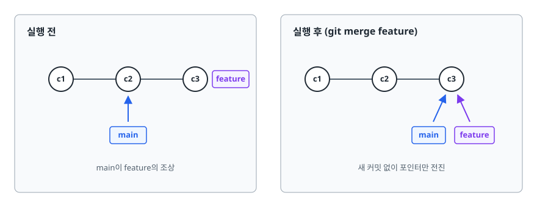
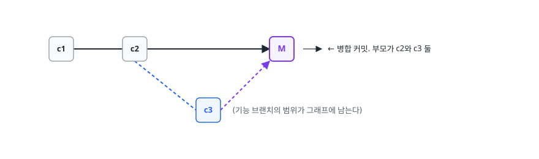
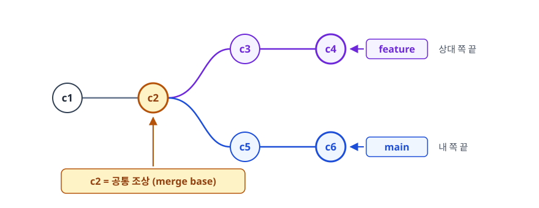
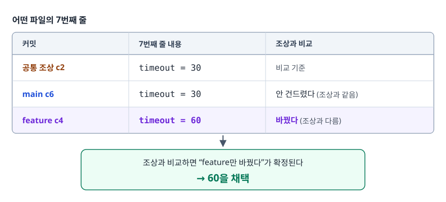
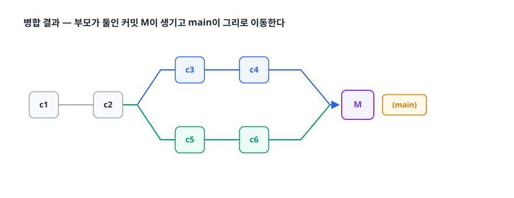
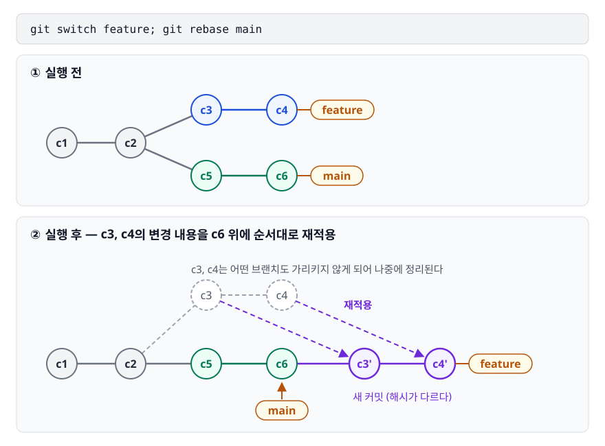
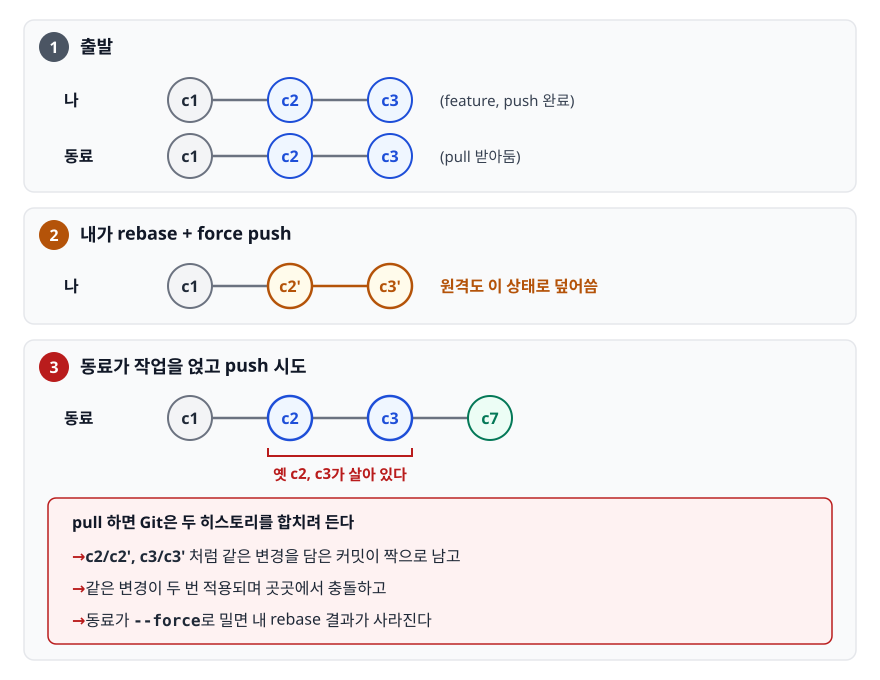
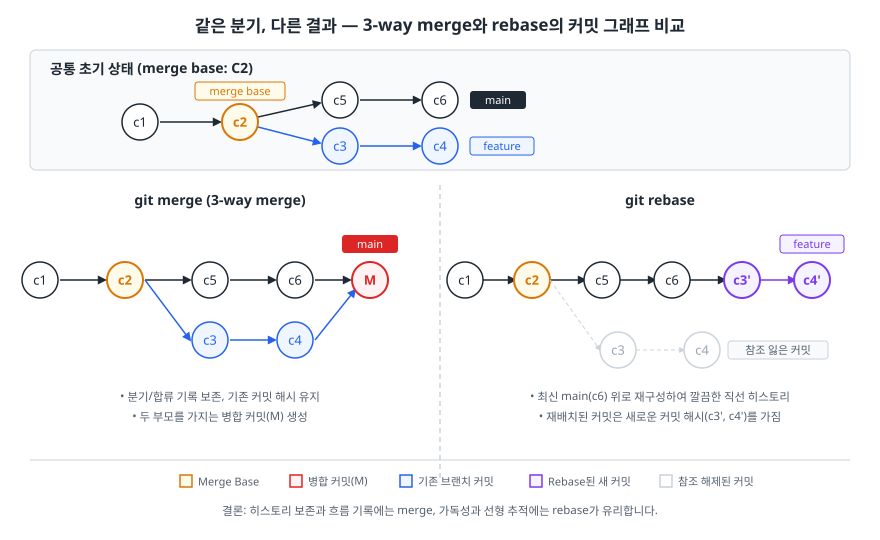
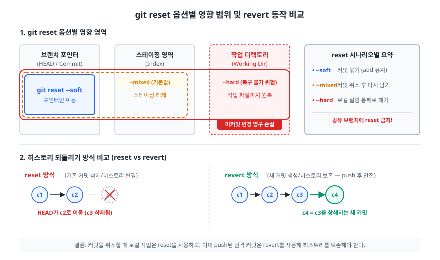

# 병합, 리베이스, 충돌 해결 (Merge, Rebase, Conflict)

> merge와 rebase가 커밋 그래프를 어떻게 다르게 바꾸는지, 충돌이 정확히 어떤 조건에서 생기는지, 되돌려야 할 때 reset/revert/restore 중 무엇을 골라야 하는지 설명할 수 있게 됩니다.

## 학습 목표

- [ ] fast-forward와 3-way merge가 갈리는 조건을 커밋 그래프로 설명할 수 있다
- [ ] rebase가 왜 커밋 해시를 바꾸는지, 그것이 왜 황금률로 이어지는지 말할 수 있다
- [ ] 충돌이 나는 조건을 "같은 파일을 고쳤을 때"보다 정확하게 진술할 수 있다
- [ ] 충돌 마커의 각 구획이 무엇인지 읽고, merge와 rebase에서 ours/theirs가 뒤바뀌는 이유를 안다
- [ ] 상황에 따라 reset / revert / restore를 근거를 대며 선택할 수 있다

## 선행 지식

- [01-git-internals.md](./01-git-internals.md) — 커밋이 부모를 가리키는 그래프이고 브랜치가 포인터라는 사실

---

## 1. 왜 필요한가

브랜치를 딴다는 것은 **한 시점에서 갈라져 두 갈래로 각자 커밋을 쌓는다**는 뜻입니다. 갈라진 것은 언젠가 합쳐야 하고 이때 Git이 답해야 할 질문이 생깁니다.

- 두 갈래가 같은 파일의 다른 부분을 고쳤다면? → 둘 다 반영하면 된다
- 두 갈래가 같은 줄을 다르게 고쳤다면? → **기계가 판단할 수 없다**
- 합친 결과를 히스토리에 어떻게 남길 것인가? → 갈라졌던 사실을 남길지, 없던 일처럼 만들지

첫 번째는 자동으로 처리되고, 두 번째가 충돌(conflict)이며, 세 번째의 답이 merge와 rebase의 갈림길입니다. 이 문서는 이 세 질문을 순서대로 다룹니다.

> **비유**: 같은 원고를 두 편집자가 각자 복사해 고쳤다고 가정합니다. merge는 원본과 두 수정본을 나란히 놓고 대조해 합본을 만들고 "여기서 합쳤다"는 쪽지를 끼워 둡니다. rebase는 상대의 수정본을 새 원본으로 삼고 내가 고쳤던 부분을 **새 종이에 처음부터 다시 옮겨 적습니다.** 결과물은 더 깔끔하지만 내 원고는 아까 그 종이가 아닙니다. 그래서 이미 남에게 사본을 돌린 뒤라면 곤란해집니다.
>
> **비유의 한계**: 옮겨 적는 일은 사람이 아니라 Git이 자동으로 합니다. 사람이 불려 나오는 건 양쪽이 같은 문단을 다르게 고쳐 기계가 판단할 수 없을 때뿐입니다. 그 순간이 충돌입니다.

---

## 2. Merge — 두 갈래를 잇는 커밋을 만든다

### 경우 1: Fast-forward

`main`에서 `feature`를 딴 뒤 **`main`에는 아무 커밋도 추가되지 않은 경우**를 봅니다.

<!-- diagram:git-merge-rebase-conflict-1 -->


<!-- 위 그림이 대체한 원본 ASCII.
     내용을 고칠 때는 그림도 함께 갱신할 것.
```
   실행 전                        실행 후 (git merge feature)

   c1 ── c2 ── c3  feature        c1 ── c2 ── c3
         ↑                                    ↑↑
        main                              main feature
   main이 feature의 조상            새 커밋 없이 포인터만 전진
```
-->

`main`이 가리키는 커밋 `c2`가 `feature`의 커밋 `c3`의 조상이므로 합칠 것이 없습니다. Git은 **`main` 포인터를 `c3`로 옮기기만 합니다.** 이것이 fast-forward(빨리 감기)입니다. 새 커밋이 생기지 않으므로 히스토리는 완전히 직선으로 남습니다. 다만 이때 **"어디서 어디까지가 하나의 기능 브랜치였는지"가 그래프에서 사라집니다.** 나중에 이 기능을 통째로 되돌리려 해도 그래프만 봐서는 범위를 알 수 없어 커밋 메시지나 PR 기록을 뒤져 직접 찾아내야 합니다.

```bash
git merge --no-ff feature   # fast-forward가 가능해도 병합 커밋을 강제로 만든다
```

<!-- diagram:git-merge-rebase-conflict-2 -->


<!-- 위 그림이 대체한 원본 ASCII.
     내용을 고칠 때는 그림도 함께 갱신할 것.
```
   c1 ── c2 ─────────── M       ← 병합 커밋. 부모가 c2와 c3 둘
          \            /
           c3 ────────┘         (기능 브랜치의 범위가 그래프에 남는다)
```
-->

GitHub의 "Create a merge commit" 옵션이 하는 일이 `--no-ff` 머지입니다. 기능 단위를 히스토리에 남기고 싶은 팀이 이 방식을 고릅니다.

### 경우 2: 3-way merge

양쪽 모두 커밋이 쌓인 경우입니다. 여기서 fast-forward는 불가능합니다.

<!-- diagram:git-merge-rebase-conflict-3 -->


<!-- 위 그림이 대체한 원본 ASCII.
     내용을 고칠 때는 그림도 함께 갱신할 것.
```
                c3 ── c4         feature
               /
   c1 ── c2 ──┤                  c2 = 공통 조상 (merge base)
               \
                c5 ── c6         main
```
-->

Git은 세 지점을 봅니다. **공통 조상 c2, 내 쪽 끝 c6, 상대 쪽 끝 c4.** 그래서 3-way merge입니다. 왜 조상까지 봐야 하는지는 예로 보면 명확합니다.

<!-- diagram:git-merge-rebase-conflict-4 -->


<!-- 위 그림이 대체한 원본 ASCII.
     내용을 고칠 때는 그림도 함께 갱신할 것.
```
어떤 파일의 7번째 줄:

  공통 조상 c2 :  timeout = 30
  main     c6 :  timeout = 30      ← 안 건드렸다
  feature  c4 :  timeout = 60      ← 바꿨다

  → 조상과 비교하면 "feature만 바꿨다"가 확정된다. 60을 채택.
```
-->

만약 조상 없이 c6와 c4만 비교하면 `30`과 `60`이 다르다는 사실만 알 뿐, 누가 무엇을 바꿨는지 알 수 없어 매번 사람에게 물어야 합니다. 공통 조상이 있어야 **"변경한 쪽"과 "가만히 있던 쪽"을 구분**할 수 있습니다. 이 구분 덕분에 대부분의 병합이 자동으로 끝납니다. 공통 조상은 `git merge-base main feature`로 직접 확인할 수 있습니다.

<!-- diagram:git-merge-rebase-conflict-5 -->


<!-- 위 그림이 대체한 원본 ASCII.
     내용을 고칠 때는 그림도 함께 갱신할 것.
```
   병합 결과 — 부모가 둘인 커밋 M이 생기고 main이 그리로 이동한다

                c3 ── c4 ─────┐
               /               \
   c1 ── c2 ──┤                 M   (main)
               \               /
                c5 ── c6 ─────┘
```
-->

---

## 3. Rebase — 커밋을 옮겨 심는다

### 동작

rebase는 두 갈래를 합치기보다 **"내 커밋들을 상대 브랜치 끝에 하나씩 다시 적용한다"**에 가깝습니다.

<!-- diagram:git-merge-rebase-conflict-6 -->


<!-- 위 그림이 대체한 원본 ASCII.
     내용을 고칠 때는 그림도 함께 갱신할 것.
```
   git switch feature; git rebase main   실행 전

                c3 ── c4        feature
               /
   c1 ── c2 ──┤
               \
                c5 ── c6        main


   실행 후 — c3, c4의 변경 내용을 c6 위에 순서대로 재적용

   c1 ── c2 ── c5 ── c6 ── c3' ── c4'    feature
                     ↑
                    main

   (c3, c4는 어떤 브랜치도 가리키지 않게 되어 나중에 정리된다)
```
-->

`c3'`와 `c3`는 서로 다른 커밋입니다. 부모가 `c2`에서 `c6`로 바뀌었으니 커밋 객체의 내용이 달라졌고 [01-git-internals.md](./01-git-internals.md)에서 본 대로 **내용이 다르면 해시도 다릅니다.** 변경 내용과 메시지가 같아도 Git 입장에서는 완전히 별개의 커밋입니다.

### 황금률: 공유된 브랜치는 rebase하지 않는다

원칙은 흔히 "공유 브랜치 금지"로 요약되지만 더 정확히는 **"내 저장소 밖에 이미 존재하는 커밋은 rebase하지 않는다"**입니다. 이유를 그림으로 봅니다.

<!-- diagram:git-merge-rebase-conflict-7 -->


<!-- 위 그림이 대체한 원본 ASCII.
     내용을 고칠 때는 그림도 함께 갱신할 것.
```
   1) 출발     나:   c1 ── c2 ── c3     (feature, push 완료)
              동료:  c1 ── c2 ── c3     (pull 받아둠)

   2) 내가 rebase + force push
              나:   c1 ── c2' ── c3'    원격도 이 상태로 덮어씀

   3) 동료가 작업을 얹고 push 시도
              동료:  c1 ── c2 ── c3 ── c7   ← 옛 c2, c3가 살아 있다

      pull 하면 Git은 두 히스토리를 합치려 든다
      → c2/c2', c3/c3' 처럼 같은 변경을 담은 커밋이 짝으로 남고
      → 같은 변경이 두 번 적용되며 곳곳에서 충돌하고
      → 동료가 --force로 밀면 내 rebase 결과가 사라진다
```
-->

정리하면 rebase는 **이미 남에게 넘어간 커밋의 정체성(해시)을 일방적으로 바꾸는 행위**입니다. 내 저장소 안에만 있는 커밋이면 아무 문제가 없고 남에게 넘어간 뒤라면 그 사람의 히스토리와 어긋납니다. 그래서 브랜치 이름만 보고는 판단할 수 없습니다. **"이 커밋을 다른 사람이 받아 갔는가"**를 확인해야 합니다. push한 적 없는 개인 브랜치는 마음껏 rebase해도 되고 반대로 `feature/xxx`라도 동료가 같이 작업 중이면 건드리면 안 됩니다.

### 그럼에도 force push가 필요할 때

원격에 올린 브랜치를 rebase해야 할 때가 있습니다. 혼자 쓰는 기능 브랜치를 PR 올린 뒤 정리하는 경우가 그렇습니다. 이때는 `--force` 대신 `--force-with-lease`를 씁니다.

```bash
git push --force-with-lease origin feature
```

`--force`는 원격이 무슨 상태든 무조건 덮어씁니다. `--force-with-lease`는 **"내가 마지막으로 확인한 원격 상태와 지금 원격 상태가 같을 때만"** 덮어씁니다. 그 사이에 누가 push했다면 거부됩니다. 남의 커밋을 모르고 날리는 사고를 막아줍니다.

### merge vs rebase

<!-- diagram:git-merge-vs-rebase -->


| 기준 | merge | rebase |
|------|-------|--------|
| 결과 히스토리 | 분기와 합류가 남는 그래프 | 직선 |
| 커밋 해시 | 기존 커밋 그대로, 병합 커밋만 추가 | 옮겨진 커밋 전부 새 해시 |
| 실제 작업 흐름 | 그대로 보존 | "처음부터 최신 위에서 작업한 것처럼" 재구성 |
| 충돌 처리 | 한 번에 몰아서 | 커밋 단위로 여러 번 날 수 있다 |
| `git log --graph` 가독성 | 브랜치가 많으면 복잡 | 읽기 쉬움 |
| 원인 커밋 추적(`git bisect`) | 병합 커밋이 섞여 다소 번거로움 | 직선이라 유리 |
| 안전성 | 공유 브랜치에서도 안전 | 공유된 커밋에 쓰면 위험 |

> 실무 기본값: **내 기능 브랜치를 최신 main 위로 올릴 때는 rebase, 기능 브랜치를 main에 넣을 때는 merge.** 전자는 아직 나만 가진 커밋이라 안전하고 후자는 "이 기능이 여기서 들어왔다"를 히스토리에 남기는 게 낫기 때문입니다.

`git pull`도 같은 선택의 대상입니다. 기본 `git pull`은 fetch + merge입니다. 로컬에 커밋이 없다면 fast-forward로 조용히 끝나지만 내 커밋을 하나라도 쌓아둔 상태에서 pull하면 그때마다 `Merge branch 'main' of ...` 같은 병합 커밋이 생깁니다. 내용상 아무 결정도 담고 있지 않은 커밋이라 히스토리만 지저분해집니다.

```bash
git pull --rebase                       # 이번 pull만 rebase로
git config --global pull.rebase true    # 항상 rebase로
```

---

## 4. 충돌 — 언제, 왜 나는가

### 충돌 조건을 정확히 말하면

"같은 파일을 고치면 충돌"이라는 설명은 부정확합니다. 같은 파일이라도 서로 멀리 떨어진 부분을 고쳤다면 자동으로 병합됩니다. 충돌은 **양쪽이 공통 조상 대비 같은 영역을 서로 다르게 바꿨을 때** 납니다. Git은 파일을 hunk(변경 덩어리) 단위로 보고 같은 hunk 또는 맞닿은 hunk를 양쪽이 건드렸을 때 손을 듭니다.

자주 만나는 충돌 유형은 다음과 같습니다.

| 유형 | 상황 | Git이 못 고르는 이유 |
|------|------|--------------------|
| 같은 줄 수정 | 양쪽이 7번 줄을 다르게 고침 | 어느 쪽이 옳은지는 의도의 문제 |
| 인접 줄 수정 | 한쪽은 10번 줄, 다른 쪽은 11번 줄 수정 | 같은 hunk로 묶여 문맥이 겹친다 |
| 수정 vs 삭제 | 한쪽은 파일을 고치고 다른 쪽은 삭제 | 삭제가 최신 수정을 무시해도 되는지 알 수 없다 |
| 이름 변경 충돌 | 양쪽이 같은 파일을 다른 이름으로 변경 | 어느 이름이 맞는지 알 수 없다 |
| 양쪽 신규 추가 | 같은 경로에 서로 다른 내용의 파일을 각각 추가 | 공통 조상이 없어 비교 기준이 없다 |

반대로 **Git이 잡아주지 못하는 충돌**도 있습니다. 내가 `calculateTax()` 함수 이름을 바꾸고 동료가 다른 파일에서 그 함수를 새로 호출했다면, 텍스트상 겹치는 부분이 없어 병합은 깨끗하게 성공하고 빌드만 깨집니다. **"머지가 됐다"와 "코드가 맞다"는 다른 이야기**입니다. 그래서 병합 후에는 CI를 반드시 돌려야 합니다.

### 마커 읽는 법

```
<<<<<<< HEAD
    int timeout = 30;
=======
    int timeout = 60;
>>>>>>> feature/login
```

- `<<<<<<< HEAD` ~ `=======` : **현재 내가 있는 쪽(ours)**
- `=======` ~ `>>>>>>> feature/login` : **들어오는 쪽(theirs)**

기본 표시는 양쪽 결과만 보여주기 때문에 "누가 무엇을 바꿨는지"를 알 수 없습니다. 공통 조상까지 함께 보이게 설정하면 판단이 훨씬 쉬워집니다.

```bash
git config --global merge.conflictStyle diff3
```

```
<<<<<<< HEAD
    int timeout = 30;
||||||| merged common ancestors
    int timeout = 10;
=======
    int timeout = 60;
>>>>>>> feature/login
```

가운데 `|||||||` 구획이 공통 조상의 내용입니다. 이제 원래 10이었고 양쪽이 각각 30과 60으로 올렸다는 사실이 보입니다. 앞의 표시만 봤다면 "30을 60으로 바꾸려는 것"으로 오해했을 수 있습니다. `|||||||` 뒤에 붙는 설명은 상황에 따라 달라집니다. 머지 중이면 위처럼 공통 조상을 가리키는 문구가, rebase나 cherry-pick 중이면 기준이 된 커밋이 적힙니다. Git 2.35부터는 `zdiff3`도 쓸 수 있습니다. 세 구획에 공통으로 들어 있는 줄을 바깥으로 빼내 충돌 범위를 더 좁게 보여줍니다.

### rebase에서는 ours/theirs가 뒤바뀐다

rebase 중에 충돌이 나면 `HEAD` 쪽이 **내 커밋이 아닙니다.** rebase는 상대 브랜치(예: `main`) 위에 내 커밋을 하나씩 얹습니다. 그래서 그 시점의 `HEAD`는 "이미 얹힌 상대 쪽"이고 지금 적용하려는 내 커밋이 "들어오는 쪽"이 됩니다.

```
merge  중 충돌 :  HEAD(ours) = 내 브랜치 ,  theirs = 병합 대상
rebase 중 충돌 :  HEAD(ours) = 대상 브랜치,  theirs = 내 커밋   ← 반대!
```

`git checkout --ours`를 습관적으로 치면 rebase 중에는 정확히 반대 결과가 나옵니다. 마커 아래쪽에 적힌 브랜치 이름이나 커밋 메시지를 확인하고 판단해야 합니다.

### 해결 절차

```bash
# 1. 어떤 파일이 충돌했는지 확인
git status                 # "both modified:" 목록

# 2. 파일을 열어 마커를 지우고 최종 코드를 만든다
#    한쪽 선택 / 양쪽 통합 / 아예 새로 작성 중 하나

# 3. 해결했다고 표시
git add src/ConfigLoader.java

# 4. 마무리 (merge인지 rebase인지에 따라 다르다)
git commit                 # merge 중이라면
git rebase --continue      # rebase 중이라면

# 손대기 전 상태로 되돌리고 싶다면
git merge --abort
git rebase --abort
```

`git add`는 여기서 "스테이징"이 아니라 "충돌 해결 완료 표시"로 쓰입니다. 헷갈리기 쉽지만 내부적으로는 같은 동작입니다. 충돌 상태의 파일은 index에 여러 버전이 함께 올라가 있고 `git add`가 최종 한 버전으로 확정합니다.

### 안티패턴: 충돌을 한쪽으로 밀어버리기

```bash
# 안티패턴
git checkout --ours .      # 충돌 난 파일 전부 내 쪽으로
git add .
git commit
```

**왜 문제인가**: 충돌은 "두 사람이 같은 곳을 다르게 고쳤다"는 신호입니다. 한쪽을 통째로 채택하면 **상대의 변경을 통째로 버리게 됩니다.** 그 파일에 충돌 난 hunk가 하나뿐이었다 해도 나머지 hunk의 상대 변경까지 같이 날아갈 수 있습니다. 이 삭제가 diff에 "충돌 해결"로 뭉뚱그려 기록돼 나중에 리뷰에서도 잘 안 보인다는 게 더 나쁩니다.

```bash
# 개선 - 무엇이 사라지는지 먼저 본다
git diff --name-only --diff-filter=U    # 충돌 파일만 나열
git log --oneline HEAD..MERGE_HEAD      # 상대가 무슨 커밋을 가져왔는지
git diff HEAD...MERGE_HEAD -- src/ConfigLoader.java

# 판단이 안 서면 상대를 부른다. 충돌 해결은 기술 문제가 아니라 의도 확인 문제다
```

장기 브랜치를 여러 번 rebase하면 같은 충돌을 반복해서 풀게 됩니다. 이럴 때 `git config --global rerere.enabled true`로 rerere를 켜 두면 이전에 내린 해결을 자동으로 재사용해 줍니다.

### 예방이 해결보다 싸다

충돌은 **브랜치가 갈라져 있던 기간에 비례해서** 커집니다. 하루 차이면 몇 줄이지만 3주 차이면 서로가 서로의 전제를 무너뜨려 재설계에 가까워집니다. 실질적인 예방책은 세 가지입니다.

- 기능 브랜치를 짧게 유지한다(며칠 단위)
- 매일 `git pull --rebase origin main`으로 최신 main을 흡수한다
- 대규모 포매팅 변경, 파일 이동, 리네이밍은 **독립 커밋/독립 PR로 분리한다**. 로직 변경과 섞이면 충돌 지옥이 된다

---

## 5. Squash와 Cherry-pick

### Squash — 여러 커밋을 하나로

`wip`, `오타`, `리뷰 반영` 같은 커밋이 main 히스토리에 남아 봐야 도움이 되지 않습니다. 여러 커밋을 하나로 합치는 것이 squash이고 GitHub의 "Squash and merge"가 이 동작입니다. 로컬에서는 `git rebase -i`로 합니다.

```bash
git rebase -i main
# 편집기에서 각 줄 앞 단어를 바꾼다
#   pick   c3 wip
#   squash c4 오타          ← 앞 커밋에 합치고 메시지도 편집
#   fixup  c5 리뷰 반영      ← 앞 커밋에 합치고 메시지는 버림
#   fixup  c6 다시 수정
# 결과: 커밋 4개 → "feat: 로그인 API 추가" 하나
```

squash를 쓰면 main 히스토리에서 커밋 하나가 곧 기능 하나가 되어 읽기 쉽고 되돌리기도 쉽습니다. 대신 중간 과정이 사라져 "왜 이렇게 바꿨는지"의 맥락이 줄어듭니다. 커밋이 커지는 만큼 `git bisect`로 원인을 좁힐 때 범위도 넓어집니다. 그래서 PR을 작게 유지하는 것이 squash 전략의 전제입니다.

### Cherry-pick — 커밋 하나만 골라 오기

```bash
git switch release/1.2
git cherry-pick a3d0e54      # main의 핫픽스 커밋 하나만 가져온다
```

```
   main     :  c1 ── c2 ── c3(핫픽스) ── c4
   release  :  c1 ── c2 ── r1 ── r2 ── c3'   ← 같은 변경, 다른 해시
```

주로 핫픽스를 전파하거나(운영에서 고친 것을 릴리스 브랜치에도) 잘못된 브랜치에 올린 커밋 하나를 옮길 때 씁니다. 주의할 점이 둘 있습니다. 첫째, **커밋이 복제됩니다.** 나중에 두 브랜치를 merge하면 같은 변경이 두 번 적용되려다 충돌이 날 수 있습니다. 둘째, **의존 관계가 끊깁니다.** `c3`가 `c2`에서 추가한 유틸 함수를 쓰는데 `c2`를 안 가져오면 빌드가 깨집니다. cherry-pick은 **자기 완결적인 작은 커밋**에만 쓰는 보조 수단입니다.

---

## 6. 되돌리기 — reset / revert / restore

<!-- diagram:git-merge-rebase-conflict -->


셋 다 "되돌린다"고 부르지만 대상이 다릅니다.

| 명령 | 무엇을 되돌리나 | 히스토리 | 공유된 커밋에 사용 | 주 용도 |
|------|----------------|---------|------------------|--------|
| `git restore <파일>` | 파일 하나의 작업 디렉터리 내용 | 그대로 | 무관 | 편집하다 만 파일 버리기 |
| `git restore --staged <파일>` | 스테이징만 해제 | 그대로 | 무관 | 잘못 `add`한 것 빼기 |
| `git reset --soft <커밋>` | 브랜치 포인터만 | **변경** | 금지 | 커밋 여러 개를 하나로 다시 묶기 |
| `git reset --mixed <커밋>` | 포인터 + 스테이징 | **변경** | 금지 | 커밋 취소 후 다시 나눠 담기 |
| `git reset --hard <커밋>` | 포인터 + 스테이징 + 작업 파일 | **변경** | 금지 | 로컬 작업 통째로 폐기 |
| `git revert <커밋>` | 해당 커밋의 변경을 상쇄하는 **새 커밋 생성** | 보존 | **안전** | push된 커밋 되돌리기 |

세 reset 옵션은 "어디까지 따라오는가"로 외우면 됩니다. `--soft`는 브랜치 포인터만 옮기고 `--mixed`(기본값)는 스테이징까지 초기화하며 `--hard`는 작업 디렉터리까지 되돌립니다. 그래서 `--hard`만 되돌릴 수 없는 손실을 냅니다. 커밋된 것은 reflog로 복구되지만 **커밋한 적 없는 작업 디렉터리 변경은 객체로 저장된 적이 없어 영원히 사라집니다.**

### revert가 왜 안전한가

```
   reset 방식 :  c1 ── c2 ── c3        →   c1 ── c2      (c3가 히스토리에서 사라짐)
   revert 방식:  c1 ── c2 ── c3        →   c1 ── c2 ── c3 ── c4
                                                            c4 = c3를 상쇄하는 커밋
```

revert는 **기존 히스토리를 건드리지 않고 앞으로 커밋을 하나 더 쌓습니다.** 남이 이미 받아 간 커밋의 해시가 그대로이므로 아무의 히스토리와도 어긋나지 않습니다. 그래서 이미 push된 커밋은 언제나 revert로 되돌립니다. 머지 커밋은 부모가 둘이라 어느 쪽을 남길지 지정해야 하는데 `git revert -m 1 <머지커밋>`이 첫 번째 부모(보통 main) 쪽 상태를 유지합니다. 다만 머지를 revert한 뒤 같은 브랜치를 다시 머지하면 변경이 되살아나지 않습니다. Git이 보기에는 이미 합쳐진 브랜치라 가져올 것이 없고 되돌린 사실만 최신 상태로 남아 있기 때문입니다. 이때는 revert 커밋을 다시 revert해서 되살립니다.

### 시나리오별 선택

| 상황 | 선택 | 이유 |
|------|------|------|
| 파일 하나를 고치다 말고 되돌리고 싶다 | `git restore <파일>` | 커밋과 무관, 파일만 원복 |
| `git add`를 잘못했다 | `git restore --staged <파일>` | 파일 내용은 건드리지 않는다 |
| 방금 로컬 커밋 메시지가 틀렸다 (push 전) | `git commit --amend` | 새 커밋으로 교체 |
| 로컬 커밋 3개를 하나로 묶고 싶다 | `git reset --soft HEAD~3` 후 재커밋 | 변경 내용은 스테이징에 그대로 남는다 |
| 로컬 커밋을 취소하고 파일을 다시 나눠 담고 싶다 | `git reset --mixed HEAD~1` | 스테이징만 풀린다 |
| 로컬 실험을 통째로 버리고 싶다 | `git reset --hard origin/main` | 원격 상태로 완전 복귀 |
| **이미 push한 커밋을 되돌려야 한다** | `git revert <커밋>` | 히스토리를 바꾸지 않아 협업자와 어긋나지 않는다 |
| 운영에 나간 배포를 급히 되돌려야 한다 | `git revert` 후 재배포 | 되돌린 사실 자체가 이력으로 남아 추적 가능 |

### 안티패턴: 공유 브랜치에 reset + force push

```bash
# 안티패턴
git switch main
git reset --hard HEAD~1
git push --force origin main
```

**왜 문제인가**: 원격 `main`의 히스토리가 바뀝니다. 그 커밋을 이미 받아 간 팀원들은 다음 `pull`에서 "히스토리가 갈라졌다"는 상태를 만납니다. 잘 모르는 사람이 `git push --force`로 되받아치면 지운 커밋이 되살아나거나 남의 커밋이 사라집니다. 배포 파이프라인이 특정 커밋 해시를 기준으로 동작한다면 그것도 깨집니다.

```bash
# 개선 - 되돌린 사실을 앞으로 쌓는다
git switch main
git revert HEAD              # 되돌리는 새 커밋
git push origin main         # force 불필요, 아무도 영향받지 않는다
```

`main` 브랜치에 force push 자체를 막는 것도 함께 해야 합니다. GitHub/GitLab의 브랜치 보호 규칙에서 force push 금지와 직접 push 금지를 켜 두면 이 사고는 구조적으로 예방됩니다.

---

## 7. 실무에서는

- **GitHub PR 병합 버튼 세 개는 곧 이 문서의 세 전략입니다.** "Create a merge commit"은 `--no-ff` 머지, "Squash and merge"는 squash 후 단일 커밋, "Rebase and merge"는 커밋 각각을 재적용합니다. 팀 규칙으로 하나를 고정해야 히스토리가 일관되고 어느 것을 고르냐에 따라 커밋 메시지의 무게도 달라집니다. squash merge를 쓰면 PR 제목과 설명이 사실상 커밋 메시지가 되고 rebase merge를 쓰면 커밋 하나하나가 main에 남아 커밋 단위와 메시지 품질이 중요해집니다.
- **긴 리뷰 기간 동안 main이 앞서가면** `git pull --rebase origin main`으로 따라잡는 것이 일반적입니다. 다만 리뷰어가 이미 코드를 보고 있는 중이라면 force push가 리뷰 코멘트의 위치를 흐트러뜨릴 수 있습니다. 그래서 리뷰 중에는 merge로 따라잡고 마지막에 squash하는 팀도 많습니다.
- **충돌이 자주 나는 팀은 브랜치 수명부터 봅니다.** 충돌 해결 요령을 익히는 것보다 브랜치를 짧게 유지하는 쪽이 훨씬 효과가 큽니다. 이 지점에서 [03-branching-strategy.md](./03-branching-strategy.md)의 전략 선택 문제로 이어집니다.

---

## 8. 면접 포인트

> 면접에서 이 주제가 나오면 이렇게 답한다

**Q. merge와 rebase의 차이를 설명해주세요.**
A. merge는 두 브랜치의 끝과 공통 조상을 비교해 병합 커밋을 만들어 분기 이력을 그대로 남기고 rebase는 내 커밋들을 상대 브랜치 끝에 하나씩 다시 적용해 히스토리를 직선으로 만듭니다. 결정적인 차이는 rebase가 커밋의 부모를 바꾼다는 점입니다. 그래서 **해시가 전부 새로 생깁니다.** 그래서 내 기능 브랜치를 최신 main 위로 올릴 때는 rebase를, 기능을 main에 넣을 때는 merge를 쓰는 조합을 많이 씁니다.
- 꼬리 질문: "fast-forward는 언제 일어나나요?" → 대상 브랜치가 소스 브랜치의 조상일 때, 즉 갈라진 뒤 한쪽에만 커밋이 쌓였을 때입니다. 병합 커밋 없이 포인터만 이동합니다. 기능 단위를 남기고 싶으면 `--no-ff`로 강제합니다.

**Q. 공유 브랜치에서 rebase하면 안 되는 이유는?**
A. rebase는 커밋 해시를 새로 만들기 때문입니다. 동료가 이미 받아 간 커밋을 rebase하고 force push하면, 동료의 로컬에는 옛 커밋이 그대로 남아 있어 같은 변경을 담은 커밋이 두 벌 생깁니다. pull하는 순간 중복 적용과 충돌이 나고 잘못 force push하면 서로의 작업이 사라집니다. 정확한 기준은 브랜치 이름이 아니라 **그 커밋이 내 저장소 밖에 존재하는지**입니다.
- 꼬리 질문: "그래도 push한 브랜치를 정리해야 한다면?" → 혼자 쓰는 브랜치에 한해 `--force-with-lease`를 씁니다. 내가 마지막으로 본 원격 상태와 다르면 거부되므로 남의 커밋을 모르고 날리는 사고를 막습니다.

**Q. 충돌은 정확히 언제 발생하나요?**
A. 양쪽이 공통 조상 대비 같은 hunk 또는 맞닿은 영역을 서로 다르게 수정했을 때입니다. 같은 파일이어도 떨어진 부분을 고쳤다면 자동으로 병합됩니다. 한쪽이 수정하고 다른 쪽이 삭제한 경우, 같은 파일을 서로 다른 이름으로 바꾼 경우도 충돌입니다. 반대로 함수 이름을 바꾼 것과 그 함수를 새로 호출한 것처럼 **텍스트는 안 겹치는데 의미가 깨지는 경우는 Git이 잡지 못하므로** 병합 후 CI가 반드시 돌아야 합니다.
- 꼬리 질문: "충돌 마커에서 어느 쪽이 내 코드인가요?" → merge 중이면 `<<<<<<< HEAD` 쪽이 내 브랜치입니다. 다만 rebase 중에는 HEAD가 대상 브랜치라 반대로 뒤집힙니다. `merge.conflictStyle=diff3`을 켜면 공통 조상까지 보여서 판단이 쉬워집니다.

**Q. reset과 revert 중 무엇을 써야 하나요?**
A. 하나만 보면 됩니다. **그 커밋이 이미 원격에 올라갔는가.** 로컬에만 있으면 reset으로 깔끔하게 정리하고 이미 push돼서 남이 받아 갔다면 반드시 revert를 씁니다. reset은 브랜치 포인터를 옮겨 히스토리 자체를 바꾸므로 협업자의 히스토리와 어긋나지만 revert는 상쇄하는 커밋을 앞으로 하나 더 쌓는 방식이라 기존 커밋을 전혀 건드리지 않습니다.
- 꼬리 질문: "`reset --soft`와 `--hard`의 차이는?" → soft는 포인터만 옮기고 스테이징과 작업 파일을 유지해 커밋 재구성에 씁니다. hard는 셋 다 초기화해 작업 내용까지 버립니다. 커밋된 것은 reflog로 복구되지만 커밋 안 된 변경은 복구 불가입니다.

---

## 자주 하는 실수

| 실수 | 왜 틀렸나 | 올바른 이해 |
|------|----------|-----------|
| "같은 파일을 고치면 무조건 충돌" | 떨어진 영역을 고쳤다면 자동 병합된다 | 공통 조상 대비 **같은 hunk 또는 인접 영역**을 양쪽이 다르게 고쳤을 때 충돌한다 |
| "merge는 두 브랜치의 최신 커밋만 비교한다" | 공통 조상까지 세 지점을 본다 | 조상이 있어야 "변경한 쪽"과 "가만히 있던 쪽"을 구분할 수 있다. 그래서 3-way merge다 |
| "rebase는 커밋을 이동시킨다" | 객체는 불변이라 이동이 불가능하다 | 새 커밋을 만들고 원본은 참조를 잃는다. 그래서 해시가 달라진다 |
| "rebase 중 `--ours`는 내 커밋" | rebase에서 HEAD는 대상 브랜치다 | merge와 ours/theirs가 반대다. 마커의 브랜치 이름을 확인하고 판단한다 |
| "충돌 없이 머지됐으면 코드도 정상" | Git은 텍스트만 본다 | 시그니처 변경 같은 의미 충돌은 못 잡는다. 병합 후 CI 필수 |
| "`git pull`은 그냥 받아오는 명령" | fetch + merge라 병합 커밋이 생긴다 | `--rebase`를 쓰거나 `pull.rebase` 설정으로 불필요한 병합 커밋을 줄인다 |
| "revert는 커밋을 삭제한다" | 삭제 없이 상쇄 커밋을 하나 더 쌓는다 | 원본 커밋은 히스토리에 남는다. 그래서 공유 브랜치에서 안전하다 |
| "cherry-pick으로 가져오면 끝" | 커밋이 복제되고 의존 커밋이 빠질 수 있다 | 자기 완결적인 작은 커밋에만 쓰고 이후 merge 시 충돌 가능성을 염두에 둔다 |

---

## 한 줄 정리

merge는 갈라진 사실을 커밋으로 남기고 rebase는 갈라진 적 없던 것처럼 커밋을 다시 만듭니다. 충돌은 공통 조상 대비 같은 영역을 양쪽이 다르게 고쳤을 때 사람에게 넘어오는 판단이고 되돌릴 때는 언제나 "그 커밋이 이미 남의 손에 있는가"를 봅니다.

---

## 연관 개념

- [01-git-internals.md](./01-git-internals.md) - 커밋 해시가 왜 바뀌는지, reflog로 왜 복구가 되는지의 근거
- [03-branching-strategy.md](./03-branching-strategy.md) - 충돌을 줄이는 가장 효과적인 수단인 브랜치 수명 관리
- [qna-version-control.md](./qna-version-control.md) - merge/rebase(Q2), 충돌(Q4), reset/revert(Q5) 면접 질문
- [../10-cloud-engineering/devops-cicd/01-cicd-concepts.md](../10-cloud-engineering/devops-cicd/01-cicd-concepts.md) - 병합 후 CI가 왜 반드시 돌아야 하는가
