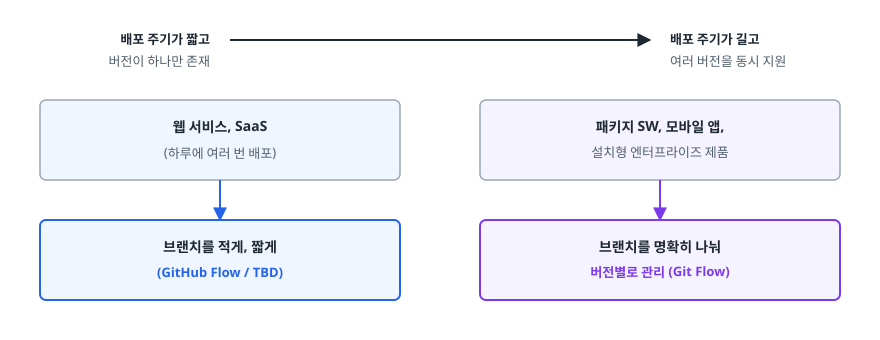
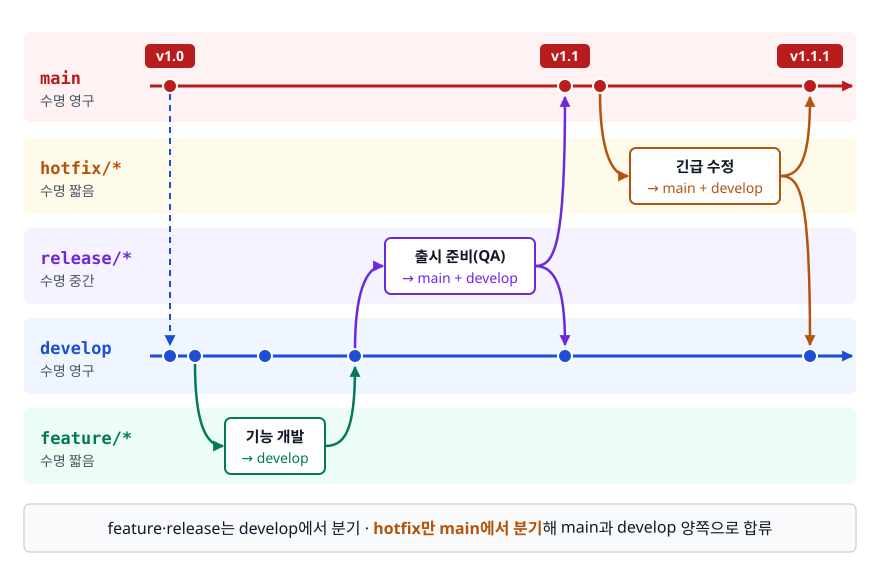
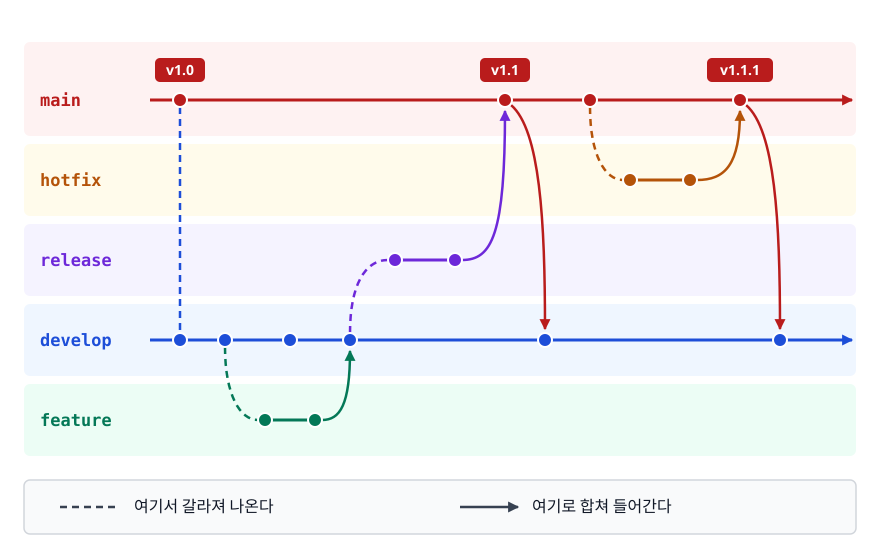
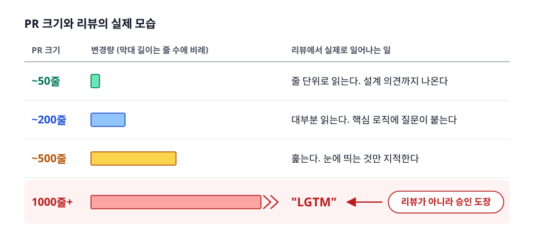

# 브랜치 전략과 협업 규칙 (Branching Strategy)

> 브랜치를 줄이는 만큼 검증은 자동화가 떠안습니다. 이 문서는 그 계산으로 Git Flow가 왜 무겁다는 소리를 듣게 됐는지, 트렁크 기반 개발이 왜 CI/CD와 한 세트인지, 우리 팀은 무엇을 골라야 하는지를 근거와 함께 짚습니다.

## 학습 목표

- [ ] 브랜치 전략이 실제로 무슨 문제를 푸는지 배포 주기와 팀 규모로 설명할 수 있다
- [ ] Git Flow의 다섯 브랜치 역할과 그 구조가 무거워진 배경을 말할 수 있다
- [ ] GitHub Flow / GitLab Flow / 트렁크 기반 개발의 차이를 구분할 수 있다
- [ ] Feature Flag가 왜 트렁크 기반 개발의 전제 조건인지 설명할 수 있다
- [ ] 팀 상황을 듣고 어떤 전략이 맞는지 근거를 들어 고를 수 있다
- [ ] 커밋 메시지와 PR 크기가 리뷰 품질에 미치는 영향을 설명할 수 있다

## 선행 지식

- [01-git-internals.md](./01-git-internals.md) — 브랜치가 포인터일 뿐이라는 사실
- [02-merge-rebase-conflict.md](./02-merge-rebase-conflict.md) — merge/rebase와 충돌의 발생 조건

---

## 1. 왜 필요한가

브랜치를 만드는 데는 1초도 안 걸립니다. 기술적 제약이 없으니 "각자 알아서 브랜치 따서 일하면 되지 않나?"가 자연스러운 생각인데, 규칙 없이 두면 다음이 벌어집니다.

- **어디서 따야 하는지 모릅니다.** 누구는 `main`에서, 누구는 동료 브랜치에서 땁니다. 나중에 합칠 때 예상 못 한 커밋이 딸려 옵니다.
- **지금 배포 가능한 코드가 어디 있는지 모릅니다.** `main`이 항상 배포 가능한지, 아니면 별도 브랜치가 그 역할인지 합의가 없으면 긴급 배포 때 우왕좌왕합니다.
- **운영 장애가 났을 때 핫픽스를 넣을 곳이 없습니다.** `main`에 미완성 기능이 섞여 있으면 한 줄만 고쳐 배포하는 게 불가능합니다.
- 브랜치가 몇 주씩 살아남습니다. [02번 문서](./02-merge-rebase-conflict.md)에서 봤듯 충돌 비용은 브랜치 수명에 비례해 커지다가 통합 지옥이 됩니다.

브랜치 전략은 이 질문들에 **팀이 미리 답을 정해 둔 것**입니다. 그리고 그 답은 팀마다 달라야 합니다. 정답을 좌우하는 첫 변수는 배포 주기입니다.

<!-- diagram:git-branching-strategy-1 -->


<!-- 위 그림이 대체한 원본 ASCII.
     내용을 고칠 때는 그림도 함께 갱신할 것.
```
   배포 주기가 짧고 ────────────────────────► 배포 주기가 길고
   버전이 하나만 존재                          여러 버전을 동시 지원

   웹 서비스, SaaS                            패키지 SW, 모바일 앱,
   (하루에 여러 번 배포)                       설치형 엔터프라이즈 제품
        │                                            │
        ▼                                            ▼
   브랜치를 적게, 짧게                          브랜치를 명확히 나눠
   (GitHub Flow / TBD)                        버전별로 관리 (Git Flow)
```
-->

여기에 **자동화 성숙도**가 곱해집니다. 배포 주기가 같아도 모든 커밋을 몇 분 안에 자동 검증할 수 있는 팀과, 통합할 때마다 사람이 손으로 QA해야 하는 팀은 감당할 수 있는 통합 빈도가 다릅니다. 브랜치를 줄이는 선택은 그만큼의 검증을 자동화가 대신해 준다는 전제 위에서만 성립합니다. 전략은 팀의 현재 능력에 맞춰 고릅니다. 좋아 보인다는 이유로 베껴 오는 것이 아닙니다.

> **비유**: 브랜치 전략은 주방의 동선 규칙과 비슷합니다. 1인 분식집에는 규칙이 필요 없고, 20명이 일하는 호텔 주방은 동선을 정해두지 않으면 서로 부딪혀 아무것도 못 만듭니다.
>
> **비유의 한계**: 주방 동선은 사람이 늘수록 복잡해지는 쪽으로만 갑니다. 소프트웨어는 반대입니다. 자동화가 성숙할수록 **오히려 규칙을 줄이는** 방향으로 갑니다. 대규모 조직인 구글이 가장 단순한 트렁크 기반을 쓰는 이유입니다.

---

## 2. Git Flow

2010년 Vincent Driessen이 발표한 모델입니다. 릴리스 버전이 명확하고 여러 버전을 동시에 유지보수해야 하는 제품을 염두에 두고 설계됐습니다.

### 다섯 종류의 브랜치

<!-- diagram:git-branching-strategy -->


| 브랜치 | 수명 | 역할 | 어디서 따고 어디로 합치나 |
|--------|------|------|------------------------|
| `main` | 영구 | 운영에 배포된 상태. 커밋마다 릴리스 태그가 붙는다 | — |
| `develop` | 영구 | 다음 릴리스를 위한 통합 지점 | — |
| `feature/*` | 짧음 | 개별 기능 개발 | `develop`에서 따서 `develop`으로 |
| `release/*` | 중간 | 출시 준비(버그 수정, 버전 표기, QA) | `develop`에서 따서 `main`+`develop`으로 |
| `hotfix/*` | 짧음 | 운영 긴급 수정 | `main`에서 따서 `main`+`develop`으로 |

<!-- diagram:git-branching-strategy-2 -->


<!-- 위 그림이 대체한 원본 ASCII.
     내용을 고칠 때는 그림도 함께 갱신할 것.
```
 main      ──●────────────────────────●──────●──────────●──►
             │ v1.0                  ╱ │ v1.1 ╲        ╱ │ v1.1.1
             │                      ╱  │       ╲      ╱  │
 hotfix      │                     ╱   │        ●────●   │
             │                    ╱    │                 │
 release     │          ●───●────╱     │                 │
             │         ╱               │                 │
 develop   ──●──●──●──●────────────────▼─────────────────▼──►
                 ╲   ╱
 feature          ●─●

 ╲ = 여기서 갈라져 나온다      ╱, ▼ = 여기로 합쳐 들어간다
```
-->

선을 따라가면 표의 규칙이 그대로 읽힙니다. `feature`는 `develop`에서 나와 `develop`으로 돌아가고, `release`는 `develop`에서 나와 `main`으로 올라간 뒤 `develop`에도 반영됩니다. `hotfix`만 유일하게 **`main`에서 갈라져 나와** `main`과 `develop` 양쪽으로 들어갑니다.

### 이 구조가 푸는 문제

`release/*` 브랜치가 왜 존재하는지가 여기서 드러납니다. 출시 준비(QA, 버그 수정, 문서 정리)에 며칠이 걸리는 동안 **다른 개발자는 다음 릴리스 기능을 `develop`에 계속 넣을 수 있습니다.** 출시 작업과 신규 개발이 서로를 막지 않습니다.

`hotfix/*`는 `main`에서 땁니다. `develop`에는 아직 배포되지 않은 기능이 잔뜩 쌓여 있으므로, 거기서 따면 긴급 수정과 미완성 기능이 함께 나가버립니다. 운영에 나간 그 코드에서 최소한만 고쳐 다시 내보내기 위한 설계입니다.

### 왜 무겁다는 소리를 듣게 됐나

Git Flow는 **"릴리스를 준비하는 기간이 따로 존재한다"**를 전제로 합니다. 그런데 웹 서비스는 그 전제가 성립하지 않습니다. 머지되면 몇 분 뒤 배포되는 환경에서 `release/*` 브랜치는 하는 일이 없습니다. 그저 놀고 있는 게 아니라 비용까지 만듭니다.

- **브랜치 하나 합치는 데 경로가 깁니다.** `feature` → `develop` → `release` → `main`, 그리고 `main`의 변경을 다시 `develop`으로 역방향 머지. 단계마다 충돌 가능성이 생깁니다.
- **`develop`과 `main`이 벌어집니다.** 역방향 머지를 한 번 빠뜨리면 핫픽스가 다음 릴리스에서 되살아나는 회귀 버그가 납니다.
- **`develop`이 사실상 장기 브랜치가 됩니다.** 릴리스 주기가 2주면 `develop`은 2주치 미통합 변경을 이고 있는 셈이라, 실질적으로 통합을 미루는 구조입니다.
- **CD와 충돌합니다.** "언제든 배포 가능한 상태"를 지향하는 파이프라인과 "릴리스 시점을 따로 잡는" 모델은 방향이 반대입니다.

Driessen 본인도 2020년에 원문에 주석을 덧붙여, **지속적으로 배포되는 웹 애플리케이션이라면 GitHub Flow 같은 더 단순한 모델이 낫다**고 밝혔습니다. Git Flow 자체가 틀린 모델이 되지는 않았습니다. **적용 대상이 아닌 곳에 널리 복사된 것**이 문제였습니다.

지금도 Git Flow가 맞는 곳은 분명히 있습니다. 버전 1.x와 2.x를 동시에 지원해야 하는 패키지 소프트웨어가 그렇고, 모바일 앱도 스토어 심사 때문에 배포 시점을 마음대로 정하지 못합니다. 릴리스마다 승인 절차를 거치는 엔터프라이즈 제품도 마찬가지입니다.

---

## 3. GitHub Flow

브랜치를 `main` 하나와 수명이 짧은 기능 브랜치로 줄인 모델입니다.

```
 main   ──●────●────●────●────●────●──►   항상 배포 가능한 상태
           ╲   ╱      ╲   ╱   ╲   ╱
 feature    ●─●        ●─●     ●─●        PR을 거쳐 들어온다
```

규칙은 단순합니다.

1. `main`은 **항상 배포 가능**합니다
2. 작업은 `main`에서 딴 설명적인 이름의 브랜치에서 합니다 (`fix/login-timeout`)
3. 자주 커밋하고 자주 push합니다
4. 준비되면 Pull Request를 엽니다 — PR은 완성 신호가 아니라 **대화의 시작**입니다
5. 리뷰와 CI 통과 후 `main`에 머지합니다
6. 머지하면 배포합니다

`develop`도 `release`도 없습니다. 핫픽스도 특별한 절차가 아니라 그냥 작은 브랜치 하나입니다.

전제 조건이 있습니다. **`main`이 항상 배포 가능하려면 머지 전에 그것을 자동으로 검증해야 합니다.** PR마다 CI가 돌지 않는 팀이 GitHub Flow를 쓰면 "항상 배포 가능"은 구호일 뿐이고, 실제로는 언제 깨졌는지 모르는 `main`을 갖게 됩니다.

약점도 있습니다. **머지 시점과 배포 시점이 사실상 같아서, 특정 버전을 오래 유지보수해야 하는 제품에는 맞지 않습니다.** v1.4를 쓰는 고객에게 패치를 내려줘야 하는데 `main`은 이미 v2.0으로 가 있다면 방법이 없습니다.

---

## 4. GitLab Flow

GitHub Flow의 단순함은 살리면서, "머지 = 즉시 운영 배포"가 아닌 조직을 위해 **환경 브랜치**를 추가한 모델입니다.

```
 [환경 브랜치 방식]

 main ──●────●────●────●──►          머지되면 개발 환경 반영
         ╲    ╲         ╲
 staging  ●────●─────────●──►        검증 완료분만 흘려보낸다
                ╲         ╲
 production      ●─────────●──►      배포 승인된 것만
```

이 모델의 규칙은 **upstream first**입니다. **변경은 항상 `main`에 먼저 들어가고 아래 환경 브랜치로 흘러내려갑니다.** 급하다고 `production`에 직접 커밋하면 그 수정이 `main`에 없어서 다음 배포 때 사라집니다. 이 규칙 하나가 Git Flow의 역방향 머지 누락 문제를 구조적으로 막습니다.

버전을 여러 개 유지해야 하면 환경 브랜치 대신 **릴리스 브랜치**(`1-4-stable`, `2-0-stable`)를 씁니다. 버그는 `main`에서 고치고 필요한 릴리스 브랜치로 cherry-pick합니다. 반대 방향은 금지입니다.

GitLab Flow는 "배포에 승인이나 검증 단계가 필요하지만 Git Flow만큼 복잡하고 싶지는 않은" 팀의 현실적인 타협점입니다.

---

## 5. 트렁크 기반 개발 (Trunk Based Development)

### 무엇이 다른가

모든 개발자가 **하나의 트렁크(`main`)에 하루에 한 번 이상 통합**합니다. 브랜치를 쓰더라도 수명이 하루이틀을 넘기지 않습니다.

```
 main ──●─●─●─●─●─●─●─●─●─●─●─●──►    모두가 여기로 매일 합류
         ╲╱ ╲╱ ╲╱  ╲╱ ╲╱  ╲╱
        (수 시간~하루짜리 브랜치)
```

여기서 발상이 뒤집힙니다. 앞의 전략들이 "브랜치를 어떻게 관리할까"를 물었다면, 트렁크 기반은 **"브랜치가 오래 살아 있는 것 자체가 문제"**라고 답합니다. 충돌 비용도, 통합 지옥도, `develop`과 `main`의 괴리도 전부 브랜치가 오래 살아서 생기는 파생 문제이므로, 원인을 없애면 파생 문제도 함께 사라집니다.

DORA 연구는 **짧은 브랜치 수명과 잦은 통합이 배포 성능과 강한 상관을 보인다**고 반복해서 보고합니다. 트렁크 기반이 고성숙 조직의 선택지로 자주 언급되는 근거가 여기 있습니다.

### "그럼 3주짜리 기능은 어떻게 하나"

가장 자연스러운 반박이고, 여기에 답하는 두 기법이 트렁크 기반 개발의 실체입니다.

**Feature Flag** — 미완성 코드를 `main`에 넣되 스위치를 꺼 둡니다.

```java
if (featureFlags.isEnabled("new-checkout")) {
    return newCheckoutService.process(order);   // 개발 중인 코드
}
return legacyCheckoutService.process(order);    // 사용자에게 보이는 것
```

플래그 값을 DB나 설정 서버에 두면 **코드를 다시 배포하지 않고 값만 바꿔 기능을 켭니다.** 이렇게 하면 **배포(deploy)와 릴리스(release)가 분리됩니다.** 코드는 매일 배포되지만 사용자에게 공개되는 시점은 따로 정할 수 있고, 문제가 생기면 롤백 대신 플래그만 끄면 됩니다. 일부 사용자에게만 켜서 점진적으로 여는 것도 가능합니다.

대가도 있습니다. 플래그가 늘어나면 분기 조합이 폭발해 테스트가 어려워지고, 다 쓴 플래그를 지우지 않으면 코드가 조건문 덤불이 됩니다. **플래그에는 만료 기한과 제거 담당자를 함께 정해두는 규율**이 필요합니다.

**Branch by Abstraction** — 큰 교체 작업을 인터페이스 뒤에서 점진적으로 진행합니다. 결제 모듈을 통째로 갈아엎어야 한다면, 먼저 추상화 계층을 만들어 기존 구현을 그 뒤로 넣고, 새 구현을 조금씩 만들어 붙인 뒤, 마지막에 기본 구현을 교체하고 옛 코드를 지웁니다. 각 단계가 독립적으로 배포 가능해서 3주짜리 브랜치가 필요 없어집니다.

### 전제 조건

트렁크 기반은 **가장 단순한 전략이지만 가장 요구 조건이 많습니다.**

- 모든 커밋마다 자동 테스트가 수 분 내에 돌아야 합니다. 사람이 손으로 검증하는 순간 하루 여러 번 통합은 불가능합니다
- `main`이 깨지면 **다른 모든 작업보다 우선해서 고친다**는 합의가 있어야 합니다
- Feature Flag 관리 체계가 있어야 합니다
- 배포 자동화와 빠른 롤백 수단이 있어야 합니다

이 조건 없이 형태만 따라 하면, 미완성 코드가 그대로 `main`에 쌓이고 아무도 배포를 못 하는 상태가 됩니다. **트렁크 기반은 CI/CD의 결과이지 원인이 아닙니다.**

---

## 6. 무엇을 고를 것인가

| 기준 | Git Flow | GitHub Flow | GitLab Flow | 트렁크 기반 |
|------|----------|-------------|-------------|-----------|
| 영구 브랜치 | `main`, `develop` | `main` | `main` + 환경/릴리스 | `main` |
| 브랜치 수명 | 수일~수주 | 수일 | 수일 | 수시간~1일 |
| 배포 주기 전제 | 정기 릴리스 | 머지 즉시 | 단계별 승인 | 상시 |
| 여러 버전 동시 지원 | 강함 | 불가 | 릴리스 브랜치로 가능 | 별도 대응 필요 |
| CI/CD 요구 수준 | 낮음 | 중간 | 중간 | 매우 높음 |
| 충돌 발생량 | 많음 | 보통 | 보통 | 적음 |
| 학습 비용 | 높음 | 낮음 | 중간 | 개념은 쉽고 규율은 어렵다 |
| 잘 맞는 곳 | 패키지 SW, 모바일 앱, 규제 산업 | 웹 서비스, SaaS, 스타트업 | 배포 승인 절차가 있는 조직 | CI 성숙도가 높은 조직 |

> 선택 순서는 이렇게 잡으면 됩니다. **① 여러 버전을 동시에 유지보수해야 하는가** — 그렇다면 Git Flow나 GitLab Flow의 릴리스 브랜치. **② 머지 즉시 운영 배포가 가능한가** — 가능하면 GitHub Flow, 승인 단계가 필요하면 GitLab Flow. **③ 모든 커밋을 자동 검증할 수 있고 Feature Flag를 운영할 수 있는가** — 그렇다면 트렁크 기반으로 더 줄입니다.

면접에서 "어떤 전략이 가장 좋나요?"라는 질문을 받으면 하나를 고르지 말고 **전제부터 되묻는 편이 낫습니다.** 배포 주기, 지원 버전 수, CI 성숙도를 확인하고 그에 맞는 선택과 근거를 말하는 것이 실제로 기대되는 답변입니다.

### 안티패턴: 규모에 안 맞는 전략 복사

```
# 안티패턴 - 개발자 3명, 웹 서비스, 매일 배포하는 팀이 Git Flow 도입
main / develop / feature/* / release/* / hotfix/*
```

**왜 문제인가**: 매일 배포하는 팀에게 `release/*`는 하는 일이 없는데, 브랜치를 유지하는 비용은 그대로 듭니다. 3명뿐이라 `develop`에 모이는 변경도 적어 통합 지점으로서의 의미가 약합니다. 실제로는 **`develop`과 `main`이 계속 어긋나고 역방향 머지를 잊어 핫픽스가 되살아나는 회귀 버그**가 납니다. 관리에 쓰는 시간이 얻는 안정성보다 큽니다.

```
# 개선 - GitHub Flow로 단순화
main + fix/login-timeout 같은 짧은 브랜치
  + main 브랜치 보호(직접 push 금지, PR 필수, CI 통과 필수)
  + 머지 시 자동 배포
```

브랜치 개수를 줄이는 대신 **브랜치 보호 규칙과 CI에 투자**합니다. 안정성의 근거를 브랜치 구조에서 자동 검증으로 옮기는 셈입니다.

반대 방향의 안티패턴도 같은 무게로 흔합니다. 테스트가 거의 없는 팀이 "구글도 이렇게 한다"며 트렁크 기반을 도입하면, 깨진 `main`이 상시화되어 결국 아무도 배포하지 못합니다.

---

## 7. 커밋 메시지

### 왜 규칙이 필요한가

```
# 안티패턴
$ git log --oneline
a3d0e5 수정
9100f3 ㅇㅇ
453fd2 fix
05bd5b 최종
2789f1 최종2
```

**왜 문제인가**: 커밋 메시지의 독자는 미래의 팀(그리고 미래의 자신)입니다. 장애가 나서 `git log`로 원인을 좁힐 때, `git blame`으로 이 줄이 왜 이렇게 됐는지 물을 때 이 로그는 아무것도 답해주지 못합니다. 배포 노트 자동 생성이나 커밋 단위 필터링도 불가능합니다.

가장 널리 쓰이는 규칙은 **Conventional Commits**입니다.

```
<type>(<scope>): <subject>

<body — 무엇보다 "왜"를 적는다>

<footer — 이슈 번호, BREAKING CHANGE>
```

```
feat(auth): 리프레시 토큰 재발급 API 추가

액세스 토큰 만료마다 재로그인해야 한다는 불만이 접수됐다.
리프레시 토큰을 HttpOnly 쿠키로 내려 자동 재발급하도록 했다.
쿠키를 고른 이유는 XSS로 토큰이 탈취되는 경로를 막기 위해서다.

Closes #142
```

주요 타입은 `feat`(기능 추가), `fix`(버그 수정), `docs`, `refactor`(동작 변경 없는 구조 개선), `test`, `chore`(빌드/설정), `perf`(성능 개선)입니다. 이 중 스펙이 의미를 못 박아 둔 것은 `feat`과 `fix` 둘뿐이고, 나머지는 Angular 커밋 컨벤션에서 넘어와 관습으로 굳은 것이라 팀마다 목록이 조금씩 다릅니다.

규칙을 지키면 실질적인 이득이 따라옵니다.

1. **`git log --oneline`만으로 히스토리가 읽힙니다.** 타입 접두어가 있어 훑기만 해도 성격이 구분됩니다
2. **자동화가 붙습니다.** 커밋 타입을 읽어 CHANGELOG를 만들거나, `feat`은 마이너 버전, `fix`는 패치 버전으로 올리는 시맨틱 버저닝 자동화가 가능해집니다
3. **본문에 "왜"를 적는 자리가 생깁니다.** 무엇을 바꿨는지는 diff가 이미 말해줍니다. diff가 절대 말해주지 못하는 것은 **왜 그렇게 했는가**이고, 커밋 메시지의 고유한 가치는 거기서 나옵니다

제목은 50자 안팎으로 짧게 쓰고 본문과는 **빈 줄로 분리**합니다. 빈 줄은 취향의 문제가 아닙니다. 규칙에 가깝습니다. Git은 첫 문단을 제목으로 취급해서 `git log --oneline`이나 PR 목록에 그 줄만 뽑아 쓰기 때문에, 빈 줄을 빼먹으면 본문까지 제목에 딸려 들어갑니다.

제목의 어투는 영어라면 명령형 현재 시제(`add`, `fix`)가 관례이고, 한국어라면 `~ 추가`, `~ 수정`처럼 명사형으로 끝맺는 팀이 많습니다. 어느 쪽이든 팀 안에서 하나로 통일하는 것이 중요합니다.

---

## 8. PR 크기와 리뷰 품질

### 큰 PR은 리뷰가 안 된다

<!-- diagram:git-branching-strategy-3 -->


<!-- 위 그림이 대체한 원본 ASCII.
     내용을 고칠 때는 그림도 함께 갱신할 것.
```
   PR 크기와 리뷰의 실제 모습

   ~50줄     ─── 줄 단위로 읽는다. 설계 의견까지 나온다
   ~200줄    ─── 대부분 읽는다. 핵심 로직에 질문이 붙는다
   ~500줄    ─── 훑는다. 눈에 띄는 것만 지적한다
   1000줄+   ─── "LGTM"                          ← 리뷰가 아니라 승인 도장
```
-->

코드 리뷰 연구는 **한 번에 검토하는 코드량이 커질수록 결함 발견율이 떨어진다**는 결과를 반복적으로 확인해 왔습니다. 실무에서 널리 인용되는 권고선도 한 PR당 수백 줄 이내입니다. 사람의 집중력이 유한하기 때문입니다. 리뷰어의 성의를 탓할 문제가 아닙니다.

큰 PR은 리뷰 품질만 깎는 게 아닙니다. 리뷰가 며칠씩 밀리면서 브랜치가 길어지고, 브랜치가 길어지면 충돌이 커지고, 충돌 해결에 시간이 들어 리뷰가 더 밀립니다. **PR 크기 → 브랜치 수명 → 충돌 → 리뷰 지연**이 서로를 키우는 고리입니다. 이 고리 때문에 PR 크기는 앞에서 다룬 브랜치 전략의 성패를 좌우하는 변수가 됩니다.

### 안티패턴: 리팩터링과 기능을 한 PR에

```
# 안티패턴
PR #231 "결제 기능 추가"
  변경: 47개 파일, +2,180 / -1,540
  내용: 새 결제 기능 + 전체 코드 포매팅 + 패키지 구조 재배치
```

**왜 문제인가**: 리뷰어가 봐야 할 진짜 변경(결제 로직)이 자동 포매팅이 만든 수천 줄 diff에 파묻힙니다. 파일 이동만 있었다면 Git이 rename으로 묶어 보여주지만, 이동과 내용 수정이 한 커밋에 섞이면 유사도 판정이 어긋나 "삭제 + 추가"로 펼쳐지면서 diff가 더 커집니다. 나중에 결제 기능만 되돌리려 해도 포매팅과 엉켜 있어 분리가 안 됩니다. 다른 브랜치와의 충돌도 폭발합니다.

```
# 개선 - 성격이 다른 변경을 분리한다
PR #231 "chore: 포매터 적용"        (+1,900 / -1,900, 로직 변경 없음)
PR #232 "refactor: 결제 패키지 구조 정리"  (파일 이동만)
PR #233 "feat: 카카오페이 결제 추가"   (+280 / -40)   ← 실질 리뷰 대상
```

포매팅 PR은 "로직 변경 없음"이 명확하므로 몇 분이면 승인되고, 실제 리뷰 역량은 #233에 집중됩니다. 되돌릴 일이 생겨도 해당 PR만 revert하면 됩니다.

### 작게 쪼개기 어려울 때

기능 하나가 원래 큰 경우도 있습니다. 이때 쓰는 방법이 앞에서 본 Feature Flag입니다. 완성되지 않아도 꺼진 상태로 머지할 수 있으니, 3주짜리 기능을 5개의 작은 PR로 나눠 순차 병합할 수 있습니다. **PR을 작게 유지하는 능력과 트렁크 기반 개발이 같은 기법 위에 서 있다**는 점이 여기서 드러납니다.

---

## 9. 실무에서는

- **브랜치 보호 규칙이 전략보다 먼저입니다.** 어떤 전략을 쓰든 `main`에는 직접 push 금지, PR 필수, CI 통과 필수, 최소 1인 승인, force push 금지를 켜 둡니다. 이 설정이 사고를 가장 많이 막습니다. GitHub의 branch protection rule, GitLab의 protected branch가 그 기능입니다.
- `feat/142-refresh-token`처럼 브랜치 이름에 이슈 번호를 넣는 팀이 많습니다. 이렇게 두면 브랜치만 보고 맥락을 찾을 수 있고 이슈 트래커와 자동 연동도 붙습니다.
- **머지 방식은 팀 규칙으로 하나 고정합니다.** squash merge를 고정하면 `main` 히스토리에서 커밋 하나가 곧 PR 하나가 되어 읽기 쉽고 되돌리기 쉽습니다. 대신 개별 커밋이 사라지므로 PR 설명이 사실상 커밋 메시지 역할을 합니다.
- **머지된 브랜치는 자동 삭제**로 설정합니다. 원격에 죽은 브랜치가 수백 개 쌓이면 목록에서 살아 있는 브랜치를 찾는 것부터 일이 됩니다.
- 전략은 팀이 바뀌면 같이 바뀝니다. 초기 스타트업이 GitHub Flow로 시작했다가 고객사별 버전을 지원하게 되면서 릴리스 브랜치를 도입하는 식의 이동은 자연스럽습니다. 지금 쓰는 전략이 **어떤 전제 위에 서 있는지 팀이 아는 것**이 중요합니다.

---

## 10. 면접 포인트

> 면접에서 이 주제가 나오면 이렇게 답한다

**Q. Git Flow, GitHub Flow, 트렁크 기반 개발을 비교해주세요.**
A. Git Flow는 `main`/`develop`/`feature`/`release`/`hotfix` 다섯 브랜치로 릴리스 준비 기간을 따로 두는 모델이라, 여러 버전을 동시 지원하는 패키지 소프트웨어나 모바일 앱에 맞습니다. GitHub Flow는 `main`과 짧은 기능 브랜치만 두고 머지 즉시 배포하는 모델로 웹 서비스에 맞습니다. 트렁크 기반은 여기서 더 나아가 브랜치 수명을 하루 이내로 줄이고 미완성 기능은 Feature Flag로 감춥니다. 결정 변수는 배포 주기, 동시 지원 버전 수, 그리고 CI 성숙도입니다.
- 꼬리 질문: "그럼 Git Flow는 이제 안 쓰나요?" → 아닙니다. 웹 서비스에 과잉이었을 뿐, 버전 1.x와 2.x를 동시에 유지해야 하는 제품에는 여전히 유효합니다. Driessen 본인도 2020년에 "지속 배포되는 웹 앱이라면 더 단순한 모델을 쓰라"는 취지의 주석을 원문에 덧붙였습니다.

**Q. 트렁크 기반 개발에서 미완성 기능은 어떻게 처리하나요?**
A. Feature Flag로 처리합니다. 미완성 코드를 조건문 뒤에 두고 플래그를 꺼진 상태로 `main`에 머지하면, 배포는 되지만 사용자에게는 보이지 않습니다. 플래그 값을 DB나 설정 서버에 두면 코드 재배포 없이 값만 바꿔 기능을 켤 수 있어서 **배포와 릴리스가 분리**되고, 문제가 생기면 롤백 대신 플래그만 끄면 됩니다. 규모가 큰 교체 작업은 Branch by Abstraction으로 인터페이스 뒤에서 점진 교체합니다.
- 꼬리 질문: "Feature Flag의 단점은?" → 분기 조합이 늘어 테스트가 어려워지고, 다 쓴 플래그를 안 지우면 코드가 조건문 덤불이 됩니다. 플래그마다 만료 기한과 제거 담당을 정해두는 규율이 필요합니다.

**Q. 브랜치 전략을 정할 때 무엇을 기준으로 하나요?**
A. 세 가지를 봅니다. 첫째, **동시에 지원해야 하는 버전이 몇 개인가.** 여러 개면 릴리스 브랜치가 필요합니다. 둘째, **머지 즉시 운영 배포가 가능한가.** 승인 단계가 있다면 GitLab Flow의 환경 브랜치가 맞습니다. 셋째, **모든 커밋을 자동으로 검증할 수 있는가.** 이게 되어야 브랜치를 줄이고 통합 빈도를 올릴 수 있습니다. 팀 규모나 유행보다 이 세 조건이 실질적인 결정 변수입니다.
- 꼬리 질문: "CI가 약한 팀이 트렁크 기반을 하면요?" → 깨진 `main`이 상시화되어 아무도 배포를 못 하게 됩니다. 트렁크 기반은 CI/CD를 갖춘 다음에 오는 결과이지, 그 원인이 되지는 않습니다.

**Q. PR을 작게 유지해야 하는 이유는?**
A. 리뷰 가능한 크기를 넘으면 리뷰어가 코드를 읽지 않고 승인만 하게 되기 때문입니다. 여러 연구에서 한 번에 보는 코드량이 커질수록 결함 발견율이 떨어지는 것이 확인됐습니다. 더 중요한 건 연쇄 효과인데, 큰 PR은 리뷰가 밀리고 → 브랜치가 길어지고 → 충돌이 커지고 → 다시 리뷰가 밀리는 고리를 만듭니다. 그래서 포매팅이나 파일 이동처럼 성격이 다른 변경은 별도 PR로 분리하고, 기능 자체가 크면 Feature Flag로 여러 PR에 나눠 담습니다.
- 꼬리 질문: "커밋 메시지 규칙은 왜 필요한가요?" → diff는 무엇을 바꿨는지 말해주지만 왜 그렇게 했는지는 말해주지 못합니다. 그 "왜"를 남기는 자리가 커밋 본문이고, Conventional Commits 같은 규칙을 쓰면 CHANGELOG 생성이나 시맨틱 버저닝 자동화까지 붙습니다.

---

## 자주 하는 실수

| 실수 | 왜 틀렸나 | 올바른 이해 |
|------|----------|-----------|
| "Git Flow가 가장 표준적이니 일단 이걸 쓰자" | 릴리스 준비 기간이 있는 제품을 전제로 한 모델이다 | 매일 배포하는 웹 서비스에서는 `release`/`develop`이 비용만 만듭니다. 배포 주기부터 확인합니다 |
| "트렁크 기반은 브랜치를 아예 안 쓴다" | 짧은 브랜치는 쓴다 | 브랜치 금지가 아니라 **수명을 하루 이내로 유지**하는 것이 핵심입니다 |
| "트렁크 기반이 가장 단순하니 우리도 하자" | 요구 조건이 가장 많은 전략이다 | 자동 테스트, 빠른 CI, Feature Flag, 롤백 수단이 갖춰진 뒤에야 성립합니다 |
| "Feature Flag를 쓰면 롤백이 필요 없다" | 플래그는 만능이 아니다 | DB 스키마 변경처럼 플래그로 못 감추는 변경이 있습니다. 배포 전략과 함께 설계해야 합니다 |
| "핫픽스는 develop에서 따면 된다" | `develop`에는 미배포 기능이 쌓여 있다 | Git Flow에서 핫픽스는 `main`에서 따고 `main`과 `develop` 양쪽에 반영합니다 |
| "GitLab Flow에서 급하면 production에 직접 고친다" | upstream first 원칙을 깬다 | `main`에 없는 수정은 다음 배포 때 사라집니다. 항상 위에서 아래로 흘려보냅니다 |
| "PR이 크면 리뷰어가 더 꼼꼼히 보면 된다" | 집중력은 유한하다 | 크기가 커지면 결함 발견율이 구조적으로 떨어집니다. 의지로 버티는 대신 PR을 쪼개는 쪽이 실효가 있습니다 |
| "커밋 메시지에는 무엇을 바꿨는지 쓴다" | 그건 diff가 이미 보여준다 | 본문에는 **왜** 그렇게 했는지, 어떤 대안을 왜 버렸는지를 남깁니다 |

---

## 한 줄 정리

브랜치 전략에는 좋고 나쁨이 따로 없습니다. 배포 주기·지원 버전 수·자동화 성숙도에 맞추는 문제만 있습니다. 어떤 전략을 고르든 실제 품질은 브랜치를 얼마나 짧게 유지하고 PR을 얼마나 작게 쪼개느냐가 결정합니다.

---

## 연관 개념

- [01-git-internals.md](./01-git-internals.md) - 브랜치가 파일 한 줄짜리 포인터라서 전략을 자유롭게 설계할 수 있는 이유
- [02-merge-rebase-conflict.md](./02-merge-rebase-conflict.md) - 브랜치 수명이 충돌 비용으로 이어지는 과정
- [qna-version-control.md](./qna-version-control.md) - Git Flow / GitHub Flow / TBD 비교 면접 질문(Q3)
- [../10-cloud-engineering/devops-cicd/01-cicd-concepts.md](../10-cloud-engineering/devops-cicd/01-cicd-concepts.md) - 통합 지옥과 CI가 브랜치 전략의 전제를 만드는 방식
- [../10-cloud-engineering/devops-cicd/03-deployment-strategies.md](../10-cloud-engineering/devops-cicd/03-deployment-strategies.md) - Feature Flag와 배포/릴리스 분리의 상세
