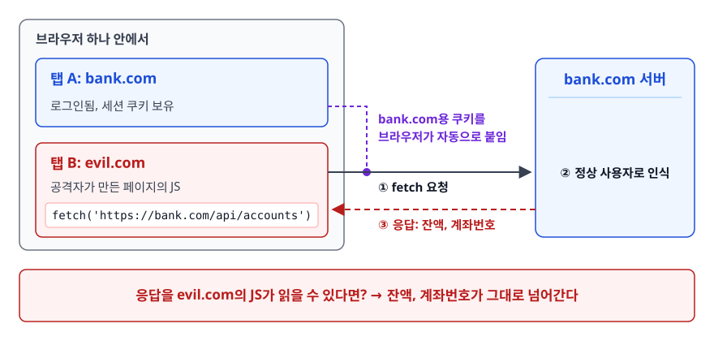
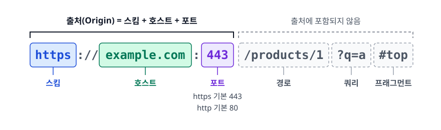
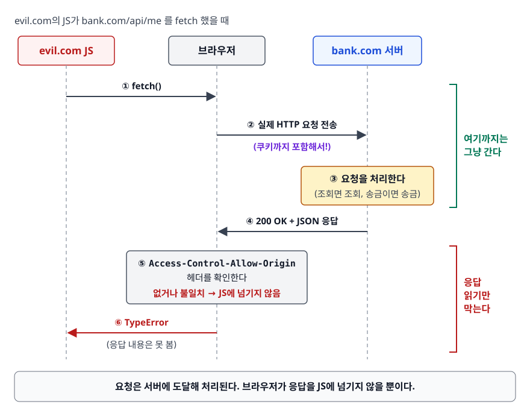
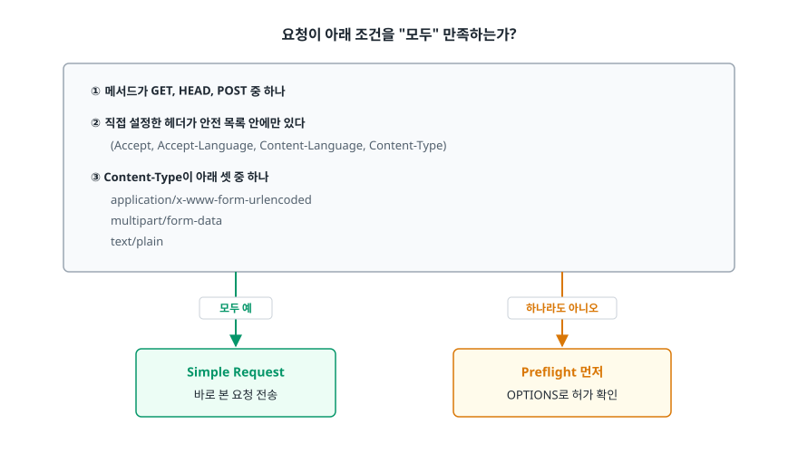
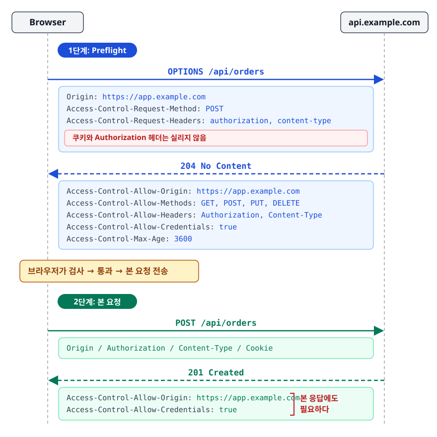
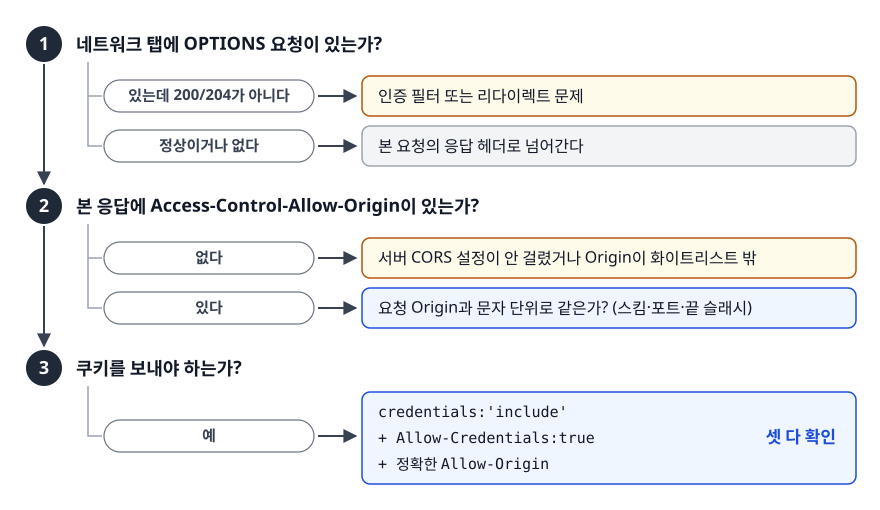

# 동일 출처 정책과 CORS (Same-Origin Policy & CORS)

> CORS 에러 화면을 보고 "서버가 요청을 거부했다"고 오해하지 않게 되고, 에러 메시지만으로 어디를 고쳐야 하는지 짚을 수 있게 됩니다.

## 학습 목표

- [ ] Same-Origin Policy가 막는 것과 막지 않는 것을 정확히 구분할 수 있다
- [ ] 출처(Origin)가 무엇으로 구성되는지 말하고 같은 출처 여부를 판정할 수 있다
- [ ] Simple Request와 Preflight의 분기 조건을 조건 단위로 설명할 수 있다
- [ ] CORS 응답 헤더 각각이 무엇을 허용하는지 안다
- [ ] credentials를 포함할 때 와일드카드가 금지되는 이유를 설명할 수 있다
- [ ] 흔한 CORS 에러 메시지를 보고 원인 위치를 추정할 수 있다

## 선행 지식

- HTTP 요청/응답 헤더의 기본 구조, `fetch`로 API를 호출해본 경험

---

## 1. 왜 필요한가 — 브라우저가 아니면 존재하지 않는 문제

터미널에서 `curl https://api.bank.com/me`를 실행하면 CORS 같은 건 없습니다. 응답이 그대로 옵니다.
그런데 브라우저의 자바스크립트가 같은 요청을 보내면 에러가 납니다. 왜 브라우저만 다를까.

브라우저는 **여러 사이트를 동시에 열어두고, 각 사이트의 자격 증명(쿠키)을 대신 보관하는** 특이한 실행 환경입니다.

<!-- diagram:sec-cors-same-origin-1 -->


<!-- 위 그림이 대체한 원본 ASCII.
     내용을 고칠 때는 그림도 함께 갱신할 것.
```
        브라우저 하나 안에서
┌──────────────────────────────────────────────────┐
│  탭 A: bank.com      (로그인됨, 세션 쿠키 보유)     │
│  탭 B: evil.com      (공격자가 만든 페이지)         │
└──────────────────────────────────────────────────┘

evil.com의 JS가 fetch('https://bank.com/api/accounts') 를 호출한다면?
브라우저는 bank.com용 쿠키를 자동으로 붙이고, 서버는 정상 사용자로 인식한다.
응답을 evil.com의 JS가 읽을 수 있다면 → 잔액, 계좌번호가 그대로 넘어간다.
```
-->

`curl`에는 이런 일이 없습니다. 남의 세션 쿠키를 갖고 있지도 않고 누가 몰래 스크립트를 실행시키지도 못합니다.
**Same-Origin Policy(SOP, 동일 출처 정책)는 이 브라우저 고유의 위험을 막는 기본 규칙**입니다.

> **비유**: 회사 건물에 여러 회사가 입주해 있고, 출입증(쿠키)은 로비에서 자동으로 찍힙니다.
> SOP는 "A사 직원이 B사 사무실 문서를 들고 나올 수 없다"는 규칙입니다.
>
> **비유의 한계**: SOP는 문서를 "들고 나오는 것"만 막습니다. B사 사무실에 편지를 밀어 넣는 것
> (요청 전송)은 막지 않습니다. 이 차이가 CSRF가 여전히 성립하는 이유입니다.

---

## 2. 출처(Origin)란 정확히 무엇인가

**출처 = 스킴(프로토콜) + 호스트 + 포트**. 셋 중 하나라도 다르면 다른 출처입니다.

<!-- diagram:sec-cors-same-origin-2 -->


<!-- 위 그림이 대체한 원본 ASCII.
     내용을 고칠 때는 그림도 함께 갱신할 것.
```
https://example.com:443/products/1?q=a#top
─┬───   ─────┬─────  ─┬─
 │           │        └─ 포트   (https 기본 443, http 기본 80)
 │           └────────── 호스트
 └────────────────────── 스킴

경로(/products/1), 쿼리(?q=a), 프래그먼트(#top)는 출처에 포함되지 않는다.
```
-->

기준이 `https://example.com`일 때:

| 비교 대상 | 같은 출처인가 | 이유 |
|-----------|--------------|------|
| `https://example.com/about` | 같음 | 경로는 출처와 무관 |
| `https://example.com:443/` | 같음 | 443은 https의 기본 포트 |
| `http://example.com` | **다름** | 스킴이 다르다 |
| `https://api.example.com` | **다름** | 서브도메인도 다른 호스트다 |
| `https://example.com:8443` | **다름** | 포트가 다르다 |

세 번째 줄이 실무에서 가장 많이 걸립니다. **HTTP에서 HTTPS로 바꾸기만 해도 출처가 바뀐다.**
그리고 네 번째 줄 때문에 "프론트는 `www.myapp.com`, API는 `api.myapp.com`" 구성에서
반드시 CORS 설정이 필요해집니다. 같은 회사 도메인이라는 사실은 브라우저에게 아무 의미가 없습니다.

> 참고: 쿠키의 동일성 판정 기준은 이것과 다릅니다. 쿠키는 포트를 무시하고 `Domain` 속성으로
> 상위 도메인까지 공유할 수 있어서, "쿠키는 공유되는데 CORS는 걸린다"는 상황이 흔히 생깁니다.

---

## 3. SOP가 막는 것과 막지 않는 것

<!-- diagram:sec-sop-response-block -->


여기가 CORS 이해의 분수령입니다. **SOP는 요청을 막지 않습니다. 응답을 읽는 것을 막는다.**

```
[ evil.com의 JS가 bank.com/api/me 를 fetch 했을 때 ]

  evil.com JS                브라우저                    bank.com 서버
      │                         │                             │
      │ ── fetch() ───────────► │                             │
      │                         │ ── 실제 HTTP 요청 전송 ────► │
      │                         │    (쿠키까지 포함해서!)       │  ← 여기까지는 그냥 간다
      │                         │                             │
      │                         │                        요청을 처리한다
      │                         │                        (조회면 조회, 송금이면 송금)
      │                         │                             │
      │                         │ ◄── 200 OK + JSON 응답 ──── │
      │                         │                             │
      │                         │  Access-Control-Allow-Origin
      │                         │  헤더를 확인한다
      │                         │                             │
      │ ◄── TypeError ───────── │  없거나 불일치 → JS에 넘기지 않음
      │     (응답 내용은 못 봄)   │
```

여기서 반드시 짚어야 할 것은 **요청이 서버에 도달했고 서버가 처리했다**는 사실입니다.
그것이 `POST /transfer`였다면 송금이 일어났습니다. CORS 에러는 "그 결과를 JS에게 안 보여주겠다"는
뜻일 뿐입니다. 그래서 CORS는 **사용자를 보호**하는 장치지 **서버를 보호**하는 장치가 아닙니다.

**SOP가 막는 것**

- `fetch` / `XMLHttpRequest`로 받은 **크로스 오리진 응답 본문 읽기**
- 크로스 오리진 `<iframe>` 내부 DOM 접근 (`iframe.contentDocument`)
- 크로스 오리진 이미지를 그린 `<canvas>`에서 픽셀 읽기 (tainted canvas)
- 크로스 오리진 스크립트에서 난 에러의 상세 정보 (`Script error.`만 보이는 이유)

**SOP가 막지 않는 것**

- ``, `<script>`, `<link rel=stylesheet>` — 로드와 실행·표시 (내용 읽기는 못 함)
- `<iframe src="https://other.com">` — 표시 (내부 DOM 접근은 못 함)
- `<form action="https://other.com/transfer" method="post">` — **폼 전송**

마지막 항목이 핵심입니다. **폼 전송은 SOP와 무관하게 나간다.**
CSRF가 여전히 성립하는 이유가 바로 이것이고, "CORS 설정했으니 CSRF는 안전하다"가 틀린 이유입니다.

---

## 4. CORS — SOP를 서버가 명시적으로 완화하는 방법

프론트엔드와 API 서버를 분리 배포하는 구성이 표준이 되면서, SOP만으로는 정상적인 호출까지 막힙니다.
**CORS(Cross-Origin Resource Sharing)는 서버가 "이 출처의 JS에게는 응답을 보여줘도 된다"고
브라우저에게 알려주는 프로토콜**입니다. 허가의 주체는 서버이고, 집행의 주체는 브라우저입니다.

### Simple Request vs Preflight — 분기 조건

브라우저는 요청이 "옛날 HTML로도 만들 수 있었던 요청"인지를 따집니다.
`<form>`이나 ``로 이미 보낼 수 있던 종류의 요청이라면 CORS 이전에도 나가던 것이므로
사전 확인이 무의미합니다. 그래서 그런 요청은 그냥 보냅니다.

<!-- diagram:sec-cors-same-origin-3 -->


<!-- 위 그림이 대체한 원본 ASCII.
     내용을 고칠 때는 그림도 함께 갱신할 것.
```
                    요청이 아래 조건을 "모두" 만족하는가?

  ┌───────────────────────────────────────────────────────────────┐
  │ ① 메서드가 GET, HEAD, POST 중 하나                             │
  │ ② 직접 설정한 헤더가 안전 목록 안에만 있다                       │
  │    (Accept, Accept-Language, Content-Language, Content-Type)   │
  │ ③ Content-Type이 아래 셋 중 하나                               │
  │    application/x-www-form-urlencoded                          │
  │    multipart/form-data                                        │
  │    text/plain                                                 │
  └───────────────────────────────────────────────────────────────┘
            │                                    │
          모두 예                              하나라도 아니오
            ▼                                    ▼
    ┌────────────────┐                  ┌──────────────────────┐
    │ Simple Request │                  │ Preflight 먼저       │
    │ 바로 본 요청 전송│                  │ OPTIONS로 허가 확인   │
    └────────────────┘                  └──────────────────────┘
```
-->

실무에서 Preflight가 발생하는 사유는 거의 항상 둘 중 하나입니다. `Content-Type: application/json`(조건 ③ 위반),
그리고 `Authorization: Bearer ...`나 `X-CSRF-TOKEN` 같은 커스텀 헤더(조건 ② 위반).
즉 **요즘 API 호출은 대부분 Preflight를 탄다.**

### Preflight 왕복

<!-- diagram:sec-cors-same-origin -->


```
Browser                                              api.example.com
   │                                                        │
   │ ── OPTIONS /api/orders ──────────────────────────────► │
   │    Origin: https://app.example.com                     │
   │    Access-Control-Request-Method: POST                 │
   │    Access-Control-Request-Headers: authorization,       │
   │                                    content-type        │
   │                                                        │
   │ ◄── 204 No Content ─────────────────────────────────── │
   │    Access-Control-Allow-Origin: https://app.example.com│
   │    Access-Control-Allow-Methods: GET, POST, PUT, DELETE│
   │    Access-Control-Allow-Headers: Authorization, Content-Type
   │    Access-Control-Allow-Credentials: true              │
   │    Access-Control-Max-Age: 3600                        │
   │                                                        │
   │  [브라우저가 검사 → 통과 → 본 요청 전송]                  │
   │                                                        │
   │ ── POST /api/orders ────────────────────────────────►  │
   │    Origin / Authorization / Content-Type / Cookie      │
   │                                                        │
   │ ◄── 201 Created ────────────────────────────────────── │
   │    Access-Control-Allow-Origin: https://app.example.com│  ← 본 응답에도 필요하다
   │    Access-Control-Allow-Credentials: true              │
```

주의할 점 두 가지. 첫째, **Preflight 요청에는 쿠키와 `Authorization` 헤더가 실리지 않는다.**
서버의 인증 필터가 OPTIONS를 401로 막으면 그 자리에서 실패합니다. 실무에서 가장 흔한 CORS 장애 원인입니다.
둘째, **본 응답에도 CORS 헤더가 있어야 한다.** Preflight 통과는 "보내도 된다"까지고,
응답을 읽어도 되는지는 본 응답의 헤더가 다시 결정합니다.

---

## 5. 응답 헤더별 의미

| 헤더 | 어디에 붙나 | 의미 | 빼먹으면 |
|------|------------|------|---------|
| `Access-Control-Allow-Origin` | Preflight + 본 응답 | 응답을 읽어도 되는 출처. 값은 하나만 (`*` 또는 정확한 출처) | 응답이 JS에 전달되지 않음 |
| `Access-Control-Allow-Methods` | Preflight | 허용 메서드 목록 | 해당 메서드 요청이 차단됨 |
| `Access-Control-Allow-Headers` | Preflight | 클라이언트가 직접 붙여도 되는 헤더 목록 | 커스텀 헤더 요청이 차단됨 |
| `Access-Control-Allow-Credentials` | Preflight + 본 응답 | 쿠키/인증 헤더 동반 허용 (`true`만 유효) | 쿠키 미전송 또는 응답 차단 |
| `Access-Control-Max-Age` | Preflight | Preflight 결과 캐시 시간(초) | 요청마다 OPTIONS 왕복이 반복됨 |
| `Access-Control-Expose-Headers` | 본 응답 | JS가 읽을 수 있는 **응답** 헤더를 추가 노출 | `X-Total-Count` 등이 JS에서 안 보임 |

마지막 헤더는 놓치기 쉽습니다. 기본적으로 JS가 읽을 수 있는 크로스 오리진 응답 헤더는 `Cache-Control`,
`Content-Language`, `Content-Length`, `Content-Type`, `Expires`, `Last-Modified`, `Pragma`뿐입니다.
페이지네이션 총 개수를 `X-Total-Count`로 내려줬는데 프론트에서 `undefined`가 나온다면 이것이 빠진 것입니다.
참고로 `Access-Control-Max-Age`는 브라우저마다 상한이 있어 아주 큰 값을 넣어도 그만큼 캐시되지 않습니다.

---

## 6. credentials를 포함하면 규칙이 엄격해진다

```javascript
// 쿠키를 함께 보내려면 클라이언트도 명시해야 한다
await fetch('https://api.example.com/me', { credentials: 'include' });
```

이때 서버는 두 가지를 모두 만족해야 합니다.

```http
Access-Control-Allow-Origin: https://app.example.com   ← 반드시 정확한 출처. * 금지
Access-Control-Allow-Credentials: true
```

### 왜 `*`가 금지되는가

```
Access-Control-Allow-Origin: *  +  쿠키 자동 전송
  = 아무 사이트나 방문자의 로그인 세션으로 우리 API를 호출하고 결과까지 읽는다
  = SOP를 만든 이유가 사라진다  →  브라우저가 조합 자체를 거부
```

`*`는 "누가 요청하든 응답을 읽어도 좋다"는 뜻이라, 여기에 쿠키 자동 전송이 더해지면
SOP를 정면으로 뒤집습니다. 그래서 명세 수준에서 막아두었습니다. 같은 이유로 credentials 요청에서는
`Access-Control-Allow-Headers: *`와 `Allow-Methods: *`의 와일드카드도 특별한 의미를 잃고
**문자 그대로의 `*`**로 취급됩니다.

### 그래서 실무 구현은 "출처를 되비추는" 형태가 된다

```java
// 안티패턴: 요청 Origin을 검증 없이 그대로 되돌려준다
response.setHeader("Access-Control-Allow-Origin", request.getHeader("Origin"));
response.setHeader("Access-Control-Allow-Credentials", "true");
```

**왜 문제인가**: 어떤 출처가 와도 그대로 허용하므로 사실상 `*` + credentials와 같습니다.
명세가 막아둔 조합을 손으로 우회한 셈입니다. `evil.com`이 보낸 요청에는
`Access-Control-Allow-Origin: https://evil.com`이 돌아가고 브라우저는 통과시킵니다.

```java
// 개선: 화이트리스트로 검증한 뒤에만 되비춘다
@Bean
public CorsConfigurationSource corsConfigurationSource() {
    CorsConfiguration config = new CorsConfiguration();
    config.setAllowedOrigins(List.of("https://app.example.com", "https://admin.example.com"));
    config.setAllowedMethods(List.of("GET", "POST", "PUT", "DELETE", "OPTIONS"));
    config.setAllowedHeaders(List.of("Authorization", "Content-Type", "X-CSRF-TOKEN"));
    config.setExposedHeaders(List.of("X-Total-Count"));
    config.setAllowCredentials(true);
    config.setMaxAge(3600L);

    UrlBasedCorsConfigurationSource source = new UrlBasedCorsConfigurationSource();
    source.registerCorsConfiguration("/api/**", config);
    return source;
}
```

허용 목록에 없는 출처에는 아예 `Access-Control-Allow-Origin` 헤더가 붙지 않으므로 브라우저가 차단합니다.

### 캐시 오염을 막는 `Vary: Origin`

출처에 따라 응답 헤더가 달라진다면, 중간 캐시(CDN, 리버스 프록시)에게 그 사실을 알려야 합니다.

```http
Vary: Origin
```

이게 없으면 `app.example.com`용 응답이 캐시되어 다른 출처의 요청에도 그대로 나가거나, 반대로
허용되지 않은 출처의 응답이 캐시되어 정상 사용자가 CORS 에러를 겪습니다.
Spring Security의 CORS 필터는 자동으로 붙이지만 직접 헤더를 세팅하는 코드에서는 빠지기 쉽습니다.

---

## 7. 에러 메시지별 원인 진단

브라우저 콘솔의 CORS 에러는 자바스크립트에서 잡을 수 없습니다. `catch`에는 그냥 `TypeError`만 들어오고
정보는 콘솔에만 있으므로, **메시지를 정확히 읽는 것**이 디버깅의 전부입니다.

| 콘솔 메시지 (요지) | 실제 원인 | 어디를 고치나 |
|--------------------|----------|-------------|
| `No 'Access-Control-Allow-Origin' header is present` | 서버가 CORS 헤더를 안 붙였습니다. 혹은 요청 Origin이 화이트리스트에 없다 | 서버 CORS 설정. 오타·`http`/`https`·포트·끝 슬래시 확인 |
| 위와 같은데 **에러 응답(4xx/5xx)일 때만** 발생 | 예외 처리 경로가 CORS 필터를 우회했다 | 전역 예외 핸들러 응답에도 CORS 헤더가 붙도록 필터 순서 조정 |
| `Response to preflight request doesn't pass access control check: It does not have HTTP ok status` | OPTIONS 요청이 401/403/404로 응답됐다 | 인증 필터에서 OPTIONS를 통과시키거나, OPTIONS 핸들러를 등록 |
| `must not be the wildcard '*' when the request's credentials mode is 'include'` | `*` + credentials 조합 | 정확한 출처 문자열을 반환하도록 변경 |
| `Request header field X-Custom-Id is not allowed by Access-Control-Allow-Headers` | 클라이언트가 붙인 헤더가 허용 목록에 없다 | `Access-Control-Allow-Headers`에 해당 헤더 추가 |
| `Method PATCH is not allowed by Access-Control-Allow-Methods` | 메서드 미허용 | `Access-Control-Allow-Methods`에 추가 |
| `Redirect is not allowed for a preflight request` | OPTIONS 응답이 301/302였다 | 리다이렉트 규칙(HTTPS 강제, 끝 슬래시 정규화)이 OPTIONS를 건드리지 않게 |
| `The 'Access-Control-Allow-Origin' header contains multiple values` | 헤더가 두 번 붙었다 | 프레임워크 CORS 설정과 프록시(Nginx) 설정이 중복. 한 곳에서만 처리 |

진단 순서로 정리하면 이렇습니다.

<!-- diagram:sec-cors-same-origin-4 -->


<!-- 위 그림이 대체한 원본 ASCII.
     내용을 고칠 때는 그림도 함께 갱신할 것.
```
1. 네트워크 탭에 OPTIONS 요청이 있는가?
   └ 있는데 200/204가 아니다 → 인증 필터 또는 리다이렉트 문제
   └ 정상이거나 없다         → 본 요청의 응답 헤더로 넘어간다
2. 본 응답에 Access-Control-Allow-Origin이 있는가?
   └ 없다 → 서버 CORS 설정이 안 걸렸거나 Origin이 화이트리스트 밖
   └ 있다 → 요청 Origin과 문자 단위로 같은가? (스킴·포트·끝 슬래시)
3. 쿠키를 보내야 하는가?
   └ 예 → credentials:'include' + Allow-Credentials:true + 정확한 Allow-Origin, 셋 다 확인
```
-->

### 해서는 안 되는 "해결"

```javascript
// 안티패턴 1: no-cors 모드로 바꾸면 에러가 사라진다?
const res = await fetch('https://api.other.com/data', { mode: 'no-cors' });
console.log(res.status);   // 항상 0. res.json()도 실패한다

// 안티패턴 2: 공개 CORS 프록시를 끼운다
fetch('https://cors-anywhere.example/https://api.other.com/data')
```

**왜 문제인가**: `no-cors`는 CORS를 우회하는 옵션이 아니라 **"응답을 안 읽겠다"고 선언하는 옵션**입니다.
반환되는 것은 내용을 읽을 수 없는 opaque 응답이라, 콘솔의 빨간 에러와 함께 데이터도 사라집니다.
공개 프록시는 요청과 응답 전체(인증 토큰 포함)가 제3자 서버를 지나가므로 운영에 쓰면
자격 증명을 남에게 넘기는 것과 같습니다.

```javascript
// 개선 1: 개발 환경은 번들러 프록시로 같은 출처를 만든다 (Vite)
export default {
  server: { proxy: { '/api': { target: 'http://localhost:8080', changeOrigin: true } } }
};
// 개선 2: 운영은 서버에 화이트리스트 CORS를 정식 설정하거나,
//         리버스 프록시로 프론트와 API를 같은 도메인 아래 경로로 묶는다
```

---

## 8. CORS는 보안 장치가 아니다

가장 널리 퍼진 오해라 따로 정리합니다.

| 오해 | 사실 |
|------|------|
| "CORS로 API를 보호한다" | CORS는 브라우저 JS만 통제합니다. `curl`, Postman, 서버 간 호출, 모바일 앱에는 적용되지 않는다 |
| "CORS 에러가 났으니 서버는 요청을 거부했다" | 요청은 도달했고 처리됐을 수 있습니다. 브라우저가 응답을 안 넘겨준 것뿐 |
| "CORS를 열면 서버가 위험해진다" | 위험해지는 것은 그 출처를 신뢰하는 **사용자입니다. 서버의 노출 면적은 그대로다 |

**CORS가 하는 일**은 크로스 오리진 응답을 JS에게 노출할지 결정하는 것(사용자 보호)이고,
**서버를 보호하는 것**은 인증·인가·CSRF 방어·레이트 리밋입니다. CORS를 아무리 조여도 인증이 없는
API는 그냥 공개 API이고, 인증이 제대로 되어 있으면 넓게 열어도 서버가 뚫리지는 않습니다.

---

## 9. 실무에서는

- **Spring Boot에서 `allowedOrigins("*")`와 `allowCredentials(true)`를 함께 쓰면 기동 시 예외가 난다.**
  스펙상 불가능한 조합이기 때문입니다. 패턴이 필요하면 `allowedOriginPatterns`를 쓰되,
  `https://*.example.com`은 서브도메인 전체를 신뢰하겠다는 선언이라 하나만 탈취돼도 통로가 열립니다.
  Origin을 직접 검사한다면 문자열 전체를 비교합니다. `startsWith`는 `https://app.example.com.evil.com`에 뚫립니다.
- **Nginx와 애플리케이션에서 CORS를 이중으로 설정하는 사고가 잦다.** 헤더가 두 번 붙으면
  브라우저가 "값이 여러 개"라며 거부합니다. 처리 지점을 한 곳으로 정합니다.
- **CDN에 두는 정적 자원도 `Access-Control-Allow-Origin`이 필요할 수 있다.** 웹폰트와 `crossorigin`
  속성을 붙인 스크립트(소스맵·에러 추적용)가 대표적입니다.
- **가장 확실한 CORS 대책은 CORS를 안 만나는 것이다.** 리버스 프록시로 `app.example.com/api/*`를
  백엔드로 넘기면 브라우저 입장에서는 동일 출처라 CORS 자체가 발생하지 않고,
  쿠키의 `SameSite` 설정도 함께 단순해집니다.

---

## 10. 면접 포인트

> 면접에서 이 주제가 나오면 이렇게 답한다

**Q. CORS 에러가 났다는 건 요청이 서버에 도달하지 못했다는 뜻인가요?**

A. 아닙니다. Simple Request라면 요청은 그대로 서버에 도달해 처리까지 끝난 상태이고,
브라우저가 응답의 `Access-Control-Allow-Origin`을 확인한 뒤 JS에게 넘기지 않은 것뿐입니다.
Preflight가 붙는 요청이라면 OPTIONS 단계에서 막혀 본 요청이 안 나갈 수도 있지만, 어느 쪽이든
"서버가 거부했다"와는 다릅니다. 그래서 CORS는 서버 보호 수단이 아니라 브라우저가 사용자를
보호하는 장치라고 정리합니다.
- 꼬리 질문: "그럼 서버는 무엇으로 보호하나요?" → 인증·인가가 본체이고, 쿠키 인증이라면
  CSRF 방어를, 남용 방지를 위해 레이트 리밋을 함께 둡니다.

**Q. Preflight는 언제 발생하나요?**

A. 메서드가 GET/HEAD/POST가 아니거나, 안전 목록 밖의 헤더를 직접 붙였거나,
Content-Type이 `x-www-form-urlencoded`/`multipart/form-data`/`text/plain`이 아닐 때 발생합니다.
기준은 "옛날 HTML 폼으로도 보낼 수 있던 요청인가"입니다. 그런 요청은 CORS 이전부터 나가던 것이라
사전 확인이 의미가 없거든요. 실무에서는 `Content-Type: application/json`과 `Authorization` 때문에
사실상 대부분의 API 호출이 Preflight를 탑니다.
- 꼬리 질문: "Preflight 때문에 느려지면 어떻게 하나요?" → `Access-Control-Max-Age`로 결과를 캐시합니다.
  더 근본적으로는 리버스 프록시로 동일 출처를 만들어 Preflight 자체를 없앱니다.

**Q. `Access-Control-Allow-Origin: *`와 credentials를 왜 같이 못 쓰나요?**

A. 둘을 합치면 "누구든 우리 API를 호출할 수 있고, 그때 방문자의 세션 쿠키가 자동으로 붙고,
응답까지 읽을 수 있다"가 되기 때문입니다. 인터넷의 아무 사이트나 방문자의 로그인 상태로
우리 데이터를 읽어갈 수 있다는 뜻이라, SOP가 존재하는 이유 자체가 사라집니다.
그래서 명세에서 조합을 금지하고, credentials를 쓰려면 정확한 출처 문자열을 반환하도록 강제합니다.
- 꼬리 질문: "그럼 요청 Origin을 그대로 되돌려주면 되지 않나요?" → 검증 없이 되비추면
  사실상 `*` + credentials와 같아집니다. 화이트리스트로 검증한 뒤에만 되비춰야 하고,
  이때 `Vary: Origin`을 붙여 캐시 오염도 막아야 합니다.

**Q. SOP는 크로스 오리진 요청 자체를 막나요?**

A. 아닙니다. ``, `<script>`, `<link>`, `<form>` 전송은 SOP와 무관하게 나갑니다.
SOP가 막는 것은 응답을 **읽는 것**, 그리고 크로스 오리진 iframe의 DOM 접근이나 tainted canvas의
픽셀 읽기 같은 정보 유출 경로입니다. 요청 전송은 허용되기 때문에 CSRF가 성립하고,
그래서 CSRF는 CORS가 아니라 SameSite 쿠키와 CSRF 토큰으로 막아야 합니다.
- 꼬리 질문: "`<script>`로는 남의 API를 읽을 수 있지 않나요?" → 그 성질을 이용한 것이 JSONP인데,
  응답을 그대로 실행하는 방식이라 서버를 전적으로 신뢰해야 하고 GET만 가능해 지금은 쓰지 않습니다.

---

## 자주 하는 실수

| 실수 | 왜 틀렸나 | 올바른 이해 |
|------|----------|-----------|
| "CORS는 서버를 보호하는 보안 기능이다" | 브라우저 JS에만 적용됩니다. curl·서버 간 호출은 무관 | 사용자를 보호하는 브라우저 정책. 서버 보호는 인증/인가의 몫 |
| "CORS 에러가 나면 요청이 안 갔다" | Simple Request는 이미 처리까지 끝났다 | 브라우저가 응답을 JS에 안 넘긴 것뿐 |
| "`mode: 'no-cors'`로 해결한다" | opaque 응답이 와서 아무것도 못 읽는다 | 에러만 사라지고 데이터도 사라진다 |
| "`api.myapp.com`은 `myapp.com`과 같은 출처다" | 호스트 문자열이 다르면 다른 출처다 | 서브도메인도 다른 출처. 쿠키의 도메인 규칙과 혼동하지 말 것 |
| "Preflight만 통과하면 끝이다" | 본 응답에도 CORS 헤더가 필요하다 | Preflight는 "보내도 되는가", 본 응답 헤더는 "읽어도 되는가" |
| "500 에러인데 CORS 에러로 보인다" | 예외 응답이 CORS 필터를 우회했다 | 에러 응답에도 CORS 헤더가 붙어야 진짜 원인이 보인다 |

---

## 한 줄 정리

SOP는 크로스 오리진 **응답 읽기**를 막는 브라우저 규칙이고, CORS는 서버가 특정 출처에 한해 그 금지를 풀어주는 절차이며, 둘 중 어느 것도 서버로 들어오는 **요청**을 막지 않습니다.

---

## 연관 개념

- [01-web-vulnerabilities.md](./01-web-vulnerabilities.md) - CORS가 막지 못하는 CSRF와 그 방어
- [qna-security.md](./qna-security.md) - Q5(CORS), Q6(CSRF)
- [../01-computer-science-fundamentals/network/02-http-https.md](../01-computer-science-fundamentals/network/02-http-https.md) - 요청/응답 헤더와 메서드의 기본
- [../03-frontend-engineering/browser-fundamentals/01-url-to-render.md](../03-frontend-engineering/browser-fundamentals/01-url-to-render.md) - 브라우저가 리소스를 요청하는 전체 흐름
