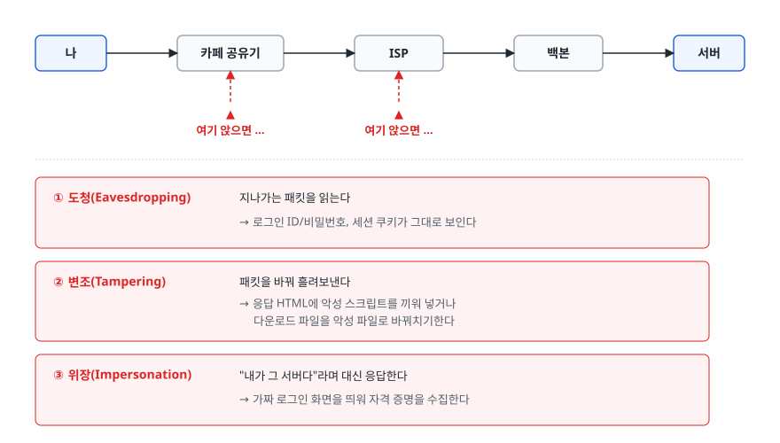
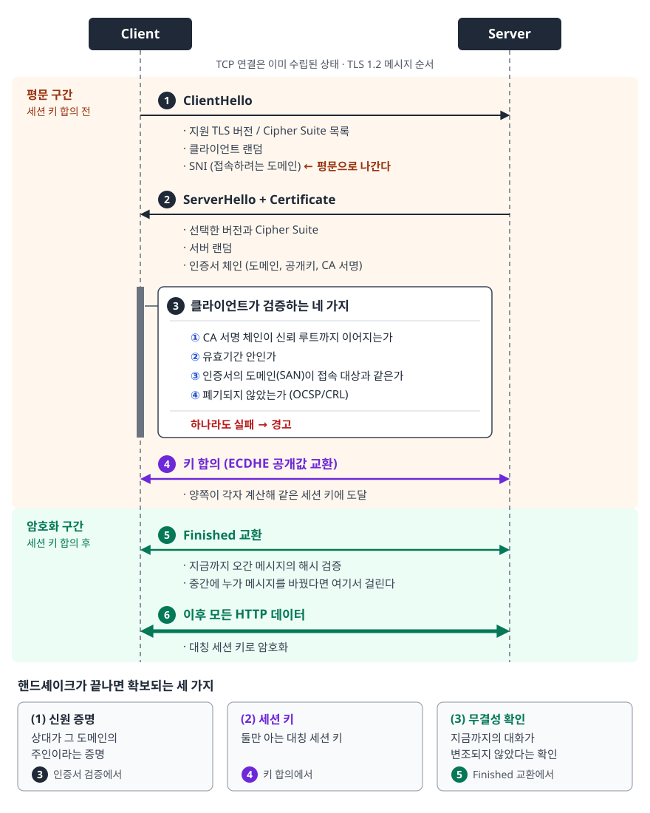
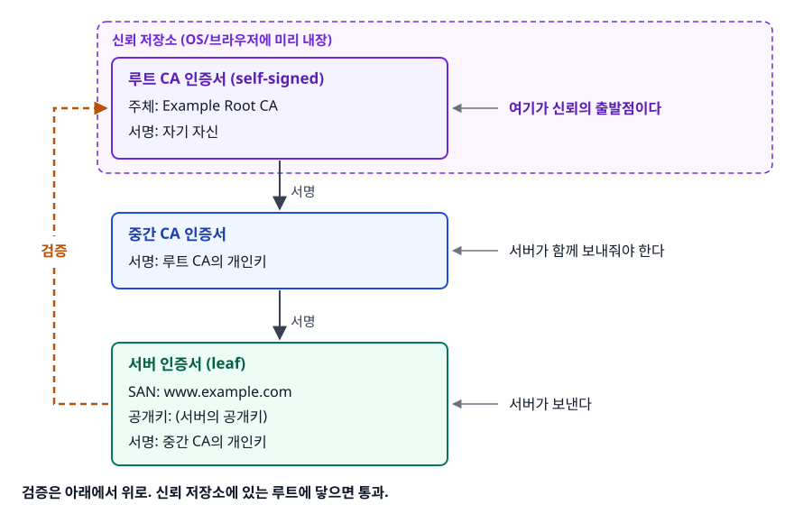
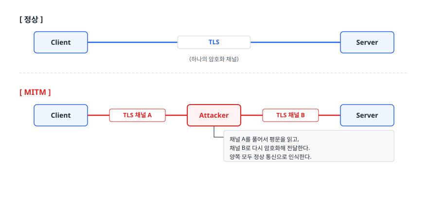
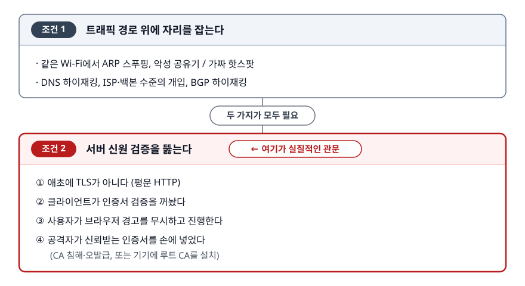
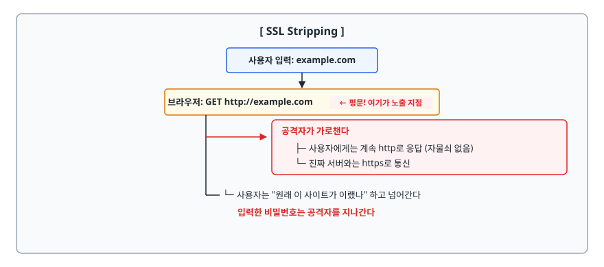

# HTTPS와 TLS (HTTPS & TLS)

> "HTTPS를 쓰면 안전하다"의 안전이 정확히 무엇을 뜻하는지, 그리고 그 안전이 어떤 조건에서 무너지는지 공격자 관점으로 설명할 수 있게 됩니다.

## 학습 목표

- [ ] 평문 HTTP의 세 가지 위험을 각각 다른 보안 속성과 짝지어 설명할 수 있다
- [ ] 대칭키와 비대칭키를 왜 섞어 쓰는지 성능과 신뢰 양쪽으로 설명할 수 있다
- [ ] TLS 핸드셰이크의 목적과 TLS 1.3에서 줄어든 왕복을 설명할 수 있다
- [ ] 인증서 체인과 CA 신뢰 모델이 어디에 뿌리를 두는지 안다
- [ ] 중간자 공격이 성립하는 조건을 나열하고 각각의 차단 방법을 말할 수 있다
- [ ] HSTS가 막는 공격과 HSTS로도 남는 빈틈을 구분할 수 있다

## 선행 지식

- HTTP 요청/응답의 기본 구조
- [04-cryptography-hashing.md](./04-cryptography-hashing.md)를 먼저 읽으면 키 개념이 수월하다 (몰라도 진행 가능)

> 핸드셰이크 메시지를 한 줄씩 뜯어보는 내용은
> [../01-computer-science-fundamentals/network/05-ssl-tls-handshake.md](../01-computer-science-fundamentals/network/05-ssl-tls-handshake.md)에 있습니다.
> 이 문서는 **공격이 어디로 들어오고 무엇이 그것을 막는가**에 초점을 둡니다.

---

## 1. 왜 필요한가 — 평문 회선 위의 세 가지 위험

내 노트북에서 서버까지 패킷은 공유기, ISP 장비, 여러 라우터를 지납니다.
이 경로 위 아무 지점에나 앉아 있을 수 있는 사람을 가정하면 위험은 셋으로 갈립니다.

<!-- diagram:sec-https-tls-1 -->


<!-- 위 그림이 대체한 원본 ASCII.
     내용을 고칠 때는 그림도 함께 갱신할 것.
```
    나 ─────► 카페 공유기 ─────► ISP ─────► 백본 ─────► 서버
              ▲                  ▲
        여기 앉으면 …       여기 앉으면 …

  ① 도청(Eavesdropping)  지나가는 패킷을 읽는다
                         → 로그인 ID/비밀번호, 세션 쿠키가 그대로 보인다
  ② 변조(Tampering)      패킷을 바꿔 흘려보낸다
                         → 응답 HTML에 악성 스크립트를 끼워 넣거나
                           다운로드 파일을 악성 파일로 바꿔치기한다
  ③ 위장(Impersonation)  "내가 그 서버다"라며 대신 응답한다
                         → 가짜 로그인 화면을 띄워 자격 증명을 수집한다
```
-->

TLS(Transport Layer Security)는 이 셋에 각각 대응합니다.

| 위험 | 막아주는 보안 속성 | 구현 수단 |
|------|-------------------|----------|
| 도청 | 기밀성(Confidentiality) | 대칭키 암호화(AES 등) |
| 변조 | 무결성(Integrity) | AEAD 인증 태그 / MAC |
| 위장 | 인증(Authentication) | 인증서(X.509)와 CA 서명 |

여기서 놓치면 안 되는 순서가 있습니다. **인증이 없으면 암호화는 의미가 없습니다.**
공격자와 완벽하게 암호화된 통신을 하는 것은 아무것도 지키지 못합니다.
그래서 TLS 설계의 절반은 암호화가 아니라 "상대가 진짜 그 도메인의 주인인가"를 증명하는 데 쓰입니다.

> SSL은 TLS의 옛 이름입니다. SSL 3.0 이후 TLS로 개명됐고 지금 쓰이는 것은 전부 TLS다.
> "SSL 인증서"라는 표현은 관용적으로 남아 있을 뿐입니다.

---

## 2. 대칭키와 비대칭키를 섞어 쓰는 이유

| 구분 | 대칭키 (AES 등) | 비대칭키 (RSA, ECDSA, ECDHE) |
|------|----------------|------------------------------|
| 키 구성 | 하나의 키로 암호화·복호화 | 공개키 / 개인키 쌍 |
| 속도 | 매우 빠름 (CPU 하드웨어 가속 있음) | 훨씬 느림 (대량 데이터에는 실용성이 없다) |
| 결정적 약점 | 첫 키를 어떻게 안전하게 나눠 갖나 | 대량 데이터에 쓰기엔 너무 느리다 |
| TLS에서의 역할 | 실제 데이터 암호화 | 키 합의와 신원 증명 |

두 방식의 약점이 정확히 서로의 강점입니다. 그래서 TLS는 **핸드셰이크에서만 비대칭 연산을 쓰고,
그 결과로 만든 대칭 세션 키로 나머지 통신을 전부 처리**합니다. 이것을 하이브리드 암호화라 부릅니다.
수백 MB 응답을 RSA로 암호화하면 실용성이 없지만, 32바이트 키 하나를 합의하는 데만 쓰면 부담이 없습니다.

> **비유**: 아주 튼튼한 금고(대칭키)가 있는데 열쇠를 상대에게 전달할 방법이 없습니다.
> 그래서 상대가 보낸 "누구나 잠글 수 있지만 자기만 열 수 있는 상자"(공개키)에 열쇠를 담아 보냅니다.
>
> **비유의 한계**: 현대 TLS는 열쇠를 실제로 "보내지" 않습니다. ECDHE 방식은 양쪽이 공개값만 교환한 뒤
> 각자 계산해서 같은 값에 도달합니다. 세션 키 자체는 회선을 한 번도 지나가지 않습니다.

### 키를 보내지 않는 방식으로 바뀐 이유 — 전방 비밀성

예전 RSA 키 교환은 클라이언트가 만든 비밀값을 서버 공개키로 암호화해 보내는 방식이었습니다.
문제는 **서버 개인키가 언젠가 유출되면**, 몇 년 전에 저장해둔 트래픽까지 소급해서 복호화할 수 있다는 것입니다.
공격자가 지금 당장 못 푸는 트래픽을 그냥 쌓아두는 전략이 유효해집니다.

ECDHE(Elliptic Curve Diffie-Hellman Ephemeral)는 연결마다 **임시 키 쌍**을 만들고 끝나면 버립니다.
서버의 장기 개인키는 "내가 그 서버다"를 서명하는 데만 쓰이고 키 합의에는 관여하지 않습니다.
개인키가 유출돼도 과거 세션은 복호화되지 않습니다. 이것이 **전방 비밀성(Forward Secrecy)**이고,
TLS 1.3은 키 교환을 (EC)DHE로 못 박아 이 성질을 기본값으로 만들었습니다.

---

## 3. 핸드셰이크가 하는 일

<!-- diagram:sec-tls-handshake -->


```
Client                                                    Server
  │  (TCP 연결은 이미 수립된 상태)                              │
  │                                                          │
  │ ── ClientHello ─────────────────────────────────────────►│
  │    · 지원 TLS 버전 / Cipher Suite 목록                     │
  │    · 클라이언트 랜덤                                       │
  │    · SNI (접속하려는 도메인) ← 평문으로 나간다               │
  │                                                          │
  │ ◄── ServerHello + Certificate ────────────────────────── │
  │    · 선택한 버전과 Cipher Suite                            │
  │    · 서버 랜덤                                             │
  │    · 인증서 체인 (도메인, 공개키, CA 서명)                   │
  │                                                          │
  │  ┌────────────────────────────────────────────────┐      │
  │  │ 클라이언트가 검증하는 네 가지 (하나라도 실패 → 경고)│      │
  │  │  ① CA 서명 체인이 신뢰 루트까지 이어지는가         │      │
  │  │  ② 유효기간 안인가                              │      │
  │  │  ③ 인증서의 도메인(SAN)이 접속 대상과 같은가       │      │
  │  │  ④ 폐기되지 않았는가 (OCSP/CRL)                  │      │
  │  └────────────────────────────────────────────────┘      │
  │ ◄══ 키 합의 (ECDHE 공개값 교환) ═════════════════════════►│
  │     양쪽이 각자 계산해 같은 세션 키에 도달                    │
  │ ◄══ Finished 교환: 지금까지 오간 메시지의 해시 검증 ════════►│
  │     중간에 누가 메시지를 바꿨다면 여기서 걸린다               │
  │ ◄══════ 이후 모든 HTTP 데이터는 대칭 세션 키로 암호화 ══════►│
```

핸드셰이크가 끝났을 때 확보된 것은 세 가지입니다.
**(1) 상대가 그 도메인의 주인이라는 증명, (2) 둘만 아는 대칭 세션 키,
(3) 지금까지의 대화가 변조되지 않았다는 확인.**

### TLS 1.2와 1.3

| 항목 | TLS 1.2 | TLS 1.3 |
|------|---------|---------|
| 핸드셰이크 왕복 | 2-RTT | 1-RTT (세션 재개 시 0-RTT) |
| 키 교환 방식 | RSA / DHE / ECDHE 중 협상 | (EC)DHE만 |
| 전방 비밀성 | 설정에 따라 없을 수도 있음 | 기본 핸드셰이크는 항상 보장 |
| 인증서 전송 | 평문 | 암호화 |
| 지원 알고리즘 | 수십 종 (약한 것 포함) | 소수의 AEAD만 |

TLS 1.3이 1-RTT가 된 원리는 **추측**입니다. 클라이언트가 첫 메시지에
"서버가 아마 이 방식을 고를 것이다"라며 ECDHE 공개값을 미리 넣어 보냅니다.
맞으면 왕복 한 번으로 끝나고, 틀리면 한 번 더 왕복합니다. 줄어든 왕복만큼 첫 화면이 빨라집니다.
다만 세션 재개의 0-RTT 데이터는 전방 비밀성이 없고 재전송도 가능해서 멱등한 요청에만 씁니다.

1.3의 더 중요한 변화는 **선택지를 없앤 것**입니다. RSA 키 교환, CBC 모드, RC4, SHA-1, 압축, 재협상이
전부 제거됐습니다. "설정을 잘못해서 취약해지는" 경우 자체를 줄이는 설계 방향입니다.

> 왕복 수 자체보다 "왜 줄었는가"를 설명하는 편이 면접에서 낫습니다.
> 메시지 단위 상세는 [../01-computer-science-fundamentals/network/05-ssl-tls-handshake.md](../01-computer-science-fundamentals/network/05-ssl-tls-handshake.md)를 참고합니다.

---

## 4. 인증서 체인과 CA 신뢰 모델

브라우저가 세상 모든 서버의 공개키를 미리 알 수는 없습니다. 그래서 **신뢰할 수 있는 제3자(CA)**가
"이 공개키는 이 도메인 주인의 것이 맞다"고 서명해줍니다.

<!-- diagram:sec-https-tls-2 -->


<!-- 위 그림이 대체한 원본 ASCII.
     내용을 고칠 때는 그림도 함께 갱신할 것.
```
┌────────────────────────────────────────┐
│ 루트 CA 인증서 (self-signed)            │ ← OS/브라우저에 미리 내장 (신뢰 저장소)
│  주체: Example Root CA                  │   여기가 신뢰의 출발점이다
│  서명: 자기 자신                         │
└──────────────────┬─────────────────────┘
                   │ 서명
                   ▼
┌────────────────────────────────────────┐
│ 중간 CA 인증서                          │ ← 서버가 함께 보내줘야 한다
│  서명: 루트 CA의 개인키                  │
└──────────────────┬─────────────────────┘
                   │ 서명
                   ▼
┌────────────────────────────────────────┐
│ 서버 인증서 (leaf)                      │ ← 서버가 보낸다
│  SAN: www.example.com                   │
│  공개키: (서버의 공개키)                  │
│  서명: 중간 CA의 개인키                   │
└────────────────────────────────────────┘

검증은 아래에서 위로. 신뢰 저장소에 있는 루트에 닿으면 통과.
```
-->

이 모델의 성질을 정확히 이해하는 것이 중요합니다.

- **신뢰의 뿌리는 수학이 아니라 목록입니다.** 최종적으로 "루트 CA 목록에 있으니 믿는다"에 도달합니다.
  이 목록은 OS나 브라우저가 배포합니다. 목록을 바꿀 수 있는 사람은 신뢰 체계 전체를 바꿀 수 있습니다.
- **아무 CA나 아무 도메인 인증서를 발급할 수 있습니다.** 신뢰 저장소의 CA는 수십 개이고, 그중 하나만
  침해되거나 오발급해도 그 도메인의 위조 인증서가 만들어집니다. 이 위험을 줄이려고 도입된 것이
  **Certificate Transparency**다. 발급된 인증서를 공개 로그에 기록하게 해서 도메인 주인이
  "내가 신청하지 않은 인증서"를 발견할 수 있게 합니다.
- **중간 CA를 두는 이유는 루트 개인키를 격리하기 위해서입니다.** 루트 개인키는 오프라인 금고에 두고
  거의 꺼내지 않습니다. 유출되면 전 세계 브라우저를 갱신해야 하는 재앙이기 때문입니다.
  중간 CA는 유출돼도 그것만 폐기하면 됩니다.

### 실무에서 자주 터지는 두 가지

**중간 인증서 누락** — 서버가 leaf 인증서만 보내면 클라이언트가 체인을 이어붙일 수 없습니다.
브라우저는 캐시된 중간 인증서로 어찌어찌 통과해서 "브라우저는 되는데 모바일 앱만 안 된다"는
형태로 나타납니다. **인증서 만료**는 가장 흔한 HTTPS 장애입니다. Let's Encrypt 인증서는 유효기간이 짧아
자동 갱신이 전제이고, 갱신 실패를 감지할 모니터링이 없으면 어느 날 갑자기 전체 서비스가 멈춥니다.

---

## 5. 중간자 공격은 어떤 조건에서 성립하는가

<!-- diagram:sec-https-tls-3 -->


<!-- 위 그림이 대체한 원본 ASCII.
     내용을 고칠 때는 그림도 함께 갱신할 것.
```
[ 정상 ]
  Client ══════ TLS ══════════════════════════════ Server
              (하나의 암호화 채널)

[ MITM ]
  Client ══ TLS 채널 A ══ Attacker ══ TLS 채널 B ══ Server
                            │
                            └─ 채널 A를 풀어서 평문을 읽고,
                               채널 B로 다시 암호화해 전달한다.
                               양쪽 모두 정상 통신으로 인식한다.
```
-->

MITM이 성립하려면 **두 가지가 모두** 필요합니다.

<!-- diagram:sec-https-tls-4 -->


<!-- 위 그림이 대체한 원본 ASCII.
     내용을 고칠 때는 그림도 함께 갱신할 것.
```
조건 1. 트래픽 경로 위에 자리를 잡는다
  · 같은 Wi-Fi에서 ARP 스푸핑, 악성 공유기 / 가짜 핫스팟
  · DNS 하이재킹, ISP·백본 수준의 개입, BGP 하이재킹

조건 2. 서버 신원 검증을 뚫는다   ← 여기가 실질적인 관문
  ① 애초에 TLS가 아니다 (평문 HTTP)
  ② 클라이언트가 인증서 검증을 꺼놨다
  ③ 사용자가 브라우저 경고를 무시하고 진행한다
  ④ 공격자가 신뢰받는 인증서를 손에 넣었다
     (CA 침해·오발급, 또는 기기에 루트 CA를 설치)
```
-->

조건 1은 카페 Wi-Fi 한 번이면 성립할 수 있습니다. **실질적인 방어선은 조건 2**이고,
TLS의 인증서 검증이 정확히 그 지점을 지킵니다. 그래서 "인증서 검증을 끄는" 행위는
암호화만 남기고 방어를 통째로 버리는 것과 같습니다.

### 안티패턴 — 인증서 검증 무력화

```java
// 안티패턴: 모든 인증서를 무조건 신뢰하는 TrustManager
TrustManager[] trustAll = new TrustManager[] {
    new X509TrustManager() {
        public void checkClientTrusted(X509Certificate[] chain, String authType) { }
        public void checkServerTrusted(X509Certificate[] chain, String authType) { }
        public X509Certificate[] getAcceptedIssuers() { return new X509Certificate[0]; }
    }
};
SSLContext ctx = SSLContext.getInstance("TLS");
ctx.init(null, trustAll, new SecureRandom());
```

```python
# 안티패턴: 검증을 끈 HTTP 클라이언트
requests.get("https://api.partner.com/data", verify=False)
```

```bash
# 안티패턴: 스크립트에 굳어진 -k
curl -k https://api.partner.com/data
```

**왜 문제인가**: 셋 다 "어떤 인증서가 와도 통과"를 의미합니다. 채널은 암호화되지만
**누구와 암호화했는지 확인하지 않으므로** MITM 조건 2가 그대로 열립니다.
보통은 개발 환경에서 자체 서명 인증서 때문에 임시로 넣었다가 그대로 배포되고,
운영에서 조용히 살아 있다가 사고가 나서야 발견됩니다.

```java
// 개선: 사설/자체 서명 CA가 필요하면 그 CA만 신뢰 저장소에 추가한다
//       (검증을 끄는 것이 아니라, 신뢰 대상을 명시적으로 넓히는 것)
KeyStore ks = KeyStore.getInstance("PKCS12");   // 기본 타입은 JDK 버전마다 달라서 명시한다
ks.load(Files.newInputStream(Path.of("internal-ca.p12")), password);   // password는 char[]

TrustManagerFactory tmf =
    TrustManagerFactory.getInstance(TrustManagerFactory.getDefaultAlgorithm());
tmf.init(ks);
SSLContext ctx = SSLContext.getInstance("TLS");
ctx.init(null, tmf.getTrustManagers(), null);
```

CLI에서도 `-k` 대신 `curl --cacert /etc/ssl/internal-ca.pem https://api.internal.example.com/data`처럼
CA를 지정합니다. 개발 환경이라면 `mkcert` 같은 도구로 로컬 신뢰 CA를 만들어 쓰는 편이 낫습니다.
**"검증을 끈다"와 "신뢰 대상을 추가한다"는 완전히 다른 행위**라는 점이 요지입니다.

### 회사 방화벽은 왜 HTTPS를 들여다볼 수 있나

기업 보안 장비는 사원 PC에 회사 루트 CA를 설치합니다. 그러면 장비가 그 자리에서
`google.com` 인증서를 발급해도 브라우저가 신뢰합니다. **합법적인 MITM**이고,
조건 2의 ④에 해당합니다. 신뢰 저장소를 통제하는 쪽이 신뢰 체계를 통제한다는 사실을 보여주는 사례입니다.

---

## 6. HSTS — 첫 요청의 빈틈을 막는다

TLS가 잘 걸려 있어도 남는 구멍이 있습니다. **사용자는 주소창에 `https://`를 치지 않습니다.**

<!-- diagram:sec-https-tls-5 -->


<!-- 위 그림이 대체한 원본 ASCII.
     내용을 고칠 때는 그림도 함께 갱신할 것.
```
[ SSL Stripping ]

  사용자 입력: example.com
       ▼
  브라우저: GET http://example.com     ← 평문! 여기가 노출 지점
       │
       ├──────► 공격자가 가로챈다
       │             ├─ 사용자에게는 계속 http로 응답 (자물쇠 없음)
       │             └─ 진짜 서버와는 https로 통신
       │
       └─ 사용자는 "원래 이 사이트가 이랬나" 하고 넘어간다
          입력한 비밀번호는 공격자를 지나간다
```
-->

서버가 `http`를 `https`로 리다이렉트해도, **그 리다이렉트 응답 자체가 평문**이라
공격자가 가로채 버릴 수 있습니다. 첫 한 번의 평문 요청이 문제의 뿌리입니다.

**HSTS(HTTP Strict Transport Security)**는 브라우저에게
"이 도메인은 앞으로 무조건 HTTPS로만 접속하라"고 기억시킵니다.

```http
Strict-Transport-Security: max-age=31536000; includeSubDomains; preload
```

```nginx
# Nginx — always를 붙여야 4xx/5xx 응답에도 헤더가 붙는다
add_header Strict-Transport-Security "max-age=31536000; includeSubDomains" always;
```

| 지시자 | 의미 |
|--------|------|
| `max-age` | 이 규칙을 기억할 시간(초). HTTPS 접속마다 갱신된다 |
| `includeSubDomains` | 모든 서브도메인에도 적용. 서브도메인 중 하나가 http-only면 그것도 접속 불가가 된다 |
| `preload` | 브라우저에 내장된 preload 목록 등재를 신청한다는 표시 |

한 번 기억시키면 브라우저는 사용자가 `http://`를 입력해도 **네트워크에 나가기 전에**
내부적으로 `https://`로 바꿉니다. 평문 요청 자체가 발생하지 않으므로 SSL Stripping이 무력화됩니다.

### HSTS로도 남는 빈틈 — 그리고 preload

HSTS 헤더는 **HTTPS 응답을 한 번 받아야** 저장됩니다. 즉 **생애 첫 접속은 여전히 평문일 수 있습니다.**
이것을 신뢰 우선 사용(TOFU, Trust On First Use) 문제라고 부릅니다.

`preload`는 이 빈틈을 메웁니다. 도메인을 브라우저 배포판에 내장된 목록에 등재하면,
그 브라우저는 **한 번도 접속한 적 없는 도메인에 대해서도** 처음부터 HTTPS만 시도합니다.

다만 preload는 되돌리기가 매우 어렵습니다. 브라우저 배포 주기를 타야 해서 해제에 수개월이 걸립니다.
`includeSubDomains`까지 걸린 상태에서 서브도메인 하나가 HTTPS를 지원하지 않으면
그 서브도메인은 접속 불가가 됩니다. **모든 서브도메인의 HTTPS 준비를 끝낸 뒤에 신청해야 합니다.**

### 함께 걸어야 하는 것들

쿠키에 `Secure` 속성이 없으면 평문 HTTP 요청에도 쿠키가 실린다
(`Set-Cookie: SESSION=...; Secure; HttpOnly; SameSite=Lax`). HTTPS로 잘 통신하다가 어떤 경로로든
http 요청이 한 번 발생하면 그 순간 세션 쿠키가 노출됩니다.

**혼합 콘텐츠(Mixed Content)**도 같은 맥락입니다. HTTPS 페이지 안에서 `http://`로 스크립트를 불러오면
그 스크립트는 변조 가능하고, 변조된 스크립트는 페이지 전체를 장악합니다.
그래서 브라우저는 능동적 혼합 콘텐츠(스크립트, iframe, XHR)를 아예 차단합니다.

---

## 7. 실무에서는

- **TLS 종료(Termination)** — 로드밸런서나 리버스 프록시에서 TLS를 풀고 내부는 평문 HTTP로 보내는
  구성이 일반적입니다. 인증서 관리 지점이 한 곳으로 모이고 백엔드 CPU 부담이 줍니다.
  내부망도 신뢰하지 않는 모델(제로 트러스트)이라면 백엔드까지 TLS를 유지합니다.
- **인증서 만료 모니터링은 선택이 아닙니다.** 자동 갱신을 걸어두었더라도 갱신 실패는 일어납니다.
  만료 30일 전 알림을 별도 채널로 받도록 구성합니다.
- **mTLS(상호 TLS)** — 클라이언트도 인증서를 제시해 서로를 검증합니다. 서비스 메시나 사내 시스템 간
  통신, 일부 금융 API에서 쓰입니다.
- **인증서 피닝(Pinning)** — 특정 공개키만 신뢰하도록 앱에 못 박는 기법입니다. CA 침해나 사내 프록시
  MITM까지 막지만, 키 교체 시 앱을 함께 업데이트하지 않으면 전체 사용자가 접속 불가가 됩니다.
  모바일 앱에서 제한적으로 쓰고 웹에서는 쓰지 않는다(웹용 HPKP 헤더는 같은 이유로 폐기됐다).
- **인증서 등급(DV/OV/EV)의 암호학적 강도는 동일합니다.** 발급 시 신원 확인 절차만 다릅니다.
  브라우저가 EV 특별 표시 UI를 없앤 뒤로는 DV가 사실상 표준입니다.

---

## 8. 면접 포인트

> 면접에서 이 주제가 나오면 이렇게 답한다

**Q. HTTPS는 무엇을 보장하나요?**

A. 기밀성, 무결성, 인증 세 가지입니다. 대칭키 암호화로 도청을 막고, 인증 태그로 변조를 감지하며,
인증서로 상대가 그 도메인의 주인임을 확인합니다. 이 중 **인증이 가장 근본**인데,
상대가 누구인지 모르는 채 암호화하면 공격자와 안전하게 통신하는 꼴이 되기 때문입니다.
반대로 HTTPS가 보장하지 않는 것도 명확합니다. 어느 도메인에 접속했는지는 SNI와 목적지 IP로 드러나고,
서버가 뚫린 뒤의 일이나 브라우저 안에서 실행되는 XSS는 전혀 막지 못합니다.
- 꼬리 질문: "그럼 HTTPS면 XSS나 SQL Injection도 막히나요?" → 전혀 다른 층위입니다.
  TLS는 전송 구간을 지킬 뿐, 서버가 만들어내는 응답의 내용이나 DB 질의는 관여하지 않습니다.

**Q. 대칭키와 비대칭키를 왜 함께 쓰나요?**

A. 약점이 서로 반대이기 때문입니다. 대칭키는 빠르지만 첫 키를 안전하게 나눠 가질 방법이 없고,
비대칭키는 그 문제를 풀지만 느려서 대량 데이터에 못 씁니다. 그래서 핸드셰이크에서만
비대칭 연산으로 세션 키를 합의하고, 이후 실제 데이터는 대칭키로 암호화합니다.
정확히는 요즘 TLS는 키를 "전달"하지도 않습니다. ECDHE로 양쪽이 공개값만 교환하고
각자 같은 값을 계산해내기 때문에 세션 키가 회선을 지나가지 않고, 덕분에 전방 비밀성도 확보됩니다.
- 꼬리 질문: "전방 비밀성이 왜 중요한가요?" → 서버 개인키가 나중에 유출돼도
  과거에 저장해둔 트래픽을 소급 복호화할 수 없습니다. 공격자의 "일단 저장해두기" 전략을 무력화합니다.

**Q. 중간자 공격은 언제 성립하나요?**

A. 두 조건이 모두 필요합니다. 첫째 공격자가 트래픽 경로 위에 자리를 잡아야 하고,
둘째 서버 신원 검증을 뚫어야 합니다. 첫째는 카페 Wi-Fi의 ARP 스푸핑이나 DNS 하이재킹으로
비교적 쉽게 만들 수 있어서, 실질적인 방어선은 둘째입니다. 둘째가 뚫리는 경로는
평문 HTTP, 클라이언트의 인증서 검증 비활성화, 사용자의 경고 무시, 그리고
공격자가 신뢰받는 인증서를 확보한 경우입니다. 마지막 경우가 회사 보안 장비가
사내 루트 CA를 설치해 HTTPS를 들여다보는 원리이기도 합니다.
- 꼬리 질문: "개발할 때 `verify=False`나 `-k`를 쓰는데 괜찮나요?" → 그 순간 인증 속성이 사라져
  MITM에 그대로 노출됩니다. 검증을 끄는 대신 사내 CA를 신뢰 저장소에 추가하는 방식으로 풀어야 하고,
  그 코드가 운영에 섞여 들어가지 않도록 설정으로 분리해야 합니다.

**Q. HSTS는 무엇을 막나요?**

A. SSL Stripping입니다. 사용자가 주소창에 도메인만 입력하면 첫 요청이 평문 HTTP로 나가는데,
경로 위의 공격자가 그것을 가로채 계속 http로 응답하면서 자기는 서버와 https로 통신하는 공격입니다.
서버가 https로 리다이렉트해도 그 리다이렉트 응답 자체가 평문이라 소용이 없습니다.
HSTS는 브라우저에게 "이 도메인은 무조건 HTTPS"를 기억시켜, 평문 요청이 네트워크에 나가기 전에
내부적으로 https로 바꾸게 합니다.
- 꼬리 질문: "그럼 HSTS면 완전한가요?" → 헤더는 HTTPS 응답을 한 번 받아야 저장되므로
  생애 첫 접속은 여전히 평문일 수 있다(TOFU 문제). 이를 메우는 것이 preload 목록 등재인데,
  해제가 매우 어려우니 모든 서브도메인의 HTTPS 준비를 끝낸 뒤 신청해야 합니다.

---

## 자주 하는 실수

| 실수 | 왜 틀렸나 | 올바른 이해 |
|------|----------|-----------|
| "HTTPS면 어떤 사이트에 접속했는지도 숨겨진다" | SNI와 목적지 IP는 노출된다 | 내용은 보호되지만 접속 대상은 대체로 드러난다 |
| "인증서가 데이터를 암호화한다" | 인증서는 신원 증명 문서다 | 암호화는 핸드셰이크로 만든 세션 키가 한다 |
| "개발 편의상 인증서 검증을 껐다" | 인증 속성이 사라져 MITM에 노출된다 | 검증을 끄는 대신 필요한 CA를 신뢰 저장소에 추가한다 |
| "서버 공개키로 세션 키를 암호화해 보낸다" | 현대 TLS의 기본 방식이 아니다 | ECDHE로 양쪽이 각자 계산해 같은 값에 도달한다 |
| "http를 https로 리다이렉트하니 안전하다" | 리다이렉트 응답 자체가 평문이라 가로챌 수 있다 | HSTS로 브라우저가 평문 요청을 아예 만들지 않게 해야 한다 |
| "HTTPS면 쿠키도 안전하다" | `Secure` 속성이 없으면 http 요청에도 실린다 | `Secure; HttpOnly; SameSite`를 함께 건다 |
| "EV 인증서가 더 안전하다" | 암호 강도는 DV와 동일하다 | 신원 확인 절차만 엄격하다 |
| "SSL과 TLS는 다른 프로토콜이다" | SSL은 TLS의 옛 이름이다 | 지금 쓰이는 것은 전부 TLS다 |

---

## 한 줄 정리

HTTPS의 핵심은 암호화가 아니라 **인증**입니다. CA 서명으로 상대가 진짜임을 먼저 확인하고, 그 상대와만 세션 키를 합의하기 때문에 도청·변조·위장이 동시에 막히며, 검증을 끄거나 첫 요청이 평문으로 새는 순간 이 보장은 통째로 무너집니다.

---

## 연관 개념

- [01-web-vulnerabilities.md](./01-web-vulnerabilities.md) - 전송이 안전해도 남는 애플리케이션 계층 취약점
- [02-cors-same-origin.md](./02-cors-same-origin.md) - `http`와 `https`가 다른 출처인 이유
- [04-cryptography-hashing.md](./04-cryptography-hashing.md) - 대칭/비대칭 암호와 전자서명의 원리
- [qna-security.md](./qna-security.md) - Q3(HTTPS/TLS), Q8(대칭키/비대칭키)
- [../01-computer-science-fundamentals/network/05-ssl-tls-handshake.md](../01-computer-science-fundamentals/network/05-ssl-tls-handshake.md) - 핸드셰이크 메시지 단위 상세, SNI, 세션 재개
- [../01-computer-science-fundamentals/network/02-http-https.md](../01-computer-science-fundamentals/network/02-http-https.md) - HTTP 프로토콜의 기본 구조
