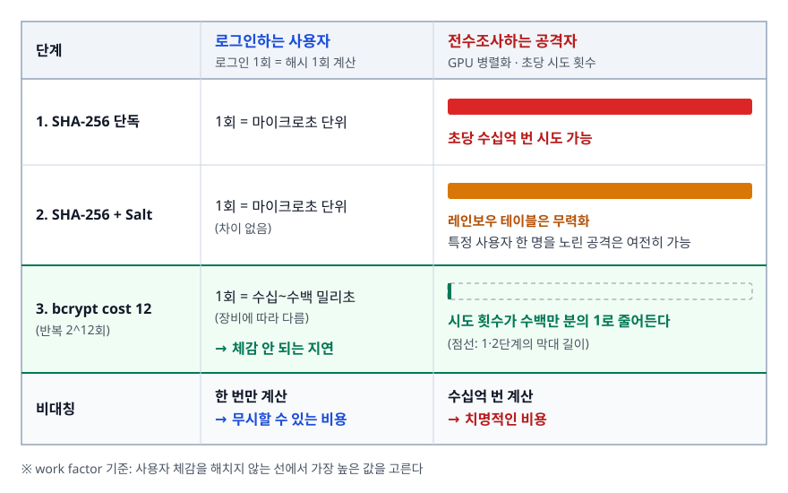

# 암호화와 해싱 (Cryptography & Hashing)

> "비밀번호를 암호화해서 저장했습니다"가 왜 틀린 문장인지, 그리고 SHA-256으로 해싱했는데도 왜 부족한지를 공격 비용의 관점에서 설명할 수 있게 된다.

## 학습 목표

- [ ] 암호화와 해싱의 근본 차이를 가역성 관점에서 설명할 수 있다
- [ ] 대칭키와 비대칭키를 용도에 따라 골라 쓸 수 있다
- [ ] 비밀번호를 왜 암호화가 아니라 해싱으로 저장해야 하는지 말할 수 있다
- [ ] SHA-256만으로 부족한 이유를 레인보우 테이블과 연산 속도로 나눠 설명할 수 있다
- [ ] Salt와 Pepper가 각각 무엇을 막는지 구분할 수 있다
- [ ] work factor가 무엇이고 왜 시간이 지나면 올려야 하는지 안다
- [ ] 전자서명이 암호화와 키 사용 방향이 반대인 이유를 설명할 수 있다

## 선행 지식

- 없음 — 이 문서부터 시작해도 된다. [03-https-tls.md](./03-https-tls.md)를 함께 읽으면 적용 사례가 붙는다

---

## 1. 왜 필요한가 — 되돌릴 수 있어야 하는 것과, 되돌리면 안 되는 것

서버가 다루는 민감 데이터는 성격이 두 가지로 갈린다.

- **나중에 원본이 필요한 데이터** — 주민등록번호, 계좌번호, 결제 정보.
  화면에 보여주거나 외부 시스템에 넘겨야 하므로 **되돌릴 수 있어야** 한다.
- **원본이 다시는 필요 없는 데이터** — 비밀번호. 서버가 확인할 것은 "방금 입력한 값이 예전 값과
  같은가"뿐이고, 원본 자체를 알 필요가 전혀 없다.

이 구분이 암호화와 해싱을 가른다.

```
[ 암호화 — 양방향 ]                  [ 해싱 — 단방향 ]

  평문 ──── 암호화(키) ────► 암호문     입력 ──── 해시 ────► 해시값 (고정 길이)
   ▲                          │                              │
   └──────── 복호화(키) ───────┘                              X 되돌아오는 화살표가 없다

  키를 가진 사람은 원본을 되찾는다.     키가 없고, 되돌리는 연산 자체가
  그것이 목적이다.                      정의되지 않는다.
```

> **비유**: 암호화는 자물쇠 달린 상자다. 열쇠가 있으면 내용물을 꺼낼 수 있다.
> 해싱은 과일을 갈아 만든 주스다. 같은 과일을 같은 방식으로 갈면 항상 같은 주스가 나오지만,
> 주스에서 과일을 되만들 수는 없다.
>
> **비유의 한계**: 주스는 성분을 분석하면 원재료를 추정할 수 있지만 암호학적 해시는 출력에서
> 입력의 힌트를 얻을 수 없게 설계된다. 대신 "입력을 하나씩 넣어보며 맞춰보는" 공격은 여전히
> 가능한데, 이 차이가 뒤에서 핵심이 된다.

### 비교

| 구분 | 암호화 | 해싱 |
|------|--------|------|
| 가역성 | 복호화 가능 | 불가능 (단방향) |
| 키 | 반드시 필요 | 없음 (HMAC은 예외) |
| 출력 길이 | 입력에 비례 | 항상 고정 |
| 주 목적 | 기밀성 (원본 보호) | 무결성 검증, 식별자 생성 |
| 대표 용도 | 통신 암호화, DB 컬럼 암호화 | 비밀번호 저장, 파일 체크섬 |
| 대표 알고리즘 | AES, RSA | SHA-256, bcrypt, Argon2 |

> 언제 뭘 쓰나: **나중에 원본을 다시 봐야 하면 암호화, "같은지"만 확인하면 되면 해싱.** 비밀번호는 후자다.

### 해시 함수의 네 가지 성질

1. **결정성** — 같은 입력은 언제나 같은 출력. 이게 없으면 로그인 검증이 불가능하다.
2. **단방향성** — 출력에서 입력을 역산할 수 없다.
3. **충돌 저항성** — 같은 해시를 만드는 서로 다른 두 입력을 찾기 어렵다. MD5와 SHA-1은 실제로
   충돌을 만드는 방법이 공개되어 암호학적으로는 깨진 상태다.
4. **눈사태 효과** — 입력이 1비트만 달라도 출력의 절반가량 비트가 바뀐다.
   "비슷한 비밀번호는 비슷한 해시"가 되지 않도록 해준다.

---

## 2. 대칭키와 비대칭키 — 용도가 다르다

| 구분 | 대칭키 | 비대칭키 |
|------|--------|---------|
| 키 구성 | 하나의 키로 암·복호화 | 공개키 / 개인키 쌍 |
| 속도 | 매우 빠름 | 훨씬 느림 |
| 처리 가능한 크기 | 사실상 무제한 | 키 길이에 묶여 매우 작다 |
| 핵심 난제 | 키를 어떻게 안전하게 나눠 갖나 | 느리다 |
| 대표 알고리즘 | AES | RSA, ECDSA, ECDH |
| 실제 쓰임 | 데이터 본문 암호화 | 키 교환, 전자서명, 인증서 |

> 언제 뭘 쓰나: **데이터를 감추려면 대칭키(AES), 키를 안전하게 넘기거나 신원을 증명하려면 비대칭키.**
> 둘 중 하나만 쓰는 경우는 드물고, 대개 비대칭키로 대칭키를 합의한 뒤 본문은 대칭키로 처리하는
> 하이브리드 구성이 된다. HTTPS가 그 대표 사례다.

### 대칭키 암호화에서 반드시 지켜야 할 두 가지

```java
Cipher cipher = Cipher.getInstance("AES/ECB/PKCS5Padding");  // 안티패턴 1: ECB 모드
byte[] iv = "0123456789ab".getBytes();   // 안티패턴 2: IV/nonce를 상수로 고정하거나 재사용
```

**왜 문제인가**: ECB는 블록마다 독립적으로 암호화하므로 **같은 평문 블록은 항상 같은 암호문 블록**이
된다. 데이터의 반복 패턴이 암호문에 그대로 남아서, 비트맵을 ECB로 암호화하면 원본 윤곽이 보일
정도다. DB 컬럼 암호화에 쓰면 "같은 값을 가진 행"을 공격자가 골라낼 수 있다.
IV(초기화 벡터)는 같은 평문을 매번 다른 암호문으로 만들기 위한 값이라, 고정하면 ECB와 같은 문제가
생긴다. 특히 **GCM 모드에서 같은 키로 nonce를 재사용하면 인증 키가 노출되어 위조가 가능해진다.**

```java
// 개선: GCM 모드 + 매번 새로 만드는 랜덤 nonce
byte[] nonce = new byte[12];                 // GCM 권장 길이
new SecureRandom().nextBytes(nonce);         // Random이 아니라 SecureRandom

Cipher cipher = Cipher.getInstance("AES/GCM/NoPadding");
cipher.init(Cipher.ENCRYPT_MODE, key, new GCMParameterSpec(128, nonce));
byte[] ciphertext = cipher.doFinal(plaintext);
// nonce는 비밀이 아니다. 암호문과 함께 저장/전송하면 된다.
```

GCM은 AEAD(Authenticated Encryption with Associated Data) 모드로 **암호화와 무결성 검증을 함께** 한다.
CBC 같은 옛 모드는 암호화만 하므로 변조를 감지하려면 MAC을 따로 붙여야 했고, 그 조합을 잘못
구현해 생긴 취약점이 역사적으로 많았다. 특별한 이유가 없으면 GCM을 쓴다.

---

## 3. 비밀번호는 왜 암호화가 아니라 해싱인가

```java
// 안티패턴: 비밀번호를 AES로 암호화해서 저장
String encrypted = aesEncrypt(rawPassword, secretKey);
userRepository.save(new User(email, encrypted));
```

**왜 문제인가**: 암호화는 되돌리기 위한 기술이다. 즉 **누군가는 원본을 볼 수 있다.**
DB가 유출되고 키까지 함께 털리면(같은 서버에 있는 경우가 흔하다) 전 사용자 비밀번호가 평문으로
복원되고, 키를 아는 내부자는 언제든 원본을 본다. 사용자들은 비밀번호를 여러 사이트에서
재사용하므로 유출은 우리 서비스만의 피해로 끝나지 않는다.

서버는 비밀번호 원본이 필요하지 않다. 필요한 것은 "입력값이 예전과 같은가"라는 예/아니오뿐이다.
그러면 **원본을 복원할 방법이 아예 없는 형태로** 저장하는 것이 맞다.

```
[ 회원가입 ]
  입력 "hunter2" ──► 해시 함수 ──► "a3f9c2..."  → DB에 이것만 저장

[ 로그인 검증 ]
  입력 "hunter2" ──► 같은 해시 함수 ──► "a3f9c2..." ──► DB의 값과 비교
                                        같다 → 통과 / 다르다 → 실패

  원본은 어디에도 남지 않고, 서버는 끝까지 비밀번호를 "알지" 못한다.
```

---

## 4. SHA-256만으로는 왜 부족한가

`SHA256(password)`로 저장하면 되돌릴 수는 없다. 그런데도 부족하다.
이유는 **되돌리는 대신, 앞에서부터 넣어보는 공격**이 너무 싸기 때문이다.

**문제 1. 결정적이므로 미리 계산해둘 수 있다 (레인보우 테이블)**

```
공격자가 유출 이전에 미리 만들어두는 표
  "123456"    → e10adc39...
  "password"  → 5e884898...
  (수십억 개의 흔한 비밀번호 + 조합)

DB가 유출되면 해시값으로 표를 조회. 일치하면 즉시 원본 확인. 계산 시간 0.
```

**문제 2. 너무 빠르다** — SHA-256은 애초에 파일 무결성 검증처럼 대량 데이터를 빠르게 처리하려고
설계됐고, 그 빠르기가 비밀번호 저장에서는 정확히 약점이 된다. 현대 GPU는 SHA-256을 **초당 수십억 회**
계산하므로 표에 없는 비밀번호라도 짧거나 규칙적이면 전수조사로 뚫린다.

**문제 3. 같은 비밀번호는 같은 해시가 된다** — DB에 같은 해시값을 가진 행들이 보이면
"이 사람들은 같은 비밀번호를 쓴다"가 드러난다. 가장 많이 등장하는 해시는 십중팔구 흔한
비밀번호이고, 하나만 깨면 그 계정들이 전부 열린다.

---

## 5. Salt — 미리 계산하기를 막는다

Salt는 **사용자마다 다른 랜덤 값**이다. 비밀번호와 함께 해싱하고, 해시와 나란히 저장한다.

```
[ Salt 없음 ]                        [ Salt 있음 ]
user A: hash("hunter2") = a3f9c2…   user A: hash("hunter2" + "x7Kq2p") = 91be04…
user B: hash("hunter2") = a3f9c2…   user B: hash("hunter2" + "mZ4Tn8") = 5cd7ff…
                        ↑ 같다!                                        ↑ 다르다
```

Salt가 해결하는 것은 세 가지다. **레인보우 테이블 무력화**(표를 가능한 모든 Salt마다 따로 만들어야
하는데 그 조합 수가 감당 불가능하다), **같은 비밀번호 노출 차단**, 그리고 **공격 병렬화 방지**다.
마지막이 특히 크다. DB 전체를 한 번에 공격할 수 없고 계정마다 따로 깨야 하므로 사용자 100만 명이면
작업량이 100만 배가 된다.

```java
// 안티패턴: 모든 사용자에게 같은 Salt를 쓴다
private static final String SALT = "myapp-2024";
String hash = sha256(password + SALT);
```

**왜 문제인가**: Salt가 하나면 공격자는 그 Salt 하나에 대한 표만 만들면 된다. 위 효과 세 가지가
전부 사라진다. Salt는 **사용자마다 다르고, 매번 새로 만들어야** 의미가 있다.

> Salt는 비밀이 아니다. 해시와 같은 곳에 평문으로 저장해도 된다.
> 목적이 "숨기는 것"이 아니라 "미리 계산하는 것을 막는 것"이기 때문이다.

---

## 6. Pepper — DB만 털렸을 때를 대비한다

Salt는 DB에 함께 저장되므로, DB가 통째로 유출되면 공격자도 Salt를 갖는다.
**Pepper**는 DB가 아닌 **다른 곳**에 보관하는, 애플리케이션 전역의 비밀값이다.
`hash = 해시함수(password + salt(DB에 저장) + pepper(DB 밖에 보관))` 형태가 된다.

| 구분 | Salt | Pepper |
|------|------|--------|
| 범위 | 사용자마다 다름 | 애플리케이션 전체 공통 |
| 비밀인가 | 아니다 | **비밀이다** |
| 저장 위치 | 해시와 함께 DB | 환경 변수, 시크릿 매니저, HSM |
| 막는 것 | 레인보우 테이블, 병렬 공격 | **DB만 유출된 경우** 오프라인 크래킹 자체 |

> 언제 뭘 쓰나: **Salt는 필수, Pepper는 선택.** Pepper는 SQL Injection이나 백업 파일 유출처럼
> "DB만 새는" 흔한 사고에서 큰 효과를 낸다. 다만 교체하려면 모든 해시를 다시 만들어야 하고,
> Pepper가 애플리케이션 서버에 함께 있으면 서버가 뚫렸을 때는 의미가 없다.

---

## 7. work factor — 공격 비용을 의도적으로 올린다

<!-- diagram:sec-cryptography-hashing -->


Salt를 붙여도 문제 2(너무 빠름)는 남는다. 특정 사용자 한 명을 노린 공격은 여전히 GPU로 가능하다.
그래서 비밀번호 전용 해시는 **의도적으로 느리게** 설계된다.

```
[ SHA-256 ]         1회 = 마이크로초 단위 → 공격자는 초당 수십억 번 시도 가능
[ bcrypt cost 12 ]  1회 = 수십~수백 밀리초(장비에 따라 다름)
                    로그인하는 사용자:   체감 안 되는 지연
                    전수조사하는 공격자: 시도 횟수가 수백만 분의 1로 줄어든다
```

이 비대칭이 핵심이다. **정상 사용자는 한 번만 계산하지만, 공격자는 수십억 번 계산해야 한다.**
같은 지연이 한쪽에는 무시할 수 있는 비용, 다른 쪽에는 치명적인 비용이 된다.

| 알고리즘 | 비용 파라미터 | 특징 | 선택 기준 |
|----------|--------------|------|----------|
| PBKDF2 | 반복 횟수 | 메모리를 거의 안 쓴다 → GPU 병렬화에 상대적으로 약함 | 규제·표준 준수가 필요한 환경 |
| bcrypt | cost (반복 = 2^cost) | Blowfish 기반. Salt 자동 생성·포함. 검증된 이력 | 무난한 기본값. 라이브러리 지원이 가장 넓다 |
| scrypt | N(비용), r(블록), p(병렬) | 메모리를 크게 요구 → GPU/ASIC에 불리 | bcrypt보다 강하게 가고 싶을 때 |
| Argon2id | 메모리, 시간, 병렬성 | 메모리 하드 + 부채널 대응. 현재 1순위 권장 | 신규 서비스의 기본 선택 |

> 언제 뭘 쓰나: **신규 프로젝트는 Argon2id, 라이브러리 제약이 있으면 bcrypt.** 둘 중 무엇이든
> SHA-256 단독보다 압도적으로 낫다. 고르느라 시간 쓰는 것보다 하나를 제대로 적용하는 편이 낫다.

### bcrypt 해시 문자열 읽기

```
$2b$12$Kx7Q9pLmN2vR4sT6uW8yZeAbCdEfGhIjKlMnOpQrStUvWxYz01234
 ─┬─ ─┬─ ────────────┬───────────── ──────────┬─────────────
  │   │              │                        └─ 해시 결과
  │   │              └─ Salt (22자, 자동 생성)
  │   └─ cost = 12  (반복 2^12회)
  └─ 알고리즘 식별자
```

알고리즘·cost·Salt가 전부 한 문자열에 들어 있어 Salt 컬럼을 따로 만들 필요가 없고,
나중에 cost를 올려도 **기존 해시는 자기 cost 값으로 그대로 검증된다.**

```java
// 안티패턴
if (sha256(password).equals(user.getPasswordHash())) { ... }

// 개선 — Spring Security
PasswordEncoder encoder = PasswordEncoderFactories.createDelegatingPasswordEncoder();
String hash = encoder.encode(rawPassword);       // {bcrypt}$2a$10$... 접두사가 붙는다
if (encoder.matches(rawPassword, user.getPasswordHash())) { ... }   // Salt 추출·비교를 대신한다
```

`DelegatingPasswordEncoder`가 접두사를 보고 알고리즘을 고르므로, bcrypt에서 Argon2로 넘어갈 때
**기존 해시를 그대로 둔 채** 신규 가입자부터 새 알고리즘을 쓸 수 있다. 기존 사용자는 다음 로그인
성공 시점에 재해싱하면 된다. 비밀번호 원본은 그 순간에만 메모리에 있어서 로그인이 유일한 기회다.

하드웨어는 계속 빨라지므로 work factor는 주기적으로 재검토해야 한다.
**기준은 "우리 운영 장비에서 로그인 1회에 몇 밀리초가 드는가"**다. 사용자 체감을 해치지 않는 선에서
가장 높은 값을 고르고, 트래픽이 몰릴 때 CPU가 버티는지도 함께 본다.

---

## 8. 전자서명 — 키 사용 방향이 반대다

암호화는 "받는 사람만 읽게" 하는 것이고, 서명은 "보낸 사람이 누구인지 증명"하는 것이다.
목적이 반대이므로 키 사용 순서도 반대가 된다.

```
[ 비대칭 암호화 ]  기밀성                  [ 전자서명 ]  인증 + 무결성 + 부인 방지
  보내는 쪽: 받는 사람의 공개키로 암호화      보내는 쪽: 자기 개인키로 서명
  받는 쪽:   자기 개인키로 복호화             받는 쪽:   보낸 사람의 공개키로 검증
  → 개인키를 가진 사람만 읽을 수 있다        → 개인키를 가진 사람만 만들 수 있다
                                              = 신원 증명

서명 생성                                  서명 검증
  문서 ─해시─► H ─개인키로 서명─► 서명값       문서 ─해시─► H'
                                             서명값 ─공개키로 복원─► H
                                             H == H' 이면 유효
```

그림의 "공개키로 복원"은 RSA 기준이다. ECDSA는 해시를 되살리지 않고 검증식으로 참/거짓만 낸다.
문서 전체가 아니라 **해시값에 서명**하는 이유는 비대칭 연산이 느리고 RSA는 한 번에 처리 가능한
크기가 키 길이에 묶여 있어서다. 고정 길이로 줄여 서명하면 문서 크기와 무관하게 비용이 일정하다.

전자서명이 보장하는 것은 **인증**(개인키 소유자가 만들었다), **무결성**(문서가 바뀌면 해시가 달라져
검증 실패), **부인 방지**(본인만 개인키를 가지므로 "내가 안 했다"고 주장하기 어렵다) 셋이다.
TLS 인증서가 이 구조 그대로다. CA가 "이 공개키는 이 도메인의 것"이라는 내용에 **개인키로 서명**하고,
브라우저는 CA의 **공개키로 검증**한다.

### HMAC — 대칭키로 하는 무결성 검증

JWT의 `HS256`처럼 비밀키 하나를 공유하는 방식도 있다. 이것은 서명이 아니라 **MAC**이다.

| 구분 | 전자서명 (RSA/ECDSA) | HMAC |
|------|---------------------|------|
| 키 | 개인키로 생성, 공개키로 검증 | 같은 비밀키로 생성·검증 |
| 검증할 수 있는 사람 | 공개키를 가진 누구나 | 비밀키를 가진 쪽만 |
| 부인 방지 | 된다 | **안 된다** (양쪽 다 만들 수 있으므로) |
| 속도 | 느림 | 빠름 |

> 언제 뭘 쓰나: 검증자가 여러 곳이거나 제3자에게 증명해야 하면 전자서명, 발급자와 검증자가 같은
> 주체이고 속도가 중요하면 HMAC. MSA에서 여러 서비스가 토큰을 검증해야 한다면 비밀키를 다 뿌리는
> HMAC보다 공개키만 배포하면 되는 서명 방식이 관리상 낫다.

---

## 9. 실무에서 자주 나오는 두 가지 안티패턴

```java
String token = Long.toHexString(new Random().nextLong());   // 안티패턴 1: 토큰을 Random으로 생성
// 개선
byte[] bytes = new byte[32];
new SecureRandom().nextBytes(bytes);
String secureToken = Base64.getUrlEncoder().withoutPadding().encodeToString(bytes);
```

**왜 문제인가**: `Random`은 고르게 퍼진 값을 빠르게 만드는 것이 목적이지 예측 불가능성이 목적이 아니다.
내부 상태를 알아내면 다음 값을 계산할 수 있어서, 비밀번호 재설정 토큰이나 세션 ID에 쓰면
공격자가 남의 토큰을 예측할 수 있다.

```java
// 안티패턴 2: 비밀 값을 equals로 비교한다
if (providedToken.equals(storedToken)) { ... }
// 개선 — 길이와 무관하게 항상 전체를 비교한다
if (MessageDigest.isEqual(providedToken.getBytes(UTF_8), storedToken.getBytes(UTF_8))) { ... }
```

**왜 문제인가**: 문자열 비교는 첫 불일치 지점에서 즉시 반환한다. 앞부분이 더 많이 맞을수록 비교
시간이 미세하게 길어지고, 이 차이를 반복 측정해 값을 한 글자씩 알아내는 **타이밍 공격**이 가능하다.
비밀번호는 `PasswordEncoder.matches()`가 알아서 처리하므로, 이 패턴이 필요한 곳은
**API 키, 웹훅 서명, CSRF 토큰**처럼 값을 그대로 대조하는 자리다.

---

## 10. 실무에서는

- **암호 알고리즘을 직접 구현하지 않는다.** 표준 알고리즘도 구현 실수 하나로 무력해진다.
  검증된 라이브러리(JDK JCE, Bouncy Castle, libsodium)를 쓰고 모드와 파라미터만 올바르게 고른다.
- **키는 코드나 저장소에 두지 않는다.** 환경 변수, AWS KMS/Secrets Manager, HashiCorp Vault를 쓴다.
  깃 히스토리에 한 번 올라간 키는 커밋을 지워도 유출된 것으로 간주하고 교체한다.
- **키 교체(rotation) 절차를 처음부터 설계한다.** 암호화된 데이터에 키 버전을 함께 저장해두면
  새 키로 넘어갈 때 점진적으로 재암호화할 수 있다. 이 설계가 없으면 키 교체가 사실상 불가능해진다.
- **MD5와 SHA-1은 새 코드에 쓰지 않는다.** 충돌을 만드는 방법이 공개되어 있다. 용도가 서명·인증이면
  즉시 교체하고, 단순 중복 탐지용 레거시라면 우선순위를 낮춰 잡는다.
- **비밀번호 정책은 길이 위주로 잡는다.** 특수문자 강제와 잦은 주기적 변경은 예측 가능한
  변형(`Password1!` → `Password2!`)을 유도해 역효과라는 것이 현재의 일반적인 권고다.
  대신 유출된 비밀번호 목록과 대조하고 다단계 인증을 붙이는 쪽이 효과적이다.

---

## 11. 면접 포인트

> 면접에서 이 주제가 나오면 이렇게 답한다

**Q. 암호화와 해싱의 차이는 무엇인가요?**

A. 가역성입니다. 암호화는 키로 되돌릴 수 있고 목적이 기밀성이며, 해싱은 되돌릴 수 없고 목적이
무결성 검증이나 식별입니다. 그래서 선택 기준은 **나중에 원본이 필요하면 암호화, 같은지만 확인하면
되면 해싱**입니다. 비밀번호는 서버가 원본을 알 필요가 없으므로 해싱이 맞고, "비밀번호를 암호화해서
저장한다"는 표현은 부정확할 뿐 아니라 실제로 그렇게 구현하면 키를 가진 쪽이 전 사용자의
비밀번호를 볼 수 있어 위험합니다.
- 꼬리 질문: "주민등록번호는요?" → 화면 표시나 외부 연계로 원본이 필요하므로 암호화 대상이다.
  다만 조회 조건으로만 쓴다면 해시를 별도 컬럼으로 두는 설계도 함께 검토한다.

**Q. SHA-256으로 해싱해서 저장하면 안 되나요?**

A. 두 가지 이유로 부족합니다. 첫째 결정적이라 흔한 비밀번호의 해시를 미리 계산해둔 레인보우
테이블로 즉시 역추적됩니다. 둘째 SHA-256은 대량 데이터를 빠르게 처리하려고 설계된 해시라
GPU로 초당 수십억 회 계산이 가능해 전수조사가 현실적입니다. 첫 번째는 사용자마다 다른 Salt로,
두 번째는 bcrypt나 Argon2처럼 **의도적으로 느린** 알고리즘으로 막습니다. 둘 다 필요합니다.
- 꼬리 질문: "SHA-256을 만 번 반복하면 되지 않나요?" → 방향은 맞지만 직접 만들지 않는 편이 낫다.
  반복만으로는 메모리 요구가 없어 GPU 병렬화에 여전히 약하고, 검증된 구현을 쓰는 것이 안전하다.

**Q. Salt는 왜 사용자마다 달라야 하나요?**

A. Salt의 목적이 "미리 계산해두는 것을 막는 것"이기 때문입니다. Salt가 하나면 공격자는 그 Salt에
대한 표를 한 번만 만들면 되므로 효과가 거의 없어집니다. 사용자마다 다르면 계정별로 따로 공격해야
해서 작업량이 사용자 수만큼 곱해지고, 같은 비밀번호를 쓰는 계정들이 DB에서 드러나지도 않습니다.
- 꼬리 질문: "Salt를 DB에 같이 저장해도 되나요?" → 된다. Salt는 비밀이 아니라 사전 계산을 막는
  장치다. DB 유출까지 대비하려면 DB 밖에 두는 Pepper를 추가로 쓴다.

**Q. work factor를 왜 올려야 하나요?**

A. 하드웨어가 계속 빨라져서 몇 년 전 적정했던 cost 값이 지금은 공격자에게 훨씬 싸졌기 때문입니다.
기준은 **우리 운영 장비에서 로그인 1회가 몇 밀리초 걸리는가**이고, 사용자 체감을 해치지 않는 선에서
가장 높은 값을 고릅니다. 올릴 때 기존 해시를 건드릴 필요는 없습니다. bcrypt 해시 문자열에 cost가
들어 있어 예전 해시는 예전 값으로 검증되고, 로그인 성공 시점에 재해싱하면 점진적으로 이전됩니다.
- 꼬리 질문: "알고리즘 자체를 바꾸려면요?" → 같은 방식이다. `DelegatingPasswordEncoder`처럼
  접두사로 알고리즘을 식별하는 구조면 신규는 새 알고리즘으로, 기존은 로그인 시점에 이전하는
  무중단 마이그레이션이 가능하다.

**Q. 전자서명과 암호화는 어떻게 다른가요?**

A. 목적이 반대라 키 사용 방향도 반대입니다. 암호화는 받는 사람의 공개키로 잠그고 받는 사람이
개인키로 엽니다. 서명은 보내는 사람이 자기 개인키로 만들고 누구나 공개키로 검증합니다.
개인키를 가진 사람만 만들 수 있는 값이라 인증, 무결성, 부인 방지가 동시에 성립합니다.
문서 전체가 아니라 해시값에 서명하는데, 비대칭 연산이 느리고 RSA는 처리 가능한 크기가
제한되기 때문입니다.
- 꼬리 질문: "JWT의 HS256도 서명인가요?" → 엄밀히는 MAC이다. 같은 비밀키로 생성·검증하므로
  검증자도 위조할 수 있어 부인 방지가 성립하지 않는다. 여러 서비스가 검증해야 한다면
  공개키만 배포하면 되는 RS256/ES256이 관리 면에서 낫다.

---

## 자주 하는 실수

| 실수 | 왜 틀렸나 | 올바른 이해 |
|------|----------|-----------|
| "비밀번호를 암호화해서 저장했다" | 암호화는 복호화가 가능하다 | 비밀번호는 해싱한다. 원본이 복원 가능하면 그 자체가 취약점 |
| "SHA-256이면 안전하다" | 빠르고 결정적이라 사전 계산과 전수조사에 약하다 | Salt + 느린 해시(bcrypt/Argon2) 조합이 필요 |
| "Salt는 비밀이니 따로 숨겨야 한다" | Salt의 목적은 은닉이 아니라 사전 계산 차단 | 해시와 함께 저장해도 된다. 숨길 값은 Pepper |
| "AES를 쓰면 안전하다" | 모드와 IV를 잘못 쓰면 무력해진다 | GCM 모드 + 매번 새 랜덤 nonce. ECB는 쓰지 않는다 |
| "토큰은 `Random`으로 만들면 된다" | 예측 가능한 값이 나온다 | 보안 용도 난수는 `SecureRandom` |
| "HMAC도 전자서명이다" | 대칭키라 검증자도 위조할 수 있다 | 부인 방지가 없다. 서명과 MAC은 구분해야 한다 |

---

## 한 줄 정리

암호화는 원본을 되찾기 위한 기술이고 해싱은 되찾지 못하게 하는 기술이며, 비밀번호는 후자에 속하되 **Salt로 사전 계산을 막고 work factor로 시도 한 번의 비용을 올리는** 두 축이 함께 있어야 방어가 성립한다.

---

## 연관 개념

- [03-https-tls.md](./03-https-tls.md) - 대칭키·비대칭키·전자서명이 실제로 조합되는 현장
- [01-web-vulnerabilities.md](./01-web-vulnerabilities.md) - OWASP A02(Cryptographic Failures)가 가리키는 문제들
- [qna-security.md](./qna-security.md) - Q4(암호화 vs 해싱), Q7(해시 함수), Q8·Q9(암호화 알고리즘)
- [../02-backend-engineering/authentication/01-session-based.md](../02-backend-engineering/authentication/01-session-based.md) - 검증된 비밀번호 이후의 세션 관리
- [../02-backend-engineering/authentication/02-jwt-token.md](../02-backend-engineering/authentication/02-jwt-token.md) - HMAC/RSA 서명이 토큰에 쓰이는 방식
