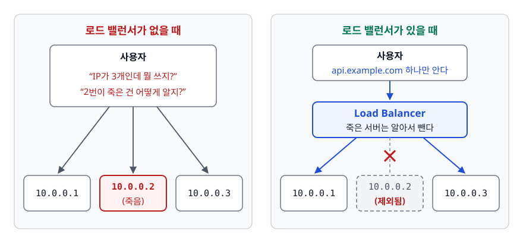
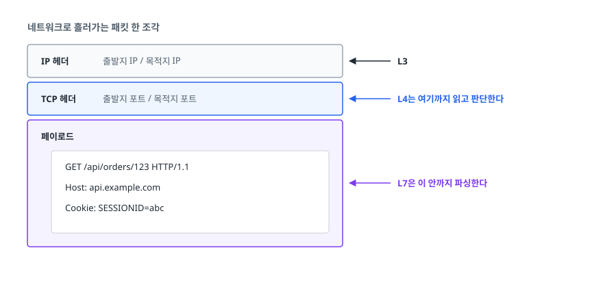
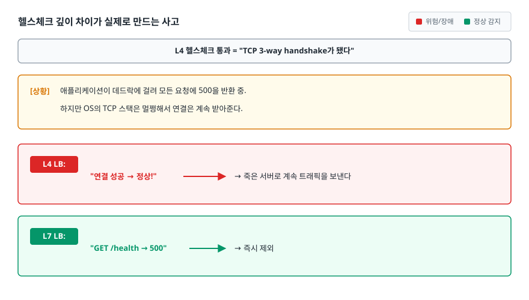
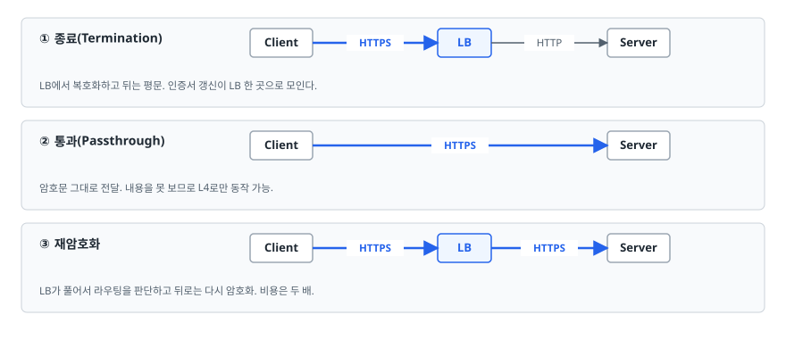
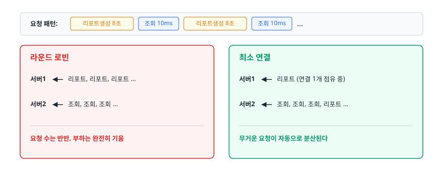
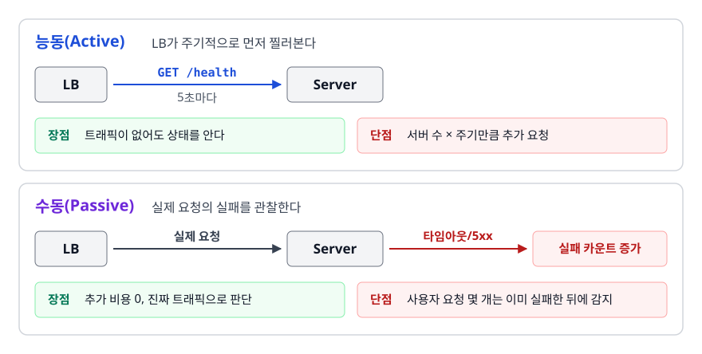
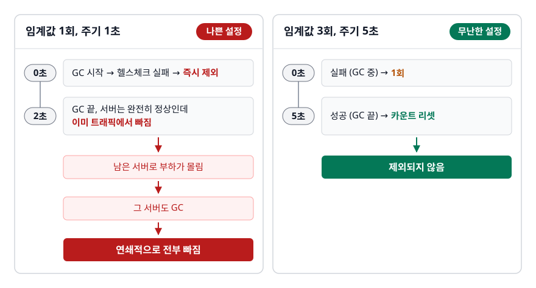
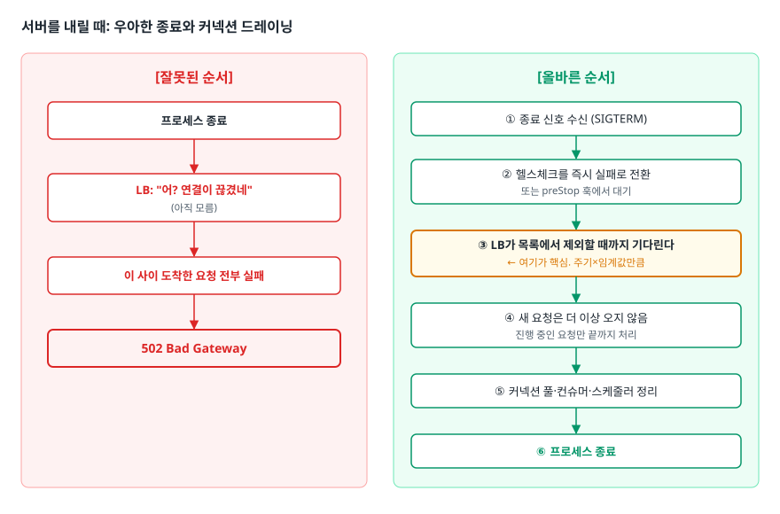
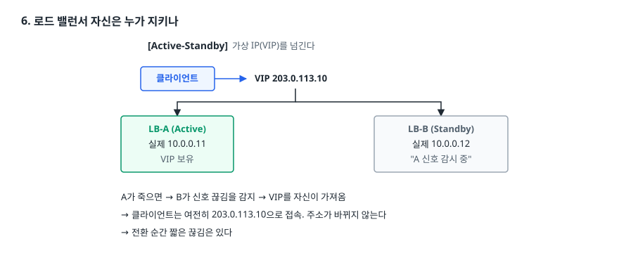

# 로드 밸런서 (Load Balancer)

> 로드 밸런서는 서버 여러 대를 주소 하나로 묶어 주는 대신 스스로 새 약점이 됩니다. 무엇을 보고 어디로 보내는지, 헬스체크를 어떻게 잡아야 정상 서버를 죽이지 않는지, 로드 밸런서 자신이 죽으면 어떻게 되는지를 다룹니다.

## 학습 목표

- [ ] 서버를 한 대 더 늘리는 것만으로 해결되지 않는 문제를 지적할 수 있다
- [ ] L4와 L7이 각각 패킷의 어디까지 읽는지, 그래서 무엇을 할 수 있고 없는지 구분할 수 있다
- [ ] 분배 알고리즘 다섯 가지를 요청 특성에 맞춰 고를 수 있다
- [ ] 헬스체크 주기·임계값을 근거를 대고 정할 수 있다
- [ ] 배포 중 요청이 끊기지 않으려면 로드 밸런서와 애플리케이션이 어떤 순서로 협력해야 하는지 그릴 수 있다

## 선행 지식

- TCP와 HTTP의 차이(연결 vs 요청) 정도만 알면 됩니다
- OSI 계층은 "4계층은 IP·포트, 7계층은 HTTP" 수준이면 충분합니다

---

## 1. 왜 필요한가 — 서버 한 대의 천장

서비스를 처음 만들면 서버는 한 대입니다. 트래픽이 늘면 "더 좋은 서버로 바꾸자"(수직 확장, Scale-Up)를 가장 먼저 떠올리지만 이 길은 여러 군데에서 막힙니다.

**물리적 천장이 있습니다.** CPU 코어와 메모리는 무한히 붙일 수 없고, 사양이 두 배가 되어도 가격은 네 배가 되는 구간이 옵니다.

**그 한 대가 죽으면 서비스도 죽습니다.** 아무리 좋은 서버여도 단일 장애점(SPOF, Single Point of Failure)입니다. 커널 패닉, 디스크 고장, 심지어 OS 보안 패치 재부팅에도 서비스가 멈춥니다.

**배포할 때마다 반드시 멈춥니다.** 프로세스를 내리고 새 버전을 올리는 그 몇 초~몇 분은 예외 없이 다운타임입니다.

그래서 서버를 여러 대로 늘립니다(수평 확장, Scale-Out). 그런데 여기서 새로운 문제가 생깁니다. **사용자는 서버 세 대의 IP를 어떻게 알고 접속하나?** 그리고 **한 대가 죽었다는 걸 사용자가 어떻게 알고 피해가나?**

이 두 질문에 답하는 장치가 로드 밸런서입니다. 사용자에게는 주소 하나만 노출하고, 그 뒤에서 살아 있는 서버들에게 요청을 나눠 줍니다.

<!-- diagram:sd-load-balancer-1 -->


<!-- 위 그림이 대체한 원본 ASCII.
     내용을 고칠 때는 그림도 함께 갱신할 것.
```
   [로드 밸런서가 없을 때]        [로드 밸런서가 있을 때]

   사용자                          사용자  api.example.com 하나만 안다
     │ "IP가 3개인데 뭘 쓰지?"       ▼
     │ "2번이 죽은 건 어떻게 알지?" ┌──────────────┐
     ▼                            │ Load Balancer│ 죽은 서버는 알아서 뺀다
   10.0.0.1 10.0.0.2 10.0.0.3     └──────┬───────┘
            (죽음)            ┌──────────┼──────────┐
                              ▼          ▼          ▼
                          10.0.0.1   10.0.0.2   10.0.0.3
                                     (제외됨)
```
-->

### 비유: 은행 창구 안내 데스크

창구가 다섯 개인 은행에 안내 데스크가 있습니다. 손님은 창구 번호를 몰라도 되고, 데스크가 "3번 창구로 가세요"라고 알려 줍니다. 3번 직원이 자리를 비우면 데스크는 그쪽으로 손님을 보내지 않습니다.

> **비유의 한계**: 안내 데스크는 손님을 보내고 나면 더 관여하지 않습니다. 로드 밸런서는 다릅니다. 대개 요청과 응답이 **모두 자기를 통과**합니다. 그래서 로드 밸런서 자신도 대역폭과 커넥션 수에 한계가 있고, 여기가 새로운 병목이 될 수 있습니다.

---

## 2. 어느 계층을 보느냐가 모든 차이를 만든다

L4와 L7의 차이를 "빠르다 vs 유연하다"로 외우면 실무에서 아무 판단도 못 합니다. 둘은 **패킷의 어디까지 읽느냐**에서 갈립니다. 기능 차이는 전부 여기서 따라 나옵니다.

<!-- diagram:sd-load-balancer-2 -->


<!-- 위 그림이 대체한 원본 ASCII.
     내용을 고칠 때는 그림도 함께 갱신할 것.
```
   네트워크로 흘러가는 패킷 한 조각

   ┌─────────────────────────────────────────┐
   │ IP 헤더    출발지 IP / 목적지 IP          │  ← L3
   ├─────────────────────────────────────────┤
   │ TCP 헤더   출발지 포트 / 목적지 포트       │  ← L4는 여기까지 읽고 판단한다
   ├─────────────────────────────────────────┤
   │ 페이로드                                 │
   │   GET /api/orders/123 HTTP/1.1          │  ← L7은 이 안까지 파싱한다
   │   Host: api.example.com                 │
   │   Cookie: SESSIONID=abc                 │
   └─────────────────────────────────────────┘
```
-->

L4는 헤더만 보고 바로 다음 서버로 넘깁니다. 그 덕분에 **어떤 프로토콜이든 상관없이** 분배할 수 있습니다. TCP면 됩니다. 게임 서버의 커스텀 프로토콜, MySQL 프로토콜, MQTT 전부 가능합니다. 대신 요청 내용을 모르니 "이 요청은 API 서버로" 같은 판단은 원리상 불가능합니다.

L7은 페이로드를 파싱해 HTTP 요청으로 복원합니다. 그래서 URL·헤더·쿠키를 보고 판단할 수 있지만, **HTTP 계열(HTTP/1.1, HTTP/2, gRPC)이 아니면 그 판단 근거 자체가 없습니다.**

### 기능 차이는 전부 여기서 파생된다

| 기능 | L4 | L7 | 이유 |
|------|----|----|------|
| 경로 기반 라우팅 (`/api/*` → A, `/img/*` → B) | 불가 | 가능 | URL이 페이로드 안에 있습니다 |
| TLS 종료 (복호화 대행) | 제한적 | 가능 | L7은 복호화해야 HTTP를 읽을 수 있으니 종료가 기본 기능입니다. L4 장비도 TLS를 종료하고 뒤로는 TCP로 넘기는 리스너를 지원하기도 합니다(AWS NLB의 TLS 리스너) |
| 쿠키 기반 세션 고정 | 불가 (IP 해시로 흉내만) | 가능 | 쿠키가 페이로드 안에 있습니다 |
| 헬스체크 깊이 | 기본은 TCP 연결 성공 여부 | HTTP 상태 코드, 응답 본문 | 분배 판단에는 헤더만 씁니다. 다만 헬스체크는 데이터 경로와 별개라 L4 장비도 HTTP 체크를 제공하기도 합니다 |
| 실패 요청 재시도 | 불가 | 가능 | 요청 단위를 알아야 다시 보낼 수 있습니다 |
| WAF, 압축, 요청/응답 헤더 조작 | 불가 | 가능 | 내용을 알아야 검사·변형할 수 있습니다 |
| 비 HTTP 프로토콜 | 가능 | 대체로 불가 | L7 로드 밸런서는 HTTP 계열 파서를 전제로 만들어져 있습니다 |
| 처리 비용 | 낮음 | 높음 (파싱 + 복호화) | — |
| AWS 대응 | NLB | ALB | — |

> 선택 기준: **HTTP 서비스라면 L7이 기본값입니다.** 경로 라우팅과 TLS 종료 두 가지만으로도 값을 합니다. L4는 HTTP가 아닌 트래픽이거나, 초당 수십만 커넥션처럼 파싱 비용 자체가 아까울 때 고릅니다.

### 헬스체크 깊이 차이가 실제로 만드는 사고

**헬스체크 깊이**가 이 표에서 실무 사고로 가장 많이 이어집니다.

<!-- diagram:sd-load-balancer-3 -->


<!-- 위 그림이 대체한 원본 ASCII.
     내용을 고칠 때는 그림도 함께 갱신할 것.
```
   L4 헬스체크 통과 = "TCP 3-way handshake가 됐다"

   [상황] 애플리케이션이 데드락에 걸려 모든 요청에 500을 반환 중.
          하지만 OS의 TCP 스택은 멀쩡해서 연결은 계속 받아준다.

   L4 LB:  "연결 성공 → 정상!"  → 죽은 서버로 계속 트래픽을 보낸다
   L7 LB:  "GET /health → 500" → 즉시 제외
```
-->

L4 로드 밸런서를 쓰면서 헬스체크를 TCP로만 잡아두면, 애플리케이션이 사실상 죽어도 로드 밸런서는 끝까지 정상이라고 판단합니다. NLB처럼 L4 장비에서도 HTTP 헬스체크를 지원하는 경우가 많으니, **가능하면 프로토콜 헬스체크에 머무르지 말고 애플리케이션 헬스체크를 겁니다.**

### TLS 종료의 세 가지 형태

<!-- diagram:sd-load-balancer-4 -->


<!-- 위 그림이 대체한 원본 ASCII.
     내용을 고칠 때는 그림도 함께 갱신할 것.
```
   ① 종료(Termination)   Client ══HTTPS══▶ LB ──HTTP──▶ Server
      LB에서 복호화하고 뒤는 평문. 인증서 갱신이 LB 한 곳으로 모인다.

   ② 통과(Passthrough)   Client ══HTTPS══════════════▶ Server
      암호문 그대로 전달. 내용을 못 보므로 L4로만 동작 가능.

   ③ 재암호화             Client ══HTTPS══▶ LB ══HTTPS══▶ Server
      LB가 풀어서 라우팅을 판단하고 뒤로는 다시 암호화. 비용은 두 배.
```
-->

내부망을 신뢰할 수 있으면 ①이 기본이고, 구간 암호화가 규정인 금융권 등에서는 ②나 ③을 씁니다. 덧붙이면, 업계에서는 관습처럼 "SSL"이라 부르지만 실제 프로토콜은 TLS 1.2/1.3입니다. 면접에서 이 점을 짚으면 정확도 점수를 얻습니다.

---

## 3. 분배 알고리즘 다섯 가지

### 라운드 로빈 (Round Robin)

들어온 순서대로 1번, 2번, 3번, 다시 1번. 가장 단순하고 기본값인 경우가 많습니다. 이 방식에는 **서버 사양이 같고 요청당 처리 비용이 비슷하다는 전제**가 깔려 있습니다. 그 전제가 깨지면 바로 무너집니다.

### 가중 라운드 로빈 (Weighted Round Robin)

서버마다 가중치를 두고 그 비율대로 나눕니다. 사양이 다른 서버가 섞여 있을 때, 그리고 **카나리 배포에서 신버전에 5%만 보낼 때** 씁니다.

```nginx
upstream backend {
    server 10.0.0.1:8080 weight=5;   # 신형, 5/11
    server 10.0.0.2:8080 weight=5;
    server 10.0.0.3:8080 weight=1;   # 구형, 1/11
}
```

### 최소 연결 (Least Connections)

지금 활성 연결이 가장 적은 서버로 보냅니다. 요청마다 처리 시간이 크게 다를 때 라운드 로빈보다 훨씬 안정적입니다.

<!-- diagram:sd-load-balancer-5 -->


<!-- 위 그림이 대체한 원본 ASCII.
     내용을 고칠 때는 그림도 함께 갱신할 것.
```
   요청 패턴: [리포트생성 8초] [조회 10ms] [리포트생성 8초] [조회 10ms] ...

   라운드 로빈           최소 연결
   서버1 ← 리포트, 리포트, 리포트 …    서버1 ← 리포트 (연결 1개 점유 중)
   서버2 ← 조회, 조회, 조회 …          서버2 ← 조회, 조회, 조회, 리포트 …
   요청 수는 반반, 부하는 완전히 기움   무거운 요청이 자동으로 분산된다
```
-->

### 최소 응답 시간 (Least Response Time)

활성 연결 수와 최근 평균 응답 시간을 함께 봅니다. 같은 사양이어도 어떤 서버만 느려지는 상황(디스크 성능 저하, GC 압박)에 반응합니다. 대신 측정 오버헤드가 있고, "가장 빠른 서버"로 요청이 한순간 쏠렸다가 그 서버가 느려지는 진동이 생길 수 있습니다. 그래서 실제 구현은 후보 두 개를 무작위로 뽑아 그중 나은 쪽을 고르기도 합니다(power of two choices).

### 해시 기반 (IP Hash / Consistent Hash)

클라이언트 IP나 특정 키를 해싱해 서버를 결정합니다. **같은 키는 항상 같은 서버로 간다**는 성질을 노리고 씁니다.

```nginx
upstream backend {
    ip_hash;                          # 클라이언트 IP 기준
    server 10.0.0.1:8080;
    server 10.0.0.2:8080;
}

upstream cache_nodes {
    hash $request_uri consistent;     # URL 기준 + 일관된 해싱
    server 10.0.1.1:8080;
    server 10.0.1.2:8080;
}
```

단순 해시(`hash(key) % N`)는 서버가 한 대 늘거나 줄면 **거의 모든 키의 매핑이 바뀝니다.** 일관된 해싱(consistent hashing)을 쓰면 서버 증감 시 재배치되는 키가 1/N 수준으로 줄어듭니다. 캐시 서버 앞단에 두는 경우 이 차이는 결정적입니다. 단순 해시로 캐시 노드를 하나 추가하면 캐시 적중률이 한순간 0에 가깝게 떨어지고, 그 부하가 그대로 DB로 갑니다.

| 알고리즘 | 판단 근거 | 이럴 때 쓴다 | 약점 |
|---------|----------|-------------|------|
| 라운드 로빈 | 순서 | 사양·처리시간이 균일한 일반 API | 무거운 요청이 한쪽에 몰릴 수 있습니다 |
| 가중 라운드 로빈 | 사람이 정한 비율 | 사양 혼재, 카나리 트래픽 분배 | 가중치를 수동 관리 |
| 최소 연결 | 활성 연결 수 | 처리 시간 편차 큼, WebSocket·SSE | 연결 수와 실제 부하가 비례하지 않을 수 있습니다 |
| 최소 응답 시간 | 연결 수 + 응답 지연 | 서버 성능이 실시간으로 변할 때 | 측정 비용, 쏠림 진동 |
| 해시 | 키(IP/URL 등) | 세션 고정, 캐시 지역성 | 서버 증감 시 매핑 붕괴, NAT 쏠림 |

**요청 비용이 균일하면 라운드 로빈, 들쭉날쭉하면 최소 연결, 같은 키를 같은 서버로 보내야 하면 해시.** 해시는 성능 최적화를 노린 선택이 아닙니다. 제약 조건을 만족시키려고 씁니다.

---

## 4. 헬스체크 — 잘못 만들면 없느니만 못하다

### 능동 vs 수동

<!-- diagram:sd-load-balancer-6 -->


<!-- 위 그림이 대체한 원본 ASCII.
     내용을 고칠 때는 그림도 함께 갱신할 것.
```
   능동(Active)  LB가 주기적으로 먼저 찔러본다
      LB ──GET /health──▶ Server    5초마다
      장점: 트래픽이 없어도 상태를 안다
      단점: 서버 수 × 주기만큼 추가 요청

   수동(Passive)  실제 요청의 실패를 관찰한다
      LB ──실제 요청──▶ Server ──타임아웃/5xx──▶ 실패 카운트 증가
      장점: 추가 비용 0, 진짜 트래픽으로 판단
      단점: 사용자 요청 몇 개는 이미 실패한 뒤에 감지
```
-->

둘은 대체재가 아니라 보완재입니다. 오픈소스 nginx는 기본으로 수동 방식(`max_fails`, `fail_timeout`)만 제공합니다. 능동 헬스체크(`health_check` 지시자)는 상용 버전 기능입니다. HAProxy는 오픈소스에서도 능동 체크를 지원합니다.

```haproxy
# HAProxy — 5초마다 GET /health, 3회 연속 실패 시 제외, 2회 연속 성공 시 복귀
backend api_servers
    option httpchk GET /health
    server api1 10.0.0.1:8080 check inter 5s fall 3 rise 2
    server api2 10.0.0.2:8080 check inter 5s fall 3 rise 2
```

### 주기와 임계값은 감으로 정하지 않는다

```
   장애 감지까지 걸리는 시간 ≈ 점검 주기 × 실패 임계값

   주기 5초 × 임계값 3회 = 최대 15초 동안 죽은 서버로 요청이 간다
   주기 2초 × 임계값 2회 = 4초 만에 감지, 대신 노이즈에 민감해진다
```

임계값이 1이면 안 되는 이유는 **일시적 정지가 실재하기 때문**입니다. JVM의 Full GC는 힙 크기와 수집기에 따라 수백 밀리초에서 수 초까지 애플리케이션 스레드를 멈출 수 있고, 그 사이에는 헬스체크 응답도 나가지 못합니다.

<!-- diagram:sd-load-balancer-7 -->


<!-- 위 그림이 대체한 원본 ASCII.
     내용을 고칠 때는 그림도 함께 갱신할 것.
```
   [임계값 1회, 주기 1초]  ← 나쁜 설정
   0초  GC 시작 → 헬스체크 실패 → 즉시 제외
   2초  GC 끝, 서버는 완전히 정상인데 이미 트래픽에서 빠짐
   → 남은 서버로 부하가 몰림 → 그 서버도 GC → 연쇄적으로 전부 빠짐

   [임계값 3회, 주기 5초]  ← 무난한 설정
   0초  실패 (GC 중)  → 1회
   5초  성공 (GC 끝)  → 카운트 리셋
   → 제외되지 않음
```
-->

보통 수 초 간격에 연속 2~3회 실패를 기준으로 잡습니다. 감지를 빠르게 하고 싶으면 임계값이 아니라 **주기**를 줄이는 쪽이 안전합니다.

### 안티패턴: 모든 의존성을 헬스체크에 묶는다

```java
// 안티패턴
@GetMapping("/health")
public String health() {
    jdbcTemplate.queryForObject("SELECT 1", Integer.class);
    redisTemplate.opsForValue().get("ping");
    recommendationClient.ping();   // 추천 서비스
    paymentClient.ping();          // 외부 결제사
    return "UP";
}
```

**왜 문제인가**: 외부 결제사가 점검에 들어가면 **모든 인스턴스의 헬스체크가 동시에 실패합니다.** 로드 밸런서는 전 서버를 비정상으로 판정해 대상 목록에서 빼고, 트래픽을 받을 서버가 하나도 남지 않습니다. 결제만 안 됐어야 할 상황이 전체 서비스 중단이 됩니다. 게다가 모든 인스턴스가 동시에 빠지므로 자동 복구도 되지 않습니다.

```java
// 개선 — 헬스체크는 "이 인스턴스로 트래픽을 보내는 게 안 보내는 것보다 나은가"만 답한다
@GetMapping("/health")
public String health() {
    return "UP";
}

// 의존성 상태는 별도 엔드포인트로 빼서 모니터링·알람에서만 본다
@GetMapping("/health/dependencies")
public Map<String, String> dependencies() {
    return Map.of(
        "db", check(this::pingDb),
        "redis", check(this::pingRedis),
        "recommendation", check(recommendationClient::ping)
    );
}
```

헬스체크에는 **없으면 이 인스턴스가 아무 요청도 처리 못 하는 의존성**(자기 DB)만 넣습니다. 없어도 일부 기능만 막히는 의존성(추천, 알림, 외부 결제)은 넣지 않습니다.

### 서버를 내릴 때: 우아한 종료와 커넥션 드레이닝

헬스체크가 서버를 **넣는** 규칙이라면, 커넥션 드레이닝은 서버를 **빼는** 규칙입니다. 이 순서가 틀리면 배포할 때마다 요청이 잘립니다.

<!-- diagram:sd-load-balancer-8 -->


<!-- 위 그림이 대체한 원본 ASCII.
     내용을 고칠 때는 그림도 함께 갱신할 것.
```
   [잘못된 순서]                        [올바른 순서]

   프로세스 종료                        ① 종료 시작 (SIGTERM 수신 또는 preStop 훅)
        │                                    │
        ▼                              ② 헬스체크를 즉시 실패로 전환
   LB: "어? 연결이 끊겼네"                    │   또는 preStop 훅에서 대기
        │  (아직 모름)                       ▼
        ▼                              ③ LB가 목록에서 제외할 때까지 기다린다
   이 사이 도착한 요청 전부 실패              │   ← 여기가 핵심. 주기×임계값만큼
        │                                    ▼
        ▼                              ④ 새 요청은 더 이상 오지 않음
   502 Bad Gateway                            │   진행 중인 요청만 끝까지 처리
                                              ▼
                                        ⑤ 커넥션 풀·컨슈머·스케줄러 정리
                                              │
                                              ▼
                                        ⑥ 프로세스 종료
```
-->

③번 대기 구간이 빠지는 실수가 압도적으로 많습니다. **애플리케이션이 "나 내려갑니다"라고 선언한 뒤 로드 밸런서가 그것을 반영하기까지는 반드시 시차가 있습니다.** 헬스체크 주기가 5초, 임계값이 2회면 최대 10초 동안 로드 밸런서는 여전히 이 서버로 요청을 보냅니다.

AWS ALB에서는 **등록 취소 지연(deregistration delay)** 설정이 이 대기 시간을 정합니다. 기본값은 300초입니다. 대상 그룹에서 인스턴스를 빼도 진행 중인 요청이 끝날 때까지 최대 이 시간만큼 기다립니다. Kubernetes에서는 `preStop` 훅과 `terminationGracePeriodSeconds`가 같은 역할을 합니다. 구체적인 설정은 [02-zero-downtime-deployment.md](./02-zero-downtime-deployment.md)에서 다룹니다.

---

## 5. 세션 고정 — 필요악이지 목표가 아니다

### 왜 생겼나

로그인 세션을 서버 메모리에 들고 있으면 문제가 생깁니다.

```
   로그인 요청  → 서버1 (세션 저장)
   다음 요청    → 서버2 (세션 없음) → "로그인이 필요합니다"
```

그래서 **같은 사용자를 항상 같은 서버로 보내는** 세션 고정(Sticky Session)을 가장 손쉬운 처방으로 씁니다. IP 해시로 하거나, L7이면 로드 밸런서가 심어준 쿠키로 합니다.

### 그런데 세 가지 값을 치른다

1. **그 서버가 죽으면 세션도 죽습니다.** 서버 한 대 재시작에 그 서버 사용자만 로그아웃됩니다.
2. **부하가 기웁니다.** 오래 머무는 헤비 유저가 특정 서버에 붙으면 그 서버만 무거워지고, 새 서버를 붙여도 기존 사용자는 옮겨가지 않습니다.
3. **배포와 오토스케일링이 어렵습니다.** 서버를 내리려면 붙어 있는 세션이 끝나기를 기다려야 하고, 세션 만료가 30분이면 30분을 기다려야 합니다.

### 개선: 상태를 서버 밖으로

```java
// 안티패턴 — 세션이 서버 메모리에 산다
@PostMapping("/login")
public void login(HttpSession session, LoginRequest req) {
    User user = userService.authenticate(req);
    session.setAttribute("userId", user.getId());   // 이 서버의 힙에만 존재
}
```

**왜 문제인가**: 이 서버가 사라지면 세션도 사라집니다. 애플리케이션 서버에 상태가 생기는 순간 "아무 서버나 붙여도 되고 아무 서버나 내려도 되는" 무상태(stateless)의 이점을 전부 잃습니다.

```yaml
# 개선 1 — 세션 저장소를 Redis로 분리
# 의존성: org.springframework.session:spring-session-data-redis
spring:
  session:
    store-type: redis   # Spring Boot 2.x까지의 속성. 3.0에서 제거됐고, 이후로는 클래스패스의 저장소 구현이 자동 선택됨
```

애플리케이션 코드는 그대로 `HttpSession`을 쓰지만 실제 데이터는 Redis에 저장됩니다. 모든 서버가 같은 세션을 보므로 세션 고정이 필요 없어집니다.

**개선 2 — 토큰 기반 인증.** 서버가 세션을 아예 저장하지 않고, 클라이언트가 서명된 토큰을 들고 다닙니다. 서버는 서명만 검증하면 되므로 완전 무상태가 됩니다. 대신 즉시 로그아웃·강제 만료가 어려워집니다. 그래서 짧은 만료 시간과 리프레시 토큰 설계가 따라옵니다.

세션 고정은 **세션을 밖으로 빼지 못한 시스템의 임시방편**입니다. 새로 설계한다면 처음부터 외부 세션 저장소나 토큰 방식을 택하고, 로드 밸런서의 세션 고정 옵션은 켜지 않는 편이 맞습니다.

---

## 6. 로드 밸런서 자신은 누가 지키나

서버를 여러 대로 만들어 SPOF를 없앴는데, 그 앞에 세운 로드 밸런서가 한 대면 SPOF는 그대로 남아 있습니다. 위치만 옮긴 셈입니다.

<!-- diagram:sd-load-balancer-9 -->


<!-- 위 그림이 대체한 원본 ASCII.
     내용을 고칠 때는 그림도 함께 갱신할 것.
```
   [Active-Standby]  가상 IP(VIP)를 넘긴다

   클라이언트 ──▶ VIP 203.0.113.10
                     │
          ┌──────────┴──────────┐
          ▼                     ▼
      LB-A (Active)         LB-B (Standby)
      실제 10.0.0.11        실제 10.0.0.12
      VIP 보유              "A 신호 감시 중"

   A가 죽으면 → B가 신호 끊김을 감지 → VIP를 자신이 가져옴
   → 클라이언트는 여전히 203.0.113.10으로 접속. 주소가 바뀌지 않는다
   → 전환 순간 짧은 끊김은 있다
```
-->

VIP를 누가 가질지는 VRRP(Virtual Router Redundancy Protocol)가 합의합니다. 리눅스에서 이 프로토콜을 구현한 소프트웨어가 Keepalived입니다.

**Active-Active**는 두 대 이상이 동시에 트래픽을 받습니다. 그러면 "그 여러 대에는 누가 분배하나"라는 질문이 다시 생기는데, 이때는 로드 밸런서보다 더 앞단인 **DNS나 네트워크 계층**이 답합니다.

| 방식 | 어떻게 분산하나 | 한계 |
|------|----------------|------|
| DNS 라운드 로빈 | 도메인 조회 시 IP를 번갈아 반환 | 클라이언트·중간 리졸버가 응답을 캐싱해 TTL 동안 갱신이 안 됩니다. 죽은 IP도 계속 반환될 수 있습니다 |
| 애니캐스트(Anycast) | 같은 IP를 여러 지역에서 광고하고 라우팅이 가장 가까운 곳으로 보냅니다 | BGP 운영이 필요해 직접 하기는 어렵습니다. CDN·퍼블릭 DNS가 쓰는 방식 |
| GSLB | DNS 응답을 사용자 위치·리전 상태에 따라 다르게 줍니다 | DNS 캐싱 한계는 동일. 대신 헬스체크 연동으로 죽은 리전을 뺄 수 있습니다 |
| 매니지드 LB | 클라우드가 여러 가용 영역에 자동 이중화 | 클라우드 종속 |

**특별한 이유가 없으면 매니지드 로드 밸런서를 씁니다.** ALB/NLB는 여러 가용 영역에 노드를 자동 배치하므로 위 작업들을 설정 한 번으로 대체합니다. VRRP/Keepalived 구성은 온프레미스거나 클라우드를 쓸 수 없는 사정이 있을 때의 선택지입니다. 특히 단순 DNS 라운드 로빈에는 헬스체크가 없어서, 죽은 IP도 TTL이 만료될 때까지 계속 반환합니다. 분산에는 쓸 수 있어도 장애 대응 수단은 되지 못합니다. 장애 대응까지 하려면 헬스체크와 연동되는 GSLB나 매니지드 DNS의 상태 확인 기능이 필요합니다.

---

## 7. 실무에서는

- **로드 밸런서는 보통 여러 층으로 겹칩니다.** 외부에 CDN 또는 GSLB, 그 뒤에 리전 단위 L7 로드 밸런서, 다시 그 뒤에 쿠버네티스 Service/Ingress. 각 층이 다른 단위(리전 / 서비스 / Pod)로 분배합니다. 쿠버네티스의 Service는 사실상 L4 로드 밸런서이고, 경로 기반 라우팅이나 TLS 종료가 필요하면 Ingress 컨트롤러나 Gateway API를 그 앞에 둡니다.
- **헬스체크 엔드포인트는 인증을 걸지 않습니다.** 로드 밸런서는 토큰을 들고 다니지 않습니다. 대신 외부에 노출되지 않도록 보안 그룹이나 별도 포트로 분리합니다. Spring Boot Actuator를 쓴다면 `management.server.port`를 애플리케이션 포트와 다르게 두는 방식이 흔합니다.
- **로드 밸런서 뒤에서는 클라이언트 IP가 로드 밸런서 IP로 보입니다.** L7 로드 밸런서가 `X-Forwarded-For` 헤더에 원래 IP를 넣어주므로 애플리케이션이 이를 신뢰하도록 설정해야 합니다. 이 설정을 빠뜨리면 접속 로그의 IP가 전부 같아지고 IP 기반 요청 제한이 무력화됩니다. 반대로 이 헤더를 검증 없이 믿으면 클라이언트가 위조할 수 있으니, 신뢰할 프록시 범위를 지정해야 합니다.

---

## 8. 면접 포인트

> 면접에서 이 주제가 나오면 이렇게 답한다

**Q. L4와 L7 로드 밸런서의 차이를 설명해주세요.**

A. 판단 근거로 삼는 정보의 계층이 다릅니다. L4는 IP와 포트, 즉 패킷 헤더만 보고 분배하므로 프로토콜에 무관하게 동작하고 빠릅니다. L7은 페이로드를 파싱해 URL·헤더·쿠키까지 읽으므로 경로 기반 라우팅, TLS 종료, 쿠키 기반 세션 고정, WAF 같은 기능이 가능합니다. 다만 파싱과 복호화 비용이 있고 HTTP 계열이 아니면 쓸 수 없습니다. HTTP 서비스면 L7을 기본으로 하고, 비 HTTP 트래픽이거나 극단적인 처리량이 필요하면 L4를 씁니다.
- 꼬리 질문: "그럼 L4는 헬스체크를 못 하나요?" → TCP 연결 성공 여부는 확인합니다. 하지만 애플리케이션이 데드락에 걸려 500만 반환하는 상태도 TCP 연결은 되므로 정상으로 오판할 수 있습니다. 그래서 L4 장비여도 가능하면 HTTP 헬스체크를 건다고 답합니다.

**Q. 헬스체크를 설계할 때 무엇을 주의하나요?**

A. 체크 범위를 최소로 잡습니다. DB·Redis·외부 API를 전부 헬스체크에 묶으면 외부 의존성 하나가 장애일 때 모든 인스턴스가 동시에 비정상 판정을 받아 서비스 전체가 내려갑니다. "이 인스턴스로 트래픽을 보내는 게 나은가"만 답하게 하고 의존성 상태는 별도 엔드포인트로 뺍니다. 그리고 주기와 임계값의 곱이 장애 감지 시간이라는 점을 인지합니다. 임계값을 1로 두면 Full GC처럼 잠깐 스레드가 멈추는 순간에도 정상 서버가 빠지므로, 보통 수 초 간격에 연속 2~3회 실패를 기준으로 둡니다.
- 꼬리 질문: "감지를 더 빠르게 하려면요?" → 주기를 줄입니다. 임계값을 낮추면 노이즈 내성이 사라집니다.

**Q. 세션 고정(Sticky Session)이 왜 문제인가요?**

A. 문제는 세 가지입니다. 해당 서버가 죽으면 그 서버에 붙은 사용자의 세션이 함께 사라지고, 헤비 유저가 특정 서버에 고정되어 부하가 기울고, 서버를 내리려면 세션 만료까지 기다려야 해서 배포와 오토스케일링이 어려워집니다. 근본 해법은 세션을 Redis 같은 외부 저장소로 빼거나 토큰 기반 인증으로 전환해 애플리케이션 서버를 무상태로 만드는 것입니다. 세션 고정은 그 작업을 아직 못 한 시스템의 임시방편으로 봐야 합니다.
- 꼬리 질문: "IP 해시로 세션 고정을 하면 어떤 문제가 있나요?" → 서버가 증감하면 해시 매핑이 통째로 바뀌어 세션이 유실되고, 회사·모바일 통신망처럼 여러 사용자가 같은 공인 IP로 나오는 환경에서는 한 서버로 쏠립니다.

**Q. 로드 밸런서 자체가 SPOF 아닌가요?**

A. 맞습니다. 그래서 이중화합니다. Active-Standby는 VRRP로 가상 IP를 대기 장비로 넘기는 방식으로, 클라이언트가 보는 주소는 그대로지만 전환 순간 짧은 끊김이 있습니다. Active-Active는 여러 대가 동시에 받고 그 앞단을 DNS 라운드 로빈이나 애니캐스트로 분산합니다. 클라우드에서는 ALB/NLB 같은 매니지드 로드 밸런서가 여러 가용 영역에 자동 이중화되므로 대부분 이쪽을 씁니다.
- 꼬리 질문: "DNS 라운드 로빈만으로 이중화하면 안 되나요?" → 단순 DNS 라운드 로빈에는 헬스체크가 없어 죽은 IP도 TTL 동안 계속 반환됩니다. 클라이언트가 TTL을 무시하고 더 오래 캐싱하기도 합니다. 분산에는 쓸 수 있어도 장애 대응 수단은 되지 못합니다.

---

## 자주 하는 실수

| 실수 | 왜 틀렸나 | 올바른 이해 |
|------|----------|-----------|
| "L7이 L4보다 좋으니 항상 L7" | L7은 HTTP 파서에 묶여 있습니다. 게임 서버 프로토콜이나 DB 프록시는 L7으로 분배할 수 없습니다 | HTTP면 L7, 그 밖의 TCP/UDP면 L4. 성능 우열이 아니라 가능 여부의 문제입니다 |
| "헬스체크는 꼼꼼할수록 좋다" | 부가 의존성까지 묶으면 그 하나의 장애로 전 인스턴스가 동시에 빠져 서비스가 죽습니다 | 필수 의존성만 확인하고 나머지는 모니터링용 엔드포인트로 분리합니다 |
| "헬스체크만 켜두면 무중단 배포가 된다" | 애플리케이션이 종료를 시작한 순간과 LB가 제외하는 순간 사이에 시차가 있습니다 | 종료 신호를 받으면 헬스체크를 먼저 실패로 바꾸고 LB 반영 시간만큼 기다린 뒤 종료합니다 |
| "라운드 로빈은 부하를 균등하게 나눈다" | 균등하게 나뉘는 것은 요청 **개수**뿐이고 부하까지 균등해지지는 않습니다 | 요청당 비용이 다르면 최소 연결이 훨씬 안정적입니다 |
| "IP 해시로 세션 문제를 해결했다" | 서버 증감 시 매핑이 깨지고 NAT 환경에서 쏠립니다. 문제를 미뤄뒀을 뿐 풀지는 못했습니다 | 세션을 외부 저장소로 빼서 애플리케이션을 무상태로 만드는 것이 해법입니다 |
| "TLS 종료를 하면 항상 안전하다" | LB와 서버 사이 구간이 평문이 됩니다. 그 구간이 신뢰 경계 밖이면 위험합니다 | 내부망을 신뢰할 수 없거나 규정이 요구하면 재암호화를 씁니다 |

---

## 한 줄 정리

로드 밸런서는 "여러 서버를 하나의 주소로 보이게 하는 장치"입니다. L4와 L7의 차이는 전부 패킷을 어디까지 읽느냐에서 나옵니다. 실무에서 사고가 나는 지점은 알고리즘 선택보다 **헬스체크 범위와 서버를 뺄 때의 순서** 쪽입니다.

---

## 연관 개념

- [02-zero-downtime-deployment.md](./02-zero-downtime-deployment.md) - 로드 밸런서와 애플리케이션이 배포 중 협력하는 구체적인 순서
- [03-high-traffic.md](./03-high-traffic.md) - 로드 밸런서 뒤의 서버를 늘려도 해결되지 않는 병목들
- [scalability/02-load-balancing-sharding.md](./scalability/02-load-balancing-sharding.md) - 로드 밸런싱과 데이터 샤딩을 확장성 관점에서 함께 보기
- [qna-infrastructure.md](./qna-infrastructure.md) - 로드 밸런서 관련 면접 질문(Q1)
- [../10-cloud-engineering/kubernetes/03-networking-service.md](../10-cloud-engineering/kubernetes/03-networking-service.md) - 쿠버네티스 Service와 Ingress가 로드 밸런싱을 처리하는 방식
