# 무중단 배포 (Zero-Downtime Deployment)

> "롤링 업데이트로 설정했는데 왜 배포할 때마다 502가 찍히는가"에 답할 수 있게 됩니다. 전략 이름을 외우는 것이 아니라, 요청이 잘리는 지점을 짚고 막는 것이 목표입니다.

## 학습 목표

- [ ] 배포 중 요청이 실패하는 세 가지 원인을 구분해서 설명할 수 있다
- [ ] Recreate / Rolling / Blue-Green / Canary를 다운타임·비용·롤백 속도로 비교할 수 있다
- [ ] 준비 상태 검사와 우아한 종료가 왜 전략보다 먼저인지 설명할 수 있다
- [ ] 종료 유예 시간을 근거를 대고 계산할 수 있다
- [ ] DB 스키마 변경을 여러 배포로 쪼개는 확장-수축 패턴을 적용할 수 있다

## 선행 지식

- [01-load-balancer.md](./01-load-balancer.md) - 헬스체크와 커넥션 드레이닝을 먼저 읽고 오면 훨씬 쉽다
- 프로세스가 종료 신호(SIGTERM)를 받는다는 개념

---

## 1. 왜 필요한가 — 전략을 골랐는데도 요청이 실패한다

무중단 배포의 필요성 자체는 설명할 게 별로 없습니다. 사용자가 24시간 접속하는 서비스에서 "새벽 2시 점검 공지"는 매출 손실이고, 배포가 무서우면 배포 주기가 길어지고, 배포 주기가 길어지면 한 번에 나가는 변경이 커져서 더 무서워지는 악순환이 생깁니다.

정작 어려운 것은 그다음입니다. 쿠버네티스 Deployment는 기본 전략이 롤링 업데이트입니다. 아무 설정도 안 했는데 이미 롤링입니다. 그런데도 배포 로그를 보면 이런 게 찍힙니다.

```
   14:02:11  502 Bad Gateway     POST /api/orders
   14:02:12  504 Gateway Timeout POST /api/payments
   14:02:14  ECONNRESET          GET  /api/cart
```

전략을 골랐다고 무중단이 되지 않는다는 뜻입니다. **배포 전략은 "서버를 어떤 순서로 교체할지"를 정할 뿐, "교체되는 그 서버가 처리 중이던 요청은 어떻게 되는지"는 정하지 않습니다.** 그건 애플리케이션과 로드 밸런서가 협력해서 해결해야 합니다. 그래서 이 문서는 전략보다 원인부터 봅니다.

### 비유: 영업 중인 매장의 계산대 교체

계산대 다섯 대 중 한 대씩 새 기종으로 바꾼다고 하자. 그냥 코드를 뽑으면 그 계산대에서 결제 중이던 손님의 거래가 날아갑니다. 순서를 지켜야 합니다. 먼저 "이 계산대 마감합니다" 안내판을 세워 새 손님이 그 줄에 서지 않게 하고, 안내판을 본 손님들이 다른 줄로 옮겨갈 시간을 준 뒤, 지금 결제 중인 손님만 마저 처리하고 나서 전원을 내립니다. 배포 전략이 정하는 것은 "몇 번 계산대부터 바꿀지"까지이고, 위 순서는 별개로 지켜야 합니다.

> **비유의 한계**: 매장에서는 안내판을 세우는 즉시 손님이 알아채지만, 로드 밸런서는 헬스체크 주기가 돌아올 때까지 그 사실을 모릅니다. **안내판은 세웠는데 아직 아무도 못 본 이 몇 초**가 배포 중 502의 가장 큰 원인이고, 2절의 원인 2가 정확히 이 이야기입니다.

---

## 2. 배포 중 요청이 끊기는 세 가지 원인

### 원인 1. 처리 중인 요청을 두고 프로세스가 죽는다

<!-- diagram:sd-zero-downtime-deployment-1 -->
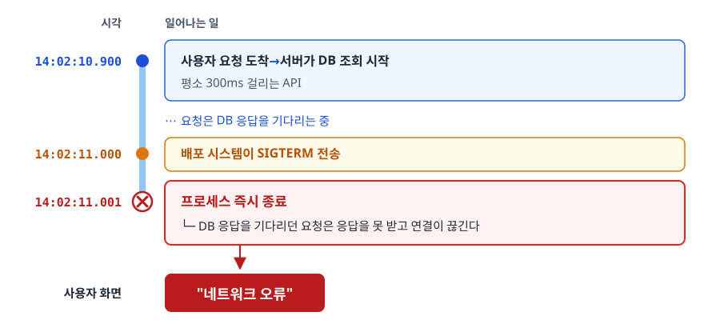

<!-- 위 그림이 대체한 원본 ASCII.
     내용을 고칠 때는 그림도 함께 갱신할 것.
```
   14:02:10.900  사용자 요청 도착 → 서버가 DB 조회 시작 (평소 300ms 걸리는 API)
   14:02:11.000  배포 시스템이 SIGTERM 전송
   14:02:11.001  프로세스 즉시 종료
                 └─ DB 응답을 기다리던 요청은 응답을 못 받고 연결이 끊긴다
   사용자 화면:  "네트워크 오류"
```
-->

원인은 단순합니다. **애플리케이션이 종료 신호를 받고도 진행 중인 일을 기다려주지 않기 때문입니다.** JVM은 SIGTERM을 받으면 등록된 종료 훅(shutdown hook)을 실행하고 내려가는데, 별도 설정이 없으면 그 과정에서 웹 서버가 곧바로 닫힙니다. 진행 중인 HTTP 요청, 커밋 직전의 트랜잭션, 처리 중인 큐 메시지가 전부 중간에 잘립니다. 더 나쁜 경우도 있습니다. 유예 시간 안에 종료가 끝나지 않으면 오케스트레이터가 **SIGKILL**을 보내는데, 이건 프로세스가 가로챌 수 없어서 어떤 정리 코드도 실행되지 않습니다.

**처방**: 우아한 종료(Graceful Shutdown). 종료 신호를 받으면 새 요청 수신을 멈추고, 진행 중인 요청만 마저 처리한 뒤 종료합니다. 4장에서 설정을 다룹니다.

### 원인 2. 로드 밸런서가 아직 이 서버를 살아 있다고 믿는다

<!-- diagram:sd-zero-downtime-deployment -->
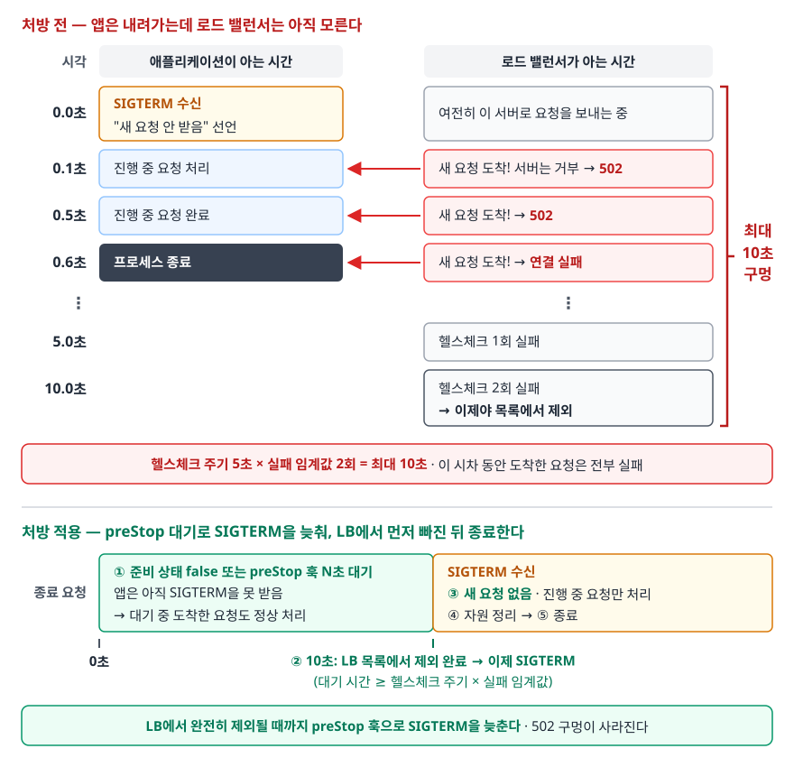

우아한 종료를 켰는데도 502가 남는다면 십중팔구 이 문제입니다.

```
   [애플리케이션이 아는 시간]        [로드 밸런서가 아는 시간]

   0.0초  SIGTERM 수신
          "새 요청 안 받음" 선언       여전히 이 서버로 요청을 보내는 중
   0.1초  진행 중 요청 처리            ← 새 요청 도착! 서버는 거부 → 502
   0.5초  진행 중 요청 완료            ← 새 요청 도착! → 502
   0.6초  프로세스 종료                ← 새 요청 도착! → 연결 실패
                                  ...
   5.0초                             헬스체크 1회 실패
   10.0초                            헬스체크 2회 실패 → 이제야 목록에서 제외
```

애플리케이션은 자기가 내려간다는 걸 아는데, **로드 밸런서는 헬스체크 주기가 돌아올 때까지 모릅니다.** 이 시차 동안 도착한 요청은 전부 실패합니다. 헬스체크 주기 5초에 임계값 2회면 최대 10초짜리 구멍입니다.

**처방**: 종료를 시작하기 전에 **먼저 로드 밸런서에서 빠지고**, 빠진 것이 반영될 때까지 기다린 다음 종료를 시작합니다. 순서가 핵심입니다.

<!-- diagram:sd-zero-downtime-deployment-2 -->
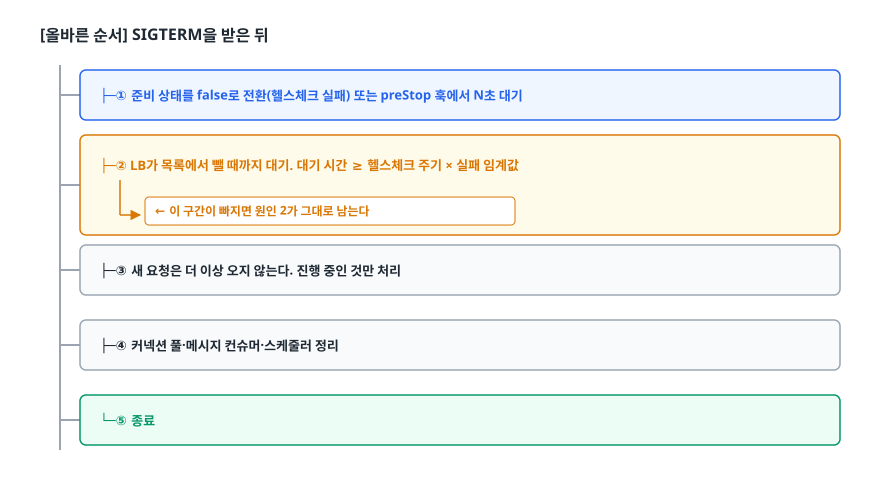

<!-- 위 그림이 대체한 원본 ASCII.
     내용을 고칠 때는 그림도 함께 갱신할 것.
```
   [올바른 순서]  SIGTERM을 받은 뒤

     ├─① 준비 상태를 false로 전환(헬스체크 실패) 또는 preStop 훅에서 N초 대기
     ├─② LB가 목록에서 뺄 때까지 대기. 대기 시간 ≥ 헬스체크 주기 × 실패 임계값
     │      ← 이 구간이 빠지면 원인 2가 그대로 남는다
     ├─③ 새 요청은 더 이상 오지 않는다. 진행 중인 것만 처리
     ├─④ 커넥션 풀·메시지 컨슈머·스케줄러 정리
     └─⑤ 종료
```
-->

### 원인 3. 재사용되던 커넥션이 서버 쪽에서 먼저 끊긴다

이건 훨씬 덜 알려져 있고, 그래서 원인 1·2를 다 해결하고도 남는 잔여 오류의 정체인 경우가 많습니다.

HTTP keep-alive는 하나의 TCP 연결로 여러 요청을 주고받습니다. 로드 밸런서와 백엔드 서버 사이에도 이 연결이 유지됩니다. 양쪽 모두 "이 연결을 얼마나 놀려둘 것인가"에 대한 유휴 타임아웃(idle timeout)을 가지고 있는데, **서버 쪽 타임아웃이 로드 밸런서 쪽보다 짧으면 경쟁 상태가 생깁니다.**

<!-- diagram:sd-zero-downtime-deployment-3 -->
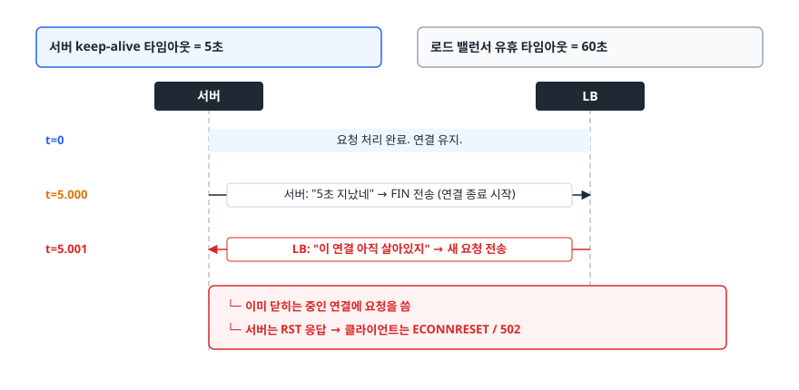

<!-- 위 그림이 대체한 원본 ASCII.
     내용을 고칠 때는 그림도 함께 갱신할 것.
```
   서버 keep-alive 타임아웃 = 5초
   로드 밸런서 유휴 타임아웃 = 60초

   t=0    요청 처리 완료. 연결 유지.
   t=5.000  서버: "5초 지났네" → FIN 전송 (연결 종료 시작)
   t=5.001  LB:   "이 연결 아직 살아있지" → 새 요청 전송
            └─ 이미 닫히는 중인 연결에 요청을 씀
            └─ 서버는 RST 응답 → 클라이언트는 ECONNRESET / 502
```
-->

배포와 직접 관련은 없어 보이지만, 배포 직후 커넥션 풀이 새로 만들어지는 시점에 이 경쟁이 집중적으로 터집니다. 그리고 이 오류는 **재현이 안 되고 로그에도 원인이 남지 않아** 디버깅이 매우 어렵습니다.

**처방**: **백엔드 서버의 keep-alive 타임아웃을 로드 밸런서의 유휴 타임아웃보다 길게** 잡습니다. 그러면 연결을 닫는 쪽이 항상 로드 밸런서가 되고, 로드 밸런서는 자기가 닫는 연결에 요청을 쓰지 않습니다. AWS ALB의 유휴 타임아웃 기본값이 60초이므로 그 뒤 서버의 keep-alive는 그보다 크게 둡니다. nginx라면 `keepalive_timeout`이 같은 설정입니다.

```yaml
# Spring Boot (내장 Tomcat) — ALB 유휴 타임아웃 60초보다 길게
server:
  tomcat:
    keep-alive-timeout: 65s
    connection-timeout: 20s
```

### 세 원인 정리

| 원인 | 사용자에게 보이는 증상 | 처방 |
|------|---------------------|------|
| 처리 중 요청을 두고 프로세스 종료 | 요청 도중 연결 끊김, 타임아웃 | 우아한 종료 |
| LB 등록 해제 지연 | 종료 직후 몇 초간 502 폭증 | 종료 전 준비 상태 false + 대기 |
| keep-alive 커넥션 경쟁 | 산발적 502 / ECONNRESET | 서버 keep-alive > LB 유휴 타임아웃 |

세 가지 모두 **배포 전략과 무관하게** 발생합니다. 그래서 전략보다 이쪽이 먼저입니다.

---

## 3. 배포 전략 네 가지

### Recreate — 전부 내리고 전부 올린다

```
   [v1][v1][v1]  →  [  ][  ][  ]  →  [v2][v2][v2]
                      다운타임
```

무중단이 아닙니다. 그런데도 목록에 있는 이유는 **선택해야 할 때가 있기 때문**입니다. 두 버전이 동시에 살아 있으면 안 되는 경우 — 예를 들어 파일 락을 잡는 배치 프로세스, 하위 호환이 불가능한 스키마 변경, 라이선스가 인스턴스 수를 제한하는 소프트웨어 — 에서는 Recreate가 정답입니다. 새벽 시간대 내부 관리자 도구도 여기 해당합니다.

### Rolling — 조금씩 바꿔 끼운다

<!-- diagram:sd-zero-downtime-deployment-4 -->
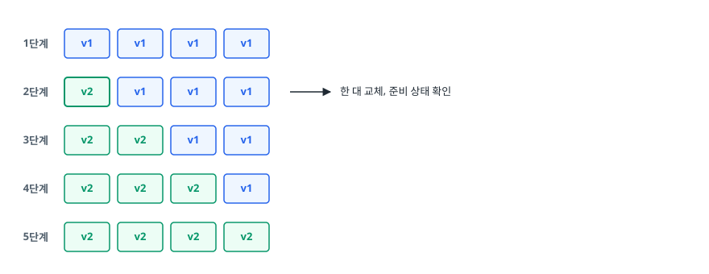

<!-- 위 그림이 대체한 원본 ASCII.
     내용을 고칠 때는 그림도 함께 갱신할 것.
```
   [v1][v1][v1][v1]
   [v2][v1][v1][v1]   ← 한 대 교체, 준비 상태 확인
   [v2][v2][v1][v1]
   [v2][v2][v2][v1]
   [v2][v2][v2][v2]
```
-->

추가 인프라가 필요 없고 대부분의 오케스트레이터 기본값입니다. 대가는 두 가지입니다. **배포 중 v1과 v2가 공존**하므로 두 버전이 같은 DB·캐시·큐를 동시에 써도 안전해야 하고, 문제가 생기면 **되돌리는 것도 순차적**이라 롤백이 느립니다.

```yaml
# 쿠버네티스 롤링 업데이트 세부 조정
spec:
  strategy:
    type: RollingUpdate
    rollingUpdate:
      maxSurge: 1        # 목표 개수보다 최대 1개까지 더 띄울 수 있다
      maxUnavailable: 0  # 사용 불가 Pod를 0개로 → 용량이 절대 줄지 않는다
```

`maxUnavailable: 0`이 중요합니다. 기본값을 그대로 두면 배포 중 일시적으로 처리 용량이 줄어들고, 트래픽이 많은 시간대에는 그것만으로 응답 지연이 생깁니다. 새 Pod를 먼저 띄우고 준비되면 옛 Pod를 내리는 순서가 되도록 `maxSurge`를 1 이상, `maxUnavailable`을 0으로 두는 조합이 안전합니다.

### Blue-Green — 통째로 두 벌 만들고 스위치를 넘긴다

<!-- diagram:sd-zero-downtime-deployment-5 -->
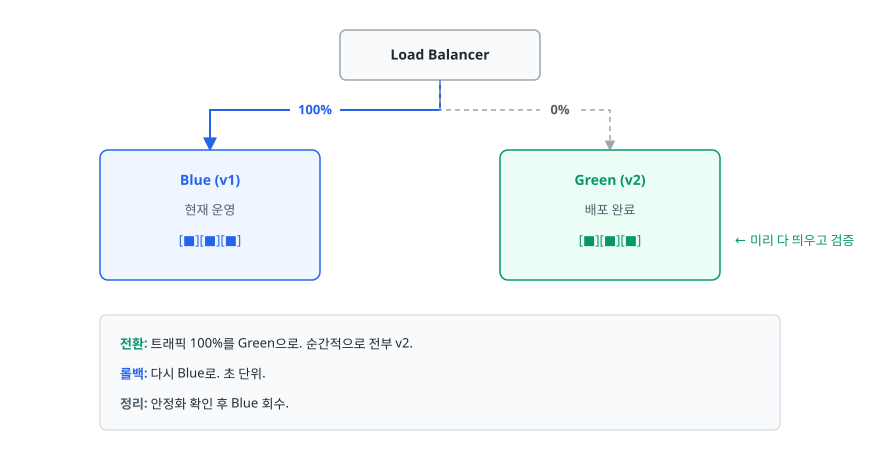

<!-- 위 그림이 대체한 원본 ASCII.
     내용을 고칠 때는 그림도 함께 갱신할 것.
```
                  ┌──────────────┐
                  │ Load Balancer│
                  └───────┬──────┘
          ┌───────────────┴───────────────┐
     100% ▼                           0%  ▼
   ┌─────────────┐                 ┌─────────────┐
   │  Blue (v1)  │                 │ Green (v2)  │
   │  현재 운영   │                 │  배포 완료   │
   │ [■][■][■]  │                 │ [■][■][■]  │  ← 미리 다 띄우고 검증
   └─────────────┘                 └─────────────┘

   전환:  트래픽 100%를 Green으로. 순간적으로 전부 v2.
   롤백:  다시 Blue로. 초 단위.
   정리:  안정화 확인 후 Blue 회수.
```
-->

가장 큰 장점은 **롤백이 트래픽 전환 한 번**이라는 것입니다. 문제를 발견하고 되돌리는 데 걸리는 시간이 배포 시간과 무관합니다. 단점은 전환 순간 두 배의 인프라를 들고 있어야 한다는 것. 그리고 전환 순간에 대해 흔한 오해가 있는데, 트래픽이 순간에 넘어가도 **Blue에서 처리 중이던 요청은 여전히 남아 있습니다.** 드레이닝이 끝날 때까지 Blue를 살려둬야 합니다. 반대로 Green은 방금 뜬 상태라 커넥션 풀도 캐시도 비어 있어서, 100% 트래픽을 한 번에 받으면 초기 응답이 느려집니다. 사전 워밍업이 필요한 이유입니다.

### Canary — 일부에게만 먼저 보낸다

<!-- diagram:sd-zero-downtime-deployment-6 -->
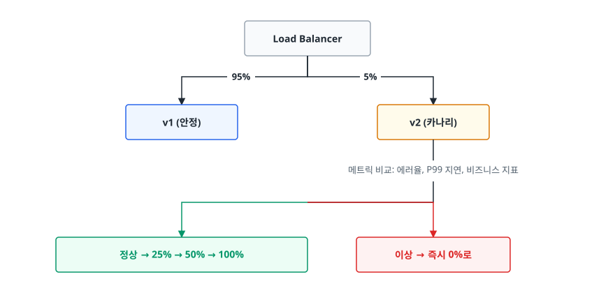

<!-- 위 그림이 대체한 원본 ASCII.
     내용을 고칠 때는 그림도 함께 갱신할 것.
```
                  ┌──────────────┐
                  │ Load Balancer│
                  └───────┬──────┘
             95% ┌────────┴────────┐ 5%
                 ▼                 ▼
          ┌────────────┐    ┌────────────┐
          │  v1 (안정) │    │ v2 (카나리) │
          └────────────┘    └────────────┘
                                  │
                          메트릭 비교: 에러율, P99 지연, 비즈니스 지표
                                  │
                    ┌─────────────┴─────────────┐
                    ▼                           ▼
               정상 → 25% → 50% → 100%      이상 → 즉시 0%로
```
-->

실제 운영 트래픽으로 검증하므로 위험이 가장 작습니다. 대신 트래픽 비율 제어, 두 버전의 메트릭을 분리해서 볼 수 있는 관측 체계, 판정 기준과 자동 롤백까지 갖춰야 제 값을 합니다. **메트릭을 안 보는 카나리는 그냥 느린 롤링 업데이트입니다.** 그리고 5%에게 30분 노출했는데 오류가 없었다고 안심하면 안 됩니다. 초당 100건짜리 API에서 5%면 초당 5건, 30분을 다 채워도 9,000건입니다. 1만 건에 한 번 터지는 버그라면 기댓값이 한 건도 되지 않으니 30분 내내 아무 일도 일어나지 않을 수 있습니다. **관찰 기준은 시간이 아니라 표본 수입니다.**

### 비교

| 기준 | Recreate | Rolling | Blue-Green | Canary |
|------|----------|---------|------------|--------|
| 다운타임 | 있음 | 없음 | 없음 | 없음 |
| 추가 인프라 | 없음 | 소량 (maxSurge만큼) | 2배 | 소량 |
| 롤백 속도 | 재배포 필요 (느림) | 순차 되돌리기 (느림) | 트래픽 전환 (초 단위) | 비율 0% (초 단위) |
| 버전 공존 | 없음 | 배포 중 공존 | 전환 구간 공존 | 검증 내내 공존 |
| 위험도 | 높음 (전량 전환) | 중간 | 중간 (전량 전환이지만 롤백 빠름) | 낮음 (일부만 노출) |
| 구현 복잡도 | 가장 낮음 | 낮음 | 중간 | 높음 |
| 이럴 때 쓴다 | 두 버전 공존 불가, 내부 도구 | 일반적인 API 서버 기본값 | 롤백 속도가 최우선, 큰 변경 | 신규 기능 실측 검증 |

> 실무에서는 조합이 흔합니다. **Blue-Green으로 환경을 준비하고, 트래픽 전환을 한 번에 하지 않고 카나리처럼 5% → 50% → 100%로 올립니다.** 롤백 속도와 위험 최소화를 동시에 얻습니다.

---

## 4. 전략보다 먼저인 것: 준비 상태 검사와 우아한 종료

### 세 가지 검사를 구분한다

<!-- diagram:sd-zero-downtime-deployment-7 -->
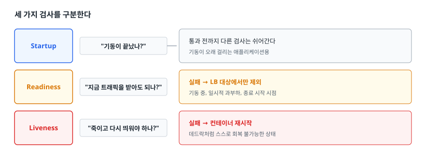

<!-- 위 그림이 대체한 원본 ASCII.
     내용을 고칠 때는 그림도 함께 갱신할 것.
```
   Startup   "기동이 끝났나?"          통과 전까지 다른 검사는 쉬어간다
                                      기동이 오래 걸리는 애플리케이션용
   Readiness "지금 트래픽을 받아도 되나?"  실패 → LB 대상에서만 제외
                                      기동 중, 일시적 과부하, 종료 시작 시점
   Liveness  "죽이고 다시 띄워야 하나?"   실패 → 컨테이너 재시작
                                      데드락처럼 스스로 회복 불가능한 상태
```
-->

Readiness와 Liveness를 같은 엔드포인트에 붙이는 실수가 매우 흔합니다. **일시적으로 느려졌을 때는 트래픽만 잠시 빼면 되는데, Liveness까지 실패하면 프로세스가 재시작됩니다.** 재시작하면 남은 인스턴스에 부하가 몰리고, 그쪽도 느려져서 또 재시작되고, 재시작 폭풍이 시작됩니다.

기준은 이렇습니다. **Liveness는 재시작해야만 고쳐지는 상태만 잡습니다.** 확신이 없으면 Liveness를 아예 걸지 않는 편이 낫습니다. 부하로 느려진 것은 재시작으로 고쳐지지 않습니다.

### 우아한 종료 설정 (Spring Boot)

```yaml
server:
  shutdown: graceful                      # SIGTERM 시 진행 중 요청을 마저 처리
spring:
  lifecycle:
    timeout-per-shutdown-phase: 30s       # 그 대기 상한
management:
  endpoint:
    health:
      probes:
        enabled: true                     # /actuator/health/readiness, /liveness 분리 노출
```

`server.shutdown: graceful`을 켜면 SIGTERM 수신 시 웹 서버가 새 연결 수락을 멈추고, 진행 중인 요청이 끝나기를 최대 `timeout-per-shutdown-phase`만큼 기다립니다. 이것만으로 **원인 1**이 해결됩니다. 하지만 **원인 2**는 여전히 남습니다. 로드 밸런서가 아직 모르기 때문입니다.

### 원인 2를 막는 대기 구간

```yaml
# 쿠버네티스 Deployment (핵심 부분만)
spec:
  template:
    spec:
      terminationGracePeriodSeconds: 60
      containers:
        - name: api
          readinessProbe:
            httpGet:
              path: /actuator/health/readiness
              port: 8080
            periodSeconds: 5
            failureThreshold: 2
          lifecycle:
            preStop:
              exec:
                command: ["sh", "-c", "sleep 15"]
```

`preStop` 훅은 **SIGTERM을 보내기 전에** 실행됩니다. 여기서 15초를 그냥 자는 것이 핵심 트릭입니다. 그동안 무슨 일이 일어나는지 보자.

<!-- diagram:sd-zero-downtime-deployment-8 -->
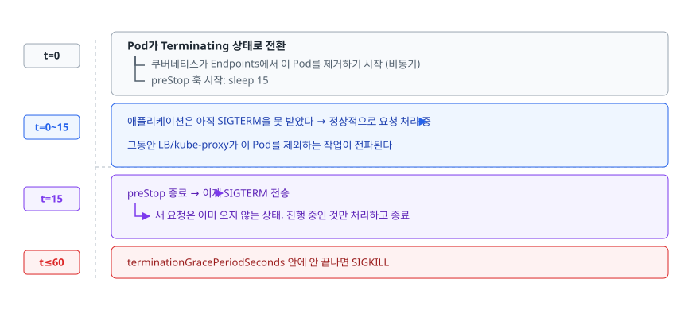

<!-- 위 그림이 대체한 원본 ASCII.
     내용을 고칠 때는 그림도 함께 갱신할 것.
```
   t=0    Pod가 Terminating 상태로 전환
          ├─ 쿠버네티스가 Endpoints에서 이 Pod를 제거하기 시작 (비동기)
          └─ preStop 훅 시작: sleep 15
   t=0~15 애플리케이션은 아직 SIGTERM을 못 받았다 → 정상적으로 요청 처리 중
          그동안 LB/kube-proxy가 이 Pod를 제외하는 작업이 전파된다
   t=15   preStop 종료 → 이제 SIGTERM 전송
          → 새 요청은 이미 오지 않는 상태. 진행 중인 것만 처리하고 종료
   t≤60   terminationGracePeriodSeconds 안에 안 끝나면 SIGKILL
```
-->

`sleep`이 어색해 보이지만 목적이 분명합니다. **"내가 빠졌다는 사실이 전파되는 시간"을 벌기 위해 일부러 아무것도 안 하는 것**입니다. 이 구간 없이 SIGTERM을 바로 받으면, 애플리케이션은 새 요청을 거부하는데 로드 밸런서는 계속 보내는 상태가 됩니다.

### 시간 예산을 계산한다

세 숫자는 부등식으로 묶여 있습니다.

<!-- diagram:sd-zero-downtime-deployment-9 -->
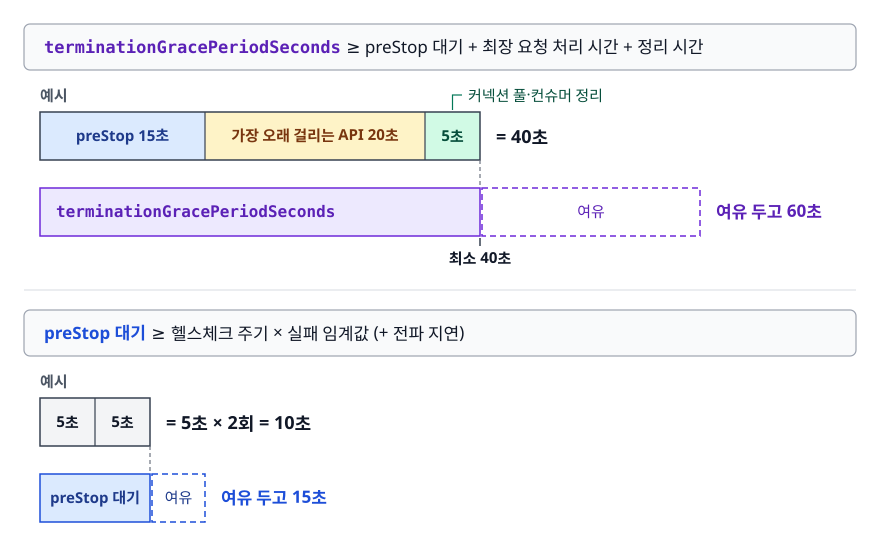

<!-- 위 그림이 대체한 원본 ASCII.
     내용을 고칠 때는 그림도 함께 갱신할 것.
```
   terminationGracePeriodSeconds  ≥  preStop 대기 + 최장 요청 처리 시간 + 정리 시간

   예시)  preStop 15초
        + 가장 오래 걸리는 API 20초
        + 커넥션 풀·컨슈머 정리 5초
        ─────────────────────────
        = 40초  →  terminationGracePeriodSeconds는 최소 40초, 여유 두고 60초

   preStop 대기 ≥ 헬스체크 주기 × 실패 임계값 (+ 전파 지연)
                = 5초 × 2회 = 10초  →  여유 두고 15초
```
-->

그리고 `spring.lifecycle.timeout-per-shutdown-phase`는 위 예산 안에 들어와야 합니다. 이 값이 유예 시간보다 크면 애플리케이션이 기다리는 도중에 SIGKILL을 맞습니다.

---

## 5. DB 마이그레이션이 무중단을 깨뜨리는 이유

### 비대칭이 문제의 뿌리

<!-- diagram:sd-zero-downtime-deployment-10 -->
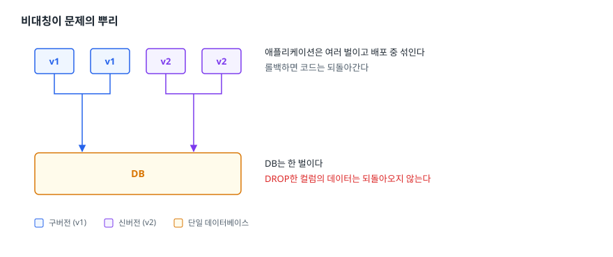

<!-- 위 그림이 대체한 원본 ASCII.
     내용을 고칠 때는 그림도 함께 갱신할 것.
```
   [v1] [v1] [v2] [v2]     애플리케이션은 여러 벌이고 배포 중 섞인다
     └────┬───┬────┘        롤백하면 코드는 되돌아간다
          ▼   ▼
     ┌──────────┐
     │    DB    │           DB는 한 벌이다
     └──────────┘           DROP한 컬럼의 데이터는 되돌아오지 않는다
```
-->

애플리케이션은 무상태라서 마음대로 늘리고 줄이고 되돌릴 수 있지만, 데이터는 그렇지 않습니다. 그래서 **DB 변경은 항상 "구버전 코드와 신버전 코드가 동시에 접근해도 둘 다 정상 동작하는" 중간 상태를 만들어야 합니다.**

### 안티패턴: 한 번의 배포로 끝내려 한다

```sql
-- 안티패턴 — 배포 직전에 실행하는 마이그레이션
ALTER TABLE users RENAME COLUMN phone TO phone_number;
```

**왜 문제인가**: 이 SQL이 실행된 순간, 아직 남아 있는 v1 인스턴스는 `phone` 컬럼을 찾다가 전부 실패합니다. 롤링 배포 중이라면 절반의 인스턴스가 즉시 죽습니다. 롤백하려고 v1으로 되돌리면 이번엔 v1 전체가 죽습니다. **롤백 경로 자체가 사라진 것**입니다.

JPA/Hibernate를 쓰면 피해 범위가 더 넓습니다. Hibernate는 엔티티에 매핑된 컬럼을 SELECT 절에 일일이 나열하므로, 그 필드를 전혀 읽지 않는 기능이어도 매핑만 남아 있으면 해당 엔티티를 조회하는 쿼리가 통째로 실패합니다.

### 개선: 확장-수축 패턴 (Expand and Contract)

한 번에 바꾸지 않고, **호환을 유지하는 확장 단계**와 **정리하는 수축 단계**를 서로 다른 배포로 나눕니다.

<!-- diagram:sd-zero-downtime-deployment-11 -->
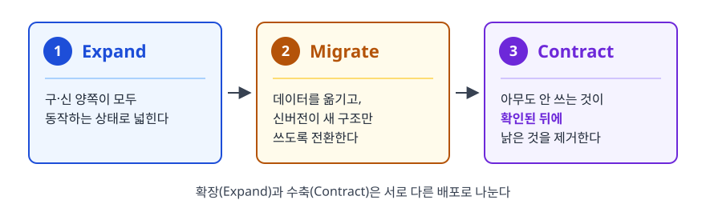

<!-- 위 그림이 대체한 원본 ASCII.
     내용을 고칠 때는 그림도 함께 갱신할 것.
```
   [Expand]  구·신 양쪽이 모두 동작하는 상태로 넓힌다
      │
      ▼
   [Migrate] 데이터를 옮기고, 신버전이 새 구조만 쓰도록 전환한다
      │
      ▼
   [Contract] 아무도 안 쓰는 것이 확인된 뒤에 낡은 것을 제거한다
```
-->

**컬럼 추가** — 가장 쉽습니다.

1. `NULL` 허용 또는 기본값이 있는 컬럼을 추가합니다. (v1은 이 컬럼을 모르지만 아무 영향 없다)
2. 신버전 코드를 배포합니다. 새 컬럼에 값을 씁니다.
3. 기존 행에 값이 필요하면 배치로 백필합니다.
4. 모두 채워진 뒤 `NOT NULL` 제약을 거는 마이그레이션을 별도로 합니다. 기본값 없이 처음부터 `NOT NULL`로 추가하면, 그 컬럼의 존재를 모르는 v1이 INSERT할 때 값을 채우지 못해 실패합니다. 1번과 4번을 나누는 이유입니다.

**컬럼 삭제** — 순서를 뒤집습니다.

1. 신버전 코드를 배포해 **컬럼에 대한 읽기·쓰기·매핑을 모두 제거**합니다. 컬럼 자체는 그대로 둡니다.
2. 모든 인스턴스가 신버전이 되고, 롤백 가능성이 사라질 만큼 안정화될 때까지 기다립니다. (보통 며칠)
3. 별도 배포로 `DROP COLUMN`을 실행합니다.

**컬럼 이름/타입 변경** — 사실상 "추가 후 삭제"다.

<!-- diagram:sd-zero-downtime-deployment-12 -->
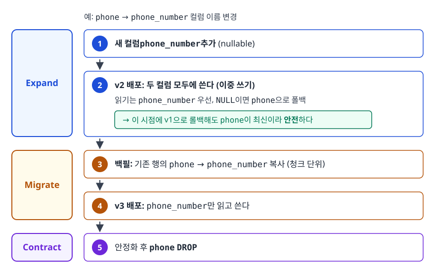

<!-- 위 그림이 대체한 원본 ASCII.
     내용을 고칠 때는 그림도 함께 갱신할 것.
```
   1. 새 컬럼 phone_number 추가 (nullable)
   2. v2 배포: 두 컬럼 모두에 쓴다(이중 쓰기).
      읽기는 phone_number 우선, NULL이면 phone으로 폴백
      → 이 시점에 v1으로 롤백해도 phone이 최신이라 안전하다
   3. 백필: 기존 행의 phone → phone_number 복사 (청크 단위)
   4. v3 배포: phone_number만 읽고 쓴다
   5. 안정화 후 phone DROP
```
-->

배포가 세 번, 마이그레이션이 세 번입니다. 번거롭지만 **어느 단계에서 멈춰도 서비스가 살아 있고 롤백이 가능합니다.** 무중단의 값입니다.

### 큰 테이블에서 추가로 조심할 것

행이 수천만 개인 테이블은 `ALTER TABLE` 자체가 사고를 냅니다. 스키마 변경 중 테이블 락이 걸리면 그 시간 동안 모든 쿼리가 대기하고, 애플리케이션 커넥션 풀이 순식간에 고갈됩니다. 배포는 무중단인데 DB 때문에 서비스가 멈추는 것입니다.

- MySQL: `pt-online-schema-change`(Percona Toolkit)나 `gh-ost` 같은 온라인 스키마 변경 도구를 씁니다. 원본과 같은 구조의 새 테이블을 만들어 데이터를 복사하면서 변경분을 따라잡은 뒤 이름을 바꿔치기하는 방식이라 긴 락이 걸리지 않습니다.
- PostgreSQL: 인덱스는 `CREATE INDEX CONCURRENTLY`로 만듭니다. 일반 `CREATE INDEX`는 쓰기를 막습니다.
- 백필도 마찬가지입니다. `UPDATE users SET phone_number = phone`을 한 문장으로 실행하면 수천만 행을 한 트랜잭션에 묶어 락과 복제 지연을 만듭니다. 기본 키 범위로 잘라 청크 단위로 돌리고 사이에 간격을 둡니다.

---

## 6. 실무에서는

- **마이그레이션은 애플리케이션 배포와 분리해서, 먼저 실행합니다.** Flyway나 Liquibase를 애플리케이션 기동 시점에 자동 실행하도록 두면, 롤링 배포 중 여러 인스턴스가 동시에 마이그레이션을 시도하거나, 새 컬럼이 없는 상태에서 신버전이 뜨는 순서 문제가 생깁니다. CI/CD 파이프라인에서 별도 단계로 빼는 편이 안전합니다.
- **배포와 릴리스를 분리하면 훨씬 편해집니다.** 기능을 피처 플래그로 감싸 배포는 하되 끄고 나가면, 새 코드는 이미 운영에 올라가 있고 켜는 시점만 결정하면 됩니다. 문제가 생겨도 롤백이 아니라 플래그를 끄는 것으로 끝납니다. 배포와 달리 되돌리는 데 몇 초면 됩니다.
- **롤백 훈련을 해둡니다.** 롤백 절차를 문서로만 가지고 있으면 실제 상황에서 작동하지 않습니다. `kubectl rollout undo`가 실제로 동작하는지, 이전 버전 이미지가 레지스트리에 남아 있는지, 마이그레이션이 비가역이라 롤백이 불가능한 구간은 어디인지 미리 확인해둡니다. 그리고 배포 직후가 가장 위험한 시간이므로, 에러율과 P99 지연을 배포 전후로 비교하는 대시보드를 만들어두고 일정 시간은 지켜봅니다.

---

## 7. 면접 포인트

> 면접에서 이 주제가 나오면 이렇게 답한다

**Q. 무중단 배포 전략을 설명해주세요.**
A. Rolling은 인스턴스를 순차 교체하는 방식으로 추가 인프라가 거의 없지만 롤백이 느리고 배포 중 두 버전이 공존합니다. Blue-Green은 동일한 환경 두 벌을 두고 트래픽을 한 번에 전환하는 방식이라 롤백이 초 단위로 끝나지만 인프라가 두 배 듭니다. Canary는 일부 트래픽만 신버전에 보내 메트릭을 비교하며 점진 확대하는 방식으로 위험이 가장 작지만 트래픽 제어와 관측 체계가 필요합니다. Recreate는 무중단은 아니지만 두 버전이 공존하면 안 되는 경우에 선택합니다. 실무에서는 Blue-Green 환경을 만들고 전환을 카나리처럼 단계적으로 하는 조합도 씁니다.
- 꼬리 질문: "그럼 어떤 걸 쓰셨나요?" → 서비스 성격과 팀 상황을 근거로 듭니다. "인프라 비용 제약이 있어 Rolling을 쓰되 `maxUnavailable: 0`으로 용량이 줄지 않게 했다"처럼 구체적인 설정까지 말하는 편이 좋습니다.

**Q. 롤링 업데이트로 설정했는데 배포할 때마다 502가 나옵니다. 왜일까요?**
A. 전략 설정과 무관한 문제일 가능성이 높습니다. 원인은 크게 셋입니다. 첫째, 우아한 종료가 없어서 처리 중이던 요청이 프로세스와 함께 잘리는 경우. 둘째, 애플리케이션은 종료를 시작했는데 로드 밸런서가 헬스체크 주기만큼 그 사실을 늦게 알아 그 사이 요청을 계속 보내는 경우. 셋째, 백엔드의 keep-alive 타임아웃이 로드 밸런서의 유휴 타임아웃보다 짧아서, 서버가 닫는 중인 커넥션에 로드 밸런서가 요청을 쓰는 경쟁 상태입니다. 두 번째가 가장 흔한데, preStop 훅에서 로드 밸런서 반영 시간만큼 기다린 뒤 종료 신호를 받게 하면 해결됩니다.
- 꼬리 질문: "preStop에서 왜 그냥 sleep을 하나요?" → 애플리케이션이 할 일이 있어서가 아니라, "내가 대상 목록에서 빠졌다"는 사실이 전파되는 시간을 벌기 위해 일부러 아무 일도 하지 않는 것입니다.

**Q. 준비 상태 검사와 생존 검사의 차이는요?**
A. 준비 상태 검사는 "지금 트래픽을 받아도 되나"를 묻고, 실패하면 로드 밸런서 대상에서만 빠집니다. 생존 검사는 "이 프로세스를 재시작해야 하나"를 묻고, 실패하면 컨테이너가 재시작됩니다. 둘을 같은 엔드포인트로 묶으면 일시적 과부하로 느려졌을 때 재시작까지 일어나고, 남은 인스턴스에 부하가 몰려 연쇄 재시작으로 번집니다. 생존 검사는 재시작해야만 회복되는 상태에만 걸고, 애매하면 아예 걸지 않는 편이 안전합니다.
- 꼬리 질문: "기동이 오래 걸리는 앱은요?" → startup 검사를 따로 두어, 기동이 끝날 때까지 생존 검사가 개입하지 않게 합니다.

**Q. DB 스키마를 바꿔야 하는데 무중단으로 하려면요?**
A. 확장-수축 패턴으로 여러 배포에 나눕니다. 애플리케이션은 여러 벌이라 배포 중 버전이 섞이지만 DB는 한 벌이므로, 구버전과 신버전이 동시에 접근해도 둘 다 동작하는 중간 상태를 반드시 거쳐야 합니다. 컬럼 삭제라면 먼저 코드에서 그 컬럼 의존을 모두 없앤 버전을 배포하고, 안정화를 확인한 뒤 별도 배포로 DROP합니다. 이름이나 타입 변경은 새 컬럼 추가 → 이중 쓰기 → 백필 → 신 컬럼만 사용 → 구 컬럼 제거 순으로 진행합니다.
- 꼬리 질문: "그냥 RENAME 한 번이면 되는데 왜 그렇게 하나요?" → RENAME 하는 순간 아직 남은 구버전 인스턴스가 전부 깨지고, 롤백해도 마찬가지라 되돌릴 길이 사라집니다. 각 단계가 독립적으로 롤백 가능해야 합니다.

---

## 자주 하는 실수

| 실수 | 왜 틀렸나 | 올바른 이해 |
|------|----------|-----------|
| "롤링 업데이트를 켰으니 무중단이다" | 전략은 교체 순서만 정합니다. 교체되는 서버의 처리 중인 요청은 여전히 잘린다 | 우아한 종료 + 종료 전 대기 구간이 있어야 실제로 무중단이 된다 |
| "우아한 종료만 켜면 502가 없어진다" | 애플리케이션이 새 요청을 거부해도 LB는 헬스체크 주기만큼 계속 보낸다 | 종료를 시작하기 **전에** 대상 목록에서 빠지고, 반영 시간만큼 기다린다 |
| "Blue-Green은 전환하면 즉시 Blue를 내려도 된다" | Blue에서 처리 중이던 요청이 남아 있다 | 드레이닝이 끝날 때까지 Blue를 살려둔다 |
| "카나리는 시간만 충분히 관찰하면 된다" | 낮은 트래픽 비율에서는 시간이 지나도 표본 수가 부족하다 | 관찰 기준은 시간이 아니라 요청 수·이벤트 수로 잡는다 |
| "마이그레이션과 배포를 한 번에 하면 빠르다" | 구버전이 남아 있는 동안 스키마가 바뀌면 그 인스턴스들이 즉시 깨지고, 롤백 경로도 사라진다 | 확장·수축을 서로 다른 배포로 나눈다 |
| "생존 검사를 촘촘히 걸면 안정적이다" | 부하로 느려진 것은 재시작해도 회복되지 않고, 재시작이 남은 인스턴스 부하를 키워 폭풍이 된다 | 생존 검사는 재시작으로만 고쳐지는 상태에 한정한다 |

---

## 한 줄 정리

무중단 배포는 배포 전략을 고르는 문제가 아니라, **종료하는 서버가 로드 밸런서에서 먼저 빠지고 진행 중인 요청을 마저 처리한 뒤 죽도록 순서를 맞추는 문제**이며, DB가 한 벌이라는 사실 때문에 스키마 변경은 반드시 여러 배포로 쪼개야 합니다.

---

## 연관 개념

- [01-load-balancer.md](./01-load-balancer.md) - 헬스체크 주기·임계값이 종료 대기 시간을 결정하는 이유
- [03-high-traffic.md](./03-high-traffic.md) - 배포 중 용량이 줄어도 버티려면 앞단에 무엇이 있어야 하는가
- [qna-infrastructure.md](./qna-infrastructure.md) - 무중단 배포 관련 면접 질문(Q2)
- [../10-cloud-engineering/devops-cicd/03-deployment-strategies.md](../10-cloud-engineering/devops-cicd/03-deployment-strategies.md) - 배포 전략을 CI/CD 파이프라인 관점에서 확장
- [../10-cloud-engineering/kubernetes/02-deployment-management.md](../10-cloud-engineering/kubernetes/02-deployment-management.md) - Deployment와 ReplicaSet이 롤링 업데이트를 수행하는 내부 동작
