# 대용량 트래픽 대응 (High Traffic)

> 이 문서는 평균이 아니라 순간 최대치를 다룹니다. 평소의 100배가 10분 동안 몰릴 때 어느 층부터 무너지는지, 왜 앞단을 고치면 병목이 아래로 내려가는지, 그리고 "다 막았는데도 넘칠 때" 무엇을 하는지를 설명합니다.

## 학습 목표

- [ ] 트래픽 방어를 계층 순서로 설계할 수 있다
- [ ] 앞단을 개선하면 병목이 아래 계층으로 이동하는 현상을 예측할 수 있다
- [ ] 큐로 뺄 수 있는 작업과 없는 작업을 기준을 갖고 구분할 수 있다
- [ ] 타임아웃·재시도·서킷 브레이커·벌크헤드가 각각 무엇을 막는지 구분할 수 있다
- [ ] 오토스케일링이 왜 늦는지 시간 단위로 분해할 수 있다
- [ ] 티켓팅 같은 스파이크 시나리오의 방어 구조를 설계해 말할 수 있다

## 선행 지식

- [01-load-balancer.md](./01-load-balancer.md) - 트래픽을 나누는 계층
- 캐시와 DB 커넥션 풀의 존재를 아는 정도면 됩니다

---

## 1. 문제는 총량이 아니라 기울기다

하루 100만 요청은 평균 초당 12건이고 서버 한 대로 충분합니다. 그런데 그 100만 건 중 30만 건이 티켓 오픈 첫 1분에 몰리면 초당 5,000건이 됩니다. 이건 완전히 다른 시스템입니다. 대용량 트래픽 문제의 본질은 **평균이 아니라 순간 최대치**입니다. 게다가 그 최대치는 서서히 오르지 않고 **계단처럼 튑니다**.

<!-- diagram:sd-high-traffic-1 -->
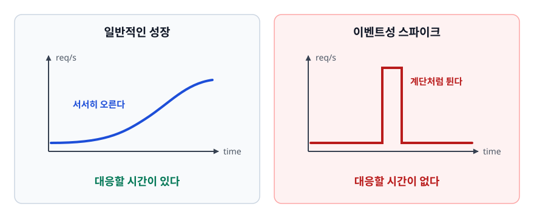

<!-- 위 그림이 대체한 원본 ASCII.
     내용을 고칠 때는 그림도 함께 갱신할 것.
```
   [일반적인 성장]              [이벤트성 스파이크]
   req/s                        req/s
     │        ___/‾‾            │         ┌─┐
     │ ___/‾                    │_________┘ └________
     └──────────────▶ time      └──────────────▶ time
     대응할 시간이 있다           대응할 시간이 없다
```
-->

오른쪽에서는 오토스케일링이 "부하가 높다"고 판단할 무렵 이미 시스템이 무너져 있습니다. 부하가 온 다음에 늘리는 방식으로는 따라잡지 못합니다. 그래서 대용량 트래픽 대응은 **도달하기 전에 걸러내고, 도달한 부하를 평탄하게 펴고, 그래도 넘치면 우아하게 거절하는 기술**입니다.

### 비유: 공연장 입장

5,000명이 몰려도 안전한 이유는 좌석이 5,000개라서가 아닙니다. 광장에서 줄을 세우고(대기열), 예매 확인을 입구 밖에서 하고(앞단 검증), 매표소를 여러 창구로 나눴기(수평 확장) 때문입니다. 정문 하나로 전부 통과시키려 하면 사고가 납니다.

> **비유의 한계**: 사람은 밀리면 알아서 멈춥니다. 클라이언트는 실패하면 **더 세게 재시도합니다.** 느려질수록 부하가 커지는 양의 되먹임이 생긴다는 점이 결정적으로 다릅니다.

---

## 2. 계층별 방어 — 가장 싼 요청은 도달하지 않은 요청

<!-- diagram:sd-high-traffic -->
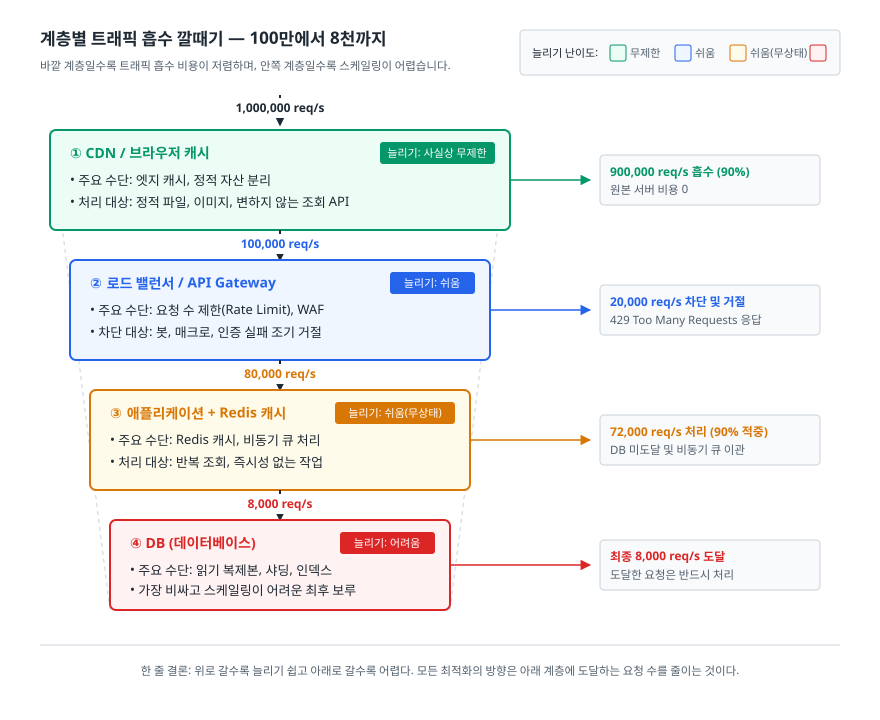

안쪽으로 갈수록 요청 하나의 비용이 비싸집니다. 그래서 방어는 바깥에서 안쪽 순서로 설계합니다.

```
   1,000,000 req/s
        │
   ┌────▼──────────────────────────────────────────┐
   │ ① CDN / 브라우저 캐시                          │
   │    정적 파일, 이미지, 캐시 가능한 API 응답      │
   │    여기서 끝난 요청은 원본 서버 비용이 0        │
   └────┬──────────────────────────────────────────┘
        │ 100,000 req/s   (90% 흡수)
   ┌────▼──────────────────────────────────────────┐
   │ ② 로드 밸런서 / API Gateway                    │
   │    요청 수 제한, 봇 차단, 인증 실패 조기 거절   │
   └────┬──────────────────────────────────────────┘
        │ 80,000 req/s
   ┌────▼──────────────────────────────────────────┐
   │ ③ 애플리케이션 + Redis 캐시                    │
   │    캐시 적중이면 DB에 가지 않는다               │
   │    무거운 작업은 큐로 넘긴다                    │
   └────┬──────────────────────────────────────────┘
        │ 8,000 req/s    (캐시 적중률 90% 가정)
   ┌────▼──────────────────────────────────────────┐
   │ ④ DB — 가장 비싸고 가장 늘리기 어렵다           │
   └───────────────────────────────────────────────┘
```

| 계층 | 주요 수단 | 흡수 대상 | 늘리기 |
|------|----------|----------|--------|
| CDN | 엣지 캐시, 정적 자산 분리 | 이미지·JS·CSS, 변하지 않는 조회 API | 사실상 무제한 |
| LB / Gateway | 요청 수 제한, WAF, 조기 인증 실패 | 봇, 매크로, 잘못된 요청 | 쉬움 |
| 애플리케이션 | 캐시, 비동기화, 무상태 설계 | 반복 조회, 즉시성 없는 작업 | 쉬움 (무상태라면) |
| DB | 읽기 복제본, 샤딩, 인덱스 | 여기까지 온 것은 다 처리해야 한다 | 어려움 |

> 한 줄 결론: **위로 갈수록 늘리기 쉽고 아래로 갈수록 어렵습니다.** 모든 최적화는 아래 계층에 도달하는 요청 수를 줄이는 방향으로 갑니다.

② 계층의 **요청 수 제한(rate limiting)** 은 여기서 특히 값을 합니다. 클라이언트 하나가 일정 시간에 보낼 수 있는 요청 수를 정해두고 초과분은 `429 Too Many Requests`로 즉시 돌려보내면, 매크로 한 대가 전체 용량을 다 차지하는 상황을 애플리케이션에 도달하기 전에 끊을 수 있습니다. 응답에 `Retry-After`를 실어 언제 다시 오면 되는지 알려주면 거절당한 클라이언트가 곧바로 다시 때리는 이차 부하도 줄어듭니다. 창 방식·토큰 버킷 같은 알고리즘과 Redis 구현은 [caching/02-redis-cdn.md](./caching/02-redis-cdn.md)의 3절에서 다룹니다.

---

## 3. 병목은 사라지지 않고 아래로 내려간다

앞단을 개선하면 문제가 해결된 것처럼 보이다가 **더 깊은 곳에서 더 나쁜 형태로** 다시 나타납니다.

<!-- diagram:sd-high-traffic-2 -->
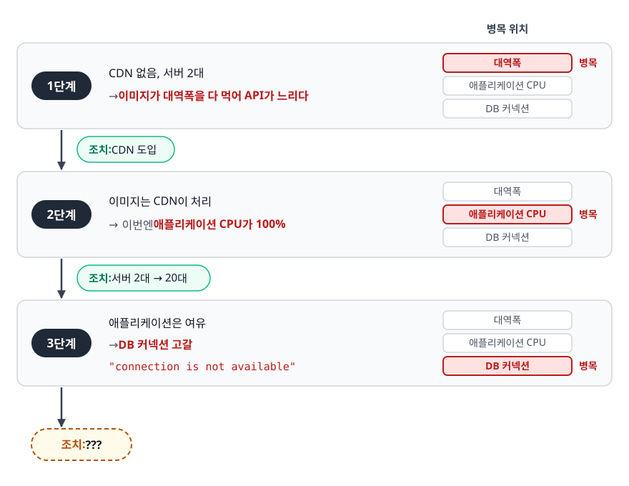

<!-- 위 그림이 대체한 원본 ASCII.
     내용을 고칠 때는 그림도 함께 갱신할 것.
```
   [1단계] CDN 없음, 서버 2대 → 이미지가 대역폭을 다 먹어 API가 느리다
           조치: CDN 도입
              ↓
   [2단계] 이미지는 CDN이 처리 → 이번엔 애플리케이션 CPU가 100%
           조치: 서버 2대 → 20대
              ↓
   [3단계] 애플리케이션은 여유 → DB 커넥션 고갈, "connection is not available"
           조치: ???
```
-->

문제는 3단계에서 터집니다. 서버를 늘렸는데 왜 DB가 죽었을까요?

<!-- diagram:sd-high-traffic-3 -->
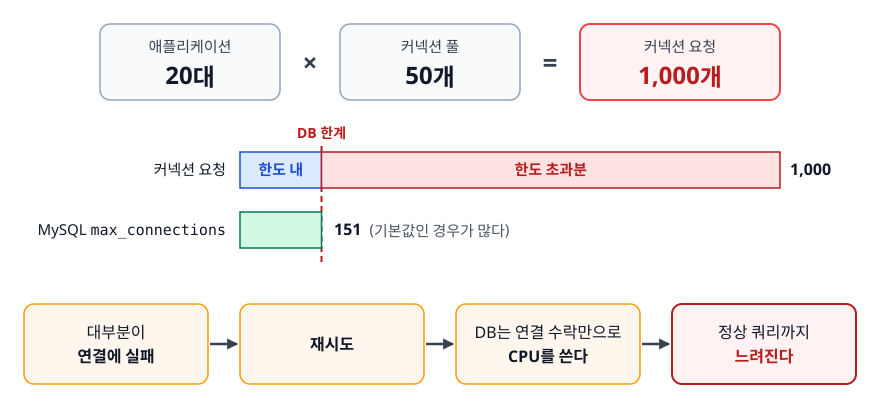

<!-- 위 그림이 대체한 원본 ASCII.
     내용을 고칠 때는 그림도 함께 갱신할 것.
```
   애플리케이션 20대 × 커넥션 풀 50개 = 1,000개 커넥션 요청
   MySQL max_connections = 151 (기본값인 경우가 많다)
   → 대부분이 연결에 실패 → 재시도 → DB는 연결 수락만으로 CPU를 쓴다
   → 정상 쿼리까지 느려진다
```
-->

**애플리케이션 서버를 늘리면 DB 입장에서는 부하가 늘어납니다.** 무상태 계층은 늘리기 쉽습니다. 하지만 그 뒤에서 상태를 가진 계층은 같이 늘어나지 않습니다.

### 안티패턴: 부하가 오면 일단 서버를 늘린다

```yaml
# 안티패턴 — 커넥션 풀은 그대로 두고 인스턴스만 20배
replicas: 20                  # Deployment 매니페스트
---
spring:                       # application.yml
  datasource:
    hikari:
      maximum-pool-size: 50   # 대당 50개. 총 1,000개
```

**왜 문제인가**: 커넥션 풀은 대당 설정이지만 DB의 최대 연결 수는 전체 합에 걸립니다. 인스턴스를 늘리는 순간 이 곱셈이 DB 한계를 넘습니다. 늘렸기 때문에 오히려 전체가 죽습니다. 게다가 DB 커넥션은 많다고 빨라지지 않습니다. 동시에 쿼리를 처리하는 능력은 DB의 코어 수와 디스크에 묶여 있습니다. 커넥션만 늘리면 컨텍스트 스위칭과 락 경합만 늘어납니다.

```yaml
# 개선 — 전체 합이 DB 한계 안에 들어오게 하고, 못 얻으면 빨리 실패시킨다
replicas: 20                  # Deployment 매니페스트
---
spring:                       # application.yml
  datasource:
    hikari:
      maximum-pool-size: 5      # 20 × 5 = 100 < max_connections
      connection-timeout: 3000  # 3초 안에 못 얻으면 실패
```

구조적으로는 읽기를 Redis 캐시로 흡수하고(적중률 90%면 DB 부하가 1/10), 조회는 읽기 복제본으로 분리하고, 즉시성 없는 쓰기는 큐로 뺍니다. 그리고 `connection-timeout`을 짧게 두는 것이 중요합니다. 풀이 고갈됐을 때 30초씩 기다리면 그 스레드는 30초 동안 묶이고, 요청이 쌓여 애플리케이션까지 함께 죽습니다. **오래 기다리느니 빨리 실패하는 편이 낫습니다.**

---

## 4. 큐로 부하를 평탄화한다

<!-- diagram:sd-high-traffic-4 -->
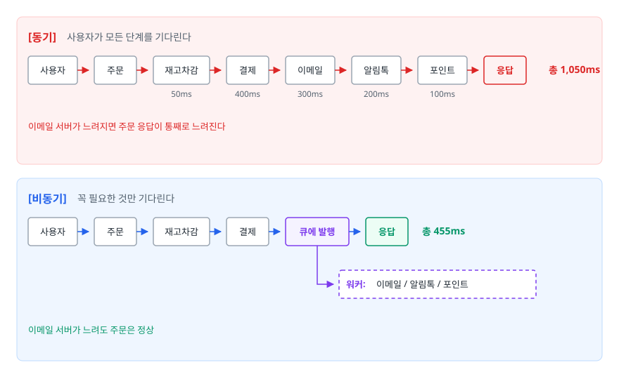

<!-- 위 그림이 대체한 원본 ASCII.
     내용을 고칠 때는 그림도 함께 갱신할 것.
```
   [동기]  사용자가 모든 단계를 기다린다
   주문 ─▶ 재고차감 ─▶ 결제 ─▶ 이메일 ─▶ 알림톡 ─▶ 포인트 ─▶ 응답
           50ms      400ms   300ms    200ms     100ms       총 1,050ms
   이메일 서버가 느려지면 주문 응답이 통째로 느려진다

   [비동기]  꼭 필요한 것만 기다린다
   주문 ─▶ 재고차감 ─▶ 결제 ─▶ 큐에 발행 ─▶ 응답       총 455ms
                                 └─▶ 워커: 이메일 / 알림톡 / 포인트
   이메일 서버가 느려도 주문은 정상
```
-->

빨라진 응답만 이득이 아닙니다. **버퍼 효과**가 더 중요합니다.

```
   초당 5,000건이 몰리는데 워커 처리 능력이 초당 500건이라면
   [큐 없음]  5,000건이 동시에 DB로 → 커넥션 고갈 → 전부 실패
   [큐 있음]  큐에 쌓임 → 초당 500건씩 소화 → 응답은 즉시, 처리는 10초에 걸쳐 완료
```

큐는 **처리 능력을 늘리지 않습니다.** 넘치는 부하를 시간축으로 펴서 처리 능력 안에 들어오게 할 뿐입니다. 이것이 부하 평탄화(load leveling)입니다.

### 무엇을 뺄 수 있나

뺄 수 있는지는 하나로 갈립니다. **사용자가 응답을 받는 시점에 그 결과를 알아야 하는가.**

| 뺄 수 있다 | 뺄 수 없다 |
|-----------|-----------|
| 이메일·푸시·알림톡 발송 | 재고 차감 (없으면 주문이 성립 안 함) |
| 포인트 적립, 통계 집계 | 결제 승인 (성공 여부를 즉시 알려야 함) |
| 이미지 리사이징, 검색 색인 갱신 | 로그인 인증, 잔액 확인 |
| 영수증 PDF 생성 | 좌석 선점 (중복을 막아야 함) |

### 따라오는 숙제

- **중복 처리**: 대부분의 큐는 최소 한 번 전달(at-least-once)을 보장합니다. 같은 메시지가 두 번 올 수 있으므로 컨슈머는 **멱등성(idempotency)** 을 갖춰야 합니다. 메시지 ID를 유니크 키로 기록하거나 UPSERT를 씁니다. 이걸 안 하면 포인트가 두 번 적립됩니다.
- **처리 불가 메시지**: 절대 성공하지 못하는 메시지가 무한 재시도되면 컨슈머가 마비됩니다. 재시도 횟수를 제한하고 초과분은 **DLQ(Dead Letter Queue)** 로 보냅니다.
- **"DB 저장 + 메시지 발행"의 원자성**: 커밋은 됐는데 발행 직전에 죽으면 이벤트가 유실됩니다. **Outbox 패턴**이 표준 해법입니다. DB 트랜잭션 안에서 outbox 테이블에 함께 저장하고 발행은 별도 프로세스가 맡습니다.
- **백로그는 장애 신호다**: 큐 깊이가 계속 늘면 워커가 유입을 못 따라간다는 뜻입니다. 큐 깊이와 소비 지연에 반드시 알람을 겁니다. 큐가 있으니 안전하다고 방치하면 어느 순간 몇 시간짜리 백로그를 발견하게 됩니다.

---

## 5. 장애가 번지지 않게 — 네 가지 장치

분산 시스템에서는 하나가 죽는 고장보다 **하나가 느려져서 전부가 죽는 고장**이 무섭습니다.

<!-- diagram:sd-high-traffic-5 -->
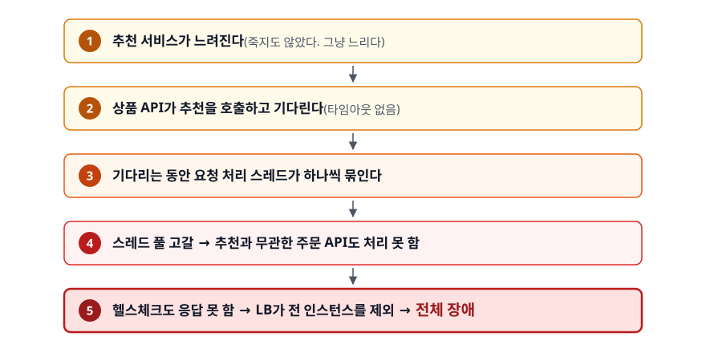

<!-- 위 그림이 대체한 원본 ASCII.
     내용을 고칠 때는 그림도 함께 갱신할 것.
```
   추천 서비스가 느려진다 (죽지도 않았다. 그냥 느리다)
        ▼
   상품 API가 추천을 호출하고 기다린다 (타임아웃 없음)
        ▼
   기다리는 동안 요청 처리 스레드가 하나씩 묶인다
        ▼
   스레드 풀 고갈 → 추천과 무관한 주문 API도 처리 못 함
        ▼
   헬스체크도 응답 못 함 → LB가 전 인스턴스를 제외 → 전체 장애
```
-->

부가 기능 하나가 느려졌을 뿐인데 서비스 전체가 죽었습니다. 이것이 연쇄 장애(cascading failure)입니다. 막는 장치가 넷인데 **순서가 있습니다.**

### ① 타임아웃 — 나머지 셋의 전제

타임아웃이 없으면 서킷 브레이커도 벌크헤드도 의미가 없습니다. 응답이 영원히 안 오는 호출은 실패로 집계되지도 않기 때문입니다. **모든 외부 호출에 연결·읽기 타임아웃을 명시적으로 겁니다.** 기본값이 무한대인 클라이언트가 아직도 많습니다.

값은 통계로 정합니다. 정상일 때의 P99를 재고 그 두세 배로 잡습니다. P99가 200ms인 API에 타임아웃 10초를 걸면 사실상 타임아웃이 없는 셈입니다.

### ② 재시도 — 잘못 쓰면 공격이 된다

```java
// 안티패턴 — 즉시 재시도
for (int i = 0; i < 3; i++) {
    try { return client.call(); } catch (Exception e) { /* 곧바로 다시 */ }
}
```

**왜 문제인가**: 서버가 과부하로 느려졌을 때 모든 클라이언트가 동시에 3배로 요청을 보냅니다. 회복하려는 서버에 부하가 3배로 들어가 회복을 막습니다. 게다가 장애 시점에 모두가 동시에 실패했으므로 재시도 시각도 같이 몰립니다(thundering herd).

```java
// 개선 — 지수 백오프 + 지터(full jitter). 이 메서드는 InterruptedException을 던진다고 선언한다
int base = 100, cap = 2000;   // ms
for (int attempt = 0; attempt < 3; attempt++) {
    try { return client.call(); }
    catch (TransientException e) {
        if (attempt == 2) throw e;
        long ceiling = Math.min(cap, base * (1L << attempt));   // 100, 200, 400
        Thread.sleep(ThreadLocalRandom.current().nextLong(ceiling + 1));
    }
}
```

- **지수 백오프**: 간격을 100 → 200 → 400ms로 늘려 서버에 회복할 틈을 줍니다.
- **지터**: 그 간격 안에서 무작위로 고릅니다. 없으면 1,000개 클라이언트가 정확히 100ms 뒤에 동시에 재시도해 두 번째 파도를 만듭니다.

그리고 **재시도해도 되는 것만 재시도합니다.** 타임아웃이 났다고 요청이 서버에 도달하지 않았다는 보장은 없습니다. 결제 승인은 처리됐는데 응답만 유실됐다면 재시도는 이중 결제입니다. 재시도하려면 요청에 멱등성 키를 실어 서버가 중복을 판별할 수 있어야 합니다.

### ③ 서킷 브레이커 — 아예 시도하지 않는다

<!-- diagram:sd-high-traffic-6 -->
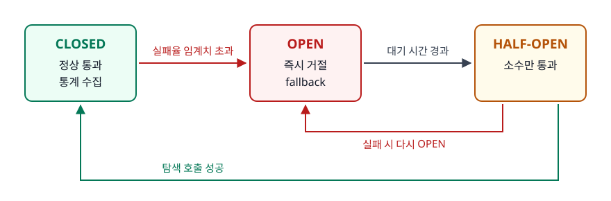

<!-- 위 그림이 대체한 원본 ASCII.
     내용을 고칠 때는 그림도 함께 갱신할 것.
```
   ┌──────────┐  실패율 임계치 초과   ┌──────────┐
   │  CLOSED  │ ────────────────────▶│   OPEN   │
   │ 정상 통과 │                      │ 즉시 거절 │
   │ 통계 수집 │                      │ fallback │
   └──────────┘                      └────┬─────┘
        ▲                                 │ 대기 시간 경과
        │        탐색 호출 성공       ┌────▼──────┐
        └────────────────────────────│ HALF-OPEN │
                                     │ 소수만 통과│──┐ 실패
                                     └───────────┘  └─▶ 다시 OPEN
```
-->

OPEN의 의미부터 봅니다. **실패할 것이 뻔한 호출을 하지 않고 즉시 대체 응답을 줍니다.** 호출자는 타임아웃만큼 기다리지 않아도 되고, 피호출자는 부하가 빠져 회복할 시간을 얻습니다.

```yaml
resilience4j:
  circuitbreaker:
    instances:
      recommendation:
        sliding-window-type: TIME_BASED
        sliding-window-size: 60               # 최근 60초를 본다
        minimum-number-of-calls: 20           # 표본 20건 미만이면 판단하지 않는다
        failure-rate-threshold: 50            # 실패율이 50% 이상이면 OPEN
        slow-call-duration-threshold: 2s      # 2초 넘으면 느린 호출로 집계
        slow-call-rate-threshold: 50
        wait-duration-in-open-state: 30s
        permitted-number-of-calls-in-half-open-state: 5
```

`minimum-number-of-calls`는 표본이 적을 때의 오판을 막습니다. 2건 중 1건 실패했다고 회로를 열면 안 됩니다. `slow-call` 설정은 특히 중요한데, **느린 응답은 실패로 잡히지 않지만 실질적으로 더 나쁩니다.** 실패는 스레드를 즉시 돌려주지만 느린 응답은 계속 묶어두기 때문입니다.

회로가 열렸을 때 무엇을 반환할지(fallback)가 설계의 절반입니다. 추천이 죽으면 인기 상품 목록을 대신 내보내고 리뷰가 죽으면 캐시된 평균 별점만 보여줍니다. **핵심 흐름(조회 → 장바구니 → 결제)은 살리고 부가 흐름만 줄이는 방식**이 우아한 성능 저하(graceful degradation)입니다.

### ④ 벌크헤드 — 자원을 칸으로 나눈다

<!-- diagram:sd-high-traffic-7 -->
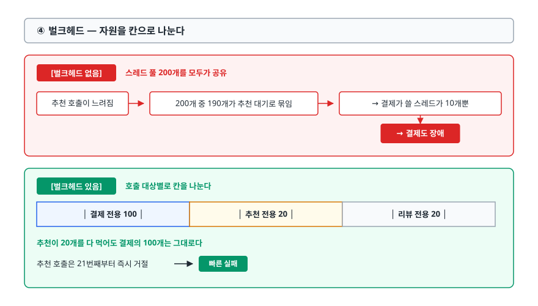

<!-- 위 그림이 대체한 원본 ASCII.
     내용을 고칠 때는 그림도 함께 갱신할 것.
```
   [벌크헤드 없음]  스레드 풀 200개를 모두가 공유
   추천 호출이 느려짐 → 200개 중 190개가 추천 대기로 묶임
   → 결제가 쓸 스레드가 10개뿐 → 결제도 장애

   [벌크헤드 있음]  호출 대상별로 칸을 나눈다
   ┌──────────────┬──────────────┬──────────────┐
   │ 결제 전용 100 │ 추천 전용 20  │ 리뷰 전용 20  │
   └──────────────┴──────────────┴──────────────┘
   추천이 20개를 다 먹어도 결제의 100개는 그대로다
   추천 호출은 21번째부터 즉시 거절 → 빠른 실패
```
-->

서킷 브레이커가 "시간이 지나면 차단"이라면 벌크헤드는 "처음부터 격리"입니다. 둘은 대체 관계가 아닙니다. 함께 씁니다.

---

## 6. 오토스케일링은 항상 늦는다

"부하가 늘면 자동으로 서버가 늘어난다"가 스파이크에서 통하지 않는 이유를 시간으로 분해해 봅니다.

<!-- diagram:sd-high-traffic-8 -->
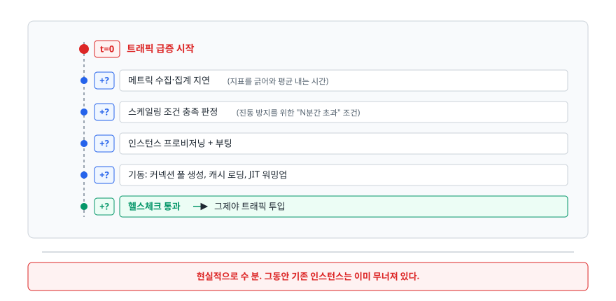

<!-- 위 그림이 대체한 원본 ASCII.
     내용을 고칠 때는 그림도 함께 갱신할 것.
```
   t=0    트래픽 급증 시작
    +?    메트릭 수집·집계 지연 (지표를 긁어와 평균 내는 시간)
    +?    스케일링 조건 충족 판정 (진동 방지를 위한 "N분간 초과" 조건)
    +?    인스턴스 프로비저닝 + 부팅
    +?    기동: 커넥션 풀 생성, 캐시 로딩, JIT 워밍업
    +?    헬스체크 통과 → 그제서야 트래픽 투입
   ──────────────────────────────────────────────
   현실적으로 수 분. 그동안 기존 인스턴스는 이미 무너져 있다.
```
-->

더 나쁜 함정도 있습니다. **인스턴스가 무너지기 시작하면 메트릭이 오히려 정상으로 보입니다.** 스레드 풀이 고갈되어 요청을 아예 못 받으면 CPU 사용률이 떨어집니다. CPU 기반 정책은 이때 "부하가 줄었네"라며 확장을 멈춥니다.

- **사전 확장**: 시작 시각이 정해진 이벤트(티켓 오픈, 수강신청, 세일)라면 오토스케일링을 믿지 말고 스케줄 기반으로 10~30분 전에 목표 용량을 확보하고 워밍업까지 끝내둡니다. 오토스케일링은 예상을 벗어난 부분만 담당합니다.
- **지표를 다시 고른다**: CPU는 지연 지표입니다. 인스턴스당 요청 수, 큐 깊이(워커라면 이게 가장 정확합니다), P99 응답 시간처럼 더 앞서는 지표를 씁니다.
- **축소는 천천히**: 늘릴 때는 빠르게, 줄일 때는 느리게가 원칙입니다. 잠깐 잦아들었다고 바로 축소하면 다음 파도에 처음부터 다시 늘려야 합니다. 쿠버네티스 HPA에는 `behavior.scaleDown.stabilizationWindowSeconds`라는 설정이 있습니다. 축소 판단을 안정화시키는 값이고 기본값이 보수적인 것도 같은 이유입니다.

---

## 7. 그래도 넘치면 — 대기열로 우아하게 거절한다

모든 자원에는 한계가 있습니다. 초당 5,000건을 처리할 수 있는 시스템에 50,000건이 오면 목표는 "50,000건을 다 처리하기"가 아니라 **"5,000건을 정상 처리하고 나머지는 명확하게 안내하기"** 여야 합니다. 50,000건을 모두 받아 전부 실패시키는 쪽이 가장 나쁩니다.

<!-- diagram:sd-high-traffic-9 -->
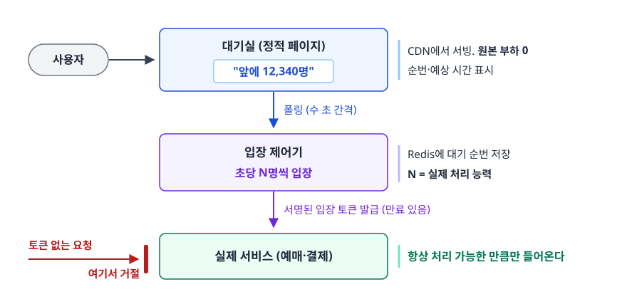

<!-- 위 그림이 대체한 원본 ASCII.
     내용을 고칠 때는 그림도 함께 갱신할 것.
```
   사용자 ──▶ ┌────────────────────┐
              │ 대기실 (정적 페이지)  │  CDN에서 서빙. 원본 부하 0
              │ "앞에 12,340명"      │  순번·예상 시간 표시
              └─────────┬──────────┘
                        │ 폴링 (수 초 간격)
              ┌─────────▼──────────┐
              │ 입장 제어기          │  Redis에 대기 순번 저장
              │ 초당 N명씩 입장       │  N = 실제 처리 능력
              └─────────┬──────────┘
                        │ 서명된 입장 토큰 발급 (만료 있음)
              ┌─────────▼──────────┐
              │ 실제 서비스 (예매·결제)│  토큰 없는 요청은 여기서 거절
              └────────────────────┘     → 항상 처리 가능한 만큼만 들어온다
```
-->

이 구조가 주는 값이 셋입니다. **뒷단이 항상 자기 처리 능력 안에서 동작합니다**(예측이 아니라 강제입니다). **사용자가 상황을 압니다** — "잠시 후 다시 시도해주세요"보다 "앞에 12,340명, 예상 8분"이 이탈률이 낮고 무작정 새로고침하는 사용자가 줄어 부하도 함께 줍니다. **공정성이 생깁니다** — 먼저 온 사람이 먼저 들어가므로 매크로가 유리해지는 구조가 줄어듭니다.

대기실 페이지 자체는 반드시 **정적이어야 하고 CDN에서 서빙되어야 합니다.** 대기실이 애플리케이션 서버를 호출하면 대기실이 부하의 원인이 되어버립니다.

---

## 8. 시나리오: 티켓 오픈 설계

면접의 "티켓팅 시스템을 설계해보세요"는 위 내용을 순서대로 꿰는 문제입니다. 먼저 요구사항을 숫자로 바꿉니다.

```
   오픈 20:00 정각 / 좌석 10,000석 / 예상 동시 접속 300,000명
   → 오픈 직후 1분간 초당 5,000~20,000 요청
   → 그런데 성공해야 하는 트랜잭션은 10,000건뿐
```

설계는 마지막 줄에서 갈립니다. **요청은 수백만 건이지만 성공해야 하는 것은 1만 건**이고 나머지는 빠르고 정확하게 거절하면 됩니다.

<!-- diagram:sd-high-traffic-10 -->
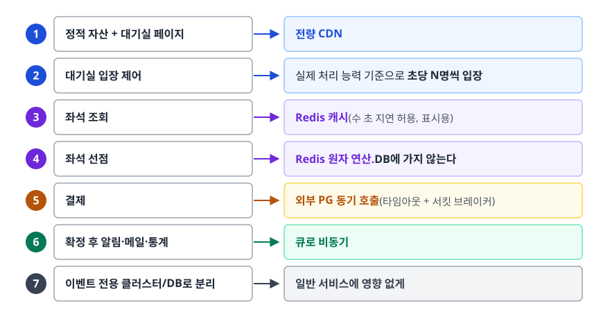

<!-- 위 그림이 대체한 원본 ASCII.
     내용을 고칠 때는 그림도 함께 갱신할 것.
```
   ① 정적 자산 + 대기실 페이지 → 전량 CDN
   ② 대기실 입장 제어 → 실제 처리 능력 기준으로 초당 N명씩 입장
   ③ 좌석 조회 → Redis 캐시 (수 초 지연 허용, 표시용)
   ④ 좌석 선점 → Redis 원자 연산. DB에 가지 않는다
   ⑤ 결제 → 외부 PG 동기 호출 (타임아웃 + 서킷 브레이커)
   ⑥ 확정 후 알림·메일·통계 → 큐로 비동기
   ⑦ 이벤트 전용 클러스터/DB로 분리 → 일반 서비스에 영향 없게
```
-->

### 좌석 선점을 DB 락으로 하지 않는 이유

```sql
-- 안티패턴
BEGIN;
SELECT * FROM seats WHERE id = 1234 FOR UPDATE;   -- 배타 락
UPDATE seats SET user_id = 999 WHERE id = 1234;
COMMIT;
```

**왜 문제인가**: 인기 좌석 하나에 수만 개의 요청이 몰리면 그 행 하나를 두고 전부가 줄을 섭니다. 락 대기 중인 커넥션이 풀을 다 차지해 좌석과 무관한 다른 쿼리까지 커넥션을 못 얻습니다. 대기가 길어지면 락 타임아웃과 데드락이 겹치고 DB CPU가 락 관리에만 쓰입니다.

```lua
-- 개선 — Redis Lua 스크립트. 스크립트 전체가 원자적으로 실행된다
if redis.call('SETNX', KEYS[1], ARGV[1]) == 1 then
    redis.call('EXPIRE', KEYS[1], ARGV[2])   -- 선점 유효 시간(예: 600초)
    return 1                                  -- 선점 성공
else
    return 0                                  -- 이미 선점됨
end
```

`SETNX`는 키가 없을 때만 값을 설정합니다. 좌석당 판정이 메모리 연산 한 번으로 끝나고 DB에는 부하가 없습니다. 만료 시간을 걸어두면 결제하지 않은 선점이 자동으로 풀립니다. 선점에 성공한 요청만 결제로 넘어가고, 결제 완료 시점에 DB에 확정 기록을 남깁니다. 그래서 **DB에 도달하는 쓰기는 최대 10,000건**이 됩니다.

그 밖에 세 가지를 준비합니다. **재고 표시와 실재고를 분리합니다** — 화면의 "잔여 3,201석"은 캐시된 근사치여도 되고 실제 차감만 정확하면 됩니다. 표시까지 정확하게 만들려 하면 조회 요청 전부가 원자 연산을 거쳐야 합니다. **매크로를 거릅니다** — 요청 수 제한, WAF, 캡차. 봇이 먹는 만큼 실제 사용자 몫이 줄어드니 이 상황에서는 처리량보다 공정성이 중요합니다. **킬 스위치를 미리 만듭니다** — 추천 영역 끄기, 특정 API 차단, 입장 속도 조절을 배포 없이 즉시 할 수 있어야 합니다. 새벽에 코드를 고쳐 배포해야 하는 상황이면 이미 늦었습니다.

---

## 9. 실무에서는

- **부하 테스트 없이 만든 대응책은 추측입니다.** k6, JMeter, Gatling으로 예상 트래픽의 1.5~2배를 실제로 때려보면 예상하지 못한 곳이 거의 항상 먼저 무너집니다. 테스트 환경은 운영과 같은 구성이어야 하고 특히 DB 데이터 양이 비슷해야 합니다. 데이터가 적으면 인덱스 없이도 잘 돕니다.
- **지표는 백분위로 봅니다.** 평균 200ms인데 P99가 8초면 100명 중 1명은 8초를 기다립니다. 트래픽이 100만이면 1만 명입니다. 평균은 이 사실을 감춥니다.
- **캐시 만료가 몰리지 않게 합니다.** 인기 상품의 캐시가 동시에 만료되면 그 순간 모든 요청이 DB로 갑니다(cache stampede). TTL에 무작위 값을 더해 만료 시각을 흩습니다. 만료 시 하나의 요청만 DB에 가도록 잠금을 두기도 하고 만료된 값을 일단 그대로 돌려준 뒤 갱신은 뒤에서 처리하기도 합니다.
- **장애 대응은 시스템이 해야 합니다.** 새벽 3시에 누군가 깨어 있어야만 살아남는다면 설계가 덜 된 것입니다.

---

## 10. 면접 포인트

> 면접에서 이 주제가 나오면 이렇게 답한다

**Q. 트래픽이 갑자기 10배로 늘면 어떻게 대응하시겠습니까?**

A. 계층 순서로 봅니다. 먼저 CDN과 캐시로 원본 서버에 도달하는 요청 자체를 줄이고, 로드 밸런서 단에서 봇과 비정상 요청을 걸러냅니다. 그다음 무상태인 애플리케이션 계층을 수평 확장하는데, 이때 DB 커넥션 총합이 한계를 넘지 않도록 대당 풀 크기를 함께 조정해야 합니다. 즉시성이 없는 작업은 큐로 빼서 부하를 시간축으로 평탄화하고, 그래도 넘치는 만큼은 대기열로 받아 우아하게 지연시킵니다. 원칙은 "아래 계층으로 갈수록 늘리기 어려우니 위에서 최대한 흡수한다"입니다.
- 꼬리 질문: "서버만 늘리면 안 되나요?" → 애플리케이션을 늘리면 DB 입장에서는 부하가 늘어납니다. 무상태 계층은 쉽게 늘지만 상태를 가진 계층은 따라오지 않으므로 병목이 아래로 내려갈 뿐입니다.

**Q. 오토스케일링이 있는데 왜 사전 확장이 필요한가요?**

A. 오토스케일링은 구조적으로 늦기 때문입니다. 메트릭 수집·집계 지연, 진동 방지를 위한 판정 대기, 인스턴스 부팅, 애플리케이션 기동과 워밍업까지 합치면 수 분이 걸립니다. 계단식으로 튀는 스파이크에서는 그 사이에 기존 인스턴스가 이미 무너집니다. 게다가 스레드 풀이 고갈되면 요청을 못 받아 CPU가 오히려 떨어지기 때문에 CPU 기반 정책은 이때 확장을 멈추기도 합니다. 그래서 시작 시각이 정해진 이벤트는 스케줄 기반으로 미리 확보하고 오토스케일링은 예상을 벗어난 부분만 맡깁니다.
- 꼬리 질문: "그럼 어떤 지표로 스케일링하나요?" → 인스턴스당 요청 수, 큐 깊이, P99 지연을 씁니다. 부하를 더 일찍 반영하는 지표입니다.

**Q. 서킷 브레이커, 타임아웃, 재시도, 벌크헤드는 각각 무엇을 막나요?**

A. 타임아웃은 응답 없는 호출에 스레드가 무한히 묶이지 않게 막습니다. 나머지 셋의 전제이기도 합니다. 타임아웃이 없으면 실패로 집계조차 안 됩니다. 재시도는 일시적 오류를 복구합니다. 다만 지수 백오프와 지터가 없으면 오히려 부하를 증폭시킵니다. 서킷 브레이커는 실패가 반복되는 대상이면 호출 자체를 아예 차단해 호출자와 피호출자 양쪽에 회복 시간을 줍니다. 벌크헤드는 호출 대상별로 자원을 격리해 한 의존성이 자원을 다 먹어도 다른 흐름은 살아남게 합니다.
- 꼬리 질문: "느린 응답도 서킷 브레이커가 잡나요?" → 잡도록 설정해야 합니다. 실패는 스레드를 즉시 돌려주지만 느린 응답은 계속 묶어두므로 더 위험합니다. 느린 호출 임계치를 따로 둡니다.

**Q. 티켓팅처럼 순간 폭주하는 서비스를 어떻게 설계하시겠습니까?**

A. "요청은 수백만 건이지만 성공해야 하는 트랜잭션은 좌석 수만큼"이 핵심입니다. 정적 자산과 대기실 페이지를 CDN으로 완전히 빼고, 가상 대기실에서 실제 처리 능력에 맞춰 초당 N명씩만 입장시킵니다. 좌석 선점은 DB 배타 락 대신 Redis 원자 연산으로 처리해 DB에 도달하는 쓰기를 좌석 수만큼으로 줄이고, 결제 외의 후속 작업은 큐로 비동기 처리합니다. 이벤트 전용 클러스터로 분리해 일반 서비스에 영향이 가지 않게 하고, 킬 스위치와 사전 확장을 준비합니다.
- 꼬리 질문: "좌석 선점을 `SELECT FOR UPDATE`로 하면 왜 안 되나요?" → 인기 좌석 한 행에 수만 요청이 줄을 서면서 커넥션 풀이 락 대기로 고갈되고, 좌석과 무관한 쿼리까지 막힙니다. Redis Lua 스크립트로 원자 판정을 하면 DB 부하 없이 같은 정합성을 얻습니다.

---

## 자주 하는 실수

| 실수 | 왜 틀렸나 | 올바른 이해 |
|------|----------|-----------|
| "서버를 늘리면 트래픽을 감당할 수 있다" | 무상태 계층만 쉽게 늘고 늘어난 만큼 DB 부하가 커진다 | 병목은 사라지지 않고 아래 계층으로 이동한다. 계층별로 함께 설계한다 |
| "인스턴스를 늘렸으니 커넥션 풀은 그대로 둬도 된다" | 풀은 대당 설정이고 DB 최대 연결은 전체 합에 걸린다 | 인스턴스 수 × 풀 크기가 DB 한계 안에 들어와야 한다 |
| "큐를 쓰면 처리량이 늘어난다" | 큐는 처리 능력을 늘리지 않는다 | 넘치는 부하를 시간축으로 펼 뿐이다. 처리량을 늘리려면 워커를 늘려야 한다 |
| "재시도를 넣으면 더 안정적이다" | 백오프와 지터 없는 재시도는 과부하 서버에 부하를 배로 얹는다 | 지수 백오프 + 지터 + 횟수 제한, 그리고 멱등한 요청에만 |
| "오토스케일링을 켜뒀으니 스파이크도 괜찮다" | 감지·부팅·워밍업에 수 분이 걸리고 그 사이 시스템은 이미 무너진다 | 예정된 이벤트는 사전 확장으로 확보하고 오토스케일링은 보조로 쓴다 |
| "P99가 나빠도 평균이 좋으면 괜찮다" | 트래픽이 100만이면 P99 초과는 1만 명이다 | 사용자 경험은 백분위로 본다. 평균은 꼬리를 감춘다 |
| "장애 시엔 다 막고 점검 페이지를 띄운다" | 부가 기능 하나 때문에 결제까지 막는 것은 손실이다 | 핵심 흐름은 살리고 부가 기능만 줄이는 우아한 성능 저하를 설계한다 |

---

## 한 줄 정리

대용량 트래픽 대응은 "더 많이 처리하는 기술"이 아니라 **바깥 계층에서 최대한 흡수하고, 남은 것을 큐로 평탄화하고, 그래도 넘치는 만큼은 대기열로 명확히 지연시키며, 어느 한 곳의 지연이 전체로 번지지 않게 격리하는 기술**입니다.

---

## 연관 개념

- [01-load-balancer.md](./01-load-balancer.md) - 트래픽을 나누는 계층과 헬스체크 설계
- [02-zero-downtime-deployment.md](./02-zero-downtime-deployment.md) - 트래픽이 많은 시간대에 용량을 줄이지 않고 배포하는 방법
- [caching/01-caching-strategies.md](./caching/01-caching-strategies.md) - 캐시 전략과 캐시 스탬피드 방어
- [performance/01-performance-optimization.md](./performance/01-performance-optimization.md) - 병목을 찾아내는 절차와 커넥션 풀 크기 산정
- [qna-infrastructure.md](./qna-infrastructure.md) - 대용량 트래픽 관련 면접 질문(Q3)
- [../10-cloud-engineering/monitoring-observability/05-alerting-oncall.md](../10-cloud-engineering/monitoring-observability/05-alerting-oncall.md) - 장애를 사람이 아니라 시스템이 먼저 알아채게 만들기
