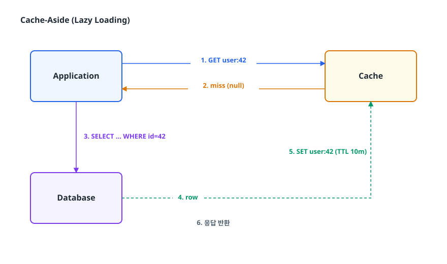
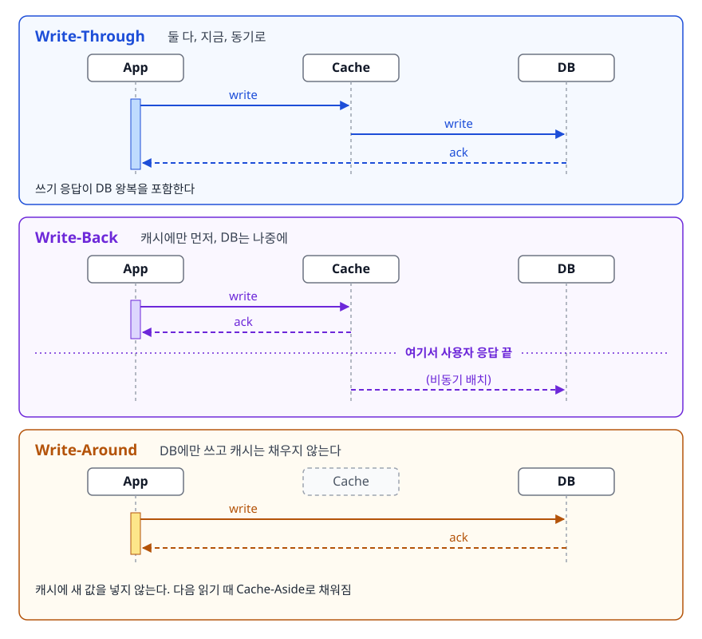
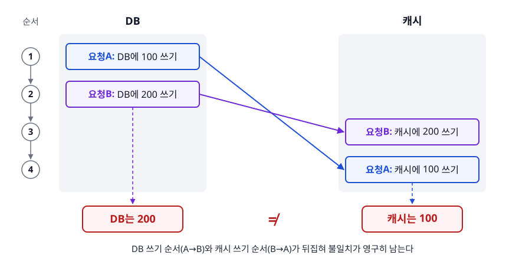
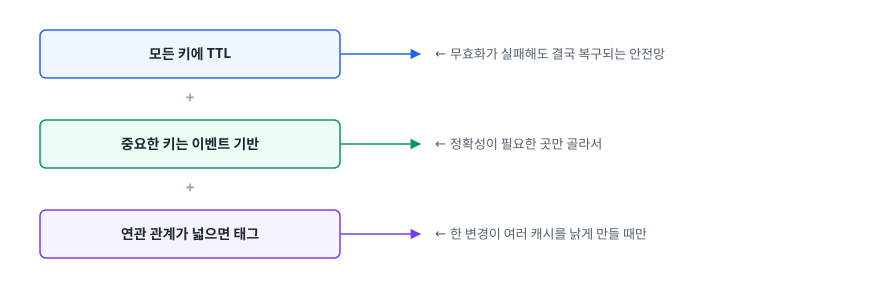
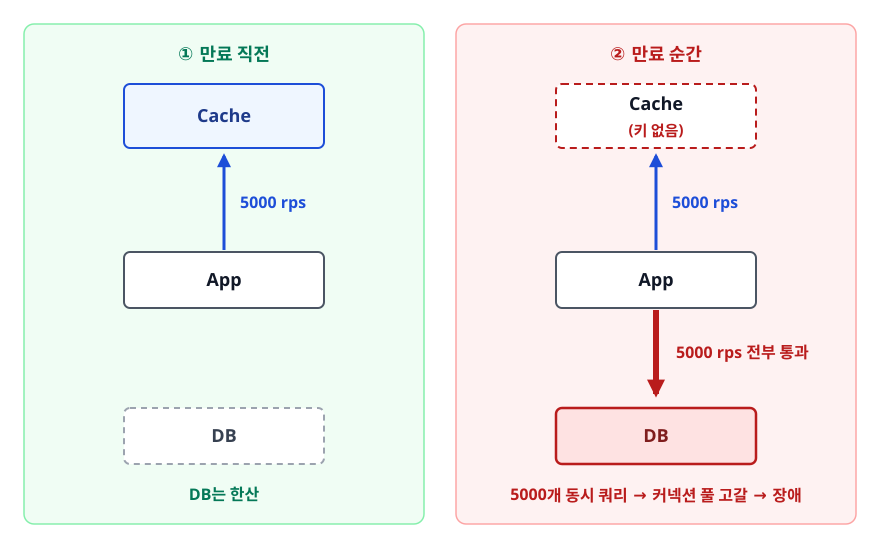
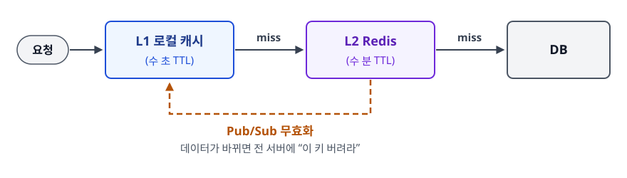

# 캐싱 전략 (Caching Strategies)

> 캐시가 어떤 문제를 풀어 주는지, 그 대가로 어떤 문제를 새로 만드는지부터 짚습니다. 읽기·쓰기·무효화 전략을 상황에 맞게 고르는 기준까지 설명할 수 있게 됩니다.

## 학습 목표

- [ ] 캐시가 성능을 개선하는 원리와, 캐시가 효과를 내기 위한 전제 조건을 말할 수 있다
- [ ] Cache-Aside와 Read-Through를 코드 수준에서 구분하고 쓰기 전략 세 가지를 비교해 고를 수 있다
- [ ] TTL과 이벤트 기반 무효화를 조합하는 이유를 설명할 수 있다
- [ ] 캐시 스탬피드·핫키·캐시 관통이 각각 왜 생기고 어떻게 막는지 안다
- [ ] 로컬 캐시와 분산 캐시의 트레이드오프를 판단할 수 있다

## 선행 지식

- 없음 — 이 문서부터 시작해도 됩니다
- 함께 보면 좋은 문서: [CPU 캐시 메모리](../../01-computer-science-fundamentals/computer-architecture/02-cache-memory.md) (같은 아이디어가 하드웨어 계층에서 어떻게 쓰이는지)

---

## 1. 왜 필요한가

### 문제는 "속도 차이"다

시스템의 각 계층은 데이터를 꺼내오는 비용이 극단적으로 다릅니다. 아래는 정확한 값이 아니라 **자릿수 감각**을 잡기 위한 표입니다. 하드웨어와 환경에 따라 달라지지만, 계층 간 차이가 10배·100배 단위라는 사실은 변하지 않습니다.

```
   프로세스 안 메모리 읽기      ~ 100 나노초        1
   같은 데이터센터 Redis 조회   ~ 1 밀리초         약 10,000배
   인덱스 잘 탄 DB 쿼리         ~ 5 밀리초         약 50,000배
   인덱스 없는 풀스캔 쿼리      ~ 1 초             약 10,000,000배
```

여기서 캐시의 아이디어가 나옵니다. **"비싼 계산이나 조회의 결과를, 다음에 같은 요청이 왔을 때 다시 하지 않도록 싼 곳에 적어두자."**

### 캐시가 이득을 보려면 두 가지 전제가 필요하다

캐시는 공짜가 아닙니다. 아래 두 조건이 깨지면 캐시는 메모리만 먹고 아무것도 개선하지 못합니다.

1. **지역성(locality)** — 한 번 조회된 데이터가 다시 조회될 확률이 높아야 합니다. 모든 사용자가 완전히 다른 데이터를 한 번씩만 본다면 히트율은 0에 수렴합니다.
2. **읽기 편중** — 읽기가 쓰기보다 훨씬 많아야 합니다. 쓸 때마다 캐시를 지워야 하므로, 쓰기가 잦으면 캐시는 채워지자마자 버려집니다.

### 캐시가 만드는 새 문제: 정합성

같은 데이터의 사본이 두 곳(DB와 캐시)에 생기는 순간, "둘이 다를 수 있다"는 문제가 따라붙습니다. 피할 방법은 없습니다.

```
   시각 t1   DB: 가격 10000   캐시: 가격 10000     일치
   시각 t2   관리자가 가격을 9000으로 수정
             DB: 가격 9000    캐시: 가격 10000     불일치(stale)
   시각 t3   사용자에게 10000원이 보인다
```

캐시 설계의 거의 모든 논쟁은 **"이 불일치 구간을 얼마나 짧게 만들 것인가, 그 대가로 성능을 얼마나 포기할 것인가"** 이 한 줄로 모입니다. 아래 나오는 전략들은 전부 이 질문에 대한 서로 다른 답입니다.

### 비유

자주 보는 책 몇 권을 도서관에서 빌려 책상 위에 올려두는 것과 같습니다. 도서관까지 걸어가는 시간(DB 조회)을 아끼는 대신, 책상 공간(메모리)을 씁니다.

> **비유의 한계**: 책은 도서관 원본이 개정돼도 내 책상 사본이 낡았다고 알려 주지 않습니다. 캐시도 마찬가지라서, "언제 사본을 버릴 것인가"는 시스템이 직접 정해야 합니다. 캐싱에서 가장 어려운 부분이 바로 이 지점입니다.

---

## 2. 읽기 전략

### Cache-Aside (Lazy Loading)

가장 널리 쓰이는 방식입니다. **애플리케이션이 캐시를 직접 조회하고, 없으면 DB에서 읽어 캐시에 채웁니다.** 캐시는 그냥 옆에 놓인(aside) 저장소일 뿐이고, 모든 판단은 애플리케이션 코드가 합니다.

<!-- diagram:sd-caching-strategies-1 -->


<!-- 위 그림이 대체한 원본 ASCII.
     내용을 고칠 때는 그림도 함께 갱신할 것.
```
        ┌─────────────┐  1. GET user:42   ┌───────────┐
        │ Application │ ────────────────► │   Cache   │
        │             │ ◄──────────────── │           │
        └──────┬──────┘  2. miss (null)   └─────▲─────┘
               │                                │
               │ 3. SELECT ... WHERE id=42      │ 5. SET user:42 (TTL 10m)
               ▼                                │
        ┌─────────────┐  4. row                 │
        │  Database   │ ────────────────────────┘
        └─────────────┘        6. 응답 반환
```
-->

```java
@Service
@RequiredArgsConstructor
public class UserService {

    private final RedisTemplate<String, User> redisTemplate;
    private final UserRepository userRepository;

    public User getUser(Long id) {
        String key = "user:" + id;

        User cached = redisTemplate.opsForValue().get(key);
        if (cached != null) {
            return cached;                                   // 캐시 히트
        }

        User user = userRepository.findById(id)              // 캐시 미스 -> DB
                .orElseThrow(UserNotFoundException::new);

        redisTemplate.opsForValue().set(key, user, Duration.ofMinutes(10));
        return user;
    }
}
```

특징을 짚어 보면 이렇습니다.

- **필요한 데이터만 캐시에 올라갑니다.** 조회되지 않은 데이터는 메모리를 차지하지 않습니다.
- **캐시가 죽어도 서비스는 삽니다.** `get`이 실패하면 DB로 우회하면 됩니다(단, DB가 그 부하를 견딜 수 있어야 합니다).
- **첫 요청은 항상 느립니다.** 캐시가 비어 있는 이 상태를 콜드 캐시(cold cache)라고 부릅니다. 배포 직후나 캐시 재시작 직후에 응답 시간이 튀는 원인입니다.
- **불일치를 애플리케이션이 직접 관리해야 합니다.** 데이터를 바꾸는 모든 코드 경로에서 캐시를 지워야 합니다. 하나라도 빠뜨리면 그 데이터는 TTL이 끝날 때까지 낡은 값을 반환합니다.

### Read-Through

Cache-Aside와 결과는 같지만 **DB를 읽는 책임이 애플리케이션이 아니라 캐시 계층에 있습니다.** 캐시에 "미스가 나면 이렇게 채워라"라는 로더를 등록해두는 방식입니다.

```java
// Caffeine의 LoadingCache — 캐시 자신이 로더를 들고 있다
LoadingCache<Long, User> cache = Caffeine.newBuilder()
        .maximumSize(10_000)
        .expireAfterWrite(Duration.ofMinutes(10))
        .build(id -> userRepository.findById(id)
                .orElseThrow(UserNotFoundException::new));

User user = cache.get(42L);   // 있으면 반환, 없으면 로더를 호출해 채운 뒤 반환
```

Spring의 `@Cacheable`도 같은 형태입니다. 캐시 조회·미스 판정·저장이 프록시 안으로 숨습니다.

```java
@Cacheable(value = "users", key = "#id")
public User getUser(Long id) {
    return userRepository.findById(id).orElseThrow(UserNotFoundException::new);
}
```

Cache-Aside와 견주면 장점은 **캐시 조회 코드가 비즈니스 로직에서 사라진다**는 데 있습니다. 단점은 **동작이 프레임워크에 숨어 통제하기 어렵다**는 점입니다. 캐시 실패 시 어떻게 할지, 키를 어떻게 조합할지 같은 세밀한 제어가 필요하면 Cache-Aside가 낫습니다.

### 안티패턴: 없는 데이터를 캐시하지 않는다

```java
// 안티패턴
public User getUser(Long id) {
    User cached = redisTemplate.opsForValue().get("user:" + id);
    if (cached != null) return cached;

    User user = userRepository.findById(id).orElse(null);
    if (user != null) {                                  // null이면 캐시에 아무것도 안 넣는다
        redisTemplate.opsForValue().set("user:" + id, user, Duration.ofMinutes(10));
    }
    return user;
}
```

**왜 문제인가**: 존재하지 않는 ID(`user:99999999`)로 요청이 오면 캐시에는 영원히 아무것도 저장되지 않으므로, **그 요청은 매번 DB까지 내려갑니다.** 공격자가 없는 ID를 무작위로 대량 호출하면 캐시를 완전히 우회해 DB만 때리게 됩니다. 이것을 **캐시 관통**(cache penetration)이라고 부릅니다.

```java
// 개선 — "없음"도 캐시한다. 단 TTL은 짧게 준다
public Optional<User> getUser(Long id) {
    String key = "user:" + id;

    User cached = redisTemplate.opsForValue().get(key);
    if (cached != null) {
        return cached.isEmptyMarker() ? Optional.empty() : Optional.of(cached);
    }

    Optional<User> found = userRepository.findById(id);
    // 있으면 10분, 없으면 "없음 표식"을 30초만 캐시한다
    redisTemplate.opsForValue().set(key,
            found.orElse(User.emptyMarker()),
            found.isPresent() ? Duration.ofMinutes(10) : Duration.ofSeconds(30));
    return found;
}
```

"없음"의 TTL을 짧게 주는 이유는, 나중에 그 ID로 데이터가 실제로 생성됐을 때 오래 안 보이면 곤란하기 때문입니다. 키 공간이 넓고 공격 가능성이 크다면 블룸 필터(Bloom Filter)로 "확실히 없는 키"를 캐시 앞단에서 걸러내는 방법도 함께 씁니다.

---

## 3. 쓰기 전략

읽기 전략이 "미스가 났을 때 어떻게 채울 것인가"를 묻는다면, 쓰기 전략은 "**데이터가 바뀔 때 캐시와 DB를 어떤 순서로 건드릴 것인가**"를 묻습니다.

<!-- diagram:sd-caching-strategies-2 -->


<!-- 위 그림이 대체한 원본 ASCII.
     내용을 고칠 때는 그림도 함께 갱신할 것.
```
[Write-Through]  둘 다, 지금, 동기로
   App ──write──► Cache ──write──► DB ──ack──► ... ──► App
   쓰기 응답이 DB 왕복을 포함한다

[Write-Back]  캐시에만 먼저, DB는 나중에
   App ──write──► Cache ──ack──► App   (여기서 사용자 응답 끝)
                    └──(비동기 배치)──► DB

[Write-Around]  DB에만 쓰고 캐시는 채우지 않는다
   App ──write──► DB ──ack──► App
        └─ 캐시에 새 값을 넣지 않는다. 다음 읽기 때 Cache-Aside로 채워짐
```
-->

### 비교

| 전략 | 쓰기 지연 | 정합성 | 데이터 유실 위험 | 메모리 효율 | 언제 쓰나 |
|------|----------|--------|-----------------|------------|----------|
| Write-Through | 큼 (캐시+DB 동기) | 강함 | 없음 | 낮음 (안 읽히는 데이터도 캐시됨) | 쓴 직후 반드시 읽히는 데이터. 잔액, 프로필 |
| Write-Back | 매우 작음 | 약함 | **있음** (플러시 전 캐시 노드 장애) | 높음 | 유실을 감수할 수 있는 고빈도 쓰기. 조회수, 좋아요 수, 로그 |
| Write-Around | 작음 (DB만) | 중간 (무효화까지 붙이면 높음) | 없음 | 높음 (읽히는 것만 캐시) | 쓰고 나서 바로 안 읽히는 데이터. 이력, 감사 로그 |

> 결론: **기본값은 "Cache-Aside 읽기 + Write-Around 쓰기" 조합**입니다. Write-Around의 원래 정의는 "쓰기가 캐시를 우회한다"까지지만 그대로 두면 기존 키가 낡은 채 남으므로, 실무에서는 여기에 **기존 키 삭제(무효화)를 덧붙인 형태**로 씁니다. 실무에서 캐싱이라고 하면 대개 이 조합을 가리킵니다. Write-Through는 정합성이 돈과 직결되는 소수의 키에만, Write-Back은 유실을 감수할 수 있는 카운터류에만 제한적으로 씁니다.

### 안티패턴: 캐시를 먼저 지우고 DB를 나중에 커밋

```java
// 안티패턴
@Transactional
public void updatePrice(Long productId, int price) {
    redisTemplate.delete("product:" + productId);   // 1. 캐시 먼저 삭제
    productRepository.updatePrice(productId, price); // 2. DB 수정
}                                                    // 3. 여기서 커밋
```

**왜 문제인가**: 1번과 3번 사이에 다른 요청이 이 상품을 읽으면, 아직 커밋되지 않은 **옛날 값**을 DB에서 읽어 캐시에 다시 채워버립니다. 트랜잭션이 커밋된 뒤에도 캐시에는 옛날 값이 남고, TTL이 끝날 때까지 아무도 그것을 고칠 수 없습니다. 캐시를 지웠는데 오히려 낡은 값이 고정되는, 재현이 매우 어려운 버그입니다.

```java
// 개선 — 커밋이 끝난 뒤에 캐시를 지운다
@Transactional
public void updatePrice(Long productId, int price) {
    productRepository.updatePrice(productId, price);
    eventPublisher.publishEvent(new PriceChangedEvent(productId));
}

@TransactionalEventListener(phase = TransactionPhase.AFTER_COMMIT)
public void evictPriceCache(PriceChangedEvent event) {
    redisTemplate.delete("product:" + event.productId());
}
```

`@TransactionalEventListener(AFTER_COMMIT)`은 트랜잭션이 실제로 커밋된 뒤에만 리스너를 실행합니다. 롤백되면 캐시도 건드리지 않으므로, "DB는 안 바뀌었는데 캐시만 날아가는" 반대 방향 사고도 함께 막힙니다.

### 안티패턴: 캐시를 갱신(update)한다

캐시를 지우는 대신 새 값으로 덮어쓰고 싶은 유혹이 있습니다. 다음 읽기가 빨라지니 그럴 법도 합니다. 하지만 두 요청이 동시에 같은 데이터를 수정하면 이런 일이 생깁니다.

<!-- diagram:sd-caching-strategies-3 -->


<!-- 위 그림이 대체한 원본 ASCII.
     내용을 고칠 때는 그림도 함께 갱신할 것.
```
   요청A: DB에 100 쓰기 ─────────────┐
   요청B: DB에 200 쓰기 ──┐          │
   요청B: 캐시에 200 쓰기 ─┘          │
   요청A: 캐시에 100 쓰기 ────────────┘   ← DB는 200, 캐시는 100
```
-->

DB 쓰기 순서와 캐시 쓰기 순서가 뒤집히면 불일치가 **영구히** 남습니다. **캐시는 갱신하지 말고 삭제하라(delete, don't update).** 삭제는 순서가 뒤집혀도 결과가 같습니다(멱등합니다). 다음 읽기가 알아서 최신 값을 채웁니다.

---

## 4. 만료와 무효화

### TTL — 안전망

TTL(Time To Live)은 저장할 때 만료 시각을 함께 지정해 두었다가 그 시간이 지나면 자동으로 지우는 방식입니다. 구현이 단순하고 코드를 오염시키지 않는 대신, **TTL 동안은 낡은 값이 보입니다.**

TTL의 진짜 가치는 성능이 아니라 **안전망**에 있습니다. 아래 이벤트 기반 무효화는 반드시 어딘가에서 누락됩니다(새로 추가된 API, 배치 잡, DBA의 직접 수정 등). TTL이 걸려 있으면 그 누락의 영향이 "영구히"에서 "최대 N분"으로 줄어듭니다. **TTL 없는 캐시 키는 만들지 않는 것을 규칙으로 삼는 편이 좋습니다.**

### 이벤트 기반 무효화 — 정확성

데이터가 바뀌는 순간 캐시를 명시적으로 삭제합니다. 앞의 `@TransactionalEventListener` 예제가 여기에 해당합니다. 즉시 일관성에 가까워지지만 두 가지 약점이 있습니다.

- **누락**: 캐시를 지우는 코드를 안 쓴 경로가 하나라도 있으면 그곳이 구멍이 됩니다.
- **전파**: 서버가 여러 대이고 각자 로컬 캐시를 들고 있다면, 한 서버에서 지운 것을 나머지 서버가 알아야 합니다(6절 참고).

애플리케이션 코드를 거치지 않는 변경(다른 팀의 배치, 수동 SQL)까지 잡아야 한다면, DB의 변경 로그를 읽어 이벤트로 바꾸는 CDC(Change Data Capture, 예: Debezium) 방식을 씁니다. 애플리케이션이 아니라 **DB가 진실의 원천**이 되므로 누락이 구조적으로 줄어듭니다.

### 태그 기반 무효화

한 데이터가 여러 캐시에 영향을 줄 때 씁니다. 사용자 프로필이 바뀌면 그 사용자가 쓴 게시글 목록 캐시, 댓글 캐시가 전부 낡습니다. 이때 각 캐시에 `user:42` 태그를 달아두고 태그 단위로 일괄 삭제합니다. Redis에서는 태그를 Set으로 관리해(`SADD tag:user:42 "post:100" "comments:user:42"` 후 무효화 시 `SMEMBERS`로 꺼내 일괄 `DEL`) 흉내 낼 수 있습니다. 편리하지만 태그 인덱스 자체를 관리해야 하므로 메모리와 복잡도가 늘어납니다. 연관 캐시가 정말 많을 때만 씁니다.

### 조합

세 가지는 배타적이지 않습니다. 실무의 정석은 다층 방어입니다.

<!-- diagram:sd-caching-strategies-4 -->


<!-- 위 그림이 대체한 원본 ASCII.
     내용을 고칠 때는 그림도 함께 갱신할 것.
```
   모든 키에 TTL              ← 무효화가 실패해도 결국 복구되는 안전망
      +
   중요한 키는 이벤트 기반     ← 정확성이 필요한 곳만 골라서
      +
   연관 관계가 넓으면 태그     ← 한 변경이 여러 캐시를 낡게 만들 때만
```
-->

---

## 5. 캐시가 무너지는 세 가지 패턴

### 캐시 스탬피드 (Cache Stampede / Thundering Herd)

인기 키의 TTL이 만료되는 **바로 그 순간**, 그 키를 읽던 수천 개의 요청이 동시에 미스를 만나 한꺼번에 DB로 몰려갑니다. 평소 캐시가 다 받아내던 트래픽이 순간적으로 DB를 직격합니다.

<!-- diagram:sd-caching-strategies-5 -->


<!-- 위 그림이 대체한 원본 ASCII.
     내용을 고칠 때는 그림도 함께 갱신할 것.
```
   ~ 만료 직전        ~ 만료 순간
   ┌──────────┐      ┌──────────┐
   │  Cache   │      │  Cache   │  (키 없음)
   └────▲─────┘      └──────────┘
        │ 5000 rps        │ 5000 rps 전부 통과
   ┌────┴─────┐      ┌────▼─────┐
   │   App    │      │   App    │
   └──────────┘      └────┬─────┘
   DB는 한산            ┌──▼──┐
                       │ DB  │  5000개 동시 쿼리 → 커넥션 풀 고갈 → 장애
                       └─────┘
```
-->

대응은 세 가지입니다.

1. **분산 락** — 미스가 난 요청 중 하나만 DB를 조회하게 만듭니다. 나머지는 짧게 기다렸다가 캐시를 다시 읽습니다. 락에는 반드시 TTL을 걸어, 락을 쥔 프로세스가 죽어도 영구 교착이 생기지 않게 합니다.

```java
// productRedisTemplate: RedisTemplate<String, Product>
// stringRedisTemplate : StringRedisTemplate (락 키는 문자열이므로 템플릿을 분리한다)
public Product getProduct(Long id) {
    String key = "product:" + id;
    Product cached = productRedisTemplate.opsForValue().get(key);
    if (cached != null) return cached;

    String lockKey = "lock:" + key;
    Boolean acquired = stringRedisTemplate.opsForValue()
            .setIfAbsent(lockKey, "1", Duration.ofSeconds(3));   // SET NX EX

    if (Boolean.TRUE.equals(acquired)) {
        try {
            Product product = productRepository.findById(id).orElseThrow();
            productRedisTemplate.opsForValue().set(key, product, Duration.ofMinutes(10));
            return product;
        } finally {
            stringRedisTemplate.delete(lockKey);
        }
    }
    // 락을 못 잡은 요청: 다른 요청이 채우는 중이므로 잠깐 기다렸다가 캐시를 다시 읽는다
    for (int attempt = 0; attempt < 20; attempt++) {         // 재시도 횟수는 반드시 제한한다
        sleepQuietly(50);                                    // 인터럽트 플래그를 복원하는 헬퍼
        Product filled = productRedisTemplate.opsForValue().get(key);
        if (filled != null) return filled;
    }
    return productRepository.findById(id).orElseThrow();     // 끝내 안 채워지면 직접 조회
}
```

재시도를 무한 루프나 무한 재귀로 짜면, 락을 쥔 요청이 실패했을 때 대기하던 요청들이 영원히 돌게 됩니다. **횟수 상한과 최종 폴백 경로를 반드시 둡니다.**

2. **Stale-While-Revalidate** — 만료돼도 일정 시간은 낡은 값을 그대로 응답하고, 갱신은 백그라운드로 돌립니다. 사용자는 대기하지 않고 DB도 한 번만 맞습니다. HTTP 캐시 표준과 CDN에도 같은 이름의 지시어가 있습니다.
3. **확률적 사전 갱신** — 만료가 가까워질수록 확률적으로 미리 한 요청이 갱신을 시도하게 합니다(XFetch 계열). 만료 시각이 자연스럽게 흩어집니다.

보조 기법으로 **TTL 지터**(jitter)가 있습니다. 배포 시점에 한꺼번에 채워진 캐시들이 정확히 같은 시각에 만료되면 스탬피드가 여러 키에서 동시에 터집니다. `TTL = 600초 ± 랜덤 60초`처럼 흔들어 두면 만료가 분산됩니다. 한 줄이면 되는데 효과가 큽니다.

### 핫키 (Hot Key)

특정 키 하나에 트래픽이 몰려 그 키를 담당하는 캐시 **노드 한 대**가 포화되는 현상입니다. 아이돌 콘서트 티켓 상품, 메인 화면 배너처럼 전체 트래픽의 상당 부분이 키 하나로 향할 때 생깁니다. 캐시가 여러 노드로 샤딩되어 있어도 소용없습니다. 키가 하나면 노드도 하나입니다.

대응:

- **로컬 캐시로 앞단을 덮습니다.** 애플리케이션 서버마다 이 키를 몇 초간 메모리에 들고 있으면, 노드로 가는 요청 수가 서버 대수만큼으로 줄어듭니다. 가장 효과가 큽니다.
- **키를 쪼갭니다.** `banner:main`을 `banner:main:0` ~ `banner:main:9`로 복제해두고 요청마다 무작위로 하나를 고릅니다. 키가 달라지면 해시 결과도 달라져 여러 노드로 흩어질 가능성이 높으므로 부하가 분산됩니다(어느 키가 어느 노드로 갈지는 해시가 정하므로 완전히 균등하지는 않습니다). 대신 갱신할 때 열 개를 다 지워야 합니다.

### 캐시 관통 (Cache Penetration)

2절에서 다룬, 존재하지 않는 키가 캐시를 그냥 통과해 DB로 가는 문제입니다. "없음"을 짧은 TTL로 캐시하거나 블룸 필터로 앞에서 거릅니다. 세 가지를 한 문장으로 구분하면, **스탬피드는 "있던 게 사라진 순간"의 문제, 핫키는 "한 키가 너무 인기 있는" 문제, 관통은 "애초에 없는 키"의 문제입니다.**

---

## 6. 로컬 캐시 vs 분산 캐시

| 기준 | 로컬 캐시 (Caffeine, Guava) | 분산 캐시 (Redis, Memcached) |
|------|---------------------------|----------------------------|
| 위치 | 애플리케이션 프로세스의 힙 메모리 | 별도 서버 |
| 조회 지연 | 나노초 단위 (메서드 호출) | 밀리초 단위 (네트워크 왕복) |
| 서버 간 공유 | 안 됨. 서버마다 값이 다를 수 있다 | 됨. 모든 서버가 같은 값을 본다 |
| 무효화 | 어렵습니다. 전 서버에 전파해야 합니다 | 쉽습니다. 한 번 지우면 끝 |
| 용량 | 앱 힙에 종속. 크게 잡으면 GC 부담 | 독립적으로 확장 가능 |
| 재시작 영향 | 배포 때마다 전부 날아감 | 유지됨 |
| 언제 쓰나 | 거의 안 바뀌고 모두가 읽는 데이터 (설정값, 코드 테이블, 핫키) | 사용자별 데이터, 세션, 정확성이 필요한 값 |

> 결론: **바뀌지 않는 소량의 데이터는 로컬, 그 외에는 분산.** 로컬 캐시의 치명적 약점은 무효화 전파이므로, "TTL이 만료될 때까지 서버마다 값이 달라도 괜찮은가?"에 그렇다고 답할 수 있는 데이터만 로컬에 둡니다.

### 2단 캐시와 무효화 전파

둘을 겹쳐 쓰는 구조를 2단 캐시(또는 near cache)라고 합니다.

<!-- diagram:sd-caching-strategies-6 -->


<!-- 위 그림이 대체한 원본 ASCII.
     내용을 고칠 때는 그림도 함께 갱신할 것.
```
   요청 ──► [L1 로컬 캐시] ──miss──► [L2 Redis] ──miss──► [DB]
              (수 초 TTL)              (수 분 TTL)
                  ▲                        │
                  └──── Pub/Sub 무효화 ─────┘
```
-->

L1에 짧은 TTL을 걸어 대부분의 요청을 프로세스 안에서 끝내고, 데이터가 바뀌면 Redis Pub/Sub으로 전 서버에 "이 키 버려라" 메시지를 뿌립니다. 다만 Pub/Sub 메시지는 유실될 수 있으므로 **L1의 TTL을 짧게(수 초~수십 초) 잡아 최종 안전망을 남겨두는 것이 필수**입니다. 무효화 전파를 100% 신뢰하는 구조는 만들지 않습니다.

---

## 7. 실무에서는

- **캐시 히트율을 항상 관측합니다.** 히트율이 낮으면(예: 50% 미만) 캐시가 일을 안 하면서 메모리와 복잡도만 소모하고 있다는 뜻입니다. 캐시 키 설계가 너무 잘게 쪼개져 있거나, 애초에 캐시할 만한 워크로드가 아니거나 둘 중 하나입니다.
- **캐시 미스 경로의 p99를 따로 봅니다.** 히트율 99%면 평균 응답 시간은 훌륭해 보이지만, p99는 정확히 그 미스 1%가 결정합니다. "캐시 달았으니 끝"이 아니라 미스 경로가 감당 가능한지 확인해야 합니다.
- **Spring 진영에서는** `spring-boot-starter-cache` + `@Cacheable` / `@CacheEvict` 조합이 표준이고 캐시 구현체로 Caffeine(로컬)이나 Redis(분산)를 꽂습니다. 다만 `@Cacheable`은 프록시 기반이라 같은 클래스 내부 호출(self-invocation)에서는 동작하지 않는다는 함정이 있습니다.
- **캐시를 지우는 코드는 도메인 이벤트로 몰아둡니다.** 서비스 메서드마다 `redisTemplate.delete(...)`가 흩어져 있으면 누락은 시간 문제입니다. "가격이 바뀌었다"는 이벤트를 발행하고 리스너 한 곳에서 관련 캐시를 정리하는 구조가 훨씬 오래 버팁니다.

---

## 8. 면접 포인트

> 면접에서 이 주제가 나오면 이렇게 답한다

**Q. 캐시와 DB의 정합성은 어떻게 맞추나요?**

A. 완벽한 일치는 포기하고, **불일치 구간을 얼마나 짧게 만들지**를 설계합니다. 기본은 DB 트랜잭션이 커밋된 뒤에 캐시를 삭제하는 것이고, 이때 갱신이 아니라 삭제를 씁니다. 갱신은 동시 쓰기에서 순서가 뒤집히면 불일치가 영구히 남지만, 삭제는 순서가 뒤집혀도 결과가 같기 때문입니다. 그리고 이벤트 기반 무효화는 반드시 어딘가에서 누락되므로 모든 키에 TTL을 안전망으로 깔아둡니다.
- 꼬리 질문: "캐시를 먼저 지우고 DB를 수정하면 안 되나요?" → 안 됩니다. 삭제와 커밋 사이에 다른 요청이 커밋 전의 옛날 값을 읽어 캐시를 다시 채우면, TTL이 끝날 때까지 낡은 값이 고정됩니다.

**Q. Cache-Aside와 Read-Through의 차이는 무엇인가요?**

A. **DB를 읽는 책임이 누구에게 있느냐**가 다릅니다. Cache-Aside는 애플리케이션이 캐시를 조회하고 미스면 직접 DB를 읽어 캐시에 넣습니다. Read-Through는 캐시 계층에 로더를 등록해두고 캐시가 스스로 채웁니다. Caffeine의 `LoadingCache`나 Spring `@Cacheable`이 후자입니다. 결과는 같지만, 캐시 장애 시 폴백이나 키 조합 같은 세밀한 제어가 필요하면 Cache-Aside가 유리합니다.
- 꼬리 질문: "그럼 왜 Cache-Aside가 더 많이 쓰이나요?" → 캐시가 죽었을 때의 동작을 애플리케이션이 직접 정할 수 있고 캐시 구현체에 덜 묶이기 때문입니다.

**Q. 캐시 스탬피드가 무엇이고 어떻게 막나요?**

A. 인기 키가 만료되는 순간 그 키를 읽던 요청들이 동시에 캐시 미스를 만나 한꺼번에 DB로 몰려가는 현상입니다. 평소 캐시가 흡수하던 트래픽이 한 번에 DB를 때리므로 커넥션 풀 고갈로 이어지기 쉽습니다. 대응은 분산 락으로 한 요청만 DB를 조회하게 하거나, stale-while-revalidate로 낡은 값을 응답하며 백그라운드에서 갱신하거나, 확률적 사전 갱신으로 만료를 흩는 방법입니다. 여기에 TTL 지터를 더하면 여러 키가 동시에 만료되는 것도 막을 수 있습니다.
- 꼬리 질문: "분산 락을 걸었는데 락을 쥔 서버가 죽으면요?" → 락 키에 TTL을 걸어두면 자동 해제됩니다. TTL 없는 분산 락은 영구 교착의 원인입니다.

**Q. 로컬 캐시와 Redis 중 무엇을 쓰겠습니까?**

A. **데이터가 서버마다 달라도 되는지**로 판단합니다. 국가 코드나 카테고리 목록처럼 거의 안 바뀌는 소량 데이터는 로컬 캐시가 압도적으로 빠릅니다. 반면 사용자 정보나 세션처럼 모든 서버가 같은 값을 봐야 하는 데이터는 Redis여야 합니다. 로컬 캐시의 진짜 문제는 속도가 아니라 무효화 전파여서, 로컬을 쓸 때는 TTL을 짧게 잡아 전파 실패의 영향을 시간으로 제한합니다.
- 꼬리 질문: "핫키 문제는 어떻게 푸나요?" → 그 키만 로컬 캐시로 덮어 Redis 노드로 가는 요청을 서버 대수만큼으로 줄이거나, 키를 여러 개로 복제해 노드에 분산시킵니다.

---

## 자주 하는 실수

| 실수 | 왜 틀렸나 | 올바른 이해 |
|------|----------|-----------|
| 데이터 변경 시 캐시를 새 값으로 갱신한다 | 동시 쓰기에서 DB 쓰기 순서와 캐시 쓰기 순서가 뒤집히면 불일치가 영구히 남는다 | 갱신하지 말고 **삭제**합니다. 삭제는 멱등해서 순서가 뒤집혀도 결과가 같습니다 |
| 캐시를 지운 뒤 DB를 수정한다 | 그 사이에 다른 요청이 커밋 전 값을 읽어 캐시를 다시 채운다 | DB 커밋 완료 후에 삭제한다 (`@TransactionalEventListener(AFTER_COMMIT)`) |
| 이벤트 기반 무효화를 하니 TTL은 필요 없다 | 무효화 호출은 반드시 어딘가에서 누락됩니다. 누락되면 그 키는 영원히 낡습니다 | TTL은 성능이 아니라 **무효화 실패의 영향 시간을 제한하는 안전망**이다 |
| "없음"은 캐시하지 않는다 | 존재하지 않는 키 요청이 매번 DB까지 내려간다(캐시 관통) | 빈 결과도 짧은 TTL로 캐시하거나 블룸 필터로 거른다 |
| 캐시 히트율만 보면 된다 | 히트율 99%여도 p99는 미스 1%가 결정한다 | 미스 경로의 지연을 따로 측정한다 |
| 캐시를 붙였으니 DB 부하는 신경 안 써도 된다 | 캐시가 재시작되거나 대량 만료되면 그 순간 모든 트래픽이 DB로 간다 | 캐시가 전부 비었을 때 DB가 버티는지를 기준으로 용량을 잡는다 |

---

## 한 줄 정리

캐시는 "같은 데이터의 사본을 싼 곳에 두는 것"이고, 그 순간부터 모든 설계는 **원본과 사본이 어긋나는 시간을 얼마나 짧게 만들지, 그 대가로 얼마나 느려질지**를 고르는 일이 됩니다.

---

## 연관 개념

- [02-redis-cdn.md](./02-redis-cdn.md) - 이 전략들을 실제로 구현하는 도구(Redis)와 브라우저 앞단의 캐시(CDN)
- [qna-caching.md](./qna-caching.md) - 캐싱 면접 질문 모음 (Q1~Q5)
- [../scalability/02-load-balancing-sharding.md](../scalability/02-load-balancing-sharding.md) - 캐시 노드를 여러 대로 나눌 때 쓰는 일관된 해싱
- [../performance/01-performance-optimization.md](../performance/01-performance-optimization.md) - 캐시를 붙이기 전에 병목이 정말 거기인지 확인하는 절차
- [../../01-computer-science-fundamentals/computer-architecture/02-cache-memory.md](../../01-computer-science-fundamentals/computer-architecture/02-cache-memory.md) - 같은 아이디어의 하드웨어 버전(지역성, 히트/미스)
- [../../02-backend-engineering/database/05-indexing-btree.md](../../02-backend-engineering/database/05-indexing-btree.md) - 캐시보다 먼저 검토해야 할 DB 조회 비용 자체의 개선
