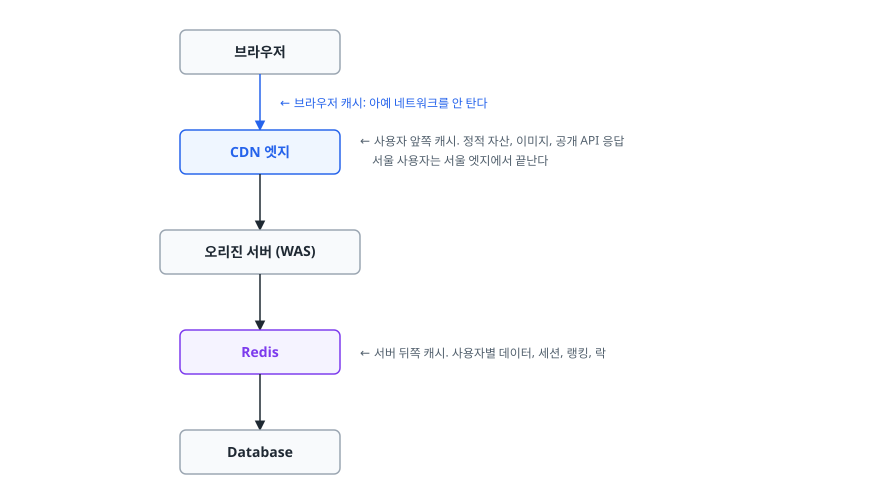
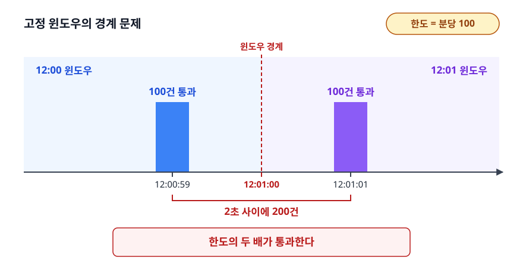
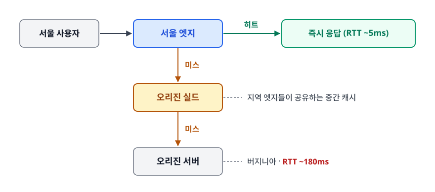
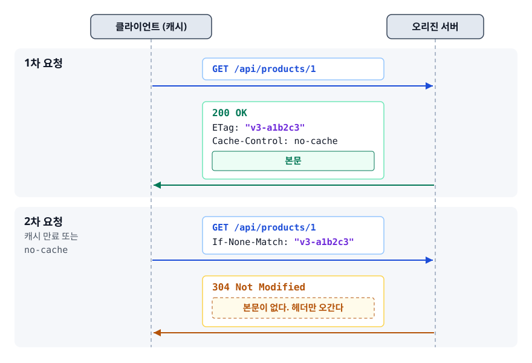
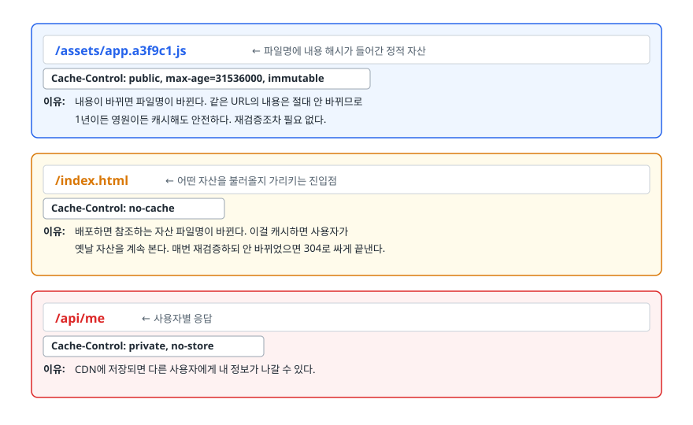

# Redis와 CDN (Redis & CDN)

> 요청 하나가 사용자에게서 데이터까지 가는 길에는 캐시가 앞뒤로 두 겹 있습니다. 서버 앞의 CDN이 어떤 헤더를 보고 움직이는지, 서버 뒤의 Redis가 스레드 하나로도 빠른 이유와 그 대가가 무엇인지를 설명합니다.

## 학습 목표

- [ ] Redis가 단일 스레드인데도 빠른 이유를 네 가지로 나눠 설명할 수 있다
- [ ] 자료구조별 실전 용도(세션/랭킹/큐/분산 락)를 명령어와 함께 말할 수 있다
- [ ] RDB와 AOF의 트레이드오프를 알고 조합을 고를 수 있다
- [ ] `maxmemory-policy`를 캐시 용도와 저장소 용도에 맞게 설정할 수 있다
- [ ] Redis 분산 락이 안전하지 않은 경우를 지적할 수 있다
- [ ] `Cache-Control`과 `ETag`로 정적 자산과 HTML의 캐시 정책을 설계할 수 있다

## 선행 지식

- [01-caching-strategies.md](./01-caching-strategies.md) - 캐시 전략과 무효화의 기본 개념
- [HTTP와 HTTPS](../../01-computer-science-fundamentals/network/02-http-https.md) - 헤더와 상태 코드

---

## 1. 왜 필요한가

캐시는 "사용자에게 가까울수록" 효과가 큽니다. 요청이 우리 서버까지 도달하기 전에 처리되면 서버 자원을 아예 쓰지 않기 때문입니다. 그래서 실제 서비스는 캐시를 최소 두 계층으로 나눕니다.

<!-- diagram:sd-redis-cdn-1 -->


<!-- 위 그림이 대체한 원본 ASCII.
     내용을 고칠 때는 그림도 함께 갱신할 것.
```
   [브라우저]
       │  ← 브라우저 캐시: 아예 네트워크를 안 탄다
       ▼
   [ CDN 엣지 ]  ← 사용자 앞쪽 캐시. 정적 자산, 이미지, 공개 API 응답
       │           서울 사용자는 서울 엣지에서 끝난다
       ▼
   [ 오리진 서버 (WAS) ]
       │
       ▼
   [ Redis ]     ← 서버 뒤쪽 캐시. 사용자별 데이터, 세션, 랭킹, 락
       │
       ▼
   [ Database ]
```
-->

두 계층은 성격이 다릅니다. **CDN은 "모두에게 같은 응답"을 지리적으로 복제**하고 **Redis는 "사용자마다 다른 데이터"를 DB보다 빠르게 제공**합니다. 이 문서는 각각의 내부 동작과 설계 기준을 다룹니다.

### 비유

CDN은 전국에 깔린 편의점입니다. 어느 지점에 가도 같은 상품이 있고 본사 물류창고까지 갈 필요가 없습니다. Redis는 매장 카운터 뒤의 작업대입니다. 손님마다 다른 주문서를 잠깐 올려두고 빠르게 꺼내 쓰는 자리입니다.

> **비유의 한계**: 편의점 상품은 본사가 단종시켜도 진열대에서 저절로 사라지지 않습니다. CDN도 똑같아서 오리진의 콘텐츠가 바뀌어도 엣지는 그 사실을 스스로 알지 못합니다. 그래서 만료 시간(`max-age`)이나 무효화 요청으로 "언제 버릴지"를 우리가 미리 알려줘야 합니다. 9절의 무효화 이야기가 여기서 나옵니다.

---

## 2. Redis는 왜 단일 스레드인데 빠른가

### 무엇이 단일 스레드인가

정확히 말하면 **명령을 실행하는 부분이 단일 스레드**입니다. Redis 프로세스 전체가 스레드 하나인 것은 아닙니다. 스냅샷 저장은 자식 프로세스가 맡고, 큰 객체의 메모리 해제나 AOF 파일 동기화는 백그라운드 스레드가 처리합니다. Redis 6부터는 소켓을 읽고 쓰는 I/O만 여러 스레드로 나눌 수 있는 옵션도 생겼습니다. 그래도 **명령어 하나하나를 실행하는 것은 여전히 스레드 하나**입니다.

즉 "GET을 처리하는 도중에 다른 SET이 끼어드는 일"이 구조적으로 없습니다. 이 성질이 뒤에서 볼 원자성의 근거가 됩니다.

### 빠른 이유 네 가지

1. **메모리에서만 동작합니다.** 가장 큰 요인입니다. 디스크 접근이 없으니 나노초~마이크로초 단위로 끝납니다.
2. **락이 없습니다.** 멀티 스레드였다면 자료구조마다 락을 걸고 경합을 관리해야 합니다. 락 획득·해제 비용과 컨텍스트 스위칭이 사라지므로, 스레드를 늘려서 얻는 이득보다 안 늘려서 아끼는 비용이 더 컸습니다.
3. **I/O 멀티플렉싱**을 씁니다. 연결마다 스레드를 만드는 대신 `epoll` 같은 커널 기능으로 "지금 읽을 데이터가 있는 소켓들"만 골라 이벤트 루프에서 순서대로 처리합니다. 연결이 수만 개여도 스레드는 하나면 됩니다.
4. **자료구조와 프로토콜이 단순합니다.** 요청 파싱 비용이 거의 없고 내부 자료구조는 데이터 크기에 따라 메모리 효율적인 인코딩으로 자동 전환됩니다.

한 가지만 기억한다면 이겁니다. **Redis의 병목은 CPU가 아니라 네트워크와 메모리입니다.** CPU가 병목이 아닌데 스레드를 늘려봤자 얻을 게 없습니다. 그래서 단일 스레드는 타협이 아니라 의도된 설계입니다.

### 대가: 명령 하나가 전체를 멈춘다

단일 스레드의 대가는 명확합니다. **오래 걸리는 명령 하나가 실행되는 동안 다른 모든 요청이 대기합니다.** 웹 서버라면 요청 하나가 느려도 다른 요청은 별개 스레드가 처리합니다. Redis는 그렇지 않습니다.

```java
// 안티패턴 — 운영 중인 Redis에서 절대 실행하면 안 되는 것들
redisTemplate.keys("user:*");        // KEYS: 전체 키 공간을 훑는다. O(N)
// 100만 개짜리 Set 조회
redisTemplate.opsForSet().members("all_users");   // SMEMBERS: 100만 개를 한 번에
```

**왜 문제인가**: 키가 100만 개인 인스턴스에서 `KEYS *`는 수백 밀리초에서 수 초가 걸립니다. 그동안 **모든 클라이언트의 모든 요청이 멈춥니다.** 애플리케이션 쪽에서는 Redis 타임아웃이 한꺼번에 터지고, 커넥션 풀이 고갈되고, 원인을 찾기 어려운 전면 장애로 번집니다.

```java
// 개선 — 커서 기반으로 나눠서 훑는다
ScanOptions options = ScanOptions.scanOptions().match("user:*").count(100).build();
try (Cursor<byte[]> cursor = redisTemplate.executeWithStickyConnection(
        conn -> conn.scan(options))) {
    while (cursor.hasNext()) {
        byte[] key = cursor.next();   // 100개씩 끊어서 가져온다
        // ...
    }
}
```

`SCAN`은 한 번에 조금씩 반환하고 커서를 넘겨주므로 이벤트 루프를 오래 붙잡지 않습니다. 같은 이유로 큰 키를 지울 때는 `DEL` 대신 `UNLINK`를 씁니다. `UNLINK`는 키를 즉시 키 공간에서 떼어내고 실제 메모리 해제는 백그라운드 스레드에 맡깁니다.

---

## 3. 자료구조와 실전 용도

Redis를 "값을 문자열로 넣는 곳"으로만 쓰면 절반도 못 쓰는 셈입니다. 자료구조마다 정해진 쓰임이 있습니다.

| 자료구조 | 대표 명령 | 실전 용도 | 왜 이 구조인가 |
|---------|----------|----------|---------------|
| String | `SET`, `GET`, `INCR` | 세션, 단순 캐시, 카운터 | `INCR`이 원자적이라 동시 증가에 락이 필요 없다 |
| Hash | `HSET`, `HGETALL` | 객체의 필드별 저장/수정 | 필드 하나만 바꾸는데 객체 전체를 직렬화하지 않아도 된다 |
| List | `LPUSH`, `BRPOP` | 간단한 작업 큐, 최근 목록 | `BRPOP`이 블로킹 대기를 해줘서 폴링이 필요 없다 |
| Set | `SADD`, `SISMEMBER` | 중복 제거, 태그, 방문자 집합 | 존재 여부 확인이 O(1) |
| Sorted Set | `ZADD`, `ZINCRBY`, `ZRANGE` | 실시간 랭킹, 우선순위 큐, 시계열 인덱스 | 점수 순 정렬이 항상 유지되어 상위 N 조회가 저렴하다 |
| Bitmap | `SETBIT`, `BITCOUNT` | 출석 체크, 일별 활성 사용자 | 사용자 1000만 명의 참/거짓이 약 1.2MB |
| HyperLogLog | `PFADD`, `PFCOUNT` | 고유 방문자 수 추정 | 오차 약 0.81%를 감수하면 키 하나당 최대 약 12KB로 카운트 |
| Stream | `XADD`, `XREADGROUP` | 이벤트 로그, 컨슈머 그룹 큐 | 메시지가 소비 후에도 남고 재처리가 가능 |

> 정리: **"정렬된 상위 N개"가 필요하면 Sorted Set, "있다/없다"면 Set, "카운트만"이면 String이나 HyperLogLog.** 자료구조를 잘못 고르면 애플리케이션에서 정렬하거나 전체를 읽어오는 코드가 생기고, 그 순간 앞 절의 O(N) 문제로 되돌아갑니다.

### Memcached와 무엇이 다른가

같은 "메모리 캐시"로 묶이지만 지향점이 다릅니다. Memcached는 문자열 키-값 저장을 최대한 단순하게 유지하는 쪽을 골랐고, Redis는 자료구조·영속화·복제·스크립트를 끌어안았습니다.

| 기준 | Redis | Memcached |
|------|-------|-----------|
| 값의 형태 | String, Hash, List, Set, Sorted Set, Stream 등 | 바이트 배열 하나 |
| 영속화 | RDB·AOF 지원 (4절) | 없음. 재시작하면 전부 사라진다 |
| 복제·페일오버 | 복제와 자동 페일오버가 제품에 포함(Sentinel, Cluster) | 서버 자체에는 없습니다. 클라이언트가 여러 노드에 샤딩합니다 |
| 스레드 모델 | 명령 실행은 단일 스레드 (2절) | 멀티 스레드 |
| 부가 기능 | Lua 스크립트, Pub/Sub, 트랜잭션, 만료 이벤트 | 사실상 없음 |
| 값당 메모리 오버헤드 | 자료구조 메타데이터만큼 더 든다 | 단순 문자열 캐시에서는 더 작은 편 |

> 선택 기준: **단순 문자열 캐시를 여러 코어로 최대한 뽑아 쓰는 것이 전부라면 Memcached도 여전히 합리적입니다.** 하지만 랭킹, 분산 락, 세션, 큐처럼 자료구조가 필요한 요구가 하나라도 생기면 그 순간 대안이 없어집니다. 새로 고른다면 대부분 Redis로 수렴합니다. Memcached는 이미 쓰고 있는 시스템을 유지하는 쪽에 가깝습니다.

### 랭킹: Sorted Set

```java
// 게시글에 좋아요가 눌릴 때마다 점수를 1 올린다 (원자적)
redisTemplate.opsForZSet().incrementScore("ranking:20260726", "post:100", 1);

// 상위 10개를 점수와 함께 조회
Set<TypedTuple<String>> top10 = redisTemplate.opsForZSet()
        .reverseRangeWithScores("ranking:20260726", 0, 9);

// 특정 글의 현재 순위. 반환값은 0부터 시작하므로 화면에 보여줄 때 +1 한다
Long rank = redisTemplate.opsForZSet().reverseRank("ranking:20260726", "post:100");
```

관계형 DB로 같은 일을 하려면 `ORDER BY like_count DESC LIMIT 10`을 매번 돌려야 합니다. 좋아요가 초당 수천 번 눌리면 그 테이블은 락 경합으로 무너집니다. Sorted Set은 삽입할 때 이미 정렬되어 있으니 상위 N 조회가 사실상 공짜입니다.

### 세션

세션을 서버 메모리에 두면 서버를 늘릴 때마다 "그 사용자의 세션이 있는 서버로만 보내야 하는" 문제(세션 고정)가 생깁니다. Redis에 두면 모든 서버가 같은 세션을 봅니다. 그러면 애플리케이션 서버가 무상태(stateless)가 되어 자유롭게 늘리고 줄일 수 있습니다. Spring 진영에서는 `spring-boot-starter-session-data-redis`(Spring Boot 3까지는 `spring-session-data-redis`)를 의존성에 추가하는 것만으로 `HttpSession` 구현이 Redis로 바뀝니다.

### Rate Limiting

```java
// 1분에 100회 제한 (고정 윈도우)
String key = "rate:" + userId + ":" + (System.currentTimeMillis() / 60_000);
Long count = redisTemplate.opsForValue().increment(key);
if (count != null && count == 1L) {
    redisTemplate.expire(key, Duration.ofMinutes(2));   // 첫 요청에서만 TTL 설정
}
if (count != null && count > 100) {
    throw new TooManyRequestsException();
}
```

`INCR`은 키가 없으면 0에서 시작해 1을 반환합니다. 그래서 반환값이 1인지만 보면 "이번이 첫 요청인지"를 판정할 수 있습니다. 단일 스레드라서 이 증가 연산에 경쟁 상태가 없다는 점이 핵심입니다. 한도를 넘긴 요청은 `429 Too Many Requests`로 즉시 돌려보내고, 언제 다시 시도하면 되는지는 `Retry-After` 헤더로 알려 주는 것이 관례입니다.

다만 위 코드에는 알아 둬야 할 약점이 있습니다.

<!-- diagram:sd-redis-cdn-2 -->


<!-- 위 그림이 대체한 원본 ASCII.
     내용을 고칠 때는 그림도 함께 갱신할 것.
```
   [고정 윈도우의 경계 문제]  한도 = 분당 100

   12:00:59  100건 통과   (12:00 윈도우)
   12:01:01  100건 통과   (12:01 윈도우)
   → 2초 사이에 200건. 한도의 두 배가 통과한다
```
-->

윈도우가 시각으로 딱 잘리기 때문에 경계에 걸친 버스트를 못 막습니다. 이게 문제가 되면 대안이 두 가지 있습니다. **슬라이딩 윈도우**는 요청 시각을 Sorted Set에 넣고, 윈도우 밖으로 나간 항목을 잘라낸 뒤 남은 개수를 셉니다. 경계가 사라지는 대신 요청마다 시각을 저장해야 해서 메모리를 더 씁니다. **토큰 버킷**은 일정 속도로 토큰을 채워 넣고 요청마다 하나씩 소비하는 방식입니다. 쌓인 토큰만큼의 순간적인 버스트는 허용하면서 평균 속도는 지킵니다.

어느 쪽이든 "읽고 → 판단하고 → 쓰는" 여러 명령이 필요하므로 **Lua 스크립트로 묶어 원자성을 확보해야 합니다.** 위 고정 윈도우 예제가 단순한 것은 `INCR` 명령 하나로 끝나기 때문입니다.

---

## 4. 영속화 — RDB와 AOF

Redis는 메모리 저장소지만, 재시작할 때 데이터가 다 날아가면 곤란한 경우가 있습니다. 그래서 영속화 방식을 두 가지 제공합니다.

**RDB**(스냅샷)는 특정 시점의 데이터 전체를 바이너리 파일로 덤프합니다. 저장할 때 자식 프로세스를 `fork`해서 그쪽이 파일을 쓰므로 본체는 계속 요청을 처리합니다.

**AOF**(Append Only File)는 데이터를 변경하는 명령을 파일에 순서대로 덧붙입니다. 재시작하면 그 명령들을 처음부터 다시 실행해 상태를 복원합니다. 파일이 무한정 커지므로 주기적으로 "현재 상태를 만드는 최소한의 명령"으로 압축하는 재작성(rewrite)이 돌아갑니다.

| 기준 | RDB | AOF |
|------|-----|-----|
| 저장 단위 | 특정 시점의 전체 스냅샷 | 변경 명령 하나하나 |
| 데이터 유실 | 마지막 스냅샷 이후 전부 | `appendfsync everysec`이면 최대 약 1초분 |
| 파일 크기 | 작다 (압축된 바이너리) | 크다 (명령 나열) |
| 재시작 속도 | 빠르다 (파일 로드) | 느리다 (명령 재실행) |
| 평상시 성능 영향 | 저장 순간에만 (fork) | 매 쓰기마다 파일 append |
| 백업 용도 | 적합 (파일 하나 복사) | 부적합 |

> 결론: **캐시 용도면 영속화를 아예 끄는 것도 정당한 선택**입니다(어차피 DB가 진실의 원천이므로). 세션이나 랭킹처럼 잃으면 곤란한 데이터를 담는다면 AOF를 `everysec`으로 켜고, RDB도 함께 켜서 백업과 빠른 복구에 씁니다. Redis 4.0부터는 AOF 파일 앞부분에 RDB 스냅샷을 넣는 혼합 방식이 있어서, 재시작 속도와 유실 최소화를 함께 얻을 수 있습니다.

### 함정: fork와 메모리

RDB 저장과 AOF 재작성은 모두 `fork`를 씁니다. `fork`된 자식은 부모의 메모리를 복사-쓰기(copy-on-write) 방식으로 공유하는데, **저장이 진행되는 동안 부모 쪽에서 변경되는 페이지만큼 메모리가 추가로 필요합니다.** 쓰기가 매우 많은 인스턴스에서 저장이 돌면 순간 메모리 사용량이 크게 뜹니다. 물리 메모리의 절반 이상을 데이터로 채운 인스턴스에서 스냅샷을 켜면 OOM으로 죽을 수 있습니다. "Redis는 메모리를 여유 있게 잡아라"라는 조언이 나온 실제 근거가 이것입니다.

---

## 5. 축출 정책과 만료

메모리가 `maxmemory`에 도달했을 때 무엇을 버릴지 정하는 것이 축출(eviction) 정책입니다.

| 정책 | 동작 | 언제 |
|------|------|------|
| `noeviction` | 아무것도 안 버리고 쓰기 명령에 오류 반환 | **기본값.** 저장소로 쓸 때 (데이터가 사라지면 안 됨) |
| `allkeys-lru` | 모든 키 중 가장 오래 안 쓰인 것 | **순수 캐시로 쓸 때 표준** |
| `allkeys-lfu` | 모든 키 중 가장 적게 쓰인 것 | 접근 빈도 편차가 큰 캐시 |
| `volatile-lru` | TTL이 설정된 키 중에서만 LRU | 캐시와 영구 데이터를 한 인스턴스에 섞어 쓸 때 |
| `volatile-ttl` | TTL이 설정된 키 중 만료가 가장 가까운 것 | 위와 같되 만료 임박 순으로 버리고 싶을 때 |

주의할 점이 셋 있습니다.

- **기본값이 `noeviction`입니다.** 캐시 용도로 쓰면서 이 설정을 그대로 두면, 메모리가 차는 순간 모든 쓰기가 `OOM command not allowed` 오류로 실패합니다. 캐시라면 반드시 `allkeys-lru` 계열로 바꿔야 합니다.
- **`volatile-*`를 골랐는데 TTL이 없는 키만 있으면 버릴 대상이 없습니다.** 이때는 `noeviction`과 똑같이 동작해 쓰기가 막힙니다.
- **Redis의 LRU는 근사값입니다.** 전체 키를 정렬하는 대신 무작위로 몇 개를 뽑아 그중 가장 오래된 것을 버립니다. 정확한 LRU를 유지하려면 모든 접근마다 자료구조를 갱신해야 하는데 그 비용이 더 크기 때문입니다.

**만료(expire)와 축출(evict)은 다른 개념입니다.** 만료는 TTL이 지난 키를 지우는 것이고, 축출은 메모리가 부족해서 아직 유효한 키를 버리는 것입니다. 만료된 키를 지우는 방식에도 두 가지가 섞여 있습니다. 하나는 접근하는 순간 만료 여부를 확인해 지우는 **수동적(lazy) 방식**이고, 다른 하나는 백그라운드에서 주기적으로 TTL 있는 키를 무작위로 표본 추출해 지우는 **능동적(active) 방식**입니다. 후자 덕분에 "아무도 안 읽는 만료된 키"도 결국은 정리됩니다.

---

## 6. 분산 락 주의점

여러 서버가 같은 자원을 동시에 건드리지 못하게 하는 데 Redis를 쓰는 경우가 많습니다. 단일 스레드라 원자적 연산이 보장되기 때문입니다. 하지만 순진하게 구현하면 위험합니다.

```java
// 안티패턴
public void process(Long orderId) {
    String lockKey = "lock:order:" + orderId;
    Boolean acquired = redisTemplate.opsForValue().setIfAbsent(lockKey, "locked");
    if (!Boolean.TRUE.equals(acquired)) throw new AlreadyProcessingException();
    try {
        doWork(orderId);
    } finally {
        redisTemplate.delete(lockKey);      // 문제 1
    }
}
```

**왜 문제인가**: 두 가지입니다.
1. **락에 TTL이 없습니다.** 이 서버가 `doWork` 도중 죽거나 네트워크가 끊기면 `finally`가 실행되지 않고 그 락은 **영원히 남습니다.** 해당 주문은 아무도 처리할 수 없게 됩니다.
2. **소유자 확인 없이 삭제합니다.** TTL을 넣더라도, 내 작업이 TTL보다 오래 걸려 락이 자동 만료되고 그 사이 다른 서버가 락을 새로 잡았다면, 내 `finally`가 **남의 락을 지웁니다.**

```java
// 개선 — TTL을 걸고 해제는 "내 락일 때만" 원자적으로
private static final String UNLOCK_SCRIPT =
        "if redis.call('get', KEYS[1]) == ARGV[1] then " +
        "  return redis.call('del', KEYS[1]) " +
        "else return 0 end";

public void process(Long orderId) {
    String lockKey = "lock:order:" + orderId;
    String token = UUID.randomUUID().toString();      // 내 락임을 식별하는 값

    Boolean acquired = redisTemplate.opsForValue()
            .setIfAbsent(lockKey, token, Duration.ofSeconds(30));   // SET NX EX
    if (!Boolean.TRUE.equals(acquired)) throw new AlreadyProcessingException();

    try {
        doWork(orderId);
    } finally {
        redisTemplate.execute(new DefaultRedisScript<>(UNLOCK_SCRIPT, Long.class),
                List.of(lockKey), token);             // 값이 내 토큰일 때만 삭제
    }
}
```

Lua 스크립트를 쓰는 이유는 **"조회 후 일치하면 삭제"가 두 번의 왕복이면 그 사이에 만료될 수 있기 때문**입니다. Redis는 Lua 스크립트를 한 덩어리로 실행하므로 중간에 끼어들 틈이 없습니다.

### 그래도 남는 한계

TTL을 걸고 토큰을 확인해도 근본적인 안전성 문제는 남습니다.

- **작업이 TTL보다 오래 걸리면 두 프로세스가 동시에 임계 구역에 들어갑니다.** 자바라면 긴 GC 일시 정지 하나로도 이 상황이 만들어집니다. Redisson 같은 클라이언트는 작업이 진행되는 동안 TTL을 자동 연장하는 워치독으로 이 문제를 줄입니다.
- **Redis의 복제는 비동기입니다.** 마스터가 락을 내주고 복제본에 전파되기 전에 죽으면, 승격된 복제본에는 그 락이 없습니다. 다른 프로세스가 같은 락을 또 잡습니다. 여러 독립 노드에 락을 거는 Redlock 알고리즘이 이를 완화하려 하지만 시계 오차와 프로세스 정지를 고려하면 안전하지 않다는 반론이 유명합니다.

그래서 판단 기준은 이렇습니다. **락이 깨졌을 때 "중복 처리"에 그친다면 Redis 락으로 충분합니다. "돈이 두 번 빠져나가면 안 되는" 정합성이 필요하다면 Redis 락에만 의존하면 안 됩니다.** 후자에서는 DB의 유니크 제약이나 비관적 락 같은 최종 방어선을 함께 둡니다. Redis 락은 DB 부하를 줄이는 1차 필터로 쓰고, 정확성은 DB가 보장하게 하는 구조가 현실적입니다.

---

## 7. CDN은 어떻게 동작하는가

CDN(Content Delivery Network)은 전 세계에 흩어진 엣지 서버(PoP, Point of Presence)에 콘텐츠 사본을 두는 시스템입니다. 사용자가 요청하면 가장 가까운 엣지가 응답합니다. 사용자를 그 엣지로 보내는 일은 DNS나 애니캐스트(Anycast)가 처리합니다.

<!-- diagram:sd-redis-cdn-3 -->


<!-- 위 그림이 대체한 원본 ASCII.
     내용을 고칠 때는 그림도 함께 갱신할 것.
```
   서울 사용자 ──► [서울 엣지] ─히트─► 즉시 응답 (RTT ~5ms)
                       │
                     미스
                       ▼
                  [오리진 실드]   ← 지역 엣지들이 공유하는 중간 캐시
                       │
                     미스
                       ▼
                  [오리진 서버]   (버지니아. RTT ~180ms)
```
-->

효과는 지연 감소만이 아닙니다. **오리진으로 가는 요청 자체가 사라지므로** 대역폭 비용과 서버 부하가 함께 줄어듭니다. 대규모 트래픽이 엣지에 분산되니 DDoS 완화 효과도 따라옵니다.

### 오리진 실드

엣지가 전 세계에 수백 개라고 해 보겠습니다. 캐시가 비어 있는 상태에서 새 콘텐츠가 배포되면, **수백 개 엣지가 각자 오리진에 요청**을 보냅니다. 앞 문서에서 본 캐시 스탬피드가 지리적 규모로 벌어지는 셈입니다.

오리진 실드(또는 계층형 캐싱)는 엣지와 오리진 사이에 중간 캐시 계층을 하나 더 두어, 오리진이 받는 요청을 실드 하나로 수렴시킵니다. 오리진 입장에서는 요청이 수백 개에서 한 개로 줄어듭니다.

---

## 8. HTTP 캐시 헤더 설계

CDN과 브라우저는 우리가 보낸 헤더대로 움직입니다. 캐시 정책은 사실상 **응답 헤더 설계**입니다.

| 지시어 | 의미 | 주의 |
|--------|------|------|
| `max-age=N` | N초 동안 재검증 없이 사용 | 브라우저와 CDN 모두에 적용 |
| `s-maxage=N` | CDN 같은 공유 캐시에만 적용되는 수명 | 브라우저는 짧게, CDN은 길게 가져갈 때 |
| `public` | 공유 캐시에 저장해도 됨 | 인증 응답을 실수로 public 하면 사고 |
| `private` | 브라우저에만 저장. CDN은 저장 금지 | 사용자별 응답에 필수 |
| `no-cache` | 저장은 하되 **쓰기 전 반드시 서버에 재검증** | "캐시 금지"가 아니다 |
| `no-store` | 저장 자체를 금지 | 진짜 캐시 금지는 이쪽 |
| `immutable` | 유효 기간 내에는 재검증조차 하지 말 것 | 해시가 붙은 정적 파일에만 |
| `stale-while-revalidate=N` | 만료 후 N초간 낡은 값을 주면서 뒤에서 갱신 | 스탬피드 방어 |

`no-cache`와 `no-store`를 혼동하는 게 가장 흔한 실수입니다. **`no-cache`는 "캐시하지 마라"가 아니라 "쓰기 전에 물어봐라"라는 뜻입니다.** 재검증해서 안 바뀌었으면 캐시된 본문을 그대로 씁니다.

### ETag와 조건부 요청

`ETag`는 응답 본문의 버전을 나타내는 식별자입니다(대개 내용의 해시). 재검증은 이렇게 이뤄집니다.

<!-- diagram:sd-redis-cdn-4 -->


<!-- 위 그림이 대체한 원본 ASCII.
     내용을 고칠 때는 그림도 함께 갱신할 것.
```
   1차 요청
   GET /api/products/1
   ← 200 OK
     ETag: "v3-a1b2c3"
     Cache-Control: no-cache

   2차 요청 (캐시 만료 또는 no-cache)
   GET /api/products/1
   If-None-Match: "v3-a1b2c3"
   ← 304 Not Modified          ← 본문이 없다. 헤더만 오간다
```
-->

바뀌지 않았으면 본문을 다시 보내지 않으므로 대역폭이 절약됩니다. 다만 **304도 왕복은 발생하므로 지연은 그대로입니다.** 지연까지 없애려면 `max-age`로 아예 물어보지 않게 해야 합니다.

### 그래서 무엇을 어떻게 설정하나

<!-- diagram:sd-redis-cdn-5 -->


<!-- 위 그림이 대체한 원본 ASCII.
     내용을 고칠 때는 그림도 함께 갱신할 것.
```
   /assets/app.a3f9c1.js        ← 파일명에 내용 해시가 들어간 정적 자산
   Cache-Control: public, max-age=31536000, immutable
   이유: 내용이 바뀌면 파일명이 바뀐다. 같은 URL의 내용은 절대 안 바뀌므로
        1년이든 영원이든 캐시해도 안전하다. 재검증조차 필요 없다.

   /index.html                  ← 어떤 자산을 불러올지 가리키는 진입점
   Cache-Control: no-cache
   이유: 배포하면 참조하는 자산 파일명이 바뀐다. 이걸 캐시하면 사용자가
        옛날 자산을 계속 본다. 매번 재검증하되 안 바뀌었으면 304로 싸게 끝낸다.

   /api/me                      ← 사용자별 응답
   Cache-Control: private, no-store
   이유: CDN에 저장되면 다른 사용자에게 내 정보가 나갈 수 있다.
```
-->

이 조합이 정적 자산 배포의 표준 패턴입니다. **자산은 영원히 캐시하고, 그 자산을 가리키는 HTML만 매번 확인합니다.**

`Vary` 헤더도 함께 알아둘 만합니다. `Vary: Accept-Encoding`은 "같은 URL이라도 압축 방식이 다르면 다른 캐시 항목"이라는 뜻입니다. 여기에 `Vary: User-Agent`를 넣으면 브라우저 종류마다 캐시가 쪼개져 히트율이 급락합니다.

---

## 9. 무효화: purge와 버전드 URL

이미 엣지에 퍼진 콘텐츠를 바꿔야 할 때 방법은 둘입니다.

**purge**(무효화 API 호출)는 CDN에 "이 URL 캐시를 버려라"라고 지시하는 것입니다. 정직한 방법이지만 약점이 있습니다. 전 세계 엣지에 명령이 전파되는 데 시간이 걸리고(보통 수 초~수십 초), 그 사이 지역마다 다른 콘텐츠가 보입니다. 무효화 요청 수에 과금하는 CDN도 있어서 배포마다 대량 purge를 날리는 구조는 비용이 됩니다.

**버전드 URL**은 애초에 무효화할 일을 만들지 않는 방법입니다. 파일 내용이 바뀌면 URL을 바꿉니다(`app.a3f9c1.js` → `app.7d2e88.js`). 새 URL은 캐시에 없으니 당연히 오리진에서 가져오고, 옛 URL은 아무도 참조하지 않아 자연히 밀려납니다. **전파 지연도 없고 비용도 없습니다.**

> 원칙: **정적 자산은 버전드 URL, 예측 불가능한 긴급 수정만 purge.** 쿼리 스트링 방식(`style.css?v=2`)도 같은 발상입니다. 다만 일부 CDN은 쿼리 스트링을 캐시 키에서 제외하도록 설정되어 있어서 그 경우에는 동작하지 않으므로, 파일명에 해시를 넣는 쪽이 안전합니다.

---

## 10. 실무에서는

- **Redis를 한 인스턴스에 여러 용도로 섞지 않습니다.** 캐시(축출 허용)와 세션(축출되면 로그아웃)을 한 곳에 두면 축출 정책을 정할 수 없습니다. 인스턴스를 분리합니다. 논리 DB는 `maxmemory`와 축출 정책을 인스턴스 전체가 공유하므로 나눠도 이 문제는 풀리지 않습니다.
- **Redis 클라이언트에는 짧은 타임아웃을 설정합니다.** Redis가 느려졌을 때 애플리케이션 스레드가 무한정 대기하면, 캐시 장애가 그대로 서비스 전체 장애가 됩니다. 타임아웃이 나면 DB로 폴백하는 경로까지 만들어 두어야 캐시를 붙인 보람이 있습니다.
- **CDN 히트율은 대시보드의 1급 지표입니다.** 히트율이 낮다면 대개 `Vary` 설정이 과하거나, 캐시 키에 쓸데없는 쿼리 파라미터(광고 추적용 `utm_*` 등)가 포함돼 같은 콘텐츠가 여러 항목으로 쪼개진 것입니다.
- **API 응답에도 CDN을 쓸 수 있습니다.** 공개 데이터(상품 목록, 공지)라면 `s-maxage`와 `stale-while-revalidate`를 붙여 CDN에 캐시하면 오리진 트래픽이 크게 줍니다. 다만 사용자별 응답에 `public`을 붙이는 사고가 나지 않도록, 인증이 필요한 엔드포인트에는 기본으로 `private, no-store`가 붙게 프레임워크 레벨에서 강제하는 편이 안전합니다.

---

## 11. 면접 포인트

> 면접에서 이 주제가 나오면 이렇게 답한다

**Q. Redis는 단일 스레드인데 왜 빠른가요?**

A. 이유가 네 가지 겹쳐 있습니다. 메모리에서만 동작하고, 락 경합과 컨텍스트 스위칭이 없고, `epoll` 같은 I/O 멀티플렉싱으로 수만 개 연결을 스레드 하나가 처리하고, 자료구조와 프로토콜이 단순합니다. 핵심은 **Redis의 병목이 CPU가 아니라 네트워크와 메모리라서 스레드를 늘려도 얻을 게 없다**는 점입니다. 단, 단일 스레드인 것은 명령 실행 부분이고, 스냅샷 저장이나 큰 객체 해제는 별도 프로세스·스레드가 담당합니다.
- 꼬리 질문: "그럼 단점은요?" → 오래 걸리는 명령 하나가 모든 요청을 막습니다. `KEYS`나 거대 컬렉션 조회는 운영에서 쓰면 안 되고, `SCAN`과 `UNLINK`로 대신합니다.

**Q. Redis와 Memcached 중 무엇을 쓰겠습니까?**

A. **자료구조가 필요한가**로 갈립니다. 단순 문자열 캐시만 필요하다면 Memcached도 여전히 합리적입니다. 멀티 스레드라 코어도 더 활용합니다. 하지만 랭킹은 Sorted Set, 분산 락은 `SET NX` + Lua, 큐는 List나 Stream처럼 요구가 하나만 생겨도 Memcached에는 대응하는 도구가 없습니다. 영속화와 복제·페일오버가 제품에 들어 있는 것도 운영 부담을 줄여 줍니다. 그래서 새로 고르는 상황이면 대부분 Redis로 갑니다.
- 꼬리 질문: "그럼 Memcached를 쓸 이유가 아예 없나요?" → 단순 문자열 캐시만 대량으로 다룬다면 값당 메모리 오버헤드가 작고 멀티 스레드로 코어를 쓰는 이점이 있습니다. 이미 운영 중인 시스템을 굳이 옮길 이유는 없다는 정도가 현실적인 답입니다.

**Q. RDB와 AOF 중 무엇을 쓰겠습니까?**

A. 용도에 따라 다릅니다. 순수 캐시라면 DB가 진실의 원천이므로 영속화를 끄는 것도 정당한 선택입니다. 세션이나 랭킹처럼 유실이 곤란하면 AOF를 `everysec`으로 켜서 유실 범위를 약 1초로 제한합니다. RDB도 함께 켜서 백업과 빠른 재시작에 씁니다. Redis 4.0 이후의 혼합 방식은 AOF 앞에 RDB 스냅샷을 두어 두 장점을 함께 얻습니다.
- 꼬리 질문: "AOF를 켜면 성능이 얼마나 떨어지나요?" → `appendfsync always`는 매 쓰기마다 디스크 동기화라 크게 느려지지만, `everysec`은 실사용에서 영향이 크지 않습니다. 오히려 주의할 것은 RDB 저장과 AOF 재작성이 `fork`를 써서 순간 메모리 사용량을 끌어올린다는 점입니다.

**Q. Redis로 분산 락을 구현할 때 주의할 점은?**

A. 두 가지는 반드시 지켜야 합니다. TTL을 걸어야 락을 쥔 프로세스가 죽어도 영구 교착이 생기지 않고, 해제할 때는 값이 내 토큰인지 확인한 뒤 지워야 남의 락을 지우지 않습니다. 이 확인과 삭제는 Lua 스크립트로 원자적으로 처리합니다. 다만 여기까지 해도 한계가 남습니다. 작업이 TTL보다 길어지면 두 프로세스가 동시에 들어갈 수 있고, Redis 복제가 비동기라 페일오버 시 락이 사라질 수 있습니다. 그래서 **금전처럼 정확성이 필요한 경우에는 Redis 락을 부하를 줄이는 1차 필터로만 쓰고 DB 유니크 제약 같은 최종 방어선을 함께 둡니다.**
- 꼬리 질문: "Redlock을 쓰면 되지 않나요?" → 여러 노드에 락을 거는 방식이지만 시계 오차와 프로세스 정지를 고려하면 안전성이 보장되지 않는다는 반론이 널리 알려져 있습니다. 상호 배제만으로 정확성을 확보하려 하지 말고 최종 저장소의 제약을 함께 씁니다.

**Q. `no-cache`와 `no-store`의 차이는?**

A. `no-cache`는 저장은 하되 **사용하기 전에 서버에 재검증하라**는 뜻이고, `no-store`는 저장 자체를 금지합니다. `no-cache`가 붙은 응답도 `ETag`로 재검증해서 304를 받으면 캐시된 본문을 그대로 씁니다. 그래서 개인정보처럼 디스크에 남으면 안 되는 응답에는 `no-store`를 써야 합니다. "항상 최신인지 확인은 하되 대역폭은 아끼고 싶은" HTML에는 `no-cache`가 맞습니다.
- 꼬리 질문: "정적 자산은 어떻게 설정하나요?" → 파일명에 내용 해시를 넣고 `max-age=31536000, immutable`을 줍니다. 내용이 바뀌면 URL이 바뀌므로 무효화가 필요 없습니다.

---

## 자주 하는 실수

| 실수 | 왜 틀렸나 | 올바른 이해 |
|------|----------|-----------|
| 운영 Redis에서 `KEYS *`로 키를 찾는다 | O(N)이라 실행되는 동안 모든 요청이 멈춘다 | `SCAN`으로 커서 기반 순회. 삭제는 `UNLINK` |
| 캐시 인스턴스에 `maxmemory`만 정하고 축출 정책은 기본값 그대로 쓴다 | `maxmemory-policy` 기본값이 `noeviction`이라 메모리가 차면 쓰기가 전부 실패한다 | 캐시 용도면 `allkeys-lru` 계열로 바꾼다 |
| 분산 락에 TTL을 안 건다 | 락을 쥔 프로세스가 죽으면 영원히 풀리지 않는다 | 항상 TTL을 걸고 해제는 소유자 확인 후 Lua로 원자 처리 |
| `no-cache`는 캐시 금지다 | 저장은 하고 사용 전에 재검증한다는 뜻이다 | 진짜 금지는 `no-store` |
| 배포할 때마다 CDN 전체를 purge 한다 | 전파에 시간이 걸리고 비용도 듭니다. 그동안 오리진이 미스 폭탄을 맞습니다 | 파일명에 해시를 넣는 버전드 URL로 무효화 자체를 없앤다 |
| Redis가 단일 스레드니까 무조건 안전하다 | 명령 하나는 원자적이지만 "읽고 → 판단하고 → 쓰는" 여러 명령 사이에는 다른 요청이 끼어든다 | 여러 명령을 원자적으로 묶으려면 Lua 스크립트를 쓴다 |

---

## 한 줄 정리

Redis는 "CPU가 병목이 아니라서 단일 스레드를 고른" 메모리 저장소이니, 긴 명령 하나가 전체를 멈춘다는 점을 항상 의식해야 합니다. CDN은 우리가 보낸 `Cache-Control`과 `ETag`대로만 움직이므로, 캐시 설계란 곧 헤더 설계입니다.

---

## 연관 개념

- [01-caching-strategies.md](./01-caching-strategies.md) - 여기서 구현한 도구를 어떤 전략으로 쓸지
- [qna-caching.md](./qna-caching.md) - Redis vs Memcached, CDN 관련 면접 질문 (Q4, Q5)
- [../performance/02-web-performance.md](../performance/02-web-performance.md) - CDN과 캐시 헤더가 실제 웹 성능 지표에 미치는 영향
- [../../01-computer-science-fundamentals/network/02-http-https.md](../../01-computer-science-fundamentals/network/02-http-https.md) - 캐시 헤더가 오가는 HTTP 프로토콜 자체
- [../../01-computer-science-fundamentals/network/04-dns-resolution.md](../../01-computer-science-fundamentals/network/04-dns-resolution.md) - CDN이 사용자를 가까운 엣지로 보내는 데 쓰는 DNS
- [../../01-computer-science-fundamentals/operating-system/04-deadlock-race-condition.md](../../01-computer-science-fundamentals/operating-system/04-deadlock-race-condition.md) - 분산 락이 풀려고 하는 문제의 단일 머신 버전
