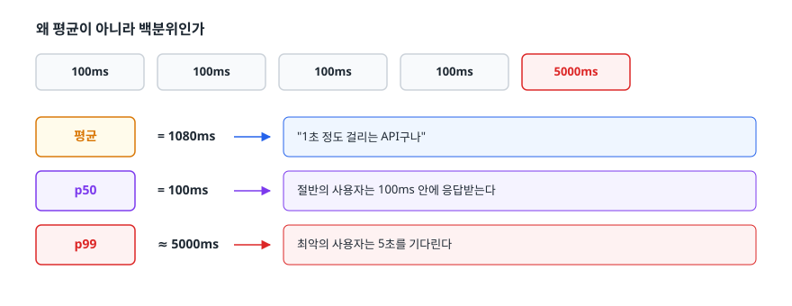
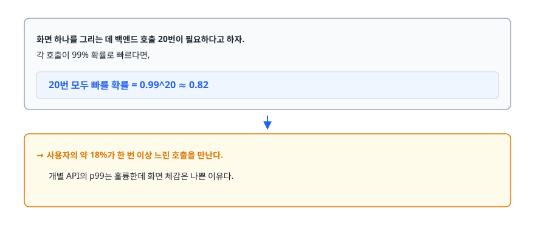
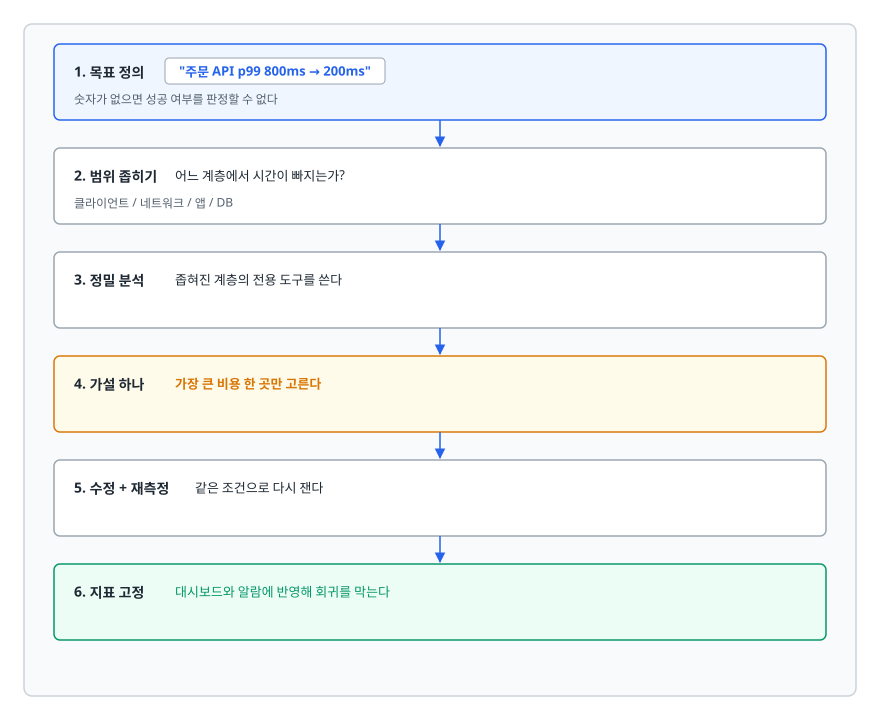
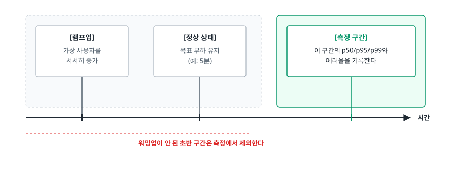

# 성능 병목 분석과 최적화 (Performance Bottleneck Analysis)

> 이 문서는 기법보다 절차를 다룹니다. 왜 측정 없는 최적화가 거의 항상 실패하는지, 병목을 계층별로 좁혀 들어가는 절차가 무엇인지, 평균이 아니라 p99를 봐야 하는 이유가 무엇인지를 설명합니다.

## 학습 목표

- [ ] 측정 없이 최적화하면 왜 실패하는지 두 가지 이유로 설명할 수 있다
- [ ] 메모리·SSD·네트워크의 지연 시간을 자릿수 단위로 비교할 수 있다
- [ ] 지연과 처리량을 구분하고 SLI·SLO·SLA의 관계를 말할 수 있다
- [ ] 평균 대신 p95/p99를 보는 이유를 계산 예시로 설명할 수 있다
- [ ] 클라이언트부터 DB까지 계층을 좁혀가며 병목을 찾는 절차를 말할 수 있다
- [ ] N+1, 인덱스 누락, 커넥션 풀 고갈의 증상과 대응을 안다
- [ ] 부하 테스트를 설계할 때 빠지기 쉬운 함정을 피할 수 있다

## 선행 지식

- 없음 — 이 문서부터 시작해도 됩니다
- 함께 보면 좋은 문서: [N+1 문제](../../02-backend-engineering/database/03-n-plus-one-problem.md), [인덱스와 B-Tree](../../02-backend-engineering/database/05-indexing-btree.md)

---

## 1. 왜 필요한가

### 감으로 한 최적화가 실패하는 두 가지 방식

"이 부분이 느릴 것 같아서 고쳤다"는 접근은 두 가지 방식으로 실패합니다.

**첫째, 병목이 아닌 곳을 고칩니다.** 전체 응답 시간이 1000ms인데 그중 900ms가 DB 쿼리라면, 애플리케이션 로직을 아무리 다듬어도 개선 폭은 최대 100ms 안쪽입니다. 반나절 걸려 자바 코드를 최적화해 50ms를 줄였다면 전체 응답은 5% 빨라집니다. 같은 시간에 인덱스 하나를 추가했다면 80%가 빨라졌을 수 있습니다.

**둘째, 개선됐는지 알 수 없습니다.** 기준선(baseline)이 없으면 "빨라진 것 같다"는 인상만 남습니다. 사실은 그날 트래픽이 적었을 뿐인데 최적화 덕분이라고 믿게 됩니다. 그 믿음이 다음 판단을 계속 오염시킵니다.

그래서 최적화의 첫 단계는 **숫자를 만드는 것**입니다. 코드를 여는 일은 그다음입니다. "주문 API p99가 800ms인데 200ms로 줄인다" 같은 문장이 없으면 시작한 것이 아닙니다.

### 비유

집이 추워서 난방비가 많이 나온다고 해 보겠습니다. 감으로 창문을 이중창으로 바꾸고, 커튼을 두꺼운 걸로 바꾸고, 문풍지를 붙입니다. 그런데 실제로는 지붕 단열재가 빠져 있어서 열의 70%가 위로 나가고 있었다면, 앞의 세 가지 공사를 다 해도 난방비는 크게 안 줄어듭니다. 열화상 카메라로 한 번 찍었다면 5분 만에 알 수 있었습니다.

> **비유의 한계**: 열화상 카메라는 원인을 바로 보여 줍니다. 성능 프로파일링은 "여기가 오래 걸린다"까지만 알려 주고, 왜 오래 걸리는지는 여전히 사람이 판단해야 합니다. 도구는 범위를 좁혀 줄 뿐 답을 주지 않습니다.

---

## 2. 지연 시간 숫자 감각

최적화 판단의 상당수는 이 작업이 저 작업보다 몇 배 비싼지만 알아도 내려집니다. 정확한 값은 외울 필요가 없습니다. **자릿수**만 알면 됩니다.

| 작업 | 대략적인 시간 | 메모리 대비 |
|------|-------------|-----------|
| CPU L1 캐시 접근 | 약 1 나노초 | 0.01배 |
| 메인 메모리 접근 | 약 100 나노초 | 1배 (기준) |
| SSD 임의 읽기 | 약 20 마이크로초 | 약 200배 |
| 같은 데이터센터 내 네트워크 왕복 | 약 0.5 밀리초 | 약 5,000배 |
| HDD 탐색 | 약 10 밀리초 | 약 100,000배 |
| 서울 ↔ 미국 서부 왕복 | 약 150 밀리초 | 약 1,500,000배 |

숫자가 잘 안 와닿으면 **메모리 접근 1회를 1초로 확대**해 보겠습니다.

```
   메모리 접근      1초
   SSD 읽기         약 3분 20초
   같은 DC 왕복     약 1시간 20분
   HDD 탐색         약 28시간
   대륙 간 왕복     약 17일
```

여기서 실무 규칙 몇 개가 바로 나옵니다.

- **네트워크 왕복 횟수를 줄이는 것이 왕복 시간을 줄이는 것보다 효과적입니다.** 그래서 N+1 문제가 치명적입니다. 쿼리 하나하나는 빨라도 100번 왕복하면 이야기가 달라집니다.
- 디스크에 안 가는 것이 가장 빠릅니다. 그래서 캐시가 존재하고 인덱스가 풀스캔보다 극적으로 빠릅니다.
- **사용자와 서버의 물리적 거리는 코드로 못 줄입니다.** CDN을 쓰는 이유가 이것입니다. 대륙 간 왕복 150ms는 어떤 최적화로도 사라지지 않습니다.

---

## 3. 지표를 정확히 읽는 법

### 지연과 처리량은 다른 축이다

둘은 같이 쓰이지만 재는 대상이 다르고, 심지어 서로 반대로 움직이기도 합니다.

- **지연(latency)** — 요청 하나가 처리되기까지 걸리는 시간. 단위는 밀리초.
- **처리량(throughput)** — 단위 시간에 처리한 요청 수. 단위는 TPS/RPS.

```
   고속도로로 비유하면

   지연   = 서울에서 부산까지 가는 데 걸리는 시간
   처리량 = 한 시간에 이 도로를 통과한 차량 수

   차선을 늘리면 처리량은 오르지만 주행 시간은 그대로다.
   차가 가득 차면 처리량은 유지되면서 주행 시간만 늘어난다.
```

그래서 "성능을 개선했다"는 말은 어느 쪽인지 밝히지 않으면 의미가 없습니다. 배치나 병렬 처리로 처리량을 올리면 개별 요청은 대기가 늘어 지연이 나빠지는 일이 흔합니다. **목표를 정할 때 둘 중 무엇이 우선인지 먼저 정합니다.**

### SLI · SLO · SLA

성능 목표를 조직 안에서 말이 되게 만드는 세 단어입니다.

| 용어 | 무엇인가 | 예시 |
|------|---------|------|
| SLI (Service Level Indicator) | 실제로 측정하는 지표 | 주문 API 응답 시간 p99, 5xx 비율 |
| SLO (Service Level Objective) | 그 지표에 대해 우리가 정한 목표 | "주문 API p99 < 300ms를 30일 중 99%의 시간 동안 만족" |
| SLA (Service Level Agreement) | 고객과 맺은 계약과 위반 시 보상 | "월 가용성 99.9% 미만이면 요금 크레딧 제공" |

SLI 없이는 SLO를 말할 수 없고, SLO 없이는 SLA를 말할 수 없습니다. 그리고 **SLO는 100%로 잡지 않습니다.** 100%를 목표로 두면 모든 배포가 위험 행위가 되어 아무것도 바꿀 수 없게 됩니다. 99.9%처럼 여유를 남겨 두면, 그 여유분(에러 예산)만큼은 새 기능을 내보내는 데 써도 된다는 판단이 가능해집니다.

### 왜 평균이 아니라 백분위인가

응답 시간 5개를 측정했다고 해 보겠습니다.

<!-- diagram:sd-performance-optimization-1 -->


<!-- 위 그림이 대체한 원본 ASCII.
     내용을 고칠 때는 그림도 함께 갱신할 것.
```
   100ms, 100ms, 100ms, 100ms, 5000ms

   평균  = 1080ms   → "1초 정도 걸리는 API구나"
   p50   = 100ms    → 절반의 사용자는 100ms 안에 응답받는다
   p99   ≈ 5000ms   → 최악의 사용자는 5초를 기다린다
```
-->

평균 1080ms는 **어떤 사용자의 경험도 대표하지 않습니다.** 실제로 1080ms 근처에 있던 요청은 하나도 없습니다. 평균은 이상치를 희석해서 아무도 겪지 않은 중간값을 만들어냅니다.

백분위는 그 반대입니다. **p99 = 500ms는 "100명 중 1명은 500ms 이상 기다린다"는, 실제 사람이 겪는 경험을 그대로 말합니다.**

### 꼬리 지연 증폭 (Tail Amplification)

"1%면 별거 아니지 않나"라고 생각하기 쉬운데, 현대 서비스에서는 그렇지 않습니다.

<!-- diagram:sd-performance-optimization-2 -->


<!-- 위 그림이 대체한 원본 ASCII.
     내용을 고칠 때는 그림도 함께 갱신할 것.
```
   화면 하나를 그리는 데 백엔드 호출 20번이 필요하다고 하자.
   각 호출이 99% 확률로 빠르다면,

   20번 모두 빠를 확률 = 0.99^20 ≈ 0.82

   → 사용자의 약 18%가 한 번 이상 느린 호출을 만난다.
     개별 API의 p99는 훌륭한데 화면 체감은 나쁜 이유다.
```
-->

마이크로서비스로 쪼갤수록 이 효과가 커집니다. **p99를 SLO로 잡는다는 말이 나오는 것은 이 계산 때문입니다.** 통계적 취향의 문제가 아닙니다.

같은 이유로 **캐시 히트율만 보면 안 됩니다.** 히트율 99%면 평균은 아름답지만 p99는 정확히 그 미스 1%가 결정합니다. 캐시를 붙인 뒤에도 미스 경로가 감당 가능한지 따로 확인해야 합니다.

---

## 4. 병목을 찾는 절차

<!-- diagram:sd-performance-optimization-3 -->


<!-- 위 그림이 대체한 원본 ASCII.
     내용을 고칠 때는 그림도 함께 갱신할 것.
```
   ┌─────────────────────────────────────────────────────────┐
   │ 1. 목표 정의   "주문 API p99 800ms → 200ms"             │
   │               숫자가 없으면 성공 여부를 판정할 수 없다     │
   │                          ↓                               │
   │ 2. 범위 좁히기 어느 계층에서 시간이 빠지는가?             │
   │               클라이언트 / 네트워크 / 앱 / DB            │
   │                          ↓                               │
   │ 3. 정밀 분석   좁혀진 계층의 전용 도구를 쓴다            │
   │                          ↓                               │
   │ 4. 가설 하나   가장 큰 비용 한 곳만 고른다               │
   │                          ↓                               │
   │ 5. 수정 + 재측정  같은 조건으로 다시 잰다                │
   │                          ↓                               │
   │ 6. 지표 고정   대시보드와 알람에 반영해 회귀를 막는다     │
   └─────────────────────────────────────────────────────────┘
```
-->

4단계에서는 **한 번에 하나만 고치는 것**이 중요합니다. 세 곳을 동시에 고치면 무엇이 효과가 있었는지 알 수 없습니다. 그중 하나가 오히려 악화 요인이었어도 다른 개선에 가려 드러나지 않습니다.

### 계층별 점검

| 계층 | 무엇을 보나 | 도구 |
|------|-----------|------|
| 클라이언트 | 렌더링, 번들 크기, 요청 개수 | 브라우저 개발자 도구, Lighthouse |
| 네트워크 | TTFB, TLS 핸드셰이크, 재전송, 거리 | 개발자 도구 네트워크 탭, `curl -w` |
| 로드밸런서·게이트웨이 | 대기 큐, 업스트림 응답 시간 | 접근 로그, LB 메트릭 |
| 애플리케이션 | 어느 메서드가 오래 걸리나, GC, 스레드 상태 | APM, 프로파일러, 스레드 덤프 |
| 데이터베이스 | 느린 쿼리, 실행 계획, 락 대기 | 슬로 쿼리 로그, `EXPLAIN ANALYZE` |
| 시스템 | CPU·메모리·디스크·네트워크 포화 | `top`, `vmstat`, `iostat` |

**순서는 위에서 아래로 내려가는 것이 원칙**입니다. 사용자가 느낀 시간에서 출발해, 그중 얼마가 어디서 쓰였는지 나눠 봐야 합니다. 반대로 DB부터 뒤지기 시작하면 사실은 이미지 5MB를 그대로 내려보내는 게 원인이었는데도 며칠을 씁니다.

실제 분포에서는 **DB에서 대부분이 풀립니다.** 웹 애플리케이션 성능 문제의 압도적 다수는 쿼리 문제입니다. 범위를 좁히기 전이라도 슬로 쿼리 로그를 먼저 한 번 열어 보면 비용 대비 효과가 좋습니다.

---

## 5. 대표 병목과 대응

### N+1 쿼리

```java
// 안티패턴
List<Order> orders = orderRepository.findAll();      // 쿼리 1번
for (Order order : orders) {
    System.out.println(order.getMember().getName()); // 주문 수만큼 추가 쿼리
}
```

**왜 문제인가**: 주문이 100건이면 쿼리가 101번 나갑니다. 쿼리 하나가 2ms로 빨라도 왕복 100번이면 200ms입니다. 2절에서 본 대로 **네트워크 왕복 횟수 자체가 비용**이기 때문입니다. 게다가 데이터가 늘수록 선형으로 나빠집니다. 개발 환경(주문 10건)에서는 멀쩡하다가 운영(주문 5000건)에서 터집니다.

```java
// 개선 — 한 번의 조인으로 함께 가져온다
@Query("SELECT o FROM Order o JOIN FETCH o.member")
List<Order> findAllWithMember();
```

컬렉션이 두 개 이상이라 조인이 곤란하면 `@BatchSize`로 `IN` 절 묶음 조회를 씁니다. 자세한 내용은 [N+1 문제 문서](../../02-backend-engineering/database/03-n-plus-one-problem.md)에서 다룹니다.

### 인덱스 누락

가장 흔하고, 고쳤을 때 효과가 가장 큰 병목입니다. 실행 계획에서 전체 스캔이 보이면 의심합니다.

```sql
EXPLAIN ANALYZE SELECT * FROM orders WHERE user_id = 123;
-- Seq Scan on orders  (cost=0.00..20834.00 rows=12 width=64)
--                     (actual time=0.089..2301.412 rows=12 loops=1)
--   Filter: (user_id = 123)
--   Rows Removed by Filter: 999988      ← 100만 행을 읽고 12행만 남겼다
-- Execution Time: 2301.480 ms
```

100만 행을 읽어 12행을 반환했다는 뜻입니다. 인덱스를 추가하면 필요한 12행만 읽습니다.

```sql
CREATE INDEX idx_orders_user_id ON orders (user_id);
```

다만 인덱스는 공짜가 아닙니다. **쓰기마다 인덱스도 갱신되므로 삽입·수정이 느려지고 저장 공간도 늘어납니다.** "일단 다 걸어두자"는 접근을 피하고 실제 쿼리 패턴에 맞춰 필요한 것만 겁니다.

### 커넥션 풀 고갈

```java
// 안티패턴 — 트랜잭션 안에서 외부 API를 호출한다
@Transactional
public void placeOrder(OrderRequest request) {
    Order order = orderRepository.save(request.toEntity());
    notificationClient.send(order);      // 외부 API. 200ms 걸린다
    orderRepository.updateStatus(order.getId(), SENT);
}                                        // 여기서야 커넥션 반납
```

**왜 문제인가**: DB 커넥션을 쥔 채 200ms 동안 외부 응답을 기다립니다. 풀 크기가 10이라면 **동시 요청 10건만으로 풀이 빕니다.** 11번째 요청부터는 커넥션을 기다리다 타임아웃이 나고, 사용자에게는 500 오류가 나갑니다. 증상이 "서버는 살아 있는데 DB 관련 기능만 안 되는" 형태로 나타나 원인을 찾기 어렵습니다. 외부 API가 평소보다 조금만 느려져도 즉시 장애가 되는 구조입니다.

```java
// 개선 — 커넥션이 필요한 구간만 트랜잭션으로 묶는다
@Service
@RequiredArgsConstructor
public class OrderPersistenceService {

    private final OrderRepository orderRepository;

    @Transactional
    public Order save(OrderRequest request) {
        return orderRepository.save(request.toEntity());
    }                                        // 여기서 커넥션 반납
}

@Service
@RequiredArgsConstructor
public class OrderFacade {

    private final OrderPersistenceService persistence;
    private final NotificationClient notificationClient;

    public void placeOrder(OrderRequest request) {   // 트랜잭션 없음
        Order order = persistence.save(request);     // 저장이 끝나며 커넥션 반납
        notificationClient.send(order);              // 커넥션을 안 쥔 상태에서 호출
    }
}
```

두 메서드를 **같은 클래스에 두면 안 됩니다.** `@Transactional`은 프록시 기반이라 같은 클래스 안에서 부르는 내부 호출(self-invocation)에는 적용되지 않습니다. 한 클래스에 그대로 두면 트랜잭션이 아예 시작되지 않아, 고치려던 문제와 다른 문제가 생깁니다. 더 나은 방향은 알림 발송 자체를 메시지 큐로 빼서 응답 경로에서 아예 없애는 쪽입니다.

풀 크기를 두고도 오해가 많습니다. **크게 잡는다고 좋아지지 않습니다.** DB가 동시에 의미 있게 처리할 수 있는 쿼리 수는 결국 코어 수에 가깝고, 연결이 그보다 많아지면 컨텍스트 스위칭과 락 경합으로 오히려 처리량이 떨어집니다. 게다가 애플리케이션 인스턴스가 N대면 DB가 받는 총 연결은 `풀 크기 × N`이므로, 인스턴스를 늘릴 때 DB 쪽 한계를 반드시 함께 계산해야 합니다.

### GC 일시 정지

애플리케이션 코드는 빠른데 p99만 튀는 전형적인 원인입니다. GC 로그에서 Stop-the-World 구간의 길이와 빈도를 확인합니다.

원인은 셋입니다. 힙이 부족해 GC가 잦은 경우, 메모리 누수로 회수가 안 되는 경우, 힙이 지나치게 커서 한 번의 정지가 긴 경우입니다. 어느 쪽이냐에 따라 대응이 다릅니다. 힙 덤프로 어떤 객체가 쌓여 있는지 보는 것이 출발점입니다.

---

## 6. 부하 테스트

수정한 뒤 "빨라진 것 같다"로 끝내지 않으려면 같은 조건으로 다시 재야 합니다. 그 조건을 만들어주는 것이 부하 테스트입니다.

<!-- diagram:sd-performance-optimization-4 -->


<!-- 위 그림이 대체한 원본 ASCII.
     내용을 고칠 때는 그림도 함께 갱신할 것.
```
   [램프업]        [정상 상태]           [측정 구간]
   가상 사용자를    목표 부하 유지         이 구간의 p50/p95/p99와
   서서히 증가     (예: 5분)             에러율을 기록한다
      │              │                      │
   ───┴──────────────┴──────────────────────┴───► 시간
   워밍업이 안 된 초반 구간은 측정에서 제외한다
```
-->

도구는 k6(자바스크립트로 시나리오 작성), JMeter(GUI 기반), Gatling 등이 있습니다. 무엇을 쓰든 아래 함정은 공통입니다.

- **로컬에서 측정하지 않습니다.** 데이터 100건짜리 로컬 DB와 1000만 건짜리 운영 DB는 실행 계획 자체가 다릅니다. 로컬에서 빠른 쿼리가 운영에서 풀스캔을 타는 일은 흔합니다.
- JVM은 처음엔 인터프리터로 실행하다가 JIT 컴파일 후에야 빨라지고, 커넥션 풀과 캐시도 채워지는 시간이 필요합니다. 시작 직후 수치를 포함하면 결과가 왜곡되므로 **워밍업 구간은 제외합니다.**
- **캐시가 다 채워진 상태만 재지 않습니다.** 같은 요청을 반복하면 캐시 히트율 100%가 되어 실제와 다른 결과가 나옵니다. 실제 트래픽과 비슷한 키 분포로 요청을 만들어야 합니다.
- 평균만 기록하지 않습니다. 3절의 이유 그대로이므로 리포트에는 p50/p95/p99와 에러율이 함께 있어야 합니다.

---

## 7. 실무에서는

- **관측 가능성이 먼저입니다.** APM이나 분산 트레이싱이 없는 상태에서 병목을 찾는 것은 눈을 감고 하는 일입니다. 도구를 붙이는 데 드는 시간이 병목을 감으로 찾는 시간보다 항상 짧습니다.
- 개선은 코드 밖에서 오는 경우가 많습니다. 인덱스 추가, 커넥션 풀 조정, 캐시 도입, 비동기화 같은 것들이 코드 리팩터링보다 훨씬 큰 폭을 만듭니다. 알고리즘 개선이 필요한 상황은 생각보다 드뭅니다.
- 한 번 고친 성능도 새 기능이 들어오면서 조용히 되돌아갑니다. 그러니 개선한 지표는 알람에 겁니다. 회귀를 사람이 발견하게 두면 결국 장애로 발견됩니다.
- **성능 목표는 비즈니스 언어로 정의합니다.** "쿼리를 100ms 이하로"에서 "결제 완료 화면이 1초 안에 뜬다"까지 가야 어디까지 최적화할지 판단할 수 있습니다. 목표가 없으면 최적화는 끝나지 않습니다.

---

## 8. 면접 포인트

> 면접에서 이 주제가 나오면 이렇게 답한다

**Q. 성능 병목을 어떻게 찾나요?**

A. **측정 → 범위 좁히기 → 정밀 분석 → 한 곳만 수정 → 재측정** 순서로 갑니다. 먼저 "주문 API p99를 800ms에서 200ms로" 같은 정량 목표를 세우고, APM이나 트레이싱으로 어느 계층에서 시간이 빠지는지 좁힙니다. DB로 좁혀지면 슬로 쿼리 로그와 실행 계획을, JVM이면 GC 로그와 프로파일러를 봅니다. 그다음 **가장 큰 비용 한 곳만** 고치는데, 여러 곳을 동시에 고치면 무엇이 효과였는지 알 수 없기 때문입니다. 마지막으로 같은 부하 조건에서 재측정하고 지표를 알람에 겁니다.
- 꼬리 질문: "경험상 어디가 가장 많이 걸리나요?" → 웹 애플리케이션은 대부분 DB입니다. 인덱스 누락과 N+1이 압도적으로 많고, 그래서 범위를 좁히기 전이라도 슬로 쿼리 로그를 먼저 열어보는 것이 효율적입니다.

**Q. 왜 평균이 아니라 p99를 보나요?**

A. 평균은 이상치를 희석해서 **아무도 겪지 않은 값**을 만들어냅니다. 100ms 네 번과 5000ms 한 번의 평균은 1080ms인데, 실제로 그 근처에 있던 요청은 하나도 없습니다. 게다가 화면 하나가 백엔드 호출 20번으로 구성된다면 개별 호출이 99% 확률로 빨라도 20번 모두 빠를 확률은 약 82%라서, **사용자의 18%가 느린 호출을 한 번은 만납니다.** 이 꼬리 지연 증폭 때문에 p99를 SLO로 잡습니다.
- 꼬리 질문: "캐시를 붙였는데 p99가 안 좋아졌습니다" → p99는 캐시 미스 경로가 결정합니다. 히트율이 99%여도 미스 1%가 2초 걸리면 p99는 2초입니다. 미스 경로를 따로 최적화하거나 스탬피드 방어를 확인합니다.

**Q. 커넥션 풀 사이즈는 어떻게 정하나요?**

A. **크게 잡는다고 좋아지지 않습니다.** DB가 동시에 의미 있게 처리하는 쿼리 수는 결국 코어 수에 가깝고, 연결이 그보다 많으면 컨텍스트 스위칭과 락 경합으로 처리량이 오히려 떨어집니다. DB 코어 수의 2~4배 정도에서 출발해 풀 대기 시간을 모니터링하며 조정합니다. 또 애플리케이션 인스턴스가 N대면 DB가 받는 총 연결은 `풀 크기 × N`이므로, 인스턴스를 늘릴 때 DB 한계를 함께 계산해야 합니다. 필요하면 PgBouncer 같은 외부 풀러로 총 연결 수를 통제합니다.
- 꼬리 질문: "풀이 자꾸 고갈되면 무엇부터 보나요?" → 풀 크기보다 먼저 **트랜잭션 안에서 외부 API를 호출하는 코드**를 찾습니다. 커넥션을 쥔 채 네트워크를 기다리면 풀 크기를 아무리 키워도 부족합니다.

**Q. 부하 테스트에서 주의할 점은?**

A. 운영과 비슷한 데이터 규모에서 측정해야 합니다. 데이터 100건짜리 로컬에서는 실행 계획 자체가 달라서 결과가 무의미합니다. 또 JVM의 JIT 워밍업과 커넥션 풀 초기화가 끝난 뒤 구간만 측정에 넣어야 하고, 같은 요청만 반복하면 캐시 히트율이 100%가 되어 실제와 다른 수치가 나오므로, **실제 트래픽과 비슷한 키 분포**로 요청을 만들어야 합니다. 리포트에는 평균 대신 p50/p95/p99와 에러율을 함께 기록합니다.
- 꼬리 질문: "처리량을 올렸더니 응답 시간이 나빠졌습니다" → 배치나 병렬화로 처리량을 올리면 개별 요청은 대기가 늘어납니다. 처리량과 지연은 특정 최적화에서 트레이드오프 관계이므로 어느 쪽이 목표인지 먼저 정해야 합니다.

---

## 자주 하는 실수

| 실수 | 왜 틀렸나 | 올바른 이해 |
|------|----------|-----------|
| 느릴 것 같은 코드를 먼저 고친다 | 병목이 아닌 곳을 고치면 전체 개선 폭은 그 구간의 비중을 넘지 못한다 | 측정으로 비중을 확인한 뒤 가장 큰 곳부터 고친다 |
| 평균 응답 시간으로 성능을 평가한다 | 평균은 이상치를 희석해 아무도 겪지 않은 값을 만든다 | p50/p95/p99를 함께 본다. SLO는 백분위로 잡는다 |
| 여러 곳을 한꺼번에 최적화한다 | 무엇이 효과였는지, 무엇이 악화 요인이었는지 알 수 없다 | 한 번에 하나만 고치고 재측정한다 |
| 커넥션 풀을 크게 잡으면 빨라진다 | DB의 동시 처리 능력에는 상한이 있고 넘으면 오히려 느려진다 | 코어 수 기준으로 잡고 인스턴스 수를 곱한 총량을 확인한다 |
| 로컬에서 성능을 측정한다 | 데이터 규모가 달라 실행 계획과 캐시 동작이 전부 다르다 | 운영과 유사한 데이터·환경에서 측정한다 |
| 캐시를 붙였으니 성능 문제는 끝났다 | p99는 캐시 미스 경로가 결정한다 | 미스 경로의 지연과 스탬피드 방어를 따로 확인한다 |

---

## 한 줄 정리

최적화는 **절차**의 문제입니다. 코드 실력은 그다음입니다. 정량 목표를 세우고, 계층을 좁혀 가장 큰 병목 하나만 고친 뒤 같은 조건으로 다시 잽니다. 이 순환을 지키는 것이 어떤 기교보다 효과가 큽니다.

---

## 연관 개념

- [02-web-performance.md](./02-web-performance.md) - 같은 원칙을 브라우저와 프런트엔드 계층에 적용하기
- [qna-performance.md](./qna-performance.md) - 성능 지표, 병목 분석, 커넥션 풀 면접 질문 (Q1~Q6)
- [../caching/01-caching-strategies.md](../caching/01-caching-strategies.md) - 대표적인 병목 해소 수단인 캐시의 전략과 함정
- [../scalability/02-load-balancing-sharding.md](../scalability/02-load-balancing-sharding.md) - 최적화로 안 되면 나누는 단계
- [../../02-backend-engineering/database/03-n-plus-one-problem.md](../../02-backend-engineering/database/03-n-plus-one-problem.md) - N+1의 원인과 해결책 상세
- [../../02-backend-engineering/database/05-indexing-btree.md](../../02-backend-engineering/database/05-indexing-btree.md) - 인덱스가 왜 빠른지, 언제 안 타는지
- [../../02-backend-engineering/java-fundamentals/03-garbage-collection.md](../../02-backend-engineering/java-fundamentals/03-garbage-collection.md) - GC 일시 정지가 p99를 흔드는 메커니즘
- [../../10-cloud-engineering/monitoring-observability/01-observability-concepts.md](../../10-cloud-engineering/monitoring-observability/01-observability-concepts.md) - 병목을 찾기 위한 관측 도구의 기본 개념
