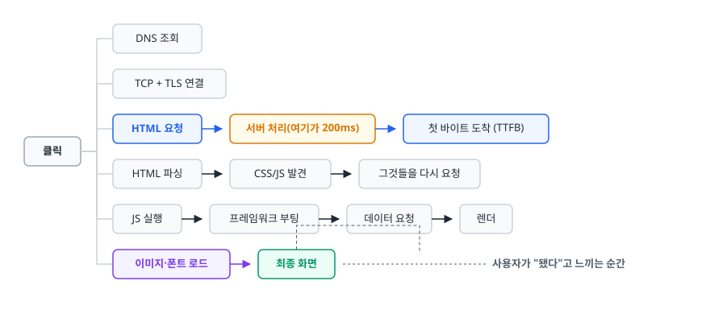

# 웹 성능 최적화 (Web Performance)

> 이 문서를 읽고 나면 Core Web Vitals 세 지표가 각각 무엇을 재는지, 그 숫자를 움직이는 실제 수단이 무엇인지 설명할 수 있게 됩니다. Lab 데이터와 Field 데이터가 왜 다르게 나오는지도 마찬가지입니다.

## 학습 목표

- [ ] LCP·INP·CLS가 각각 어떤 사용자 경험을 수치화한 것인지 말할 수 있다
- [ ] 각 지표를 개선하는 수단을 원인별로 연결할 수 있다
- [ ] 코드 스플리팅·이미지·폰트 최적화가 어느 지표를 움직이는지 안다
- [ ] 렌더 블로킹 리소스와 `defer`/`async`의 차이를 설명할 수 있다
- [ ] HTTP/2·HTTP/3와 리소스 힌트가 무엇을 줄여주는지 안다
- [ ] Lab 데이터와 Field 데이터를 구분해서 해석할 수 있다

## 선행 지식

- [01-performance-optimization.md](./01-performance-optimization.md) - 측정 기반 최적화라는 공통 원칙
- [브라우저 렌더링 과정](../../03-frontend-engineering/browser-fundamentals/02-critical-rendering-path.md) - HTML이 화면이 되기까지

---

## 1. 왜 필요한가

백엔드 API가 200ms에 응답한다고 해서 사용자가 200ms 만에 화면을 보는 것은 아닙니다. 사용자가 실제로 겪는 시간은 이렇게 구성됩니다.

<!-- diagram:sd-web-performance-1 -->


<!-- 위 그림이 대체한 원본 ASCII.
     내용을 고칠 때는 그림도 함께 갱신할 것.
```
   클릭 ─┬─ DNS 조회
         ├─ TCP + TLS 연결
         ├─ HTML 요청 → 서버 처리(여기가 200ms) → 첫 바이트 도착 (TTFB)
         ├─ HTML 파싱 → CSS/JS 발견 → 그것들을 다시 요청
         ├─ JS 실행 → 프레임워크 부팅 → 데이터 요청 → 렌더
         └─ 이미지·폰트 로드 → 최종 화면
                                              사용자가 "됐다"고 느끼는 순간
```
-->

**서버 시간은 이 전체의 일부에 불과합니다.** 나머지는 네트워크 왕복 횟수, 다운로드해야 할 바이트 양, 메인 스레드에서 실행되는 자바스크립트가 결정합니다. 그래서 백엔드 최적화와 웹 성능 최적화는 별개의 작업입니다.

또 하나, 웹 성능은 **측정 대상이 "시간"만이 아닙니다.** 화면이 빨리 떠도 버튼을 눌렀는데 반응이 없거나, 읽던 글이 갑자기 아래로 밀리면 사용자는 느리고 불쾌하다고 느낍니다. Core Web Vitals는 이렇게 서로 다른 세 가지 불편을 각각 수치화하려는 시도입니다.

### 비유

식당에 앉았을 때 불편한 순간은 세 종류입니다. 음식이 늦게 나오는 것(LCP), 직원을 불렀는데 쳐다보지도 않는 것(INP), 밥 먹는 중에 옆에서 테이블을 밀어 접시가 흔들리는 것(CLS). 셋은 원인도 해결책도 달라서, 주방을 늘려도 홀 직원이 부족한 문제는 안 풀립니다.

> **비유의 한계**: 식당에서는 이 세 가지를 사람이 체감으로 판단합니다. 웹은 무엇이 나쁜지 숫자로 먼저 특정해야 합니다. "느린 것 같다"에서 출발해 손대면 대개 이미 괜찮은 지표를 더 다듬게 됩니다. 어느 지표가 기준 밖인지부터 확인합니다.

---

## 2. Core Web Vitals

| 지표 | 무엇을 재나 | 좋음 기준 | 나쁨 기준 | 주 개선 수단 |
|------|-----------|----------|----------|------------|
| LCP (Largest Contentful Paint) | **로딩** — 가장 큰 콘텐츠가 그려지기까지 | 2.5초 이하 | 4.0초 초과 | 서버 응답, 이미지 최적화, 렌더 블로킹 제거 |
| INP (Interaction to Next Paint) | **반응성** — 상호작용 후 다음 화면 갱신까지 | 200ms 이하 | 500ms 초과 | 긴 작업 쪼개기, 메인 스레드 부담 줄이기 |
| CLS (Cumulative Layout Shift) | **시각적 안정성** — 예기치 않은 레이아웃 이동량 | 0.1 이하 | 0.25 초과 | 공간 미리 확보, 폰트 교체 대비 |

> 세 지표는 **실사용자의 75 백분위수**로 평가합니다. 목표는 평균값이 아니라, 사용자의 4분의 3이 이 기준을 만족하는 것입니다. 앞 문서 3절의 이유와 같습니다.

### 함께 보는 보조 지표

셋만으로는 "왜 나쁜지"를 알 수 없어서 원인 쪽에 가까운 지표를 함께 봅니다.

| 지표 | 무엇을 재나 | 어느 핵심 지표를 진단하나 |
|------|-----------|------------------------|
| TTFB (Time to First Byte) | 요청부터 응답 첫 바이트까지 | LCP의 첫 조각. 여기가 크면 서버·CDN 문제다 |
| FCP (First Contentful Paint) | 무엇이든 처음 그려진 시점 | LCP와의 간격이 크면 대표 콘텐츠 로딩이 늦는 것이다 |
| TBT (Total Blocking Time) | 로딩 중 메인 스레드가 막힌 총 시간 | INP의 Lab 대리 지표. 6절에서 다시 다룬다 |

> 진단은 이 순서로 갑니다. **핵심 지표로 무엇이 나쁜지 특정하고, 보조 지표로 어디서 시간이 빠졌는지 좁힙니다.** 보조 지표는 목표가 아닙니다. TBT를 0으로 만드는 것 자체가 목적이 되면, 정작 사용자가 겪는 INP는 그대로인데 숫자만 좋아지는 최적화를 하게 됩니다.

### LCP — 왜 느린지를 네 조각으로 나눠라

LCP는 뷰포트 안에서 가장 큰 이미지나 텍스트 블록이 렌더링된 시점입니다. "메인 콘텐츠가 보이는 순간"의 근사치라고 보면 됩니다.

LCP를 개선하려면 **그 시간이 어디서 소모됐는지 나눠 봐야 합니다.**

```
   [1] TTFB          서버가 첫 바이트를 보내기까지
   [2] 리소스 발견 지연  브라우저가 그 이미지의 존재를 알기까지
   [3] 리소스 다운로드   실제로 받는 시간
   [4] 렌더 지연       받았는데 화면에 그리기까지 (메인 스레드가 막혀 있었다)
   ──────────────────────────────────────────────► LCP
```

조각마다 대응이 다릅니다.

- **[1]이 크면** 백엔드나 CDN 문제입니다. 앞 문서의 절차로 서버 측을 파야 합니다.
- **[2]가 크면** 그 이미지가 JS 실행 후에야 요청되고 있을 가능성이 높습니다. HTML에 직접 넣거나 `<link rel="preload">`로 미리 알립니다.
- **[3]이 크면** 이미지가 너무 큽니다. 포맷과 크기를 줄입니다.
- **[4]가 크면** 메인 스레드가 자바스크립트로 막혀 있습니다. 번들을 줄이거나 쪼갭니다.

```html
<!-- 안티패턴 — 첫 화면의 대표 이미지에 lazy loading을 걸었다 -->

```

**왜 문제인가**: `loading="lazy"`는 "뷰포트에 가까워질 때까지 요청하지 마라"는 지시입니다. 그런데 이 이미지는 처음부터 뷰포트 안에 있는 LCP 요소입니다. 브라우저는 레이아웃 계산을 끝내고 "이 이미지가 화면 안에 있다"를 확인한 뒤에야 요청을 시작합니다. 그래서 **아무것도 안 했을 때보다 오히려 늦어집니다.** lazy loading은 스크롤해야 보이는 이미지에만 쓰는 도구입니다.

```html
<!-- 개선 — 첫 화면 이미지는 오히려 우선순위를 높인다 -->


<!-- 스크롤해야 보이는 이미지에만 lazy -->

```

`width`와 `height`를 함께 적은 이유는 CLS 때문입니다. 뒤에서 설명합니다.

### INP — 클릭했는데 반응이 없는 시간

INP는 클릭, 탭, 키 입력 같은 상호작용이 일어난 뒤 **화면이 실제로 갱신될 때까지**를 잽니다. 페이지 방문 전체에서 관측된 상호작용 중 최악에 가까운 값을 대표값으로 삼습니다.

**메인 스레드가 자바스크립트로 막혀 있어서 브라우저가 화면을 다시 그릴 틈이 없습니다.** 거의 언제나 이 하나가 원인입니다. 자바스크립트는 단일 스레드에서 실행되므로, 50밀리초 넘게 도는 작업(긴 작업, long task) 하나가 그동안의 모든 입력 처리를 밀어냅니다.

```js
// 안티패턴 — 클릭 핸들러가 메인 스레드를 통째로 점유한다
button.addEventListener('click', () => {
  const result = [];
  for (const row of tenThousandRows) {
    result.push(expensiveTransform(row));   // 800ms 동안 아무것도 못 그린다
  }
  render(result);
});
```

**왜 문제인가**: 이 루프가 도는 800ms 동안 브라우저는 화면 갱신도, 다른 입력 처리도 못 합니다. 사용자 눈에는 "버튼을 눌렀는데 아무 일도 안 일어나는" 상태입니다. 그래서 한 번 더 누르고, 그러면 같은 작업이 또 큐에 쌓입니다.

```js
// 개선 1 — 작업을 쪼개고 중간에 메인 스레드를 양보한다
async function processInChunks(rows, chunkSize = 200) {
  const result = [];
  for (let i = 0; i < rows.length; i += chunkSize) {
    for (const row of rows.slice(i, i + chunkSize)) {
      result.push(expensiveTransform(row));
    }
    await new Promise(resolve => setTimeout(resolve, 0));  // 브라우저에 틈을 준다
  }
  return result;
}

button.addEventListener('click', async () => {
  showSpinner();                              // 즉시 피드백 (INP는 여기서 결정된다)
  render(await processInChunks(tenThousandRows));
});
```

두 가지를 챙기면 됩니다. **첫째, 상호작용 직후 즉시 뭔가를 그려줍니다.** INP는 "작업이 끝날 때까지"가 아니라 "다음 화면 갱신까지"를 재므로, 스피너 하나만 먼저 그려도 지표가 크게 좋아지고 실제 체감도 나아집니다. **둘째, 긴 작업을 쪼개 중간중간 양보합니다.** 계산이 정말 무겁고 DOM을 건드릴 필요가 없다면 Web Worker로 옮기는 편이 낫습니다.

### CLS — 읽던 글이 밀려나는 문제

CLS는 사용자가 예상하지 못한 레이아웃 이동이 얼마나 쌓였는지를 잽니다. 이동한 요소가 화면에서 차지하는 비율과 이동 거리를 곱해 점수를 매깁니다. 광고나 이미지가 뒤늦게 로드되면서 본문을 아래로 밀어내는 상황이 대표적입니다.

세 가지가 레이아웃을 밀어냅니다.

1. **크기가 지정되지 않은 이미지·동영상.** 로드되기 전에는 높이가 0이었다가 갑자기 커집니다.
2. **동적으로 삽입되는 콘텐츠.** 배너, 공지, 광고가 기존 콘텐츠 위에 끼어듭니다.
3. **웹 폰트 교체.** 대체 폰트로 그려진 텍스트가 웹 폰트로 바뀌면서 글자 폭이 달라져 줄바꿈이 변합니다.

```css
/* 개선 — 로드되기 전에도 공간을 예약해둔다 */

/* 1. 이미지: HTML에 width/height 속성을 적어두면 브라우저가 그 비율로 공간을 미리 잡는다.
      반응형으로 줄어들 때도 비율이 유지되도록 아래 두 줄을 함께 둔다 */
img { max-width: 100%; height: auto; }

/* 2. 크기를 모르는 임베드는 종횡비로 예약 */
.video-embed { aspect-ratio: 16 / 9; width: 100%; }

/* 3. 동적 삽입 영역은 최소 높이를 미리 확보 */
.notice-slot { min-height: 60px; }
```

폰트 교체 문제는 조금 다릅니다. 웹 폰트가 로드되기 전 브라우저의 선택지는 둘입니다.

- **FOIT (Flash of Invisible Text)**: 폰트가 올 때까지 글자를 아예 안 그립니다. 사용자는 빈 화면을 봅니다. 보이지 않는 동안에도 글자는 대체 폰트 크기로 배치되므로 교체 순간 레이아웃이 밀릴 수 있습니다.
- **FOUT (Flash of Unstyled Text)**: 대체 폰트로 먼저 그리고 나중에 바꿉니다. 글자는 바로 보이지만 교체 순간 레이아웃이 밀립니다.

```css
@font-face {
  font-family: 'Pretendard';
  src: url('/fonts/pretendard.woff2') format('woff2');
  font-display: swap;   /* FOUT 선택: 대체 폰트로 먼저 보여준다 */
}
```

`font-display: swap`은 "글자를 빨리 보여준다"는 점에서 대체로 옳은 선택이지만 CLS를 만듭니다. 이동량을 줄이려면 **대체 폰트의 글자 크기를 웹 폰트에 맞춰 보정**하면 됩니다.

```css
@font-face {
  font-family: 'Pretendard Fallback';
  src: local('Apple SD Gothic Neo'), local('Malgun Gothic');
  size-adjust: 97%;   /* 실제 웹 폰트와 글자 폭을 맞춰 교체 시 밀림을 줄인다 */
}
body { font-family: 'Pretendard', 'Pretendard Fallback', sans-serif; }
```

수치는 폰트마다 다르므로 실측해서 맞춥니다. 레이아웃 이동을 절대 허용할 수 없는 화면이라면 `font-display: optional`을 써서 "제때 못 오면 웹 폰트를 아예 안 쓴다"를 선택할 수도 있습니다.

---

## 3. 리소스 로딩 최적화

### 코드 스플리팅

하나의 거대한 자바스크립트 번들은 두 번 손해입니다. 다운로드가 오래 걸리고(LCP), 파싱·실행이 메인 스레드를 점유합니다(INP). 첫 화면에 필요 없는 코드는 나중에 받으면 됩니다.

```jsx
// 관리자 대시보드의 차트 라이브러리는 첫 화면에 필요 없다
const HeavyChart = lazy(() => import('./HeavyChart'));

function Dashboard() {
  return (
    <Suspense fallback={<ChartSkeleton />}>
      <HeavyChart />
    </Suspense>
  );
}
```

분할 기준은 **라우트 단위**가 가장 무난합니다. 사용자가 방문하지 않은 페이지의 코드를 미리 받을 이유가 없습니다. 그다음이 모달·차트처럼 조건부로 열리는 무거운 컴포넌트입니다. 다만 지나치게 잘게 쪼개면 요청 수가 늘어 오히려 느려지므로, 청크 크기와 개수의 균형을 번들 분석 도구로 확인하며 잡습니다.

### 이미지

이미지는 대부분의 웹 페이지에서 전송 바이트의 최대 항목이고, 그래서 개선 효과도 가장 큽니다.

- **포맷**: 같은 화질에서 AVIF가 WebP보다 작고, WebP가 JPEG보다 작습니다. `<picture>`로 폴백을 두면 안전하게 최신 포맷을 쓸 수 있습니다.
- **크기**: 화면에 300px로 표시할 이미지를 3000px로 내려보내는 낭비가 가장 흔합니다. `srcset`과 `sizes`로 기기별로 다른 크기를 제공합니다.
- **지연 로딩**: 스크롤해야 보이는 것에만 `loading="lazy"`. 첫 화면 이미지에는 절대 쓰지 않습니다.

```html
<picture>
  <source type="image/avif" srcset="/hero-800.avif 800w, /hero-1600.avif 1600w"
          sizes="(max-width: 768px) 100vw, 800px">
  
</picture>
```

---

## 4. 렌더링 최적화

브라우저는 HTML을 파싱하다 외부 CSS와 동기 스크립트를 만나면 걸음을 멈춥니다. 다만 **둘이 막는 대상이 다릅니다.**

- **CSS는 화면을 그리는 것을 막습니다.** 파싱은 계속되지만, 스타일이 확정되기 전에 그리면 화면이 깜빡이므로 렌더링을 보류합니다.
- **동기 스크립트는 HTML 파싱 자체를 멈춥니다.** 그 스크립트가 DOM을 바꿀 수 있어서 뒤쪽 마크업을 미리 해석해둘 수 없기 때문입니다. 게다가 스크립트는 앞선 CSS가 적용된 뒤에야 실행되므로, 무거운 CSS 하나가 스크립트 실행까지 밀어냅니다.

이 둘을 묶어 렌더 블로킹 리소스라고 부릅니다.

```html
<!-- 안티패턴 — head의 동기 스크립트가 파싱 전체를 멈춘다 -->
<head>
  <script src="/analytics.js"></script>   <!-- 이걸 받아 실행할 때까지 파싱 정지 -->
</head>
```

```html
<!-- 개선 -->
<head>
  <script src="/analytics.js" defer></script>
</head>
```

| 속성 | 다운로드 | 실행 시점 | 순서 보장 | 언제 |
|------|---------|----------|----------|------|
| (없음) | 파싱 중단 후 | 즉시 | 보장 | 되도록 피한다 |
| `defer` | 파싱과 병렬 | HTML 파싱 완료 후 | 보장 | **기본 선택** |
| `async` | 파싱과 병렬 | 다운로드되는 즉시 | 없음 | 다른 스크립트와 무관한 독립 스크립트 |

CSS도 마찬가지입니다. 첫 화면에 필요한 최소한의 CSS만 인라인으로 넣고 나머지는 나중에 불러오는 기법을 크리티컬 CSS라고 합니다. 다만 관리 비용이 커서 LCP가 정말 안 나올 때 꺼내는 카드로 두는 편이 좋습니다.

렌더링이 시작된 뒤의 최적화는 대부분 **리플로우(reflow) 줄이기**로 모입니다. 요소의 크기나 위치를 바꾸면 레이아웃이 다시 계산되고 그 비용이 큽니다. 애니메이션은 `top`/`left` 대신 `transform`과 `opacity`로 하면 레이아웃 단계를 건너뛰고 합성 단계에서 처리되어 훨씬 쌉니다. 자세한 것은 [리플로우와 리페인트](../../03-frontend-engineering/browser-fundamentals/04-reflow-repaint.md) 문서를 참고합니다.

목록이 수천 개면 화면에 보이는 것만 DOM에 올리는 가상화(virtualization)를 씁니다. DOM 노드 수 자체가 메모리와 레이아웃 계산 비용을 결정하기 때문입니다.

---

## 5. 네트워크 계층

**HTTP/2의 멀티플렉싱**은 한 연결에서 여러 요청을 동시에 처리합니다. HTTP/1.1 시절에는 브라우저가 도메인당 연결 수를 6개 정도로 제한했습니다. 이를 우회하려고 정적 파일을 여러 서브도메인에 나눠 두는 도메인 샤딩 기법을 썼습니다. **HTTP/2에서는 이 기법이 오히려 손해입니다.** 연결이 늘어나 핸드셰이크 비용만 커집니다. 여러 파일을 하나로 합쳐 요청 수를 줄이려던 번들링 압박도 상당히 줄었습니다.

**HTTP/3**은 TCP 대신 UDP 기반 QUIC을 씁니다. HTTP/2에서도 패킷 하나가 유실되면 TCP 계층에서 모든 스트림이 함께 멈추는 문제가 남아 있었는데, QUIC은 스트림별로 독립적이라 이 현상이 없습니다. 모바일처럼 패킷 유실이 잦은 환경에서 차이가 큽니다.

**압축**은 텍스트 리소스에 필수입니다. HTML/CSS/JS는 Brotli나 gzip으로 압축해서 보냅니다. 이미 압축된 포맷(JPEG, WebP, 동영상)에 다시 압축을 거는 것은 CPU만 쓰고 효과가 없습니다.

**리소스 힌트**는 브라우저에 미리 알려주는 지시입니다.

```html
<!-- 이 도메인에 곧 요청할 것이다: DNS + TCP + TLS를 미리 끝내둔다 -->
<link rel="preconnect" href="https://api.example.com">

<!-- DNS만 미리 조회 (preconnect보다 가볍다) -->
<link rel="dns-prefetch" href="https://cdn.example.com">

<!-- 이 리소스는 반드시 곧 필요하다: 높은 우선순위로 지금 받아라 -->
<link rel="preload" href="/fonts/pretendard.woff2" as="font" type="font/woff2" crossorigin>
```

**`preload`는 남발하면 역효과**입니다. 하나의 우선순위를 올리면 다른 리소스의 우선순위가 그만큼 내려갑니다. 그래서 전부 preload 하면 아무것도 preload 하지 않은 것과 같아지고 대역폭 경쟁만 늘어납니다. LCP 이미지, 첫 화면 폰트처럼 **정말 확실한 두세 개에만** 씁니다.

---

## 6. 측정: Lab 데이터와 Field 데이터

| 구분 | Lab 데이터 | Field 데이터 (RUM) |
|------|-----------|-------------------|
| 측정 방식 | 통제된 환경에서 시뮬레이션 | 실제 사용자의 브라우저에서 수집 |
| 도구 | Lighthouse, WebPageTest, 개발자 도구 | Chrome UX Report, `web-vitals` 라이브러리 |
| 장점 | 재현 가능, 배포 전 확인, 원인 진단 정보가 풍부 | 실제 사용자 경험 그 자체 |
| 한계 | **INP를 제대로 못 잰다** (실제 상호작용이 없으므로), 기기·네트워크가 실제와 다름 | 원인 파악이 어렵고 데이터가 쌓이는 데 시간이 걸린다 |
| 용도 | 개발 중 회귀 방지, 개선안 검증 | 실제 상태 판단, SLO 설정 |

**둘이 다른 값을 보여주는 것이 정상입니다.** Lighthouse 점수가 95인데 실사용자 LCP가 나쁘다면 모순처럼 보이지만, 실제 사용자가 더 느린 기기와 네트워크를 쓰기 때문에 생기는 차이입니다. **판단은 Field로, 원인 추적과 회귀 방지는 Lab으로** 역할을 나눕니다.

INP는 특히 그렇습니다. Lighthouse는 사람이 클릭하지 않으므로 INP를 측정할 수 없고, 대신 메인 스레드가 막힌 총 시간(TBT, Total Blocking Time)을 대리 지표로 보여줍니다. TBT가 나쁘면 INP도 나쁠 가능성이 높다는 관계입니다.

Field 데이터는 직접 수집할 수도 있습니다.

```js
import { onLCP, onINP, onCLS } from 'web-vitals';

function send(metric) {
  navigator.sendBeacon('/analytics/vitals', JSON.stringify({
    name: metric.name,      // 'LCP' | 'INP' | 'CLS'
    value: metric.value,
    rating: metric.rating,  // 'good' | 'needs-improvement' | 'poor'
  }));
}

onLCP(send);
onINP(send);
onCLS(send);
```

이렇게 모으면 페이지별·기기별로 어디가 나쁜지 분해해서 볼 수 있습니다. 외부 리포트(Chrome UX Report)는 URL·기기 유형 단위의 p75 집계까지만 주고 트래픽이 적거나 공개되지 않은 페이지는 빠지지만, 직접 수집하면 "결제 페이지의 모바일 INP만 나쁘다" 같은 결론에 도달할 수 있습니다.

---

## 7. 실무에서는

- **이미지부터 봅니다.** 대부분의 사이트에서 전송 바이트 중 가장 큰 비중을 이미지가 차지하고, 포맷 교체와 크기 조정만으로 LCP가 크게 개선되는 경우가 흔합니다. 투입 시간 대비 효과가 가장 확실한 항목입니다.
- **서드파티 스크립트를 의심합니다.** 광고, 채팅 위젯, 분석 태그가 메인 스레드를 잡아먹습니다. 이렇게 INP가 망가지는 사례가 매우 많습니다. 우리 코드는 아무리 다듬어도 남의 코드가 800ms를 쓰면 소용없습니다. 로드 시점을 늦추거나, 정말 필요한지 주기적으로 재검토합니다.
- **CI에 성능 예산을 겁니다.** 번들 크기나 Lighthouse 점수가 기준을 넘으면 빌드를 실패시키는 방식입니다. 성능은 한 번 고쳤다고 끝나지 않습니다. 기능이 추가될 때마다 조금씩 나빠지므로, 사람의 주의력에 맡기면 반드시 되돌아갑니다.
- **렌더링 전략 자체가 지표를 바꿉니다.** 서버에서 HTML을 미리 만들어 보내면(SSR/SSG) 브라우저가 자바스크립트 실행을 기다리지 않고 콘텐츠를 그릴 수 있어 LCP에 유리합니다. 다만 하이드레이션 비용이 INP에 부담이 될 수 있어 무조건 유리한 것은 아닙니다.

---

## 8. 면접 포인트

> 면접에서 이 주제가 나오면 이렇게 답한다

**Q. Core Web Vitals 세 지표를 설명해주세요.**

A. 서로 다른 종류의 불편을 각각 수치화한 것입니다. **LCP는 로딩**으로 가장 큰 콘텐츠가 그려지기까지의 시간(2.5초 이하가 좋음), **INP는 반응성**으로 상호작용 후 화면이 갱신되기까지의 시간(200ms 이하), **CLS는 시각적 안정성**으로 예기치 않은 레이아웃 이동의 누적량(0.1 이하)입니다. 셋 다 실사용자의 75 백분위수로 평가하므로, 사용자 4분의 3이 기준을 만족해야 합니다. 평균이 좋은 것은 기준이 아닙니다.
- 꼬리 질문: "LCP가 나쁘면 무엇부터 보나요?" → 시간을 TTFB, 리소스 발견 지연, 다운로드, 렌더 지연 네 조각으로 나눕니다. 조각마다 원인과 처방이 다르고, 나누지 않으면 엉뚱한 곳을 고치게 됩니다.

**Q. INP를 개선하려면 어떻게 하나요?**

A. **메인 스레드가 자바스크립트로 막혀 있는 것**이 거의 언제나 원인입니다. 자바스크립트는 단일 스레드라 50ms 넘는 긴 작업 하나가 그동안의 모든 입력 처리와 화면 갱신을 밀어냅니다. 대응은 셋입니다. 긴 작업을 청크로 쪼개 중간에 메인 스레드를 양보하고, DOM을 안 건드리는 계산은 Web Worker로 넘기고, **상호작용 직후 스피너 같은 즉각적인 피드백을 먼저 그립니다.** INP의 측정 구간은 다음 화면 갱신에서 끝납니다. 작업 완료를 기다리지 않으므로 마지막 방법의 효과가 큽니다.
- 꼬리 질문: "INP는 FID와 뭐가 다른가요?" → FID는 첫 입력의 지연만, 그것도 처리 시작까지만 쟀습니다. INP는 페이지 방문 전체의 상호작용을 대상으로 하고 화면이 갱신될 때까지를 재므로 실제 체감에 훨씬 가깝습니다.

**Q. CLS는 왜 생기고 어떻게 막나요?**

A. 레이아웃이 밀리는 경우는 셋입니다. 이미지에 크기가 지정되지 않으면 나중에 로드되면서 아래 콘텐츠를 밀어냅니다. 배너나 광고가 동적으로 삽입될 때도 밀립니다. 웹 폰트가 교체되면 글자 폭이 달라집니다. 공통 해법은 하나입니다. **로드되기 전에 공간을 미리 확보합니다.** 이미지에는 `width`/`height`나 `aspect-ratio`를, 동적 영역에는 `min-height`를 지정합니다. 폰트는 `font-display: swap`으로 글자를 먼저 보여주되, 대체 폰트의 `size-adjust`를 실제 웹 폰트에 맞춰 교체 시 밀림을 줄입니다.
- 꼬리 질문: "그럼 `font-display: block`을 쓰면 CLS가 0이 되지 않나요?" → 되지 않습니다. 보이지 않는 동안에도 글자는 대체 폰트 크기로 배치되므로 폰트가 오면 똑같이 밀릴 수 있고, 폰트가 올 때까지 글자가 안 보이는 FOIT가 되어 LCP도 나빠집니다.

**Q. Lighthouse 점수가 95인데 실사용자 지표가 나쁩니다. 왜죠?**

A. Lab 데이터와 Field 데이터가 다른 것을 보고 있기 때문입니다. Lighthouse는 통제된 환경의 시뮬레이션이라 실제 사용자의 저사양 기기와 불안정한 네트워크를 반영하지 못하고, 사람이 클릭하지 않으므로 **INP는 아예 측정하지 못합니다.** 그래서 최종 판단은 실사용자 데이터에 맡깁니다. Lab은 원인을 추적하고 배포 전 회귀를 잡는 자리에 씁니다. 실사용자 데이터는 Chrome UX Report를 보거나 `web-vitals` 라이브러리로 직접 수집합니다.
- 꼬리 질문: "직접 수집하면 뭐가 좋나요?" → 페이지별·기기별로 쪼개 볼 수 있습니다. "결제 페이지의 모바일 INP만 나쁘다" 같은 결론은 전체 평균으로는 절대 나오지 않습니다.

---

## 자주 하는 실수

| 실수 | 왜 틀렸나 | 올바른 이해 |
|------|----------|-----------|
| 모든 이미지에 `loading="lazy"`를 건다 | 첫 화면 이미지는 레이아웃 계산 후에야 요청되어 LCP가 오히려 나빠진다 | 뷰포트 밖 이미지에만. LCP 이미지에는 `fetchpriority="high"` |
| 중요한 리소스를 전부 `preload` 한다 | 우선순위를 올리면 다른 것이 내려간다. 전부 올리면 아무것도 안 올린 것과 같다 | 정말 확실한 두세 개에만 쓴다 |
| Lighthouse 점수를 목표로 삼는다 | Lab 지표는 실사용자 경험이 아니고 INP는 측정도 못 한다 | Field 데이터로 판단한다. Lab 점수는 회귀 방지용이다 |
| HTTP/2인데 도메인 샤딩을 유지한다 | 멀티플렉싱이 있으므로 연결만 늘어 핸드셰이크 비용이 커진다 | HTTP/1.1 시절의 우회책이므로 걷어낸다 |
| 애니메이션을 `top`/`left`로 만든다 | 매 프레임 레이아웃이 다시 계산된다 | `transform`/`opacity`를 쓰면 합성 단계에서 처리되어 훨씬 싸다 |
| 번들만 줄이면 빨라진다 | LCP는 서버 응답과 이미지가, INP는 실행 시간이 좌우한다 | 어느 지표가 나쁜지 먼저 확인하고 그에 맞는 수단을 고른다 |

---

## 한 줄 정리

웹 성능은 **로딩(LCP)·반응성(INP)·안정성(CLS)이라는 서로 다른 세 종류의 불편**입니다. "빨리 뜬다"는 한 축으로는 셋을 다 덮지 못하고, 각각을 움직이는 수단도 다르므로 지표를 먼저 특정한 뒤 처방을 골라야 합니다.

---

## 연관 개념

- [01-performance-optimization.md](./01-performance-optimization.md) - 측정 기반 최적화 절차와 백분위 지표의 의미
- [qna-performance.md](./qna-performance.md) - Core Web Vitals, 프런트엔드 최적화 면접 질문 (Q7, Q8, Q10)
- [../caching/02-redis-cdn.md](../caching/02-redis-cdn.md) - TTFB를 줄이는 CDN과 캐시 헤더 설계
- [../../03-frontend-engineering/browser-fundamentals/02-critical-rendering-path.md](../../03-frontend-engineering/browser-fundamentals/02-critical-rendering-path.md) - 렌더 블로킹이 왜 생기는지의 원리
- [../../03-frontend-engineering/browser-fundamentals/04-reflow-repaint.md](../../03-frontend-engineering/browser-fundamentals/04-reflow-repaint.md) - 레이아웃 재계산 비용과 `transform`이 싼 이유
- [../../03-frontend-engineering/javascript-deep-dive/04-event-loop.md](../../03-frontend-engineering/javascript-deep-dive/04-event-loop.md) - 긴 작업이 입력 처리를 막는 구조
- [../../03-frontend-engineering/nextjs-rendering/01-csr-ssr-ssg-isr.md](../../03-frontend-engineering/nextjs-rendering/01-csr-ssr-ssg-isr.md) - 렌더링 전략이 LCP와 INP에 미치는 영향
- [../../01-computer-science-fundamentals/network/02-http-https.md](../../01-computer-science-fundamentals/network/02-http-https.md) - HTTP/2·HTTP/3의 프로토콜 수준 차이
