# 인프라 면접 질문 & 답변

## 사용 방법
1. 질문을 먼저 읽고 스스로 답변해보세요
2. 답변을 확인하고 부족한 부분을 학습하세요
3. ⭐ 표시는 빈출 질문입니다

---

## Q1. 로드 밸런서란 무엇이며 종류는? ⭐⭐

<details>
<summary>답변 보기</summary>

### 핵심 답변
로드 밸런서는 **여러 서버에 트래픽을 분산**시키는 장치/소프트웨어입니다. 덕분에 가용성과 성능이 높아집니다.

### 로드 밸런서 위치

<!-- diagram:sd-qna-infrastructure-1 -->
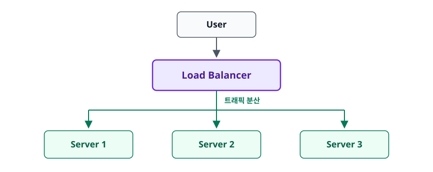

<!-- 위 그림이 대체한 원본 ASCII.
     내용을 고칠 때는 그림도 함께 갱신할 것.
```
                    ┌──────────┐
                    │   User   │
                    └────┬─────┘
                         │
                    ┌────▼─────┐
                    │   Load   │
                    │ Balancer │
                    └────┬─────┘
           ┌─────────────┼─────────────┐
           │             │             │
      ┌────▼───┐    ┌────▼───┐    ┌────▼───┐
      │Server 1│    │Server 2│    │Server 3│
      └────────┘    └────────┘    └────────┘
```
-->

### 로드 밸런서 종류 (OSI 계층별)

| 종류 | 계층 | 분산 기준 | 특징 |
|------|------|----------|------|
| L4 | Transport | IP, Port | 빠름, 단순 |
| L7 | Application | URL, Header, Cookie | 유연함, 기능 다양 |

### L4 vs L7 비교

<!-- diagram:sd-qna-infrastructure-2 -->
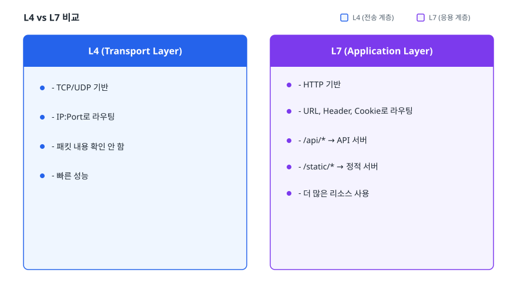

<!-- 위 그림이 대체한 원본 ASCII.
     내용을 고칠 때는 그림도 함께 갱신할 것.
```
L4 (Transport Layer)
- TCP/UDP 기반
- IP:Port로 라우팅
- 패킷 내용 확인 안 함
- 빠른 성능

L7 (Application Layer)
- HTTP 기반
- URL, Header, Cookie로 라우팅
- /api/* → API 서버
- /static/* → 정적 서버
- 더 많은 리소스 사용
```
-->

### 로드 밸런싱 알고리즘

| 알고리즘 | 설명 | 사용 사례 |
|---------|------|----------|
| Round Robin | 순차적 분배 | 서버 성능 동일 시 |
| Weighted RR | 가중치 기반 분배 | 서버 성능 다를 때 |
| Least Connections | 연결 수 적은 서버로 | 처리 시간 편차 클 때 |
| IP Hash | 클라이언트 IP 기반 | 세션 고정 필요 시 |
| Least Response Time | 응답 빠른 서버로 | 성능 중시 |

### Health Check

<!-- diagram:sd-qna-infrastructure-3 -->
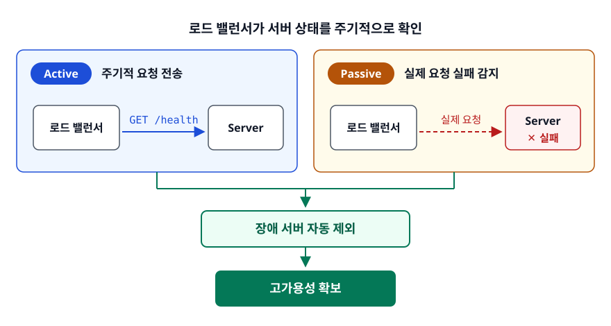

<!-- 위 그림이 대체한 원본 ASCII.
     내용을 고칠 때는 그림도 함께 갱신할 것.
```
로드 밸런서가 서버 상태를 주기적으로 확인

- Active: 주기적 요청 전송 (GET /health)
- Passive: 실제 요청 실패 감지

장애 서버 자동 제외 → 고가용성 확보
```
-->

### AWS에서의 로드 밸런서

| 종류 | 계층 | 용도 |
|------|------|------|
| ALB (Application) | L7 | HTTP/HTTPS 애플리케이션 |
| NLB (Network) | L4 | TCP/UDP, 고성능 |
| CLB (Classic) | L4/L7 | 레거시 (비권장) |

### 면접관이 주목하는 포인트
- L4 vs L7 차이와 선택 기준
- 세션 유지가 필요할 때 고려사항 (Sticky Session)

### 꼬리 질문 대비
- "로드 밸런서 자체가 SPOF(단일 장애점)가 되지 않나요?"
  → Active-Standby 또는 Active-Active 구성으로 이중화

</details>

---

## Q2. 무중단 배포 방식(Rolling, Canary, Blue/Green)을 설명해주세요. ⭐⭐

<details>
<summary>답변 보기</summary>

### 핵심 답변
무중단 배포는 **서비스 중단 없이 새 버전을 배포**하는 전략입니다. 대표적으로 Rolling, Blue/Green, Canary 방식이 있습니다.

### 배포 전략 비교

| 전략 | 롤백 속도 | 리소스 비용 | 위험도 | 복잡도 |
|------|----------|------------|--------|--------|
| Rolling | 느림 | 낮음 | 중간 | 낮음 |
| Blue/Green | 빠름 | 높음 (2배) | 낮음 | 중간 |
| Canary | 빠름 | 중간 | 낮음 | 높음 |

### 1. Rolling Deployment

<!-- diagram:sd-qna-infrastructure-11 -->
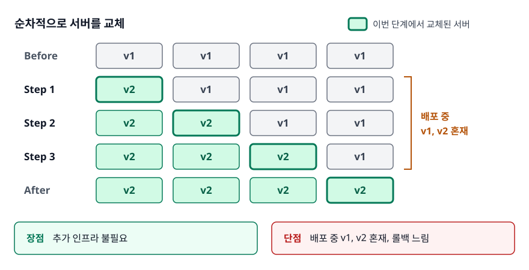

<!-- 위 그림이 대체한 원본 ASCII.
     내용을 고칠 때는 그림도 함께 갱신할 것.
```
순차적으로 서버를 교체

Before: [v1] [v1] [v1] [v1]
Step 1: [v2] [v1] [v1] [v1]
Step 2: [v2] [v2] [v1] [v1]
Step 3: [v2] [v2] [v2] [v1]
After:  [v2] [v2] [v2] [v2]

장점: 추가 인프라 불필요
단점: 배포 중 v1, v2 혼재, 롤백 느림
```
-->

### 2. Blue/Green Deployment

<!-- diagram:sd-qna-infrastructure-4 -->
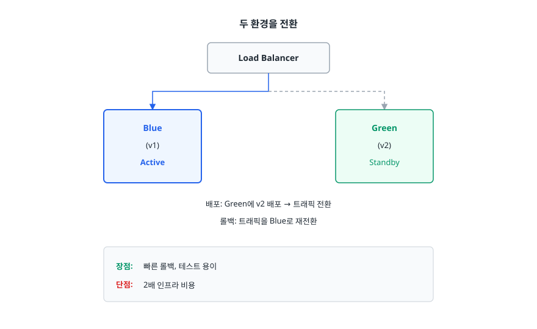

<!-- 위 그림이 대체한 원본 ASCII.
     내용을 고칠 때는 그림도 함께 갱신할 것.
```
두 환경을 전환

        ┌─────────────┐
        │ Load Balancer│
        └──────┬──────┘
               │
    ┌──────────┴──────────┐
    │                     │
┌───▼───┐            ┌────▼────┐
│ Blue  │            │  Green  │
│ (v1)  │            │  (v2)   │
│Active │            │ Standby │
└───────┘            └─────────┘

배포: Green에 v2 배포 → 트래픽 전환
롤백: 트래픽을 Blue로 재전환

장점: 빠른 롤백, 테스트 용이
단점: 2배 인프라 비용
```
-->

### 3. Canary Deployment

<!-- diagram:sd-qna-infrastructure-5 -->
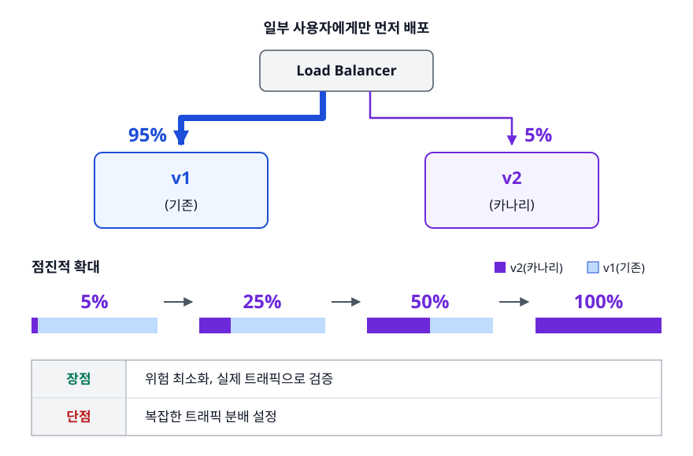

<!-- 위 그림이 대체한 원본 ASCII.
     내용을 고칠 때는 그림도 함께 갱신할 것.
```
일부 사용자에게만 먼저 배포

        ┌─────────────┐
        │ Load Balancer│
        └──────┬──────┘
               │
    ┌──────────┴──────────┐
    │ 95%            5%   │
┌───▼───┐            ┌────▼────┐
│  v1   │            │   v2    │
│(기존) │            │(카나리) │
└───────┘            └─────────┘

점진적 확대: 5% → 25% → 50% → 100%

장점: 위험 최소화, 실제 트래픽으로 검증
단점: 복잡한 트래픽 분배 설정
```
-->

### 배포 전략 선택 가이드

<!-- diagram:sd-qna-infrastructure-6 -->
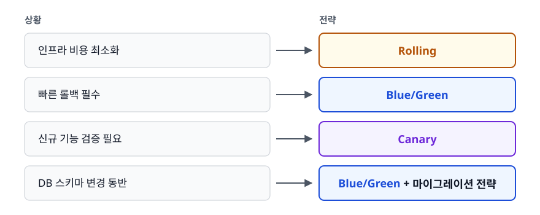

<!-- 위 그림이 대체한 원본 ASCII.
     내용을 고칠 때는 그림도 함께 갱신할 것.
```
✓ 인프라 비용 최소화 → Rolling
✓ 빠른 롤백 필수 → Blue/Green
✓ 신규 기능 검증 필요 → Canary
✓ DB 스키마 변경 동반 → Blue/Green + 마이그레이션 전략
```
-->

### Kubernetes에서의 배포

```yaml
# Rolling Update (기본값)
apiVersion: apps/v1
kind: Deployment
spec:
  strategy:
    type: RollingUpdate
    rollingUpdate:
      maxUnavailable: 25%
      maxSurge: 25%
```

### 면접관이 주목하는 포인트
- 각 전략의 트레이드오프를 아는가
- 실제 프로젝트에서 어떤 전략을 선택했는지

### 꼬리 질문 대비
- "DB 스키마 변경이 있을 때 무중단 배포는 어떻게 하나요?"
<!-- diagram:sd-qna-infrastructure-12 -->
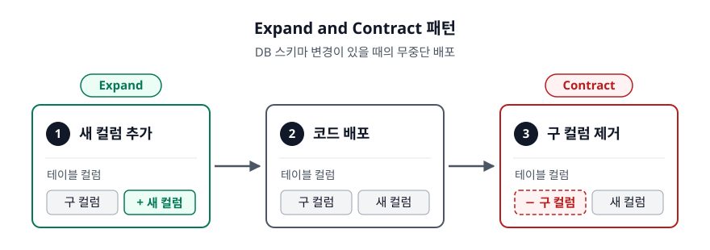

<!-- 위 그림이 대체한 원본 ASCII.
     내용을 고칠 때는 그림도 함께 갱신할 것.
```
  → Expand and Contract 패턴: 새 컬럼 추가 → 코드 배포 → 구 컬럼 제거
```
-->

</details>

---

## Q3. 대용량 트래픽 장애 대응 방법은? ⭐⭐⭐

<details>
<summary>답변 보기</summary>

### 핵심 답변
대용량 트래픽 장애는 **Scale Out, 캐싱, 비동기 처리, 서킷 브레이커** 등을 조합하여 대응합니다.

### 대응 전략 개요

<!-- diagram:sd-qna-infrastructure-7 -->
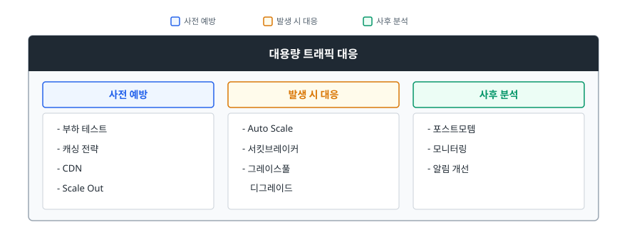

<!-- 위 그림이 대체한 원본 ASCII.
     내용을 고칠 때는 그림도 함께 갱신할 것.
```
┌─────────────────────────────────────────┐
│           대용량 트래픽 대응              │
├─────────────┬─────────────┬─────────────┤
│   사전 예방  │  발생 시 대응 │  사후 분석   │
├─────────────┼─────────────┼─────────────┤
│ - 부하 테스트│ - Auto Scale│ - 포스트모템 │
│ - 캐싱 전략 │ - 서킷브레이커│ - 모니터링  │
│ - CDN      │ - 그레이스풀 │ - 알림 개선  │
│ - Scale Out│   디그레이드  │             │
└─────────────┴─────────────┴─────────────┘
```
-->

### 1. Scale Out (수평 확장)

<!-- diagram:sd-qna-infrastructure-8 -->
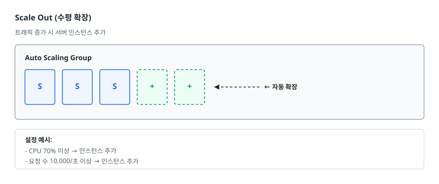

<!-- 위 그림이 대체한 원본 ASCII.
     내용을 고칠 때는 그림도 함께 갱신할 것.
```
트래픽 증가 시 서버 인스턴스 추가

┌──────────────────────────────────┐
│ Auto Scaling Group               │
│  ┌───┐ ┌───┐ ┌───┐ ┌───┐ ┌───┐ │
│  │ S │ │ S │ │ S │ │ + │ │ + │ │  ← 자동 확장
│  └───┘ └───┘ └───┘ └───┘ └───┘ │
└──────────────────────────────────┘

설정 예시:
- CPU 70% 이상 → 인스턴스 추가
- 요청 수 10,000/초 이상 → 인스턴스 추가
```
-->

### 2. 캐싱 전략

| 레벨 | 도구 | 용도 |
|------|------|------|
| CDN | CloudFront, Cloudflare | 정적 콘텐츠 |
| Application | Redis, Memcached | 세션, API 응답 |
| Database | Query Cache (MySQL 5.7까지, 8.0에서 제거) | 자주 조회되는 데이터 |
| Browser | Cache-Control | 클라이언트 캐시 |

```
Cache-Aside 패턴:
1. 캐시 확인 → 있으면 반환
2. 없으면 DB 조회 → 캐시 저장 → 반환
```

### 3. 비동기 처리 (Message Queue)

<!-- diagram:sd-qna-infrastructure-9 -->
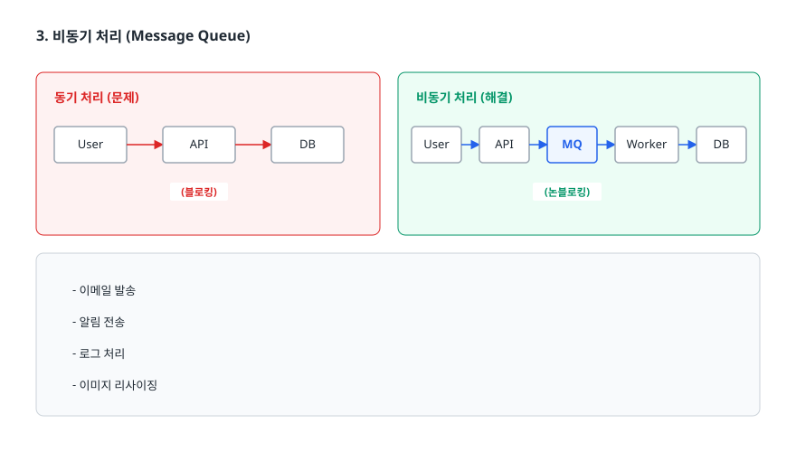

<!-- 위 그림이 대체한 원본 ASCII.
     내용을 고칠 때는 그림도 함께 갱신할 것.
```
동기 처리 (문제)         비동기 처리 (해결)

User → API → DB         User → API → MQ → Worker → DB
      (블로킹)                 (논블로킹)

- 이메일 발송
- 알림 전송
- 로그 처리
- 이미지 리사이징
```
-->

### 4. 서킷 브레이커

<!-- diagram:sd-qna-infrastructure-10 -->
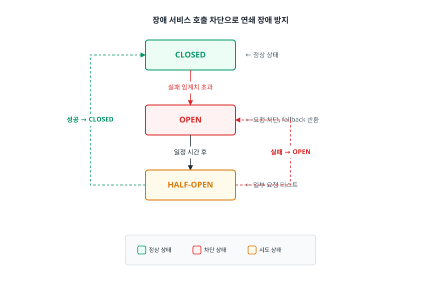

<!-- 위 그림이 대체한 원본 ASCII.
     내용을 고칠 때는 그림도 함께 갱신할 것.
```
장애 서비스 호출 차단으로 연쇄 장애 방지

       ┌─────────────┐
       │   CLOSED    │ ← 정상 상태
       └──────┬──────┘
              │ 실패 임계치 초과
       ┌──────▼──────┐
       │    OPEN     │ ← 요청 차단, fallback 반환
       └──────┬──────┘
              │ 일정 시간 후
       ┌──────▼──────┐
       │ HALF-OPEN   │ ← 일부 요청 테스트
       └─────────────┘
              │ 성공 → CLOSED
              │ 실패 → OPEN
```
-->

### 5. Graceful Degradation

```
핵심 기능 유지, 부가 기능 제한

예: 쇼핑몰 트래픽 폭주 시
✓ 상품 조회: 정상
✓ 장바구니: 정상
✗ 추천 상품: 비활성화
✗ 리뷰 조회: 캐시된 데이터만
```

### 6. Rate Limiting

```java
// Token Bucket 알고리즘
- IP당 분당 100 요청 제한
- 초과 시 429 Too Many Requests 반환

// API Gateway 설정
@RateLimiter(rate = "100/m")
public Response getProducts() { ... }
```

### 실전 체크리스트

```
□ 모니터링/알림 설정 (CloudWatch, Datadog)
□ Auto Scaling 설정
□ Redis/CDN 캐시 적용
□ DB Connection Pool 튜닝
□ 서킷 브레이커 적용
□ 비동기 처리 적용 (큐)
□ 부하 테스트 수행 (k6, JMeter)
□ 롤백 계획 수립
```

### 면접관이 주목하는 포인트
- 대용량 트래픽을 직접 다뤄본 경험
- 장애 상황에서 의사결정을 어떻게 했는지

### 꼬리 질문 대비
- "Thundering Herd 문제를 어떻게 해결하나요?"
  → 캐시 만료 시 한 요청만 DB 조회 (Cache Stampede 방지)
  → 분산 락 또는 캐시 만료 시간 분산

</details>

---

## 학습 체크리스트

- [ ] 로드 밸런서 종류(L4/L7)와 알고리즘 이해
- [ ] 무중단 배포 전략(Rolling, Blue/Green, Canary) 비교하기
- [ ] 대용량 트래픽 대응 전략 설명 가능
