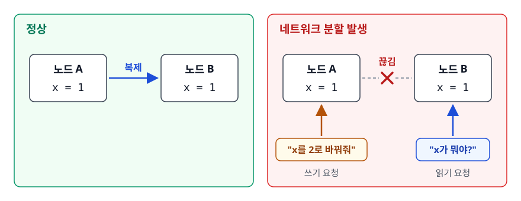
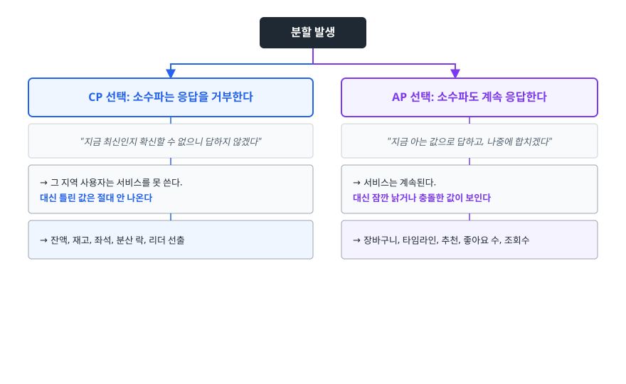
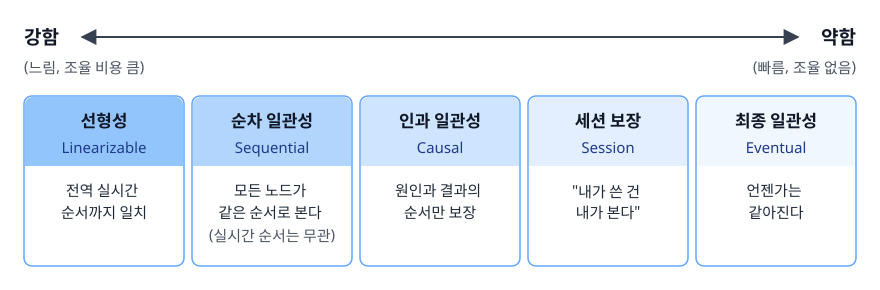
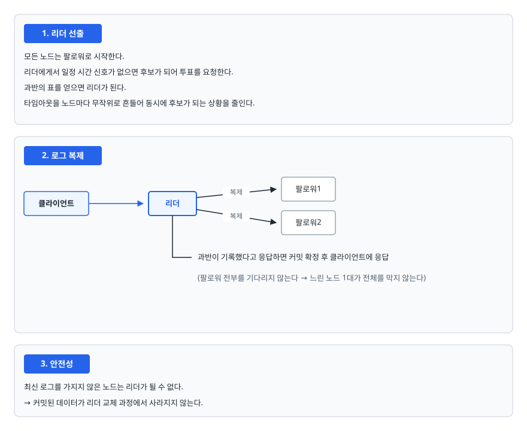

# CAP 정리와 일관성 모델 (CAP Theorem & Consistency Models)

> CAP이 실제로 무엇을 주장하는 정리인지, "셋 중 둘"이라는 요약이 왜 오해를 낳는지, 그리고 강한 일관성과 최종 일관성 사이에 어떤 중간 단계들이 있는지 설명할 수 있게 됩니다.

## 학습 목표

- [ ] CAP의 C·A·P를 각각 엄밀하게 정의할 수 있다
- [ ] "평상시에는 CA 시스템"이라는 말이 왜 틀렸는지 설명할 수 있다
- [ ] PACELC이 CAP의 무엇을 보완하는지 안다
- [ ] 선형성부터 최종 일관성까지 일관성 모델의 스펙트럼을 순서대로 말할 수 있다
- [ ] 분산 합의가 왜 필요한지, Raft가 어떻게 동작하는지 개요를 그릴 수 있다
- [ ] 대표적인 저장소들이 어느 쪽 선택을 했는지 근거와 함께 분류할 수 있다

## 선행 지식

- 데이터베이스 복제(마스터-레플리카)의 기본 개념
- [트랜잭션 격리 수준](../../02-backend-engineering/database/04-transaction-isolation.md) - ACID의 C와 CAP의 C를 구분하기 위해

---

## 1. 왜 필요한가

### 노드가 하나일 때는 없던 질문

DB가 한 대뿐이라면 "지금 값이 뭔가"라는 질문에 답은 하나입니다. 그 한 대가 아는 값이 곧 진실입니다.

노드를 늘리는 순간 이야기가 달라집니다. 가용성을 위해서든 성능을 위해서든 데이터를 두 곳 이상에 복사하면, **"두 노드가 서로 다른 값을 들고 있는 순간"이 반드시 생깁니다.** 복사는 빛의 속도보다 빠를 수 없기 때문입니다.

평소에는 그 시간이 밀리초 단위라 문제가 잘 드러나지 않습니다. 진짜 문제는 노드 사이의 통신이 끊어졌을 때입니다.

<!-- diagram:sd-cap-consistency-1 -->


<!-- 위 그림이 대체한 원본 ASCII.
     내용을 고칠 때는 그림도 함께 갱신할 것.
```
   정상                            네트워크 분할 발생

   ┌────────┐   복제   ┌────────┐   ┌────────┐   ╳╳╳   ┌────────┐
   │ 노드 A │ ──────► │ 노드 B │   │ 노드 A │  끊김  │ 노드 B │
   │ x = 1  │         │ x = 1  │   │ x = 1  │         │ x = 1  │
   └────────┘         └────────┘   └───▲────┘         └───▲────┘
                                       │                   │
                                  "x를 2로 바꿔줘"     "x가 뭐야?"
```
-->

이 상황에서 시스템은 선택을 강요당합니다.

- **A에게 쓰기를 받아준다** → B는 여전히 1을 반환합니다. 사용자마다 다른 값을 봅니다.
- **쓰기를 거부한다** → 값은 일관되지만, 살아 있는 노드가 요청을 못 받습니다.

**둘 다 만족시키는 방법은 없습니다.** CAP 정리는 이 사실을 형식적으로 증명했습니다.

### 비유

한 통장을 부부가 각자 다른 은행 지점에서 쓴다고 해봅시다. 두 지점의 전산망이 끊긴 상태에서 각자 10만 원을 출금하려 합니다. 지점끼리 잔액을 확인할 수 없으니, "일단 내주고 나중에 맞추기"(가용성 우선)와 "확인 안 되면 못 내준다"(일관성 우선) 중 하나를 골라야 합니다.

> **비유의 한계**: 실제 은행은 계좌 잔액이 음수가 되면 사후 정산이라는 현실적 해결책이 있지만, 분산 시스템에서는 "나중에 맞추기"가 자동으로 되지 않습니다. 충돌 해결 규칙을 개발자가 미리 정의해둬야 하고, 그 규칙에 따라 어느 한쪽의 쓰기는 조용히 사라질 수 있습니다.

---

## 2. CAP 정리의 정확한 의미

### 세 글자의 엄밀한 정의

| 글자 | 흔한 요약 | 엄밀한 정의 |
|------|----------|------------|
| C (Consistency) | "모든 노드가 같은 데이터" | **선형성(linearizability)**. 모든 읽기는 그 직전에 완료된 쓰기의 결과를 반환합니다. 마치 노드가 한 대뿐인 것처럼 보입니다 |
| A (Availability) | "항상 응답" | **장애가 나지 않은 모든 노드가 유한 시간 안에 오류가 아닌 응답을 반환합니다.** 노드가 죽었으면 해당 없음 |
| P (Partition tolerance) | "장애에 강함" | **노드 사이의 메시지가 임의로 유실되어도 시스템이 계속 동작합니다.** 서버가 죽는 상황과는 다릅니다. **통신이 끊기는 것**을 말합니다 |

CAP 정리는 이렇게 주장합니다. **네트워크 분할이 일어난 상황에서 C와 A를 동시에 보장하는 것은 불가능합니다.**

### "셋 중 둘"이라는 요약이 만드는 오해

가장 널리 퍼진 설명이자 가장 많은 오해의 원인입니다. 셋 중 둘을 고르는 메뉴판처럼 들리기 때문에 다음 같은 잘못된 결론이 따라옵니다.

**오해 1: "우리 시스템은 평상시에는 CA다."**

틀렸습니다. **P는 고르는 것이 아니라 주어지는 것**이기 때문입니다. 네트워크 케이블은 뽑히고, 스위치는 고장 나고, 클라우드의 가용 영역은 격리됩니다. 분산 시스템을 운영하는 이상 분할은 언젠가 반드시 일어납니다. "P를 포기한다"는 말은 "분할이 일어나면 시스템이 어떻게 되든 상관없다"는 뜻이지, "분할이 안 일어난다"는 뜻이 될 수 없습니다.

정확히는 이렇습니다. **CAP은 분할이 일어난 순간의 행동을 규정하는 정리입니다.** 분할이 없는 평상시에는 C와 A를 둘 다 제공할 수 있고, 실제로 대부분의 시스템이 그렇게 합니다. 그러니 분산 시스템에서 "CA 시스템"이라는 분류는 의미 있는 범주가 되지 못합니다. 단일 노드 DB를 그렇게 부를 수는 있지만, 그것은 애초에 분할이 정의되지 않는 시스템입니다.

**오해 2: "A는 빠르다는 뜻이다."**

아닙니다. CAP의 A는 "언젠가는 오류가 아닌 응답이 온다"일 뿐, 100밀리초든 10초든 상관하지 않습니다. 응답 속도는 CAP이 다루지 않는 축이고, 그래서 3절의 PACELC이 나왔습니다.

**오해 3: "CAP의 C는 ACID의 C와 같다."**

전혀 다릅니다. ACID의 C(Consistency)는 **트랜잭션이 애플리케이션의 무결성 제약을 깨지 않는다**는 조건을 가리킵니다(잔액이 음수가 되지 않는다 등). CAP의 C는 **여러 노드의 사본이 마치 하나인 것처럼 보인다**는 뜻입니다. 이름만 같고 다루는 문제가 다릅니다.

### 그래서 실제 선택은 CP냐 AP냐

분할이 일어났을 때 소수파 쪽(과반과 통신이 끊긴 노드들)이 어떻게 행동하는지에서 길이 갈립니다.

<!-- diagram:sd-cap-consistency-2 -->


<!-- 위 그림이 대체한 원본 ASCII.
     내용을 고칠 때는 그림도 함께 갱신할 것.
```
   분할 발생

   ├─ CP 선택: 소수파는 응답을 거부한다
   │    "지금 최신인지 확신할 수 없으니 답하지 않겠다"
   │    → 그 지역 사용자는 서비스를 못 쓴다. 대신 틀린 값은 절대 안 나온다
   │    → 잔액, 재고, 좌석, 분산 락, 리더 선출
   │
   └─ AP 선택: 소수파도 계속 응답한다
        "지금 아는 값으로 답하고, 나중에 합치겠다"
        → 서비스는 계속된다. 대신 잠깐 낡거나 충돌한 값이 보인다
        → 장바구니, 타임라인, 추천, 좋아요 수, 조회수
```
-->

**"이 데이터가 잠깐 틀렸을 때 무슨 일이 벌어지는가"**를 기준으로 판단합니다. 좋아요 수가 3초간 틀린 것은 아무도 손해 보지 않지만, 재고가 3초간 틀리면 없는 물건이 팔립니다.

---

## 3. PACELC — 분할이 없을 때도 선택은 있다

CAP은 분할이 일어난 순간만 다룹니다. 그런데 시스템이 사는 시간의 99.99%는 분할이 없는 평상시입니다. 평상시에는 아무 선택도 필요 없을까?

그렇지 않습니다. **강한 일관성을 유지하려면 쓰기마다 여러 노드의 확인을 기다려야 하고, 그 대기가 곧 지연입니다.** 그래서 평상시에도 일관성과 지연 사이에 트레이드오프가 있습니다.

PACELC은 이것을 한 문장으로 정리합니다. **"분할(P)이 있으면 A와 C 중에서, 그렇지 않으면(Else) L(지연)과 C 중에서 고른다."**

| 분류 | 분할 시 | 평상시 | 대표 시스템 | 성격 |
|------|--------|--------|------------|------|
| PA/EL | 가용성 우선 | 지연 우선 | Cassandra, DynamoDB(기본) | 항상 빠르고 항상 응답. 대신 낡은 값을 볼 수 있습니다 |
| PC/EC | 일관성 우선 | 일관성 우선 | etcd, ZooKeeper, HBase | 항상 정확. 대신 합의 왕복만큼 느리고 분할 시 멈춥니다 |
| PA/EC | 가용성 우선 | 일관성 우선 | 설정에 따라 MongoDB 등 | 평소엔 정확하게, 위기에는 살아남기 |

> 정리: CAP만 알면 "우리는 CP다"에서 끝나지만 PACELC까지 보면 **"평상시에 얼마나 느려도 되는가"**라는 훨씬 자주 마주치는 질문에 답할 수 있습니다. 실무에서 체감하는 비용은 분할보다 이쪽이 큽니다.

---

## 4. 일관성 모델 스펙트럼

일관성은 "강한 일관성 아니면 최종 일관성"이라는 이분법으로 갈리지 않습니다. 그 사이에 여러 단계가 있고, 필요한 만큼만 골라 쓰는 것이 설계입니다.

<!-- diagram:sd-cap-consistency-3 -->


<!-- 위 그림이 대체한 원본 ASCII.
     내용을 고칠 때는 그림도 함께 갱신할 것.
```
   강함 ◄─────────────────────────────────────────────────► 약함
   (느림, 조율 비용 큼)                            (빠름, 조율 없음)

   선형성        순차 일관성      인과 일관성     세션 보장      최종 일관성
   Linearizable  Sequential      Causal         Session       Eventual
      │              │              │              │              │
   전역 실시간    모든 노드가     원인과 결과의  "내가 쓴 건    언젠가는
   순서까지 일치  같은 순서로     순서만 보장    내가 본다"     같아진다
                  본다(실시간
                  순서는 무관)
```
-->

- **선형성(Linearizability)**: 시스템이 노드 한 대인 것처럼 보입니다. 쓰기가 완료된 직후의 모든 읽기는 그 값을 봅니다. CAP의 C가 이것입니다. 구현하려면 노드 간 합의가 필요해 가장 비쌉니다.
- **순차 일관성(Sequential)**: 모든 노드가 연산을 같은 순서로 보지만, 그 순서가 실제 시간 순서와 일치할 필요는 없습니다. A가 먼저 쓴 것을 B가 나중에 쓴 것보다 뒤에 볼 수도 있습니다.
- **인과 일관성(Causal)**: 인과 관계가 있는 연산의 순서만 보장합니다. "댓글이 게시글보다 먼저 보이는" 일은 막지만, 서로 무관한 두 게시글의 순서는 노드마다 다를 수 있습니다. 비용 대비 체감 품질이 좋아 소셜 서비스에서 인기가 있습니다.
- **세션 보장(Session guarantees)**: 사용자 한 명의 관점에서만 말이 되게 합니다. 그중 **읽은 내 쓰기(read-your-writes)**가 가장 유명한데, "내가 방금 쓴 것은 내가 반드시 본다"를 보장합니다. **최종 일관성 시스템 위에 아주 싸게 얹을 수 있어 실무 가치가 높습니다.**
- **최종 일관성(Eventual)**: 새 쓰기가 멈추면 언젠가는 모든 노드가 같은 값에 도달합니다. "언젠가"가 언제인지는 보장하지 않습니다.

### 안티패턴: 쓰고 나서 바로 레플리카에서 읽기

가장 흔하게 마주치는 일관성 문제는 CAP에서 오지 않습니다. **복제 지연**에서 나옵니다.

```java
// 안티패턴
@Transactional
public void writePost(PostRequest request) {
    postRepository.save(request.toEntity());     // 프라이머리에 쓰기
}

@Transactional(readOnly = true)                  // 라우팅 데이터소스 구성 시 레플리카로 감
public List<Post> getMyPosts(Long userId) {
    return postRepository.findByUserId(userId);  // 방금 쓴 글이 아직 없다
}
```

**왜 문제인가**: 글쓰기 직후 목록 화면으로 이동하면, 쓰기는 프라이머리에 갔지만 읽기는 레플리카로 갑니다. 복제가 아직 안 끝났으면 **방금 쓴 글이 목록에 없습니다.** 사용자는 "글이 안 올라갔다"고 판단하고 한 번 더 씁니다. 평상시 복제 지연은 밀리초 단위입니다. 그래서 개발 환경에서는 거의 재현되지 않고 트래픽이 몰릴 때만 나타납니다.

```java
// 개선 1 — 쓰기 직후 일정 시간은 그 사용자의 읽기를 프라이머리로 보낸다
public List<Post> getMyPosts(Long userId) {
    if (recentWriteTracker.hasWrittenRecently(userId)) {   // 예: 최근 3초 내 쓰기
        return primaryPostRepository.findByUserId(userId);
    }
    return replicaPostRepository.findByUserId(userId);
}

// 개선 2 — 쓰기 응답에 결과를 담아 화면이 서버를 다시 안 물어보게 한다
public PostResponse writePost(PostRequest request) {
    Post saved = postRepository.save(request.toEntity());
    return PostResponse.from(saved);   // 클라이언트가 이 값으로 목록을 갱신
}
```

개선 1이 바로 **읽은 내 쓰기(read-your-writes) 보장**을 구현한 것입니다. 전체 시스템을 강한 일관성으로 바꿀 필요는 없습니다. **문제가 되는 흐름 하나에만 더 강한 보장을 얹으면 됩니다.** 일관성 모델을 스펙트럼으로 이해해야 하는 실질적인 이유가 여기에 있습니다.

---

## 5. 분산 합의는 왜 필요한가

### 문제

CP 시스템을 만들려면 "지금 진짜 값이 무엇인지"를 여러 노드가 **합의**해야 합니다. 특히 다음 질문에 모두가 같은 답을 내야 합니다.

- 지금 리더는 누구인가? (둘이 동시에 자기가 리더라고 믿으면 데이터가 갈라진다 — 스플릿 브레인)
- 이 쓰기는 커밋된 것인가?
- 연산들의 순서는 무엇인가?

노드가 죽고 메시지가 늦게 도착하고 네트워크가 끊기는 환경에서 이런 합의를 이루기는 생각보다 훨씬 어렵습니다. 완전 비동기 환경에서는 노드 하나만 고장 나도 **모든 상황에서 반드시 끝나는 결정적 합의 알고리즘이 존재하지 않습니다.** 이미 증명된 사실입니다(FLP 불가능성). 실제 알고리즘들은 "타임아웃 안에는 대체로 메시지가 도착한다"는 현실적 가정을 추가해 이 벽을 우회합니다.

### 과반(quorum)이라는 도구

합의의 기본 도구는 과반입니다. **어떤 두 과반 집합은 반드시 최소 한 노드를 공유합니다.** 노드 5대에서 과반은 3대이고, 어떤 3대를 뽑아도 다른 3대와 최소 1대가 겹칩니다. 이 겹침 덕분에 "이전에 커밋된 것을 모르는 새 과반"이 생길 수 없습니다.

여기서 **노드 수를 홀수로 잡는 이유**가 나옵니다. 노드 `2f+1`대는 `f`대의 고장을 견딥니다. 3대는 1대, 5대는 2대를 견딥니다. 그런데 4대의 과반은 3대이므로 역시 1대까지만 견딥니다. **3대에서 4대로 늘리면 비용만 늘고 내결함성은 그대로**입니다. 그래서 etcd나 ZooKeeper는 관례적으로 3대나 5대로 구성합니다.

### Raft 개요

Paxos가 이해하기 어렵다는 문제의식에서 나온 합의 알고리즘입니다. 설계 목표 자체가 이해 가능성이었습니다. 세 부분으로 나뉩니다.

<!-- diagram:sd-cap-consistency-4 -->


<!-- 위 그림이 대체한 원본 ASCII.
     내용을 고칠 때는 그림도 함께 갱신할 것.
```
   [1. 리더 선출]
   모든 노드는 팔로워로 시작한다.
   리더에게서 일정 시간 신호가 없으면 후보가 되어 투표를 요청한다.
   과반의 표를 얻으면 리더가 된다.
   타임아웃을 노드마다 무작위로 흔들어 동시에 후보가 되는 상황을 줄인다.

   [2. 로그 복제]
   클라이언트 ──► [리더] ──복제──► [팔로워1]
                    │      ──복제──► [팔로워2]
                    │
                    └─ 과반이 기록했다고 응답하면 커밋 확정 후 클라이언트에 응답
                       (팔로워 전부를 기다리지 않는다 → 느린 노드 1대가 전체를 막지 않는다)

   [3. 안전성]
   최신 로그를 가지지 않은 노드는 리더가 될 수 없다.
   → 커밋된 데이터가 리더 교체 과정에서 사라지지 않는다.
```
-->

리더는 하나뿐입니다. 모든 쓰기가 리더를 거치므로 순서가 자연히 하나로 정해지고, 과반 복제가 확인된 뒤에만 커밋하므로 리더가 죽어도 데이터가 남습니다. 대신 **리더가 없는 동안(선출 중)에는 쓰기를 받을 수 없습니다.** CP 시스템이 분할 시 멈추는 이유를 구체적으로 보면 이렇습니다.

Raft는 etcd, Consul, TiKV, CockroachDB 등에 쓰입니다. 쿠버네티스의 상태 저장소가 etcd이니 이미 대부분의 인프라가 이 위에 올라가 있습니다.

---

## 6. 실제 시스템은 어디에 서 있나

| 시스템 | 분할 시 | 기본 읽기 일관성 | 조정 가능성 |
|--------|--------|-----------------|------------|
| MySQL / PostgreSQL (단일 프라이머리 + 비동기 레플리카) | 프라이머리 쪽만 살아남음 | 프라이머리는 강함, 레플리카는 최종 | 반동기 복제로 유실 위험을 줄일 수 있습니다 |
| etcd / ZooKeeper | 과반 없는 쪽은 응답 거부 (CP) | 강함 | 사실상 없음. 일관성이 존재 이유입니다 |
| Cassandra | 계속 응답 (AP) | 최종 | 쿼리 단위로 `ONE`/`QUORUM`/`ALL` 지정. `W+R > N`이면 최신 값을 읽습니다 |
| DynamoDB | 계속 응답 (AP) | 최종 | 읽기 요청에 강한 일관성 옵션을 켤 수 있습니다(비용·지연 증가) |
| MongoDB | 프라이머리 쪽 (CP 성향) | 프라이머리 읽기는 강함 | `writeConcern`/`readConcern`으로 조절 |
| Redis Cluster | 계속 응답하려 함 | 복제가 **비동기**라 강하지 않음 | 사실상 조정 불가. 페일오버 시 응답한 쓰기가 사라질 수 있습니다 |
| Kafka | 리더 파티션 기준 | `acks=all` + 최소 동기 복제본 수 설정 시 강함 | `acks`와 `min.insync.replicas`로 내구성과 지연을 교환 |

> 표에서 얻을 결론: **대부분의 시스템은 CP나 AP로 딱 떨어지지 않고 설정으로 스펙트럼 위를 움직입니다.** 그래서 면접에서 "MongoDB는 CP입니다"라고 단정하는 것보다 "기본 설정에서는 CP 성향이고, `readConcern`을 낮추면 AP 쪽으로 이동합니다"라고 답하는 편이 정확합니다.

**Redis Cluster**는 특히 주의해야 합니다. 흔히 CP로 분류되지만 복제가 비동기라서, 마스터가 클라이언트에 성공을 응답한 직후 죽으면 그 쓰기는 승격된 복제본에 없습니다. 캐시로 쓸 때는 문제가 아니지만, 분산 락이나 유일성 보장에 쓸 때는 이 성질을 반드시 알고 있어야 합니다.

---

## 7. 실무에서는

- **시스템 전체에 하나의 일관성 수준을 고르지 않습니다.** 결제·재고·좌석은 강한 일관성으로, 피드·추천·조회수는 최종 일관성으로 나눕니다. 한 서비스 안에서 도메인별로 다른 저장소와 다른 보장을 쓰는 것이 정상입니다.
- **일관성 문제는 대부분 CAP이 아니라 복제 지연으로 나타납니다.** 실제 장애 리포트에 "네트워크 분할"이 등장하는 일보다 "쓰고 바로 읽었는데 없다"가 훨씬 많습니다. 복제 지연 지표를 모니터링하고 임계치를 넘은 레플리카는 읽기 대상에서 자동으로 제외합니다. 이 구성이 기본입니다.
- **`W + R > N` 공식은 만능이 아닙니다.** 쿼럼이 겹치면 "최신 값을 가진 노드가 읽기 집합에 최소 하나 포함된다"까지는 보장됩니다. 선형성은 거기서 따라오지 않습니다. 동시 쓰기의 순서 결정이나 부분 실패 처리는 별도 문제로 남습니다.
- **"최종 일관성이니까 괜찮다"를 사용자에게 떠넘기지 않습니다.** 백엔드의 약한 보장을 프런트에서 메워야 사용자 경험이 유지됩니다. 낙관적 UI(쓰기 요청 직후 화면에 반영해두고 실패하면 되돌리기)가 그런 설계입니다.

---

## 8. 면접 포인트

> 면접에서 이 주제가 나오면 이렇게 답합니다

**Q. CAP 정리를 설명해주세요.**
A. 네트워크 분할이 발생한 상황에서 일관성과 가용성을 동시에 보장할 수는 없다는 정리입니다. 여기서 C는 선형성, 즉 모든 읽기가 직전에 완료된 쓰기를 본다는 뜻이고, A는 살아 있는 모든 노드가 오류가 아닌 응답을 반환한다는 뜻입니다. **이 정리는 분할이 일어난 순간의 행동만 규정합니다.** 분할이 없는 평상시에는 두 가지를 모두 제공할 수 있고 실제 시스템은 그렇게 동작합니다. 그래서 "셋 중 둘을 고른다"는 요약보다 "분할 시 CP냐 AP냐를 고른다"가 정확합니다.
- 꼬리 질문: "그럼 CA 시스템은 없나요?" → 분산 시스템에서는 의미 없는 분류입니다. P는 주어지는 조건이라 고를 수가 없고 "P를 포기한다"는 말은 "분할이 나면 어떻게 되든 상관없다"는 뜻일 뿐입니다.

**Q. 실제 서비스에서 CP와 AP를 어떻게 나누어 적용하나요?**
A. 데이터가 잠깐 틀렸을 때의 손해로 판단합니다. 재고·잔액·좌석은 틀리면 없는 물건이 팔리거나 돈이 어긋납니다. 이런 도메인은 CP로 가서, 확신이 없으면 차라리 실패시킵니다. 반대로 피드·추천·조회수는 몇 초 낡아도 아무도 손해 보지 않으므로 AP로 가서 가용성을 지킵니다. **한 서비스 안에서 도메인별로 다른 선택을 하는 것이 정상**이고, 실제로 결제는 RDB, 피드는 Cassandra 같은 조합이 흔합니다.
- 꼬리 질문: "PACELC은 무엇을 추가하나요?" → 분할이 없는 평상시에도 일관성과 지연 사이의 선택이 있다는 관점을 추가합니다. 강한 일관성은 노드 간 합의 왕복을 요구하므로 평시 지연이 늘어납니다.

**Q. 최종 일관성 환경에서 "내가 쓴 글이 안 보인다"는 문제를 어떻게 해결하나요?**
A. 시스템 전체를 강한 일관성으로 바꾸는 대신 **읽은 내 쓰기(read-your-writes) 보장만 얹습니다.** 구체적으로는 쓰기를 한 사용자에 대해 일정 시간 동안 읽기를 프라이머리로 라우팅하거나, 쓰기 응답에 저장된 결과를 담아 클라이언트가 서버에 다시 묻지 않게 합니다. 일관성은 전부 아니면 전무로 갈리지 않고 스펙트럼입니다. 문제가 되는 흐름에만 필요한 만큼 강한 보장을 적용하는 편이 비용 대비 효과가 좋습니다.
- 꼬리 질문: "복제 지연 자체는 어떻게 관리하나요?" → 지연 지표를 모니터링해 임계치를 넘은 레플리카를 읽기 풀에서 자동 제외하고, 유실이 곤란하면 반동기 복제를 검토합니다.

**Q. 분산 합의(Raft)가 왜 필요한가요?**
A. CP 시스템은 "지금 리더가 누구인지"와 "이 쓰기가 커밋됐는지"에 모든 노드가 같은 답을 내야 합니다. 그런데 노드가 죽고 메시지가 유실되는 환경에서는 이 합의 자체가 어려운 문제입니다. Raft는 리더 선출, 로그 복제, 안전성 세 부분으로 나눠 이를 해결합니다. 쓰기는 리더를 거쳐 순서가 하나로 정해지고, **과반이 기록했을 때 커밋을 확정**하므로 리더가 죽어도 데이터가 남습니다. 과반을 쓰기 때문에 노드는 홀수로 두는 것이 효율적입니다.
- 꼬리 질문: "왜 홀수인가요?" → `2f+1`대는 `f`대 고장을 견딥니다. 3대와 4대는 똑같이 1대까지만 견디므로, 4대는 비용만 늘고 내결함성은 그대로입니다.

---

## 자주 하는 실수

| 실수 | 왜 틀렸나 | 올바른 이해 |
|------|----------|-----------|
| "평상시에는 CA 시스템이다" | P는 고르는 옵션이 아니라 주어지는 조건입니다 | CAP은 분할이 일어난 순간의 행동만 규정합니다. 평시에는 C와 A를 모두 제공할 수 있습니다 |
| CAP의 C = ACID의 C | ACID의 C는 애플리케이션 무결성 제약, CAP의 C는 사본 간 선형성입니다 | 이름만 같고 다루는 문제가 다릅니다 |
| "A는 응답이 빠르다는 뜻" | A는 "유한 시간 내 오류 아닌 응답"일 뿐 속도를 말하지 않습니다 | 지연은 CAP이 아니라 PACELC의 L이 다루는 축입니다 |
| "MongoDB는 CP, Cassandra는 AP"로 외운다 | 대부분의 시스템은 설정으로 스펙트럼 위를 움직입니다 | "기본 설정에서는 ~이고, ~를 바꾸면 ~쪽으로 간다"로 답합니다 |
| Redis Cluster를 강한 일관성 저장소로 쓴다 | 복제가 비동기라 페일오버 시 응답된 쓰기가 사라질 수 있습니다 | 캐시로는 충분하지만 유일성 보장에는 최종 방어선이 따로 필요합니다 |
| `W + R > N`이면 선형성이 보장된다 | 쿼럼 겹침은 "최신 값을 가진 노드가 포함된다"까지만 보장합니다 | 동시 쓰기의 순서 결정은 별도 문제입니다 |

---

## 한 줄 정리

CAP은 "셋 중 둘을 고르는 메뉴"가 아닙니다. **네트워크가 끊긴 순간 소수파 노드가 응답을 거부할지 낡은 값을 줄지를 미리 정하라는 요구**입니다. 실무에서는 그 선택을 시스템 전체가 아니라 도메인 단위로 나눠서 합니다.

---

## 연관 개념

- [02-load-balancing-sharding.md](./02-load-balancing-sharding.md) - 데이터를 나누고 복제하면서 이 문제들이 실제로 생기는 지점
- [qna-scalability.md](./qna-scalability.md) - CAP, 복제 관련 면접 질문 (Q4, Q5)
- [../caching/01-caching-strategies.md](../caching/01-caching-strategies.md) - 캐시도 결국 사본이므로 같은 정합성 문제를 겪는다
- [../../02-backend-engineering/database/04-transaction-isolation.md](../../02-backend-engineering/database/04-transaction-isolation.md) - 단일 DB 안에서의 일관성 보장(ACID의 I와 C)
- [../../01-computer-science-fundamentals/operating-system/04-deadlock-race-condition.md](../../01-computer-science-fundamentals/operating-system/04-deadlock-race-condition.md) - 합의가 필요한 근본 원인인 동시성 문제
