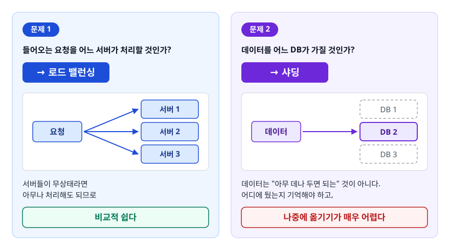
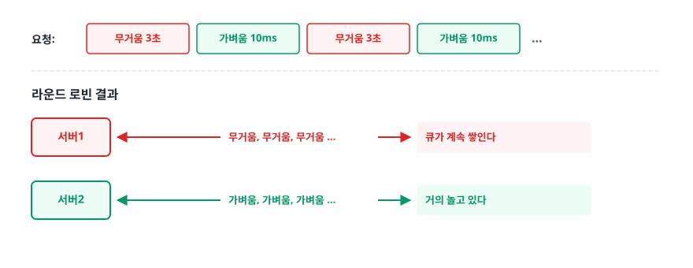
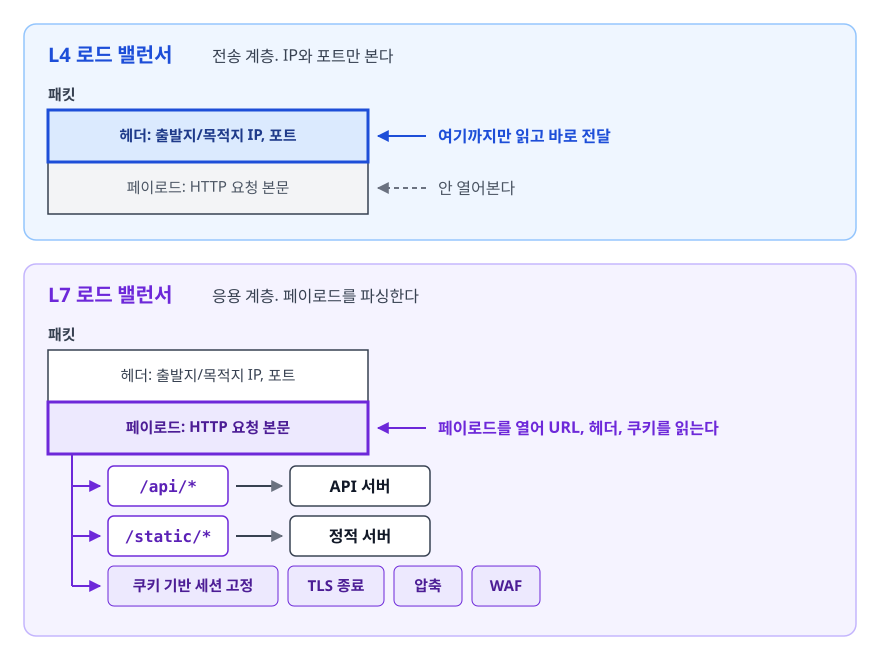
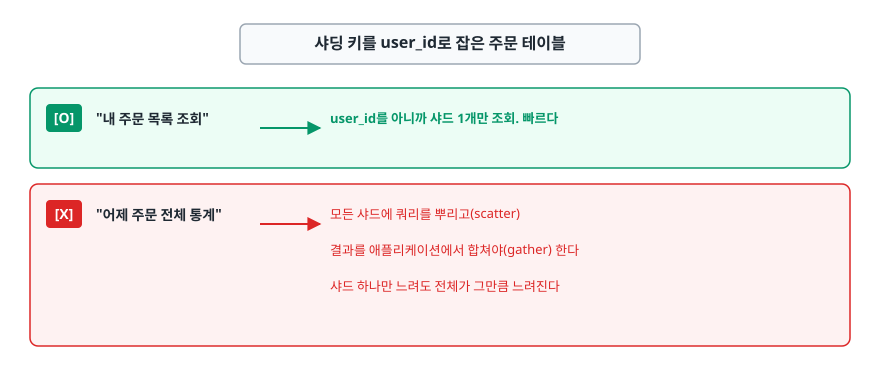
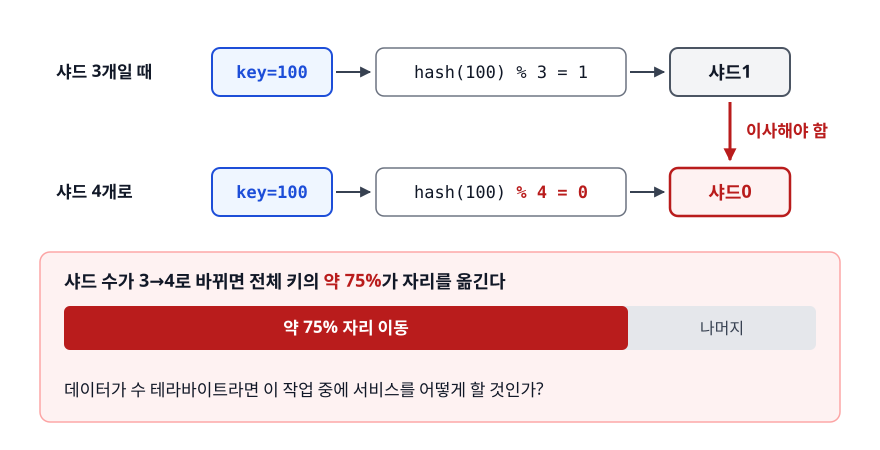
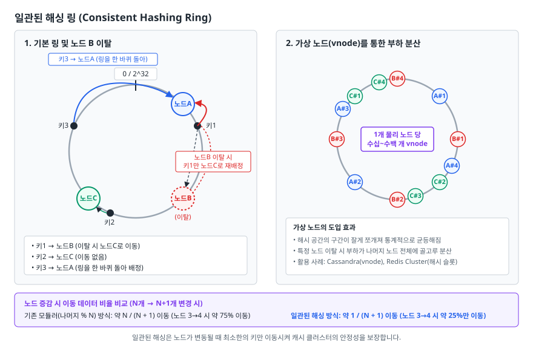
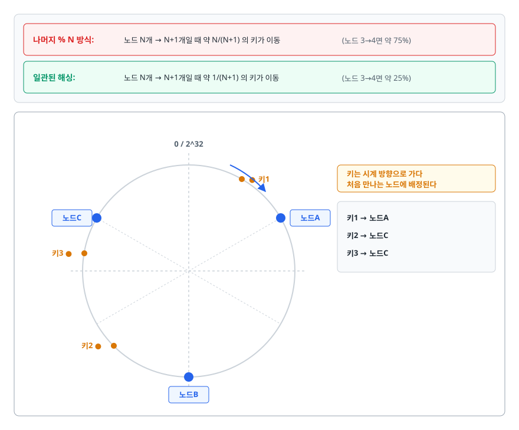
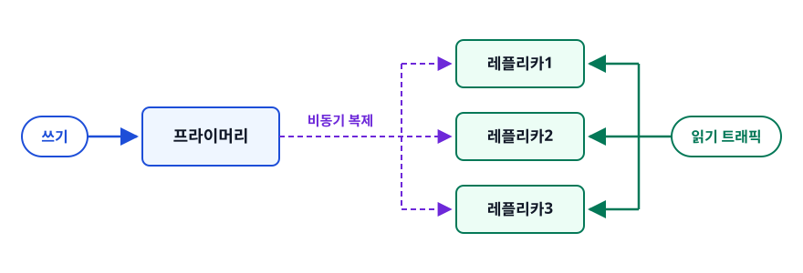
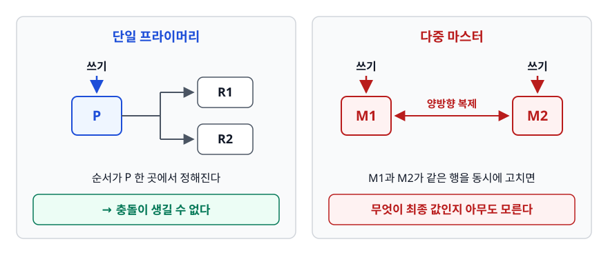

# 로드 밸런싱과 샤딩 (Load Balancing & Sharding)

> 트래픽을 여러 서버로 나누는 일과 데이터를 여러 DB로 나누는 일이 같은 종류의 확장이라고 생각하기 쉽습니다. 실제로는 난이도가 전혀 다릅니다. 왜 다른지, 그리고 샤딩 키 하나가 왜 시스템의 수명을 결정하는지를 이 문서에서 가려냅니다.

## 학습 목표

- [ ] 로드 밸런싱 알고리즘 다섯 가지를 상황에 맞게 고를 수 있다
- [ ] L4와 L7의 차이를 계층과 비용 관점에서 설명할 수 있다
- [ ] 헬스체크를 잘못 설계하면 왜 연쇄 장애가 나는지 안다
- [ ] 샤딩 키 선택 기준 세 가지를 말하고 나쁜 키를 지적할 수 있다
- [ ] 일관된 해싱이 리샤딩 비용을 어떻게 줄이는지 그림으로 설명할 수 있다
- [ ] 읽기 분산의 이득과 복제 지연이라는 대가를 함께 이해한다

## 선행 지식

- [01-cap-consistency.md](./01-cap-consistency.md) - 데이터를 나누고 복제하면 일관성 문제가 따라온다는 사실
- [OSI 7계층과 TCP/IP](../../01-computer-science-fundamentals/network/01-osi-tcp-ip.md) - L4/L7 구분을 위해

---

## 1. 왜 필요한가

서버 한 대의 성능을 올리는 수직 확장(scale-up)에는 벽이 있습니다. **가격이 성능보다 훨씬 가파르게 오르고**, 어느 지점 이상은 그런 하드웨어가 아예 존재하지 않습니다. 그리고 결정적으로 **서버가 한 대면 그 한 대가 죽을 때 서비스도 함께 죽습니다.**

그래서 서버를 여러 대로 늘리는 수평 확장(scale-out)으로 갑니다. 그런데 이 순간 두 개의 서로 다른 문제가 생깁니다.

<!-- diagram:sd-load-balancing-sharding-1 -->


<!-- 위 그림이 대체한 원본 ASCII.
     내용을 고칠 때는 그림도 함께 갱신할 것.
```
   문제 1: 들어오는 요청을 어느 서버가 처리할 것인가?
      → 로드 밸런싱.  서버들이 무상태라면 아무나 처리해도 되므로 비교적 쉽다

   문제 2: 데이터를 어느 DB가 가질 것인가?
      → 샤딩.  데이터는 "아무 데나 두면 되는" 것이 아니다.
        어디에 뒀는지 기억해야 하고, 나중에 옮기기가 매우 어렵다
```
-->

**두 문제의 난이도 차이가 이 문서의 주제입니다.** 애플리케이션 서버는 오늘 늘렸다 내일 줄여도 아무 일이 없지만, 샤딩 키를 잘못 고르면 몇 년 뒤 서비스 전체를 멈추고 데이터를 옮겨야 합니다.

### 비유

로드 밸런싱은 은행 창구 안내입니다. 창구 어디로 보내도 업무가 처리되니, 줄이 짧은 곳으로 보내면 그만이고 잘못 보냈어도 손해가 없습니다. 샤딩은 서류를 보관할 캐비닛을 나누는 일입니다. "고객 성씨 기준"으로 나눌지 "접수 날짜 기준"으로 나눌지를 처음에 정해야 하고, 나중에 기준을 바꾸려면 서류 전부를 꺼내 다시 꽂아야 합니다.

> **비유의 한계**: 캐비닛은 문을 닫고 며칠 정리하면 끝납니다. 하지만 운영 중인 서비스는 그 며칠을 멈출 수 없습니다. 그래서 실제 리샤딩은 "이중 쓰기 → 과거 데이터 복사 → 검증 → 읽기 전환"처럼 여러 단계를 겹쳐 진행해야 합니다. 샤딩 키를 사실상 못 바꾸는 진짜 이유가 이 복잡함입니다.

---

## 2. 로드 밸런싱 알고리즘

| 알고리즘 | 동작 | 언제 쓰나 | 약점 |
|---------|------|----------|------|
| 라운드 로빈 | 순서대로 하나씩 | 서버 사양이 같고 요청 처리 시간이 비슷할 때 | 무거운 요청이 한 서버에 연달아 몰릴 수 있다 |
| 가중 라운드 로빈 | 가중치 비율대로 | 서버 사양이 다를 때(구형·신형 혼재, 카나리 배포) | 가중치를 사람이 정해야 한다 |
| 최소 연결 | 현재 활성 연결이 가장 적은 서버로 | 요청별 처리 시간 편차가 클 때, WebSocket·SSE 같은 장기 연결 | 연결 수와 실제 부하가 비례하지 않을 수도 있다 |
| 최소 응답 시간 | 응답이 가장 빠른 서버로 | 서버 성능이 실시간으로 변할 때 | 측정 오버헤드, 순간적 쏠림 |
| IP 해시 | 클라이언트 IP를 해싱해 서버 결정 | 세션 고정이 꼭 필요할 때 | 서버 증감 시 매핑이 깨지고, NAT 환경에서 쏠린다 |

> 선택 기준 한 줄: **요청 처리 시간이 균일하면 라운드 로빈, 들쭉날쭉하면 최소 연결.** IP 해시는 "세션을 외부로 뺄 수 없는 사정이 있을 때"의 차선책입니다. 기본값 자리는 아닙니다.

### 라운드 로빈의 함정

라운드 로빈은 **요청 개수**만 균등하게 나눕니다. **부하**까지 균등해지지는 않습니다.

<!-- diagram:sd-load-balancing-sharding-2 -->


<!-- 위 그림이 대체한 원본 ASCII.
     내용을 고칠 때는 그림도 함께 갱신할 것.
```
   요청:  [무거움 3초] [가벼움 10ms] [무거움 3초] [가벼움 10ms] ...

   라운드 로빈 결과
   서버1 ← 무거움, 무거움, 무거움 ...   → 큐가 계속 쌓인다
   서버2 ← 가벼움, 가벼움, 가벼움 ...   → 거의 놀고 있다
```
-->

요청 개수는 정확히 반반인데 부하는 완전히 기울었습니다. 파일 업로드, 리포트 생성, 검색처럼 요청마다 비용이 다른 API가 섞여 있으면 최소 연결 방식이 훨씬 안정적입니다.

### 세션 고정(Sticky Session)이라는 임시방편

같은 클라이언트를 항상 같은 서버로 보내는 것을 세션 고정이라고 합니다. 세션을 서버 메모리에 들고 있을 때는 이렇게 하지 않으면 로그인이 유지되지 않습니다. 하지만 문제가 따라옵니다.

1. **그 서버가 죽으면 세션도 죽습니다.** 사용자는 로그아웃됩니다.
2. **부하가 기웁니다.** 오래 접속한 사용자가 특정 서버에 몰리면 그 서버만 무거워집니다.
3. **배포와 오토스케일링이 어렵습니다.** 서버를 내리려면 그 서버에 붙은 세션이 다 끝나기를 기다려야 합니다.

근본 해법은 따로 있습니다. **세션을 서버 밖으로 빼면** 됩니다. Redis 같은 외부 저장소에 세션을 두면 모든 서버가 같은 세션을 볼 수 있고, 애플리케이션 서버는 무상태가 되어 자유롭게 늘리고 줄일 수 있습니다. 세션 고정은 그 작업을 못 한 시스템의 임시방편으로 이해해야 맞습니다.

---

## 3. L4와 L7

<!-- diagram:sd-load-balancing-sharding-3 -->


<!-- 위 그림이 대체한 원본 ASCII.
     내용을 고칠 때는 그림도 함께 갱신할 것.
```
   [L4 로드 밸런서]  전송 계층. IP와 포트만 본다

   패킷 ┌──────────────────────┐
        │ 헤더: 출발지/목적지 IP, 포트 │  ← 여기까지만 읽고 바로 전달
        ├──────────────────────┤
        │ 페이로드: HTTP 요청 본문     │  ← 안 열어본다
        └──────────────────────┘

   [L7 로드 밸런서]  응용 계층. 페이로드를 파싱한다

        페이로드를 열어 URL, 헤더, 쿠키를 읽는다
        → /api/*   는 API 서버로
        → /static/* 는 정적 서버로
        → 쿠키 기반 세션 고정, TLS 종료, 압축, WAF
```
-->

| 기준 | L4 | L7 |
|------|----|----|
| 판단 근거 | IP, 포트 | URL, 헤더, 쿠키, 호스트명 |
| 처리 비용 | 낮음 (헤더만) | 높음 (페이로드 파싱) |
| 프로토콜 | TCP/UDP 무엇이든 | 주로 HTTP(S), gRPC |
| 가능한 기능 | 단순 분배 | 경로 라우팅, TLS 종료, 재시도, 압축, WAF |
| AWS 대응 | NLB | ALB |

> 선택 기준: **HTTP 기반 웹 서비스면 L7이 기본값**입니다. 경로별 라우팅과 TLS 종료만으로도 값을 합니다. L4는 HTTP가 아닌 트래픽(게임 서버, DB 프록시)이거나, 극단적인 처리량이 필요해 파싱 비용조차 아까울 때 고릅니다.

TLS 종료를 짚어둘 만합니다. L7이 암호화를 대신 풀어주면 **뒤쪽 서버들은 복호화 부담에서 해방되고, 인증서 관리도 한 곳으로 모입니다.** 인증서 갱신 횟수가 서버 50대면 50번, L7에 모으면 한 번입니다.

---

## 4. 헬스체크

로드 밸런서가 죽은 서버로 트래픽을 보내지 않으려면 상태를 주기적으로 확인해야 합니다. 그런데 헬스체크는 잘못 설계하면 **없느니만 못합니다.**

```java
// 안티패턴 — 모든 의존성을 다 확인하는 헬스체크
@GetMapping("/health")
public ResponseEntity<String> health() {
    jdbcTemplate.queryForObject("SELECT 1", Integer.class);   // DB 확인
    redisTemplate.opsForValue().get("health");                 // Redis 확인
    recommendationClient.ping();                               // 추천 서비스 확인
    paymentClient.ping();                                      // 결제사 확인
    return ResponseEntity.ok("UP");
}
```

**왜 문제인가**: 추천 서비스 하나가 느려지면 **모든 인스턴스의 헬스체크가 동시에 실패합니다.** 로드 밸런서는 전 서버를 비정상으로 판단해 트래픽 분배 대상에서 전부 빼버리고, 서비스는 완전히 죽습니다. 실제로는 추천 없이도 주문은 처리할 수 있었는데 말입니다. 이것이 연쇄 장애(cascading failure)의 전형적인 형태입니다.

```java
// 개선 — 헬스체크는 "이 인스턴스가 요청을 받을 수 있는가"만 답한다
@GetMapping("/health")
public ResponseEntity<String> health() {
    return ResponseEntity.ok("UP");   // 프로세스가 살아 있고 응답 가능하다는 신호
}

// 의존성 상태는 별도 엔드포인트로 분리해 모니터링에서만 본다
@GetMapping("/health/dependencies")
public DependencyStatus dependencies() {
    return new DependencyStatus(checkDb(), checkRedis(), checkRecommendation());
}
```

헬스체크의 질문은 <strong>"이 서버가 완벽한가"가 아니라 "이 서버로 트래픽을 보내는 것이 안 보내는 것보다 나은가"</strong>입니다. 필수 의존성(자기 DB)까지는 확인해도 됩니다. 부가 의존성은 없어도 서비스가 되니 헬스체크에 넣지 않습니다.

주기와 임계치도 중요합니다. 너무 짧고 민감하면 일시적인 GC 정지 하나로 정상 서버가 빠지고, 너무 길면 장애 감지가 늦습니다. 보통 수 초 간격에 연속 2~3회 실패를 기준으로 잡습니다. 또한 새로 뜬 인스턴스는 JIT 워밍업이나 커넥션 풀 초기화가 끝나기 전에 트래픽을 받으면 느리게 응답하므로, 준비 시간(grace period)을 두어 천천히 투입합니다.

### 로드 밸런서 자신은 누가 지키나

로드 밸런서 자체가 단일 장애점이 되면 아무 의미가 없습니다. 해법은 이렇습니다.

- **Active-Standby**: 대기 장비를 두고, VRRP 같은 프로토콜로 가상 IP(VIP)를 넘깁니다. 클라이언트는 VIP만 알고 있으므로 실제로 어느 장비가 처리하는지 몰라도 됩니다. 전환 순간 짧은 끊김이 있습니다.
- **Active-Active**: 여러 대가 동시에 트래픽을 받습니다. DNS 라운드 로빈이나 애니캐스트로 앞단에서 분산합니다.
- **매니지드 로드 밸런서**: 클라우드의 ALB/NLB는 여러 가용 영역에 자동으로 이중화됩니다. 위 작업을 설정 한 번으로 대체하므로, 특별한 이유가 없으면 이쪽이 정답입니다.

---

## 5. 데이터를 나누기: 샤딩

### 샤딩과 파티셔닝

둘 다 "큰 데이터를 나눈다"는 점은 같지만 **나눈 조각이 어디에 있느냐**가 다릅니다. 파티셔닝은 한 DB 서버 안에서 테이블을 조각내고, 샤딩은 조각을 물리적으로 다른 서버에 둡니다. 그래서 파티셔닝은 조인과 트랜잭션이 그대로 되지만, 샤딩은 둘 다 어려워집니다.

샤딩은 **저장 용량, 쓰기 처리량, 인덱스 크기**의 한계를 넘으려고 씁니다. 읽기만 부족하면 레플리카로 충분합니다. **샤딩은 쓰기가 한 대로 감당이 안 될 때 마지막에 꺼내는 카드**입니다.

### 샤딩 키가 왜 가장 중요한가

샤딩 키는 "이 데이터가 어느 샤드로 갈지"를 결정하는 컬럼입니다. 그리고 이것은 **한번 정하면 사실상 바꿀 수 없습니다.** 바꾸려면 전체 데이터를 다시 배치해야 하는데, 그 규모가 되면 무중단으로 하기가 대단히 어렵습니다.

좋은 샤딩 키의 조건은 셋입니다.

1. **분포가 균등한가** — 특정 샤드에 데이터와 트래픽이 몰리지 않아야 합니다.
2. **카디널리티가 충분한가** — 값의 종류가 샤드 수보다 훨씬 많아야 나눌 수 있습니다.
3. **주 쿼리 패턴과 일치하는가** — 대부분의 조회가 샤딩 키를 조건에 포함해야 한 샤드만 보고 답할 수 있습니다.

3번을 놓치면 이런 일이 벌어집니다.

<!-- diagram:sd-load-balancing-sharding-4 -->


<!-- 위 그림이 대체한 원본 ASCII.
     내용을 고칠 때는 그림도 함께 갱신할 것.
```
   샤딩 키를 user_id로 잡은 주문 테이블

   [O] "내 주문 목록 조회"      → user_id를 아니까 샤드 1개만 조회. 빠르다
   [X] "어제 주문 전체 통계"    → 모든 샤드에 쿼리를 뿌리고(scatter)
                                 결과를 애플리케이션에서 합쳐야(gather) 한다
                                 샤드 하나만 느려도 전체가 그만큼 느려진다
```
-->

이것을 산탄-수집(scatter-gather)이라고 부릅니다. 샤딩된 시스템에서 가장 흔한 성능 함정이고, 대응은 대개 "통계는 별도의 분석용 저장소에서 처리한다"로 갑니다.

### 안티패턴: 시간이나 자동 증가 값을 샤딩 키로

```
   샤딩 키 = created_at (월 단위 범위 분할)

   샤드1: 2026-01   샤드2: 2026-02   ...   샤드7: 2026-07
   [거의 놀고 있음]  [거의 놀고 있음]        [모든 쓰기가 여기로]
```

**왜 문제인가**: 새로 들어오는 데이터는 언제나 "지금"입니다. 즉 **모든 쓰기가 마지막 샤드 하나로 몰립니다.** 샤드를 열 개로 나눴는데 쓰기 처리량은 한 대짜리와 같습니다. 샤딩을 한 의미가 사라집니다. 자동 증가 기본 키를 범위로 나눠도 정확히 같은 문제가 생깁니다. 이 현상을 **핫 샤드**(hot shard)라고 부릅니다.

개선 방향은 둘입니다.

- **접근 주체를 키로 삼습니다.** 주문을 `user_id`로 나누면 사용자는 전 시간대에 걸쳐 고르게 분포하므로 쓰기도 고르게 퍼집니다. 대부분의 조회가 "내 주문"이므로 쿼리 패턴과도 맞습니다.
- **시간 기반이 꼭 필요하면 접두어를 섞습니다.** 로그처럼 본질적으로 시계열인 데이터는 `(hash(source_id) % 16, 날짜)` 같은 복합 키로 같은 시간대의 쓰기를 16갈래로 흩습니다.

### 세 가지 샤딩 전략

| 전략 | 매핑 방식 | 장점 | 단점 |
|------|----------|------|------|
| 범위(Range) | `id 1~100만 → 샤드1` | 범위 쿼리가 한 샤드에서 끝난다. 샤드 추가가 쉽다 | 분포가 기울면 핫 샤드가 생긴다 |
| 해시(Hash) | `hash(key) % N → 샤드` | 분포가 균등하다 | 범위 쿼리가 전 샤드로 흩어진다. **N이 바뀌면 거의 전부 이동한다** |
| 디렉터리(Directory) | 별도 매핑 테이블 조회 | 매핑이 자유로워 특정 키만 옮기기 쉽다 | 매핑 서비스가 단일 장애점이자 추가 왕복 |

> 실무 기본값은 **해시 + 일관된 해싱** 조합입니다. 균등 분포를 얻으면서 해시 샤딩의 리샤딩 문제를 완화할 수 있기 때문입니다.

### 리샤딩 문제

해시 샤딩의 치명적인 약점은 샤드 수를 바꿀 때 드러납니다.

<!-- diagram:sd-load-balancing-sharding-5 -->


<!-- 위 그림이 대체한 원본 ASCII.
     내용을 고칠 때는 그림도 함께 갱신할 것.
```
   샤드 3개일 때:  key=100 → hash(100) % 3 = 1 → 샤드1
   샤드 4개로:     key=100 → hash(100) % 4 = 0 → 샤드0   (이사해야 함)

   샤드 수가 3→4로 바뀌면 전체 키의 약 75%가 자리를 옮긴다.
   데이터가 수 테라바이트라면 이 작업 중에 서비스를 어떻게 할 것인가?
```
-->

다음 절의 일관된 해싱이 이 문제를 풉니다.

---

## 6. 일관된 해싱

<!-- diagram:sd-consistent-hashing -->


**키와 노드를 같은 해시 공간(원형 링) 위에 올려놓고, 키는 자기보다 큰 쪽으로 가다 처음 만나는 노드에 배정합니다.** 이것이 핵심 아이디어입니다.

```
                     0 / 2^32
                        │
              노드C ────┼──── 노드A
                   ╲    │    ╱
                    ╲   │   ╱      키는 시계 방향으로 가다
              키3 ●  ╲  │  ╱  ● 키1   처음 만나는 노드에 배정된다
                      ╲ │ ╱
                       ╲│╱          키1 → 노드A
              ──────────┼──────────  키2 → 노드B
                       ╱│╲          키3 → 노드A(링을 한 바퀴 돌아)
                      ╱ │ ╲
                 키2 ●  │
                        │
                     노드B
```

노드 B를 제거하면 어떻게 될까요? **B가 담당하던 키만 다음 노드로 옮겨가고, 나머지 키는 전혀 움직이지 않습니다.** 노드를 추가할 때도 마찬가지로, 새 노드가 끼어드는 구간의 키만 이동합니다.

<!-- diagram:sd-load-balancing-sharding-6 -->


<!-- 위 그림이 대체한 원본 ASCII.
     내용을 고칠 때는 그림도 함께 갱신할 것.
```
   나머지 % N 방식:  노드 N개 → N+1개일 때  약 N/(N+1) 의 키가 이동
                     (노드 3→4면 약 75%)

   일관된 해싱:      노드 N개 → N+1개일 때  약 1/(N+1) 의 키가 이동
                     (노드 3→4면 약 25%)
```
-->

### 가상 노드가 필요한 이유

노드가 링 위에 무작위로 배치되면 구간 크기가 고르지 않습니다. 노드 3개면 어떤 노드가 링의 절반을 담당하게 될 수도 있습니다. 또 노드 하나가 빠지면 그 부하가 **바로 다음 노드 한 대에만 몰립니다.**

**노드 하나를 링 위 여러 지점에 올려두면** 해결됩니다. 노드 A를 `A#1`, `A#2`, ... `A#150`처럼 150개의 가상 노드로 링에 뿌리면,

- 구간이 잘게 쪼개져 통계적으로 균등해지고,
- 노드 A가 빠질 때 그 부하가 **나머지 모든 노드에 골고루 분산**됩니다.

Cassandra는 가상 노드(vnode)로 이 방식을 그대로 씁니다. Redis Cluster는 해시 슬롯 16384개를 노드에 나눠 주는 방식으로 같은 목적(노드가 바뀔 때 옮겨야 할 데이터를 최소화)을 달성합니다. **그래서 캐시 클러스터에서는 노드 한 대가 죽어도 캐시 전체가 날아가지 않습니다.**

---

## 7. 레플리카와 읽기 분산

샤딩이 쓰기를 나눈다면, 복제는 읽기를 나눕니다. 대부분의 서비스는 읽기가 쓰기보다 압도적으로 많으므로 **샤딩보다 먼저 검토해야 할 카드**입니다.

<!-- diagram:sd-load-balancing-sharding-7 -->


<!-- 위 그림이 대체한 원본 ASCII.
     내용을 고칠 때는 그림도 함께 갱신할 것.
```
   쓰기 ──► [프라이머리] ──비동기 복제──┬──► [레플리카1] ──┐
                                       ├──► [레플리카2] ──┼── 읽기 트래픽
                                       └──► [레플리카3] ──┘
```
-->

Spring에서는 `@Transactional(readOnly = true)`가 붙은 트랜잭션을 레플리카로 라우팅하도록 데이터소스를 구성합니다. 흔히 쓰는 구성이고 코드 변경 없이 읽기 부하를 분산할 수 있습니다.

대신 **복제 지연**(replication lag)을 떠안습니다. 복제가 비동기이므로 프라이머리에 쓴 내용이 레플리카에 도착하기까지 시간이 걸립니다. 평소에는 밀리초 단위지만, 프라이머리에 쓰기가 몰리거나 레플리카 사양이 부족하면 수 초에서 수십 초까지 벌어집니다. 이때 "방금 쓴 글이 목록에 없다"는 문제가 나타납니다. 이 현상과 대응(읽은 내 쓰기 보장)은 [01-cap-consistency.md](./01-cap-consistency.md)의 4절에서 코드와 함께 다룹니다.

운영에서는 **복제 지연 모니터링과 자동 제외**를 반드시 갖춰야 합니다. 레플리카의 지연이 임계치를 넘으면 읽기 대상에서 자동으로 빼야 합니다. 그러지 않으면 뒤처진 레플리카 한 대가 계속 낡은 데이터를 응답하면서 사용자 일부에게만 재현되는 버그를 만듭니다.

**페일오버 시 데이터 유실**도 알아둬야 합니다. 비동기 복제에서 프라이머리가 갑자기 죽으면, 마지막 트랜잭션 가운데 아직 어느 레플리카에도 도달하지 못한 것들은 영구히 사라집니다. 이것이 곤란한 도메인이라면 반동기 복제를 검토합니다. 최소 한 대의 확인을 기다리는 방식입니다. 완전 동기보다 성능 영향이 작으면서 유실 위험은 크게 줄어듭니다.

### 다중 마스터는 왜 기본값이 아닌가

다중 마스터(multi-master, 또는 multi-leader) 구성도 있습니다. 쓰기를 여러 노드가 동시에 받는 방식입니다. 쓰기까지 분산되고 한쪽이 죽어도 반대편이 쓰기를 계속 받는다는 점이 매력적입니다.

<!-- diagram:sd-load-balancing-sharding-8 -->


<!-- 위 그림이 대체한 원본 ASCII.
     내용을 고칠 때는 그림도 함께 갱신할 것.
```
   [단일 프라이머리]              [다중 마스터]

   쓰기 ──► P ──► R1, R2         쓰기 ──► M1 ◄──양방향 복제──► M2 ◄── 쓰기
   순서가 P 한 곳에서 정해진다     M1과 M2가 같은 행을 동시에 고치면
   → 충돌이 생길 수 없다           무엇이 최종 값인지 아무도 모른다
```
-->

그 대가로 **쓰기 충돌**이 따라옵니다. 같은 행을 양쪽에서 동시에 고쳤을 때 무엇이 맞는지 DB가 대신 정해줄 수 없습니다. "타임스탬프가 늦은 쪽이 이긴다" 같은 규칙을 택하면 다른 한쪽의 쓰기가 조용히 사라지고, 사라지면 곤란한 도메인이라면 병합 로직을 직접 써야 합니다. 게다가 두 노드의 시계가 어긋나 있으면 그 규칙 자체가 어긋납니다.

그래서 다중 마스터는 **지리적으로 떨어진 리전에서 각각 쓰기를 받아야 하거나, 오프라인 편집을 나중에 합쳐야 하는 경우**처럼 충돌을 감수할 이유가 분명할 때만 고릅니다. 단순히 쓰기 처리량이 부족한 것이라면 다중 마스터가 아니라 샤딩으로 갑니다. **샤딩은 애초에 같은 데이터를 두 곳에서 쓰지 못하게 나누는 방식이라 충돌 자체가 발생하지 않습니다.**

---

## 8. 실무에서는

- **순서가 있습니다.** 캐시 → 읽기 레플리카 → 샤딩 순으로 검토합니다. 샤딩은 큰 공사입니다. 조인, 트랜잭션, 유일성 제약, 통계 쿼리를 전부 다시 설계해야 합니다. 앞의 두 카드로 해결되면 그걸로 끝내야 합니다.
- **샤딩을 도입하기로 했다면 키 설계에 가장 많은 시간을 씁니다.** 나머지는 나중에 고칠 수 있지만 키는 사실상 못 고칩니다. "이 서비스의 조회 요청 중 몇 퍼센트가 이 키를 조건에 포함하는가"를 실제 쿼리 로그로 세어보면 가장 확실합니다.
- **샤드 간 유일성은 DB가 보장해주지 않습니다.** 이메일 중복 방지 같은 제약은 샤드마다 따로 걸리므로 전역 유일성이 깨집니다. 별도의 유일성 관리 테이블을 두거나, 그 컬럼을 샤딩 키로 삼는 별도 인덱스 샤드를 운영합니다.
- **분산 ID 생성이 필요해집니다.** 자동 증가 정수는 샤드마다 중복되므로 못 씁니다. 무작위 UUID(v4)는 값이 뒤섞여 들어가 인덱스 지역성이 나쁩니다. 그래서 스노플레이크(Snowflake) 방식의 ID 생성기를 쓰는 경우가 많습니다. 시간 순서를 유지하면서 노드 정보를 담는 방식입니다. 앞부분에 타임스탬프를 두는 UUIDv7처럼 정렬 가능한 변형을 쓰는 방법도 있습니다.

---

## 9. 면접 포인트

> 면접에서 이 주제가 나오면 이렇게 답한다

**Q. 로드 밸런싱 알고리즘은 어떻게 고르나요?**

A. **요청 처리 시간의 편차**가 기준입니다. 서버 사양이 같고 요청이 균일하면 라운드 로빈으로 충분하지만, 파일 업로드나 리포트 생성처럼 요청마다 비용이 크게 다르면 최소 연결 방식이 낫습니다. 라운드 로빈은 요청 개수를 균등하게 나눌 뿐 부하를 균등하게 나누지는 않기 때문입니다. 서버 사양이 다르면 가중 라운드 로빈을 쓰고, IP 해시는 세션을 외부로 뺄 수 없을 때의 차선책으로만 씁니다.
- 꼬리 질문: "세션 고정의 문제는요?" → 서버가 죽으면 세션이 사라지고, 부하가 기울고, 배포와 오토스케일링이 어려워집니다. 근본 해법은 세션을 Redis 같은 외부 저장소로 빼서 서버를 무상태로 만드는 것입니다.

**Q. 헬스체크를 설계할 때 주의할 점은?**

A. **의존성을 과도하게 묶지 않는 것**이 핵심입니다. 헬스체크에서 추천 서비스나 결제사까지 확인하면, 그 부가 서비스 하나가 느려졌을 때 모든 인스턴스가 동시에 비정상 판정을 받아 서비스가 통째로 죽습니다. 헬스체크의 질문은 "이 서버가 완벽한가"가 아니라 "이 서버로 트래픽을 보내는 것이 안 보내는 것보다 나은가"여야 합니다. 의존성 상태는 별도 엔드포인트로 분리해 모니터링에서만 봅니다.
- 꼬리 질문: "주기와 임계치는 어떻게 잡나요?" → 너무 민감하면 일시적 GC 정지에도 정상 서버가 빠지고, 너무 둔하면 장애 감지가 늦습니다. 수 초 간격에 연속 2~3회 실패를 기준으로 잡고, 새 인스턴스에는 워밍업 시간을 줍니다.

**Q. 샤딩 키는 어떻게 고르나요?**

A. 분포가 균등할 것, 카디널리티가 충분할 것, **주 쿼리 패턴과 일치할 것** 세 가지를 봅니다. 특히 세 번째가 중요합니다. 대부분의 조회가 샤딩 키를 조건에 포함해야 한 샤드만 보고 답할 수 있고, 그렇지 않으면 모든 샤드에 쿼리를 뿌리고 합치는 산탄-수집이 발생합니다. 대표적인 나쁜 키는 생성 시각이나 자동 증가 PK입니다. 새 데이터가 항상 마지막 샤드로만 들어가서 쓰기가 한 곳에 몰리는 핫 샤드가 되기 때문입니다. 주문이라면 `user_id`처럼 접근 주체를 키로 삼는 편이 안전합니다.
- 꼬리 질문: "샤딩 키를 나중에 바꿀 수 있나요?" → 사실상 못 바꿉니다. 전체 데이터를 재배치해야 하고 그 규모에서 무중단 이관은 대단히 어렵습니다. 그래서 도입 전에 실제 쿼리 로그로 검증합니다.

**Q. 일관된 해싱은 어떤 문제를 푸나요?**

A. `hash(key) % N` 방식은 노드 수 N이 바뀌면 거의 모든 키의 위치가 달라집니다. 노드 3대에서 4대로 늘리면 약 75%의 데이터가 이사해야 합니다. 일관된 해싱은 키와 노드를 같은 원형 해시 공간에 올려두고 키를 시계 방향으로 가장 가까운 노드에 배정해서, **노드가 추가·제거될 때 인접 구간의 데이터만 움직이게** 합니다. 이동량이 약 `1/(N+1)` 수준으로 줄어듭니다. 여기에 노드 하나를 링 위 여러 지점에 올리는 가상 노드를 더하면 분포가 균등해지고, 노드가 빠질 때 부하가 나머지 전체에 고르게 퍼집니다.
- 꼬리 질문: "가상 노드가 없으면 무슨 일이 생기나요?" → 링 구간이 불균등해져 특정 노드가 과도한 부하를 받고, 노드 하나가 빠질 때 그 부하가 바로 다음 노드 한 대에만 몰려 연쇄 장애가 날 수 있습니다.

---

## 자주 하는 실수

| 실수 | 왜 틀렸나 | 올바른 이해 |
|------|----------|-----------|
| 라운드 로빈이면 부하가 균등하다 | 요청 개수만 균등할 뿐 요청당 비용은 다르다 | 처리 시간 편차가 크면 최소 연결 방식을 쓴다 |
| 세션 고정으로 세션 문제를 해결한다 | 서버 장애 시 세션 유실, 부하 불균형, 배포 곤란이 남는다 | 세션을 외부 저장소로 빼고 서버를 무상태로 만든다 |
| 헬스체크에서 모든 의존성을 확인한다 | 부가 서비스 하나의 장애가 전 인스턴스를 내린다 | "트래픽을 받을 수 있는가"만 확인하고 의존성은 별도 엔드포인트로 |
| 생성 시각을 샤딩 키로 쓴다 | 새 쓰기가 항상 마지막 샤드로만 간다(핫 샤드) | 접근 주체(user_id 등) 기준으로 나누거나 해시 접두어를 섞는다 |
| 읽기가 느려서 샤딩한다 | 읽기 문제는 캐시와 레플리카로 훨씬 싸게 해결된다 | 샤딩은 **쓰기와 저장 용량**이 한 대로 감당 안 될 때의 카드다 |
| 샤딩하면 유니크 제약이 그대로 동작한다 | 제약은 샤드마다 따로 걸려 전역 유일성이 깨진다 | 별도 유일성 관리 수단이나 분산 ID 생성기가 필요하다 |

---

## 한 줄 정리

트래픽을 나누는 일(로드 밸런싱)은 되돌릴 수 있어서 알고리즘 선택이 곧 튜닝이지만, 데이터를 나누는 일(샤딩)은 되돌릴 수 없어서 **샤딩 키 한 줄이 시스템의 수명을 결정합니다.**

---

## 연관 개념

- [01-cap-consistency.md](./01-cap-consistency.md) - 복제와 분할이 만드는 일관성 문제, 복제 지연 대응
- [qna-scalability.md](./qna-scalability.md) - 수평/수직 확장, 로드 밸런서, 샤딩 면접 질문 (Q1~Q3, Q5)
- [../qna-infrastructure.md](../qna-infrastructure.md) - L4/L7, 무중단 배포 등 인프라 면접 질문
- [../caching/02-redis-cdn.md](../caching/02-redis-cdn.md) - Redis 클러스터가 해시 슬롯으로 같은 문제를 푸는 방식
- [../performance/01-performance-optimization.md](../performance/01-performance-optimization.md) - 확장 전에 병목이 정말 용량 부족인지 확인하는 절차
- [../../01-computer-science-fundamentals/network/01-osi-tcp-ip.md](../../01-computer-science-fundamentals/network/01-osi-tcp-ip.md) - L4/L7 구분의 근거가 되는 계층 모델
- [../../01-computer-science-fundamentals/data-structure/04-hash-table.md](../../01-computer-science-fundamentals/data-structure/04-hash-table.md) - 해시 함수와 충돌 처리의 기본
- [../../06-software-engineering/04-architecture-monolith-msa.md](../../06-software-engineering/04-architecture-monolith-msa.md) - 확장 단위를 서버가 아니라 서비스로 쪼개는 선택(qna-scalability Q6)
