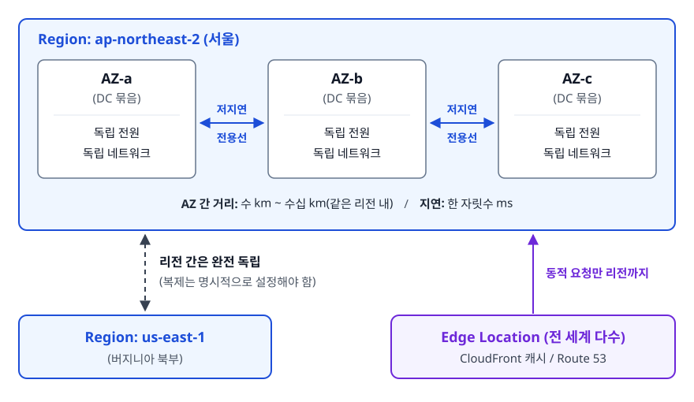
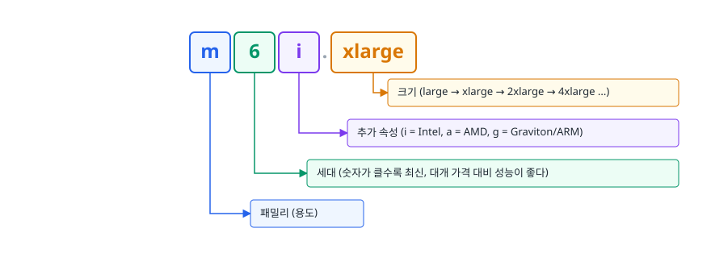
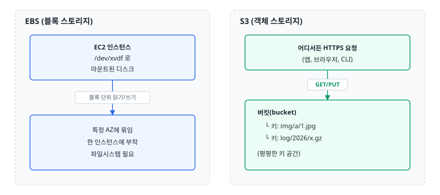
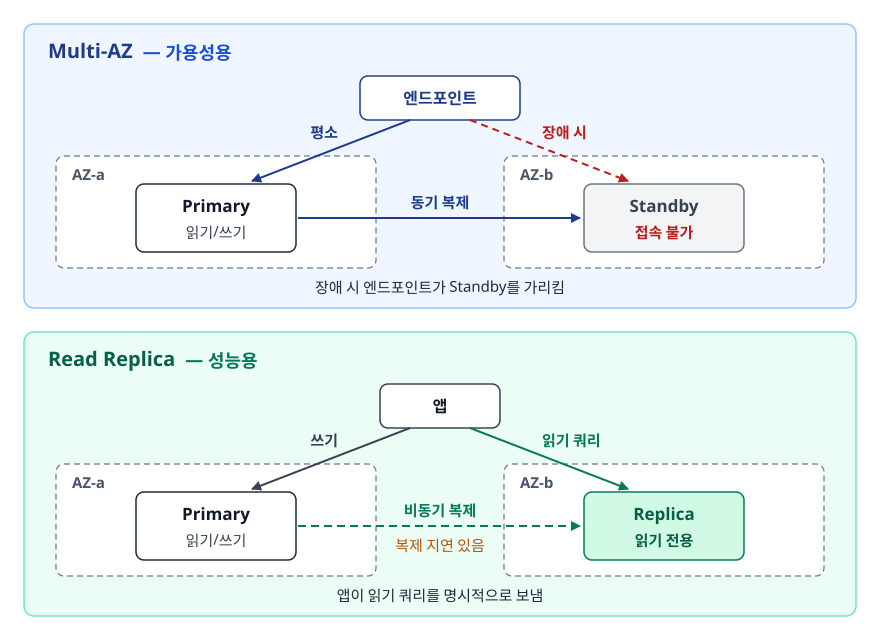
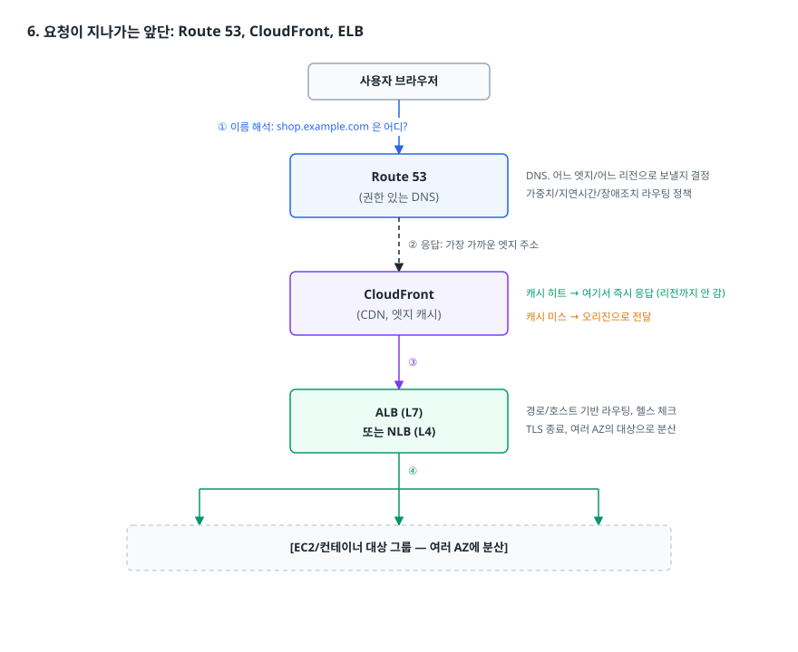
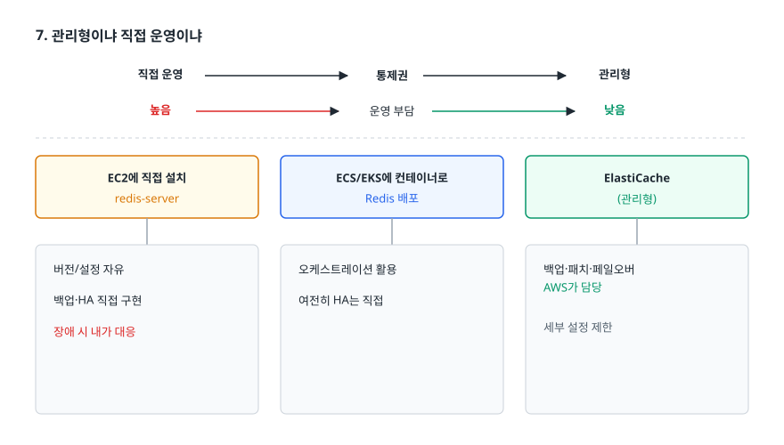
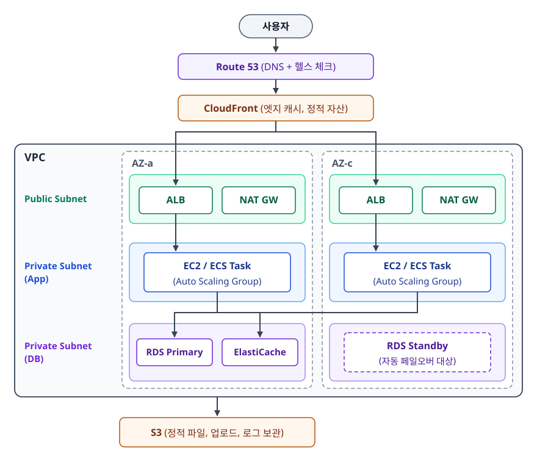

# AWS 핵심 서비스 지도 (AWS Core Services)

> AWS의 글로벌 인프라가 어떻게 생겼는지, EC2/S3/RDS/ELB/Route 53/CloudFront가 각각 어떤 문제를 담당하는지, 그리고 "관리형 서비스를 쓸 것인가 직접 운영할 것인가"를 무엇을 기준으로 판단하는지 설명할 수 있게 됩니다.

## 학습 목표

- [ ] Region, Availability Zone, Edge Location의 차이와 각각이 해결하는 문제를 설명할 수 있다
- [ ] EC2 인스턴스 타입 이름을 읽고, 워크로드에 맞는 패밀리를 고를 수 있다
- [ ] S3(객체 스토리지)와 EBS(블록 스토리지)를 언제 각각 쓰는지 구분할 수 있다
- [ ] RDS를 쓸 때와 EC2에 DB를 직접 설치할 때의 트레이드오프를 설명할 수 있다
- [ ] ALB/NLB, Route 53, CloudFront가 요청 경로의 어느 지점에 놓이는지 그릴 수 있다
- [ ] 표준 3-tier 아키텍처를 서비스 이름을 넣어 스스로 그릴 수 있다

## 선행 지식

- [가상화와 Hypervisor](../cloud-fundamentals/02-virtualization-hypervisor.md) - EC2가 결국 무엇인지 이해하는 데 필요하다
- 없어도 읽을 수 있습니다. 리눅스 서버 한 대를 다뤄본 경험이 있으면 훨씬 잘 읽힙니다.

---

## 1. 왜 필요한가

클라우드 이전의 서비스 출시는 이런 모습이었습니다.

```
기획 확정 → 용량 산정 → 서버 견적/구매 승인 → 납품 대기(수 주)
        → IDC 랙 입고 → OS 설치 → 네트워크 배선 → 방화벽 신청
        → 그제서야 애플리케이션 배포
```

이 흐름에는 구조적인 문제가 있었습니다.

우선 **결정을 너무 일찍 해야 합니다**. 서비스가 얼마나 뜰지 모르는 상태에서 "서버 몇 대를 살지"를 정해야 합니다. 적게 사면 오픈하자마자 장애가 나고, 많이 사면 몇 달 동안 놀고 있는 하드웨어에 돈이 묶입니다.

그리고 한 번 내린 결정을 **되돌릴 수 없습니다**. 잘못 산 서버는 반품되지 않습니다. 그래서 인프라 결정은 항상 무겁고 보수적이 되고, 그만큼 실험이 줄어듭니다.

AWS는 **결정을 미루고 되돌릴 수 있는 권리**를 팔았습니다. "싼 서버"는 부수적입니다. 필요할 때 몇 분 만에 만들고, 필요 없어지면 삭제하면 그 시점부터 과금이 멈춥니다. 인프라가 자본 지출(CapEx)에서 운영 지출(OpEx)로 바뀐다는 표현이 이 뜻입니다.

> **비유**: 클라우드는 자동차를 사는 대신 렌트하는 것과 같습니다. 필요할 때 필요한 차종을 빌리고, 안 타면 반납합니다.
> **비유의 한계**: 렌트카는 반납하면 끝이지만, 클라우드는 **끄는 것과 지우는 것이 다릅니다**. EC2를 중지(stop)해도 붙어 있는 EBS 볼륨과 Elastic IP는 계속 과금됩니다. "안 쓰면 공짜"가 아니라 "삭제해야 공짜"입니다.

---

## 2. 글로벌 인프라: Region, AZ, Edge Location

AWS의 모든 서비스는 이 3층 구조 위에 놓입니다. 여기를 흐리게 이해하면 뒤의 모든 설계 논의가 흔들립니다.

### 정의

- **리전(Region)**: 지리적으로 분리된 독립 클러스터. `ap-northeast-2`(서울), `us-east-1`(버지니아 북부) 같은 코드로 부릅니다. 리전끼리는 완전히 독립적이라, 한 리전이 통째로 장애가 나도 다른 리전은 영향받지 않습니다.
- **가용 영역(AZ, Availability Zone)**: 한 리전 안의 물리적으로 분리된 데이터센터 묶음. 전원, 냉각, 네트워크가 서로 독립적입니다. 서울 리전은 여러 개의 AZ로 구성됩니다.
- **엣지 로케이션(Edge Location)**: 사용자와 가까운 곳에 놓인 캐시 거점. CloudFront와 Route 53이 여기서 동작합니다. 리전보다 훨씬 많은 도시에 깔려 있습니다.

### 동작 원리

<!-- diagram:cloud-core-services-1 -->


<!-- 위 그림이 대체한 원본 ASCII.
     내용을 고칠 때는 그림도 함께 갱신할 것.
```
┌──────────────────── Region: ap-northeast-2 (서울) ────────────────────┐
│                                                                        │
│   ┌─────────────┐      ┌─────────────┐      ┌─────────────┐          │
│   │    AZ-a     │      │    AZ-b     │      │    AZ-c     │          │
│   │  (DC 묶음)  │◀────▶│  (DC 묶음)  │◀────▶│  (DC 묶음)  │          │
│   │ 독립 전원   │ 저지연│ 독립 전원   │ 저지연│ 독립 전원   │          │
│   │ 독립 네트워크│ 전용선│ 독립 네트워크│ 전용선│ 독립 네트워크│          │
│   └─────────────┘      └─────────────┘      └─────────────┘          │
│                                                                        │
│   AZ 간 거리: 수 km ~ 수십 km(같은 리전 내) / 지연: 한 자릿수 ms      │
└────────────────────────────────────────────────────────────────────────┘
        ▲                                    ▲
        │ 리전 간은 완전 독립 (복제는 명시적으로 설정해야 함)
        ▼                                    │
┌──────────────────┐              ┌──────────────────────────────┐
│ Region: us-east-1│              │ Edge Location (전 세계 다수)  │
└──────────────────┘              │  CloudFront 캐시 / Route 53   │
                                  └──────────────────────────────┘
```
-->

이 구조가 설계에 주는 규칙은 단순합니다.

- **AZ는 장애 격리 단위다** → 같은 역할의 서버를 최소 2개 AZ에 나눠 배치합니다. 한 AZ가 죽어도 서비스는 삽니다.
- **리전은 데이터 주권과 지연 시간의 단위다** → 한국 사용자를 대상으로 하면 서울 리전, 개인정보를 국외로 못 보내는 규제가 있으면 선택지가 리전 단위로 결정됩니다.
- **엣지는 지연 시간 단위다** → 정적 파일과 DNS 응답은 엣지에서 끝내고, 동적 요청만 리전까지 보냅니다.

### 흔한 오해

**"AZ에 나눠 놓으면 자동으로 이중화된다"** — 아닙니다. EC2를 2개 AZ에 띄워도 앞단에 로드 밸런서가 없으면 한쪽이 죽었을 때 트래픽이 알아서 옮겨가지 않습니다. AZ 분산은 **전제일 뿐입니다.** 재해를 격리할 수 있게만 해 줍니다. 장애 조치(failover) 자체는 ELB, Auto Scaling, RDS Multi-AZ 같은 장치가 해줍니다.

**"`ap-northeast-2a`는 모든 계정에서 같은 데이터센터다"** — 아닙니다. AZ 이름은 계정마다 다른 물리 AZ에 매핑됩니다(부하 분산을 위한 AWS의 의도된 설계). 계정 간에 물리적으로 같은 AZ를 지칭하려면 **AZ ID**(`apne2-az1` 형태)를 봐야 합니다. 이름으로는 알 수 없습니다.

**"S3는 글로벌 서비스다"** — 버킷 이름 네임스페이스가 전역이라 그렇게 보이지만, 데이터 자체는 **리전에 저장됩니다**. 반면 IAM, Route 53, CloudFront는 진짜 글로벌 서비스입니다.

---

## 3. 컴퓨팅: EC2

### 무엇을 파는 서비스인가

EC2(Elastic Compute Cloud)는 **가상 서버를 시간 단위로 빌려주는 서비스**입니다. 인스턴스 하나를 만들려면 이만큼을 정해야 합니다.

| 선택 항목 | 무엇인가 | 잘못 고르면 |
|---|---|---|
| AMI (Amazon Machine Image) | 부팅 디스크 이미지(OS + 사전 설치 SW) | 팀이 안 쓰는 배포판을 골라 운영 스크립트가 안 맞음 |
| 인스턴스 타입 | CPU/메모리/네트워크 사양 | 과대 선택은 비용 낭비, 과소 선택은 성능 장애 |
| EBS 볼륨 | 붙일 디스크의 종류와 크기 | 용량 부족으로 로그가 안 써져 서비스 정지 |
| VPC / 서브넷 | 어느 네트워크의 어디에 둘지 | Private 서브넷인데 NAT가 없어 외부 API 호출 실패 |
| 보안 그룹 | 인스턴스 방화벽 | 22번 포트를 전체 공개해 스캔 공격 대상이 됨 |
| 키 페어 | SSH 개인키 | 분실하면 그 인스턴스에 다시 못 들어감 |

### 인스턴스 타입 이름 읽기

`m6i.xlarge`는 각 자리가 뜻을 가진 문자열입니다.

<!-- diagram:cloud-core-services-2 -->


<!-- 위 그림이 대체한 원본 ASCII.
     내용을 고칠 때는 그림도 함께 갱신할 것.
```
m      6      i        .      xlarge
│      │      │               │
│      │      │               └── 크기 (large → xlarge → 2xlarge → 4xlarge ...)
│      │      └────────────────── 추가 속성 (i = Intel, a = AMD, g = Graviton/ARM)
│      └───────────────────────── 세대 (숫자가 클수록 최신, 대개 가격 대비 성능이 좋다)
└──────────────────────────────── 패밀리 (용도)
```
-->

패밀리 첫 글자가 용도를 말해줍니다.

| 패밀리 | 성향 | 대표 워크로드 |
|---|---|---|
| `t` | 버스터블 — 평소엔 낮은 성능, 크레딧을 모아 순간 가속 | 개발/테스트, 트래픽이 간헐적인 소규모 서비스 |
| `m` | 범용 — CPU:메모리 균형 | 일반 웹/애플리케이션 서버, 기본 선택지 |
| `c` | 컴퓨팅 최적화 — CPU 비중이 큼 | 배치 연산, 인코딩, 게임 서버 |
| `r` | 메모리 최적화 | 인메모리 캐시, 대용량 JVM 힙, 분석 |
| `g`/`p` | GPU 탑재 | ML 학습/추론, 그래픽 렌더링 |

**잘 모르겠으면 `m` 계열 최신 세대에서 시작합니다.** CloudWatch 메트릭을 2주 본 뒤 `c`나 `r`로 옮기면 됩니다. 클라우드의 장점이 여기 있습니다. 처음부터 완벽하게 고르지 않아도 됩니다.

`t` 계열의 함정 하나는 짚고 갑시다. 버스터블 인스턴스는 CPU 크레딧을 소모하며 성능을 냅니다. 크레딧이 바닥났을 때의 동작은 **모드에 따라 갈립니다.**

- **standard 모드**: 베이스라인 성능으로 제한됩니다. "평소엔 멀쩡한데 부하가 좀 오래 지속되면 갑자기 느려진다"는 증상의 단골 원인입니다.
- **unlimited 모드**: 성능은 유지되지만 초과분이 추가 요금으로 청구됩니다. 이쪽 문제는 청구서에서 드러납니다.

세대에 따라 기본 모드가 다르므로(구세대 `t2`는 standard, `t3` 이후는 unlimited가 기본) 어느 쪽인지 먼저 확인해야 합니다. 어느 모드든 `CPUCreditBalance` 메트릭을 함께 봐야 진단이 됩니다.

---

## 4. 스토리지: S3와 EBS

초심자가 가장 자주 혼동하는 지점입니다. 둘은 경쟁 관계가 아니라 **애초에 다른 물건**입니다.

<!-- diagram:cloud-core-services-3 -->


<!-- 위 그림이 대체한 원본 ASCII.
     내용을 고칠 때는 그림도 함께 갱신할 것.
```
EBS (블록 스토리지)                   S3 (객체 스토리지)
┌──────────────────┐                 ┌────────────────────────┐
│  EC2 인스턴스     │                 │  어디서든 HTTPS 요청    │
│   /dev/xvdf 로    │                 │  (앱, 브라우저, CLI)    │
│   마운트된 디스크  │                 └───────────┬────────────┘
└────────┬─────────┘                             │ GET/PUT
         │ 블록 단위 읽기/쓰기                     ▼
         ▼                             ┌────────────────────────┐
┌──────────────────┐                   │  버킷(bucket)          │
│ 특정 AZ에 묶임    │                   │   └ 키: img/a/1.jpg    │
│ 한 인스턴스에 부착 │                   │   └ 키: log/2026/x.gz  │
│ 파일시스템 필요   │                   │  (평평한 키 공간)       │
└──────────────────┘                   └────────────────────────┘
```
-->

**EBS**는 EC2에 붙이는 네트워크 디스크입니다. 리눅스 입장에서는 그냥 로컬 디스크로 보이므로 `mkfs`, `mount`가 필요하고, 데이터베이스 파일이나 OS처럼 **블록 단위 랜덤 접근이 필요한 것**을 올립니다. 특정 AZ에 묶여 있어서 다른 AZ의 인스턴스에 붙일 수 없습니다.

**S3**는 HTTP API로 접근하는 객체 저장소입니다. 버킷 안에 키(key)와 데이터로 이루어진 객체를 넣습니다. `images/2026/07/a.jpg` 같은 키가 폴더처럼 보이지만 **실제로는 슬래시를 포함한 하나의 문자열**입니다. S3에 디렉터리라는 개념은 없고, 콘솔이 슬래시를 보고 폴더처럼 그려줄 뿐입니다.

S3가 강력한 이유는 이렇습니다.

1. **내구성**: 여러 AZ에 자동 복제되도록 설계되어 있습니다(Standard 클래스 기준 99.999999999% 내구성 설계 목표). 사용자가 복제를 신경 쓸 필요가 없습니다.
2. **용량 무제한**: 스토리지를 미리 프로비저닝하지 않습니다. 넣는 만큼 늘어납니다.
3. **이벤트 소스**: 객체가 업로드되면 Lambda/SQS/SNS를 트리거할 수 있습니다. "업로드되면 썸네일 생성" 같은 파이프라인이 서버 없이 만들어집니다.

### Pre-signed URL

S3 객체는 기본적으로 비공개입니다. 그런데 사용자에게 파일을 주거나 받아야 할 때가 있습니다. 이때 백엔드가 파일을 중계하면 서버 대역폭과 메모리를 그대로 먹습니다.

**Pre-signed URL**은 백엔드가 자기 권한으로 "이 객체를, 이 동작으로, 이 시각까지" 서명한 URL을 만들어주는 기능입니다. 클라이언트는 그 URL로 S3에 직접 요청합니다.

```bash
# 다운로드용 서명 URL 생성 — --expires-in 은 초 단위, 생략하면 3600초
aws s3 presign s3://my-bucket/reports/2026-07.pdf --expires-in 600
```

즉 **트래픽은 S3가 받고, 권한 판단만 백엔드가 합니다.** 대용량 업로드/다운로드에서 서버 부하를 극적으로 줄이는 표준 패턴입니다. 단, URL 자체가 자격 증명이므로 유출되면 만료 전까지 누구나 쓸 수 있습니다. 방어선은 사실상 짧은 만료 시간 하나뿐입니다.

---

## 5. 데이터베이스: RDS

"EC2 만들어서 MySQL 직접 깔면 안 되나?"는 정당한 질문입니다. 됩니다. 그 다음이 문제입니다.

| 상황 | EC2 직접 설치 | RDS |
|---|---|---|
| 백업 | cron + mysqldump + S3 업로드 스크립트를 직접 작성/검증 | 자동 백업 + 특정 시점 복구(PITR) |
| 마이너 버전 패치 | 점검 공지, 수동 업그레이드, 롤백 계획 수립 | 유지 관리 윈도우에 자동 적용 |
| 인스턴스 장애 | 새 서버 띄우고 백업 복원 (분~시간 단위 다운) | Multi-AZ면 대기 인스턴스로 자동 페일오버 |
| 읽기 부하 분산 | 복제 구성을 직접 설정하고 지연 감시 | 읽기 전용 복제본(Read Replica)을 콘솔에서 추가 |
| 모니터링 | 에이전트 설치, 대시보드 구축 | CloudWatch/Performance Insights 기본 제공 |
| OS 접근 | 자유 (원하는 플러그인 설치 가능) | 불가 (`SUPER` 권한 등 일부 제약) |

**운영 인력에 DB 전담이 없는 팀이라면 RDS가 기본값입니다.** RDS를 포기할 이유는 단 하나, OS/엔진 레벨 제어가 반드시 필요한 경우입니다.

Multi-AZ가 무엇인지는 정확히 알아둬야 합니다. **읽기 성능을 올려주는 기능이 아닙니다.**

<!-- diagram:cloud-core-services-4 -->


<!-- 위 그림이 대체한 원본 ASCII.
     내용을 고칠 때는 그림도 함께 갱신할 것.
```
[Multi-AZ]  — 가용성용                      [Read Replica] — 성능용
   AZ-a                AZ-b                   AZ-a              AZ-b
┌─────────┐   동기    ┌─────────┐          ┌─────────┐  비동기 ┌─────────┐
│ Primary │─────────▶ │ Standby │          │ Primary │────────▶│ Replica │
│ 읽기/쓰기│  복제     │ 접속 불가│          │ 읽기/쓰기│  복제   │ 읽기 전용│
└─────────┘           └─────────┘          └─────────┘         └─────────┘
     장애 시 엔드포인트가 Standby를 가리킴        앱이 읽기 쿼리를 명시적으로 보냄
```
-->

Standby는 평소에 아무 요청도 받지 않습니다. 놀고 있는 서버에 돈을 내는 대신 장애 시간을 사는 것입니다. (예외가 하나 있습니다. **Multi-AZ DB 클러스터** 배포 방식은 대기 인스턴스를 2대 두는데 이쪽에서는 대기 인스턴스가 읽기 요청을 받을 수 있습니다. 여기서 말하는 "접속 불가"는 전통적인 Multi-AZ DB 인스턴스 배포 기준입니다.) 읽기 부하를 나누고 싶으면 Read Replica를 따로 만들어야 하고 이건 **비동기 복제라 복제 지연(replica lag)이 존재**합니다. "방금 쓴 데이터를 바로 읽었는데 없더라"는 버그가 여기서 나옵니다.

---

## 6. 요청이 지나가는 앞단: Route 53, CloudFront, ELB

세 서비스는 서로 대체재가 되지 않습니다. **요청 경로 위의 서로 다른 지점**을 각각 맡고 있습니다.

<!-- diagram:cloud-core-services-5 -->


<!-- 위 그림이 대체한 원본 ASCII.
     내용을 고칠 때는 그림도 함께 갱신할 것.
```
사용자 브라우저
   │ ① 이름 해석: shop.example.com 은 어디?
   ▼
┌───────────────────┐
│    Route 53       │  DNS. 어느 엣지/어느 리전으로 보낼지 결정
│  (권한 있는 DNS)   │  가중치/지연시간/장애조치 라우팅 정책
└─────────┬─────────┘
          │ ② 응답: 가장 가까운 엣지 주소
          ▼
┌───────────────────┐   캐시 히트 → 여기서 즉시 응답 (리전까지 안 감)
│    CloudFront     │
│  (CDN, 엣지 캐시)  │   캐시 미스 → 오리진으로 전달
└─────────┬─────────┘
          │ ③
          ▼
┌───────────────────┐
│  ALB (L7)         │  경로/호스트 기반 라우팅, 헬스 체크
│  또는 NLB (L4)     │  TLS 종료, 여러 AZ의 대상으로 분산
└─────────┬─────────┘
          │ ④
     ┌────┴────┬─────────┐
     ▼         ▼         ▼
  [EC2/컨테이너 대상 그룹 — 여러 AZ에 분산]
```
-->

**Route 53**은 DNS입니다. 이름을 IP로 바꿔주는 일 외에 라우팅 정책으로 트래픽 분배도 제어합니다. 가중치 라우팅으로 신버전에 10%만 보내거나(카나리), 장애 조치(failover) 라우팅으로 헬스 체크 실패 시 백업 리전으로 넘깁니다. AWS 리소스를 가리킬 때는 CNAME 대신 **Alias 레코드**를 씁니다. 루트 도메인(`example.com`)에도 쓸 수 있고 별도 조회 비용이 없습니다.

**CloudFront**는 CDN입니다. 사용자와 가까운 엣지에 정적 콘텐츠를 캐시합니다. 효과는 지연 시간 단축과 **오리진 부하 감소**입니다. 캐시 히트율이 90%면 오리진이 받는 요청은 10분의 1이 됩니다. S3를 오리진으로 쓸 때는 버킷을 공개로 열지 말고 **OAC(Origin Access Control)** 로 CloudFront만 접근하게 잠그는 것이 표준입니다.

**ELB**는 리전 안에서 백엔드로 분산하는 로드 밸런서입니다.

| 종류 | 계층 | 핵심 능력 | 언제 |
|---|---|---|---|
| ALB (Application) | L7 (HTTP/HTTPS) | 경로/호스트/헤더 기반 라우팅, WebSocket, 대상 그룹 가중치 | 일반적인 웹/API 서비스 — 기본 선택 |
| NLB (Network) | L4 (TCP/UDP/TLS) | 초저지연, 고정 IP 제공, 초대량 연결 | 게임 서버, 금융 시세, IP 고정이 요구되는 연동 |
| GWLB (Gateway) | L3 | 서드파티 방화벽/IDS 어플라이언스 삽입 | 보안 장비를 트래픽 경로에 끼울 때 |

**결론: HTTP를 다루면 ALB, TCP 레벨 성능이나 고정 IP가 필요하면 NLB.**

---

## 7. 관리형이냐 직접 운영이냐

AWS 서비스 선택의 대부분은 결국 이 축 위에 있습니다. 같은 "Redis를 쓴다"도 어디에 얹느냐에 따라 선택지가 갈립니다.

<!-- diagram:cloud-core-services-6 -->


<!-- 위 그림이 대체한 원본 ASCII.
     내용을 고칠 때는 그림도 함께 갱신할 것.
```
직접 운영 ◀──────────────── 통제권 ────────────────▶ 관리형
   높음 ◀──────────────── 운영 부담 ────────────────▶ 낮음

 EC2에 직접 설치      ECS/EKS에 컨테이너로      ElastiCache
   redis-server         Redis 배포              (관리형)
      │                     │                      │
 버전/설정 자유       오케스트레이션 활용      백업·패치·페일오버
 백업·HA 직접 구현     여전히 HA는 직접        AWS가 담당
 장애 시 내가 대응                            세부 설정 제한
```
-->

판단 기준을 순서대로 적으면 이렇습니다.

1. **이 운영 작업이 우리 서비스의 차별점입니까?** 백업 스크립트를 잘 짜는 것으로 경쟁에서 이기는 회사는 없습니다. 차별점이 아니면 관리형이 맞습니다.
2. **장애가 났을 때 새벽 3시에 고칠 사람이 있습니까?** 없다면 관리형입니다. 관리형에 내는 요금의 실체는 **대응 인력 비용의 대체**입니다.
3. **관리형이 막는 기능이 실제로 필요합니까?** "혹시 나중에 필요할지도"는 대체로 필요 없습니다. 실제로 지금 필요한 게 있을 때만 직접 운영을 택합니다.
4. **탈출 비용은 얼마입니까?** 관리형 서비스는 벤더 종속을 만듭니다. RDS의 MySQL이나 ElastiCache의 Redis처럼 표준 프로토콜을 그대로 쓰는 관리형은 탈출이 쉽습니다. AWS 고유 API인 DynamoDB, Step Functions는 어렵습니다. 종속 자체는 나쁘지 않습니다. **어느 정도 종속되는지 알고 선택했는지**가 중요합니다.

---

## 8. 3-tier 아키텍처 조립하기

앞의 조각을 모으면 실무의 기본형이 나옵니다. 면접에서 화이트보드에 그려보라고 하면 이 그림입니다.

<!-- diagram:cloud-core-services-7 -->


<!-- 위 그림이 대체한 원본 ASCII.
     내용을 고칠 때는 그림도 함께 갱신할 것.
```
                          [ 사용자 ]
                              │
                     Route 53 (DNS + 헬스 체크)
                              │
                   CloudFront (엣지 캐시, 정적 자산)
                              │
┌─────────────────────── VPC ─────────────────────────────────┐
│                                                              │
│   ── Public Subnet (AZ-a) ──   ── Public Subnet (AZ-c) ──   │
│   │  ALB          NAT GW  │    │  ALB          NAT GW  │     │
│   └───────┬───────────────┘    └───────┬───────────────┘     │
│           │                            │                     │
│   ── Private Subnet(App) ───   ── Private Subnet(App) ──     │
│   │  EC2 / ECS Task       │    │  EC2 / ECS Task       │     │
│   │  (Auto Scaling Group) │    │  (Auto Scaling Group) │     │
│   └───────┬───────────────┘    └───────┬───────────────┘     │
│           │                            │                     │
│   ── Private Subnet(DB) ────   ── Private Subnet(DB) ───     │
│   │  RDS Primary          │    │  RDS Standby          │     │
│   │  ElastiCache          │    │  (자동 페일오버 대상)  │     │
│   └───────────────────────┘    └───────────────────────┘     │
└──────────────────────────────────────────────────────────────┘
            │
            └──▶ S3 (정적 파일, 업로드, 로그 보관)
```
-->

이 그림에 담긴 결정을 읽어보겠습니다.

- **모든 계층이 최소 2개 AZ에 걸쳐 있습니다.** AZ 하나가 사라져도 각 계층에 살아 있는 인스턴스가 남습니다.
- **Public Subnet의 ALB에만 외부에서 직접 닿습니다.** 앱 서버도 DB도 인터넷에서 직접 접근할 수 없습니다.
- **앱 계층은 Auto Scaling Group 안에 있습니다.** 죽으면 자동으로 다시 뜨고, 부하가 늘면 늘어납니다.
- **상태(state)는 EC2 바깥에 있습니다.** 세션은 ElastiCache, 파일은 S3, 데이터는 RDS. 그래야 앱 서버를 언제든 버리고 새로 만들 수 있습니다(가축 vs 애완동물).

---

## 9. 실무에서는

### 장애 시나리오: "배포 후 특정 요청만 502가 뜬다"

**증상**: ALB가 간헐적으로 502 Bad Gateway를 반환. CloudWatch에서 `HTTPCode_ELB_5XX_Count`만 오르고 앱 로그에는 에러가 없습니다.

**진단**

```bash
# 1) 대상 그룹의 헬스 상태부터 본다 — 몇 대가 살아 있나?
aws elbv2 describe-target-health --target-group-arn <TG_ARN>

# 2) unhealthy면 그 인스턴스에서 헬스 체크 경로를 직접 때려본다
curl -i http://<인스턴스_사설IP>:8080/health

# 3) ALB 액세스 로그(S3에 적재됐다면)에서 502만 추려 대상 응답 시간을 확인
#    target_processing_time 이 -1이면 대상이 응답조차 못 준 것
```

**흔한 원인**

1. **헬스 체크 실패로 인스턴스가 빠졌다 붙었다 합니다.** 앱 기동 시간이 헬스 체크 임계보다 길면 ASG가 "안 뜬다"고 판단합니다. 인스턴스를 죽이고 새로 만드는 루프가 여기서 시작됩니다. → 헬스 체크 유예 시간(health check grace period)을 앱 기동 시간보다 길게.
2. **Keep-Alive 타임아웃 역전.** 백엔드(nginx/톰캣)의 keep-alive 타임아웃이 ALB의 유휴 타임아웃보다 짧으면, ALB가 재사용하려던 연결을 백엔드가 먼저 끊어 502가 납니다. → **백엔드 타임아웃을 ALB 유휴 타임아웃보다 길게** 잡습니다. 502 간헐 발생의 대표적 원인입니다.
3. **앱이 죽어서 커넥션 거부.** OOM으로 프로세스가 재시작 중이면 그 순간의 요청이 502가 됩니다. → 인스턴스의 메모리 메트릭과 애플리케이션 재시작 로그를 봅니다.

**대응 순서**: 대상 그룹 헬스 → 백엔드 프로세스 생존 → 타임아웃 설정 → 최근 배포 롤백. 원인을 못 찾아도 롤백으로 사용자 영향은 먼저 끊습니다.

---

## 10. 면접 포인트

> 면접에서 이 주제가 나오면 이렇게 답한다

**Q. Region과 Availability Zone의 차이를 설명해 주세요.**

A. 리전은 지리적으로 독립된 인프라 단위이고, AZ는 한 리전 안에서 전원과 네트워크가 분리된 데이터센터 묶음입니다. AZ끼리는 저지연 전용선으로 연결돼 있어 동기 복제가 실용적인 반면, 리전 간에는 지연이 커서 보통 비동기 복제를 씁니다. 그래서 **AZ 분산은 일상적인 고가용성 설계의 기본이고, 리전 분산은 재해 복구(DR) 설계의 영역**으로 구분해서 씁니다.

- 꼬리 질문: "그럼 Multi-AZ와 Multi-Region 중 언제 후자까지 갑니까?" → 리전 전체 장애나 규제상 지역 분산이 요구될 때. 비용과 복잡도가 크게 뛰므로 RTO/RPO 요구사항을 먼저 정량화하고 결정한다고 답합니다.

**Q. S3와 EBS는 어떻게 다르고, 언제 각각 씁니까?**

A. EBS는 EC2에 붙는 블록 스토리지라 파일시스템을 만들어 마운트해서 쓰고, 특정 AZ에 묶이며 한 인스턴스에 붙습니다. S3는 HTTP API로 접근하는 객체 스토리지라 어디서든 접근 가능하고 용량 제한이 사실상 없습니다. **DB 데이터 파일이나 OS 디스크처럼 랜덤 블록 접근이 필요하면 EBS, 사용자 업로드 파일이나 로그·백업처럼 통째로 읽고 쓰는 데이터는 S3**를 씁니다.

- 꼬리 질문: "사용자 업로드를 S3에 저장한다면 서버는 어떤 역할입니까?" → Pre-signed URL을 발급하는 권한 판단자 역할만 하고, 실제 바이트는 클라이언트와 S3가 직접 주고받게 해 서버 대역폭을 아낍니다.

**Q. RDS Multi-AZ와 Read Replica의 차이는 무엇입니까?**

A. Multi-AZ는 가용성 기능입니다. 다른 AZ에 동기 복제된 대기 인스턴스를 두고, 장애 시 엔드포인트가 그쪽을 가리키도록 전환됩니다. 대기 인스턴스는 평소 트래픽을 받지 않습니다. Read Replica는 성능 기능으로, 비동기 복제된 읽기 전용 인스턴스에 애플리케이션이 읽기 쿼리를 명시적으로 보냅니다. **비동기라 복제 지연이 있어서, 쓰기 직후 바로 읽어야 하는 로직은 반드시 Primary로 보내야 합니다.**

- 꼬리 질문: "복제 지연을 어떻게 감지합니까?" → CloudWatch의 복제 지연 메트릭을 알람으로 걸고, 애플리케이션에서는 쓰기 직후 읽기 경로를 Primary로 고정하는 패턴을 씁니다.

**Q. 관리형 서비스를 쓸지 직접 운영할지 어떤 기준으로 정합니까?**

A. 판단 순서가 있습니다. 첫째, 그 운영 작업이 우리 서비스의 경쟁력에 기여하는가. 둘째, 장애 시 대응할 인력과 절차가 실제로 있는가. 셋째, 관리형이 제한하는 기능이 지금 당장 필요한가. **셋 다 "아니오"면 관리형이 정답**이고 비용 비교에는 인스턴스 요금뿐 아니라 운영 인력 시간까지 넣어야 합니다.

---

## 자주 하는 실수

| 실수 | 왜 틀렸나 | 올바른 이해 |
|---|---|---|
| EC2를 중지(stop)해 놓으면 돈이 안 나간다고 생각 | 인스턴스 시간 과금만 멈춘다 | 연결된 EBS 볼륨, 할당된 Elastic IP, 스냅샷은 계속 과금된다. 안 쓰면 삭제한다 |
| AZ 2개에 인스턴스를 띄우고 "이중화 끝"이라 여김 | 트래픽 전환 장치가 없다 | ELB + Auto Scaling + 헬스 체크가 있어야 실제 장애 조치가 일어난다 |
| S3 키의 슬래시를 진짜 디렉터리로 오해 | S3에 디렉터리 개념이 없다 | 키는 슬래시를 포함한 문자열. "폴더 이름 변경"은 전체 객체 복사 + 삭제다 |
| 세션을 EC2 로컬 메모리에 저장 | 스케일 아웃하면 세션이 인스턴스마다 흩어진다 | 세션은 ElastiCache 등 외부로 빼서 앱 서버를 무상태로 만든다 |
| Read Replica를 붙이면 쓰기도 빨라진다고 기대 | 복제본은 읽기 전용이다 | 쓰기 병목은 인스턴스 스케일업, 샤딩, 쓰기 최적화로 푼다 |
| `t` 계열로 운영 서비스를 돌리며 성능 저하나 요금 급증의 원인을 못 찾음 | 크레딧이 고갈되면 standard 모드는 베이스라인으로 제한되고, unlimited 모드는 초과분이 과금된다 | 인스턴스의 크레딧 모드를 확인하고 `CPUCreditBalance`를 감시하거나 `m`/`c` 계열로 옮긴다 |

---

## 한 줄 정리

AWS 핵심 서비스는 "Region/AZ라는 장애 격리 격자 위에, 컴퓨팅(EC2)·스토리지(S3/EBS)·데이터(RDS)를 놓고, 앞단에 Route 53·CloudFront·ELB로 트래픽을 흘리는 구조"이며, 각 자리에서 무엇을 관리형에 맡길지 고르는 것이 설계의 본질입니다.

---

## 연관 개념

- [02-networking.md](./02-networking.md) - 위 3-tier 그림의 VPC와 서브넷이 실제로 어떻게 동작하는지
- [03-serverless.md](./03-serverless.md) - EC2 대신 Lambda로 컴퓨팅 계층을 대체하는 선택지
- [04-iam-security.md](./04-iam-security.md) - EC2가 S3에 접근할 권한을 안전하게 주는 방법
- [05-cost-optimization.md](./05-cost-optimization.md) - 여기서 고른 인스턴스와 스토리지의 과금 모델
- [qna-aws.md](./qna-aws.md) - 이 주제 면접 질문 모음
- [가상화와 Hypervisor](../cloud-fundamentals/02-virtualization-hypervisor.md) - EC2 인스턴스의 밑바닥 기술
- [시스템 설계: 확장성 Q&A](../../09-system-design/scalability/qna-scalability.md) - 수평 확장과 무상태 설계
