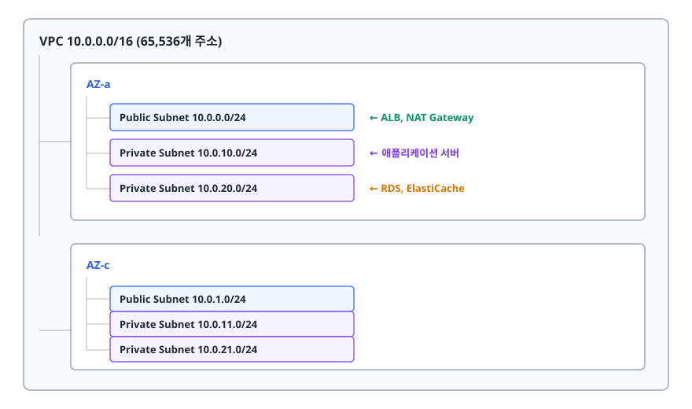
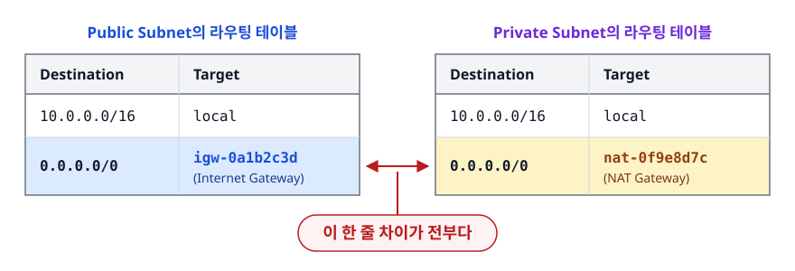
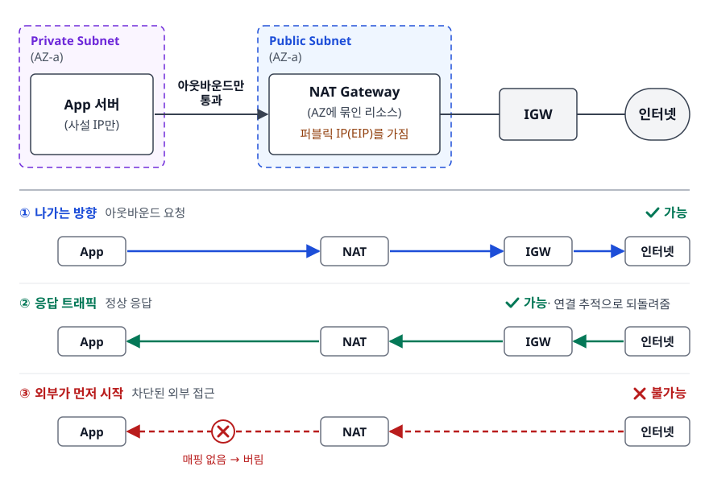
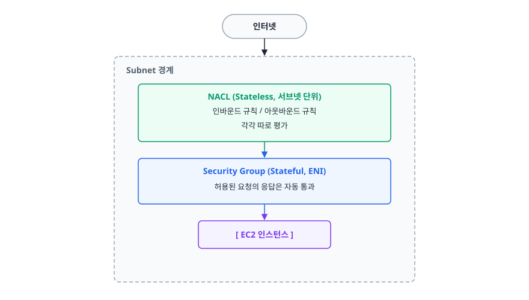
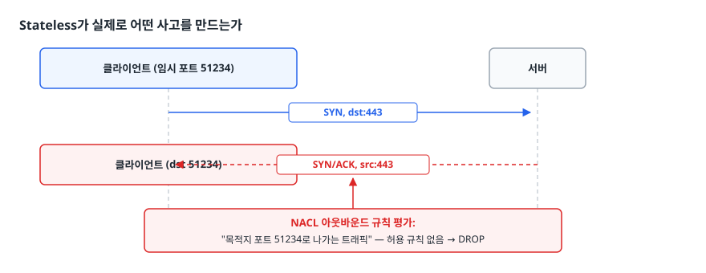
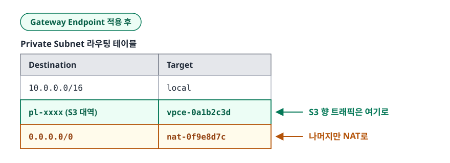
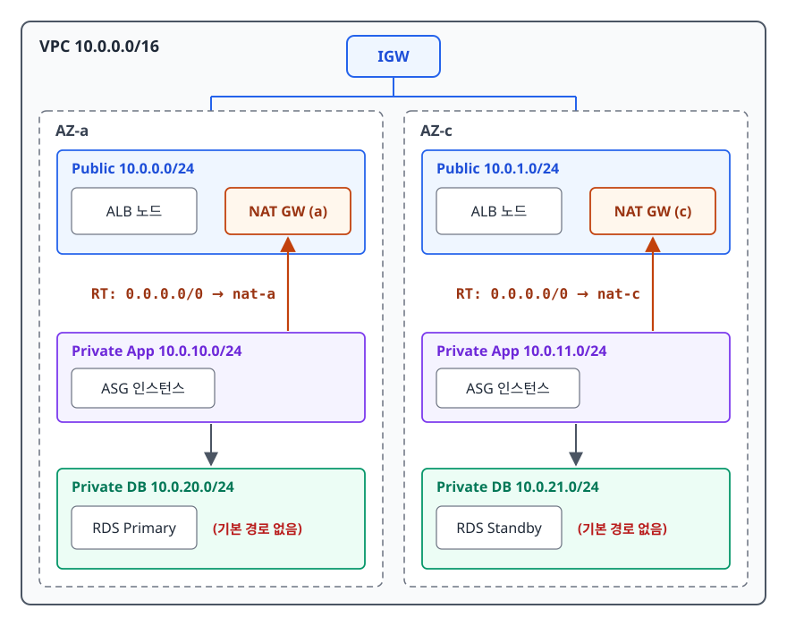

# AWS 네트워킹 (VPC Networking)

> Public과 Private 서브넷을 가르는 건 라우팅 테이블 한 줄뿐입니다. IGW와 NAT Gateway의 비대칭, Security Group과 NACL의 상태성 차이, VPC Endpoint의 존재 이유까지 이 한 줄에서 출발해 스스로 설명하고 설계할 수 있게 됩니다.

## 학습 목표

- [ ] VPC, 서브넷, 라우팅 테이블의 관계를 그림으로 설명할 수 있다
- [ ] "이 서브넷이 Public인가 Private인가"를 라우팅 테이블만 보고 판단할 수 있다
- [ ] IGW와 NAT Gateway가 왜 인바운드/아웃바운드에서 비대칭인지 설명할 수 있다
- [ ] Security Group(Stateful)과 NACL(Stateless)의 차이를, 응답 트래픽 관점에서 설명할 수 있다
- [ ] VPC Endpoint가 무엇을 절약하고 무엇을 강제하는지 설명할 수 있다
- [ ] "인스턴스에서 외부로 나가지지 않는다"는 장애를 순서대로 진단할 수 있다

## 선행 지식

- [01-core-services.md](./01-core-services.md) - Region/AZ 구조와 3-tier 아키텍처의 큰 그림
- IP 주소와 서브넷 마스크(CIDR 표기)에 대한 기초. `10.0.0.0/16`이 무슨 뜻인지 정도면 충분합니다.

---

## 1. 왜 필요한가

AWS 초창기(EC2-Classic)에는 VPC가 없었습니다. 계정에서 인스턴스를 만들면 **AWS의 거대한 공용 네트워크 어딘가에 놓였고**, 옆집 계정의 인스턴스와 같은 네트워크 대역을 공유했습니다. 방화벽(보안 그룹)으로 막긴 했지만, 네트워크 구조 자체를 설계할 수는 없었습니다.

여기서 나온 문제들이 있습니다.

- **내부망 개념이 없습니다.** "이 서버는 외부에서 절대 못 닿게" 같은 요구를 네트워크 계층에서 표현할 방법이 없었습니다.
- **IP 대역을 못 정합니다.** 온프레미스와 VPN으로 연결하려면 대역이 겹치지 않아야 하는데, 대역을 고를 수가 없습니다.
- **계층 분리가 안 됩니다.** 웹/앱/DB를 서로 다른 신뢰 구역에 두는 전통적 설계를 옮기기가 불가능했습니다.

**VPC(Virtual Private Cloud)** 는 이 문제를 풉니다. 계정마다 논리적으로 격리된 가상 네트워크를 주고, IP 대역과 라우팅과 방화벽을 사용자가 직접 설계하게 합니다. 즉 **AWS 안에 우리 회사 전용 IDC 네트워크를 소프트웨어로 그리는 것**입니다.

> **비유**: VPC는 아파트 단지, 서브넷은 각 동, 라우팅 테이블은 단지 안 도로 표지판, 보안 그룹은 각 세대의 현관 도어락입니다.
>
> **비유의 한계**: 아파트에서 동의 위치는 물리적으로 정해집니다. VPC의 서브넷은 그렇지 않습니다. Public인지 Private인지는 물리적 위치와 무관하고, **표지판(라우팅 테이블)을 어떻게 세웠느냐로만 결정됩니다.** 같은 자리에 있는 서브넷도 표지판을 바꾸면 성격이 바뀝니다.

---

## 2. VPC와 서브넷: 주소 공간 쪼개기

### 정의

**VPC**를 만들 때는 CIDR 블록부터 정합니다. `10.0.0.0/16`처럼 잡으면 그 VPC가 쓸 수 있는 사설 IP 주소의 범위가 정해집니다. 이 범위는 **나중에 축소할 수 없으므로** 처음에 넉넉히 잡습니다. 실무에서는 `/16`을 기본으로 쓰고, 온프레미스나 다른 VPC와 겹치지 않도록 조직 차원에서 대역을 관리합니다.

**서브넷**은 VPC의 CIDR을 더 잘게 나눈 것입니다. 여기서 반드시 기억할 제약이 하나 있습니다.

> **하나의 서브넷은 정확히 하나의 AZ에 속합니다. 서브넷은 AZ를 가로지를 수 없습니다.**

이 제약 때문에 Multi-AZ 설계는 자동으로 "AZ 개수만큼 서브넷을 만든다"가 됩니다.

<!-- diagram:cloud-networking-1 -->


<!-- 위 그림이 대체한 원본 ASCII.
     내용을 고칠 때는 그림도 함께 갱신할 것.
```
VPC 10.0.0.0/16  (65,536개 주소)
│
├── AZ-a
│    ├── Public  Subnet  10.0.0.0/24    ← ALB, NAT Gateway
│    ├── Private Subnet  10.0.10.0/24   ← 애플리케이션 서버
│    └── Private Subnet  10.0.20.0/24   ← RDS, ElastiCache
│
└── AZ-c
     ├── Public  Subnet  10.0.1.0/24
     ├── Private Subnet  10.0.11.0/24
     └── Private Subnet  10.0.21.0/24
```
-->

### 서브넷의 IP는 생각보다 5개 적다

`/24` 서브넷이면 256개 주소가 있을 것 같지만, **AWS는 각 서브넷에서 5개를 예약**합니다.

| 주소 | 용도 |
|---|---|
| `x.x.x.0` | 네트워크 주소 |
| `x.x.x.1` | VPC 라우터 |
| `x.x.x.2` | AWS가 제공하는 DNS 서버 |
| `x.x.x.3` | 향후 사용 예약 |
| 서브넷의 마지막 주소 (`/24`라면 `x.x.x.255`) | 브로드캐스트용으로 예약 (VPC는 브로드캐스트를 지원하지 않지만 주소는 잡아둔다) |

그래서 `/24`의 실제 가용 IP는 251개입니다. `/28`(16개)로 서브넷을 자르면 쓸 수 있는 건 11개뿐이라, EKS처럼 Pod마다 IP를 소모하는 워크로드에서는 금방 고갈됩니다. **서브넷은 너무 잘게 자르지 않습니다.** 실무에서 얻은 교훈입니다.

---

## 3. 핵심 중의 핵심: Public/Private은 라우팅 테이블이 결정한다

**서브넷에는 "Public 서브넷"이라는 타입 속성이 없습니다.** 콘솔에도 그런 체크박스가 없습니다. 어떤 서브넷이 Public인지 Private인지는 오직 라우팅 테이블이 정합니다. 그 서브넷에 연결된 테이블에 **`0.0.0.0/0 → Internet Gateway` 경로가 있으면 Public, 없으면 Private**입니다.

<!-- diagram:cloud-networking-2 -->


<!-- 위 그림이 대체한 원본 ASCII.
     내용을 고칠 때는 그림도 함께 갱신할 것.
```
[ Public Subnet 의 라우팅 테이블 ]      [ Private Subnet 의 라우팅 테이블 ]
┌──────────────┬────────────────┐      ┌──────────────┬────────────────┐
│ Destination  │ Target         │      │ Destination  │ Target         │
├──────────────┼────────────────┤      ├──────────────┼────────────────┤
│ 10.0.0.0/16  │ local          │      │ 10.0.0.0/16  │ local          │
│ 0.0.0.0/0    │ igw-0a1b2c3d   │ ◀──  │ 0.0.0.0/0    │ nat-0f9e8d7c   │
└──────────────┴────────────────┘  이  └──────────────┴────────────────┘
                                   한 줄 차이가 전부다
```
-->

`local` 경로는 VPC 생성 시 자동으로 들어가며 삭제할 수 없습니다. **같은 VPC 안에서는 서브넷이 달라도 서로 통신이 됩니다.** 그러니 Private 서브넷의 DB가 "격리"된다고 할 때 그 격리 대상은 **인터넷**입니다. VPC 내부는 해당하지 않습니다. 이 구분이 흐려지면 보안 설계가 어긋납니다.

확인은 명령 한 줄이면 됩니다.

```bash
# 특정 서브넷에 연결된 라우팅 테이블 보기
aws ec2 describe-route-tables \
  --filters "Name=association.subnet-id,Values=subnet-0abc123" \
  --query "RouteTables[].Routes"
```

여기에 `GatewayId`가 `igw-`로 시작하는 `0.0.0.0/0` 항목이 있으면 Public, `NatGatewayId`가 있으면 Private, 아무 기본 경로도 없으면 **완전 격리 서브넷**입니다.

---

## 4. IGW와 NAT Gateway: 비대칭이 핵심이다

### Internet Gateway (IGW)

VPC에 하나 붙이는 인터넷 출입구입니다. AWS가 수평 확장되도록 관리하므로 대역폭 병목이나 단일 장애점이 되지 않습니다. IGW가 하는 일은 두 가지입니다.

1. 라우팅 테이블에서 인터넷으로 가는 경로의 목적지가 되어줍니다.
2. 퍼블릭 IP가 할당된 인스턴스를 상대로 **사설 IP ↔ 퍼블릭 IP의 1:1 NAT**를 수행합니다.

여기서 초심자가 자주 놀라는 사실 하나. 퍼블릭 IP를 가진 EC2에 SSH로 접속한 뒤 `ip addr`을 쳐도 **퍼블릭 IP는 보이지 않습니다.** OS는 사설 IP만 알고 있고, 변환은 IGW가 바깥에서 해줍니다.

### NAT Gateway

Private 서브넷의 인스턴스도 인터넷으로 나가야 할 때가 있습니다. `apt update`, 외부 결제 API 호출, 컨테이너 이미지 pull 같은 것들입니다. 하지만 퍼블릭 IP를 주면 외부에서도 들어올 수 있게 됩니다. 이 딜레마를 NAT Gateway가 풉니다.

<!-- diagram:cloud-networking-3 -->


<!-- 위 그림이 대체한 원본 ASCII.
     내용을 고칠 때는 그림도 함께 갱신할 것.
```
              인터넷
                │
        ┌───────┴────────┐
        │      IGW       │
        └───────┬────────┘
                │
 ┌──── Public Subnet (AZ-a) ────┐
 │   ┌──────────────────────┐   │
 │   │   NAT Gateway        │   │  ← 퍼블릭 IP(EIP)를 가짐
 │   │   (AZ에 묶인 리소스)  │   │
 │   └──────────▲───────────┘   │
 └──────────────│───────────────┘
                │ 아웃바운드만 통과
 ┌──── Private Subnet (AZ-a) ───┐
 │   ┌──────────────────────┐   │
 │   │  App 서버 (사설 IP만) │   │
 │   └──────────────────────┘   │
 └──────────────────────────────┘

 나가는 방향: App → NAT → IGW → 인터넷            (가능)
 응답 트래픽: 인터넷 → IGW → NAT → App            (가능, 연결 추적으로 되돌려줌)
 외부가 먼저 시작: 인터넷 → NAT → App             (불가능)
```
-->

**비대칭의 이유**는 NAT의 동작 방식 자체에 있습니다. NAT는 안에서 나가는 연결마다 "누가 어디로 나갔다"는 매핑 테이블을 만듭니다. 응답 패킷이 돌아오면 그 테이블을 보고 원래 인스턴스에 돌려줍니다. **바깥에서 먼저 시작한 패킷은 사정이 다릅니다. 매핑 테이블에 대응하는 항목이 없으니 버릴 수밖에 없습니다.** 정책이 막는 게 아닙니다. 구조상 그럴 수가 없습니다.

### NAT Gateway 운영에서 반드시 아는 것

- **NAT Gateway는 AZ 단위 리소스입니다.** AZ-a에 하나만 만들고 AZ-c의 Private 서브넷이 그걸 바라보게 하면, AZ-a가 죽는 순간 **AZ-c의 아웃바운드까지 같이 끊깁니다.** 게다가 평소에도 AZ 간 데이터 전송 요금이 붙습니다. → **AZ마다 NAT Gateway를 하나씩** 두고, 각 AZ의 Private 서브넷은 같은 AZ의 NAT를 바라보게 라우팅합니다.
- **인터넷 접근용 NAT Gateway는 반드시 Public 서브넷에 있어야 합니다.** 자기 자신이 IGW로 나갈 경로가 있어야 하기 때문입니다. Private 서브넷에 만들어놓고 왜 안 나가는지 찾는 것은 흔한 초보 실수입니다. (인터넷이 아니라 다른 VPC나 온프레미스와만 통신하는 **프라이빗 NAT Gateway**라는 별도 유형이 있고, 그건 Private 서브넷에 둡니다. 여기서는 인터넷 아웃바운드용 퍼블릭 NAT Gateway만 다룹니다.)
- **NAT는 아웃바운드 트래픽량에 비례해 과금됩니다.** 컨테이너 이미지를 매 배포마다 인터넷에서 당겨오거나, S3에 대용량 로그를 NAT 경유로 올리면 여기서 비용이 샙니다. 이 문제는 다음 절의 VPC Endpoint로 풉니다.

---

## 5. Security Group과 NACL

AWS의 방화벽은 두 겹입니다. 이름이 비슷해 헷갈리지만 **동작 방식이 근본적으로 다릅니다.**

<!-- diagram:cloud-networking-4 -->


<!-- 위 그림이 대체한 원본 ASCII.
     내용을 고칠 때는 그림도 함께 갱신할 것.
```
        인터넷
          │
   ┌──────▼───────────────────────────────────┐
   │  Subnet 경계                              │
   │   ┌─────────────────────────────────┐    │
   │   │  NACL  (Stateless, 서브넷 단위)  │    │
   │   │  인바운드 규칙 / 아웃바운드 규칙  │    │
   │   │  각각 따로 평가                  │    │
   │   └──────────────┬──────────────────┘    │
   │                  ▼                        │
   │   ┌─────────────────────────────────┐    │
   │   │  Security Group (Stateful, ENI)  │    │
   │   │  허용된 요청의 응답은 자동 통과   │    │
   │   └──────────────┬──────────────────┘    │
   │                  ▼                        │
   │            [ EC2 인스턴스 ]               │
   └───────────────────────────────────────────┘
```
-->

### 비교

| 구분 | Security Group | NACL (Network ACL) |
|---|---|---|
| 적용 지점 | 인스턴스의 ENI(네트워크 인터페이스) | 서브넷 경계 |
| 상태 추적 | **Stateful** — 허용된 연결의 응답은 자동 허용 | **Stateless** — 응답도 별도 규칙으로 허용해야 함 |
| 규칙 종류 | Allow만 존재 (Deny 규칙 없음) | Allow와 Deny 모두 정의 가능 |
| 평가 방식 | 모든 규칙을 평가, 하나라도 맞으면 통과 | 규칙 번호 오름차순, **처음 매칭된 규칙에서 종료** |
| 기본값 | 새로 만들면 인바운드 전면 차단 / 아웃바운드 전면 허용 | 기본 NACL은 인/아웃 전면 허용 (직접 만든 NACL은 전면 거부) |
| 다른 리소스 참조 | 다른 Security Group을 소스로 지정 가능 | IP CIDR만 지정 가능 |
| 적용 대상 | SG를 붙인 인스턴스만 | 서브넷 안의 모든 리소스에 일괄 |
| 그래서 언제 | **일상적인 접근 제어 전부** | 특정 IP 대역 광역 차단 등 **명시적 Deny가 필요할 때만** |

**결론: 권한 설계는 Security Group으로 하고, NACL은 기본값 그대로 두거나 광역 차단용 보조 방어선으로만 씁니다.** NACL을 세밀하게 조작하기 시작하면 디버깅 난이도가 급격히 올라갑니다.

표의 "기본값" 행에는 예외가 하나 있습니다. VPC를 만들 때 딸려오는 **기본 보안 그룹(default SG)** 은 같은 기본 SG를 달고 있는 리소스끼리의 인바운드를 허용한 상태로 시작합니다. 직접 만든 SG가 인바운드를 전부 막고 시작하는 것과 다르므로, 기본 SG를 그대로 쓰는 리소스가 있다면 이 점을 알고 있어야 합니다.

### Stateless가 실제로 어떤 사고를 만드는가

이 차이가 가장 흔한 사고를 만듭니다. 보안을 강화하겠다고 NACL 아웃바운드를 "80, 443만 허용"으로 잠급니다. 그러면 **밖에서 들어온 요청에 대한 응답이 나가지 못합니다.**

<!-- diagram:cloud-networking-5 -->


<!-- 위 그림이 대체한 원본 ASCII.
     내용을 고칠 때는 그림도 함께 갱신할 것.
```
클라이언트 (임시 포트 51234)  ──── SYN, dst:443 ────▶  서버
                                                        │
클라이언트 (dst 51234)        ◀─── SYN/ACK, src:443 ──  서버
                                    ▲
                    NACL 아웃바운드 규칙 평가:
                    "목적지 포트 51234로 나가는 트래픽" — 허용 규칙 없음 → DROP
```
-->

응답 패킷의 목적지 포트는 443이 아닙니다. **클라이언트가 임의로 고른 임시 포트**(ephemeral port)입니다. 그래서 NACL 아웃바운드에는 임시 포트 범위(`1024-65535`)를 열어줘야 응답이 나갑니다. Security Group은 연결 상태를 추적하므로 이 작업이 필요 없습니다. **이것이 Stateful/Stateless 차이의 실질적 의미입니다.**

### Security Group 참조 패턴

Security Group은 소스로 **다른 Security Group을 지정할 수 있습니다.** 이게 진짜 강점입니다.

```
sg-alb   : 인바운드 443  ←  0.0.0.0/0
sg-app   : 인바운드 8080 ←  sg-alb        (IP가 아니라 SG를 참조)
sg-db    : 인바운드 3306 ←  sg-app
```

IP 대역으로 쓰면 앱 서버가 오토스케일링으로 늘어날 때마다 규칙을 고쳐야 합니다. SG 참조로 쓰면 **새로 뜬 인스턴스가 `sg-app`을 달고 있기만 하면 자동으로 DB 접근 권한을 얻습니다.** 인스턴스가 가축처럼 교체되는 환경에서는 이렇게 써야 유지보수가 됩니다.

---

## 6. VPC Endpoint: 인터넷을 거치지 않고 AWS 서비스에 닿기

Private 서브넷의 앱이 S3에 로그를 올린다고 해봅시다. S3는 VPC 밖의 서비스이므로 기본 경로는 이렇습니다.

```
App (Private) → NAT Gateway → IGW → 인터넷 → S3 엔드포인트
```

문제가 두 가지입니다. 첫째, **NAT 데이터 처리 요금이 붙습니다.** 둘째, 트래픽이 논리적으로 인터넷을 경유하므로 "우리 데이터는 인터넷에 나가지 않는다"고 말할 수 없습니다.

**VPC Endpoint**는 AWS 서비스로 가는 경로를 VPC 내부에 만들어줍니다. 두 종류가 있습니다.

| 종류 | 대상 서비스 | 구현 방식 | 특징 |
|---|---|---|---|
| **Gateway Endpoint** | S3, DynamoDB | 라우팅 테이블에 경로 추가 | 추가 요금 없음. 같은 리전 안에서만 동작 |
| **Interface Endpoint** (PrivateLink) | 대부분의 다른 AWS 서비스, 서드파티 SaaS | 서브넷에 ENI(사설 IP) 생성 | 시간당 + 데이터 처리 과금. 온프레미스에서 VPN/DX 경유 접근 가능 |

<!-- diagram:cloud-networking-6 -->


<!-- 위 그림이 대체한 원본 ASCII.
     내용을 고칠 때는 그림도 함께 갱신할 것.
```
[ Gateway Endpoint 적용 후 ]
 Private Subnet 라우팅 테이블
 ┌──────────────────┬─────────────────┐
 │ 10.0.0.0/16      │ local           │
 │ pl-xxxx (S3 대역) │ vpce-0a1b2c3d   │  ← S3 향 트래픽은 여기로
 │ 0.0.0.0/0        │ nat-0f9e8d7c    │  ← 나머지만 NAT로
 └──────────────────┴─────────────────┘
```
-->

```bash
# 현재 VPC에 걸린 엔드포인트 확인
aws ec2 describe-vpc-endpoints \
  --query "VpcEndpoints[].{Id:VpcEndpointId,Svc:ServiceName,Type:VpcEndpointType}"
```

부수 효과가 하나 더 있습니다. Gateway Endpoint에는 엔드포인트 정책을 걸 수 있고, S3 버킷 정책에서는 `aws:SourceVpce` 조건으로 **"이 VPC Endpoint를 통해서만 접근 허용"** 을 강제할 수 있습니다. 즉 자격 증명이 유출되어도 우리 VPC 밖에서는 그 버킷을 못 읽게 만들 수 있습니다.

---

## 7. Multi-AZ 네트워크 설계

앞의 조각들을 AZ 관점으로 다시 배열하면 실무 표준형이 나옵니다.

<!-- diagram:cloud-networking-7 -->


<!-- 위 그림이 대체한 원본 ASCII.
     내용을 고칠 때는 그림도 함께 갱신할 것.
```
┌────────────────────────── VPC 10.0.0.0/16 ──────────────────────────┐
│                    ┌──────────┐                                      │
│                    │   IGW    │                                      │
│                    └────┬─────┘                                      │
│        ┌────────────────┴────────────────┐                           │
│        │                                 │                           │
│  ══ AZ-a ═══════════════════   ══ AZ-c ═══════════════════           │
│  │ Public 10.0.0.0/24     │    │ Public 10.0.1.0/24     │            │
│  │  ALB 노드              │    │  ALB 노드              │            │
│  │  NAT GW (a)            │    │  NAT GW (c)            │            │
│  └───────────┬────────────┘    └───────────┬────────────┘            │
│              │ RT: 0.0.0.0/0 → nat-a       │ RT: 0.0.0.0/0 → nat-c   │
│  ┌───────────▼────────────┐    ┌───────────▼────────────┐            │
│  │ Private App 10.0.10.0/24    │ Private App 10.0.11.0/24            │
│  │  ASG 인스턴스           │    │  ASG 인스턴스          │            │
│  └───────────┬────────────┘    └───────────┬────────────┘            │
│  ┌───────────▼────────────┐    ┌───────────▼────────────┐            │
│  │ Private DB 10.0.20.0/24│    │ Private DB 10.0.21.0/24│            │
│  │  RDS Primary           │    │  RDS Standby           │            │
│  │  (기본 경로 없음)       │    │  (기본 경로 없음)      │            │
│  └────────────────────────┘    └────────────────────────┘            │
└──────────────────────────────────────────────────────────────────────┘
```
-->

설계 규칙은 이렇습니다.

- **AZ마다 NAT Gateway를 둡니다.** 가용성과 AZ 간 전송 비용 두 가지 이유입니다.
- **라우팅 테이블은 AZ별로 분리합니다.** Public용 1개는 공유해도 되지만, Private용은 AZ별 NAT를 가리켜야 하므로 반드시 분리됩니다.
- **DB 서브넷에는 기본 경로를 아예 두지 않습니다.** 인터넷으로 나갈 일이 없으면 경로 자체를 없앱니다. 그게 가장 확실한 격리입니다.
- **ALB와 RDS 서브넷 그룹은 2개 이상 AZ의 서브넷을 요구합니다.** AWS가 아예 이 설계를 강제하는 지점입니다.

---

## 8. 실무에서는

### 장애 시나리오: "Private 서브넷의 앱에서 외부 API 호출이 타임아웃 난다"

**증상**: 배포 직후부터 결제 게이트웨이 호출이 전부 타임아웃. 앱 로그에는 `SocketTimeoutException`만 찍힙니다. 로컬과 스테이징에서는 정상.

**진단을 이 순서로 합니다. 요청이 지나가는 순서 그대로입니다.**

```bash
# 1) 인스턴스에서 실제로 나가는지 확인 (SSM Session Manager나 Bastion 경유)
curl -v --max-time 5 https://api.payments.example.com/health
dig api.payments.example.com          # 이름 해석 자체가 되는지

# 2) 이 서브넷의 기본 경로가 어디를 향하는가
aws ec2 describe-route-tables \
  --filters "Name=association.subnet-id,Values=subnet-0app" \
  --query "RouteTables[].Routes[?DestinationCidrBlock=='0.0.0.0/0']"

# 3) NAT Gateway가 살아 있고 Public 서브넷에 있는가
aws ec2 describe-nat-gateways \
  --query "NatGateways[].{Id:NatGatewayId,State:State,Subnet:SubnetId}"

# 4) 보안 그룹 아웃바운드가 열려 있는가
aws ec2 describe-security-groups --group-ids sg-0app \
  --query "SecurityGroups[].IpPermissionsEgress"

# 5) NACL이 응답 트래픽(임시 포트)을 막고 있지 않은가
aws ec2 describe-network-acls \
  --filters "Name=association.subnet-id,Values=subnet-0app" \
  --query "NetworkAcls[].Entries"
```

**증상별 원인 매핑**

| 관측 | 원인 후보 | 대응 |
|---|---|---|
| `dig`도 실패 | VPC의 DNS 지원 옵션 비활성 / DHCP 옵션 세트 오설정 | `enableDnsSupport` 확인 |
| 기본 경로가 아예 없음 | 서브넷을 새로 만들고 라우팅 테이블 연결을 빠뜨림 | 해당 AZ의 NAT로 향하는 경로 추가 |
| 기본 경로가 다른 AZ의 NAT를 가리킴 | AZ 확장 시 라우팅 테이블 복제 누락 | AZ별 NAT로 정정 |
| NAT가 Private 서브넷에 있음 | 생성 시 서브넷 선택 실수 | Public 서브넷에 재생성 |
| SG 아웃바운드를 특정 포트로 좁혀둠 | "보안 강화" 작업의 부작용 | 필요한 목적지/포트 허용 |
| Flow Log에 인바운드는 ACCEPT, 아웃바운드가 REJECT | NACL이 임시 포트 응답을 차단 | 아웃바운드에 `1024-65535` 허용 |

**VPC Flow Logs**를 켜두면 이 진단이 훨씬 빨라집니다. 각 레코드의 `action` 필드가 `ACCEPT`인지 `REJECT`인지, 그리고 어느 방향에서 끊겼는지가 그대로 보입니다. **인바운드는 ACCEPT인데 응답이 REJECT라면 거의 확실히 NACL 문제**입니다. Security Group에 막히면 애초에 인바운드 자체가 REJECT로 찍힙니다.

패킷을 직접 보내보지 않고 경로를 검증하고 싶다면 **VPC Reachability Analyzer**를 씁니다. 출발지와 목적지를 지정하면 라우팅 테이블/SG/NACL을 정적으로 분석해 어느 홉에서 막히는지 알려줍니다.

---

## 9. 면접 포인트

> 면접에서 이 주제가 나오면 이렇게 답한다

**Q. Public Subnet과 Private Subnet의 차이는 무엇입니까?**

A. 서브넷 자체에는 타입 속성이 없습니다. **연결된 라우팅 테이블에 `0.0.0.0/0 → Internet Gateway` 경로가 있으면 Public, 없으면 Private**입니다. Private 서브넷은 아웃바운드가 필요하면 NAT Gateway로 향하는 기본 경로를 갖습니다. 실무에서는 ALB와 NAT Gateway를 Public에, 애플리케이션 서버와 DB를 Private에 두어 외부 노출 면을 ALB 한 곳으로 줄입니다.

- 꼬리 질문: "그럼 Private 서브넷의 서버는 완전히 고립된 겁니까?" → 아닙니다. VPC CIDR에 대한 `local` 경로는 항상 존재하므로 같은 VPC 안에서는 통신됩니다. 격리되는 것은 인터넷에서 들어오는 인바운드입니다.

**Q. Security Group과 NACL의 차이를 설명해 주세요.**

A. SG는 인스턴스의 ENI에 붙는 Stateful 방화벽이고, NACL은 서브넷 경계에서 동작하는 Stateless 방화벽입니다. SG는 허용한 요청의 응답을 자동으로 통과시키지만, NACL은 인바운드와 아웃바운드를 각각 평가하므로 **응답 트래픽의 임시 포트 범위를 별도로 열어줘야** 합니다. 또 SG는 Allow만, NACL은 Deny도 쓸 수 있고 규칙 번호 순으로 처음 매칭된 것이 적용됩니다. 실무에서는 접근 제어를 SG로 하고 NACL은 특정 대역 차단 같은 보조 용도로만 씁니다.

- 꼬리 질문: "SG의 소스에 다른 SG를 지정하는 게 왜 유용합니까?" → 오토스케일링으로 IP가 계속 바뀌는 환경에서 규칙을 고치지 않아도 되기 때문입니다. 신뢰 관계를 IP 대신 역할로 표현합니다.

**Q. NAT Gateway는 왜 인바운드를 지원하지 않습니까?**

A. NAT는 내부에서 나가는 연결마다 매핑 테이블을 만들어 둡니다. 응답 패킷이 돌아오면 그 항목을 보고 원래 인스턴스로 되돌려주는 구조입니다. 그런데 외부에서 먼저 시작된 패킷은 대응하는 매핑 항목이 없어 어느 인스턴스로 보내야 할지 알 수 없습니다. **동작 원리상 불가능**한 일이지 정책으로 막아둔 게 아닙니다. 그래서 Private 서브넷의 아웃바운드 전용 통로로 안전하게 쓸 수 있습니다.

- 꼬리 질문: "그럼 Private 서브넷 서버에 어떻게 접속합니까?" → Bastion Host를 Public에 두거나, 더 나은 방법으로 SSM Session Manager를 씁니다. 후자는 인바운드 포트를 하나도 열지 않아도 됩니다.

**Q. VPC Endpoint는 왜 씁니까?**

A. Private 서브넷에서 S3 같은 AWS 서비스에 접근할 때 NAT Gateway와 인터넷을 경유하지 않고 AWS 백본으로 직접 가게 해줍니다. **NAT 데이터 처리 비용을 줄이고, 트래픽이 인터넷을 타지 않는다는 보안 요건을 만족**시킵니다. S3와 DynamoDB는 라우팅 테이블 항목으로 동작하는 Gateway Endpoint를 추가 요금 없이 쓸 수 있고, 나머지 서비스는 서브넷에 ENI를 만드는 Interface Endpoint를 씁니다.

- 꼬리 질문: "보안 측면에서 한 걸음 더 나갈 수 있습니까?" → S3 버킷 정책에 `aws:SourceVpce` 조건을 걸어 특정 VPC Endpoint 경유가 아니면 거부하도록 강제할 수 있습니다.

---

## 자주 하는 실수

| 실수 | 왜 틀렸나 | 올바른 이해 |
|---|---|---|
| 인터넷 아웃바운드용 NAT Gateway를 Private 서브넷에 생성 | NAT 자신이 IGW로 나갈 경로가 없다 | 퍼블릭 NAT Gateway는 Public 서브넷에 둔다 |
| NAT Gateway를 리전에 하나만 두고 모든 AZ가 공유 | AZ 장애 시 전 AZ의 아웃바운드가 끊기고, 평시에도 AZ 간 전송 비용 발생 | AZ마다 하나씩 두고 AZ별 라우팅 테이블로 분리 |
| NACL 아웃바운드를 80/443만 허용 | 응답 패킷의 목적지는 클라이언트의 임시 포트다 | 임시 포트(1024-65535)를 허용하거나 NACL을 건드리지 않는다 |
| SG 규칙에 앱 서버 IP를 직접 나열 | 인스턴스가 교체되면 IP가 바뀐다 | 소스에 다른 Security Group을 참조한다 |
| 서브넷을 `/28`로 잘게 쪼갬 | AWS가 5개를 예약하므로 실사용 11개뿐 | 여유 있게 `/24` 이상으로 잡는다 |
| Private 서브넷이면 안전하다고 SG를 전부 개방 | VPC 내부에서는 `local` 경로로 자유 통신된다 | 내부 이동(lateral movement)을 막으려면 SG도 최소 권한으로 |
| VPC CIDR을 좁게 잡고 나중에 늘리려 함 | 기존 CIDR은 축소할 수 없고 확장도 제약이 있다 | 처음부터 `/16` 수준으로 넉넉히, 조직 차원에서 대역 관리 |

---

## 한 줄 정리

"라우팅 테이블이 목적지를 정하고, Stateful한 Security Group이 실질적인 접근 제어를 하며, NAT의 구조적 비대칭이 Private 계층의 안전을 만든다"는 한 문장에 VPC 네트워킹의 전부가 들어 있습니다.

---

## 연관 개념

- [01-core-services.md](./01-core-services.md) - 이 네트워크 위에 올라가는 EC2/RDS/ELB
- [03-serverless.md](./03-serverless.md) - Lambda를 VPC에 붙일 때 생기는 네트워크 이슈
- [04-iam-security.md](./04-iam-security.md) - 네트워크 경계와 함께 쓰는 신원 기반 통제
- [05-cost-optimization.md](./05-cost-optimization.md) - NAT와 AZ 간 데이터 전송이 만드는 숨은 비용
- [qna-aws.md](./qna-aws.md) - 이 주제 면접 질문 모음
- [네트워크 Q&A](../../01-computer-science-fundamentals/network/qna-network.md) - TCP/IP, 임시 포트, NAT의 기초 이론
- [리눅스·네트워킹 Q&A](../linux-networking/qna-linux-networking.md) - 서버에서 직접 네트워크를 진단하는 명령어
