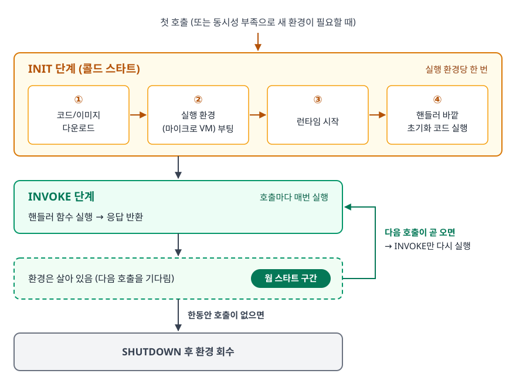
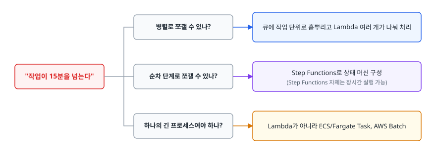
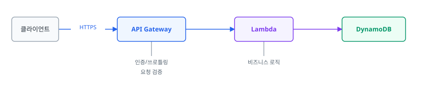
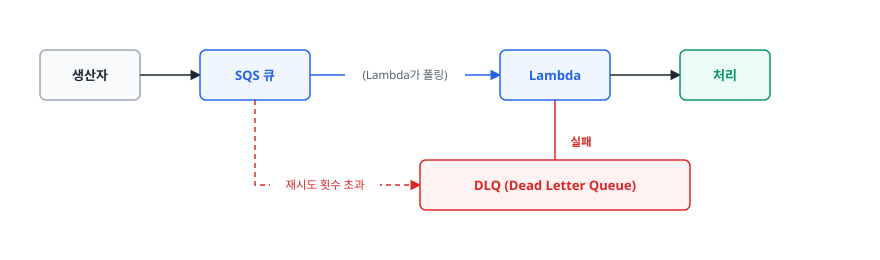
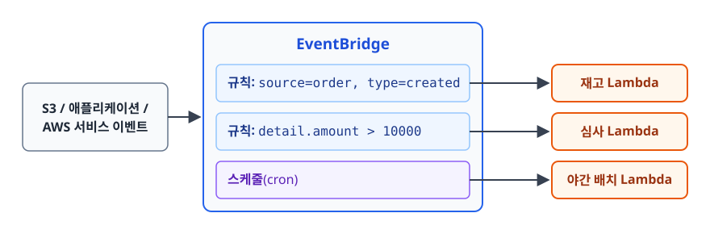

# 서버리스와 AWS Lambda (Serverless / AWS Lambda)

> Lambda가 코드를 언제 어떻게 실행하고 무엇을 기준으로 돈을 받는지, 콜드 스타트가 어디서 생기고 어디까지 줄일 수 있는지, 그리고 서버리스를 **쓰면 안 되는** 워크로드가 무엇인지 근거를 대고 설명할 수 있게 됩니다.

## 학습 목표

- [ ] Lambda 실행 환경의 생명주기(INIT → INVOKE → SHUTDOWN)를 설명할 수 있다
- [ ] 요청 수 × GB-초라는 과금 단위가 설계에 어떤 영향을 주는지 설명할 수 있다
- [ ] 콜드 스타트의 원인을 분해하고 각각에 맞는 완화책을 고를 수 있다
- [ ] 15분 제한을 비롯한 주요 제약과 그 우회 설계를 안다
- [ ] API Gateway / SQS / EventBridge와 Lambda를 조합하는 세 가지 대표 패턴을 그릴 수 있다
- [ ] 서버리스가 오히려 손해인 워크로드를 판단 기준과 함께 말할 수 있다

## 선행 지식

- [01-core-services.md](./01-core-services.md) - EC2로 서버를 직접 띄우는 방식과 비교하기 위해
- [02-networking.md](./02-networking.md) - Lambda를 VPC에 붙이는 절을 이해하는 데 필요

---

## 1. 왜 필요한가

EC2로 API 서버를 운영한다고 합시다. 트래픽이 하루 중 3시간만 몰리고 나머지 21시간은 거의 없다면, 그 21시간 동안 인스턴스는 **아무것도 안 하면서 켜져 있습니다.** 그런데 끄면 3시간 뒤에 켜는 사람이 필요하고, 켜는 데 시간이 걸리고, 결국 아무도 안 끕니다.

더 정확히 말하면 **전통적인 서버 모델의 과금 단위는 시간인데, 비즈니스 가치의 단위는 요청입니다.** 이 둘 사이의 간극이 곧 낭비입니다.

여기에 더해, 서버를 가지면 코드 외에 많은 것이 함께 딸려 옵니다. OS 패치, 런타임 버전 관리, 프로세스 감시, 재시작 스크립트, 로그 로테이션, 스케일 아웃 설정. 이 중 어느 것도 사용자에게 가치를 주지 않습니다.

**서버리스**는 이 두 문제를 한 번에 칩니다. 실행 단위를 함수 호출로 잡고 호출된 시간만큼만 돈을 받으며 서버라는 개념 자체를 사용자에게서 감춥니다. **서버가 사라진 게 아니라, 내가 신경 쓸 서버가 사라졌습니다.**

> **비유**: EC2가 사무실을 연 단위로 임대하는 것이라면, Lambda는 회의실을 30분 단위로 예약하는 것입니다. 안 쓰면 돈이 안 나갑니다.
> **비유의 한계**: 회의실은 예약해두면 언제든 바로 들어갈 수 있지만, Lambda는 오랫동안 안 쓰면 **문을 여는 데 시간이 걸립니다.** 이것이 콜드 스타트입니다.

---

## 2. 실행 모델: 실행 환경의 생명주기

Lambda를 "함수가 호출될 때마다 새로 뜬다"고 이해하면 성능 튜닝을 할 수 없습니다.

<!-- diagram:cloud-serverless-1 -->


<!-- 위 그림이 대체한 원본 ASCII.
     내용을 고칠 때는 그림도 함께 갱신할 것.
```
                    첫 호출 (또는 동시성 부족으로 새 환경이 필요할 때)
                                    │
        ┌───────────────────────────▼────────────────────────────┐
        │                    INIT 단계 (콜드 스타트)              │
        │  ① 코드/이미지 다운로드    ② 실행 환경(마이크로 VM) 부팅 │
        │  ③ 런타임 시작            ④ 핸들러 바깥 초기화 코드 실행 │
        └───────────────────────────┬────────────────────────────┘
                                    │
        ┌───────────────────────────▼────────────────────────────┐
        │                    INVOKE 단계                          │
        │  핸들러 함수 실행 → 응답 반환                            │
        └───────────────────────────┬────────────────────────────┘
                                    │
              환경은 살아 있음 (다음 호출을 기다림)  ← 웜 스타트 구간
                                    │
             ┌──────────────────────┴───────────────────────┐
             │ 다음 호출이 곧 오면 → INVOKE만 다시 실행       │
             │ 한동안 호출이 없으면 → SHUTDOWN 후 환경 회수   │
             └──────────────────────────────────────────────┘
```
-->

```python
import boto3

# 핸들러 바깥 = INIT 단계 = 실행 환경당 딱 한 번만 실행된다
s3 = boto3.client("s3")
CONFIG = load_config_from_ssm()

def handler(event, context):
    # 핸들러 안 = 호출마다 매번 실행된다
    key = event["key"]
    return s3.get_object(Bucket=CONFIG["bucket"], Key=key)["Body"].read()
```

DB 커넥션, SDK 클라이언트, 설정 로딩처럼 **비싸고 재사용 가능한 것은 핸들러 바깥에** 둡니다. 핸들러 안에 두면 호출마다 다시 만들면서 실행 시간과 요금을 그대로 곱합니다.

동시에 함정도 있습니다. **실행 환경은 호출 간에 재사용되므로 전역 변수가 남아 있습니다.** 이전 호출의 사용자 정보를 전역 변수에 담아뒀다가 다음 호출에서 그대로 쓰면 다른 사용자에게 남의 데이터를 보여주는 사고가 납니다. Lambda는 Stateless라는 말을 상태가 호출마다 지워진다는 뜻으로 읽으면 안 됩니다. 상태를 신뢰하지 말라는 말입니다.

### 동시성이 곧 확장 단위다

Lambda에는 인스턴스 대수라는 개념 대신 **동시 실행 수(concurrency)** 가 있습니다.

```
초당 요청 100건 × 평균 실행 200ms  →  필요한 동시 실행 수 ≈ 100 × 0.2 = 20
```

요청이 동시에 30개 들어오면 실행 환경 30개가 만들어집니다. 하나의 실행 환경은 **한 번에 한 요청만** 처리합니다. 스레드 풀로 여러 요청을 받는 서버와 완전히 다른 모델이고 그래서 함수 안에 멀티스레드 최적화를 넣어봐야 대개 의미가 없습니다.

리전 단위로 계정 전체가 쓸 수 있는 동시 실행 쿼터가 있고(기본값이 정해져 있으며 상향 요청 가능), 이걸 넘기면 스로틀링이 발생합니다. 특정 함수가 쿼터를 독식하지 못하게 하려면 함수별 **예약된 동시성(Reserved Concurrency)** 으로 상한을 걸어둡니다.

---

## 3. 과금 단위: 요청 수 × GB-초

Lambda의 요금은 두 축입니다.

```
비용 ≈ (호출 횟수) + (할당 메모리 GB) × (실행 시간 초)
                     └──────────── GB-초 ────────────┘
```

실행 시간은 밀리초 단위로 계산됩니다.

> **메모리를 늘리면 요금이 줄어들 수 있습니다.**

Lambda는 메모리 설정에 비례해 **CPU 성능도 함께 올려줍니다.** CPU를 쓰는 함수라면 메모리를 2배로 올렸을 때 실행 시간이 절반 이하로 줄 수 있고, 그러면 GB-초는 오히려 감소합니다. 반대로 I/O 대기가 대부분인 함수는 메모리를 올려도 시간이 안 줄어서 요금만 2배가 됩니다.

그래서 메모리는 **얼마나 필요한가가 아니라 얼마가 가장 싼가로** 정합니다. 감으로 하지 말고 실측합니다. 오픈소스 도구인 AWS Lambda Power Tuning(Step Functions 상태 머신 형태)이 여러 메모리 설정으로 함수를 반복 실행해 시간-비용 곡선을 그려줍니다.

실측 데이터는 로그에 이미 있습니다. 모든 호출이 끝나면 CloudWatch Logs에 `REPORT` 줄이 남습니다.

```bash
aws logs tail /aws/lambda/order-processor --since 30m --filter-pattern "REPORT"
```

```
REPORT RequestId: 9f3a...  Duration: 412.55 ms  Billed Duration: 413 ms
       Memory Size: 512 MB  Max Memory Used: 137 MB  Init Duration: 892.11 ms
```

- `Max Memory Used`가 `Memory Size`보다 한참 작다 → 메모리를 줄여볼 여지가 있습니다. 단, CPU가 같이 줄어 `Duration`이 늘 수 있으니 함께 봅니다.
- `Init Duration`이 찍혀 있다 → **이 호출은 콜드 스타트였습니다.** 이 줄이 얼마나 자주 나오는지가 곧 콜드 스타트 발생률입니다.

---

## 4. 콜드 스타트: 원인을 분해해야 대책이 나온다

콜드 스타트가 느리다는 말만으로는 진단이 되지 않습니다. INIT 단계는 여러 조각의 합이고, 조각마다 대책이 다릅니다.

```
Init Duration = ① 코드 패키지 다운로드/압축 해제
              + ② 실행 환경 부팅
              + ③ 런타임 초기화
              + ④ 사용자 초기화 코드 (핸들러 바깥)
```

| 조각 | 무엇이 영향을 주나 | 대책 |
|---|---|---|
| ① 패키지 다운로드 | 배포 패키지 크기 | 불필요한 의존성 제거, 공통 라이브러리는 Lambda Layer로 분리, 트리 셰이킹/번들링 |
| ② 환경 부팅 | AWS가 관리하는 영역 (사용자가 못 줄임) | 해당 없음 |
| ③ 런타임 초기화 | 런타임 선택 | JVM/.NET은 무겁고 Node.js/Python/Go/Rust는 가볍습니다. **SnapStart**(Java에서 먼저 나왔고 이후 Python·.NET 런타임으로 확대)는 초기화가 끝난 상태를 스냅샷으로 떠뒀다 복원해 이 구간을 크게 줄인다 |
| ④ 사용자 초기화 코드 | 내가 짠 코드 | 무거운 프레임워크 부팅, 대량 설정 파일 파싱, 외부 호출을 INIT에서 제거하거나 지연 로딩 |

**콜드 스타트 대책의 1순위는 항상 ①과 ④, 즉 내가 통제할 수 있는 부분입니다.** 여기를 손보지 않고 Provisioned Concurrency부터 켜면 비용으로 문제를 덮을 뿐입니다.

### VPC 연결과 콜드 스타트

Lambda를 VPC에 붙이면 우리 서브넷의 사설 IP를 통해 RDS 같은 내부 리소스에 접근할 수 있습니다. 과거에는 이 과정에서 호출마다 ENI를 만드느라 콜드 스타트가 수 초 단위로 뛰었습니다. 지금은 AWS가 서브넷 + 보안 그룹 조합마다 ENI를 미리 만들어 둡니다. 여러 함수가 그 ENI를 공유하므로 VPC로 인한 추가 지연은 대부분 사라졌습니다.

그래도 VPC 연결에는 다른 대가가 남아 있습니다. **VPC 안의 Lambda는 인터넷으로 나가려면 NAT Gateway가 필요합니다.** VPC에 붙였더니 갑자기 외부 API 호출이 전부 타임아웃 나는 사고의 원인이 거의 항상 이것입니다. 그리고 함수의 동시성만큼 서브넷 IP를 소모하므로, 서브넷을 좁게 잡아뒀다면 IP 고갈로 스케일이 막힙니다.

### Provisioned Concurrency

지정한 개수만큼의 실행 환경을 **미리 초기화해서 대기**시킵니다. 그만큼 콜드 스타트가 사라지지만, 대기 중인 환경에 대해 별도 요금이 붙습니다. 서버리스의 "안 쓰면 공짜"를 일부 포기하고 지연 시간을 돈으로 삽니다.

```bash
# 별칭(alias) 단위로 지정한다. $LATEST에는 걸 수 없다.
aws lambda put-provisioned-concurrency-config \
  --function-name checkout-api \
  --qualifier prod \
  --provisioned-concurrent-executions 10
```

Application Auto Scaling과 연동해 시간대별로 개수를 조절하면 낭비를 줄일 수 있습니다. **사용자가 대기하는 동기 경로(API)에서 p99 지연이 SLO를 깨면 켭니다.** 비동기 처리(SQS, S3 이벤트)에는 대개 필요 없습니다.

---

## 5. 제약 조건과 우회 설계

Lambda의 제약은 대부분 이 도구의 용도를 벗어났다는 신호입니다. 억지로 우회하기 전에 도구를 바꿀지부터 검토합니다.

| 제약 | 값 | 의미와 우회 |
|---|---|---|
| 최대 실행 시간 | 15분 | 넘으면 Lambda가 아닙니다. 작업을 쪼개 Step Functions로 오케스트레이션하거나 ECS/Fargate 태스크로 옮긴다 |
| 메모리 | 최대 10GB | 그 이상 필요하면 컨테이너 워크로드 |
| `/tmp` 임시 디스크 | 최대 10GB | 큰 파일은 S3에서 스트리밍 처리 |
| 배포 패키지 | zip은 압축 해제 기준 250MB, 컨테이너 이미지는 10GB | ML 모델처럼 큰 아티팩트는 컨테이너 이미지 방식이나 EFS 마운트 |
| 동기 호출 페이로드 | 요청/응답 6MB | 큰 데이터는 S3에 올리고 **키만 전달**한다 (Claim Check 패턴) |
| 비동기 호출 페이로드 | 256KB | 동일 |
| 실행 환경 상태 | 보장 없음 | 상태는 DynamoDB/ElastiCache/S3 등 외부에 둔다 |

### 15분 제한을 만났을 때의 사고 흐름

<!-- diagram:cloud-serverless-2 -->


<!-- 위 그림이 대체한 원본 ASCII.
     내용을 고칠 때는 그림도 함께 갱신할 것.
```
"작업이 15분을 넘는다"
   │
   ├─ 병렬로 쪼갤 수 있나? ──▶ 큐에 작업 단위로 흩뿌리고 Lambda 여러 개가 나눠 처리
   │
   ├─ 순차 단계로 쪼갤 수 있나? ──▶ Step Functions로 상태 머신 구성
   │                              (Step Functions 자체는 장시간 실행 가능)
   │
   └─ 하나의 긴 프로세스여야 하나? ──▶ Lambda가 아니라 ECS/Fargate Task, AWS Batch
```
-->

**작업을 쪼갤 수 없다면 서버리스가 맞지 않습니다.** 억지로 15분마다 이어달리기를 시키는 설계는 상태 관리 때문에 거의 항상 후회합니다.

---

## 6. 조합 패턴: Lambda는 혼자 쓰지 않는다

### 패턴 A. 동기 API — API Gateway + Lambda

<!-- diagram:cloud-serverless-3 -->


<!-- 위 그림이 대체한 원본 ASCII.
     내용을 고칠 때는 그림도 함께 갱신할 것.
```
클라이언트 ──HTTPS──▶ API Gateway ──▶ Lambda ──▶ DynamoDB
                       │                │
                  인증/쓰로틀링      비즈니스 로직
                  요청 검증
```
-->

API Gateway는 라우팅뿐 아니라 인증(JWT, IAM, Cognito), 사용량 제한, 요청 검증을 앞에서 처리해 Lambda 코드를 얇게 유지해줍니다.

**API Gateway의 통합 타임아웃은 기본 29초입니다**(REST API는 쿼터 상향으로 늘릴 수 있고 HTTP API는 30초가 상한입니다). Lambda를 15분으로 잡아도 API Gateway가 먼저 끊습니다. 오래 걸리는 작업은 동기 API로 만들지 말고 접수 후 202를 반환한 뒤 비동기로 처리하고 상태를 조회하는 구조로 바꿉니다. 또 하나, 사용자가 기다리는 경로이므로 콜드 스타트가 직접 체감됩니다. Provisioned Concurrency를 검토하는 대표 자리입니다.

### 패턴 B. 버퍼링 — SQS + Lambda

<!-- diagram:cloud-serverless-4 -->


<!-- 위 그림이 대체한 원본 ASCII.
     내용을 고칠 때는 그림도 함께 갱신할 것.
```
생산자 ──▶ SQS 큐 ──(Lambda가 폴링)──▶ Lambda ──▶ 처리
             │                              │ 실패
             │                              ▼
             └─ 재시도 횟수 초과 ─────▶ DLQ (Dead Letter Queue)
```
-->

큐를 사이에 끼우면 **속도 차이를 흡수**할 수 있습니다. 순간 트래픽이 튀어도 큐가 받아두고, Lambda는 자기 처리 속도대로 소비합니다. 다운스트림(예: RDS)이 감당 못 하면 함수의 예약 동시성으로 소비 속도에 상한을 걸 수도 있습니다.

- **큐의 가시성 타임아웃(visibility timeout)을 함수 타임아웃보다 충분히 길게** 잡습니다. 짧으면 아직 처리 중인 메시지가 다시 보이면서 같은 메시지가 중복 처리됩니다.
- **DLQ를 반드시 만듭니다.** 없으면 처리 못 한 메시지가 조용히 사라집니다.
- **처리 함수는 멱등(idempotent)하게** 짭니다. SQS 표준 큐는 최소 한 번(at-least-once) 전달이라 중복이 정상 동작의 일부입니다.
- 배치로 받을 때는 **부분 실패 응답(`ReportBatchItemFailures`)** 을 켜서, 배치 안의 실패 메시지만 다시 큐로 돌아가게 합니다. 안 그러면 하나 때문에 배치 전체가 재처리됩니다.

### 패턴 C. 이벤트 라우팅 — EventBridge + Lambda

<!-- diagram:cloud-serverless-5 -->


<!-- 위 그림이 대체한 원본 ASCII.
     내용을 고칠 때는 그림도 함께 갱신할 것.
```
                       ┌── 규칙: source=order, type=created ──▶ 재고 Lambda
S3 / 애플리케이션 /     │
AWS 서비스 이벤트 ──▶ EventBridge ── 규칙: detail.amount > 10000 ──▶ 심사 Lambda
                       │
                       └── 스케줄(cron) ──────────────────────▶ 야간 배치 Lambda
```
-->

EventBridge는 이벤트를 **내용 기반으로 분기**시킵니다. 생산자는 "주문이 생성됨"만 발행하고, 누가 그걸 소비하는지 모릅니다. 소비자를 추가할 때 생산자 코드를 건드리지 않아도 됩니다. 이 점이 핵심 이점입니다.

스케줄 실행에도 씁니다. cron 표현식으로 정해진 시각에 Lambda를 호출하므로, **cron을 돌리기 위해 EC2 한 대를 켜두는 일이 사라집니다.**

---

## 7. 서버리스가 맞지 않는 워크로드

서버리스에도 잘 맞지 않는 자리가 있습니다. 다음 중 하나라도 강하게 해당하면 다른 도구를 봅니다.

| 워크로드 | 왜 안 맞나 | 대안 |
|---|---|---|
| 트래픽이 24시간 높고 일정함 | 항상 켜져 있을 거면 시간당 과금이 대체로 더 싸다 | ECS/EKS + Savings Plans |
| 엄격한 저지연 SLO (p99 수십 ms) | 콜드 스타트가 꼬리 지연을 만든다 | 상시 구동 컨테이너, 또는 Provisioned Concurrency로 완화 |
| 15분 초과 장시간 작업 | 하드 제약 | Fargate, AWS Batch, Step Functions |
| 메모리에 큰 상태를 유지 | 실행 환경 재사용을 보장받지 못한다 | 상태 저장 서버, 또는 외부 저장소로 분리 |
| GPU 연산 | Lambda는 GPU를 제공하지 않는다 | GPU 인스턴스, SageMaker |
| 커넥션 풀에 의존하는 RDBMS 접근 | 동시성이 폭발하면 **DB 커넥션이 먼저 고갈**된다 | RDS Proxy로 커넥션 풀링, 또는 DynamoDB |
| 로컬 재현·디버깅이 자주 필요한 복잡 로직 | 실행 환경 재현이 번거롭다 | 컨테이너 (로컬에서 동일 이미지 실행) |

특히 **Lambda + RDS 조합의 커넥션 고갈**은 실무에서 반복되는 함정입니다. EC2 서버 3대라면 커넥션 풀 3개지만, Lambda 동시성 500이면 커넥션 시도가 500개입니다. RDS Proxy를 앞에 두고 커넥션을 재사용하게 만들거나, 애초에 커넥션 개념이 없는 DynamoDB를 씁니다.

---

## 8. 실무에서는

### 장애 시나리오: "주문 처리 큐가 계속 쌓인다"

**증상**: SQS의 `ApproximateAgeOfOldestMessage`가 계속 증가. 사용자는 주문이 "처리 중"에서 안 넘어간다고 신고. Lambda 에러율은 낮게 보입니다.

**진단**

```bash
# 1) 함수 설정부터 확인 — 타임아웃, 메모리, 예약 동시성
aws lambda get-function-configuration --function-name order-processor \
  --query "{Timeout:Timeout,Memory:MemorySize,Concurrency:ReservedConcurrentExecutions}"

# 2) 스로틀링이 걸리고 있는가 (Throttles 메트릭)
aws cloudwatch get-metric-statistics --namespace AWS/Lambda \
  --metric-name Throttles --dimensions Name=FunctionName,Value=order-processor \
  --start-time 2026-07-26T00:00:00Z --end-time 2026-07-26T01:00:00Z \
  --period 300 --statistics Sum

# 3) 최근 로그에서 타임아웃과 콜드 스타트 흔적을 본다
aws logs tail /aws/lambda/order-processor --since 1h \
  --filter-pattern "Task timed out"
```

**원인 후보와 판별법**

1. **예약 동시성이 너무 낮다** → `Throttles`가 0보다 큽니다. 소비 속도가 생산 속도를 못 따라갑니다. 예약 동시성을 올리거나, 다운스트림이 병목이면 그쪽을 먼저 풉니다.
2. **함수가 타임아웃으로 죽고 있다** → 로그에 `Task timed out after ...`. 타임아웃된 메시지가 큐로 돌아가 다시 시도되면서 지표가 희석됩니다. 그래서 에러율 메트릭이 낮아 보입니다. 큐 깊이는 줄지 않는데 호출 수만 늘어나는 패턴이 보이면 이것입니다.
3. **가시성 타임아웃이 함수 타임아웃보다 짧다** → 같은 주문이 여러 번 처리된 흔적(중복 결제, 중복 알림)이 함께 나타납니다. 큐 설정을 고칩니다.
4. **다운스트림(RDS) 커넥션 고갈** → 로그에 커넥션 획득 실패. RDS의 `DatabaseConnections`가 상한에 붙어 있습니다. RDS Proxy 도입 또는 함수 동시성 상한으로 압력을 낮춥니다.

**응급 대응 순서**: 우선 예약 동시성을 조정해 소비 속도를 조절하고(다운스트림이 버틸 만큼만), DLQ에 쌓인 메시지를 따로 보존한 뒤, 원인을 고치고 DLQ를 재처리합니다. **큐를 비우겠다고 메시지를 purge하면 주문 데이터가 사라집니다.** 급할수록 이 버튼을 누르지 않습니다.

---

## 9. 면접 포인트

> 면접에서 이 주제가 나오면 이렇게 답합니다

**Q. Lambda의 콜드 스타트는 왜 생기고 어떻게 줄입니까?**

A. Lambda는 호출이 없으면 실행 환경을 회수하기 때문에, 다시 호출될 때 코드 다운로드·환경 부팅·런타임 초기화·초기화 코드 실행을 거칩니다. 이 INIT 단계가 콜드 스타트입니다. 줄이는 순서는 **먼저 제가 통제할 수 있는 것부터**입니다. 배포 패키지를 줄이고, 무거운 초기화를 핸들러 바깥에서도 지연 로딩으로 미루고, 런타임을 가벼운 것으로 고릅니다. Java라면 SnapStart를 검토합니다. 그래도 사용자가 대기하는 동기 경로에서 p99가 SLO를 깨면 Provisioned Concurrency로 실행 환경을 미리 띄워둡니다. 다만 이건 대기 비용이 붙으므로 마지막 카드입니다.

- 꼬리 질문: "콜드 스타트가 얼마나 자주 일어나는지 어떻게 측정합니까?" → CloudWatch Logs의 `REPORT` 줄에 `Init Duration`이 있는 호출이 콜드 스타트입니다. 그 비율을 지표화합니다.

**Q. Lambda의 과금 구조를 설명하고, 메모리를 어떻게 정합니까?**

A. 호출 횟수와 GB-초, 즉 할당 메모리와 실행 시간의 곱으로 과금됩니다. **메모리 설정은 CPU 성능도 함께 결정합니다.** 이 점이 중요합니다. 그래서 CPU 바운드 함수는 메모리를 올리면 실행 시간이 줄어 총 비용이 오히려 내려갈 수 있습니다. 반대로 I/O 대기가 대부분이면 메모리를 올려도 시간이 안 줄어 손해입니다. 그래서 메모리는 감으로 정하지 않고, 여러 설정으로 실측해 시간-비용 곡선의 최적점을 찾습니다.

- 꼬리 질문: "그 실측은 어떻게 합니까?" → Lambda Power Tuning 같은 도구로 메모리 값을 바꿔가며 반복 실행하고, `Duration`과 `Max Memory Used`를 함께 봅니다.

**Q. 서버리스가 적합하지 않은 경우는 언제입니까?**

A. 세 가지를 봅니다. 첫째, **트래픽이 24시간 높고 일정하면** 항상 켜둘 컨테이너가 대체로 저렴합니다. 둘째, **엄격한 저지연 SLO가 있으면** 콜드 스타트가 꼬리 지연을 만들어 위험합니다. 셋째, **15분을 넘는 작업이나 GPU 연산, 메모리 상태 유지가 필요하면** 제약에 걸립니다. 그리고 RDBMS를 쓰는 경우 동시성 폭증이 곧 커넥션 폭증이라, RDS Proxy 같은 장치 없이는 DB가 먼저 무너집니다.

- 꼬리 질문: "15분 제한을 우회할 방법은 없습니까?" → 병렬로 쪼개 큐로 분산하거나, 순차 단계면 Step Functions로 오케스트레이션합니다. 쪼갤 수 없는 하나의 긴 프로세스라면 애초에 Fargate나 Batch가 맞습니다.

**Q. SQS와 Lambda를 연결할 때 무엇을 주의합니까?**

A. 큐의 가시성 타임아웃을 함수 타임아웃보다 충분히 길게 잡아야 합니다. 짧으면 아직 처리 중인 메시지가 다시 보이면서 중복 처리가 발생합니다. 그리고 SQS 표준 큐는 최소 한 번 전달이라 **중복은 정상 동작**이므로, 처리 로직을 멱등하게 만들어야 합니다. DLQ를 반드시 설정해 실패 메시지가 유실되지 않게 하고, 배치 처리 시에는 부분 실패 응답을 켜서 실패한 메시지만 재처리되게 합니다.

- 꼬리 질문: "다운스트림 DB가 못 버티면 어떻게 합니까?" → 함수의 예약 동시성으로 소비 속도에 상한을 겁니다. 큐가 버퍼 역할을 하므로 메시지는 유실되지 않고 처리만 늦어집니다.

---

## 자주 하는 실수

| 실수 | 왜 틀렸나 | 올바른 이해 |
|---|---|---|
| DB 커넥션을 핸들러 안에서 생성 | 호출마다 커넥션 생성 비용을 지불 | 핸들러 바깥(INIT)에서 만들고 재사용 |
| 전역 변수에 사용자 컨텍스트를 저장 | 실행 환경이 재사용되어 다음 호출에 남는다 | 요청 범위 데이터는 반드시 핸들러 안 지역 변수로 |
| "Lambda는 서버가 없으니 무한 확장" | 리전 동시성 쿼터와 다운스트림 한계가 있다 | 동시성 상한과 DB 커넥션 한계를 함께 설계 |
| VPC에 붙였는데 외부 API 호출이 안 됨 | VPC 안 Lambda는 NAT 없이는 인터넷에 못 나간다 | NAT Gateway 경로를 두거나 VPC Endpoint 사용 |
| 콜드 스타트 문제를 Provisioned Concurrency로 먼저 해결 | 원인을 안 고치고 비용으로 덮는 것 | 패키지 크기와 초기화 코드를 먼저 줄인다 |
| 큐가 쌓이자 메시지를 purge | 데이터가 영구 소실된다 | 소비 속도 조절 → DLQ 보존 → 원인 수정 → 재처리 |
| 15분 제한을 이어달리기로 우회 | 중간 상태 관리가 폭발적으로 복잡해진다 | Step Functions나 Fargate로 도구를 바꾼다 |

---

## 한 줄 정리

Lambda는 실행 환경을 재사용하며 GB-초로 과금하는 모델이고 이 한 문장에서 초기화 코드 위치, 메모리 튜닝, 콜드 스타트, 동시성 설계, 그리고 서버리스가 맞지 않는 워크로드까지가 모두 따라 나옵니다.

---

## 연관 개념

- [01-core-services.md](./01-core-services.md) - EC2/컨테이너와의 컴퓨팅 모델 비교
- [02-networking.md](./02-networking.md) - Lambda를 VPC에 붙일 때의 NAT와 서브넷 IP 문제
- [04-iam-security.md](./04-iam-security.md) - Lambda 실행 역할과 최소 권한 설계
- [05-cost-optimization.md](./05-cost-optimization.md) - 서버리스와 상시 구동 컴퓨팅의 비용 손익분기
- [qna-aws.md](./qna-aws.md) - 이 주제 면접 질문 모음
- [시스템 설계: 확장성 Q&A](../../09-system-design/scalability/qna-scalability.md) - 큐 기반 비동기 아키텍처
- [캐싱 Q&A](../../09-system-design/caching/qna-caching.md) - 상태를 외부로 빼는 저장소 선택
