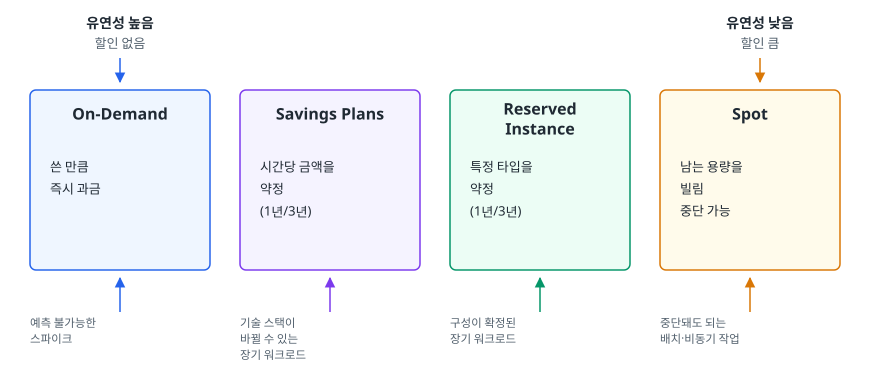
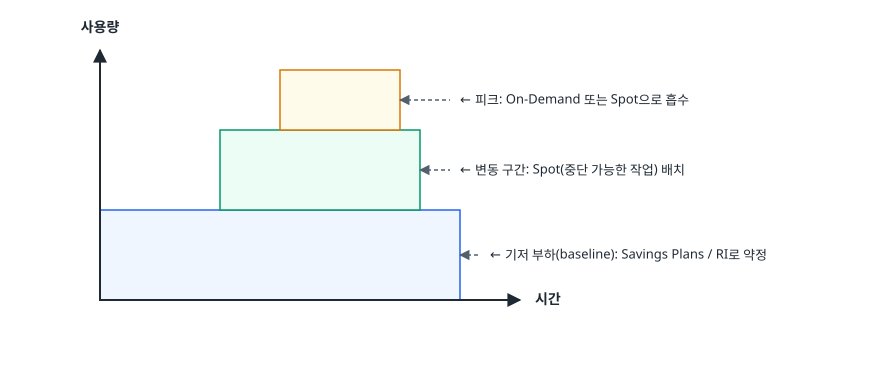
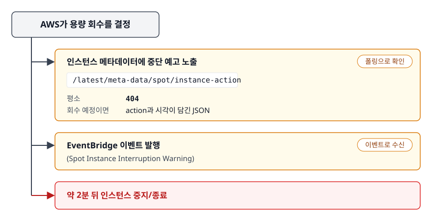
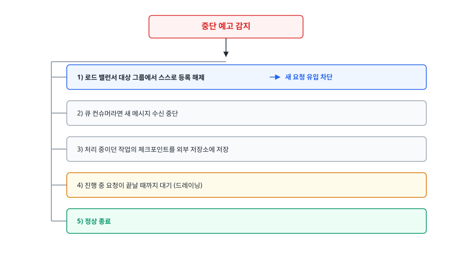
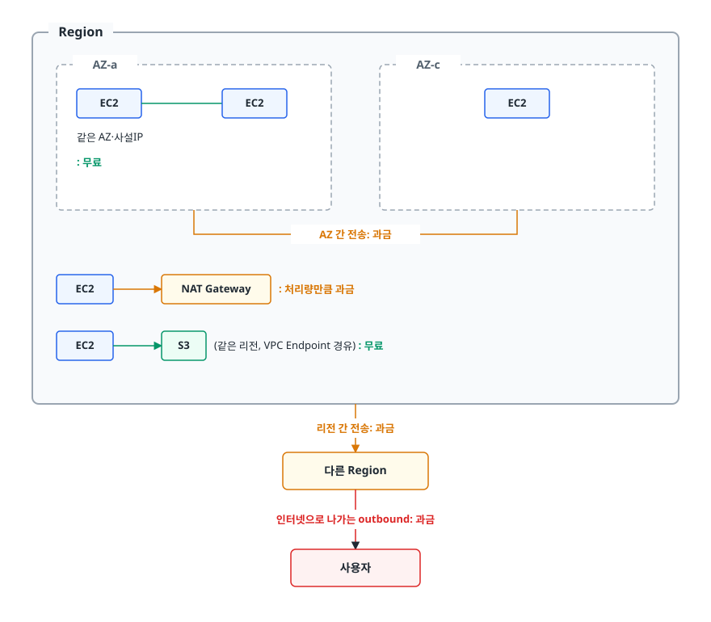
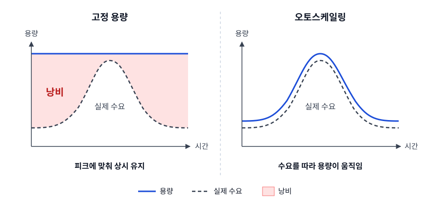

# AWS 비용 최적화 (Cost Optimization)

> AWS 비용은 싼 인스턴스를 고르면 줄어든다고 생각하기 쉽습니다. 이 문서는 과금 모델이 왜 On-Demand / Reserved / Savings Plans / Spot으로 나뉘는지, Spot 중단을 설계로 어떻게 흡수하는지, 데이터 전송비가 왜 청구서에서 가장 늦게 발견되는지, 비용을 "누구의 것"으로 만드는 태깅 체계가 무엇인지를 가려냅니다.

## 학습 목표

- [ ] 네 가지 EC2 과금 모델의 차이를 "약정 vs 유연성" 축으로 설명하고, 우리 워크로드에 맞는 조합을 고를 수 있다
- [ ] Spot 중단을 견디는 애플리케이션·인프라 설계를 그릴 수 있다
- [ ] S3 스토리지 클래스와 수명 주기 정책을 설계할 수 있다
- [ ] 데이터 전송 비용이 어디서 발생하는지 경로별로 짚을 수 있다
- [ ] 태그와 Cost Explorer로 "누가 쓴 비용인지"를 추적하는 체계를 만들 수 있다

## 선행 지식

- [01-core-services.md](./01-core-services.md) - EC2 인스턴스 타입과 S3의 기본 개념
- [02-networking.md](./02-networking.md) - NAT Gateway와 AZ 구조 (데이터 전송비 절에서 필요)

> **주의**: 이 문서에는 구체적인 금액도 할인율도 없습니다. AWS 요금은 리전과 시점에 따라 계속 바뀌어서, 숫자를 외워 봐야 소용이 없고 오히려 위험합니다. **과금이 어떤 축으로 계산되는지**를 이해하면 요금표를 볼 때 스스로 계산할 수 있습니다.

---

## 1. 왜 필요한가

클라우드 비용의 어려움은 **비용이 만들어지는 시점과 그것을 인지하는 시점이 멀리 떨어져 있다**는 데서 나옵니다. 온프레미스에서는 서버를 사려면 결재부터 받습니다. 누군가 승인 문서를 읽고 대수를 따지고 금액을 확인하니, 비용이 **의사결정 시점에** 눈앞에 있습니다.

클라우드에서는 개발자가 콘솔에서 클릭 몇 번으로 인스턴스를 만듭니다. 승인도 없고 금액도 안 보입니다. 그 결정의 결과는 **한 달 뒤 청구서에** 나타나고, 그때는 이미 누가 왜 만들었는지 아무도 기억하지 못합니다.

그래서 비용 최적화의 승부는 **가시성(누가 얼마를 쓰는지 보이게 하기)과 책임(그 비용의 주인이 있게 하기)에서** 갈립니다. 인스턴스 타입을 한 단계 낮추는 것보다, 아무도 안 쓰는 스테이징 환경 열 개를 찾아 끄는 것이 대개 훨씬 큰 절감을 만듭니다.

> **비유**: 클라우드 비용은 수도 요금입니다. 수도꼭지가 100개인 집에서 몇 개가 새고 있는지 모르는 상태.
>
> **비유의 한계**: 수도는 잠그면 바로 멈춥니다. 클라우드는 다릅니다. **인스턴스를 꺼도 붙어 있는 디스크와 스냅샷과 미할당 IP는 계속 흐릅니다.** "껐다"와 "지웠다"는 다릅니다.

---

## 2. 컴퓨팅 과금 모델: 약정과 유연성의 교환

AWS가 컴퓨팅 요금제를 여러 개로 나눈 이유는 명확합니다. **AWS 입장에서는 예측 불가능한 수요가 가장 비쌉니다.** 사용자가 "1년간 이만큼 쓰겠다"고 약속해주면 AWS는 용량 계획이 쉬워지고 그 대가로 할인을 줍니다. 반대로 "언제든 뺏어가도 좋다"고 하면 AWS는 남는 용량을 팔 수 있으므로 더 큰 할인을 줍니다.

<!-- diagram:cloud-cost-optimization-1 -->


<!-- 위 그림이 대체한 원본 ASCII.
     내용을 고칠 때는 그림도 함께 갱신할 것.
```
   유연성 높음                                              유연성 낮음
   할인 없음                                                할인 큼
      │                                                        │
      ▼                                                        ▼
 ┌──────────┐   ┌──────────────┐   ┌──────────────┐   ┌──────────────┐
 │On-Demand │   │Savings Plans │   │  Reserved    │   │    Spot      │
 │          │   │              │   │  Instance    │   │              │
 │ 쓴 만큼   │   │ 시간당 금액을 │   │ 특정 타입을   │   │ 남는 용량을   │
 │ 즉시 과금 │   │ 약정         │   │ 약정         │   │ 빌림          │
 │          │   │ (1년/3년)    │   │ (1년/3년)    │   │ 중단 가능     │
 └──────────┘   └──────────────┘   └──────────────┘   └──────────────┘
      ▲                  ▲                 ▲                  ▲
  예측 불가능한      기술 스택이       구성이 확정된      중단돼도 되는
  스파이크          바뀔 수 있는      장기 워크로드      배치·비동기 작업
                    장기 워크로드
```
-->

### 각각의 성격

**On-Demand**는 기준 가격입니다. 약정도 위험도 없고 초 단위로 계산됩니다(리눅스 기준 최소 과금 단위가 존재). 할인이 없다는 게 단점이지만, **예측이 안 되는 부분에는 이게 정답**입니다. 필요 없어지면 그 순간 과금이 멈춘다는 것 자체가 가치입니다.

**Reserved Instance(RI)** 는 특정 인스턴스 구성을 1년 또는 3년 쓰겠다고 약정합니다. 선결제 비중(전액/부분/없음)이 높을수록 할인이 커집니다. Standard RI는 변경이 거의 불가능하고, Convertible RI는 비슷한 가치의 다른 타입으로 교환할 수 있는 대신 할인이 덜합니다. 특정 AZ에 지정하는 방식(zonal)을 쓰면 **용량 예약** 효과까지 얻습니다. "그 AZ에 인스턴스가 없어서 못 띄우는" 상황을 막아 준다는 뜻입니다.

**Savings Plans(SP)** 는 인스턴스 구성이 아니라 **시간당 지출 금액**을 약정합니다. "매시간 이만큼은 쓸 테니 그만큼 할인해달라"는 계약입니다.

- **Compute Savings Plans**: EC2뿐 아니라 Fargate와 Lambda에도 적용됩니다. 리전, 인스턴스 패밀리, OS를 바꿔도 약정이 그대로 따라옵니다. 유연성이 가장 큽니다.
- **EC2 Instance Savings Plans**: 특정 리전의 특정 인스턴스 패밀리로 범위를 좁히는 대신 할인 폭이 더 큽니다.

**Spot Instance**는 AWS의 유휴 용량을 빌립니다. 할인 폭이 가장 크지만 **AWS가 용량이 필요해지면 2분의 알림을 주고 회수합니다.** Spot 설계는 이 2분을 어떻게 쓰느냐에 달려 있습니다.

### 비교

| 구분 | On-Demand | Savings Plans | Reserved Instance | Spot |
|---|---|---|---|---|
| 약정 기간 | 없음 | 1년 또는 3년 | 1년 또는 3년 | 없음 |
| 약정 대상 | - | 시간당 지출 금액 | 인스턴스 구성 | - |
| 할인 폭 | 기준(없음) | 큼 | 큼 (범위를 좁힐수록 더) | 가장 큼 |
| 중단 위험 | 없음 | 없음 | 없음 | **있음 (2분 알림)** |
| 타입 변경 유연성 | 완전 자유 | Compute SP는 매우 유연 | Standard는 사실상 고정 | 자유 |
| 적용 대상 / 용량 보장 | 전체 / 없음 | EC2·Fargate·Lambda(Compute SP) / 없음 | 서비스별 / zonal RI는 있음 | EC2 계열 / 없음 |
| 그래서 언제 | 예측 불가 스파이크, 단기 실험 | 기술 스택이 바뀔 수 있는 장기 기반 부하 | 구성이 확정된 장기 부하, 용량 보장이 필요할 때 | 중단 가능한 배치·비동기 워크로드 |

**하나만 고르는 대신 층으로 쌓아 씁니다.**

<!-- diagram:cloud-cost-optimization-2 -->


<!-- 위 그림이 대체한 원본 ASCII.
     내용을 고칠 때는 그림도 함께 갱신할 것.
```
사용량
  ▲
  │            ░░░░░░  ← 피크: On-Demand 또는 Spot으로 흡수
  │        ▒▒▒▒▒▒▒▒▒▒  ← 변동 구간: Spot(중단 가능한 작업) 배치
  │  ██████████████████ ← 기저 부하(baseline): Savings Plans / RI로 약정
  └──────────────────────────▶ 시간
```
-->

기저 부하는 1년 내내 반드시 돌아가는 양입니다. 여기를 약정으로 덮고 그 위의 변동분은 On-Demand와 Spot으로 채웁니다. **약정을 실제 기저보다 크게 잡으면 안 쓰는 약정에 돈을 내게 되므로**, 과거 사용량 데이터를 보고 보수적으로 시작해 점진적으로 늘리는 것이 안전합니다.

---

## 3. Spot 중단을 견디는 설계

Spot을 "싸니까 그냥 쓰자"로 접근하면 반드시 사고가 납니다. Spot은 인프라 할인 이전에 **아키텍처 요구사항**입니다. 중단을 전제로 설계해야 쓸 수 있습니다.

### 중단은 이렇게 통보된다

<!-- diagram:cloud-cost-optimization-3 -->


<!-- 위 그림이 대체한 원본 ASCII.
     내용을 고칠 때는 그림도 함께 갱신할 것.
```
 AWS가 용량 회수를 결정
        ├──▶ 인스턴스 메타데이터에 중단 예고 노출
        │       /latest/meta-data/spot/instance-action
        │       (평소 404, 회수 예정이면 action과 시각이 담긴 JSON)
        ├──▶ EventBridge 이벤트 발행 (Spot Instance Interruption Warning)
        └──▶ 약 2분 뒤 인스턴스 중지/종료
```
-->

애플리케이션은 이 신호를 폴링하거나 이벤트로 받아 **정리(graceful shutdown)** 를 시작해야 합니다.

```bash
# 인스턴스 안에서 중단 예고를 확인하는 예 (IMDSv2)
TOKEN=$(curl -sX PUT "http://169.254.169.254/latest/api/token" \
  -H "X-aws-ec2-metadata-token-ttl-seconds: 60")
curl -s -o /dev/null -w "%{http_code}" -H "X-aws-ec2-metadata-token: $TOKEN" \
  http://169.254.169.254/latest/meta-data/spot/instance-action
# 404 → 정상 / 200 → 회수 예고됨, 지금부터 정리 시작
```

### 2분 동안 해야 할 일

<!-- diagram:cloud-cost-optimization-4 -->


<!-- 위 그림이 대체한 원본 ASCII.
     내용을 고칠 때는 그림도 함께 갱신할 것.
```
중단 예고 감지
   │
   ├─ 1) 로드 밸런서 대상 그룹에서 스스로 등록 해제 → 새 요청 유입 차단
   ├─ 2) 큐 컨슈머라면 새 메시지 수신 중단
   ├─ 3) 처리 중이던 작업의 체크포인트를 외부 저장소에 저장
   ├─ 4) 진행 중 요청이 끝날 때까지 대기 (드레이닝)
   └─ 5) 정상 종료
```
-->

이 흐름이 성립하려면 애플리케이션이 세 조건을 만족해야 합니다.

- **무상태(stateless)**: 인스턴스 로컬에만 있는 데이터가 없어야 합니다. 세션은 ElastiCache, 파일은 S3.
- **작업의 재시작 가능성**: 중간에 끊긴 작업이 다른 인스턴스에서 이어지거나 처음부터 다시 돌 수 있어야 합니다. SQS의 가시성 타임아웃이 이 역할을 자동으로 해줍니다.
- **멱등성(idempotency)**: 같은 작업이 두 번 실행돼도 결과가 같아야 합니다. 중단 후 재시도는 중복 실행을 만듭니다.

### 인프라 쪽 안전장치

- **인스턴스 타입을 다양화합니다.** 한 타입만 쓰면 그 타입 풀이 마르는 순간 전멸합니다. Auto Scaling Group의 혼합 인스턴스 정책(Mixed Instances Policy)으로 여러 타입과 여러 AZ를 섞습니다.
- **할당 전략을 용량 기준으로 잡습니다.** 가장 싼 풀만 고르면 그 풀이 가장 먼저 회수됩니다. 여유 용량이 많은 풀을 먼저 고르도록 전략을 잡으면 중단 빈도가 눈에 띄게 줄어듭니다.
- **On-Demand 기반선을 섞습니다.** ASG에서 "최소 N대는 On-Demand, 나머지는 Spot"으로 구성하면 Spot이 전부 회수돼도 서비스가 죽지 않습니다.
- **ASG 수명 주기 훅(lifecycle hook)** 으로 종료 전 정리 시간을 확보합니다. ELB의 등록 해제 지연(deregistration delay)은 진행 중 요청을 흘려보내는 데 씁니다.

**Spot이 잘 맞는 곳**: 배치 처리, 미디어 인코딩, CI 빌드 러너, ML 학습(체크포인트가 있는 경우), 크롤러, 개발/테스트 환경.
**Spot을 쓰면 안 되는 곳**: 상태를 가진 단일 인스턴스(DB), 중단되면 복구할 수 없는 장시간 단일 작업, 가용성 SLA가 엄격한 동기 API의 유일한 백엔드.

---

## 4. 스토리지 비용: S3 클래스와 수명 주기

S3 요금은 저장·요청·검색으로 나뉘어 붙습니다. 이 구조를 알면 클래스 선택이 자동으로 결정됩니다.

```
S3 비용 = ① 저장 용량   +  ② 요청 횟수   +  ③ 데이터 검색(retrieval)
          (GB·월)          (PUT/GET 등)     (일부 클래스만)
```

클래스가 나뉘는 이유는 이 세 축의 가중치가 다르기 때문입니다. **저장이 싼 클래스는 검색이 비쌉니다.** 그래서 클래스는 "얼마나 자주 읽는가"만 보고 고르면 됩니다.

| 클래스 | 접근 빈도 가정 | 특징 | 적합한 데이터 |
|---|---|---|---|
| Standard | 자주 | 저장 단가 높음, 검색비 없음, 최소 보관 기간 없음 | 서비스가 상시 읽는 이미지, 정적 자산 |
| Intelligent-Tiering | **모름** | 접근 패턴을 보고 AWS가 자동으로 계층 이동, 모니터링 수수료 존재 | 패턴을 예측할 수 없는 데이터 |
| Standard-IA | 가끔 | 저장 싸고 검색비 있음, 최소 보관 기간(30일) | 한 달 지난 로그, 백업 |
| One Zone-IA | 가끔 + 재생성 가능 | 단일 AZ에만 저장 (AZ 소실 시 유실), 최소 보관 기간(30일) | 다시 만들 수 있는 파생 데이터(썸네일 등) |
| Glacier Instant Retrieval | 드묾, 즉시 필요 | 저장 매우 싸고 즉시 조회 가능, 최소 보관 기간(90일) | 분기별 조회하는 의료·금융 기록 |
| Glacier Flexible Retrieval | 드묾, 대기 가능 | 조회에 시간이 걸림, 최소 보관 기간(90일) | 규정상 보관하는 아카이브 |
| Glacier Deep Archive | 거의 없음 | 가장 싼 저장, 조회에 가장 오래 걸림, 최소 보관 기간(180일) | 수년 단위 법적 보관 자료 |

**결론: 읽기 빈도를 알면 클래스가 정해지고, 모르면 Intelligent-Tiering이 안전한 기본값입니다.**

주의할 함정: **최소 보관 기간이 있는 클래스에 짧게 머무는 데이터를 넣으면 손해입니다.** IA로 옮긴 지 3일 만에 삭제해도 30일치가 청구됩니다. 그리고 클래스 전환 자체에도 객체당 요청 요금이 붙습니다. **아주 작은 파일 수백만 개를 Glacier로 옮기면 전환 비용이 절감액을 넘어설 수 있습니다.**

### 수명 주기 정책

객체마다 수동으로 옮기는 것은 현실적이지 않으므로 규칙을 걸어 자동화합니다.

```json
{
  "Rules": [
    {
      "ID": "app-logs-tiering",
      "Filter": { "Prefix": "logs/" },
      "Status": "Enabled",
      "Transitions": [
        { "Days": 30, "StorageClass": "STANDARD_IA" },
        { "Days": 90, "StorageClass": "GLACIER" }
      ],
      "Expiration": { "Days": 730 }
    },
    {
      "ID": "cleanup-incomplete-uploads",
      "Filter": {},
      "Status": "Enabled",
      "AbortIncompleteMultipartUpload": { "DaysAfterInitiation": 7 }
    }
  ]
}
```

```bash
aws s3api put-bucket-lifecycle-configuration \
  --bucket my-app-logs --lifecycle-configuration file://lifecycle.json
```

두 번째 규칙을 특히 눈여겨봅시다. **멀티파트 업로드가 실패하면 이미 올라간 조각들이 버킷에 남아 계속 과금됩니다.** 그런데 이 조각은 `aws s3 ls`로 보이지 않아서 "버킷에 아무것도 없는데 저장 요금이 나온다"는 미스터리가 됩니다. 모든 버킷에 이 규칙을 기본으로 넣어두는 것이 좋습니다.

버전 관리를 켠 버킷이라면 **이전 버전(noncurrent version)의 만료 규칙**도 반드시 넣습니다. 안 넣으면 삭제한 파일이 영원히 남아 계속 과금됩니다.

---

## 5. 데이터 전송 비용: 청구서에서 가장 늦게 발견되는 항목

컴퓨팅과 스토리지는 눈에 보입니다. 인스턴스 몇 대, 몇 GB. 데이터 전송은 다릅니다. **어떤 경로로 얼마나 흘렀는지는 설계도만 봐서는 안 보입니다.**

**들어오는 것(inbound)은 대체로 무료**이고 **나가는 것(outbound)이 과금**됩니다. 인터넷으로 나갈수록, 멀리 갈수록 비쌉니다. **AWS 안에서도 경계를 넘으면 과금됩니다.** AZ를 넘고 리전을 넘고 퍼블릭 IP를 거치면 돈이 붙습니다.

<!-- diagram:cloud-cost-optimization-5 -->


<!-- 위 그림이 대체한 원본 ASCII.
     내용을 고칠 때는 그림도 함께 갱신할 것.
```
┌────────────────────── Region ──────────────────────┐
│  ┌───── AZ-a ─────┐         ┌───── AZ-c ─────┐     │
│  │  EC2 ──── EC2  │         │      EC2       │     │
│  │  같은 AZ·사설IP│         │                │     │
│  │  : 무료        │         │                │     │
│  └────────┬───────┘         └────────┬───────┘     │
│           └────── AZ 간 전송: 과금 ───┘             │
│                                                     │
│  EC2 ──▶ NAT Gateway : 처리량만큼 과금              │
│  EC2 ──▶ S3 (같은 리전, VPC Endpoint 경유) : 무료   │
└────────────────┬────────────────────────────────────┘
                 │ 리전 간 전송: 과금
                 ▼
          다른 Region
                 │ 인터넷으로 나가는 outbound: 과금
                 ▼
             사용자
```
-->

실무에서 비용이 새는 대표적인 지점은 이렇습니다.

| 새는 곳 | 왜 생기나 | 대응 |
|---|---|---|
| AZ 간 트래픽 | 앱 서버와 DB, 앱 서버와 캐시가 다른 AZ에 있어 매 쿼리마다 AZ를 넘음 | 읽기 트래픽은 같은 AZ의 복제본으로 유도, 서비스 배치를 AZ 인식하도록 구성 |
| NAT Gateway 처리량 | Private 서브넷의 모든 아웃바운드가 NAT를 통과. 컨테이너 이미지 pull, S3 업로드까지 | S3/DynamoDB는 **Gateway Endpoint**로 우회, ECR 등은 Interface Endpoint 검토 |
| 인터넷 outbound | 정적 파일을 EC2/S3에서 사용자에게 직접 전송 | **CloudFront**를 앞에 둡니다. 캐시 히트만큼 오리진 전송이 사라집니다 |
| 퍼블릭 IP 경유 | 같은 리전 안인데도 퍼블릭 IP/도메인으로 통신 | 사설 IP나 VPC 내부 엔드포인트로 호출 |
| 리전 간 복제 | S3 교차 리전 복제, 크로스 리전 읽기 | 정말 필요한 prefix만 복제 대상으로 지정 |
| 퍼블릭 IPv4 주소 | 지금은 미할당 EIP뿐 아니라 **사용 중인 퍼블릭 IPv4 주소에도** 시간당 요금이 붙습니다 | 안 쓰는 EIP는 해제하고 퍼블릭 IP가 꼭 필요한 리소스인지부터 다시 봅니다 |

**데이터 전송비는 전송량보다 경로에서 결정됩니다.** 같은 데이터라도 NAT를 지나느냐 VPC Endpoint를 지나느냐, 오리진에서 직접 나가느냐 CDN을 거치느냐에 따라 비용이 크게 달라집니다.

---

## 6. 가시성 만들기: 태깅과 Cost Explorer

### 태그가 없으면 아무것도 못 한다

청구서에 "EC2 1,200달러"라고 적혀 있으면 할 수 있는 일이 없습니다. 누구 것인지, 어느 서비스 것인지, 운영인지 개발인지 모르기 때문입니다. **비용을 줄이려면 먼저 비용에 주인을 붙여야 합니다.**

최소한 이 정도는 조직 표준으로 정합니다.

| 태그 키 | 값 예시 | 쓰임 |
|---|---|---|
| `Environment` | `prod`, `staging`, `dev` | 개발 환경 비용 분리, 야간 종료 대상 식별 |
| `Service` | `checkout-api`, `search` | 서비스별 원가 산정 |
| `Owner` | `team-payments` | 문의할 대상, 책임 소재 |
| `CostCenter` | `CC-1042` | 회계 배분 |
| `ManagedBy` | `terraform`, `manual` | IaC 밖에서 만들어진 리소스 탐지 |

태그를 만들었다면 반드시 두 가지를 해야 합니다.

1. **비용 할당 태그로 활성화합니다.** Billing 콘솔에서 활성화하지 않으면 Cost Explorer에서 그 태그로 나눠 볼 수 없습니다. 기본적으로 활성화 이후 데이터부터 적용되고, 과거 데이터는 최대 12개월까지만(그 기간에 태그가 붙어 있던 리소스에 한해) 백필할 수 있으므로 **빨리 켤수록 좋습니다.**
2. **태그 없는 리소스를 만들지 못하게 합니다.** Organizations의 태그 정책이나 IAM 정책의 `Condition`으로 필수 태그를 강제하고, IaC 모듈에서 기본 태그를 자동 부착합니다. 사람의 성실함에 기대는 태깅은 반드시 무너집니다.

### 도구들

```bash
# 지난달 서비스별 비용 — Cost Explorer API는 us-east-1에서만 동작한다
aws ce get-cost-and-usage --region us-east-1 \
  --time-period Start=2026-06-01,End=2026-07-01 \
  --granularity MONTHLY --metrics "UnblendedCost" \
  --group-by Type=DIMENSION,Key=SERVICE

# 아무 인스턴스에도 붙어 있지 않은 EBS 볼륨 (조용히 새는 비용 1위)
aws ec2 describe-volumes --filters Name=status,Values=available \
  --query "Volumes[].{Id:VolumeId,Size:Size,Created:CreateTime}"

# 어디에도 연결되지 않은 Elastic IP
aws ec2 describe-addresses \
  --query "Addresses[?AssociationId==null].[PublicIp,AllocationId]"
```

역할별로 도구를 나눠 쓰면 좋습니다.

- **Cost Explorer**: 추세 확인, 서비스/태그별 분해, Savings Plans 추천. 일상적인 확인용.
- **AWS Budgets**: 예산 임계치 알림. "예상 지출이 예산의 일정 비율을 넘으면 슬랙 알림" 같은 것.
- **Cost Anomaly Detection**: 평소 패턴에서 벗어난 지출을 자동 탐지. 실수로 켠 대형 인스턴스를 그다음 날 잡아냅니다.
- **Cost and Usage Report(CUR)**: 가장 상세한 원본 데이터를 S3에 적재. Athena로 임의 질의를 할 때.
- **Compute Optimizer / Trusted Advisor**: 실제 사용률 기반 크기 조정 추천, 유휴·저활용 리소스 점검.

**결론: Budgets와 Anomaly Detection은 오늘 당장 켭니다.** 이 둘은 설정에 몇 분이면 되고 사고를 하루 만에 잡아줍니다.

---

## 7. 오토스케일링과 스케줄링으로 줄이기

**안 쓰는 시간에 안 켜져 있는 것**이 가장 확실한 절감입니다.

<!-- diagram:cloud-cost-optimization-6 -->


<!-- 위 그림이 대체한 원본 ASCII.
     내용을 고칠 때는 그림도 함께 갱신할 것.
```
[ 고정 용량 ]                       [ 오토스케일링 ]
용량                                용량
 ▲ ─────────────────────            ▲        ╭──╮
 │ ████████████████████  ← 낭비     │    ╭───╯  ╰───╮
 │ ░░░░╱▔▔▔╲░░░░░░░░░░░              │ ╭──╯          ╰──╮
 │ ╱▔▔     ▔▔╲                      │─╯    실제 수요    ╰─
 └──────────────────▶ 시간          └──────────────────▶ 시간
   피크에 맞춰 상시 유지               수요를 따라 용량이 움직임
```
-->

### 운영 환경: 수요 기반 스케일링

Auto Scaling Group의 **목표 추적(Target Tracking)** 정책이 기본 선택지입니다. "평균 CPU 60% 유지" 같은 목표만 주면 AWS가 알아서 늘리고 줄입니다. 임계치를 직접 계단식으로 짜는 것보다 단순하고 대개 더 잘 동작합니다.

실무에서는 이런 데서 걸립니다.

- **쿨다운을 너무 짧게 잡으면 출렁입니다(thrashing).** 늘렸다 줄였다를 반복하면 오히려 불안정해집니다.
- **스케일 아웃은 빠르게, 스케일 인은 느리게.** 부족해서 생기는 손해가 남아서 생기는 손해보다 큽니다.
- **인스턴스 기동 시간이 길면 스케일링이 늦습니다.** AMI를 미리 굽거나(golden image) 웜 풀(Warm Pool)을 씁니다.

### 비운영 환경: 시간 기반 스케줄링

개발·스테이징 환경은 대개 **업무 시간에만** 필요합니다. 예약 스케일링으로 평일 아침에 desired 수를 올리고 저녁에 0으로 내리면, 주말까지 포함해 가동 시간을 절반 이하로 줄일 수 있습니다. 인스턴스 타입을 낮추는 것보다 훨씬 큰 효과가 납니다.

RDS도 마찬가지입니다. 개발용 DB 인스턴스는 중지할 수 있습니다. 다만 **RDS는 중지해도 일정 기간이 지나면 AWS가 자동으로 다시 시작**시키므로(현재 최대 7일), 계속 꺼두려면 재중지 자동화가 필요합니다. Aurora Serverless 계열은 사용량에 따라 용량이 자동 조절되므로 이 관리 자체가 필요 없어집니다.

### 그 밖의 상시 점검 항목

```
□ 아무 인스턴스에도 안 붙은 EBS 볼륨 / 원본이 사라진 오래된 스냅샷
□ 연결되지 않은 Elastic IP / 트래픽이 0인데 살아 있는 로드 밸런서
□ 아무도 안 쓰는 개발용 RDS
□ 보존 기간 설정 없이 무한히 쌓이는 CloudWatch Logs 로그 그룹
□ 구세대 인스턴스 타입·구형 EBS 볼륨 타입 (최신 세대가 대개 성능 대비 저렴)
□ ARM 기반(Graviton) 전환 가능성 — 재컴파일만 되면 가격 대비 성능이 좋다
```

---

## 8. 실무에서는

### 장애 시나리오: "이번 달 청구서가 갑자기 두 배가 됐다"

**증상**: 월중 비용 알림이 예산 임계치를 넘겼다는 메일이 옵니다. 배포도 없었고 트래픽도 그대로입니다.

**진단 순서 — 큰 덩어리부터 좁혀 갑니다**

```bash
# 1) 어느 서비스에서 늘었나 (일별로 봐야 언제 시작됐는지 보인다)
aws ce get-cost-and-usage --region us-east-1 \
  --time-period Start=2026-07-01,End=2026-07-27 \
  --granularity DAILY --metrics "UnblendedCost" \
  --group-by Type=DIMENSION,Key=SERVICE

# 2) 그 서비스 안에서 어떤 사용 유형(usage type)인가
#    "DataTransfer-Out-Bytes", "NatGateway-Bytes" 같은 값이 보인다
aws ce get-cost-and-usage --region us-east-1 \
  --time-period Start=2026-07-01,End=2026-07-27 \
  --granularity DAILY --metrics "UnblendedCost" \
  --group-by Type=DIMENSION,Key=USAGE_TYPE \
  --filter '{"Dimensions":{"Key":"SERVICE","Values":["EC2 - Other"]}}'

# 3) 마지막으로 --group-by Type=TAG,Key=Environment 로 바꿔 팀/환경까지 좁힌다
#    (비용 할당 태그가 활성화돼 있어야 가능하다)
```

**흔한 범인들**

| 급증 항목 | 전형적 원인 | 확인 방법 |
|---|---|---|
| NAT Gateway 처리량 | 새 배치 잡이 S3에 대용량을 NAT 경유로 쓰고 있음 | VPC Flow Logs에서 NAT ENI의 바이트 확인, S3 Gateway Endpoint 유무 확인 |
| 데이터 전송(outbound) | CDN 없이 대용량 파일을 오리진에서 직접 전송, 또는 크롤러/봇 트래픽 | CloudFront 캐시 히트율, ALB 액세스 로그의 User-Agent 분포 |
| S3 저장 용량 | 수명 주기 정책 없이 로그가 계속 쌓임, 실패한 멀티파트 조각 누적 | S3 Storage Lens, 미완료 멀티파트 업로드 조회 |
| EC2 시간 | 실험용 대형 인스턴스를 끄지 않음, ASG 최소 대수를 올려두고 되돌리지 않음 | 태그 `Environment=dev`인 인스턴스 목록 |
| CloudWatch | 로그 보존 기간 무제한, 고해상도 커스텀 메트릭 남발 | 로그 그룹별 보존 설정 점검 |

**대응 원칙**: 원인을 찾기 전에 리소스를 삭제하지 않습니다. 운영 데이터일 수 있습니다. **먼저 태그와 CloudTrail로 누가 언제 만들었는지 확인**하고 소유자에게 확인한 뒤 정리합니다. 그리고 같은 일이 반복되지 않도록 Budgets 알림과 Anomaly Detection을 그 계정에 걸어둡니다.

---

## 9. 면접 포인트

> 면접에서 이 주제가 나오면 이렇게 답한다

**Q. Reserved Instance와 Savings Plans는 어떻게 다르고 언제 무엇을 씁니까?**

A. RI는 특정 인스턴스 구성을 약정하고 Savings Plans는 시간당 지출 금액을 약정합니다. 그래서 **구성이 확정된 장기 워크로드에는 RI가**, 인스턴스 패밀리나 리전을 바꿀 가능성이 있거나 Fargate·Lambda까지 함께 쓰는 환경에는 **Compute Savings Plans가** 유리합니다. 특정 AZ에 용량을 확보해야 한다면 zonal RI가 용량 예약 효과까지 주므로 그때는 RI를 택합니다. 실무에서는 과거 사용량 데이터로 기저 부하를 산정해 그만큼만 약정하고 나머지는 On-Demand와 Spot으로 채우는 하이브리드를 씁니다.

- 꼬리 질문: "약정을 얼마나 잡아야 합니까?" → Cost Explorer의 사용량 이력에서 1년 내내 유지된 최저 사용량을 기준으로 보수적으로 시작하고, 커버리지 리포트를 보며 늘립니다. 과도한 약정은 되돌릴 수 없으므로 부족한 쪽이 안전합니다.

**Q. Spot Instance를 안전하게 쓰려면 무엇이 필요합니까?**

A. Spot은 인프라 옵션이 아니라 아키텍처 요구사항이라고 봅니다. 애플리케이션이 **무상태여야 하고, 작업이 중단 후 재시작 가능해야 하며, 멱등해야** 합니다. 인프라 쪽에서는 인스턴스 타입과 AZ를 다양화합니다. 여유 용량이 많은 풀을 먼저 고르는 할당 전략을 쓰고, ASG에 On-Demand 기반선을 섞어 전멸을 막습니다. 인스턴스 안에서는 메타데이터나 EventBridge로 2분 중단 예고를 받아, 대상 그룹에서 스스로 빠지고 체크포인트를 저장한 뒤 종료하는 처리가 있어야 합니다.

- 꼬리 질문: "어떤 워크로드에 씁니까?" → CI 빌드 러너, 배치 처리, 미디어 인코딩, 체크포인트가 있는 ML 학습, 개발 환경. 상태를 가진 DB나 중단되면 복구할 수 없는 단일 장시간 작업에는 쓰지 않습니다.

**Q. 데이터 전송 비용이 왜 문제가 됩니까?**

A. 컴퓨팅과 스토리지는 리소스 목록으로 보이지만 데이터 전송은 **아키텍처 다이어그램만 봐서는 얼마가 나올지 알 수 없기 때문**입니다. 대표적으로 앱 서버와 DB가 다른 AZ에 있으면 매 쿼리가 AZ 간 전송을 발생시킵니다. Private 서브넷의 모든 아웃바운드가 NAT Gateway를 지나면서 처리량 요금이 붙습니다. 대응은 전송량을 줄이는 게 아니라 **경로를 바꾸는 것**입니다. S3는 Gateway Endpoint로 NAT를 우회하고, 사용자 대상 전송은 CloudFront를 앞에 둡니다. 서비스 간 통신은 같은 AZ 안에서 사설 IP로 하도록 배치합니다.

- 꼬리 질문: "AZ를 하나로 몰면 전송비가 없어지지 않나요?" → 없어지지만 가용성을 포기하게 됩니다. 비용과 가용성의 트레이드오프이며, 보통은 Multi-AZ를 유지하고 AZ 인식 라우팅으로 불필요한 교차만 줄입니다.

**Q. 비용 최적화를 어디서부터 시작하겠습니까?**

A. 인스턴스 타입 조정보다 **가시성 확보가 먼저**입니다. 필수 태그 표준을 정하고 IaC와 IAM 조건으로 강제한 뒤, 비용 할당 태그를 활성화합니다. 그다음 Budgets 알림과 Cost Anomaly Detection을 켜서 이상 지출을 하루 단위로 잡습니다. 그 상태에서 유휴 리소스(미연결 EBS, 미할당 EIP, 트래픽 없는 LB)를 정리합니다. 비운영 환경에 스케줄링을 적용하고 마지막으로 안정된 기저 부하에 Savings Plans를 겁니다. **약정은 사용 패턴이 안정되고 나서야 손을 댑니다.**

---

## 자주 하는 실수

| 실수 | 왜 틀렸나 | 올바른 이해 |
|---|---|---|
| 인스턴스를 중지하면 비용이 0이 된다고 생각 | EBS 볼륨, 스냅샷, 미할당 EIP는 계속 과금 | 안 쓰면 삭제합니다. 중지와 삭제는 다릅니다 |
| 절감을 위해 무조건 약정부터 구매 | 사용 패턴이 안 잡힌 상태의 약정은 되돌릴 수 없는 손실 | 가시성 → 유휴 정리 → 스케줄링 → 약정 순서 |
| 작은 파일 수백만 개를 Glacier로 전환 | 전환 요청 요금과 최소 보관 기간이 절감액을 넘길 수 있다 | 객체 수가 많으면 먼저 묶어서(aggregate) 저장 |
| S3 버킷이 비어 보이는데 요금이 나옴 | 실패한 멀티파트 조각이나 이전 버전이 남아 있다 | 미완료 업로드 중단 규칙과 이전 버전 만료 규칙을 넣습니다 |
| Spot을 쓰면서 상태를 로컬 디스크에 저장 | 회수되면 데이터가 사라진다 | 상태는 S3/DynamoDB/RDS 등 외부에 |
| 태그를 사람의 성실함에 맡김 | 반드시 누락된다 | IaC 기본 태그 + IAM `Condition`으로 강제 |
| CloudWatch 로그 보존 기간을 설정하지 않음 | 기본이 무기한이라 조용히 계속 쌓인다 | 로그 그룹마다 보존 기간을 지정 |

---

## 한 줄 정리

AWS 비용 최적화는 **"비용에 주인을 붙이고(태그), 안 쓰는 것을 끄고(스케줄링·정리), 확실히 쓰는 만큼만 약정하고(SP/RI), 중단을 견딜 수 있는 곳에만 Spot을 쓰며, 데이터가 흐르는 경로를 다시 그리는" 운영 습관**입니다.

---

## 연관 개념

- [01-core-services.md](./01-core-services.md) - 인스턴스 타입과 스토리지 선택의 기본
- [02-networking.md](./02-networking.md) - NAT Gateway와 VPC Endpoint, AZ 구조가 만드는 전송 비용
- [03-serverless.md](./03-serverless.md) - 서버리스와 상시 구동 컴퓨팅의 비용 손익분기
- [04-iam-security.md](./04-iam-security.md) - 태그 강제와 리소스 생성 통제
- [qna-aws.md](./qna-aws.md) - 이 주제 면접 질문 모음
- [시스템 설계: 확장성 Q&A](../../09-system-design/scalability/qna-scalability.md) - 오토스케일링과 용량 설계
- [모니터링·관측성 Q&A](../monitoring-observability/qna-monitoring.md) - 비용 알림과 메트릭 기반 운영
