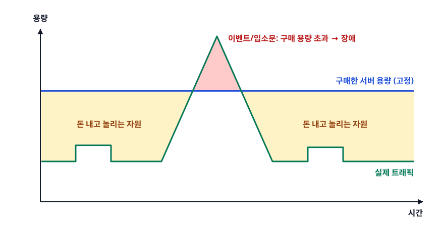
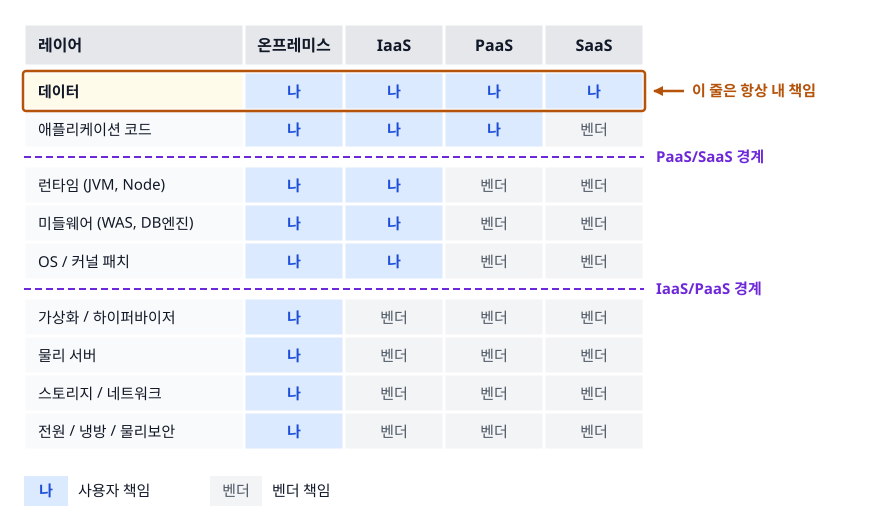
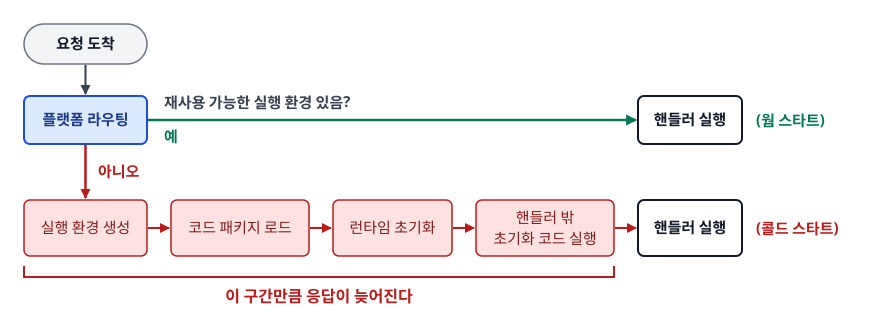

# 클라우드 컴퓨팅 기초 (Cloud Computing Basics)

> 온프레미스가 어디서 막혔는지부터 짚고, 클라우드가 그 벽을 어떻게 넘었는지, 그리고 IaaS/PaaS/SaaS/서버리스 중 무엇을 골라야 하는지 스스로 판단할 수 있게 된다.

## 학습 목표

- [ ] 온프레미스의 구조적 한계(초기 투자, 용량 산정, 조달 리드타임)를 설명할 수 있다
- [ ] 클라우드의 5대 필수 특성을 말하고, 하나라도 빠지면 왜 클라우드가 아닌지 설명할 수 있다
- [ ] IaaS/PaaS/SaaS를 "무엇을 내가 관리하고 무엇을 위임하는가"로 구분할 수 있다
- [ ] 서버리스가 PaaS의 어떤 지점을 더 밀어붙인 것인지 이해한다
- [ ] CapEx에서 OpEx로의 전환이 기술 의사결정을 어떻게 바꾸는지 설명할 수 있다

## 선행 지식

- 없음 — 이 문서부터 시작해도 된다. 서버, OS, 네트워크가 대략 무엇인지 아는 정도면 충분하다.

---

## 1. 왜 필요한가 — 온프레미스가 부딪힌 세 개의 벽

**온프레미스(On-premise)** 는 회사가 서버를 직접 사서, 자기 건물(또는 임대한 IDC 랙)에 놓고, 전원·냉방·네트워크·보안·백업을 전부 책임지는 방식이다. 클라우드가 나오기 전에는 이것 말고 선택지가 없었다.

문제는 이 모델이 **"쓰기 전에 사야 한다"** 는 구조라는 점이다. 여기서 세 개의 벽이 생긴다.

### 벽 1. 초기 투자 — 매출이 0원일 때 돈이 가장 많이 나간다

서비스를 열기도 전에 서버·스토리지·스위치·방화벽·라이선스를 한꺼번에 사야 한다. 아이디어를 검증하려는 팀에게 이건 치명적이다. 실패하면 그 장비는 그대로 재고가 된다. 자금이 부족한 팀은 "될지 안 될지 모르는 것"에 큰돈을 먼저 걸어야 하므로 시도 자체를 못 한다.

### 벽 2. 용량 산정 — 미래 트래픽을 오늘 맞혀야 한다

서버를 몇 대 살지 정하려면 6개월~3년 뒤 트래픽을 예측해야 한다. 그런데 이 예측은 거의 항상 틀린다.

<!-- diagram:cloud-cloud-computing-basics-1 -->


<!-- 위 그림이 대체한 원본 ASCII.
     내용을 고칠 때는 그림도 함께 갱신할 것.
```
 용량
  ▲
  │                  ▲ 이벤트/입소문: 구매 용량 초과 → 장애
  │                 ╱ ╲
══│════════════════╱═══╲══════════════════  구매한 서버 용량 (고정)
  │ ▒▒▒▒▒▒▒▒▒▒▒▒▒ ╱     ╲ ▒▒▒▒▒▒▒▒▒▒▒▒▒▒▒   ▒ = 돈 내고 놀리는 자원
  │   ┌───┐      ╱       ╲     ┌──┐
  │───┘   └─────┘         └────┘  └───────  실제 트래픽
  │
  └──────────────────────────────────────▶  시간
```
-->

- **과대 산정**: 평소에는 자원의 대부분이 논다. 산 값, 전기값, 상면비를 그대로 낸다.
- **과소 산정**: 정작 트래픽이 몰리는 순간에 서비스가 죽는다. 가장 중요한 순간에 실패한다.

둘 중 하나만 고를 수 있고, 실무에서는 "장애보다는 낭비가 낫다"며 과대 산정 쪽으로 기울게 된다.

### 벽 3. 조달 리드타임 — 필요할 때 바로 못 산다

트래픽이 늘어 서버가 필요하다는 걸 안 시점부터 실제 서비스 투입까지, 견적·품의·발주·입고·랙 마운트·OS 설치·네트워크 설정을 거쳐야 한다. 몇 주가 걸린다. 마케팅 캠페인이 다음 주라면 늦어도 한참 늦었다.

### 그래서 클라우드가 바꾼 것

클라우드 컴퓨팅은 이 세 문제를 **"용량을 미리 사는 문제"를 "필요할 때 빌리는 문제"로 바꿔서** 해결한다. 서버·스토리지·네트워크를 자산으로 소유하는 대신, 인터넷을 통해 API로 빌리고 쓴 만큼만 낸다.

> **비유** — 발전기를 사는 대신 콘센트를 쓰는 것과 같다. 공장마다 발전기를 두던 시대에는 발전 용량을 미리 정해야 했지만, 전력망이 깔린 뒤로는 그냥 꽂고 쓴 만큼 요금을 낸다.
>
> **비유의 한계** — 전기는 어느 발전소에서 오든 220V로 동일하다. 클라우드는 그렇지 않다. 벤더마다 API, 서비스 이름, IAM 모델, 네트워크 구성이 전부 달라서 "콘센트를 갈아 끼우듯" 옮길 수 없다. 이 차이가 뒤에 나올 **락인(Lock-in)** 문제의 뿌리다.

---

## 2. 클라우드의 5대 특성

미국 NIST가 정리한 정의(SP 800-145)가 지금도 업계 기준으로 쓰인다. 다섯 가지를 **모두** 만족해야 클라우드다. 외우기보다 "하나가 빠지면 무엇이 무너지는가"로 이해하는 편이 낫다.

| 특성 | 뜻 | 이게 없으면 |
|------|-----|------------|
| 온디맨드 셀프서비스<br>(On-demand self-service) | 사람에게 요청하지 않고 콘솔/API로 즉시 자원을 만든다 | 결재를 기다려야 하므로 리드타임 문제가 그대로 남는다 |
| 광범위한 네트워크 접근<br>(Broad network access) | 표준 프로토콜로 어디서든 접근 가능 | 특정 사무실 안에서만 쓸 수 있으면 그냥 사내 서버다 |
| 자원 풀링<br>(Resource pooling) | 여러 고객이 하나의 물리 자원 풀을 나눠 쓴다(멀티테넌시) | 규모의 경제가 안 생겨 단가가 안 내려간다 |
| 신속한 탄력성<br>(Rapid elasticity) | 수요에 따라 몇 분 안에 늘리고 줄인다 | 용량 산정 문제가 그대로 남는다 |
| 측정 가능한 서비스<br>(Measured service) | 사용량이 계량되고 그만큼 과금·리포팅된다 | 종량제가 성립하지 않는다 |

**한 줄 결론**: 자원 풀링이 단가를 낮추고, 탄력성이 용량 산정 문제를 없애고, 셀프서비스가 리드타임을 없앤다. 1절의 세 벽에 각각 대응된다.

여기서 자주 오해하는 지점 하나. **"우리 회사 IDC에 서버 잔뜩 사놓고 팀별로 나눠 쓴다"는 클라우드가 아니다.** 셀프서비스·탄력성·계량이 없기 때문이다. 이걸 클라우드로 만들려면 그 위에 오케스트레이션 계층(OpenStack, VMware vSphere 등)을 올려 API로 자원을 잘라 줄 수 있어야 한다. 이 구분은 [03-public-private-hybrid.md](./03-public-private-hybrid.md)에서 다시 다룬다.

---

## 3. 서비스 모델 — 어디까지 위임할 것인가

### 3.1 스택을 잘라 보기

애플리케이션 한 벌이 돌아가려면 아래 레이어가 전부 필요하다. 서비스 모델은 **"이 스택의 어디에 선을 긋고, 그 아래를 벤더에게 넘기느냐"** 의 문제다.

<!-- diagram:cloud-cloud-computing-basics-2 -->


<!-- 위 그림이 대체한 원본 ASCII.
     내용을 고칠 때는 그림도 함께 갱신할 것.
```
레이어                온프레미스   IaaS      PaaS      SaaS
────────────────────────────────────────────────────────────
 데이터                  나         나        나        나   ← 이 줄은 항상 내 책임
 애플리케이션 코드        나         나        나       벤더
─────────────────────────────────────────── PaaS/SaaS 경계 ──
 런타임 (JVM, Node)      나         나       벤더      벤더
 미들웨어 (WAS, DB엔진)   나         나       벤더      벤더
 OS / 커널 패치          나         나       벤더      벤더
──────────────────────── IaaS/PaaS 경계 ─────────────────────
 가상화 / 하이퍼바이저    나        벤더      벤더      벤더
 물리 서버               나        벤더      벤더      벤더
 스토리지 / 네트워크      나        벤더      벤더      벤더
 전원 / 냉방 / 물리보안   나        벤더      벤더      벤더
```
-->

맨 윗줄을 눈여겨보자. **데이터는 어떤 모델을 써도 내 책임이다.** SaaS를 쓴다고 해서 "데이터도 벤더가 알아서 지켜주겠지"가 되지 않는다. 벤더는 저장 인프라의 내구성을 책임지고, 무엇을 넣을지·누구에게 열어줄지·실수로 지웠을 때 되살릴 수 있는지는 사용자 책임이다.

같은 스택 그림이라도 SaaS의 데이터 행을 벤더 쪽으로 칠해 놓은 자료가 있다. 그건 **누가 저장소를 운영하는가**를 표시한 것이고, 위 그림은 **사고가 났을 때 누가 책임지는가**를 표시한 것이다. 두 질문의 답이 다르다는 점만 구분하면 헷갈릴 일이 없다.

### 3.2 왜 하필 그 경계인가

경계가 임의로 그어진 게 아니다. 기준은 **"벤더가 표준화할 수 있는가"** 하나다.

물리 서버, 전원, 하이퍼바이저, OS 이미지, JVM 같은 것들은 어느 고객이 쓰든 사실상 동일하다. 벤더가 한 번 잘 만들어 수십만 고객에게 똑같이 제공하면 규모의 경제가 생긴다. 반면 주문 처리 로직이나 추천 알고리즘은 회사마다 완전히 다르고, 벤더가 대신 만들어 줄 수 없다.

> **표준화 가능한 것 = 벤더 책임 / 비즈니스 고유한 것 = 사용자 책임**

경계가 위로 올라갈수록 내 할 일은 줄지만, 손댈 수 있는 범위도 같이 줄어든다. 이게 서비스 모델 선택의 본질적 트레이드오프다.

### 3.3 책임 경계표

| 구분 | 내가 관리하는 것 | 벤더가 관리하는 것 | 얻는 것 | 잃는 것 | 이럴 때 쓴다 |
|------|-----------------|------------------|--------|--------|------------|
| **IaaS** | OS, 패치, 런타임, 미들웨어, 앱, 데이터 | 하드웨어, 가상화, 네트워크, 전원 | 커널 파라미터까지 제어 가능 | 운영 인력·시간이 계속 든다 | 레거시를 그대로 옮길 때, 특수 튜닝·특정 커널 모듈이 필요할 때 |
| **PaaS** | 앱 코드, 데이터, 스키마 | 위 + OS, 런타임, 미들웨어, 패치, 백업 | 운영 부담이 크게 줄고 배포가 빨라진다 | 버전·설정 선택지가 벤더가 허용한 범위로 제한된다 | 대부분의 신규 웹 서비스, 인프라 인력이 적은 팀 |
| **SaaS** | 데이터, 계정/권한 설정 | 앱을 포함한 사실상 전부 | 계약 즉시 사용 시작 | 기능은 벤더가 정한 대로만 | 개발할 이유가 없는 공통 업무(메일, 협업, 결제 대시보드) |

**표 아래 한 줄**: 통제권이 필요한 만큼만 아래로 내려가라. 이유 없이 IaaS를 고르면 그 대가는 매달 사람의 시간으로 지불된다.

### 3.4 실무 판단 — EC2에 MySQL을 직접 깔 것인가, RDS를 쓸 것인가

가장 자주 마주치는 IaaS vs PaaS 결정이다.

| 항목 | EC2에 직접 설치 (IaaS) | RDS (PaaS) |
|------|----------------------|-----------|
| OS·엔진 패치 | 내가 일정 잡고 수행 | 벤더가 유지관리 윈도우에 수행 |
| 백업 | 스크립트 작성·검증·모니터링 | 자동 스냅샷 + 특정 시점 복구 |
| 이중화 | 복제 구성·페일오버 스크립트 직접 | Multi-AZ 옵션으로 설정 |
| 엔진 커스터마이징 | 플러그인 설치, 커널 튜닝 자유 | 파라미터 그룹이 허용한 범위만 |
| OS 셸 접근 | 가능 | 불가 |
| 시간당 단가 | 낮음 | 높음 |

단가만 보면 EC2가 싸다. 하지만 백업 검증, 새벽 패치, 페일오버 리허설에 들어가는 사람의 시간을 비용에 넣으면 대개 역전된다. **"특수한 엔진 확장이나 OS 레벨 접근이 반드시 필요한가?"** 에 아니라고 답할 수 있으면 PaaS가 정답이다.

---

## 4. 서버리스 — 위임을 한 칸 더 밀어붙인 것

### 4.1 무엇이 사라지는가

PaaS까지 와도 "인스턴스가 몇 대 떠 있는가"는 여전히 내 관심사다. 트래픽이 없어도 인스턴스가 떠 있으면 요금이 나간다. **서버리스(Serverless)** 는 이 마지막 단위마저 없앤다. 서버가 없다는 뜻이 아니라, **내가 서버라는 단위를 의식하지 않는다**는 뜻이다.

- 인스턴스 개수를 내가 정하지 않는다 → 동시 요청 수에 따라 플랫폼이 실행 환경을 늘린다
- 요청이 없으면 실행 환경이 0까지 줄어든다 → 유휴 비용이 원칙적으로 없다
- OS 패치, 런타임 업데이트, 스케일링 정책이 전부 벤더 몫

대표적인 형태가 함수 단위 실행(FaaS, 예: AWS Lambda)이고, 넓게 보면 서버 단위를 노출하지 않는 관리형 서비스(객체 스토리지, 관리형 큐 등)도 서버리스로 분류한다.

### 4.2 콜드 스타트 — 서버리스의 대표적 함정

<!-- diagram:cloud-cloud-computing-basics-3 -->


<!-- 위 그림이 대체한 원본 ASCII.
     내용을 고칠 때는 그림도 함께 갱신할 것.
```
요청 도착
   │
   ▼
┌──────────────────┐   재사용 가능한 실행 환경 있음?
│  플랫폼 라우팅    │────── 예 ──────▶ 핸들러 실행        (웜 스타트)
└──────────────────┘
   │ 아니오
   ▼
 실행 환경 생성 → 코드 패키지 로드 → 런타임 초기화
        → 핸들러 밖 초기화 코드 실행 → 핸들러 실행        (콜드 스타트)
        └────────── 이 구간만큼 응답이 늦어진다 ──────────┘
```
-->

콜드 스타트는 첫 요청이나 급격한 동시성 증가 구간에서 발생한다. 그래서 서버리스는 **평균 응답 시간은 괜찮은데 p99가 튀는** 패턴을 자주 보인다. 완화 방법은 몇 가지가 있다.

- 배포 패키지를 작게 유지한다(불필요한 의존성 제거)
- DB 커넥션, SDK 클라이언트 같은 무거운 객체는 **핸들러 바깥**에서 한 번만 초기화해 재사용한다
- 지연에 민감한 경로는 미리 초기화된 실행 환경을 확보하는 옵션을 쓰거나, 아예 상시 구동형(컨테이너/서버)으로 둔다

### 4.3 과금 모델과 한계

서버리스의 과금은 대체로 **요청 건수에 붙는 요금**과 **실행 시간 × 할당 메모리로 계산되는 사용량 요금**을 더하는 구조다. 인스턴스가 켜져 있는 시간이 아니라 코드가 실제로 도는 시간에 과금되므로, 트래픽이 들쭉날쭉할수록 유리하다. 여기서 메모리를 올리면 함께 배정되는 연산 자원도 늘어나 실행 시간이 줄어드는 경우가 있어, 메모리를 키우는 쪽이 오히려 총액을 낮추기도 한다. (구체적 단가와 자원 배분 방식은 벤더·리전·서비스마다 다르고 계속 바뀌므로 최신 요금 문서에서 확인해야 한다.)

반대로 **불리해지는 경우**가 분명히 있다.

- 트래픽이 24시간 평평하게 높다 → 상시 인스턴스가 대개 더 저렴하다
- 실행 시간이 길다 → 플랫폼마다 최대 실행 시간 제한이 있어 배치 작업에 부적합할 수 있다
- 상태를 메모리에 오래 들고 있어야 한다 → 실행 환경이 언제든 회수되므로 상태는 외부 저장소로 빼야 한다
- 요청당 DB 커넥션을 새로 연다 → 동시성이 폭증하면 DB 커넥션이 먼저 고갈된다. 이 함정은 서버리스만의 것이 아니라서 7절에서 다시 다룬다

---

## 5. CapEx에서 OpEx로 — 돈의 성격이 바뀐다

### 5.1 무엇이 달라지나

- **CapEx(자본적 지출)**: 서버를 사서 자산으로 잡고 수년에 걸쳐 감가상각한다. 목돈이 먼저 나가고, 한번 사면 되돌리기 어렵다.
- **OpEx(운영 비용)**: 매달 사용료로 나간다. 쓰지 않으면 안 낸다.

기술자 입장에서 중요한 건 회계 처리가 아니라 **의사결정의 성격이 바뀐다**는 점이다. CapEx 시대에는 "잘못 사면 몇 년을 안고 간다"는 압박 때문에 결정이 느리고 보수적이었다. OpEx에서는 만들어 보고 아니면 지우면 되므로, 실험 비용이 극적으로 낮아진다. 클라우드가 스타트업 문화와 잘 맞는 이유가 여기 있다.

다만 뒤집힌 위험도 생긴다. **아무도 결재하지 않아도 비용이 계속 늘어난다.** 테스트용으로 띄운 인스턴스, 지우지 않은 스냅샷, 붙어 있지 않은 디스크가 조용히 매달 청구된다. 그래서 클라우드에서는 태그 정책, 예산 알람, 유휴 자원 정리가 운영 업무로 편입된다.

### 5.2 과금 모델의 종류

같은 자원이라도 어떤 방식으로 사느냐에 따라 단가가 달라진다. 숫자는 계속 변하니 **구조**만 이해해 두면 된다.

| 구매 방식 | 성격 | 잘 맞는 워크로드 | 주의점 |
|----------|------|----------------|--------|
| 온디맨드 | 약정 없이 쓴 시간만큼 | 예측 불가능한 트래픽, 실험 | 단가가 가장 높다 |
| 약정형(예약/세이빙스 플랜) | 일정 기간 사용을 약속하고 할인 | 항상 켜져 있는 기반 인프라 | 약정 기간에 묶인다. 아키텍처가 바뀌면 손해 |
| 스팟/선점형 | 여유 자원을 저렴하게, 언제든 회수 가능 | 중단돼도 되는 배치, 렌더링, CI 러너 | 사전 통지 후 회수될 수 있어 상태 저장 워크로드엔 부적합 |
| 사용량 기반(서버리스·관리형) | 요청 수·처리량·저장량으로 과금 | 간헐적/이벤트성 워크로드 | 트래픽이 평탄하고 크면 오히려 비싸진다 |

여기에 **데이터 전송 비용**이 얹힌다. 일반적으로 클라우드로 들어오는 트래픽보다 밖으로 나가는 트래픽, 그리고 가용 영역·리전을 넘나드는 트래픽에 과금이 붙는다. 아키텍처를 짤 때 "이 데이터가 어느 경계를 몇 번 넘는가"를 세어 보는 습관이 비용을 좌우한다.

### 5.3 클라우드가 항상 싸지는 않다

클라우드가 저렴해지는 조건은 **탄력성을 실제로 쓸 때**다. 24시간 일정하게 높은 부하를 3년간 돌린다면 자체 구축이 더 쌀 수 있다. 실제로 대규모 서비스 중에는 성장 후 일부 워크로드를 자체 인프라로 되돌린 사례가 알려져 있다.

정리하면 이렇게 판단한다.

- 부하가 변동적이거나 예측 불가 → 클라우드가 유리
- 부하가 평탄하고 규모가 크며 수년간 안정적 → 자체 구축 또는 장기 약정 검토
- 지금 필요한 건 속도와 실험 → 논쟁할 것 없이 클라우드

---

## 6. 책임 공유 모델 — 보안은 어디까지 내 몫인가

3절의 경계는 보안에도 그대로 적용된다. 주요 벤더는 이를 **책임 공유 모델(Shared Responsibility Model)** 로 문서화한다.

- **벤더**: "클라우드 자체의 보안" — 데이터센터 물리 보안, 하이퍼바이저, 관리형 서비스의 기반 인프라
- **사용자**: "클라우드 안에서의 보안" — 계정 권한(IAM), 네트워크 접근 규칙, 암호화 설정, OS 패치(IaaS의 경우), 애플리케이션 취약점, 데이터 분류

실제 클라우드 보안 사고의 상당수는 벤더 인프라가 뚫려서가 아니라, **스토리지 버킷을 전체 공개로 열어 두거나, 과한 권한이 붙은 키가 코드 저장소에 올라가서** 발생한다. 전부 사용자 책임 영역이다. "클라우드는 보안 전문가가 관리하니 안전하다"는 문장은 절반만 맞다.

---

## 7. 실무에서는 — 위임했는데 왜 우리가 장애를 맞는가

**증상.** 신규 서비스를 RDS(PaaS)로 옮겼다. 그런데 트래픽이 몰리는 시간대에 애플리케이션 로그에 커넥션 관련 오류가 쏟아지고 요청이 실패한다. "DB는 AWS가 관리해 주는 거 아니었나?"

**진단.**

```bash
# 1) 애플리케이션 쪽 에러 패턴부터 확인
#    deploy/api 로 지정하면 파드 하나의 로그만 나온다. 파드 전체를 보려면 레이블로 고른다.
#    (셀렉터를 쓰면 --tail 기본값이 작으므로 -1 로 풀어 준다)
kubectl logs -l app=api --since=1h --tail=-1 | grep -i "too many connections"

# 2) DB가 허용하는 최대 커넥션 수 확인
aws rds describe-db-parameters \
  --db-parameter-group-name my-app-pg \
  --query "Parameters[?ParameterName=='max_connections']"

# 3) 실제 커넥션 수가 언제 치솟았는지 시계열로 확인
aws cloudwatch get-metric-statistics \
  --namespace AWS/RDS \
  --metric-name DatabaseConnections \
  --dimensions Name=DBInstanceIdentifier,Value=my-app-db \
  --start-time 2025-03-01T00:00:00Z \
  --end-time   2025-03-01T06:00:00Z \
  --period 300 --statistics Maximum
```

**원인.** 애플리케이션 파드를 늘리면서 `파드 수 × 커넥션 풀 크기`가 DB의 최대 커넥션 한도를 넘었다. 벤더가 책임지는 것은 **DB 엔진과 그 인프라의 가용성**이지, **내 애플리케이션의 커넥션 설계**가 아니다. 경계 위쪽은 여전히 내 몫이다.

**대응.**

1. 커넥션 풀 상한을 `파드 최대 수 × 풀 크기 < DB 한도`가 되도록 다시 계산한다.
2. 파드 수가 크게 변동한다면 커넥션 풀링 계층(예: RDS Proxy)을 두어 DB 쪽 커넥션 수를 고정한다.
3. 커넥션 수와 오류율에 알람을 걸어 장애가 아니라 경고 단계에서 잡는다.

**교훈.** 위임하면 책임이 사라지는 게 아니라 **책임의 종류가 바뀐다.** IaaS에서는 "DB 서버가 떠 있는가"를 걱정했다면, PaaS에서는 "내가 그 DB를 올바르게 쓰고 있는가"를 걱정한다.

---

## 8. 면접 포인트

> 면접에서 이 주제가 나오면 이렇게 답한다

**Q. 클라우드 컴퓨팅이 온프레미스와 비교해 본질적으로 무엇이 다른가요?**

A. 자원을 **소유**하는 모델에서 **임대**하는 모델로 바뀐 것입니다. 그 결과 초기 투자, 용량 산정, 조달 리드타임이라는 온프레미스의 세 가지 제약이 사라집니다. 다만 이건 "싸진다"는 뜻이 아니라 "필요할 때 늘리고 안 쓸 때 줄일 수 있다"는 뜻이고, 그 탄력성을 실제로 활용하지 않으면 오히려 비싸질 수 있습니다.

- 꼬리 질문: "그럼 클라우드가 더 비싼 경우는?" → 부하가 24시간 평탄하고 규모가 크며 수년간 안정적인 워크로드. 이 경우 자체 구축이나 장기 약정이 유리하다는 방향으로 답한다.

**Q. IaaS, PaaS, SaaS의 경계는 무엇을 기준으로 나뉘나요?**

A. "벤더가 표준화할 수 있는가"를 기준으로 나뉩니다. 하드웨어·OS·런타임처럼 고객이 달라도 거의 동일한 부분은 벤더가 맡고, 비즈니스 로직과 데이터처럼 고객마다 다른 부분은 사용자가 맡습니다. 그래서 경계가 위로 올라갈수록 운영 부담은 줄고 통제권도 같이 줄어드는 트레이드오프가 생깁니다.

- 꼬리 질문: "EC2에 MySQL을 직접 설치하는 것과 RDS를 쓰는 것 중 무엇을 고르겠나요?" → OS 셸 접근이나 엔진 확장이 꼭 필요한지로 판단한다고 답하고, 아니라면 운영 인건비까지 포함했을 때 RDS가 대체로 유리하다고 덧붙인다.

**Q. 서버리스는 PaaS와 어떻게 다른가요?**

A. PaaS에서도 "인스턴스가 몇 대 떠 있는가"는 여전히 사용자의 관심사인데, 서버리스는 그 단위를 아예 노출하지 않습니다. 요청이 없으면 0으로 줄고, 과금도 요청 수와 실행 시간 기반입니다. 대신 콜드 스타트로 p99 지연이 튈 수 있고, 최대 실행 시간 제한이 있으며, 상태를 외부 저장소로 빼야 한다는 제약이 따라옵니다.

- 꼬리 질문: "콜드 스타트를 어떻게 줄이나요?" → 패키지 축소, 핸들러 밖에서 커넥션·클라이언트 재사용, 지연에 민감한 경로는 미리 초기화된 실행 환경을 확보하거나 상시 구동형으로 분리.

**Q. 클라우드를 쓰면 보안이 자동으로 좋아지나요?**

A. 아닙니다. 벤더는 "클라우드 자체의 보안"을, 사용자는 "클라우드 안에서의 보안"을 책임지는 책임 공유 모델입니다. 실제 사고의 대부분은 하이퍼바이저가 뚫려서가 아니라 스토리지 공개 설정 실수나 과도한 권한의 키 유출 같은 사용자 책임 영역에서 발생합니다.

- 꼬리 질문: "그럼 무엇부터 점검하겠나요?" → 최소 권한 IAM, 퍼블릭 접근 차단, 키 로테이션과 시크릿 관리, 감사 로그 활성화 순으로 답한다.

---

## 자주 하는 실수

| 실수 | 왜 틀렸나 | 올바른 이해 |
|------|----------|-----------|
| "SaaS를 쓰면 데이터도 벤더 책임이다" | 벤더는 저장 인프라의 내구성을 책임질 뿐, 무엇을 넣고 누구에게 열어줄지는 관여하지 않는다 | 데이터와 접근 권한은 어떤 모델에서도 사용자 책임 |
| "클라우드는 무조건 싸다" | 탄력성을 쓰지 않으면 온디맨드 단가만 그대로 낸다 | 변동 부하에서 싸진다. 평탄한 대규모 부하는 재검토 대상 |
| "사내 IDC에 서버 많이 사두고 팀별로 나눠 쓰면 프라이빗 클라우드다" | 셀프서비스·탄력성·계량이 없다 | 5대 특성을 만족해야 클라우드다. 없으면 그냥 가상화된 사내 서버 |
| "서버리스는 서버가 없다" | 서버는 있고 벤더가 감춘 것뿐이다 | 서버라는 **관리 단위**가 사라진 것. 실행 시간·동시성·상태 제약은 그대로 존재 |
| "PaaS로 옮겼으니 DB 장애는 벤더 탓" | 커넥션 설계, 쿼리, 스키마는 경계 위쪽이라 사용자 책임 | 위임하면 책임의 종류가 바뀔 뿐 사라지지 않는다 |
| "스팟 인스턴스가 싸니까 웹 서버를 전부 스팟으로" | 사전 통지 후 회수될 수 있다 | 중단 허용 워크로드(배치, CI)에 쓰고, 상시 서비스는 온디맨드/약정과 섞는다 |

---

## 한 줄 정리

클라우드는 "자원을 미리 사서 소유하는 문제"를 "필요할 때 API로 빌리는 문제"로 바꾼 것이고, IaaS·PaaS·SaaS·서버리스는 그 스택 중 **어디까지 벤더에게 넘기고 얼마만큼의 통제권을 포기할 것인가**에 대한 서로 다른 답이다.

---

## 연관 개념

- [02-virtualization-hypervisor.md](./02-virtualization-hypervisor.md) - 클라우드의 자원 풀링과 종량제를 가능하게 한 기반 기술
- [03-public-private-hybrid.md](./03-public-private-hybrid.md) - 같은 클라우드라도 어디에 두느냐(퍼블릭/프라이빗/하이브리드)의 문제
- [04-scalability-availability.md](./04-scalability-availability.md) - 탄력성을 실제 아키텍처로 구현하는 방법
- [qna-cloud-fundamentals.md](./qna-cloud-fundamentals.md) - 이 주제의 면접 질문 모음
- [../containerization/docker/qna-docker.md](../containerization/docker/qna-docker.md) - 애플리케이션을 옮길 수 있는 단위로 포장하는 컨테이너
- [../aws/qna-aws.md](../aws/qna-aws.md) - EC2, RDS, Lambda 등 실제 서비스 수준의 질문
