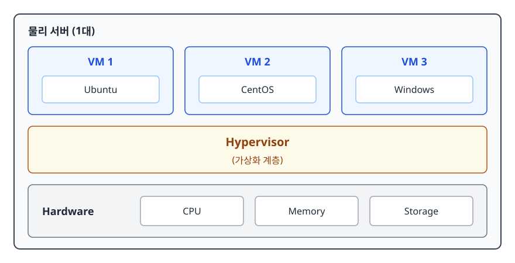
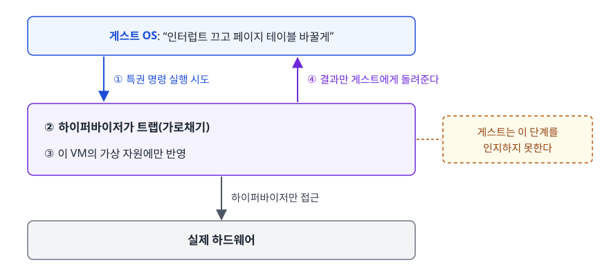
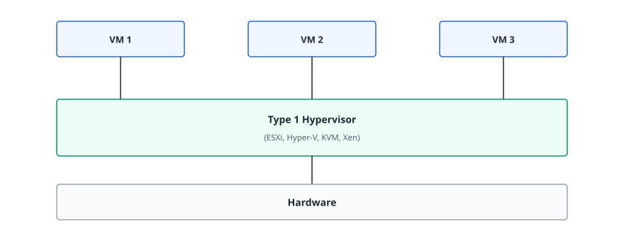
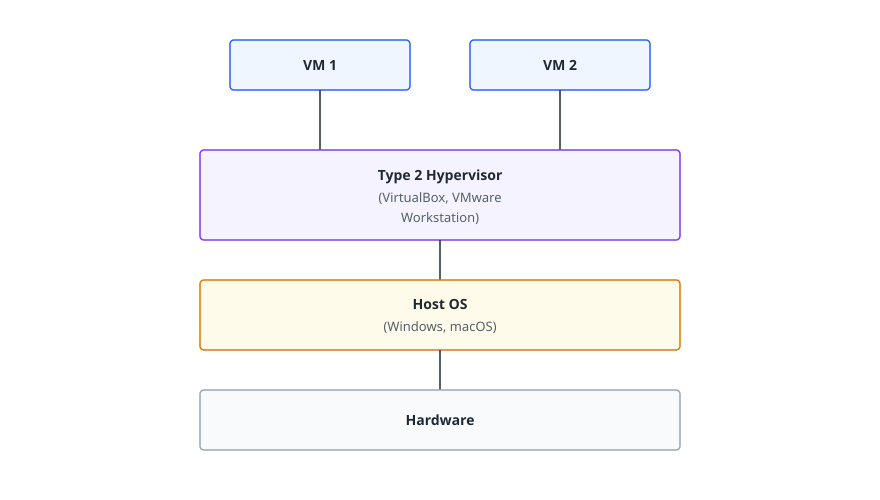
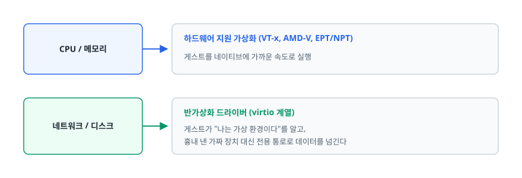
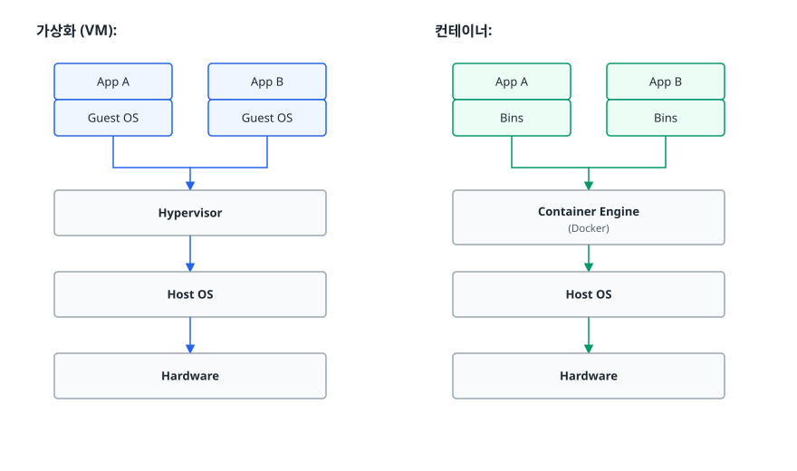

# 가상화와 하이퍼바이저 (Virtualization & Hypervisor)

> 물리 서버 한 대를 왜 굳이 쪼개서 쓸까요? 하이퍼바이저는 그 일을 어떻게 해내고, Type 1/Type 2와 전·반가상화 구분은 지금도 의미가 있을까요? 이 문서가 그 답을 차례로 다룹니다.

## 학습 목표

- [ ] 가상화가 풀려던 문제(자원 낭비와 서버 난립)를 설명할 수 있다
- [ ] 하이퍼바이저가 게스트의 명령을 가로채 격리를 만드는 원리를 이해한다
- [ ] Type 1과 Type 2를 설치 위치가 아니라 신뢰 경계로 구분할 수 있다
- [ ] 전가상화·반가상화·하드웨어 지원 가상화가 지금 어떻게 나뉘어 쓰이는지 말할 수 있다
- [ ] VM과 컨테이너를 커널 공유 여부에서 출발해 비교할 수 있다

## 선행 지식

- 없음 — OS가 프로세스와 메모리를 관리한다는 정도만 알면 됩니다.

---

## 1. 왜 필요한가 — 서버 한 대에 서비스 하나라는 낭비

가상화가 없던 시절의 원칙은 단순했습니다. **애플리케이션 하나에 물리 서버 한 대.** 한 서버에 두 서비스를 올렸다가 한쪽이 메모리를 다 먹거나 공용 라이브러리 버전을 바꿔 버리면 다른 쪽까지 같이 죽었기 때문입니다. 서로를 막아 줄 벽이 없으니 물리적으로 떼어 놓는 수밖에 없었습니다.

이 원칙의 대가는 두 가지였습니다.

**자원이 놉니다.** 서비스 하나만 올려 둔 서버는 평균 사용률이 아주 낮게 유지되는 경우가 흔합니다. 피크에 맞춰 산 장비가 하루 대부분을 놀면서 전기와 상면비만 먹습니다.

**서버 대수가 통제 불능으로 늘어납니다.** 새 서비스마다 장비를 사야 하니 랙이 늘고 늘어난 만큼 자산 관리·패치·백업 대상이 늘어납니다. 서버 난립(server sprawl)이라 부르는 상태입니다.

가상화는 **"벽은 유지하되 하드웨어는 공유한다"로** 두 문제를 한꺼번에 풉니다. 서비스마다 독립된 OS와 격리 경계를 주되, 그 아래 물리 자원은 한 장비에서 나눠 씁니다.

> **비유**: 단독주택 여러 채 대신 아파트 한 동을 짓는 것과 같습니다. 세대마다 현관문과 도어락이 따로 있어 서로 간섭하지 않지만, 토지와 기초, 배관은 공유해서 세대당 비용이 내려갑니다.
>
> **비유의 한계**: 아파트는 옆집이 시끄러워도 내 살림살이가 느려지지는 않습니다. 가상화에서는 같은 호스트의 다른 VM이 CPU나 디스크를 몰아 쓰면 내 VM의 응답이 실제로 느려집니다(noisy neighbor). 격리는 **안전성의 벽**이지 **성능의 벽**은 아닙니다.

---

## 2. 가상화(Virtualization)란

한 장비 위에 독립된 실행 환경을 여러 개 만드는 기술이 가상화입니다. **물리 하드웨어 자원을 추상화해** 나눠 줍니다. 각 환경은 자기만의 OS를 갖고, 자기가 전용 하드웨어 위에서 도는 줄로 압니다.

<!-- diagram:cloud-virtualization-hypervisor-1 -->


<!-- 위 그림이 대체한 원본 ASCII.
     내용을 고칠 때는 그림도 함께 갱신할 것.
```
┌─────────────────────────────────────────┐
│            물리 서버 (1대)               │
│  ┌─────────┐ ┌─────────┐ ┌─────────┐   │
│  │  VM 1   │ │  VM 2   │ │  VM 3   │   │
│  │ Ubuntu  │ │ CentOS  │ │ Windows │   │
│  └─────────┘ └─────────┘ └─────────┘   │
│                                         │
│            Hypervisor                   │
│          (가상화 계층)                   │
│                                         │
│    Hardware (CPU, Memory, Storage)      │
└─────────────────────────────────────────┘
```
-->

### 2.1 무엇을 가상화하는가

"가상화"라고 하면 보통 서버 가상화를 가리키지만, 같은 발상이 네트워크와 스토리지에도 적용됩니다.

| 대상 | 추상화하는 것 | 대표 기술 | 클라우드에서 대응되는 것 |
|------|-------------|----------|----------------------|
| 서버 | CPU·메모리를 잘라 여러 OS를 동시 실행 | VMware, KVM, Hyper-V, Xen | 인스턴스(가상 머신) |
| 네트워크 | 물리 배선과 무관하게 논리 망을 구성 | VLAN, VXLAN, SDN | VPC, 서브넷, 보안 그룹 |
| 스토리지 | 물리 디스크를 풀로 묶어 논리 볼륨으로 제공 | SAN, NAS, SDS | 블록 볼륨, 스냅샷 |

**표 아래 한 줄**: 세 가지가 다 갖춰져야 "서버 한 대 주세요"가 아니라 "네트워크까지 포함한 환경 한 벌 주세요"를 API 호출로 처리할 수 있습니다. 클릭 몇 번으로 인프라가 통째로 생기는 클라우드의 배경이 이것입니다.

---

## 3. 하이퍼바이저(Hypervisor)

### 3.1 하는 일 — 게스트의 명령을 가로채는 것

하이퍼바이저는 가상 머신을 만들고 관리하는 소프트웨어이며 Virtual Machine Monitor(VMM)라고도 부릅니다. 핵심 역할은 자원 분배가 아니라 **격리**입니다.

문제의 뿌리는 이렇습니다. OS 커널은 자기가 하드웨어를 독점한다고 가정하고 만들어졌습니다. 그래서 페이지 테이블을 갈아 끼우거나 인터럽트를 끄는 **특권 명령(privileged instruction)을** 거리낌 없이 실행합니다. 게스트 OS 두 벌을 그냥 올리면 서로의 설정을 덮어쓰게 됩니다.

하이퍼바이저는 게스트가 실제 하드웨어를 건드리는 명령을 실행하려는 순간 제어권을 가져옵니다(트랩). 그 요청을 자기가 관리하는 가상 자원에 대해 대신 처리한 뒤 결과만 돌려줍니다. 게스트는 요청이 통했다고 믿지만, 실제로 만진 것은 하이퍼바이저가 만들어 준 가상 하드웨어입니다.

<!-- diagram:cloud-virtualization-hypervisor-2 -->


<!-- 위 그림이 대체한 원본 ASCII.
     내용을 고칠 때는 그림도 함께 갱신할 것.
```
게스트 OS: "인터럽트 끄고 페이지 테이블 바꿀게"
        │
        ▼  특권 명령 실행 시도
┌────────────────────────────────┐
│  하이퍼바이저가 트랩(가로채기)    │ ← 게스트는 이 단계를 인지하지 못한다
│  → 이 VM의 가상 자원에만 반영     │
│  → 결과만 게스트에게 돌려준다     │
└────────────────────────────────┘
        │
        ▼
   실제 하드웨어에는 하이퍼바이저만 접근
```
-->

초기에는 이 가로채기를 순수 소프트웨어로 구현하느라 비용이 컸습니다. 지금은 CPU가 게스트 전용 실행 모드를 따로 제공해 훨씬 싸게 처리합니다(4절). 여기에 얹히는 일은 CPU·메모리 시분할, 가상 NIC과 가상 디스크 제공, VM별 자원 상한 관리입니다.

### 3.2 Type 1: Bare-metal Hypervisor

<!-- diagram:cloud-virtualization-hypervisor-3 -->


<!-- 위 그림이 대체한 원본 ASCII.
     내용을 고칠 때는 그림도 함께 갱신할 것.
```
┌─────────┐ ┌─────────┐ ┌─────────┐
│  VM 1   │ │  VM 2   │ │  VM 3   │
└────┬────┘ └────┬────┘ └────┬────┘
     │           │           │
┌────┴───────────┴───────────┴────┐
│         Type 1 Hypervisor        │
│   (ESXi, Hyper-V, KVM, Xen)     │
└──────────────┬──────────────────┘
               │
┌──────────────┴──────────────────┐
│           Hardware              │
└─────────────────────────────────┘
```
-->

**특징:**
- 하드웨어 위에 직접 설치
- 호스트 OS 불필요
- 높은 성능, 낮은 오버헤드
- 엔터프라이즈/데이터센터용

**대표 제품:**
| 제품 | 벤더 | 특징 |
|------|------|------|
| VMware ESXi | VMware | 기업용 표준 |
| Microsoft Hyper-V | Microsoft | Windows Server 내장 |
| KVM | 오픈소스 | Linux 커널 내장 |
| Xen | 오픈소스/Citrix | AWS EC2 초기 사용 |

**표 아래 한 줄**: 이 표에 무료 오픈소스(KVM, Xen)와 상용 제품이 나란히 있다는 점을 봐 둡시다. 뒤에서 "Type 1은 비싸다"는 오해를 푸는 근거가 됩니다.

### 3.3 Type 2: Hosted Hypervisor

<!-- diagram:cloud-virtualization-hypervisor-4 -->


<!-- 위 그림이 대체한 원본 ASCII.
     내용을 고칠 때는 그림도 함께 갱신할 것.
```
┌─────────┐ ┌─────────┐
│  VM 1   │ │  VM 2   │
└────┬────┘ └────┬────┘
     │           │
┌────┴───────────┴────┐
│  Type 2 Hypervisor  │
│ (VirtualBox, VMware │
│  Workstation)       │
└──────────┬──────────┘
           │
┌──────────┴──────────┐
│      Host OS        │
│  (Windows, macOS)   │
└──────────┬──────────┘
           │
┌──────────┴──────────┐
│      Hardware       │
└─────────────────────┘
```
-->

**특징:**
- 기존 OS 위에 설치
- 설치 및 사용 간편
- 개발/테스트 환경에 적합
- Type 1 대비 오버헤드 존재

**대표 제품:**
| 제품 | 용도 |
|------|------|
| VirtualBox | 무료, 크로스플랫폼 |
| VMware Workstation | Windows/Linux 개발 |
| VMware Fusion | macOS 개발 |
| Parallels Desktop | macOS용 Windows 실행 |

**표 아래 한 줄**: 이쪽은 전부 개인 장비에 설치해 쓰는 도구입니다. 프로덕션 후보로 올라오는 물건이 아닙니다.

### 3.4 둘을 가르는 진짜 기준

설치 위치로 외우는 것보다 **"게스트와 하드웨어 사이에 신뢰해야 할 코드가 얼마나 끼어 있는가"로** 이해하는 편이 오래갑니다. Type 2는 그 사이에 범용 OS 한 벌이 통째로 들어가 있습니다. 그 OS는 브라우저와 게임까지 돌립니다.

| 비교 축 | Type 1 (Bare-metal) | Type 2 (Hosted) | 왜 그렇게 되나 |
|--------|--------------------|-----------------|--------------|
| 게스트와 하드웨어 사이 | 하이퍼바이저만 | 하이퍼바이저 + 범용 호스트 OS | Type 2는 호스트 OS의 스케줄러와 드라이버를 한 번 더 거친다 |
| 지연 안정성 | 예측 가능 | 호스트의 다른 작업에 흔들린다 | 호스트에서 빌드를 돌리면 VM 응답도 같이 튄다 |
| 신뢰 기반의 크기 | 작다 | 호스트 OS 전체가 포함돼 커진다 | 호스트 OS의 취약점이 곧 가상화 격리의 취약점이 된다 |
| 게스트 밀도 | 한 장비에 수십 대 이상 | 개인 장비가 감당하는 몇 대 | 오버헤드와 물리 자원 규모의 차이 |
| 도입에 드는 것 | 전용 장비와 운영 인력 | 쓰던 PC에 설치만 하면 끝 | 비용의 본체는 소프트웨어 값이 아니라 장비와 사람이다 |
| 그래서 언제 | 프로덕션, 데이터센터, 클라우드 호스트 | 로컬 개발, 교육, 다른 OS 잠깐 써 보기 | — |

**표 아래 한 줄**: "Type 1은 비싸다"는 말은 라이선스 이야기가 아닙니다. KVM과 Xen은 무료 오픈소스이고 상용 제품만 라이선스를 받습니다. 실제로 드는 값은 전용 장비와 그것을 운영할 사람 쪽에서 나옵니다.

---

## 4. 전가상화, 반가상화, 그리고 하드웨어 지원

### 4.1 가로채기를 누가 하느냐의 문제

3.1절에서 "게스트의 명령을 가로챈다"고 했는데, 그 가로채기를 **누가 어떤 방식으로 하느냐**에 따라 셋으로 갈립니다.

| 방식 | 가로채기 주체 | 게스트 OS 수정 | 강점 | 약점 |
|------|-------------|--------------|------|------|
| 전가상화<br>(Full Virtualization) | 하이퍼바이저가 소프트웨어로 명령을 변환·에뮬레이션 | 필요 없음 | 손댈 수 없는 OS도 그대로 올린다 | 변환 비용이 그대로 오버헤드 |
| 반가상화<br>(Paravirtualization) | 게스트가 하이퍼콜(hypercall)로 직접 요청 | 필요함(커널 또는 드라이버) | 가로챌 일이 없으니 경로가 짧다 | 수정할 수 없는 OS에는 쓸 수 없다 |
| 하드웨어 지원 가상화 | CPU가 게스트 전용 실행 모드를 제공하고, 필요한 순간에만 하이퍼바이저로 빠진다 | 필요 없음 | 전가상화의 호환성에 낮은 오버헤드까지 | CPU 기능(Intel VT-x, AMD-V)이 있어야 한다 |

**표 아래 한 줄**: 지금 새로 환경을 만들면서 셋 중 하나를 고르는 일은 없습니다. 현대 하이퍼바이저는 기본적으로 하드웨어 지원 가상화를 씁니다.

### 4.2 그래서 지금은 어떻게 도는가

구분이 사라진 게 아니라 **계층별로 나뉘어 정착했습니다.**

<!-- diagram:cloud-virtualization-hypervisor-5 -->


<!-- 위 그림이 대체한 원본 ASCII.
     내용을 고칠 때는 그림도 함께 갱신할 것.
```
CPU / 메모리  ──▶ 하드웨어 지원 가상화 (VT-x, AMD-V, EPT/NPT)
                 게스트를 네이티브에 가까운 속도로 실행

네트워크 / 디스크 ──▶ 반가상화 드라이버 (virtio 계열)
                 게스트가 "나는 가상 환경이다"를 알고,
                 흉내 낸 가짜 장치 대신 전용 통로로 데이터를 넘긴다
```
-->

리눅스 게스트에 virtio 드라이버가 없으면 하이퍼바이저는 실제로 존재했던 옛 NIC이나 디스크 컨트롤러를 소프트웨어로 흉내 내야 합니다. 동작은 하지만 처리량이 크게 떨어집니다. 그래서 클라우드용 이미지에는 virtio 계열 드라이버가 기본으로 들어 있습니다.

---

## 5. 가상화 vs 컨테이너

<!-- diagram:cloud-virtualization-hypervisor-6 -->


<!-- 위 그림이 대체한 원본 ASCII.
     내용을 고칠 때는 그림도 함께 갱신할 것.
```
가상화 (VM):                    컨테이너:
┌─────────┐ ┌─────────┐        ┌─────────┐ ┌─────────┐
│  App A  │ │  App B  │        │  App A  │ │  App B  │
├─────────┤ ├─────────┤        ├─────────┤ ├─────────┤
│ Guest OS│ │ Guest OS│        │  Bins   │ │  Bins   │
└────┬────┘ └────┬────┘        └────┬────┘ └────┬────┘
┌────┴───────────┴────┐        ┌────┴───────────┴────┐
│     Hypervisor      │        │   Container Engine  │
└──────────┬──────────┘        │      (Docker)       │
┌──────────┴──────────┐        └──────────┬──────────┘
│      Host OS        │        ┌──────────┴──────────┐
└──────────┬──────────┘        │       Host OS       │
┌──────────┴──────────┐        └──────────┬──────────┘
│      Hardware       │        ┌──────────┴──────────┐
└─────────────────────┘        │       Hardware      │
                               └─────────────────────┘
```
-->

차이는 한 문장으로 줄어듭니다. **VM은 커널을 따로 띄우고, 컨테이너는 호스트 커널을 빌려 씁니다.** 아래 항목은 전부 이 한 문장에서 파생된 결과입니다.

| 비교 축 | VM | 컨테이너 | 커널 공유에서 어떻게 따라오나 |
|--------|-----|---------|--------------------------|
| 기동 시간 | 게스트 OS 부팅 과정을 다 거친다 | 프로세스 하나 띄우는 수준 | 부팅할 커널이 없으니 초기화 단계가 통째로 빠진다 |
| 이미지 크기 | OS 한 벌이 들어간다 | 앱과 의존 라이브러리만 | 커널과 기본 유틸리티를 담지 않는다 |
| 격리 강도 | 하이퍼바이저가 경계 | 커널의 네임스페이스와 cgroup이 경계 | 커널 취약점 하나가 모든 컨테이너에 닿는다 |
| 실행 가능한 OS | 호스트와 달라도 된다 | 호스트 커널과 맞아야 한다 | 리눅스 컨테이너는 리눅스 커널 위에서만 돈다 |
| 자원 회수 | VM 단위로 굵게 | 컨테이너 단위로 잘게, 즉시 | 기동과 종료가 싸서 촘촘한 스케일링이 가능하다 |
| 그래서 언제 | 다른 OS, 신뢰할 수 없는 코드, 강한 규제 격리 | 같은 OS 위에서 빠른 배포와 조밀한 스케일링 | — |

**표 아래 한 줄**: 둘은 대체재가 아닙니다. 실무의 표준 구성은 클라우드 VM 위에 컨테이너 런타임을 올린 2단 구조이고, 하이퍼바이저가 테넌트 사이를, 컨테이너가 서비스 사이를 나눕니다.

"호스트 커널과 맞아야 한다"가 체감되는 지점이 있습니다. macOS나 Windows에서 리눅스 컨테이너를 돌릴 때 도구가 뒤에서 조용히 리눅스 VM을 하나 띄웁니다. 컨테이너가 VM보다 상위 개념이라서가 아니라, 빌려 쓸 리눅스 커널이 그 자리에 없기 때문입니다.

---

## 6. 실무에서는 — 클라우드 하이퍼바이저가 걸어온 길

주요 퍼블릭 클라우드의 컴퓨트는 모두 Type 1 하이퍼바이저 위에서 돕니다. AWS EC2는 Xen으로 시작해 지금은 KVM을 기반으로 만든 자체 하이퍼바이저(Nitro)를 쓰고, Azure는 Hyper-V 계열, GCP는 KVM 계열입니다. 외울 것은 제품 이름이 아니라 **왜 이 방향으로 움직였는가**입니다.

**병목은 CPU가 아니라 I/O였습니다.** 4절에서 본 대로 CPU 가상화는 하드웨어 지원이 들어오면서 오버헤드가 크게 줄었습니다. 남은 것은 네트워크와 디스크였습니다. 패킷 하나, 블록 하나가 게스트에서 나올 때마다 하이퍼바이저의 소프트웨어 경로를 거쳐야 했고, 그 처리에 호스트 CPU가 쓰였습니다. 고객에게 팔 수 있는 연산 자원을 하이퍼바이저가 먹고 있었던 셈입니다.

**해법은 오프로드였습니다.** 네트워크·스토리지 처리와 보안 검사를 전용 하드웨어로 내리고 호스트 CPU는 게스트에게 거의 전부 내주는 방향입니다. 이 구조가 만든 실무적 차이가 셋 있습니다.

- **성능 예측 가능성**: 하이퍼바이저가 호스트 CPU를 덜 쓰니 이웃 VM의 I/O 폭주가 내 CPU 시간을 빼앗는 정도가 줄어듭니다
- **베어메탈 상품**: 같은 관리 체계를 유지한 채, 가상화를 거치지 않는 물리 서버도 동일한 API로 제공할 수 있게 됐습니다
- **격리 경계의 이동**: 검사와 통제가 호스트 소프트웨어에서 별도 하드웨어로 내려가므로 공격 표면이 줄어듭니다

**사용자 쪽에서 신경 쓸 것.** 인스턴스 타입 세대가 바뀌면 하이퍼바이저와 함께 게스트가 보는 가상 장치도 바뀝니다. 구세대에서 만든 이미지를 신세대로 그대로 옮기면 필요한 드라이버(리눅스의 virtio·ENA 계열, NVMe 블록 장치)가 없어 부팅은 되는데 네트워크가 안 잡히거나 디스크를 못 찾는 일이 생깁니다. 세대를 올리기 전에 **이미지의 드라이버 지원 여부부터 확인**하고, 장치 이름이 달라질 수 있으니 마운트는 장치명 대신 UUID나 레이블로 걸어 두는 편이 안전합니다.

---

## 7. 면접 포인트

> 면접에서 이 주제가 나오면 이렇게 답한다

**Q. 노트북의 VirtualBox와 데이터센터의 ESXi는 구조적으로 무엇이 다른가요?**

A. 게스트와 하드웨어 사이에 범용 OS가 끼어 있느냐의 차이입니다. ESXi 같은 Type 1은 하드웨어 위에 바로 올라가서 신뢰해야 할 코드가 하이퍼바이저뿐이고, 오버헤드도 작아 성능이 예측 가능합니다. VirtualBox 같은 Type 2는 호스트 OS의 스케줄러와 드라이버를 한 번 더 거칩니다. 호스트에서 다른 작업이 돌면 게스트 응답까지 흔들리고, 호스트 OS 취약점이 곧 격리의 취약점이 됩니다. 그래서 앞쪽은 프로덕션에, 뒤쪽은 개인 장비의 개발·테스트에 씁니다.

- 꼬리 질문: "그럼 KVM은 Type 1인가요, Type 2인가요?" → 리눅스 커널 자체가 하이퍼바이저가 되는 구조라 분류가 애매하지만, 게스트가 하드웨어 가상화 기능을 통해 CPU를 직접 쓰므로 성격상 Type 1로 본다고 답합니다.

**Q. 가상화가 왜 클라우드의 전제 조건이었나요?**

A. 종량제와 자원 풀링을 가능하게 한 기술이기 때문입니다. 가상화가 없으면 고객이 서버 한 대를 요청할 때마다 물리 서버 한 대를 통째로 배정해야 하므로, 자원을 잘게 나눠 팔 수도 없고 남는 용량을 다른 고객에게 돌릴 수도 없습니다. 하이퍼바이저가 CPU·메모리·I/O를 격리해 나눠 주기 때문에 분 단위 임대와 규모의 경제가 성립합니다.

- 꼬리 질문: "그러면 물리 서버를 통째로 빌려주는 상품은 왜 있나요?" → 라이선스 조건, 규제, 성능 예측 가능성(다른 테넌트의 간섭 배제) 때문에 전용 호스트가 필요한 경우가 있다고 답합니다.

**Q. VM과 컨테이너 중 무엇을 선택하시겠습니까?**

A. 격리 수준과 기동 속도의 트레이드오프로 판단합니다. 호스트와 다른 종류의 OS가 필요하거나 신뢰할 수 없는 코드를 강하게 격리해야 하면 VM을, 같은 OS 위에서 빠르게 배포하고 촘촘히 스케일링해야 하면 컨테이너를 씁니다. 실무에서는 둘 중 하나가 아니라 겹쳐 쓰는 경우가 많습니다. 클라우드 VM 위에 컨테이너 런타임을 올리는 구성이 표준에 가깝습니다.

- 꼬리 질문: "신뢰할 수 없는 코드를 꼭 컨테이너로 돌려야 한다면?" → 커널 공유가 위험의 근원이므로 VM 수준 격리를 되돌려 주는 샌드박스 런타임(마이크로 VM, 사용자 공간 커널 방식)을 쓰거나, 테넌트별로 노드를 아예 분리한다고 답합니다.

**Q. 전가상화와 반가상화는 지금도 구분이 의미가 있나요?**

A. 개념적으로는 의미가 있지만, CPU의 하드웨어 가상화 지원(Intel VT-x, AMD-V)이 보편화되면서 전가상화의 성능 손실이 크게 줄어 실무상 구분의 실익은 줄었습니다. 다만 네트워크와 디스크 I/O는 여전히 반가상화 방식의 드라이버(virtio 계열)를 쓰는 경우가 많습니다. 즉 CPU는 하드웨어 지원 전가상화, I/O는 반가상화라는 혼합 구성이 일반적입니다.

- 꼬리 질문: "그럼 성능 병목은 어디에 남나요?" → CPU보다는 네트워크·스토리지 I/O 경로이며, 그래서 클라우드 벤더들이 I/O 처리를 전용 하드웨어로 오프로드하는 방향으로 발전했다고 답합니다.

---

## 자주 하는 실수

| 실수 | 왜 틀렸나 | 올바른 이해 |
|------|----------|-----------|
| "Type 1이 항상 좋으니 무조건 Type 1을 쓴다" | 노트북에서 테스트 VM 하나 띄우려고 베어메탈 하이퍼바이저를 깔 수는 없다 | 프로덕션·데이터센터는 Type 1, 개발·테스트는 Type 2 |
| "컨테이너는 가벼운 VM이다" | VM은 게스트 OS 커널을 따로 띄우고, 컨테이너는 호스트 커널을 공유한다 | 격리 방식 자체가 다릅니다. 컨테이너는 격리된 **프로세스**다 |
| "VM은 격리되니 완전히 안전하다" | 하이퍼바이저 취약점이나 잘못된 네트워크 설정으로 격리가 깨질 수 있다 | 격리 수준이 높을 뿐 무결점은 아닙니다. 패치와 네트워크 정책이 여전히 필요 |
| "가상화하면 성능이 항상 크게 떨어진다" | 하드웨어 지원 가상화와 I/O 오프로드로 CPU 오버헤드는 상당히 줄었다 | 남는 병목은 주로 I/O 경로이며, 워크로드에 따라 체감 차이가 다르다 |
| "vCPU 개수를 물리 코어보다 많이 할당하면 안 된다" | 하이퍼바이저는 시분할로 스케줄링하므로 초과 할당 자체는 정상 동작이다 | 초과 할당은 흔한 운영 기법입니다. 다만 과하면 CPU 대기 시간이 늘어 지연이 튑니다 |

---

## 한 줄 정리

가상화는 물리 자원을 추상화해 여러 독립 실행 환경으로 나누는 기술이고, 하이퍼바이저가 그 분배와 격리를 담당하며, 이 기술이 있었기에 클라우드의 자원 풀링과 종량제 과금이 가능해졌습니다.

---

## 연관 개념

- [01-cloud-computing-basics.md](./01-cloud-computing-basics.md) - 가상화가 가능하게 만든 자원 풀링과 종량제 과금 모델
- [03-public-private-hybrid.md](./03-public-private-hybrid.md) - 프라이빗 클라우드를 떠받치는 가상화 스택(OpenStack, VMware)
- [04-scalability-availability.md](./04-scalability-availability.md) - 가상 인스턴스를 늘리고 줄이는 확장·가용성 설계
- [qna-cloud-fundamentals.md](./qna-cloud-fundamentals.md) - 이 주제의 면접 질문 모음
- [../containerization/docker/qna-docker.md](../containerization/docker/qna-docker.md) - 커널 공유 방식의 격리, 컨테이너 심화
- [../kubernetes/qna-kubernetes.md](../kubernetes/qna-kubernetes.md) - 컨테이너를 여러 노드에 걸쳐 운영하는 단계
