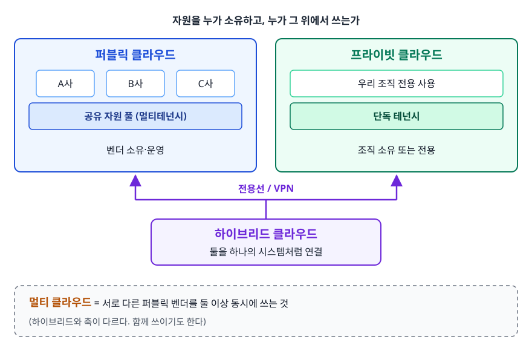
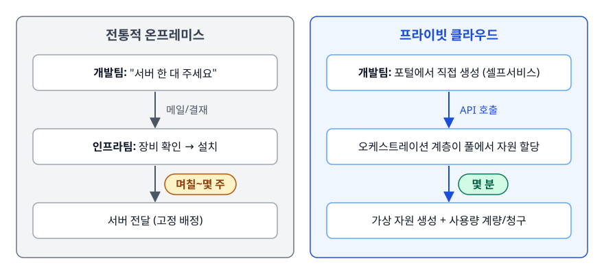
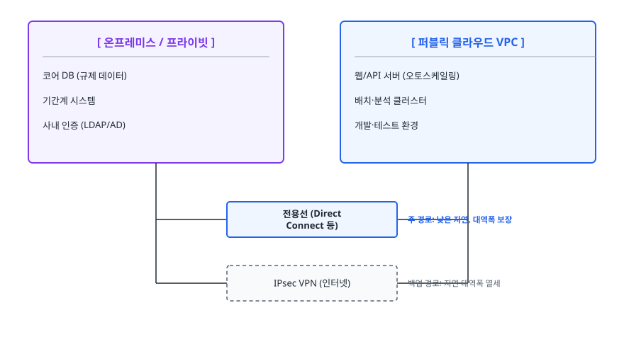
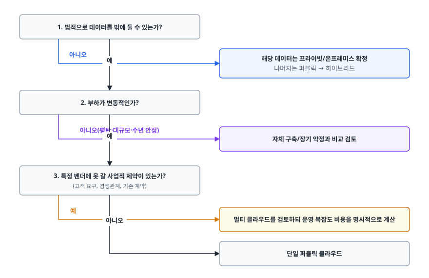

# 클라우드 배포 모델 (Public / Private / Hybrid / Multi-Cloud)

> 모두가 결국 퍼블릭 클라우드로 간다는 건 오해입니다. 규제·데이터 주권·락인·비용이 각각 어떤 선택을 강제하는지 이 문서에서 가려내고, 기존 시스템을 옮길 때 쓰는 6R 전략까지 설명합니다.

## 학습 목표

- [ ] 네 가지 배포 모델의 차이를 소유·통제·책임 관점에서 설명할 수 있다
- [ ] "규제 때문에 프라이빗"이라는 말이 구체적으로 무엇을 뜻하는지 안다
- [ ] 벤더 락인이 실제로 어느 계층에서 발생하는지 구분할 수 있다
- [ ] 멀티 클라우드의 이득과 그 대가(운영 복잡도)를 저울질할 수 있다
- [ ] 마이그레이션 6R 전략을 상황에 맞게 고를 수 있다

## 선행 지식

- [01-cloud-computing-basics.md](./01-cloud-computing-basics.md) - 클라우드의 5대 특성과 IaaS/PaaS/SaaS 책임 경계

---

## 1. 왜 필요한가 — 퍼블릭 클라우드가 정답이 아닌 경우

1편에서 클라우드가 온프레미스의 세 가지 벽을 넘었다고 했습니다. 그러면 왜 아직도 자체 데이터센터를 운영하는 회사가 있을까요? 이유는 감성이나 관성이 아니라 네 가지 구체적 제약입니다.

**규제.** 국내 금융·공공 분야는 클라우드를 쓰기 전에 별도의 절차를 밟아야 합니다. 공공기관은 클라우드 보안인증(CSAP)을 받은 사업자만 이용할 수 있고, 금융권은 중요도 평가와 안전성 점검, 망 분리 요건을 통과해야 합니다. "기술적으로 되니까 쓰자"가 통하지 않는 영역입니다.

**데이터 주권(Data Sovereignty).** 데이터는 저장된 나라의 법을 따릅니다. EU 개인정보를 역외로 옮기려면 GDPR이 정한 근거가 있어야 하고, 국가별로 특정 유형의 데이터를 국경 밖으로 내보내지 못하게 하는 규정도 있습니다. 그래서 "어느 리전에 두느냐"가 아키텍처가 아니라 법무 이슈가 됩니다.

**락인(Vendor Lock-in).** 한 벤더의 관리형 서비스에 깊이 들어갈수록 나가기 어려워집니다. 협상력이 사라집니다. 그 벤더의 대형 장애가 곧 우리 서비스의 대형 장애가 됩니다.

**비용.** 부하가 평탄하고 규모가 크며 수년간 안정적이라면 자체 구축이 더 쌀 수 있습니다. 실제로 크게 성장한 뒤 일부 워크로드를 자체 인프라로 되돌린 사례가 알려져 있습니다.

이 네 가지가 서로 다른 강도로 걸리기 때문에 정답은 하나가 아닙니다. 그래서 **배포 모델(Deployment Model)이라는** 선택지가 생깁니다.

<!-- diagram:cloud-public-private-hybrid-1 -->


<!-- 위 그림이 대체한 원본 ASCII.
     내용을 고칠 때는 그림도 함께 갱신할 것.
```
                  자원을 누가 소유하고, 누가 그 위에서 쓰는가

  ┌──────────────────────┐        ┌──────────────────────┐
  │   퍼블릭 클라우드      │        │   프라이빗 클라우드    │
  │  ┌────┐┌────┐┌────┐  │        │  ┌──────────────┐    │
  │  │ A사││ B사││ C사│  │        │  │   우리 조직    │    │
  │  └────┘└────┘└────┘  │        │  │   전용 사용    │    │
  │   공유 자원 풀        │        │  └──────────────┘    │
  │   (멀티테넌시)        │        │   단독 테넌시         │
  │   벤더 소유·운영      │        │   조직 소유 또는 전용  │
  └──────────────────────┘        └──────────────────────┘
              ▲                              ▲
              └───────── 전용선 / VPN ────────┘
                            │
                  ┌─────────┴─────────┐
                  │  하이브리드 클라우드 │  둘을 하나의 시스템처럼 연결
                  └───────────────────┘

  멀티 클라우드 = 서로 다른 퍼블릭 벤더를 둘 이상 동시에 쓰는 것
                 (하이브리드와 축이 다르다. 함께 쓰이기도 한다)
```
-->

---

## 2. 퍼블릭 클라우드 (Public Cloud)

### 정의와 동작

AWS, Azure, GCP, NCP처럼 벤더가 소유·운영하는 인프라를 불특정 다수 고객이 **공유**해서 씁니다. 물리 서버 한 대 위에 여러 고객의 가상 머신이 함께 돌아갑니다. 이런 **멀티테넌시(Multi-tenancy)가** 전제입니다.

단가가 낮아지는 원리부터 짚고 가겠습니다. 고객마다 트래픽 피크 시각이 다르니 자원을 풀로 모으면 **전체 풀의 피크는 개별 피크의 합보다 훨씬 작습니다.** 벤더는 이 차이만큼 적은 하드웨어로 같은 수요를 감당하고, 그 이득의 일부를 가격에 반영합니다. 개별 회사가 자기 피크에 맞춰 서버를 사는 방식으로는 절대 나올 수 없는 효율입니다.

> **비유** — 공유 오피스와 같습니다. 회의실이 필요할 때만 예약하고 시간당 요금을 냅니다. 회사마다 회의 시간대가 다르니 건물 전체로 보면 회의실 개수가 입주사 수보다 훨씬 적어도 됩니다.
>
> **비유의 한계** — 공유 오피스에서는 옆 회사가 나가도 내 자리가 안 바뀝니다. 하지만 클라우드에서는 같은 물리 호스트를 쓰는 다른 테넌트의 부하가 내 성능에 영향을 줄 수 있습니다(이른바 noisy neighbor). 이걸 막으려면 전용 호스트 옵션처럼 격리 수준을 올려야 하고, 그러면 단가 이점이 줄어듭니다.

### 채택 이유와 대가

- **이유**: 즉시 시작, 무제한에 가까운 확장, 글로벌 리전, 관리형 서비스의 폭
- **대가**: 벤더 정책에 종속, 규제 대응을 별도로 증빙해야 함, 비용이 사용량에 비례해 무한정 늘 수 있음

---

## 3. 프라이빗 클라우드 (Private Cloud)

### 온프레미스와 뭐가 다른가

가장 많이 헷갈리는 지점입니다. **서버를 우리 건물에 두는 것 자체는 프라이빗 클라우드가 아닙니다.** 1편에서 본 5대 특성 — 셀프서비스, 네트워크 접근, 자원 풀링, 탄력성, 계량 — 이 갖춰져야 클라우드입니다.

<!-- diagram:cloud-public-private-hybrid-2 -->


<!-- 위 그림이 대체한 원본 ASCII.
     내용을 고칠 때는 그림도 함께 갱신할 것.
```
[ 전통적 온프레미스 ]              [ 프라이빗 클라우드 ]

  개발팀: "서버 한 대 주세요"        개발팀: 포털에서 직접 생성 (셀프서비스)
     ↓ 메일/결재                        ↓ API 호출
  인프라팀: 장비 확인 → 설치           오케스트레이션 계층이 풀에서 자원 할당
     ↓ 며칠~몇 주                       ↓ 몇 분
  서버 전달 (고정 배정)                가상 자원 생성 + 사용량 계량/청구
```
-->

이 오케스트레이션 계층을 만드는 데 OpenStack이나 VMware 계열 스택이 쓰입니다. 여기까지 만들어야 "우리 데이터센터인데 퍼블릭 클라우드처럼 쓸 수 있는" 상태가 됩니다.

또 하나. 프라이빗 클라우드가 반드시 우리 건물에 있을 필요는 없습니다. **호스티드 프라이빗**은 벤더 데이터센터에 있되 하드웨어가 우리 조직 전용으로 격리된 형태입니다. 판단 기준은 위치가 아니라 **단독 테넌시 여부**입니다.

### 채택 이유와 대가

- **이유**: 규제 대응, 데이터 주권, 물리 격리가 필요한 워크로드, 하드웨어 수준 커스터마이징
- **대가**: 초기 투자와 감가상각이 그대로 돌아옵니다. 용량 산정 문제도 다시 생깁니다. 게다가 오케스트레이션 계층을 운영할 인력이 추가로 필요합니다. "클라우드의 편의성"을 얻는 대신 "클라우드를 직접 운영하는 부담"이 붙습니다.

---

## 4. 하이브리드 클라우드 (Hybrid Cloud)

### 왜 섞는가

전부 퍼블릭으로 갈 수 없고 전부 프라이빗으로 남을 수도 없을 때 나오는 답입니다. 전형적인 형태는 이렇습니다.

- 개인정보·거래 원장 같은 규제 데이터는 프라이빗에 남깁니다
- 프런트엔드, 배치 분석, 개발/테스트 환경은 퍼블릭에 둡니다
- 둘을 전용선이나 VPN으로 연결해 하나의 네트워크처럼 다룹니다

<!-- diagram:cloud-public-private-hybrid-3 -->


<!-- 위 그림이 대체한 원본 ASCII.
     내용을 고칠 때는 그림도 함께 갱신할 것.
```
        [ 온프레미스 / 프라이빗 ]                 [ 퍼블릭 클라우드 VPC ]
   ┌──────────────────────────────┐        ┌──────────────────────────────┐
   │  코어 DB (규제 데이터)         │        │  웹/API 서버 (오토스케일링)    │
   │  기간계 시스템                 │        │  배치·분석 클러스터            │
   │  사내 인증 (LDAP/AD)          │        │  개발·테스트 환경             │
   └──────────────┬───────────────┘        └──────────────┬───────────────┘
                  │                                       │
                  │        ┌───────────────────┐          │
                  ├────────┤ 전용선 (Direct     ├──────────┤  주 경로: 낮은 지연, 대역폭 보장
                  │        │ Connect 등)       │          │
                  │        └───────────────────┘          │
                  │        ┌───────────────────┐          │
                  └────────┤ IPsec VPN (인터넷) ├──────────┘  백업 경로: 지연·대역폭 열세
                           └───────────────────┘
```
-->

### 실제로 어려운 부분

하이브리드는 그림보다 운영이 훨씬 어렵습니다. 신입이 놓치기 쉬운 세 가지를 짚습니다.

**1) 연결 구간이 새로운 단일 장애점(SPOF)이 됩니다.** 전용선 한 가닥으로 연결해 두면 그 회선이 곧 서비스의 목숨줄입니다. 그래서 실무에서는 서로 다른 물리 경로의 회선 이중화, 또는 전용선 + VPN 백업 구성을 씁니다.

**2) 데이터 중력(Data Gravity).** 데이터는 무겁고 애플리케이션은 데이터 근처로 끌려갑니다. 큰 테이블이 온프레미스에 있는데 조인하는 애플리케이션만 클라우드에 올리면, 요청마다 경계를 넘나들며 지연과 전송 비용이 누적됩니다. **경계를 넘는 왕복 횟수**를 설계 시점에 세어 봐야 합니다.

**3) 클라우드 버스팅의 현실.** "평소엔 온프레미스, 피크 때만 퍼블릭으로 넘친다"는 아이디어는 매력적입니다. 하지만 이미지·설정·시크릿·모니터링을 양쪽에 동기화해 두어야 하고, 데이터 접근 지연도 걸립니다. 상태가 거의 없는 워크로드(렌더링, 배치 계산)에서는 잘 동작합니다. 상태가 많은 트랜잭션 서비스에서는 기대만큼 매끄럽지 않습니다.

---

## 5. 멀티 클라우드 (Multi-Cloud)

### 왜 쓰는가

- **락인 회피와 협상력**: 대체재가 있다는 사실 자체가 계약 조건을 바꿉니다
- **서비스 최적 선택**: 특정 영역에서 벤더별 강점이 다릅니다
- **규제/고객 요구**: 고객사가 특정 클라우드 사용을 요구하는 경우
- **의도치 않은 결과**: 인수합병으로 서로 다른 클라우드를 쓰던 조직이 합쳐지는 경우가 실제로 가장 흔합니다

### 대가를 반드시 계산하라

멀티 클라우드는 안전장치처럼 보이지만 비용이 큽니다.

- **최소공통분모 아키텍처**: 양쪽에서 다 돌리려면 각 벤더의 좋은 관리형 서비스를 못 쓰고 공통 기능만 쓰게 됩니다. 그러면 애초에 클라우드를 쓰는 이유의 절반이 사라집니다.
- **운영 복잡도의 곱셈**: IAM 모델, 네트워크 개념, 모니터링, 비용 관리, 장애 대응 절차가 벤더마다 다릅니다. 팀이 배워야 할 양이 두 배가 됩니다.
- **데이터 전송 비용**: 클라우드 밖으로 나가는 트래픽에는 과금이 붙습니다. 두 클라우드에 걸쳐 데이터를 주고받는 아키텍처는 조용히 비용을 키웁니다.

그래서 실무에서 자주 쓰는 절충안은 **"핵심 워크로드는 한 클라우드에, 이식성은 추상화 계층으로 확보"입니다**. 컨테이너와 쿠버네티스, Terraform 같은 IaC 도구가 그 계층 역할을 합니다. 다만 만능은 아닙니다. 다음 절에서 이어 보겠습니다.

### 락인은 어느 계층에서 생기는가

락인을 뭉뚱그리면 대응할 수 없습니다. 계층별로 이동 난이도가 완전히 다릅니다.

| 계층 | 이동 난이도 | 이유 |
|------|-----------|------|
| 컴퓨트(컨테이너/VM) | 낮음 | 이미지가 표준화돼 있어 어디서든 뜬다 |
| IaC / 배포 파이프라인 | 중간 | 도구는 같아도 리소스 정의가 벤더별로 다르다 |
| 네트워크·IAM | 높음 | 개념 자체가 벤더마다 달라 재설계에 가깝다 |
| 관리형 데이터 서비스 | 높음 | 독자 API·기능에 코드가 묶인다 |
| 데이터 자체 | 가장 높음 | 용량이 클수록 이전 시간·전송 비용·정합성 검증 부담이 커진다 |

**표 아래 한 줄**: 락인을 줄이려면 컴퓨트를 표준화하는 것만으로는 부족합니다. 데이터 배치와 관리형 서비스 의존도가 진짜 결정 요인입니다.

---

## 6. 네 모델 비교와 선택 기준

| 구분 | 퍼블릭 | 프라이빗 | 하이브리드 | 멀티 클라우드 |
|------|--------|---------|-----------|-------------|
| 인프라 소유 | 벤더 | 조직(또는 전용 임대) | 양쪽 | 복수 벤더 |
| 테넌시 | 공유 | 단독 | 혼합 | 공유(각 벤더) |
| 초기 비용 | 거의 없음 | 큼 | 중간 | 거의 없음 |
| 확장 속도 | 즉시 | 구매한 용량 내 | 부분적으로 즉시 | 즉시 |
| 규제 대응 | 증빙 필요 | 유리 | 데이터 위치를 나눠 대응 | 벤더별로 각각 증빙 |
| 운영 난도 | 낮음 | 높음 | 높음 | 가장 높음 |
| 대표적 선택 이유 | 속도와 탄력성 | 규제·데이터 주권 | 둘 다 필요할 때 | 락인 회피·협상력 |
| 그래서 언제 | 신규 서비스 대부분 | 규제 워크로드, 대규모 평탄 부하 | 기간계는 남기고 신규만 클라우드로 | 명확한 사업적 이유가 있을 때만 |

### 결정 순서

실무에서는 아래 순서로 좁히면 대체로 답이 나옵니다.

<!-- diagram:cloud-public-private-hybrid-4 -->


<!-- 위 그림이 대체한 원본 ASCII.
     내용을 고칠 때는 그림도 함께 갱신할 것.
```
1. 법적으로 데이터를 밖에 둘 수 있는가?
   ├─ 아니오 ──▶ 해당 데이터는 프라이빗/온프레미스 확정
   │             나머지는 퍼블릭 → 하이브리드
   └─ 예
        ↓
2. 부하가 변동적인가?
   ├─ 아니오(평탄·대규모·수년 안정) ──▶ 자체 구축/장기 약정과 비교 검토
   └─ 예
        ↓
3. 특정 벤더에 못 갈 사업적 제약이 있는가? (고객 요구, 경쟁관계, 기존 계약)
   ├─ 예 ──▶ 멀티 클라우드를 검토하되 운영 복잡도 비용을 명시적으로 계산
   └─ 아니오 ──▶ 단일 퍼블릭 클라우드
```
-->

이 결정의 핵심은 **"멀티 클라우드는 기본값이 아니다"는** 한마디입니다. 명확한 사업적 이유 없이 "혹시 모르니까" 두 클라우드를 쓰는 결정은 대개 손해로 끝납니다.

---

## 7. 마이그레이션 6R 전략

기존 시스템을 클라우드로 옮길 때, 애플리케이션마다 옮기는 방식이 달라야 합니다. AWS가 정리한 **6R**이 업계 공통 언어로 쓰입니다.

| 전략 | 하는 일 | 속도 | 클라우드 이점 활용 | 적합한 대상 |
|------|--------|------|------------------|-----------|
| **Rehost** (Lift & Shift) | 코드 변경 없이 VM 단위로 그대로 옮김 | 가장 빠름 | 낮음 | 데이터센터 계약 만료 임박, 일단 나가야 할 때 |
| **Replatform** (Lift, Tinker & Shift) | 구조는 유지하되 일부를 관리형으로 교체(예: 자체 DB → 관리형 DB) | 빠름 | 중간 | 운영 부담이 큰 미들웨어를 가진 시스템 |
| **Repurchase** (Drop & Shop) | 직접 운영하던 소프트웨어를 SaaS로 대체 | 중간 | 높음 | 그룹웨어, CRM처럼 차별화 요소가 아닌 영역 |
| **Refactor / Re-architect** | 클라우드 네이티브로 재설계(분해, 서버리스화) | 가장 느림 | 가장 높음 | 지속 투자할 핵심 서비스, 확장 한계에 부딪힌 시스템 |
| **Retire** | 그냥 없앤다 | 즉시 | - | 아무도 안 쓰는데 살아 있는 시스템 |
| **Retain** | 옮기지 않고 그대로 둔다 | - | - | 규제상 못 옮기거나, 곧 폐기 예정인 시스템 |

**표 아래 한 줄**: 6R은 "무엇이 우월한가"가 아니라 "이 시스템에 지금 얼마를 투자할 가치가 있는가"의 문제입니다.

실무 순서도 정해져 있습니다. 먼저 **인벤토리를 만들고**(무엇이 몇 개나 돌고 있는지 아무도 모르는 경우가 대부분입니다), Retire와 Retain으로 대상을 줄인 뒤, 남은 것에 Rehost/Replatform/Repurchase/Refactor를 배분합니다. 처음부터 전부 Refactor하겠다는 계획은 거의 실패합니다.

> **비유** — 이사와 같습니다. 짐을 통째로 트럭에 싣는 게 Rehost, 낡은 가전만 새로 사는 게 Replatform입니다. 살림살이를 정리하고 구조를 새로 짜는 게 Refactor, 안 쓰는 물건을 버리는 게 Retire입니다.
>
> **비유의 한계** — 그럼 이 비유는 어디서 무너질까요? 이사는 끝나면 끝이지만, 마이그레이션은 옮긴 뒤에 운영 모델·비용 구조·조직 역할까지 바꿔야 완결됩니다. 옮겨만 놓고 온프레미스 시절 습관대로 운영하면 비용만 오르고 이점은 안 생깁니다.

---

## 8. 실무에서는 — 하이브리드 연결이 무너질 때

**증상.** 매일 새벽 도는 정산 배치가 평소엔 20분에 끝났는데 세 시간 넘게 걸리기 시작했습니다. 온프레미스에서 도는 배치가 클라우드 VPC 안의 DB를 조회하는 구조입니다. 애플리케이션 로그에는 에러가 없고 그냥 느립니다.

**진단.**

```bash
# 1) 경로와 구간별 지연·손실을 먼저 본다 (어디서 느려지는지)
mtr -rwzc 100 10.20.0.15

# 2) 전용선 상태 확인 — down 되어 있지 않은지
aws directconnect describe-connections
aws directconnect describe-virtual-interfaces \
  --query "virtualInterfaces[].{Id:virtualInterfaceId,State:virtualInterfaceState}"

# 3) 백업 경로인 VPN 터널이 올라와 있는지 (올라와 있다면 이미 페일오버된 것)
aws ec2 describe-vpn-connections \
  --query "VpnConnections[].{Id:VpnConnectionId,State:State,Tunnel:VgwTelemetry[].Status}"

# 4) 이름 해석이 엉뚱한 쪽을 가리키고 있지 않은지
dig +short db.internal.example.com @10.20.0.2
```

**원인.** 전용선이 벤더 유지보수로 내려가면서 트래픽이 백업 IPsec VPN(공용 인터넷 경유)으로 넘어갔습니다. 경로가 살아 있으니 에러는 없지만 왕복 지연이 크게 늘었습니다. 문제는 배치 쿼리가 행 단위로 왕복하는 패턴입니다. **지연 증가가 왕복 횟수만큼 곱해져** 전체 소요 시간이 폭증했습니다.

**대응.**

1. **즉시**: 배치를 일시 중단하고 전용선 복구 후 재실행하거나, 우선순위 낮은 단계를 건너뜁니다.
2. **단기**: 왕복 횟수를 줄입니다. 행 단위 조회를 배치 페치로 바꾸고 집계는 DB 쪽에서 끝내서 결과만 가져옵니다.
3. **구조적**: 회선을 서로 다른 물리 경로로 이중화합니다. 그리고 **지연에 민감한 연산은 데이터가 있는 쪽에 배치합니다** — 배치 잡 자체를 클라우드로 옮기는 것이 근본 해법입니다.
4. **관측**: 구간 지연과 회선 상태에 알람을 겁니다. 느려짐은 에러 로그에 안 남으므로 지표로만 잡을 수 있습니다.

**교훈.** 하이브리드에서 네트워크 구간은 **새로 생긴 SPOF이자 성능 변수**입니다. 온프레미스 안에서는 무시해도 됐던 왕복 지연이, 경계를 넘는 순간 아키텍처의 제약 조건이 됩니다.

---

## 9. 면접 포인트

> 면접에서 이 주제가 나오면 이렇게 답한다

**Q. 퍼블릭·프라이빗·하이브리드를 어떤 기준으로 선택하나요?**

A. 저는 규제 → 부하 패턴 → 벤더 제약 순서로 좁힙니다. 먼저 법적으로 데이터를 밖에 둘 수 있는지 확인하고 못 두는 데이터가 있으면 그 부분만 프라이빗에 남겨 하이브리드가 됩니다. 그다음 부하가 변동적인지 봅니다. 평탄하고 대규모라면 자체 구축이나 장기 약정과 비교합니다. 마지막으로 특정 벤더를 못 쓸 사업적 이유가 있는지 확인합니다.

- 꼬리 질문: "규제 때문에 프라이빗이라는 게 구체적으로 뭐죠?" → 공공은 CSAP 인증 사업자 제한, 금융은 중요도 평가와 망 분리 요건처럼 사전 절차가 있다는 점을 듭니다.

**Q. 벤더 락인을 피하려면 멀티 클라우드를 써야 하나요?**

A. 자동으로 그렇게 되지는 않습니다. 락인은 계층마다 강도가 다른데, 컨테이너 같은 컴퓨트는 옮기기 쉽고 관리형 데이터 서비스와 데이터 자체가 가장 어렵습니다. 멀티 클라우드로 가면 각 벤더의 좋은 관리형 서비스를 못 쓰는 최소공통분모 아키텍처가 되기 쉽고, 운영 복잡도와 전송 비용이 늘어납니다. 저라면 단일 클라우드를 쓰되 IaC와 컨테이너로 이식성을 확보하고, 데이터 이전 계획을 문서로 남겨 두는 쪽을 택하겠습니다.

- 꼬리 질문: "그래도 멀티 클라우드가 타당한 경우는?" → 고객사 요구, 규제, 인수합병 결과처럼 사업적으로 강제되는 경우.

**Q. 하이브리드 구성에서 가장 주의할 점은 무엇인가요?**

A. 연결 구간입니다. 전용선 한 가닥이면 그게 곧 SPOF이므로, 물리 경로가 다른 회선으로 이중화하거나 VPN 백업을 둡니다. 그리고 데이터 중력을 고려해야 합니다. 데이터가 한쪽에 있는데 그걸 자주 읽는 애플리케이션이 반대편에 있으면, 왕복 지연과 전송 비용이 계속 쌓입니다. 설계할 때 경계를 넘는 왕복 횟수를 세어 봅니다.

- 꼬리 질문: "회선이 살아 있는데 느려지는 상황은 어떻게 감지하나요?" → 에러 로그에 안 남으므로 구간 지연·손실 지표와 회선 상태 알람으로 잡습니다.

**Q. 레거시 시스템 30개를 클라우드로 옮기라는 과제를 받으면 어떻게 시작하겠습니까?**

A. 먼저 인벤토리와 의존 관계를 파악합니다. 실제로 안 쓰는 시스템이 꽤 나오는데, 그건 Retire, 규제나 폐기 예정이면 Retain으로 대상에서 뺍니다. 남은 것 중 데이터센터 계약 같은 시간 제약이 있으면 Rehost로 먼저 나가고, 운영 부담이 큰 DB나 미들웨어는 Replatform으로 관리형으로 바꿉니다. 차별화 요소가 아닌 영역은 Repurchase로 SaaS 대체를 검토하고, 계속 투자할 핵심 서비스만 Refactor합니다.

- 꼬리 질문: "전부 Refactor하면 안 되나요?" → 기간과 리스크가 감당되지 않고, 옮기기 전에 재설계하면 검증 기준이 사라져 문제 원인을 분리하기 어려워진다는 점을 듭니다.

---

## 자주 하는 실수

| 실수 | 왜 틀렸나 | 올바른 이해 |
|------|----------|-----------|
| "온프레미스 = 프라이빗 클라우드" | 서버 위치의 문제가 아니다 | 셀프서비스·풀링·탄력성·계량이 있어야 클라우드입니다. 위치가 아니라 **단독 테넌시 + 클라우드 특성** |
| "프라이빗 클라우드가 더 안전하다" | 안전성은 배포 모델이 아니라 설정과 운영 수준이 결정한다 | 인력이 부족한 조직의 프라이빗이 잘 설정된 퍼블릭보다 위험한 경우가 흔하다 |
| "멀티 클라우드면 한 벤더가 죽어도 안전하다" | 실제 페일오버는 데이터 복제·DNS·인증까지 양쪽에 준비돼 있어야 동작한다 | 준비 없이 계정만 두 개인 것은 이중화가 아니라 비용 두 배다 |
| "컨테이너를 쓰니 락인이 없다" | 컴퓨트만 표준화된 것이다 | 관리형 서비스, IAM, 네트워크, 그리고 데이터가 진짜 락인 지점 |
| "하이브리드는 전용선만 깔면 된다" | 회선은 새로운 SPOF이고 지연은 아키텍처 제약이 된다 | 회선 이중화 + 왕복 횟수를 줄이는 설계가 함께 필요 |
| "일단 Lift & Shift 하면 클라우드 이점을 얻는다" | 옮기기만 하면 온프레미스 구조 그대로 요금만 낸다 | Rehost는 출발점입니다. 이후 Replatform/Refactor로 이어져야 이점이 생긴다 |

---

## 한 줄 정리

배포 모델 선택은 기술 취향이 아니라 **규제·데이터 주권·부하 패턴·락인 리스크**라는 네 개의 제약을 어떤 순서로 푸느냐의 문제입니다. 멀티 클라우드는 기본값이 아니라 명확한 사업적 이유가 있을 때만 지불할 가치가 있는 비용입니다.

---

## 연관 개념

- [01-cloud-computing-basics.md](./01-cloud-computing-basics.md) - 클라우드의 5대 특성과 책임 경계, 과금 모델
- [02-virtualization-hypervisor.md](./02-virtualization-hypervisor.md) - 프라이빗 클라우드의 자원 풀링을 떠받치는 가상화 기술
- [04-scalability-availability.md](./04-scalability-availability.md) - 어느 모델을 쓰든 필요한 확장성·가용성 설계
- [qna-cloud-fundamentals.md](./qna-cloud-fundamentals.md) - 이 주제의 면접 질문 모음
- [../aws/qna-aws.md](../aws/qna-aws.md) - VPC, 리전/AZ 등 퍼블릭 클라우드 서비스 수준의 질문
- [../linux-networking/qna-linux-networking.md](../linux-networking/qna-linux-networking.md) - 하이브리드 연결 진단에 필요한 네트워크 기초
- [../../09-system-design/qna-infrastructure.md](../../09-system-design/qna-infrastructure.md) - 로드 밸런서·인프라 설계 관점의 질문
