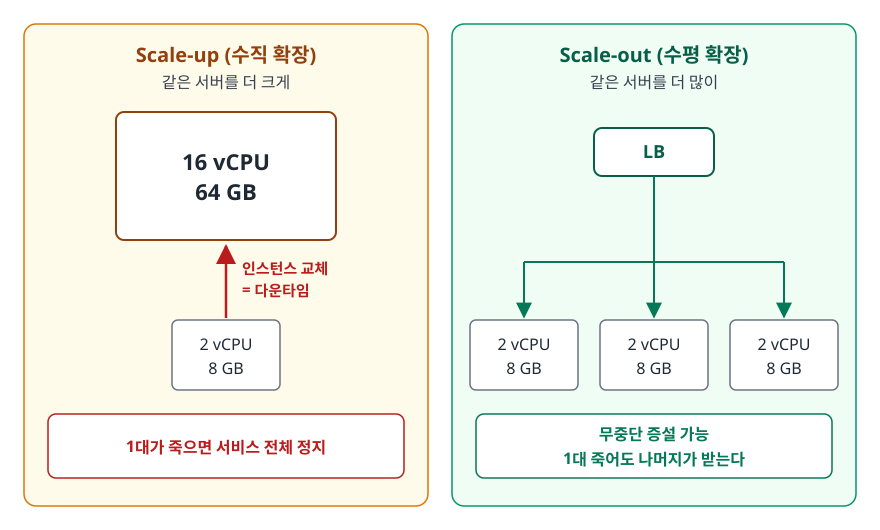
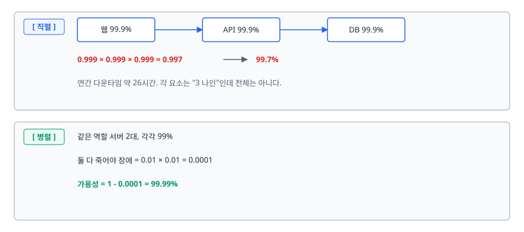
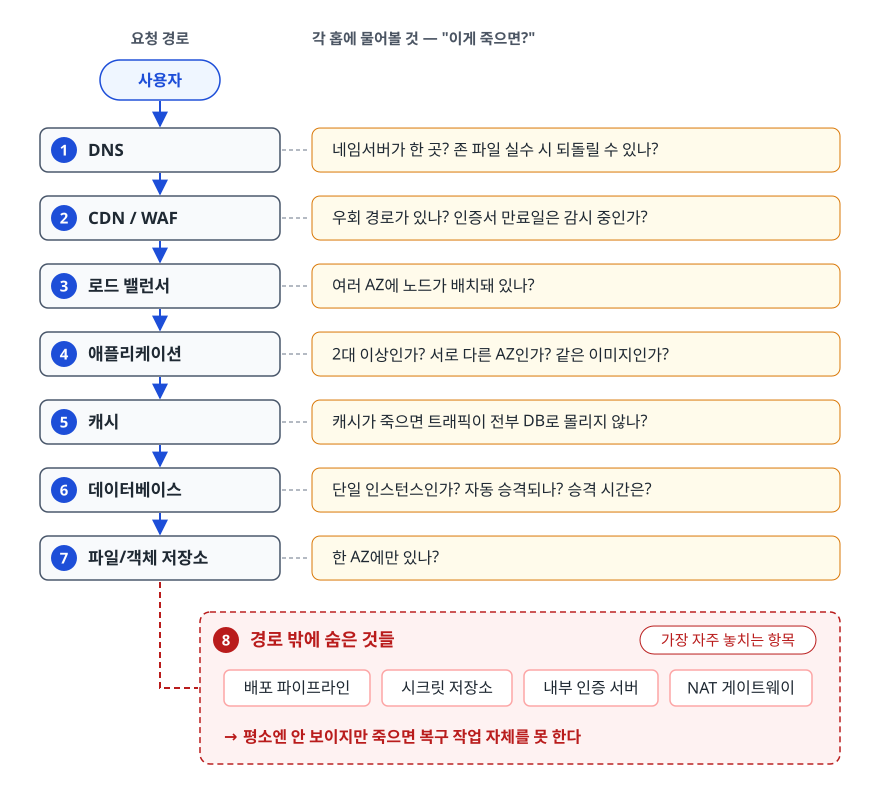
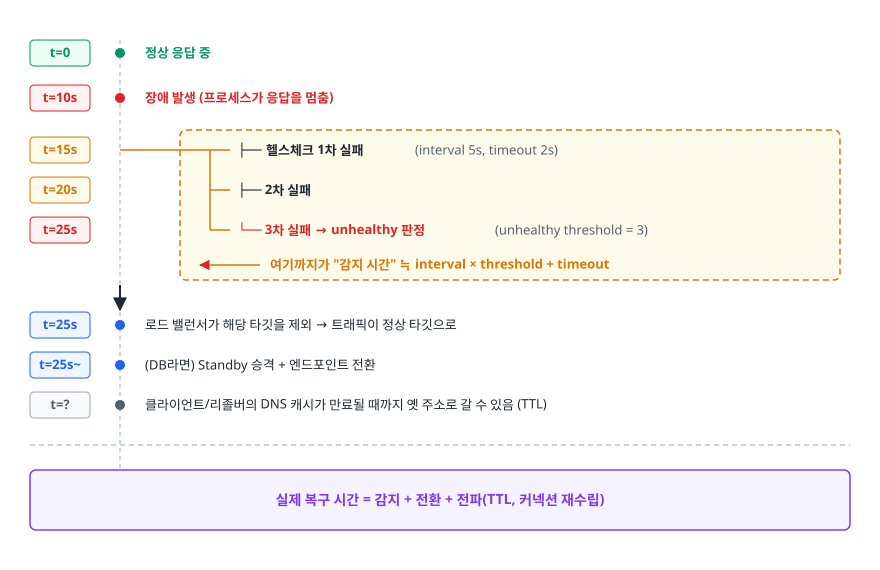
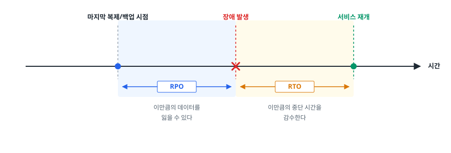

# 확장성과 고가용성 (Scalability & High Availability)

> 서버를 키우면 손쉬운 대신 상한에 막히고, 늘리면 상한이 없는 대신 설계를 바꿔야 합니다. 여기에 가용성 99.99%가 실제로 몇 분의 다운타임인지, SPOF를 어떻게 찾고 RTO/RPO에 맞춰 DR 전략을 고르는지까지 설명합니다.

## 학습 목표

- [ ] Scale-up과 Scale-out의 한계를 각각 근거를 들어 설명할 수 있다
- [ ] 가용성 숫자를 실제 다운타임으로 환산하고, 직렬/병렬 구성의 가용성을 계산할 수 있다
- [ ] 요청 경로를 따라가며 SPOF를 찾아낼 수 있다
- [ ] 헬스체크 설정이 장애 감지 시간을 어떻게 결정하는지 안다
- [ ] RTO/RPO 요구사항에서 DR 전략을 역산할 수 있다

## 선행 지식

- [01-cloud-computing-basics.md](./01-cloud-computing-basics.md) - 클라우드의 탄력성, 리전과 가용 영역

---

## 1. 왜 필요한가 — 서버 한 대의 운명

서버 한 대로 서비스를 시작하면 반드시 찾아오는 사건이 있습니다.

**첫째, 트래픽이 늘어 감당이 안 되는 순간.** 응답이 느려지고, 큐가 쌓이고, 타임아웃이 번지고, 재시도가 부하를 더 키웁니다. **확장성(Scalability)이** 여기서 필요해집니다. 자원을 늘려 처리량을 올릴 수 있는 성질입니다.

**둘째, 그 한 대가 죽는 순간.** 디스크가 고장 나거나, 커널 패닉이 나거나, 그 서버가 있는 데이터센터에 정전이 납니다. 확률이 낮아도 시간이 길어지면 반드시 일어납니다. 이때 필요한 것이 **고가용성(High Availability, HA)** — 일부가 죽어도 서비스가 계속되는 성질입니다.

두 개념은 자주 함께 묶이지만 목표가 다릅니다. 확장성은 **처리량**을 다루고, 가용성은 **연속성**을 지킵니다. 서버를 100대로 늘려도 전부 같은 랙에 있으면 확장성은 얻고 가용성은 못 얻습니다. 반대로 이중화만 해 두고 용량이 부족하면 죽지는 않지만 느려서 못 씁니다.

> **비유** — 식당의 셰프와 같습니다. 주문이 밀리면 셰프를 더 뽑거나(수평 확장) 한 명을 더 숙련되게 만듭니다(수직 확장). 그런데 오븐이 하나뿐이면 셰프를 아무리 늘려도 처리량은 오븐에서 막힙니다. 이 오븐이 시스템의 병목이자 SPOF입니다.
>
> **비유의 한계** — 비유는 여기까지입니다. 셰프는 옆 사람이 쓰러지면 알아서 일을 넘겨받지만, 서버는 아무도 그런 판단을 대신 해 주지 않습니다. 헬스체크와 페일오버를 **명시적으로 만들어 두어야** 그 일이 일어납니다.

---

## 2. Scale-up vs Scale-out

### 2.1 두 방향

<!-- diagram:cloud-scalability-availability-1 -->


<!-- 위 그림이 대체한 원본 ASCII.
     내용을 고칠 때는 그림도 함께 갱신할 것.
```
[ Scale-up (수직 확장) ]              [ Scale-out (수평 확장) ]

      ┌──────────┐                          ┌────────┐
      │          │                          │   LB   │
      │ 16 vCPU  │  같은 서버를              └───┬────┘
      │  64 GB   │  더 크게              ┌───────┼───────┐
      │          │                    ┌──┴──┐ ┌──┴──┐ ┌──┴──┐
      └──────────┘                    │2vCPU│ │2vCPU│ │2vCPU│  같은 서버를
           ▲                          │ 8GB │ │ 8GB │ │ 8GB │  더 많이
           │ 인스턴스 교체 = 다운타임    └─────┘ └─────┘ └─────┘
      ┌──────────┐                    무중단 증설 가능
      │  2 vCPU  │                    1대 죽어도 나머지가 받는다
      │   8 GB   │
      └──────────┘
      1대가 죽으면 서비스 전체 정지
```
-->

### 2.2 Scale-up의 한계

수직 확장은 코드를 안 고쳐도 되므로 가장 손쉬운 첫 수단입니다. 하지만 벽이 있습니다.

1. **물리적 상한**: 한 대에 넣을 수 있는 코어와 메모리에는 끝이 있습니다. 최상위 인스턴스 타입에 도달하면 더는 올릴 곳이 없습니다.
2. **가격의 비선형성**: 사양이 두 배가 될 때 가격은 두 배 이상이 되는 구간이 생깁니다. 고사양 구간일수록 단가 효율이 나빠집니다.
3. **교체 시 다운타임**: 클라우드에서 인스턴스 타입을 바꾸려면 대개 중지 후 시작이 필요합니다. 즉 **확장 행위 자체가 장애 시간**이 됩니다.
4. **가용성이 전혀 개선되지 않습니다**: 아무리 큰 서버도 한 대는 한 대입니다. SPOF는 그대로 남습니다.

### 2.3 Scale-out이 요구하는 것

수평 확장은 상한이 사실상 없지만, 공짜가 아닙니다. **애플리케이션이 그렇게 설계돼 있어야** 합니다.

- **무상태(Stateless)**: 요청이 어느 인스턴스로 가도 같은 결과가 나와야 합니다. 세션을 메모리에 들고 있으면 다음 요청이 다른 서버로 갔을 때 로그인이 풀립니다. → 세션을 외부 저장소(Redis 등)나 토큰으로 옮깁니다.
- **로컬 디스크 의존 제거**: 업로드 파일을 서버 로컬에 저장하면 다른 서버에서 안 보입니다. → 객체 스토리지로 옮깁니다.
- **트래픽 분배 계층**: 로드 밸런서가 필요하고, 그 자체도 이중화돼 있어야 합니다.
- **스케줄러·배치의 중복 실행 방지**: 인스턴스가 3대면 크론이 3번 돕니다. → 분산 락이나 전용 스케줄러가 필요합니다.

그리고 무엇보다 **병목이 공유 자원에 있으면 늘려도 소용없습니다.** 웹 서버를 10대로 늘려도 모두 같은 DB를 때리고 있으면 처리량은 DB에서 막힙니다. 그래서 확장 작업을 하기 전에 **어디가 병목인지부터 측정**해야 합니다. 직렬로 처리해야 하는 구간의 비중이 클수록 서버를 늘려서 얻는 이득은 빠르게 줄어듭니다(암달의 법칙).

### 2.4 비교

| 항목 | Scale-up (수직) | Scale-out (수평) |
|------|----------------|-----------------|
| 방식 | 인스턴스 사양 상향 | 인스턴스 대수 증가 |
| 상한 | 하드웨어 물리 한계 | 사실상 없음(설계에 달림) |
| 애플리케이션 변경 | 거의 불필요 | 무상태화 등 필요 |
| 확장 중 중단 | 대개 발생 | 없음 |
| 가용성 기여 | 없음 | 큼(SPOF 제거) |
| 비용 곡선 | 고사양일수록 불리 | 대수에 비례 |
| 운영 복잡도 | 낮음 | 높음(LB, 배포, 세션, 관측) |
| 그래서 언제 | 급한 불 끄기, 상태를 나누기 어려운 계층(RDBMS 마스터) | 웹/API 계층, 지속 성장이 예상되는 서비스 |

**표 아래 한 줄**: 웹 계층은 처음부터 Scale-out 가능하게 설계하고, 데이터 계층은 Scale-up으로 버티다가 읽기 복제본 → 샤딩 순으로 넘어가는 것이 일반적인 경로입니다.

---

## 3. 가용성 숫자 읽기

### 3.1 9의 개수가 실제로 얼마인가

가용성은 `정상 동작 시간 / 전체 시간`입니다. "나인(9)이 몇 개냐"로 부르는데, 체감하려면 시간으로 바꿔야 합니다.

| 가용성 | 부르는 말 | 연간 다운타임 | 월간 다운타임 | 감이 오게 하면 |
|--------|----------|-------------|-------------|--------------|
| 99% | Two 9s | 약 3.65일 | 약 7.2시간 | 매달 반나절이 꺼진다 |
| 99.9% | Three 9s | 약 8.8시간 | 약 43.8분 | 매달 점심시간 한 번 |
| 99.95% | - | 약 4.4시간 | 약 21.9분 | 매달 회의 한 번 |
| 99.99% | Four 9s | 약 52.6분 | 약 4.4분 | 배포 실패 한 번이면 소진 |
| 99.999% | Five 9s | 약 5.3분 | 약 26초 | 사람이 개입할 시간이 없다 |

**99.99%부터는 사람이 알아채고 조치하는 방식으로는 도달할 수 없습니다.** 알림을 받고 노트북을 열고 원인을 파악하는 데만 몇 분이 걸리기 때문입니다. 그래서 나인이 늘어날수록 비용이 급격히 오릅니다. 오르는 항목은 하드웨어 값보다 **자동화와 검증에 드는 비용** 쪽입니다.

### 3.2 직렬로 붙이면 가용성은 떨어진다

직렬 구성, 곧 구성 요소가 **모두 살아 있어야** 서비스가 되는 구조에서는 가용성이 곱해집니다.

<!-- diagram:cloud-scalability-availability-2 -->


<!-- 위 그림이 대체한 원본 ASCII.
     내용을 고칠 때는 그림도 함께 갱신할 것.
```
[ 직렬 ]  웹 99.9% ──▶ API 99.9% ──▶ DB 99.9%
          0.999 × 0.999 × 0.999 = 0.997  →  99.7%
          연간 다운타임 약 26시간. 각 요소는 "3 나인"인데 전체는 아니다.

[ 병렬 ]  같은 역할 서버 2대, 각각 99%
          둘 다 죽어야 장애 = 0.01 × 0.01 = 0.0001
          가용성 = 1 - 0.0001 = 99.99%
```
-->

같은 부품으로도 **어떻게 엮느냐**에 따라 결과가 완전히 달라집니다. 이게 이중화를 하는 수학적 이유입니다.

단, 병렬 계산에는 전제가 있습니다. **두 서버의 고장이 서로 독립이어야** 합니다. 같은 랙, 같은 전원, 같은 스위치를 쓰면 한 번의 사고로 둘 다 죽어 계산이 무너집니다. 그래서 클라우드에서는 독립성을 확보하려고 **다중 AZ 배치**를 강조합니다. 나아가 같은 버그가 든 같은 이미지를 두 대에 배포했다면 그것도 독립이 아닙니다.

### 3.3 SLA는 보증이 아니라 보상 약정이다

벤더가 제시하는 SLA(Service Level Agreement)는 "이 수치를 못 지키면 요금을 일부 크레딧으로 돌려준다"는 계약입니다. **크레딧을 받는다고 우리 서비스의 장애가 되돌려지지 않습니다.** 그래서 실무에서는 세 가지를 구분해서 씁니다.

- **SLI**(Indicator): 실제로 측정하는 값. 예) 성공 응답 비율, p99 지연
- **SLO**(Objective): 우리가 지키기로 한 내부 목표. 예) 30일 기준 성공률 99.9%
- **SLA**(Agreement): 고객과 맺은 계약과 위반 시 보상

SLO는 SLA보다 빡빡하게 잡습니다. 내부 목표를 어겼을 때 대응할 여유를 두기 위해서입니다.

---

## 4. SPOF 찾기

**단일 장애점(Single Point of Failure, SPOF)은** 그것 하나가 죽으면 전체가 죽는 지점입니다. 찾는 방법은 단순합니다. **요청이 지나가는 경로를 처음부터 끝까지 따라가며 각 홉에 "이게 죽으면?"을 물어보면 됩니다.**

<!-- diagram:cloud-scalability-availability-3 -->


<!-- 위 그림이 대체한 원본 ASCII.
     내용을 고칠 때는 그림도 함께 갱신할 것.
```
사용자
  │
  ▼ (1) DNS ──────────── 네임서버가 한 곳? 존 파일 실수 시 되돌릴 수 있나?
  │
  ▼ (2) CDN / WAF ────── 우회 경로가 있나? 인증서 만료일은 감시 중인가?
  │
  ▼ (3) 로드 밸런서 ───── 여러 AZ에 노드가 배치돼 있나?
  │
  ▼ (4) 애플리케이션 ──── 2대 이상인가? 서로 다른 AZ인가? 같은 이미지인가?
  │
  ▼ (5) 캐시 ─────────── 캐시가 죽으면 트래픽이 전부 DB로 몰리지 않나?
  │
  ▼ (6) 데이터베이스 ──── 단일 인스턴스인가? 자동 승격되나? 승격 시간은?
  │
  ▼ (7) 파일/객체 저장소 ─ 한 AZ에만 있나?
  │
  └─ (8) 경로 밖에 숨은 것들
        배포 파이프라인 / 시크릿 저장소 / 내부 인증 서버 / NAT 게이트웨이
        → 평소엔 안 보이지만 죽으면 복구 작업 자체를 못 한다
```
-->

(8)번이 실전에서 가장 자주 놓치는 항목입니다. 장애가 났는데 배포 시스템이 같이 죽어 롤백을 못 하거나, 시크릿 저장소가 한 AZ에만 있어 새 인스턴스가 부팅에 실패하는 식입니다. **복구에 필요한 도구도 가용성 설계의 대상**입니다.

---

## 5. HA 설계 — 이중화, 헬스체크, 페일오버

### 5.1 이중화 방식 두 가지

| 방식 | 구성 | 페일오버 시간 | 비용 | 주의점 |
|------|------|-------------|------|--------|
| Active-Active | 모든 노드가 동시에 트래픽 처리 | 거의 즉시(정상 노드가 이미 받고 있음) | 자원을 다 쓰므로 효율적 | 한 노드가 빠지면 나머지가 전체 부하를 받아야 함 → 여유 용량 필요 |
| Active-Standby | 한쪽만 처리, 다른 쪽은 대기 | 감지 + 승격 시간만큼 지연 | 대기 자원이 논다 | Standby가 실제로 뜨는지 정기적으로 검증해야 함 |

Active-Active를 쓴다면 반드시 **N+1 용량 계획**을 해야 합니다. 2대로 각각 60%씩 쓰고 있다가 1대가 죽으면 남은 1대가 120%를 받아야 하므로 연쇄 장애가 납니다. 이중화했다는 사실만으로는 안전을 확인할 수 없습니다. 한 대가 빠져도 남은 대수가 전체 부하를 감당하는지까지 확인해야 합니다.

### 5.2 헬스체크가 감지 시간을 결정한다

로드 밸런서는 주기적으로 각 타깃에 요청을 보내 살아 있는지 확인합니다. 여기 설정된 숫자가 그대로 **장애 감지 시간**이 됩니다.

<!-- diagram:cloud-scalability-availability-4 -->


<!-- 위 그림이 대체한 원본 ASCII.
     내용을 고칠 때는 그림도 함께 갱신할 것.
```
 t=0     정상 응답 중
 t=10s   장애 발생 (프로세스가 응답을 멈춤)
         │
 t=15s   ├── 헬스체크 1차 실패        (interval 5s, timeout 2s)
 t=20s   ├── 2차 실패
 t=25s   └── 3차 실패 → unhealthy 판정 (unhealthy threshold = 3)
         │
         │   ◀── 여기까지가 "감지 시간" ≒ interval × threshold + timeout
         ▼
 t=25s   로드 밸런서가 해당 타깃을 제외 → 트래픽이 정상 타깃으로
 t=25s~  (DB라면) Standby 승격 + 엔드포인트 전환
 t=?     클라이언트/리졸버의 DNS 캐시가 만료될 때까지 옛 주소로 갈 수 있음 (TTL)
         ──────────────────────────────────────────────────────────
         실제 복구 시간 = 감지 + 전환 + 전파(TTL, 커넥션 재수립)
```
-->

여기서 판단해야 할 트레이드오프가 있습니다. **간격과 임계치를 낮추면 빨리 감지하지만, 일시적 지연에도 멀쩡한 서버를 빼버립니다.** 반대로 높이면 안정적이지만 장애를 오래 방치합니다. 트래픽 패턴과 애플리케이션의 워밍업 시간을 보고 정해야 합니다.

**헬스체크의 깊이**도 함께 정해야 합니다.

- **얕은 체크(shallow)**: `/health`가 그냥 200을 반환합니다. 프로세스는 살아 있지만 DB 커넥션이 끊겨 실제 요청은 전부 실패하는 상황을 못 잡습니다.
- **깊은 체크(deep)**: DB, 캐시 등 필수 의존성까지 확인합니다. 정확하지만 위험도 있습니다. DB가 잠시 흔들리면 **모든 인스턴스가 동시에 unhealthy가 되어 서비스 전체가 내려갑니다.**

실무의 절충은 이렇습니다. **로드 밸런서용 체크는 이 인스턴스 자신의 상태만 확인하고(얕게), 공유 의존성 상태는 별도 모니터링과 알람으로 잡습니다.** 공유 자원 장애를 인스턴스 제거로 대응하면 상황이 더 나빠집니다.

### 5.3 Multi-AZ와 Multi-Region

- **Multi-AZ**: 같은 리전 안의 물리적으로 분리된 데이터센터에 분산 배치. AZ 간 지연이 매우 낮아 동기 복제가 가능합니다. **일반적인 HA의 기본 단위**입니다.
- **Multi-Region**: 리전 전체 장애나 광역 재해에 대비합니다. 리전 간 지연이 크므로 대개 비동기 복제가 되고 그만큼 **데이터 손실 가능성(RPO)이** 생깁니다. 비용과 복잡도도 크게 올라갑니다.

결국 HA는 Multi-AZ로 만들고, DR은 Multi-Region으로 만듭니다. 이 둘을 섞어 말하면 대화가 꼬입니다.

---

## 6. RTO/RPO와 DR 전략

### 6.1 두 개의 시간축

<!-- diagram:cloud-scalability-availability-5 -->


<!-- 위 그림이 대체한 원본 ASCII.
     내용을 고칠 때는 그림도 함께 갱신할 것.
```
   마지막 복제/백업 시점      장애 발생              서비스 재개
          │                    │                      │
──────────●────────────────────X──────────────────────●──────────▶ 시간
          │◀────── RPO ───────▶│◀────── RTO ─────────▶│
           이만큼의 데이터를        이만큼의 중단 시간을
           잃을 수 있다             감수한다
```
-->

- **RPO(Recovery Point Objective)**: 허용 가능한 **데이터 손실 범위**. 백업/복제 주기가 결정합니다.
- **RTO(Recovery Time Objective)**: 허용 가능한 **복구 소요 시간**. 대기 환경의 준비 수준이 결정합니다.

이 둘은 비즈니스가 정하는 값입니다. 엔지니어가 정할 값이 아닙니다. 결제 원장은 RPO가 0에 가까워야 하지만, 추천 랭킹 캐시는 하루치를 잃어도 재계산하면 됩니다. **시스템마다 다르게 잡는 것이 정상**입니다.

### 6.2 DR 전략 네 가지

RTO/RPO 요구가 빡빡할수록 평상시 비용이 올라갑니다. 아래는 그 스펙트럼입니다.

| 전략 | 평상시 상태 | RTO | RPO | 평상시 비용 | 적합한 대상 |
|------|-----------|-----|-----|-----------|-----------|
| **Backup & Restore** | 백업만 다른 리전에 보관 | 가장 김(환경을 처음부터 구축) | 백업 주기만큼 | 가장 낮음 | 내부 도구, 재생성 가능한 데이터 |
| **Pilot Light** | 데이터는 계속 복제, 컴퓨트는 꺼둠 | 김(인스턴스 기동 필요) | 짧음 | 낮음 | 중요하지만 즉시성이 덜한 기간계 |
| **Warm Standby** | 축소된 규모로 항상 가동 | 짧음(스케일업만 하면 됨) | 짧음 | 중간 | 매출에 직결되는 주요 서비스 |
| **Multi-site Active/Active** | 양쪽이 모두 실서비스 처리 | 거의 0 | 거의 0 | 가장 높음 | 중단이 곧 사업 손실인 핵심 시스템 |

**표 아래 한 줄**: 중단 1시간의 손실이 평상시 대기 비용보다 큰지를 계산해 DR 전략을 고릅니다. 얼마나 안전하고 싶은지는 기준이 되지 못합니다.

### 6.3 검증하지 않은 백업은 백업이 아니다

가장 흔하고 가장 비싼 실수입니다. 백업 잡이 매일 성공했다는 로그만 보고 안심하다가, 정작 복구하려는 순간에야 스키마가 안 맞거나, 암호화 키가 없거나, 복구에 예상보다 몇 배의 시간이 걸린다는 것을 알게 됩니다.

- 주기적으로 **실제 복구 리허설**을 하고 걸린 시간을 기록해 RTO 가정과 비교합니다
- 복구 절차서를 장애 상황에서도 접근 가능한 곳(장애 난 시스템 밖)에 둡니다
- 백업이 원본과 같은 계정·같은 리전에만 있으면 계정 침해나 광역 장애에 함께 사라집니다

---

## 7. 실무에서는 — 배포 직후 간헐적 5xx

**증상.** 배포하면 몇 분간 클라이언트에 5xx가 섞여 나옵니다. 인스턴스에 직접 붙어 테스트하면 정상이고, 잠시 지나면 저절로 사라집니다.

**진단.**

```bash
# 1) 어떤 타깃이 unhealthy인지, 이유 코드는 무엇인지
aws elbv2 describe-target-health --target-group-arn "$TG_ARN" \
  --query "TargetHealthDescriptions[].{Id:Target.Id,State:TargetHealth.State,Reason:TargetHealth.Reason}"

# 2) 오토스케일링 그룹이 무엇을 기준으로 헬스를 판단하는지
#    (옵션 이름은 복수형 --auto-scaling-group-names 이고 값을 여러 개 받는다)
aws autoscaling describe-auto-scaling-groups --auto-scaling-group-names my-asg \
  --query "AutoScalingGroups[].{Type:HealthCheckType,Grace:HealthCheckGracePeriod,Desired:DesiredCapacity}"

# 3) 등록 해제 대기 시간(연결 드레이닝) 설정 확인
aws elbv2 describe-target-group-attributes --target-group-arn "$TG_ARN"

# 4) 인스턴스 안에서 헬스 엔드포인트 응답 시간 측정
curl -sS -o /dev/null -w 'code=%{http_code} time=%{time_total}\n' \
  http://localhost:8080/healthz
```

**원인.** 문제가 겹쳐 있었습니다.

- 새 인스턴스가 부팅 직후 아직 애플리케이션 워밍업(커넥션 풀 생성, 클래스 로딩)이 끝나지 않았는데 헬스체크를 통과해 트래픽을 받았습니다. 헬스 엔드포인트가 프로세스 기동만 확인하는 얕은 체크였기 때문입니다.
- 구버전 인스턴스를 내릴 때 등록 해제 대기 시간이 애플리케이션의 최대 처리 시간보다 짧아, 처리 중이던 요청이 끊겼습니다.

**대응.**

1. 헬스 엔드포인트를 **"이 인스턴스가 지금 요청을 처리할 준비가 되었는가"를** 반영하도록 바꿉니다. 워밍업이 끝나야 200을 반환하게 합니다. (공유 의존성까지 확인하는 깊은 체크로 만들지는 않습니다 — 5.2절의 이유)
2. ASG의 헬스체크 타입을 로드 밸런서 기준으로 두어, LB가 unhealthy로 본 인스턴스를 교체 대상으로 삼습니다. 동시에 기동 유예 시간을 워밍업 시간보다 넉넉히 줍니다.
3. 등록 해제 대기 시간을 최장 요청 처리 시간보다 길게 잡습니다.
4. 애플리케이션이 종료 신호를 받으면 **새 요청은 거부하되 처리 중인 요청은 마무리**하도록 그레이스풀 셧다운을 구현합니다.

**교훈.** 이중화를 해두어도 **"트래픽을 언제 붙이고 언제 떼는가"를** 정확히 다루지 못하면 배포마다 가용성을 깎아 먹습니다. HA의 성패는 장비 대수보다 전환 절차에서 갈립니다.

---

## 8. 면접 포인트

> 면접에서 이 주제가 나오면 이렇게 답합니다

**Q. Scale-up과 Scale-out 중 무엇을 선택하시겠습니까?**

A. 계층에 따라 다릅니다. 웹/API 계층은 무상태로 만들어 Scale-out을 기본으로 갑니다. 상한이 없고 가용성까지 함께 얻기 때문입니다. 반면 관계형 DB의 쓰기 마스터처럼 상태를 나누기 어려운 계층은 우선 Scale-up으로 버티고, 읽기 복제본으로 읽기를 분산한 뒤, 그래도 부족하면 샤딩을 검토합니다. 다만 확장 전에 병목이 어디인지부터 측정합니다. 병목이 DB인데 웹 서버를 늘리는 건 돈만 쓰는 일입니다.

- 꼬리 질문: "Scale-out으로 바꾸려면 코드에서 뭘 고쳐야 하나요?" → 세션을 외부 저장소나 토큰으로, 로컬 파일을 객체 스토리지로, 크론의 중복 실행을 분산 락으로.

**Q. 가용성 99.9%와 99.99%는 실무에서 얼마나 다른가요?**

A. 연간 다운타임으로는 약 8.8시간과 약 52분입니다. 실무적으로 더 중요한 차이는 **사람이 개입할 수 있느냐**입니다. 52분은 알림 확인하고 원인 파악하는 사이에 소진되므로, 99.99%부터는 감지와 전환이 자동화돼 있어야 도달할 수 있습니다. 그래서 나인 하나를 더 붙이는 비용이 급증합니다.

- 꼬리 질문: "각 요소가 99.9%면 전체도 99.9%인가요?" → 직렬로 엮이면 곱해지므로 3단이면 약 99.7%로 떨어집니다. 이중화로 병렬을 만들어야 올라갑니다.

**Q. 고가용성 아키텍처를 설계하라면 무엇부터 하시겠습니까?**

A. 요청 경로를 처음부터 끝까지 그려서 SPOF를 찾는 것부터 합니다. DNS, 로드 밸런서, 앱, 캐시, DB, 스토리지를 순서대로 짚고 "이게 죽으면?"을 물어봅니다. 그다음 이중화를 서로 다른 AZ에 배치해 고장이 독립적이 되게 하고, 헬스체크와 자동 페일오버를 붙입니다. 마지막으로 배포 파이프라인이나 시크릿 저장소처럼 복구에 필요한 도구도 함께 이중화합니다.

- 꼬리 질문: "이중화했는데도 같이 죽는 경우는?" → 같은 랙/전원/AZ, 같은 버그가 든 동일 이미지, 그리고 한 대가 빠졌을 때 남은 대수가 부하를 못 견디는 용량 설계.

**Q. RTO와 RPO의 차이는 무엇이고, 어떻게 정하나요?**

A. RTO는 복구까지 허용되는 시간, RPO는 허용되는 데이터 손실 범위입니다. 둘 다 비즈니스가 정하는 값입니다. 엔지니어가 정할 몫이 아닙니다. 결제 원장은 RPO를 0에 가깝게 잡아야 하지만 추천 캐시는 하루치를 잃어도 재계산하면 됩니다. 값이 정해지면 그에 맞춰 Backup & Restore부터 Active/Active까지 DR 전략을 역산합니다. 그리고 실제 복구 리허설로 RTO 가정이 맞는지 검증합니다.

- 꼬리 질문: "백업은 있는데 복구가 안 되는 경우가 왜 생기나요?" → 복구를 한 번도 해보지 않아 소요 시간·키·스키마 호환성 문제를 장애 때 처음 발견하기 때문.

---

## 자주 하는 실수

| 실수 | 왜 틀렸나 | 올바른 이해 |
|------|----------|-----------|
| "서버를 2배로 늘리면 처리량도 2배" | 공유 자원(DB, 락, 외부 API)이 병목이면 늘어나지 않는다 | 병목을 측정하고, 직렬 구간의 비중을 줄이는 것이 먼저 |
| "이중화했으니 한 대 죽어도 괜찮다" | 남은 대수가 전체 부하를 감당하지 못하면 연쇄 장애가 난다 | N+1 용량 계획. 평상시 사용률에 여유를 둔다 |
| "가용성 99.9%짜리를 세 개 붙였으니 전체도 99.9%" | 직렬 구성에서는 가용성이 곱해진다 | 3단 직렬이면 약 99.7%. 병렬 이중화로만 올릴 수 있다 |
| "헬스체크는 깊게 할수록 좋다" | 공유 의존성을 체크에 넣으면 DB가 흔들릴 때 전 인스턴스가 동시에 빠진다 | LB 체크는 자기 상태만, 공유 자원은 모니터링/알람으로 |
| "Multi-AZ면 재해 복구도 된다" | AZ 분리는 리전 단위 장애를 막지 못한다 | HA는 Multi-AZ, DR은 Multi-Region. 목적이 다르다 |
| "백업 잡이 매일 성공한다" | 복구 가능성은 백업 성공과 별개다 | 정기 복구 리허설로 소요 시간까지 측정해야 백업이다 |
| "SLA 99.99%니까 벤더가 보장해준다" | SLA는 위반 시 요금 크레딧을 주는 계약이다 | 우리 서비스의 가용성은 우리가 설계해야 합니다. SLO를 별도로 정의 |

---

## 한 줄 정리

확장성은 **병목을 찾아 처리량을 늘리는 문제**이고 고가용성은 **독립적인 이중화 + 자동 감지/전환으로 연속성을 지키는 문제**입니다. 둘 다 몇 대를 두었는가가 아니라 한 대가 빠졌을 때 시스템이 스스로 무엇을 하는가로 검증됩니다.

---

## 연관 개념

- [01-cloud-computing-basics.md](./01-cloud-computing-basics.md) - 탄력성과 종량제, 리전/가용 영역의 개념
- [02-virtualization-hypervisor.md](./02-virtualization-hypervisor.md) - 인스턴스를 빠르게 늘릴 수 있게 하는 기반 기술
- [03-public-private-hybrid.md](./03-public-private-hybrid.md) - 배포 모델에 따라 달라지는 확장 한계와 DR 선택지
- [qna-cloud-fundamentals.md](./qna-cloud-fundamentals.md) - 이 주제의 면접 질문 모음
- [../../09-system-design/scalability/qna-scalability.md](../../09-system-design/scalability/qna-scalability.md) - 로드 밸런싱, 샤딩, 분산 시스템 관점의 확장성
- [../../09-system-design/qna-infrastructure.md](../../09-system-design/qna-infrastructure.md) - 로드 밸런서 종류와 동작 방식
- [../monitoring-observability/qna-monitoring.md](../monitoring-observability/qna-monitoring.md) - SLI/SLO 측정과 알람 설계
- [../practical-scenarios/qna-troubleshooting.md](../practical-scenarios/qna-troubleshooting.md) - 실제 장애 대응 시나리오
