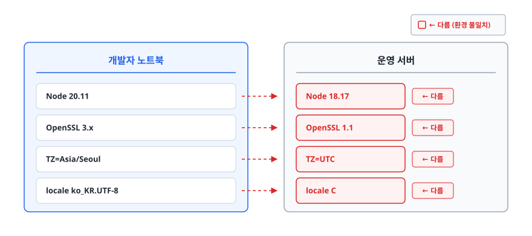
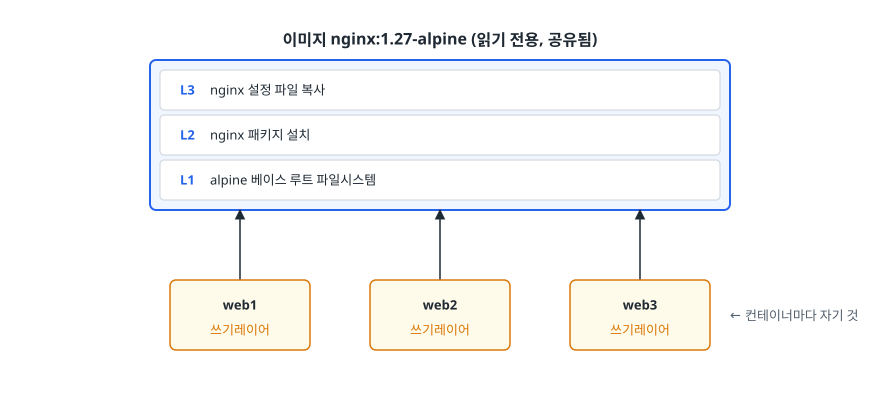
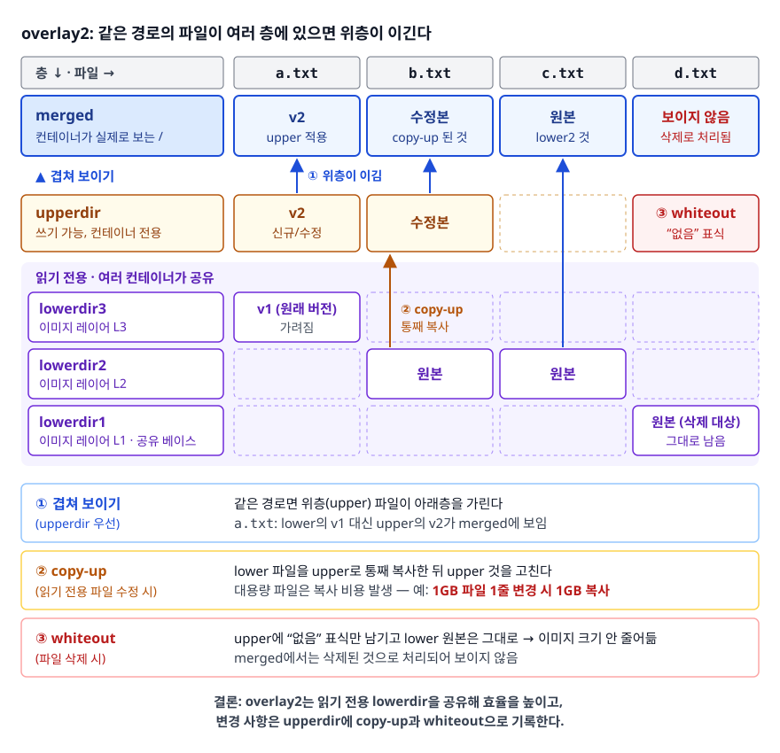
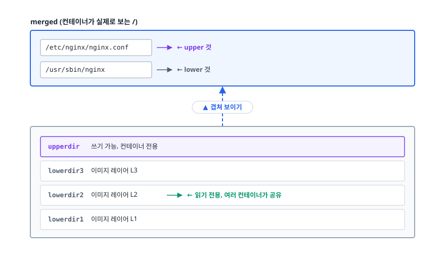
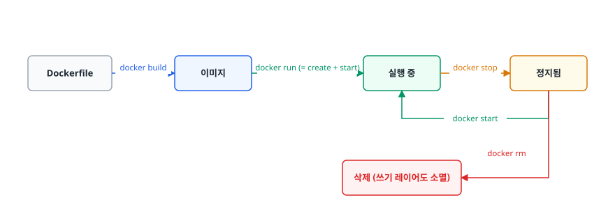

# Docker 기초 (Docker Basics)

> 이미지와 컨테이너가 왜 다른 것인지, Dockerfile의 줄 순서가 어떻게 빌드 시간을 바꾸는지, 컨테이너가 사라지면 데이터가 왜 같이 사라지는지를 스스로 설명할 수 있게 됩니다.

## 학습 목표

- [ ] "내 로컬에선 되는데" 문제가 왜 생기는지, Docker가 그중 무엇을 해결하고 무엇은 못 하는지 설명할 수 있다
- [ ] 이미지 레이어와 유니온 파일시스템(Union Filesystem)의 동작을 설명할 수 있다
- [ ] 캐시가 최대한 재사용되도록 Dockerfile 명령 순서를 설계할 수 있다
- [ ] 멀티스테이지 빌드로 런타임 이미지에서 빌드 도구를 제거할 수 있다
- [ ] 볼륨(Volume)과 바인드 마운트(Bind Mount)를 상황에 맞게 고를 수 있다

## 선행 지식

- [가상화와 Hypervisor](../../cloud-fundamentals/02-virtualization-hypervisor.md) - 몰라도 읽을 수 있지만, 알고 오면 이해가 빠르다
- 리눅스 셸 기본기(경로, 환경변수, 프로세스)

---

## 1. 왜 필요한가

### "제 컴퓨터에서는 잘 되는데요"

신입이 배포 첫날 가장 많이 하는 말입니다. 상황을 구체적으로 봅시다.

<!-- diagram:cloud-docker-basics-1 -->


<!-- 위 그림이 대체한 원본 ASCII.
     내용을 고칠 때는 그림도 함께 갱신할 것.
```
개발자 노트북                  운영 서버
─────────────                 ─────────────
Node 20.11                    Node 18.17      ← 다름
OpenSSL 3.x                   OpenSSL 1.1     ← 다름
TZ=Asia/Seoul                 TZ=UTC          ← 다름
locale ko_KR.UTF-8            locale C        ← 다름
```
-->

코드는 `git push`로 똑같이 옮겼습니다. 그런데 서버에서만 날짜가 9시간 밀리고, 한글 파일명이 깨지고,
네이티브 모듈이 로드되지 않습니다. **옮긴 것은 코드뿐이고, 코드가 기대하던 환경은 옮기지 않았기 때문입니다.**

Docker 이전에도 이 문제를 풀려는 시도는 있었습니다. 위키에 "서버 세팅 절차"를 적어 두는 방식은 문서와 실제가
금방 어긋났고, `setup.sh` 같은 셸 스크립트는 이미 뭔가 깔린 서버에서 돌리면 결과가 달라졌다(비멱등).
VM 이미지로 환경째 복제하는 방식은 확실했지만 수 GB에 부팅이 수십 초라, 코드 한 줄 고치는데 이미지를 다시 구웠습니다.

Docker는 마지막 아이디어(환경째로 옮긴다)를 가져오되 **OS 커널은 복제하지 않고 호스트 것을 빌려 씁니다.**
그래서 VM보다 훨씬 작고 빠르면서도 "환경째 옮기기"라는 목적은 달성합니다.

### 비유: 도시락

집에서 만든 반찬만 들고 회사에 가면 밥·수저·그릇이 회사에 있어야 먹을 수 있습니다. 없으면 못 먹습니다.
Docker 이미지는 **밥, 반찬, 수저, 도시락통까지 한 세트로 묶은 것**입니다. 어디서 열든 똑같이 먹을 수 있습니다.

> **비유의 한계**: 도시락에 "전자레인지"는 들어있지 않습니다. Docker 이미지에도 **커널은 들어있지 않습니다.**
> 이미지에 담기는 것은 파일시스템(라이브러리, 바이너리, 설정)이고, 커널은 호스트 것을 그대로 씁니다.
> 그래서 리눅스 컨테이너는 리눅스 커널 위에서만 돕니다. 이 사실이 [03-container-vs-vm.md](./03-container-vs-vm.md)의 출발점입니다.

---

## 2. 이미지와 컨테이너

### 정의

- **이미지(Image)**: 파일시스템 스냅샷 + 실행 방법 메타데이터를 담은 **읽기 전용 템플릿**
- **컨테이너(Container)**: 이미지를 기반으로 실행 중이거나 실행됐던 **프로세스 인스턴스**

객체지향으로 치면 이미지가 클래스, 컨테이너가 인스턴스입니다. 클래스는 하나인데 인스턴스는 여럿 만들 수 있습니다.

```bash
docker pull nginx:1.27-alpine                          # 이미지 1개 내려받기
docker run -d --name web1 -p 8081:80 nginx:1.27-alpine # 컨테이너 3개 찍어내기
docker run -d --name web2 -p 8082:80 nginx:1.27-alpine
docker run -d --name web3 -p 8083:80 nginx:1.27-alpine
```

이미지 하나에서 컨테이너 셋이 나왔습니다. 셋은 서로의 존재를 모르고, 파일을 고쳐도 서로 영향이 없습니다.

### 동작 원리: 읽기 전용 레이어 + 쓰기 가능 레이어

컨테이너를 만든다는 것은 **이미지 위에 얇은 쓰기 가능 레이어(Writable Layer) 한 장을 얹는 것**입니다.

<!-- diagram:cloud-docker-basics-2 -->


<!-- 위 그림이 대체한 원본 ASCII.
     내용을 고칠 때는 그림도 함께 갱신할 것.
```
                이미지 nginx:1.27-alpine (읽기 전용, 공유됨)
        ┌──────────────────────────────────────────────┐
        │  L3  nginx 설정 파일 복사                     │
        │  L2  nginx 패키지 설치                        │
        │  L1  alpine 베이스 루트 파일시스템             │
        └──────────────────────────────────────────────┘
             ▲              ▲              ▲
             │              │              │
        ┌────┴────┐    ┌────┴────┐    ┌────┴────┐
        │ web1    │    │ web2    │    │ web3    │
        │ 쓰기레이어│    │ 쓰기레이어│    │ 쓰기레이어│   ← 컨테이너마다 자기 것
        └─────────┘    └─────────┘    └─────────┘
```
-->

디스크에 실제로 저장된 이미지 레이어는 **한 벌뿐**입니다. 컨테이너 3개가 그 한 벌을 같이 봅니다.
컨테이너가 파일을 수정하면 그 파일만 쓰기 레이어로 복사된 뒤 수정된다(Copy-on-Write).

직접 확인해 봅시다.

```bash
docker exec web1 sh -c 'echo hello > /usr/share/nginx/html/index.html'
docker diff web1 | grep html   # C /usr/share/nginx/html/index.html  ← web1에서만 바뀜
docker diff web2 | grep html   # 안 나온다. web2가 보는 index.html은 이미지 원본 그대로
```

### 흔한 오해

**"컨테이너 안에서 고친 게 이미지에도 반영된다"** — 아닙니다. 쓰기 레이어는 컨테이너에 속하고,
`docker rm`으로 컨테이너를 지우면 변경분도 함께 사라집니다. `docker commit`으로 현재 상태를 이미지로
굳힐 수는 있지만 **실무에서는 쓰지 않습니다.** 어떻게 만들어졌는지 기록이 없는 이미지가 되기 때문입니다.
변경은 Dockerfile을 고쳐 다시 빌드하는 것이 원칙입니다.

---

## 3. 레이어와 유니온 파일시스템

<!-- diagram:cloud-docker-basics -->


### 왜 레이어로 쪼갰나

이미지가 통짜 파일 하나였다면 코드 한 줄만 고쳐도 처음부터 다시 만들어야 하고, push할 때마다 전체 용량을
전송해야 하며, 같은 베이스를 쓰는 이미지 10개가 디스크에 베이스를 10벌 갖게 됩니다.
레이어로 쪼개면 **바뀐 레이어만 다시 만들고, 바뀐 레이어만 전송하고, 같은 레이어는 한 벌만 저장**합니다.
`docker pull`을 두 번째부터 하면 "Already exists"가 우수수 뜨는 게 이 때문입니다.

### 유니온 파일시스템이 하는 일

여러 디렉터리를 겹쳐서 **하나의 디렉터리인 것처럼 보여주는** 파일시스템입니다.
리눅스 Docker의 기본 스토리지 드라이버는 `overlay2`이며 구조는 이렇습니다.

<!-- diagram:cloud-docker-basics-3 -->


<!-- 위 그림이 대체한 원본 ASCII.
     내용을 고칠 때는 그림도 함께 갱신할 것.
```
   merged (컨테이너가 실제로 보는 /)
   ┌──────────────────────────────────────┐
   │ /etc/nginx/nginx.conf  ← upper 것    │
   │ /usr/sbin/nginx        ← lower 것    │
   └──────────────────┬───────────────────┘
                      ▲ 겹쳐 보이기
   ┌──────────────────┴───────────────────┐
   │ upperdir   쓰기 가능, 컨테이너 전용    │
   │ lowerdir3  이미지 레이어 L3           │
   │ lowerdir2  이미지 레이어 L2  ← 읽기 전용, 여러 컨테이너가 공유
   │ lowerdir1  이미지 레이어 L1           │
   └──────────────────────────────────────┘
```
-->

같은 경로의 파일이 여러 층에 있으면 **위층이 이깁니다.** 파일을 수정하면 lower에서 upper로 통째 복사한 뒤
upper 것을 고친다(copy-up). 그래서 **1GB짜리 로그 파일 한 줄을 고치면 1GB가 복사됩니다.**
DB 데이터 파일처럼 계속 쓰는 대상을 컨테이너 레이어에 두면 안 되는 실질적인 이유가 여기 있습니다.

### 지운 파일이 이미지 크기를 줄이지 못하는 이유

파일을 삭제하면 upper 층에 "이 파일은 없는 것으로 쳐라"는 표식(whiteout)만 남습니다. **아래층 원본은 그대로 있습니다.**

```dockerfile
# 나쁜 예 — RUN을 나누면 최종 이미지 크기가 전혀 줄지 않는다
RUN wget https://example.com/big-sdk.tar.gz
RUN tar xf big-sdk.tar.gz && ./install.sh
RUN rm -rf big-sdk.tar.gz          # 위층에 "없음" 표시만 추가됨

# 좋은 예 — 같은 레이어 안에서 만들고 지운다
RUN wget https://example.com/big-sdk.tar.gz \
 && tar xf big-sdk.tar.gz && ./install.sh && rm -rf big-sdk.tar.gz
```

같은 원리로 **한 레이어에서 넣은 비밀키를 다음 레이어에서 지워도 이미지에는 남아 있습니다.**
`docker history <이미지>`로 레이어별 크기와 생성 명령을 뒤지면 나옵니다.
비밀은 빌드 인자나 레이어가 아니라 런타임 주입으로 다뤄야 합니다.

---

## 4. 캐시가 작동하는 Dockerfile

### 캐시 규칙 딱 두 줄

1. Docker는 명령을 위에서부터 하나씩 보며 "이 레이어를 전에 만든 적 있나?"를 확인합니다.
2. **한 번 캐시가 깨지면, 그 아래 모든 레이어는 무조건 다시 만듭니다.**

캐시 키는 명령 종류마다 다릅니다.

- `RUN` → **명령 문자열**이 같으면 캐시 히트 (스크립트 내용이 바뀌어도 문자열이 같으면 히트하니 주의)
- `COPY` / `ADD` → **복사되는 파일의 내용 체크섬**이 같아야 캐시 히트

이 두 줄에서 실전 규칙이 나옵니다. **자주 바뀌는 것을 아래로 내려라.**

### 나쁜 예와 좋은 예

```dockerfile
# 나쁜 예: 소스 한 글자만 고쳐도 의존성을 통째로 다시 설치한다
FROM python:3.12-slim
WORKDIR /app
COPY . .                                  # 소스가 바뀌면 여기서 캐시 깨짐
RUN pip install --no-cache-dir -r requirements.txt   # → 매번 재설치 (수 분)
CMD ["python", "main.py"]
```

```dockerfile
# 좋은 예: 의존성 목록과 소스를 분리해서 복사한다
FROM python:3.12-slim
WORKDIR /app
COPY requirements.txt .                   # requirements.txt가 안 바뀌면 캐시 히트
RUN pip install --no-cache-dir -r requirements.txt   # → 재사용 (수 초)
COPY . .                                  # 소스만 다시 복사
CMD ["python", "main.py"]
```

소스 한 줄만 고쳤을 때, 나쁜 예는 `COPY . .`부터 아래 전부가 MISS라 의존성을 다시 깝니다.
좋은 예는 `COPY requirements.txt`와 `RUN pip`가 CACHED로 살아남고 마지막 `COPY . .`만 다시 돕니다.
Node, Java도 원리는 같습니다. `package.json`과 `package-lock.json`만 먼저 복사해 `npm ci`를 돌리고,
Gradle이면 `build.gradle`과 래퍼만 먼저 복사해 의존성을 받은 뒤 `src`를 복사합니다.

### .dockerignore를 안 쓰면 캐시가 계속 깨진다

`docker build`는 먼저 **빌드 컨텍스트(빌드 대상 디렉터리)를 빌더에 전송합니다.** BuildKit이 기본 빌더가 된 뒤로는
바뀐 파일만 증분 전송하지만, `.git`이나 `node_modules`가 컨텍스트에 그대로 남아 있으면 전송도 느리고
`COPY . .`의 체크섬이 매번 달라져 캐시가 무의미해지는 것은 마찬가지입니다.

```
# .dockerignore
.git
node_modules
build/
*.log
.env
```

`.env`를 반드시 넣어라. 로컬 비밀 파일이 이미지에 딸려 들어가는 사고의 대부분이 여기서 납니다.

---

## 5. 멀티스테이지 빌드

Java 앱을 빌드하려면 JDK, Gradle, 의존성 캐시가 필요합니다. 하지만 **실행할 때는 JAR 하나와 JRE만 있으면 됩니다.**
한 스테이지로 만들면 컴파일러와 빌드 캐시가 최종 이미지에 그대로 남습니다. 크기도 문제지만
**침투한 공격자가 쓸 도구를 같이 넣어 주는 셈**이라 보안 문제이기도 합니다.

해결은 `FROM`을 여러 번 쓰고 마지막 스테이지로 **산출물만** 복사하는 것입니다.
앞 스테이지는 최종 이미지에 포함되지 않습니다.

```dockerfile
# ---------- 1단계: 빌드 ----------
FROM eclipse-temurin:17-jdk AS build
WORKDIR /src
COPY gradlew settings.gradle build.gradle ./
COPY gradle ./gradle
RUN ./gradlew dependencies --no-daemon       # 의존성만 먼저 → 캐시 태움
COPY src ./src
RUN ./gradlew bootJar --no-daemon

# ---------- 2단계: 실행 ----------
FROM eclipse-temurin:17-jre
WORKDIR /app
COPY --from=build /src/build/libs/*.jar app.jar
RUN addgroup --system app && adduser --system --ingroup app app
USER app                                      # root로 돌리지 않는다
ENTRYPOINT ["java", "-jar", "/app/app.jar"]
```

프론트엔드는 더 극적입니다. 빌드에는 Node가 필요하지만 서빙에는 정적 파일과 Nginx만 있으면 됩니다.

```dockerfile
FROM node:20-alpine AS build
WORKDIR /app
COPY package.json package-lock.json ./
RUN npm ci
COPY . .
RUN npm run build

FROM nginx:1.27-alpine
COPY --from=build /app/dist /usr/share/nginx/html   # node_modules도 npm도 안 남는다
```

`docker build --target build .`처럼 중간 스테이지만 빌드할 수도 있어, 테스트 전용 스테이지를 따로 두고
CI에서만 쓰는 패턴도 흔합니다.

### 베이스 이미지를 줄일 때 주의할 점

`alpine`은 확실히 작지만 표준 glibc가 아니라 musl libc를 씁니다. glibc에 의존하는 네이티브 라이브러리
(일부 파이썬 휠, 일부 JNI 라이브러리)에서 문제가 생길 수 있습니다. **작게 만드는 것보다 도는 것이 먼저입니다.**
호환성이 걱정되면 `-slim` 계열(Debian 기반)부터 시도하고, 그다음 alpine이나 distroless를 검토합니다.

---

## 6. 명령어와 데이터 다루기

### 컨테이너 라이프사이클

<!-- diagram:cloud-docker-basics-4 -->


<!-- 위 그림이 대체한 원본 ASCII.
     내용을 고칠 때는 그림도 함께 갱신할 것.
```
   docker build        docker run (= create + start)      docker stop
  Dockerfile ──────▶ 이미지 ────────────────────────▶ 실행 중 ─────────▶ 정지됨
                                                        ▲                 │
                                                        └── docker start ─┤
                                                                docker rm │
                                                                          ▼
                                                          삭제 (쓰기 레이어도 소멸)
```
-->

`docker stop`은 먼저 SIGTERM을 보내고, 기본 유예 시간(10초) 안에 안 죽으면 SIGKILL로 강제 종료합니다.
그래서 애플리케이션이 SIGTERM을 받아 커넥션을 정리하도록 만들어야 무중단 배포가 가능해집니다.

### 자주 쓰는 명령

| 목적 | 명령 | 알아둘 점 |
|------|------|-----------|
| 실행 | `docker run -d -p 8080:80 --name web nginx` | `-p 호스트:컨테이너` 순서를 헷갈리지 말 것 |
| 목록 | `docker ps -a` | `-a` 없으면 실행 중인 것만 |
| 로그 | `docker logs -f --tail 100 web` | 앱이 stdout/stderr로 찍어야 보인다 |
| 진입 | `docker exec -it web sh` | 이미 실행 중인 컨테이너에 붙는다 |
| 자원 | `docker stats` | CPU/메모리 실시간 |
| 상세 | `docker inspect web` | `--format`으로 필드만 뽑는 게 실용적 |
| 정리 | `docker system df` / `docker system prune` | 디스크 차지 확인 후 정리 |

`docker attach`는 PID 1의 표준 입출력에 직접 붙어 Ctrl+C가 컨테이너를 죽일 수 있습니다. 디버깅은 `docker exec`로.

### 데이터를 어디에 둘 것인가

컨테이너 쓰기 레이어는 컨테이너와 운명을 같이합니다. 영속 데이터는 밖으로 빼야 합니다.

| 방식 | 문법 | 저장 위치 | 언제 쓰나 |
|------|------|----------|----------|
| Named Volume | `-v dbdata:/var/lib/mysql` | Docker가 관리하는 영역 | 운영 DB 데이터. 백업·이관이 표준화됨 |
| Bind Mount | `-v "$(pwd)":/app` | 호스트의 지정 경로 | 개발 중 소스 실시간 반영 |
| tmpfs | `--tmpfs /tmp` | 호스트 메모리 | 디스크에 남기면 안 되는 임시 데이터 |

한 줄 결론: **운영 영속화는 Named Volume, 개발 소스 마운트는 Bind Mount, 흔적을 남기면 안 되는 것은 tmpfs.**

바인드 마운트에는 유명한 함정이 있습니다. 마운트는 해당 경로를 **통째로 덮어쓰기** 때문에,
이미지 빌드 중 설치했던 `/app/node_modules`가 호스트 디렉터리에 가려져 사라집니다.
해결은 그 하위 경로만 익명 볼륨으로 다시 덮는 것입니다.

```bash
docker run -v "$(pwd)":/app node:20 npm start                       # node_modules 사라짐
docker run -v "$(pwd)":/app -v /app/node_modules node:20 npm start  # 하위 경로만 되살림
```

---

## 7. 실무에서는

### 이미지 태그 전략

`latest`만 쓰면 롤백이 불가능해집니다. 같은 태그가 어제와 오늘 다른 이미지를 가리키기 때문입니다.
현업에서는 **커밋 SHA를 불변 태그로 박고**, `latest` 같은 움직이는 태그는 별칭으로만 추가합니다.

```bash
SHA=$(git rev-parse --short HEAD)
docker build -t registry.example.com/myapp:$SHA -t registry.example.com/myapp:latest .
docker push --all-tags registry.example.com/myapp
```

배포 매니페스트에는 SHA 태그를 씁니다. 그래야 "지금 서버에 뜬 게 어느 커밋인지"가 확정됩니다.

### 장애 시나리오 1 — 컨테이너가 계속 재시작한다

```bash
docker ps -a                                   # STATUS: Restarting (137) 반복
docker logs --tail 50 myapp
docker inspect myapp --format '{{.State.OOMKilled}} {{.State.ExitCode}}'
# true 137
```

**원인**: 종료 코드 137은 SIGKILL(128+9)이고, `OOMKilled=true`면 메모리 한도 초과로 커널이 죽인 것입니다.
JVM이나 Node가 호스트 전체 메모리를 기준으로 힙을 잡아 컨테이너 한도를 넘기는 경우가 가장 흔합니다.

**대응**: 한도를 올릴지 앱을 줄일지 먼저 정합니다. JVM이라면 `-XX:MaxRAMPercentage`로 컨테이너 한도 대비 비율을
지정하고, Node라면 `--max-old-space-size`를 한도보다 작게 줍니다. 한도 자체가 부족하면 `--memory`를 조정합니다.

### 장애 시나리오 2 — 빌드 서버 디스크가 꽉 찼다

```bash
docker system df
# TYPE            TOTAL   ACTIVE   SIZE     RECLAIMABLE
# Images            240       12   180GB    170GB (94%)
# Build Cache      1520        0     60GB    60GB
```

**원인**: CI가 매 커밋마다 새 이미지와 빌드 캐시를 쌓는데 아무도 지우지 않습니다.
**대응**: 즉시 조치는 `docker image prune -a --filter "until=168h"`와 `docker builder prune`.
근본 대응은 CI 파이프라인 끝에 정리 단계를 넣고, 레지스트리에 태그 수명 정책을 거는 것입니다.

### 장애 시나리오 3 — 로컬에선 빠른 빌드가 CI에서만 10분

**원인**: CI 러너는 매번 새 머신이라 로컬 레이어 캐시가 없습니다. 로컬에서 보던 캐시 이득이 통째로 사라집니다.
**대응**: 레지스트리를 공용 캐시 저장소로 씁니다. `docker buildx build`에 `--cache-from type=registry,ref=<이미지>:buildcache`와
`--cache-to ...,mode=max`를 붙이면 이전 빌드의 레이어를 내려받아 재사용합니다.
레지스트리로 캐시를 내보내려면 기본 `docker` 드라이버가 아니라 `docker-container` 드라이버 빌더가 필요합니다.

### 보안 기본기

- `USER`로 non-root 실행. 컨테이너 안 root는 상황에 따라 호스트 자원에 손댈 수 있다
- 이미지 취약점 스캔을 CI에 붙인다(Trivy 등)
- 비밀값은 `ENV`나 `ARG`가 아니라 런타임 주입으로. 빌드 인자는 `docker history`에 남는다

---

## 8. 면접 포인트

> 면접에서 이 주제가 나오면 이렇게 답한다

**Q. 이미지와 컨테이너의 차이를 설명해 주세요.**
A. 이미지는 읽기 전용 레이어들의 스택이고, 컨테이너는 그 위에 쓰기 가능한 레이어를 얹어 실행한 인스턴스입니다.
이미지 하나로 컨테이너를 여러 개 띄워도 읽기 전용 레이어는 디스크에 한 벌만 존재하고 공유됩니다.
파일을 고치면 Copy-on-Write로 쓰기 레이어에만 반영되고, 컨테이너를 지우면 그 변경분도 사라집니다.
- 꼬리 질문: "그럼 DB 데이터는 어디에 두나요?" → 쓰기 레이어는 휘발성이므로 Named Volume으로 빼고,
  큰 파일을 쓰기 레이어에서 수정하면 copy-up 비용까지 든다는 점을 덧붙입니다.

**Q. Dockerfile에서 의존성 설치를 소스 복사보다 먼저 하는 이유는?**
A. 레이어 캐시가 위에서부터 순차 판정되고 한 번 깨지면 아래가 전부 무효화되기 때문입니다.
소스는 매 커밋 바뀌지만 의존성 목록은 드물게 바뀌므로, 안 바뀌는 것을 위로 올려야 설치 레이어가 살아남습니다.
`COPY`의 캐시 키는 파일 내용 체크섬이라 목록 파일이 같으면 그대로 재사용됩니다.
- 꼬리 질문: "CI에서는 왜 그 효과가 안 나죠?" → 러너가 매번 새 환경이라 로컬 캐시가 없습니다.
  `--cache-from`으로 레지스트리 캐시를 붙여야 합니다.

**Q. 이미지 크기를 줄이라고 하면 어디부터 보시겠습니까?**
A. 먼저 `docker history`나 dive로 어느 레이어가 큰지 측정합니다. 대개 빌드 도구와 패키지 캐시가 범인이라
멀티스테이지 빌드로 산출물만 런타임 이미지에 옮기는 것이 효과가 가장 큽니다. 이어서 베이스 이미지를
slim/alpine으로 낮추고, 같은 레이어 안에서 캐시를 정리하고, `.dockerignore`를 정비합니다.
다만 alpine은 musl libc라 호환성 검증이 필요하고 디버깅 도구가 사라지는 트레이드오프가 있습니다.
- 꼬리 질문: "다른 레이어에서 지우면 왜 안 줄어드나요?" → 유니온 파일시스템의 whiteout으로 설명합니다.

**Q. `CMD`와 `ENTRYPOINT`의 차이는?**
A. `ENTRYPOINT`는 고정 실행 파일, `CMD`는 그 기본 인자입니다. `docker run 이미지 인자`로 실행하면
`CMD`는 덮어써지고 `ENTRYPOINT`는 남습니다. 또 `ENTRYPOINT java -jar app.jar`처럼 셸 형식으로 쓰면
PID 1이 셸이 되어 SIGTERM이 앱까지 전달되지 않으므로, exec 형식(`["java","-jar","app.jar"]`)으로 써야
`docker stop` 시 정상 종료됩니다.

---

## 자주 하는 실수

| 실수 | 왜 틀렸나 | 올바른 이해 |
|------|----------|-----------|
| `docker commit`으로 이미지 관리 | 어떻게 만들어졌는지 기록이 남지 않아 재현 불가 | Dockerfile을 고쳐 다시 빌드한다 |
| 다음 `RUN`에서 임시 파일 삭제 | 아래 레이어에 원본이 그대로 남는다 | 만든 레이어 안에서 `&&`로 이어 지운다 |
| 빌드 인자로 비밀번호 전달 | `docker history`와 이미지 메타데이터에 남는다 | 런타임 환경변수나 시크릿 매니저로 주입 |
| 모든 배포에 `latest` 태그 | 같은 태그가 다른 내용을 가리켜 롤백 불가 | 커밋 SHA 등 불변 태그를 함께 사용 |
| 컨테이너 안에 DB 데이터 저장 | 컨테이너 삭제 시 소멸, copy-up 비용도 발생 | Named Volume으로 분리 |
| `-p 80:8080`을 반대로 씀 | 호스트:컨테이너 순서다 | 앞이 내가 브라우저로 치는 포트 |

---

## 한 줄 정리

Docker는 "코드가 기대하는 파일시스템 전체"를 불변 레이어로 굳혀 어디서든 같은 실행 결과를 재현하는 도구이고,
레이어라는 구조 하나가 캐시·전송·저장 효율과 Dockerfile 작성 규칙을 전부 결정합니다.

---

## 연관 개념

- [02-docker-compose.md](./02-docker-compose.md) - 컨테이너 여러 개를 한 파일로 묶어 띄우기
- [03-container-vs-vm.md](./03-container-vs-vm.md) - 이미지에 커널이 없다는 말의 진짜 의미
- [qna-docker.md](./qna-docker.md) - Docker 면접 질문 모음
- [가상화와 Hypervisor](../../cloud-fundamentals/02-virtualization-hypervisor.md) - 컨테이너가 올라타는 아래층 이야기
- [Kubernetes](../../kubernetes/README.md) - 컨테이너를 여러 서버에 걸쳐 운영하는 단계
