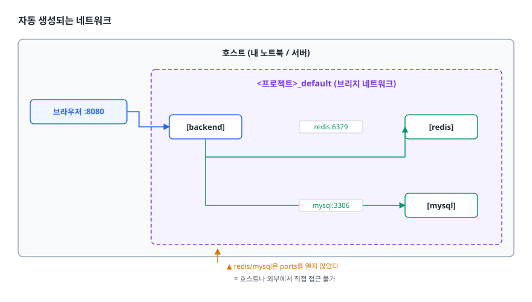

# Docker Compose (멀티 컨테이너 오케스트레이션)

> 여러 컨테이너를 YAML 한 장으로 정의하고 한 명령으로 띄우는 방법, 서비스 이름이 곧 DNS가 되는 원리, `depends_on`이 왜 기동 순서를 보장해 주지 못하는지를 설명할 수 있게 됩니다.

## 학습 목표

- [ ] `docker run`을 여러 번 치는 방식이 왜 깨지는지 구체적으로 말할 수 있다
- [ ] services / networks / volumes / depends_on의 역할을 구분할 수 있다
- [ ] 컨테이너끼리 서비스 이름으로 통신하는 구조를 그림으로 그릴 수 있다
- [ ] `.env`와 `environment`의 층위 차이를 안다
- [ ] healthcheck로 "실행됨"과 "받을 준비됨"을 구분해 기동 순서를 제어할 수 있다

## 선행 지식

- [01-docker-basics.md](./01-docker-basics.md) - 이미지·컨테이너·볼륨 개념이 전제다

---

## 1. 왜 필요한가

### 손으로 띄우면 이렇게 된다

백엔드 + MySQL + Redis로 구성된 평범한 서비스를 `docker run`만으로 올려 봅시다.

```bash
docker network create app-net
docker volume create db-data

docker run -d --name mysql --network app-net \
  -e MYSQL_ROOT_PASSWORD=secret -e MYSQL_DATABASE=appdb \
  -v db-data:/var/lib/mysql mysql:8.0

docker run -d --name redis --network app-net redis:7-alpine

docker run -d --name backend --network app-net -p 8080:8080 \
  -e SPRING_DATASOURCE_URL=jdbc:mysql://mysql:3306/appdb \
  -e SPRING_DATA_REDIS_HOST=redis myapp:1.0
```

동작은 합니다. 문제는 이렇습니다.

- **순서를 사람이 기억해야 합니다.** 네트워크와 볼륨을 먼저 만들지 않으면 실패한다
- **재현 불가.** 이 명령들이 어디에도 저장돼 있지 않습니다. 셸 히스토리가 유일한 인프라 명세다
- **한 개만 고치기 어렵습니다.** 백엔드 이미지를 올리려면 `docker stop && docker rm && docker run ...`을 손으로 조합
- **팀에 전파가 안 됩니다.** 새 팀원에게 이 다섯 줄을 슬랙으로 보내는 순간 오탈자 사고가 시작된다

Docker Compose는 이 명령들을 **선언적인 YAML 한 장**으로 바꿉니다. 무엇을 어떤 순서로 실행할지가 아니라,
**최종적으로 어떤 상태여야 하는지**를 적습니다. 나머지는 Compose가 계산합니다.

### 비유: 공연 큐시트

`docker run` 반복은 무대감독이 배우 한 명 한 명에게 무전으로 지시하는 것입니다. 큐시트(Compose 파일)가 있으면
"누가, 어디에, 어떤 소품과 함께" 서 있어야 하는지가 문서로 남고, 그걸 보고 누구나 같은 공연을 올릴 수 있습니다.

> **비유의 한계**: 큐시트는 공연 중 사고에 대응하지 못합니다. Compose도 마찬가지로 **한 대의 호스트 안에서
> 상태를 맞춰줄 뿐**, 서버가 죽었을 때 다른 서버로 옮겨주지 않습니다. 그게 필요해지는 지점이 쿠버네티스입니다.

---

## 2. Compose 파일 구조

### 최상위 키는 사실상 세 개

```yaml
services:    # 무엇을 띄울 것인가 (컨테이너 하나하나)
networks:    # 어떤 네트워크로 묶을 것인가 (생략하면 자동 생성)
volumes:     # 어떤 영속 저장소를 쓸 것인가
```

`version:` 키는 이제 쓰지 않습니다. Compose V2는 이 키를 무시하고 경고만 냅니다.
오래된 블로그에서 `version: '3.8'`을 봤다면 그대로 따라 쓰지 말고 지워도 됩니다.

명령어도 V1의 `docker-compose`(하이픈)가 아니라 **V2의 `docker compose`(공백)** 를 씁니다.

### 전체 예제

```yaml
services:
  backend:
    build:
      context: ./backend
      dockerfile: Dockerfile
    image: myapp-backend:local
    ports:
      - "8080:8080"
    environment:
      SPRING_DATASOURCE_URL: jdbc:mysql://mysql:3306/appdb
      SPRING_DATASOURCE_USERNAME: app
      SPRING_DATASOURCE_PASSWORD: ${DB_PASSWORD}
      SPRING_DATA_REDIS_HOST: redis
    depends_on:
      mysql:
        condition: service_healthy
      redis:
        condition: service_started
    restart: unless-stopped

  mysql:
    image: mysql:8.0
    environment:
      MYSQL_ROOT_PASSWORD: ${DB_ROOT_PASSWORD}
      MYSQL_DATABASE: appdb
      MYSQL_USER: app
      MYSQL_PASSWORD: ${DB_PASSWORD}
    volumes:
      - db-data:/var/lib/mysql
      - ./db/init:/docker-entrypoint-initdb.d:ro
    healthcheck:
      test: ["CMD", "mysqladmin", "ping", "-h", "127.0.0.1", "-p${DB_ROOT_PASSWORD}"]
      interval: 10s
      timeout: 5s
      retries: 10
      start_period: 30s

  redis:
    image: redis:7-alpine
    command: ["redis-server", "--appendonly", "yes"]
    volumes:
      - redis-data:/data

volumes:
  db-data:
  redis-data:
```

`docker compose up -d` 한 줄이면 네트워크 생성, 볼륨 생성, 이미지 빌드, 컨테이너 기동이 순서대로 끝납니다.
`networks`를 따로 적지 않았는데도 세 서비스가 서로 통신되는 이유는 다음 절에서 다룹니다.

### 주요 키 정리

| 키 | 하는 일 | 자주 하는 실수 |
|----|--------|--------------|
| `image` | 사용할 이미지 | `build`와 함께 쓰면 빌드 결과에 붙일 태그가 된다 |
| `build` | Dockerfile로 직접 빌드 | 코드를 고쳐도 `up`만 하면 재빌드 안 됩니다. `--build` 필요 |
| `ports` | **호스트에 노출** | 내부 통신에는 필요 없습니다. 열면 외부 공격면이 늘어난다 |
| `expose` | 같은 네트워크에만 알림 | 문서 목적에 가깝습니다. 실제 접근 제어는 네트워크가 한다 |
| `environment` | 컨테이너 환경변수 | 여기 비밀번호를 하드코딩하고 커밋하는 사고가 잦다 |
| `volumes` | 볼륨/바인드 마운트 | `./경로`로 시작하면 바인드, 이름이면 Named Volume |
| `command` | 기본 CMD 덮어쓰기 | ENTRYPOINT는 안 바뀝니다. 바꾸려면 `entrypoint` |
| `restart` | 재시작 정책 | `always`는 죽는 앱을 무한 재시작해 원인을 가린다 |
| `depends_on` | 기동 관계 | 조건 없이 쓰면 **순서만** 보장한다(5장) |

---

## 3. 서비스 이름이 곧 주소다

### 자동 생성되는 네트워크

Compose는 프로젝트마다 브리지 네트워크를 만든다(기본 이름은 `<프로젝트명>_default`, 프로젝트명은
디렉터리명에서 온다). 같은 네트워크에 붙은 컨테이너는 **서비스 이름으로 서로를 찾습니다.**

Docker 내장 DNS 서버가 컨테이너의 `/etc/resolv.conf`에 등록돼 있고, 이 DNS가 서비스 이름을
컨테이너 IP로 풀어 줍니다. 컨테이너가 재생성되어 IP가 바뀌어도 이름은 그대로입니다.

<!-- diagram:cloud-docker-compose-1 -->


<!-- 위 그림이 대체한 원본 ASCII.
     내용을 고칠 때는 그림도 함께 갱신할 것.
```
                     호스트 (내 노트북 / 서버)
   브라우저 :8080 ─┐
                  │ ┌──── <프로젝트>_default (브리지 네트워크) ─────┐
                  └─┼──▶ [backend]                                 │
                    │        │  └── redis:6379 ──▶ [redis]         │
                    │        └───── mysql:3306 ──▶ [mysql]         │
                    └──────────────────────────────────────────────┘
                             ▲ redis/mysql은 ports를 열지 않았다
                               = 호스트나 외부에서 직접 접근 불가
```
-->

여기서 핵심은 **`ports`를 열지 않아도 내부 통신은 된다**는 점입니다.
backend는 `mysql:3306`으로 접속할 수 있지만, 내 노트북 브라우저에서는 MySQL에 닿을 수 없습니다.
운영에서 DB 포트를 호스트로 노출하지 않는 이유가 이것이고, 이는 쿠버네티스에서 DB를
ClusterIP Service로만 두는 것과 정확히 같은 발상입니다.

### 두 가지 흔한 오해

**오해 1: `DB_HOST=localhost`로 두면 되겠지**
컨테이너 안의 `localhost`는 **그 컨테이너 자신**입니다. backend 컨테이너에서 `localhost:3306`을 찌르면
backend 자신에게 물어보는 꼴이라 `Connection refused`가 납니다. 값은 서비스 이름인 `mysql`이어야 합니다.

**오해 2: 포트 매핑을 해야 컨테이너끼리 통신되겠지**
`ports: "3307:3306"`을 걸었더라도, backend는 여전히 `mysql:3306`으로 접속합니다.
포트 매핑은 **호스트 ↔ 컨테이너** 통로일 뿐 컨테이너 사이의 통신과 무관합니다.
`mysql:3307`로 적으면 오히려 실패합니다.

---

## 4. 환경변수와 `.env`

값이 들어오는 경로가 세 층이라 헷갈리기 쉽습니다. 층을 나눠서 보면 간단합니다.

<!-- diagram:cloud-docker-compose-2 -->


<!-- 위 그림이 대체한 원본 ASCII.
     내용을 고칠 때는 그림도 함께 갱신할 것.
```
 ① .env 파일             ② compose 파일의 ${VAR} 치환      ③ 컨테이너 안 환경변수
 ─────────────           ─────────────────────────         ────────────────────
 DB_PASSWORD=devpw   ──▶  password: ${DB_PASSWORD}    ──▶   environment / env_file
 (Compose가 읽는다)        (파일이 렌더링됨)                 (앱이 읽는다)
```
-->

- `.env`는 **Compose 파일 자체를 렌더링하기 위한 변수**입니다. 컨테이너에 자동으로 들어가지 않는다
- 컨테이너 안에서 쓰려면 `environment:`에 적거나 `env_file:`로 파일째 주입해야 한다
- 셸 환경변수가 `.env`보다 우선합니다. `DB_PASSWORD=x docker compose up`이 `.env` 값을 이긴다
- `env_file`과 `environment`에 같은 키가 있으면 `environment`가 이긴다

기본값을 주면 `.env`가 없어도 실행이 깨지지 않습니다.

```yaml
environment:
  LOG_LEVEL: ${LOG_LEVEL:-INFO}          # 없으면 INFO
  DB_PASSWORD: ${DB_PASSWORD:?required}  # 없으면 에러를 내고 멈춤
```

렌더링 결과가 헷갈리면 실행 전에 확인합니다. 실무에서 가장 많이 쓰는 디버깅 명령입니다.

```bash
docker compose config          # 변수 치환까지 끝난 최종 YAML 출력
```

`.env`는 **커밋하지 않습니다.** 대신 키 목록만 담은 `.env.example`을 커밋하고 `.gitignore`에 `.env`를 넣습니다.
이 규칙 하나가 자격증명 유출 사고의 상당수를 막습니다.

---

## 5. healthcheck와 기동 순서

### `depends_on`이 보장하는 것과 못 하는 것

조건 없이 쓴 `depends_on: [mysql]`이 보장하는 것은 **"mysql 컨테이너를 backend보다 먼저 start한다"** 뿐입니다.
MySQL 컨테이너가 시작됐다는 것과 MySQL이 쿼리를 받을 준비가 됐다는 것은 완전히 다른 얘기입니다.

<!-- diagram:cloud-docker-compose-3 -->


<!-- 위 그림이 대체한 원본 ASCII.
     내용을 고칠 때는 그림도 함께 갱신할 것.
```
   t=0s   t=1s        t=3s                          t=25s
   │      │           │                              │
   ├─ mysql 컨테이너 start
   │      ├─ backend 컨테이너 start
   │      │           ├─ backend가 DB 커넥션 시도 ──▶ ✗ Connection refused
   │      │           │   (MySQL은 아직 초기화 중)
   │      │           │                              ├─ MySQL 준비 완료
   │      │           └─ backend는 이미 죽었다
```
-->

이것이 "Compose로 띄우면 첫 실행만 항상 실패하고 한 번 더 up 하면 된다"는 현상의 정체입니다.

### 해결 1: healthcheck + condition

컨테이너에 "살아 있음"이 아니라 **"받을 준비됨"** 판정 기준을 부여합니다.

```yaml
  mysql:
    healthcheck:
      test: ["CMD", "mysqladmin", "ping", "-h", "127.0.0.1", "-p${DB_ROOT_PASSWORD}"]
      interval: 10s        # 검사 주기
      timeout: 5s          # 이 시간 넘으면 실패로 간주
      retries: 10          # 연속 실패 이 횟수면 unhealthy
      start_period: 30s    # 기동 유예. 이 구간 실패는 retries에 안 센다

  backend:
    depends_on:
      mysql:
        condition: service_healthy    # healthy가 될 때까지 backend를 시작하지 않는다
```

`docker compose ps`를 치면 `(healthy)` 표시가 뜹니다. PostgreSQL이면 `pg_isready -U app`,
HTTP 서버면 `curl -f http://localhost:8080/actuator/health`가 흔한 프로브입니다.
단, 이미지에 `curl`이 없으면 헬스체크가 영원히 실패합니다. 이미지에 있는 도구로 짜야 합니다.

### 해결 2: 앱이 재시도하게 만든다 (더 근본적)

healthcheck는 **기동 시점** 문제만 풉니다. 운영 중 DB가 잠깐 재시작하면 어차피 같은 문제가 반복됩니다.
그래서 실무에서는 둘을 함께 씁니다.

```yaml
  backend:
    restart: on-failure        # 죽으면 다시 시도
```

애플리케이션 쪽에서는 커넥션 풀의 재시도·백오프 설정을 켜 둡니다.
**"의존 서비스는 언제든 잠깐 사라질 수 있다"** 를 전제로 짜는 것이 컨테이너 환경의 기본 태도입니다.

---

## 6. 실무에서는

### 개발 환경 표준화 — 입사 첫날 시나리오

```bash
git clone https://github.com/team/project.git
cd project
cp .env.example .env
docker compose up -d
```

여기까지 5분. MySQL 버전을 맞추거나 Redis를 로컬에 설치할 필요가 없습니다.
프로젝트를 떠날 때는 `docker compose down -v`로 흔적 없이 지웁니다.

### 개발용 오버라이드 분리

같은 Compose 파일을 개발과 운영에 쓰면 결국 둘 중 하나가 이상해집니다. 파일을 나누는 것이 정석입니다.

```yaml
# docker-compose.override.yml  (파일명이 이러면 up 시 자동 병합된다)
services:
  backend:
    build:
      target: dev              # 멀티스테이지의 dev 스테이지로 빌드
    volumes:
      - ./backend/src:/app/src  # 소스 실시간 반영
    environment:
      SPRING_PROFILES_ACTIVE: local
    ports:
      - "5005:5005"            # 원격 디버거 포트
```

운영 배포용으로는 오버라이드를 빼고 명시적으로 조합합니다.

```bash
docker compose -f docker-compose.yml -f docker-compose.prod.yml up -d
```

### 선택적 서비스는 profiles로

모든 개발자가 Kafka까지 띄울 필요는 없습니다. 서비스에 `profiles: ["messaging"]`을 붙이면 기본 `up`에서
제외되고, `docker compose --profile messaging up -d`로 켤 때만 뜹니다.

소스 변경을 감지해 자동으로 동기화·재빌드하고 싶다면 `develop.watch`를 정의하고 `docker compose watch`를
쓸 수도 있습니다. 바인드 마운트가 잘 안 통하는 컴파일 언어에서 특히 유용합니다.

---

## 7. 장애 시나리오

### 시나리오 1 — `port is already allocated`

```bash
docker compose up -d
# Error ... Bind for 0.0.0.0:3306 failed: port is already allocated
```

**진단**: `docker ps --filter "publish=3306"` 또는 호스트에서 `lsof -i :3306`.
**원인**: 로컬에 이미 MySQL이 설치돼 3306을 쓰고 있거나, 다른 프로젝트의 Compose가 같은 포트를 잡았습니다.
**대응**: 호스트 포트만 바꾼다(`"3307:3306"`). 컨테이너 포트는 그대로여야 다른 서비스의 접속 설정이 안 깨집니다.
애초에 외부 접근이 필요 없다면 `ports` 항목을 지우는 것이 최선입니다.

### 시나리오 2 — DB 비밀번호를 바꿨는데 로그인이 안 된다

```bash
docker compose logs mysql | tail -20
# [Note] ... ready for connections    (초기화 스크립트 로그가 없다)
docker compose exec backend env | grep DB_
# 값은 새 비밀번호로 잘 들어가 있다
```

**원인**: MySQL·PostgreSQL 이미지의 초기화(`MYSQL_ROOT_PASSWORD`, `/docker-entrypoint-initdb.d`)는
**데이터 디렉터리가 비어 있을 때만** 실행됩니다. 볼륨에 예전 데이터가 남아 있으면 새 환경변수는 그냥 무시됩니다.
**대응**: 개발 환경이라면 `docker compose down -v`로 볼륨까지 지우고 다시 올립니다.
운영이라면 볼륨을 지우면 안 되므로 DB 안에서 `ALTER USER`로 비밀번호를 바꿉니다.
`down -v`의 `-v`는 되돌릴 수 없습니다. 치기 전에 어느 환경인지 반드시 확인합니다.

### 시나리오 3 — 코드를 고쳤는데 반영이 안 된다

**원인**: `docker compose up -d`는 **이미 존재하는 이미지**로 컨테이너만 다시 만듭니다. 소스를 다시 빌드하지 않습니다.
**대응**: `docker compose up -d --build`. 캐시까지 의심된다면 `docker compose build --no-cache backend`.
`.env`만 고친 경우도 마찬가지로 컨테이너 재생성이 필요하다(`up -d`면 Compose가 변경을 감지해 재생성한다).

### 자주 쓰는 진단 명령

```bash
docker compose ps                 # 상태 + health 확인
docker compose logs -f backend    # 특정 서비스 로그 추적
docker compose exec backend sh    # 컨테이너 안으로 진입
docker compose config             # 변수 치환 결과 확인
docker compose top                # 각 컨테이너의 프로세스 목록
```

---

## 8. Compose의 한계

| 필요한 것 | Compose | 쿠버네티스 |
|----------|---------|-----------|
| 여러 서버에 분산 | 불가 (단일 호스트) | 스케줄러가 노드를 골라 배치 |
| 노드 장애 시 이전 | 불가 | 다른 노드에 재생성 |
| 무중단 롤링 업데이트 | 사실상 없음 | Deployment 기본 기능 |
| 부하 기반 자동 확장 | 없음 | HPA |
| 복제본 간 로드밸런싱 | `--scale` + 내장 DNS 라운드로빈까지. 그 이상은 직접 | Service가 담당 |

한 줄 결론: **개발 환경과 단일 서버 배포까지는 Compose로 충분하고, 서버가 여러 대가 되는 순간 쿠버네티스가 필요합니다.**
Compose에서 배운 "서비스 이름으로 통신", "설정을 환경변수로 주입", "볼륨으로 상태 분리" 세 가지는
쿠버네티스에서 Service, ConfigMap/Secret, PersistentVolume으로 이름만 바뀐 채 그대로 이어집니다.

---

## 9. 면접 포인트

> 면접에서 이 주제가 나오면 이렇게 답한다

**Q. Docker Compose가 해결하는 문제는 무엇인가요?**
A. 멀티 컨테이너 애플리케이션의 구성을 선언적으로 코드화하는 것입니다. `docker run`을 반복하면 네트워크·볼륨
생성 순서와 옵션을 사람이 기억해야 하고 어디에도 기록되지 않는데, Compose는 그 전체를 YAML로 버전 관리합니다.
덕분에 새 팀원이 clone 후 명령 하나로 동일한 환경을 재현할 수 있습니다.
- 꼬리 질문: "운영에도 쓰나요?" → 단일 호스트 배포까지는 쓰지만, 다중 노드·자가 치유·롤링 업데이트가
  필요하면 쿠버네티스로 넘어간다고 답합니다.

**Q. Compose에서 컨테이너끼리 어떻게 통신하나요?**
A. Compose가 프로젝트별 브리지 네트워크를 만들고, Docker 내장 DNS가 서비스 이름을 컨테이너 IP로 해석합니다.
그래서 backend에서 `jdbc:mysql://mysql:3306`처럼 서비스 이름을 호스트명으로 쓰면 됩니다.
`ports`는 호스트로의 노출용이라 내부 통신에는 필요 없고, DB는 노출하지 않는 것이 원칙입니다.
- 꼬리 질문: "IP가 바뀌면요?" → 이름 기반 해석이라 재생성돼도 설정을 고칠 필요가 없습니다.
  쿠버네티스 Service의 DNS 디스커버리와 같은 개념이라고 연결합니다.

**Q. `depends_on`을 걸었는데 왜 애플리케이션이 DB 연결에 실패하나요?**
A. 조건 없는 `depends_on`은 컨테이너의 시작 순서만 보장하고 내부 서비스의 준비 상태는 보지 않기 때문입니다.
MySQL은 컨테이너가 뜬 뒤에도 초기화에 시간이 걸립니다. 해결은 두 단계인데, 우선 `healthcheck`를 정의하고
`condition: service_healthy`로 준비될 때까지 기다리게 하고, 근본적으로는 애플리케이션에 커넥션 재시도와
백오프를 넣어 운영 중 일시 장애에도 견디게 만듭니다.
- 꼬리 질문: "healthcheck를 어떻게 짜나요?" → 이미지에 실제로 존재하는 도구로,
  포트 열림이 아니라 쿼리 응답 같은 실질적 준비 상태를 검사해야 한다고 답합니다.

**Q. `.env`에 적은 값이 컨테이너 안에서 안 보이는데요?**
A. `.env`는 Compose 파일의 `${VAR}` 치환에 쓰이는 파일이지 컨테이너에 자동 주입되지 않습니다.
컨테이너에서 쓰려면 `environment:`나 `env_file:`로 명시해야 합니다.
`docker compose config`로 렌더링 결과를 확인하면 어느 단계에서 값이 비었는지 바로 보입니다.

---

## 자주 하는 실수

| 실수 | 왜 틀렸나 | 올바른 이해 |
|------|----------|-----------|
| `DB_HOST=localhost` | 컨테이너의 localhost는 자기 자신 | 서비스 이름(`mysql`)을 쓴다 |
| 통신하려고 `ports` 개방 | 내부 통신은 네트워크로 이미 된다 | `ports`는 외부 노출 전용. DB는 열지 않는다 |
| `depends_on`만 믿기 | 시작 순서만 보장, 준비 상태는 아님 | healthcheck + `condition: service_healthy` |
| `.env`를 커밋 | 비밀번호가 저장소에 남는다 | `.env.example`만 커밋, `.env`는 gitignore |
| 코드 수정 후 `up -d`만 | 기존 이미지를 그대로 쓴다 | `up -d --build` |
| `restart: always` 남발 | 죽는 원인을 감춰 장애를 늦게 발견 | `on-failure`와 로그·헬스체크로 원인을 드러낸다 |
| 습관적으로 `down -v` | 명명 볼륨의 데이터가 지워진다 | 개발용에서만. 운영에서는 절대 금지 |

---

## 한 줄 정리

Compose는 여러 컨테이너의 최종 상태를 YAML로 선언해 한 명령으로 재현하는 도구이며,
서비스 이름 기반 DNS와 healthcheck 기반 기동 제어를 이해하면 대부분의 "왜 안 붙지" 문제가 사라집니다.

---

## 연관 개념

- [01-docker-basics.md](./01-docker-basics.md) - 이미지·볼륨·네트워크의 기본 개념
- [03-container-vs-vm.md](./03-container-vs-vm.md) - 이 모든 격리를 커널이 어떻게 만드는가
- [qna-docker.md](./qna-docker.md) - Docker 면접 질문 모음
- [Kubernetes](../../kubernetes/README.md) - 단일 호스트를 넘어설 때 필요한 다음 단계
- [DevOps와 CI/CD](../../devops-cicd/README.md) - Compose 기반 통합 테스트를 파이프라인에 붙이는 이야기
