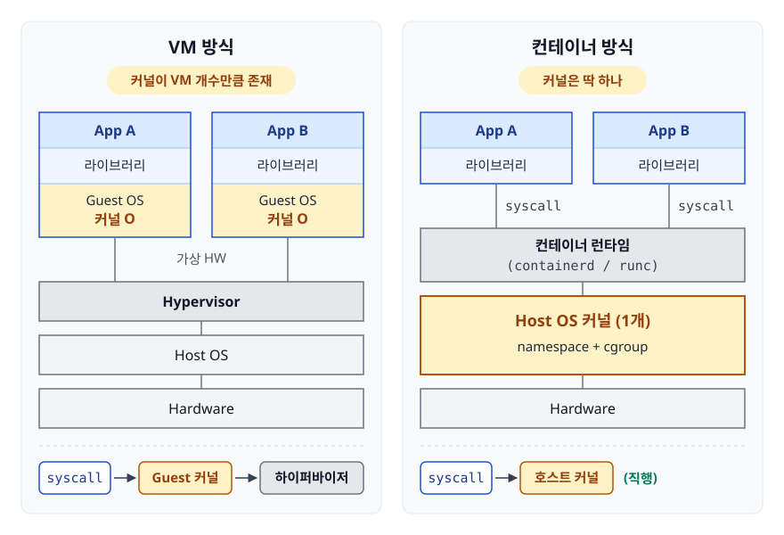
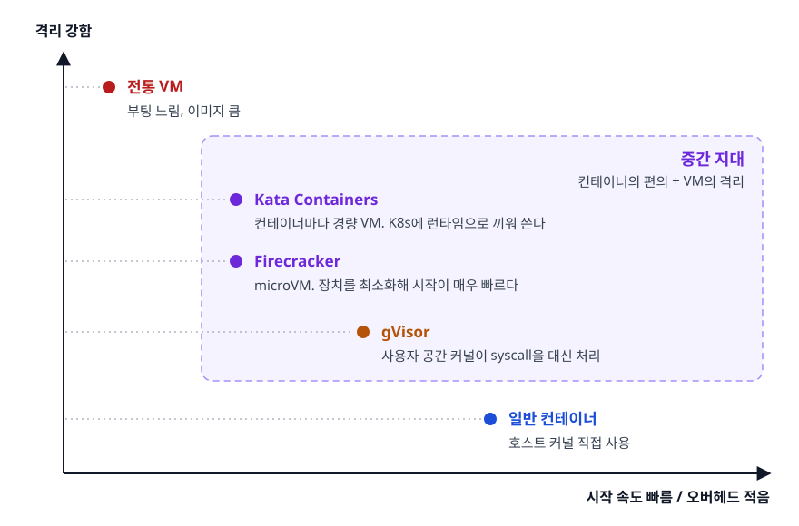

# 컨테이너 vs 가상 머신 (Container vs Virtual Machine)

> "컨테이너는 가볍고 VM은 무겁다"에서 멈추지 않고 그 차이가 **커널을 공유하느냐**에서 나온다는 것과, 리눅스 namespace와 cgroup이 실제로 무슨 일을 하는지, 그래서 언제 컨테이너를 쓰면 안 되는지를 설명할 수 있게 됩니다.

## 학습 목표

- [ ] VM과 컨테이너의 격리 차이를 커널 공유 여부로 설명할 수 있다
- [ ] namespace가 "보이는 것", cgroup이 "쓸 수 있는 양"을 나눈다는 구분을 안다
- [ ] 컨테이너가 부적합한 상황을 세 가지 이상 근거와 함께 말할 수 있다
- [ ] gVisor, Kata, Firecracker 같은 중간 지대가 왜 존재하는지 설명할 수 있다

## 선행 지식

- [01-docker-basics.md](./01-docker-basics.md) - 이미지에 커널이 없다는 이야기를 먼저 보고 오면 좋다
- [가상화와 Hypervisor](../../cloud-fundamentals/02-virtualization-hypervisor.md) - VM 쪽 기초

---

## 1. 왜 이 비교가 중요한가

면접에서 "컨테이너와 VM의 차이"를 물으면 열에 아홉은 "컨테이너는 가볍고 빠릅니다"라고 답합니다.
틀린 말은 아니지만 **결과만 말합니다.** 면접관이 듣고 싶은 것은 원인입니다.

가볍다는 결과는 하나의 설계 결정에서 파생됩니다. **컨테이너는 자기 커널을 갖지 않습니다.**
여기서 크기, 부팅 속도, 밀도, 보안 특성, 사용 가능한 워크로드가 전부 따라 나옵니다.
그래서 이 문서는 커널 이야기부터 시작합니다.

---

## 2. 격리의 두 갈래

### VM: 하드웨어를 흉내 내서 나눈다

하이퍼바이저는 각 VM에게 **가상의 하드웨어 한 세트**(CPU, 메모리, 디스크, NIC)를 줍니다.
VM 안의 Guest OS는 자기가 진짜 컴퓨터 위에 있다고 믿고 **자기 커널을 부팅합니다.**
그래서 리눅스 호스트 위에서 Windows VM을 돌릴 수 있습니다.

### 컨테이너: 커널이 프로세스를 속인다

컨테이너에는 부팅이라는 단계 자체가 없습니다. `docker run`은 그냥 **호스트에서 프로세스를 하나 실행합니다.**
다만 그 프로세스에게 커널이 이렇게 보여 줍니다.

- 프로세스 목록에는 너와 네 자식들만 있다 (다른 컨테이너와 호스트 프로세스는 안 보인다)
- 루트 디렉터리는 이 이미지의 파일시스템이다
- 네트워크 인터페이스는 이것 하나고 IP는 이거다
- 호스트명은 이거다

즉 이 격리는 물리적으로 나뉘지 않습니다. **커널이 보이는 범위를 만들어 줄 뿐입니다.**

<!-- diagram:cloud-container-vs-vm-1 -->


<!-- 위 그림이 대체한 원본 ASCII.
     내용을 고칠 때는 그림도 함께 갱신할 것.
```
     VM 방식                              컨테이너 방식
 ┌──────────┐ ┌──────────┐          ┌──────────┐ ┌──────────┐
 │  App A   │ │  App B   │          │  App A   │ │  App B   │
 ├──────────┤ ├──────────┤          ├──────────┤ ├──────────┤
 │ 라이브러리 │ │ 라이브러리 │          │ 라이브러리 │ │ 라이브러리 │
 ├──────────┤ ├──────────┤          └────┬─────┘ └────┬─────┘
 │ Guest OS │ │ Guest OS │               │ syscall    │ syscall
 │  커널 O   │ │  커널 O   │          ┌────┴────────────┴─────┐
 └────┬─────┘ └────┬─────┘          │  컨테이너 런타임        │
      │ 가상 HW    │                 │  (containerd / runc)  │
 ┌────┴────────────┴─────┐          └───────────┬───────────┘
 │      Hypervisor       │          ┌───────────┴───────────┐
 └───────────┬───────────┘          │   Host OS 커널 (1개)   │
 ┌───────────┴───────────┐          │  namespace + cgroup   │
 │       Host OS         │          └───────────┬───────────┘
 └───────────┬───────────┘          ┌───────────┴───────────┐
 ┌───────────┴───────────┐          │       Hardware        │
 │       Hardware        │          └───────────────────────┘
 └───────────────────────┘

 커널이 VM 개수만큼 존재                커널은 딱 하나
 syscall → Guest 커널 → 하이퍼바이저     syscall → 호스트 커널 (직행)
```
-->

### 비유: 단독주택과 아파트

VM은 단독주택입니다. 집마다 보일러와 상수도 배관이 따로 있습니다. 짓는 비용이 크지만 옆집과 완전히 분리됩니다.
컨테이너는 아파트입니다. 건물 한 채의 설비를 공유하되 각 세대는 독립적으로 삽니다. 입주가 빠르고 밀도가 높습니다.

> **비유의 한계**: 아파트의 벽은 물리적으로 존재하지만 컨테이너의 벽은 **커널이 만들어 주는 논리적 구획**입니다.
> 커널에 취약점이 있으면 벽 자체가 사라집니다. VM은 하이퍼바이저가 뚫려야 하는데 그 코드 표면이 훨씬 작습니다.
> 이 차이가 뒤에서 다룰 "컨테이너를 쓰면 안 되는 경우"의 핵심 근거입니다.

---

## 3. namespace — 보이는 세계를 나눈다

namespace는 커널이 제공하는 **자원을 보는 창**입니다. 같은 커널을 쓰지만 창이 다르면 다른 세상이 보입니다.

| namespace | 무엇을 나누나 | 이게 없으면 |
|-----------|-------------|-----------|
| PID | 프로세스 번호 공간 | 컨테이너에서 호스트 프로세스를 보고 죽일 수 있다 |
| Mount (mnt) | 마운트 지점, 파일시스템 트리 | 호스트 파일시스템 전체가 그대로 보인다 |
| Network (net) | 인터페이스, IP, 라우팅, 포트 | 모든 컨테이너가 같은 포트를 두고 싸운다 |
| UTS | 호스트명, 도메인명 | 컨테이너마다 hostname을 못 준다 |
| IPC | 공유 메모리, 세마포어 | 컨테이너끼리 메모리 세그먼트가 섞인다 |
| User | UID/GID 매핑 | 컨테이너 root가 곧 호스트 root가 된다 |
| Cgroup | cgroup 계층 뷰 | 호스트의 자원 제어 구조가 노출된다 |
| Time | 시스템 부팅 시각 등 | 컨테이너별 시간 오프셋을 못 준다 |

가장 직관적인 것이 PID namespace입니다.

```bash
docker run --rm alpine ps aux
# PID   USER     COMMAND
#   1   root     ps aux           ← 컨테이너 안에서는 자기가 1번
```

컨테이너 안에서 이 프로세스는 PID 1이지만 호스트에서 보면 그냥 수만 번대 프로세스 하나입니다.
**같은 프로세스에 번호가 두 개 붙습니다.** 이 사실이 실무에서 두 가지 결과를 낳습니다.

- PID 1은 리눅스에서 특별합니다. 좀비 프로세스를 거둬 가는 책임이 있고 기본 시그널 핸들러가 없습니다.
  앱을 PID 1로 그냥 띄우면 SIGTERM을 무시해 `docker stop`이 10초 기다렸다 SIGKILL로 죽입니다.
  `docker run --init`으로 최소 init 프로세스를 앞에 두면 간단히 해결됩니다
- 호스트에서 `ps`로 보면 컨테이너 프로세스가 다 보입니다. **격리는 안에서 밖을 못 보는 방향으로만 작동합니다**

직접 확인하려면 네임스페이스 식별자를 비교해 보면 됩니다.

```bash
docker run -d --name t1 alpine sleep 600
PID=$(docker inspect -f '{{.State.Pid}}' t1)

sudo readlink /proc/$PID/ns/pid      # pid:[4026532...]
sudo readlink /proc/1/ns/pid         # pid:[4026531836]  ← 다른 번호 = 다른 네임스페이스
sudo readlink /proc/$PID/ns/uts      # uts도 별도
```

`--network host`처럼 특정 namespace를 공유하도록 끌 수도 있습니다. 이때는 네트워크 격리가 없어지는 대신
NAT 계층이 빠져 성능이 조금 좋아집니다. 격리 수준은 **항목별로 조절합니다.**

---

## 4. cgroup — 쓸 수 있는 양을 나눈다

namespace만으로는 부족합니다. 프로세스가 다른 컨테이너를 못 보더라도 **CPU를 100% 먹고 메모리를 다 쓰면**
같은 호스트의 다른 컨테이너가 죽습니다. cgroup(control group)이 이걸 막습니다.

```
 namespace : "무엇이 보이는가"     →  격리(isolation)
 cgroup    : "얼마나 쓸 수 있는가" →  제한(limit) / 계량(accounting)
```

| 제한 대상 | Docker 옵션 | cgroup v2 인터페이스 |
|----------|------------|-------------------|
| 메모리 | `--memory=512m` | `memory.max` |
| CPU 시간 | `--cpus=1.5` | `cpu.max` (주기당 사용 가능 시간) |
| CPU 코어 지정 | `--cpuset-cpus=0,1` | `cpuset.cpus` |
| 디스크 I/O | `--device-read-bps` | `io.max` |
| 프로세스 수 | `--pids-limit=100` | `pids.max` |

```bash
docker run -d --name limited --memory=256m --cpus=0.5 myapp:1.0
docker stats limited        # LIMIT 열에 256MiB가 보인다
```

메모리 한도를 넘기면 커널의 OOM Killer가 그 컨테이너의 프로세스를 죽입니다.
결과는 종료 코드 137(=128+SIGKILL 9)입니다.

```bash
docker inspect limited --format '{{.State.OOMKilled}} {{.State.ExitCode}}'
# true 137
```

### 함정: 앱은 cgroup 한도를 모른다

컨테이너 안에서 `/proc/meminfo`나 `/proc/cpuinfo`를 읽으면 **호스트 전체 값**이 나옵니다.
`/proc`은 namespace로 완전히 가려지지 않기 때문입니다. 그래서 이런 사고가 납니다.

- **JVM**: 호스트 메모리 기준으로 힙 최대치를 잡아 컨테이너 한도를 넘깁니다 → OOMKilled 반복.
  JDK 10 이상은 컨테이너 인식이 기본 활성이고 `-XX:MaxRAMPercentage`로 한도 대비 비율을 지정합니다
- **Node.js**: old space 한도가 cgroup을 자동 반영하지 않습니다 → `--max-old-space-size`를 한도보다 작게 줍니다
- **Go**: `runtime.NumCPU()`는 CPU 개수(affinity)만 보고 `--cpus` 같은 대역폭 쿼터는 반영하지 않습니다.
  Go 1.25부터 런타임이 cgroup CPU 한도를 GOMAXPROCS 기본값에 반영하지만 그 이전 버전에서는
  라이브러리를 써서 쿼터를 읽어 GOMAXPROCS를 맞추거나 값을 직접 지정해야 합니다
- **스레드풀**: `nproc` 기반으로 워커 수를 정하는 프레임워크는 0.5 코어짜리 컨테이너에서
  수십 개 스레드를 만들어 컨텍스트 스위칭만 하다 끝납니다

**cgroup으로 제한하는 일과 앱이 그 제한을 아는 일은 별개입니다.**
VM에서는 이런 문제가 없습니다. Guest OS가 보는 하드웨어 자체가 축소돼 있기 때문입니다.

---

## 5. 격리의 나머지 절반 — capabilities, seccomp, LSM

namespace와 cgroup만으로는 컨테이너 안의 root를 안전하게 만들 수 없습니다.
그래서 컨테이너 런타임은 세 겹을 더 씁니다.

- **capabilities**: 리눅스 root 권한을 잘게 쪼갠 것. Docker는 기본적으로 위험한 권한을 대부분 떼고 시작합니다.
  더 조이려면 `--cap-drop=ALL` 후 필요한 것만 `--cap-add`로 되돌립니다
- **seccomp**: 프로세스가 호출할 수 있는 시스템 콜 목록을 화이트리스트로 제한합니다.
  커널 공격 표면을 직접 줄이는 가장 효과적인 수단입니다
- **LSM(AppArmor/SELinux)**: 파일·소켓 접근을 정책으로 통제합니다

```bash
docker run --cap-drop=ALL --security-opt no-new-privileges:true myapp:1.0
```

반대로 `--privileged`는 **이 방어선을 전부 해제합니다.** 컨테이너 안 root가 사실상 호스트 root가 됩니다.
"권한 문제 같으니 일단 privileged로 돌려 보자"는 디버깅 습관이 그대로 운영에 남는 사고가 정말 흔합니다.
필요한 권한 한 개만 `--cap-add`로 줘야 옳습니다.

---

## 6. 정량 비교

| 항목 | 가상 머신 | 컨테이너 | 그래서 언제 뭘 쓰나 |
|------|----------|---------|------------------|
| 커널 | VM마다 자기 커널 | 호스트 커널 공유 | 다른 커널/OS가 필요하면 VM |
| 격리 강도 | ★★★ 하이퍼바이저 경계 | ★★☆ 커널 경계 | 신뢰 못 할 코드면 VM |
| 시작 시간 | 수십 초~분(OS 부팅) | 밀리초~초(프로세스 실행) | 초 단위 스케일링이면 컨테이너 |
| 이미지 크기 | GB 단위 | MB 단위 | 잦은 배포·전송이면 컨테이너 |
| 호스트당 밀도 | 수~수십 | 수십~수백 | 자원 효율이면 컨테이너 |
| 오버헤드 | 커널 + 가상 디바이스 계층 | 거의 없음(같은 커널에 syscall 직행) | 지연에 민감하면 컨테이너 |
| 스냅샷/라이브 마이그레이션 | 성숙 | 제한적 | 상태를 통째 옮겨야 하면 VM |
| OS 선택 | 자유 | 호스트 커널과 같은 계열만 | Windows 앱은 Windows 호스트 필요 |

한 줄 결론: **다른 커널이 필요하거나 신뢰 경계를 넘는 코드를 돌린다면 VM, 같은 커널로 충분한 자사 워크로드를
빠르고 촘촘하게 굴린다면 컨테이너.**

그리고 현실에서 이 둘은 대립하지 않습니다. AWS의 관리형 쿠버네티스 워커 노드는 EC2 인스턴스, 즉 **VM**이고
그 안에서 컨테이너가 돕니다. 층위가 다른 기술이지 양자택일이 아닙니다.

---

## 7. 컨테이너를 쓰면 안 되는 경우

### 커널이나 OS 자체가 달라야 할 때

Windows 전용 애플리케이션은 리눅스 호스트의 컨테이너에서 돌지 않습니다.
Windows 컨테이너는 Windows 호스트에서만, 그것도 호스트와 버전 호환성이 맞아야 합니다.
macOS/Windows에서 Docker가 되는 것처럼 보이는 이유는 **뒤에서 리눅스 VM을 하나 띄워 두기 때문**입니다.
Docker Desktop이 느리다는 체감(특히 바인드 마운트 I/O)의 상당 부분이 이 VM 경계에서 나옵니다.

### 커널 모듈이나 특권 동작이 필요할 때

특수 드라이버 로드, 커널 파라미터의 전역 변경, 저수준 네트워크 조작 같은 작업은
호스트 커널 전체에 영향을 줍니다. 컨테이너마다 값을 따로 줄 수 없습니다.
`sysctl` 중 일부(`net.*` 등)는 namespace로 분리되지만 대부분은 호스트 공유입니다.
컨테이너마다 다른 커널 튜닝이 필요하다면 이미 컨테이너의 전제를 벗어난 셈입니다.

### 신뢰할 수 없는 코드를 실행할 때

사용자가 업로드한 임의의 코드를 실행하는 플랫폼이 있습니다. 온라인 코드 실행기, 채점 서버,
서버리스 멀티테넌시 같은 것들인데, 이런 곳을 평범한 컨테이너로만 격리하면 위험합니다.
커널 취약점 하나가 호스트 전체와 같은 호스트의 다른 테넌트로 번집니다.
공격 표면 관점에서 **하이퍼바이저 인터페이스는 좁고 리눅스 시스템 콜 인터페이스는 매우 넓습니다.**

### 규제·인증이 하드웨어 수준 격리를 요구할 때

금융·의료 등에서 테넌트 간 물리적/하이퍼바이저 수준 분리를 요구하는 경우가 있습니다.
기술의 우열보다 요구사항이 기준이므로, 이럴 때는 전용 인스턴스나 VM 기반 설계로 갑니다.

### 상태를 통째로 들고 이동해야 할 때

라이브 마이그레이션은 실행 중 메모리 상태까지 스냅샷을 떠서 다른 호스트로 옮깁니다. 이쪽은 VM이 훨씬 성숙합니다.
컨테이너는 애초에 **죽이고 다시 만든다**는 전제로 설계됐습니다. 그 전제가 성립하지 않는 레거시 애플리케이션은
컨테이너화 자체가 이득보다 비용이 클 수 있습니다.

---

## 8. 중간 지대 — 컨테이너의 편의 + VM의 격리

"빠른 시작과 강한 격리를 동시에"라는 요구가 새로운 계층을 만들었습니다.

<!-- diagram:cloud-container-vs-vm-2 -->


<!-- 위 그림이 대체한 원본 ASCII.
     내용을 고칠 때는 그림도 함께 갱신할 것.
```
 격리 강함
    ▲
    │   전통 VM ●───── 부팅 느림, 이미지 큼
    │
    │   Kata Containers ●──── 컨테이너마다 경량 VM. K8s에 런타임으로 끼워 쓴다
    │   Firecracker    ●──── microVM. 장치를 최소화해 시작이 매우 빠르다
    │
    │   gVisor ●──── 사용자 공간 커널이 syscall을 대신 처리
    │
    │   일반 컨테이너 ●──── 호스트 커널 직접 사용
    │
    └──────────────────────────────────▶ 시작 속도 빠름 / 오버헤드 적음
```
-->

- **gVisor**: Sentry라는 사용자 공간 프로그램이 컨테이너의 시스템 콜을 가로채 직접 처리합니다.
  호스트 커널에 도달하는 시스템 콜 수가 크게 줄어 공격 표면이 작아집니다.
  대신 구현되지 않은 시스템 콜이 있어 **호환성 문제와 I/O 성능 저하**가 트레이드오프입니다.
  Google의 GKE Sandbox가 이 방식을 씁니다
- **Kata Containers**: 컨테이너(또는 Pod)마다 아주 가벼운 VM을 띄우고 그 안에서 실행합니다.
  사용자는 여전히 표준 컨테이너 이미지를 쓰고 kubectl로 다루지만 실제 경계는 하이퍼바이저입니다
- **Firecracker**: AWS가 만든 오픈소스 VMM(가상 머신 모니터)으로, 불필요한 장치 에뮬레이션을 걷어내
  microVM을 매우 빠르게 만듭니다. AWS Lambda와 Fargate의 격리 기반입니다

세 방식 모두 **멀티테넌트 환경에서 남의 코드를 안전하게 돌린다**는 같은 문제를 풉니다.
사내 서비스만 돌리는 일반적인 회사라면 여기까지 갈 일은 드물고 표준 컨테이너에
seccomp·capability 최소화·non-root 실행을 제대로 적용하는 것이 먼저입니다.

과금 관점에서 보면 서버리스 계열(Lambda, Fargate)은 인스턴스를 시간 단위로 빌리는 대신
**요청 수와 실제 실행 시간·할당 자원에 비례해 과금하는 모델**입니다. microVM의 빠른 시작이
이런 과금 모델을 기술적으로 가능하게 만들었다는 점만 기억하면 됩니다.

---

## 9. 실무에서는

### 커널을 공유한다 = CPU 아키텍처도 맞아야 한다

Apple Silicon 노트북에서 그냥 빌드하면 arm64 이미지가 나옵니다. 이걸 x86_64 서버에 올리면 컨테이너가
시작하자마자 `exec format error`를 뱉습니다. 이미지에 커널이 없다는 말은 곧 **이미지의 바이너리가 호스트
커널·CPU에서 그대로 실행돼야 한다**는 뜻이라, 커널 계열뿐 아니라 아키텍처도 일치해야 합니다.

```bash
docker buildx build --platform linux/amd64,linux/arm64 -t registry.example.com/app:1.0 --push .
docker image inspect nginx --format '{{.Architecture}}'   # 지금 이미지가 어느 아키텍처인지
```

### CI에서 컨테이너 안에 컨테이너를 빌드할 때

젠킨스나 GitLab 러너가 이미 컨테이너인 경우가 많습니다. 여기서 이미지를 빌드하려고
`-v /var/run/docker.sock:/var/run/docker.sock`으로 호스트 도커 소켓을 마운트하는 방식이 흔한데,
이건 그 컨테이너에 **호스트 데몬 전체를 조작할 권한**을 주는 것과 같습니다. 커널을 공유하는 구조에서
소켓 하나가 곧 호스트 권한이 됩니다. 대안으로는 `--privileged`가 필요한 DinD를 쓰거나,
데몬 없이 이미지를 만드는 빌더(BuildKit rootless, Kaniko 등)를 씁니다.

### 쿠버네티스의 requests/limits는 결국 cgroup이다

Pod에 적은 `resources.limits`는 노드에서 cgroup 값으로 내려갑니다. 여기서 메모리와 CPU의 동작이
다르다는 점이 실무에서 자주 문제가 됩니다.

- 메모리 한도 초과 → **죽입니다.** OOMKilled, exit 137
- CPU 한도 초과 → **죽이지 않고 늦춥니다.** 스로틀링이 걸려 레이턴시만 나빠집니다

그래서 CPU 관련 장애는 로그에 흔적이 남지 않습니다. `docker stats`나 cgroup의 스로틀링 카운터를
직접 봐야 원인이 잡힙니다.

---

## 10. 장애 시나리오

### 시나리오 1 — 한 컨테이너 때문에 호스트 전체가 느려졌다

```bash
docker stats --no-stream          # 특정 컨테이너 CPU 380%
docker top <container>            # 어떤 프로세스가 도는지
```

**원인**: 자원 제한을 걸지 않았습니다. cgroup 제한이 없으면 컨테이너는 호스트 자원 전부를 놓고 경쟁합니다.
namespace는 격리만 담당하고 **제한은 걸지 않습니다.**
**대응**: 즉시로는 해당 컨테이너를 재생성하며 `--cpus`, `--memory`를 지정합니다.
근본적으로는 모든 워크로드에 요청/제한을 필수로 두는 정책을 세웁니다(쿠버네티스의 requests/limits가 같은 개념).

### 시나리오 2 — 로컬에선 되는데 컨테이너에서만 메모리가 터진다

```bash
docker inspect app --format '{{.State.OOMKilled}} {{.State.ExitCode}}'
# true 137
docker exec app sh -c 'cat /sys/fs/cgroup/memory.max'    # 536870912 (512MB)
docker exec app free -m                                   # 호스트 전체 메모리가 보인다
```

**원인**: 앱이 `free`/`/proc/meminfo`가 알려 준 호스트 메모리를 기준으로 버퍼나 힙을 잡았는데
실제 한도는 cgroup 값이었습니다.
**대응**: 런타임에 컨테이너 한도를 알려 줍니다(JVM은 `MaxRAMPercentage`, Node는 `--max-old-space-size`).
그리고 컨테이너 안에서는 `free` 대신 cgroup 값을 신뢰합니다.

### 시나리오 3 — 컨테이너에서 마운트한 파일에 접근이 안 된다

```bash
docker exec app id                 # uid=1000(app)
ls -ln ./data                      # 소유자 uid=0
```

**원인**: 이미지에서 `USER`로 non-root를 쓰는데 호스트 디렉터리 소유자가 root입니다.
컨테이너와 호스트는 **같은 커널의 같은 UID 공간**을 쓰므로 UID 숫자가 그대로 비교됩니다.
**대응**: 호스트 디렉터리 소유권을 컨테이너 UID에 맞추거나, user namespace 리매핑을 설정합니다.
`chmod 777`은 문제를 덮을 뿐 권한 모델을 망가뜨립니다.

---

## 11. 면접 포인트

> 면접에서 이 주제가 나오면 이렇게 답합니다

**Q. 컨테이너와 VM의 차이를 설명해 주세요.**
A. 가장 근본적인 차이는 커널을 공유하느냐입니다. VM은 하이퍼바이저가 가상 하드웨어를 제공하고 각 VM이
자기 커널을 부팅하므로 격리가 강하지만 부팅이 느리고 이미지가 큽니다. 컨테이너는 호스트 커널 하나를
공유하면서 namespace로 보이는 자원을, cgroup으로 쓸 수 있는 양을 나눈 프로세스일 뿐이라 시작이 즉시고
오버헤드가 거의 없습니다. 가볍다는 특성은 결과이고 원인은 커널 공유입니다.
- 꼬리 질문: "그럼 컨테이너가 항상 유리한가요?" → 커널 공유가 곧 공유 취약점이므로
  신뢰 경계를 넘는 멀티테넌시에는 VM이나 gVisor/Kata 같은 샌드박스가 필요하다고 답합니다.

**Q. namespace와 cgroup의 역할 차이는?**
A. namespace는 프로세스가 보는 자원의 범위를 나눕니다. PID, 마운트, 네트워크, UTS, IPC, User 등이 있고
컨테이너 안에서 PID 1로 보이는 프로세스가 호스트에서는 다른 번호인 것이 대표적인 예입니다.
cgroup은 CPU, 메모리, I/O, 프로세스 수를 얼마나 쓸 수 있는지 제한하고 계량합니다.
namespace만 있으면 옆 컨테이너가 안 보일 뿐 자원을 다 먹어 치울 수 있어서 둘 다 필요합니다.
- 꼬리 질문: "메모리 한도를 넘기면 어떻게 되나요?" → 커널 OOM Killer가 종료시키고 exit code 137이 남습니다.
  `docker inspect`의 `OOMKilled` 필드로 확인한다고 덧붙입니다.

**Q. 컨테이너를 쓰면 안 되는 경우를 말해 보세요.**
A. 첫째, 호스트와 다른 커널이나 OS가 필요할 때입니다. 리눅스 호스트에서 Windows 애플리케이션은 못 돌립니다.
둘째, 커널 모듈 로드나 전역 커널 파라미터 변경처럼 특권 동작이 필요할 때입니다.
셋째, 신뢰할 수 없는 외부 코드를 실행하는 멀티테넌트 환경입니다. 커널 취약점 하나가 전체로 번지기 때문에
이 경우엔 VM이나 gVisor, Kata Containers, Firecracker 같은 샌드박스 런타임을 검토합니다.
- 꼬리 질문: "Firecracker가 뭔가요?" → AWS가 만든 microVM용 VMM으로 장치를 최소화해 VM 시작을
  매우 빠르게 만들었고 Lambda와 Fargate의 격리 기반이라고 답합니다.

**Q. `--privileged`는 왜 위험한가요?**
A. capabilities 제한, seccomp 프로필, 디바이스 접근 제한 같은 방어 계층을 사실상 전부 해제하기 때문입니다.
컨테이너 안 root가 호스트 자원에 광범위하게 접근할 수 있어 컨테이너 탈출 위험이 커집니다.
특정 권한이 필요하다면 `--cap-add`로 그 하나만 주는 것이 원칙이고 기본은 `--cap-drop=ALL`에
non-root 실행을 더하는 방향입니다.

---

## 자주 하는 실수

| 실수 | 왜 틀렸나 | 올바른 이해 |
|------|----------|-----------|
| "컨테이너는 초경량 VM이다" | VM은 커널을 부팅하고 컨테이너는 프로세스일 뿐 | 종류가 다른 기술이지 크기 차이가 아니다 |
| "격리됐으니 자원 경합은 없다" | namespace는 시야만 나눈다 | cgroup으로 제한을 걸어야 실제로 나뉜다 |
| 컨테이너 안 `free`/`nproc` 신뢰 | `/proc`은 호스트 값을 보여준다 | 런타임에 cgroup 한도를 명시해 준다 |
| "컨테이너 root니까 안전" | UID 공간은 호스트와 공유된다 | non-root 실행 + cap 최소화 + user namespace |
| 문제 생기면 `--privileged` | 방어 계층을 전부 끄는 것 | 필요한 capability 하나만 추가한다 |
| "컨테이너를 쓰면 VM은 필요 없다" | 클라우드 노드 자체가 VM이다 | 층위가 다릅니다. 함께 쓰는 것이 표준이다 |

---

## 한 줄 정리

VM은 하이퍼바이저가 하드웨어를 나눠 각자 커널을 부팅하게 하는 방식이고, 컨테이너는 하나의 커널이
namespace로 시야를, cgroup으로 사용량을 나눠 준 프로세스입니다. 이 커널 공유 여부에서
속도·크기·밀도·보안 특성과 "쓰면 안 되는 경우"가 전부 파생됩니다.

---

## 연관 개념

- [01-docker-basics.md](./01-docker-basics.md) - 이미지에 커널이 없다는 말의 출발점
- [02-docker-compose.md](./02-docker-compose.md) - 격리된 컨테이너들을 하나의 네트워크로 묶기
- [qna-docker.md](./qna-docker.md) - Docker 면접 질문 모음
- [가상화와 Hypervisor](../../cloud-fundamentals/02-virtualization-hypervisor.md) - Type 1/Type 2와 전가상화·반가상화
- [Kubernetes](../../kubernetes/README.md) - VM 노드 위에 컨테이너를 배치하는 층
- [리눅스와 네트워킹](../../linux-networking/README.md) - namespace/cgroup의 리눅스 배경지식
